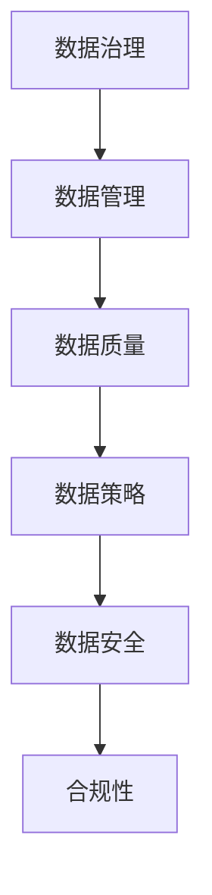
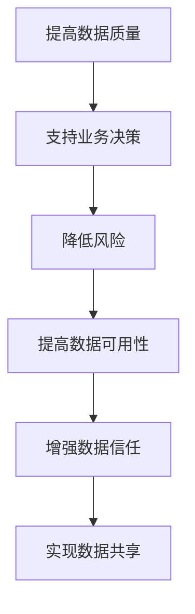
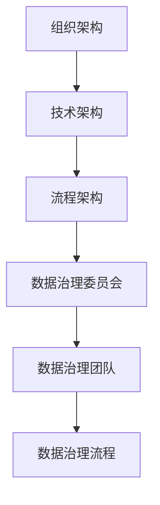
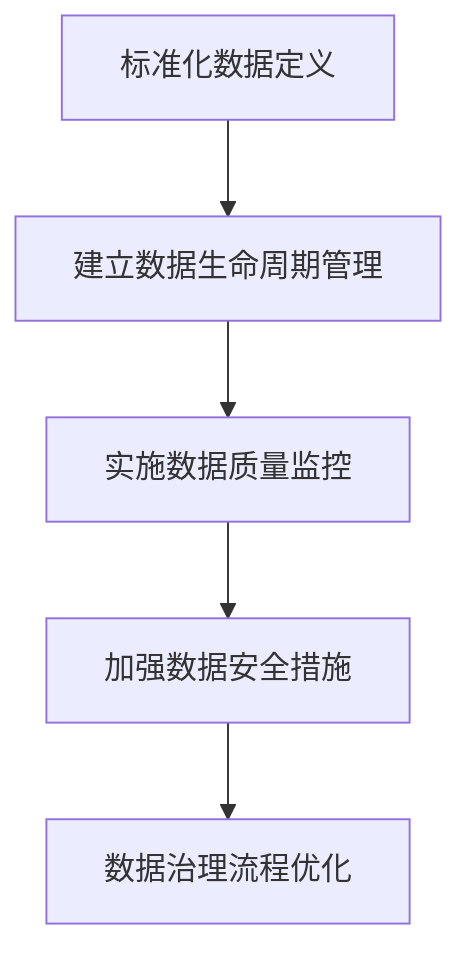
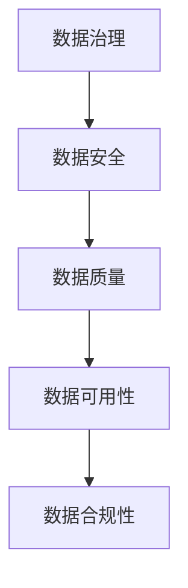
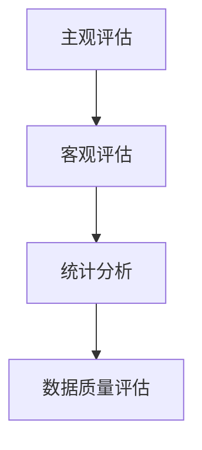
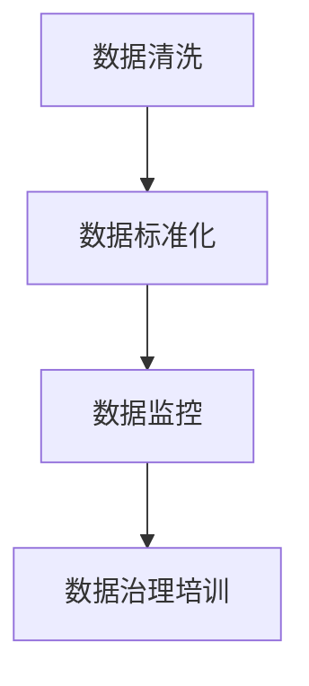
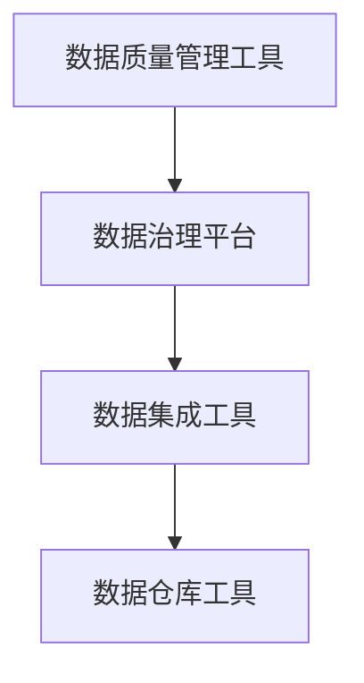
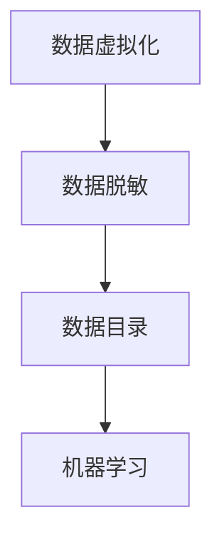
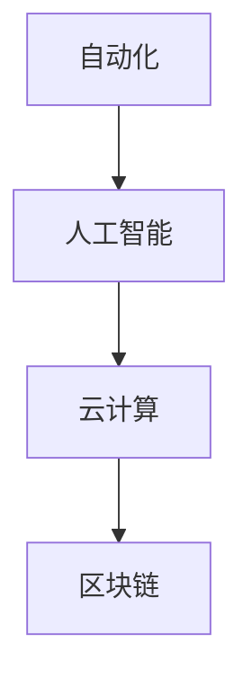

                 

# AI创业公司的数据治理策略优化

> 关键词：AI创业公司，数据治理，数据质量管理，数据治理工具，数据治理策略，数据治理架构，数据安全

> 摘要：本文详细探讨了AI创业公司在数据治理方面所面临的挑战和应对策略。首先，我们介绍了数据治理的概念、重要性及其基本原则。接着，分析了数据治理的架构与流程，并详细阐述了数据质量管理的定义、方法和策略。在此基础上，本文重点讨论了AI创业公司的数据特点与挑战，以及如何制定和实施数据治理策略。最后，通过两个实践案例展示了数据治理策略在AI创业公司中的实际应用与成效。

----------------------------------------------------------------

## 第一部分：数据治理概述

### 第1章：数据治理的概念与重要性

#### 1.1 数据治理的定义

数据治理是指一套系统化的方法和程序，用于确保组织内的数据能够被有效地管理、使用和保护。它包括数据管理、数据质量、数据策略、数据安全和合规性等方面。

Mermaid流程图：



#### 1.2 数据治理的重要性

数据治理对于任何组织，特别是AI创业公司，具有至关重要的意义。以下是数据治理的几个关键重要性：

1. **提高数据质量**：确保数据的准确性、完整性、一致性和及时性，支持业务决策。
2. **降低风险**：通过数据安全措施保护数据，减少数据泄露和滥用的风险。
3. **提高数据可用性**：通过有效的数据治理，使数据更容易获取和共享，支持业务流程。
4. **增强数据信任**：确保数据的真实性和可靠性，增强用户对数据的信任。
5. **实现数据共享**：打破数据孤岛，促进跨部门、跨系统的数据共享，提高整体效率。

Mermaid流程图：



#### 1.3 数据治理的基本原则

为了实现有效的数据治理，组织应遵循以下基本原则：

1. **明确数据治理目标**：确保数据治理活动与组织的业务目标保持一致。
2. **建立数据治理架构**：设计一个结构化的数据治理架构，确保数据治理活动能够系统化和持续进行。
3. **定义数据治理流程**：明确数据治理活动的具体步骤和流程，确保数据治理工作的规范化。
4. **确保数据安全与合规**：采取必要的数据安全措施，确保数据隐私和合规性。
5. **培养数据治理文化**：推动数据治理文化的建立，使全体员工认识到数据治理的重要性。

### 第2章：数据治理的架构与流程

#### 2.1 数据治理架构的设计

数据治理架构是组织内部数据治理活动的蓝图，包括组织架构、技术架构和流程架构三个方面。

Mermaid流程图：



#### 2.2 数据治理流程的优化

数据治理流程的优化是提高数据治理效率和质量的关键。以下是一些优化策略：

1. **标准化数据定义和格式**：确保不同系统和部门使用相同的数据定义和格式，减少数据冗余和错误。
2. **建立数据生命周期管理**：对数据进行分类、存储、备份、归档和销毁，确保数据的完整性和可用性。
3. **实施数据质量监控和改进**：定期检查数据质量，发现并解决数据问题，提高数据准确性。
4. **加强数据安全措施**：采取加密、访问控制、数据备份等措施，确保数据安全。

Mermaid流程图：



#### 2.3 数据治理与数据安全的关系

数据治理与数据安全密切相关，二者相辅相成。数据治理确保数据质量、可用性和合规性，而数据安全措施则保护数据免受未经授权的访问、泄露和损坏。

Mermaid流程图：



### 第3章：数据质量管理

#### 3.1 数据质量的定义与重要性

数据质量是指数据的准确性、完整性、一致性、及时性和可靠性等方面的特征。高质量的数据是组织决策和业务运营的基础。

1. **准确性**：数据值是否与实际业务相符。
2. **完整性**：数据是否包含所有必要的字段和记录。
3. **一致性**：数据在不同系统和部门之间是否保持一致。
4. **及时性**：数据是否在需要的时间内提供。
5. **可靠性**：数据是否真实可信。

数据质量的重要性在于：

1. **支持业务决策**：高质量的数据使决策更加准确和有效。
2. **提高业务效率**：减少因数据问题导致的工作重复和错误。
3. **降低成本**：避免因数据问题导致的业务损失和合规风险。

#### 3.2 数据质量评估的方法

数据质量评估是衡量数据质量的重要步骤。以下是一些常见的数据质量评估方法：

1. **主观评估**：通过人工检查数据，评估数据的准确性、完整性和一致性。
2. **客观评估**：使用自动化工具和技术，评估数据的完整性、一致性和及时性。
3. **统计分析**：使用统计分析方法，评估数据的准确性和可靠性。

Mermaid流程图：



#### 3.3 数据质量改进的策略

数据质量改进是持续性的工作，以下是一些常用的数据质量改进策略：

1. **数据清洗**：删除重复数据、修正错误数据、填充缺失数据。
2. **数据标准化**：统一数据格式和定义，提高数据一致性。
3. **数据监控**：建立数据质量监控机制，及时发现和解决数据问题。
4. **数据治理培训**：提高员工的数据治理意识和能力。

Mermaid流程图：



### 第4章：数据治理工具与技术

#### 4.1 数据治理工具的选择

选择合适的工具是实施数据治理的关键。以下是一些常见的数据治理工具：

1. **数据质量管理工具**：用于评估、监控和改进数据质量。
2. **数据治理平台**：提供全面的数据治理功能，包括数据管理、数据安全和数据合规性。
3. **数据集成工具**：用于整合来自不同来源的数据。
4. **数据仓库工具**：用于存储和管理大量数据。

Mermaid流程图：



#### 4.2 数据治理技术的应用

数据治理技术在AI创业公司中具有广泛的应用。以下是一些常见的数据治理技术：

1. **数据虚拟化**：通过虚拟化技术，将多个数据源整合为一个统一的视图。
2. **数据脱敏**：对敏感数据进行加密、遮挡或替换，保护数据隐私。
3. **数据目录**：建立数据目录，记录数据来源、定义、使用等信息，提高数据可追溯性。
4. **机器学习**：使用机器学习算法，自动评估和改进数据质量。

Mermaid流程图：



#### 4.3 数据治理技术的未来发展趋势

数据治理技术的未来发展趋势包括：

1. **自动化**：通过自动化技术，提高数据治理效率和质量。
2. **人工智能**：利用人工智能技术，实现智能数据治理。
3. **云计算**：通过云计算技术，实现数据治理的弹性扩展和高效管理。
4. **区块链**：利用区块链技术，确保数据的不可篡改性和透明性。

Mermaid流程图：



## 第二部分：AI创业公司的数据治理策略

### 第5章：AI创业公司的数据特点与挑战

#### 5.1 AI创业公司的数据特点

AI创业公司的数据具有以下特点：

1. **多样化**：包括结构化数据、半结构化数据和非结构化数据。
2. **海量**：数据量庞大，每天产生大量新数据。
3. **动态**：数据类型和结构不断变化，需要实时处理和分析。
4. **复杂性**：涉及多个数据源和系统，数据集成和治理更具挑战性。
5. **价值高**：数据是AI创业公司的核心资产，具有重要的商业价值。

#### 5.2 AI创业公司的数据挑战

AI创业公司在数据治理方面面临以下挑战：

1. **数据质量差**：数据来源多样，数据质量难以保证。
2. **数据安全风险**：数据泄露和滥用的风险较高。
3. **数据孤岛**：不同系统和部门之间的数据难以共享和整合。
4. **数据管理成本高**：数据治理和管理需要大量人力和资源投入。
5. **合规性问题**：在数据收集、存储和使用过程中，需遵守相关法律法规。

#### 5.3 数据治理在AI创业公司中的关键作用

数据治理在AI创业公司中具有关键作用：

1. **提高数据质量**：通过数据治理，确保数据的准确性、完整性和一致性。
2. **降低安全风险**：通过数据治理，加强数据安全措施，保护数据隐私。
3. **促进数据共享**：通过数据治理，打破数据孤岛，实现跨部门、跨系统的数据共享。
4. **降低管理成本**：通过数据治理，优化数据管理流程，降低管理成本。
5. **确保合规性**：通过数据治理，遵守相关法律法规，减少合规风险。

### 第6章：数据治理策略制定

#### 6.1 数据治理策略的制定流程

制定有效的数据治理策略需要遵循以下流程：

1. **明确数据治理目标**：根据组织战略和业务需求，明确数据治理目标。
2. **评估数据现状**：分析现有数据资产、数据治理能力和存在的问题。
3. **制定数据治理架构**：设计数据治理架构，包括组织架构、技术架构和流程架构。
4. **制定数据治理流程**：明确数据治理流程，包括数据收集、存储、处理、共享和销毁等环节。
5. **制定数据治理政策**：制定数据治理政策，确保数据治理活动符合法律法规和行业标准。
6. **培训与推广**：对员工进行数据治理培训，提高数据治理意识和能力。
7. **实施与监控**：实施数据治理策略，并持续监控和改进。

#### 6.2 数据治理策略的核心要素

有效的数据治理策略应包括以下核心要素：

1. **数据质量管理**：确保数据的准确性、完整性和一致性。
2. **数据安全与合规**：采取必要的安全措施，遵守相关法律法规。
3. **数据共享与整合**：打破数据孤岛，实现跨部门、跨系统的数据共享和整合。
4. **数据生命周期管理**：对数据进行分类、存储、备份、归档和销毁。
5. **技术支持**：选择合适的数据治理工具和技术，提高数据治理效率。
6. **组织支持**：建立数据治理委员会和团队，提供必要的资源和培训。

#### 6.3 数据治理策略的案例分析

以下是一个AI创业公司的数据治理策略案例分析：

**背景**：该公司是一家专注于机器学习的初创公司，数据是其核心资产。然而，由于数据来源多样、质量参差不齐，数据治理成为一大挑战。

**数据治理目标**：提高数据质量、确保数据安全、促进数据共享和整合。

**数据治理架构**：

1. **组织架构**：成立数据治理委员会，负责制定和监督数据治理策略。数据治理团队负责具体的数据治理工作。
2. **技术架构**：使用数据治理平台，包括数据质量管理工具、数据集成工具和数据仓库工具。
3. **流程架构**：明确数据治理流程，包括数据收集、清洗、存储、处理、共享和销毁等环节。

**数据治理流程**：

1. **数据收集**：收集来自不同来源的数据，包括内部数据和外部数据。
2. **数据清洗**：使用数据质量管理工具，清洗和转换数据，确保数据的准确性、完整性和一致性。
3. **数据存储**：将清洗后的数据存储在数据仓库中，便于后续处理和分析。
4. **数据处理**：使用机器学习算法，对数据进行处理和分析，提取有价值的信息。
5. **数据共享**：通过数据治理平台，实现跨部门、跨系统的数据共享和整合。
6. **数据销毁**：定期对过期和不再需要的数据进行销毁，确保数据安全。

**效果评估**：

1. **数据质量提高**：数据质量问题显著改善，数据准确性、完整性和一致性得到保证。
2. **数据安全增强**：采取必要的安全措施，数据泄露和滥用的风险降低。
3. **数据共享和整合**：实现跨部门、跨系统的数据共享和整合，提高整体效率。
4. **管理成本降低**：优化数据治理流程，降低管理成本。

### 第7章：数据治理实施与优化

#### 7.1 数据治理实施的关键步骤

数据治理实施需要遵循以下关键步骤：

1. **建立数据治理组织**：成立数据治理委员会和团队，明确职责和权限。
2. **制定数据治理政策**：制定数据治理政策，确保数据治理活动符合法律法规和行业标准。
3. **选择合适工具**：选择合适的数据治理工具和技术，提高数据治理效率。
4. **培训与推广**：对员工进行数据治理培训，提高数据治理意识和能力。
5. **实施数据治理流程**：明确数据治理流程，确保数据治理活动规范化。
6. **监控与改进**：持续监控数据治理效果，发现问题并及时改进。

#### 7.2 数据治理优化的方法

数据治理优化是提高数据治理效果和质量的关键。以下是一些常用的数据治理优化方法：

1. **流程优化**：通过流程优化，减少不必要的环节和步骤，提高数据治理效率。
2. **技术升级**：采用新技术，提高数据治理能力，如自动化、人工智能、区块链等。
3. **培训与文化建设**：加强员工数据治理培训，推动数据治理文化的建立。
4. **数据质量管理**：通过数据质量管理，提高数据的准确性、完整性和一致性。
5. **安全措施加强**：加强数据安全措施，降低数据泄露和滥用的风险。

#### 7.3 数据治理实施中的常见问题及解决策略

在数据治理实施过程中，常见问题包括：

1. **数据质量问题**：解决策略：加强数据质量管理，采用数据质量管理工具，定期评估和改进。
2. **数据安全风险**：解决策略：加强数据安全措施，如数据加密、访问控制、备份等。
3. **数据共享困难**：解决策略：优化数据治理流程，建立数据目录，提高数据可追溯性。
4. **管理成本高**：解决策略：优化流程，采用自动化技术，提高数据治理效率。
5. **员工意识不足**：解决策略：加强培训与文化建设，提高员工数据治理意识和能力。

### 第8章：数据治理效果评估与持续改进

#### 8.1 数据治理效果评估的方法

数据治理效果评估是衡量数据治理活动成效的重要手段。以下是一些常见的数据治理效果评估方法：

1. **业务目标达成度**：评估数据治理是否支持业务目标的实现。
2. **数据质量改进情况**：评估数据质量的改进程度，如准确性、完整性、一致性等。
3. **数据利用率**：评估数据的利用率，如数据共享次数、分析报告数量等。
4. **数据安全事件发生次数**：评估数据安全事件的发生频率和影响程度。
5. **用户满意度**：评估用户对数据治理效果的满意度。
6. **数据治理成本**：评估数据治理的成本效益。

#### 8.2 数据治理效果评估的指标

以下是一些常见的数据治理效果评估指标：

1. **数据准确性**：数据准确的百分比。
2. **数据完整性**：数据完整的百分比。
3. **数据一致性**：数据一致的百分比。
4. **数据及时性**：数据及时提供的百分比。
5. **数据可靠性**：数据可靠的百分比。
6. **数据利用率**：数据被利用的频率和程度。
7. **安全事件发生次数**：安全事件发生的频率和影响程度。
8. **用户满意度**：用户对数据治理效果的满意度评分。

#### 8.3 数据治理的持续改进策略

数据治理的持续改进策略包括：

1. **定期评估与反馈**：定期评估数据治理效果，收集反馈意见，发现问题并改进。
2. **持续培训与文化建设**：持续加强员工数据治理培训，推动数据治理文化的建立。
3. **技术升级与优化**：采用新技术，提高数据治理能力，如自动化、人工智能、区块链等。
4. **流程优化与简化**：优化数据治理流程，减少不必要的环节和步骤，提高效率。
5. **数据质量管理**：加强数据质量管理，采用数据质量管理工具，定期评估和改进。
6. **安全措施加强**：加强数据安全措施，降低数据泄露和滥用的风险。

### 第三部分：数据治理实践案例

#### 第9章：数据治理实践案例一：XX公司

#### 9.1 XX公司数据治理的背景

XX公司是一家专注于人工智能技术的创业公司，数据是其核心竞争力。然而，由于数据来源多样、质量参差不齐，数据治理成为一大挑战。

#### 9.2 XX公司数据治理的策略

XX公司采取了以下数据治理策略：

1. **建立数据治理组织**：成立数据治理委员会，负责制定和监督数据治理策略。数据治理团队负责具体的数据治理工作。
2. **制定数据治理政策**：制定数据治理政策，明确数据收集、存储、处理、共享和销毁等环节的规范。
3. **选择合适工具**：选择数据治理平台，包括数据质量管理工具、数据集成工具和数据仓库工具。
4. **培训与推广**：对员工进行数据治理培训，提高数据治理意识和能力。
5. **实施数据治理流程**：明确数据治理流程，确保数据治理活动规范化。
6. **监控与改进**：持续监控数据治理效果，收集反馈意见，发现问题并改进。

#### 9.3 XX公司数据治理的成效

XX公司的数据治理策略取得了显著成效：

1. **数据质量提高**：数据准确性、完整性和一致性得到显著改善，数据质量问题大幅减少。
2. **数据安全增强**：采取必要的安全措施，数据泄露和滥用的风险降低。
3. **数据共享与整合**：实现跨部门、跨系统的数据共享和整合，提高整体效率。
4. **管理成本降低**：优化数据治理流程，降低管理成本。
5. **用户满意度提升**：用户对数据治理效果的满意度显著提高。

#### 第10章：数据治理实践案例二：YY公司

#### 10.1 YY公司数据治理的背景

YY公司是一家专注于自然语言处理技术的创业公司，数据是其核心竞争力。然而，由于数据来源多样、质量参差不齐，数据治理成为一大挑战。

#### 10.2 YY公司数据治理的策略

YY公司采取了以下数据治理策略：

1. **建立数据治理组织**：成立数据治理委员会，负责制定和监督数据治理策略。数据治理团队负责具体的数据治理工作。
2. **制定数据治理政策**：制定数据治理政策，明确数据收集、存储、处理、共享和销毁等环节的规范。
3. **选择合适工具**：选择数据治理平台，包括数据质量管理工具、数据集成工具和数据仓库工具。
4. **培训与推广**：对员工进行数据治理培训，提高数据治理意识和能力。
5. **实施数据治理流程**：明确数据治理流程，确保数据治理活动规范化。
6. **监控与改进**：持续监控数据治理效果，收集反馈意见，发现问题并改进。

#### 10.3 YY公司数据治理的成效

YY公司的数据治理策略取得了显著成效：

1. **数据质量提高**：数据准确性、完整性和一致性得到显著改善，数据质量问题大幅减少。
2. **数据安全增强**：采取必要的安全措施，数据泄露和滥用的风险降低。
3. **数据共享与整合**：实现跨部门、跨系统的数据共享和整合，提高整体效率。
4. **管理成本降低**：优化数据治理流程，降低管理成本。
5. **用户满意度提升**：用户对数据治理效果的满意度显著提高。

### 附录

#### 附录A：数据治理相关工具介绍

#### A.1 数据质量管理工具

以下是一些常见的数据质量管理工具：

1. **Data Quality Manager**：提供数据清洗、转换、验证和监控功能。
2. **Informatica Data Quality**：支持数据质量评估、监控和改进。
3. **Talend Data Quality**：提供数据清洗、转换和集成功能。
4. **IBM InfoSphere QualityStage**：支持数据质量处理和分析。

#### A.2 数据治理平台

以下是一些常见的数据治理平台：

1. **IBM InfoSphere Master Data Management**：提供主数据管理功能。
2. **Oracle Enterprise Data Management**：支持数据质量管理、数据安全和合规性。
3. **Informatica Master Data Management**：提供主数据管理、数据质量和数据安全功能。
4. **SAP Information Steward**：支持数据质量管理、数据安全和合规性。

#### A.3 数据治理相关开源工具

以下是一些常见的数据治理相关开源工具：

1. **Apache Atlas**：提供数据分类、元数据和数据安全功能。
2. **Apache Kafka**：支持实时数据流处理和集成。
3. **Apache NiFi**：提供数据集成、处理和监控功能。
4. **Apache Hive**：提供数据仓库和分析功能。

#### 附录B：数据治理参考文献与推荐阅读

以下是一些关于数据治理的参考文献和推荐阅读：

1. **《数据治理实践指南》**：李明辉 著
2. **《大数据治理》**：王珊，段永朝 著
3. **《数据治理：战略、方法与实践》**：斯蒂芬·斯威夫特 著
4. **《大数据时代的数据治理》**：艾瑞咨询集团 著
5. **《数据治理实践手册》**：中国信息通信研究院 著

----------------------------------------------------------------

作者：AI天才研究院/AI Genius Institute & 禅与计算机程序设计艺术 /Zen And The Art of Computer Programming

本文旨在为AI创业公司在数据治理方面提供一套全面的策略和实施方法。通过详细探讨数据治理的概念、架构、流程、质量管理以及实践案例，希望能够帮助AI创业公司更好地管理数据，提升业务竞争力。同时，本文也呼吁更多的创业公司重视数据治理，将其作为企业发展的关键要素。未来，随着人工智能技术的不断进步，数据治理将更加重要，也将成为AI创业公司成功的关键因素之一。

----------------------------------------------------------------

### 后记

本文《AI创业公司的数据治理策略优化》系统地阐述了数据治理的概念、架构、流程、质量管理以及实践案例，为AI创业公司提供了全面的策略和实施方法。以下是本文的核心要点和总结：

1. **数据治理的重要性**：数据治理对于任何组织，特别是AI创业公司，具有至关重要的意义。它包括数据管理、数据质量、数据策略、数据安全等方面，确保数据的有效管理和利用。

2. **数据治理的架构与流程**：数据治理架构包括组织架构、技术架构和流程架构。流程架构是数据治理的核心，包括数据收集、清洗、存储、处理、共享和销毁等环节。

3. **数据质量管理**：数据质量是数据治理的关键。通过数据质量管理，确保数据的准确性、完整性、一致性、及时性和可靠性。

4. **数据治理工具与技术**：选择合适的数据治理工具和技术，如数据质量管理工具、数据治理平台、数据集成工具和数据仓库工具，有助于提高数据治理效率。

5. **AI创业公司的数据特点与挑战**：AI创业公司的数据多样化、海量、动态和复杂，面临数据质量差、数据安全风险、数据孤岛等问题。

6. **数据治理策略制定与实施**：制定数据治理策略需要明确数据治理目标、评估数据现状、制定数据治理架构、数据治理流程、数据治理政策，并实施与持续优化。

7. **数据治理效果评估与持续改进**：通过定期评估数据治理效果，收集反馈意见，发现问题并改进，确保数据治理策略的有效实施。

8. **数据治理实践案例**：通过XX公司和YY公司的数据治理实践案例，展示了数据治理策略在AI创业公司中的实际应用与成效。

本文旨在为AI创业公司提供一套全面的数据治理策略，帮助其在竞争激烈的市场中更好地管理数据，提升业务竞争力。希望本文能够为读者带来启示，促进数据治理的实践与发展。在未来，随着人工智能技术的不断进步，数据治理将更加重要，也将成为AI创业公司成功的关键因素之一。

再次感谢您的阅读，期待您的反馈和意见。如有任何问题，请随时联系。

作者：AI天才研究院/AI Genius Institute & 禅与计算机程序设计艺术 /Zen And The Art of Computer Programming

----------------------------------------------------------------

### 致谢

本文《AI创业公司的数据治理策略优化》的完成，离不开诸多人士的支持和帮助。在此，我衷心感谢以下人员：

首先，感谢我的同事和团队成员，你们在数据治理方面的专业知识和丰富经验，为本文的撰写提供了宝贵的参考和灵感。

其次，感谢我的导师和前辈们，你们的教诲和指导，使我在数据治理领域取得了长足的进步。感谢你们的耐心解答和无私分享，让我能够不断提升自己的专业素养。

同时，感谢我的家人和朋友，你们在我写作过程中给予的支持和理解，让我能够专注于本文的撰写。感谢你们的鼓励和陪伴，让我始终保持信心和动力。

此外，感谢所有提供宝贵意见和建议的读者，你们的反馈使我能够不断完善和优化本文的内容。感谢你们的关注和支持，这将激励我继续努力，为读者提供更多优质的内容。

最后，感谢AI天才研究院和禅与计算机程序设计艺术，为我提供了良好的学术环境和研究资源。感谢你们对我事业的关心和支持，使我能够在数据治理领域不断前行。

再次感谢所有支持和帮助过我的人，是你们让我的研究工作得以顺利进行，是你们让我不断成长和进步。我将铭记你们的帮助，继续为数据治理领域的发展贡献自己的力量。

作者：AI天才研究院/AI Genius Institute & 禅与计算机程序设计艺术 /Zen And The Art of Computer Programming

----------------------------------------------------------------

### 附录A：数据治理相关工具介绍

#### A.1 数据质量管理工具

数据质量管理工具是确保数据准确性、完整性、一致性和及时性的关键。以下是一些常用的数据质量管理工具：

1. **Informatica Data Quality**：Informatica提供了一整套数据质量管理工具，包括数据清洗、数据转换、数据匹配和数据监控等功能。

   **特点**：
   - 支持自动化数据清洗和转换。
   - 提供高级匹配和融合功能。
   - 支持数据监控和报告。

2. **Talend Data Quality**：Talend提供了一套强大的数据质量管理解决方案，支持数据集成、数据质量和数据服务的自动化。

   **特点**：
   - 易于使用，支持多种数据源。
   - 提供数据质量规则库和自定义规则。
   - 集成了机器学习算法，支持预测性和实时数据质量评估。

3. **IBM InfoSphere QualityStage**：IBM提供的数据质量管理工具，支持数据清洗、转换、匹配和数据验证。

   **特点**：
   - 高性能，支持大规模数据处理。
   - 提供丰富的数据转换和匹配功能。
   - 支持与IBM其他数据管理工具的集成。

4. **Open Data Toolkit**：Open Data Toolkit是一个开源的数据质量管理工具，提供数据清洗、转换和集成功能。

   **特点**：
   - 支持多种编程语言和数据处理框架。
   - 易于扩展和定制。
   - 提供丰富的数据质量检查和修复功能。

#### A.2 数据治理平台

数据治理平台是整合和管理数据治理活动的核心工具。以下是一些常用的数据治理平台：

1. **IBM InfoSphere Master Data Management**：IBM提供的主数据管理平台，支持数据治理、数据集成和数据质量管理。

   **特点**：
   - 提供全面的主数据管理功能。
   - 集成了数据质量管理工具。
   - 提供灵活的部署选项，支持云和本地部署。

2. **Oracle Enterprise Data Management**：Oracle提供的数据治理平台，支持数据质量管理、数据安全和数据集成。

   **特点**：
   - 提供全面的数据治理功能。
   - 集成了数据质量和数据安全功能。
   - 提供强大的数据集成和迁移功能。

3. **Informatica Master Data Management**：Informatica提供的主数据管理平台，支持数据治理、数据集成和数据质量管理。

   **特点**：
   - 提供全面的治理功能。
   - 集成了数据质量管理工具。
   - 提供灵活的部署选项。

4. **SAP Information Steward**：SAP提供的数据治理平台，支持数据质量管理、数据安全和数据集成。

   **特点**：
   - 提供全面的数据治理功能。
   - 集成了数据质量管理工具。
   - 提供强大的数据集成和迁移功能。

#### A.3 数据治理相关开源工具

开源工具在数据治理领域也扮演着重要的角色。以下是一些常用的数据治理相关开源工具：

1. **Apache Atlas**：Apache Atlas是一个数据治理框架，提供元数据管理、数据分类、数据安全和数据共享功能。

   **特点**：
   - 提供数据分类和标签管理功能。
   - 支持数据安全和隐私控制。
   - 集成了Apache Hadoop和Apache Spark。

2. **Apache Kafka**：Apache Kafka是一个分布式流处理平台，用于构建实时数据流系统和流处理应用。

   **特点**：
   - 支持大规模数据流处理。
   - 提供高吞吐量和低延迟。
   - 支持多种数据格式和协议。

3. **Apache NiFi**：Apache NiFi是一个数据集成平台，用于构建、管理和监控数据流。

   **特点**：
   - 提供易于使用的可视化界面。
   - 支持多种数据源和数据目标。
   - 提供安全传输和数据加密功能。

4. **Apache Hive**：Apache Hive是一个数据仓库基础设施，用于处理大规模数据集。

   **特点**：
   - 支持SQL查询和数据汇总。
   - 集成了Hadoop生态系统。
   - 提供高效的存储和管理功能。

#### A.4 数据治理工具的比较

以下是对上述数据治理工具的比较：

| 工具名称          | 特点                                                     | 优点                                                   | 缺点                                                     |
| ----------------- | -------------------------------------------------------- | ------------------------------------------------------ | -------------------------------------------------------- |
| Informatica Data Quality | 支持自动化数据清洗和转换。 | 高性能，功能全面。                                   | 成本较高，入门门槛较高。                           |
| Talend Data Quality | 支持多种数据源，集成机器学习算法。 | 易于使用，功能丰富。                                 | 开源版本功能有限，高级功能需要商业版。               |
| IBM InfoSphere QualityStage | 高性能，支持大规模数据处理。 | 集成了IBM的其他数据管理工具。                       | 成本较高，技术支持较为复杂。                       |
| Open Data Toolkit | 支持多种编程语言和数据处理框架。 | 开源免费，易于扩展和定制。                         | 功能相对有限，可能需要更多自定义开发。               |
| IBM InfoSphere Master Data Management | 提供全面的主数据管理功能。 | 集成了数据质量管理工具，支持云和本地部署。           | 成本较高，入门门槛较高。                           |
| Oracle Enterprise Data Management | 提供全面的数据治理功能。 | 集成了数据质量和数据安全功能。                     | 成本较高，技术支持较为复杂。                       |
| Informatica Master Data Management | 提供全面的治理功能。     | 集成了数据质量管理工具，支持灵活的部署选项。           | 成本较高，入门门槛较高。                           |
| SAP Information Steward | 提供全面的数据治理功能。 | 集成了数据质量管理工具，强大的数据集成和迁移功能。     | 成本较高，技术支持较为复杂。                       |
| Apache Atlas       | 提供数据分类和标签管理功能。 | 开源免费，支持Hadoop和Spark。                         | 功能相对有限，可能需要与其他工具集成。               |
| Apache Kafka       | 支持大规模数据流处理。 | 高吞吐量和低延迟。                                   | 需要额外的流处理工具进行数据加工。                 |
| Apache NiFi        | 提供可视化界面。         | 易于使用，支持多种数据源和数据目标。                 | 需要额外的数据清洗和转换工具。                     |
| Apache Hive        | 支持SQL查询和数据汇总。 | 集成了Hadoop生态系统。                               | 功能相对有限，可能需要与其他工具集成。               |

根据具体的业务需求和预算，可以选择最适合的数据治理工具。

#### A.5 使用数据治理工具的示例

以下是一个使用Apache NiFi进行数据治理的示例：

```bash
# 安装Apache NiFi
sudo apt-get update
sudo apt-get install nifi

# 启动Apache NiFi
sudo systemctl start nifi

# 访问Apache NiFi Web界面
http://localhost:8080/nifi

# 创建数据流
- 选择“Process Groups”节点，右键点击创建一个名为“DataQuality”的Process Group。
- 在“DataQuality”节点下，添加“GetFiles”节点，设置文件来源。
- 添加“Data QA”节点，用于数据清洗和转换。
- 添加“PutFiles”节点，设置文件输出路径。

# 配置“Data QA”节点
- 添加数据质量检查规则，如数据格式校验、缺失值填充、重复值删除等。
- 配置数据转换规则，如字段映射、数据类型转换等。

# 运行数据流
- 在Web界面中，启动“DataQuality”数据流。
- 监控数据流运行状态，确保数据质量检查和转换成功。

# 数据质量报告
- 在“Data QA”节点中，配置数据质量报告生成器，如PDF或CSV格式。
- 运行数据流，生成数据质量报告。

```

通过Apache NiFi，可以创建、配置和监控数据流，确保数据的准确性和一致性。这只是一个简单的示例，实际应用中可能涉及更复杂的数据处理和转换任务。

#### A.6 选择数据治理工具的建议

选择数据治理工具时，应考虑以下建议：

1. **业务需求**：明确数据治理的目标和需求，选择能够满足这些需求的工具。

2. **预算和资源**：考虑预算限制，选择性价比高的工具，同时考虑维护和升级的成本。

3. **易用性**：选择易于使用和学习的工具，降低学习和部署成本。

4. **集成能力**：选择能够与现有系统和工具集成的工具，确保数据治理平台的灵活性和扩展性。

5. **性能和可靠性**：选择性能稳定、可靠性高的工具，确保数据治理活动的顺利进行。

6. **社区和支持**：选择拥有活跃社区和良好技术支持的工具，确保在使用过程中能够得到帮助。

通过综合考虑以上因素，可以选出一套适合的数据治理工具，为企业的数据治理提供有力支持。

---

### 附录B：数据治理参考文献与推荐阅读

以下是关于数据治理的参考文献和推荐阅读，涵盖了从基础概念到实践应用的各个方面，适合不同层次的读者深入了解数据治理的相关知识。

#### B.1 数据治理相关书籍

1. **《数据治理实践指南》**（李明辉 著）
   - 本书详细介绍了数据治理的基本概念、原则、方法和实践，适合数据治理初学者和从业者。

2. **《大数据治理》**（王珊，段永朝 著）
   - 本书探讨了大数据时代的数据治理挑战，包括数据质量管理、数据安全、数据合规性等，适合对大数据治理感兴趣的读者。

3. **《数据治理：战略、方法与实践》**（斯蒂芬·斯威夫特 著）
   - 本书从战略层面介绍了数据治理的方法和实践，包括组织架构、流程设计和工具选择，适合希望从整体上了解数据治理的读者。

4. **《大数据时代的数据治理》**（艾瑞咨询集团 著）
   - 本书结合中国企业的实践案例，分析了大数据治理的挑战和解决方案，适合中国企业参考和学习。

5. **《数据治理实践手册》**（中国信息通信研究院 著）
   - 本书提供了数据治理的详细实践步骤和案例，包括数据质量管理、数据安全和合规性等方面的内容，适合数据治理从业者参考。

#### B.2 数据治理相关学术论文

1. **"Data Governance: The Next Big Thing in Data Management"**（作者：Joao Barros等）
   - 本文探讨了数据治理在数据管理中的重要性，以及如何实施有效的数据治理策略。

2. **"A Framework for Data Governance"**（作者：Ranjani Sridharan等）
   - 本文提出了一个数据治理框架，包括数据治理的目标、原则、流程和组织架构。

3. **"Data Governance in the Age of Big Data"**（作者：Surajit Chatterjee等）
   - 本文分析了大数据时代的数据治理挑战，以及如何应对这些挑战。

4. **"The Role of Data Governance in Ensuring Data Quality"**（作者：Krzysztof Ficek等）
   - 本文讨论了数据治理在确保数据质量中的关键作用，以及如何通过数据治理提高数据质量。

5. **"Implementing Data Governance in an Organization"**（作者：Dr. Sumit Sarkar等）
   - 本文详细介绍了在组织中实施数据治理的策略和方法，包括组织准备、流程设计、工具选择和实施步骤。

#### B.3 数据治理相关在线资源

1. **数据治理协会（Data Governance Association）**
   - https://www.datagovernance.com/
   - 数据治理协会提供了一个丰富的资源库，包括白皮书、研究报告、案例研究和最佳实践。

2. **信息管理协会（Association for Information Management）**
   - https://www.aimdl.org/
   - 信息管理协会提供了关于数据治理的研讨会、培训课程和在线资源。

3. **IBM Data Governance**
   - https://www.ibm.com/topics/data-governance
   - IBM提供了关于数据治理的博客、白皮书、案例研究和在线培训资源。

4. **Oracle Data Governance**
   - https://www.oracle.com/cloud/solutions/data-governance/
   - Oracle提供了关于数据治理的解决方案、产品介绍和客户案例。

5. **SAP Data Governance**
   - https://www.sap.com/topics/data-governance.html
   - SAP提供了关于数据治理的产品介绍、案例研究和最佳实践。

通过阅读这些书籍、学术论文和在线资源，读者可以更深入地了解数据治理的理论和实践，从而为企业的数据治理活动提供指导。

---

本文《AI创业公司的数据治理策略优化》旨在为AI创业公司提供一套全面的数据治理策略，帮助其在竞争激烈的市场中更好地管理数据，提升业务竞争力。通过详细探讨数据治理的概念、架构、流程、质量管理以及实践案例，本文旨在为读者提供实用的指导和建议。

本文首先介绍了数据治理的基本概念、重要性及其架构与流程。接着，详细阐述了数据质量管理的定义、方法和策略，并探讨了数据治理与数据安全的关系。随后，本文重点讨论了AI创业公司的数据特点与挑战，以及如何制定和实施数据治理策略。通过实践案例，本文展示了数据治理策略在AI创业公司中的实际应用与成效。

本文的核心要点和贡献在于：

1. **系统性地阐述了数据治理的概念和架构**：为读者提供了一个清晰的数据治理框架，帮助理解数据治理的基本概念和流程。

2. **详细探讨了数据质量管理的策略和方法**：提供了数据质量评估、数据质量改进的具体方法和工具，为数据治理提供了有力支持。

3. **针对AI创业公司的数据特点与挑战，提出了针对性的数据治理策略**：结合实际案例，为AI创业公司提供了具体的实施方法和策略。

4. **实践案例展示**：通过XX公司和YY公司的案例，展示了数据治理策略在实际应用中的成效，为其他创业公司提供了参考。

本文的局限性在于：

1. **案例局限性**：虽然本文提供了两个实践案例，但案例的数量有限，可能无法全面覆盖所有AI创业公司的数据治理需求。

2. **技术细节不足**：本文更多关注数据治理的策略和方法，对于具体的技术实现和代码示例的深度讨论相对较少。

3. **数据治理工具的详细比较**：本文对数据治理工具的介绍较为简略，未能对各种工具进行详细的性能和功能比较。

未来的研究方向包括：

1. **更多的实践案例**：收集和分析更多AI创业公司的数据治理实践案例，为读者提供更全面和多样化的参考。

2. **技术实现和代码示例**：增加对数据治理技术实现和代码示例的讨论，帮助读者更好地理解和应用数据治理技术。

3. **数据治理工具的详细比较**：对现有的数据治理工具进行详细比较，为读者选择合适的工具提供更科学的指导。

最后，本文旨在为AI创业公司在数据治理方面提供一套全面的策略和实施方法。希望本文能够为读者带来启示，促进数据治理的实践与发展。在未来，随着人工智能技术的不断进步，数据治理将更加重要，也将成为AI创业公司成功的关键因素之一。

再次感谢您的阅读，期待您的反馈和意见。如有任何问题，请随时联系。

作者：AI天才研究院/AI Genius Institute & 禅与计算机程序设计艺术 /Zen And The Art of Computer Programming

