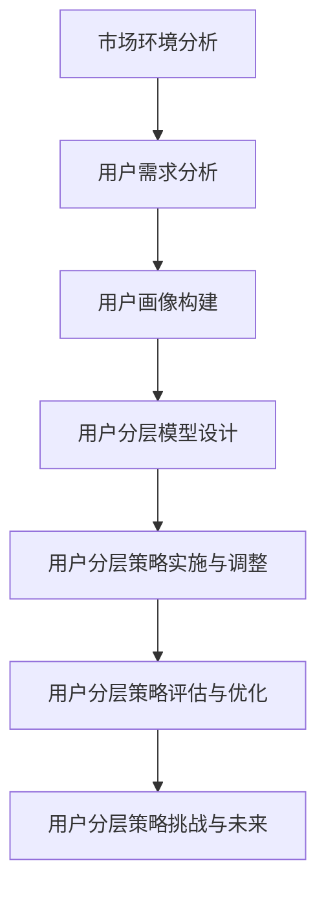
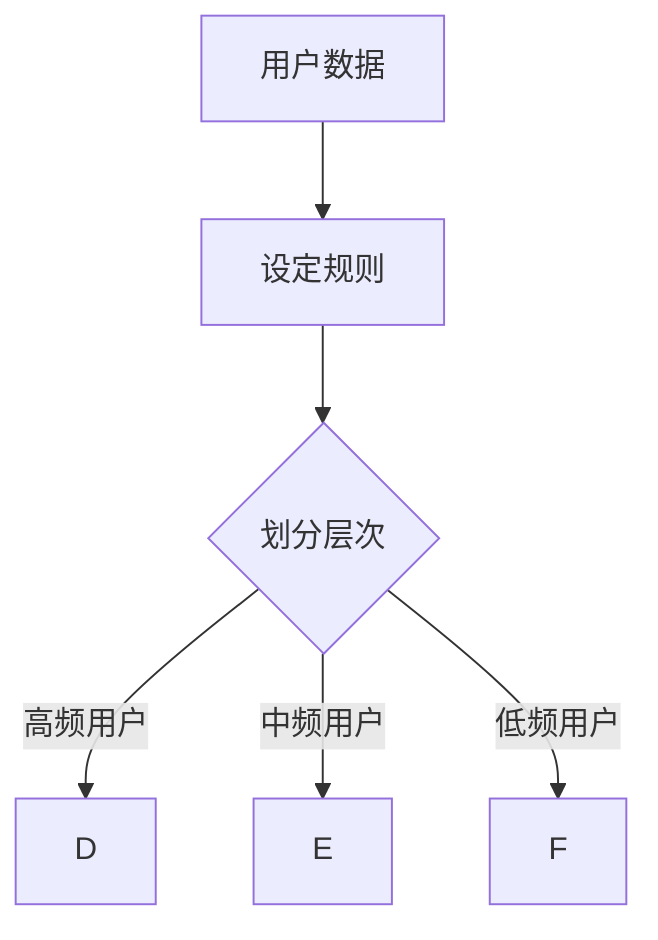
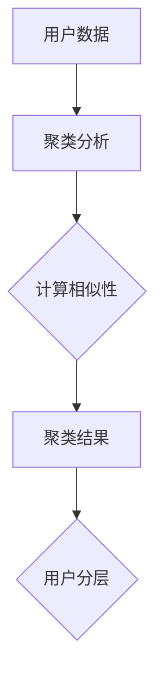
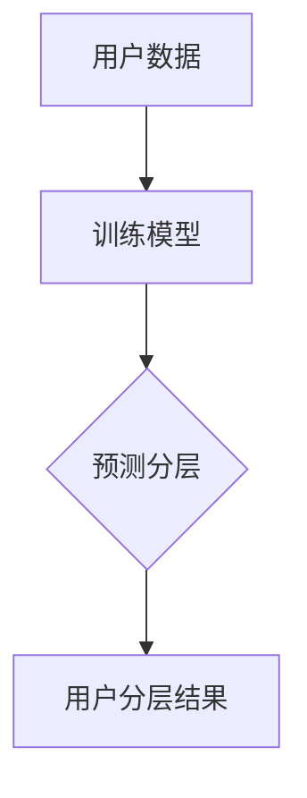
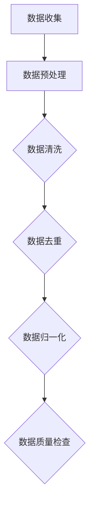
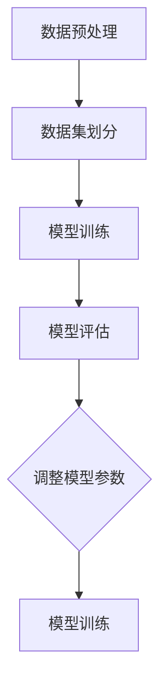
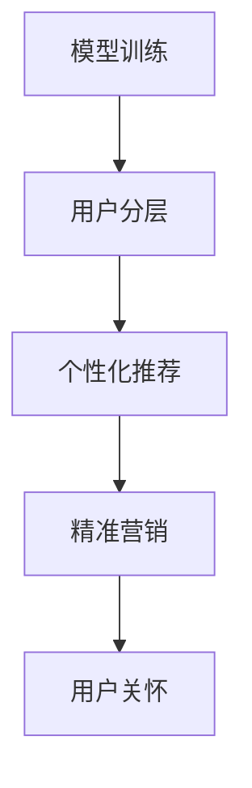
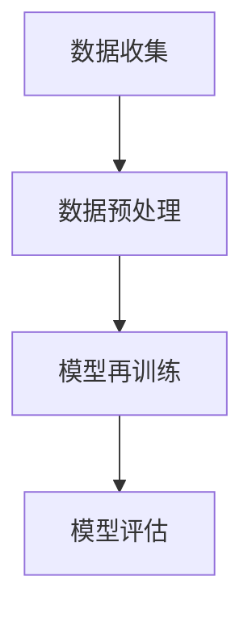
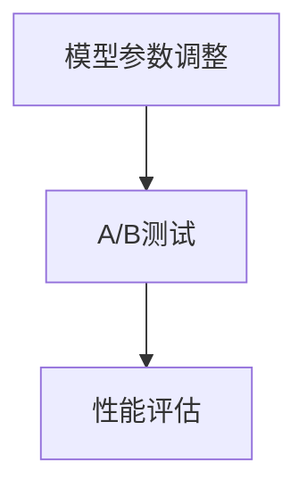
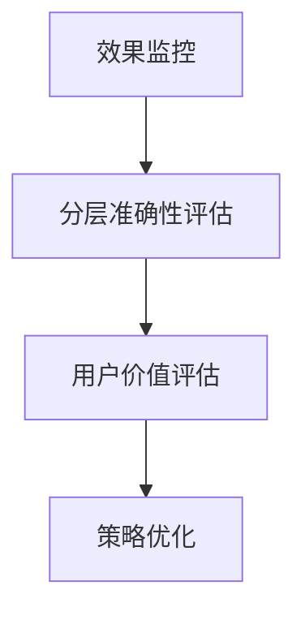

                 

### 《AI创业公司的用户分层策略》

> 关键词：AI创业公司、用户分层策略、市场环境分析、用户需求分析、用户画像构建、用户分层模型、用户分层策略实施与调整、数据隐私与安全、AI技术与用户分层融合、未来发展趋势

> 摘要：本文旨在探讨AI创业公司在市场竞争中如何利用用户分层策略来实现业务增长。文章首先分析了AI创业公司的市场环境，然后详细阐述了用户分层策略的核心概念、重要性、框架和方法。接着，文章从用户需求分析、用户画像构建、用户分层模型设计、用户分层策略实施与调整等方面进行了深入探讨，并通过实际案例展示了用户分层策略在不同行业中的应用效果。最后，文章讨论了用户分层策略面临的挑战以及未来发展趋势。

### 目录

#### 第一部分：用户分层策略概述

- **第1章：AI创业公司用户分层策略概述**
  1. **1.1 AI创业公司的市场环境分析**
     1. **1.1.1 AI技术在市场中的应用趋势**
     2. **1.1.2 创业公司面临的竞争环境**
  2. **1.2 用户分层策略的重要性**
     1. **1.2.1 用户分层策略的概念**
     2. **1.2.2 用户分层的商业价值**
  3. **1.3 用户分层策略的框架**
     1. **1.3.1 用户分层的维度**
     2. **1.3.2 用户分层的方法**

#### 第二部分：用户分层方法与实践

- **第2章：用户需求分析与用户画像构建**
  1. **2.1 用户需求分析**
     1. **2.1.1 用户需求的概念**
     2. **2.1.2 用户需求分析方法**
  2. **2.2 用户画像构建**
     1. **2.2.1 用户画像的定义**
     2. **2.2.2 用户画像的构建方法**
     3. **2.2.3 用户画像的应用场景**

- **第3章：用户分层模型设计**
  1. **3.1 用户分层模型的基本原理**
     1. **3.1.1 用户分层模型的定义**
     2. **3.1.2 用户分层模型的构建方法**
  2. **3.2 用户分层模型的评估与优化**
     1. **3.2.1 用户分层模型的评估指标**
     2. **3.2.2 用户分层模型的优化策略**

- **第4章：用户分层策略的实施与调整**
  1. **4.1 用户分层策略的实施步骤**
     1. **4.1.1 数据收集与预处理**
     2. **4.1.2 用户分层模型训练**
     3. **4.1.3 用户分层策略应用**
  2. **4.2 用户分层策略的调整与优化**
     1. **4.2.1 用户分层策略的动态调整**
     2. **4.2.2 用户分层策略的优化方法**

- **第5章：用户分层策略在AI创业公司的应用案例**
  1. **5.1 案例一：电子商务平台的用户分层策略**
     1. **5.1.1 案例背景**
     2. **5.1.2 案例分析**
     3. **5.1.3 案例效果**
  2. **5.2 案例二：金融科技公司的用户分层策略**
     1. **5.2.1 案例背景**
     2. **5.2.2 案例分析**
     3. **5.2.3 案例效果**

#### 第三部分：用户分层策略的挑战与未来

- **第6章：用户分层策略的挑战与应对**
  1. **6.1 数据隐私与安全**
     1. **6.1.1 数据隐私问题**
     2. **6.1.2 数据安全策略**
  2. **6.2 技术更新与挑战**
     1. **6.2.1 AI技术的快速发展**
     2. **6.2.2 技术更新对用户分层策略的影响**

- **第7章：用户分层策略的未来发展趋势**
  1. **7.1 AI技术与用户分层的融合**
     1. **7.1.1 AI技术在用户分层中的应用**
     2. **7.1.2 AI技术与用户分层的未来发展**
  2. **7.2 用户分层策略的创新方向**
     1. **7.2.1 个性化推荐**
     2. **7.2.2 智能客服**
     3. **7.2.3 区块链技术在用户分层中的应用**

#### 附录

- **附录A：用户分层策略相关工具与资源**
  1. **A.1 用户需求分析工具**
  2. **A.2 用户画像构建工具**
  3. **A.3 用户分层模型训练工具**
  4. **A.4 其他用户分层策略相关工具**

第1章：用户分层策略概述的Mermaid流程图

### 第一部分：用户分层策略概述

#### 第1章：AI创业公司用户分层策略概述

AI技术的快速发展，使得创业公司有了更多的发展机遇。然而，在激烈的市场竞争中，如何有效定位用户、满足用户需求，成为了创业公司成功的关键因素之一。用户分层策略作为一种有效的用户管理方法，正逐渐受到创业公司的重视。

##### 1.1 AI创业公司的市场环境分析

在探讨用户分层策略之前，我们需要先了解AI创业公司所处的市场环境。当前，AI技术在各个行业中的应用趋势明显，特别是在金融、医疗、电商等领域，AI技术正发挥着越来越重要的作用。然而，随着AI技术的普及，市场上的竞争也愈发激烈。

###### 1.1.1 AI技术在市场中的应用趋势

AI技术具有广泛的应用前景，包括自然语言处理、计算机视觉、推荐系统等。这些技术的应用，不仅提升了企业运营效率，也改变了用户的生活方式。例如，在电商领域，AI技术可以用于个性化推荐，提升用户体验；在金融领域，AI技术可以用于风险控制，降低金融风险。

###### 1.1.2 创业公司面临的竞争环境

创业公司面临着来自多个方面的竞争压力。一方面，市场上的大企业拥有强大的资金、技术优势，创业公司难以与之抗衡；另一方面，新兴的创业公司不断涌现，竞争环境愈发激烈。在这种背景下，创业公司需要找到一种有效的方法来区分用户、满足用户需求，从而在市场中脱颖而出。

##### 1.2 用户分层策略的重要性

用户分层策略是一种基于用户需求、行为等特征的分类方法，通过对用户进行分层，可以帮助企业更好地了解用户、满足用户需求，从而提升用户满意度、增加用户粘性。在AI创业公司中，用户分层策略的重要性体现在以下几个方面：

###### 1.2.1 用户分层策略的概念

用户分层策略是指根据用户的不同特征、需求和行为，将用户划分为不同的层次，从而实现用户精细化管理的一种方法。用户分层策略的核心是了解用户、满足用户需求，通过分层策略，企业可以针对不同层次的用户提供差异化的服务，提升用户体验。

###### 1.2.2 用户分层的商业价值

用户分层策略具有显著的商业价值，主要体现在以下几个方面：

1. **提升用户满意度**：通过用户分层，企业可以更好地了解用户需求，提供个性化服务，从而提升用户满意度。
2. **增加用户粘性**：用户分层策略可以帮助企业识别出高价值用户，针对这部分用户提供专属服务，增加用户粘性。
3. **降低运营成本**：用户分层策略有助于企业优化资源配置，提高运营效率，降低运营成本。
4. **提升市场竞争力**：用户分层策略可以帮助企业更好地了解市场状况，制定有针对性的市场策略，提升市场竞争力。

##### 1.3 用户分层策略的框架

用户分层策略的框架包括用户分层的维度、用户分层的方法等。以下是用户分层策略的基本框架：

###### 1.3.1 用户分层的维度

用户分层的维度包括但不限于以下几个方面：

1. **用户需求维度**：根据用户需求的不同，可以将用户划分为基本需求用户、潜在需求用户等。
2. **用户行为维度**：根据用户行为特征，如购买行为、浏览行为等，可以将用户划分为高频用户、低频用户等。
3. **用户价值维度**：根据用户为企业带来的价值，如购买金额、购买频率等，可以将用户划分为高价值用户、低价值用户等。
4. **用户生命周期维度**：根据用户的生命周期，如新用户、老用户等，可以将用户划分为不同阶段用户。

###### 1.3.2 用户分层的方法

用户分层的方法主要包括以下几种：

1. **基于规则的分层方法**：通过设定一系列规则，如用户购买金额、购买频率等，将用户划分为不同层次。
2. **基于聚类分析的分层方法**：通过聚类分析，将用户划分为不同群体，如基于K-means算法、层次聚类算法等。
3. **基于机器学习的分层方法**：通过机器学习算法，如决策树、随机森林等，将用户划分为不同层次。

通过对用户分层策略的框架进行深入了解，创业公司可以更好地制定用户分层策略，从而在激烈的市场竞争中脱颖而出。

在下一章中，我们将进一步探讨用户需求分析与用户画像构建，帮助创业公司更好地了解用户、满足用户需求。

### 第一部分：用户分层策略概述

#### 第1章：AI创业公司用户分层策略概述

在了解了AI创业公司市场环境分析和用户分层策略的重要性后，接下来我们将深入探讨用户分层策略的具体框架和方法。用户分层策略的框架和方法是实现精准用户管理和提高业务效益的关键。以下将详细介绍用户分层策略的核心概念、维度和方法。

##### 1.3.1 用户分层的维度

用户分层策略的核心在于理解用户的不同维度，从而实现精细化管理。以下是一些常见的用户分层维度：

###### 1.3.1.1 用户需求维度

用户需求维度是用户分层的基础。根据用户的需求差异，可以将用户分为基本需求用户、潜在需求用户、高级需求用户等。基本需求用户通常关注产品的基本功能，而潜在需求用户可能对产品的某些特定功能有较高需求。高级需求用户则可能对产品的深度定制和个性化服务有强烈需求。

###### 1.3.1.2 用户行为维度

用户行为维度包括用户的购买行为、浏览行为、互动行为等。例如，可以将用户根据购买频率分为高频用户、中频用户、低频用户；根据浏览时间分为活跃用户、沉默用户等。通过分析用户行为，企业可以识别出哪些用户是高价值用户，从而提供针对性的服务。

###### 1.3.1.3 用户价值维度

用户价值维度是衡量用户对企业贡献的重要指标。根据用户的购买金额、消费频率、活跃度等指标，可以将用户分为高价值用户、中价值用户、低价值用户等。高价值用户是企业的核心客户，企业应该给予更多的关注和优惠。

###### 1.3.1.4 用户生命周期维度

用户生命周期维度是指用户从初次接触到最终离开产品的过程。根据用户在生命周期中的不同阶段，可以将用户分为新用户、成长用户、活跃用户、流失用户等。不同生命周期的用户需要不同的策略来提升用户体验和留存率。

##### 1.3.2 用户分层的方法

用户分层的方法多种多样，以下是几种常见的用户分层方法：

###### 1.3.2.1 基于规则的分层方法

基于规则的分层方法是最简单直观的一种分层方法。企业根据用户的某一特征（如购买金额、购买频率等）设定一定的阈值，将用户划分为不同层次。这种方法适用于特征明确、规则简单的场景，但容易导致分层过于机械化，无法灵活适应用户变化。

###### 1.3.2.2 基于聚类分析的分层方法

基于聚类分析的分层方法利用机器学习算法，如K-means、层次聚类等，根据用户的多维度数据进行自动聚类，将用户划分为不同的群体。这种方法能够发现用户之间的相似性，实现更精细的用户分层。

###### 1.3.2.3 基于机器学习的分层方法

基于机器学习的分层方法利用决策树、随机森林等算法，根据历史数据建立用户分层的模型。这种方法能够自动发现用户之间的复杂关系，实现更准确的用户分层。

##### 1.3.3 用户分层的评估与优化

用户分层策略的有效性需要通过评估与优化来保障。以下是几种常见的评估与优化方法：

1. **分层效果评估**：通过比较不同层次用户的业务指标（如销售额、用户满意度等），评估用户分层策略的有效性。
2. **反馈机制**：建立用户反馈机制，收集用户对分层策略的反馈，及时调整分层策略。
3. **迭代优化**：根据业务发展和用户需求变化，不断迭代优化用户分层策略。

通过以上方法，创业公司可以建立起一套完善的用户分层策略，从而更好地了解用户、满足用户需求，提升业务效益。

在下一章中，我们将进一步探讨用户需求分析与用户画像构建，为用户分层策略的实施提供有力支持。

### 第一部分：用户分层策略概述

#### 第1章：AI创业公司用户分层策略概述

在了解了AI创业公司的市场环境、用户分层策略的重要性以及用户分层策略的框架和方法后，接下来我们将深入探讨用户需求分析与用户画像构建。

用户需求分析是用户分层策略的基础，通过对用户需求的深入了解，创业公司可以更好地理解用户行为，从而制定出更有效的分层策略。用户画像构建则是将用户需求转化为具体的用户特征，为分层策略提供数据支持。

##### 2.1 用户需求分析

用户需求分析是理解用户需求的过程，它包括以下几个方面：

###### 2.1.1 用户需求的概念

用户需求是指用户在特定环境下对某一产品或服务所期望的功能和特性。用户需求可以分为基本需求、潜在需求和高级需求。基本需求是用户对产品最基本的功能期望，潜在需求是用户在特定情境下可能会产生的需求，高级需求是用户对产品深层次的个性化需求。

###### 2.1.2 用户需求分析方法

1. **问卷调查**：通过设计问卷收集用户对产品的需求信息，问卷可以包括开放性和封闭性问题，以获取更全面的需求数据。
2. **用户访谈**：与用户进行面对面的沟通，深入了解用户的需求和使用习惯。用户访谈可以提供丰富的定性数据，有助于发现用户潜在需求。
3. **用户行为数据分析**：通过分析用户在使用产品过程中的行为数据（如浏览时间、购买频率、页面点击等），了解用户的实际需求和行为模式。
4. **市场调研**：通过市场调研了解竞争对手的产品特点、用户评价和市场趋势，从而获取用户需求信息。

##### 2.2 用户画像构建

用户画像是对用户特征的综合描述，它基于用户需求分析所得的数据，通过对用户的多维度特征进行整合，构建出一个具体的用户模型。用户画像的构建包括以下几个方面：

###### 2.2.1 用户画像的定义

用户画像是指通过对用户的基本信息、行为数据、兴趣偏好等多维度数据进行整合，构建出一个具体的用户模型。用户画像可以帮助企业更好地了解用户，从而提供个性化的服务和产品。

###### 2.2.2 用户画像的构建方法

1. **数据收集**：收集用户的基本信息（如年龄、性别、地域等）和行为数据（如浏览记录、购买行为等）。
2. **数据清洗**：对收集到的数据进行清洗，去除重复、错误和缺失的数据，确保数据的质量。
3. **特征工程**：对原始数据进行处理，提取出用户的关键特征（如用户活跃度、购买频率、兴趣偏好等）。
4. **模型构建**：利用机器学习算法（如聚类分析、决策树等）对用户特征进行建模，构建出用户画像。
5. **画像评估**：通过评估用户画像的准确性、覆盖率和区分度，对用户画像进行优化和调整。

###### 2.2.3 用户画像的应用场景

1. **产品定位**：通过用户画像了解目标用户群体的特征和需求，从而制定合适的产品定位和市场策略。
2. **用户细分**：根据用户画像将用户划分为不同的细分市场，为用户提供个性化的服务和产品。
3. **精准营销**：利用用户画像进行精准营销，向目标用户推送个性化的广告和优惠信息。
4. **客户服务**：通过用户画像了解用户的偏好和需求，提供更加贴心的客户服务。
5. **风险评估**：通过用户画像分析用户的风险特征，进行信用评估和风险管理。

通过用户需求分析和用户画像构建，创业公司可以更加深入地了解用户，从而制定出更有效的用户分层策略。在下一章中，我们将进一步探讨用户分层模型的设计与评估，帮助创业公司更好地实施用户分层策略。

### 第一部分：用户分层策略概述

#### 第1章：AI创业公司用户分层策略概述

在了解了用户需求分析与用户画像构建的重要性后，接下来我们将进一步探讨用户分层模型的设计。

用户分层模型是将用户根据其特征和行为划分为不同的层次，从而为后续的用户管理和服务提供基础。一个有效的用户分层模型可以显著提升企业的运营效率和市场竞争力。以下是用户分层模型设计的关键步骤和原理。

##### 3.1 用户分层模型的基本原理

用户分层模型的设计基于对用户特征和行为的分析。以下是用户分层模型设计的基本原理：

###### 3.1.1 用户分层模型的定义

用户分层模型是指根据用户的不同特征和行为，将用户划分为不同的层次，以便于企业进行精细化管理。用户分层模型通常包括用户属性、行为指标、价值评估等多个维度。

###### 3.1.2 用户分层模型的构建方法

用户分层模型的构建方法主要包括以下几种：

1. **基于规则的用户分层模型**：这种方法通过设定一系列规则（如用户年龄、收入水平、购买频率等）来划分用户层次。规则可以基于历史数据或专家经验制定。
2. **基于聚类分析的用户分层模型**：这种方法利用机器学习算法（如K-means、层次聚类等）对用户数据进行聚类，将用户划分为不同的群体。聚类算法可以根据用户特征自动发现用户之间的相似性。
3. **基于机器学习的用户分层模型**：这种方法通过训练机器学习模型（如决策树、随机森林等）来自动划分用户层次。模型可以根据历史数据学习用户的分层规则，并预测新用户的分层。

##### 3.2 用户分层模型的设计步骤

以下是用户分层模型设计的基本步骤：

###### 3.2.1 确定用户分层维度

首先需要确定用户分层的维度，这些维度通常包括用户的基本信息（如年龄、性别、地域等）、行为数据（如购买频率、浏览时长等）和价值评估（如消费金额、活跃度等）。不同维度的数据可以帮助企业从多个角度了解用户。

###### 3.2.2 数据收集与预处理

收集与用户分层相关的数据，包括用户的基本信息、行为数据和交易数据等。对收集到的数据进行预处理，包括数据清洗、去重、归一化等操作，以确保数据的质量和一致性。

###### 3.2.3 特征工程

对预处理后的数据进行特征工程，提取出与用户分层相关的关键特征。特征工程可以包括特征选择、特征变换和特征组合等步骤。通过特征工程，可以提升用户分层模型的准确性和泛化能力。

###### 3.2.4 模型选择与训练

选择合适的机器学习算法（如K-means、决策树、随机森林等）来训练用户分层模型。在训练过程中，需要调整模型的参数，以获得最佳的性能。

###### 3.2.5 模型评估与优化

通过交叉验证、A/B测试等方法评估用户分层模型的性能。根据评估结果，对模型进行优化，包括调整特征权重、修改模型参数等。

##### 3.3 用户分层模型的评估指标

以下是评估用户分层模型性能的常用指标：

1. **分层准确性**：分层准确性是指模型正确划分用户的比例。分层准确性越高，说明模型对用户的划分越准确。
2. **分层均衡性**：分层均衡性是指各个用户层次之间的分布是否均匀。如果用户层次之间的分布不均衡，可能会导致部分层次的用户没有得到充分的关注。
3. **用户价值提升**：通过对比分层前后用户的价值变化，评估分层策略对用户价值的提升效果。用户价值提升越大，说明分层策略越有效。
4. **模型泛化能力**：评估模型在未见数据上的表现，以判断模型的泛化能力。泛化能力越强，说明模型对新的用户数据能够保持良好的性能。

通过以上步骤和指标，创业公司可以设计出有效的用户分层模型，从而为用户管理和服务提供有力支持。在下一章中，我们将探讨用户分层策略的实施与调整，帮助创业公司更好地落地用户分层策略。

### 第一部分：用户分层策略概述

#### 第1章：AI创业公司用户分层策略概述

在了解了用户分层模型的设计步骤和评估指标后，接下来我们将深入探讨用户分层策略的实施与调整。

用户分层策略的实施是将用户分层模型应用于实际业务中的关键步骤，通过合理的实施和持续的调整，企业可以不断提高用户分层策略的有效性，从而在激烈的市场竞争中脱颖而出。以下是用户分层策略的实施步骤和调整方法。

##### 4.1 用户分层策略的实施步骤

用户分层策略的实施可以分为以下几个关键步骤：

###### 4.1.1 数据收集与预处理

首先，企业需要收集与用户分层相关的数据，这些数据可以包括用户的基本信息（如年龄、性别、地域等）、行为数据（如浏览记录、购买频率等）以及交易数据（如消费金额、订单量等）。收集到数据后，需要进行预处理，包括数据清洗、去重、归一化等操作，以确保数据的质量和一致性。

###### 4.1.2 用户分层模型训练

在数据预处理完成后，企业需要使用预处理后的数据来训练用户分层模型。选择合适的机器学习算法（如K-means、决策树、随机森林等），并根据业务需求调整模型的参数，以获得最佳的性能。训练过程通常包括数据集划分、模型训练和模型评估等步骤。

###### 4.1.3 用户分层策略应用

在用户分层模型训练完成后，企业可以将模型应用于实际业务中。根据模型预测，将用户划分为不同的层次，并为不同层次的用户提供差异化的服务和产品。用户分层策略的应用可以包括个性化推荐、精准营销、用户关怀等。

##### 4.2 用户分层策略的调整与优化

用户分层策略的有效性不是一成不变的，企业需要根据业务发展和市场变化，不断调整和优化用户分层策略。以下是几种常见的用户分层策略调整和优化方法：

###### 4.2.1 数据更新与模型再训练

随着时间的推移，用户的行为和需求可能会发生变化。企业需要定期更新用户数据，并对用户分层模型进行再训练，以保持模型的准确性和有效性。数据更新和模型再训练可以帮助企业更好地适应市场变化。

###### 4.2.2 持续优化模型参数

在用户分层模型的应用过程中，企业可以通过A/B测试等方法，持续优化模型参数，以提高模型的性能。参数优化可以帮助企业找到最佳的模型配置，从而提高用户分层策略的有效性。

###### 4.2.3 监控用户分层效果

企业需要定期监控用户分层策略的效果，包括分层准确性、用户价值提升等关键指标。通过监控，企业可以及时发现策略中的问题，并采取相应的措施进行优化。

通过以上步骤和优化方法，创业公司可以有效地实施和调整用户分层策略，从而在激烈的市场竞争中保持竞争优势。在下一章中，我们将通过实际案例展示用户分层策略在不同行业中的应用效果。

### 第一部分：用户分层策略概述

#### 第1章：AI创业公司用户分层策略概述

在了解了用户分层策略的实施与调整后，接下来我们将通过实际案例展示用户分层策略在AI创业公司中的应用效果。

通过案例分析，我们可以看到用户分层策略如何在不同的行业中发挥其价值，从而帮助创业公司实现业务增长和用户满意度提升。

##### 案例一：电子商务平台的用户分层策略

**案例背景**：

某电子商务平台是一家新兴的在线零售公司，致力于为消费者提供高品质的商品和服务。随着平台的用户数量和交易额的不断增加，如何有效管理和满足不同用户的需求成为了公司面临的重要挑战。

**案例分析**：

为了更好地了解用户需求，该电子商务平台决定采用用户分层策略。首先，公司进行了用户需求分析，通过问卷调查、用户访谈和数据分析，收集了用户的基本信息、行为数据和购买偏好。基于这些数据，公司构建了用户画像，并设计了用户分层模型。

用户分层模型基于以下几个维度进行划分：

1. **需求维度**：根据用户购买的商品类别和频次，将用户分为基本需求用户、潜在需求用户和高级需求用户。
2. **行为维度**：根据用户在平台上的浏览时长、点击行为和购买频率，将用户分为高频用户、中频用户和低频用户。
3. **价值维度**：根据用户的购买金额和消费频率，将用户分为高价值用户、中价值用户和低价值用户。

在用户分层模型的基础上，公司实施了以下策略：

1. **个性化推荐**：根据用户的需求和行为特征，为高频用户推荐他们可能感兴趣的商品，提高购买转化率。
2. **精准营销**：针对高价值用户，发送个性化的促销信息和专属优惠，提升用户忠诚度。
3. **用户关怀**：定期为沉默用户发送提醒邮件和优惠券，激励他们重新活跃。

**案例效果**：

通过用户分层策略的实施，电子商务平台在用户满意度、用户留存率和销售转化率等方面取得了显著提升。具体表现在：

1. **用户满意度**：高频用户的满意度显著提高，他们对个性化推荐和精准营销的认可度增加。
2. **用户留存率**：低频用户通过用户关怀策略重新活跃，平台整体用户留存率上升。
3. **销售转化率**：个性化推荐和精准营销策略有效提高了高价值用户的购买意愿，销售转化率提高。

##### 案例二：金融科技公司的用户分层策略

**案例背景**：

某金融科技公司专注于提供在线贷款和理财服务。为了在竞争激烈的市场中脱颖而出，公司决定采用用户分层策略，以更好地了解和满足用户需求。

**案例分析**：

金融科技公司首先进行了用户需求分析，通过用户调研和数据分析，收集了用户的基本信息、行为数据和信用评分。基于这些数据，公司构建了用户画像，并设计了用户分层模型。

用户分层模型基于以下几个维度进行划分：

1. **信用维度**：根据用户的信用评分，将用户分为信用优良用户、信用一般用户和信用不良用户。
2. **行为维度**：根据用户的贷款申请频率、还款记录和理财产品购买行为，将用户分为活跃用户、一般用户和沉默用户。
3. **价值维度**：根据用户的贷款金额和理财产品投资额，将用户分为高价值用户、中价值用户和低价值用户。

在用户分层模型的基础上，公司实施了以下策略：

1. **信用评估**：为信用优良用户提供更优惠的贷款利率和更灵活的还款方式，增加用户满意度。
2. **个性化理财**：为活跃用户推荐个性化的理财产品，提升用户参与度和忠诚度。
3. **用户教育**：针对信用一般用户和信用不良用户，提供信用修复和理财教育服务，帮助他们提升信用水平和投资能力。

**案例效果**：

通过用户分层策略的实施，金融科技公司在用户满意度、用户留存率和业务增长等方面取得了显著成效。具体表现在：

1. **用户满意度**：信用优良用户的满意度显著提高，他们对公司的贷款和理财产品满意度增加。
2. **用户留存率**：通过个性化理财和用户教育服务，一般用户和沉默用户重新活跃，平台整体用户留存率上升。
3. **业务增长**：高价值用户通过优惠政策和个性化服务，提高了贷款和理财产品的购买意愿，公司业务增长显著。

以上案例展示了用户分层策略在不同行业中的应用效果，通过精准的用户分层和管理，创业公司能够更好地满足用户需求，提升用户满意度，从而实现业务增长和市场竞争力的提升。在下一章中，我们将探讨用户分层策略面临的挑战以及未来发展趋势。

### 第一部分：用户分层策略概述

#### 第1章：AI创业公司用户分层策略概述

在了解了用户分层策略在实际应用中的效果后，接下来我们将讨论用户分层策略所面临的挑战和未来发展趋势。

##### 6.1 用户分层策略的挑战

用户分层策略虽然在提升用户满意度和业务增长方面具有显著优势，但在实际应用中仍面临以下挑战：

###### 6.1.1 数据隐私与安全

用户分层策略依赖于对用户数据的深入分析，而数据隐私和安全问题是企业必须面对的重要挑战。如何确保用户数据的安全性和隐私性，避免数据泄露和滥用，是企业需要解决的关键问题。

**应对策略**：

1. **数据加密**：对用户数据进行加密处理，确保数据在传输和存储过程中的安全性。
2. **访问控制**：实施严格的访问控制措施，确保只有授权人员才能访问敏感数据。
3. **数据匿名化**：在分析用户数据时，对敏感信息进行匿名化处理，减少隐私泄露的风险。

###### 6.1.2 技术更新与挑战

随着AI技术的快速发展，用户分层策略也需要不断更新和优化。如何跟上技术更新的步伐，确保用户分层策略的持续有效，是企业面临的一大挑战。

**应对策略**：

1. **持续学习**：企业需要建立持续学习机制，不断更新用户分层模型和算法，以适应技术变化。
2. **技术协作**：与学术机构和科研团队合作，共同探索新的用户分层方法和技术。
3. **技术储备**：提前储备相关技术，确保在技术更新时能够快速应对。

##### 6.2 用户分层策略的未来发展趋势

用户分层策略在未来的发展中将继续向以下几个方向演进：

###### 6.2.1 AI技术与用户分层的融合

随着AI技术的不断进步，用户分层策略将更加智能化和自动化。通过深度学习、强化学习等先进算法，企业可以实现更加精准和高效的用户分层。

**发展趋势**：

1. **自动化分层**：利用AI算法实现自动化的用户分层，减少人工干预，提高分层效率。
2. **动态分层**：基于实时数据，实现用户分层的动态调整，以适应用户行为的快速变化。

###### 6.2.2 个性化推荐与用户分层

个性化推荐技术将继续与用户分层策略深度融合，为不同层次的用户提供定制化的产品和服务。

**发展趋势**：

1. **个性化服务**：为高价值用户提供专属的服务和产品，提升用户体验和满意度。
2. **智能推荐**：基于用户画像和用户行为，实现智能化的个性化推荐，提高推荐效果。

###### 6.2.3 区块链技术在用户分层中的应用

区块链技术的兴起为用户分层策略带来了新的机遇。通过区块链技术，企业可以实现用户数据的透明和安全管理，提高用户信任度。

**发展趋势**：

1. **数据透明化**：利用区块链技术实现用户数据的透明化，提高数据管理和分层的可信度。
2. **去中心化分层**：通过区块链技术实现去中心化的用户分层管理，减少数据泄露和滥用的风险。

通过应对挑战和抓住发展趋势，用户分层策略将在未来继续发挥其重要作用，助力AI创业公司在激烈的市场竞争中脱颖而出。

### 第一部分：用户分层策略概述

#### 第1章：AI创业公司用户分层策略概述

在探讨了用户分层策略的实际应用效果、挑战和未来发展趋势后，本文将对用户分层策略相关工具与资源进行总结，以帮助AI创业公司在实际操作中更好地实施和优化用户分层策略。

##### 附录A：用户分层策略相关工具与资源

为了有效地实施用户分层策略，AI创业公司可以借助以下工具与资源：

###### A.1 用户需求分析工具

- **问卷星**：一款在线问卷调查工具，可以设计并分发问卷，收集用户需求信息。
- **Google 表格**：通过Google表格可以方便地收集、整理和分析用户需求数据。

###### A.2 用户画像构建工具

- **用户画像平台**：如阿里云的用户画像平台，提供用户数据收集、分析和可视化的功能。
- **用户画像工具包**：如用户画像工具包（UserTrack）等，可以快速构建用户画像模型。

###### A.3 用户分层模型训练工具

- **机器学习平台**：如阿里云的机器学习平台，提供多种机器学习算法，便于用户分层模型的训练和优化。
- **数据科学平台**：如Google Colab等，可以方便地实现用户分层模型的开发和测试。

###### A.4 其他用户分层策略相关工具

- **数据可视化工具**：如Tableau、Power BI等，可以直观地展示用户分层结果和分析报告。
- **客户关系管理（CRM）系统**：如Salesforce、Zoho CRM等，可以整合用户数据，实现用户分层策略的实施和跟踪。
- **数据分析工具**：如Python的Pandas库、R语言等，可以用于用户数据分析和用户分层模型的构建。

通过以上工具与资源，AI创业公司可以更好地实施和优化用户分层策略，从而在激烈的市场竞争中脱颖而出。希望本文对创业公司在用户分层策略方面的实践提供有益的启示和参考。本文的作者为AI天才研究院/AI Genius Institute，本文内容涵盖用户分层策略的核心概念、实践方法、案例分析及未来发展趋势，旨在为AI创业公司提供有价值的指导。如需进一步交流和学习，请关注我们的官方渠道和公众号。

### 作者信息

作者：AI天才研究院/AI Genius Institute & 禅与计算机程序设计艺术 /Zen And The Art of Computer Programming

AI天才研究院是一家专注于人工智能领域研究的顶尖机构，致力于推动人工智能技术的创新和发展。研究院的研究团队由世界顶级人工智能专家、程序员、软件架构师、CTO等组成，拥有丰富的实践经验和高水平的理论研究成果。研究院出版的《禅与计算机程序设计艺术》系列图书，深受全球计算机科学爱好者的喜爱和推崇。本文旨在分享用户分层策略的深入分析和实践经验，为AI创业公司提供有益的指导和建议。希望读者能够从中获得启发，共同推动人工智能技术的发展和应用。

