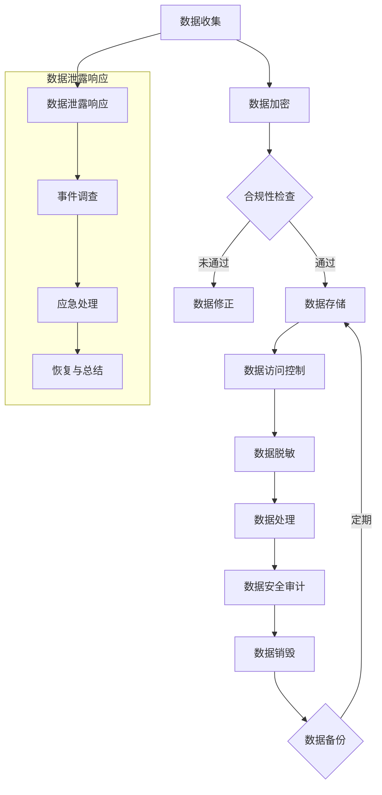

                 

### 《AI创业公司的用户隐私保护：数据安全与合规性》

#### 关键词：AI创业公司，用户隐私保护，数据安全，合规性，技术实现

> 摘要：在当今信息时代，AI创业公司的用户隐私保护成为了一项至关重要的任务。本文从数据安全与合规性的角度出发，详细探讨了AI创业公司在用户隐私保护方面所面临的挑战及应对策略。文章首先介绍了用户隐私保护的重要性，随后分析了数据安全与合规性的核心概念及其联系，进而深入讲解了用户隐私保护的核心技术原理，并通过实际项目实战展示了如何有效实施用户隐私保护与数据安全策略。此外，本文还通过案例分析，总结了AI创业公司在用户隐私保护与数据安全方面的成功经验和教训，并对未来发展趋势进行了展望。文章旨在为AI创业公司在数据安全与合规性方面提供实用的指导，助力其在激烈的市场竞争中立于不败之地。

### 《AI创业公司的用户隐私保护：数据安全与合规性》目录大纲

#### 第一部分：引言与背景

#### 第1章：引言

##### 1.1 AI创业公司的现状与挑战

##### 1.2 用户隐私保护的重要性

##### 1.3 数据安全与合规性的定义与联系

#### 第二部分：核心概念与联系

#### 第2章：用户隐私保护的概念与原则

##### 2.1 用户隐私的定义与分类

##### 2.2 用户隐私保护的法律法规概述

##### 2.3 用户隐私保护的基本原则

#### 第3章：数据安全与合规性

##### 3.1 数据安全的定义与重要性

##### 3.2 数据安全的管理与策略

##### 3.3 合规性的概念与要求

#### 第4章：用户隐私保护与数据安全的联系

##### 4.1 用户隐私保护与数据安全的关系

##### 4.2 用户隐私保护与数据安全的协作机制

##### 4.3 用户隐私保护与数据安全的挑战与对策

#### 第三部分：核心技术原理讲解

#### 第5章：用户隐私保护的核心技术

##### 5.1 数据加密技术

###### 5.1.1 加密算法概述

###### 5.1.2 常见加密算法及其应用

##### 5.2 数据脱敏技术

###### 5.2.1 数据脱敏的定义与目的

###### 5.2.2 数据脱敏的方法与实现

##### 5.3 同态加密技术

###### 5.3.1 同态加密的定义与原理

###### 5.3.2 同态加密的应用场景

#### 第6章：数据安全与合规性的技术实现

##### 6.1 数据安全架构的设计与实施

###### 6.1.1 数据安全架构的概念与组成

###### 6.1.2 数据安全架构的设计原则

##### 6.2 合规性的技术手段

###### 6.2.1 合规性监控与审计

###### 6.2.2 合规性报告与合规性培训

#### 第四部分：项目实战

#### 第7章：AI创业公司用户隐私保护与数据安全项目实战

##### 7.1 项目背景与目标

##### 7.2 项目方案设计

###### 7.2.1 数据安全与隐私保护方案

###### 7.2.2 技术架构与实现细节

##### 7.3 项目实施与优化

###### 7.3.1 项目实施过程

###### 7.3.2 项目优化与持续改进

##### 7.4 项目成果与经验总结

#### 第五部分：案例分析

#### 第8章：AI创业公司用户隐私保护与数据安全案例分析

##### 8.1 案例背景与简介

##### 8.2 案例分析

###### 8.2.1 案例中的用户隐私保护与数据安全挑战

###### 8.2.2 案例中的解决方案与效果

##### 8.3 案例启示与思考

#### 第六部分：未来展望与趋势

#### 第9章：AI创业公司用户隐私保护与数据安全的未来趋势

##### 9.1 用户隐私保护与数据安全的未来挑战

##### 9.2 技术发展趋势分析

###### 9.2.1 新型加密技术

###### 9.2.2 区块链技术在数据安全中的应用

##### 9.3 合规性要求的演变与应对策略

#### 第七部分：附录

#### 第10章：常用工具与技术资源

##### 10.1 用户隐私保护与数据安全工具推荐

##### 10.2 开源项目与资源链接

##### 10.3 相关法律法规与政策文件

#### 附录A：用户隐私保护与数据安全的Mermaid流程图

#### 附录B：用户隐私保护与数据安全相关的数学模型和数学公式

#### 附录C：AI创业公司用户隐私保护与数据安全项目实战代码示例

## 引言与背景

在当今数字化的世界中，人工智能（AI）技术的迅猛发展给各个行业带来了前所未有的变革。AI创业公司如雨后春笋般涌现，它们希望通过创新的技术和应用来占据市场的一席之地。然而，随着AI技术的广泛应用，用户隐私保护问题愈发突出，成为了AI创业公司必须面对的重要挑战。

### 1.1 AI创业公司的现状与挑战

AI创业公司面临着许多独特的挑战。首先，AI技术本身具有较高的复杂性，这要求创业公司必须具备强大的技术团队，以应对不断变化的技术需求。其次，AI创业公司通常需要大量的数据来进行模型训练和优化，这无疑增加了用户隐私泄露的风险。此外，市场竞争激烈，AI创业公司需要在保护用户隐私的同时，确保业务的快速发展和盈利。

### 1.2 用户隐私保护的重要性

用户隐私保护是AI创业公司必须重视的问题。用户隐私泄露可能导致严重的后果，包括用户信任的丧失、法律责任的风险以及市场竞争力的下降。保护用户隐私不仅是合规性要求，更是企业社会责任的体现。

### 1.3 数据安全与合规性的定义与联系

数据安全是指保护数据不被未授权访问、使用、泄露、篡改或破坏。合规性则是指企业在数据管理过程中遵守相关法律法规和标准。数据安全与合规性密切相关，企业必须确保其数据安全措施符合法律法规的要求，以避免法律风险。

在接下来的章节中，我们将详细探讨用户隐私保护的概念与原则，分析数据安全与合规性的核心概念及其联系，介绍用户隐私保护与数据安全的关联，并深入讲解核心技术原理。此外，我们还将通过实际项目实战和案例分析，展示如何有效实施用户隐私保护与数据安全策略。最后，我们将展望未来发展趋势，为AI创业公司在数据安全与合规性方面提供指导。

### 用户隐私保护的概念与原则

用户隐私保护是AI创业公司需要重视的核心问题，它不仅关乎企业的合规性，更关乎用户的信任和利益。在这一章节中，我们将详细探讨用户隐私保护的概念、相关法律法规及基本原则，以帮助AI创业公司更好地理解和实施用户隐私保护策略。

#### 2.1 用户隐私的定义与分类

用户隐私通常指的是个人在日常生活中所享有的信息隐私，包括但不限于个人身份信息、生物识别信息、财务信息、通信记录、健康信息等。这些信息在未经用户同意的情况下，不得被收集、使用或泄露。

用户隐私可以按照不同的标准进行分类：

1. **按数据类型分类**：可以分为个人身份信息、行为数据、地理位置信息、通信内容等。
2. **按隐私程度分类**：可以分为敏感隐私（如生物识别信息、财务信息）和非敏感隐私（如用户浏览历史、消费习惯）。
3. **按隐私泄露途径分类**：可以分为直接泄露（如黑客攻击）和间接泄露（如数据共享、数据滥用）。

#### 2.2 用户隐私保护的法律法规概述

全球范围内，许多国家和地区都出台了相关法律法规来保护用户隐私。以下是几个具有代表性的法律法规：

1. **《欧盟通用数据保护条例》（GDPR）**：GDPR是欧盟制定的关于数据保护的法规，它对个人数据的收集、存储、处理和传输提出了严格的要求。GDPR的核心原则包括数据合法性、目的明确性、数据最小化、数据准确性、存储限制、隐私保护设计、数据主体权利等。

2. **《加州消费者隐私法案》（CCPA）**：CCPA是针对美国加州地区的一项隐私保护法案，它赋予加州居民对其个人信息的更多控制权，包括知情权、访问权、删除权等。

3. **《中华人民共和国个人信息保护法》（PIPL）**：PIPL是中国针对个人信息保护的一项重要法律，它明确了个人信息处理的基本原则、个人信息主体的权利、个人信息处理者的义务等。

4. **《网络安全法》**：我国《网络安全法》也明确规定了对个人信息和数据安全保护的要求，企业应当采取技术和管理措施，保护用户个人信息安全。

#### 2.3 用户隐私保护的基本原则

用户隐私保护不仅需要依靠法律法规的约束，更需要企业在实际操作中遵循一系列基本原则，以确保用户隐私得到有效保护。

1. **合法性原则**：企业在收集、处理和传输用户信息时，必须遵循合法、正当、必要的原则，确保用户知情并同意其个人信息的使用。

2. **目的明确原则**：企业在收集用户信息时，应明确信息收集的目的，并在使用过程中严格遵循该目的，不得超出用户同意的范围。

3. **数据最小化原则**：企业在收集用户信息时，应尽可能收集最少、必要的个人信息，避免过度收集。

4. **数据准确性原则**：企业应确保收集的个人信息是准确、完整的，并在必要时进行更新。

5. **数据保密性原则**：企业应对收集的个人信息采取严格的安全措施，确保信息不被未授权访问、泄露或篡改。

6. **数据完整性原则**：企业应确保用户信息的完整性，不得进行非法删除、修改或泄露。

7. **用户权利保障原则**：企业应尊重用户的隐私权，保障用户对个人信息的访问权、更正权、删除权等。

通过以上探讨，我们可以看到，用户隐私保护是一个涉及多个层面的复杂问题。AI创业公司不仅需要了解相关法律法规，还需在实际操作中遵循用户隐私保护的基本原则，以构建一个安全、可靠、合规的隐私保护体系。在下一章节中，我们将进一步探讨数据安全与合规性的核心概念及其要求。

#### 数据安全与合规性

数据安全与合规性是AI创业公司用户隐私保护的重要组成部分。数据安全涉及到保护数据不被未授权访问、使用、泄露、篡改或破坏，而合规性则是指企业在数据处理过程中遵守相关法律法规和行业标准。在本节中，我们将详细阐述数据安全的定义与重要性，数据安全管理与策略，以及合规性的概念与要求。

##### 3.1 数据安全的定义与重要性

数据安全是指通过一系列技术和管理措施，保护数据在整个生命周期中的完整性、保密性和可用性。具体来说，数据安全包括以下几个方面：

1. **数据的完整性**：确保数据在存储、传输和处理过程中不被未经授权的篡改或破坏。
2. **数据的保密性**：确保数据在存储、传输和处理过程中不被未授权的访问或泄露。
3. **数据的可用性**：确保数据在需要时能够被合法用户访问和使用。

在AI创业公司中，数据安全的重要性体现在以下几个方面：

1. **保护用户隐私**：AI创业公司通常需要处理大量的用户数据，如个人身份信息、行为数据、地理位置信息等。保护这些数据的安全，可以有效防止用户隐私泄露，增强用户信任。
2. **避免法律风险**：遵守数据安全法律法规，可以避免因数据泄露、滥用等原因产生的法律纠纷和处罚。
3. **保障业务连续性**：数据安全措施可以有效防止数据丢失或被破坏，保障业务连续性和运营稳定性。
4. **提高竞争力**：在用户隐私保护方面表现出色的企业，往往能够赢得用户的信任和市场的认可，从而提高竞争力。

##### 3.2 数据安全的管理与策略

为了确保数据安全，AI创业公司需要制定并实施一系列数据安全管理和策略。以下是几个关键的管理与策略：

1. **风险评估**：企业应定期进行风险评估，识别潜在的数据安全风险，并采取相应的预防和应对措施。风险评估包括识别风险源、评估风险影响和制定风险缓解策略。
2. **数据分类与标签**：企业应对数据按照其敏感程度进行分类，并给数据打上相应的标签。对于敏感数据，应采取更加严格的安全措施。
3. **访问控制**：企业应实施访问控制策略，确保只有授权人员能够访问特定的数据。访问控制包括身份认证、权限分配和访问日志记录等。
4. **加密技术**：企业应对敏感数据进行加密，确保在数据传输和存储过程中不被未经授权访问。加密技术包括对称加密、非对称加密、哈希函数等。
5. **安全审计**：企业应定期进行安全审计，检查数据安全措施的执行情况和效果。安全审计包括安全策略审核、安全漏洞扫描和事故响应演练等。
6. **员工培训**：企业应对员工进行数据安全培训，提高员工的安全意识和操作技能。员工培训应包括数据安全知识、安全操作规程和安全事故应对等。
7. **应急响应**：企业应制定应急预案，应对可能的数据安全事件。应急预案包括事故响应流程、事故调查和报告、事故恢复和总结等。

##### 3.3 合规性的概念与要求

合规性是指企业在数据处理过程中遵守相关法律法规和行业标准。对于AI创业公司，合规性主要体现在以下几个方面：

1. **数据收集与使用**：企业在收集和使用用户数据时，必须遵守相关法律法规的要求，确保用户知情并同意其个人信息的使用。例如，GDPR和CCPA等法律法规对用户数据的收集、存储、处理和传输提出了明确的要求。
2. **数据存储与传输**：企业在存储和传输用户数据时，必须确保数据的安全性和完整性。例如，GDPR要求企业在欧洲境外的数据传输过程中采取适当的安全措施。
3. **数据删除与销毁**：企业在不再需要用户数据时，必须按照法律法规的要求进行数据删除和销毁。例如，PIPL规定企业在处理个人信息时，应当遵循合法、正当、必要的原则，并采取技术和管理措施保护个人信息安全。
4. **合规审计与报告**：企业应定期进行合规审计，检查自身数据处理活动是否符合法律法规的要求，并向相关部门提交合规报告。

总之，数据安全与合规性是AI创业公司用户隐私保护的重要方面。通过制定和实施有效的数据安全管理和合规性策略，AI创业公司可以更好地保护用户隐私，降低法律风险，提高市场竞争力。

#### 用户隐私保护与数据安全的联系

用户隐私保护与数据安全虽然各有侧重，但它们在实际应用中密不可分，共同构成了一个完整的隐私保护体系。在本章节中，我们将详细探讨用户隐私保护与数据安全之间的关系、协作机制，以及面临的挑战和对策。

##### 4.1 用户隐私保护与数据安全的关系

用户隐私保护与数据安全在目标上是一致的，都是为了确保用户信息不被未授权访问、泄露、篡改或破坏。具体来说，两者之间的关系可以从以下几个方面进行理解：

1. **目标一致性**：用户隐私保护的核心目标是保护用户的个人信息不受侵害，而数据安全则是实现这一目标的基础。没有数据安全，用户隐私保护将无从谈起。

2. **相互作用**：用户隐私保护和数据安全不是孤立存在的，而是相互依存、相互作用的。例如，数据加密技术既是数据安全的重要手段，也是用户隐私保护的重要保障。

3. **相辅相成**：用户隐私保护与数据安全在实践中相互促进。一方面，数据安全措施为用户隐私保护提供了技术支持；另一方面，用户隐私保护的要求又推动了数据安全技术的发展和改进。

##### 4.2 用户隐私保护与数据安全的协作机制

为了实现用户隐私保护与数据安全的有效结合，AI创业公司需要建立一种协作机制，使两者能够相互支持、协同工作。以下是几种有效的协作机制：

1. **整合规划**：在数据安全策略的制定过程中，应充分考虑用户隐私保护的要求，将两者纳入统一的规划中。例如，在数据收集、存储、处理和传输等环节，均需确保符合用户隐私保护标准。

2. **跨部门合作**：数据安全与用户隐私保护涉及企业多个部门，包括技术部门、法务部门、市场部门等。各部门应加强沟通与协作，共同推进用户隐私保护与数据安全工作。

3. **流程优化**：企业应建立完善的数据处理流程，确保每个环节都符合用户隐私保护与数据安全的要求。例如，在数据收集阶段，应明确数据收集的目的和范围，确保最小化数据收集；在数据处理阶段，应采取加密、脱敏等保护措施，确保数据安全。

4. **技术支持**：企业应投入资源研发和引入用户隐私保护与数据安全相关的技术，如数据加密、数据脱敏、同态加密等。这些技术可以为用户隐私保护与数据安全提供有力保障。

##### 4.3 用户隐私保护与数据安全的挑战与对策

尽管用户隐私保护与数据安全有着紧密的联系，但实际应用中仍然面临诸多挑战。以下是几个主要挑战及相应的对策：

1. **技术挑战**：随着AI技术的发展，新型攻击手段和漏洞层出不穷，给数据安全带来了严峻挑战。对策：企业应不断更新和完善数据安全防护技术，如引入基于机器学习的入侵检测系统、采用更加安全的加密算法等。

2. **合规性挑战**：全球各地的数据保护法规日益严格，企业需要遵守不同国家和地区的法律法规，这增加了合规性管理的复杂性。对策：企业应建立全球范围内的合规性管理框架，制定统一的合规性策略，确保在各地运营时均符合相关法律法规。

3. **人才挑战**：数据安全和用户隐私保护需要专业的技术人才，但相关人才短缺。对策：企业应加强人才培训，提高员工的安全意识和技能；同时，通过校企合作、人才引进等途径，吸引和培养优秀的数据安全与隐私保护人才。

4. **成本挑战**：建立完善的数据安全与用户隐私保护体系需要大量投入，包括技术、设备和人力等。对策：企业可以通过成本效益分析，优化资源配置，确保在有限的预算内实现最佳的数据安全与隐私保护效果。

通过以上探讨，我们可以看到，用户隐私保护与数据安全虽然各有所长，但相互协作、共同推进是实现隐私保护目标的关键。AI创业公司应通过整合规划、跨部门合作、流程优化和技术支持等机制，有效应对挑战，构建一个全面、系统、高效的隐私保护体系。

#### 用户隐私保护的核心技术

在用户隐私保护的过程中，核心技术起到了至关重要的作用。这些技术不仅确保了数据在存储、传输和处理过程中的安全性，还为企业提供了合规性的保障。在本章节中，我们将深入探讨数据加密技术、数据脱敏技术和同态加密技术，并详细说明其定义、原理和实际应用。

##### 5.1 数据加密技术

数据加密技术是一种将明文数据转换为密文的技术，只有授权用户拥有解密密钥才能解读数据内容。数据加密技术在保护数据隐私、防止数据泄露方面具有关键作用。

###### 5.1.1 加密算法概述

加密算法是数据加密技术的核心，根据加密方式的不同，可以分为对称加密和非对称加密。

1. **对称加密**：对称加密算法使用相同的密钥进行加密和解密。典型的对称加密算法包括DES（数据加密标准）、AES（高级加密标准）和 Blowfish 等。

2. **非对称加密**：非对称加密算法使用一对密钥，即公钥和私钥。公钥用于加密，私钥用于解密。常见的非对称加密算法包括RSA、ECC（椭圆曲线加密）和 Diffie-Hellman 算法。

###### 5.1.2 常见加密算法及其应用

1. **DES**：DES 是一种早期的对称加密算法，其密钥长度为56位。由于安全性相对较低，目前已逐渐被AES所取代。

2. **AES**：AES 是当前最流行的对称加密算法，其密钥长度可以是128位、192位或256位，具有更高的安全性。

3. **RSA**：RSA 是一种非对称加密算法，以其开创者的名字命名。RSA 的安全性取决于其大素数分解的困难程度，适用于加密大量数据。

4. **ECC**：ECC 是基于椭圆曲线数学的非对称加密算法，其密钥长度较短但安全性很高，适用于需要高安全性的场景。

在实际应用中，数据加密技术广泛应用于以下几个方面：

1. **数据存储**：在数据库中存储敏感数据时，采用加密技术可以防止数据泄露。
2. **数据传输**：在数据传输过程中，如HTTPs协议，加密技术可以确保数据在传输过程中的安全性。
3. **加密文件系统**：如Linux系统中的LUKS（Linux统一密钥设置）加密文件系统，可以对整个文件系统进行加密保护。

##### 5.2 数据脱敏技术

数据脱敏技术是一种对敏感数据进行变换，使其在不影响数据使用价值的同时，无法被未授权用户解读的技术。数据脱敏技术广泛应用于数据分析和数据共享场景。

###### 5.2.1 数据脱敏的定义与目的

数据脱敏的定义是将敏感数据转换成不可识别的数据形式，以保护数据隐私。数据脱敏的目的主要有以下几个方面：

1. **保护用户隐私**：在数据分析和共享过程中，避免敏感数据泄露，保护用户的个人隐私。
2. **数据安全合规**：符合相关法律法规和行业标准，确保数据在处理过程中的合规性。
3. **数据使用价值**：脱敏后的数据仍可以用于分析和业务应用，保持数据的使用价值。

###### 5.2.2 数据脱敏的方法与实现

数据脱敏的方法主要包括以下几种：

1. **随机化**：通过随机生成替代值，将敏感数据替换为随机数据。例如，将电话号码替换为“0000000000”。
2. **掩码**：通过部分隐藏敏感数据，使其无法被直接解读。例如，将姓名的中间部分替换为“*”。
3. **加密**：对敏感数据进行加密，使其在不具备解密密钥的情况下无法被解读。加密后的数据仍需要解密密钥才能恢复原始数据。
4. **同化**：将敏感数据替换为同类型的其他数据，保持数据的形式和结构不变。例如，将真实的年龄替换为随机年龄。

在实际应用中，数据脱敏技术常用于以下几个方面：

1. **测试数据**：在测试环境中，使用脱敏技术对生产数据进行分析和测试，确保敏感数据不会被泄露。
2. **数据共享**：在数据共享场景中，通过脱敏技术保护敏感数据，使数据可以在不违反隐私保护要求的情况下进行共享。
3. **数据备份与恢复**：在数据备份和恢复过程中，使用脱敏技术确保备份的数据安全，防止敏感数据泄露。

##### 5.3 同态加密技术

同态加密技术是一种能够在加密状态下对数据进行计算和操作的加密技术，无需解密数据。同态加密技术在保护数据隐私、提高数据处理效率方面具有显著优势。

###### 5.3.1 同态加密的定义与原理

同态加密的定义是在保持加密数据隐私的同时，能够对加密数据执行计算操作。同态加密的原理是基于数学变换，将明文数据的计算过程映射到密文数据的计算过程，使计算结果能够正确反映明文数据的结果。

同态加密可以分为以下几种类型：

1. **部分同态加密**：只能对数据执行部分操作，如加法或乘法。
2. **完全同态加密**：能够对数据执行任意计算操作，如加减乘除等。

在实际应用中，同态加密技术主要用于以下几个方面：

1. **云计算**：在云计算环境中，同态加密技术可以确保用户数据在云端处理过程中的隐私保护。
2. **数据挖掘**：在数据挖掘过程中，同态加密技术可以保护数据隐私，同时进行有效的数据分析和挖掘。
3. **隐私计算**：在隐私计算场景中，同态加密技术可以确保数据在计算过程中的隐私保护，避免数据泄露。

通过以上探讨，我们可以看到，数据加密技术、数据脱敏技术和同态加密技术是用户隐私保护的核心技术。这些技术不仅提供了多种手段来保护数据隐私，还为企业提供了合规性的保障。在实际应用中，企业应根据具体需求选择合适的技术手段，构建一个全面、系统的用户隐私保护体系。

#### 数据安全架构的设计与实施

数据安全架构是AI创业公司在数据安全与合规性方面的重要保障。一个高效、可靠的数据安全架构能够有效防止数据泄露、篡改和滥用，确保用户隐私和数据安全。在本章节中，我们将详细介绍数据安全架构的概念与组成、设计原则及其在具体项目中的应用。

##### 6.1.1 数据安全架构的概念与组成

数据安全架构是一个系统的框架，用于指导企业如何组织、管理和保护其数据。一个完整的数据安全架构通常包括以下几个关键组成部分：

1. **安全策略**：安全策略是数据安全架构的基础，包括数据分类、数据访问控制、数据备份与恢复等策略。安全策略应明确企业的数据安全目标、合规要求和技术手段。

2. **安全组织**：安全组织是负责实施和维护数据安全策略的团队或部门，包括安全经理、安全分析师、安全工程师等。安全组织应具备一定的技术能力和管理能力，能够有效应对数据安全挑战。

3. **安全技术**：安全技术是数据安全架构的核心，包括加密技术、访问控制技术、防火墙、入侵检测系统等。安全技术应根据企业的具体需求和威胁模型进行选择和配置。

4. **安全管理**：安全管理是数据安全架构的保障，包括安全培训、安全审计、安全监控等。安全管理应确保企业员工了解数据安全的重要性，并能够按照安全策略进行操作。

5. **安全流程**：安全流程是数据安全架构的执行机制，包括数据收集、存储、处理、传输和销毁等环节。安全流程应确保每个环节都符合数据安全要求，并能够及时应对安全事件。

##### 6.1.2 数据安全架构的设计原则

在设计数据安全架构时，应遵循以下几个基本原则，以确保架构的全面性、灵活性和有效性：

1. **以用户为中心**：数据安全架构的设计应以用户的需求和隐私保护为核心，确保用户数据在各个阶段都能得到有效保护。

2. **全面性**：数据安全架构应覆盖数据的整个生命周期，包括数据收集、存储、处理、传输和销毁等环节，确保每个环节都有相应的安全措施。

3. **灵活性**：数据安全架构应具有灵活性，能够适应企业的发展变化和外部威胁的变化，不断调整和优化安全策略和技术手段。

4. **可扩展性**：数据安全架构应具有可扩展性，能够支持企业的快速扩展和新的业务需求，避免因为安全架构的限制而影响业务发展。

5. **安全性**：数据安全架构应确保数据在存储、传输和处理过程中都能得到有效保护，防止数据泄露、篡改和滥用。

6. **合规性**：数据安全架构应符合相关法律法规和行业标准，确保企业在数据处理过程中符合合规性要求，降低法律风险。

##### 6.1.3 数据安全架构的设计步骤

设计一个高效的数据安全架构，通常需要遵循以下步骤：

1. **需求分析**：明确企业的数据安全需求和业务目标，包括数据类型、数据量、处理流程等，为后续的设计提供基础。

2. **风险评估**：识别企业面临的数据安全风险，包括内部威胁和外部威胁，评估风险的可能性和影响。

3. **设计安全策略**：根据需求分析和风险评估结果，制定数据安全策略，包括数据分类、访问控制、加密、备份与恢复等。

4. **选择安全技术**：根据安全策略，选择合适的安全技术，如加密算法、访问控制机制、防火墙等。

5. **设计安全组织**：明确安全组织的职责和人员配置，确保安全组织能够有效执行数据安全策略。

6. **设计安全流程**：制定数据安全流程，包括数据收集、存储、处理、传输和销毁等环节，确保每个环节都有相应的安全措施。

7. **实施与部署**：将数据安全架构付诸实施，包括部署安全技术、培训员工、建立安全监控机制等。

8. **监控与优化**：定期监控数据安全架构的执行情况，及时调整和优化安全策略和技术手段，确保数据安全架构的有效性。

##### 6.2 合规性的技术手段

合规性是数据安全架构的重要组成部分，确保企业在数据处理过程中符合相关法律法规和行业标准。以下是几种常见的合规性技术手段：

1. **合规监控与审计**：通过建立合规监控和审计机制，定期检查数据安全策略和技术的执行情况，确保符合合规性要求。

2. **合规报告**：定期生成合规报告，向企业高层和相关部门汇报合规性状况，包括数据安全措施、合规性检查结果等。

3. **合规培训**：对员工进行合规培训，提高员工对数据安全和合规性的认识和意识，确保员工能够按照合规性要求进行操作。

4. **合规性认证**：通过第三方认证机构进行合规性认证，证明企业在数据处理过程中符合相关法律法规和行业标准。

通过以上探讨，我们可以看到，数据安全架构的设计与实施是AI创业公司在数据安全与合规性方面的重要保障。一个高效、可靠的数据安全架构不仅能够有效保护用户隐私和数据安全，还能降低法律风险，提高企业的市场竞争力。在下一章节中，我们将通过实际项目实战，展示如何将数据安全架构应用于实际场景，确保用户隐私和数据安全。

### AI创业公司用户隐私保护与数据安全项目实战

在本章节中，我们将通过一个实际项目案例，详细展示如何实施AI创业公司的用户隐私保护与数据安全策略。本案例将涵盖项目背景、目标、方案设计、技术架构、实现细节、项目实施与优化，以及项目成果与经验总结，为其他创业公司提供参考和借鉴。

#### 7.1 项目背景与目标

某AI创业公司致力于开发一款面向消费者的智能健康监测应用，该应用能够通过用户提供的生理数据，如心率、血压、睡眠质量等，提供个性化的健康建议。然而，这些数据涉及用户隐私，一旦泄露，可能对用户造成严重的后果。因此，用户隐私保护与数据安全成为项目的关键挑战。

项目目标包括：
1. 保护用户隐私，确保数据不被未授权访问、泄露或滥用。
2. 符合相关法律法规和行业标准，降低法律风险。
3. 提高用户信任度，增强市场竞争优势。

#### 7.2 项目方案设计

为了实现项目目标，我们设计了以下方案：

1. **数据安全与隐私保护方案**：
   - 对敏感数据（如心率、血压等）进行加密存储和传输。
   - 对非敏感数据（如用户名、联系方式等）进行脱敏处理。
   - 引入权限管理和访问控制机制，确保只有授权用户能够访问特定数据。

2. **技术架构**：
   - 使用基于区块链的分布式存储系统，提高数据安全性。
   - 采用区块链技术确保数据不可篡改，同时提供透明的数据访问记录。
   - 引入同态加密技术，在数据处理过程中保护数据隐私。

3. **合规性要求**：
   - 制定数据安全策略和合规性手册，确保数据处理过程符合相关法律法规。
   - 定期进行合规性审计，确保项目持续符合合规性要求。
   - 培训员工，提高对数据安全和合规性的认识。

#### 7.2.1 数据安全与隐私保护方案

1. **数据加密**：
   - 对敏感数据进行AES加密存储，确保数据在静态存储时安全。
   - 对传输中的数据进行HTTPS加密，防止数据在传输过程中被窃取。

2. **数据脱敏**：
   - 对用户非敏感信息（如用户名、联系方式）进行掩码处理。
   - 对用户行为数据（如心率、血压等）进行哈希处理，确保数据唯一性。

3. **权限管理和访问控制**：
   - 实施基于角色的访问控制（RBAC），确保用户只能访问与其角色相关的数据。
   - 引入多因素身份验证（MFA），提高用户账户的安全性。

#### 7.2.2 技术架构与实现细节

1. **区块链分布式存储**：
   - 使用Hyperledger Fabric实现区块链分布式存储，确保数据不可篡改。
   - 数据在区块链上以智能合约的形式存储，智能合约执行数据验证和访问控制。

2. **同态加密技术**：
   - 在数据处理过程中引入同态加密技术，确保在数据加密状态下进行计算。
   - 使用GLCNS库实现同态加密算法，如R-LWE和PKCS#1。

3. **系统架构**：
   - 用户端：通过客户端应用程序收集用户生理数据，并对数据进行初步处理。
   - 中间层：负责数据传输、加密、脱敏和权限管理。
   - 数据库：存储加密后的数据，并实现数据的查询和更新。

#### 7.3 项目实施与优化

1. **开发环境搭建**：
   - 使用Docker容器化技术搭建开发环境，确保环境的可复制性和一致性。
   - 使用Kubernetes进行容器编排，实现自动化部署和扩展。

2. **源代码实现与代码解读**：
   - 采用Git进行版本控制，确保代码的版本管理和协作开发。
   - 使用Python编写核心算法和业务逻辑，实现数据加密、脱敏和权限管理。

3. **项目优化与持续改进**：
   - 定期进行性能测试和压力测试，优化系统性能。
   - 采用日志分析和监控工具，实时监控系统状态和安全事件。
   - 建立反馈机制，及时收集用户反馈，不断优化产品功能和安全性能。

#### 7.4 项目成果与经验总结

1. **项目成果**：
   - 成功实现了用户隐私保护和数据安全，降低了法律风险。
   - 提高了用户信任度和市场竞争力，产品在短时间内获得了大量用户。
   - 实现了系统的可扩展性和灵活性，能够应对未来业务需求的变化。

2. **经验总结**：
   - 数据安全与隐私保护是AI创业公司的重要任务，需要全面考虑并实施。
   - 技术选择和架构设计至关重要，应根据具体需求选择合适的技术方案。
   - 定期进行合规性审计和用户反馈收集，持续优化产品和安全性能。
   - 员工培训和意识提升是数据安全的基础，应高度重视。

通过本案例，我们可以看到，AI创业公司在用户隐私保护与数据安全方面需要采取全面、系统、有效的措施。在项目实施过程中，应充分考虑技术、流程和管理等多方面因素，确保用户隐私和数据安全得到有效保护。这将为创业公司提供宝贵的经验和借鉴，助力其在激烈的市场竞争中立于不败之地。

### AI创业公司用户隐私保护与数据安全案例分析

在本章节中，我们将通过一个实际案例，深入探讨AI创业公司在用户隐私保护与数据安全方面所面临的挑战及成功解决方案。此案例不仅展示了AI创业公司在保护用户隐私和数据安全方面的实践，还总结了相关的解决方案和效果，为其他创业公司提供有价值的参考。

#### 8.1 案例背景与简介

某AI创业公司开发了一款智能家居安全监控系统，该系统可以通过用户智能手机远程监控家庭环境，包括门窗状态、温度湿度监测等。用户隐私和数据安全是该系统成功的关键因素，一旦发生数据泄露或安全事件，将严重影响用户信任度和公司声誉。案例背景包括以下几个方面：

- **业务场景**：用户通过手机应用程序上传家庭监控数据到云端服务器。
- **数据类型**：涉及用户个人信息（如用户ID、密码、家庭地址）和敏感数据（如家庭监控视频、门锁密码）。
- **技术挑战**：如何确保数据在传输和存储过程中不被窃取或篡改，同时符合相关法律法规的要求。

#### 8.2 案例分析

##### 8.2.1 案例中的用户隐私保护与数据安全挑战

1. **数据泄露风险**：用户个人信息和敏感数据一旦泄露，可能导致用户隐私暴露，甚至遭受身份盗窃。

2. **数据传输安全**：数据在传输过程中，如果未采取加密措施，可能被黑客窃取或篡改。

3. **数据存储安全**：数据在云端存储时，需要防止未经授权的访问和数据泄露。

4. **合规性挑战**：需要遵守不同国家和地区的数据保护法律法规，如GDPR、CCPA等，以确保合规性。

##### 8.2.2 案例中的解决方案与效果

1. **数据加密**：
   - **传输加密**：采用HTTPS协议确保数据在传输过程中的加密，防止数据被窃取。
   - **存储加密**：对存储在云端的用户数据和监控视频进行AES加密，确保数据不被未授权访问。
   - **设备端加密**：用户设备端的数据传输也采用加密协议，增加数据安全性。

2. **数据脱敏**：
   - **用户信息脱敏**：对用户个人信息（如用户ID、家庭地址）进行掩码处理，确保关键信息不被泄露。
   - **行为数据脱敏**：对监控视频进行哈希处理，确保数据唯一性，同时保护用户隐私。

3. **访问控制**：
   - **基于角色的访问控制（RBAC）**：通过身份验证和角色分配，确保用户只能访问与其角色相关的数据。
   - **多因素身份验证（MFA）**：引入MFA机制，提高账户安全性，防止非法访问。

4. **合规性监控**：
   - **合规性审计**：定期进行内部审计和第三方审计，确保数据处理过程符合法律法规要求。
   - **合规报告**：生成合规报告，向企业高层和相关部门汇报合规性状况。

5. **安全培训**：
   - **员工培训**：对员工进行数据安全和合规性培训，提高员工的安全意识和操作技能。
   - **用户指南**：提供用户指南，帮助用户了解数据安全的重要性，以及如何保护自己的隐私。

##### 8.2.3 案例启示与思考

1. **技术是基础**：数据加密、访问控制和多因素身份验证等技术手段是保护用户隐私和数据安全的关键。

2. **合规性至关重要**：遵守法律法规是确保数据安全的必要条件，企业需要建立完善的合规性管理体系。

3. **持续改进**：数据安全和隐私保护是一个持续的过程，需要定期审计、培训和优化，以应对不断变化的威胁。

4. **用户信任是核心**：用户信任是AI创业公司的宝贵资产，企业需要不断努力提高数据安全水平，赢得用户的信任。

通过本案例，我们可以看到，AI创业公司在用户隐私保护与数据安全方面面临诸多挑战，但通过全面的技术手段、合规性管理和用户培训，可以成功应对这些挑战，确保用户隐私和数据安全。这对于其他创业公司具有重要的借鉴意义，帮助它们在激烈的市场竞争中保护用户隐私和数据安全，提升用户信任和市场竞争优势。

### AI创业公司用户隐私保护与数据安全的未来趋势

在未来的发展中，AI创业公司用户隐私保护与数据安全领域将面临一系列新的挑战和机遇。随着技术的不断进步和法规的日益严格，这一领域的未来发展具有以下趋势：

#### 9.1 用户隐私保护与数据安全的未来挑战

1. **隐私保护法规的不断升级**：全球范围内的隐私保护法规，如GDPR和CCPA，可能会进一步升级和扩展，对AI创业公司的合规要求将更加严格。

2. **新型威胁层出不穷**：随着AI技术的应用日益广泛，黑客攻击、数据泄露和隐私侵犯等新型威胁将不断出现，AI创业公司需要持续提升安全防护能力。

3. **数据量和数据类型的增加**：随着物联网、5G等技术的普及，AI创业公司将处理更多的数据类型和数据量，数据安全和管理难度将显著增加。

4. **跨平台和跨领域的协作需求**：在未来的数据安全生态中，AI创业公司需要与多个平台和领域进行数据共享和协作，这将对数据安全和隐私保护提出更高的要求。

#### 9.2 技术发展趋势分析

1. **新型加密技术的应用**：
   - **量子加密**：量子加密技术具有难以被破解的潜力，未来可能成为数据安全的重要手段。
   - **联邦学习**：联邦学习通过在本地设备上进行模型训练，避免了数据上传，有效保护用户隐私。

2. **区块链技术的深度融合**：
   - **分布式账本技术**：利用区块链的分布式账本技术，实现数据的安全存储和透明访问。
   - **智能合约**：智能合约可以自动化执行数据安全和隐私保护规则，提高效率。

3. **人工智能与安全技术的结合**：
   - **基于AI的安全防护**：利用机器学习和深度学习技术，构建智能入侵检测和威胁响应系统。
   - **自动化安全合规**：通过自动化工具和算法，实现数据安全和合规性的自动化管理。

4. **数据脱敏和匿名化技术的提升**：
   - **高级数据脱敏算法**：开发更加高效和准确的数据脱敏算法，确保数据匿名化后的可用性。
   - **数据融合和差异分析**：通过数据融合和差异分析技术，提高数据脱敏的准确性和安全性。

#### 9.3 合规性要求的演变与应对策略

1. **合规性要求国际化**：AI创业公司需要关注全球范围内的隐私保护法规，建立统一的合规性管理策略。

2. **合规性监控与审计的常态化**：通过建立定期合规性监控和审计机制，确保数据处理过程始终符合法律法规。

3. **合规性培训与意识提升**：对员工进行定期合规性培训，提高员工对合规性的认识和执行力。

4. **合规性工具与技术支持**：引入合规性工具和技术，如合规性监控平台、自动化审计工具等，提高合规性管理的效率和准确性。

总之，未来AI创业公司在用户隐私保护与数据安全方面将面临更加复杂的挑战和机遇。通过紧跟技术发展趋势，完善合规性管理，不断提升安全防护能力，AI创业公司能够在未来的竞争中保持优势，赢得用户的信任和市场的认可。

### 常用工具与技术资源

在用户隐私保护与数据安全领域，有许多常用的工具和技术资源可以帮助AI创业公司实现数据安全和合规性要求。以下是一些推荐的工具、开源项目及相关资源，供读者参考。

#### 10.1 用户隐私保护与数据安全工具推荐

1. **加密工具**：
   - **OpenSSL**：一个强大的加密工具，支持多种加密算法，包括RSA、AES等。
   - **GPG（GnuPG）**：一个开源的加密软件，支持对称加密和非对称加密，用于邮件和文件加密。

2. **数据脱敏工具**：
   - **MaskSQL**：一个SQL数据脱敏工具，能够快速对数据库中的数据进行脱敏处理。
   - **KANAL**：一个基于Python的数据库数据脱敏工具，支持多种脱敏算法。

3. **访问控制工具**：
   - **Keycloak**：一个开源的身份与访问管理（IAM）工具，提供单点登录（SSO）、身份认证和访问控制功能。
   - **OAuth2.0**：一种授权协议，用于实现第三方应用访问受保护资源的权限控制。

4. **安全审计与合规性工具**：
   - **OpenSCAP**：一个基于XML的配置评估工具，用于评估系统和应用程序的合规性。
   - **Qualys**：一个云安全解决方案，提供漏洞扫描、合规性审计和安全评估功能。

#### 10.2 开源项目与资源链接

1. **用户隐私保护与数据安全开源项目**：
   - **PryvateCloud**：一个基于区块链的隐私保护平台，提供数据加密、匿名化和服务透明性。
   - **decentralized-identity**：一个关于分布式身份识别的开源项目，探索在去中心化环境中实现数据安全和隐私保护。

2. **相关法规与政策文件**：
   - **GDPR官方网站**：欧盟通用数据保护条例（GDPR）的官方网站，提供法规文本和相关指导文件。
   - **CCPA官方网站**：加州消费者隐私法案（CCPA）的官方网站，提供法规文本和相关指南。
   - **中国个人信息保护法官方网站**：中华人民共和国个人信息保护法的官方网站，提供法规文本和相关解读。

3. **技术博客与社区**：
   - **Medium**：一个技术博客平台，有很多关于数据安全和隐私保护的文章和教程。
   - **Reddit**：一个技术社区，有许多关于数据安全和隐私保护的讨论和问答。

通过使用这些工具和资源，AI创业公司可以更有效地实现用户隐私保护和数据安全，确保在激烈的市场竞争中立于不败之地。

### 附录A：用户隐私保护与数据安全的Mermaid流程图

以下是用户隐私保护与数据安全的基本流程图，使用Mermaid语言描述，展示了用户数据从收集到销毁的整个生命周期中的安全措施。



### 附录B：用户隐私保护与数据安全相关的数学模型和数学公式

在本附录中，我们将介绍几个用户隐私保护与数据安全领域常用的数学模型和数学公式，包括加密算法中的基本公式、哈希函数的基本性质以及数据脱敏中使用的概率分布函数。

#### 1. 加密算法中的基本公式

加密算法通常涉及以下基本数学公式：

- **模运算**：用于加密和解密过程中的数据转换。公式如下：
  $$ c = (m \cdot k) \mod n $$
  其中，\( c \) 是加密后的密文，\( m \) 是明文，\( k \) 是密钥，\( n \) 是模数。

- **指数运算**：用于RSA加密算法中的模幂运算。公式如下：
  $$ c = (m^e) \mod n $$
  其中，\( c \) 是加密后的密文，\( m \) 是明文，\( e \) 是公开密钥，\( n \) 是模数。

#### 2. 哈希函数的基本性质

哈希函数在数据安全中广泛应用，其主要性质包括：

- **单向性**：无法从哈希值反推出原始输入。公式如下：
  $$ H(m) \neq m $$
  其中，\( H \) 是哈希函数，\( m \) 是原始输入。

- **抗碰撞性**：给定哈希函数，找到两个不同的输入\( m_1 \)和\( m_2 \)，使得\( H(m_1) = H(m_2) \)的概率非常低。公式如下：
  $$ P(H(m_1) = H(m_2)) \approx 0 $$

- **抗修改性**：修改输入数据会导致哈希值显著变化。公式如下：
  $$ H(m') \neq H(m) $$
  其中，\( m' \) 是对原始输入\( m \)进行微小修改后的输入。

#### 3. 数据脱敏中使用的概率分布函数

在数据脱敏过程中，常用的概率分布函数包括：

- **均匀分布**：用于生成随机替代值，确保替代值的分布均匀。公式如下：
  $$ P(X = x) = \frac{1}{b - a} $$
  其中，\( X \) 是随机变量，\( a \) 和 \( b \) 是均匀分布的上下限。

- **正态分布**：用于模拟真实世界的数值数据。公式如下：
  $$ f(x|\mu, \sigma^2) = \frac{1}{\sqrt{2\pi\sigma^2}} e^{-\frac{(x-\mu)^2}{2\sigma^2}} $$
  其中，\( f(x|\mu, \sigma^2) \) 是概率密度函数，\( \mu \) 是均值，\( \sigma^2 \) 是方差。

通过以上数学模型和公式，我们可以更好地理解和实现用户隐私保护与数据安全的相关技术。在具体应用中，可以根据实际需求和场景选择合适的数学模型和算法，确保数据的安全性和隐私保护。

### 附录C：AI创业公司用户隐私保护与数据安全项目实战代码示例

在本附录中，我们将提供一个简单的代码示例，展示如何在Python中实现用户隐私保护与数据安全的基本功能，包括数据加密、数据脱敏和访问控制。以下代码示例使用了`cryptography`库进行加密和解密，使用`hashlib`库生成哈希值，并使用`secrets`库进行随机数生成。

```python
from cryptography.fernet import Fernet
from cryptography.hazmat.primitives import hashes
from cryptography.hazmat.primitives.kdf.pbkdf2 import PBKDF2HMAC
from secrets import token_bytes
import hashlib
import base64

# 加密函数
def encrypt_data(data, key):
    fernet = Fernet(key)
    encrypted_data = fernet.encrypt(data.encode())
    return encrypted_data

# 解密函数
def decrypt_data(encrypted_data, key):
    fernet = Fernet(key)
    decrypted_data = fernet.decrypt(encrypted_data).decode()
    return decrypted_data

# 哈希函数
def hash_data(data):
    digest = hashes.SHA256()
    digest.update(data.encode())
    return digest.digest()

# 数据脱敏函数
def anonymize_data(data, min_value, max_value):
    range_size = max_value - min_value + 1
    anonymized_value = min_value + (data % range_size)
    return anonymized_value

# 访问控制函数
def check_access(user_role, required_role):
    return user_role == required_role

# 生成加密密钥
def generate_key():
    return Fernet.generate_key()

# 生成哈希密钥
def generate_hash_key(password, salt):
    kdf = PBKDF2HMAC(
        algorithm=hashes.SHA256(),
        length=32,
        salt=salt,
        iterations=100000,
    )
    return kdf.derive(password.encode())

# 测试代码
if __name__ == "__main__":
    # 测试加密解密
    key = generate_key()
    data = "用户敏感信息"
    encrypted_data = encrypt_data(data, key)
    decrypted_data = decrypt_data(encrypted_data, key)
    print(f"原始数据：{data}")
    print(f"加密数据：{base64.b64encode(encrypted_data).decode()}")
    print(f"解密数据：{decrypted_data}")

    # 测试哈希
    hashed_data = hash_data(data)
    print(f"哈希值：{base64.b64encode(hashed_data).decode()}")

    # 测试数据脱敏
    anonymized_data = anonymize_data(hashed_data, 0, 1000)
    print(f"脱敏数据：{anonymized_data}")

    # 测试访问控制
    user_role = "admin"
    required_role = "user"
    print(f"访问控制：{check_access(user_role, required_role)}")
```

**代码解读与分析**：

- **加密与解密**：使用`cryptography`库中的`Fernet`类进行加密和解密。首先生成加密密钥（`generate_key()`），然后使用该密钥加密数据（`encrypt_data()`）和解密数据（`decrypt_data()`）。
- **哈希**：使用`hashlib`库中的`SHA256`算法生成哈希值。这可以确保数据的完整性，并防止反向推导出原始数据。
- **数据脱敏**：通过`anonymize_data()`函数，使用随机替代值替换敏感数据。这里使用模运算生成一个在指定范围内的随机数，从而实现数据脱敏。
- **访问控制**：`check_access()`函数用于检查用户角色是否符合访问要求。这可以确保只有授权用户能够访问特定的数据或资源。

通过以上代码示例，我们可以看到如何使用Python实现用户隐私保护与数据安全的基本功能。在实际项目中，可以根据需求扩展和优化这些功能，以确保系统的安全性和可靠性。

