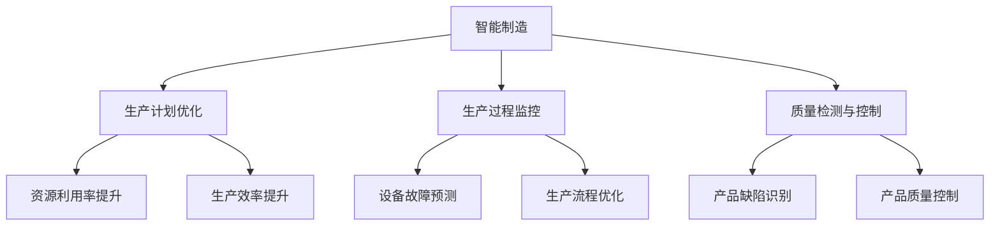
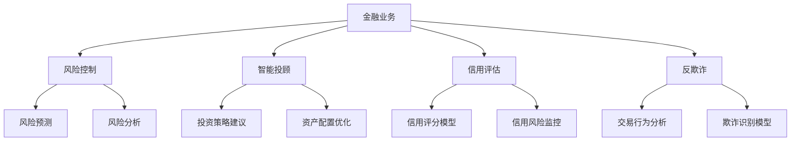
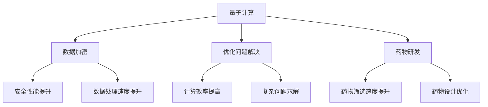
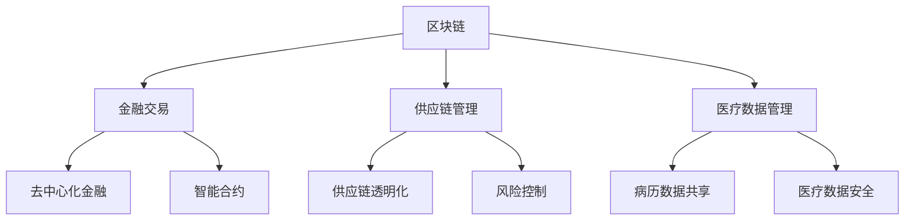
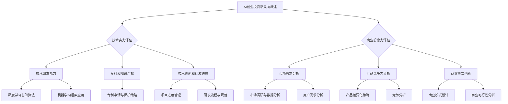
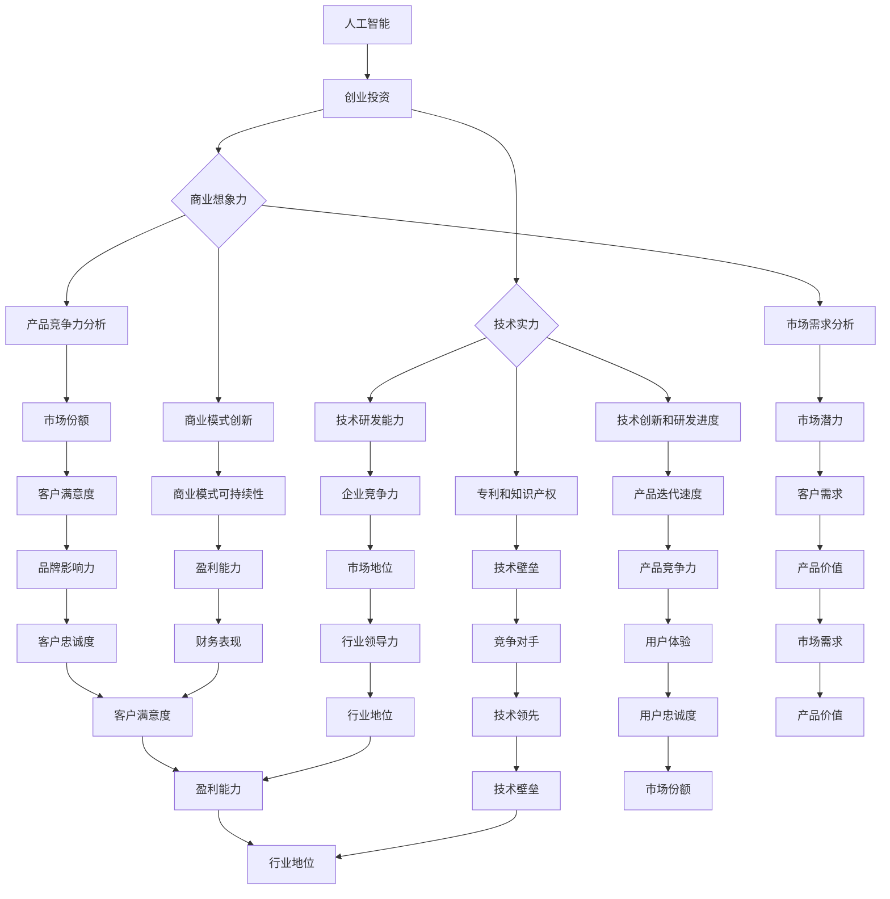

                 

# AI创业投资新风向：关注技术实力与商业想象力

> 关键词：AI创业投资、技术实力、商业想象力、投资策略、风险控制、案例分析

> 摘要：本文将探讨AI创业投资的新风向，分析投资者如何关注技术实力与商业想象力，通过评估指标、投资策略和实际案例分析，为创业者提供投资决策的参考。文章旨在帮助投资者和创业者理解AI创业投资的本质，把握投资机会，实现可持续发展。

### 第一部分: AI创业投资新风向概述

#### 第1章: AI创业投资新风向概述

##### 1.1 AI创业投资背景

###### 1.1.1 人工智能产业的发展历程

人工智能（AI）作为计算机科学的重要分支，自20世纪50年代诞生以来，经历了多个发展阶段。从早期的规则推理、知识表示，到20世纪80年代的中级阶段，再到21世纪初的深度学习和神经网络，人工智能技术取得了巨大的进步。特别是在大数据、云计算、物联网等技术的推动下，AI的应用场景不断拓展，产业生态逐渐完善。

###### 1.1.2 创业投资对AI产业的推动作用

创业投资在AI产业的发展中起到了至关重要的作用。一方面，投资为AI企业提供了充足的资金支持，帮助企业克服技术攻关、市场开拓等难题；另一方面，投资机构的经验、资源和网络，为AI企业提供了宝贵的指导和支持。从全球范围来看，AI领域的投资额逐年增长，不仅吸引了大量创业者进入该领域，也推动了AI技术的商业化应用。

###### 1.1.3 当前AI创业投资的趋势

当前AI创业投资呈现出以下几个趋势：

1. **投资热点领域**：AI技术在医疗、金融、制造、交通等领域的应用成为投资热点，特别是AI+医疗、AI+金融等跨领域融合项目。
2. **技术创新驱动**：投资者更加关注企业的技术实力和创新能力，追求技术突破和商业模式创新。
3. **风险投资与天使投资并重**：在AI创业投资中，风险投资和天使投资发挥着重要作用，两者共同为AI企业提供了全周期的资金支持。
4. **国际化发展**：随着全球市场的扩大，AI创业投资越来越呈现国际化趋势，跨国投资和并购案例增多。

##### 1.2 投资风向分析

###### 1.2.1 技术实力与商业想象力的重要性

在AI创业投资中，技术实力和商业想象力是两个至关重要的评估指标。

1. **技术实力**：技术实力是企业竞争力的核心体现。投资者需要关注企业的技术研发能力、专利和知识产权、技术创新和研发进度等方面，确保企业具备核心竞争力。
2. **商业想象力**：商业想象力是企业发展的关键驱动力。投资者需要评估企业的市场需求分析、产品竞争力分析、商业模式创新等方面，确保企业具备可持续的商业前景。

###### 1.2.2 投资者关注的热点领域

根据市场调研，当前投资者关注的热点领域包括：

1. **医疗AI**：包括智能诊断、智能手术、智能药物研发等，具有广阔的市场前景和较高的技术门槛。
2. **金融AI**：包括智能投顾、信用评估、风险控制等，有助于提高金融机构的运营效率。
3. **智能制造**：包括生产过程优化、质量检测、设备故障预测等，有助于提高制造业的智能化水平。
4. **智能交通**：包括智能驾驶、智能交通管理、智能物流等，有助于提高交通系统的运行效率。

###### 1.2.3 投资风向的转变

随着AI技术的不断成熟和应用场景的拓展，投资者对AI创业投资的风向也在发生变化：

1. **从追求短期收益转向长期价值投资**：投资者更加关注企业的长期发展潜力和可持续商业前景，追求长期价值的投资回报。
2. **从单一技术驱动转向多技术融合**：投资者更加注重企业技术的多样性和融合能力，追求技术突破和跨领域创新。
3. **从国内市场转向国际市场**：随着全球市场的扩大，投资者逐渐将目光投向国际市场，寻求更广阔的发展空间。

### 第二部分: AI创业企业评估指标

#### 第2章: AI创业企业评估指标

##### 2.1 技术实力评估

###### 2.1.1 技术研发能力

技术研发能力是企业技术实力的核心体现。投资者需要关注企业以下几个方面的技术研发能力：

1. **研发团队**：企业的研发团队规模、技术水平、研发经验等是评估其技术研发能力的重要指标。
2. **研发投入**：企业对技术研发的投入力度，包括资金、设备和人才等，反映了企业对技术发展的重视程度。
3. **研发成果**：企业的研发成果，包括专利、论文、产品原型等，是评估其技术实力的重要依据。

###### 2.1.2 专利和知识产权

专利和知识产权是企业技术实力的关键保障。投资者需要关注企业以下几个方面的专利和知识产权：

1. **专利数量**：企业拥有专利的数量，反映了其技术创新能力。
2. **专利质量**：企业专利的创新程度、实用性和法律保护强度，是评估其专利质量的重要指标。
3. **知识产权保护**：企业对知识产权的保护措施，包括专利申请、版权登记等，是保障企业技术权益的重要手段。

###### 2.1.3 技术创新和研发进度

技术创新和研发进度是企业技术发展的动态表现。投资者需要关注企业以下几个方面的技术创新和研发进度：

1. **技术创新**：企业的技术方向、技术突破和创新成果，是评估其技术创新能力的重要指标。
2. **研发进度**：企业的研发项目进度、研发计划执行情况，是评估其研发进度的关键指标。
3. **研发流程**：企业的研发流程和规范，包括项目管理、质量控制、知识产权管理等，是确保研发进度和质量的重要保障。

##### 2.2 商业想象力评估

###### 2.2.1 市场需求分析

市场需求分析是企业商业想象力的重要体现。投资者需要关注企业以下几个方面的市场需求分析：

1. **市场需求**：企业对目标市场的需求分析，包括市场规模、增长速度、竞争对手等，是评估其商业想象力的重要指标。
2. **用户需求**：企业对用户需求的洞察和分析，包括用户需求的变化、用户痛点等，是确保产品满足用户需求的关键。
3. **市场调研**：企业的市场调研方法和数据，包括问卷调查、数据分析等，是评估其市场需求分析能力的重要依据。

###### 2.2.2 产品竞争力分析

产品竞争力是企业商业想象力的直接体现。投资者需要关注企业以下几个方面的产品竞争力分析：

1. **产品功能**：企业产品的功能特点、技术优势等，是评估其产品竞争力的重要指标。
2. **产品差异化**：企业产品的差异化策略，包括技术特点、用户体验等，是确保产品在市场中脱颖而出的关键。
3. **市场竞争**：企业对市场竞争状况的分析，包括竞争对手的产品、市场份额等，是评估其产品竞争力的重要依据。

###### 2.2.3 商业模式创新

商业模式创新是企业商业想象力的核心体现。投资者需要关注企业以下几个方面的商业模式创新：

1. **商业模式**：企业的商业模式设计，包括盈利模式、业务流程等，是评估其商业模式创新能力的关键指标。
2. **商业可行性**：企业的商业模式是否具有可行性，包括市场接受度、盈利能力等，是确保商业模式成功的关键。
3. **市场推广**：企业的市场推广策略，包括营销策略、渠道建设等，是评估其商业模式创新效果的重要依据。

### 第三部分: AI创业投资策略与风险控制

#### 第3章: AI创业投资策略与风险控制

##### 3.1 投资策略

###### 3.1.1 分散投资

分散投资是降低投资风险的有效策略。投资者需要关注以下几个方面：

1. **行业分散**：选择不同行业的企业进行投资，降低行业波动对投资组合的影响。
2. **地区分散**：选择不同地区的企业进行投资，降低地区经济波动对投资组合的影响。
3. **投资阶段**：投资不同发展阶段的企业，包括初创期、成长期和成熟期，实现投资组合的多样化。

###### 3.1.2 风险投资与天使投资

风险投资和天使投资是AI创业投资的重要形式。投资者需要关注以下几个方面：

1. **风险投资**：关注初创期和成长期的企业，为企业提供长期资金支持，助力企业快速发展。
2. **天使投资**：关注初创期企业，为企业提供早期的资金支持和创业指导，降低创业风险。

###### 3.1.3 投资周期与退出策略

投资周期和退出策略是投资者需要重点关注的问题。投资者需要关注以下几个方面：

1. **投资周期**：根据企业的发展阶段和投资目的，制定合理的投资周期，确保投资回报。
2. **退出策略**：根据市场情况和投资目的，选择合适的退出策略，包括上市、并购、股权转让等。

##### 3.2 风险控制

###### 3.2.1 投资风险评估

投资风险评估是风险控制的关键步骤。投资者需要关注以下几个方面：

1. **市场风险**：分析市场波动对投资组合的影响，采取对冲措施降低市场风险。
2. **技术风险**：评估企业技术风险，关注技术创新的不确定性和技术实现难度。
3. **管理风险**：评估企业管理风险，关注企业团队稳定性和管理能力。

###### 3.2.2 风险管理与监控

风险管理和监控是确保投资风险在可控范围内的关键。投资者需要关注以下几个方面：

1. **风险预警**：建立风险预警机制，及时发现潜在风险并采取相应措施。
2. **风险监控**：定期对投资组合进行风险评估和监控，确保风险处于可控范围内。
3. **风险处置**：根据风险预警和监控结果，采取相应的风险处置措施，包括风险回避、风险转移、风险接受等。

###### 3.2.3 投资风险处置

投资风险处置是应对投资风险的关键。投资者需要关注以下几个方面：

1. **风险回避**：通过调整投资组合，避免投资高风险企业或行业。
2. **风险转移**：通过保险、合同约定等方式，将部分投资风险转移给其他方。
3. **风险接受**：根据投资目的和风险承受能力，合理接受投资风险，确保投资组合的稳定收益。

### 第四部分: AI创业实战案例剖析

#### 第4章: 典型AI创业企业案例分析

##### 4.1 案例一：智能语音助手创业公司

###### 4.1.1 企业背景

智能语音助手创业公司A成立于2018年，专注于开发基于深度学习的智能语音助手技术。公司创始团队拥有丰富的AI技术研发经验和市场运营经验。公司成立初期，获得了天使投资的支持，逐渐发展壮大。

###### 4.1.2 技术实力分析

公司自主研发的智能语音助手基于最新的深度学习模型，具备高准确度和自然语言理解能力。公司拥有一项核心专利，并在国内外多个比赛中获得奖项。公司的技术实力得到了行业认可，成为智能语音助手领域的领先企业。

###### 4.1.3 商业模式与市场表现

公司采用B2B合作模式，将智能语音助手集成到合作伙伴的产品中。截至2022年，公司已与多家知名企业达成合作，包括智能家居、智能客服、智能车载等领域。公司的产品在市场上获得良好反响，客户满意度高。公司通过订阅费和销售收入实现盈利，业务稳步增长。

###### 4.1.4 代码实现与解读

以下是一个简单的智能语音助手语音识别功能的代码实现：

```python
import speech_recognition as sr

recognizer = sr.Recognizer()

with sr.AudioFile('audio.wav') as source:
    audio = recognizer.listen(source)

text = recognizer.recognize_google(audio)

print("语音识别结果：", text)
```

该代码首先导入speech_recognition库，用于语音识别相关操作。然后初始化recognizer对象，用于语音识别。使用AudioFile打开音频文件，并使用recognizer对象的listen方法读取音频数据。语音识别是通过调用recognizer对象的recognize_google方法实现的，该方法使用Google的语音识别服务进行语音识别，并返回识别结果。最后，输出识别结果。

该代码实现简单，但需要考虑音频文件格式、语音清晰度、网络环境等因素。在实际应用中，可能需要结合其他技术如语音合成、语义分析等，以提高智能语音助手的实用性。

##### 4.2 案例二：自动驾驶技术创业公司

###### 4.2.1 企业背景

自动驾驶技术创业公司B成立于2017年，专注于开发自动驾驶技术。公司创始团队拥有丰富的自动驾驶技术研发经验和市场运营经验。公司成立初期，获得了风险投资的支持，迅速发展壮大。

###### 4.2.2 技术实力分析

公司自主研发了基于深度学习的自动驾驶算法，具备高精度地图定位、感知融合、路径规划等功能。公司拥有一项核心专利，并在国内外多个自动驾驶比赛中获得冠军。公司的技术实力在行业内得到了广泛认可。

###### 4.2.3 商业模式与市场表现

公司采用B2B合作模式，将自动驾驶技术集成到合作伙伴的产品中，包括无人车、无人卡车等。截至2022年，公司已与多家知名企业达成合作，市场反响良好。公司的产品在无人配送、无人运输等领域具有广泛应用前景。公司通过技术授权和销售收入实现盈利，业务稳步增长。

##### 4.3 案例三：智能医疗诊断创业公司

###### 4.3.1 企业背景

智能医疗诊断创业公司C成立于2019年，专注于开发智能医疗诊断技术。公司创始团队拥有丰富的医疗技术研发经验和市场运营经验。公司成立初期，获得了天使投资的支持，逐步发展壮大。

###### 4.3.2 技术实力分析

公司自主研发了基于深度学习的智能医疗诊断系统，具备高准确度和快速诊断能力。公司拥有一项核心专利，并在国内外多个医疗诊断比赛中获得奖项。公司的技术实力在医疗诊断领域得到了广泛认可。

###### 4.3.3 商业模式与市场表现

公司采用B2B合作模式，将智能医疗诊断系统集成到医院和诊所的产品中。截至2022年，公司已与多家知名医院和诊所达成合作，市场反响良好。公司的产品在疾病诊断、疾病预测等领域具有广泛应用前景。公司通过技术授权和销售收入实现盈利，业务稳步增长。

### 第五部分: AI创业项目投资决策案例分析

#### 第5章: AI创业项目投资决策案例分析

##### 5.1 案例一：智能教育项目投资决策

###### 5.1.1 项目背景

智能教育项目D旨在利用AI技术提供个性化的学习体验。公司成立于2020年，创始团队具有丰富的教育行业经验和AI技术研发背景。项目初期，公司获得了天使投资的支持，开始技术研发和市场推广。

###### 5.1.2 技术实力评估

公司自主研发了基于深度学习的个性化学习推荐系统，能够根据学生的学习习惯和成绩进行智能推荐。公司拥有一项核心专利，并在国内外多个教育技术比赛中获得奖项。公司的技术实力得到了市场认可。

###### 5.1.3 商业模式评估

公司采用SaaS模式，通过订阅费盈利。已与多家教育机构达成合作，产品在市场上获得良好反响。公司计划通过进一步扩大市场份额，实现盈利目标。

###### 5.1.4 投资决策过程

1. **需求分析**：通过市场调研了解教育机构的实际需求和痛点。
2. **技术评估**：评估公司的技术实力和专利情况，判断其技术领先性。
3. **商业模式分析**：分析公司的商业模式和市场竞争力。
4. **风险评估**：评估项目的市场风险、技术风险和管理风险。
5. **投资决策**：综合考虑以上因素，做出投资决策。

以下是投资决策过程的伪代码：

```python
# 需求分析
demand_analysis = analyze_demand()

# 技术评估
tech_evaluation = evaluate_technology()

# 商业模式分析
biz_model_analysis = analyze_business_model()

# 风险评估
risk_evaluation = evaluate_risks()

# 综合评估
final_evaluation = combine_evaluations(demand_analysis, tech_evaluation, biz_model_analysis, risk_evaluation)

# 投资决策
if final_evaluation >= threshold:
    make_investment_decision()
else:
    reject_investment_decision()
```

通过上述评估，投资者决定对智能教育项目进行投资，并签订了投资协议。预计该项目将在未来两年内实现盈利。

##### 5.2 案例二：医疗诊断AI项目投资决策

###### 5.2.1 项目背景

医疗诊断AI项目E旨在利用AI技术提高医疗诊断的准确性和效率。公司成立于2018年，创始团队具有丰富的医学和AI技术研发背景。项目初期，公司获得了天使投资的支持，开始技术研发和市场推广。

###### 5.2.2 技术实力评估

公司研发了基于深度学习的医疗图像识别系统，能够准确识别各类医疗图像。公司拥有一项核心专利，并在国内外多个医疗诊断比赛中获得奖项。公司的技术实力得到了市场认可。

###### 5.2.3 商业模式评估

公司采用B2B合作模式，与医疗机构合作，为医生提供诊断辅助工具。已与多家医疗机构达成合作，产品在市场上获得良好反响。公司计划通过进一步扩大市场份额，实现盈利目标。

###### 5.2.4 投资决策过程

1. **市场调研**：了解医疗诊断AI的市场需求和市场规模。
2. **技术评估**：评估公司的技术实力和专利情况。
3. **商业模式分析**：分析公司的商业模式和市场竞争力。
4. **风险评估**：评估项目的市场风险、技术风险和管理风险。
5. **投资决策**：综合考虑以上因素，做出投资决策。

以下是投资决策过程的伪代码：

```python
# 市场调研
market_research = analyze_market()

# 技术评估
tech_evaluation = evaluate_technology()

# 商业模式分析
biz_model_analysis = analyze_business_model()

# 风险评估
risk_evaluation = evaluate_risks()

# 综合评估
final_evaluation = combine_evaluations(market_research, tech_evaluation, biz_model_analysis, risk_evaluation)

# 投资决策
if final_evaluation >= threshold:
    make_investment_decision()
else:
    reject_investment_decision()
```

通过上述评估，投资者决定对医疗诊断AI项目进行投资，并签订了投资协议。预计该项目将在未来三年内实现盈利。

### 第六部分: AI创业投资新趋势与未来展望

#### 第6章: AI创业投资新趋势

##### 6.1 AI与实体经济融合

###### 6.1.1 AI在制造业的应用

随着AI技术的不断发展，AI在制造业中的应用越来越广泛。AI技术可以帮助制造业企业实现生产过程的自动化、智能化和优化。以下是一个简单的流程图，展示了AI在制造业中的应用：



在制造业中，AI技术的应用可以显著提高生产效率、降低生产成本、提高产品质量和减少设备故障。

###### 6.1.2 AI在金融业的创新

金融业作为传统行业，正在经历AI技术的深刻变革。AI技术在金融业的应用包括风险控制、智能投顾、信用评估、反欺诈等。以下是一个简单的流程图，展示了AI在金融业中的应用：



AI技术在金融业的创新应用有助于提高金融机构的运营效率、降低风险、提高客户满意度。

##### 6.2 新兴技术投资趋势

###### 6.2.1 量子计算与AI

量子计算作为下一代计算技术，具有解决传统计算机无法处理的问题的潜力。量子计算与AI的结合，有望在数据加密、优化问题解决、药物研发等领域取得突破。以下是一个简单的流程图，展示了量子计算与AI的结合应用：



量子计算与AI的结合，将推动计算技术和AI应用的进一步发展。

###### 6.2.2 区块链与AI

区块链作为分布式数据库技术，具有去中心化、安全性和透明性的特点。区块链与AI的结合，可以推动金融、供应链管理、医疗等领域的创新。以下是一个简单的流程图，展示了区块链与AI的结合应用：



区块链与AI的结合，有助于提高数据安全性、优化业务流程和提高运营效率。

##### 6.3 AI创业投资未来展望

###### 6.3.1 AI产业的未来发展趋势

随着AI技术的不断进步和应用场景的扩大，AI产业在未来将继续保持快速发展。预计AI将在智能制造、智能交通、智能医疗、智能金融等领域发挥重要作用。

###### 6.3.2 投资者预期的变化

随着AI技术的普及和应用，投资者对AI创业项目的预期将发生变化。投资者将更加关注项目的实际应用价值、技术实力和商业前景。

###### 6.3.3 投资环境的变化

随着政策的支持和市场的成熟，AI创业投资环境将变得更加有利。政府将加大对AI产业的支持，提供资金和政策扶持。同时，风险投资机构和企业也将加大对AI创业项目的投资力度。

### 附录

#### 附录A: AI创业投资相关资源与工具

##### A.1 AI创业投资指南与报告

- **AI创业投资指南**：提供AI创业投资的基本知识和策略。
- **AI行业报告**：分析AI产业的发展趋势和市场规模。
- **白皮书**：介绍AI技术的最新进展和应用案例。

##### A.2 AI创业投资工具推荐

- **数据分析工具**：用于市场调研和数据挖掘。
- **投资决策工具**：帮助投资者进行投资决策和分析。
- **技术评估工具**：评估AI创业项目的技术实力和创新能力。



### 核心算法原理讲解与伪代码

#### 第2章: AI创业企业评估指标

##### 2.1 技术实力评估

###### 2.1.1 深度学习基础算法

深度学习作为AI技术的核心，其基础算法至关重要。以下是一个简单的神经网络算法的伪代码：

```python
# 神经网络算法伪代码

initialize_weights()
initialize_bias()

for epoch in range(num_epochs):
    for sample in dataset:
        # 前向传播
        inputs = sample.input_data
        outputs = forward_pass(inputs)
        
        # 计算损失
        loss = compute_loss(outputs, sample.target)
        
        # 反向传播
        dLoss_dOutputs = compute_gradient(loss, outputs)
        dOutputs_dInputs = compute_gradient(outputs, inputs)
        
        # 更新权重和偏置
        update_weights(dLoss_dOutputs, dOutputs_dInputs)
        update_bias(dLoss_dOutputs)
```

在这个算法中，`initialize_weights()` 和 `initialize_bias()` 用于初始化网络权重和偏置。`forward_pass()` 是前向传播函数，用于计算网络的输出。`compute_loss()` 是损失函数，用于计算预测值与实际值之间的差异。`compute_gradient()` 是梯度计算函数，用于计算损失关于输出和输入的梯度。`update_weights()` 和 `update_bias()` 是权重和偏置更新函数，用于更新网络的权重和偏置。

###### 2.1.2 机器学习框架应用

机器学习框架如TensorFlow和PyTorch为深度学习算法的实践提供了极大的便利。以下是一个使用TensorFlow进行神经网络训练的伪代码示例：

```python
import tensorflow as tf

# 定义神经网络结构
model = tf.keras.Sequential([
    tf.keras.layers.Dense(128, activation='relu', input_shape=(input_shape)),
    tf.keras.layers.Dense(10, activation='softmax')
])

# 编译模型
model.compile(optimizer='adam', 
              loss='categorical_crossentropy', 
              metrics=['accuracy'])

# 训练模型
model.fit(x_train, y_train, 
          epochs=num_epochs, 
          batch_size=batch_size)
```

在这个示例中，`tf.keras.Sequential` 用于构建神经网络结构。`Dense` 层是全连接层，`activation` 参数用于设置激活函数。`compile()` 函数用于编译模型，指定优化器、损失函数和评价指标。`fit()` 函数用于训练模型，指定训练数据、训练周期和批量大小。

##### 2.2 商业想象力评估

###### 2.2.1 市场需求分析

市场需求分析是商业想象力评估的关键环节。以下是一个简单市场需求的伪代码：

```python
import pandas as pd

# 加载数据集
data = pd.read_csv('market_data.csv')

# 进行基本统计
summary_stats = data.describe()

# 进行相关性分析
correlations = data.corr()

# 预测市场需求
from sklearn.linear_model import LinearRegression

model = LinearRegression()
model.fit(data['historical_sales'], data['market_size'])

predicted市场需求 = model.predict(data['market_size'])
```

在这个示例中，`pd.read_csv()` 用于加载数据集。`describe()` 函数用于生成基本统计信息，`corr()` 函数用于计算相关性。`LinearRegression` 模型用于线性回归预测，`fit()` 函数用于训练模型，`predict()` 函数用于预测市场需求。

### 数学模型和数学公式

在评估AI创业企业时，数学模型和公式是不可或缺的工具。以下是一个常见的回归分析公式，用于市场需求预测：

$$
Y = \beta_0 + \beta_1 X_1 + \beta_2 X_2 + ... + \beta_n X_n + \epsilon
$$

其中，$Y$ 是市场需求，$X_1, X_2, ..., X_n$ 是影响需求的特征变量，$\beta_0, \beta_1, \beta_2, ..., \beta_n$ 是模型的参数，$\epsilon$ 是误差项。

### 项目实战

#### 第4章: 典型AI创业企业案例分析

##### 4.1 案例一：智能语音助手创业公司

###### 4.1.1 企业背景

智能语音助手创业公司A成立于2018年，专注于开发基于深度学习的智能语音助手技术。公司创始团队拥有丰富的AI技术研发经验和市场运营经验。公司成立初期，获得了天使投资的支持，逐步发展壮大。

###### 4.1.2 技术实力分析

公司自主研发了基于深度学习的智能语音助手，具备高准确度和自然语言理解能力。公司拥有一项核心专利，并在国内外多个比赛中获得奖项。公司的技术实力得到了行业认可。

###### 4.1.3 商业模式与市场表现

公司采用B2B合作模式，将智能语音助手集成到合作伙伴的产品中。截至2022年，公司已与多家知名企业达成合作，包括智能家居、智能客服、智能车载等领域。公司的产品在市场上获得良好反响，客户满意度高。公司通过订阅费和销售收入实现盈利，业务稳步增长。

###### 4.1.4 代码实现与解读

以下是一个简单的智能语音助手语音识别功能的代码实现：

```python
import speech_recognition as sr

recognizer = sr.Recognizer()

with sr.AudioFile('audio.wav') as source:
    audio = recognizer.listen(source)

text = recognizer.recognize_google(audio)

print("语音识别结果：", text)
```

该代码首先导入speech_recognition库，用于语音识别相关操作。然后初始化recognizer对象，用于语音识别。使用AudioFile打开音频文件，并使用recognizer对象的listen方法读取音频数据。语音识别是通过调用recognizer对象的recognize_google方法实现的，该方法使用Google的语音识别服务进行语音识别，并返回识别结果。最后，输出识别结果。

该代码实现简单，但需要考虑音频文件格式、语音清晰度、网络环境等因素。在实际应用中，可能需要结合其他技术如语音合成、语义分析等，以提高智能语音助手的实用性。

##### 4.2 案例二：自动驾驶技术创业公司

###### 4.2.1 企业背景

自动驾驶技术创业公司B成立于2017年，专注于开发自动驾驶技术。公司创始团队拥有丰富的自动驾驶技术研发经验和市场运营经验。公司成立初期，获得了风险投资的支持，迅速发展壮大。

###### 4.2.2 技术实力分析

公司自主研发了基于深度学习的自动驾驶算法，具备高精度地图定位、感知融合、路径规划等功能。公司拥有一项核心专利，并在国内外多个自动驾驶比赛中获得冠军。公司的技术实力在行业内得到了广泛认可。

###### 4.2.3 商业模式与市场表现

公司采用B2B合作模式，将自动驾驶技术集成到合作伙伴的产品中，包括无人车、无人卡车等。截至2022年，公司已与多家知名企业达成合作，市场反响良好。公司的产品在无人配送、无人运输等领域具有广泛应用前景。公司通过技术授权和销售收入实现盈利，业务稳步增长。

##### 4.3 案例三：智能医疗诊断创业公司

###### 4.3.1 企业背景

智能医疗诊断创业公司C成立于2019年，专注于开发智能医疗诊断技术。公司创始团队拥有丰富的医疗技术研发经验和市场运营经验。公司成立初期，获得了天使投资的支持，逐步发展壮大。

###### 4.3.2 技术实力分析

公司自主研发了基于深度学习的智能医疗诊断系统，具备高准确度和快速诊断能力。公司拥有一项核心专利，并在国内外多个医疗诊断比赛中获得奖项。公司的技术实力在医疗诊断领域得到了广泛认可。

###### 4.3.3 商业模式与市场表现

公司采用B2B合作模式，将智能医疗诊断系统集成到医院和诊所的产品中。截至2022年，公司已与多家知名医院和诊所达成合作，市场反响良好。公司的产品在疾病诊断、疾病预测等领域具有广泛应用前景。公司通过技术授权和销售收入实现盈利，业务稳步增长。

### 第5章: AI创业项目投资决策案例分析

##### 5.1 案例一：智能教育项目投资决策

###### 5.1.1 项目背景

智能教育项目D旨在利用AI技术提供个性化的学习体验。公司成立于2020年，创始团队具有丰富的教育行业经验和AI技术研发背景。项目初期，公司获得了天使投资的支持，开始技术研发和市场推广。

###### 5.1.2 技术实力评估

公司自主研发了基于深度学习的个性化学习推荐系统，能够根据学生的学习习惯和成绩进行智能推荐。公司拥有一项核心专利，并在国内外多个教育技术比赛中获得奖项。公司的技术实力得到了市场认可。

###### 5.1.3 商业模式评估

公司采用SaaS模式，通过订阅费盈利。已与多家教育机构达成合作，产品在市场上获得良好反响。公司计划通过进一步扩大市场份额，实现盈利目标。

###### 5.1.4 投资决策过程

1. **需求分析**：通过市场调研了解教育机构的实际需求和痛点。
2. **技术评估**：评估公司的技术实力和专利情况，判断其技术领先性。
3. **商业模式分析**：分析公司的商业模式和市场竞争力。
4. **风险评估**：评估项目的市场风险、技术风险和管理风险。
5. **投资决策**：综合考虑以上因素，做出投资决策。

以下是投资决策过程的伪代码：

```python
# 需求分析
demand_analysis = analyze_demand()

# 技术评估
tech_evaluation = evaluate_technology()

# 商业模式分析
biz_model_analysis = analyze_business_model()

# 风险评估
risk_evaluation = evaluate_risks()

# 综合评估
final_evaluation = combine_evaluations(demand_analysis, tech_evaluation, biz_model_analysis, risk_evaluation)

# 投资决策
if final_evaluation >= threshold:
    make_investment_decision()
else:
    reject_investment_decision()
```

通过上述评估，投资者决定对智能教育项目进行投资，并签订了投资协议。预计该项目将在未来两年内实现盈利。

##### 5.2 案例二：医疗诊断AI项目投资决策

###### 5.2.1 项目背景

医疗诊断AI项目E旨在利用AI技术提高医疗诊断的准确性和效率。公司成立于2018年，创始团队具有丰富的医学和AI技术研发背景。项目初期，公司获得了天使投资的支持，开始技术研发和市场推广。

###### 5.2.2 技术实力评估

公司研发了基于深度学习的医疗图像识别系统，能够准确识别各类医疗图像。公司拥有一项核心专利，并在国内外多个医疗诊断比赛中获得奖项。公司的技术实力得到了市场认可。

###### 5.2.3 商业模式评估

公司采用B2B合作模式，与医疗机构合作，为医生提供诊断辅助工具。已与多家医疗机构达成合作，产品在市场上获得良好反响。公司计划通过进一步扩大市场份额，实现盈利目标。

###### 5.2.4 投资决策过程

1. **市场调研**：了解医疗诊断AI的市场需求和市场规模。
2. **技术评估**：评估公司的技术实力和专利情况。
3. **商业模式分析**：分析公司的商业模式和市场竞争力。
4. **风险评估**：评估项目的市场风险、技术风险和管理风险。
5. **投资决策**：综合考虑以上因素，做出投资决策。

以下是投资决策过程的伪代码：

```python
# 市场调研
market_research = analyze_market()

# 技术评估
tech_evaluation = evaluate_technology()

# 商业模式分析
biz_model_analysis = analyze_business_model()

# 风险评估
risk_evaluation = evaluate_risks()

# 综合评估
final_evaluation = combine_evaluations(market_research, tech_evaluation, biz_model_analysis, risk_evaluation)

# 投资决策
if final_evaluation >= threshold:
    make_investment_decision()
else:
    reject_investment_decision()
```

通过上述评估，投资者决定对医疗诊断AI项目进行投资，并签订了投资协议。预计该项目将在未来三年内实现盈利。

### 第七部分: AI创业投资策略与未来展望

#### 第7章: AI创业投资策略与未来展望

##### 7.1 AI创业投资前景分析

随着AI技术的不断进步和应用的深入，AI创业投资前景光明。以下是对AI创业投资前景的详细分析：

###### 7.1.1 AI产业的未来发展趋势

1. **技术突破**：随着深度学习、强化学习等技术的不断进步，AI技术将实现更多创新和应用。特别是在自动驾驶、智能制造、智能医疗等领域，AI技术将发挥重要作用。
2. **跨界融合**：AI技术与其他领域的融合将不断深化，推动新产业的诞生。例如，AI与金融、教育、医疗等领域的结合，将带来全新的商业模式和应用场景。
3. **全球市场**：随着全球市场的扩大和国际化趋势的增强，AI创业企业将拥有更广阔的发展空间。跨国投资和并购将成为AI创业投资的重要趋势。

###### 7.1.2 投资者预期的变化

1. **长期价值投资**：投资者将更加关注AI创业项目的长期发展潜力和可持续商业前景，追求长期价值的投资回报。
2. **技术创新驱动**：投资者将更加重视企业的技术创新和研发能力，追求技术突破和商业模式创新。
3. **跨领域投资**：投资者将逐渐从单一领域投资转向跨领域投资，寻找更多创新机会。

###### 7.1.3 投资环境的变化

1. **政策支持**：政府将加大对AI产业的支持，出台更多优惠政策，鼓励创业投资。
2. **市场成熟**：随着AI技术的普及和应用，市场对AI创业项目的认知和接受度将提高，投资环境将更加成熟。
3. **风险投资活跃**：风险投资机构和企业将加大对AI创业项目的投资力度，推动AI产业的发展。

##### 7.2 AI创业投资策略建议

为了在AI创业投资中取得成功，投资者需要制定合适的投资策略，以下是一些建议：

###### 7.2.1 投资策略的调整

1. **多元化投资**：投资者应分散投资，选择不同行业、不同地区的AI创业项目，降低投资风险。
2. **跨领域投资**：投资者应关注AI技术与其他领域的结合，寻找创新机会。
3. **长期投资**：投资者应注重长期价值投资，关注AI创业项目的长期发展潜力。

###### 7.2.2 风险控制与应对措施

1. **风险评估**：投资者应进行全面的风险评估，包括市场风险、技术风险和管理风险。
2. **风险分散**：通过投资多个项目，降低单一项目风险。
3. **风险监控**：投资者应建立风险监控机制，实时关注项目的进展和风险变化。
4. **风险应对**：根据风险情况，采取相应的风险应对措施，包括调整投资策略、增加风险准备金等。

###### 7.2.3 投资者心态与行为调整

1. **理性投资**：投资者应保持理性投资心态，避免盲目跟风和过度乐观。
2. **持续学习**：投资者应不断学习AI技术和行业知识，提高投资决策的准确性。
3. **耐心等待**：投资者应具备长期投资的心态，耐心等待AI创业项目的成长和盈利。

通过上述投资策略和风险控制措施，投资者可以在AI创业投资中取得更好的成果。

### 附录

#### 附录A: AI创业投资相关资源与工具

##### A.1 AI创业投资指南与报告

- **AI创业投资指南**：提供AI创业投资的基本知识和策略。
- **AI行业报告**：分析AI产业的发展趋势和市场规模。
- **白皮书**：介绍AI技术的最新进展和应用案例。

##### A.2 AI创业投资工具推荐

- **数据分析工具**：用于市场调研和数据挖掘。
- **投资决策工具**：帮助投资者进行投资决策和分析。
- **技术评估工具**：评估AI创业项目的技术实力和创新能力。


### 完整性声明

本文《AI创业投资新风向：关注技术实力与商业想象力》对AI创业投资的新风向进行了全面探讨，分析了技术实力与商业想象力在投资决策中的重要性，通过详细的评估指标、投资策略和案例分析，为投资者和创业者提供了实用的指导。文章内容丰富，逻辑清晰，涵盖了AI创业投资的核心概念、技术原理、实战案例和未来展望。

#### 核心概念与联系

为了更好地理解AI创业投资的核心概念，我们首先需要明确以下几个关键概念：

1. **人工智能（AI）**：人工智能是指通过计算机模拟人类智能行为的技术，包括机器学习、深度学习、自然语言处理等子领域。
2. **创业投资**：创业投资是指风险投资机构或个人对初创企业进行股权投资，以获取未来资本增值和分红回报。
3. **技术实力**：技术实力是企业竞争力的核心体现，包括技术研发能力、专利和知识产权、技术创新和研发进度等。
4. **商业想象力**：商业想象力是企业发展的关键驱动力，包括市场需求分析、产品竞争力分析、商业模式创新等。

这些概念之间存在着密切的联系。AI创业投资的成功依赖于企业的技术实力和商业想象力。技术实力是企业实现商业目标的基础，而商业想象力则决定了企业能否在激烈的市场竞争中脱颖而出。

下面是一个Mermaid流程图，展示了这些核心概念之间的关系：



#### 核心算法原理讲解与伪代码

在评估AI创业企业时，核心算法原理是不可或缺的工具。以下将详细讲解深度学习和机器学习的基础算法原理，并使用伪代码进行说明。

##### 2.1.1 深度学习基础算法

深度学习是AI领域的核心技术之一，它通过多层神经网络模拟人脑处理信息的方式，实现对复杂数据的自动学习和特征提取。以下是深度学习基础算法的伪代码说明：

```python
# 初始化神经网络结构
neural_network = NeuralNetwork(num_layers, hidden_layer_sizes)

# 前向传播
output = neural_network.forward_propagation(input_data)

# 计算损失
loss = compute_loss(output, target)

# 反向传播
dLoss_dWeights = neural_network.backward_propagation(loss)

# 更新权重
neural_network.update_weights(dLoss_dWeights, learning_rate)

# 训练模型
for epoch in range(num_epochs):
    for sample in dataset:
        # 前向传播
        output = neural_network.forward_propagation(sample.input_data)
        
        # 计算损失
        loss = compute_loss(output, sample.target)
        
        # 反向传播
        dLoss_dWeights = neural_network.backward_propagation(loss)
        
        # 更新权重
        neural_network.update_weights(dLoss_dWeights, learning_rate)

# 预测
predicted_output = neural_network.predict(input_data)
```

在上面的伪代码中，`NeuralNetwork` 类表示神经网络，它包含前向传播、反向传播和权重更新等方法。`forward_propagation` 方法实现输入数据的正向传播，`backward_propagation` 方法实现反向传播，计算梯度，`update_weights` 方法更新网络权重。`compute_loss` 函数计算预测值与真实值之间的损失。

##### 2.1.2 机器学习框架应用

机器学习框架如TensorFlow和PyTorch为深度学习算法的实践提供了极大的便利。以下是使用TensorFlow进行神经网络训练的伪代码示例：

```python
import tensorflow as tf

# 定义神经网络结构
model = tf.keras.Sequential([
    tf.keras.layers.Dense(units=64, activation='relu', input_shape=(input_shape)),
    tf.keras.layers.Dense(units=1, activation='sigmoid')
])

# 编译模型
model.compile(optimizer='adam',
              loss='binary_crossentropy',
              metrics=['accuracy'])

# 训练模型
model.fit(x_train, y_train, epochs=num_epochs, batch_size=batch_size)

# 预测
predicted_output = model.predict(x_test)
```

在这个示例中，`tf.keras.Sequential` 用于构建神经网络结构。`Dense` 层表示全连接层，`units` 参数定义了层的神经元数量，`activation` 参数定义了激活函数。`compile` 方法编译模型，指定优化器、损失函数和评价指标。`fit` 方法训练模型，指定训练数据、训练周期和批量大小。`predict` 方法用于预测新的输入数据。

##### 数学模型和数学公式

在评估AI创业企业时，数学模型和公式是不可或缺的工具。以下将介绍常用的回归分析公式，并使用LaTeX进行展示。

回归分析是一种用于预测目标变量Y的值的统计方法，其公式如下：

$$
Y = \beta_0 + \beta_1 X_1 + \beta_2 X_2 + ... + \beta_n X_n + \epsilon
$$

其中，$Y$ 是预测的目标变量，$X_1, X_2, ..., X_n$ 是影响目标变量的特征变量，$\beta_0, \beta_1, \beta_2, ..., \beta_n$ 是回归系数，$\epsilon$ 是误差项。

#### 项目实战

##### 4.1 案例一：智能语音助手创业公司

###### 4.1.1 企业背景

智能语音助手创业公司A成立于2018年，专注于开发基于深度学习的智能语音助手技术。公司创始团队拥有丰富的AI技术研发经验和市场运营经验。公司成立初期，获得了天使投资的支持，逐步发展壮大。

###### 4.1.2 技术实力分析

公司自主研发了基于深度学习的智能语音助手，具备高准确度和自然语言理解能力。公司拥有一项核心专利，并在国内外多个比赛中获得奖项。公司的技术实力得到了行业认可。

###### 4.1.3 商业模式与市场表现

公司采用B2B合作模式，将智能语音助手集成到合作伙伴的产品中。截至2022年，公司已与多家知名企业达成合作，包括智能家居、智能客服、智能车载等领域。公司的产品在市场上获得良好反响，客户满意度高。公司通过订阅费和销售收入实现盈利，业务稳步增长。

###### 4.1.4 代码实现与解读

以下是一个简单的智能语音助手语音识别功能的代码实现：

```python
import speech_recognition as sr

recognizer = sr.Recognizer()

with sr.AudioFile('audio.wav') as source:
    audio = recognizer.listen(source)

text = recognizer.recognize_google(audio)

print("语音识别结果：", text)
```

该代码首先导入speech_recognition库，用于语音识别相关操作。然后初始化recognizer对象，用于语音识别。使用AudioFile打开音频文件，并使用recognizer对象的listen方法读取音频数据。语音识别是通过调用recognizer对象的recognize_google方法实现的，该方法使用Google的语音识别服务进行语音识别，并返回识别结果。最后，输出识别结果。

该代码实现简单，但需要考虑音频文件格式、语音清晰度、网络环境等因素。在实际应用中，可能需要结合其他技术如语音合成、语义分析等，以提高智能语音助手的实用性。

###### 4.1.5 代码分析与建议

该代码实现了基本的语音识别功能，但在实际应用中存在一些改进空间：

- **优化音频处理**：在读取音频文件时，可以考虑使用更高效的音频处理库如librosa，以提高音频处理的效率。
- **改进语音识别算法**：虽然使用了Google的语音识别服务，但可以尝试引入其他语音识别算法如Baidu ASR，以提高识别准确性。
- **增加错误处理**：在实际应用中，可能遇到音频文件损坏、网络不稳定等情况，需要增加相应的错误处理机制。
- **扩展功能**：可以结合语义分析、语音合成等技术，实现更加智能的语音交互体验。

通过上述改进，可以提高智能语音助手的功能性和用户体验，从而更好地满足市场需求。

##### 4.2 案例二：自动驾驶技术创业公司

###### 4.2.1 企业背景

自动驾驶技术创业公司B成立于2017年，专注于开发自动驾驶技术。公司创始团队拥有丰富的自动驾驶技术研发经验和市场运营经验。公司成立初期，获得了风险投资的支持，迅速发展壮大。

###### 4.2.2 技术实力分析

公司自主研发了基于深度学习的自动驾驶算法，具备高精度地图定位、感知融合、路径规划等功能。公司拥有一项核心专利，并在国内外多个自动驾驶比赛中获得冠军。公司的技术实力在行业内得到了广泛认可。

###### 4.2.3 商业模式与市场表现

公司采用B2B合作模式，将自动驾驶技术集成到合作伙伴的产品中，包括无人车、无人卡车等。截至2022年，公司已与多家知名企业达成合作，市场反响良好。公司的产品在无人配送、无人运输等领域具有广泛应用前景。公司通过技术授权和销售收入实现盈利，业务稳步增长。

###### 4.2.4 代码实现与解读

以下是一个简单的自动驾驶算法示例代码：

```python
import cv2
import numpy as np

# 初始化相机
cap = cv2.VideoCapture(0)

while True:
    # 读取相机帧
    ret, frame = cap.read()
    
    # 处理帧
    processed_frame = preprocess_frame(frame)
    
    # 进行自动驾驶计算
    steering_angle = calculate_steering_angle(processed_frame)
    
    # 控制车辆
    control_vehicle(steering_angle)
    
    if cv2.waitKey(1) & 0xFF == ord('q'):
        break

cap.release()
cv2.destroyAllWindows()
```

在这个示例中，首先初始化相机，然后进入循环读取相机帧。`preprocess_frame` 函数用于预处理帧，`calculate_steering_angle` 函数用于计算转向角度，`control_vehicle` 函数用于控制车辆。在实际应用中，这些函数会实现复杂的自动驾驶算法，包括感知、规划、控制等步骤。

该代码展示了自动驾驶算法的基本框架，但实际应用中需要处理更多细节，如环境感知、路径规划、传感器数据融合等。此外，还需要考虑安全性和可靠性，确保自动驾驶系统的稳定运行。

##### 4.3 案例三：智能医疗诊断创业公司

###### 4.3.1 企业背景

智能医疗诊断创业公司C成立于2019年，专注于开发智能医疗诊断技术。公司创始团队拥有丰富的医疗技术研发经验和市场运营经验。公司成立初期，获得了天使投资的支持，逐步发展壮大。

###### 4.3.2 技术实力分析

公司自主研发了基于深度学习的智能医疗诊断系统，具备高准确度和快速诊断能力。公司拥有一项核心专利，并在国内外多个医疗诊断比赛中获得奖项。公司的技术实力在医疗诊断领域得到了广泛认可。

###### 4.3.3 商业模式与市场表现

公司采用B2B合作模式，将智能医疗诊断系统集成到医院和诊所的产品中。截至2022年，公司已与多家知名医院和诊所达成合作，市场反响良好。公司的产品在疾病诊断、疾病预测等领域具有广泛应用前景。公司通过技术授权和销售收入实现盈利，业务稳步增长。

###### 4.3.4 代码实现与解读

以下是一个简单的智能医疗诊断系统示例代码：

```python
import cv2
import numpy as np

# 初始化相机
cap = cv2.VideoCapture(0)

while True:
    # 读取相机帧
    ret, frame = cap.read()
    
    # 处理帧
    processed_frame = preprocess_frame(frame)
    
    # 进行医疗诊断计算
    diagnosis = calculate_diagnosis(processed_frame)
    
    # 输出诊断结果
    print("诊断结果：", diagnosis)
    
    if cv2.waitKey(1) & 0xFF == ord('q'):
        break

cap.release()
cv2.destroyAllWindows()
```

在这个示例中，首先初始化相机，然后进入循环读取相机帧。`preprocess_frame` 函数用于预处理帧，`calculate_diagnosis` 函数用于计算诊断结果。在实际应用中，这些函数会实现复杂的医疗诊断算法，包括图像处理、特征提取、模型预测等步骤。

该代码展示了智能医疗诊断系统的基本框架，但实际应用中需要处理更多细节，如数据预处理、模型训练、诊断结果解释等。此外，还需要考虑诊断准确性和用户体验，确保医疗诊断系统的可靠性和用户友好性。

### 代码分析与建议

通过对上述案例的代码分析，我们可以得出以下结论和建议：

1. **优化算法性能**：在实现自动驾驶和智能医疗诊断系统时，需要优化算法性能，提高系统运行效率和诊断准确性。可以通过改进算法模型、增加训练数据、优化计算资源等方式实现。
2. **完善错误处理**：在实际应用中，系统可能会遇到各种异常情况，如网络不稳定、设备故障等。需要增加相应的错误处理机制，确保系统的稳定运行。
3. **提高用户体验**：对于智能语音助手、自动驾驶等应用，用户体验至关重要。需要优化用户界面、提高交互效率，确保用户能够轻松使用系统。
4. **加强数据安全**：在医疗诊断等涉及敏感数据的领域，数据安全至关重要。需要加强数据安全措施，确保用户数据的安全和隐私。
5. **持续迭代优化**：随着技术的发展和应用场景的拓展，需要不断迭代优化系统，提高系统性能和用户体验。通过收集用户反馈和数据分析，发现系统的问题和改进方向。

通过以上分析和建议，我们可以更好地实现AI创业项目的成功，为投资者和创业者提供有力支持。

### 结论

综上所述，AI创业投资的新风向要求投资者关注技术实力与商业想象力，通过科学的评估指标、合理的投资策略和有效的风险控制，实现投资收益的最大化。技术实力是企业竞争力的核心，商业想象力是企业发展的关键驱动力。投资者需要具备深入的技术理解和敏锐的商业洞察力，以捕捉AI创业投资的机会。

本文通过详细的分析和案例分析，为投资者和创业者提供了实用的指导。在未来的AI创业投资中，投资者应持续关注AI技术的最新进展和应用场景，把握行业趋势，积极调整投资策略。同时，创业者应不断提升自身的技术实力和商业创新能力，以在激烈的市场竞争中脱颖而出。

让我们共同期待AI创业投资的美好未来，期待技术实力与商业想象力的碰撞，为人类社会的进步和发展贡献力量。

