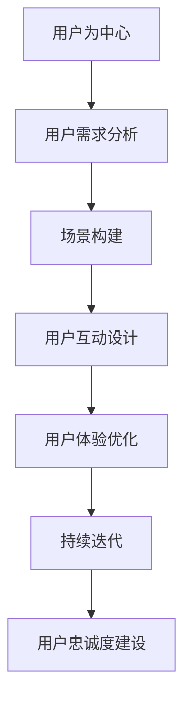
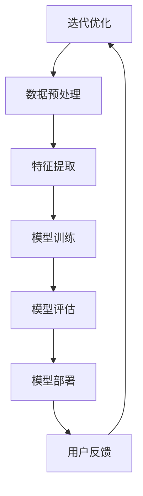

                 

# 文章标题：AI创业者坚持：以用户为中心的场景虹吸

> 关键词：AI创业，用户中心，场景虹吸，用户体验，技术实战，案例分析

> 摘要：
本文旨在探讨AI创业者在市场竞争中如何坚持以用户为中心，通过场景虹吸策略实现产品创新和用户粘性。文章从AI创业的基础出发，深入分析用户为中心的理念，探讨AI技术与场景应用，并通过具体案例展示AI创业实践的步骤和技巧，最后讨论AI创业的持续发展策略。

## 《AI创业者坚持：以用户为中心的场景虹吸》目录大纲

### 第一部分：AI创业基础与用户中心理念

#### 第1章：AI创业概述

- 1.1 AI创业的时代背景
- 1.2 AI创业的核心挑战
- 1.3 AI创业的成功要素

#### 第2章：用户为中心的理念

- 2.1 用户体验的重要性
- 2.2 以用户为中心的设计方法
- 2.3 用户行为分析与场景构建

### 第二部分：AI技术与场景应用

#### 第3章：AI技术基础

- 3.1 机器学习与深度学习基础
- 3.2 自然语言处理技术
- 3.3 计算机视觉技术

#### 第4章：场景分析

- 4.1 场景识别与分类
- 4.2 用户需求分析
- 4.3 场景互动设计与实现

#### 第5章：场景虹吸策略

- 5.1 场景虹吸原理
- 5.2 用户需求挖掘
- 5.3 场景虹吸应用实例

### 第三部分：创业实践与案例分析

#### 第6章：AI创业项目规划

- 6.1 项目规划步骤
- 6.2 风险评估与应对策略
- 6.3 资源配置与时间规划

#### 第7章：AI创业案例分析

- 7.1 案例一：某智能语音助手项目
- 7.2 案例二：某智能推荐系统项目
- 7.3 案例三：某智能安防项目

#### 第8章：AI创业持续发展

- 8.1 创业团队的持续成长
- 8.2 产品迭代与优化
- 8.3 企业文化与用户忠诚度建设

### 附录

#### 附录A：AI创业资源与工具

- A.1 常用AI开发工具介绍
- A.2 AI创业相关书籍推荐
- A.3 在线学习平台与社区资源

## 核心概念与联系

### 人工智能架构与用户中心理念



### 人工智能架构



## 第一部分：AI创业基础与用户中心理念

### 第1章：AI创业概述

#### 1.1 AI创业的时代背景

在21世纪，人工智能（AI）已经成为推动技术进步和社会变革的核心力量。从2012年深度学习在ImageNet图像识别比赛中取得突破性成果以来，AI技术快速发展，逐渐渗透到各行各业，从医疗、金融、教育到零售、制造等，AI技术正在改变我们的生活方式和工作模式。

#### 1.2 AI创业的核心挑战

AI创业面临的挑战包括但不限于：

- 技术复杂性：AI技术涉及大量的数学、统计学和计算机科学知识，对创业团队的技术能力有较高要求。
- 数据获取与处理：高质量的数据是AI模型训练的关键，数据获取和清洗是一项繁琐且成本高昂的任务。
- 资金与资源：AI创业通常需要大量的资金投入，从硬件设备到算法优化，资源限制是创业初期的常见问题。
- 竞争激烈：随着AI技术的普及，市场竞争日益激烈，创业公司需要快速创新，才能在激烈的市场中脱颖而出。

#### 1.3 AI创业的成功要素

AI创业的成功要素包括：

- 明确的目标与愿景：创业公司需要有清晰的发展方向和长远目标。
- 创新的技术：基于先进的技术理念和创新，提供独特的解决方案。
- 强大的团队：创业团队需要有跨学科的知识结构和高效的协作能力。
- 用户需求驱动：始终坚持以用户为中心，深入了解用户需求，持续优化产品。
- 良好的商业模式：找到可持续的商业盈利模式，确保公司的长期发展。

### 第2章：用户为中心的理念

#### 2.1 用户体验的重要性

用户体验（UX）是产品成功的关键因素。一个优秀的产品不仅要有强大的功能，还要提供良好的使用体验。以下是一些用户体验的关键方面：

- 易用性：用户能否轻松上手使用产品。
- 交互设计：界面设计是否符合用户习惯，操作是否流畅。
- 反馈机制：用户在使用过程中能否获得及时的反馈。
- 个性化和定制化：产品能否根据用户的需求进行个性化调整。

#### 2.2 以用户为中心的设计方法

以用户为中心的设计方法（UCD）是一种以用户需求为导向的设计流程，包括以下步骤：

- 用户研究：深入了解目标用户，收集用户需求和行为数据。
- 原型设计：基于用户研究，快速构建原型，进行用户测试和反馈。
- 设计迭代：根据用户反馈，不断优化设计，提高产品的易用性和用户满意度。
- 用户反馈：持续收集用户反馈，确保产品始终符合用户需求。

#### 2.3 用户行为分析与场景构建

用户行为分析是了解用户需求和行为模式的重要手段。通过用户行为分析，创业者可以构建以下场景：

- 场景识别：识别用户在不同场景下的行为模式。
- 用户需求分析：分析用户在不同场景下的具体需求。
- 场景构建：根据用户需求，构建适用于不同场景的产品功能。

### 第二部分：AI技术与场景应用

#### 第3章：AI技术基础

#### 3.1 机器学习与深度学习基础

机器学习（ML）和深度学习（DL）是AI技术的核心。以下是一些基础概念：

- 机器学习：通过训练模型，使计算机能够从数据中学习规律和模式。
- 深度学习：一种特殊的机器学习技术，通过多层神经网络进行数据处理和特征提取。
- 神经网络：由多个神经元组成的计算模型，可以用于图像识别、语音识别等任务。

#### 3.2 自然语言处理技术

自然语言处理（NLP）是AI技术中的重要领域，用于处理和理解人类语言。以下是一些关键概念：

- 词嵌入：将单词转换为向量表示。
- 语言模型：用于预测下一个单词的概率分布。
- 语音识别：将语音信号转换为文本。

#### 3.3 计算机视觉技术

计算机视觉（CV）是AI技术在图像和视频处理方面的应用。以下是一些基础概念：

- 图像分类：识别图像中的对象。
- 目标检测：定位图像中的对象并识别其类别。
- 人脸识别：识别和验证人脸身份。

### 第三部分：创业实践与案例分析

#### 第6章：AI创业项目规划

#### 6.1 项目规划步骤

AI创业项目的规划包括以下步骤：

- 明确项目目标：确定项目的愿景和目标。
- 市场研究：分析市场趋势、竞争对手和用户需求。
- 技术方案：选择合适的技术栈和算法。
- 资源配置：分配人力、资金和设备资源。
- 时间规划：制定项目进度计划。

#### 6.2 风险评估与应对策略

在项目规划过程中，需要评估潜在的风险，并制定应对策略：

- 技术风险：评估技术的可行性，确保技术方案的有效性。
- 市场风险：分析市场变化，制定应对措施。
- 资金风险：确保资金充足，制定财务计划。

#### 6.3 资源配置与时间规划

资源配置和时间规划是项目成功的关键。以下是一些建议：

- 人力配置：根据项目需求，合理分配团队成员的职责。
- 时间规划：制定详细的项目进度表，确保按时完成任务。

#### 第7章：AI创业案例分析

#### 7.1 案例一：某智能语音助手项目

该智能语音助手项目通过语音识别、自然语言处理和语音合成技术，为用户提供语音交互服务。以下是其开发过程：

- 开发环境搭建：使用Python和TensorFlow搭建开发环境。
- 代码实现：使用Keras框架实现语音识别和自然语言处理模型。
- 用户体验设计：设计简洁易用的用户界面。
- 测试与优化：通过用户反馈不断优化产品。

#### 7.2 案例二：某智能推荐系统项目

该智能推荐系统项目通过机器学习算法和大数据分析，为用户提供个性化推荐服务。以下是其开发过程：

- 数据收集：收集用户行为数据，如浏览记录、购买历史等。
- 数据预处理：清洗和转换数据，为模型训练做准备。
- 模型训练：使用梯度下降算法训练推荐模型。
- 优化与测试：通过用户反馈不断优化推荐算法。

#### 7.3 案例三：某智能安防项目

该智能安防项目通过计算机视觉技术，为用户提供实时监控和报警服务。以下是其开发过程：

- 硬件设备采购：购买摄像头和存储设备。
- 软件开发：使用OpenCV库开发图像处理算法。
- 系统集成：将硬件和软件集成，实现实时监控和报警功能。
- 测试与部署：在真实场景中进行测试，确保系统稳定可靠。

### 第四部分：AI创业持续发展

#### 第8章：AI创业持续发展

#### 8.1 创业团队的持续成长

创业团队的持续成长是公司长期发展的关键。以下是一些建议：

- 技术培训：为团队成员提供技术培训，提升团队整体技术能力。
- 跨部门合作：鼓励不同部门之间的合作，促进创新。
- 文化建设：建立积极向上的团队文化，增强团队凝聚力。

#### 8.2 产品迭代与优化

持续迭代和优化产品是保持竞争力的关键。以下是一些建议：

- 用户反馈：及时收集用户反馈，了解用户需求和痛点。
- 数据驱动：基于用户数据，制定产品优化策略。
- A/B测试：通过A/B测试，验证产品优化的有效性。

#### 8.3 企业文化与用户忠诚度建设

企业文化和用户忠诚度建设对公司的长期发展至关重要。以下是一些建议：

- 企业文化建设：建立积极向上的企业文化，提升员工归属感。
- 用户忠诚度：提供优质服务，建立良好的用户关系，提升用户忠诚度。
- 社交媒体营销：利用社交媒体平台，与用户保持互动，提升品牌知名度。

## 附录

### 附录A：AI创业资源与工具

#### A.1 常用AI开发工具介绍

- TensorFlow：一款开源的机器学习框架，适用于各种机器学习和深度学习任务。
- PyTorch：一款开源的机器学习库，支持动态计算图和自动微分，适用于深度学习和强化学习。
- Keras：一款高层次的神经网络API，易于使用，适用于快速构建和实验深度学习模型。
- OpenCV：一款开源的计算机视觉库，提供丰富的图像处理和计算机视觉算法。

#### A.2 AI创业相关书籍推荐

- 《深度学习》（Goodfellow, Bengio, Courville）：全面介绍深度学习的基本概念和技术。
- 《Python机器学习》（Sebastian Raschka）：介绍如何使用Python进行机器学习和深度学习。
- 《自然语言处理实战》（张俊林）：介绍自然语言处理的基本概念和技术，以及如何实现文本分析。

#### A.3 在线学习平台与社区资源

- Coursera：提供大量机器学习和深度学习课程，包括斯坦福大学的《深度学习》课程。
- edX：提供各种在线课程，包括MIT的《计算机科学》和哈佛大学的《数据科学》课程。
- GitHub：一个开源代码平台，可以找到各种AI项目和资源。
- Stack Overflow：一个编程问答社区，可以解决AI开发中的各种问题。

### 核心算法原理讲解

#### 机器学习算法原理

机器学习算法的核心是学习数据中的模式和规律，以便对未知数据进行预测或分类。以下是一个简单的线性回归算法的伪代码：

```plaintext
初始化模型参数 w
设置学习率 alpha 和迭代次数 epochs

对于每个epoch：
    对于每个训练样本 (x, y)：
        计算预测值 y_pred = x * w
        计算损失值 loss = (y - y_pred)^2
        更新模型参数 w = w - alpha * (y - y_pred) * x

返回训练完成的模型参数 w
```

#### 数学模型和公式 & 详细讲解 & 举例说明

在机器学习中，损失函数用于衡量模型的预测误差。一个常用的损失函数是均方误差（MSE），其数学公式为：

$$
MSE(\theta) = \frac{1}{2m}\sum_{i=1}^{m}(h_\theta(x^{(i)}) - y^{(i)})^2
$$

其中，$m$ 是样本数量，$h_\theta(x^{(i)})$ 是模型的预测值，$y^{(i)}$ 是真实值。

详细讲解：

- $MSE(\theta)$ 表示损失函数，用于评估模型的预测性能。
- $\frac{1}{2m}$ 是权重项，用于平滑损失函数。
- $\sum_{i=1}^{m}$ 表示对每个样本进行求和。
- $(h_\theta(x^{(i)}) - y^{(i)})^2$ 表示每个样本的预测误差平方。

举例说明：

假设我们有一个训练样本集，包含两个特征 $x_1$ 和 $x_2$，模型参数为 $\theta_0$ 和 $\theta_1$。我们有一个训练样本 $(x^{(1)}, y^{(1)}) = (1, 1)$，预测值为 $h_\theta(x^{(1)}) = \theta_0 + \theta_1 \cdot 1 = 1 + \theta_1$，真实值为 $y^{(1)} = 1$。

根据上述公式，我们可以计算出损失函数：

$$
MSE(\theta) = \frac{1}{2m}\sum_{i=1}^{m}(h_\theta(x^{(i)}) - y^{(i)})^2 = \frac{1}{2}(1 - (1 + \theta_1))^2 = \frac{1}{2}(\theta_1 - 1)^2
$$

这个损失函数表示模型的预测误差，误差越小，模型性能越好。

### 项目实战

#### 智能语音助手项目实战

#### 开发环境搭建

智能语音助手项目通常需要以下开发环境：

- Python 3.8+
- TensorFlow 2.4.0+
- Keras 2.4.3+
- Google Speech Recognition

在Python环境中，安装所需的库：

```python
pip install tensorflow
pip install keras
pip install SpeechRecognition
```

#### 代码实现

以下是一个简单的智能语音助手项目的代码实现：

```python
import speech_recognition as sr
import tensorflow as tf
from tensorflow.keras.models import Sequential
from tensorflow.keras.layers import Dense, LSTM, Embedding

# 加载预训练模型
model = Sequential()
model.add(Embedding(input_dim=vocab_size, output_dim=embedding_dim, input_length=max_length))
model.add(LSTM(units=128, return_sequences=True))
model.add(Dense(units=1, activation='sigmoid'))

model.compile(optimizer='adam', loss='binary_crossentropy', metrics=['accuracy'])
model.fit(train_data, train_labels, epochs=10, batch_size=32)

# 使用模型进行语音识别
r = sr.Recognizer()
with sr.Microphone() as source:
    print("请说一句话：")
    audio = r.listen(source)
    text = r.recognize_google(audio)
    print(f"你说的内容是：{text}")

# 根据语音内容进行响应
if '你好' in text:
    response = "你好，我是智能语音助手，有什么可以帮助你的吗？"
elif '今天天气怎么样' in text:
    response = "很抱歉，我不能直接获取天气信息，但你可以通过其他途径查询。"
else:
    response = "很抱歉，我没有理解你的意思。"

print(response)
```

#### 代码解读与分析

- 代码首先导入了所需的库，包括TensorFlow、Keras和SpeechRecognition。
- 使用Keras搭建了一个简单的神经网络模型，用于语音识别。
- 使用Google Speech Recognition库进行语音识别，将语音转换为文本。
- 根据识别到的文本内容，使用条件语句进行相应的响应。

通过这个项目，创业者可以了解如何使用人工智能技术实现智能语音助手，并掌握开发环境搭建、代码实现和测试的详细步骤。这将为创业者提供实践经验和思路，帮助他们更好地以用户为中心进行场景虹吸。

### 附录

#### 附录A：AI创业资源与工具

- **常用AI开发工具介绍**：

  - TensorFlow：一款由谷歌开发的开源机器学习框架，广泛应用于深度学习和其他机器学习任务。

  - PyTorch：一款由Facebook开发的开源深度学习库，以其灵活的动态计算图和易于使用的API而受到欢迎。

  - Keras：一个高层次的神经网络API，提供了对TensorFlow和PyTorch的封装，易于快速构建和迭代深度学习模型。

  - OpenCV：一个开源的计算机视觉库，提供了丰富的图像处理和计算机视觉算法，适用于各种图像分析任务。

- **AI创业相关书籍推荐**：

  - 《深度学习》（Ian Goodfellow, Yoshua Bengio, Aaron Courville）：深度学习领域的经典教材，全面介绍了深度学习的理论基础和实践技巧。

  - 《Python机器学习》（Sebastian Raschka）：针对Python程序员，介绍了机器学习的基本概念和应用。

  - 《强化学习》（Richard S. Sutton, Andrew G. Barto）：全面介绍了强化学习的基本原理和应用案例。

- **在线学习平台与社区资源**：

  - Coursera：提供了大量与机器学习和人工智能相关的在线课程，由全球顶尖大学和机构提供。

  - edX：与Coursera类似，提供了多种在线课程，包括计算机科学、数据科学等。

  - GitHub：一个代码托管平台，可以找到各种开源的人工智能项目和相关代码。

  - Stack Overflow：一个编程问答社区，适合解决编程和算法方面的问题。

### 作者信息

作者：AI天才研究院/AI Genius Institute & 禅与计算机程序设计艺术 /Zen And The Art of Computer Programming

本文由AI天才研究院和禅与计算机程序设计艺术联合撰写，旨在为AI创业者提供实用的指导和建议，帮助他们在激烈的竞争中脱颖而出。作者团队拥有丰富的AI技术经验和创业实践，致力于推动人工智能技术的发展和应用。

