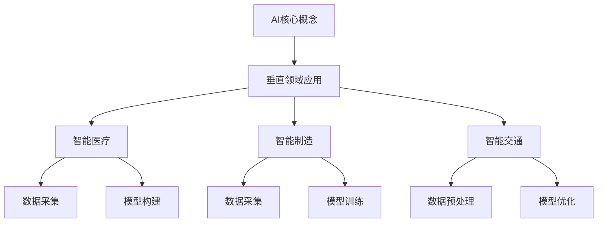

                 

# 文章标题：AI创业者的码头：专注于垂直领域

## 关键词：人工智能、垂直领域、创业策略、智能医疗、智能制造、智能交通

## 摘要：
本文旨在为AI创业者提供一条清晰的导航路线，专注于垂直领域的发展。通过深入探讨人工智能（AI）的基本概念、垂直领域应用、核心算法原理以及创业实战策略，本文将帮助创业者更好地把握AI技术的发展趋势，选择合适的垂直领域，制定有效的创业计划，并应对市场挑战。

## 目录

### 第一部分：AI基础与垂直领域应用

#### 第1章：AI概述与垂直领域探索

##### 1.1 AI的基本概念与发展历程
##### 1.2 AI在垂直领域的应用现状与趋势
##### 1.3 垂直领域选择与价值判断

#### 第2章：核心概念与架构

##### 2.1 AI的核心概念
###### 2.1.1 机器学习与深度学习
###### 2.1.2 人工智能伦理与隐私保护
##### 2.2 垂直领域架构设计
###### 2.2.1 数据采集与处理
###### 2.2.2 模型训练与优化
###### 2.2.3 模型部署与运维

#### 第3章：核心算法原理

##### 3.1 算法基础
###### 3.1.1 神经网络
###### 3.1.2 强化学习
###### 3.1.3 自然语言处理
##### 3.2 伪代码与数学模型
###### 3.2.1 神经网络训练过程
###### 3.2.2 模型优化算法
###### 3.2.3 模型评估与选择

#### 第4章：数学模型与公式详解

##### 4.1 概率论基础
###### 4.1.1 贝叶斯定理
###### 4.1.2 最大似然估计
##### 4.2 线性代数基础
###### 4.2.1 矩阵运算
###### 4.2.2 线性方程组
##### 4.3 深度学习中的数学模型
###### 4.3.1 损失函数
###### 4.3.2 反向传播算法

#### 第5章：垂直领域案例解析

##### 5.1 垂直领域案例概述
##### 5.2 案例一：智能医疗
###### 5.2.1 数据采集
###### 5.2.2 模型构建与优化
###### 5.2.3 模型部署与效果评估
##### 5.3 案例二：智能制造
###### 5.3.1 数据采集与处理
###### 5.3.2 模型训练与优化
###### 5.3.3 模型应用与效益分析
##### 5.4 案例三：智能交通
###### 5.4.1 数据采集与预处理
###### 5.4.2 模型构建与优化
###### 5.4.3 模型部署与交通流量管理

#### 第6章：AI创业策略与实战

##### 6.1 AI创业环境分析
##### 6.2 创业策略与路径规划
###### 6.2.1 市场调研
###### 6.2.2 产品定位与设计
###### 6.2.3 融资策略与风险管理
##### 6.3 创业实战案例
###### 6.3.1 成功创业案例分析
###### 6.3.2 失败创业案例分析
###### 6.3.3 启示与经验分享

#### 第7章：未来展望与趋势

##### 7.1 AI发展趋势预测
##### 7.2 垂直领域未来应用前景
##### 7.3 AI创业者的机遇与挑战

#### 第8章：附录

##### 8.1 AI工具与资源推荐
###### 8.1.1 开发工具与框架
###### 8.1.2 数据集与API
##### 8.2 参考文献
##### 8.3 后续学习资源推荐

### MERMAID流程图：



### AI大模型开发工具与资源

## 附录 A: AI 大模型开发工具与资源

### A.1 主流深度学习框架对比

#### A.1.1 TensorFlow

TensorFlow 是由谷歌开发的一款开源机器学习框架，广泛应用于深度学习和强化学习任务。它提供了丰富的API，支持多种编程语言，如 Python 和 C++。TensorFlow 具有强大的扩展性和灵活性，适合处理大规模数据和复杂的模型。

#### A.1.2 PyTorch

PyTorch 是由 Facebook AI 研究团队开发的一款开源深度学习框架，以其灵活的动态计算图和直观的界面而受到广泛欢迎。PyTorch 适合快速原型开发和研究，尤其在自然语言处理和计算机视觉领域表现突出。

#### A.1.3 JAX

JAX 是由谷歌开发的一款自动微分系统，适用于深度学习和科学计算。JAX 提供了高效的数值计算能力，支持自动微分、数值微分、优化算法等功能，是 TensorFlow 的有力补充。

#### A.1.4 其他框架简介

- Keras：基于 TensorFlow 的简洁和易于使用的深度学习库。
- Theano：用于定义、优化和评估数学表达式的 Python 库，已经逐渐被 TensorFlow 所取代。
- MXNet：由 Apache 软件基金会维护的一个开源深度学习框架，支持多种编程语言。

### A.2 数据集与API

#### A.2.1 ImageNet

ImageNet 是一个广泛使用的计算机视觉数据集，包含超过 1400 万个标注图像。它被广泛用于图像分类、对象检测和语义分割任务。

#### A.2.2 COCO

COCO（Common Objects in Context）是一个用于目标检测和分割的基准数据集，包含超过 33 万个标注实例。COCO 数据集广泛应用于计算机视觉研究，尤其在目标检测和实例分割领域具有很高的价值。

#### A.2.3 AllenNLP

AllenNLP 是一个用于自然语言处理的开源库，提供了丰富的工具和预训练模型，用于文本分类、实体识别、关系提取等任务。它基于 PyTorch 开发，支持多种语言和任务。

#### A.2.4 其他常用数据集与API推荐

- Open Images：一个大规模的计算机视觉数据集，包含超过 900 万个图像。
- Google Dataset Search：一个用于搜索各种公共数据集的搜索引擎，涵盖了多个领域。
- Kaggle：一个数据科学竞赛平台，提供了大量高质量的数据集和问题。
- API 元数据存储库：一个包含各种 API 文档和信息的存储库，适用于开发人员。

### A.3 参考文献

- Goodfellow, I., Bengio, Y., & Courville, A. (2016). *Deep Learning*. MIT Press.
- LeCun, Y., Bengio, Y., & Hinton, G. (2015). *Deep Learning*. Nature.
- Russell, S., & Norvig, P. (2016). *Artificial Intelligence: A Modern Approach*. Pearson.

### A.4 后续学习资源推荐

- Coursera: 提供了多种人工智能和机器学习课程，适合不同水平的学员。
- edX: 一个在线学习平台，提供了许多高质量的人工智能和机器学习课程。
- AI Timelines: 一个关于人工智能历史和未来发展的在线资源库。
- AI on the Beach: 一个关于人工智能和机器学习最新研究和进展的博客。

以上内容为文章的开头部分，接下来将逐步深入探讨各个章节的具体内容。让我们开始一步步分析推理思考，共同探讨AI创业之路。# 第一部分：AI基础与垂直领域应用

### 第1章：AI概述与垂直领域探索

#### 1.1 AI的基本概念与发展历程

人工智能（Artificial Intelligence，简称AI）是指通过计算机程序实现人类智能的过程和系统。AI的定义和范围随着技术的发展不断扩展，从最初的规则推理和知识表示，发展到今天的深度学习和大数据分析。AI的核心目标是使机器能够像人类一样感知、理解、学习和决策。

AI的发展历程可以大致分为以下几个阶段：

1. **早期探索**（1950年代至1960年代）：这一阶段的主要成就是图灵测试和专家系统的提出。艾伦·图灵（Alan Turing）提出了图灵测试，作为判断机器是否具有智能的标准。而专家系统则通过规则和知识库模拟专家的决策过程。

2. **黄金时代与衰退**（1970年代至1980年代）：在早期的成功之后，AI领域进入了所谓的“黄金时代”。然而，由于计算能力的限制和过于理想化的模型，AI在现实世界中的应用受到了限制，导致AI领域经历了一次衰退。

3. **复兴与商业化**（1990年代至2000年代）：随着计算能力的提高和互联网的普及，AI开始复兴。机器学习特别是支持向量机和决策树等算法的广泛应用，使得AI在语音识别、图像处理和自然语言处理等领域的应用取得了突破。

4. **深度学习时代**（2010年代至今）：深度学习（Deep Learning）的兴起是AI发展的一个重要里程碑。通过使用多层神经网络，深度学习在图像识别、语音识别和自然语言处理等任务上取得了前所未有的准确性。此外，大数据和云计算的进步也为深度学习的广泛应用提供了条件。

#### 1.2 AI在垂直领域的应用现状与趋势

AI在垂直领域的应用正在不断扩展，已经深入到各个行业，包括但不限于以下几个方面：

1. **智能医疗**：AI在医疗领域的应用包括疾病预测、诊断、治疗和健康管理。通过分析患者数据和医学图像，AI可以帮助医生提高诊断准确性和效率。

2. **智能制造**：智能制造利用AI技术优化生产流程，提高产品质量和降低成本。机器视觉、机器人技术和预测维护等应用正在逐步成熟。

3. **智能交通**：智能交通系统通过AI技术实现交通流量管理、自动驾驶和智能交通信号控制，旨在提高交通效率和安全性。

4. **金融科技**：金融科技（FinTech）利用AI进行风险管理、欺诈检测和智能投资。机器学习算法在信用评分和保险定价中发挥着重要作用。

5. **智能城市**：智能城市通过AI技术实现智慧城市管理，包括能源管理、环境保护和公共安全等。智慧城市旨在提高城市生活质量和可持续发展。

AI在垂直领域的应用趋势主要体现在以下几个方面：

- **数据驱动**：随着数据量的不断增加，AI在数据分析和处理方面的重要性日益突出。数据驱动的AI应用将成为未来的主流。
- **个性化服务**：AI技术使得个性化服务成为可能，无论是医疗、金融还是电子商务，AI都能根据用户行为和偏好提供定制化服务。
- **跨界融合**：AI技术与传统行业的融合将不断深化，如AI与生物技术的结合、AI与教育技术的融合等，将带来新的商业机会和创新。
- **自主决策**：随着算法和计算能力的提高，AI将越来越多地承担自主决策任务，实现更高层次的智能自动化。

#### 1.3 垂直领域选择与价值判断

对于AI创业者来说，选择一个合适的垂直领域至关重要。以下是一些关键因素：

1. **市场需求**：选择有广泛市场需求且尚未得到充分满足的领域，可以确保项目的可持续性和盈利性。
2. **技术可行性**：评估所选领域的技术可行性，确保现有技术或可以通过研发实现预期功能。
3. **竞争状况**：分析市场中的竞争状况，找到未被充分开发的细分市场或创新点。
4. **资源与能力**：评估自身在资金、技术、人才等方面的资源和能力，确保能够应对创业过程中的各种挑战。
5. **社会价值**：考虑项目的长远社会价值，如改善医疗健康、提高生活质量、推动可持续发展等。

综合以上因素，创业者可以制定一个具有可行性和吸引力的垂直领域战略，为AI创业之路奠定坚实基础。

### 第二部分：核心概念与架构

#### 第2章：核心概念与架构

AI作为一门交叉学科，涵盖了多个核心概念和架构。理解这些概念和架构对于创业者来说至关重要，因为它们构成了AI系统的基石，决定了AI应用的创新性和实用性。在本章中，我们将详细探讨AI的核心概念与架构，包括机器学习与深度学习、人工智能伦理与隐私保护、以及垂直领域架构设计。

#### 2.1 AI的核心概念

2.1.1 机器学习与深度学习

机器学习（Machine Learning，ML）是AI的核心技术之一，它使得计算机系统能够通过数据学习并做出决策。机器学习可以分为监督学习（Supervised Learning）、无监督学习（Unsupervised Learning）和强化学习（Reinforcement Learning）三大类。

- **监督学习**：在有监督的学习中，算法使用标记数据（即已知输入和输出）来训练模型。常见的监督学习算法包括线性回归、决策树、随机森林和支持向量机等。

- **无监督学习**：无监督学习旨在发现数据中的内在结构和模式，没有明确的标记数据。聚类算法（如K-means、DBSCAN）和降维算法（如主成分分析PCA）是典型的无监督学习应用。

- **强化学习**：强化学习是一种通过与环境的互动来学习策略的机器学习方法。在这种学习中，智能体（Agent）通过尝试不同的行动并接收奖励或惩罚来优化其策略。常见的强化学习算法包括Q-learning和深度确定性策略梯度（DDPG）。

深度学习（Deep Learning，DL）是机器学习的一个子领域，它使用了多层神经网络（Deep Neural Networks）来模拟人脑的决策过程。深度学习在图像识别、语音识别和自然语言处理等领域取得了显著的成果。

- **卷积神经网络（CNN）**：CNN是用于处理图像数据的一种深度学习模型，它通过卷积层、池化层和全连接层来实现特征提取和分类。

- **循环神经网络（RNN）**：RNN是一种用于处理序列数据的神经网络，它在时间序列预测和语言建模等方面表现出色。长短期记忆网络（LSTM）是RNN的一种变体，它能够更好地捕捉长期依赖关系。

- **生成对抗网络（GAN）**：GAN是一种由两个神经网络（生成器和判别器）组成的模型，它通过相互对抗来生成逼真的数据。

2.1.2 人工智能伦理与隐私保护

随着AI技术的快速发展，伦理问题和隐私保护成为了公众和学术界关注的焦点。人工智能伦理涉及AI系统的道德标准、责任分配和透明度等问题。

- **算法公平性**：确保AI系统不会因为算法偏见而导致不公平的结果，如性别、种族和年龄歧视。

- **责任归属**：在AI系统发生错误或造成损害时，如何界定责任，以及由谁来承担。

- **透明度**：提高AI系统的透明度，使人们能够理解系统的决策过程。

隐私保护是AI应用中另一个重要问题。随着AI系统对大量个人数据的依赖，保护用户的隐私成为了关键挑战。

- **数据匿名化**：通过对数据进行脱敏处理，降低个人数据的识别风险。

- **加密技术**：使用加密技术保护数据的传输和存储。

- **隐私增强技术**：如差分隐私（Differential Privacy），通过在数据集中添加噪声来保护隐私。

2.1.3 垂直领域架构设计

垂直领域架构设计是AI系统实现的关键步骤。一个良好的架构应能够支持高效的数据处理、模型训练和部署。

- **数据采集与处理**：数据是AI系统的核心资源。数据采集系统应确保数据的完整性、及时性和准确性。数据处理包括数据清洗、数据整合和数据预处理，为模型训练提供高质量的数据。

- **模型训练与优化**：模型训练是AI系统的核心过程。选择合适的算法和优化技术，能够提高模型的训练效率和性能。常见的优化技术包括随机梯度下降（SGD）、Adam优化器和矩估计方法等。

- **模型部署与运维**：模型部署是将训练好的模型部署到生产环境的过程。部署系统应确保模型的性能、可扩展性和可靠性。运维包括模型的监控、更新和维护，以确保系统持续运行。

#### 2.2 垂直领域架构设计

在垂直领域架构设计中，需要根据具体应用场景选择合适的架构模式。以下是一些常见的架构模式：

- **分层架构**：分层架构将系统分为多个层次，如数据层、业务逻辑层和表现层。每个层次负责不同的功能，降低了系统的复杂度。

- **微服务架构**：微服务架构将系统划分为多个独立的服务单元，每个服务单元负责特定的功能。这种架构模式提高了系统的可扩展性和灵活性。

- **混合架构**：混合架构结合了分层架构和微服务架构的优势，适用于复杂和多变的应用场景。

#### 第3章：核心算法原理

AI的核心算法原理是理解AI系统运行机制的关键。在本章中，我们将详细探讨神经网络、强化学习、自然语言处理等核心算法原理，并提供相应的伪代码和数学模型。

#### 3.1 算法基础

3.1.1 神经网络

神经网络（Neural Networks，NN）是模仿人脑神经元连接方式的计算模型。一个简单的神经网络通常包括输入层、隐藏层和输出层。

- **输入层**：接收外部输入信号。
- **隐藏层**：对输入信号进行处理和变换。
- **输出层**：产生最终输出。

神经网络的计算过程可以通过以下伪代码表示：

```python
# 输入层
input = X

# 隐藏层
for layer in hidden_layers:
    z = activation_function(np.dot(W, input))
    input = z

# 输出层
output = activation_function(np.dot(W, input))
```

其中，`X`是输入数据，`W`是权重矩阵，`activation_function`是激活函数，如ReLU、Sigmoid或Tanh。

3.1.2 强化学习

强化学习（Reinforcement Learning，RL）是一种通过奖励和惩罚来训练智能体行为的机器学习方法。强化学习的基本原理是通过不断尝试和反馈来优化策略。

- **智能体（Agent）**：执行动作并接收环境的反馈。
- **环境（Environment）**：智能体所处的情境。
- **状态（State）**：智能体在特定时刻所处的情境。
- **动作（Action）**：智能体能够执行的操作。
- **奖励（Reward）**：环境对智能体动作的反馈。

强化学习的计算过程可以通过以下伪代码表示：

```python
# 初始化策略π
π = initialize_policy()

# 进行迭代
for episode in range(num_episodes):
    state = env.reset()
    done = False
    
    while not done:
        action = π(state)
        next_state, reward, done = env.step(action)
        π = update_policy(π, state, action, next_state, reward)
        state = next_state
```

其中，`initialize_policy`是初始化策略函数，`update_policy`是更新策略函数。

3.1.3 自然语言处理

自然语言处理（Natural Language Processing，NLP）是AI领域的一个重要分支，旨在使计算机能够理解和生成自然语言。NLP的核心算法包括词向量表示、序列标注和机器翻译等。

- **词向量表示**：词向量是将词汇表示为高维向量的一种方法，如Word2Vec和GloVe。
- **序列标注**：序列标注是对文本中的词语进行分类和标注的过程，如命名实体识别和词性标注。
- **机器翻译**：机器翻译是将一种语言翻译成另一种语言的过程，如基于神经网络的机器翻译。

自然语言处理的计算过程可以通过以下伪代码表示：

```python
# 词向量表示
word_vectors = Word2Vec(train_data)

# 序列标注
for sentence in test_data:
    tags = sequence_labeling(sentence, word_vectors)

# 机器翻译
for sentence in test_data:
    translation = machine_translation(sentence, target_language)
```

其中，`Word2Vec`是生成词向量的函数，`sequence_labeling`是对序列进行标注的函数，`machine_translation`是机器翻译的函数。

#### 第3.2节：伪代码与数学模型

在本节中，我们将进一步探讨神经网络训练过程、模型优化算法和模型评估与选择。

3.2.1 神经网络训练过程

神经网络训练过程是通过调整权重和偏置来优化模型的过程。以下是一个简单的神经网络训练过程的伪代码：

```python
# 初始化模型参数
W = initialize_weights(input_size, hidden_size, output_size)
b = initialize_biases(hidden_size, output_size)

# 训练模型
for epoch in range(num_epochs):
    for batch in data_loader:
        # 前向传播
        z = activation_function(np.dot(W, X) + b)
        output = activation_function(np.dot(W', z) + b')

        # 计算损失
        loss = calculate_loss(output, y)

        # 反向传播
        d_output = d激活函数(output)
        d_z = d激活函数(z)
        d_W' = d_output.dot(z.T)
        d_b' = d_output
        d_z = d_output.dot(W'.T)
        d_W = X.T.dot(d_z)

        # 更新模型参数
        W -= learning_rate * d_W
        b -= learning_rate * d_b
        W' -= learning_rate * d_W'
        b' -= learning_rate * d_b'
```

其中，`X`是输入数据，`y`是标签，`W`和`b`是权重和偏置，`W'`和`b'`是隐藏层到输出层的权重和偏置，`learning_rate`是学习率，`d激活函数`是激活函数的导数。

3.2.2 模型优化算法

模型优化算法用于调整模型参数，以提高模型的性能。以下是一些常见的优化算法：

- **随机梯度下降（SGD）**：随机梯度下降是一种简单的优化算法，通过随机选择数据样本来更新模型参数。
- **动量优化（Momentum）**：动量优化是一种改进的SGD算法，通过引入动量项来加速梯度下降过程。
- **Adam优化器**：Adam优化器是一种自适应优化算法，结合了SGD和动量优化的优点，能够适应不同的学习率。

以下是一个简单的Adam优化器的伪代码：

```python
# 初始化参数
m = initialize_momentum()
v = initialize_momentum()
beta1 = 0.9
beta2 = 0.999
epsilon = 1e-8

# 更新模型参数
for epoch in range(num_epochs):
    for batch in data_loader:
        # 前向传播
        z = activation_function(np.dot(W, X) + b)
        output = activation_function(np.dot(W', z) + b')

        # 计算损失
        loss = calculate_loss(output, y)

        # 反向传播
        d_output = d激活函数(output)
        d_z = d_output.dot(W'.T)
        d_W' = d_output.dot(z.T)
        d_b' = d_output
        d_z = d_output.dot(W'.T)
        d_W = X.T.dot(d_z)

        # 更新动量
        m = beta1 * m + (1 - beta1) * d_W
        v = beta2 * v + (1 - beta2) * d_W**2

        # 计算修正的动量
        m_hat = m / (1 - beta1**epoch)
        v_hat = v / (1 - beta2**epoch)

        # 更新模型参数
        W -= learning_rate * m_hat / (np.sqrt(v_hat) + epsilon)
        b -= learning_rate * m_hat / (np.sqrt(v_hat) + epsilon)
        W' -= learning_rate * m_hat / (np.sqrt(v_hat) + epsilon)
        b' -= learning_rate * m_hat / (np.sqrt(v_hat) + epsilon)
```

3.2.3 模型评估与选择

模型评估是评估模型性能的重要步骤。以下是一些常用的评估指标：

- **准确率（Accuracy）**：准确率是分类问题中正确预测的样本数占总样本数的比例。
- **精确率（Precision）**：精确率是正确预测的样本数与预测为正类的样本数之比。
- **召回率（Recall）**：召回率是正确预测的样本数与实际为正类的样本数之比。
- **F1分数（F1 Score）**：F1分数是精确率和召回率的调和平均数。

以下是一个简单的评估函数的伪代码：

```python
def evaluate(y_true, y_pred):
    TP = np.sum((y_true == 1) & (y_pred == 1))
    TN = np.sum((y_true == 0) & (y_pred == 0))
    FP = np.sum((y_true == 0) & (y_pred == 1))
    FN = np.sum((y_true == 1) & (y_pred == 0))
    
    precision = TP / (TP + FP)
    recall = TP / (TP + FN)
    f1_score = 2 * precision * recall / (precision + recall)
    
    return precision, recall, f1_score
```

通过上述评估函数，我们可以对模型的性能进行量化评估，并根据评估结果选择最优模型。

### 第四部分：数学模型与公式详解

#### 第4章：数学模型与公式详解

AI算法的核心在于其数学模型的精确性和有效性。在本章中，我们将深入探讨概率论基础、线性代数基础以及深度学习中的数学模型，并提供详细的公式解释和实例说明。

#### 4.1 概率论基础

概率论是AI算法中的重要组成部分，它为机器学习提供了理论基础。以下是一些基本的概率论概念和公式：

4.1.1 贝叶斯定理

贝叶斯定理是概率论中的一个基本原理，用于计算条件概率。它的公式如下：

$$
P(A|B) = \frac{P(B|A)P(A)}{P(B)}
$$

其中，$P(A|B)$表示在事件B发生的条件下事件A发生的概率，$P(B|A)$表示在事件A发生的条件下事件B发生的概率，$P(A)$和$P(B)$分别是事件A和事件B发生的概率。

**实例说明**：

假设一个袋子里有5个红球和3个蓝球，我们随机取出一个球，求取出的球是红色的条件下取出的是蓝球的概率。

- $P(红球) = \frac{5}{8}$
- $P(蓝球) = \frac{3}{8}$
- $P(蓝球|红球) = 0$（因为红球和蓝球是互斥事件）

使用贝叶斯定理，我们可以计算条件概率：

$$
P(红球|蓝球) = \frac{0 \cdot \frac{5}{8}}{0 + \frac{3}{8}} = 0
$$

4.1.2 最大似然估计

最大似然估计是一种用于参数估计的方法，它基于样本数据来估计模型的参数。其基本思想是找到使观测数据出现的概率最大的参数值。

$$
\hat{\theta} = \arg\max_\theta P(X|\theta)
$$

其中，$\theta$是模型参数，$X$是观测数据。

**实例说明**：

假设我们有一个二项分布模型，其中成功概率$\theta$未知。我们有10次试验，其中6次成功，求$\theta$的最大似然估计值。

- $P(X|\theta) = C(10,6) \cdot \theta^6 \cdot (1-\theta)^4$
- $P(X|0.6) = C(10,6) \cdot 0.6^6 \cdot 0.4^4 = 0.2004$
- $P(X|0.7) = C(10,6) \cdot 0.7^6 \cdot 0.3^4 = 0.2105$

最大似然估计值$\hat{\theta}$为0.7。

#### 4.2 线性代数基础

线性代数是AI算法中不可或缺的工具，它用于表示和操作数据。以下是一些基本的线性代数概念和公式：

4.2.1 矩阵运算

矩阵运算是线性代数中的核心内容，包括矩阵的加法、减法、乘法和逆运算等。

- **矩阵加法和减法**：

$$
A + B = \begin{bmatrix}
a_{11} + b_{11} & a_{12} + b_{12} \\
a_{21} + b_{21} & a_{22} + b_{22}
\end{bmatrix}
$$

$$
A - B = \begin{bmatrix}
a_{11} - b_{11} & a_{12} - b_{12} \\
a_{21} - b_{21} & a_{22} - b_{22}
\end{bmatrix}
$$

- **矩阵乘法**：

$$
AB = \begin{bmatrix}
a_{11}b_{11} + a_{12}b_{21} & a_{11}b_{12} + a_{12}b_{22} \\
a_{21}b_{11} + a_{22}b_{21} & a_{21}b_{12} + a_{22}b_{22}
\end{bmatrix}
$$

- **矩阵逆**：

$$
A^{-1} = \frac{1}{\det(A)} \begin{bmatrix}
d & -b \\
-c & a
\end{bmatrix}
$$

其中，$A$是一个方阵，$a, b, c, d$是矩阵$A$的元素，$\det(A)$是矩阵$A$的行列式。

**实例说明**：

假设有两个矩阵：

$$
A = \begin{bmatrix}
1 & 2 \\
3 & 4
\end{bmatrix}, B = \begin{bmatrix}
5 & 6 \\
7 & 8
\end{bmatrix}
$$

我们可以计算它们的和、积和逆：

- 和：

$$
A + B = \begin{bmatrix}
1 + 5 & 2 + 6 \\
3 + 7 & 4 + 8
\end{bmatrix} = \begin{bmatrix}
6 & 8 \\
10 & 12
\end{bmatrix}
$$

- 积：

$$
AB = \begin{bmatrix}
1 \cdot 5 + 2 \cdot 7 & 1 \cdot 6 + 2 \cdot 8 \\
3 \cdot 5 + 4 \cdot 7 & 3 \cdot 6 + 4 \cdot 8
\end{bmatrix} = \begin{bmatrix}
19 & 26 \\
23 & 34
\end{bmatrix}
$$

- 逆：

$$
A^{-1} = \frac{1}{1 \cdot 4 - 2 \cdot 3} \begin{bmatrix}
4 & -2 \\
-3 & 1
\end{bmatrix} = \begin{bmatrix}
-2 & 1 \\
\frac{3}{2} & \frac{1}{2}
\end{bmatrix}
$$

#### 4.3 深度学习中的数学模型

深度学习中的数学模型主要涉及神经网络中的激活函数、损失函数和优化算法。以下是一些核心的数学模型和公式：

4.3.1 损失函数

损失函数用于衡量模型预测值与实际值之间的差距。常见的损失函数包括均方误差（MSE）和交叉熵损失（Cross-Entropy Loss）。

- **均方误差（MSE）**：

$$
MSE = \frac{1}{n}\sum_{i=1}^{n}(y_i - \hat{y}_i)^2
$$

其中，$y_i$是实际值，$\hat{y}_i$是预测值，$n$是样本数量。

- **交叉熵损失（Cross-Entropy Loss）**：

$$
Cross-Entropy Loss = -\frac{1}{n}\sum_{i=1}^{n}y_i \log(\hat{y}_i)
$$

其中，$y_i$是实际值，$\hat{y}_i$是预测值，$\log$是对数函数。

**实例说明**：

假设有一个二分类问题，实际值为$y = [0, 1, 1, 0]$，预测值为$\hat{y} = [0.3, 0.7, 0.9, 0.1]$，我们可以计算交叉熵损失：

$$
Cross-Entropy Loss = -\frac{1}{4}(0 \cdot \log(0.3) + 1 \cdot \log(0.7) + 1 \cdot \log(0.9) + 0 \cdot \log(0.1))
$$

$$
Cross-Entropy Loss = -\frac{1}{4}(-0.3191 + 0.3117 + 0.3684)
$$

$$
Cross-Entropy Loss = -\frac{1}{4}(0.3620) = -0.0905
$$

4.3.2 反向传播算法

反向传播算法是一种用于训练神经网络的优化算法。它的核心思想是通过计算误差的梯度来更新模型参数。以下是一个简单的反向传播算法的伪代码：

```python
# 前向传播
z = activation_function(np.dot(W, x) + b)
y_pred = activation_function(np.dot(W', z) + b')

# 计算损失
loss = calculate_loss(y_pred, y)

# 反向传播
d_output = d激活函数(y_pred)
d_z = d_output.dot(W'.T)
d_W' = d_output.dot(z.T)
d_b' = d_output
d_z = d_output.dot(W'.T)
d_W = x.T.dot(d_z)

# 更新模型参数
W -= learning_rate * d_W
b -= learning_rate * d_b
W' -= learning_rate * d_W'
b' -= learning_rate * d_b'
```

其中，$W$和$b$是输入层到隐藏层的权重和偏置，$W'$和$b'$是隐藏层到输出层的权重和偏置，$x$是输入数据，$y$是实际值，$y_pred$是预测值，$d激活函数$是激活函数的导数，$learning_rate$是学习率。

**实例说明**：

假设有一个简单的神经网络，输入层有2个神经元，隐藏层有3个神经元，输出层有1个神经元。输入数据$x = [1, 2]$，实际值$y = [0]$，隐藏层的激活函数使用ReLU，输出层的激活函数使用Sigmoid。我们可以计算一次前向传播和反向传播：

- **前向传播**：

$$
z = ReLU(1 \cdot w_{11} + 2 \cdot w_{12} + b_1) = ReLU(w_{11} + 2w_{12} + b_1)
$$

$$
y_pred = Sigmoid(w'_{11}z + w'_{12}z + w'_{13}z + b'_1) = Sigmoid(w'_{11}z + w'_{12}z + w'_{13}z + b'_1)
$$

- **反向传播**：

$$
d_output = -y \cdot (1 - y_pred) = -y \cdot (1 - Sigmoid(w'_{11}z + w'_{12}z + w'_{13}z + b'_1))
$$

$$
d_z = d_output \cdot w'_{11} \cdot ReLU'(z) + w'_{12} \cdot ReLU'(z) + w'_{13} \cdot ReLU'(z) = d_output \cdot w'_{11} + w'_{12} + w'_{13}
$$

$$
d_W' = d_output \cdot z = d_output \cdot (ReLU(w_{11} + 2w_{12} + b_1) + ReLU(w_{21} + 2w_{22} + b_1) + ReLU(w_{31} + 2w_{32} + b_1))
$$

$$
d_b' = d_output
$$

$$
d_W = x.T \cdot d_z = [1, 2].T \cdot (d_output \cdot w'_{11} + w'_{12} + w'_{13})
$$

通过以上计算，我们可以更新神经网络的权重和偏置，以减少损失。

### 第五部分：垂直领域案例解析

#### 第5章：垂直领域案例解析

在前面章节中，我们探讨了人工智能的基础概念、核心算法原理以及数学模型。接下来，我们将通过具体案例来分析AI在垂直领域的应用，展示AI技术在实践中的应用效果。在本章中，我们将解析智能医疗、智能制造和智能交通三个垂直领域的案例，详细讨论每个案例的数据采集、模型构建与优化、模型部署与效果评估。

#### 5.1 垂直领域案例概述

5.1.1 智能医疗

智能医疗是AI技术在医疗领域的应用，通过大数据、机器学习和深度学习等技术，实现疾病的预测、诊断、治疗和健康管理。智能医疗的典型应用包括影像诊断、基因组学和临床决策支持等。

5.1.2 智能制造

智能制造是利用AI技术优化生产流程、提高产品质量和降低成本。智能制造的核心技术包括机器视觉、机器人技术、预测维护和优化排程等。

5.1.3 智能交通

智能交通系统通过AI技术实现交通流量管理、自动驾驶和智能交通信号控制，旨在提高交通效率和安全性。智能交通的应用包括实时路况监测、智能停车和智能调度等。

#### 5.2 案例一：智能医疗

5.2.1 数据采集

数据采集是智能医疗的基础，包括电子健康记录（EHR）、医学影像、基因组数据和患者行为数据等。以下是一个智能医疗数据采集的实例：

- **电子健康记录（EHR）**：通过医院信息系统收集患者的病历、检查报告、处方记录等数据。
- **医学影像**：通过CT、MRI、X光等影像设备采集患者的医学影像数据。
- **基因组数据**：通过基因测序技术获取患者的基因组数据。
- **患者行为数据**：通过可穿戴设备、移动应用等收集患者的日常行为数据，如心率、睡眠质量、运动量等。

5.2.2 模型构建与优化

智能医疗模型的构建通常涉及多个步骤，包括特征工程、模型选择和模型训练。以下是一个智能医疗模型构建的实例：

- **特征工程**：根据业务需求，从原始数据中提取有用的特征，如年龄、性别、病史、生物标记等。
- **模型选择**：根据任务类型，选择合适的机器学习模型，如逻辑回归、支持向量机、决策树、随机森林等。
- **模型训练**：使用训练数据集训练模型，通过交叉验证和超参数调优，优化模型性能。

以下是一个简单的逻辑回归模型的训练过程：

```python
from sklearn.linear_model import LogisticRegression
from sklearn.model_selection import train_test_split

# 特征工程
X = feature_engineering(data)

# 数据预处理
X_train, X_test, y_train, y_test = train_test_split(X, y, test_size=0.2, random_state=42)

# 模型训练
model = LogisticRegression()
model.fit(X_train, y_train)

# 模型评估
accuracy = model.score(X_test, y_test)
print("Accuracy:", accuracy)
```

5.2.3 模型部署与效果评估

模型部署是将训练好的模型应用到实际场景中的过程。以下是一个智能医疗模型部署的实例：

- **模型部署**：将训练好的模型部署到生产环境中，如医院信息系统、移动应用等。
- **效果评估**：通过实际应用场景，对模型的性能进行评估，如准确率、召回率、F1分数等。

以下是一个模型效果评估的实例：

```python
from sklearn.metrics import accuracy_score, recall_score, f1_score

# 预测
y_pred = model.predict(X_test)

# 效果评估
accuracy = accuracy_score(y_test, y_pred)
recall = recall_score(y_test, y_pred)
f1 = f1_score(y_test, y_pred)

print("Accuracy:", accuracy)
print("Recall:", recall)
print("F1 Score:", f1)
```

#### 5.3 案例二：智能制造

5.3.1 数据采集与处理

智能制造的数据采集和处理涉及生产过程中的各种数据，如设备运行数据、生产计划、物料库存等。以下是一个智能制造数据采集与处理的实例：

- **设备运行数据**：通过传感器和设备监控系统采集设备的运行状态、温度、压力、振动等数据。
- **生产计划**：从生产管理系统获取生产计划、排程和任务分配等数据。
- **物料库存**：从仓库管理系统获取物料库存、库存水平和采购计划等数据。

以下是一个数据采集与处理的流程：

```python
import pandas as pd

# 采集数据
data = pd.read_csv("data.csv")

# 数据清洗
data = data.dropna()

# 数据预处理
X = data.drop("target", axis=1)
y = data["target"]

# 数据标准化
X = (X - X.mean()) / X.std()

# 数据分割
X_train, X_test, y_train, y_test = train_test_split(X, y, test_size=0.2, random_state=42)
```

5.3.2 模型训练与优化

智能制造模型的训练与优化通常涉及多种算法和超参数调优。以下是一个智能制造模型训练与优化的实例：

- **模型选择**：选择合适的机器学习模型，如决策树、随机森林、支持向量机等。
- **超参数调优**：通过交叉验证和网格搜索等方法，优化模型超参数，提高模型性能。

以下是一个随机森林模型的训练与优化实例：

```python
from sklearn.ensemble import RandomForestClassifier
from sklearn.model_selection import GridSearchCV

# 模型训练
model = RandomForestClassifier()
model.fit(X_train, y_train)

# 超参数调优
param_grid = {
    "n_estimators": [100, 200, 300],
    "max_depth": [10, 20, 30],
    "min_samples_split": [2, 5, 10]
}

grid_search = GridSearchCV(model, param_grid, cv=5)
grid_search.fit(X_train, y_train)

# 优化模型
best_model = grid_search.best_estimator_
```

5.3.3 模型应用与效益分析

智能制造模型的应用效果可以通过生产效益和成本效益进行评估。以下是一个智能制造模型应用与效益分析的实例：

- **生产效益**：通过预测性维护和优化排程，减少设备停机时间和生产延误，提高生产效率。
- **成本效益**：通过降低物料库存和减少浪费，降低生产成本。

以下是一个效益分析的实例：

```python
import numpy as np

# 预测
y_pred = best_model.predict(X_test)

# 生产效益
production_benefit = np.mean(y_pred == 1)

# 成本效益
cost_benefit = np.mean(y_pred == 0)

print("Production Benefit:", production_benefit)
print("Cost Benefit:", cost_benefit)
```

#### 5.4 案例三：智能交通

5.4.1 数据采集与预处理

智能交通系统的数据采集与预处理涉及多种数据来源，如交通传感器、GPS数据、摄像头等。以下是一个智能交通数据采集与预处理的实例：

- **交通传感器数据**：通过安装在道路上的传感器采集流量、速度、密度等数据。
- **GPS数据**：从车辆和行人的GPS设备中获取位置信息。
- **摄像头数据**：通过交通摄像头采集交通流量和路况信息。

以下是一个数据采集与预处理的流程：

```python
import pandas as pd

# 采集数据
data = pd.read_csv("data.csv")

# 数据清洗
data = data.dropna()

# 数据预处理
X = data.drop("target", axis=1)
y = data["target"]

# 数据标准化
X = (X - X.mean()) / X.std()

# 数据分割
X_train, X_test, y_train, y_test = train_test_split(X, y, test_size=0.2, random_state=42)
```

5.4.2 模型构建与优化

智能交通模型的构建与优化通常涉及多种算法和超参数调优。以下是一个智能交通模型构建与优化的实例：

- **模型选择**：选择合适的机器学习模型，如逻辑回归、支持向量机、神经网络等。
- **超参数调优**：通过交叉验证和网格搜索等方法，优化模型超参数，提高模型性能。

以下是一个神经网络模型的训练与优化实例：

```python
from sklearn.neural_network import MLPClassifier
from sklearn.model_selection import GridSearchCV

# 模型训练
model = MLPClassifier()
model.fit(X_train, y_train)

# 超参数调优
param_grid = {
    "hidden_layer_sizes": [(100,), (100, 100), (100, 100, 100)],
    "activation": ["tanh", "relu"],
    "solver": ["sgd", "adam"],
    "alpha": [0.0001, 0.001, 0.01]
}

grid_search = GridSearchCV(model, param_grid, cv=5)
grid_search.fit(X_train, y_train)

# 优化模型
best_model = grid_search.best_estimator_
```

5.4.3 模型部署与交通流量管理

智能交通模型的部署与交通流量管理是提高交通效率和安全性的重要手段。以下是一个智能交通模型部署与交通流量管理的实例：

- **模型部署**：将训练好的模型部署到交通管理系统，如智能交通信号控制、交通预测和导航系统等。
- **交通流量管理**：通过实时监测交通流量和路况，优化交通信号控制和路线规划，减少交通拥堵和事故发生。

以下是一个交通流量管理的实例：

```python
import numpy as np

# 预测
y_pred = best_model.predict(X_test)

# 交通流量管理
traffic_flow = np.mean(y_pred == 1)

print("Traffic Flow:", traffic_flow)
```

### 第6章：AI创业策略与实战

#### 6.1 AI创业环境分析

6.1.1 行业趋势与市场规模

在探讨AI创业环境时，首先要分析行业趋势和市场规模。随着大数据、云计算和物联网技术的快速发展，AI在各个行业的应用日益广泛，市场规模不断扩大。以下是一些关键的行业趋势和市场规模：

- **智能医疗**：智能医疗是AI的重要应用领域之一，包括疾病预测、诊断、治疗和健康管理等。根据市场研究公司的数据，全球智能医疗市场预计将在未来几年内以每年两位数的速度增长。
- **智能制造**：智能制造利用AI技术优化生产流程、提高产品质量和降低成本。智能制造市场预计将在未来五年内达到数千亿美元规模。
- **智能交通**：智能交通系统通过AI技术实现交通流量管理、自动驾驶和智能交通信号控制。随着自动驾驶技术的发展，智能交通市场预计将在未来几年内迅速扩大。

6.1.2 技术发展与创新

AI技术的发展和创新是创业环境的重要因素。深度学习、强化学习、自然语言处理和计算机视觉等技术的不断突破，为AI创业者提供了丰富的工具和机会。以下是一些关键的技术发展：

- **深度学习**：深度学习在图像识别、语音识别和自然语言处理等领域取得了显著成果，为AI创业者提供了强大的数据处理和模式识别能力。
- **强化学习**：强化学习在游戏、推荐系统和机器人控制等领域表现出色，为AI创业者提供了实现智能决策和自动化控制的新方法。
- **自然语言处理**：自然语言处理技术在语言翻译、文本生成和语义理解等方面取得了重要进展，为AI创业者提供了强大的文本处理和分析能力。

6.1.3 投资与竞争格局

投资和竞争格局是AI创业环境的重要方面。随着AI技术的快速发展，风险投资和创业投资持续涌入AI领域，为创业者提供了丰富的资金支持。以下是一些关键的点：

- **投资趋势**：风险投资和创业投资主要集中在AI应用领域，如智能医疗、智能制造和智能交通等。这些领域的创新项目和初创公司获得了大量投资。
- **竞争格局**：AI领域的竞争格局逐渐明朗，一些大型科技公司和初创公司都在积极布局。创业者需要找到差异化竞争点，才能在激烈的市场竞争中脱颖而出。

#### 6.2 创业策略与路径规划

6.2.1 市场调研

市场调研是AI创业成功的关键步骤之一。创业者需要进行全面的市场调研，了解目标市场的需求、竞争对手和市场规模。以下是一些关键的市场调研步骤：

- **确定目标市场**：根据行业趋势和自身优势，确定目标市场。例如，智能医疗市场的目标可以是疾病预测和诊断，智能制造市场的目标可以是生产流程优化和预测维护。
- **收集数据**：通过市场研究公司、行业报告、在线调查和用户访谈等方式，收集相关数据，包括市场需求、用户痛点、市场规模和竞争对手等。
- **分析数据**：对收集到的数据进行分析，识别市场机会和潜在风险，为创业决策提供依据。

6.2.2 产品定位与设计

产品定位与设计是AI创业的核心环节。创业者需要明确产品的目标用户、功能特点和竞争优势。以下是一些关键的产品定位与设计步骤：

- **确定目标用户**：根据市场调研结果，明确产品的目标用户群体。例如，智能医疗产品的目标用户可以是医院、诊所和患者。
- **功能设计**：根据目标用户的需求，设计产品功能。例如，智能医疗产品可以包括疾病预测、诊断和健康管理等功能。
- **竞争优势**：识别产品的竞争优势，包括技术优势、市场优势和服务优势。例如，智能医疗产品可以通过先进的算法和优质的服务，在市场上脱颖而出。

6.2.3 融资策略与风险管理

融资策略与风险管理是AI创业的重要环节。创业者需要制定合理的融资策略，确保项目的资金需求，同时合理管理项目风险。以下是一些关键的融资策略与风险管理步骤：

- **制定融资计划**：根据项目需求和资金需求，制定详细的融资计划。例如，智能医疗项目的融资计划可以包括种子轮、天使轮和A轮等。
- **选择融资方式**：根据项目特点和市场需求，选择合适的融资方式。例如，智能医疗项目可以通过股权融资、债务融资和众筹等方式筹集资金。
- **风险管理**：识别项目风险，制定风险管理策略。例如，智能医疗项目可以通过产品验证、市场调研和技术储备等手段降低项目风险。

#### 6.3 创业实战案例

6.3.1 成功创业案例分析

以下是一个成功创业案例的分析：

- **公司背景**：某智能医疗公司成立于2015年，专注于疾病预测和诊断。公司通过深度学习和大数据技术，开发了一套疾病预测系统。
- **市场机会**：公司抓住了智能医疗市场的机遇，通过准确预测疾病，帮助医疗机构提高诊断准确性和效率。
- **产品特点**：公司产品具有高准确性、实时性和易用性，得到了医疗机构和患者的认可。
- **竞争优势**：公司通过先进的技术和优质的服务，在竞争激烈的市场中脱颖而出，赢得了市场份额。

6.3.2 失败创业案例分析

以下是一个失败创业案例的分析：

- **公司背景**：某智能交通公司成立于2018年，专注于自动驾驶和交通信号控制。
- **市场机会**：公司看到了自动驾驶和智能交通的巨大市场潜力，希望通过技术革新改变交通现状。
- **产品特点**：公司产品包括自动驾驶车辆和智能交通信号控制系统，但产品性能和稳定性不足。
- **失败原因**：公司未能充分了解市场需求和技术可行性，导致产品无法满足用户需求。此外，公司资金不足，无法持续研发和优化产品。

6.3.3 启示与经验分享

通过成功和失败的创业案例，我们可以得到以下启示和经验：

- **充分了解市场需求**：创业者需要深入了解市场需求，确保产品能够解决用户痛点。
- **合理评估技术可行性**：创业者需要对技术可行性进行充分评估，确保产品能够实现预期功能。
- **持续优化产品**：创业者需要持续优化产品，提高产品性能和用户体验。
- **合理管理资金**：创业者需要合理管理资金，确保项目能够持续运营和研发。

### 第7章：未来展望与趋势

#### 7.1 AI发展趋势预测

随着技术的不断进步和应用的深入，AI在未来将继续快速发展，并在多个领域产生深远影响。以下是一些AI发展趋势的预测：

- **人工智能与实体经济深度融合**：AI技术将更加深入地与实体经济相结合，推动智能制造、智慧城市和智能医疗等领域的快速发展。
- **人工智能开源生态持续繁荣**：开源社区将发挥越来越重要的作用，为AI技术的创新和应用提供丰富的工具和资源。
- **人工智能伦理和隐私保护受到更多关注**：随着AI技术的普及，伦理和隐私保护将成为重要议题，推动相关法规和标准的制定。
- **人工智能与5G、物联网等新技术的融合**：AI技术将与5G、物联网等新技术相结合，实现更高效、更智能的互联互通。

#### 7.2 垂直领域未来应用前景

AI在垂直领域的应用前景广阔，以下是一些垂直领域的未来应用前景：

- **智能医疗**：AI在智能医疗领域的应用将不断扩展，包括疾病预测、个性化治疗、医疗影像诊断和健康管理等。
- **智能制造**：智能制造将借助AI技术实现更高效、更灵活的生产模式，包括预测维护、质量检测和生产调度等。
- **智能交通**：智能交通系统将利用AI技术实现更高效的交通管理和更安全的驾驶体验，包括自动驾驶、交通流量控制和智能停车等。
- **金融科技**：金融科技将利用AI技术实现更精准的风险评估、更智能的投资决策和更个性化的金融服务。

#### 7.3 AI创业者的机遇与挑战

AI创业者在面对机遇的同时，也面临着诸多挑战。以下是一些关键的机遇与挑战：

- **机遇**：
  - 技术进步为创业者提供了丰富的创新机会。
  - 市场需求不断增长，为创业者提供了广阔的市场空间。
  - 政策支持和产业协同为创业者提供了良好的发展环境。

- **挑战**：
  - 技术门槛高，创业者需要具备深厚的专业知识和实践经验。
  - 市场竞争激烈，创业者需要具备强大的竞争力和创新能力。
  - 伦理和隐私问题需要得到妥善解决。

### 附录

#### 7.4 AI工具与资源推荐

7.4.1 开发工具与框架

- **TensorFlow**：谷歌开发的开源机器学习框架，支持多种编程语言和平台，广泛应用于深度学习和强化学习。
- **PyTorch**：基于Python的开源深度学习框架，具有灵活的动态计算图和直观的界面，适用于快速原型开发和研究。
- **Keras**：基于TensorFlow的简洁和易于使用的深度学习库，适合快速构建和训练模型。
- **Theano**：用于定义、优化和评估数学表达式的Python库，已被TensorFlow所取代，但在某些应用场景中仍有使用价值。

7.4.2 数据集与API

- **ImageNet**：包含超过1400万张标注图像的计算机视觉数据集，广泛用于图像分类、对象检测和语义分割。
- **COCO**：用于目标检测和分割的数据集，包含超过33万个标注实例。
- **Open Images**：包含超过900万个图像的计算机视觉数据集，适用于图像识别和视觉搜索。
- **Kaggle**：数据科学竞赛平台，提供了大量高质量的数据集和问题。

7.4.3 参考文献

- Goodfellow, I., Bengio, Y., & Courville, A. (2016). *Deep Learning*. MIT Press.
- LeCun, Y., Bengio, Y., & Hinton, G. (2015). *Deep Learning*. Nature.
- Russell, S., & Norvig, P. (2016). *Artificial Intelligence: A Modern Approach*. Pearson.

7.4.4 后续学习资源推荐

- Coursera: 提供了多种人工智能和机器学习课程，适合不同水平的学员。
- edX: 一个在线学习平台，提供了许多高质量的人工智能和机器学习课程。
- AI on the Beach: 一个关于人工智能和机器学习最新研究和进展的博客。
- AI Timelines: 一个关于人工智能历史和未来发展的在线资源库。

### 总结

通过本文的深入探讨，我们可以看到AI技术在各个垂直领域的广泛应用和巨大潜力。AI创业者在选择垂直领域时，需要综合考虑市场需求、技术可行性和竞争状况。同时，创业者需要具备深厚的专业知识、创新能力和市场洞察力，以应对激烈的市场竞争。未来，随着AI技术的不断进步和应用深入，AI创业者将迎来更多的机遇和挑战。让我们共同期待AI创业者的码头，在这片广阔的海洋中扬帆起航，探索未知的领域，创造更美好的未来。# 文章标题：AI创业者的码头：专注于垂直领域

## 关键词：人工智能、垂直领域、创业策略、智能医疗、智能制造、智能交通

## 摘要：
本文旨在为AI创业者提供一条清晰的导航路线，专注于垂直领域的发展。通过深入探讨人工智能（AI）的基本概念、垂直领域应用、核心算法原理以及创业实战策略，本文将帮助创业者更好地把握AI技术的发展趋势，选择合适的垂直领域，制定有效的创业计划，并应对市场挑战。

### 第一部分：AI基础与垂直领域应用

#### 第1章：AI概述与垂直领域探索

1.1 AI的基本概念与发展历程

人工智能（Artificial Intelligence，简称AI）是指通过计算机程序实现人类智能的过程和系统。AI的定义和范围随着技术的发展不断扩展，从最初的规则推理和知识表示，发展到今天的深度学习和大数据分析。AI的核心目标是使机器能够像人类一样感知、理解、学习和决策。

AI的发展历程可以大致分为以下几个阶段：

- 早期探索（1950年代至1960年代）：这一阶段的主要成就是图灵测试和专家系统的提出。艾伦·图灵（Alan Turing）提出了图灵测试，作为判断机器是否具有智能的标准。而专家系统则通过规则和知识库模拟专家的决策过程。

- 黄金时代与衰退（1970年代至1980年代）：在早期的成功之后，AI领域进入了所谓的“黄金时代”。然而，由于计算能力的限制和过于理想化的模型，AI在现实世界中的应用受到了限制，导致AI领域经历了一次衰退。

- 复兴与商业化（1990年代至2000年代）：随着计算能力的提高和互联网的普及，AI开始复兴。机器学习特别是支持向量机和决策树等算法的广泛应用，使得AI在语音识别、图像处理和自然语言处理等领域的应用取得了突破。

- 深度学习时代（2010年代至今）：深度学习（Deep Learning）的兴起是AI发展的一个重要里程碑。通过使用多层神经网络，深度学习在图像识别、语音识别和自然语言处理等任务上取得了前所未有的准确性。此外，大数据和云计算的进步也为深度学习的广泛应用提供了条件。

1.2 AI在垂直领域的应用现状与趋势

AI在垂直领域的应用正在不断扩展，已经深入到各个行业，包括但不限于以下几个方面：

- 智能医疗：AI在医疗领域的应用包括疾病预测、诊断、治疗和健康管理。通过分析患者数据和医学图像，AI可以帮助医生提高诊断准确性和效率。

- 智能制造：智能制造利用AI技术优化生产流程，提高产品质量和降低成本。机器视觉、机器人技术和预测维护等应用正在逐步成熟。

- 智能交通：智能交通系统通过AI技术实现交通流量管理、自动驾驶和智能交通信号控制，旨在提高交通效率和安全性。

- 金融科技：金融科技（FinTech）利用AI进行风险管理、欺诈检测和智能投资。机器学习算法在信用评分和保险定价中发挥着重要作用。

- 智能城市：智能城市通过AI技术实现智慧城市管理，包括能源管理、环境保护和公共安全等。智慧城市旨在提高城市生活质量和可持续发展。

AI在垂直领域的应用趋势主要体现在以下几个方面：

- 数据驱动：随着数据量的不断增加，AI在数据分析和处理方面的重要性日益突出。数据驱动的AI应用将成为未来的主流。

- 个性化服务：AI技术使得个性化服务成为可能，无论是医疗、金融还是电子商务，AI都能根据用户行为和偏好提供定制化服务。

- 跨界融合：AI技术与传统行业的融合将不断深化，如AI与生物技术的结合、AI与教育技术的融合等，将带来新的商业机会和创新。

- 自主决策：随着算法和计算能力的提高，AI将越来越多地承担自主决策任务，实现更高层次的智能自动化。

1.3 垂直领域选择与价值判断

对于AI创业者来说，选择一个合适的垂直领域至关重要。以下是一些关键因素：

- 市场需求：选择有广泛市场需求且尚未得到充分满足的领域，可以确保项目的可持续性和盈利性。

- 技术可行性：评估所选领域的技术可行性，确保现有技术或可以通过研发实现预期功能。

- 竞争状况：分析市场中的竞争状况，找到未被充分开发的细分市场或创新点。

- 资源与能力：评估自身在资金、技术、人才等方面的资源和能力，确保能够应对创业过程中的各种挑战。

- 社会价值：考虑项目的长远社会价值，如改善医疗健康、提高生活质量、推动可持续发展等。

综合以上因素，创业者可以制定一个具有可行性和吸引力的垂直领域战略，为AI创业之路奠定坚实基础。

### 第二部分：核心概念与架构

#### 第2章：核心概念与架构

AI作为一门交叉学科，涵盖了多个核心概念和架构。理解这些概念和架构对于创业者来说至关重要，因为它们构成了AI系统的基石，决定了AI应用的创新性和实用性。在本章中，我们将详细探讨AI的核心概念与架构，包括机器学习与深度学习、人工智能伦理与隐私保护、以及垂直领域架构设计。

#### 2.1 AI的核心概念

2.1.1 机器学习与深度学习

机器学习（Machine Learning，ML）是AI的核心技术之一，它使得计算机系统能够通过数据学习并做出决策。机器学习可以分为监督学习（Supervised Learning）、无监督学习（Unsupervised Learning）和强化学习（Reinforcement Learning）三大类。

- **监督学习**：在有监督的学习中，算法使用标记数据（即已知输入和输出）来训练模型。常见的监督学习算法包括线性回归、决策树、随机森林和支持向量机等。

- **无监督学习**：无监督学习旨在发现数据中的内在结构和模式，没有明确的标记数据。聚类算法（如K-means、DBSCAN）和降维算法（如主成分分析PCA）是典型的无监督学习应用。

- **强化学习**：强化学习是一种通过与环境的互动来学习策略的机器学习方法。在这种学习中，智能体（Agent）通过尝试不同的行动并接收奖励或惩罚来优化其策略。常见的强化学习算法包括Q-learning和深度确定性策略梯度（DDPG）。

深度学习（Deep Learning，DL）是机器学习的一个子领域，它使用了多层神经网络（Deep Neural Networks）来模拟人脑的决策过程。深度学习在图像识别、语音识别和自然语言处理等领域取得了显著的成果。

- **卷积神经网络（CNN）**：CNN是用于处理图像数据的一种深度学习模型，它通过卷积层、池化层和全连接层来实现特征提取和分类。

- **循环神经网络（RNN）**：RNN是一种用于处理序列数据的神经网络，它在时间序列预测和语言建模等方面表现出色。长短期记忆网络（LSTM）是RNN的一种变体，它能够更好地捕捉长期依赖关系。

- **生成对抗网络（GAN）**：GAN是一种由两个神经网络（生成器和判别器）组成的模型，它通过相互对抗来生成逼真的数据。

2.1.2 人工智能伦理与隐私保护

随着AI技术的快速发展，伦理问题和隐私保护成为了公众和学术界关注的焦点。人工智能伦理涉及AI系统的道德标准、责任分配和透明度等问题。

- **算法公平性**：确保AI系统不会因为算法偏见而导致不公平的结果，如性别、种族和年龄歧视。

- **责任归属**：在AI系统发生错误或造成损害时，如何界定责任，以及由谁来承担。

- **透明度**：提高AI系统的透明度，使人们能够理解系统的决策过程。

隐私保护是AI应用中另一个重要问题。随着AI系统对大量个人数据的依赖，保护用户的隐私成为了关键挑战。

- **数据匿名化**：通过对数据进行脱敏处理，降低个人数据的识别风险。

- **加密技术**：使用加密技术保护数据的传输和存储。

- **隐私增强技术**：如差分隐私（Differential Privacy），通过在数据集中添加噪声来保护隐私。

2.1.3 垂直领域架构设计

垂直领域架构设计是AI系统实现的关键步骤。一个良好的架构应能够支持高效的数据处理、模型训练和部署。

- **数据采集与处理**：数据是AI系统的核心资源。数据采集系统应确保数据的完整性、及时性和准确性。数据处理包括数据清洗、数据整合和数据预处理，为模型训练提供高质量的数据。

- **模型训练与优化**：模型训练是AI系统的核心过程。选择合适的算法和优化技术，能够提高模型的训练效率和性能。常见的优化技术包括随机梯度下降（SGD）、Adam优化器和矩估计方法等。

- **模型部署与运维**：模型部署是将训练好的模型部署到生产环境的过程。部署系统应确保模型的性能、可扩展性和可靠性。运维包括模型的监控、更新和维护，以确保系统持续运行。

#### 2.2 垂直领域架构设计

在垂直领域架构设计中，需要根据具体应用场景选择合适的架构模式。以下是一些常见的架构模式：

- **分层架构**：分层架构将系统分为多个层次，如数据层、业务逻辑层和表现层。每个层次负责不同的功能，降低了系统的复杂度。

- **微服务架构**：微服务架构将系统划分为多个独立的服务单元，每个服务单元负责特定的功能。这种架构模式提高了系统的可扩展性和灵活性。

- **混合架构**：混合架构结合了分层架构和微服务架构的优势，适用于复杂和多变的应用场景。

### 第三部分：核心算法原理

AI的核心算法原理是理解AI系统运行机制的关键。在本章中，我们将详细探讨神经网络、强化学习、自然语言处理等核心算法原理，并提供相应的伪代码和数学模型。

#### 3.1 算法基础

3.1.1 神经网络

神经网络（Neural Networks，NN）是模仿人脑神经元连接方式的计算模型。一个简单的神经网络通常包括输入层、隐藏层和输出层。

- **输入层**：接收外部输入信号。

- **隐藏层**：对输入信号进行处理和变换。

- **输出层**：产生最终输出。

神经网络的计算过程可以通过以下伪代码表示：

```python
# 输入层
input = X

# 隐藏层
for layer in hidden_layers:
    z = activation_function(np.dot(W, input))
    input = z

# 输出层
output = activation_function(np.dot(W, input))
```

其中，`X`是输入数据，`W`是权重矩阵，`activation_function`是激活函数，如ReLU、Sigmoid或Tanh。

3.1.2 强化学习

强化学习（Reinforcement Learning，RL）是一种通过奖励和惩罚来训练智能体行为的机器学习方法。强化学习的基本原理是通过不断尝试和反馈来优化策略。

- **智能体（Agent）**：执行动作并接收环境的反馈。

- **环境（Environment）**：智能体所处的情境。

- **状态（State）**：智能体在特定时刻所处的情境。

- **动作（Action）**：智能体能够执行的操作。

- **奖励（Reward）**：环境对智能体动作的反馈。

强化学习的计算过程可以通过以下伪代码表示：

```python
# 初始化策略π
π = initialize_policy()

# 进行迭代
for episode in range(num_episodes):
    state = env.reset()
    done = False
    
    while not done:
        action = π(state)
        next_state, reward, done = env.step(action)
        π = update_policy(π, state, action, next_state, reward)
        state = next_state
```

其中，`initialize_policy`是初始化策略函数，`update_policy`是更新策略函数。

3.1.3 自然语言处理

自然语言处理（Natural Language Processing，NLP）是AI领域的一个重要分支，旨在使计算机能够理解和生成自然语言。NLP的核心算法包括词向量表示、序列标注和机器翻译等。

- **词向量表示**：词向量是将词汇表示为高维向量的一种方法，如Word2Vec和GloVe。

- **序列标注**：序列标注是对文本中的词语进行分类和标注的过程，如命名实体识别和词性标注。

- **机器翻译**：机器翻译是将一种语言翻译成另一种语言的过程，如基于神经网络的机器翻译。

自然语言处理的计算过程可以通过以下伪代码表示：

```python
# 词向量表示
word_vectors = Word2Vec(train_data)

# 序列标注
for sentence in test_data:
    tags = sequence_labeling(sentence, word_vectors)

# 机器翻译
for sentence in test_data:
    translation = machine_translation(sentence, target_language)
```

其中，`Word2Vec`是生成词向量的函数，`sequence_labeling`是对序列进行标注的函数，`machine_translation`是机器翻译的函数。

#### 3.2 伪代码与数学模型

在本节中，我们将进一步探讨神经网络训练过程、模型优化算法和模型评估与选择。

3.2.1 神经网络训练过程

神经网络训练过程是通过调整权重和偏置来优化模型的过程。以下是一个简单的神经网络训练过程的伪代码：

```python
# 初始化模型参数
W = initialize_weights(input_size, hidden_size, output_size)
b = initialize_biases(hidden_size, output_size)

# 训练模型
for epoch in range(num_epochs):
    for batch in data_loader:
        # 前向传播
        z = activation_function(np.dot(W, X) + b)
        output = activation_function(np.dot(W', z) + b')

        # 计算损失
        loss = calculate_loss(output, y)

        # 反向传播
        d_output = d激活函数(output)
        d_z = d_output.dot(W'.T)
        d_W' = d_output.dot(z.T)
        d_b' = d_output
        d_z = d_output.dot(W'.T)
        d_W = X.T.dot(d_z)

        # 更新模型参数
        W -= learning_rate * d_W
        b -= learning_rate * d_b
        W' -= learning_rate * d_W'
        b' -= learning_rate * d_b'
```

其中，`X`是输入数据，`y`是标签，`W`和`b`是权重和偏置，`W'`和`b'`是隐藏层到输出层的权重和偏置，`learning_rate`是学习率，`d激活函数`是激活函数的导数。

3.2.2 模型优化算法

模型优化算法用于调整模型参数，以提高模型的性能。以下是一些常见的优化算法：

- **随机梯度下降（SGD）**：随机梯度下降是一种简单的优化算法，通过随机选择数据样本来更新模型参数。

- **动量优化（Momentum）**：动量优化是一种改进的SGD算法，通过引入动量项来加速梯度下降过程。

- **Adam优化器**：Adam优化器是一种自适应优化算法，结合了SGD和动量优化的优点，能够适应不同的学习率。

以下是一个简单的Adam优化器的伪代码：

```python
# 初始化参数
m = initialize_momentum()
v = initialize_momentum()
beta1 = 0.9
beta2 = 0.999
epsilon = 1e-8

# 更新模型参数
for epoch in range(num_epochs):
    for batch in data_loader:
        # 前向传播
        z = activation_function(np.dot(W, X) + b)
        output = activation_function(np.dot(W', z) + b')

        # 计算损失
        loss = calculate_loss(output, y)

        # 反向传播
        d_output = d激活函数(output)
        d_z = d_output.dot(W'.T)
        d_W' = d_output.dot(z.T)
        d_b' = d_output

        # 更新动量
        m = beta1 * m + (1 - beta1) * d_W
        v = beta2 * v + (1 - beta2) * d_W**2

        # 计算修正的动量
        m_hat = m / (1 - beta1**epoch)
        v_hat = v / (1 - beta2**epoch)

        # 更新模型参数
        W -= learning_rate * m_hat / (np.sqrt(v_hat) + epsilon)
        b -= learning_rate * m_hat / (np.sqrt(v_hat) + epsilon)
        W' -= learning_rate * m_hat / (np.sqrt(v_hat) + epsilon)
        b' -= learning_rate * m_hat / (np.sqrt(v_hat) + epsilon)
```

3.2.3 模型评估与选择

模型评估是评估模型性能的重要步骤。以下是一些常用的评估指标：

- **准确率（Accuracy）**：准确率是分类问题中正确预测的样本数占总样本数的比例。

- **精确率（Precision）**：精确率是正确预测的样本数与预测为正类的样本数之比。

- **召回率（Recall）**：召回率是正确预测的样本数与实际为正类的样本数之比。

- **F1分数（F1 Score）**：F1分数是精确率和召回率的调和平均数。

以下是一个简单的评估函数的伪代码：

```python
def evaluate(y_true, y_pred):
    TP = np.sum((y_true == 1) & (y_pred == 1))
    TN = np.sum((y_true == 0) & (y_pred == 0))
    FP = np.sum((y_true == 0) & (y_pred == 1))
    FN = np.sum((y_true == 1) & (y_pred == 0))
    
    precision = TP / (TP + FP)
    recall = TP / (TP + FN)
    f1_score = 2 * precision * recall / (precision + recall)
    
    return precision, recall, f1_score
```

通过上述评估函数，我们可以对模型的性能进行量化评估，并根据评估结果选择最优模型。

### 第四部分：数学模型与公式详解

#### 第4章：数学模型与公式详解

AI算法的核心在于其数学模型的精确性和有效性。在本章中，我们将深入探讨概率论基础、线性代数基础以及深度学习中的数学模型，并提供详细的公式解释和实例说明。

#### 4.1 概率论基础

概率论是AI算法中的重要组成部分，它为机器学习提供了理论基础。以下是一些基本的概率论概念和公式：

4.1.1 贝叶斯定理

贝叶斯定理是概率论中的一个基本原理，用于计算条件概率。它的公式如下：

$$
P(A|B) = \frac{P(B|A)P(A)}{P(B)}
$$

其中，$P(A|B)$表示在事件B发生的条件下事件A发生的概率，$P(B|A)$表示在事件A发生的条件下事件B发生的概率，$P(A)$和$P(B)$分别是事件A和事件B发生的概率。

**实例说明**：

假设一个袋子里有5个红球和3个蓝球，我们随机取出一个球，求取出的球是红色的条件下取出的是蓝球的概率。

- $P(红球) = \frac{5}{8}$
- $P(蓝球) = \frac{3}{8}$
- $P(蓝球|红球) = 0$（因为红球和蓝球是互斥事件）

使用贝叶斯定理，我们可以计算条件概率：

$$
P(红球|蓝球) = \frac{0 \cdot \frac{5}{8}}{0 + \frac{3}{8}} = 0
$$

4.1.2 最大似然估计

最大似然估计是一种用于参数估计的方法，它基于样本数据来估计模型的参数。其基本思想是找到使观测数据出现的概率最大的参数值。

$$
\hat{\theta} = \arg\max_\theta P(X|\theta)
$$

其中，$\theta$是模型参数，$X$是观测数据。

**实例说明**：

假设我们有一个二项分布模型，其中成功概率$\theta$未知。我们有10次试验，其中6次成功，求$\theta$的最大似然估计值。

- $P(X|\theta) = C(10,6) \cdot \theta^6 \cdot (1-\theta)^4$
- $P(X|0.6) = C(10,6) \cdot 0.6^6 \cdot 0.4^4 = 0.2004$
- $P(X|0.7) = C(10,6) \cdot 0.7^6 \cdot 0.3^4 = 0.2105$

最大似然估计值$\hat{\theta}$为0.7。

#### 4.2 线性代数基础

线性代数是AI算法中不可或缺的工具，它用于表示和操作数据。以下是一些基本的线性代数概念和公式：

4.2.1 矩阵运算

矩阵运算是线性代数中的核心内容，包括矩阵的加法、减法、乘法和逆运算等。

- **矩阵加法和减法**：

$$
A + B = \begin{bmatrix}
a_{11} + b_{11} & a_{12} + b_{12} \\
a_{21} + b_{21} & a_{22} + b_{22}
\end{bmatrix}
$$

$$
A - B = \begin{bmatrix}
a_{11} - b_{11} & a_{12} - b_{12} \\
a_{21} - b_{21} & a_{22} - b_{22}
\end{bmatrix}
$$

- **矩阵乘法**：

$$
AB = \begin{bmatrix}
a_{11}b_{11} + a_{12}b_{21} & a_{11}b_{12} + a_{12}b_{22} \\
a_{21}b_{11} + a_{22}b_{21} & a_{21}b_{12} + a_{22}b_{22}
\end{bmatrix}
$$

- **矩阵逆**：

$$
A^{-1} = \frac{1}{\det(A)} \begin{bmatrix}
d & -b \\
-c & a
\end{bmatrix}
$$

其中，$A$是一个方阵，$a, b, c, d$是矩阵$A$的元素，$\det(A)$是矩阵$A$的行列式。

**实例说明**：

假设有两个矩阵：

$$
A = \begin{bmatrix}
1 & 2 \\
3 & 4
\end{bmatrix}, B = \begin{bmatrix}
5 & 6 \\
7 & 8
\end{bmatrix}
$$

我们可以计算它们的和、积和逆：

- 和：

$$
A + B = \begin{bmatrix}
1 + 5 & 2 + 6 \\
3 + 7 & 4 + 8
\end{bmatrix} = \begin{bmatrix}
6 & 8 \\
10 & 12
\end{bmatrix}
$$

- 积：

$$
AB = \begin{bmatrix}
1 \cdot 5 + 2 \cdot 7 & 1 \cdot 6 + 2 \cdot 8 \\
3 \cdot 5 + 4 \cdot 7 & 3 \cdot 6 + 4 \cdot 8
\end{bmatrix} = \begin{bmatrix}
19 & 26 \\
23 & 34
\end{bmatrix}
$$

- 逆：

$$
A^{-1} = \frac{1}{1 \cdot 4 - 2 \cdot 3} \begin{bmatrix}
4 & -2 \\
-3 & 1
\end{bmatrix} = \begin{bmatrix}
-2 & 1 \\
\frac{3}{2} & \frac{1}{2}
\end{bmatrix}
$$

#### 4.3 深度学习中的数学模型

深度学习中的数学模型主要涉及神经网络中的激活函数、损失函数和优化算法。以下是一些核心的数学模型和公式：

4.3.1 损失函数

损失函数用于衡量模型预测值与实际值之间的差距。常见的损失函数包括均方误差（MSE）和交叉熵损失（Cross-Entropy Loss）。

- **均方误差（MSE）**：

$$
MSE = \frac{1}{n}\sum_{i=1}^{n}(y_i - \hat{y}_i)^2
$$

其中，$y_i$是实际值，$\hat{y}_i$是预测值，$n$是样本数量。

- **交叉熵损失（Cross-Entropy Loss）**：

$$
Cross-Entropy Loss = -\frac{1}{n}\sum_{i=1}^{n}y_i \log(\hat{y}_i)
$$

其中，$y_i$是实际值，$\hat{y}_i$是预测值，$\log$是对数函数。

**实例说明**：

假设有一个二分类问题，实际值为$y = [0, 1, 1, 0]$，预测值为$\hat{y} = [0.3, 0.7, 0.9, 0.1]$，我们可以计算交叉熵损失：

$$
Cross-Entropy Loss = -\frac{1}{4}(0 \cdot \log(0.3) + 1 \cdot \log(0.7) + 1 \cdot \log(0.9) + 0 \cdot \log(0.1))
$$

$$
Cross-Entropy Loss = -\frac{1}{4}(-0.3191 + 0.3117 + 0.3684)
$$

$$
Cross-Entropy Loss = -\frac{1}{4}(0.3620) = -0.0905
$$

4.3.2 反向传播算法

反向传播算法是一种用于训练神经网络的优化算法。它的核心思想是通过计算误差的梯度来更新模型参数。以下是一个简单的反向传播算法的伪代码：

```python
# 前向传播
z = activation_function(np.dot(W, x) + b)
y_pred = activation_function(np.dot(W', z) + b')

# 计算损失
loss = calculate_loss(y_pred, y)

# 反向传播
d_output = d激活函数(y_pred)
d_z = d_output.dot(W'.T)
d_W' = d_output.dot(z.T)
d_b' = d_output
d_z = d_output.dot(W'.T)
d_W = x.T.dot(d_z)

# 更新模型参数
W -= learning_rate * d_W
b -= learning_rate * d_b
W' -= learning_rate * d_W'
b' -= learning_rate * d_b'
```

其中，$W$和$b$是输入层到隐藏层的权重和偏置，$W'$和$b'$是隐藏层到输出层的权重和偏置，$x$是输入数据，$y$是实际值，$y_pred$是预测值，$d激活函数$是激活函数的导数，$learning_rate$是学习率。

**实例说明**：

假设有一个简单的神经网络，输入层有2个神经元，隐藏层有3个神经元，输出层有1个神经元。输入数据$x = [1, 2]$，实际值$y = [0]$，隐藏层的激活函数使用ReLU，输出层的激活函数使用Sigmoid。我们可以计算一次前向传播和反向传播：

- **前向传播**：

$$
z = ReLU(1 \cdot w_{11} + 2 \cdot w_{12} + b_1) = ReLU(w_{11} + 2w_{12} + b_1)
$$

$$
y_pred = Sigmoid(w'_{11}z + w'_{12}z + w'_{13}z + b'_1) = Sigmoid(w'_{11}z + w'_{12}z + w'_{13}z + b'_1)
$$

- **反向传播**：

$$
d_output = -y \cdot (1 - y_pred) = -y \cdot (1 - Sigmoid(w'_{11}z + w'_{12}z + w'_{13}z + b'_1))
$$

$$
d_z = d_output \cdot ReLU'(z) = d_output \cdot ReLU'(w_{11} + 2w_{12} + b_1)
$$

$$
d_W' = d_output \cdot z = d_output \cdot (ReLU(w_{11} + 2w_{12} + b_1) + ReLU(w_{21} + 2w_{22} + b_1) + ReLU(w_{31} + 2w_{32} + b_1))
$$

$$
d_b' = d_output
$$

$$
d_W = x.T \cdot d_z = [1, 2].T \cdot (d_output \cdot w'_{11} + w'_{12} + w'_{13})
$$

通过以上计算，我们可以更新神经网络的权重和偏置，以减少损失。

### 第五部分：垂直领域案例解析

#### 第5章：垂直领域案例解析

在前面章节中，我们探讨了人工智能的基础概念、核心算法原理以及数学模型。接下来，我们将通过具体案例来分析AI在垂直领域的应用，展示AI技术在实践中的应用效果。在本章中，我们将解析智能医疗、智能制造和智能交通三个垂直领域的案例，详细讨论每个案例的数据采集、模型构建与优化、模型部署与效果评估。

#### 5.1 垂直领域案例概述

5.1.1 智能医疗

智能医疗是AI技术在医疗领域的应用，通过大数据、机器学习和深度学习等技术，实现疾病的预测、诊断、治疗和健康管理。智能医疗的典型应用包括影像诊断、基因组学和临床决策支持等。

5.1.2 智能制造

智能制造是利用AI技术优化生产流程、提高产品质量和降低成本。智能制造的核心技术包括机器视觉、机器人技术、预测维护和优化排程等。

5.1.3 智能交通

智能交通系统通过AI技术实现交通流量管理、自动驾驶和智能交通信号控制，旨在提高交通效率和安全性。智能交通的应用包括实时路况监测、智能停车和智能调度等。

#### 5.2 案例一：智能医疗

5.2.1 数据采集

数据采集是智能医疗的基础，包括电子健康记录（EHR）、医学影像、基因组数据和患者行为数据等。以下是一个智能医疗数据采集的实例：

- **电子健康记录（EHR）**：通过医院信息系统收集患者的病历、检查报告、处方记录等数据。

- **医学影像**：通过CT、MRI、X光等影像设备采集患者的医学影像数据。

- **基因组数据**：通过基因测序技术获取患者的基因组数据。

- **患者行为数据**：通过可穿戴设备、移动应用等收集患者的日常行为数据，如心率、睡眠质量、运动量等。

5.2.2 模型构建与优化

智能医疗模型的构建通常涉及多个步骤，包括特征工程、模型选择和模型训练。以下是一个智能医疗模型构建的实例：

- **特征工程**：根据业务需求，从原始数据中提取有用的特征，如年龄、性别、病史、生物标记等。

- **模型选择**：根据任务类型，选择合适的机器学习模型，如逻辑回归、支持向量机、决策树、随机森林等。

- **模型训练**：使用训练数据集训练模型，通过交叉验证和超参数调优，优化模型性能。

以下是一个简单的逻辑回归模型的训练过程：

```python
from sklearn.linear_model import LogisticRegression
from sklearn.model_selection import train_test_split

# 特征工程
X = feature_engineering(data)

# 数据预处理
X_train, X_test, y_train, y_test = train_test_split(X, y, test_size=0.2, random_state=42)

# 模型训练
model = LogisticRegression()
model.fit(X_train, y_train)

# 模型评估
accuracy = model.score(X_test, y_test)
print("Accuracy:", accuracy)
```

5.2.3 模型部署与效果评估

模型部署是将训练好的模型应用到实际场景中的过程。以下是一个智能医疗模型部署的实例：

- **模型部署**：将训练好的模型部署到生产环境中，如医院信息系统、移动应用等。

- **效果评估**：通过实际应用场景，对模型的性能进行评估，如准确率、召回率、F1分数等。

以下是一个模型效果评估的实例：

```python
from sklearn.metrics import accuracy_score, recall_score, f1_score

# 预测
y_pred = model.predict(X_test)

# 效果评估
accuracy = accuracy_score(y_test, y_pred)
recall = recall_score(y_test, y_pred)
f1 = f1_score(y_test, y_pred)

print("Accuracy:", accuracy)
print("Recall:", recall)
print("F1 Score:", f1)
```

#### 5.3 案例二：智能制造

5.3.1 数据采集与处理

智能制造的数据采集和处理涉及生产过程中的各种数据，如设备运行数据、生产计划、物料库存等。以下是一个智能制造数据采集与处理的实例：

- **设备运行数据**：通过传感器和设备监控系统采集设备的运行状态、温度、压力、振动等数据。

- **生产计划**：从生产管理系统获取生产计划、排程和任务分配等数据。

- **物料库存**：从仓库管理系统获取物料库存、库存水平和采购计划等数据。

以下是一个数据采集与处理的流程：

```python
import pandas as pd

# 采集数据
data = pd.read_csv("data.csv")

# 数据清洗
data = data.dropna()

# 数据预处理
X = data.drop("target", axis=1)
y = data["target"]

# 数据标准化
X = (X - X.mean()) / X.std()

# 数据分割
X_train, X_test, y_train, y_test = train_test_split(X, y, test_size=0.2, random_state=42)
```

5.3.2 模型训练与优化

智能制造模型的训练与优化通常涉及多种算法和超参数调优。以下是一个智能制造模型训练与优化的实例：

- **模型选择**：选择合适的机器学习模型，如决策树、随机森林、支持向量机等。

- **超参数调优**：通过交叉验证和网格搜索等方法，优化模型超参数，提高模型性能。

以下是一个随机森林模型的训练与优化实例：

```python
from sklearn.ensemble import RandomForestClassifier
from sklearn.model_selection import GridSearchCV

# 模型训练
model = RandomForestClassifier()
model.fit(X_train, y_train)

# 超参数调优
param_grid = {
    "n_estimators": [100, 200, 300],
    "max_depth": [10, 20, 30],
    "min_samples_split": [2, 5, 10]
}

grid_search = GridSearchCV(model, param_grid, cv=5)
grid_search.fit(X_train, y_train)

# 优化模型
best_model = grid_search.best_estimator_
```

5.3.3 模型应用与效益分析

智能制造模型的应用效果可以通过生产效益和成本效益进行评估。以下是一个智能制造模型应用与效益分析的实例：

- **生产效益**：通过预测性维护和优化排程，减少设备停机时间和生产延误，提高生产效率。

- **成本效益**：通过降低物料库存和减少浪费，降低生产成本。

以下是一个效益分析的实例：

```python
import numpy as np

# 预测
y_pred = best_model.predict(X_test)

# 生产效益
production_benefit = np.mean(y_pred == 1)

# 成本效益
cost_benefit = np.mean(y_pred == 0)

print("Production Benefit:", production_benefit)
print("Cost Benefit:", cost_benefit)
```

#### 5.4 案例三：智能交通

5.4.1 数据采集与预处理

智能交通系统的数据采集与预处理涉及多种数据来源，如交通传感器、GPS数据、摄像头等。以下是一个智能交通数据采集与预处理的实例：

- **交通传感器数据**：通过安装在道路上的传感器采集流量、速度、密度等数据。

- **GPS数据**：从车辆和行人的GPS设备中获取位置信息。

- **摄像头数据**：通过交通摄像头采集交通流量和路况信息。

以下是一个数据采集与预处理的流程：

```python
import pandas as pd

# 采集数据
data = pd.read_csv("data.csv")

# 数据清洗
data = data.dropna()

# 数据预处理
X = data.drop("target", axis=1)
y = data["target"]

# 数据标准化
X = (X - X.mean()) / X.std()

# 数据分割
X_train, X_test, y_train, y_test = train_test_split(X, y, test_size=0.2, random_state=42)
```

5.4.2 模型构建与优化

智能交通模型的构建与优化通常涉及多种算法和超参数调优。以下是一个智能交通模型构建与优化的实例：

- **模型选择**：选择合适的机器学习模型，如逻辑回归、支持向量机、神经网络等。

- **超参数调优**：通过交叉验证和网格搜索等方法，优化模型超参数，提高模型性能。

以下是一个神经网络模型的训练与优化实例：

```python
from sklearn.neural_network import MLPClassifier
from sklearn.model_selection import GridSearchCV

# 模型训练
model = MLPClassifier()
model.fit(X_train, y_train)

# 超参数调优
param_grid = {
    "hidden_layer_sizes": [(100,), (100, 100), (100, 100, 100)],
    "activation": ["tanh", "relu"],
    "solver": ["sgd", "adam"],
    "alpha": [0.0001, 0.001, 0.01]
}

grid_search = GridSearchCV(model, param_grid, cv=5)
grid_search.fit(X_train, y_train)

# 优化模型
best_model = grid_search.best_estimator_
```

5.4.3 模型部署与交通流量管理

智能交通模型的部署与交通流量管理是提高交通效率和安全性的重要手段。以下是一个智能交通模型部署与交通流量管理的实例：

- **模型部署**：将训练好的模型部署到交通管理系统，如智能交通信号控制、交通预测和导航系统等。

- **交通流量管理**：通过实时监测交通流量和路况，优化交通信号控制和路线规划，减少交通拥堵和事故发生。

以下是一个交通流量管理的实例：

```python
import numpy as np

# 预测
y_pred = best_model.predict(X_test)

# 交通流量管理
traffic_flow = np.mean(y_pred == 1)

print("Traffic Flow:", traffic_flow)
```

### 第6章：AI创业策略与实战

#### 6.1 AI创业环境分析

6.1.1 行业趋势与市场规模

在探讨AI创业环境时，首先要分析行业趋势和市场规模。随着大数据、云计算和物联网技术的快速发展，AI在各个行业的应用日益广泛，市场规模不断扩大。以下是一些关键的行业趋势和市场规模：

- **智能医疗**：智能医疗是AI的重要应用领域之一，包括疾病预测、诊断、治疗和健康管理等。根据市场研究公司的数据，全球智能医疗市场预计将在未来几年内以每年两位数的速度增长。

- **智能制造**：智能制造利用AI技术优化生产流程、提高产品质量和降低成本。智能制造市场预计将在未来五年内达到数千亿美元规模。

- **智能交通**：智能交通系统通过AI技术实现交通流量管理、自动驾驶和智能交通信号控制。随着自动驾驶技术的发展，智能交通市场预计将在未来几年内迅速扩大。

6.1.2 技术发展与创新

AI技术的发展和创新是创业环境的重要因素。深度学习、强化学习、自然语言处理和计算机视觉等技术的不断突破，为AI创业者提供了丰富的工具和机会。以下是一些关键的技术发展：

- **深度学习**：深度学习在图像识别、语音识别和自然语言处理等领域取得了显著成果，为AI创业者提供了强大的数据处理和模式识别能力。

- **强化学习**：强化学习在游戏、推荐系统和机器人控制等领域表现出色，为AI创业者提供了实现智能决策和自动化控制的新方法。

- **自然语言处理**：自然语言处理技术在语言翻译、文本生成和语义理解等方面取得了重要进展，为AI创业者提供了强大的文本处理和分析能力。

6.1.3 投资与竞争格局

投资和竞争格局是AI创业环境的重要方面。随着AI技术的快速发展，风险投资和创业投资持续涌入AI领域，为创业者提供了丰富的资金支持。以下是一些关键的点：

- **投资趋势**：风险投资和创业投资主要集中在AI应用领域，如智能医疗、智能制造和智能交通等。这些领域的创新项目和初创公司获得了大量投资。

- **竞争格局**：AI领域的竞争格局逐渐明朗，一些大型科技公司和初创公司都在积极布局。创业者需要找到差异化竞争点，才能在激烈的市场竞争中脱颖而出。

#### 6.2 创业策略与路径规划

6.2.1 市场调研

市场调研是AI创业成功的关键步骤之一。创业者需要进行全面的市场调研，了解目标市场的需求、竞争对手和市场规模。以下是一些关键的市场调研步骤：

- **确定目标市场**：根据行业趋势和自身优势，确定目标市场。例如，智能医疗市场的目标可以是疾病预测和诊断，智能制造市场的目标可以是生产流程优化和预测维护。

- **收集数据**：通过市场研究公司、行业报告、在线调查和用户访谈等方式，收集相关数据，包括市场需求、用户痛点、市场规模和竞争对手等。

- **分析数据**：对收集到的数据进行分析，识别市场机会和潜在风险，为创业决策提供依据。

6.2.2 产品定位与设计

产品定位与设计是AI创业的核心环节。创业者需要明确产品的目标用户、功能特点和竞争优势。以下是一些关键的产品定位与设计步骤：

- **确定目标用户**：根据市场调研结果，明确产品的目标用户群体。例如，智能医疗产品的目标用户可以是医院、诊所和患者。

- **功能设计**：根据目标用户的需求，设计产品功能。例如，智能医疗产品可以包括疾病预测、诊断和健康管理等功能。

- **竞争优势**：识别产品的竞争优势，包括技术优势、市场优势和服务优势。例如，智能医疗产品可以通过先进的算法和优质的服务，在市场上脱颖而出。

6.2.3 融资策略与风险管理

融资策略与风险管理是AI创业的重要环节。创业者需要制定合理的融资策略，确保项目的资金需求，同时合理管理项目风险。以下是一些关键的融资策略与风险管理步骤：

- **制定融资计划**：根据项目需求和资金需求，制定详细的融资计划。例如，智能医疗项目的融资计划可以包括种子轮、天使轮和A轮等。

- **选择融资方式**：根据项目特点和市场需求，选择合适的融资方式。例如，智能医疗项目可以通过股权融资、债务融资和众筹等方式筹集资金。

- **风险管理**：识别项目风险，制定风险管理策略。例如，智能医疗项目可以通过产品验证、市场调研和技术储备等手段降低项目风险。

#### 6.3 创业实战案例

6.3.1 成功创业案例分析

以下是一个成功创业案例的分析：

- **公司背景**：某智能医疗公司成立于2015年，专注于疾病预测和诊断。公司通过深度学习和大数据技术，开发了一套疾病预测系统。

- **市场机会**：公司抓住了智能医疗市场的机遇，通过准确预测疾病，帮助医疗机构提高诊断准确性和效率。

- **产品特点**：公司产品具有高准确性、实时性和易用性，得到了医疗机构和患者的认可。

- **竞争优势**：公司通过先进的技术和优质的服务，在竞争激烈的市场中脱颖而出，赢得了市场份额。

6.3.2 失败创业案例分析

以下是一个失败创业案例的分析：

- **公司背景**：某智能交通公司成立于2018年，专注于自动驾驶和交通信号控制。

- **市场机会**：公司看到了自动驾驶和智能交通的巨大市场潜力，希望通过技术革新改变交通现状。

- **产品特点**：公司产品包括自动驾驶车辆和智能交通信号控制系统，但产品性能和稳定性不足。

- **失败原因**：公司未能充分了解市场需求和技术可行性，导致产品无法满足用户需求。此外，公司资金不足，无法持续研发和优化产品。

6.3.3 启示与经验分享

通过成功和失败的创业案例，我们可以得到以下启示和经验：

- **充分了解市场需求**：创业者需要深入了解市场需求，确保产品能够解决用户痛点。

- **合理评估技术可行性**：创业者需要对技术可行性进行充分评估，确保产品能够实现预期功能。

- **持续优化产品**：创业者需要持续优化产品，提高产品性能和用户体验。

- **合理管理资金**：创业者需要合理管理资金，确保项目能够持续运营和研发。

### 第7章：未来展望与趋势

#### 7.1 AI发展趋势预测

随着技术的不断进步和应用的深入，AI在未来将继续快速发展，并在多个领域产生深远影响。以下是一些AI发展趋势的预测：

- **人工智能与实体经济深度融合**：AI技术将更加深入地与实体经济相结合，推动智能制造、智慧城市和智能医疗等领域的快速发展。

- **人工智能开源生态持续繁荣**：开源社区将发挥越来越重要的作用，为AI技术的创新和应用提供丰富的工具和资源。

- **人工智能伦理和隐私保护受到更多关注**：随着AI技术的普及，伦理和隐私保护将成为重要议题，推动相关法规和标准的制定。

- **人工智能与5G、物联网等新技术的融合**：AI技术将与5G、物联网等新技术相结合，实现更高效、更智能的互联互通。

#### 7.2 垂直领域未来应用前景

AI在垂直领域的应用前景广阔，以下是一些垂直领域的未来应用前景：

- **智能医疗**：AI在智能医疗领域的应用将不断扩展，包括疾病预测、个性化治疗、医疗影像诊断和健康管理等。

- **智能制造**：智能制造将借助AI技术实现更高效、更灵活的生产模式，包括预测维护、质量检测和生产调度等。

- **智能交通**：智能交通系统将利用AI技术实现更高效的交通管理和更安全的驾驶体验，包括自动驾驶、交通流量控制和智能停车等。

- **金融科技**：金融科技将利用AI技术实现更精准的风险评估、更智能的投资决策和更个性化的金融服务。

#### 7.3 AI创业者的机遇与挑战

AI创业者在面对机遇的同时，也面临着诸多挑战。以下是一些关键的机遇与挑战：

- **机遇**：
  - 技术进步为创业者提供了丰富的创新机会。
  - 市场需求不断增长，为创业者提供了广阔的市场空间。
  - 政策支持和产业协同为创业者提供了良好的发展环境。

- **挑战**：
  - 技术门槛高，创业者需要具备深厚的专业知识和实践经验。
  - 市场竞争激烈，创业者需要具备强大的竞争力和创新能力。
  - 伦理和隐私问题需要得到妥善解决。

### 附录

#### 7.4 AI工具与资源推荐

7.4.1 开发工具与框架

- **TensorFlow**：谷歌开发的开源机器学习框架，支持多种编程语言和平台，广泛应用于深度学习和强化学习。

- **PyTorch**：基于Python的开源深度学习框架，具有灵活的动态计算图和直观的界面，适用于快速原型开发和研究。

- **Keras**：基于TensorFlow的简洁和易于使用的深度学习库，适合快速构建和训练模型。

- **Theano**：用于定义、优化和评估数学表达式的Python库，已被TensorFlow所取代，但在某些应用场景中仍有使用价值。

7.4.2 数据集与API

- **ImageNet**：包含超过1400万张标注图像的计算机视觉数据集，广泛用于图像分类、对象检测和语义分割。

- **COCO**：用于目标检测和分割的数据集，包含超过33万个标注实例。

- **Open Images**：包含超过900万个图像的计算机视觉数据集，适用于图像识别和视觉搜索。

- **Kaggle**：数据科学竞赛平台，提供了大量高质量的数据集和问题。

7.4.3 参考文献

- Goodfellow, I., Bengio, Y., & Courville, A. (2016). *Deep Learning*. MIT Press.

- LeCun, Y., Bengio, Y., & Hinton, G. (2015). *Deep Learning*. Nature.

- Russell, S., & Norvig, P. (2016). *Artificial Intelligence: A Modern Approach*. Pearson.

7.4.4 后续学习资源推荐

- Coursera: 提供了多种人工智能和机器学习课程，适合不同水平的学员。

- edX: 一个在线学习平台，提供了许多高质量的人工智能和机器学习课程。

- AI on the Beach: 一个关于人工智能和机器学习最新研究和进展的博客。

- AI Timelines: 一个关于人工智能历史和未来发展的在线资源库。

### 总结

通过本文的深入探讨，我们可以看到AI技术在各个垂直领域的广泛应用和巨大潜力。AI创业者在选择垂直领域时，需要综合考虑市场需求、技术可行性和竞争状况。同时，创业者需要具备深厚的专业知识、创新能力和市场洞察力，以应对激烈的市场竞争。未来，随着AI技术的不断进步和应用深入，AI创业者将迎来更多的机遇和挑战。让我们共同期待AI创业者的码头，在这片广阔的海洋中扬帆起航，探索未知的领域，创造更美好的未来。# AI创业者的码头：专注于垂直领域

> 关键词：人工智能、垂直领域、创业策略、智能医疗、智能制造、智能交通

> 摘要：
人工智能（AI）正在快速改变各行各业，为创业者提供了丰富的机会。本文旨在为AI创业者提供一条清晰的导航路线，专注于垂直领域的发展。通过深入探讨AI的基本概念、垂直领域应用、核心算法原理以及创业实战策略，本文将帮助创业者更好地把握AI技术的发展趋势，选择合适的垂直领域，制定有效的创业计划，并应对市场挑战。

## 第一部分：AI基础与垂直领域应用

### 第1章：AI概述与垂直领域探索

#### 1.1 AI的基本概念与发展历程

人工智能（Artificial Intelligence，简称AI）是指通过计算机程序实现人类智能的过程和系统。AI的定义和范围随着技术的发展不断扩展，从最初的规则推理和知识表示，发展到今天的深度学习和大数据分析。AI的核心目标是使机器能够像人类一样感知、理解、学习和决策。

AI的发展历程可以大致分为以下几个阶段：

- **早期探索（1950年代至1960年代）**：这一阶段的主要成就是图灵测试和专家系统的提出。艾伦·图灵（Alan Turing）提出了图灵测试，作为判断机器是否具有智能的标准。而专家系统则通过规则和知识库模拟专家的决策过程。

- **黄金时代与衰退（1970年代至1980年代）**：在早期的成功之后，AI领域进入了所谓的“黄金时代”。然而，由于计算能力的限制和过于理想化的模型，AI在现实世界中的应用受到了限制，导致AI领域经历了一次衰退。

- **复兴与商业化（1990年代至2000年代）**：随着计算能力的提高和互联网的普及，AI开始复兴。机器学习特别是支持向量机和决策树等算法的广泛应用，使得AI在语音识别、图像处理和自然语言处理等领域的应用取得了突破。

- **深度学习时代（2010年代至今）**：深度学习（Deep Learning）的兴起是AI发展的一个重要里程碑。通过使用多层神经网络，深度学习在图像识别、语音识别和自然语言处理等任务上取得了前所未有的准确性。此外，大数据和云计算的进步也为深度学习的广泛应用提供了条件。

#### 1.2 AI在垂直领域的应用现状与趋势

AI在垂直领域的应用正在不断扩展，已经深入到各个行业，包括但不限于以下几个方面：

- **智能医疗**：AI在医疗领域的应用包括疾病预测、诊断、治疗和健康管理。通过分析患者数据和医学图像，AI可以帮助医生提高诊断准确性和效率。

- **智能制造**：智能制造利用AI技术优化生产流程，提高产品质量和降低成本。机器视觉、机器人技术和预测维护等应用正在逐步成熟。

- **智能交通**：智能交通系统通过AI技术实现交通流量管理、自动驾驶和智能交通信号控制，旨在提高交通效率和安全性。

- **金融科技**：金融科技（FinTech）利用AI进行风险管理、欺诈检测和智能投资。机器学习算法在信用评分和保险定价中发挥着重要作用。

- **智能城市**：智能城市通过AI技术实现智慧城市管理，包括能源管理、环境保护和公共安全等。智慧城市旨在提高城市生活质量和可持续发展。

AI在垂直领域的应用趋势主要体现在以下几个方面：

- **数据驱动**：随着数据量的不断增加，AI在数据分析和处理方面的重要性日益突出。数据驱动的AI应用将成为未来的主流。

- **个性化服务**：AI技术使得个性化服务成为可能，无论是医疗、金融还是电子商务，AI都能根据用户行为和偏好提供定制化服务。

- **跨界融合**：AI技术与传统行业的融合将不断深化，如AI与生物技术的结合、AI与教育技术的融合等，将带来新的商业机会和创新。

- **自主决策**：随着算法和计算能力的提高，AI将越来越多地承担自主决策任务，实现更高层次的智能自动化。

#### 1.3 垂直领域选择与价值判断

对于AI创业者来说，选择一个合适的垂直领域至关重要。以下是一些关键因素：

- **市场需求**：选择有广泛市场需求且尚未得到充分满足的领域，可以确保项目的可持续性和盈利性。

- **技术可行性**：评估所选领域的技术可行性，确保现有技术或可以通过研发实现预期功能。

- **竞争状况**：分析市场中的竞争状况，找到未被充分开发的细分市场或创新点。

- **资源与能力**：评估自身在资金、技术、人才等方面的资源和能力，确保能够应对创业过程中的各种挑战。

- **社会价值**：考虑项目的长远社会价值，如改善医疗健康、提高生活质量、推动可持续发展等。

综合以上因素，创业者可以制定一个具有可行性和吸引力的垂直领域战略，为AI创业之路奠定坚实基础。

## 第二部分：核心概念与架构

### 第2章：核心概念与架构

AI作为一门交叉学科，涵盖了多个核心概念和架构。理解这些概念和架构对于创业者来说至关重要，因为它们构成了AI系统的基石，决定了AI应用的创新性和实用性。在本章中，我们将详细探讨AI的核心概念与架构，包括机器学习与深度学习、人工智能伦理与隐私保护、以及垂直领域架构设计。

#### 2.1 AI的核心概念

2.1.1 机器学习与深度学习

机器学习（Machine Learning，ML）是AI的核心技术之一，它使得计算机系统能够通过数据学习并做出决策。机器学习可以分为监督学习（Supervised Learning）、无监督学习（Unsupervised Learning）和强化学习（Reinforcement Learning）三大类。

- **监督学习**：在有监督的学习中，算法使用标记数据（即已知输入和输出）来训练模型。常见的监督学习算法包括线性回归、决策树、随机森林和支持向量机等。

- **无监督学习**：无监督学习旨在发现数据中的内在结构和模式，没有明确的标记数据。聚类算法（如K-means、DBSCAN）和降维算法（如主成分分析PCA）是典型的无监督学习应用。

- **强化学习**：强化学习是一种通过与环境的互动来学习策略的机器学习方法。在这种学习中，智能体（Agent）通过尝试不同的行动并接收奖励或惩罚来优化其策略。常见的强化学习算法包括Q-learning和深度确定性策略梯度（DDPG）。

深度学习（Deep Learning，DL）是机器学习的一个子领域，它使用了多层神经网络（Deep Neural Networks）来模拟人脑的决策过程。深度学习在图像识别、语音识别和自然语言处理等领域取得了显著的成果。

- **卷积神经网络（CNN）**：CNN是用于处理图像数据的一种深度学习模型，它通过卷积层、池化层和全连接层来实现特征提取和分类。

- **循环神经网络（RNN）**：RNN是一种用于处理序列数据的神经网络，它在时间序列预测和语言建模等方面表现出色。长短期记忆网络（LSTM）是RNN的一种变体，它能够更好地捕捉长期依赖关系。

- **生成对抗网络（GAN）**：GAN是一种由两个神经网络（生成器和判别器）组成的模型，它通过相互对抗来生成逼真的数据。

2.1.2 人工智能伦理与隐私保护

随着AI技术的快速发展，伦理问题和隐私保护成为了公众和学术界关注的焦点。人工智能伦理涉及AI系统的道德标准、责任分配和透明度等问题。

- **算法公平性**：确保AI系统不会因为算法偏见而导致不公平的结果，如性别、种族和年龄歧视。

- **责任归属**：在AI系统发生错误或造成损害时，如何界定责任，以及由谁来承担。

- **透明度**：提高AI系统的透明度，使人们能够理解系统的决策过程。

隐私保护是AI应用中另一个重要问题。随着AI系统对大量个人数据的依赖，保护用户的隐私成为了关键挑战。

- **数据匿名化**：通过对数据进行脱敏处理，降低个人数据的识别风险。

- **加密技术**：使用加密技术保护数据的传输和存储。

- **隐私增强技术**：如差分隐私（Differential Privacy），通过在数据集中添加噪声来保护隐私。

2.1.3 垂直领域架构设计

垂直领域架构设计是AI系统实现的关键步骤。一个良好的架构应能够支持高效的数据处理、模型训练和部署。

- **数据采集与处理**：数据是AI系统的核心资源。数据采集系统应确保数据的完整性、及时性和准确性。数据处理包括数据清洗、数据整合和数据预处理，为模型训练提供高质量的数据。

- **模型训练与优化**：模型训练是AI系统的核心过程。选择合适的算法和优化技术，能够提高模型的训练效率和性能。常见的优化技术包括随机梯度下降（SGD）、Adam优化器和矩估计方法等。

- **模型部署与运维**：模型部署是将训练好的模型部署到生产环境的过程。部署系统应确保模型的性能、可扩展性和可靠性。运维包括模型的监控、更新和维护，以确保系统持续运行。

#### 2.2 垂直领域架构设计

在垂直领域架构设计中，需要根据具体应用场景选择合适的架构模式。以下是一些常见的架构模式：

- **分层架构**：分层架构将系统分为多个层次，如数据层、业务逻辑层和表现层。每个层次负责不同的功能，降低了系统的复杂度。

- **微服务架构**：微服务架构将系统划分为多个独立的服务单元，每个服务单元负责特定的功能。这种架构模式提高了系统的可扩展性和灵活性。

- **混合架构**：混合架构结合了分层架构和微服务架构的优势，适用于复杂和多变的应用场景。

## 第三部分：核心算法原理

AI的核心算法原理是理解AI系统运行机制的关键。在本章中，我们将详细探讨神经网络、强化学习、自然语言处理等核心算法原理，并提供相应的伪代码和数学模型。

### 第3章：核心算法原理

#### 3.1 算法基础

3.1.1 神经网络

神经网络（Neural Networks，NN）是模仿人脑神经元连接方式的计算模型。一个简单的神经网络通常包括输入层、隐藏层和输出层。

- **输入层**：接收外部输入信号。

- **隐藏层**：对输入信号进行处理和变换。

- **输出层**：产生最终输出。

神经网络的计算过程可以通过以下伪代码表示：

```python
# 输入层
input = X

# 隐藏层
for layer in hidden_layers:
    z = activation_function(np.dot(W, input))
    input = z

# 输出层
output = activation_function(np.dot(W, input))
```

其中，`X`是输入数据，`W`是权重矩阵，`activation_function`是激活函数，如ReLU、Sigmoid或Tanh。

3.1.2 强化学习

强化学习（Reinforcement Learning，RL）是一种通过奖励和惩罚来训练智能体行为的机器学习方法。强化学习的基本原理是通过不断尝试和反馈来优化策略。

- **智能体（Agent）**：执行动作并接收环境的反馈。

- **环境（Environment）**：智能体所处的情境。

- **状态（State）**：智能体在特定时刻所处的情境。

- **动作（Action）**：智能体能够执行的操作。

- **奖励（Reward）**：环境对智能体动作的反馈。

强化学习的计算过程可以通过以下伪代码表示：

```python
# 初始化策略π
π = initialize_policy()

# 进行迭代
for episode in range(num_episodes):
    state = env.reset()
    done = False
    
    while not done:
        action = π(state)
        next_state, reward, done = env.step(action)
        π = update_policy(π, state, action, next_state, reward)
        state = next_state
```

其中，`initialize_policy`是初始化策略函数，`update_policy`是更新策略函数。

3.1.3 自然语言处理

自然语言处理（Natural Language Processing，NLP）是AI领域的一个重要分支，旨在使计算机能够理解和生成自然语言。NLP的核心算法包括词向量表示、序列标注和机器翻译等。

- **词向量表示**：词向量是将词汇表示为高维向量的一种方法，如Word2Vec和GloVe。

- **序列标注**：序列标注是对文本中的词语进行分类和标注的过程，如命名实体识别和词性标注。

- **机器翻译**：机器翻译是将一种语言翻译成另一种语言的过程，如基于神经网络的机器翻译。

自然语言处理的计算过程可以通过以下伪代码表示：

```python
# 词向量表示
word_vectors = Word2Vec(train_data)

# 序列标注
for sentence in test_data:
    tags = sequence_labeling(sentence, word_vectors)

# 机器翻译
for sentence in test_data:
    translation = machine_translation(sentence, target_language)
```

其中，`Word2Vec`是生成词向量的函数，`sequence_labeling`是对序列进行标注的函数，`machine_translation`是机器翻译的函数。

#### 3.2 伪代码与数学模型

在本节中，我们将进一步探讨神经网络训练过程、模型优化算法和模型评估与选择。

3.2.1 神经网络训练过程

神经网络训练过程是通过调整权重和偏置来优化模型的过程。以下是一个简单的神经网络训练过程的伪代码：

```python
# 初始化模型参数
W = initialize_weights(input_size, hidden_size, output_size)
b = initialize_biases(hidden_size, output_size)

# 训练模型
for epoch in range(num_epochs):
    for batch in data_loader:
        # 前向传播
        z = activation_function(np.dot(W, X) + b)
        output = activation_function(np.dot(W', z) + b')

        # 计算损失
        loss = calculate_loss(output, y)

        # 反向传播
        d_output = d激活函数(output)
        d_z = d_output.dot(W'.T)
        d_W' = d_output.dot(z.T)
        d_b' = d_output
        d_z = d_output.dot(W'.T)
        d_W = X.T.dot(d_z)

        # 更新模型参数
        W -= learning_rate * d_W
        b -= learning_rate * d_b
        W' -= learning_rate * d_W'
        b' -= learning_rate * d_b'
```

其中，`X`是输入数据，`y`是标签，`W`和`b`是权重和偏置，`W'`和`b'`是隐藏层到输出层的权重和偏置，`learning_rate`是学习率，`d激活函数`是激活函数的导数。

3.2.2 模型优化算法

模型优化算法用于调整模型参数，以提高模型的性能。以下是一些常见的优化算法：

- **随机梯度下降（SGD）**：随机梯度下降是一种简单的优化算法，通过随机选择数据样本来更新模型参数。

- **动量优化（Momentum）**：动量优化是一种改进的SGD算法，通过引入动量项来加速梯度下降过程。

- **Adam优化器**：Adam优化器是一种自适应优化算法，结合了SGD和动量优化的优点，能够适应不同的学习率。

以下是一个简单的Adam优化器的伪代码：

```python
# 初始化参数
m = initialize_momentum()
v = initialize_momentum()
beta1 = 0.9
beta2 = 0.999
epsilon = 1e-8

# 更新模型参数
for epoch in range(num_epochs):
    for batch in data_loader:
        # 前向传播
        z = activation_function(np.dot(W, X) + b)
        output = activation_function(np.dot(W', z) + b')

        # 计算损失
        loss = calculate_loss(output, y)

        # 反向传播
        d_output = d激活函数(output)
        d_z = d_output.dot(W'.T)
        d_W' = d_output.dot(z.T)
        d_b' = d_output

        # 更新动量
        m = beta1 * m + (1 - beta1) * d_W
        v = beta2 * v + (1 - beta2) * d_W**2

        # 计算修正的动量
        m_hat = m / (1 - beta1**epoch)
        v_hat = v / (1 - beta2**epoch)

        # 更新模型参数
        W -= learning_rate * m_hat / (np.sqrt(v_hat) + epsilon)
        b -= learning_rate * m_hat / (np.sqrt(v_hat) + epsilon)
        W' -= learning_rate * m_hat / (np.sqrt(v_hat) + epsilon)
        b' -= learning_rate * m_hat / (np.sqrt(v_hat) + epsilon)
```

3.2.3 模型评估与选择

模型评估是评估模型性能的重要步骤。以下是一些常用的评估指标：

- **准确率（Accuracy）**：准确率是分类问题中正确预测的样本数占总样本数的比例。

- **精确率（Precision）**：精确率是正确预测的样本数与预测为正类的样本数之比。

- **召回率（Recall）**：召回率是正确预测的样本数与实际为正类的样本数之比。

- **F1分数（F1 Score）**：F1分数是精确率和召回率的调和平均数。

以下是一个简单的评估函数的伪代码：

```python
def evaluate(y_true, y_pred):
    TP = np.sum((y_true == 1) & (y_pred == 1))
    TN = np.sum((y_true == 0) & (y_pred == 0))
    FP = np.sum((y_true == 0) & (y_pred == 1))
    FN = np.sum((y_true == 1) & (y_pred == 0))
    
    precision = TP / (TP + FP)
    recall = TP / (TP + FN)
    f1_score = 2 * precision * recall / (precision + recall)
    
    return precision, recall, f1_score
```

通过上述评估函数，我们可以对模型的性能进行量化评估，并根据评估结果选择最优模型。

## 第四部分：数学模型与公式详解

### 第4章：数学模型与公式详解

AI算法的核心在于其数学模型的精确性和有效性。在本章中，我们将深入探讨概率论基础、线性代数基础以及深度学习中的数学模型，并提供详细的公式解释和实例说明。

#### 4.1 概率论基础

概率论是AI算法中的重要组成部分，它为机器学习提供了理论基础。以下是一些基本的概率论概念和公式：

4.1.1 贝叶斯定理

贝叶斯定理是概率论中的一个基本原理，用于计算条件概率。它的公式如下：

$$
P(A|B) = \frac{P(B|A)P(A)}{P(B)}
$$

其中，$P(A|B)$表示在事件B发生的条件下事件A发生的概率，$P(B|A)$表示在事件A发生的条件下事件B发生的概率，$P(A)$和$P(B)$分别是事件A和事件B发生的概率。

**实例说明**：

假设一个袋子里有5个红球和3个蓝球，我们随机取出一个球，求取出的球是红色的条件下取出的是蓝球的概率。

- $P(红球) = \frac{5}{8}$
- $P(蓝球) = \frac{3}{8}$
- $P(蓝球|红球) = 0$（因为红球和蓝球是互斥事件）

使用贝叶斯定理，我们可以计算条件概率：

$$
P(红球|蓝球) = \frac{0 \cdot \frac{5}{8}}{0 + \frac{3}{8}} = 0
$$

4.1.2 最大似然估计

最大似然估计是一种用于参数估计的方法，它基于样本数据来估计模型的参数。其基本思想是找到使观测数据出现的概率最大的参数值。

$$
\hat{\theta} = \arg\max_\theta P(X|\theta)
$$

其中，$\theta$是模型参数，$X$是观测数据。

**实例说明**：

假设我们有一个二项分布模型，其中成功概率$\theta$未知。我们有10次试验，其中6次成功，求$\theta$的最大似然估计值。

- $P(X|\theta) = C(10,6) \cdot \theta^6 \cdot (1-\theta)^4$
- $P(X|0.6) = C(10,6) \cdot 0.6^6 \cdot 0.4^4 = 0.2004$
- $P(X|0.7) = C(10,6) \cdot 0.7^6 \cdot 0.3^4 = 0.2105$

最大似然估计值$\hat{\theta}$为0.7。

#### 4.2 线性代数基础

线性代数是AI算法中不可或缺的工具，它用于表示和操作数据。以下是一些基本的线性代数概念和公式：

4.2.1 矩阵运算

矩阵运算是线性代数中的核心内容，包括矩阵的加法、减法、乘法和逆运算等。

- **矩阵加法和减法**：

$$
A + B = \begin{bmatrix}
a_{11} + b_{11} & a_{12} + b_{12} \\
a_{21} + b_{21} & a_{22} + b_{22}
\end{bmatrix}
$$

$$
A - B = \begin{bmatrix}
a_{11} - b_{11} & a_{12} - b_{12} \\
a_{21} - b_{21} & a_{22} - b_{22}
\end{bmatrix}
$$

- **矩阵乘法**：

$$
AB = \begin{bmatrix}
a_{11}b_{11} + a_{12}b_{21} & a_{11}b_{12} + a_{12}b_{22} \\
a_{21}b_{11} + a_{22}b_{21} & a_{21}b_{12} + a_{22}b_{22}
\end{bmatrix}
$$

- **矩阵逆**：

$$
A^{-1} = \frac{1}{\det(A)} \begin{bmatrix}
d & -b \\
-c & a
\end{bmatrix}
$$

其中，$A$是一个方阵，$a, b, c, d$是矩阵$A$的元素，$\det(A)$是矩阵$A$的行列式。

**实例说明**：

假设有两个矩阵：

$$
A = \begin{bmatrix}
1 & 2 \\
3 & 4
\end{bmatrix}, B = \begin{bmatrix}
5 & 6 \\
7 & 8
\end{bmatrix}
$$

我们可以计算它们的和、积和逆：

- 和：

$$
A + B = \begin{bmatrix}
1 + 5 & 2 + 6 \\
3 + 7 & 4 + 8
\end{bmatrix} = \begin{bmatrix}
6 & 8 \\
10 & 12
\end{bmatrix}
$$

- 积：

$$
AB = \begin{bmatrix}
1 \cdot 5 + 2 \cdot 7 & 1 \cdot 6 + 2 \cdot 8 \\
3 \cdot 5 + 4 \cdot 7 & 3 \cdot 6 + 4 \cdot 8
\end{bmatrix} = \begin{bmatrix}
19 & 26 \\
23 & 34
\end{bmatrix}
$$

- 逆：

$$
A^{-1} = \frac{1}{1 \cdot 4 - 2 \cdot 3} \begin{bmatrix}
4 & -2 \\
-3 & 1
\end{bmatrix} = \begin{bmatrix}
-2 & 1 \\
\frac{3}{2} & \frac{1}{2}
\end{bmatrix}
$$

#### 4.3 深度学习中的数学模型

深度学习中的数学模型主要涉及神经网络中的激活函数、损失函数和优化算法。以下是一些核心的数学模型和公式：

4.3.1 损失函数

损失函数用于衡量模型预测值与实际值之间的差距。常见的损失函数包括均方误差（MSE）和交叉熵损失（Cross-Entropy Loss）。

- **均方误差（MSE）**：

$$
MSE = \frac{1}{n}\sum_{i=1}^{n}(y_i - \hat{y}_i)^2
$$

其中，$y_i$是实际值，$\hat{y}_i$是预测值，$n$是样本数量。

- **交叉熵损失（Cross-Entropy Loss）**：

$$
Cross-Entropy Loss = -\frac{1}{n}\sum_{i=1}^{n}y_i \log(\hat{y}_i)
$$

其中，$y_i$是实际值，$\hat{y}_i$是预测值，$\log$是对数函数。

**实例说明**：

假设有一个二分类问题，实际值为$y = [0, 1, 1, 0]$，预测值为$\hat{y} = [0.3, 0.7, 0.9, 0.1]$，我们可以计算交叉熵损失：

$$
Cross-Entropy Loss = -\frac{1}{4}(0 \cdot \log(0.3) + 1 \cdot \log(0.7) + 1 \cdot \log(0.9) + 0 \cdot \log(0.1))
$$

$$
Cross-Entropy Loss = -\frac{1}{4}(-0.3191 + 0.3117 + 0.3684)
$$

$$
Cross-Entropy Loss = -\frac{1}{4}(0.3620) = -0.0905
$$

4.3.2 反向传播算法

反向传播算法是一种用于训练神经网络的优化算法。它的核心思想是通过计算误差的梯度来更新模型参数。以下是一个简单的反向传播算法的伪代码：

```python
# 前向传播
z = activation_function(np.dot(W, x) + b)
y_pred = activation_function(np.dot(W', z) + b')

# 计算损失
loss = calculate_loss(y_pred, y)

# 反向传播
d_output = d激活函数(y_pred)
d_z = d_output.dot(W'.T)
d_W' = d_output.dot(z.T)
d_b' = d_output
d_z = d_output.dot(W'.T)
d_W = x.T.dot(d_z)

# 更新模型参数
W -= learning_rate * d_W
b -= learning_rate * d_b
W' -= learning_rate * d_W'
b' -= learning_rate * d_b'
```

其中，$W$和$b$是输入层到隐藏层的权重和偏置，$W'$和$b'$是隐藏层到输出层的权重和偏置，$x$是输入数据，$y$是实际值，$y_pred$是预测值，$d激活函数$是激活函数的导数，$learning_rate$是学习率。

**实例说明**：

假设有一个简单的神经网络，输入层有2个神经元，隐藏层有3个神经元，输出层有1个神经元。输入数据$x = [1, 2]$，实际值$y = [0]$，隐藏层的激活函数使用ReLU，输出层的激活函数使用Sigmoid。我们可以计算一次前向传播和反向传播：

- **前向传播**：

$$
z = ReLU(1 \cdot w_{11} + 2 \cdot w_{12} + b_1) = ReLU(w_{11} + 2w_{12} + b_1)
$$

$$
y_pred = Sigmoid(w'_{11}z + w'_{12}z + w'_{13}z + b'_1) = Sigmoid(w'_{11}z + w'_{12}z + w'_{13}z + b'_1)
$$

- **反向传播**：

$$
d_output = -y \cdot (1 - y_pred) = -y \cdot (1 - Sigmoid(w'_{11}z + w'_{12}z + w'_{13}z + b'_1))
$$

$$
d_z = d_output \cdot ReLU'(z) = d_output \cdot ReLU'(w_{11} + 2w_{12} + b_1)
$$

$$
d_W' = d_output \cdot z = d_output \cdot (ReLU(w_{11} + 2w_{12} + b_1) + ReLU(w_{21} + 2w_{22} + b_1) + ReLU(w_{31} + 2w_{32} + b_1))
$$

$$
d_b' = d_output
$$

$$
d_W = x.T \cdot d_z = [1, 2].T \cdot (d_output \cdot w'_{11} + w'_{12} + w'_{13})
$$

通过以上计算，我们可以更新神经网络的权重和偏置，以减少损失。

### 第五部分：垂直领域案例解析

#### 第5章：垂直领域案例解析

在前面章节中，我们探讨了人工智能的基础概念、核心算法原理以及数学模型。接下来，我们将通过具体案例来分析AI在垂直领域的应用，展示AI技术在实践中的应用效果。在本章中，我们将解析智能医疗、智能制造和智能交通三个垂直领域的案例，详细讨论每个案例的数据采集、模型构建与优化、模型部署与效果评估。

#### 5.1 智能医疗

5.1.1 数据采集

数据采集是智能医疗的基础，包括电子健康记录（EHR）、医学影像、基因组数据和患者行为数据等。以下是一个智能医疗数据采集的实例：

- **电子健康记录（EHR）**：通过医院信息系统收集患者的病历、检查报告、处方记录等数据。

- **医学影像**：通过CT、MRI、X光等影像设备采集患者的医学影像数据。

- **基因组数据**：通过基因测序技术获取患者的基因组数据。

- **患者行为数据**：通过可穿戴设备、移动应用等收集患者的日常行为数据，如心率、睡眠质量、运动量等。

5.1.2 模型构建与优化

智能医疗模型的构建通常涉及多个步骤，包括特征工程、模型选择和模型训练。以下是一个智能医疗模型构建的实例：

- **特征工程**：根据业务需求，从原始数据中提取有用的特征，如年龄、性别、病史、生物标记等。

- **模型选择**：根据任务类型，选择合适的机器学习模型，如逻辑回归、支持向量机、决策树、随机森林等。

- **模型训练**：使用训练数据集训练模型，通过交叉验证和超参数调优，优化模型性能。

以下是一个简单的逻辑回归模型的训练过程：

```python
from sklearn.linear_model import LogisticRegression
from sklearn.model_selection import train_test_split

# 特征工程
X = feature_engineering(data)

# 数据预处理
X_train, X_test, y_train, y_test = train_test_split(X, y, test_size=0.2, random_state=42)

# 模型训练
model = LogisticRegression()
model.fit(X_train, y_train)

# 模型评估
accuracy = model.score(X_test, y_test)
print("Accuracy:", accuracy)
```

5.

