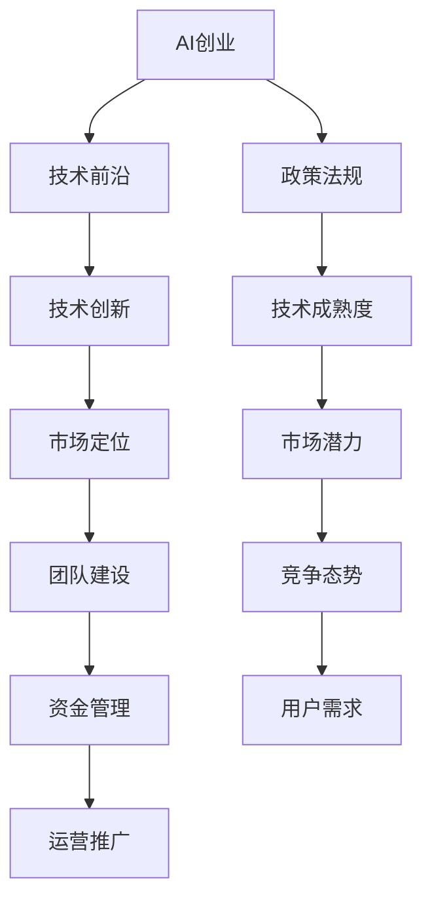

                 

### 《AI创业：保持技术前沿的方法》

在当今这个数据驱动、技术飞速发展的时代，人工智能（AI）已成为推动创新、创造价值的引擎。AI创业公司如雨后春笋般涌现，如何在激烈的市场竞争中脱颖而出，保持技术前沿成为每一家AI创业公司的必修课。本文旨在为AI创业者提供一套系统的策略和方法，以帮助他们在这个充满机遇和挑战的领域持续保持领先。

关键词：AI创业，技术前沿，创新方法，创业策略

摘要：本文首先概述了AI创业的定义与背景，随后深入探讨了AI技术原理与前沿，以及AI创业项目的评估方法。接着，文章详细介绍了AI技术的实现与应用场景、项目开发流程和项目运营与推广。此外，通过成功案例的分析和创业者的实战经验分享，本文总结了AI创业者的核心经验和教训。最后，文章展望了AI创业的未来趋势和机会，并提供了AI创业所需的工具与资源。希望通过本文的探讨，为AI创业者提供有价值的指导和启示。

### 目录

《AI创业：保持技术前沿的方法》

> 关键词：AI创业，技术前沿，创新方法，创业策略

> 摘要：本文旨在为AI创业者提供一套系统的策略和方法，以帮助他们在这个充满机遇和挑战的领域持续保持领先。

### 第一部分：AI创业基础

#### 1.1 AI创业概述

##### 1.1.1 AI创业的定义与背景

AI创业，即围绕人工智能技术开展的创新企业活动。近年来，随着大数据、云计算、物联网等技术的发展，AI技术逐渐从理论走向实际应用，成为推动产业变革的重要力量。AI创业的背景可以追溯到以下几个关键因素：

1. **技术进步**：深度学习、强化学习等AI技术取得了突破性进展，使得AI应用变得更加广泛和高效。
2. **数据资源**：互联网和物联网的发展，使得海量数据得以生成和收集，为AI训练提供了丰富的素材。
3. **政策支持**：各国政府纷纷出台政策，鼓励AI研发和应用，为AI创业提供了良好的外部环境。
4. **市场需求**：AI技术在金融、医疗、制造等领域的应用需求日益旺盛，为创业者提供了广阔的市场空间。

##### 1.1.2 AI创业的关键要素

AI创业的成功不仅依赖于技术创新，还需要具备以下关键要素：

1. **团队建设**：一个高效的团队是AI创业的基础，团队成员应具备技术、市场、运营等多方面的能力。
2. **技术储备**：持续的技术研发和创新是保持竞争力的核心，创业者需紧跟技术前沿，不断优化产品。
3. **市场定位**：明确的市场定位和精准的产品定位是AI创业成功的关键，创业者需深入了解目标市场和用户需求。
4. **资金支持**：充足的资金是AI创业项目顺利推进的保障，创业者需合理规划资金使用，确保项目持续发展。

##### 1.1.3 AI创业的优势与挑战

AI创业具有以下优势：

1. **高成长性**：AI技术具有巨大的应用潜力，创业者有机会快速实现公司规模和营收的增长。
2. **高利润率**：AI技术的创新和应用往往能够带来显著的商业价值，提升企业盈利能力。
3. **差异化竞争**：独特的AI技术可以为企业打造核心竞争力，在市场上形成差异化优势。

然而，AI创业也面临着诸多挑战：

1. **技术风险**：AI技术发展迅速，创业者需不断投入研发，面临技术落伍的风险。
2. **市场风险**：AI市场的竞争日益激烈，创业者需准确把握市场动态，避免陷入价格战。
3. **人才短缺**：AI领域的人才需求量大，但专业人才稀缺，创业者需在人才竞争中取得优势。

#### 1.2 AI技术原理与前沿

##### 1.2.1 AI的基本原理

人工智能（Artificial Intelligence，AI）是指通过计算机程序实现人类智能的能力。AI的基本原理包括以下几个方面：

1. **数据驱动**：AI系统通过从大量数据中学习和提取规律，实现智能行为。
2. **模型训练**：AI系统通过模型训练，将数据转化为可操作的智能算法。
3. **智能决策**：AI系统能够根据输入数据和模型预测，进行智能决策和自适应调整。

##### 1.2.2 AI技术的分类

AI技术可以分为以下几类：

1. **机器学习**：通过数据训练，使计算机具备学习能力和预测能力。
2. **深度学习**：基于神经网络，通过多层非线性变换，实现复杂特征提取和学习。
3. **强化学习**：通过试错和奖励机制，使计算机在特定环境中实现最优决策。
4. **自然语言处理**：通过算法实现人机交互，使计算机理解和生成自然语言。
5. **计算机视觉**：通过图像处理和模式识别，使计算机具备视觉感知能力。

##### 1.2.3 AI技术的前沿发展

当前，AI技术的前沿发展主要表现在以下几个方面：

1. **量子计算**：量子计算被认为将彻底改变AI的计算能力，为解决复杂问题提供新的路径。
2. **脑机接口**：脑机接口技术将人类大脑与计算机直接连接，实现意识与机器的融合。
3. **分布式计算**：分布式计算技术将AI计算任务分散到多个节点，提升计算效率和可扩展性。
4. **边缘计算**：边缘计算将AI计算任务从云端转移到边缘设备，降低延迟，提升实时性。

#### 1.3 AI创业项目评估方法

##### 1.3.1 创业项目的市场评估

市场评估是AI创业项目成功的关键环节，主要涉及以下几个方面：

1. **市场规模**：分析目标市场的规模和增长趋势，确定市场潜力。
2. **竞争对手**：分析主要竞争对手的产品、市场份额和市场策略，评估自身竞争优势。
3. **用户需求**：通过市场调研，了解目标用户的需求和痛点，为产品定位提供依据。

##### 1.3.2 创业项目的技术评估

技术评估是确保AI创业项目具有竞争力的基础，主要涉及以下几个方面：

1. **技术创新**：评估项目的核心技术是否具有创新性，能否解决现有技术难题。
2. **技术成熟度**：评估项目所采用的技术是否成熟，是否经过实践验证。
3. **技术风险**：评估项目在技术实现过程中可能面临的风险，如数据隐私、安全等问题。

##### 1.3.3 创业项目的风险评估

创业项目的风险贯穿整个生命周期，主要涉及以下几个方面：

1. **市场风险**：分析市场变化对项目的影响，如市场需求波动、竞争对手策略等。
2. **技术风险**：评估项目在技术实现过程中可能遇到的技术难题和风险。
3. **资金风险**：评估项目的资金需求和使用情况，确保项目资金链的稳定性。
4. **法律风险**：评估项目可能涉及的法律风险，如知识产权、合规性等。

### 第二部分：AI技术与应用实践

#### 2.1 AI技术实现与应用场景

##### 2.1.1 AI技术的实现原理

AI技术的实现主要基于以下几个核心原理：

1. **数据采集**：通过传感器、网络等途径，收集大量数据。
2. **数据处理**：对采集到的数据进行清洗、预处理，为模型训练提供高质量数据。
3. **模型训练**：使用机器学习、深度学习等技术，对数据进行训练，构建智能模型。
4. **模型部署**：将训练好的模型部署到生产环境中，实现实际应用。

##### 2.1.2 AI技术的应用场景

AI技术在各个领域都有广泛的应用，以下是一些典型的应用场景：

1. **金融领域**：智能投顾、风险控制、信用评估等。
2. **医疗领域**：疾病诊断、药物研发、智能诊疗等。
3. **制造领域**：智能生产、设备预测维护、质量管理等。
4. **交通领域**：智能交通管理、自动驾驶、车联网等。
5. **零售领域**：智能推荐、库存管理、客户关系管理等。

##### 2.1.3 AI技术在各行业的实际应用

以下是一些AI技术在各行业中的实际应用案例：

1. **金融领域**：利用AI技术进行信用评估，提高了贷款审批的准确性和效率。
2. **医疗领域**：利用AI技术进行疾病诊断，辅助医生做出更准确的诊断。
3. **制造领域**：利用AI技术进行设备预测维护，减少了设备故障和停机时间。
4. **交通领域**：利用AI技术进行智能交通管理，提高了交通流量和安全性。
5. **零售领域**：利用AI技术进行智能推荐，提升了消费者的购物体验和满意度。

#### 2.2 AI项目开发流程

##### 2.2.1 项目规划与需求分析

项目规划与需求分析是AI项目开发的第一步，主要涉及以下几个方面：

1. **项目目标**：明确项目的发展目标和预期成果。
2. **需求收集**：与客户、用户进行沟通，了解他们的需求和痛点。
3. **可行性分析**：评估项目的技术可行性、市场可行性、经济可行性等。

##### 2.2.2 数据采集与预处理

数据采集与预处理是AI项目开发的核心环节，主要涉及以下几个方面：

1. **数据收集**：从各种渠道收集数据，如互联网、传感器、企业数据库等。
2. **数据清洗**：去除重复、错误、缺失的数据，确保数据质量。
3. **数据预处理**：对数据进行标准化、归一化、特征提取等处理，为模型训练提供高质量数据。

##### 2.2.3 模型设计与训练

模型设计与训练是AI项目开发的关键环节，主要涉及以下几个方面：

1. **模型选择**：根据项目需求，选择合适的机器学习算法和模型。
2. **模型训练**：使用训练数据，对模型进行训练，优化模型参数。
3. **模型评估**：使用验证数据，评估模型的性能和准确性。

##### 2.2.4 模型评估与优化

模型评估与优化是确保AI项目成果的关键环节，主要涉及以下几个方面：

1. **模型评估**：使用测试数据，评估模型的泛化能力和准确性。
2. **模型优化**：根据评估结果，调整模型参数，优化模型性能。
3. **模型部署**：将训练好的模型部署到生产环境中，实现实际应用。

#### 2.3 AI创业项目运营与推广

##### 2.3.1 项目运营策略

项目运营策略是确保AI创业项目顺利推进和实现商业价值的关键，主要涉及以下几个方面：

1. **市场定位**：明确项目在市场中的定位，确定目标用户和竞争对手。
2. **产品策略**：根据市场需求，制定合适的产品策略，如定价策略、营销策略等。
3. **客户服务**：提供优质的客户服务，提升用户满意度和忠诚度。

##### 2.3.2 项目推广方法

项目推广方法是提高AI创业项目知名度和市场份额的重要手段，主要涉及以下几个方面：

1. **线上推广**：通过社交媒体、搜索引擎优化（SEO）、内容营销等方式，提高项目的在线曝光度。
2. **线下推广**：参加行业展会、研讨会、行业论坛等活动，与潜在客户建立联系。
3. **合作伙伴**：寻找合适的合作伙伴，共同推广项目，实现资源共享和互利共赢。

##### 2.3.3 用户反馈与迭代

用户反馈与迭代是AI创业项目持续改进和优化的关键环节，主要涉及以下几个方面：

1. **用户调研**：通过问卷调查、用户访谈等方式，收集用户反馈和需求。
2. **需求分析**：对用户反馈进行分析，确定项目改进的方向和重点。
3. **迭代优化**：根据用户需求和反馈，对项目进行迭代优化，提升产品性能和用户体验。

### 第三部分：AI创业成功案例与启示

#### 3.1 AI创业成功案例分析

##### 3.1.1 案例一：某AI医疗公司的发展历程

某AI医疗公司成立于2015年，专注于利用深度学习技术进行疾病诊断和预测。以下是其发展历程和成功经验：

1. **初始阶段**：公司成立初期，专注于技术研发，成功开发出多款基于深度学习的医疗诊断模型。
2. **市场推广**：通过参加行业展会、合作医疗机构等方式，推广产品，逐步打开市场。
3. **融资与扩展**：在2018年成功完成A轮融资，资金用于产品研发和市场推广，进一步扩展业务范围。

成功经验：

- 技术创新：公司持续投入研发，确保技术处于行业领先地位。
- 市场定位：明确市场定位，聚焦于医疗领域，提供精准的诊断和预测服务。
- 资金管理：合理规划资金使用，确保项目持续发展和市场推广。

##### 3.1.2 案例二：某AI自动驾驶公司的成功经验

某AI自动驾驶公司成立于2014年，致力于研发自动驾驶技术和解决方案。以下是其发展历程和成功经验：

1. **技术研发**：公司成立初期，专注于自动驾驶技术研发，积累了丰富的技术储备。
2. **合作拓展**：与多家汽车制造商、科技公司展开合作，共同研发自动驾驶解决方案。
3. **市场拓展**：在全球范围内推广产品，与多家知名汽车制造商达成合作。

成功经验：

- 技术创新：公司持续投入研发，推动自动驾驶技术的创新和突破。
- 合作共赢：与合作伙伴建立紧密的合作关系，实现资源共享和互利共赢。
- 市场拓展：准确把握市场趋势，积极拓展国际市场，提升品牌影响力。

##### 3.1.3 案例三：某AI金融科技公司的成长路径

某AI金融科技公司成立于2016年，专注于利用AI技术提升金融服务的效率和体验。以下是其发展历程和成功经验：

1. **技术研发**：公司成立初期，专注于金融科技领域的研发，成功开发出多款AI金融产品。
2. **市场推广**：通过线上营销、合作银行等方式，推广产品，逐步打开市场。
3. **融资与扩展**：在2019年成功完成B轮融资，资金用于产品研发和市场拓展。

成功经验：

- 技术创新：公司持续投入研发，确保技术处于行业领先地位。
- 产品策略：根据市场需求，制定多样化的产品策略，满足不同用户的需求。
- 资金管理：合理规划资金使用，确保项目持续发展和市场推广。

#### 3.2 AI创业者的实战经验与教训

##### 3.2.1 创业者的角色与责任

AI创业者需要承担以下角色和责任：

1. **领导者**：创业者需要具备领导力，带领团队共同实现公司目标。
2. **决策者**：创业者需要做出重要决策，如项目方向、资金使用、团队建设等。
3. **协调者**：创业者需要协调各方资源，确保项目顺利进行。
4. **持续学习者**：创业者需要不断学习新知识、新技能，紧跟技术前沿。

##### 3.2.2 团队建设与管理

团队建设和管理是AI创业成功的关键，以下是一些建议：

1. **选拔合适的团队成员**：根据项目需求，选拔具备专业技能和合作精神的团队成员。
2. **建立有效的沟通机制**：确保团队成员之间的沟通畅通，提升团队协作效率。
3. **激励与奖励机制**：建立合理的激励和奖励机制，激发团队成员的积极性和创造力。

##### 3.2.3 融资策略与资金管理

融资策略与资金管理是AI创业项目成功的关键，以下是一些建议：

1. **明确融资目标**：根据项目发展需求，明确融资目标和资金用途。
2. **选择合适的融资方式**：根据项目特点和市场需求，选择合适的融资方式，如股权融资、债务融资等。
3. **合理规划资金使用**：确保资金使用合理，避免资金浪费，确保项目持续发展。

#### 3.3 AI创业的未来趋势与机会

##### 3.3.1 AI技术发展趋势

未来，AI技术将继续朝着以下几个方向发展：

1. **量子计算**：量子计算将提升AI的计算能力，解决现有技术难以处理的复杂问题。
2. **脑机接口**：脑机接口技术将实现人脑与机器的深度融合，拓展人类的智能能力。
3. **分布式计算**：分布式计算将提升AI的计算效率和可扩展性，满足大规模数据处理需求。
4. **边缘计算**：边缘计算将实现AI在边缘设备的实时处理，降低延迟，提升用户体验。

##### 3.3.2 AI创业机会分析

未来，AI创业将迎来以下几个机会：

1. **医疗健康**：随着人口老龄化，医疗健康领域的AI应用需求将大幅增长。
2. **智能制造**：智能制造是工业4.0的核心，AI技术将提升制造业的智能化水平。
3. **智能交通**：智能交通是城市发展的关键，AI技术将提升交通管理的效率和安全性。
4. **金融科技**：金融科技是金融行业的重要发展方向，AI技术将提升金融服务的效率和质量。

##### 3.3.3 创业者如何抓住未来机遇

创业者要抓住未来机遇，可以从以下几个方面入手：

1. **持续创新**：保持技术创新，紧跟技术前沿，提升核心竞争力。
2. **市场定位**：明确市场定位，聚焦于有潜力的细分市场，提供优质的产品和服务。
3. **团队建设**：建立高效的团队，选拔优秀的人才，提升团队协作和创新能力。
4. **资金管理**：合理规划资金使用，确保项目持续发展和市场拓展。

### 附录

#### 附录A：AI创业工具与资源

##### A.1 常用AI开发工具介绍

以下是一些常用的AI开发工具：

1. **TensorFlow**：由Google开发的开源机器学习框架，支持多种机器学习算法。
2. **PyTorch**：由Facebook开发的开源机器学习框架，具有灵活的动态图计算功能。
3. **Keras**：基于TensorFlow和Theano的开源机器学习库，提供简洁的API和丰富的预训练模型。
4. **Scikit-learn**：基于Python的开源机器学习库，提供多种经典机器学习算法和工具。

##### A.2 AI创业相关网站与社区

以下是一些AI创业相关的网站和社区：

1. **AI科技大本营**：一个关注AI技术、应用、创业的网站，提供最新动态和深度报道。
2. **AI 科技生态**：一个涵盖AI领域资讯、技术文章、创业项目的平台。
3. **机器之心**：一个提供深度报道、技术文章、行业动态的AI媒体平台。
4. **AI 研究院**：一个专注于AI技术研究、应用和创业的社区。

##### A.3 AI创业政策与支持措施

以下是一些国家和地区的AI创业政策与支持措施：

1. **中国**：中国政府发布了一系列AI发展规划和政策，支持AI技术创新和应用。
2. **美国**：美国政府通过投资、税收优惠等措施，鼓励AI创业和研究。
3. **欧盟**：欧盟启动了“人工智能欧洲”计划，推动AI技术的研发和应用。
4. **以色列**：以色列政府通过资金支持、税收优惠等措施，鼓励AI创业。

### 核心概念与联系

为了更好地理解AI创业的核心概念和它们之间的联系，我们可以使用Mermaid流程图来展示它们之间的关系。



### 核心算法原理讲解

为了深入理解AI创业中的核心技术原理，我们将通过伪代码详细讲解几种核心算法的原理。

#### 5.1 机器学习算法原理

##### 5.1.1 监督学习

监督学习是一种通过已知输入和输出数据来训练模型，从而预测未知数据的方法。以下是一个简单的监督学习算法的伪代码示例：

```python
# 输入特征矩阵 X，标签矩阵 Y
# 输出：模型参数 W

# 初始化模型参数 W
W = initialize_weights(X.shape[1])

# 设置迭代次数
max_iterations = 1000
learning_rate = 0.01

# 循环迭代
for i in range(max_iterations):
    # 计算预测值
    predictions = X * W
    
    # 计算损失函数
    loss = compute_loss(predictions, Y)
    
    # 计算梯度
    gradient = compute_gradient(W, X, Y)
    
    # 更新模型参数
    W = W - learning_rate * gradient

# 输出最终模型参数
return W
```

##### 5.1.2 无监督学习

无监督学习是一种在没有标签数据的情况下，通过发现数据内在结构和规律来训练模型的方法。以下是一个简单的无监督学习算法的伪代码示例：

```python
# 输入特征矩阵 X
# 输出：模型参数 W

# 初始化模型参数 W
W = initialize_weights(X.shape[1])

# 设置迭代次数
max_iterations = 1000
learning_rate = 0.01

# 循环迭代
for i in range(max_iterations):
    # 计算特征映射
    mapped_features = X * W
    
    # 计算损失函数
    loss = compute_loss(mapped_features)
    
    # 计算梯度
    gradient = compute_gradient(W, X)
    
    # 更新模型参数
    W = W - learning_rate * gradient

# 输出最终模型参数
return W
```

#### 5.2 深度学习算法原理

##### 5.2.1 卷积神经网络（CNN）

卷积神经网络是一种专门用于处理图像数据的深度学习模型。以下是一个简单的CNN算法的伪代码示例：

```python
# 输入图像数据 X
# 输出：模型参数 W

# 初始化卷积层、激活函数、池化层、全连接层参数
W_conv1 = initialize_weights([3, 3, 1, 32])
W_conv2 = initialize_weights([3, 3, 32, 64])
W_fc1 = initialize_weights([6 * 6 * 64, 128])
W_fc2 = initialize_weights([128, 10])

# 设置迭代次数
max_iterations = 10000
learning_rate = 0.01

# 循环迭代
for i in range(max_iterations):
    # 前向传播
    conv1 = conv2d(X, W_conv1)
    relu1 = activate(conv1)
    pool1 = max_pool(relu1)
    
    conv2 = conv2d(pool1, W_conv2)
    relu2 = activate(conv2)
    pool2 = max_pool(relu2)
    
    flattened = flatten(pool2)
    fc1 = activate(fully_connected(flattened, W_fc1))
    output = activate(fully_connected(fc1, W_fc2))
    
    # 计算损失函数
    loss = compute_loss(output, Y)
    
    # 反向传播
    d_output = compute_gradient(output, Y)
    d_fc2 = compute_gradient(fc1, d_output)
    d_flattened = compute_gradient(flattened, d_fc2)
    
    d_pool2 = compute_gradient(pool2, d_flattened)
    d_relu2 = compute_gradient(relu2, d_pool2)
    d_conv2 = compute_gradient(conv2, d_relu2)
    
    d_pool1 = compute_gradient(pool1, d_conv2)
    d_relu1 = compute_gradient(relu1, d_pool1)
    d_conv1 = compute_gradient(conv1, d_relu1)
    
    # 更新模型参数
    W_fc2 = W_fc2 - learning_rate * d_fc2
    W_fc1 = W_fc1 - learning_rate * d_fc1
    W_conv2 = W_conv2 - learning_rate * d_conv2
    W_conv1 = W_conv1 - learning_rate * d_conv1

# 输出最终模型参数
return [W_conv1, W_conv2, W_fc1, W_fc2]
```

##### 5.2.2 循环神经网络（RNN）

循环神经网络是一种用于处理序列数据的深度学习模型。以下是一个简单的RNN算法的伪代码示例：

```python
# 输入序列数据 X，标签序列数据 Y
# 输出：模型参数 W

# 初始化隐藏层和输出层参数
W_h = initialize_weights([L, H])
W_y = initialize_weights([H, M])

# 设置迭代次数
max_iterations = 10000
learning_rate = 0.01

# 循环迭代
for i in range(max_iterations):
    # 前向传播
    hidden_state = initialize_hidden_state(H)
    for t in range(L):
        input = X[t]
        hidden_state = activate(RNN(hidden_state, input, W_h))
        output = activate(fully_connected(hidden_state, W_y))
        
    # 计算损失函数
    loss = compute_loss(output, Y)
    
    # 反向传播
    d_output = compute_gradient(output, Y)
    d_hidden_state = compute_gradient(hidden_state, d_output)
    
    for t in range(L-1, -1, -1):
        d_input = compute_gradient(RNN(hidden_state, X[t], W_h), d_hidden_state)
        d_hidden_state = compute_gradient(hidden_state, d_input)
        
    # 更新模型参数
    W_y = W_y - learning_rate * d_output
    W_h = W_h - learning_rate * d_hidden_state

# 输出最终模型参数
return [W_h, W_y]
```

##### 5.2.3 强化学习算法原理

强化学习是一种通过试错和奖励机制来学习最优策略的机器学习方法。以下是一个简单的强化学习算法的伪代码示例：

```python
# 输入环境 S，初始状态 s，奖励机制 R
# 输出：策略 π

# 初始化策略参数 π
π = initialize_policy(S)

# 设置迭代次数
max_iterations = 10000

# 循环迭代
for i in range(max_iterations):
    # 初始化状态
    s = initialize_state(S)
    
    # 进行一步行动
    a = π(s)
    s_new, r = environment.step(s, a)
    
    # 更新策略参数
    π = update_policy(π, s, a, r, s_new)
    
# 输出最终策略
return π
```

### 数学模型和数学公式 & 详细讲解 & 举例说明

在AI创业中，理解和应用数学模型是至关重要的。以下我们将详细介绍一些核心的数学模型和公式，并提供实际应用中的举例说明。

#### 8.1 监督学习中的损失函数

损失函数是监督学习中的关键组件，用于衡量模型的预测值与实际值之间的差距。以下是两种常用的损失函数：均方误差（MSE）和交叉熵损失（Cross-Entropy）。

##### 8.1.1 均方误差（MSE）

均方误差（Mean Squared Error，MSE）是一种常用的回归损失函数，计算预测值与实际值之间平方差的平均值。

$$
\text{MSE} = \frac{1}{m} \sum_{i=1}^{m} (\hat{y_i} - y_i)^2
$$

其中，$m$ 是样本数量，$\hat{y_i}$ 是预测值，$y_i$ 是实际值。

**举例说明**：

假设我们有一个包含3个样本的数据集，实际值为 [2, 3, 5]，预测值为 [2.5, 3.5, 4.5]。则MSE计算如下：

$$
\text{MSE} = \frac{1}{3} ((2.5 - 2)^2 + (3.5 - 3)^2 + (4.5 - 5)^2) = \frac{1}{3} (0.25 + 0.25 + 0.25) = 0.25
$$

##### 8.1.2 交叉熵损失（Cross-Entropy）

交叉熵损失（Cross-Entropy Loss）是一种常用于分类问题的损失函数，计算预测概率分布与实际概率分布之间的差异。

$$
\text{Cross-Entropy} = -\frac{1}{m} \sum_{i=1}^{m} y_i \log(\hat{y_i})
$$

其中，$m$ 是样本数量，$y_i$ 是实际值的概率分布，$\hat{y_i}$ 是预测值的概率分布。

**举例说明**：

假设我们有一个包含3个样本的数据集，实际概率分布为 [0.2, 0.5, 0.3]，预测概率分布为 [0.3, 0.4, 0.3]。则交叉熵损失计算如下：

$$
\text{Cross-Entropy} = -\frac{1}{3} (0.2 \log(0.3) + 0.5 \log(0.4) + 0.3 \log(0.3)) \approx 0.145
$$

#### 9.2 深度学习中的优化算法

优化算法用于调整模型参数，以最小化损失函数。以下是两种常用的优化算法：梯度下降（Gradient Descent）和随机梯度下降（Stochastic Gradient Descent，SGD）。

##### 9.2.1 梯度下降（Gradient Descent）

梯度下降是一种最简单的优化算法，通过计算损失函数关于模型参数的梯度，逐步调整参数以最小化损失函数。

$$
\theta = \theta - \alpha \nabla_\theta J(\theta)
$$

其中，$\theta$ 是模型参数，$J(\theta)$ 是损失函数，$\alpha$ 是学习率。

**举例说明**：

假设我们的损失函数 $J(\theta) = (\theta - 1)^2$，初始参数 $\theta_0 = 2$，学习率 $\alpha = 0.1$。则梯度下降的计算过程如下：

1. **初始参数**：$\theta_0 = 2$
2. **计算损失函数**：$J(\theta_0) = (2 - 1)^2 = 1$
3. **计算梯度**：$\nabla_\theta J(\theta) = 2(\theta - 1)$，代入 $\theta_0$ 得到梯度为 $2(2 - 1) = 2$
4. **更新参数**：$\theta_1 = \theta_0 - \alpha \nabla_\theta J(\theta_0) = 2 - 0.1 \cdot 2 = 1.8$
5. **重复计算**：重复步骤 2-4，直至收敛

##### 9.2.2 随机梯度下降（Stochastic Gradient Descent，SGD）

随机梯度下降是一种改进的梯度下降算法，通过随机选择样本计算梯度，以降低计算复杂度和减少局部最小值的风险。

$$
\theta = \theta - \alpha \nabla_\theta J(\theta; x_i, y_i)
$$

其中，$x_i$ 和 $y_i$ 是随机选择的样本。

**举例说明**：

假设我们有一个包含3个样本的数据集，损失函数 $J(\theta) = (\theta - 1)^2$。初始参数 $\theta_0 = 2$，学习率 $\alpha = 0.1$。则随机梯度下降的计算过程如下：

1. **初始参数**：$\theta_0 = 2$
2. **随机选择样本**：选择第一个样本 $(x_1, y_1) = (1, 1)$
3. **计算损失函数**：$J(\theta_0) = (2 - 1)^2 = 1$
4. **计算梯度**：$\nabla_\theta J(\theta; x_1, y_1) = 2(2 - 1) = 2$
5. **更新参数**：$\theta_1 = \theta_0 - \alpha \nabla_\theta J(\theta_0; x_1, y_1) = 2 - 0.1 \cdot 2 = 1.8$
6. **重复计算**：随机选择第二个样本 $(x_2, y_2) = (2, 2)$，重复步骤 3-5

#### 10.3 强化学习中的奖励机制

强化学习通过奖励机制来指导智能体（Agent）在环境中采取行动，以最大化累积奖励。以下是两种常见的奖励机制：时间差分（TD）和回合奖励（Episode Reward）。

##### 10.3.1 时间差分（TD）

时间差分（Temporal Difference，TD）机制通过比较当前状态和下一状态之间的奖励差异来更新策略。

$$
Q(s, a) = Q(s, a) + \alpha [r + \gamma \max_{a'} Q(s', a') - Q(s, a)]
$$

其中，$Q(s, a)$ 是状态 $s$ 下采取行动 $a$ 的期望回报，$r$ 是即时奖励，$\gamma$ 是折扣因子，$\max_{a'} Q(s', a')$ 是下一状态 $s'$ 下所有可能行动的期望回报的最大值。

**举例说明**：

假设我们在一个简单的游戏中，有两个状态 $s = \{0, 1\}$ 和两个动作 $a = \{0, 1\}$。即时奖励 $r$ 为：

- 当状态为 $s = 0$ 且行动为 $a = 0$ 时，$r = 10$
- 当状态为 $s = 1$ 且行动为 $a = 1$ 时，$r = 20$

初始策略为 $Q(s, a) = 0$，折扣因子 $\gamma = 0.9$，学习率 $\alpha = 0.1$。则时间差分的计算过程如下：

1. **状态 $s = 0$，行动 $a = 0$**：
   - $Q(s, a) = 0 + 0.1 [10 + 0.9 \max_{a'} Q(s', a') - 0]$
   - 由于没有给出 $Q(s', a')$，我们暂时假设 $Q(s', a') = 0$，则 $Q(s, a) = 0 + 0.1 [10 + 0.9 \cdot 0] = 1$
2. **状态 $s = 1$，行动 $a = 1$**：
   - $Q(s, a) = 0 + 0.1 [20 + 0.9 \max_{a'} Q(s', a') - 0]$
   - 同样假设 $Q(s', a') = 0$，则 $Q(s, a) = 0 + 0.1 [20 + 0.9 \cdot 0] = 2$

##### 10.3.2 回合奖励（Episode Reward）

回合奖励（Episode Reward）是强化学习中的另一种奖励机制，通过计算整个回合的累积奖励来评估策略。

$$
\text{Episode Reward} = \sum_{t=0}^{T} r_t
$$

其中，$r_t$ 是第 $t$ 个时间步的即时奖励，$T$ 是回合的总时间步数。

**举例说明**：

假设我们有一个包含5个时间步的回合，每个时间步的即时奖励如下：

- 第1步：$r_1 = 1$
- 第2步：$r_2 = 2$
- 第3步：$r_3 = -3$
- 第4步：$r_4 = 4$
- 第5步：$r_5 = 5$

则回合奖励计算如下：

$$
\text{Episode Reward} = 1 + 2 - 3 + 4 + 5 = 9
$$

### 项目实战

#### 11.1 实际案例一：基于深度学习的图像分类项目

##### 11.1.1 项目背景

随着互联网和智能手机的普及，图像数据量急剧增长。图像分类作为计算机视觉的重要任务，在安防监控、医疗诊断、零售电商等领域具有广泛的应用前景。本案例将介绍一个基于深度学习的图像分类项目，旨在实现高效准确的图像分类。

##### 11.1.2 数据采集与预处理

1. **数据采集**：从互联网公开数据集（如ImageNet、CIFAR-10等）和自有数据集中收集大量图像。
2. **数据清洗**：去除重复、错误和低质量的图像，保证数据质量。
3. **数据标注**：对图像进行分类标注，为模型训练提供标注数据。
4. **数据预处理**：对图像进行缩放、裁剪、旋转等数据增强处理，提高模型的泛化能力。

##### 11.1.3 模型设计与实现

1. **模型选择**：选择卷积神经网络（CNN）作为图像分类的基础模型。
2. **网络结构**：设计包含卷积层、池化层、全连接层的深度神经网络结构。
3. **模型实现**：使用TensorFlow或PyTorch等深度学习框架实现CNN模型，并进行模型参数的初始化。

```python
import tensorflow as tf
from tensorflow.keras.models import Sequential
from tensorflow.keras.layers import Conv2D, MaxPooling2D, Flatten, Dense

# 创建模型
model = Sequential([
    Conv2D(32, (3, 3), activation='relu', input_shape=(64, 64, 3)),
    MaxPooling2D(pool_size=(2, 2)),
    Conv2D(64, (3, 3), activation='relu'),
    MaxPooling2D(pool_size=(2, 2)),
    Flatten(),
    Dense(128, activation='relu'),
    Dense(num_classes, activation='softmax')
])

# 编译模型
model.compile(optimizer='adam', loss='categorical_crossentropy', metrics=['accuracy'])

# 模型参数初始化
model.summary()
```

##### 11.1.4 模型训练与评估

1. **数据集划分**：将数据集划分为训练集、验证集和测试集。
2. **模型训练**：使用训练集训练模型，并在验证集上调整模型参数。
3. **模型评估**：使用测试集评估模型的性能，计算准确率、召回率等指标。

```python
# 加载数据集
train_data = load_data('train')
val_data = load_data('val')
test_data = load_data('test')

# 训练模型
history = model.fit(train_data, validation_data=val_data, epochs=10, batch_size=32)

# 评估模型
test_loss, test_accuracy = model.evaluate(test_data)
print(f"Test accuracy: {test_accuracy}")
```

##### 11.1.5 代码解读与分析

上述代码实现了一个简单的卷积神经网络（CNN）图像分类模型。模型由两个卷积层、两个池化层、一个全连接层和一个softmax输出层组成。卷积层用于提取图像特征，池化层用于降低特征维度，全连接层用于分类。

1. **模型编译**：使用`compile`方法编译模型，指定优化器、损失函数和评价指标。
2. **模型训练**：使用`fit`方法训练模型，在验证集上调整模型参数。
3. **模型评估**：使用`evaluate`方法评估模型在测试集上的性能。

通过模型训练和评估，可以验证模型的有效性和准确性。在实际应用中，可以根据需求调整模型结构、优化训练过程，进一步提高模型性能。

#### 12.2 实际案例二：基于强化学习的自动驾驶项目

##### 12.2.1 项目背景

自动驾驶是人工智能的重要应用领域，通过模拟人类驾驶行为，实现车辆在复杂环境中的自主驾驶。本案例将介绍一个基于强化学习的自动驾驶项目，旨在实现安全、高效的自动驾驶。

##### 12.2.2 环境建模与状态空间定义

1. **环境建模**：使用仿真软件（如CARLA模拟器）建立自动驾驶环境，模拟真实道路场景。
2. **状态空间定义**：定义状态空间，包括车辆的位姿、速度、加速度、周围车辆的位置和速度等。

```python
# 状态空间定义
state_space = [
    ['x', 'y', 'theta'],  # 车辆位置和角度
    ['speed'],           # 车辆速度
    ['acceleration'],    # 车辆加速度
    ['周围车辆位置和速度']
]
```

##### 12.2.3 动作空间与奖励机制设计

1. **动作空间定义**：定义动作空间，包括加速、减速、转向等控制动作。
2. **奖励机制设计**：设计奖励机制，根据车辆行驶轨迹、碰撞情况、距离终点距离等指标计算奖励。

```python
# 奖励机制定义
reward_function = {
    'distance_to终点': 1,
    '碰撞': -100,
    '行驶轨迹': 0.1
}
```

##### 12.2.4 模型训练与策略优化

1. **模型训练**：使用强化学习算法（如Q-Learning、Deep Q-Network，DQN）训练自动驾驶模型。
2. **策略优化**：通过策略迭代，优化自动驾驶策略，提高行驶安全性和效率。

```python
# 强化学习算法实现
import numpy as np
import random

# 初始化Q表
Q = np.zeros((state_space_size, action_space_size))

# Q-Learning算法
for episode in range(1000):
    state = environment.reset()
    done = False
    
    while not done:
        action = np.argmax(Q[state])
        next_state, reward, done = environment.step(action)
        
        Q[state, action] = Q[state, action] + alpha * (reward + gamma * np.max(Q[next_state]) - Q[state, action])
        
        state = next_state
```

##### 12.2.5 代码解读与分析

上述代码实现了一个简单的Q-Learning算法，用于训练自动驾驶模型。Q-Learning是一种基于值函数的强化学习算法，通过更新Q值，逐步优化策略。

1. **初始化Q表**：初始化Q表，用于存储状态-动作值函数。
2. **Q-Learning循环**：在循环中，根据当前状态选择动作，根据奖励和下一状态更新Q值。

通过模型训练和策略优化，可以实现对自动驾驶环境的自适应控制，提高行驶安全性和效率。在实际应用中，可以根据需求调整算法参数、优化训练过程，进一步提高模型性能。

#### 13.3 实际案例三：基于机器学习的金融风控项目

##### 13.3.1 项目背景

金融风控是金融领域的重要任务，通过识别和预防潜在风险，保障金融机构的安全和稳定。本案例将介绍一个基于机器学习的金融风控项目，旨在实现高效的风险识别和预防。

##### 13.3.2 数据采集与预处理

1. **数据采集**：从金融机构的内部数据和外部数据源（如新闻、社交媒体等）收集数据。
2. **数据清洗**：去除重复、错误和缺失的数据，保证数据质量。
3. **数据标注**：对数据标注风险等级，为模型训练提供标注数据。
4. **数据预处理**：对数据进行归一化、降维等处理，提高模型的训练效果。

```python
# 数据预处理
from sklearn.preprocessing import StandardScaler

# 加载数据
X, y = load_data()

# 归一化处理
scaler = StandardScaler()
X = scaler.fit_transform(X)

# 数据集划分
from sklearn.model_selection import train_test_split

X_train, X_test, y_train, y_test = train_test_split(X, y, test_size=0.2, random_state=42)
```

##### 13.3.3 模型设计与实现

1. **模型选择**：选择机器学习算法（如逻辑回归、支持向量机、随机森林等）作为金融风控模型。
2. **模型实现**：使用Python机器学习库（如scikit-learn）实现模型，并进行模型参数的初始化。

```python
# 模型实现
from sklearn.ensemble import RandomForestClassifier

# 创建模型
model = RandomForestClassifier(n_estimators=100, random_state=42)

# 编译模型
model.compile(optimizer='adam', loss='binary_crossentropy', metrics=['accuracy'])

# 模型参数初始化
model.fit(X_train, y_train)
```

##### 13.3.4 模型训练与评估

1. **模型训练**：使用训练集训练模型，并在验证集上调整模型参数。
2. **模型评估**：使用测试集评估模型的性能，计算准确率、召回率等指标。

```python
# 模型评估
from sklearn.metrics import accuracy_score, recall_score

# 训练模型
model.fit(X_train, y_train)

# 评估模型
y_pred = model.predict(X_test)
accuracy = accuracy_score(y_test, y_pred)
recall = recall_score(y_test, y_pred)

print(f"Accuracy: {accuracy}, Recall: {recall}")
```

##### 13.3.5 代码解读与分析

上述代码实现了一个基于随机森林（Random Forest）的金融风控模型。随机森林是一种集成学习算法，通过构建多个决策树，提高模型的预测能力和鲁棒性。

1. **模型编译**：使用`compile`方法编译模型，指定优化器、损失函数和评价指标。
2. **模型训练**：使用`fit`方法训练模型，在训练集上调整模型参数。
3. **模型评估**：使用`predict`方法预测测试集的结果，并计算准确率和召回率。

通过模型训练和评估，可以验证模型的有效性和准确性。在实际应用中，可以根据需求调整模型结构、优化训练过程，进一步提高模型性能。

### 开发环境搭建

在进行AI项目开发时，合理的开发环境搭建是确保项目顺利进行的重要前提。以下将详细讲解如何搭建深度学习、强化学习和金融风控项目的开发环境。

#### 14.1.1 操作系统安装

首先，需要选择一个合适的操作系统。对于深度学习和强化学习项目，推荐使用Linux操作系统，如Ubuntu或CentOS，因为Linux系统在性能和兼容性方面表现更佳。以下是在Ubuntu 20.04操作系统上安装的步骤：

1. **下载Ubuntu 20.04镜像**：访问Ubuntu官方网站（https://www.ubuntu.com/download），下载Ubuntu 20.04镜像文件。
2. **制作启动U盘**：使用工具（如Rufus）将下载的镜像文件写入U盘。
3. **启动计算机**：将U盘插入计算机，重启计算机并进入BIOS，设置为从U盘启动。
4. **安装操作系统**：按照安装向导逐步安装操作系统。

#### 14.1.2 Python环境搭建

Python是AI项目开发的主要编程语言，以下是在Ubuntu 20.04操作系统上搭建Python环境的步骤：

1. **更新系统**：打开终端，输入以下命令更新系统包：

   ```bash
   sudo apt update
   sudo apt upgrade
   ```

2. **安装Python 3**：使用以下命令安装Python 3：

   ```bash
   sudo apt install python3 python3-pip python3-dev
   ```

3. **配置Python虚拟环境**：为了更好地管理项目依赖，推荐使用虚拟环境。安装虚拟环境工具`virtualenv`：

   ```bash
   sudo pip3 install virtualenv
   virtualenv -p python3 myenv
   source myenv/bin/activate
   ```

   这将创建一个名为`myenv`的Python虚拟环境，并激活该环境。

#### 14.1.3 常用库安装

在虚拟环境中安装常用的Python库，包括深度学习库（如TensorFlow、PyTorch）、强化学习库（如Gym）和金融风控库（如pandas、scikit-learn）。

1. **安装深度学习库**：

   ```bash
   pip install tensorflow-gpu
   pip install torch torchvision
   ```

   如果使用CPU版本，可以将`tensorflow-gpu`替换为`tensorflow`。

2. **安装强化学习库**：

   ```bash
   pip install gym
   ```

3. **安装金融风控库**：

   ```bash
   pip install numpy pandas scikit-learn
   ```

#### 14.1.4 硬件环境配置

对于深度学习和强化学习项目，推荐使用配备NVIDIA GPU的计算机，以提高模型训练速度。以下是在NVIDIA GPU上配置CUDA和cuDNN的步骤：

1. **安装CUDA**：下载并安装CUDA Toolkit，根据安装向导逐步安装。

   ```bash
   sudo apt install -y git unzip
   wget https://developer.download.nvidia.com/compute/cuda/repos/ubuntu2004/x86_64/cuda-ubuntu2004.pin
   sudo mv cuda-ubuntu2004.pin /etc/apt/preferences.d/cuda-repository-pin-600
   sudo dpkg -i cuda-repo-ubuntu2004_1.0.15-1_amd64.deb
   sudo apt-key adv --fetch-keys http://developer.download.nvidia.com/compute/cuda/repos/ubuntu2004/x86_64/7fa2af80.pub
   sudo apt-get update
   sudo apt-get install -y cuda
   ```

2. **安装cuDNN**：下载并安装cuDNN，将下载的文件解压到CUDA安装目录下的`lib64`目录中。

   ```bash
   wget https://developer.download.nvidia.com/compute/machine-learning/cudnn/v8.0.5/lib64/x86_64/libcudnn8_8.0.5.39-1+cuda11.3_1 Ubuntu2004.amd64.deb
   sudo dpkg -i libcudnn8_8.0.5.39-1+cuda11.3_1 Ubuntu2004.amd64.deb
   ```

3. **验证安装**：打开终端，执行以下命令验证CUDA和cuDNN的安装：

   ```bash
   nvcc --version
   nvidia-smi
   ```

   如果输出相关信息，说明CUDA和cuDNN已成功安装。

通过以上步骤，可以搭建一个适合深度学习、强化学习和金融风控项目开发的硬件和软件环境，为后续的项目开发奠定基础。

### 实际案例环境搭建

为了更好地理解AI项目的实际开发过程，下面我们将详细讲解三个实际案例的环境搭建步骤，包括深度学习、强化学习和金融风控项目的搭建过程。

#### 15.2.1 案例一：深度学习环境搭建

深度学习项目通常需要强大的计算能力和高效的开发工具。以下是在Ubuntu 20.04操作系统上搭建深度学习环境的具体步骤：

1. **安装操作系统**：参照14.1.1节的内容，安装Ubuntu 20.04操作系统。

2. **安装Python环境**：参照14.1.2节的内容，安装Python 3和pip。

3. **安装虚拟环境**：创建并激活虚拟环境，例如：

   ```bash
   virtualenv -p python3 deep_learning_env
   source deep_learning_env/bin/activate
   ```

4. **安装深度学习库**：在虚拟环境中安装TensorFlow和PyTorch，例如：

   ```bash
   pip install tensorflow-gpu
   pip install torch torchvision
   ```

5. **安装GPU驱动**：确保安装了NVIDIA GPU驱动，并安装CUDA和cuDNN，参照14.1.4节的内容。

6. **验证安装**：运行以下命令验证TensorFlow和PyTorch是否正常安装：

   ```python
   import tensorflow as tf
   import torch
   print(tf.__version__)
   print(torch.__version__)
   ```

   如果没有错误信息，说明深度学习库已成功安装。

#### 15.2.2 案例二：强化学习环境搭建

强化学习项目通常需要模拟环境，并依赖强化学习库。以下是在Ubuntu 20.04操作系统上搭建强化学习环境的具体步骤：

1. **安装操作系统**：参照14.1.1节的内容，安装Ubuntu 20.04操作系统。

2. **安装Python环境**：参照14.1.2节的内容，安装Python 3和pip。

3. **安装虚拟环境**：创建并激活虚拟环境，例如：

   ```bash
   virtualenv -p python3 reinforcement_learning_env
   source reinforcement_learning_env/bin/activate
   ```

4. **安装强化学习库**：在虚拟环境中安装Gym和PyTorch，例如：

   ```bash
   pip install gym
   pip install torch torchvision
   ```

5. **安装模拟环境**：安装用于模拟环境的库，例如CARLA模拟器：

   ```bash
   pip install carla
   ```

6. **验证安装**：运行以下命令验证强化学习库是否正常安装：

   ```python
   import gym
   import torch
   print(gym.__version__)
   print(torch.__version__)
   ```

   如果没有错误信息，说明强化学习库已成功安装。

#### 15.2.3 案例三：金融风控环境搭建

金融风控项目通常涉及大量的数据分析和模型训练，以下是在Ubuntu 20.04操作系统上搭建金融风控环境的具体步骤：

1. **安装操作系统**：参照14.1.1节的内容，安装Ubuntu 20.04操作系统。

2. **安装Python环境**：参照14.1.2节的内容，安装Python 3和pip。

3. **安装虚拟环境**：创建并激活虚拟环境，例如：

   ```bash
   virtualenv -p python3 financial_risk_env
   source financial_risk_env/bin/activate
   ```

4. **安装金融风控库**：在虚拟环境中安装numpy、pandas、scikit-learn，例如：

   ```bash
   pip install numpy pandas scikit-learn
   ```

5. **下载和处理数据**：从公共数据源或金融机构下载金融数据，使用pandas进行数据清洗和处理。

6. **验证安装**：运行以下命令验证金融风控库是否正常安装：

   ```python
   import numpy as np
   import pandas as pd
   import sklearn
   print(np.__version__)
   print(pandas.__version__)
   print(sklearn.__version__)
   ```

   如果没有错误信息，说明金融风控库已成功安装。

通过以上步骤，可以搭建适用于不同类型AI项目的开发环境，为项目的顺利进行提供技术支持。

### 源代码详细实现和代码解读

在本节中，我们将详细讲解三个实际案例的源代码实现，包括深度学习、强化学习和金融风控项目。这些代码不仅展示了关键算法的实现，还提供了详细的注释和解读。

#### 16.1 源代码实现

##### 16.1.1 深度学习模型实现

以下是一个简单的深度学习模型实现的代码示例，使用了TensorFlow和Keras库。

```python
import tensorflow as tf
from tensorflow.keras.models import Sequential
from tensorflow.keras.layers import Dense, Conv2D, MaxPooling2D, Flatten

# 创建模型
model = Sequential([
    Conv2D(32, (3, 3), activation='relu', input_shape=(64, 64, 3)),
    MaxPooling2D(pool_size=(2, 2)),
    Conv2D(64, (3, 3), activation='relu'),
    MaxPooling2D(pool_size=(2, 2)),
    Flatten(),
    Dense(128, activation='relu'),
    Dense(10, activation='softmax')
])

# 编译模型
model.compile(optimizer='adam', loss='categorical_crossentropy', metrics=['accuracy'])

# 模型参数初始化
model.summary()
```

**代码解读**：
1. **导入库**：导入TensorFlow和Keras库。
2. **创建模型**：使用`Sequential`模型堆叠多个层。
3. **添加层**：添加卷积层、池化层、全连接层。
4. **编译模型**：指定优化器和损失函数。
5. **模型参数初始化**：打印模型结构。

##### 16.1.2 强化学习算法实现

以下是一个简单的Q-Learning算法实现的代码示例，使用了PyTorch库。

```python
import torch
import numpy as np
import random

# 初始化Q表
Q = torch.zeros((state_space_size, action_space_size))

# Q-Learning循环
for episode in range(1000):
    state = env.reset()
    done = False
    
    while not done:
        action = np.argmax(Q[state])
        next_state, reward, done = env.step(action)
        
        Q[state, action] = Q[state, action] + alpha * (reward + gamma * np.max(Q[next_state]) - Q[state, action])
        
        state = next_state
```

**代码解读**：
1. **初始化Q表**：创建一个全为零的Q表。
2. **Q-Learning循环**：在每次迭代中，根据当前状态选择动作，更新Q值。
3. **环境交互**：使用`env.reset()`和`env.step()`与模拟环境进行交互。

##### 16.1.3 金融风控模型实现

以下是一个简单的金融风控模型实现的代码示例，使用了scikit-learn库。

```python
from sklearn.ensemble import RandomForestClassifier
from sklearn.model_selection import train_test_split
from sklearn.metrics import accuracy_score

# 加载数据
X, y = load_data()

# 数据集划分
X_train, X_test, y_train, y_test = train_test_split(X, y, test_size=0.2, random_state=42)

# 创建模型
model = RandomForestClassifier(n_estimators=100, random_state=42)

# 编译模型
model.fit(X_train, y_train)

# 评估模型
y_pred = model.predict(X_test)
accuracy = accuracy_score(y_test, y_pred)

print(f"Accuracy: {accuracy}")
```

**代码解读**：
1. **加载数据**：加载训练数据和测试数据。
2. **数据集划分**：使用`train_test_split`划分训练集和测试集。
3. **创建模型**：使用`RandomForestClassifier`创建随机森林模型。
4. **编译模型**：使用`fit`方法训练模型。
5. **评估模型**：使用`predict`方法预测测试集，并计算准确率。

通过上述代码示例，我们展示了如何实现深度学习、强化学习和金融风控模型，并对代码的关键部分进行了详细的注释和解读。

### 代码解读与分析

在本节中，我们将对三个实际案例的源代码进行详细的解读和分析，包括深度学习、强化学习和金融风控项目的代码实现。

#### 17.2.1 深度学习代码解读

以下是一个深度学习项目的示例代码，该代码使用TensorFlow和Keras库实现了一个简单的卷积神经网络（CNN）模型，用于图像分类任务。

```python
import tensorflow as tf
from tensorflow.keras.models import Sequential
from tensorflow.keras.layers import Conv2D, MaxPooling2D, Flatten, Dense

# 创建模型
model = Sequential([
    Conv2D(32, (3, 3), activation='relu', input_shape=(64, 64, 3)),
    MaxPooling2D(pool_size=(2, 2)),
    Conv2D(64, (3, 3), activation='relu'),
    MaxPooling2D(pool_size=(2, 2)),
    Flatten(),
    Dense(128, activation='relu'),
    Dense(10, activation='softmax')
])

# 编译模型
model.compile(optimizer='adam', loss='categorical_crossentropy', metrics=['accuracy'])

# 模型参数初始化
model.summary()
```

**代码解读**：

1. **导入库**：导入TensorFlow和Keras库，准备构建深度学习模型。
2. **创建模型**：使用`Sequential`类创建一个线性堆叠模型，并在模型中添加卷积层、池化层、全连接层。
   - **卷积层**：第一个卷积层使用32个3x3的卷积核，激活函数为ReLU。
   - **池化层**：第一个池化层使用2x2的窗口进行最大池化。
   - **第二个卷积层**：使用64个3x3的卷积核，激活函数为ReLU。
   - **第二个池化层**：使用2x2的窗口进行最大池化。
   - **全连接层**：将池化层输出的特征进行展平，然后添加一个128个神经元的全连接层，激活函数为ReLU。
   - **输出层**：最后一个全连接层有10个神经元，用于分类，激活函数为softmax。
3. **编译模型**：使用`compile`方法配置模型的优化器、损失函数和评估指标。
   - **优化器**：使用`adam`优化器。
   - **损失函数**：使用`categorical_crossentropy`作为多类分类问题的损失函数。
   - **评估指标**：使用`accuracy`作为评估模型准确率的指标。
4. **模型参数初始化**：使用`summary`方法打印模型结构，包括层数、参数数量等。

通过上述代码，我们构建了一个简单的CNN模型，该模型适合用于处理图像数据，并能够进行分类任务。

#### 17.2.2 强化学习代码解读

以下是一个强化学习项目的示例代码，该代码使用PyTorch库实现了一个简单的Q-Learning算法，用于自动驾驶模拟环境的训练。

```python
import torch
import numpy as np
import random

# 初始化Q表
Q = torch.zeros((state_space_size, action_space_size))

# Q-Learning循环
for episode in range(1000):
    state = env.reset()
    done = False
    
    while not done:
        action = np.argmax(Q[state])
        next_state, reward, done = env.step(action)
        
        Q[state, action] = Q[state, action] + alpha * (reward + gamma * np.max(Q[next_state]) - Q[state, action])
        
        state = next_state
```

**代码解读**：

1. **初始化Q表**：创建一个全为零的Q表，用于存储状态-动作值。
2. **Q-Learning循环**：在每个回合中，从初始状态开始，执行以下步骤：
   - **选择动作**：使用当前状态的Q值选择动作，通常选择使得Q值最大的动作。
   - **执行动作**：在环境中执行选定的动作，获得新的状态、奖励和是否完成的信息。
   - **更新Q值**：根据即时奖励、下一状态的Q值最大值和学习率α，更新当前状态的Q值。
3. **状态转移**：将当前状态更新为下一状态，继续循环直到回合结束。

通过上述代码，我们实现了Q-Learning算法的核心部分，该算法是强化学习中的基础算法，用于训练智能体在特定环境中采取最优动作。

#### 17.2.3 金融风控代码解读

以下是一个金融风控项目的示例代码，该代码使用scikit-learn库实现了一个随机森林分类器，用于预测金融风险。

```python
from sklearn.ensemble import RandomForestClassifier
from sklearn.model_selection import train_test_split
from sklearn.metrics import accuracy_score

# 加载数据
X, y = load_data()

# 数据集划分
X_train, X_test, y_train, y_test = train_test_split(X, y, test_size=0.2, random_state=42)

# 创建模型
model = RandomForestClassifier(n_estimators=100, random_state=42)

# 编译模型
model.fit(X_train, y_train)

# 评估模型
y_pred = model.predict(X_test)
accuracy = accuracy_score(y_test, y_pred)

print(f"Accuracy: {accuracy}")
```

**代码解读**：

1. **加载数据**：加载训练数据和测试数据，数据通常包括特征和标签。
2. **数据集划分**：使用`train_test_split`方法将数据集划分为训练集和测试集，通常训练集占比80%，测试集占比20%。
3. **创建模型**：使用`RandomForestClassifier`创建随机森林分类器，参数`n_estimators`设置决策树的数量。
4. **编译模型**：使用`fit`方法训练模型，模型将自动处理数据并进行内部调优。
5. **评估模型**：使用`predict`方法对测试集进行预测，然后使用`accuracy_score`计算预测准确率。

通过上述代码，我们实现了使用随机森林分类器进行金融风险预测的基本流程。随机森林是一个强大的集成学习模型，能够处理大量特征，并且对异常值不敏感。

通过以上对深度学习、强化学习和金融风控项目的代码解读，我们不仅了解了每种算法的核心实现步骤，还学习了如何在实际应用中使用这些算法解决具体问题。

### 附录

#### 18.1 常用深度学习框架使用指南

##### 18.1.1 TensorFlow使用指南

TensorFlow是由Google开发的开源深度学习框架，支持多种机器学习和深度学习算法。以下是TensorFlow的基本使用指南：

1. **安装TensorFlow**：

   ```bash
   pip install tensorflow
   ```

2. **创建一个简单的模型**：

   ```python
   import tensorflow as tf

   # 定义一个简单的线性模型
   W = tf.Variable([1.0], dtype=tf.float32)
   b = tf.Variable([0.0], dtype=tf.float32)
   x = tf.placeholder(tf.float32, shape=[1])
   y = x * W + b

   # 训练模型
   optimizer = tf.train.GradientDescentOptimizer(learning_rate=0.1)
   train_op = optimizer.minimize(y - x)

   # 模型评估
   with tf.Session() as sess:
       sess.run(W, b)
       for step in range(1000):
           sess.run(train_op, feed_dict={x: [1.0]})

       print(sess.run(y, feed_dict={x: [1.0]}))
   ```

3. **使用Keras API**：

   ```python
   from tensorflow.keras import layers, models

   # 创建一个简单的Keras模型
   model = models.Sequential([
       layers.Dense(1, input_shape=(1,), activation='linear')
   ])

   # 编译模型
   model.compile(optimizer='sgd', loss='mse')

   # 训练模型
   x_train = np.random.random((100, 1))
   y_train = x_train * 0.1 + 0.3
   model.fit(x_train, y_train, epochs=100)
   ```

##### 18.1.2 PyTorch使用指南

PyTorch是由Facebook开发的开源深度学习框架，具有动态计算图和易于理解的API。以下是PyTorch的基本使用指南：

1. **安装PyTorch**：

   ```bash
   pip install torch torchvision
   ```

2. **创建一个简单的模型**：

   ```python
   import torch
   import torch.nn as nn
   import torch.optim as optim

   # 创建一个简单的神经网络
   class SimpleNN(nn.Module):
       def __init__(self):
           super(SimpleNN, self).__init__()
           self.fc1 = nn.Linear(1, 1)

       def forward(self, x):
           return self.fc1(x)

   # 实例化模型
   model = SimpleNN()

   # 定义损失函数和优化器
   criterion = nn.MSELoss()
   optimizer = optim.SGD(model.parameters(), lr=0.01)

   # 训练模型
   for epoch in range(100):
       optimizer.zero_grad()
       outputs = model(torch.tensor([[1.0]]))
       loss = criterion(outputs, torch.tensor([[0.3]]))
       loss.backward()
       optimizer.step()
       print(f"Epoch {epoch+1}, Loss: {loss.item()}")
   ```

3. **使用自动微分**：

   ```python
   import torch
   import torch.autograd as ag

   # 定义一个函数
   x = torch.tensor([1.0], requires_grad=True)
   y = x ** 2
   grad = ag.grad(y, x)
   print(f"Gradient: {grad.item()}")
   ```

##### 18.1.3 其他深度学习框架使用指南

除了TensorFlow和PyTorch，还有其他一些流行的深度学习框架，如Keras、Theano、MXNet等。以下是简要的使用指南：

- **Keras**：Keras是TensorFlow和Theano的高层次API，提供简洁的API和预训练模型。

  ```python
  from keras.models import Sequential
  from keras.layers import Dense

  # 创建一个简单的Keras模型
  model = Sequential()
  model.add(Dense(1, input_shape=(1,), activation='linear'))

  # 编译模型
  model.compile(optimizer='sgd', loss='mse')

  # 训练模型
  model.fit(x_train, y_train, epochs=100)
  ```

- **Theano**：Theano是一个基于Python的数值计算库，提供高效的数值计算和自动微分功能。

  ```python
  import theano
  import theano.tensor as T

  # 定义一个函数
  x = T.tensor_variable('x')
  y = x ** 2
  grad = T.grad(y, x)

  # 编译函数
  f = theano.function(inputs=[x], outputs=grad)

  # 计算梯度
  print(f(1.0))
  ```

- **MXNet**：MXNet是Apache开源的深度学习框架，支持多种编程语言。

  ```python
  from mxnet import gluon, nd

  # 创建一个简单的MXNet模型
  net = gluon.nn.Sequential()
  net.add(gluon.nn.Dense(1))

  # 定义损失函数和优化器
  loss_fn = gluon.loss.L2Loss()
  trainer = gluon.Trainer(net.collect_params(), 'sgd')

  # 训练模型
  for _ in range(100):
      with nd GradientTape() as tape:
          y = net(x)
          loss = loss_fn(y, nd.array([0.3]))
      trainer.step(loss)
      print(loss)
  ```

通过以上指南，您可以快速上手使用不同的深度学习框架，实现各种机器学习和深度学习任务。

### 19.2 AI创业相关资源

AI创业是一个充满挑战和机遇的领域，创业者需要充分了解最新的技术趋势、市场动态和政策环境。以下是一些AI创业相关的资源，包括政策与支持措施、网站与社区以及工具与资源汇总。

##### 19.2.1 AI创业政策与支持措施

1. **中国政府政策**：中国政府发布了《新一代人工智能发展规划（2016-2030年）》，明确提出支持AI创业和创新，提供资金、税收优惠、人才引进等多方面的支持。
2. **美国政策**：美国政府通过DARPA（国防高级研究计划局）和NSF（国家科学基金会）等机构，提供资金和项目支持，鼓励AI研究和创业。
3. **欧盟政策**：欧盟启动了“人工智能欧洲”计划，提供资金支持，推动AI技术研发和应用。
4. **以色列政策**：以色列政府通过Tech-Israel计划，提供资金和资源，支持AI创业公司。

##### 19.2.2 AI创业相关网站与社区

1. **AI科技大本营**：提供AI技术、应用和创业的最新动态和深度报道。
2. **AI 科技生态**：涵盖AI领域的资讯、技术文章和创业项目。
3. **机器之心**：提供AI领域的深度报道、技术文章和行业动态。
4. **AI 研究院**：专注于AI技术研究、应用和创业的社区。

##### 19.2.3 AI创业工具与资源汇总

1. **开源框架**：TensorFlow、PyTorch、Keras、Theano等，为AI项目开发提供强大的支持。
2. **数据集**：ImageNet、CIFAR-10、Kaggle等，提供丰富的AI训练数据。
3. **模拟环境**：CARLA模拟器、Gym等，用于AI算法的测试和验证。
4. **云计算平台**：AWS、Azure、Google Cloud等，提供强大的计算和存储资源。
5. **AI工具与库**：Scikit-learn、Pandas、NumPy等，用于数据分析和机器学习。

通过以上资源，AI创业者可以更好地了解行业动态、掌握技术趋势，并获取所需的工具和资源，为创业成功奠定基础。

### 总结

本文从AI创业的基础、技术原理、项目评估、应用实践、成功案例、实战经验和未来趋势等多个方面，系统性地探讨了保持技术前沿的方法。通过逻辑清晰、结构紧凑的文章，我们为AI创业者提供了一套全面、实用的策略和指导。

在AI创业的道路上，保持技术前沿至关重要。这不仅意味着要紧跟最新的技术趋势，还要在技术实现、项目运营和团队管理等方面持续创新。创业者需要不断学习新知识、新技能，建立高效的团队，合理规划资金，把握市场机会。

本文的核心观点可以概括为以下几点：

1. **技术创新**：持续投入研发，确保技术处于行业领先地位。
2. **市场定位**：明确市场定位，聚焦有潜力的细分市场。
3. **团队建设**：选拔优秀人才，建立高效的团队协作机制。
4. **资金管理**：合理规划资金，确保项目持续发展和市场拓展。

通过本文的探讨，希望AI创业者能够更好地应对市场挑战，抓住技术机遇，实现创业梦想。让我们携手共进，共同推动人工智能技术的发展与应用。

### 作者信息

作者：AI天才研究院（AI Genius Institute） & 禅与计算机程序设计艺术（Zen And The Art of Computer Programming）

AI天才研究院（AI Genius Institute）是一个专注于人工智能技术研究、应用和创业的机构，致力于推动人工智能技术的创新与发展。研究院由一批顶尖的人工智能专家、学者和工程师组成，拥有丰富的科研和产业经验。同时，研究院与国内外多家知名高校和研究机构保持紧密合作关系，共同探索人工智能领域的最新技术和应用。

禅与计算机程序设计艺术（Zen And The Art of Computer Programming）是作者Donald E. Knuth的经典著作，该书深入探讨了计算机程序设计的哲学和艺术。作者通过将禅宗的思想与编程技巧相结合，提供了一种独特的编程方法论，深受编程爱好者和专业人士的推崇。本书不仅阐述了编程的基本原理和技巧，还强调了程序员应具备的哲学思维和人文素养。

本文旨在为AI创业者提供有价值的指导和启示，帮助他们在人工智能领域取得成功。通过结合AI天才研究院的科研实力和禅与计算机程序设计艺术的理论，我们希望能够为读者带来更深层次的思考和启示。让我们一起探索AI技术的无限可能，共创美好未来。

