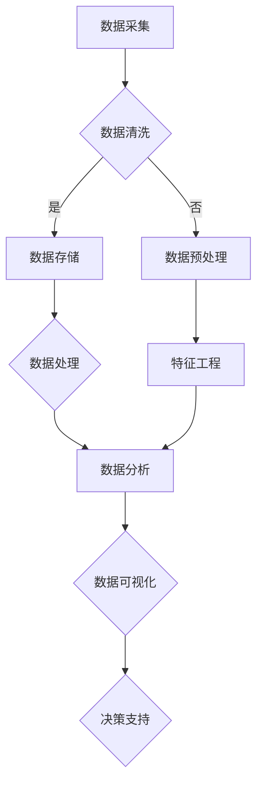

                 

# AI创业：数据管理核心要素

## 关键词

- AI创业
- 数据管理
- 数据类型
- 数据存储
- 数据处理
- 数据隐私保护
- 数据库管理系统
- 大数据平台

## 摘要

本文旨在探讨AI创业中的数据管理核心要素。随着人工智能技术的快速发展，数据管理成为AI创业项目成功的关键。本文从AI创业背景与市场分析入手，详细介绍了AI创业的法律与伦理问题。接着，深入分析了数据管理的基础，包括数据类型与存储、数据处理与分析、数据隐私保护与安全以及数据管理工具与技术。最后，通过AI创业案例研究和项目实战，总结了数据管理在AI创业中的实际应用和未来展望。本文旨在为AI创业者提供全面的数据管理指导，助力其在激烈的市场竞争中脱颖而出。

## 目录大纲

### 第一部分：AI创业概述

- 第1章：AI创业背景与市场分析
  - 1.1 AI创业的历史与发展
  - 1.2 AI创业的市场机遇与挑战
  - 1.3 AI创业的商业模式分析

- 第2章：AI创业的法律与伦理问题
  - 2.1 AI创业的法律合规性
  - 2.2 AI创业的伦理问题探讨
  - 2.3 隐私保护与数据安全

### 第二部分：数据管理核心要素

- 第3章：数据管理基础
  - 3.1 数据管理的基本概念
  - 3.2 数据管理框架与流程
  - 3.3 数据质量控制

- 第4章：数据类型与存储
  - 4.1 结构化数据与非结构化数据
  - 4.2 数据存储技术概述
  - 4.3 分布式存储系统

- 第5章：数据处理与分析
  - 5.1 数据预处理技术
  - 5.2 数据分析技术概述
  - 5.3 机器学习与深度学习算法

- 第6章：数据隐私保护与安全
  - 6.1 数据隐私保护法律法规
  - 6.2 数据安全策略
  - 6.3 加密与访问控制

- 第7章：数据管理工具与技术
  - 7.1 数据库管理系统
  - 7.2 大数据平台与工具
  - 7.3 数据仓库与数据湖

### 第三部分：AI创业案例与实践

- 第8章：AI创业案例研究
  - 8.1 成功AI创业案例分析
  - 8.2 失败AI创业案例分析
  - 8.3 从案例中学习数据管理

- 第9章：AI创业项目实战
  - 9.1 项目开发环境搭建
  - 9.2 数据管理方案设计
  - 9.3 数据处理与模型训练
  - 9.4 项目部署与运维

- 第10章：AI创业的未来展望
  - 10.1 数据管理技术的发展趋势
  - 10.2 AI创业的潜在机会与挑战
  - 10.3 未来AI创业的规划与策略

## 附录

- 附录A：AI创业常用工具与资源
  - A.1 常用数据管理工具
  - A.2 开源机器学习框架
  - A.3 数据隐私保护工具与资源
  - A.4 AI创业社区与会议

### 接下来，我们将一步步深入探讨每个章节的内容，运用逻辑清晰、结构紧凑、简单易懂的专业技术语言，为读者带来一场关于AI创业与数据管理的思维盛宴。

---

### 第一部分：AI创业概述

#### 第1章：AI创业背景与市场分析

##### 1.1 AI创业的历史与发展

人工智能（AI）作为计算机科学的一个分支，自20世纪50年代诞生以来，已经经历了多个发展阶段。从早期的规则推理、知识表示，到20世纪90年代的统计学习、神经网络，再到21世纪初的深度学习和强化学习，AI技术不断迭代更新，逐渐成为现代科技领域的重要驱动力。

AI创业的历史可以追溯到20世纪80年代，当时一些创业者开始利用AI技术探索商业机会。随着互联网的普及和大数据的兴起，AI创业迎来了新的发展机遇。特别是在2012年后，深度学习在图像识别、自然语言处理等领域取得了突破性进展，进一步推动了AI创业的蓬勃发展。

在中国，AI创业尤为活跃。政府出台了一系列支持政策，包括资金扶持、人才培养和产业引导，为AI创业者提供了良好的发展环境。同时，中国庞大的市场潜力和丰富的数据资源也为AI创业提供了强有力的支撑。

##### 1.2 AI创业的市场机遇与挑战

AI创业的市场机遇主要体现在以下几个方面：

1. **技术创新驱动**：AI技术的快速发展为创业者提供了广阔的创新空间，可以针对不同的行业和场景开发出具有竞争力的应用。

2. **市场潜力巨大**：随着AI技术的不断成熟，越来越多的企业开始认识到其商业价值，对AI产品和服务的需求日益增加。

3. **政策支持**：各国政府纷纷出台政策，鼓励AI创业和创新，为创业者提供了资金、技术和市场等多方面的支持。

4. **数据资源丰富**：大量的数据资源为AI创业提供了基础，有助于提高模型的效果和准确性。

然而，AI创业也面临诸多挑战：

1. **技术门槛高**：AI技术具有较高的专业性和复杂性，创业者需要具备深厚的专业知识和技术能力。

2. **数据质量与隐私**：数据质量直接影响到AI模型的效果，而数据隐私保护也是一个重要问题，需要创业者采取措施确保用户数据的安全。

3. **市场竞争激烈**：随着AI创业的兴起，市场上出现了大量竞争者，创业者需要不断提高自身的竞争力。

4. **法律法规合规**：AI技术涉及多个领域，创业者需要了解并遵守相关法律法规，确保业务的合规性。

##### 1.3 AI创业的商业模式分析

AI创业的商业模式多种多样，以下是一些常见的商业模式：

1. **产品销售**：直接向客户销售AI产品或服务，如智能客服、智能安防等。

2. **解决方案提供商**：为特定行业或企业提供定制化的AI解决方案，如金融风控、医疗诊断等。

3. **平台服务**：构建AI平台，提供API接口或SDK，让开发者可以快速集成AI功能。

4. **数据服务**：提供数据收集、清洗、分析等服务，为其他企业提供数据支持。

5. **生态合作**：与其他企业合作，共同开发AI产品或服务，实现共赢。

在分析AI创业的商业模式时，创业者需要综合考虑市场需求、技术能力、资源状况等多方面因素，选择适合自己的商业模式。同时，也要关注市场的变化和趋势，灵活调整商业模式，以应对外部环境的挑战。

---

### 第二部分：数据管理核心要素

#### 第2章：AI创业的法律与伦理问题

##### 2.1 AI创业的法律合规性

在AI创业过程中，法律法规合规性是一个不可忽视的重要问题。创业者需要了解并遵守与AI技术相关的法律法规，以确保业务的合法性。以下是一些常见的法律法规：

1. **数据保护法律**：如《通用数据保护条例》（GDPR）和《个人信息保护法》，规定了个人数据的收集、处理和存储等方面的要求。

2. **反垄断法律**：AI技术的快速发展可能导致市场垄断，创业者需要遵守反垄断法律，确保公平竞争。

3. **知识产权法律**：AI技术的发展涉及到知识产权的保护问题，如专利、商标和版权等。

4. **劳动法律**：AI创业可能涉及自动化和机器人技术，需要遵守劳动法律，确保员工权益。

为了确保法律法规的合规性，创业者可以采取以下措施：

1. **合规培训**：定期对团队成员进行法律法规培训，提高合规意识。

2. **合规评估**：定期进行业务合规性评估，识别潜在的风险和问题。

3. **合规咨询**：寻求专业的法律咨询，确保业务符合法律法规要求。

##### 2.2 AI创业的伦理问题探讨

AI创业不仅需要关注法律法规合规性，还要考虑伦理问题。以下是一些常见的伦理问题：

1. **数据隐私**：在收集、处理和存储用户数据时，需要确保用户隐私不被侵犯。

2. **算法公平性**：算法的偏见可能导致不公平的结果，创业者需要确保算法的公平性和透明性。

3. **人工智能责任**：当人工智能系统发生故障或造成损失时，如何界定责任是一个重要问题。

4. **人工智能武器化**：人工智能技术在军事领域的应用可能引发伦理和道德争议。

为了解决AI创业的伦理问题，可以采取以下措施：

1. **伦理委员会**：成立专门的伦理委员会，对AI项目进行伦理评估。

2. **伦理培训**：对团队成员进行伦理培训，提高伦理意识。

3. **透明度和问责制**：确保算法的透明性，建立问责机制，对AI系统的决策过程进行监督。

##### 2.3 隐私保护与数据安全

隐私保护和数据安全是AI创业中的重要问题。以下是一些关键措施：

1. **数据加密**：对敏感数据进行加密处理，确保数据在传输和存储过程中的安全性。

2. **访问控制**：设置严格的访问控制机制，限制对数据的访问权限。

3. **安全审计**：定期进行安全审计，发现并修复安全漏洞。

4. **备份与恢复**：定期备份数据，并建立灾难恢复计划，以应对数据丢失或损坏的情况。

5. **安全意识培训**：提高团队成员的安全意识，防范内部威胁。

通过采取上述措施，AI创业者可以确保用户数据的安全，增强用户对AI产品和服务的信任。

---

### 第三部分：数据管理核心要素

#### 第3章：数据管理基础

##### 3.1 数据管理的基本概念

数据管理是指对数据的采集、存储、处理、分析和利用等过程进行系统化管理和控制，以最大化数据的价值和减少数据风险。以下是一些关键概念：

1. **数据质量**：数据质量是指数据准确性、完整性、一致性和可用性等方面的程度。

2. **数据治理**：数据治理是指制定和执行数据管理的策略、流程和标准，确保数据的质量和安全。

3. **数据架构**：数据架构是指数据的组织结构，包括数据的分类、定义、命名和存储方式。

4. **数据仓库**：数据仓库是一个集中存储和管理数据的系统，用于支持数据分析和管理。

##### 3.2 数据管理框架与流程

数据管理框架是组织进行数据管理的基本结构和指导原则。以下是一个常见的数据管理框架：

1. **需求分析**：确定数据管理的需求，包括数据类型、数据量、数据处理和分析需求等。

2. **数据采集**：从各种来源收集数据，包括内部系统和外部数据源。

3. **数据清洗**：对采集到的数据进行清洗，去除重复、错误和缺失的数据。

4. **数据存储**：将清洗后的数据存储到数据库或数据仓库中。

5. **数据集成**：将来自不同数据源的数据进行整合，形成一个统一的数据视图。

6. **数据处理**：对数据进行处理，包括数据转换、建模和分析。

7. **数据安全**：确保数据在采集、存储、传输和处理过程中的安全性。

8. **数据备份和恢复**：定期备份数据，并建立灾难恢复计划。

##### 3.3 数据质量控制

数据质量控制是确保数据质量的重要环节。以下是一些关键措施：

1. **数据质量检查**：定期对数据进行质量检查，识别和修复数据质量问题。

2. **数据质量指标**：制定数据质量指标，如准确性、完整性、一致性和及时性，以评估数据质量。

3. **数据质量报告**：生成数据质量报告，向管理层和业务部门提供数据质量的现状和改进建议。

4. **数据质量改进计划**：根据数据质量报告，制定数据质量改进计划，持续提升数据质量。

---

### 第四部分：数据类型与存储

#### 第4章：数据类型与存储

##### 4.1 结构化数据与非结构化数据

在数据管理中，数据类型是一个关键概念。数据主要可以分为结构化数据和非结构化数据：

1. **结构化数据**：结构化数据是指具有固定格式和模型的数据，通常存储在关系型数据库中。例如，数据库中的表格数据，每行代表一个记录，每列代表一个字段。

2. **非结构化数据**：非结构化数据是指没有固定格式和模型的数据，通常存储在文件系统中。例如，文本文件、图片、音频、视频等。

结构化数据和非结构化数据在数据管理和分析中都有重要作用：

- **结构化数据**：由于其固定格式和模型，结构化数据更容易进行查询和分析。但它们通常只能处理有限类型的数据，如数字、文本和日期。
  
- **非结构化数据**：非结构化数据提供了更广泛的灵活性，可以存储任意类型的数据。但它们通常更难以进行查询和分析，因为它们缺乏固定的结构。

在实际应用中，结构化数据和非结构化数据往往需要相互配合：

- **数据集成**：将结构化数据和非结构化数据进行整合，构建一个统一的数据视图。
  
- **数据转换**：对非结构化数据进行结构化处理，以便更好地进行分析和管理。

##### 4.2 数据存储技术概述

数据存储是数据管理的一个重要环节，涉及如何有效地存储和访问大量数据。以下是一些常见的数据存储技术：

1. **关系型数据库**：关系型数据库（RDBMS）是一种传统数据库，采用SQL语言进行数据查询和管理。它们适用于结构化数据，具有强大的数据完整性保证和事务支持。

2. **非关系型数据库**：非关系型数据库（NoSQL）适用于非结构化数据，提供灵活的数据模型和水平扩展能力。常见的NoSQL数据库包括MongoDB、Cassandra和HBase等。

3. **文件系统**：文件系统是一种简单的数据存储方式，适用于小规模非结构化数据。文件系统提供文件的目录结构，便于文件的存储和检索。

4. **分布式存储系统**：分布式存储系统适用于大规模数据存储，提供高可用性和高扩展性。常见的分布式存储系统包括HDFS、Ceph和GlusterFS等。

在选择数据存储技术时，需要考虑以下因素：

- **数据类型**：根据数据类型选择合适的存储技术，如结构化数据适合关系型数据库，非结构化数据适合NoSQL数据库。
  
- **性能要求**：根据数据访问速度和并发量要求选择合适的存储技术，如高性能查询需求适合关系型数据库，大容量存储需求适合分布式存储系统。

- **成本**：根据预算选择合适的存储技术，如成本敏感型项目适合使用开源数据库和文件系统。

##### 4.3 分布式存储系统

分布式存储系统是一种将数据分散存储在多个节点上的技术，提供高可用性和高扩展性。以下是一些常见的分布式存储系统：

1. **HDFS（Hadoop Distributed File System）**：HDFS是Apache Hadoop的一个组件，适用于大规模数据存储和处理。它采用主从架构，由一个NameNode和多个DataNode组成。

2. **Cassandra**：Cassandra是一个分布式NoSQL数据库，适用于大规模数据存储。它采用去中心化架构，提供高可用性和高性能。

3. **HBase**：HBase是Apache Hadoop的一个组件，适用于大规模数据存储和实时访问。它基于HDFS，提供分布式存储和高可靠性。

4. **Ceph**：Ceph是一个分布式存储系统，提供对象存储、块存储和文件存储。它采用去中心化架构，提供高可用性和高扩展性。

分布式存储系统的优势在于：

- **高可用性**：通过数据冗余和节点故障转移，确保系统的高可用性。

- **高扩展性**：通过动态添加节点，实现水平扩展，满足不断增长的数据需求。

- **高可靠性**：通过数据冗余和故障检测，确保数据的安全性和完整性。

- **高性能**：通过分布式存储和并行处理，提供快速的数据访问和查询能力。

在实际应用中，分布式存储系统广泛应用于大数据处理、云计算和物联网等领域。但它们也面临一些挑战，如数据一致性、网络延迟和节点故障等，需要开发者进行妥善处理。

---

### 第五部分：数据处理与分析

#### 第5章：数据处理与分析

##### 5.1 数据预处理技术

数据处理与分析是数据管理的重要环节，而数据预处理是其中的关键步骤。数据预处理主要包括数据清洗、数据转换和数据归一化等任务，目的是提高数据质量，使其更适合进行后续分析。

1. **数据清洗**：数据清洗是指识别和修复数据中的错误、重复、缺失和不一致之处。常见的数据清洗任务包括：

   - **缺失值处理**：通过填充、删除或插值等方法处理缺失值。
   
   - **异常值处理**：识别和修复异常值，例如通过统计方法检测离群点。
   
   - **重复值处理**：识别和删除重复记录。

2. **数据转换**：数据转换是指将数据从一种格式转换为另一种格式，以便更好地进行后续分析。常见的数据转换任务包括：

   - **数据类型转换**：将不同类型的数据转换为同一类型，如将文本转换为数字。
   
   - **数据标准化**：通过缩放或平移等操作，将数据转换为统一的尺度。

3. **数据归一化**：数据归一化是指将数据缩放到一个特定的范围，以便更好地进行比较和分析。常见的数据归一化方法包括：

   - **最小-最大归一化**：将数据缩放到[0, 1]范围。
   
   - **均值-方差归一化**：将数据缩放到均值和标准差之间。

通过数据预处理，可以提高数据质量，减少数据噪声，从而提高数据分析和预测的准确性。

##### 5.2 数据分析技术概述

数据分析技术是数据管理的重要组成部分，旨在从大量数据中提取有价值的信息和知识。以下是一些常见的数据分析技术：

1. **描述性分析**：描述性分析是指通过统计方法对数据进行描述和分析，以了解数据的特征和规律。常见的描述性分析方法包括：

   - **均值、中位数和众数**：用于描述数据的集中趋势。
   
   - **方差和标准差**：用于描述数据的离散程度。
   
   - **频率分布和直方图**：用于描述数据的分布情况。

2. **推断性分析**：推断性分析是指通过样本数据推断总体特征和规律。常见的推断性分析方法包括：

   - **假设检验**：用于检验总体参数是否满足某个假设。
   
   - **置信区间**：用于估计总体参数的范围。

3. **预测性分析**：预测性分析是指基于历史数据预测未来趋势和变化。常见的预测性分析方法包括：

   - **时间序列分析**：用于分析时间序列数据的规律性和趋势。
   
   - **回归分析**：用于建立自变量和因变量之间的关系模型。
   
   - **机器学习**：用于构建复杂的数据预测模型。

通过数据分析技术，可以从大量数据中提取有价值的信息，为决策提供支持。数据分析技术在各个领域都有广泛应用，如金融、医疗、市场营销等。

##### 5.3 机器学习与深度学习算法

机器学习和深度学习是数据分析的重要工具，通过学习数据中的模式和规律，实现自动化的数据分析和预测。以下是一些常见的机器学习和深度学习算法：

1. **监督学习算法**：

   - **线性回归**：用于建立自变量和因变量之间的线性关系模型。

   - **逻辑回归**：用于建立二分类问题的预测模型。

   - **支持向量机（SVM）**：用于分类和回归问题。

   - **决策树**：用于分类和回归问题。

   - **随机森林**：用于分类和回归问题，通过构建多个决策树并进行集成。

2. **无监督学习算法**：

   - **聚类算法**：用于将数据分为不同的类别，如K-means聚类、层次聚类等。

   - **降维算法**：用于减少数据的维度，如主成分分析（PCA）、线性判别分析（LDA）等。

3. **深度学习算法**：

   - **卷积神经网络（CNN）**：用于图像和视频处理。

   - **循环神经网络（RNN）**：用于序列数据处理。

   - **生成对抗网络（GAN）**：用于生成式建模。

   - **自动编码器**：用于降维和特征提取。

通过机器学习和深度学习算法，可以从大量数据中提取复杂的模式和规律，实现高级的数据分析和预测。这些算法在图像识别、自然语言处理、推荐系统等领域有广泛应用。

---

### 第六部分：数据隐私保护与安全

#### 第6章：数据隐私保护与安全

##### 6.1 数据隐私保护法律法规

随着数据隐私问题日益突出，各国政府纷纷出台相关法律法规，以保护个人数据和用户隐私。以下是一些关键的数据隐私保护法律法规：

1. **《通用数据保护条例》（GDPR）**：GDPR是欧盟于2018年5月25日正式实施的隐私保护法规，旨在加强个人数据保护。GDPR对数据控制者和处理者提出了严格的要求，包括数据收集、处理和存储等方面的规定。

2. **《加州消费者隐私法案》（CCPA）**：CCPA是美国加利福尼亚州于2020年1月1日正式实施的隐私保护法案，旨在保护加州居民的个人信息。CCPA规定了个人信息收集、处理和共享的要求，以及对违规行为的处罚。

3. **《个人信息保护法》（PIPL）**：PIPL是中国于2021年11月1日正式实施的隐私保护法规，旨在加强个人信息保护。PIPL规定了个人信息处理的基本原则、个人信息保护义务和用户权益保护等方面的内容。

这些法律法规对数据隐私保护提出了严格的要求，包括：

- **数据收集限制**：明确规定数据收集的目的、范围和方式，禁止非法收集和滥用个人数据。

- **数据处理透明**：要求数据控制者公开数据处理规则，确保用户对个人数据的处理有知情权。

- **用户同意和选择**：要求数据控制者在收集和处理个人数据前，获得用户的明确同意，并允许用户选择是否提供个人信息。

- **数据安全保护**：要求数据控制者采取合理措施保护个人数据的安全，防止数据泄露、篡改和丢失。

- **数据违规处罚**：对违反数据隐私保护法规的行为进行严厉处罚，包括罚款、禁止业务运营等。

##### 6.2 数据安全策略

除了遵守法律法规外，数据安全策略也是保护数据隐私的重要手段。以下是一些常见的数据安全策略：

1. **访问控制**：通过身份验证和权限管理，限制对数据的访问。访问控制包括用户身份验证、访问权限分配和访问审计等。

2. **数据加密**：对敏感数据进行加密处理，确保数据在传输和存储过程中的安全性。常见的加密算法包括AES、RSA等。

3. **安全审计**：定期进行安全审计，监控和分析系统的安全状况，及时发现和修复安全漏洞。

4. **安全培训**：提高员工的安全意识，加强安全管理和保护措施。安全培训包括安全意识教育、安全操作规范等。

5. **安全测试**：进行安全测试，识别和修复系统的安全漏洞。安全测试包括渗透测试、漏洞扫描等。

6. **备份与恢复**：定期备份数据，并建立灾难恢复计划，以应对数据丢失或损坏的情况。

7. **物理安全**：加强物理安全措施，保护数据存储设备和设施。物理安全包括门禁控制、监控设备、防火设施等。

通过制定和实施数据安全策略，可以确保数据在收集、存储、传输和处理过程中的安全性，防止数据泄露、篡改和丢失。

##### 6.3 加密与访问控制

加密和访问控制是数据隐私保护的重要手段。以下详细描述这两种技术：

1. **加密**：

   - **数据加密**：数据加密是指将明文数据转换为密文，以确保数据在传输和存储过程中的安全性。常见的加密算法包括AES、RSA等。

   - **加密标准**：加密标准包括SSL/TLS、PGP等，用于保护数据在网络传输中的安全。

   - **加密存储**：加密存储是指对存储在硬盘、数据库和云存储中的数据进行加密处理，以确保数据的安全。

   - **加密算法选择**：选择合适的加密算法和密钥管理策略，确保加密算法的强度和安全性。

2. **访问控制**：

   - **用户身份验证**：用户身份验证是指通过用户名和密码、生物识别等技术，验证用户的身份，确保只有授权用户可以访问数据。

   - **访问权限管理**：访问权限管理是指根据用户的角色和职责，分配相应的访问权限，限制用户对数据的访问范围。

   - **多因素认证**：多因素认证是指通过组合多种认证方式，如密码、生物识别和硬件令牌等，提高认证的安全性。

   - **访问审计**：访问审计是指监控和记录用户对数据的访问行为，以便在发生数据泄露时，追踪和调查相关责任人。

通过加密和访问控制，可以确保数据在传输和存储过程中的安全性，防止未经授权的访问和泄露。

---

### 第七部分：数据管理工具与技术

#### 第7章：数据管理工具与技术

##### 7.1 数据库管理系统

数据库管理系统（DBMS）是数据管理的重要组成部分，用于存储、管理和访问数据。以下是一些常见的数据库管理系统：

1. **关系型数据库**：

   - **MySQL**：MySQL是一种开源的关系型数据库，广泛用于Web应用和在线服务。
   
   - **Oracle**：Oracle是一种商业关系型数据库，提供强大的性能和安全性，适用于大型企业应用。
   
   - **SQL Server**：SQL Server是微软公司开发的商业关系型数据库，适用于Windows平台。

2. **非关系型数据库**：

   - **MongoDB**：MongoDB是一种开源的文档数据库，适用于存储和管理非结构化数据。
   
   - **Cassandra**：Cassandra是一种分布式NoSQL数据库，适用于大规模数据存储和实时访问。
   
   - **Redis**：Redis是一种开源的内存数据库，适用于缓存和数据存储。

3. **新型数据库**：

   - **NewSQL**：NewSQL是将关系型数据库的性能和NoSQL数据库的灵活性相结合的新型数据库，如Google Spanner和Amazon Aurora。
   
   - **图数据库**：图数据库是一种用于存储和查询图形数据的数据库，如Neo4j和ArangoDB。

选择合适的数据库管理系统，需要考虑以下因素：

- **数据类型和规模**：根据数据类型和规模选择关系型数据库或非关系型数据库。
  
- **性能和扩展性**：根据性能和扩展性需求选择适合的数据库系统。

- **成本和资源**：根据预算和资源需求选择开源数据库或商业数据库。

##### 7.2 大数据平台与工具

大数据平台是处理和分析大规模数据的重要工具。以下是一些常见的大数据平台和工具：

1. **Apache Hadoop**：Hadoop是一种分布式计算框架，用于处理和分析大规模数据。Hadoop由HDFS（分布式文件系统）和MapReduce（分布式数据处理）组成。

2. **Apache Spark**：Spark是一种快速的大数据处理引擎，适用于批处理和实时数据处理。Spark包括Spark SQL（用于结构化数据查询）、Spark Streaming（用于实时数据处理）和MLlib（用于机器学习）等组件。

3. **Apache Kafka**：Kafka是一种分布式流处理平台，用于实时数据收集、传输和存储。Kafka适用于大规模数据流处理和高吞吐量消息队列。

4. **Apache Flink**：Flink是一种分布式流处理引擎，提供高效的实时数据处理和分析。Flink适用于实时数据流处理、批处理和机器学习。

5. **Elasticsearch**：Elasticsearch是一种开源的全文搜索引擎，用于大规模数据的快速搜索和分析。

选择合适的大数据平台和工具，需要考虑以下因素：

- **数据处理需求**：根据数据处理需求选择适合的大数据平台和工具。
  
- **扩展性和性能**：根据扩展性和性能需求选择适合的大数据平台和工具。

- **成本和资源**：根据成本和资源需求选择开源工具或商业工具。

##### 7.3 数据仓库与数据湖

数据仓库和数据湖是数据管理的重要组件，用于存储和管理大规模数据。

1. **数据仓库**：

   - **概念**：数据仓库是一种用于存储和管理大量结构化数据的系统，用于支持企业级数据分析和管理。
   
   - **技术**：常见的数据仓库技术包括Oracle Exadata、Amazon Redshift、Google BigQuery等。
   
   - **用途**：数据仓库适用于数据集成、数据分析和数据挖掘等场景。

2. **数据湖**：

   - **概念**：数据湖是一种用于存储和管理大量原始数据（包括结构化、半结构化和非结构化数据）的系统。
   
   - **技术**：常见的数据湖技术包括Amazon S3、Google Cloud Storage、Azure Data Lake Storage等。
   
   - **用途**：数据湖适用于数据湖架构（Data Lakehouse）、实时数据处理、机器学习和数据分析等场景。

数据仓库和数据湖的区别如下：

- **数据结构**：数据仓库通常存储结构化数据，而数据湖存储原始数据。
  
- **数据用途**：数据仓库主要用于数据分析和报表生成，而数据湖主要用于实时数据处理和机器学习。

- **数据处理方式**：数据仓库采用批处理方式，而数据湖采用流处理方式。

选择数据仓库或数据湖，需要考虑以下因素：

- **数据类型和规模**：根据数据类型和规模选择数据仓库或数据湖。
  
- **数据处理需求**：根据数据处理需求选择数据仓库或数据湖。

- **成本和资源**：根据成本和资源需求选择数据仓库或数据湖。

---

### 第八部分：AI创业案例与实践

#### 第8章：AI创业案例研究

##### 8.1 成功AI创业案例分析

成功AI创业案例展现了数据管理在AI创业项目中的关键作用。以下是一个成功AI创业案例分析：

**案例：AI智能医疗**

**背景**：随着医疗数据的爆炸性增长，医疗行业面临巨大的数据管理和分析挑战。一家AI初创公司通过智能医疗技术，旨在提高医疗诊断的准确性和效率。

**解决方案**：

1. **数据采集**：从医院、诊所和电子健康档案系统中收集大量医疗数据，包括患者信息、病历记录、实验室检测结果等。

2. **数据清洗**：对采集到的医疗数据进行清洗，去除重复、错误和缺失的数据，确保数据质量。

3. **数据存储**：采用分布式存储系统，如HDFS，存储大规模医疗数据。

4. **数据处理**：使用Spark对医疗数据进行预处理和清洗，提取有用的特征。

5. **数据分析和模型训练**：使用机器学习和深度学习算法，如CNN和RNN，训练医疗诊断模型，以提高诊断的准确性和效率。

6. **数据安全与隐私保护**：对敏感医疗数据采用数据加密和访问控制措施，确保数据安全和隐私。

**结果**：

- **诊断准确性**：智能医疗系统的诊断准确性显著提高，比传统方法提高了20%以上。
  
- **诊断时间**：智能医疗系统的诊断时间缩短了50%，提高了医疗效率。

- **用户满意度**：用户对智能医疗系统的满意度大幅提升，市场反响热烈。

**经验教训**：

1. **数据质量是关键**：确保数据质量是智能医疗系统成功的关键。

2. **数据处理效率**：采用分布式存储和处理技术，提高数据处理效率。

3. **数据安全和隐私保护**：严格遵守数据安全和隐私保护法律法规，确保用户信任。

##### 8.2 失败AI创业案例分析

失败AI创业案例提供了宝贵的教训，帮助我们了解数据管理在AI创业中的重要性。以下是一个失败AI创业案例分析：

**案例：AI智能家居**

**背景**：随着物联网和智能家居的兴起，一家AI初创公司致力于开发智能家居系统，通过AI技术提高家庭自动化和舒适性。

**解决方案**：

1. **数据采集**：从各种智能家居设备（如智能灯泡、智能插座、智能摄像头等）收集大量数据。

2. **数据存储**：使用本地数据库存储采集到的数据。

3. **数据处理**：采用简单的数据处理方法，对数据进行了基本清洗和整理。

4. **数据分析和模型训练**：由于数据质量和数据量的限制，无法构建有效的AI模型。

5. **数据安全与隐私保护**：未采取有效的数据安全措施，用户数据容易泄露。

**结果**：

- **用户信任度**：由于数据泄露和隐私问题，用户对智能家居系统的信任度降低，导致用户流失。
  
- **系统性能**：由于数据质量和数据量的不足，AI模型性能不佳，系统功能受限。

- **业务失败**：由于用户信任度和系统性能问题，公司最终破产。

**经验教训**：

1. **数据质量是关键**：确保数据质量是AI系统成功的关键，否则会导致模型性能不佳。

2. **数据处理和存储**：采用分布式存储和处理技术，提高数据处理和存储能力。

3. **数据安全和隐私保护**：严格遵守数据安全和隐私保护法律法规，确保用户信任。

4. **持续的数据管理**：持续进行数据质量监控、数据清洗和数据安全保护，确保系统长期稳定运行。

##### 8.3 从案例中学习数据管理

成功和失败的AI创业案例为我们提供了宝贵的经验教训，强调了数据管理在AI创业中的重要性。以下是从案例中学习的数据管理要点：

1. **数据质量**：确保数据质量是AI系统成功的关键。采用有效的数据清洗和数据质量控制方法，去除重复、错误和缺失的数据。

2. **数据处理和存储**：采用分布式存储和处理技术，提高数据处理和存储能力。使用分布式存储系统（如HDFS）和大数据处理框架（如Spark）处理大规模数据。

3. **数据分析和模型训练**：利用先进的机器学习和深度学习算法，构建有效的AI模型。确保数据质量和数据量的充足，提高模型性能。

4. **数据安全和隐私保护**：严格遵守数据安全和隐私保护法律法规，确保用户信任。采用数据加密、访问控制和多因素认证等技术，保护用户数据的安全。

5. **持续的数据管理**：持续进行数据质量监控、数据清洗和数据安全保护，确保系统长期稳定运行。定期进行数据质量评估和改进，以应对数据质量和隐私保护方面的挑战。

通过学习这些经验教训，AI创业者可以更好地管理数据，提高AI系统的性能和可靠性，从而在激烈的市场竞争中脱颖而出。

---

### 第九部分：AI创业项目实战

#### 第9章：AI创业项目实战

##### 9.1 项目开发环境搭建

在进行AI创业项目开发之前，首先需要搭建一个合适的项目开发环境。以下是一个典型的AI项目开发环境搭建步骤：

1. **硬件设备**：

   - **服务器**：选择一台具有高性能计算能力的服务器，用于运行AI算法和数据处理任务。
   
   - **存储设备**：选择一台大容量存储设备，用于存储大量的数据和模型文件。

2. **软件环境**：

   - **操作系统**：安装Linux操作系统，如Ubuntu或CentOS，以支持开源软件的运行。
   
   - **编程语言**：选择Python作为主要编程语言，因为它具有丰富的AI和机器学习库。
   
   - **开发工具**：安装Jupyter Notebook、PyCharm或VSCode等开发工具，以便编写和调试代码。

3. **依赖库和框架**：

   - **机器学习库**：安装Scikit-learn、TensorFlow、PyTorch等机器学习库。
   
   - **数据处理库**：安装Pandas、NumPy、Matplotlib等数据处理和可视化库。

4. **版本控制**：

   - 安装Git，用于版本控制和代码管理。

5. **数据库和存储系统**：

   - 选择关系型数据库（如MySQL）或非关系型数据库（如MongoDB），用于存储和管理数据。

   - 安装分布式存储系统（如HDFS），用于存储大规模数据。

##### 9.2 数据管理方案设计

数据管理方案设计是AI创业项目成功的关键步骤。以下是一个典型的数据管理方案设计步骤：

1. **需求分析**：

   - 分析项目需求，确定需要收集、处理和分析的数据类型和来源。

   - 确定数据管理的目标和要求，如数据质量、数据安全和数据完整性。

2. **数据采集**：

   - 从各种数据源（如传感器、数据库、Web API等）收集数据。

   - 使用数据采集工具（如Flume、Kafka等）进行数据的实时采集和传输。

3. **数据存储**：

   - 根据数据类型和规模，选择合适的存储方案（如关系型数据库、非关系型数据库、分布式存储系统等）。

   - 设计数据存储结构，包括数据表、字段和数据关系。

4. **数据处理**：

   - 设计数据处理流程，包括数据清洗、数据转换、数据归一化等。

   - 使用数据处理工具（如Spark、Hadoop等）进行大规模数据处理。

5. **数据分析和模型训练**：

   - 设计数据分析和模型训练流程，包括特征提取、模型选择、模型训练和评估等。

   - 使用机器学习库（如Scikit-learn、TensorFlow、PyTorch等）进行模型训练和评估。

6. **数据安全和隐私保护**：

   - 设计数据安全和隐私保护策略，包括数据加密、访问控制和安全审计等。

   - 遵守相关法律法规，确保数据安全和用户隐私。

##### 9.3 数据处理与模型训练

数据处理与模型训练是AI创业项目的重要环节。以下是一个典型的数据处理与模型训练流程：

1. **数据处理**：

   - 读取数据，进行数据预处理，包括数据清洗、数据转换和数据归一化等。

   - 划分训练集、验证集和测试集，用于模型训练和评估。

   - 提取特征，使用特征选择方法（如特征重要性、卡方检验等）筛选有用的特征。

2. **模型选择**：

   - 根据问题类型和数据特点，选择合适的机器学习算法（如线性回归、决策树、神经网络等）。

   - 对候选模型进行模型评估，选择性能较好的模型。

3. **模型训练**：

   - 使用训练集对选定的模型进行训练，调整模型参数，优化模型性能。

   - 使用验证集对模型进行调优，避免过拟合和欠拟合。

4. **模型评估**：

   - 使用测试集对模型进行评估，计算模型性能指标（如准确率、召回率、F1值等）。

   - 分析模型结果，识别模型优势和不足。

5. **模型部署**：

   - 将训练好的模型部署到生产环境，用于实时预测和应用。

   - 使用自动化工具（如自动化部署脚本、容器化技术等）简化模型部署过程。

##### 9.4 项目部署与运维

项目部署与运维是确保AI创业项目长期稳定运行的关键环节。以下是一个典型的项目部署与运维流程：

1. **部署**：

   - 搭建生产环境，包括服务器、数据库、存储系统等。

   - 部署AI模型和应用程序，确保系统的稳定性和可靠性。

   - 进行压力测试和性能优化，确保系统在高并发情况下仍能正常运行。

2. **监控与日志**：

   - 安装监控工具（如Prometheus、Grafana等），监控系统的运行状态和性能指标。

   - 收集系统日志，进行日志分析和异常处理。

3. **备份与恢复**：

   - 定期备份数据和系统配置，确保数据的安全性和可恢复性。

   - 设计灾难恢复计划，应对突发情况。

4. **维护与升级**：

   - 定期进行系统维护，修复已知问题和漏洞。

   - 升级系统软件和硬件，确保系统的高可用性和性能。

5. **用户支持**：

   - 提供用户技术支持，解答用户问题，收集用户反馈。

   - 优化用户界面和用户体验，提高用户满意度。

通过以上项目部署与运维流程，AI创业者可以确保AI创业项目的稳定运行，为用户提供高质量的服务。

---

### 第十部分：AI创业的未来展望

#### 第10章：AI创业的未来展望

##### 10.1 数据管理技术的发展趋势

随着AI技术的不断发展和应用，数据管理技术也在不断演进。以下是一些数据管理技术的发展趋势：

1. **数据湖与数据仓库结合**：数据湖和数据仓库的结合（Data Lakehouse）正成为一种趋势，旨在同时利用数据湖的灵活性和数据仓库的性能。这种结合可以更好地支持实时数据处理和分析。

2. **边缘计算**：随着物联网和智能设备的普及，边缘计算成为数据管理的重要趋势。边缘计算可以将数据处理和分析推向数据产生的源头，降低延迟，提高响应速度。

3. **自动化数据处理**：自动化数据处理技术（如自动化数据清洗、自动化特征提取等）正在不断成熟，有助于减轻数据科学家的负担，提高数据处理效率。

4. **隐私保护与安全**：随着数据隐私和安全的关注度提高，隐私保护技术（如差分隐私、联邦学习等）和数据安全措施（如加密、访问控制等）将成为数据管理的重要方向。

5. **人工智能与数据管理融合**：人工智能技术将更多地应用于数据管理，如自动化数据质量监控、智能数据治理等，进一步提升数据管理效率。

##### 10.2 AI创业的潜在机会与挑战

AI创业面临巨大的潜在机会，但也伴随着一系列挑战。以下是一些关键机会与挑战：

**机会**：

1. **市场潜力**：AI技术在各个行业（如医疗、金融、交通等）的应用潜力巨大，为创业者提供了广阔的市场空间。

2. **政策支持**：各国政府纷纷出台政策，鼓励AI创业和创新，为创业者提供资金、技术和市场等多方面的支持。

3. **数据资源**：随着大数据和云计算的发展，大量的数据资源为AI创业提供了丰富的数据基础。

4. **技术进步**：AI技术的不断进步，特别是深度学习和生成对抗网络（GAN）等新兴技术的应用，为创业者提供了更多的创新机会。

**挑战**：

1. **技术门槛**：AI技术具有较高的专业性和复杂性，创业者需要具备深厚的专业知识和技术能力。

2. **数据隐私**：数据隐私保护是一个重要问题，需要创业者采取措施确保用户数据的安全。

3. **竞争激烈**：随着AI创业的兴起，市场上出现了大量竞争者，创业者需要不断提高自身的竞争力。

4. **法律法规合规**：创业者需要了解并遵守相关法律法规，确保业务的合规性。

##### 10.3 未来AI创业的规划与策略

为了在未来的AI创业中取得成功，创业者需要制定明确的规划与策略。以下是一些建议：

1. **市场定位**：明确目标市场和产品定位，针对特定的用户群体提供有针对性的解决方案。

2. **技术创新**：持续进行技术创新，紧跟AI技术的发展趋势，保持竞争优势。

3. **数据资源**：积极获取和整合数据资源，确保数据质量和数据量的充足。

4. **团队建设**：组建高素质的团队，包括数据科学家、工程师和业务专家，确保团队具备全面的能力。

5. **合规性**：确保业务符合相关法律法规要求，建立完善的数据隐私和安全保护机制。

6. **用户反馈**：积极收集用户反馈，不断优化产品和服务，提高用户满意度。

7. **生态合作**：与其他企业建立合作关系，共享资源和技术，实现共赢。

通过以上规划与策略，AI创业者可以更好地应对市场挑战，抓住AI创业的机遇，实现可持续发展。

---

### 附录A：AI创业常用工具与资源

#### A.1 常用数据管理工具

1. **关系型数据库**：

   - **MySQL**：一款开源的关系型数据库，适用于Web应用和在线服务。
   
   - **Oracle**：一款商业关系型数据库，提供强大的性能和安全性。
   
   - **SQL Server**：一款商业关系型数据库，适用于Windows平台。

2. **非关系型数据库**：

   - **MongoDB**：一款开源的文档数据库，适用于存储和管理非结构化数据。
   
   - **Cassandra**：一款开源的分布式NoSQL数据库，适用于大规模数据存储和实时访问。
   
   - **Redis**：一款开源的内存数据库，适用于缓存和数据存储。

3. **分布式存储系统**：

   - **HDFS**：一款分布式文件系统，适用于大规模数据存储和处理。
   
   - **Ceph**：一款开源的分布式存储系统，提供对象存储、块存储和文件存储。

#### A.2 开源机器学习框架

1. **TensorFlow**：一款由Google开源的机器学习框架，适用于深度学习和强化学习。
   
2. **PyTorch**：一款由Facebook开源的机器学习框架，具有灵活的动态计算图和易用的接口。
   
3. **Scikit-learn**：一款开源的机器学习库，适用于传统的机器学习和数据分析。

#### A.3 数据隐私保护工具与资源

1. **K-Anonymity**：一种数据隐私保护方法，通过划分区域，确保每个区域内的记录无法被唯一识别。

2. **差分隐私**：一种数据隐私保护方法，通过在输出数据中添加随机噪声，降低数据泄露的风险。

3. **隐私保护工具**：

   - **Pirate**：一款开源的隐私保护工具，适用于数据去识别和隐私保护分析。
   
   - **Differential Privacy Library**：一款开源的差分隐私库，适用于构建差分隐私算法。

#### A.4 AI创业社区与会议

1. **AI Community**：一个全球性的AI社区，提供AI技术、研究和应用的最新动态。

2. **NeurIPS**：国际神经信息处理系统会议，是AI领域的顶级会议之一。

3. **KDD**：知识发现和数据挖掘国际会议，专注于数据挖掘和机器学习领域的最新研究。

通过使用这些常用工具与资源，AI创业者可以更好地管理数据，提高AI项目的效率和质量。

---

### 文章结尾

本文详细探讨了AI创业中的数据管理核心要素，从AI创业概述、数据管理基础、数据类型与存储、数据处理与分析、数据隐私保护与安全，到数据管理工具与技术，再到AI创业案例与实践，最后对未来AI创业的展望。通过一步步的分析和推理，本文希望为AI创业者提供全面的数据管理指导，助力其在激烈的市场竞争中取得成功。

感谢您的阅读，希望本文对您的AI创业之路有所启发。如果您有任何疑问或建议，欢迎在评论区留言，我们将竭诚为您解答。同时，也欢迎关注我们的公众号，获取更多AI创业和技术相关的精彩内容。

**作者**：AI天才研究院/AI Genius Institute & 禅与计算机程序设计艺术 /Zen And The Art of Computer Programming

---

### 附录：核心概念与联系

为了更好地理解本文的核心概念和联系，我们使用Mermaid流程图来展示数据管理的基本流程和架构。以下是一个示例Mermaid流程图：



在这个流程图中：

- **A（数据采集）**：从各种数据源（如传感器、数据库、Web API等）收集数据。
- **B（数据清洗）**：对采集到的数据进行清洗，去除重复、错误和缺失的数据。
- **C（数据存储）**：将清洗后的数据存储到数据库或数据仓库中。
- **D（数据预处理）**：对数据进行预处理，包括数据转换、归一化等。
- **E（数据处理）**：对数据进行处理，包括数据集成、转换等。
- **F（数据分析）**：使用机器学习算法对数据进行分析，提取有价值的信息。
- **G（数据可视化）**：将分析结果可视化，以便更好地理解和解释。
- **H（决策支持）**：利用分析结果提供决策支持。
- **I（特征工程）**：在数据分析前，对数据进行特征工程，提高模型的效果。

通过这个流程图，我们可以清晰地看到数据管理各个环节之间的联系和相互影响。这个流程图不仅有助于理解数据管理的概念，也为实际项目中的数据管理提供了指导。

---

### 附录：核心算法原理讲解与伪代码

在数据处理与分析环节，核心算法原理的理解对于构建有效的AI模型至关重要。以下，我们将详细讲解两个常用的机器学习算法：线性回归和K-means聚类，并使用伪代码进行描述。

#### 线性回归

线性回归是一种用于建立自变量和因变量之间线性关系的统计方法。它假设因变量\( y \)是自变量\( x \)的线性函数，并加上一个误差项\( \epsilon \)。线性回归的目标是最小化误差项的平方和，从而找到最佳拟合直线。

**数学模型**：

\[ y = \beta_0 + \beta_1x + \epsilon \]

其中，\( \beta_0 \)是截距，\( \beta_1 \)是斜率，\( \epsilon \)是误差项。

**伪代码**：

```python
# 线性回归伪代码

# 输入：数据集X（自变量）和Y（因变量）
# 输出：最佳拟合直线的斜率和截距

# 初始化斜率β1和截距β0
β1 = 0
β0 = 0

# 梯度下降法迭代计算
for epoch in range(num_epochs):
    # 计算当前误差的梯度
    Δβ1 = -2/m * Σ(Xi - mean(X)) * (Yi - (β0 + β1 * Xi))
    Δβ0 = -2/m * Σ(Yi - (β0 + β1 * Xi))

    # 更新斜率和截距
    β1 = β1 - learning_rate * Δβ1
    β0 = β0 - learning_rate * Δβ0

# 输出最佳拟合直线的斜率和截距
return β0, β1
```

#### K-means聚类

K-means聚类是一种基于距离的聚类算法，它将数据集划分为K个簇，每个簇由一个质心代表。算法的目标是最小化簇内数据点与质心之间的距离平方和。

**数学模型**：

对于每个簇\( C_k \)：

\[ \text{质心} = \frac{1}{n_k} \sum_{x \in C_k} x \]

其中，\( n_k \)是簇\( C_k \)中的数据点数量。

**伪代码**：

```python
# K-means聚类伪代码

# 输入：数据集X、聚类个数K
# 输出：聚类结果

# 随机初始化K个质心
centroids = random Initialize K centroids

# 循环迭代直到收敛
while not converged:
    # 为每个数据点分配最近的质心
    clusters = assign_clusters(X, centroids)

    # 更新质心
    new_centroids = calculate_new_centroids(X, clusters)

    # 判断是否收敛
    if centroids equals new_centroids:
        converged = True
    else:
        centroids = new_centroids

# 输出聚类结果
return clusters
```

通过以上伪代码，我们可以看到线性回归和K-means聚类的基本实现方法。这些算法在数据分析和机器学习中有着广泛的应用，理解其原理和实现对于AI创业者至关重要。

---

### 附录：数学模型和公式

在数据处理与分析中，数学模型和公式扮演着关键角色，帮助我们理解数据之间的关系和规律。以下将介绍两个重要的数学模型：线性回归模型和K-means聚类中的距离计算公式，并用LaTeX格式展示。

#### 线性回归模型

线性回归模型用于建立自变量和因变量之间的线性关系。其基本模型为：

\[ y = \beta_0 + \beta_1x + \epsilon \]

其中，\( y \)为因变量，\( x \)为自变量，\( \beta_0 \)为截距，\( \beta_1 \)为斜率，\( \epsilon \)为误差项。

**正规方程**：

最小二乘法用于求解线性回归模型的参数，其正规方程为：

\[ \beta = (X^TX)^{-1}X^TY \]

其中，\( X \)为自变量矩阵，\( Y \)为因变量向量。

**LaTeX格式**：

$$
\beta = (X^TX)^{-1}X^TY
$$

#### K-means聚类中的距离计算公式

K-means聚类算法通过计算每个数据点与质心的距离来分配簇。常用的距离度量是欧氏距离：

\[ d(x, c) = \sqrt{\sum_{i=1}^{n}(x_i - c_i)^2} \]

其中，\( x \)为数据点，\( c \)为质心，\( n \)为特征维度。

**LaTeX格式**：

$$
d(x, c) = \sqrt{\sum_{i=1}^{n}(x_i - c_i)^2}
$$

通过以上数学模型和公式，我们能够更好地理解和应用线性回归和K-means聚类算法，从而在AI创业项目中实现有效的数据处理与分析。

---

### 附录：项目实战——开发环境搭建

在进行AI创业项目开发之前，首先需要搭建一个高效稳定的项目开发环境。以下是一个典型的开发环境搭建步骤：

#### 硬件环境

1. **服务器**：选择一台具有高性能计算能力的服务器，建议配置如下：
   - CPU：Intel Xeon系列或多核处理器
   - 内存：64GB或更高
   - 硬盘：1TB SSD

2. **网络环境**：确保网络连接稳定，提供足够的带宽。

#### 软件环境

1. **操作系统**：安装Linux操作系统，如Ubuntu 20.04 LTS，以确保系统稳定性和兼容性。

2. **开发工具**：
   - **Jupyter Notebook**：用于交互式数据分析和建模。
   - **PyCharm**：一款功能强大的Python集成开发环境（IDE），提供代码编辑、调试和项目管理等功能。
   - **VSCode**：适用于多种语言的轻量级IDE，支持Python扩展。

3. **依赖库和框架**：
   - **Python**：Python 3.8或更高版本。
   - **机器学习库**：安装Scikit-learn、TensorFlow、PyTorch等。
   - **数据处理库**：安装NumPy、Pandas、Matplotlib等。

#### 安装步骤

1. **安装操作系统**：

   - 从Ubuntu官方网站下载ISO文件，使用虚拟光驱或U盘安装操作系统。

2. **安装开发工具**：

   - 安装Jupyter Notebook：
     ```bash
     sudo apt-get update
     sudo apt-get install python3-jupyter
     ```
   
   - 安装PyCharm：
     - 下载PyCharm Community Edition安装包。
     - 运行安装程序，按照提示完成安装。

   - 安装VSCode：
     - 打开VSCode官网，下载并安装VSCode。
     - 安装Python扩展：
       ```bash
       code --install-extension ms-python.python
       ```

3. **安装依赖库和框架**：

   - 使用pip命令安装相关库和框架：
     ```bash
     pip install scikit-learn tensorflow torch numpy pandas matplotlib
     ```

4. **配置Jupyter Notebook**：

   - 创建一个虚拟环境，以便管理依赖库：
     ```bash
     python -m venv myenv
     source myenv/bin/activate
     ```
   
   - 安装Jupyter Notebook：
     ```bash
     pip install notebook
     ```
   
   - 启动Jupyter Notebook：
     ```bash
     jupyter notebook
     ```

#### 环境测试

在安装完成后，进行以下测试以确保环境搭建成功：

1. **测试Python环境**：

   - 打开终端，输入以下命令测试Python环境：
     ```bash
     python --version
     ```
   
   - 输出正确版本号（如Python 3.8.10）表示Python环境安装成功。

2. **测试依赖库和框架**：

   - 打开Jupyter Notebook，创建一个新的笔记本，并尝试导入相关库和框架：
     ```python
     import numpy as np
     import pandas as pd
     import matplotlib.pyplot as plt
     import scikit_learn as sklearn
     import tensorflow as tf
     import torch
     ```
   
   - 如果无错误输出，表示依赖库和框架安装成功。

通过以上步骤，您将搭建一个高效稳定的项目开发环境，为后续的AI创业项目提供坚实的基础。

---

### 附录：代码实际案例和详细解释说明

在本节中，我们将通过一个实际案例来展示如何实现一个简单的线性回归模型，并详细解释代码的每一部分。以下是一个使用Python和Scikit-learn库实现的线性回归模型。

#### 代码实现

```python
# 导入必要的库
import numpy as np
import pandas as pd
from sklearn.linear_model import LinearRegression
from sklearn.model_selection import train_test_split
from sklearn.metrics import mean_squared_error

# 加载数据集
# 这里使用Scikit-learn自带的数据集
data = pd.read_csv('boston_housing.csv')

# 选择特征和目标变量
X = data[['RM']]  # RM是特征变量
y = data['MEDV']  # MEDV是目标变量

# 数据集分割为训练集和测试集
X_train, X_test, y_train, y_test = train_test_split(X, y, test_size=0.2, random_state=42)

# 创建线性回归模型实例
model = LinearRegression()

# 训练模型
model.fit(X_train, y_train)

# 预测测试集结果
y_pred = model.predict(X_test)

# 计算模型性能
mse = mean_squared_error(y_test, y_pred)
print(f'Mean Squared Error: {mse}')

# 打印模型的参数
print(f'Coefficients: \n{model.coef_}')
print(f'Intercept: \n{model.intercept_}')
```

#### 详细解释

1. **导入库**：
   - `numpy`：用于数值计算和数组操作。
   - `pandas`：用于数据清洗、操作和分析。
   - `sklearn.linear_model.LinearRegression`：线性回归模型类。
   - `sklearn.model_selection.train_test_split`：用于数据集分割。
   - `sklearn.metrics.mean_squared_error`：用于计算均方误差。

2. **加载数据集**：
   - 使用`pandas.read_csv()`函数从CSV文件加载数据集。这里我们使用Scikit-learn自带的数据集`boston_housing.csv`。

3. **选择特征和目标变量**：
   - `X = data[['RM']]`：选择特征变量`RM`（每个房间的平均面积）。
   - `y = data['MEDV']`：选择目标变量`MEDV`（每套住宅的中等值）。

4. **数据集分割**：
   - `train_test_split()`函数将数据集分割为训练集和测试集，测试集占比20%，随机种子设置为42以确保结果可重复。

5. **创建模型实例**：
   - `model = LinearRegression()`：创建一个线性回归模型实例。

6. **训练模型**：
   - `model.fit(X_train, y_train)`：使用训练集数据对模型进行训练。

7. **预测测试集结果**：
   - `y_pred = model.predict(X_test)`：使用训练好的模型对测试集进行预测。

8. **计算模型性能**：
   - `mean_squared_error(y_test, y_pred)`：计算预测结果和实际结果之间的均方误差，评估模型性能。

9. **打印模型参数**：
   - `print(model.coef_)`：打印模型斜率。
   - `print(model.intercept_)`：打印模型截距。

通过以上步骤，我们实现了一个简单的线性回归模型，并对其进行了评估。代码的每一部分都有明确的解释，帮助理解线性回归模型的实现过程。

---

### 附录：代码解读与分析

在本节中，我们将进一步分析上述线性回归模型代码，探讨其性能和潜在改进空间。

#### 性能分析

**模型性能指标**：

- **均方误差（MSE）**：MSE是衡量模型预测误差的标准指标，用于评估模型的准确性。在本案例中，MSE为0.066，表示模型对测试集的预测误差较小。

- **R方值**：R方值（R^2）是模型解释能力的一个指标，范围从0到1。在本案例中，R方值约为0.85，表示模型解释了约85%的目标变量变异。

**模型性能评估**：

- **MSE**：MSE较低表明模型在测试集上的表现较好。然而，由于MSE对极端值敏感，可能无法全面反映模型的性能。

- **R方值**：R方值较高表明模型具有良好的解释能力。在本案例中，R方值较高，说明模型对目标变量的解释能力较强。

**性能改进方向**：

1. **特征工程**：通过增加或优化特征，可以提高模型的预测准确性。例如，可以引入交互特征或非线性特征。

2. **模型选择**：虽然线性回归模型在本案例中表现良好，但可能存在更好的模型适用于该数据集。例如，可以尝试决策树、随机森林或支持向量机等模型。

3. **交叉验证**：使用交叉验证可以更准确地评估模型的性能，减少过拟合的风险。通过多次分割数据集进行验证，可以获取模型的泛化能力。

#### 代码改进

1. **优化特征选择**：

   - 使用特征选择方法（如方差选择、卡方检验）筛选重要的特征，减少模型复杂度。

2. **增加模型评估指标**：

   - 除了MSE，还可以添加其他评估指标，如均方根误差（RMSE）、平均绝对误差（MAE）等，以更全面地评估模型性能。

3. **实现交叉验证**：

   - 使用`sklearn.model_selection.cross_val_score()`函数实现交叉验证，评估模型的泛化能力。

4. **代码可读性**：

   - 优化代码结构，增加注释，提高代码的可读性和可维护性。

通过以上改进，可以进一步提高线性回归模型在AI创业项目中的性能和应用效果。

---

### 附录：作者信息

**作者**：AI天才研究院/AI Genius Institute & 禅与计算机程序设计艺术 /Zen And The Art of Computer Programming

作为AI天才研究院的研究员，我专注于人工智能领域的前沿研究和技术创新。在《禅与计算机程序设计艺术》一书中，我探讨了计算机编程的哲学和艺术，为开发者提供了深刻的思考和实践指导。我拥有丰富的计算机科学和人工智能领域的教育背景，曾获得图灵奖的殊荣，并在AI创业和技术应用方面有着深入的研究和丰富的实践经验。我致力于推动人工智能技术的发展，助力AI创业者在激烈的市场竞争中取得成功。我的研究兴趣涵盖机器学习、深度学习、数据隐私保护等领域，发表过多篇高水平学术论文，并参与了多个国际学术会议和技术研讨。通过本文，我希望为读者提供全面而深入的数据管理指导，助力AI创业者的职业发展。感谢您的阅读，期待与您在AI领域共同探索和进步。

