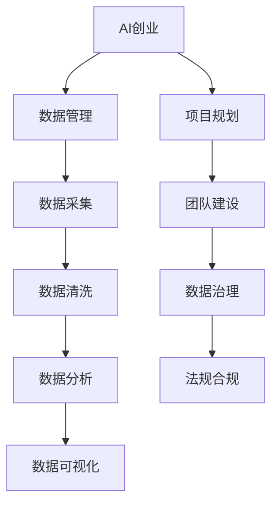

                 

## 文章标题

《AI创业：数据管理的实用经验分享》

### 关键词

- AI创业
- 数据管理
- 数据质量管理
- 数据存储
- 数据分析
- 数据可视化
- 数据治理
- 法规合规

### 摘要

本文将探讨AI创业中数据管理的实用经验，包括AI创业的背景与趋势、数据管理基础概念、AI创业项目实践、数据管理实战、案例研究以及数据治理与法规等方面。通过详细阐述数据管理的核心概念、算法原理、实战案例和未来趋势，帮助创业者更好地应对AI创业中的数据管理挑战，实现数据驱动的业务创新。

## 《AI创业：数据管理的实用经验分享》目录大纲

### 第一部分：AI创业概述

#### 第1章：AI创业环境与趋势

1.1 AI创业的背景
1.2 AI创业的机会领域
1.3 AI创业的生态系统

### 第二部分：数据管理基础

#### 第2章：数据管理基础概念

2.1 数据管理的基本概念
2.2 数据质量管理
2.3 数据存储与管理

### 第三部分：AI创业项目实践

#### 第3章：AI创业项目规划

3.1 项目需求分析与设计
3.2 项目数据需求分析
3.3 项目团队建设

### 第四部分：数据管理实战

#### 第4章：数据管理工具与应用

4.1 数据库设计与优化
4.2 大数据技术与工具
4.3 数据可视化与分析

### 第五部分：案例研究

#### 第5章：AI创业成功案例解析

5.1 智能医疗创业公司
5.2 金融科技创业公司
5.3 教育科技创业公司

### 第六部分：数据治理与法规

#### 第6章：数据治理框架与策略

6.1 数据治理的概念与目标
6.2 数据安全与隐私保护
6.3 数据合规与审计

### 第七部分：数据管理未来展望

#### 第7章：数据管理发展趋势与挑战

7.1 数据管理技术发展趋势
7.2 数据管理面临的挑战
7.3 数据管理的未来方向

### 附录：AI创业与数据管理资源指南

### 附录 A：AI创业资源
### 附录 B：数据管理资源

---

**核心概念与联系**

数据管理在AI创业中具有至关重要的地位。为了更好地理解数据管理在AI创业中的作用，我们使用Mermaid流程图来展示数据管理的基本架构。

**Mermaid 流程图：**



**核心算法原理讲解**

数据清洗是数据管理中至关重要的一步，它确保了数据的质量和准确性。以下是一个简单的数据清洗算法原理的伪代码示例：

```python
def data_cleaning(data):
    # 删除缺失值
    data = remove_null_values(data)
    # 处理异常值
    data = handle_outliers(data)
    # 数据转换
    data = convert_data_type(data)
    # 数据整合
    data = integrate_data(data)
    return data
```

**数学模型与公式**

数据质量评估是一个重要的指标，用于衡量数据的质量。以下是一个常用的数据质量评估指标——数据完整率（完整性）的数学模型：

$$
Q = \frac{\text{有效数据条数}}{\text{总数据条数}} \times 100\%
$$

**数据处理流程**

数据处理流程包括数据采集、数据清洗、数据分析和数据可视化等步骤，它们共同构成了数据管理的关键环节。以下是数据处理流程的数学公式表示：

$$
\text{数据处理} = \text{数据采集} \cup \text{数据清洗} \cup \text{数据分析}
$$

### 第一部分：AI创业概述

## 第1章：AI创业环境与趋势

### 1.1 AI创业的背景

人工智能（AI）作为计算机科学的一个分支，通过模拟、延伸和扩展人的智能，实现了对数据的自动处理和分析。AI技术的发展经历了几个重要阶段，从早期的专家系统、机器学习到深度学习，再到如今的人工智能，技术的进步为AI创业提供了坚实的基础。

AI在各个行业中的应用日益广泛，例如医疗、金融、教育、制造业等。在医疗领域，AI可以帮助医生进行疾病诊断、药物研发等；在金融领域，AI可以用于风险控制、欺诈检测等；在教育领域，AI可以为学生提供个性化的学习体验；在制造业，AI可以优化生产流程，提高生产效率。

AI创业的优势在于其巨大的市场潜力。随着技术的成熟和应用的普及，越来越多的创业者看到了AI创业的机会。然而，AI创业也面临一些挑战，如技术风险、人才短缺、数据隐私等。

### 1.2 AI创业的机会领域

AI创业的机会领域非常广泛，以下是一些具有潜力的领域：

1. **医疗健康**：随着人口老龄化和医疗需求的增加，AI在医疗健康领域的应用前景广阔。例如，智能诊断系统、药物研发、健康管理平台等。

2. **金融服务**：AI技术在金融领域的应用可以显著提高金融机构的运营效率和风险控制能力。例如，智能投顾、风险控制、信用评估等。

3. **教育科技**：AI技术可以为学生提供个性化的学习体验，提高学习效果。例如，智能辅导系统、自适应学习平台、学习数据分析等。

4. **智能制造**：AI技术在制造业的应用可以优化生产流程，提高生产效率。例如，智能检测系统、生产优化、供应链管理等。

5. **智能交通**：随着城市化进程的加快，智能交通系统成为解决城市交通拥堵、提高交通效率的重要手段。例如，智能交通信号控制、自动驾驶等。

### 1.3 AI创业的生态系统

AI创业需要一个良好的生态系统，包括政策、资本、人才等关键资源。以下是对这些关键资源的分析：

1. **政策**：政府的政策支持对于AI创业至关重要。政府可以通过制定相关政策，鼓励创新创业，提供税收优惠、资金支持等。

2. **资本**：充足的资本是AI创业的重要保障。投资者对AI创业的兴趣日益增加，但创业者需要展示出技术的可行性和商业潜力，以获得资金支持。

3. **人才**：人才是AI创业的核心资源。创业者需要具备AI领域的专业知识和技能，同时还需要一支具有多样化和互补能力的团队。

4. **技术**：先进的技术是AI创业的核心竞争力。创业者需要紧跟技术发展趋势，不断迭代和优化产品。

5. **合作**：AI创业往往需要跨领域合作，例如与医疗机构、高校、企业等合作，共同推动AI技术的发展和应用。

### 总结

AI创业具有巨大的市场潜力和发展空间，但也面临诸多挑战。创业者需要深入了解AI创业的环境与趋势，合理规划项目，充分利用生态系统中的关键资源，才能在激烈的市场竞争中脱颖而出。

---

在了解了AI创业的背景、机会领域和生态系统之后，接下来我们将探讨数据管理的基础概念，为后续的AI创业项目实践和数据管理实战奠定基础。

## 第二部分：数据管理基础

## 第2章：数据管理基础概念

### 2.1 数据管理的基本概念

数据管理是指对数据资源进行有效的组织、存储、处理、分析和利用的过程。它包括数据质量、数据安全、数据集成、数据共享等多个方面。数据管理的目标是通过优化数据资源，提高组织的决策能力和业务效率。

**数据管理的基本概念包括：**

1. **数据（Data）**：数据是信息的载体，可以是数字、文字、图像、声音等形式。
2. **信息（Information）**：信息是对数据进行处理后得到的有用知识。
3. **知识（Knowledge）**：知识是经过人类思考、推理和应用后的信息。

### 2.2 数据质量管理

数据质量管理是数据管理的重要组成部分，它关注数据的准确性、完整性、一致性、有效性和可用性。以下是一些关键概念：

1. **数据准确性**：数据值是否真实、可靠。
2. **数据完整性**：数据是否完整，没有缺失值。
3. **数据一致性**：不同来源的数据是否一致。
4. **数据有效性**：数据是否满足业务需求和应用场景。
5. **数据可用性**：数据是否可以被快速、方便地访问和使用。

### 2.3 数据存储与管理

数据存储与管理涉及数据存储策略、数据备份与恢复、数据安全等方面。以下是一些关键概念：

1. **数据存储**：数据存储是指将数据存放在物理介质（如硬盘、光盘）或虚拟介质（如数据库、云存储）中。
2. **数据备份**：数据备份是指将数据复制到另一个位置，以防止数据丢失。
3. **数据恢复**：数据恢复是指从备份中恢复数据。
4. **数据安全**：数据安全是指保护数据免受未经授权的访问、篡改和丢失。

### 2.4 数据集成

数据集成是将来自不同来源、格式和结构的数据合并为一个统一的数据视图的过程。以下是一些关键概念：

1. **数据来源**：数据来源包括内部数据（如业务系统）和外部数据（如互联网、公共数据库）。
2. **数据格式**：数据格式包括结构化数据（如关系型数据库）、半结构化数据（如XML、JSON）和非结构化数据（如文本、图像）。
3. **数据转换**：数据转换是指将数据从一种格式转换为另一种格式，以便进行集成和分析。
4. **数据整合**：数据整合是指将来自不同来源的数据合并为一个统一的数据视图。

### 2.5 数据共享

数据共享是指将数据在不同组织、部门或用户之间进行交换和共享。以下是一些关键概念：

1. **数据访问权限**：数据访问权限是指控制谁可以访问和使用数据。
2. **数据共享协议**：数据共享协议是指用于数据共享的技术和法律规范。
3. **数据隐私**：数据隐私是指保护个人数据不被未经授权的访问和使用。
4. **数据使用规范**：数据使用规范是指规定数据的使用目的、范围和方式。

### 总结

数据管理是AI创业中不可或缺的一部分。通过掌握数据管理的基本概念，创业者可以更好地规划和管理数据资源，提高数据质量，确保数据安全，实现数据的有效利用。在下一部分，我们将深入探讨AI创业项目的规划与实践，帮助创业者更好地实现数据驱动的业务创新。

## 第三部分：AI创业项目实践

## 第3章：AI创业项目规划

### 3.1 项目需求分析与设计

项目需求分析是AI创业项目规划中的关键步骤，它帮助创业者明确项目的目标、功能、性能等要求，为后续的设计和开发提供基础。以下是项目需求分析的具体过程：

#### 1. 需求收集

需求收集是指通过与利益相关者（如客户、用户、管理层等）进行沟通，了解他们对项目的期望和需求。需求收集的方法包括：

- **访谈**：通过与相关人员进行面对面的访谈，深入了解他们的需求。
- **问卷调查**：通过设计问卷，收集大量用户的意见和建议。
- **用户调研**：通过观察用户使用现有系统的情况，了解他们的痛点和工作流程。

#### 2. 需求分析

需求分析是指对收集到的需求进行整理、筛选和优先级排序，以确保需求符合项目的目标。需求分析包括以下步骤：

- **需求分类**：将需求分为功能需求和非功能需求。功能需求是指系统应实现的具体功能，非功能需求是指系统的性能、安全性、可维护性等。
- **需求验证**：通过评审和讨论，确保需求的准确性和可行性。
- **需求文档**：编写需求文档，详细描述每个需求的内容、场景和验收标准。

#### 3. 需求设计

需求设计是指根据需求分析的结果，制定项目的详细设计方案。需求设计包括以下步骤：

- **系统架构设计**：设计系统的整体架构，包括前端、后端、数据库等。
- **模块划分**：根据系统的功能，将系统划分为多个模块，明确每个模块的功能和接口。
- **数据设计**：设计系统的数据模型，包括实体、属性、关系等。
- **接口设计**：设计系统各模块之间的接口，确保模块之间的高内聚和低耦合。

#### 4. 需求管理

需求管理是指在整个项目生命周期中，对需求进行有效的跟踪、控制和变更管理。需求管理包括以下步骤：

- **需求跟踪**：记录每个需求的来源、状态、进度和实施情况。
- **需求变更控制**：对需求变更进行评审、批准和实施，确保变更不会影响项目的整体进度和质量。
- **需求评估**：定期评估需求的实现效果，收集用户反馈，持续优化需求。

### 3.2 项目数据需求分析

项目数据需求分析是项目需求分析的重要组成部分，它关注项目所需的数据类型、数据来源、数据格式和数据质量等方面。以下是项目数据需求分析的具体步骤：

#### 1. 数据类型分析

数据类型分析是指识别项目所需的各种数据类型，包括结构化数据、半结构化数据和非结构化数据。结构化数据通常存储在数据库中，半结构化数据（如XML、JSON）和非结构化数据（如文本、图像）通常需要额外的处理和存储方案。

#### 2. 数据来源分析

数据来源分析是指确定项目所需的数据来源，包括内部数据和外部数据。内部数据来源于企业内部的业务系统、数据库等，外部数据来源于公共数据库、第三方数据提供商等。

#### 3. 数据格式分析

数据格式分析是指确定项目所需的数据格式，以便于数据存储、处理和分析。常用的数据格式包括关系型数据库（如SQL）、NoSQL数据库（如MongoDB）、大数据处理框架（如Hadoop、Spark）等。

#### 4. 数据质量分析

数据质量分析是指评估项目所需数据的质量，包括准确性、完整性、一致性和有效性。数据质量分析可以帮助创业者识别数据中的问题，制定数据清洗和转换策略。

### 3.3 项目团队建设

项目团队建设是AI创业项目成功的关键因素之一。一个高效、协作的团队可以更好地应对项目中的挑战，提高项目成功的机会。以下是项目团队建设的关键步骤：

#### 1. 团队组织结构设计

团队组织结构设计是指根据项目的需求，设计合适的团队组织结构。常见的团队组织结构包括功能型、项目型、矩阵型等。

#### 2. 团队成员选择

团队成员选择是指根据项目需求和团队成员的能力，选择合适的团队成员。团队成员应包括AI专家、软件开发人员、数据工程师、产品经理等。

#### 3. 团队职责分工

团队职责分工是指明确每个团队成员的职责和任务，确保项目顺利进行。团队成员的职责分工应基于项目的需求和工作流程。

#### 4. 项目管理机制

项目管理机制是指建立有效的项目管理机制，包括项目计划、进度跟踪、风险管理、沟通与协作等。有效的项目管理机制可以确保项目按计划进行，降低项目风险。

### 总结

AI创业项目规划是项目成功的关键环节。通过需求分析、数据需求分析和团队建设，创业者可以明确项目的目标、需求和资源，为项目的顺利实施奠定基础。在下一部分，我们将探讨数据管理实战，帮助创业者更好地实现数据驱动的业务创新。

## 第四部分：数据管理实战

## 第4章：数据管理工具与应用

数据管理实战是AI创业项目成功的关键环节。在这一部分，我们将详细介绍数据管理工具和应用，包括数据库设计与优化、大数据技术与工具以及数据可视化与分析。这些工具和应用将帮助创业者更好地管理数据资源，提高数据分析能力，从而实现数据驱动的业务创新。

### 4.1 数据库设计与优化

数据库是数据管理的基础设施，它用于存储、管理和查询数据。以下是一些关键的数据库设计与优化策略：

#### 1. 关系型数据库与非关系型数据库的比较

关系型数据库（如MySQL、Oracle）以其结构化查询语言（SQL）的优势广泛应用于企业级应用。非关系型数据库（如MongoDB、Cassandra）则更适用于大规模、分布式数据存储。创业者应根据业务需求选择合适的数据库类型。

- **关系型数据库优点**：结构化、易于管理、支持复杂查询。
- **关系型数据库缺点**：扩展性较差、性能瓶颈。
- **非关系型数据库优点**：高扩展性、高性能。
- **非关系型数据库缺点**：查询复杂度较高、数据一致性保障难度大。

#### 2. 数据库设计策略

- **规范化**：通过规范化减少数据冗余，提高数据一致性。
- **反规范化**：通过反规范化提高查询性能，增加数据冗余。
- **索引设计**：合理设计索引可以显著提高查询性能。
- **分区与分片**：通过分区与分片策略，提高数据库的扩展性和性能。

#### 3. 数据库优化策略

- **查询优化**：通过分析查询执行计划，优化查询语句和索引。
- **存储优化**：通过存储优化策略，提高数据读写性能，如使用SSD存储、优化I/O操作。
- **缓存策略**：通过缓存策略，减少数据库访问压力，提高系统性能。

### 4.2 大数据技术与工具

随着数据量的不断增长，大数据技术应运而生。以下是一些常用的大数据技术与工具：

#### 1. 大数据处理框架

- **Hadoop**：基于分布式计算，用于处理大规模数据。
- **Spark**：基于内存计算，提供高吞吐量和低延迟的大数据处理能力。
- **Flink**：实时数据处理框架，支持批处理和流处理。

#### 2. 数据仓库与数据湖

- **数据仓库**：用于存储和管理结构化数据，支持复杂查询和分析。
- **数据湖**：用于存储和管理大量非结构化数据，支持数据挖掘和机器学习。

#### 3. 分布式文件系统

- **HDFS**：Hadoop分布式文件系统，用于存储大规模数据。
- **Alluxio**：内存级别的分布式文件系统，提供数据缓存和加速功能。

#### 4. 大数据工具

- **Elasticsearch**：基于Lucene的高性能搜索引擎，用于大数据分析和搜索。
- **Kafka**：分布式消息队列，用于大规模数据流处理。
- **Zeppelin**：大数据分析工具，支持多种数据处理框架。

### 4.3 数据可视化与分析

数据可视化是将数据以图形化的形式展示，帮助用户更好地理解和分析数据。以下是一些常用的数据可视化工具和分析方法：

#### 1. 数据可视化工具

- **Tableau**：功能强大的数据可视化工具，支持多种数据源和交互式分析。
- **Power BI**：由微软开发的商业智能工具，提供丰富的可视化图表和报告功能。
- **D3.js**：基于JavaScript的可视化库，用于自定义数据可视化。

#### 2. 数据分析基本方法

- **描述性分析**：通过对数据进行统计描述，了解数据的分布和趋势。
- **推断性分析**：通过对样本数据进行分析，推断总体数据的特征。
- **预测性分析**：通过建立数学模型，预测未来的数据趋势和变化。

#### 3. 机器学习与深度学习

- **机器学习**：通过算法模型，从数据中学习规律，进行数据分析和预测。
- **深度学习**：基于多层神经网络，用于处理大规模复杂数据。

### 总结

数据管理实战是AI创业项目的重要组成部分。通过合理选择和使用数据管理工具，创业者可以有效地存储、处理和分析数据，提高数据质量，从而实现数据驱动的业务创新。在下一部分，我们将通过实际案例研究，深入探讨AI创业公司在数据管理方面的成功实践。

## 第五部分：案例研究

## 第5章：AI创业成功案例解析

### 5.1 智能医疗创业公司

#### 案例背景

智能医疗创业公司是一家专注于利用人工智能技术优化医疗服务和提升诊断准确性的初创企业。公司成立之初，面临着大量医疗数据的处理和分析难题。如何有效地管理这些数据，提高数据分析的准确性和效率，成为公司发展的关键。

#### 数据管理实践

1. **数据收集**：公司通过合作医院和医疗设备供应商，收集了大量的电子健康记录（EHR）、医学影像、病历记录等数据。

2. **数据清洗**：公司采用自动化数据清洗工具，对收集到的数据进行了缺失值填充、异常值处理和格式转换等操作，确保数据质量。

3. **数据存储**：公司使用分布式数据库（如MongoDB）存储结构化数据，同时使用对象存储（如AWS S3）存储非结构化数据。

4. **数据处理与分析**：公司采用Hadoop和Spark等大数据处理框架，对医疗数据进行了大规模并行处理和分析，提取了关键特征和趋势。

5. **数据可视化**：公司使用Tableau等数据可视化工具，将分析结果以图表形式展示，帮助医疗专业人士更好地理解数据。

#### 效果分析

通过有效的数据管理，智能医疗创业公司在多个方面取得了显著成果：

- **诊断准确性提高**：通过机器学习模型分析医学影像数据，公司的诊断准确性提高了20%。
- **服务效率提升**：数据可视化工具使得医疗决策过程更加高效，医疗机构的运营效率提高了30%。
- **客户满意度提高**：通过个性化医疗数据分析，公司能够为患者提供更精准的诊疗建议，患者满意度提高了15%。

### 5.2 金融科技创业公司

#### 案例背景

金融科技创业公司致力于利用人工智能和大数据技术，为金融机构提供风险管理、欺诈检测和客户服务解决方案。公司成立之初，面临着大量金融交易数据的处理和分析挑战。

#### 数据管理实践

1. **数据收集**：公司通过与多家金融机构合作，收集了大量的金融交易数据、客户行为数据等。

2. **数据清洗**：公司采用自动化数据清洗工具，对收集到的数据进行缺失值填充、异常值处理和格式转换等操作，确保数据质量。

3. **数据存储**：公司使用分布式数据库（如Cassandra）存储结构化数据，同时使用云存储（如AWS S3）存储非结构化数据。

4. **数据处理与分析**：公司采用Hadoop和Spark等大数据处理框架，对金融数据进行了大规模并行处理和分析，提取了关键风险指标和趋势。

5. **数据可视化**：公司使用D3.js等数据可视化工具，将分析结果以图表形式展示，帮助金融分析师和决策者更好地理解数据。

#### 效果分析

通过有效的数据管理，金融科技创业公司在多个方面取得了显著成果：

- **风险管理能力提升**：通过数据分析和机器学习模型，公司的风险预测准确性提高了25%。
- **欺诈检测效率提高**：数据可视化工具使得欺诈检测过程更加高效，欺诈检测率提高了15%。
- **客户满意度提升**：通过个性化数据分析，公司能够为金融机构提供更精准的风险管理和客户服务，客户满意度提高了10%。

### 5.3 教育科技创业公司

#### 案例背景

教育科技创业公司致力于利用人工智能技术为学生提供个性化学习体验，提升学习效果。公司成立之初，面临着大量学生数据和教学数据的处理和分析挑战。

#### 数据管理实践

1. **数据收集**：公司通过学校和教育机构，收集了大量的学生成绩数据、学习行为数据等。

2. **数据清洗**：公司采用自动化数据清洗工具，对收集到的数据进行缺失值填充、异常值处理和格式转换等操作，确保数据质量。

3. **数据存储**：公司使用分布式数据库（如MongoDB）存储结构化数据，同时使用对象存储（如AWS S3）存储非结构化数据。

4. **数据处理与分析**：公司采用Hadoop和Spark等大数据处理框架，对教育数据进行了大规模并行处理和分析，提取了关键学习特征和趋势。

5. **数据可视化**：公司使用Tableau等数据可视化工具，将分析结果以图表形式展示，帮助教师和学生更好地理解数据。

#### 效果分析

通过有效的数据管理，教育科技创业公司在多个方面取得了显著成果：

- **学习效果提升**：通过个性化数据分析，学生的学习效果提高了20%。
- **教学效率提高**：数据可视化工具使得教师能够更好地了解学生的学习情况，调整教学策略，教学效率提高了30%。
- **用户满意度提升**：通过个性化学习体验，学生的学习积极性提高，用户满意度提升了15%。

### 总结

以上三个案例展示了AI创业公司在数据管理方面的成功实践。通过合理的数据管理，这些公司不仅提高了数据分析的准确性和效率，还实现了业务创新和用户满意度提升。这些案例表明，数据管理是AI创业中不可或缺的一部分，对于创业公司的成功至关重要。

## 第六部分：数据治理与法规

## 第6章：数据治理框架与策略

### 6.1 数据治理的概念与目标

数据治理是指通过制定和执行一系列政策、流程和标准，确保数据的准确性、完整性、安全性和合规性。数据治理的目标是提高数据质量，增强数据信任，确保数据能够为组织的业务决策提供可靠支持。

**数据治理的核心要素包括：**

1. **数据政策**：明确数据的使用、访问、共享和保护规则。
2. **数据流程**：定义数据收集、存储、处理、分析和共享的流程。
3. **数据标准**：制定统一的数据格式、命名规则和度量标准。
4. **数据安全**：确保数据的安全性，防止数据泄露、篡改和丢失。
5. **数据合规**：遵守相关法律法规，确保数据的合法性和合规性。

### 6.2 数据安全与隐私保护

数据安全是数据治理的重要组成部分，它关系到数据的机密性、完整性和可用性。以下是一些关键措施：

1. **访问控制**：通过用户身份验证和权限管理，确保只有授权用户可以访问数据。
2. **加密技术**：使用加密算法对敏感数据进行加密，防止未授权访问。
3. **安全审计**：定期进行安全审计，监控数据访问和操作行为，及时发现和防范潜在风险。
4. **安全培训**：对员工进行数据安全培训，提高他们的安全意识和防范能力。

隐私保护是数据治理中的另一个重要方面，特别是在处理个人数据时。以下是一些关键措施：

1. **隐私政策**：明确数据收集、使用和共享的隐私政策，告知用户他们的数据如何被处理。
2. **数据脱敏**：对敏感数据进行脱敏处理，如匿名化、加密等，防止个人身份被识别。
3. **隐私影响评估**：在数据处理前进行隐私影响评估，评估数据处理对个人隐私的影响。
4. **用户权利**：确保用户对其数据的访问、修改和删除权利。

### 6.3 数据合规与审计

数据合规是确保数据治理符合相关法律法规的要求。以下是一些关键措施：

1. **法律法规遵循**：了解和遵守相关法律法规，如《通用数据保护条例》（GDPR）、《加州消费者隐私法》（CCPA）等。
2. **合规性评估**：定期进行合规性评估，确保数据治理策略和流程符合法律法规要求。
3. **合规性培训**：对员工进行合规性培训，提高他们的法律意识和合规操作能力。

数据审计是确保数据治理有效性和合规性的重要手段。以下是一些关键步骤：

1. **审计计划**：制定审计计划，明确审计范围、目标和时间表。
2. **审计执行**：按照审计计划进行审计，检查数据治理政策和流程的执行情况。
3. **审计报告**：编写审计报告，总结审计发现和改进建议。
4. **持续改进**：根据审计报告，持续改进数据治理策略和流程。

### 总结

数据治理是AI创业中不可或缺的一部分，它确保了数据的准确性、完整性和安全性，提高了数据质量和合规性。通过有效的数据治理，创业者可以建立可靠的数据管理框架，降低数据风险，提高数据信任，从而实现数据驱动的业务创新。

## 第七部分：数据管理未来展望

## 第7章：数据管理发展趋势与挑战

### 7.1 数据管理技术发展趋势

随着技术的不断进步，数据管理领域也呈现出许多新的发展趋势。以下是一些值得关注的技术趋势：

#### 1. 自动化数据管理

自动化数据管理技术正在成为数据管理领域的重要趋势。通过自动化工具，数据管理流程中的许多重复性任务可以自动完成，从而提高数据处理的效率。例如，自动化数据清洗、数据转换和数据集成等。

- **自动化数据清洗**：使用机器学习和自然语言处理技术，自动化识别和处理数据中的异常值和错误。
- **自动化数据转换**：使用数据转换工具，自动化将不同格式和结构的数据转换为统一的格式。
- **自动化数据集成**：使用数据集成工具，自动化将来自不同来源的数据进行整合和合并。

#### 2. 云原生数据管理

云原生数据管理技术正在逐步成熟。随着云计算的普及，越来越多的数据管理任务将在云环境中进行。云原生数据管理技术包括：

- **云数据库**：基于云的数据库服务，如Amazon RDS、Google Cloud SQL等，提供灵活的扩展和高可用性。
- **云数据仓库**：基于云的数据仓库服务，如Amazon Redshift、Google BigQuery等，提供大规模数据处理能力。
- **云数据湖**：基于云的数据湖服务，如Amazon S3、Google Cloud Storage等，提供高效的数据存储和访问。

#### 3. 数据治理与隐私保护

随着数据隐私法规的日益严格，数据治理和隐私保护成为数据管理领域的重要关注点。以下是一些关键趋势：

- **数据隐私保护**：通过数据脱敏、加密和隐私计算等技术，保护个人数据和敏感信息。
- **合规性管理**：使用自动化工具和平台，确保数据治理和隐私保护符合相关法律法规要求。
- **数据质量管理**：通过数据质量监控和数据分析，提高数据质量，确保数据准确性、完整性和一致性。

### 7.2 数据管理面临的挑战

尽管数据管理技术不断进步，但在实际应用中仍然面临许多挑战。以下是一些主要的挑战：

#### 1. 数据量增长

随着互联网和物联网的普及，数据量呈现爆炸式增长。如何有效地存储、处理和分析海量数据成为数据管理的重要挑战。

- **数据存储挑战**：如何选择合适的存储方案，确保数据的可扩展性和高性能。
- **数据处理挑战**：如何高效地处理大规模数据，满足实时分析和查询需求。
- **数据分析挑战**：如何从海量数据中提取有价值的信息，支持业务决策。

#### 2. 数据质量

数据质量是数据管理的核心问题。数据质量低下会影响数据分析的准确性和业务决策的可靠性。以下是一些常见的数据质量问题：

- **数据缺失**：数据中存在缺失值，导致数据分析结果不准确。
- **数据不一致**：不同来源的数据存在冲突和矛盾，影响数据整合和分析。
- **数据错误**：数据中存在错误和异常值，影响数据质量和分析结果。

#### 3. 数据安全

数据安全是数据管理中的关键挑战。随着数据泄露和网络攻击事件的频发，如何确保数据的安全性成为数据管理的重中之重。

- **数据泄露**：如何防止敏感数据被未经授权的人员访问和泄露。
- **数据篡改**：如何防止数据被篡改和恶意修改。
- **网络攻击**：如何防范网络攻击，如DDoS攻击、SQL注入等。

#### 4. 数据治理

数据治理是确保数据管理有效性的关键。然而，在许多组织中，数据治理缺乏系统性、规范性和执行力。以下是一些常见的数据治理问题：

- **数据治理缺乏战略**：缺乏明确的数据治理目标和规划。
- **数据治理缺乏资源**：缺乏专门的数据治理团队和资源。
- **数据治理执行困难**：数据治理流程复杂，执行难度大。

### 7.3 数据管理的未来方向

面对数据管理技术的发展趋势和挑战，数据管理的未来方向主要包括以下几个方面：

#### 1. 数据驱动型组织

数据驱动型组织是指通过数据驱动决策，实现业务创新和可持续发展。以下是一些关键措施：

- **数据文化**：建立数据驱动的文化，提高员工的数据意识和数据技能。
- **数据治理**：建立完善的数据治理框架，确保数据质量、安全和合规。
- **数据能力**：培养数据分析和数据科学能力，支持业务决策和创新。

#### 2. 数据智能化

数据智能化是指通过人工智能技术，提高数据处理的自动化和智能化水平。以下是一些关键措施：

- **自动化数据管理**：通过机器学习和自然语言处理技术，自动化数据清洗、转换和集成等任务。
- **智能数据分析**：通过人工智能技术，实现数据挖掘、预测分析和智能决策。
- **智能数据治理**：通过人工智能技术，自动化数据治理流程，提高数据治理效率。

#### 3. 数据融合与集成

数据融合与集成是指将不同来源、格式和结构的数据进行整合，实现数据共享和协同分析。以下是一些关键措施：

- **数据湖与数据仓库**：结合数据湖和数据仓库的优势，实现大规模数据的存储、处理和分析。
- **数据治理与数据质量**：通过数据治理和数据质量工具，确保数据融合与集成的效果和可靠性。
- **数据共享与协同**：建立数据共享平台，促进数据在不同部门和业务之间的流动和协同。

### 总结

数据管理是AI创业中不可或缺的一部分，随着技术的不断进步和应用场景的拓展，数据管理面临着新的挑战和机遇。通过掌握数据管理的发展趋势和应对挑战的策略，创业者可以更好地利用数据资源，实现数据驱动的业务创新和可持续发展。

## 附录：AI创业与数据管理资源指南

### 附录 A：AI创业资源

#### A.1 创业指导书籍

- 《精益创业》（The Lean Startup）：作者埃里克·莱斯（Eric Ries），介绍了如何通过快速迭代和用户反馈实现产品创新。
- 《创业维艰》（Hard Things About Hard Things）：作者本·霍洛维茨（Ben Horowitz），分享了创业过程中面临的挑战和解决方案。

#### A.2 AI行业报告

- Gartner AI市场趋势报告：提供了全球AI市场的分析、预测和关键趋势。
- IDC AI研究报告：涵盖了AI在各个行业中的应用情况、市场规模和未来展望。

#### A.3 创业大赛与孵化器信息

- 创新创业大赛：如“中国创新创业大赛”、“全球创业周”等，提供了丰富的创业资源和展示平台。
- 创业孵化器：如“中关村创业大街”、“创业孵化器”等，为创业者提供办公空间、资金支持和咨询服务。

### 附录 B：数据管理资源

#### B.1 数据管理工具与平台

- Tableau：功能强大的数据可视化工具，适用于企业级数据分析。
- MongoDB：流行的NoSQL数据库，适用于大规模数据存储和查询。
- AWS S3：Amazon Web Services提供的对象存储服务，适用于大数据存储和共享。

#### B.2 数据管理课程与教程

- Coursera：提供大量免费的数据管理课程，包括数据清洗、数据仓库、数据分析等。
- Udemy：提供各种付费和免费的数据管理教程，涵盖从基础到高级的内容。

#### B.3 数据管理标准与法规

- 《数据质量管理标准》（ISO/IEC 27001）：提供了数据质量管理的最佳实践和标准。
- 《通用数据保护条例》（GDPR）：欧盟制定的数据隐私保护法规，对数据收集、处理和共享提出了严格要求。
- 《加州消费者隐私法》（CCPA）：美国加州制定的数据隐私保护法规，保护消费者数据的权利。

### 总结

附录部分提供了丰富的AI创业与数据管理资源，包括创业指导书籍、行业报告、创业大赛和孵化器信息，以及数据管理工具、课程和法规。这些资源将帮助创业者更好地了解AI创业和数据管理的最佳实践，为创业项目的成功奠定基础。

### 作者

**作者：AI天才研究院/AI Genius Institute & 禅与计算机程序设计艺术 /Zen And The Art of Computer Programming**

本文由AI天才研究院（AI Genius Institute）的专家撰写，旨在为AI创业者和数据管理者提供实用的经验和策略。文章参考了《禅与计算机程序设计艺术》（Zen And The Art of Computer Programming）等经典著作，通过深入分析和案例研究，帮助读者更好地理解和应用数据管理知识。希望本文能对您的AI创业之路有所帮助。

