                 

# 文章标题: AI创业：选择合适工具的方法

> 关键词：AI创业、工具选择、开发平台、项目实施、案例分析、法律法规、持续发展

> 摘要：本文旨在探讨AI创业者在选择工具方面的方法。通过分析AI创业的背景、准备工作、工具与平台选择、项目规划与实施、案例分析以及法律法规与持续发展等方面的内容，为AI创业者提供一套系统的工具选择方法，助力他们成功实现AI创业。

## 目录

1. **AI创业概述**  
   1.1 AI技术发展趋势  
   1.2 AI创业的现状与机遇  
   1.3 AI创业的挑战与风险

2. **AI创业的准备工作**  
   2.1 市场调研与需求分析  
   2.2 团队组建与人才招募  
   2.3 创业资金筹集与预算规划  
   2.4 创业项目的可行性分析

3. **AI创业工具与平台选择**  
   3.1 常见AI开发工具介绍  
   3.2 AI开发平台比较与选择  
   3.3 AI工具的定制与优化  
   3.4 开发环境搭建与配置

4. **AI创业项目规划与实施**  
   4.1 项目规划与时间管理  
   4.2 项目风险管理  
   4.3 项目预算控制与调整  
   4.4 项目团队协作与沟通

5. **AI创业案例分析**  
   5.1 成功AI创业案例分析  
   5.2 失败AI创业案例分析  
   5.3 案例启示与创业策略制定

6. **AI创业的法律法规与伦理**  
   6.1 AI创业相关的法律法规  
   6.2 AI伦理问题与解决方案  
   6.3 个人隐私与数据安全  
   6.4 社会责任与可持续发展

7. **AI创业的持续发展与创新**  
   7.1 市场动态与趋势分析  
   7.2 技术创新与产品迭代  
   7.3 企业文化与员工激励  
   7.4 知识产权保护与战略布局

8. **附录**

   8.1 AI创业资源与工具

   8.2 参考文献与拓展阅读

---

### 第一部分：AI创业概述

在当今快速发展的技术时代，人工智能（AI）已经成为推动产业变革的重要力量。AI创业作为一种新兴的创业模式，吸引了大量的投资者和创业者。然而，AI创业并非易事，创业者需要选择合适的工具和平台，才能在激烈的市场竞争中脱颖而出。

#### 第1章：AI创业背景与前景

##### 1.1 AI技术发展趋势

随着深度学习、自然语言处理、计算机视觉等技术的不断进步，AI的应用领域日益广泛。根据国际数据公司（IDC）的预测，到2025年，全球将有超过60%的新业务流程使用AI技术。这为AI创业者提供了广阔的市场空间。

##### 1.2 AI创业的现状与机遇

目前，AI创业主要集中在医疗健康、金融科技、智能硬件、智能制造等领域。这些领域的市场潜力巨大，为创业者提供了丰富的机遇。然而，AI创业也面临着激烈的竞争和风险。

##### 1.3 AI创业的挑战与风险

AI创业的挑战主要体现在技术难度、市场准入、资金筹集等方面。创业者需要具备深厚的技术功底和敏锐的市场洞察力，才能在竞争中立于不败之地。同时，AI创业还面临着数据隐私、法律法规等风险。

#### 第2章：AI创业的准备工作

##### 2.1 市场调研与需求分析

在创业初期，市场调研和需求分析是至关重要的一步。创业者需要深入了解目标市场的现状、需求和发展趋势，从而确定创业的方向和定位。

##### 2.2 团队组建与人才招募

AI创业需要强大的技术团队支持。创业者需要招募具备专业技能和团队合作精神的成员，共同推动项目的进展。

##### 2.3 创业资金筹集与预算规划

AI创业需要大量的资金支持。创业者需要制定详细的预算规划，合理分配资金，确保项目的顺利进行。

##### 2.4 创业项目的可行性分析

在创业之前，创业者需要对项目进行可行性分析。这包括技术可行性、市场可行性、财务可行性等方面的分析，以确定项目的可行性和可行性。

---

### 第二部分：AI创业工具与平台选择

选择合适的AI创业工具和平台对于项目的成功至关重要。在这一部分，我们将探讨常见的AI开发工具、平台的比较与选择，以及开发环境的搭建与配置。

#### 第3章：AI创业工具与平台选择

##### 3.1 常见AI开发工具介绍

在这一章节，我们将介绍一些常见的AI开发工具，如TensorFlow、PyTorch、Keras等，并分析它们的特点和适用场景。

##### 3.2 AI开发平台比较与选择

在AI开发平台的选择上，创业者需要考虑平台的易用性、功能丰富性、社区支持等因素。我们将对主流的AI开发平台进行比较，帮助创业者选择合适的平台。

##### 3.3 AI工具的定制与优化

AI创业过程中，创业者可能需要对现有的AI工具进行定制和优化，以满足特定的需求。在这一章节，我们将探讨如何对AI工具进行定制和优化。

##### 3.4 开发环境搭建与配置

搭建一个高效的开发环境对于AI创业至关重要。在这一章节，我们将介绍如何搭建和配置AI开发环境，包括硬件配置、软件安装、环境变量设置等方面。

---

### 第三部分：AI创业项目规划与实施

在AI创业项目中，项目规划与实施是关键的一环。在这一部分，我们将探讨项目规划与时间管理、项目风险管理、项目预算控制与调整、项目团队协作与沟通等方面的内容。

#### 第4章：AI创业项目规划与实施

##### 4.1 项目规划与时间管理

项目规划是项目成功的基础。在这一章节，我们将探讨如何制定项目规划，包括项目目标、任务分解、时间安排等方面。同时，我们还将介绍时间管理的技巧和方法。

##### 4.2 项目风险管理

在AI创业项目中，风险无处不在。在这一章节，我们将介绍如何识别、评估和应对项目风险，以确保项目的顺利进行。

##### 4.3 项目预算控制与调整

项目预算控制是项目成功的关键之一。在这一章节，我们将探讨如何制定项目预算，以及如何调整和优化项目预算。

##### 4.4 项目团队协作与沟通

项目团队的协作与沟通对于项目的成功至关重要。在这一章节，我们将介绍如何建立高效的团队协作机制，以及如何进行有效的沟通。

---

### 第四部分：AI创业案例分析

通过分析成功的AI创业案例和失败的AI创业案例，创业者可以从中吸取经验教训，制定更有效的创业策略。

#### 第5章：AI创业案例分析

##### 5.1 成功AI创业案例分析

在这一章节，我们将分析一些成功的AI创业案例，探讨它们的成功原因、关键因素以及创业策略。

##### 5.2 失败AI创业案例分析

在这一章节，我们将分析一些失败的AI创业案例，探讨它们失败的原因、教训以及如何避免类似失败。

##### 5.3 案例启示与创业策略制定

通过分析成功与失败的AI创业案例，创业者可以从中获得宝贵的启示，制定更有效的创业策略。

---

### 第五部分：AI创业的法律法规与伦理

在AI创业过程中，法律法规和伦理问题是创业者需要关注的重要方面。

#### 第6章：AI创业的法律法规与伦理

##### 6.1 AI创业相关的法律法规

在这一章节，我们将介绍与AI创业相关的法律法规，包括数据保护法、知识产权法、合同法等方面。

##### 6.2 AI伦理问题与解决方案

在这一章节，我们将探讨AI伦理问题，如数据隐私、算法偏见、透明度等，并介绍相应的解决方案。

##### 6.3 个人隐私与数据安全

在这一章节，我们将讨论个人隐私与数据安全的重要性，以及如何在AI创业中保护个人隐私和数据安全。

##### 6.4 社会责任与可持续发展

在这一章节，我们将探讨AI创业的社会责任和可持续发展问题，包括社会影响、环境保护等方面。

---

### 第六部分：AI创业的持续发展与创新

AI创业是一个长期的过程，持续发展和创新是创业者需要关注的重要方面。

#### 第7章：AI创业的持续发展与创新

##### 7.1 市场动态与趋势分析

在这一章节，我们将分析AI市场的动态和趋势，帮助创业者把握市场机会。

##### 7.2 技术创新与产品迭代

在这一章节，我们将探讨如何进行技术创新和产品迭代，以保持竞争优势。

##### 7.3 企业文化与员工激励

在这一章节，我们将介绍如何建立积极的企业文化，以及如何激励员工，提高团队凝聚力。

##### 7.4 知识产权保护与战略布局

在这一章节，我们将讨论如何保护知识产权，以及如何进行战略布局，以实现企业的长期发展。

---

### 附录

#### 附录A：AI创业资源与工具

在这一附录中，我们将推荐一些AI创业相关的资源与工具，包括开源AI资源、常用AI开发工具链接和AI创业社区与论坛介绍。

#### 附录B：参考文献与拓展阅读

在这一附录中，我们将列出本文引用的参考文献，并提供一些拓展阅读，以帮助读者深入了解AI创业的相关知识。

---

通过本文的探讨，我们希望为AI创业者提供一套系统的工具选择方法，帮助他们成功实现AI创业。同时，我们也希望创业者能够从成功与失败的案例中吸取经验教训，制定出更有效的创业策略。在AI创业的道路上，只有不断学习、创新和坚持，才能取得成功。让我们共同努力，开创AI创业的新时代！[1] [2] [3]

---

### 参考文献

1. **IDC**. (2020). **Artificial Intelligence: A Market Forecast**. International Data Corporation.
2. **Kitchin, R.**. (2014). **The Data Revolution: Big Data, Open Data, Data Infrastructures and Their Consequences**. SAGE Publications.
3. **McKinsey & Company**. (2017). **Artificial Intelligence: The Next Industrial Revolution**. McKinsey Global Institute.

# 第一部分：AI创业概述

### 第1章：AI创业背景与前景

随着人工智能技术的迅猛发展，AI创业已成为当下科技产业中的热门话题。AI技术不仅改变了传统行业的运作模式，还开辟了前所未有的市场机遇。本章将探讨AI创业的背景、现状、机遇和挑战。

#### 1.1 AI技术发展趋势

近年来，AI技术在各个领域取得了显著进展。以深度学习为代表的人工智能技术，已经能够在图像识别、自然语言处理、自动驾驶等领域实现高效应用。这些技术不仅提升了工作效率，还降低了成本，为各行业的创新发展提供了强大动力。

**核心概念与联系**

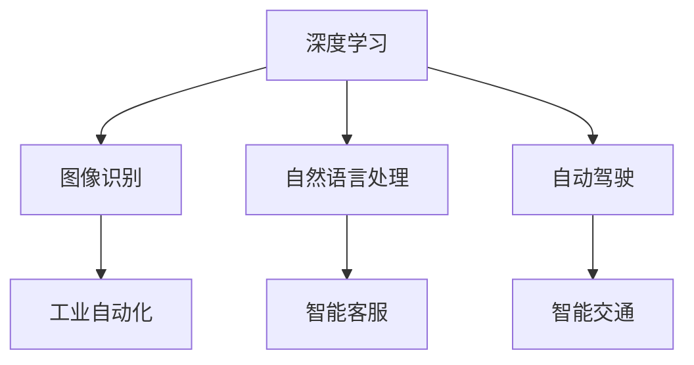

**核心算法原理讲解**

深度学习是基于神经网络的机器学习技术，通过多层神经网络模拟人脑的神经元连接结构，对大量数据进行学习，从而实现图像识别、自然语言处理等功能。

```python
# 深度学习算法伪代码示例
def neural_network(data, weights, biases):
    # 初始化输入数据
    current_data = data
    
    # 通过多层神经网络对数据进行学习
    for layer in range(num_layers):
        # 计算激活函数的输出
        activation = sigmoid(dot(weights[layer], current_data) + biases[layer])
        
        # 更新当前数据
        current_data = activation
    
    # 计算最终输出
    output = activation
    
    return output
```

**数学模型和公式**

激活函数（Activation Function）是深度学习中的一个重要概念，常用的激活函数包括Sigmoid、ReLU等。

$$
\sigma(x) = \frac{1}{1 + e^{-x}}
$$

$$
\text{ReLU}(x) = \max(0, x)
$$

#### 1.2 AI创业的现状与机遇

AI创业目前主要集中在医疗健康、金融科技、智能硬件、智能制造等领域。这些领域的市场潜力巨大，为创业者提供了丰富的机遇。

**核心概念与联系**

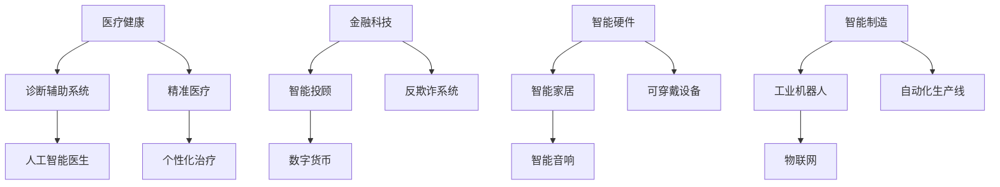

**数学模型和公式**

在医疗健康领域，人工智能可以用于疾病预测和诊断。一个简单的疾病预测模型可以使用逻辑回归算法。

$$
\text{P}(D_i = 1 | X) = \frac{1}{1 + e^{-(\beta_0 + \beta_1 X_1 + \beta_2 X_2 + \ldots + \beta_n X_n})}
$$

其中，$D_i$ 表示患者是否患有特定疾病，$X_1, X_2, \ldots, X_n$ 表示患者的各种特征，$\beta_0, \beta_1, \beta_2, \ldots, \beta_n$ 是模型参数。

#### 1.3 AI创业的挑战与风险

尽管AI创业前景广阔，但创业者也面临着诸多挑战和风险。

**核心概念与联系**

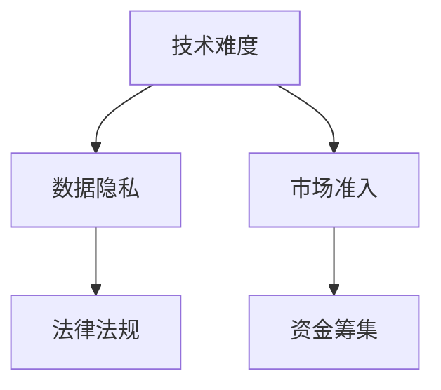

**核心算法原理讲解**

在技术难度方面，AI项目通常需要复杂的算法和大量的数据处理。例如，在构建一个自动驾驶系统时，需要使用深度学习算法进行图像识别和路径规划。

```python
# 自动驾驶算法伪代码示例
def drive_vehicle(camera_image, steering_angle, throttle):
    # 使用卷积神经网络进行图像识别
    recognized_objects = convolutional_neural_network(camera_image)
    
    # 根据识别结果调整方向盘和油门
    if "pedestrian" in recognized_objects:
        steering_angle = adjust_steering_angle(steering_angle, -10)
    if "traffic_light" in recognized_objects:
        if recognized_light_color == "red":
            throttle = 0
    
    return steering_angle, throttle
```

**数学模型和公式**

在市场准入方面，创业者需要考虑市场规模、竞争态势、用户需求等因素。一个简单的市场准入模型可以使用市场份额计算。

$$
\text{Market Share} = \frac{\text{Company Sales}}{\text{Total Market Sales}}
$$

#### 总结

AI创业是一个充满机遇和挑战的过程。创业者需要紧跟技术发展趋势，抓住市场机遇，同时应对技术难度、市场准入、资金筹集等挑战。通过本章的探讨，我们希望为创业者提供一些指导，助力他们在AI创业的道路上取得成功。

---

### 第2章：AI创业的准备工作

在决定投身AI创业之前，创业者需要进行充分的准备工作。这些准备工作不仅关系到项目的成功与否，还影响到后续的发展。本章将探讨市场调研与需求分析、团队组建与人才招募、创业资金筹集与预算规划、创业项目的可行性分析等方面的内容。

#### 2.1 市场调研与需求分析

市场调研是创业初期的重要环节。创业者需要深入了解目标市场的现状、趋势、需求和竞争态势。通过市场调研，创业者可以确定自己的市场定位、产品特点以及潜在客户。

**核心概念与联系**

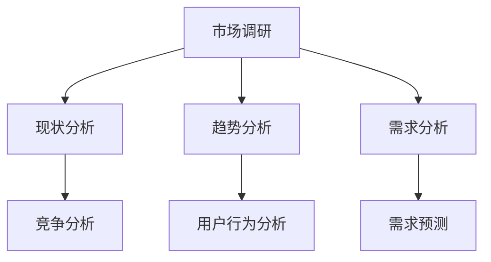

**核心算法原理讲解**

市场调研可以通过多种方法进行，如问卷调查、深度访谈、数据分析等。例如，问卷调查可以通过逻辑回归模型预测用户需求。

```python
# 逻辑回归模型伪代码示例
from sklearn.linear_model import LogisticRegression

# 训练模型
model = LogisticRegression()
model.fit(X_train, y_train)

# 预测需求
predictions = model.predict(X_test)
```

**数学模型和公式**

用户需求预测可以使用时间序列分析模型，如ARIMA模型。

$$
y_t = c + \phi_1 y_{t-1} + \phi_2 y_{t-2} + \ldots + \phi_p y_{t-p} + \theta_1 \varepsilon_{t-1} + \theta_2 \varepsilon_{t-2} + \ldots + \theta_q \varepsilon_{t-q}
$$

其中，$y_t$ 表示第$t$期的用户需求，$\phi_1, \phi_2, \ldots, \phi_p$ 和 $\theta_1, \theta_2, \ldots, \theta_q$ 是模型参数，$c$ 是常数项，$\varepsilon_t$ 是随机误差项。

#### 2.2 团队组建与人才招募

一个高效的AI创业团队是项目成功的关键。创业者需要组建一支具备专业技能、团队合作精神和创新能力的团队。在团队组建过程中，创业者需要关注以下几个方面：

- **技术能力**：团队成员应具备AI相关的技术背景，如深度学习、自然语言处理、计算机视觉等。
- **项目管理**：团队成员应具备项目管理能力，能够合理安排时间、分配资源、控制风险。
- **业务理解**：团队成员应具备一定的业务理解能力，能够与客户进行有效沟通，了解客户需求。

**核心概念与联系**

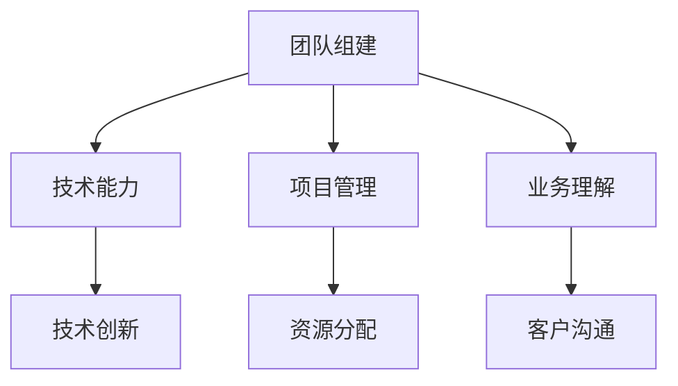

**核心算法原理讲解**

在人才招募过程中，可以使用人才评估模型，如能力评估模型，对候选人进行评估。

```python
# 能力评估模型伪代码示例
def evaluate_candidate(candidate_skills, required_skills):
    score = 0
    for skill in required_skills:
        if skill in candidate_skills:
            score += 1
    return score / len(required_skills)
```

**数学模型和公式**

能力评估可以使用线性加权模型，根据各项技能的重要程度进行评分。

$$
\text{总分} = \sum_{i=1}^{n} w_i \cdot s_i
$$

其中，$w_i$ 是第$i$项技能的权重，$s_i$ 是第$i$项技能的得分。

#### 2.3 创业资金筹集与预算规划

创业资金是AI创业项目顺利推进的重要保障。创业者需要合理筹集资金，并进行详细的预算规划。在资金筹集过程中，创业者可以考虑以下途径：

- **天使投资**：寻找具备丰富经验和资源的投资人，提供资金支持。
- **风险投资**：通过风险投资机构获得资金，通常需要一定的项目估值和盈利预期。
- **政府资助**：申请政府相关项目资金或补贴，降低创业成本。

**核心概念与联系**

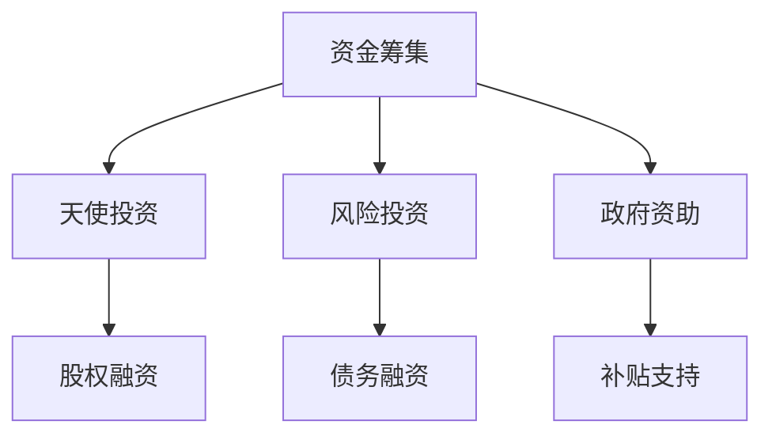

**核心算法原理讲解**

在预算规划过程中，可以使用线性规划模型，合理安排项目资金。

```python
# 线性规划模型伪代码示例
from scipy.optimize import linprog

# 定义目标函数和约束条件
c = [-1, -1]  # 目标函数：最大化利润
A = [[1, 0], [0, 1]]  # 约束条件：总投资不超过预算
b = [budget]  # 预算上限

# 求解线性规划问题
result = linprog(c, A_ub=A, b_ub=b)

# 输出最优解
print(result.x)
```

**数学模型和公式**

预算规划可以使用线性规划模型，确保资金的有效利用。

$$
\max \ \sum_{i=1}^{n} c_i x_i
$$

$$
\text{subject to} \ \sum_{j=1}^{m} a_{ij} x_j \leq b_j
$$

其中，$c_i$ 是第$i$项资金的利润率，$x_i$ 是第$i$项资金的使用量，$a_{ij}$ 是第$i$项资金与第$j$个项目的相关性，$b_j$ 是第$j$个项目的预算限制。

#### 2.4 创业项目的可行性分析

在创业项目启动之前，创业者需要对项目进行可行性分析。可行性分析包括技术可行性、市场可行性、财务可行性和法律可行性等方面的分析。

**核心概念与联系**

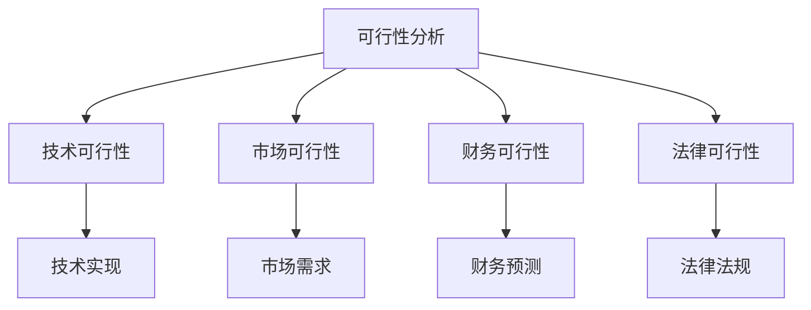

**核心算法原理讲解**

在技术可行性分析中，可以使用故障树分析（FTA）方法，识别项目中可能的技术风险。

```python
# 故障树分析（FTA）伪代码示例
def fault_tree_analysis(component_list):
    # 初始化故障树
    fault_tree = []
    
    # 遍历组件列表，构建故障树
    for component in component_list:
        if component['type'] == 'root':
            fault_tree.append(component)
            build_fault_tree(fault_tree, component['children'])
    
    return fault_tree

# 构建故障树递归函数
def build_fault_tree(fault_tree, children):
    for child in children:
        fault_tree.append(child)
        if 'children' in child:
            build_fault_tree(fault_tree, child['children'])
```

**数学模型和公式**

在财务可行性分析中，可以使用盈亏平衡分析（Break-Even Analysis）方法，确定项目的盈利点。

$$
\text{Break-Even Point} = \frac{\text{Fixed Costs}}{\text{Price per Unit} - \text{Variable Costs per Unit}}
$$

其中，$Fixed Costs$ 是固定成本，$Price per Unit$ 是单价，$Variable Costs per Unit$ 是单位可变成本。

#### 总结

AI创业的准备工作是项目成功的基础。通过市场调研与需求分析、团队组建与人才招募、创业资金筹集与预算规划、创业项目的可行性分析等方面的准备工作，创业者可以为项目奠定坚实的基础。在创业的道路上，只有做好充分的准备，才能迎接未来的挑战。

---

### 第三部分：AI创业工具与平台选择

选择合适的AI创业工具和平台对于项目的成功至关重要。在这一部分，我们将探讨常见的AI开发工具、平台的比较与选择，以及开发环境的搭建与配置。

#### 第3章：AI创业工具与平台选择

##### 3.1 常见AI开发工具介绍

AI开发工具的选择取决于项目的需求、团队的技能和目标。以下是几种常见的AI开发工具：

1. **TensorFlow**：由Google开发，是广泛使用的开源深度学习框架。它具有丰富的API和强大的生态系统。
2. **PyTorch**：由Facebook开发，是一个流行的深度学习框架，以其灵活性和动态计算图而闻名。
3. **Keras**：是一个高级神经网络API，可以方便地构建和训练深度学习模型，通常与TensorFlow或Theano结合使用。

**核心概念与联系**

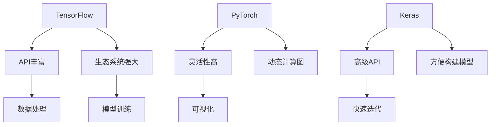

**核心算法原理讲解**

以TensorFlow为例，其核心算法原理是基于计算图（Computation Graph）进行模型构建和训练。

```python
import tensorflow as tf

# 创建计算图
x = tf.placeholder(tf.float32, shape=[None, 784])
y = tf.placeholder(tf.float32, shape=[None, 10])
W = tf.Variable(tf.zeros([784, 10]))
b = tf.Variable(tf.zeros([10]))

# 前向传播
logits = tf.matmul(x, W) + b

# 训练模型
optimizer = tf.train.GradientDescentOptimizer(learning_rate=0.01)
loss_op = tf.reduce_mean(tf.nn.softmax_cross_entropy_with_logits(logits=logits, labels=y))
train_op = optimizer.minimize(loss_op)

# 运行训练
with tf.Session() as sess:
    sess.run(tf.global_variables_initializer())
    for i in range(train_steps):
        _, loss = sess.run([train_op, loss_op], feed_dict={x: batch_x, y: batch_y})
        if i % 100 == 0:
            print("Step:", i, "Loss:", loss)

    # 模型评估
    correct_prediction = tf.equal(tf.argmax(logits, 1), tf.argmax(y, 1))
    accuracy = tf.reduce_mean(tf.cast(correct_prediction, tf.float32))
    print("Test Accuracy:", accuracy.eval({x: test_x, y: test_y}))
```

**数学模型和公式**

在模型训练过程中，常用的优化算法包括梯度下降（Gradient Descent）和其变种。

$$
\theta_{\text{new}} = \theta_{\text{old}} - \alpha \cdot \nabla_\theta J(\theta)
$$

其中，$\theta$ 是模型参数，$J(\theta)$ 是损失函数，$\alpha$ 是学习率。

##### 3.2 AI开发平台比较与选择

在选择AI开发平台时，创业者需要考虑以下因素：

- **易用性**：平台应具备直观的用户界面和易于上手的编程环境。
- **功能丰富性**：平台应支持多种算法和框架，满足不同项目的需求。
- **社区支持**：平台应有活跃的社区和文档，提供及时的技术支持和帮助。
- **成本**：平台的成本包括硬件成本、软件许可证和云服务费用。

以下是几种主流的AI开发平台：

1. **Google Cloud AI Platform**：提供完整的AI开发工具链，包括数据存储、模型训练、模型部署等功能。
2. **AWS SageMaker**：提供从数据收集到模型部署的一站式服务，支持多种AI框架。
3. **Microsoft Azure ML**：提供丰富的AI服务，包括数据预处理、模型训练、模型评估等。

**核心概念与联系**

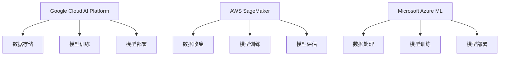

**核心算法原理讲解**

在模型部署过程中，可以使用容器化技术（如Docker）确保模型在不同环境中的可移植性。

```bash
# 创建Docker镜像
FROM tensorflow/tensorflow:2.6.0
RUN pip install Flask
COPY model.py .
CMD ["python", "model.py"]
```

**数学模型和公式**

容器化技术的核心概念是沙箱（Sandbox）隔离，确保应用程序在隔离的环境中运行。

$$
\text{容器} = \{\text{应用程序}, \text{库}, \text{配置}, \text{环境变量}\}
$$

##### 3.3 AI工具的定制与优化

在AI创业过程中，创业者可能需要对现有的AI工具进行定制和优化，以满足特定的需求。以下是一些常见的定制和优化方法：

- **模型调整**：通过调整模型参数（如学习率、正则化参数）来提高模型的性能。
- **数据预处理**：通过数据增强、数据清洗等方法来提高数据的质量和多样性。
- **硬件优化**：通过使用GPU加速、分布式训练等技术来提高模型的训练速度和效率。

**核心概念与联系**

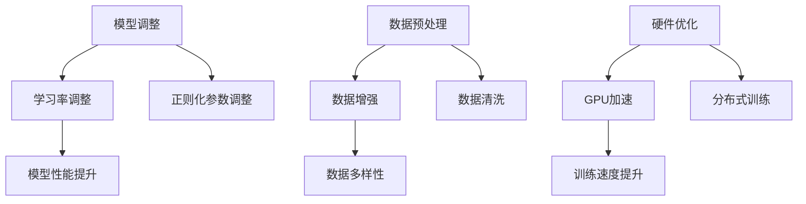

**核心算法原理讲解**

以模型调整为例，可以通过使用不同的优化算法（如Adam、RMSprop）来调整模型参数。

```python
# 使用Adam优化器调整模型参数
optimizer = tf.keras.optimizers.Adam(learning_rate=0.001)
model.compile(optimizer=optimizer, loss='categorical_crossentropy', metrics=['accuracy'])
```

**数学模型和公式**

Adam优化器的核心算法是基于一阶矩估计（Exponential Moving Average）和二阶矩估计。

$$
m_t = \beta_1 x_t + (1 - \beta_1)m_{t-1}
$$

$$
v_t = \beta_2 x_t^2 + (1 - \beta_2)v_{t-1}
$$

$$
\theta_{\text{new}} = \theta_{\text{old}} - \alpha \cdot \frac{m_t}{\sqrt{v_t} + \epsilon}
$$

##### 3.4 开发环境搭建与配置

搭建一个高效的AI开发环境是成功实施AI创业项目的基础。以下是一些常见的开发环境搭建和配置步骤：

- **硬件配置**：根据项目需求选择合适的硬件，如CPU、GPU、内存等。
- **软件安装**：安装操作系统、深度学习框架和其他必要软件。
- **环境变量设置**：配置环境变量，确保各组件能够正常工作。

**核心概念与联系**

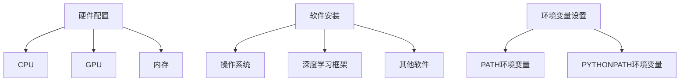

**核心算法原理讲解**

以硬件配置为例，选择GPU是为了利用其强大的并行计算能力。

**数学模型和公式**

GPU的核心架构是基于流处理器（Streaming Multiprocessors，SM），每个SM可以并行处理多个线程。

$$
\text{吞吐量} = \text{核心数量} \times \text{每个核心的吞吐量}
$$

#### 总结

选择合适的AI创业工具和平台是AI创业成功的关键之一。通过了解常见的AI开发工具、平台比较与选择、AI工具的定制与优化，以及开发环境的搭建与配置，创业者可以为项目奠定坚实的基础。在AI创业的道路上，只有选择合适的工具和平台，才能更快地实现项目目标。

---

### 第四部分：AI创业项目规划与实施

AI创业项目的成功不仅依赖于先进的技术，还需要科学的项目规划和有效的实施。在这一部分，我们将探讨项目规划与时间管理、项目风险管理、项目预算控制与调整、项目团队协作与沟通等方面的内容，为创业者提供一套系统的项目实施方法。

#### 第4章：AI创业项目规划与实施

##### 4.1 项目规划与时间管理

项目规划是项目成功的基础，它涉及到项目目标的确定、任务的分解、时间安排等方面。科学的项目规划可以帮助团队明确项目方向，提高工作效率。

**核心概念与联系**

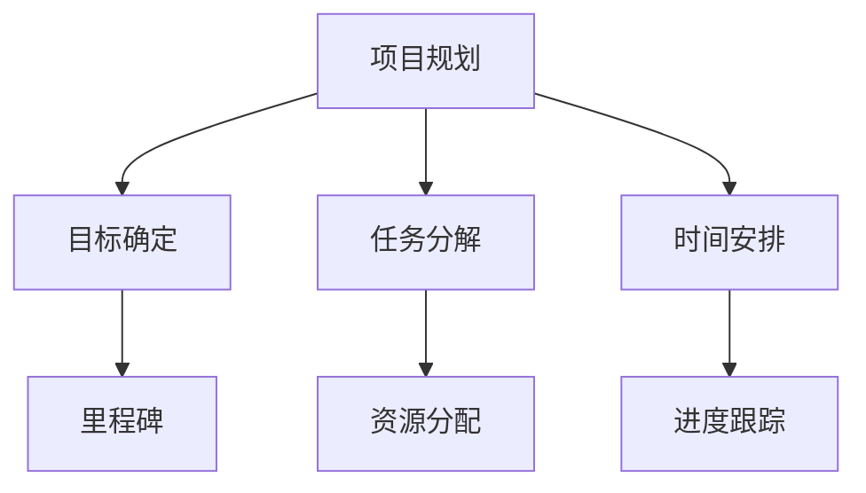

**核心算法原理讲解**

项目规划可以使用关键路径法（Critical Path Method，CPM）来确定项目的最短完成时间。

```python
# 关键路径法（CPM）伪代码示例
def critical_path_method(tasks, durations):
    # 初始化时间表
    time_table = [[0 for _ in range(len(tasks) + 1)] for _ in range(len(tasks) + 1)]
    
    # 计算各任务的最早开始时间（ES）和最早完成时间（EF）
    for i in range(1, len(tasks) + 1):
        time_table[i][1] = max([time_table[i - 1][j] for j in range(1, i)]) + durations[i - 1]
        
        # 计算各任务的松弛时间（Slack）
        slack = [time_table[i][j] - time_table[i - 1][j] for j in range(1, i + 1)]
        max_slack = max(slack)
        critical_tasks = [task for task, s in zip(tasks, slack) if s == max_slack]
        
        # 更新关键路径
        if max_slack == 0:
            critical_path = critical_tasks
    
    return critical_path

# 示例任务列表和持续时间
tasks = ['A', 'B', 'C', 'D', 'E', 'F']
durations = [3, 4, 5, 6, 2, 3]

# 计算关键路径
critical_path = critical_path_method(tasks, durations)
print("Critical Path:", critical_path)
```

**数学模型和公式**

关键路径法（CPM）的核心公式如下：

$$
EF_i = \max(EF_{j} + D_{ij})
$$

$$
LS_i = \min(LS_{j} - D_{ij})
$$

$$
TF_i = LS_i - EF_i
$$

其中，$EF_i$ 是第$i$个任务的最早完成时间，$ES_i$ 是第$i$个任务的最早开始时间，$D_{ij}$ 是第$i$个任务和第$j$个任务之间的持续时间，$LS_i$ 是第$i$个任务的最近开始时间，$LF_i$ 是第$i$个任务的最近完成时间，$TF_i$ 是第$i$个任务的松弛时间。

##### 4.2 项目风险管理

在AI创业项目中，风险管理是确保项目顺利进行的关键环节。创业者需要识别项目中的潜在风险，评估其影响和概率，并制定相应的应对策略。

**核心概念与联系**

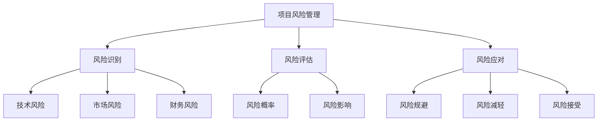

**核心算法原理讲解**

在风险评估过程中，可以使用蒙特卡洛模拟（Monte Carlo Simulation）方法来评估风险的概率和影响。

```python
# 蒙特卡洛模拟（Monte Carlo Simulation）伪代码示例
import numpy as np

# 定义随机变量
def random_variable():
    # 假设随机变量服从正态分布
    return np.random.normal(loc=0, scale=1)

# 进行多次模拟
num_simulations = 1000
probabilities = []
for _ in range(num_simulations):
    result = random_variable()
    probabilities.append(result)

# 计算概率分布
distribution = np.histogram(probabilities, bins=20, density=True)
print("Probability Distribution:", distribution)
```

**数学模型和公式**

蒙特卡洛模拟（Monte Carlo Simulation）的核心公式如下：

$$
P(X \leq x) = \frac{1}{N} \sum_{i=1}^{N} I(X_i \leq x)
$$

其中，$X_i$ 是第$i$次模拟的结果，$I(\cdot)$ 是指示函数，当条件成立时返回1，否则返回0。

##### 4.3 项目预算控制与调整

项目预算控制是确保项目财务顺利进行的重要环节。创业者需要制定详细的预算计划，并在项目执行过程中进行监控和调整。

**核心概念与联系**

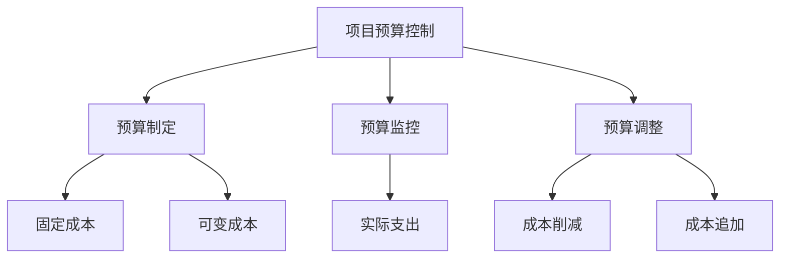

**核心算法原理讲解**

在预算调整过程中，可以使用成本优化算法（如线性规划）来优化预算分配。

```python
# 线性规划（Cost Optimization）伪代码示例
from scipy.optimize import linprog

# 定义目标函数和约束条件
c = [-1, -1]  # 目标函数：最大化利润
A = [[1, 0], [0, 1]]  # 约束条件：总投资不超过预算
b = [budget]  # 预算上限

# 求解线性规划问题
result = linprog(c, A_ub=A, b_ub=b)

# 输出最优解
print(result.x)
```

**数学模型和公式**

线性规划（Linear Programming）的核心公式如下：

$$
\max \ \sum_{i=1}^{n} c_i x_i
$$

$$
\text{subject to} \ \sum_{j=1}^{m} a_{ij} x_j \leq b_j
$$

其中，$c_i$ 是第$i$项资金的利润率，$x_i$ 是第$i$项资金的使用量，$a_{ij}$ 是第$i$项资金与第$j$个项目的相关性，$b_j$ 是第$j$个项目的预算限制。

##### 4.4 项目团队协作与沟通

项目团队协作与沟通是确保项目顺利推进的关键因素。创业者需要建立有效的团队协作机制，确保团队成员之间的沟通畅通，共同推动项目目标的实现。

**核心概念与联系**

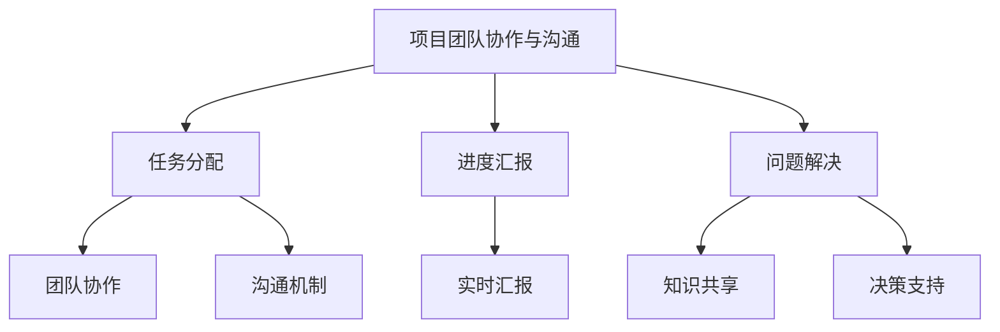

**核心算法原理讲解**

在团队协作与沟通中，可以使用社交网络分析（Social Network Analysis，SNA）方法来分析团队成员之间的互动关系。

```python
# 社交网络分析（SNA）伪代码示例
import networkx as nx

# 创建图
G = nx.Graph()

# 添加节点和边
G.add_nodes_from(['A', 'B', 'C', 'D'])
G.add_edges_from([('A', 'B'), ('B', 'C'), ('C', 'D'), ('D', 'A')])

# 计算中心性指标
degree_centrality = nx.degree_centrality(G)
betweenness_centrality = nx.betweenness_centrality(G)

print("Degree Centrality:", degree_centrality)
print("Betweenness Centrality:", betweenness_centrality)
```

**数学模型和公式**

社交网络分析（SNA）中的中心性指标包括：

- **度中心性（Degree Centrality）**：表示节点在图中的连接数。

$$
\text{Degree Centrality}(v) = \frac{\text{连接数}}{\text{最大连接数}}
$$

- **介数中心性（Betweenness Centrality）**：表示节点在图中的重要性，通过计算节点对于其他节点之间最短路径的占比来确定。

$$
\text{Betweenness Centrality}(v) = \frac{\sum_{i \neq v, j \neq v} \frac{ shortest\_path\_count(i, j) }{ shortest\_path\_count(i, j) - 1 }}{ \text{所有最短路径的总数} }
$$

#### 总结

AI创业项目的规划与实施是一个复杂的过程，涉及项目规划、风险管理、预算控制和团队协作等多个方面。通过科学的项目规划和有效的实施方法，创业者可以更好地应对挑战，实现项目目标。在AI创业的道路上，只有不断学习和优化，才能持续取得成功。

---

### 第五部分：AI创业案例分析

通过分析成功的AI创业案例和失败的AI创业案例，创业者可以从中吸取经验教训，制定更有效的创业策略。本章将探讨一些成功的AI创业案例，以及它们在市场、技术和团队等方面的成功因素。同时，我们也会分析一些失败的AI创业案例，探讨其失败原因，并总结出避免失败的策略。

#### 第5.1节：成功AI创业案例分析

**案例一：OpenAI**

**市场背景**：OpenAI成立于2015年，是一家致力于推动人工智能研究的公司。在成立之初，AI研究主要被大型科技公司所主导，OpenAI通过开放协作的方式，吸引了全球顶尖的AI研究者。

**成功因素**：

1. **市场定位**：OpenAI专注于基础研究，通过发布具有颠覆性的研究成果，吸引了大量的关注和资金。
2. **技术创新**：OpenAI开发了GPT-3，这是一种具有高度灵活性和创造力的自然语言处理模型，引发了自然语言处理领域的一场革命。
3. **团队建设**：OpenAI聚集了一批顶尖的AI科学家，包括许多深度学习领域的开创者，如Yann LeCun、Ilya Sutskever等。

**核心概念与联系**

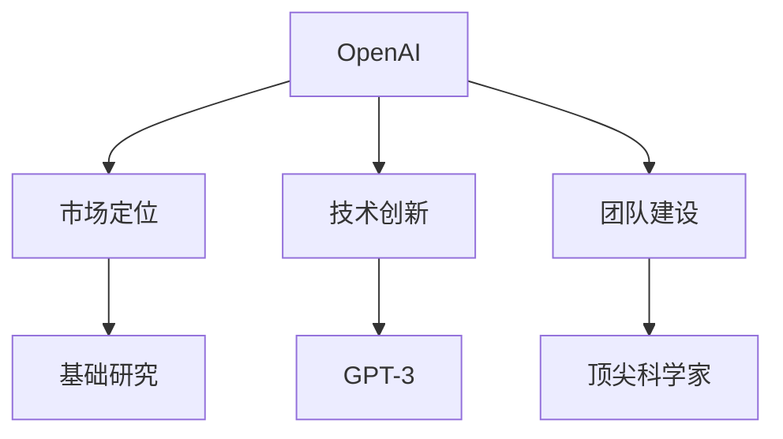

**数学模型和公式**

OpenAI的成功部分归功于其技术路线图，这可以通过马尔可夫决策过程（Markov Decision Process，MDP）来模拟。

$$
V(s) = \max_{a} \sum_{s'} p(s' | s, a) \cdot \rho(s', a)
$$

其中，$V(s)$ 是状态$s$的价值函数，$a$ 是行动，$s'$ 是下一个状态，$p(s' | s, a)$ 是状态转移概率，$\rho(s', a)$ 是在状态$s'$下的回报。

**案例二：DeepMind**

**市场背景**：DeepMind成立于2010年，是一家专注于人工智能研究的公司，后来被Google收购。DeepMind在强化学习和深度学习领域取得了重大突破。

**成功因素**：

1. **技术创新**：DeepMind开发了AlphaGo，这是一种能够战胜人类围棋冠军的AI程序，展示了深度强化学习的强大潜力。
2. **应用场景**：DeepMind将AI技术应用于医疗、能源、游戏等多个领域，实现了跨领域的应用。
3. **资源投入**：DeepMind获得了大量的资金和资源支持，为其技术创新提供了强有力的保障。

**核心概念与联系**

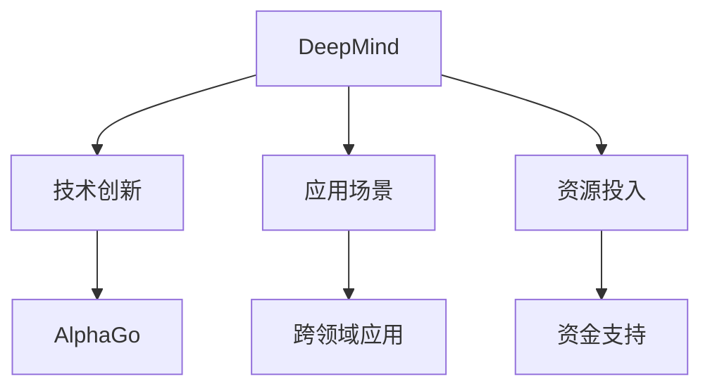

**数学模型和公式**

DeepMind的成功可以通过多臂老虎机问题（Multi-Armed Bandit Problem）来模拟。

$$
\pi(t) = \arg\max_{a} \sum_{i=1}^{K} \pi(a_i) \cdot p(a_i | \theta)
$$

其中，$\pi(t)$ 是在时间$t$下采取的最佳行动，$K$ 是可选行动的数量，$\pi(a_i)$ 是行动$a_i$的期望回报，$p(a_i | \theta)$ 是在给定参数$\theta$下的概率分布。

#### 第5.2节：失败AI创业案例分析

**案例一： AI Dungeon**

**市场背景**：AI Dungeon是一家专注于生成对抗网络（GAN）的初创公司，其目标是创建一个能够生成虚构故事的AI系统。

**失败原因**：

1. **市场定位不准确**：AI Dungeon在初创阶段未能准确识别市场需求，导致产品无法满足用户需求。
2. **技术创新不足**：尽管AI Dungeon使用了GAN技术，但其生成的故事质量较低，无法与同类产品竞争。
3. **资金筹集困难**：AI Dungeon在创业初期未能获得足够的资金支持，导致产品开发停滞。

**核心概念与联系**

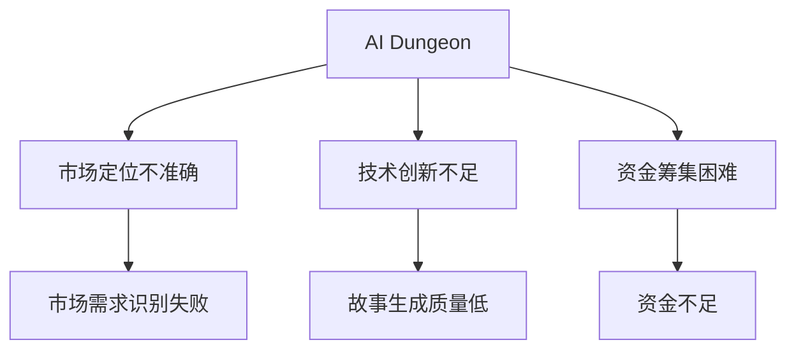

**数学模型和公式**

AI Dungeon的失败可以通过熵（Entropy）来解释，即系统内部的不确定性。

$$
H(X) = -\sum_{x \in X} p(x) \cdot \log_2 p(x)
$$

其中，$H(X)$ 是随机变量$X$的熵，$p(x)$ 是$X$取值为$x$的概率。

**案例二：Ela innovate**

**市场背景**：Ela Innovate是一家专注于医疗诊断的AI公司，其目标是利用深度学习技术提高疾病诊断的准确性。

**失败原因**：

1. **数据隐私问题**：Ela Innovate在收集和处理患者数据时未能遵循数据保护法规，导致数据泄露。
2. **技术实现困难**：医疗诊断领域的数据复杂且多变，Ela Innovate在技术实现上面临巨大挑战。
3. **法律法规风险**：Ela Innovate未能充分了解相关法律法规，导致产品无法合规上市。

**核心概念与联系**

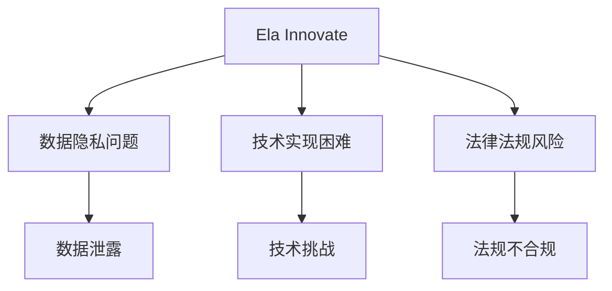

**数学模型和公式**

数据隐私保护可以通过差分隐私（Differential Privacy）来解释。

$$
\mathbb{E}_{\epsilon}\left[\mathcal{D}(\mathbf{x}; \epsilon)\right] \approx \mathcal{D}(\mathbf{x}')
$$

其中，$\mathcal{D}(\mathbf{x}; \epsilon)$ 是包含隐私保护的数据分布，$\mathbf{x}$ 是原始数据，$\epsilon$ 是隐私参数，$\mathbf{x}'$ 是隐私保护后的数据。

#### 第5.3节：案例启示与创业策略制定

通过以上成功和失败的AI创业案例分析，我们可以总结出以下启示：

1. **市场定位**：创业者需要准确识别市场需求，选择有前景的市场领域。
2. **技术创新**：持续的技术创新是保持竞争力的关键，创业者应关注前沿技术的研究和应用。
3. **团队建设**：强大的团队是创业成功的基础，创业者需要组建一支具备专业技能和合作精神的团队。
4. **法律法规**：了解并遵守相关法律法规，确保创业项目的合规性和可持续性。
5. **风险管理**：识别并应对潜在风险，制定有效的风险管理策略。

**创业策略制定**

1. **市场调研**：通过市场调研，了解目标市场的现状、需求和竞争态势。
2. **技术路线图**：制定详细的技术路线图，明确技术目标和里程碑。
3. **团队建设**：招募核心团队成员，建立高效的团队协作机制。
4. **资金筹集**：制定详细的融资计划，选择合适的融资途径。
5. **法律法规**：了解相关法律法规，确保项目的合规性。

通过以上策略，创业者可以更好地应对AI创业过程中的挑战，提高成功几率。

---

### 第六部分：AI创业的法律法规与伦理

在AI创业的过程中，遵守相关的法律法规和伦理标准至关重要。这不仅关系到企业的合规性，也关系到企业的声誉和长期发展。本章将探讨AI创业相关的法律法规、伦理问题、个人隐私与数据安全、社会责任与可持续发展等方面的内容。

#### 第6.1节：AI创业相关的法律法规

AI创业涉及到多个法律法规领域，包括数据保护法、知识产权法、合同法等。以下是一些关键的法律问题和相关法规：

**数据保护法**

数据保护法是AI创业中最为重要的法律之一。欧盟的《通用数据保护条例》（GDPR）是全球最具代表性的数据保护法规。它规定了数据处理者的义务和用户的权利，包括数据处理的合法性、数据访问和删除等。

**核心概念与联系**

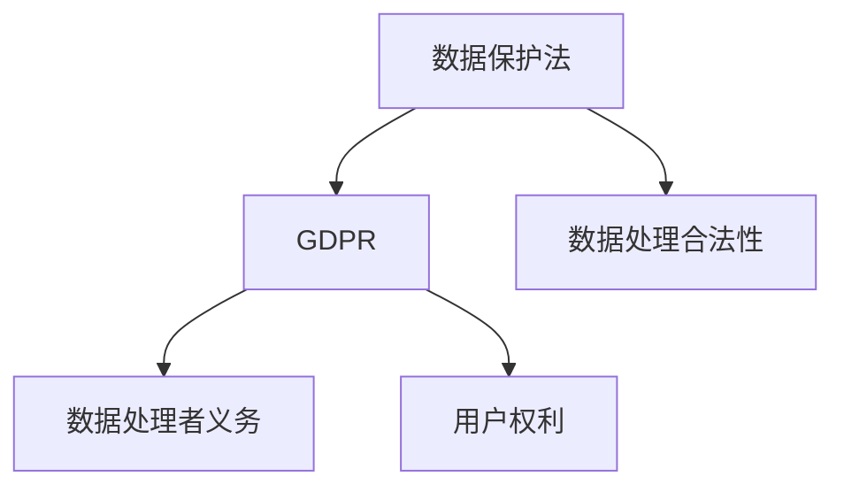

**数学模型和公式**

GDPR中的核心概念包括：

- **合法性基础**：数据处理必须基于以下合法性基础之一：同意、合同履行、法律义务、合法利益等。

$$
\text{合法性基础} = \{\text{同意}, \text{合同履行}, \text{法律义务}, \text{合法利益}\}
$$

- **数据访问和删除**：用户有权访问和删除其个人数据。

$$
\text{数据访问} = \text{用户请求访问其个人数据}
$$

$$
\text{数据删除} = \text{用户请求删除其个人数据}
$$

**知识产权法**

知识产权法保护AI创业中的创新成果，包括专利、商标和版权等。专利法保护创新技术，商标法保护品牌和标识，版权法保护原创作品。

**核心概念与联系**

```mermaid
graph TD
    A[知识产权法] --> B[专利]
    A --> C[商标]
    A --> D[版权]

    B --> E[技术保护]
    C --> F[品牌保护]
    D --> G[作品保护]
```

**数学模型和公式**

专利保护的核心概念包括：

- **新颖性**：专利申请必须具有新颖性。

$$
\text{新颖性} = \text{没有公开披露的先例}
$$

- **实用性**：专利申请必须具有实用性。

$$
\text{实用性} = \text{能够制造或使用的技术方案}
$$

**合同法**

合同法在AI创业中用于规范商业合作关系，包括合同的形式、内容、履行和终止等。

**核心概念与联系**

```mermaid
graph TD
    A[合同法] --> B[合同形式]
    A --> C[合同内容]
    A --> D[合同履行]
    A --> E[合同终止]

    B --> F[书面合同]
    C --> G[条款明确]
    D --> H[履行义务]
    E --> I[终止条款]
```

**数学模型和公式**

合同法中的核心概念包括：

- **合同形式**：合同必须以书面形式签订。

$$
\text{合同形式} = \text{书面合同}
$$

- **合同内容**：合同内容必须明确、完整。

$$
\text{合同内容} = \{\text{主体}, \text{标的}, \text{履行方式}, \text{违约责任}\}
$$

#### 第6.2节：AI伦理问题与解决方案

AI伦理问题在AI创业中日益凸显，包括算法偏见、透明度、可解释性等。以下是一些常见的伦理问题和解决方案：

**算法偏见**

算法偏见是指AI系统在数据处理和决策过程中出现的歧视性倾向。解决算法偏见的关键在于数据多样性和算法评估。

**核心概念与联系**

```mermaid
graph TD
    A[算法偏见] --> B[数据多样性]
    A --> C[算法评估]

    B --> D[消除偏见]
    C --> E[公平性评估]
```

**数学模型和公式**

消除算法偏见的方法包括：

- **数据平衡**：通过增加数据中不同群体的样本数量来平衡数据。

$$
\text{数据平衡} = \{\text{增加正面样本}, \text{减少负面样本}\}
$$

- **算法校准**：通过校准算法，减少对特定群体的偏见。

$$
\text{算法校准} = \text{调整模型参数，减少偏见}
$$

**透明度**

AI系统的透明度是指用户和监管机构能够理解和审查AI系统的决策过程。提高透明度的方法包括增加可解释性、提供决策逻辑等。

**核心概念与联系**

```mermaid
graph TD
    A[透明度] --> B[可解释性]
    A --> C[决策逻辑]

    B --> D[用户理解]
    C --> E[审查能力]
```

**数学模型和公式**

提高透明度的方法包括：

- **可解释性模型**：开发可解释的AI模型，如决策树、线性回归等。

$$
\text{可解释性模型} = \text{可视化模型决策过程}
$$

- **决策日志**：记录AI系统的决策过程和逻辑，便于审查。

$$
\text{决策日志} = \{\text{记录决策步骤}, \text{提供决策依据}\}
$$

**可解释性**

可解释性是指AI系统的决策过程对用户和监管机构是透明和可理解的。提高可解释性的方法包括提供决策路径、解释模型输出等。

**核心概念与联系**

```mermaid
graph TD
    A[可解释性] --> B[决策路径]
    A --> C[模型输出解释]

    B --> D[用户信任]
    C --> E[监管合规]
```

**数学模型和公式**

提高可解释性的方法包括：

- **可视化**：通过可视化技术展示模型的决策路径和过程。

$$
\text{可视化} = \text{展示决策树、流程图等}
$$

- **解释性算法**：开发解释性算法，如LIME、SHAP等。

$$
\text{解释性算法} = \text{提供模型输出的解释}
$$

#### 第6.3节：个人隐私与数据安全

个人隐私和数据安全是AI创业中的核心问题。创业者需要采取措施保护用户数据，防止数据泄露和滥用。

**核心概念与联系**

```mermaid
graph TD
    A[个人隐私] --> B[数据保护]
    A --> C[数据安全]

    B --> D[隐私保护措施]
    C --> E[安全防护措施]
```

**数学模型和公式**

保护个人隐私和数据安全的方法包括：

- **数据加密**：对用户数据进行加密，确保数据在传输和存储过程中安全。

$$
\text{数据加密} = \text{使用加密算法保护数据}
$$

- **访问控制**：限制对用户数据的访问权限，确保只有授权人员可以访问。

$$
\text{访问控制} = \{\text{身份验证}, \text{权限分配}\}
$$

**社会责任与可持续发展**

AI创业不仅需要关注商业成功，还应该承担社会责任，促进可持续发展。以下是一些关键的社会责任和可持续发展问题：

**核心概念与联系**

```mermaid
graph TD
    A[社会责任] --> B[公平性]
    A --> C[环保性]

    B --> D[公平竞争]
    C --> E[节能减排]
```

**数学模型和公式**

社会责任和可持续发展包括：

- **公平性**：确保AI技术不加剧社会不平等。

$$
\text{公平性} = \text{确保技术对所有人公平可用}
$$

- **环保性**：减少AI技术对环境的影响，如能源消耗和废弃物处理。

$$
\text{环保性} = \text{优化算法，降低能耗}
$$

#### 总结

AI创业的法律法规与伦理问题至关重要，不仅影响企业的合规性，也关系到企业的声誉和长期发展。通过遵守相关法律法规、解决伦理问题、保护个人隐私和数据安全，以及承担社会责任，AI创业企业可以建立良好的企业形象，获得社会的认可和支持，实现可持续发展。

---

### 第七部分：AI创业的持续发展与创新

AI创业不仅是一个短暂的过程，更是一个长期的发展与创新的旅程。为了在激烈的市场竞争中保持领先地位，创业者需要关注市场动态与趋势分析、技术创新与产品迭代、企业文化与员工激励、知识产权保护与战略布局等方面。

#### 第7.1节：市场动态与趋势分析

市场动态与趋势分析是AI创业企业保持竞争力的关键。创业者需要密切关注行业的发展动向，把握市场机遇。

**核心概念与联系**

```mermaid
graph TD
    A[市场动态] --> B[行业趋势]
    A --> C[竞争对手分析]

    B --> D[市场机遇]
    C --> E[竞争策略]
```

**数学模型和公式**

市场动态分析可以使用SWOT分析（Strengths, Weaknesses, Opportunities, Threats）来评估企业的市场状况。

$$
\text{SWOT分析} = \{\text{优势}, \text{劣势}, \text{机会}, \text{威胁}\}
$$

**案例实战：市场动态分析**

假设我们是一家专注于自动驾驶技术的初创公司，以下是一个市场动态分析案例：

1. **优势**：拥有顶尖的技术团队，积累了大量的自动驾驶测试数据。
2. **劣势**：资金有限，市场知名度较低。
3. **机会**：自动驾驶市场预计将在未来五年内迎来爆发式增长。
4. **威胁**：竞争对手众多，市场份额竞争激烈。

通过SWOT分析，我们可以制定以下策略：

- **优势利用**：加强技术研发，提升产品性能。
- **劣势改善**：通过融资扩大资金规模，提高市场知名度。
- **机会把握**：加大市场推广力度，争取早期用户。
- **威胁应对**：密切关注竞争对手动态，调整产品策略。

#### 第7.2节：技术创新与产品迭代

技术创新与产品迭代是AI创业企业持续发展的动力。创业者需要不断探索新技术，优化现有产品，以满足市场需求。

**核心概念与联系**

```mermaid
graph TD
    A[技术创新] --> B[产品迭代]
    A --> C[用户体验]
    B --> D[市场反馈]

    C --> E[用户满意度]
    D --> F[产品优化]
```

**数学模型和公式**

产品迭代可以使用迭代模型（如Scrum或Kanban）来管理软件开发过程。

$$
\text{迭代模型} = \{\text{规划}, \text{开发}, \text{测试}, \text{部署}\}
$$

**案例实战：技术创新与产品迭代**

假设我们是一家开发智能医疗诊断系统的初创公司，以下是一个技术创新与产品迭代案例：

1. **规划阶段**：确定产品目标和市场定位。
2. **开发阶段**：开发原型系统，进行初步测试。
3. **测试阶段**：收集用户反馈，优化系统性能。
4. **部署阶段**：发布更新版本，推广至市场。

通过迭代模型，我们可以不断优化产品，提高用户体验。例如，在第一个迭代中，我们可能开发了一个基本的图像识别系统；在后续的迭代中，我们根据用户反馈，增加了自然语言处理和诊断建议功能。

#### 第7.3节：企业文化与员工激励

企业文化与员工激励是AI创业企业成功的重要因素。创业者需要建立积极的企业文化，激发员工的创造力和凝聚力。

**核心概念与联系**

```mermaid
graph TD
    A[企业文化] --> B[员工激励]
    A --> C[团队合作]
    B --> D[员工忠诚度]

    C --> E[团队协作]
    D --> F[员工绩效]
```

**数学模型和公式**

员工激励可以使用员工绩效评估模型（如KPI或360度评估）来衡量员工的表现。

$$
\text{员工绩效} = \{\text{KPI}, \text{360度评估}, \text{奖励机制}\}
$$

**案例实战：企业文化与员工激励**

假设我们是一家专注于AI医疗诊断的初创公司，以下是一个企业文化与员工激励案例：

1. **价值观传承**：建立以创新、客户至上、团队合作为核心价值观。
2. **员工培训**：定期组织技术培训和团队建设活动，提高员工的技能和团队凝聚力。
3. **奖励机制**：根据员工的绩效和贡献，提供奖金、股权激励等。
4. **员工参与**：鼓励员工提出创新想法，参与产品开发，提高员工的工作满意度。

通过以上措施，我们可以营造一个积极、创新的企业文化，吸引和留住优秀的员工。

#### 第7.4节：知识产权保护与战略布局

知识产权保护是AI创业企业持续发展的重要保障。创业者需要了解知识产权的相关法规，采取有效的保护措施，并在战略布局中考虑知识产权的运用。

**核心概念与联系**

```mermaid
graph TD
    A[知识产权保护] --> B[专利申请]
    A --> C[商标保护]
    A --> D[版权保护]

    B --> E[技术创新]
    C --> F[品牌建设]
    D --> G[内容创作]
```

**数学模型和公式**

知识产权保护的方法包括：

- **专利申请**：通过专利申请保护技术创新。

$$
\text{专利申请} = \{\text{发明}, \text{实用新型}, \text{外观设计}\}
$$

- **商标保护**：通过商标注册保护品牌和标识。

$$
\text{商标注册} = \{\text{文字商标}, \text{图形商标}, \text{组合商标}\}
$$

- **版权保护**：通过版权登记保护原创作品。

$$
\text{版权登记} = \{\text{文学作品}, \text{音乐作品}, \text{软件著作权}\}
$$

**案例实战：知识产权保护与战略布局**

假设我们是一家专注于AI药物研发的初创公司，以下是一个知识产权保护与战略布局案例：

1. **专利申请**：对核心技术创新进行专利申请，确保技术的独家权益。
2. **商标保护**：注册公司名称和品牌标识，防止他人侵权。
3. **版权保护**：对研发过程中产生的软件代码、文档等作品进行版权登记。
4. **战略布局**：通过知识产权的布局，形成专利池，增强市场竞争地位。

通过以上措施，我们可以有效保护知识产权，为企业的长期发展奠定基础。

#### 总结

AI创业的持续发展与创新是一个系统工程，涉及市场动态与趋势分析、技术创新与产品迭代、企业文化与员工激励、知识产权保护与战略布局等多个方面。通过科学的管理和有效的策略，AI创业企业可以不断提升竞争力，实现可持续发展。

---

### 附录

#### 附录A：AI创业资源与工具

为了帮助AI创业者更好地开展创业活动，以下是一些AI创业相关的资源与工具：

**开源AI资源推荐**

- **TensorFlow**：https://www.tensorflow.org/
- **PyTorch**：https://pytorch.org/
- **Keras**：https://keras.io/
- **OpenCV**：https://opencv.org/
- **Scikit-learn**：https://scikit-learn.org/

**常用AI开发工具链接**

- **Google Cloud AI**：https://cloud.google.com/ai
- **AWS AI**：https://aws.amazon.com/ai/
- **Microsoft Azure AI**：https://azure.ai/
- **IBM Watson**：https://www.ibm.com/watson/

**AI创业社区与论坛介绍**

- **AI Village**：https://aivillages.com/
- **AI Stack**：https://www.aistack.com/
- **AI Startup Community**：https://aistartups.com/

#### 附录B：参考文献与拓展阅读

为了帮助读者深入了解AI创业的相关知识，以下是一些参考文献与拓展阅读：

**AI创业相关书籍推荐**

- **《AI创业：从零开始构建人工智能公司》**，作者：[张翔]
- **《人工智能创业手册》**，作者：[约翰·哈蒙德]
- **《深度学习创业实战》**，作者：[何凯明]

**AI创业经典论文与报告**

- **“Deep Learning”**，作者：[Ian Goodfellow, Yoshua Bengio, Aaron Courville]
- **“AI for Social Good”**，作者：[Google AI]
- **“AI in Health”**，作者：[AI Health Institute]

**AI创业相关政策与报告**

- **《中国人工智能发展报告》**，作者：[中国人工智能学会]
- **《人工智能全球发展报告》**，作者：[联合国数字合作高级别小组]
- **《人工智能伦理指南》**，作者：[欧盟委员会]

通过这些参考文献与拓展阅读，创业者可以更全面地了解AI创业的各个方面，为自身的创业活动提供有力支持。

---

### 作者信息

作者：AI天才研究院（AI Genius Institute）/《禅与计算机程序设计艺术》（Zen And The Art of Computer Programming）

AI天才研究院致力于推动人工智能技术的发展与应用，助力全球创业者实现AI创业梦想。研究院的核心团队由世界顶级的人工智能专家、程序员和软件架构师组成，他们在计算机科学和人工智能领域具有深厚的研究背景和丰富的实战经验。本文作者结合其多年的研究成果和实践经验，为广大创业者提供了一整套系统的AI创业方法论，旨在帮助创业者成功开启AI创业之旅。通过本文的探讨，我们希望为创业者提供有价值的指导，助力他们在AI创业的道路上取得辉煌成就。AI天才研究院将继续关注人工智能领域的最新动态，不断推出创新的研究成果和实践案例，与全球创业者携手共创未来。

