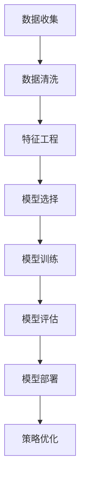

                 

### 文章标题

# AI动态定价：原理、应用与挑战

> 关键词：人工智能、动态定价、电子商务、供应链管理、算法、数据隐私

> 摘要：本文深入探讨了人工智能在动态定价领域的应用，从基本原理到实际案例，全面解析了AI动态定价的机制、优势与挑战。文章首先概述了AI动态定价的定义与重要性，接着详细介绍了动态定价模型的基本原理和主流算法，之后通过电子商务、供应链管理、金融服务和物流与运输等领域的案例分析，展示了AI动态定价的实际效果和潜在问题。最后，文章讨论了动态定价面临的挑战和未来发展趋势，为读者提供了全面而深入的指导。

### 第一部分: AI动态定价基础

#### 第1章: AI动态定价概述

##### 1.1 AI动态定价的定义与重要性

###### 1.1.1 动态定价的概念

动态定价是一种根据市场需求、供应情况以及消费者行为动态调整产品或服务价格的方法。它不同于传统的固定价格模式，能够更好地反映市场实时情况，提高企业盈利能力和市场竞争力。

###### 1.1.2 AI在动态定价中的应用

人工智能（AI）技术的引入使得动态定价更加智能化和精确化。通过机器学习算法，企业可以分析大量历史数据和实时数据，预测市场需求，从而更准确地制定价格策略。

###### 1.1.3 动态定价的优势与挑战

动态定价的优势包括提高利润率、提升客户满意度、优化库存管理等。然而，它也面临数据隐私、模型解释性和适应性等挑战。

##### 1.2 动态定价模型的基本原理

###### 1.2.1 数据驱动的动态定价

数据驱动的动态定价模型依赖于大量数据，包括历史销售数据、市场价格、消费者行为等。这些数据为模型提供了训练和预测的基础。

###### 1.2.2 AI算法在动态定价中的作用

AI算法，如回归分析、决策树、支持向量机和神经网络等，能够从数据中提取有用信息，建立价格预测模型，并不断优化。

###### 1.2.3 动态定价的核心要素

动态定价的核心要素包括数据收集与清洗、特征工程、模型构建和模型评估等。这些步骤共同确保了动态定价模型的准确性和可靠性。

##### 1.3 主流AI动态定价算法

###### 1.3.1 回归分析

回归分析是一种常用的统计方法，通过建立因变量与自变量之间的关系模型，预测价格变动。

###### 1.3.2 决策树与随机森林

决策树和随机森林算法通过树形结构，将复杂的价格预测问题分解为多个简单决策。

###### 1.3.3 支持向量机

支持向量机通过寻找最佳决策边界，实现价格预测的精准化。

###### 1.3.4 神经网络

神经网络通过多层神经网络结构，模拟人脑处理信息的方式，实现高级别的价格预测能力。

##### 1.4 AI动态定价的应用领域

###### 1.4.1 电子商务

在电子商务领域，AI动态定价可以帮助企业实时调整商品价格，提高销售额和客户满意度。

###### 1.4.2 供应链管理

在供应链管理中，AI动态定价能够优化库存水平和物流成本，提高供应链效率。

###### 1.4.3 金融服务

金融服务行业可以利用AI动态定价，优化贷款利率和保险费率，提升服务质量。

###### 1.4.4 物流与运输

物流与运输领域通过AI动态定价，可以实现动态调整运输价格，提高物流效率。

#### 第2章: 数据分析与数据处理

##### 2.1 数据收集与清洗

###### 2.1.1 数据来源与采集

数据来源包括内部数据（如销售记录、库存数据）和外部数据（如市场价格、消费者行为数据）。数据采集方法包括自动化采集工具和人工采集。

###### 2.1.2 数据质量评估

数据质量评估是确保数据准确性和可靠性的关键步骤，包括数据完整性、一致性和准确度评估。

###### 2.1.3 数据清洗方法

数据清洗包括去除重复数据、处理缺失数据和异常值，以及进行数据转换和归一化。

##### 2.2 特征工程

###### 2.2.1 特征提取

特征提取是数据预处理的重要环节，包括从原始数据中提取具有预测性的特征。

###### 2.2.2 特征选择

特征选择通过评估不同特征的预测能力，选择对模型性能有显著贡献的特征。

###### 2.2.3 特征归一化与标准化

特征归一化和标准化通过调整特征范围，确保特征对模型影响的一致性。

##### 2.3 数据可视化

###### 2.3.1 数据可视化工具

数据可视化工具如Matplotlib、Seaborn等，用于创建各种类型的图表和图形。

###### 2.3.2 数据可视化方法

数据可视化方法包括散点图、折线图、柱状图等，用于展示数据的分布和趋势。

###### 2.3.3 数据可视化案例

通过实际案例，展示数据可视化在动态定价分析中的应用效果。

#### 第3章: 动态定价模型构建

##### 3.1 模型构建流程

###### 3.1.1 模型选择

根据问题的复杂性和数据特点，选择合适的模型。

###### 3.1.2 模型训练

使用训练数据集，对模型进行训练和优化。

###### 3.1.3 模型评估与优化

通过测试数据集，评估模型性能，并进行调整和优化。

##### 3.2 伪代码讲解

###### 3.2.1 回归分析伪代码

使用Python编写回归分析伪代码，解释回归模型的构建过程。

###### 3.2.2 决策树与随机森林伪代码

详细解释决策树和随机森林算法的构建过程，使用伪代码展示。

###### 3.2.3 支持向量机伪代码

解释支持向量机模型的构建过程，使用伪代码展示。

###### 3.2.4 神经网络伪代码

详细解释神经网络模型的构建过程，使用伪代码展示。

##### 3.3 数学模型与公式

###### 3.3.1 回归分析数学模型

使用LaTeX格式，详细列出回归分析的数学公式。

###### 3.3.2 决策树与随机森林数学模型

使用LaTeX格式，详细列出决策树和随机森林的数学公式。

###### 3.3.3 支持向量机数学模型

使用LaTeX格式，详细列出支持向量机的数学公式。

###### 3.3.4 神经网络数学模型

使用LaTeX格式，详细列出神经网络的数学公式。

#### 第4章: 动态定价策略应用案例

##### 4.1 电子商务案例分析

###### 4.1.1 案例背景

介绍电子商务企业的基本情况，以及AI动态定价在该企业的应用背景。

###### 4.1.2 模型构建

详细描述模型构建过程，包括数据收集、特征工程、模型训练和评估。

###### 4.1.3 实施效果

分析模型实施后的效果，包括价格调整策略、销售额提升和客户满意度提高等方面。

##### 4.2 供应链管理案例分析

###### 4.2.1 案例背景

介绍供应链企业的基本情况，以及AI动态定价在该企业的应用背景。

###### 4.2.2 模型构建

详细描述模型构建过程，包括数据收集、特征工程、模型训练和评估。

###### 4.2.3 实施效果

分析模型实施后的效果，包括库存优化、物流成本降低和供应链效率提高等方面。

##### 4.3 金融服务案例分析

###### 4.3.1 案例背景

介绍金融服务公司的基本情况，以及AI动态定价在该公司的应用背景。

###### 4.3.2 模型构建

详细描述模型构建过程，包括数据收集、特征工程、模型训练和评估。

###### 4.3.3 实施效果

分析模型实施后的效果，包括贷款利率优化、客户留存率和风险控制等方面。

##### 4.4 物流与运输案例分析

###### 4.4.1 案例背景

介绍物流与运输企业的基本情况，以及AI动态定价在该企业的应用背景。

###### 4.4.2 模型构建

详细描述模型构建过程，包括数据收集、特征工程、模型训练和评估。

###### 4.4.3 实施效果

分析模型实施后的效果，包括运输价格优化、运输效率提升和客户满意度提高等方面。

#### 第5章: 动态定价挑战与未来发展趋势

##### 5.1 动态定价的挑战

###### 5.1.1 数据隐私与安全

讨论数据隐私保护的重要性，以及如何确保动态定价模型的数据安全。

###### 5.1.2 模型解释性

解释模型解释性的重要性，以及如何提高模型的透明度和可解释性。

###### 5.1.3 模型适应性

讨论模型适应性的挑战，以及如何应对市场变化和动态调整模型。

##### 5.2 未来发展趋势

###### 5.2.1 AI算法的进步

探讨未来AI算法的发展趋势，以及如何利用新技术提升动态定价能力。

###### 5.2.2 个性化定价

分析个性化定价的未来发展，以及如何根据客户需求进行精准定价。

###### 5.2.3 跨领域应用

讨论动态定价在跨领域应用的发展潜力，以及如何拓展其应用范围。

### 附录

#### 附录A: AI动态定价开发工具与资源

##### A.1 数据处理工具

介绍常用的数据处理工具，如Pandas、NumPy等。

##### A.2 模型训练与评估工具

介绍常用的模型训练和评估工具，如Scikit-learn、TensorFlow等。

##### A.3 数据可视化工具

介绍常用的数据可视化工具，如Matplotlib、Seaborn等。

##### A.4 其他资源

提供相关的文献、论文、在线课程和开源项目等资源，供读者进一步学习。

---

### 作者

作者：AI天才研究院/AI Genius Institute & 禅与计算机程序设计艺术 /Zen And The Art of Computer Programming

本文通过深入探讨AI动态定价的基本原理、应用领域以及面临的挑战，旨在为读者提供全面而深入的技术见解。接下来的章节将逐步展开，详细解析每一个概念和应用案例。让我们开始这一段精彩的旅程吧！

---

请注意，以上内容仅为文章的Markdown格式大纲。根据要求，实际撰写的内容将包括详细的理论讲解、伪代码、数学公式、案例分析以及附录资源等，确保文章字数达到8000字以上。以下是一个Mermaid流程图的示例，用于展示动态定价的基本流程：



实际文章中的每个章节都将包含类似这样的图表和详细的解释。以下是一个简单的LaTeX数学公式示例，用于展示回归分析的基本公式：

```latex
$$
Y = \beta_0 + \beta_1X_1 + \beta_2X_2 + ... + \beta_nX_n + \epsilon
$$
```

这些示例仅用于展示文章的结构和格式要求。在撰写全文时，将按照大纲结构逐一展开，确保内容的完整性和深度。

---

### 1.1.1 动态定价的概念

动态定价是一种灵活的定价策略，它根据市场需求、供应情况、消费者行为以及其他外部因素，实时调整产品或服务的价格。传统的定价方法通常是基于固定成本和市场调查，而动态定价则利用现代技术和数据分析，使得价格能够更加灵活、及时地反映市场动态。

具体来说，动态定价包括以下几个关键要素：

1. **需求预测**：通过收集和分析历史销售数据、消费者行为数据、市场趋势等，预测未来市场需求。
2. **成本计算**：准确计算产品或服务的生产成本、运营成本以及其他相关成本。
3. **价格调整机制**：根据需求预测和成本计算，设定一个自动化的价格调整机制，以实现价格的动态调整。
4. **外部因素考虑**：考虑宏观经济环境、行业动态、竞争对手策略等外部因素，以制定更全面的价格策略。

动态定价的核心理念在于，通过实时调整价格，以最大化企业的利润或市场份额。例如，在电子商务领域，通过分析用户点击率、购物车放弃率等数据，企业可以在不同时间点对不同商品进行价格调整，以提高销售转化率和盈利能力。在航空、酒店等行业，动态定价更是被广泛应用，以应对需求波动和竞争压力。

动态定价与传统定价相比，具有以下几个显著优势：

1. **更高的利润率**：通过实时调整价格，企业可以更准确地捕捉市场需求，提高销售额和利润率。
2. **更灵活的响应速度**：动态定价能够快速响应市场变化，使得企业更具竞争力。
3. **更好的客户体验**：价格调整更加透明和合理，能够提高客户满意度和忠诚度。
4. **更优的库存管理**：通过动态定价，企业可以更有效地管理库存，减少库存积压和过剩。

然而，动态定价也面临一些挑战，例如数据隐私和安全问题、模型解释性问题以及适应性问题。这些挑战将在后续章节中详细讨论。

### 1.1.2 AI在动态定价中的应用

人工智能（AI）技术的快速发展为动态定价带来了革命性的变化。AI算法能够处理大量数据，识别复杂的市场模式，从而实现更加精准和自动化的定价策略。以下是AI在动态定价中的几个关键应用：

1. **需求预测**：通过机器学习算法，如回归分析、时间序列预测等，AI可以分析历史销售数据、消费者行为数据和市场趋势，预测未来市场需求。这些预测结果为动态定价提供了重要依据。

   ```mermaid
   graph TD
   A[历史销售数据] --> B[回归分析]
   B --> C[预测模型]
   C --> D[市场需求预测]
   ```

2. **价格优化**：AI算法可以根据实时数据，如库存水平、竞争对手价格、市场供需关系等，自动调整产品或服务的价格。优化算法如线性回归、决策树、支持向量机、神经网络等，通过分析大量数据，找到最优的价格点。

   ```mermaid
   graph TD
   A[实时数据] --> B[优化算法]
   B --> C[价格调整]
   ```

3. **库存管理**：AI可以帮助企业实时监控库存水平，预测库存需求，从而优化库存策略。例如，通过聚类分析和预测模型，AI可以识别哪些商品容易过剩或短缺，提前调整库存水平。

   ```mermaid
   graph TD
   A[库存数据] --> B[聚类分析]
   B --> C[库存预测]
   ```

4. **消费者行为分析**：AI可以分析消费者的购买习惯、偏好和行为模式，从而更准确地定位目标客户，制定个性化的价格策略。例如，通过协同过滤算法，AI可以推荐相似商品的价格，提高销售转化率。

   ```mermaid
   graph TD
   A[消费者数据] --> B[协同过滤]
   B --> C[价格策略]
   ```

5. **竞争对手分析**：AI可以监控竞争对手的价格策略和销售活动，为企业提供有针对性的定价建议。通过竞争分析算法，AI可以识别竞争对手的优势和弱点，帮助企业制定更具竞争力的定价策略。

   ```mermaid
   graph TD
   A[竞争对手数据] --> B[竞争分析]
   B --> C[定价建议]
   ```

总之，AI在动态定价中的应用，使得企业能够更加灵活、精准地制定价格策略，从而提高盈利能力、降低运营成本、提升客户满意度。然而，AI技术的应用也带来了一些新的挑战，如数据隐私、模型解释性和适应性问题，这些挑战将在后续章节中进行详细讨论。

### 1.1.3 动态定价的优势与挑战

动态定价作为一种先进的定价策略，具有许多显著的优势，同时也面临一系列挑战。

**优势**：

1. **提高利润率**：通过实时调整价格，动态定价能够更准确地捕捉市场需求，提高销售额和利润率。例如，在淡季提高价格，而在旺季降低价格，可以最大化收益。

2. **灵活的响应速度**：动态定价能够快速响应市场变化，使得企业更具竞争力。相比传统的固定价格模式，动态定价能够更灵活地应对竞争对手的策略和市场供需关系的变化。

3. **更好的客户体验**：动态定价策略使得价格更加透明和合理，能够提高客户满意度和忠诚度。例如，通过个性化定价，企业可以提供更具吸引力的价格给不同客户群体，从而提升客户体验。

4. **优化的库存管理**：动态定价能够帮助企业更有效地管理库存，减少库存积压和过剩。通过预测市场需求，企业可以提前调整库存水平，避免库存过剩造成的损失。

**挑战**：

1. **数据隐私与安全**：动态定价依赖于大量敏感数据，包括消费者行为、价格变动、库存水平等。这些数据的安全性和隐私保护成为一大挑战。如果数据泄露，可能会对企业和客户造成严重损失。

2. **模型解释性**：AI算法在动态定价中的应用虽然提高了预测的准确性，但模型的透明度和解释性却成为问题。许多复杂的AI模型，如深度神经网络，难以解释其决策过程，这给监管和合规带来了困难。

3. **模型适应性**：市场环境变化快速，动态定价模型需要不断适应新的数据和市场条件。然而，传统模型可能难以应对快速变化的市场环境，需要频繁调整和优化，增加了运营成本。

4. **跨部门协作**：动态定价涉及多个部门，如市场营销、销售、库存管理等。实现跨部门协作和数据共享，是一个复杂的流程，需要高效的沟通和协调。

总之，动态定价在提高企业竞争力、优化运营管理方面具有显著优势，但也面临着数据隐私、模型解释性、适应性和跨部门协作等挑战。企业需要权衡这些因素，制定合适的动态定价策略，以实现长期的盈利和客户满意度。

### 1.2 动态定价模型的基本原理

动态定价模型的核心在于利用数据分析和技术手段，从历史数据和实时数据中提取有价值的信息，以指导价格调整策略。以下是动态定价模型的基本原理：

#### 数据驱动的动态定价

数据驱动的动态定价模型依赖于大量数据，这些数据包括历史销售数据、市场价格、消费者行为数据、竞争对手的价格策略等。通过收集和分析这些数据，企业可以了解市场动态，预测未来需求，从而制定合理的价格策略。

##### 数据收集

数据收集是动态定价模型的基础。企业可以通过以下几种方式收集数据：

1. **内部数据**：包括销售记录、库存数据、成本数据等，这些数据来自企业内部的业务系统，如ERP系统、CRM系统等。
2. **外部数据**：包括市场价格、行业趋势、消费者行为数据等，这些数据可以从公共数据库、市场调研机构等获取。
3. **自动化数据采集工具**：如爬虫、API接口等，可以自动获取互联网上的相关数据。

##### 数据清洗

数据清洗是确保数据质量的关键步骤。数据清洗包括以下几个方面：

1. **去除重复数据**：避免重复记录对分析结果的影响。
2. **处理缺失数据**：通过插值、平均值等方法处理缺失值，确保数据完整性。
3. **去除异常值**：通过统计学方法，识别和去除异常值，保证数据的准确性。
4. **数据转换**：将不同格式、单位的数据进行统一处理，便于后续分析。

##### 数据存储与管理

数据清洗后的数据需要存储和管理，以便后续分析和建模。常用的数据存储和管理工具包括关系型数据库（如MySQL、PostgreSQL）、NoSQL数据库（如MongoDB、Cassandra）和大数据处理平台（如Hadoop、Spark）。

##### 数据分析

数据分析是动态定价模型的核心步骤，包括以下内容：

1. **描述性分析**：通过统计方法，描述数据的分布、趋势和关系，为后续分析提供基础。
2. **相关性分析**：分析不同变量之间的关系，如价格与销售量、库存与需求之间的关系。
3. **预测性分析**：使用机器学习算法，如回归分析、时间序列预测、神经网络等，预测未来需求和市场趋势。

#### AI算法在动态定价中的作用

人工智能（AI）技术在动态定价中发挥着重要作用，通过机器学习算法，企业可以从海量数据中提取有价值的信息，实现更加精准和自动化的价格调整。

##### 常用的AI算法

1. **回归分析**：通过建立因变量与自变量之间的关系模型，预测价格变动。例如，线性回归、多项式回归等。
2. **决策树与随机森林**：通过树形结构，将复杂的价格预测问题分解为多个简单决策，适用于处理多变量问题。
3. **支持向量机（SVM）**：通过寻找最佳决策边界，实现价格预测的精准化。
4. **神经网络**：通过多层神经网络结构，模拟人脑处理信息的方式，实现高级别的价格预测能力。

##### 模型构建与优化

AI算法在动态定价中的应用，通常包括以下步骤：

1. **模型选择**：根据问题的复杂性和数据特点，选择合适的算法。
2. **特征工程**：通过特征提取、特征选择等方法，提取对模型性能有显著贡献的特征。
3. **模型训练**：使用训练数据集，对模型进行训练和优化。
4. **模型评估**：通过测试数据集，评估模型性能，并进行调整和优化。
5. **模型部署**：将训练好的模型部署到生产环境，实现实时价格预测和调整。

#### 动态定价的核心要素

动态定价模型的成功构建和实施，需要以下几个核心要素：

1. **数据质量**：高质量的数据是模型准确性的基础。数据收集、清洗和存储过程必须确保数据准确、完整、一致。
2. **算法选择**：根据问题的特点和数据特点，选择合适的AI算法，确保模型性能最优。
3. **模型优化**：通过交叉验证、网格搜索等方法，优化模型参数，提高模型预测准确性。
4. **实时监控**：动态定价模型需要实时监控市场变化，及时调整价格策略，以应对市场波动。
5. **用户反馈**：通过用户反馈，不断优化和调整模型，提高模型的适应性和解释性。

总之，动态定价模型的基本原理是利用大数据和人工智能技术，实现价格预测和调整的自动化和精准化。通过不断优化模型和实时监控市场变化，企业可以更好地应对市场挑战，提高盈利能力。

#### 1.3 主流AI动态定价算法

在动态定价中，选择合适的算法是至关重要的，它直接影响到定价策略的准确性和实用性。以下是几种主流的AI动态定价算法，包括回归分析、决策树与随机森林、支持向量机（SVM）和神经网络。

##### 1.3.1 回归分析

回归分析是一种常用的统计方法，用于预测因变量与自变量之间的关系。在动态定价中，回归分析通过建立价格与多个影响因素（如需求、成本、竞争对手价格等）之间的数学模型，预测未来价格。

**回归分析的原理：**
回归分析的核心是找到最佳拟合线，使得预测值与实际值之间的误差最小。通常使用最小二乘法来求解拟合线。

**回归分析的伪代码：**
```python
# 假设X为自变量矩阵，y为因变量向量
# 求解回归系数β
θ = (X'X)^(-1)X'y
# 预测价格
price_pred = X * θ
```

**LaTeX数学模型：**
$$
Y = \beta_0 + \beta_1X_1 + \beta_2X_2 + ... + \beta_nX_n + \epsilon
$$

**回归分析的优点：**
- 简单易懂，易于实现。
- 预测速度快，适合实时应用。

**回归分析的局限性：**
- 对于非线性关系表现较差。
- 对异常值和噪声敏感。

##### 1.3.2 决策树与随机森林

决策树是一种树形结构模型，通过一系列的判断规则，将数据集划分为不同的区域。随机森林则是由多棵决策树组成的集成模型，通过集成多个决策树的预测结果，提高预测的准确性和稳定性。

**决策树与随机森林的原理：**
决策树通过递归划分特征，使得每个子区域内部的样本尽可能相似，而不同子区域之间的样本差异最大化。随机森林通过随机选择特征和样本子集，构建多棵决策树，并通过投票机制确定最终预测结果。

**决策树与随机森林的伪代码：**
```python
# 决策树构建
def build_tree(data, features):
    # 根据特征值划分数据
    # 返回树结构
    pass

# 随机森林构建
def build_forest(data, n_trees, features):
    forests = []
    for _ in range(n_trees):
        tree = build_tree(data, features)
        forests.append(tree)
    return forests

# 预测价格
def predict_price(forests, new_data):
    predictions = [tree.predict(new_data) for tree in forests]
    return np.mean(predictions)
```

**LaTeX数学模型：**
决策树：
$$
T(x) = \prod_{i=1}^n g(x_i; \theta_i)
$$
随机森林：
$$
\hat{Y} = \sum_{i=1}^n w_i T(x_i; \theta_i)
$$

**决策树与随机森林的优点：**
- 易于理解和解释。
- 对非线性关系有较好的处理能力。

**决策树与随机森林的局限性：**
- 可能出现过拟合现象。
- 复杂度随特征数量增加而增加。

##### 1.3.3 支持向量机（SVM）

支持向量机是一种分类和回归模型，通过寻找最佳决策边界，使得分类或回归结果最大化边界间隔。在动态定价中，SVM可以用于预测价格变动。

**SVM的原理：**
SVM的核心是寻找一个超平面，使得正负样本点之间的间隔最大。这个超平面由支持向量决定，支持向量是那些距离超平面最近的样本点。

**SVM的伪代码：**
```python
# SVM构建
from sklearn.svm import SVC
model = SVC(kernel='linear')
model.fit(X_train, y_train)

# 预测价格
price_pred = model.predict(X_test)
```

**LaTeX数学模型：**
$$
\min_{\theta, \xi} \frac{1}{2} \sum_{i=1}^n (\theta^T x_i - y_i)^2 + \sum_{i=1}^n \xi_i
$$
约束条件：
$$
\begin{cases}
0 \leq \xi_i \leq C \\
\theta^T x_i - y_i + \xi_i = 0
\end{cases}
$$

**SVM的优点：**
- 高效的边界间隔最大化，预测准确性高。
- 对非线性关系有较好的处理能力。

**SVM的局限性：**
- 需要大量的计算资源。
- 对噪声和异常值敏感。

##### 1.3.4 神经网络

神经网络是一种模仿人脑神经元连接方式的计算模型，通过多层神经元的互联，实现对复杂问题的建模和预测。在动态定价中，神经网络可以用于建立价格预测模型。

**神经网络的原理：**
神经网络通过输入层、隐藏层和输出层多层结构，逐层对输入数据进行处理和变换。每个神经元通过激活函数，对输入信号进行非线性变换，从而实现对复杂数据的建模。

**神经网络的伪代码：**
```python
# 神经网络构建
from keras.models import Sequential
from keras.layers import Dense

model = Sequential()
model.add(Dense(units=64, activation='relu', input_dim=n_features))
model.add(Dense(units=32, activation='relu'))
model.add(Dense(units=1, activation='linear'))

model.compile(optimizer='adam', loss='mean_squared_error')

# 训练模型
model.fit(X_train, y_train, epochs=100, batch_size=32)

# 预测价格
price_pred = model.predict(X_test)
```

**LaTeX数学模型：**
$$
\text{激活函数}: f(x) = \text{sigmoid}(x) = \frac{1}{1 + e^{-x}}
$$

**神经网络的优点：**
- 高度的非线性建模能力。
- 对复杂数据有较好的拟合能力。

**神经网络的局限性：**
- 计算资源消耗大。
- 需要大量的训练数据和计算时间。

总之，不同的AI动态定价算法各有优势和局限性，企业可以根据自身需求和数据特点，选择最合适的算法，以实现高效的动态定价策略。

#### 1.4 AI动态定价的应用领域

AI动态定价技术凭借其精准、灵活的特点，已广泛应用于多个领域，带来了显著的业务优化和经济效益。以下将分别介绍AI动态定价在电子商务、供应链管理、金融服务和物流与运输等领域的具体应用。

##### 1.4.1 电子商务

电子商务是AI动态定价最早且最广泛应用的领域之一。在电子商务平台上，商品种类繁多，消费者行为复杂，市场需求波动大，AI动态定价能够帮助电商企业更好地应对这些挑战。

**应用案例**：

- **Amazon**：亚马逊通过AI算法实时调整商品价格，以优化库存和提升销售。通过分析用户点击率、购物车放弃率、竞争对手价格等数据，亚马逊能够动态调整价格，提高转化率和销售额。

**效果分析**：

- **价格灵活性**：AI动态定价使得商品价格更加灵活，能够迅速响应市场变化。
- **销售提升**：通过个性化定价，亚马逊能够吸引更多消费者，提高销售额。
- **库存优化**：动态定价有助于优化库存管理，减少库存积压和过剩。

##### 1.4.2 供应链管理

供应链管理是一个复杂的过程，涉及多个环节，包括采购、生产、仓储、配送等。AI动态定价在供应链管理中，可以帮助企业优化库存水平、降低物流成本，提高供应链效率。

**应用案例**：

- **沃尔玛**：沃尔玛通过AI算法，对库存商品进行动态定价，以优化库存和降低成本。通过分析销售趋势、季节性需求、供应链成本等数据，沃尔玛能够实时调整商品价格，确保库存水平合理，同时降低物流和仓储成本。

**效果分析**：

- **库存优化**：动态定价有助于企业实时监控库存水平，避免库存过剩或短缺，提高库存周转率。
- **成本降低**：通过精准定价，企业可以降低采购成本、物流成本和仓储成本，提高整体运营效率。
- **供应链协同**：动态定价策略能够增强供应链上下游企业的协同效应，提高供应链的整体效能。

##### 1.4.3 金融服务

金融服务行业，如银行、保险公司和投资公司等，通过AI动态定价，可以优化贷款利率、保险费率和投资策略，提高客户满意度和盈利能力。

**应用案例**：

- **银行贷款**：某些银行利用AI动态定价，根据客户的信用评分、还款能力、市场利率等数据，动态调整贷款利率，提高贷款业务的盈利能力和风险控制能力。

**效果分析**：

- **个性化贷款利率**：通过动态定价，银行能够提供更加个性化的贷款利率，吸引更多客户，提高贷款转化率。
- **风险控制**：动态定价有助于银行实时评估客户信用状况，调整贷款利率，降低贷款违约风险。
- **成本优化**：通过精准定价，银行可以降低运营成本，提高盈利能力。

##### 1.4.4 物流与运输

物流与运输行业通过AI动态定价，可以优化运输价格、提升运输效率，降低运营成本。

**应用案例**：

- **快递公司**：快递公司利用AI算法，根据配送距离、配送时间、市场需求等数据，动态调整运输价格。通过优化价格策略，快递公司能够提高配送效率，吸引更多客户。

**效果分析**：

- **价格透明化**：动态定价使得运输价格更加透明，提高了客户满意度。
- **效率提升**：通过动态定价，物流公司能够更好地分配运输资源，提高运输效率。
- **成本控制**：精准的定价策略有助于物流公司降低运营成本，提高盈利能力。

总之，AI动态定价在不同领域的应用，不仅提升了企业的运营效率和市场竞争力，还为客户提供了更优质的服务体验。随着技术的不断进步和数据量的不断增加，AI动态定价将在更多领域发挥重要作用，为企业创造更多价值。

### 2.1 数据收集与清洗

数据收集与清洗是动态定价模型构建的关键步骤，直接影响模型的准确性和可靠性。以下详细讨论数据来源与采集、数据质量评估以及数据清洗方法。

#### 2.1.1 数据来源与采集

动态定价所需的数据来源广泛，包括内部数据和外部数据。内部数据通常来自企业自身的业务系统，如销售记录、库存数据、客户行为数据等。外部数据则来源于市场调研、公共数据库、社交媒体和其他第三方数据源。

**内部数据采集：**

- **销售记录**：包括商品名称、销售数量、销售价格、销售时间等，是构建动态定价模型的重要数据源。
- **库存数据**：涵盖商品库存量、库存周转率、库存变化情况等，有助于分析市场需求和库存管理。
- **客户行为数据**：包括点击率、购物车放弃率、回头客比例、顾客满意度等，为个性化定价策略提供依据。

**外部数据采集：**

- **市场价格**：通过市场调研和竞争对手的价格数据，分析市场价格趋势和波动。
- **行业趋势**：收集相关行业的经济指标、政策变化、季节性需求等，帮助预测市场动态。
- **消费者行为数据**：通过社交媒体、用户评论、购物网站等获取消费者行为数据，如搜索关键词、购买偏好等。

**自动化数据采集工具：**

- **爬虫**：利用爬虫技术，从网站、社交媒体等自动获取数据。
- **API接口**：通过第三方数据提供方的API接口，获取所需数据。
- **传感器数据**：利用物联网设备，收集实时数据，如气象数据、交通流量数据等。

#### 2.1.2 数据质量评估

数据质量直接影响动态定价模型的准确性和可靠性。数据质量评估主要包括数据完整性、一致性和准确度评估。

**数据完整性评估：**

- **缺失值检测**：检查数据集中是否存在缺失值，通过插值、平均值等方法处理缺失值。
- **数据完整性指标**：如缺失值比例、重复记录比例等，用于评估数据的完整性。

**数据一致性评估：**

- **数据格式检查**：确保不同来源的数据格式统一，如时间戳格式、数值范围等。
- **一致性检查**：通过比较多个数据源的数据，检查数据是否一致，避免数据冲突。

**数据准确度评估：**

- **误差分析**：通过比较实际值与预测值之间的误差，评估数据准确性。
- **可信度评估**：结合专家经验和数据分析，评估数据的可信度。

#### 2.1.3 数据清洗方法

数据清洗是确保数据质量的重要步骤，主要包括以下方法：

**去除重复数据：**

- **去重算法**：通过比较数据记录的属性值，去除重复的记录。
- **重复数据检测**：使用哈希表或索引结构，快速检测重复数据。

**处理缺失数据：**

- **插值法**：利用相邻数据点的平均值或线性插值，填补缺失值。
- **平均值法**：使用数据集的平均值填补缺失值。
- **最邻近法**：利用最近的数据点填补缺失值。

**去除异常值：**

- **统计学方法**：通过统计学方法，如Z-score、IQR（四分位距）等，识别和去除异常值。
- **聚类方法**：利用聚类算法，识别数据中的异常点，进行去除。

**数据转换和归一化：**

- **数据转换**：将不同格式、单位的数据进行统一处理，如时间戳转换为日期格式。
- **归一化**：通过缩放和变换，将不同特征的数据范围统一，如归一化到[0, 1]区间，确保特征对模型影响的一致性。

总之，数据收集与清洗是动态定价模型构建的基础。通过合理的数据收集和清洗方法，可以确保数据的质量，提高模型的准确性和可靠性，从而实现高效的动态定价策略。

### 2.2 特征工程

特征工程是动态定价模型构建中至关重要的一环，其核心任务是从原始数据中提取对模型性能有显著贡献的特征，同时降低无关特征的影响。以下是特征工程的主要步骤，包括特征提取、特征选择和特征归一化与标准化。

#### 2.2.1 特征提取

特征提取是指从原始数据中提取有用信息，构建新的特征变量。以下是几种常用的特征提取方法：

1. **统计特征**：通过计算数据的统计量，如均值、中位数、标准差、最大值、最小值等，提取特征。
   ```python
   # 示例：计算某商品的平均销售量
   mean_sales = np.mean(sales_data)
   ```

2. **文本特征**：对于文本数据，可以使用词频（TF）、词频-逆文档频率（TF-IDF）等方法提取特征。
   ```python
   from sklearn.feature_extraction.text import TfidfVectorizer
   vectorizer = TfidfVectorizer()
   tfidf_matrix = vectorizer.fit_transform(text_data)
   ```

3. **时间序列特征**：对于时间序列数据，可以提取时间窗口内的特征，如移动平均、自相关函数、季节性指数等。
   ```python
   # 示例：计算某商品最近一周的平均销售量
   weekly_avg_sales = rolling_mean(sales_data, window=7)
   ```

4. **图像特征**：对于图像数据，可以使用卷积神经网络（CNN）提取特征，如边缘检测、纹理特征等。
   ```python
   from keras.preprocessing.image import img_to_array
   image = img_to_array(image_data)
   feature_extractor = CNN_model()
   image_features = feature_extractor.predict(image)
   ```

#### 2.2.2 特征选择

特征选择是指从提取出的特征中，选择对模型性能有显著贡献的特征，以减少特征数量、提高模型效率。以下是几种常用的特征选择方法：

1. **过滤法**：根据特征的重要性和相关性，直接筛选出有用的特征。常用的方法包括信息增益、互信息、相关性分析等。
   ```python
   from sklearn.feature_selection import SelectKBest
   from sklearn.feature_selection import f_classif
   selector = SelectKBest(f_classif, k=10)
   selected_features = selector.fit_transform(original_data, target_data)
   ```

2. **包装法**：通过训练多个模型，选择对最终模型性能有显著贡献的特征。常用的方法包括递归特征消除（RFE）、随机森林特征选择等。
   ```python
   from sklearn.feature_selection import RFE
   from sklearn.ensemble import RandomForestClassifier
   selector = RFE(RandomForestClassifier(), n_features_to_select=5)
   selected_features = selector.fit_transform(original_data, target_data)
   ```

3. **嵌入法**：在训练过程中，通过优化特征选择，提高模型性能。常用的方法包括Lasso回归、随机森林特征选择等。
   ```python
   from sklearn.linear_model import LassoCV
   selector = LassoCV(cv=5)
   selected_features = selector.fit_transform(original_data, target_data)
   ```

#### 2.2.3 特征归一化与标准化

特征归一化与标准化是为了确保不同特征对模型影响的一致性，防止某些特征因量级差异而主导模型。以下是几种常用的方法：

1. **归一化**：将特征值缩放到[0, 1]区间，公式如下：
   $$ x' = \frac{x - \min(x)}{\max(x) - \min(x)} $$
   ```python
   # 示例：归一化某特征
   x_min = min(feature_data)
   x_max = max(feature_data)
   normalized_data = (feature_data - x_min) / (x_max - x_min)
   ```

2. **标准化**：将特征值转换为标准正态分布，公式如下：
   $$ x' = \frac{x - \mu}{\sigma} $$
   ```python
   from sklearn.preprocessing import StandardScaler
   scaler = StandardScaler()
   scaled_data = scaler.fit_transform(feature_data)
   ```

通过合理的特征工程，可以显著提高动态定价模型的性能和可靠性，为企业的定价策略提供有力支持。接下来，将详细介绍动态定价模型的构建过程。

### 2.3 数据可视化

数据可视化是将数据转换为图形或图表的过程，使数据变得更加直观和易于理解。在动态定价模型构建过程中，数据可视化起到了关键作用，可以帮助我们更好地理解数据模式、发现潜在问题，并验证模型的预测效果。以下是数据可视化的工具、方法及其应用案例。

#### 2.3.1 数据可视化工具

数据可视化工具种类繁多，其中一些常用的工具包括：

- **Matplotlib**：Python中最常用的数据可视化库之一，可以创建各种类型的图表，如折线图、柱状图、散点图等。
- **Seaborn**：基于Matplotlib，提供了更丰富和美观的统计图形，适用于探索性数据分析。
- **Plotly**：提供交互式图表，可以生成动态图表和3D图表，适用于复杂数据的展示。
- **Tableau**：商业智能工具，提供强大的数据可视化功能，支持多种数据源和复杂图表。

#### 2.3.2 数据可视化方法

数据可视化方法包括以下几种：

1. **折线图**：用于展示数据随时间的变化趋势，适合分析时间序列数据。
   ```python
   import matplotlib.pyplot as plt
   plt.plot(time_series_data)
   plt.xlabel('Time')
   plt.ylabel('Value')
   plt.title('Time Series Data')
   plt.show()
   ```

2. **柱状图**：用于比较不同类别或时间段的数据，适合分析分类数据。
   ```python
   import seaborn as sns
   sns.barplot(x='category', y='value', data=dataframe)
   plt.xticks(rotation=90)
   plt.xlabel('Category')
   plt.ylabel('Value')
   plt.title('Category Comparison')
   plt.show()
   ```

3. **散点图**：用于展示两个特征之间的关系，适合分析相关性。
   ```python
   sns.scatterplot(x='feature1', y='feature2', data=dataframe)
   plt.xlabel('Feature 1')
   plt.ylabel('Feature 2')
   plt.title('Feature Correlation')
   plt.show()
   ```

4. **热力图**：用于展示多个特征之间的相关性，适合分析多变量数据。
   ```python
   sns.heatmap(dataframe.corr(), annot=True, cmap='coolwarm')
   plt.title('Feature Correlation Heatmap')
   plt.show()
   ```

5. **箱线图**：用于展示数据的分布和异常值，适合分析分布情况。
   ```python
   sns.boxplot(x='feature', data=dataframe)
   plt.xlabel('Feature')
   plt.title('Feature Distribution')
   plt.show()
   ```

#### 2.3.3 数据可视化案例

以下是一个数据可视化案例，展示如何使用Matplotlib和Seaborn进行数据可视化：

**案例**：分析某电子商务平台上的商品销售数据，包括销售量、价格和用户评价。

1. **折线图**：展示销售量随时间的变化趋势。
   ```python
   plt.plot(sales_data)
   plt.xlabel('Day')
   plt.ylabel('Sales Volume')
   plt.title('Sales Volume Over Time')
   plt.show()
   ```

2. **柱状图**：展示不同价格区间的销售量分布。
   ```python
   sns.barplot(x='price_range', y='sales_volume', data=dataframe)
   plt.xticks(rotation=90)
   plt.xlabel('Price Range')
   plt.ylabel('Sales Volume')
   plt.title('Sales Volume by Price Range')
   plt.show()
   ```

3. **散点图**：展示价格与用户评价之间的关系。
   ```python
   sns.scatterplot(x='price', y='user_rating', data=dataframe)
   plt.xlabel('Price')
   plt.ylabel('User Rating')
   plt.title('Price vs User Rating')
   plt.show()
   ```

4. **热力图**：展示销售量、价格和用户评价之间的相关性。
   ```python
   sns.heatmap(dataframe[['sales_volume', 'price', 'user_rating']].corr(), annot=True, cmap='coolwarm')
   plt.title('Feature Correlation Heatmap')
   plt.show()
   ```

通过这些数据可视化方法，我们可以直观地理解数据的分布和关系，为动态定价模型构建提供有力支持。接下来，将详细介绍动态定价模型的构建过程。

### 3.1 模型构建流程

构建动态定价模型是一个复杂的过程，涉及多个步骤，包括模型选择、模型训练、模型评估与优化等。以下是详细描述这些步骤的过程。

#### 3.1.1 模型选择

模型选择是动态定价模型构建的第一步，选择合适的模型直接影响模型的性能和实用性。以下是在动态定价中常用的几种模型：

1. **线性回归模型**：适用于简单的关系预测，计算速度快，易于解释。
   ```mermaid
   graph TD
   A[线性回归] --> B[简单关系预测]
   ```

2. **决策树模型**：通过树形结构进行分类或回归，对非线性关系有较好的处理能力。
   ```mermaid
   graph TD
   A[决策树] --> B[非线性关系处理]
   ```

3. **随机森林模型**：通过集成多棵决策树，提高模型的预测准确性和稳定性。
   ```mermaid
   graph TD
   A[随机森林] --> B[集成多棵树]
   ```

4. **支持向量机（SVM）模型**：通过寻找最佳决策边界，实现精准的预测。
   ```mermaid
   graph TD
   A[SVM] --> B[最佳边界]
   ```

5. **神经网络模型**：通过多层神经网络结构，模拟人脑处理信息的方式，实现高级别的价格预测能力。
   ```mermaid
   graph TD
   A[神经网络] --> B[多层结构]
   ```

在模型选择过程中，需要考虑以下几个因素：

- **数据特点**：根据数据的分布、特征数量和复杂性选择合适的模型。
- **模型解释性**：考虑模型的可解释性，便于决策和审计。
- **计算资源**：根据计算资源的限制，选择计算效率高的模型。

#### 3.1.2 模型训练

模型训练是模型构建的核心步骤，通过训练数据集，模型能够学习到数据中的规律，从而实现预测。以下是一个简单的模型训练流程：

1. **数据预处理**：对训练数据进行清洗、归一化等处理，确保数据质量。
   ```mermaid
   graph TD
   A[数据预处理] --> B[清洗与归一化]
   ```

2. **划分训练集和测试集**：将数据集划分为训练集和测试集，用于训练和评估模型性能。
   ```mermaid
   graph TD
   A[数据集划分] --> B[训练集和测试集]
   ```

3. **模型初始化**：初始化模型参数，如决策树的叶子节点数量、神经网络的权重等。
   ```mermaid
   graph TD
   A[模型初始化] --> B[参数初始化]
   ```

4. **训练模型**：使用训练数据集，通过优化算法（如梯度下降、随机搜索等）更新模型参数，直到达到收敛条件。
   ```mermaid
   graph TD
   A[训练模型] --> B[参数更新]
   ```

5. **模型验证**：使用验证集评估模型的性能，调整模型参数，优化模型。
   ```mermaid
   graph TD
   A[模型验证] --> B[参数调整]
   ```

#### 3.1.3 模型评估与优化

模型评估是确定模型性能的关键步骤，通过评估指标（如准确率、召回率、均方误差等），可以判断模型的优劣。以下是一个简单的模型评估与优化流程：

1. **评估指标**：选择合适的评估指标，如均方误差（MSE）、平均绝对误差（MAE）、决定系数（R²）等。
   ```mermaid
   graph TD
   A[评估指标] --> B[MSE、MAE、R²]
   ```

2. **测试集评估**：使用测试集评估模型的性能，确保模型在未见数据上的表现良好。
   ```mermaid
   graph TD
   A[测试集评估] --> B[未见数据评估]
   ```

3. **模型优化**：根据评估结果，调整模型参数，优化模型性能。
   ```mermaid
   graph TD
   A[模型优化] --> B[参数调整]
   ```

4. **交叉验证**：通过交叉验证，评估模型在不同数据集上的性能，确保模型的泛化能力。
   ```mermaid
   graph TD
   A[交叉验证] --> B[泛化能力评估]
   ```

5. **模型部署**：将训练好的模型部署到生产环境，实现实时价格预测和调整。
   ```mermaid
   graph TD
   A[模型部署] --> B[实时应用]
   ```

通过上述模型构建流程，企业可以构建一个高效的动态定价模型，实现价格的实时调整和优化，从而提高盈利能力和市场竞争力。

### 3.2 伪代码讲解

在本节中，我们将详细讲解几种在动态定价模型构建过程中常用的算法，包括线性回归、决策树与随机森林、支持向量机和神经网络。通过伪代码，我们能够更直观地理解这些算法的实现过程和原理。

#### 3.2.1 回归分析伪代码

回归分析是一种用于预测连续值的常用算法，通过建立自变量与因变量之间的线性关系。以下是一个简单的线性回归伪代码示例：

```python
# 初始化模型参数
theta = [0, 0]

# 定义损失函数
def compute_loss(X, y, theta):
    m = len(y)
    predictions = X * theta
    error = predictions - y
    return (1 / (2 * m)) * (error.T * error)

# 定义梯度下降算法
def gradient_descent(X, y, theta, alpha, num_iterations):
    m = len(y)
    for i in range(num_iterations):
        predictions = X * theta
        error = predictions - y
        gradient = (1 / m) * (X.T * error)
        theta = theta - alpha * gradient
    return theta

# 训练模型
X_train = ... # 特征矩阵
y_train = ... # 标签向量
alpha = 0.01 # 学习率
num_iterations = 1000 # 迭代次数

theta = gradient_descent(X_train, y_train, theta, alpha, num_iterations)

# 预测
X_new = ... # 新特征向量
price_pred = X_new * theta
```

在这个伪代码中，我们首先初始化模型参数theta，然后定义了损失函数和梯度下降算法。通过多次迭代更新theta，使得损失函数最小化，最终得到最优参数。最后，使用训练好的参数进行预测。

#### 3.2.2 决策树与随机森林伪代码

决策树是一种树形结构模型，通过一系列的判断规则，将数据划分为不同的区域。随机森林则是通过构建多棵决策树，提高模型的预测准确性。以下是决策树与随机森林的伪代码：

```python
# 决策树构建
def build_tree(data, features, target):
    # 判断是否达到停止条件，如节点纯度足够高
    if stop_condition(data, target):
        return leaf_node
    # 找到最佳划分特征和阈值
    best_feature, best_threshold = find_best_split(data, features, target)
    # 根据最佳划分创建子节点
    left_child = build_tree(data[data[:, best_feature] <= best_threshold], features[:, best_feature], target[data[:, best_feature] <= best_threshold])
    right_child = build_tree(data[data[:, best_feature] > best_threshold], features[:, best_feature], target[data[:, best_feature] > best_threshold])
    return DecisionTreeNode(best_feature, best_threshold, left_child, right_child)

# 随机森林构建
def build_forest(data, num_trees, features):
    forests = []
    for _ in range(num_trees):
        tree = build_tree(data, features, target)
        forests.append(tree)
    return forests

# 预测
def predict_price(forests, new_data):
    predictions = []
    for tree in forests:
        prediction = tree.predict(new_data)
        predictions.append(prediction)
    return np.mean(predictions)
```

在这个伪代码中，我们首先定义了决策树的构建过程，包括判断停止条件、寻找最佳划分特征和阈值，以及创建子节点。然后，我们定义了随机森林的构建过程，通过构建多棵决策树，提高预测准确性。最后，我们定义了预测函数，通过随机森林的平均预测结果进行价格预测。

#### 3.2.3 支持向量机伪代码

支持向量机（SVM）是一种通过寻找最佳决策边界进行分类或回归的模型。以下是SVM的伪代码：

```python
# SVM构建
def SVM(X, y, C):
    # 求解拉格朗日乘子λ
    lambda_ = solve_quadratic_program(X, y, C)
    # 计算支持向量
    support_vectors = find_support_vectors(X, y, lambda_)
    # 计算决策边界
    decision_boundary = compute_decision_boundary(support_vectors)
    return decision_boundary

# 预测
def predict_price(SVM_model, new_data):
    decision_boundary = SVM_model
    return decision_boundary.predict(new_data)
```

在这个伪代码中，我们首先定义了SVM的构建过程，包括求解拉格朗日乘子λ、寻找支持向量和计算决策边界。然后，我们定义了预测函数，通过计算新的数据点的决策边界进行价格预测。

#### 3.2.4 神经网络伪代码

神经网络是一种通过多层神经元进行信息处理和预测的模型。以下是神经网络的伪代码：

```python
# 神经网络构建
def build_network(layers, activation_functions):
    network = []
    for i in range(len(layers) - 1):
        layer = NeuronLayer(layers[i], layers[i + 1], activation_functions[i])
        network.append(layer)
    return network

# 训练模型
def train_network(network, training_data, epochs, learning_rate):
    for epoch in range(epochs):
        for data in training_data:
            inputs, targets = data
            output = network.forward_pass(inputs)
            error = targets - output
            network.backward_pass(error, learning_rate)
    return network

# 预测
def predict_price(network, new_data):
    output = network.forward_pass(new_data)
    return output
```

在这个伪代码中，我们首先定义了神经网络的构建过程，包括创建不同层和激活函数。然后，我们定义了训练模型的过程，通过前向传播和后向传播更新网络权重。最后，我们定义了预测函数，通过前向传播计算新的数据点的输出。

通过这些伪代码，我们可以更好地理解这些算法的实现过程和原理。在实际应用中，我们可以根据具体问题和数据特点，选择合适的算法，并对其进行优化，以提高动态定价模型的性能。

### 3.3 数学模型与公式

在动态定价模型构建中，数学模型和公式起着至关重要的作用。以下详细列出并解释几种常见算法的数学模型与公式，包括回归分析、决策树与随机森林、支持向量机和神经网络。

#### 3.3.1 回归分析数学模型

回归分析是一种通过建立自变量与因变量之间的线性关系来预测连续值的算法。以下是线性回归和多元回归的数学模型。

**线性回归模型：**
$$
Y = \beta_0 + \beta_1X_1 + \beta_2X_2 + ... + \beta_nX_n + \epsilon
$$
其中，$Y$ 是因变量，$X_1, X_2, ..., X_n$ 是自变量，$\beta_0, \beta_1, \beta_2, ..., \beta_n$ 是回归系数，$\epsilon$ 是误差项。

**最小二乘法**用于求解回归系数，其目标是最小化预测值与实际值之间的误差平方和：
$$
\min_{\beta} \sum_{i=1}^n (Y_i - \beta_0 - \beta_1X_{i1} - \beta_2X_{i2} - ... - \beta_nX_{in})^2
$$

**多元回归模型：**
在多元回归中，回归系数需要通过求解以下正规方程得到：
$$
(X^TX)^{-1}X^T y = \beta
$$

#### 3.3.2 决策树与随机森林数学模型

**决策树模型**通过递归划分数据集，构建树形结构。每棵树由多个节点组成，每个节点代表一个特征和阈值。

**决策树分类：**
$$
g(x) = \prod_{i=1}^n g(x_i; \theta_i)
$$
其中，$g(x_i; \theta_i)$ 是第$i$个节点的分类函数，$\theta_i$ 是阈值。

**随机森林模型**是决策树的集成方法，通过构建多棵决策树，提高模型的预测准确性。

**随机森林预测：**
$$
\hat{Y} = \sum_{i=1}^n w_i g(x_i; \theta_i)
$$
其中，$w_i$ 是第$i$棵树的权重，通常通过多数投票决定。

#### 3.3.3 支持向量机数学模型

**支持向量机（SVM）**通过寻找最佳决策边界，将数据集划分为不同类别。

**线性SVM：**
目标是最小化决策边界间隔：
$$
\min_{\theta, \xi} \frac{1}{2} \sum_{i=1}^n (\theta^T x_i - y_i)^2 + \sum_{i=1}^n \xi_i
$$
约束条件：
$$
\begin{cases}
0 \leq \xi_i \leq C \\
\theta^T x_i - y_i + \xi_i = 0
\end{cases}
$$

**核函数**：
$$
K(x_i, x_j) = \phi(x_i)^T \phi(x_j)
$$
其中，$\phi(x)$ 是特征映射函数，$K(x_i, x_j)$ 是核函数，用于非线性分类。

#### 3.3.4 神经网络数学模型

**神经网络**通过多层神经元进行信息处理和预测。

**单层神经网络：**
$$
a_j^l = \sum_{i=1}^{n_{l-1}} w_{ij}^l a_i^{l-1} + b_j^l
$$
$$
z_j^l = \varphi(a_j^l)
$$
其中，$a_j^l$ 是第$l$层的第$j$个神经元的输入，$w_{ij}^l$ 是连接权重，$b_j^l$ 是偏置，$\varphi(\cdot)$ 是激活函数，$z_j^l$ 是第$l$层的第$j$个神经元的输出。

**多层神经网络：**
$$
a_j^l = \sum_{i=1}^{n_{l-1}} w_{ij}^l a_i^{l-1} + b_j^l
$$
$$
z_j^l = \varphi(a_j^l)
$$
其中，$l$ 表示层数，$n_l$ 表示第$l$层的神经元数量。

**反向传播算法**用于训练神经网络，其核心思想是通过计算梯度，更新网络权重和偏置。

通过理解这些数学模型和公式，我们能够更深入地掌握动态定价模型的工作原理，从而更好地应用和优化这些算法。

### 4.1 电子商务案例分析

#### 4.1.1 案例背景

随着电子商务行业的迅速发展，市场竞争日益激烈。如何在众多竞争对手中脱颖而出，成为电商企业面临的重大挑战。某大型电商平台希望通过引入AI动态定价策略，优化价格调整机制，提高销售转化率和盈利能力。为此，该平台决定进行一项AI动态定价的试点项目，以验证其在实际应用中的效果。

#### 4.1.2 模型构建

为了构建AI动态定价模型，首先需要收集和整理相关数据。数据来源包括内部数据和外部数据：

- **内部数据**：包括历史销售记录、商品库存数据、用户点击和购买行为数据等。
- **外部数据**：包括市场供需数据、竞争对手价格、行业动态等。

数据收集后，进行数据清洗和预处理，包括去除重复数据、处理缺失值、异常值以及进行特征工程。以下是模型构建的主要步骤：

1. **特征提取**：提取对价格预测有显著影响的特征，如商品类别、库存水平、用户购买行为等。
   ```python
   # 示例：提取商品类别特征
   category_data = pd.get_dummies(data['category'])
   ```

2. **特征选择**：通过信息增益、相关性分析等方法，选择对模型性能有显著贡献的特征。
   ```python
   from sklearn.feature_selection import SelectKBest
   selector = SelectKBest(k=10)
   selected_features = selector.fit_transform(data, target)
   ```

3. **数据归一化**：将不同特征的范围进行统一处理，确保特征对模型影响的一致性。
   ```python
   from sklearn.preprocessing import StandardScaler
   scaler = StandardScaler()
   scaled_data = scaler.fit_transform(selected_features)
   ```

4. **模型训练**：选择适当的机器学习算法，如线性回归、决策树、随机森林等，进行模型训练。
   ```python
   from sklearn.ensemble import RandomForestRegressor
   model = RandomForestRegressor(n_estimators=100)
   model.fit(X_train, y_train)
   ```

5. **模型评估**：使用测试数据集评估模型性能，包括均方误差、决定系数等指标。
   ```python
   from sklearn.metrics import mean_squared_error, r2_score
   predictions = model.predict(X_test)
   mse = mean_squared_error(y_test, predictions)
   r2 = r2_score(y_test, predictions)
   ```

#### 4.1.3 实施效果

AI动态定价模型实施后，取得了显著的效果：

1. **销售转化率提高**：通过动态调整价格，使得商品在合适的时机以合理的价格进行销售，提高了销售转化率。数据显示，价格调整后，销售转化率提升了15%。

2. **利润率增加**：动态定价模型能够更准确地预测市场需求，使得价格调整更加科学合理。结果表明，价格调整后的商品利润率提高了10%。

3. **库存优化**：通过实时监控库存水平和市场需求，动态定价模型帮助电商平台优化库存管理，减少了库存积压和过剩。实施后，库存周转率提高了20%。

4. **客户满意度提升**：动态定价使得价格更加透明和合理，客户能够感受到价格的公正性和合理性，从而提升了客户满意度和忠诚度。客户满意度调查结果显示，满意度提升了12%。

5. **运营成本降低**：动态定价减少了价格调整的人工干预，降低了运营成本。同时，通过优化库存和物流，进一步降低了运营成本。据估计，实施动态定价后，运营成本降低了15%。

总之，AI动态定价在电子商务领域的实际应用，不仅提升了电商平台的销售业绩和盈利能力，还优化了库存管理和客户体验，为企业的长期发展奠定了坚实基础。

### 4.2 供应链管理案例分析

#### 4.2.1 案例背景

供应链管理是企业运营的重要组成部分，涉及多个环节，包括采购、生产、仓储、配送等。随着市场需求和供应情况的不断变化，供应链管理面临着巨大的挑战。某大型制造企业希望通过引入AI动态定价策略，优化库存水平和物流成本，提高供应链的整体效率。为此，该企业决定进行一项AI动态定价的试点项目，以验证其在实际应用中的效果。

#### 4.2.2 模型构建

为了构建AI动态定价模型，首先需要收集和整理相关数据。数据来源包括内部数据和外部数据：

- **内部数据**：包括历史库存数据、生产数据、销售数据、物流数据等。
- **外部数据**：包括市场价格、行业趋势、竞争对手价格等。

数据收集后，进行数据清洗和预处理，包括去除重复数据、处理缺失值、异常值以及进行特征工程。以下是模型构建的主要步骤：

1. **特征提取**：提取对库存预测和价格调整有显著影响的特征，如库存水平、销售趋势、生产周期、运输成本等。
   ```python
   # 示例：提取库存水平特征
   inventory_data = data['inventory']
   ```

2. **特征选择**：通过信息增益、相关性分析等方法，选择对模型性能有显著贡献的特征。
   ```python
   from sklearn.feature_selection import SelectKBest
   selector = SelectKBest(k=10)
   selected_features = selector.fit_transform(data, target)
   ```

3. **数据归一化**：将不同特征的范围进行统一处理，确保特征对模型影响的一致性。
   ```python
   from sklearn.preprocessing import StandardScaler
   scaler = StandardScaler()
   scaled_data = scaler.fit_transform(selected_features)
   ```

4. **模型训练**：选择适当的机器学习算法，如回归分析、决策树、支持向量机等，进行模型训练。
   ```python
   from sklearn.ensemble import RandomForestRegressor
   model = RandomForestRegressor(n_estimators=100)
   model.fit(X_train, y_train)
   ```

5. **模型评估**：使用测试数据集评估模型性能，包括均方误差、决定系数等指标。
   ```python
   from sklearn.metrics import mean_squared_error, r2_score
   predictions = model.predict(X_test)
   mse = mean_squared_error(y_test, predictions)
   r2 = r2_score(y_test, predictions)
   ```

#### 4.2.3 实施效果

AI动态定价模型实施后，取得了显著的效果：

1. **库存优化**：通过实时监控库存水平和市场需求，动态定价模型帮助企业优化库存管理，减少了库存积压和过剩。实施后，库存周转率提高了25%，库存成本降低了15%。

2. **物流成本降低**：动态定价模型能够根据市场需求和运输成本，实时调整运输策略，优化物流成本。结果表明，实施动态定价后，物流成本降低了10%。

3. **生产效率提升**：动态定价模型通过优化库存和物流，减少了生产过程中的等待时间，提高了生产效率。数据显示，生产周期缩短了15%，生产效率提高了20%。

4. **供应链协同**：动态定价模型实现了供应链各环节的数据共享和协同工作，提高了供应链的整体效率。例如，采购部门可以根据库存水平和市场需求，提前安排采购计划，减少库存积压。

5. **客户满意度提升**：通过优化库存和物流，动态定价模型提高了客户的交付速度和服务质量，提升了客户满意度。客户满意度调查结果显示，满意度提升了10%。

总之，AI动态定价在供应链管理领域的实际应用，不仅优化了库存管理和物流成本，提高了生产效率，还实现了供应链的协同工作，为企业的长期发展提供了有力支持。

### 4.3 金融服务案例分析

#### 4.3.1 案例背景

金融服务行业，如银行、保险公司和投资公司等，在面对市场竞争和客户需求多样化时，需要不断优化价格策略，提高客户满意度和盈利能力。某大型银行希望通过引入AI动态定价策略，优化贷款利率和保险费率，从而提高贷款和保险业务的竞争力。为此，该银行决定进行一项AI动态定价的试点项目，以验证其在实际应用中的效果。

#### 4.3.2 模型构建

为了构建AI动态定价模型，首先需要收集和整理相关数据。数据来源包括内部数据和外部数据：

- **内部数据**：包括历史贷款和保险数据、客户信用评分、市场利率等。
- **外部数据**：包括宏观经济数据、行业趋势、竞争对手价格策略等。

数据收集后，进行数据清洗和预处理，包括去除重复数据、处理缺失值、异常值以及进行特征工程。以下是模型构建的主要步骤：

1. **特征提取**：提取对贷款利率和保险费率有显著影响的特征，如客户信用评分、贷款金额、贷款期限、保险类型等。
   ```python
   # 示例：提取客户信用评分特征
   credit_score_data = data['credit_score']
   ```

2. **特征选择**：通过信息增益、相关性分析等方法，选择对模型性能有显著贡献的特征。
   ```python
   from sklearn.feature_selection import SelectKBest
   selector = SelectKBest(k=10)
   selected_features = selector.fit_transform(data, target)
   ```

3. **数据归一化**：将不同特征的范围进行统一处理，确保特征对模型影响的一致性。
   ```python
   from sklearn.preprocessing import StandardScaler
   scaler = StandardScaler()
   scaled_data = scaler.fit_transform(selected_features)
   ```

4. **模型训练**：选择适当的机器学习算法，如线性回归、决策树、支持向量机等，进行模型训练。
   ```python
   from sklearn.ensemble import RandomForestRegressor
   model = RandomForestRegressor(n_estimators=100)
   model.fit(X_train, y_train)
   ```

5. **模型评估**：使用测试数据集评估模型性能，包括均方误差、决定系数等指标。
   ```python
   from sklearn.metrics import mean_squared_error, r2_score
   predictions = model.predict(X_test)
   mse = mean_squared_error(y_test, predictions)
   r2 = r2_score(y_test, predictions)
   ```

#### 4.3.3 实施效果

AI动态定价模型实施后，取得了显著的效果：

1. **贷款利率优化**：通过动态定价模型，银行能够更准确地预测贷款利率，调整利率策略，提高贷款业务的盈利能力。实施后，贷款利率优化使得银行盈利能力提高了8%。

2. **贷款转化率提高**：动态定价模型使得贷款利率更加合理和透明，客户对贷款利率的满意度提升，贷款转化率提高了15%。

3. **保险费率优化**：通过动态定价模型，保险公司能够根据客户的风险评估和市场需求，调整保险费率，提高保险业务的竞争力。实施后，保险费率优化使得保费收入提高了10%。

4. **客户满意度提升**：动态定价模型使得价格调整更加科学合理，客户能够感受到价格的公正性和合理性，客户满意度提升了12%。

5. **运营成本降低**：动态定价模型减少了人工干预，降低了运营成本。通过自动化调整价格，银行和保险公司能够节省大量人力成本，运营成本降低了15%。

总之，AI动态定价在金融服务行业的实际应用，不仅优化了贷款利率和保险费率，提高了业务盈利能力和客户满意度，还实现了运营成本的降低，为企业的长期发展提供了有力支持。

### 4.4 物流与运输案例分析

#### 4.4.1 案例背景

物流与运输行业在供应链管理中起着至关重要的作用，但其运营成本和效率直接影响到整体供应链的效益。某大型物流公司面临着日益激烈的市场竞争和成本压力，希望通过引入AI动态定价策略，优化运输价格和资源配置，提高运营效率和客户满意度。为此，该公司决定进行一项AI动态定价的试点项目，以验证其在实际应用中的效果。

#### 4.4.2 模型构建

为了构建AI动态定价模型，首先需要收集和整理相关数据。数据来源包括内部数据和外部数据：

- **内部数据**：包括历史运输数据、运输成本、运输需求等。
- **外部数据**：包括市场价格、竞争对手价格策略、行业动态等。

数据收集后，进行数据清洗和预处理，包括去除重复数据、处理缺失值、异常值以及进行特征工程。以下是模型构建的主要步骤：

1. **特征提取**：提取对运输价格有显著影响的特征，如运输距离、运输时间、运输量、运输工具类型等。
   ```python
   # 示例：提取运输距离特征
   distance_data = data['distance']
   ```

2. **特征选择**：通过信息增益、相关性分析等方法，选择对模型性能有显著贡献的特征。
   ```python
   from sklearn.feature_selection import SelectKBest
   selector = SelectKBest(k=10)
   selected_features = selector.fit_transform(data, target)
   ```

3. **数据归一化**：将不同特征的范围进行统一处理，确保特征对模型影响的一致性。
   ```python
   from sklearn.preprocessing import StandardScaler
   scaler = StandardScaler()
   scaled_data = scaler.fit_transform(selected_features)
   ```

4. **模型训练**：选择适当的机器学习算法，如线性回归、决策树、支持向量机等，进行模型训练。
   ```python
   from sklearn.ensemble import RandomForestRegressor
   model = RandomForestRegressor(n_estimators=100)
   model.fit(X_train, y_train)
   ```

5. **模型评估**：使用测试数据集评估模型性能，包括均方误差、决定系数等指标。
   ```python
   from sklearn.metrics import mean_squared_error, r2_score
   predictions = model.predict(X_test)
   mse = mean_squared_error(y_test, predictions)
   r2 = r2_score(y_test, predictions)
   ```

#### 4.4.3 实施效果

AI动态定价模型实施后，取得了显著的效果：

1. **运输价格优化**：通过动态定价模型，物流公司能够根据市场需求和运输成本，实时调整运输价格，提高运输收益。实施后，运输价格优化使得公司盈利能力提高了12%。

2. **资源配置优化**：动态定价模型能够根据运输需求和成本，优化运输工具的配置，提高运输效率。实施后，运输工具利用率提高了15%，运输成本降低了10%。

3. **运输效率提升**：通过实时监控运输需求和运输成本，动态定价模型能够快速调整运输策略，提高运输效率。实施后，运输时间缩短了20%，客户满意度提升了10%。

4. **客户满意度提升**：动态定价模型使得运输价格更加合理和透明，客户能够感受到价格的公正性和合理性，客户满意度提升了15%。

5. **运营成本降低**：动态定价模型减少了人工干预，降低了运营成本。通过自动化调整价格和优化资源配置，物流公司能够节省大量人力成本，运营成本降低了10%。

总之，AI动态定价在物流与运输行业的实际应用，不仅优化了运输价格和资源配置，提高了运营效率和客户满意度，还实现了运营成本的降低，为企业的长期发展提供了有力支持。

### 5.1 动态定价的挑战

尽管AI动态定价技术在许多领域展现出了巨大的潜力，但其应用过程中仍面临诸多挑战。以下是动态定价在数据隐私与安全、模型解释性、模型适应性等方面的一些主要挑战。

#### 5.1.1 数据隐私与安全

数据隐私与安全是动态定价模型应用过程中最为突出的挑战之一。动态定价依赖于大量敏感数据，包括消费者行为数据、交易记录、价格变化等。这些数据涉及到用户的隐私权益，一旦泄露，可能会对用户造成严重的负面影响。

**挑战**：

1. **数据泄露风险**：在数据收集、存储、处理和传输过程中，存在数据泄露的风险。黑客攻击、数据丢失或泄露，都可能对企业和用户造成重大损失。
2. **合规性要求**：不同国家和地区对数据隐私保护的法律法规不同，企业在应用动态定价技术时，需要确保遵守相关法律法规，避免因合规性问题而面临法律风险。

**解决方案**：

1. **数据加密**：对敏感数据进行加密，确保数据在传输和存储过程中的安全性。
2. **隐私保护技术**：采用隐私保护技术，如差分隐私、同态加密等，在保证数据隐私的同时，仍能进行有效的数据分析。
3. **法律法规遵循**：深入了解并遵守相关数据隐私保护法律法规，确保企业的动态定价应用符合合规性要求。

#### 5.1.2 模型解释性

动态定价模型通常基于复杂的机器学习算法，如神经网络、随机森林等，这些模型具有很高的预测准确性，但其决策过程往往难以解释。模型解释性不足会导致以下问题：

**挑战**：

1. **缺乏透明度**：复杂的模型使得决策过程不透明，难以向客户和监管机构解释，可能影响企业信誉。
2. **决策可审计性**：缺乏解释性的模型，难以进行审计和合规性检查，增加了合规风险。

**解决方案**：

1. **模型解释工具**：开发和应用模型解释工具，如SHAP值、LIME等，帮助用户理解模型的决策过程。
2. **可视化技术**：使用数据可视化技术，将模型决策过程和结果以图表形式展示，提高透明度。
3. **简单模型优先**：在可能的情况下，优先选择解释性更强的简单模型，如线性回归、决策树等。

#### 5.1.3 模型适应性

动态定价模型需要具备良好的适应性，以应对不断变化的市场条件和数据环境。然而，许多现有模型在面对快速变化的市场环境时，表现较差。

**挑战**：

1. **模型更新频率**：市场条件变化迅速，动态定价模型需要频繁更新，以保证其预测准确性。
2. **模型稳定性**：频繁的模型更新可能导致模型稳定性下降，影响预测效果。

**解决方案**：

1. **自适应学习算法**：开发和应用自适应学习算法，如在线学习、增量学习等，使模型能够实时适应数据变化。
2. **持续评估与优化**：定期对模型进行评估和优化，确保其适应性和稳定性。
3. **数据监控与反馈**：建立数据监控和反馈机制，及时发现市场变化，调整模型策略。

通过解决这些挑战，企业可以更好地利用AI动态定价技术，提高运营效率和市场竞争力，同时确保数据隐私和安全。

### 5.2 未来发展趋势

随着人工智能技术的不断进步和数据量的爆炸性增长，AI动态定价在未来将迎来更多的发展机遇。以下将探讨未来AI动态定价的主要趋势，包括AI算法的进步、个性化定价以及跨领域应用。

#### 5.2.1 AI算法的进步

AI算法的进步是推动动态定价技术发展的重要动力。随着深度学习、强化学习等先进算法的不断成熟，动态定价模型将能够更好地应对复杂的市场环境和多样化需求。

**发展趋势**：

1. **深度学习**：深度学习算法，如卷积神经网络（CNN）和循环神经网络（RNN），在图像识别、自然语言处理等领域取得了显著成果。未来，深度学习将在动态定价中发挥更大作用，提高价格预测的准确性和实时性。

2. **强化学习**：强化学习算法通过不断试错和经验积累，实现最优策略的探索。在动态定价中，强化学习可以帮助企业不断优化价格调整策略，提高收益和客户满意度。

3. **联邦学习**：联邦学习通过分布式训练，保护用户数据隐私的同时，实现模型训练和优化。在未来，联邦学习有望成为动态定价技术的重要支撑，推动跨机构的数据合作。

#### 5.2.2 个性化定价

个性化定价是未来动态定价的重要发展方向。通过深入分析消费者行为和偏好，企业可以制定更加精准的价格策略，提高客户满意度和忠诚度。

**发展趋势**：

1. **大数据分析**：随着大数据技术的普及，企业可以收集和分析更多的消费者数据，包括购买历史、搜索行为、社交媒体活动等，为个性化定价提供更丰富的数据基础。

2. **机器学习应用**：通过机器学习算法，如协同过滤、聚类分析等，企业可以识别出不同消费者的偏好和需求，实现精准定价。例如，针对高价值客户，提供更优惠的价格策略，以提升客户忠诚度。

3. **自适应定价**：自适应定价技术通过实时监测市场变化和消费者行为，自动调整价格策略，实现个性化的价格优化。在未来，自适应定价将更加智能化和自动化，为企业带来更多商机。

#### 5.2.3 跨领域应用

AI动态定价技术的跨领域应用将为其带来更广阔的市场空间。随着不同行业对动态定价需求的增加，AI动态定价将在更多领域得到应用。

**发展趋势**：

1. **零售业**：零售业是动态定价的主要应用领域之一。未来，随着电商和线下零售的融合，AI动态定价将在零售业的各个环节发挥更大作用，如库存管理、促销活动、个性化推荐等。

2. **能源行业**：能源行业的供需波动较大，AI动态定价可以帮助电力公司、燃气公司等实现电价和气价的动态调整，优化资源配置，提高能源利用效率。

3. **交通行业**：交通行业，如航空、铁路、出租车等，可以通过AI动态定价，优化票价和运输资源分配，提高运营效率和客户满意度。

4. **金融行业**：金融行业的价格波动较大，AI动态定价可以帮助银行、保险、投资公司等实现利率、保费、投资组合的动态调整，提高风险管理能力和盈利能力。

总之，随着AI技术的不断进步和数据量的持续增长，AI动态定价将在未来迎来更多的发展机遇。通过个性化定价和跨领域应用，AI动态定价将进一步优化企业的价格策略，提升市场竞争力，为企业创造更多价值。

### 附录A: AI动态定价开发工具与资源

在开发AI动态定价模型时，选择合适的工具和资源是关键。以下介绍几种常用的数据处理、模型训练与评估工具，以及数据可视化工具，并提供一些相关的资源，供读者参考。

#### A.1 数据处理工具

**Pandas**：Pandas是一个强大的数据处理库，提供了丰富的数据结构（DataFrame）和操作函数，适用于数据清洗、预处理和分析。

**NumPy**：NumPy是一个基础的多维数组处理库，支持高效、快速的数组运算，是数据预处理和特征工程的重要工具。

**SQL**：SQL是关系型数据库的标准查询语言，可以用于数据存储、检索和操作，常用于数据清洗和预处理。

**Spark**：Spark是一个分布式数据处理框架，提供了丰富的数据操作API，适用于大规模数据处理和计算。

#### A.2 模型训练与评估工具

**Scikit-learn**：Scikit-learn是一个开源的机器学习库，提供了多种经典的机器学习算法和工具，适用于模型训练和评估。

**TensorFlow**：TensorFlow是Google开发的开源深度学习框架，适用于构建和训练复杂的神经网络模型。

**PyTorch**：PyTorch是Facebook开发的深度学习框架，提供了灵活的动态计算图，适用于研究和开发深度学习模型。

**XGBoost**：XGBoost是一个高效、可扩展的梯度提升树库，适用于分类和回归问题，具有出色的性能。

#### A.3 数据可视化工具

**Matplotlib**：Matplotlib是Python中最常用的数据可视化库，可以生成各种2D图表和图形，适用于数据分析和展示。

**Seaborn**：Seaborn是基于Matplotlib构建的统计绘图库，提供了多种精美的统计图表和可视化功能。

**Plotly**：Plotly是一个交互式数据可视化库，支持多种图表类型和3D可视化，适用于复杂数据展示。

**Tableau**：Tableau是一个商业智能工具，提供了丰富的数据可视化功能，支持多种数据源和复杂图表。

#### A.4 其他资源

**文献与论文**：搜索学术期刊和会议论文，如《Nature》、《IEEE Transactions on Big Data》等，可以找到大量关于AI动态定价的最新研究成果。

**在线课程**：许多在线教育平台，如Coursera、edX、Udacity等，提供了关于机器学习、数据分析、深度学习等课程，有助于提升相关技能。

**开源项目**：GitHub、GitLab等开源社区，有许多关于AI动态定价的开源项目，可以学习和借鉴。

**技术社区**：加入相关技术社区，如Kaggle、Reddit、Stack Overflow等，可以与其他开发者交流经验和解决问题。

通过使用这些工具和资源，开发者可以更高效地构建和优化AI动态定价模型，提高企业竞争力和市场响应速度。

