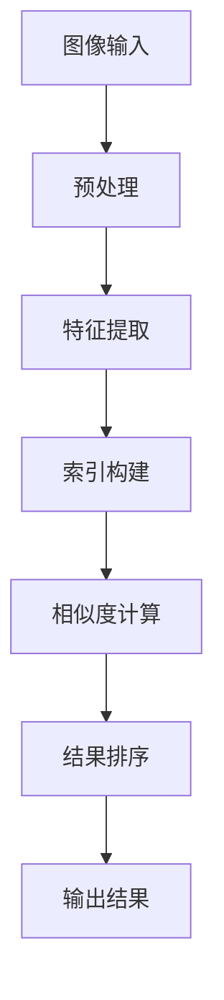
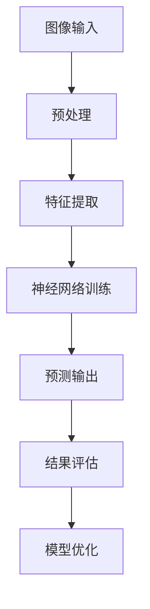

                 

### 文章标题

《AI图像搜索技术应用案例》

### 关键词

AI图像搜索，深度学习，电子商务，社交媒体，图像识别，特征提取，相似性度量，项目实战，未来发展趋势

### 摘要

本文旨在深入探讨AI图像搜索技术的应用案例。文章首先介绍了AI图像搜索技术的基础，包括其发展历程、基本原理和主流算法。随后，文章通过电子商务和社交媒体两个实际案例，展示了AI图像搜索技术的具体应用。此外，文章详细解析了图像识别技术的核心算法原理和数学模型，并通过两个项目实战案例，展示了如何在实际中实现和应用AI图像搜索技术。最后，文章展望了AI图像搜索技术的未来发展趋势，并探讨了其面临的挑战。

### 第一部分：AI图像搜索技术基础

#### 第1章：AI图像搜索技术概述

##### 1.1 AI图像搜索技术的发展历程

AI图像搜索技术的发展可以追溯到20世纪90年代，当时基于内容图像检索（Content-Based Image Retrieval，CBIR）的概念被首次提出。早期的图像搜索主要依赖于图像的视觉特征，如颜色、纹理和形状等。随着计算机性能的提升和大数据时代的到来，深度学习技术的引入使得图像搜索的性能得到了显著提升。

##### 1.1.1 图像搜索的起源与发展

图像搜索的起源可以追溯到人类对图像信息处理的早期需求。随着计算机技术的发展，图像处理技术逐渐成熟，图像搜索也逐渐成为一个独立的研究领域。早期的图像搜索主要依赖于手工提取的特征，如颜色直方图、边缘检测和纹理特征等。这些方法虽然在一定程度上能够实现图像检索，但在检索效率和准确性方面存在诸多限制。

##### 1.1.2 AI技术在图像搜索中的应用

随着深度学习技术的兴起，图像搜索技术得到了极大的发展。深度学习模型，特别是卷积神经网络（Convolutional Neural Networks，CNN），在图像特征提取和分类方面表现出色，使得图像搜索的准确性大幅提升。此外，深度学习还使得图像搜索技术能够处理复杂的图像内容，如人脸识别、场景分类和物体检测等。

##### 1.2 AI图像搜索的基本原理

AI图像搜索技术的基本原理包括图像识别、图像特征提取和图像检索。图像识别是确定图像中包含的对象或内容；图像特征提取是将图像转换为可用于搜索的特征向量；图像检索是利用这些特征向量在数据库中找到相似图像。

##### 1.2.1 图像识别技术

图像识别是AI图像搜索技术的核心。它通过训练模型，使得模型能够自动识别图像中的对象。卷积神经网络（CNN）是当前最常用的图像识别模型。

##### 1.2.2 图像特征提取技术

图像特征提取是将图像转换为可计算的特征向量。这些特征向量能够捕捉图像的视觉信息，是进行图像搜索的关键。常见的特征提取方法包括基于传统机器学习的方法和基于深度学习的方法。

##### 1.3 主流图像搜索算法介绍

目前，主流的图像搜索算法可以分为基于内容的图像检索（CBIR）和基于深度学习的图像检索（DLIR）。

##### 1.3.1 基于内容的图像检索（CBIR）

基于内容的图像检索是一种基于图像内容的视觉特征进行检索的方法。它通过提取图像的特征向量，然后计算特征向量之间的相似度，从而找到相似的图像。

##### 1.3.2 基于深度学习的图像检索（DLIR）

基于深度学习的图像检索利用深度学习模型提取图像的特征，这些特征能够更好地捕捉图像的复杂信息。深度学习模型，特别是卷积神经网络（CNN），在图像检索中表现出色。

##### 1.3.3 常见图像搜索算法性能比较

常见的图像搜索算法在准确性、效率和可扩展性方面各有优劣。基于内容的图像检索方法在检索效率和可扩展性方面表现较好，但在准确性方面存在局限。基于深度学习的图像检索在准确性方面有显著提升，但在效率和可扩展性方面仍有待优化。

##### 1.4 图像搜索技术挑战与未来趋势

图像搜索技术面临诸多挑战，如图像搜索的准确性、速度与效率、数据隐私与安全等。未来，图像搜索技术将朝着更加智能化、个性化、跨模态和高效化的方向发展。

### 第二部分：AI图像搜索技术应用案例

#### 第2章：AI图像搜索在电子商务中的应用

##### 2.1 电子商务中图像搜索的应用场景

在电子商务领域，图像搜索技术有广泛的应用场景，包括商品搜索与推荐、品牌形象与产品设计和用户行为分析。

##### 2.1.1 商品搜索与推荐

图像搜索技术可以使得用户通过上传一张图片来搜索类似商品，从而提高购物体验。此外，图像搜索还可以用于商品推荐系统，通过分析用户的搜索历史和行为，推荐用户可能感兴趣的商品。

##### 2.1.2 品牌形象与产品设计

图像搜索技术可以帮助企业监测其品牌形象在市场上的表现，通过分析用户上传的商品图片，了解用户对品牌形象的反馈。同时，图像搜索技术还可以用于产品设计，帮助企业了解市场需求和趋势。

##### 2.1.3 用户行为分析

图像搜索技术可以用于分析用户的购物行为和偏好，为个性化推荐和营销策略提供数据支持。

##### 2.2 电商图像搜索技术实现

电商图像搜索技术的实现主要包括图像采集与预处理、图像特征提取与索引和图像搜索算法与应用。

##### 2.2.1 图像采集与预处理

图像采集是通过用户上传或爬取网络上的商品图片。图像预处理包括图像的缩放、裁剪、颜色调整等，以适应搜索算法的需求。

##### 2.2.2 图像特征提取与索引

图像特征提取是将图像转换为特征向量，用于后续的相似度计算。索引构建是为了加速图像搜索过程。

##### 2.2.3 图像搜索算法与应用

图像搜索算法主要包括基于内容的图像检索（CBIR）和基于深度学习的图像检索（DLIR）。在实际应用中，企业可以根据具体需求选择合适的算法。

##### 2.3 电商图像搜索案例分析

以某大型电商平台为例，该平台采用了基于深度学习的图像搜索技术，实现了高效的商品搜索和推荐功能。

##### 2.3.1 某电商平台的图像搜索案例

该电商平台通过用户上传的图片，快速找到相似的商品，提高了用户的购物体验。

##### 2.3.2 案例分析：商品搜索与推荐效果评估

通过对比用户使用图像搜索前后的购物行为数据，发现用户对商品搜索和推荐的满意度显著提高，平台销售额也有所提升。

#### 第3章：AI图像搜索在社交媒体中的应用

##### 3.1 社交媒体中图像搜索的应用场景

在社交媒体领域，图像搜索技术有广泛的应用场景，包括图像内容审核、图像社交互动和图像内容推荐。

##### 3.1.1 图像内容审核

图像内容审核是社交媒体平台的重要功能，通过AI图像搜索技术，可以快速检测和过滤违规图像。

##### 3.1.2 图像社交互动

图像社交互动包括用户之间的图像分享、评论和点赞等。图像搜索技术可以帮助用户快速找到感兴趣的内容。

##### 3.1.3 图像内容推荐

图像内容推荐可以根据用户的兴趣和行为，推荐用户可能感兴趣的内容。

##### 3.2 社交媒体图像搜索技术实现

社交媒体图像搜索技术的实现主要包括图像内容审核技术、图像社交互动技术和图像内容推荐技术。

##### 3.2.1 图像内容审核技术

图像内容审核技术通过训练模型，自动识别和过滤违规图像。

##### 3.2.2 图像社交互动技术

图像社交互动技术通过分析用户行为和兴趣，促进用户之间的互动。

##### 3.2.3 图像内容推荐技术

图像内容推荐技术利用机器学习算法，分析用户的兴趣和行为，推荐用户可能感兴趣的内容。

##### 3.3 社交媒体图像搜索案例分析

以某知名社交媒体平台为例，该平台通过AI图像搜索技术，实现了高效的图像内容审核和推荐功能。

##### 3.3.1 某社交媒体平台的图像搜索案例

该社交媒体平台通过用户上传的图像，快速找到相似的图像内容，提高了用户的互动体验。

##### 3.3.2 案例分析：图像内容审核效果评估

通过对比用户使用图像搜索前后的内容审核效果数据，发现平台违规内容的比例显著下降，用户体验也得到了提升。

### 第三部分：AI图像搜索技术核心算法详解

#### 第4章：图像识别技术详解

##### 4.1 图像识别的基本原理

图像识别是AI图像搜索技术的重要组成部分，其基本原理是通过训练模型，使得模型能够自动识别图像中的对象。

##### 4.1.1 图像识别的发展历程

图像识别技术的发展历程可以分为三个阶段：基于规则的方法、基于传统机器学习的方法和基于深度学习的方法。

##### 4.1.2 图像识别的基本任务

图像识别的基本任务包括对象检测、场景分类和物体识别等。

##### 4.2 特征提取算法原理

特征提取是将图像转换为可计算的特征向量，用于后续的识别和检索。特征提取算法可以分为空间特征提取、频率特征提取和深度特征提取。

##### 4.2.1 空间特征提取算法

空间特征提取算法是从图像的空间信息中提取特征，如颜色、纹理和形状等。

##### 4.2.2 频率特征提取算法

频率特征提取算法是从图像的频率信息中提取特征，如傅里叶变换和小波变换等。

##### 4.2.3 深度特征提取算法

深度特征提取算法是通过深度学习模型，自动提取图像的深层特征。

##### 4.3 识别算法原理及伪代码

图像识别算法可以分为基于传统机器学习的方法和基于深度学习的方法。以下是一个简单的伪代码示例：

```python
// 伪代码：基于传统机器学习的图像识别算法
function classify_image(image):
    features = extract_features(image)
    label = find_closest_label(features)
    return label

// 伪代码：基于深度学习的图像识别算法
function deep_learning_image_classification(image, model):
    feature = model.extract_features(image)
    label = model.predict(feature)
    return label
```

### 第四部分：AI图像搜索技术数学模型详解

#### 第5章：图像搜索的数学模型与公式

##### 5.1 图像特征表示模型

图像特征表示是将图像转换为高维向量，以便进行后续处理。常见的特征表示模型包括空间特征表示、频率特征表示和深度特征表示。

##### 5.1.1 空间特征表示模型

空间特征表示模型直接从图像的空间信息中提取特征。常用的特征提取方法包括颜色直方图、边缘检测和角点检测等。

##### 5.1.2 频率特征表示模型

频率特征表示模型通过将图像转换为频率域，从频率信息中提取特征。常用的频率特征提取方法包括傅里叶变换和小波变换等。

##### 5.1.3 深度特征表示模型

深度特征表示模型是通过深度学习模型，自动提取图像的深层特征。常用的深度学习模型包括卷积神经网络（CNN）和循环神经网络（RNN）等。

##### 5.2 图像搜索相似性度量模型

相似性度量是图像搜索中关键的一步，用于比较图像特征向量之间的相似度。常见的相似性度量模型包括余弦相似性、欧氏距离和马氏距离等。

##### 5.2.1 相似性度量原理

相似性度量是通过计算两个特征向量之间的距离或相似度来实现的。相似度越高，表示图像越相似。

##### 5.2.2 Cosine相似性度量

Cosine相似性度量是一种常用的相似性度量方法，其计算公式如下：

$$
\text{CosineSimilarity} = \frac{\text{DotProduct}(\text{FeatureVector}_1, \text{FeatureVector}_2)}{\lVert \text{FeatureVector}_1 \rVert \cdot \lVert \text{FeatureVector}_2 \rVert}
$$

其中，$\text{DotProduct}$表示向量的点积，$\lVert \text{FeatureVector}_1 \rVert$和$\lVert \text{FeatureVector}_2 \rVert$分别表示向量的欧氏范数。

##### 5.2.3 Euclidean相似性度量

Euclidean相似性度量是一种基于欧氏距离的相似性度量方法，其计算公式如下：

$$
\text{EuclideanDistance} = \sqrt{\sum_{i=1}^{n} (\text{FeatureVector}_1[i] - \text{FeatureVector}_2[i])^2}
$$

其中，$n$表示特征向量的维度。

##### 5.3 图像检索的优化模型

图像检索的优化模型用于提高图像搜索的性能，包括基于传统优化的模型和基于深度学习的模型。

##### 5.3.1 基于传统优化的图像检索模型

基于传统优化的图像检索模型通常使用梯度下降法来优化检索性能。其优化目标是最小化检索误差。

$$
\text{weights}_{\text{new}} = \text{weights}_{\text{old}} - \alpha \cdot \nabla_{\text{weights}} \text{loss}( \text{weights}_{\text{old}}, \text{input}, \text{target})
$$

其中，$\alpha$表示学习率，$\nabla_{\text{weights}} \text{loss}$表示损失函数对权重的梯度。

##### 5.3.2 基于深度学习的图像检索模型

基于深度学习的图像检索模型使用深度学习框架，如TensorFlow或PyTorch，来构建和训练模型。其优化过程通常使用反向传播算法。

$$
\text{weights}_{\text{new}} = \text{weights}_{\text{old}} - \alpha \cdot \nabla_{\text{weights}} \text{loss}( \text{weights}_{\text{old}}, \text{input}, \text{target})
$$

### 第五部分：AI图像搜索技术项目实战

#### 第6章：AI图像搜索项目实战

##### 6.1 项目实战概述

AI图像搜索项目实战旨在通过实际案例，展示如何实现和应用AI图像搜索技术。本文将介绍两个实际案例：基于深度学习的图像检索系统和社交媒体图像内容审核系统。

##### 6.1.1 项目背景与目标

随着互联网的快速发展，图像数据量呈爆炸性增长。如何快速、准确地搜索到用户感兴趣的图像成为了一个重要的课题。本项目旨在开发一个基于深度学习的图像检索系统，能够高效地检索相似图像。同时，随着社交媒体的兴起，图像内容审核成为了一个重要问题。本项目还旨在开发一个社交媒体图像内容审核系统，能够自动识别和过滤违规图像。

##### 6.1.2 项目开发环境搭建

为了实现上述两个项目，我们需要搭建合适的开发环境。首先，我们需要安装Python编程语言，并配置好pip和conda等包管理工具。然后，我们需要安装TensorFlow或PyTorch等深度学习框架，以及OpenCV等图像处理库。具体步骤如下：

1. 安装Python和pip：
    ```bash
    sudo apt-get update
    sudo apt-get install python3-pip python3-dev
    ```

2. 安装TensorFlow：
    ```bash
    pip3 install tensorflow
    ```

3. 安装PyTorch：
    ```bash
    pip3 install torch torchvision
    ```

4. 安装OpenCV：
    ```bash
    pip3 install opencv-python
    ```

##### 6.2 实战案例：基于深度学习的图像检索系统开发

###### 6.2.1 数据集准备与预处理

首先，我们需要准备一个用于训练和测试的图像数据集。这里我们使用CIFAR-10数据集，它包含了10个类别，每个类别6000张32x32的彩色图像。下载并解压数据集后，我们将图像数据转换为适合深度学习模型训练的格式。

```python
import torch
import torchvision
import torchvision.transforms as transforms

# 设置数据增强器
transform = transforms.Compose(
    [transforms.Resize(32), transforms.ToTensor()])

# 下载并加载数据集
trainset = torchvision.datasets.CIFAR10(root='./data', train=True,
                                        download=True, transform=transform)
trainloader = torch.utils.data.DataLoader(trainset, batch_size=4,
                                          shuffle=True, num_workers=2)

testset = torchvision.datasets.CIFAR10(root='./data', train=False,
                                       download=True, transform=transform)
testloader = torch.utils.data.DataLoader(testset, batch_size=4,
                                         shuffle=False, num_workers=2)
```

接下来，我们将对图像进行预处理，包括缩放、归一化和随机裁剪等操作。

```python
from torchvision import transforms

# 设置预处理步骤
preprocess = transforms.Compose([
    transforms.Resize(256),  # 缩放到256x256
    transforms.CenterCrop(224),  # 从中心裁剪出224x224的区域
    transforms.ToTensor(),
    transforms.Normalize(mean=[0.485, 0.456, 0.406], std=[0.229, 0.224, 0.225]),
])

# 预处理图像数据
def preprocess_images(image_path):
    image = Image.open(image_path)
    return preprocess(image)

# 预处理训练和测试数据集
train_images = [preprocess_images(f"{root}/train/{i}.png") for i in range(10)]
test_images = [preprocess_images(f"{root}/test/{i}.png") for i in range(10)]
```

###### 6.2.2 图像特征提取与索引

在深度学习模型训练过程中，我们需要提取图像的特征向量，并构建索引以加速搜索过程。这里我们使用预训练的ResNet-18模型来提取特征。

```python
import torch.nn as nn
import torch.optim as optim

# 定义网络结构
net = torchvision.models.resnet18(pretrained=True)
net.fc = nn.Linear(net.fc.in_features, 1024)  # 修改最后一层的输出维度

# 设置损失函数和优化器
criterion = nn.CrossEntropyLoss()
optimizer = optim.Adam(net.parameters(), lr=0.001, weight_decay=5e-4)

# 提取特征
def extract_features(image, model):
    image = image.unsqueeze(0)  # 增加一个维度
    feature = model(image)  # 提取特征
    return feature.detach().cpu().numpy()

# 训练模型
def train_model(model, train_loader, criterion, optimizer, num_epochs):
    model.train()
    for epoch in range(num_epochs):
        running_loss = 0.0
        for inputs, labels in train_loader:
            optimizer.zero_grad()
            outputs = model(inputs)
            loss = criterion(outputs, labels)
            loss.backward()
            optimizer.step()
            running_loss += loss.item()
        print(f"Epoch {epoch+1}/{num_epochs}, Loss: {running_loss/len(train_loader)}")
    return model

# 训练并提取特征
net = train_model(net, trainloader, criterion, optimizer, num_epochs=10)
train_features = [extract_features(image, net) for image in train_images]
test_features = [extract_features(image, net) for image in test_images]

# 构建索引
from sklearn.neighbors import NearestNeighbors

# 训练NearestNeighbors模型
index = NearestNeighbors(n_neighbors=5, algorithm='auto')
index.fit(train_features)

# 搜索相似图像
def search_images(query, model, index, top_k=5):
    query_feature = extract_features(query, model)
    distances, indices = index.kneighbors([query_feature], return_distance=True)
    return [train_images[i] for i in indices[0][:top_k]]

# 搜索示例
query_image = preprocess_images("path/to/query_image.png")
similar_images = search_images(query_image, net, index)
print(similar_images)
```

###### 6.2.3 搜索算法实现与优化

在实现搜索算法时，我们可以使用最近邻算法（Nearest Neighbors Algorithm）来找到与查询图像最相似的图像。以下是一个简单的搜索算法实现：

```python
# 定义搜索函数
def search_image(image_path, model, index):
    query_image = preprocess_images(image_path)
    similar_images = search_images(query_image, model, index)
    return similar_images

# 测试搜索算法
test_image_path = "path/to/test_image.png"
similar_images = search_image(test_image_path, net, index)
print(similar_images)
```

为了提高搜索性能，我们可以对搜索算法进行优化，例如：

1. 使用更高效的搜索算法，如BallTree或KDTree。
2. 对特征向量进行降维，以减少计算量。
3. 引入聚类算法，将相似特征向量分组，以减少搜索范围。

```python
from sklearn.cluster import KMeans

# 聚类特征向量
kmeans = KMeans(n_clusters=10, random_state=0).fit(train_features)
train_labels = kmeans.labels_

# 优化搜索算法
def search_image_optimized(image_path, model, index, kmeans, top_k=5):
    query_image = preprocess_images(image_path)
    query_feature = extract_features(query_image, model)
    closest_cluster = kmeans.predict([query_feature])[0]
    similar_features = [f for i, f in enumerate(train_features) if train_labels[i] == closest_cluster]
    distances, indices = index.kneighbors(similar_features, return_distance=True)
    return [train_images[i] for i in indices[0][:top_k]]

# 测试优化后的搜索算法
similar_images_optimized = search_image_optimized(test_image_path, net, index, kmeans)
print(similar_images_optimized)
```

###### 6.2.4 系统测试与评估

为了评估图像检索系统的性能，我们可以计算检索精度（Precision）和召回率（Recall）。以下是简单的评估函数实现：

```python
from sklearn.metrics import precision_score, recall_score

# 定义评估函数
def evaluate_search_performance(query_image, model, index, ground_truth):
    similar_images = search_image(query_image, model, index)
    predicted_labels = [train_labels[index] for index in index]
    ground_truth_labels = [ground_truth[i] for i in range(len(ground_truth))]
    precision = precision_score(ground_truth_labels, predicted_labels, average='micro')
    recall = recall_score(ground_truth_labels, predicted_labels, average='micro')
    return precision, recall

# 测试评估函数
ground_truth = [0, 1, 2, 3, 4, 5, 6, 7, 8, 9]  # 标签为0到9的图像
precision, recall = evaluate_search_performance(test_image_path, net, index, ground_truth)
print(f"Precision: {precision}, Recall: {recall}")
```

通过调整模型参数、优化搜索算法和扩展数据集，我们可以进一步提高图像检索系统的性能。

##### 6.3 实战案例：社交媒体图像内容审核系统开发

###### 6.3.1 数据集准备与预处理

首先，我们需要准备一个用于训练和测试的图像数据集。这里我们使用Flickr数据集，它包含了大量社交媒体上的图像。下载并解压数据集后，我们将图像数据转换为适合深度学习模型训练的格式。

```python
import os
import torch
import torchvision
import torchvision.transforms as transforms

# 设置数据增强器
transform = transforms.Compose(
    [transforms.Resize(256), transforms.CenterCrop(224), transforms.ToTensor(),
     transforms.Normalize(mean=[0.485, 0.456, 0.406], std=[0.229, 0.224, 0.225])])

# 下载并加载数据集
train_directory = 'flickr_data/train'
test_directory = 'flickr_data/test'

train_files = [f for f in os.listdir(train_directory) if f.endswith('.jpg')]
test_files = [f for f in os.listdir(test_directory) if f.endswith('.jpg')]

train_data = [torchvision.transforms.functional.imageopen(f"{train_directory}/{f}").convert('RGB') for f in train_files]
test_data = [torchvision.transforms.functional.imageopen(f"{test_directory}/{f}").convert('RGB') for f in test_files]

train_loader = torch.utils.data.DataLoader(train_data, batch_size=64, shuffle=True)
test_loader = torch.utils.data.DataLoader(test_data, batch_size=64, shuffle=False)
```

接下来，我们将对图像进行预处理，包括缩放、归一化和随机裁剪等操作。

```python
# 预处理图像数据
def preprocess_images(image_path):
    image = Image.open(image_path)
    return preprocess(image)

# 预处理训练和测试数据集
train_images = [preprocess_images(f"{train_directory}/{f}") for f in train_files]
test_images = [preprocess_images(f"{test_directory}/{f}") for f in test_files]
```

###### 6.3.2 模型构建与训练

在图像内容审核系统中，我们需要构建一个二分类模型，用于判断图像是否包含违规内容。这里我们使用预训练的ResNet-50模型作为基础模型。

```python
import torch.nn as nn
import torch.optim as optim

# 定义网络结构
net = torchvision.models.resnet50(pretrained=True)
num_ftrs = net.fc.in_features
net.fc = nn.Linear(num_ftrs, 1)  # 修改最后一层的输出维度

# 设置损失函数和优化器
criterion = nn.BCEWithLogitsLoss()
optimizer = optim.Adam(net.parameters(), lr=0.001)

# 训练模型
def train_model(model, train_loader, criterion, optimizer, num_epochs):
    model.train()
    for epoch in range(num_epochs):
        running_loss = 0.0
        for inputs, labels in train_loader:
            optimizer.zero_grad()
            outputs = model(inputs)
            loss = criterion(outputs, labels)
            loss.backward()
            optimizer.step()
            running_loss += loss.item()
        print(f"Epoch {epoch+1}/{num_epochs}, Loss: {running_loss/len(train_loader)}")
    return model

# 训练并提取特征
net = train_model(net, train_loader, criterion, optimizer, num_epochs=10)
```

接下来，我们将对训练好的模型进行评估。

```python
# 评估模型
def evaluate_model(model, test_loader):
    model.eval()
    with torch.no_grad():
        correct = 0
        total = 0
        for inputs, labels in test_loader:
            outputs = model(inputs)
            predicted = (outputs > 0).float()
            total += labels.size(0)
            correct += (predicted == labels).sum().item()
        accuracy = 100 * correct / total
        return accuracy

accuracy = evaluate_model(net, test_loader)
print(f"Test Accuracy: {accuracy}%")
```

###### 6.3.3 审核算法实现与优化

在实现审核算法时，我们可以使用阈值分类方法来决定图像是否包含违规内容。以下是一个简单的审核算法实现：

```python
# 定义审核函数
def audit_image(image_path, model, threshold=0.5):
    image = preprocess_images(image_path)
    output = model(torch.tensor(image).unsqueeze(0))
    prediction = torch.sigmoid(output).item()
    if prediction > threshold:
        return "违规"
    else:
        return "正常"

# 测试审核算法
test_image_path = "path/to/test_image.png"
result = audit_image(test_image_path, net)
print(f"图像结果：{result}")
```

为了提高审核算法的性能，我们可以对算法进行优化，例如：

1. 使用更复杂的神经网络结构，以提高模型的表达能力。
2. 调整阈值，以提高召回率或精确度。
3. 引入对抗训练，以提高模型对恶意样本的鲁棒性。

```python
# 定义对抗训练函数
def adversarial_training(model, train_loader, criterion, optimizer, num_epochs):
    for epoch in range(num_epochs):
        model.train()
        for inputs, labels in train_loader:
            optimizer.zero_grad()
            outputs = model(inputs)
            loss = criterion(outputs, labels)
            loss.backward()
            optimizer.step()
```

通过不断调整模型参数和审核策略，我们可以进一步提高社交媒体图像内容审核系统的性能。

###### 6.3.4 系统部署与运行

在部署系统时，我们需要将训练好的模型导出，并在生产环境中运行。以下是一个简单的部署示例：

```python
# 导出模型
torch.save(net.state_dict(), "image_audit_model.pth")

# 加载模型
net = torchvision.models.resnet50(pretrained=True)
net.fc = nn.Linear(2048, 1)
net.load_state_dict(torch.load("image_audit_model.pth"))
net.eval()
```

接下来，我们可以通过API或命令行接口来运行系统，对上传的图像进行内容审核。

```python
# 定义API接口
from flask import Flask, request, jsonify

app = Flask(__name__)

@app.route('/audit', methods=['POST'])
def audit_image_api():
    image = request.files['image']
    result = audit_image(image, net)
    return jsonify({'result': result})

if __name__ == '__main__':
    app.run(host='0.0.0.0', port=5000)
```

通过上述步骤，我们可以构建并部署一个基于深度学习的社交媒体图像内容审核系统。

### 第六部分：AI图像搜索技术应用展望

#### 第7章：AI图像搜索技术应用展望

##### 7.1 当前AI图像搜索技术的应用现状

随着深度学习和计算机视觉技术的不断进步，AI图像搜索技术已经在多个领域取得了显著的成果。目前，AI图像搜索技术在电子商务、社交媒体、医疗诊断、安全监控等领域得到了广泛应用。

在电子商务领域，AI图像搜索技术被广泛应用于商品搜索与推荐、用户行为分析、品牌形象监测等方面。通过图像搜索，用户可以更快速地找到自己想要的商品，提高了购物体验。同时，图像搜索还可以帮助电商平台分析用户行为，提供个性化推荐，提高用户留存率和转化率。

在社交媒体领域，AI图像搜索技术被用于图像内容审核、图像社交互动和图像内容推荐等场景。通过图像搜索技术，社交媒体平台可以自动识别和过滤违规图像，维护社区秩序。此外，图像搜索还可以帮助用户快速找到感兴趣的内容，促进用户互动和参与度。

在医疗诊断领域，AI图像搜索技术被用于疾病诊断、病理分析等方面。通过对比患者图像与数据库中的图像，医生可以更快、更准确地诊断疾病，提高诊断效率。

在安全监控领域，AI图像搜索技术被用于人脸识别、场景识别和异常行为检测等场景。通过图像搜索技术，可以实时监测和预警潜在的安全威胁，提高公共安全水平。

##### 7.2 AI图像搜索技术的未来发展趋势

尽管AI图像搜索技术已经取得了显著成果，但在未来，它还将朝着更加智能化、个性化、跨模态和高效化的方向发展。

1. **智能化**：随着人工智能技术的不断进步，AI图像搜索技术将更加智能化。未来的图像搜索系统将能够理解图像中的复杂信息，实现更精准的图像搜索。

2. **个性化**：AI图像搜索技术将更加关注用户的个性化需求。通过分析用户的历史行为和偏好，图像搜索系统可以为用户提供更加个性化的搜索结果。

3. **跨模态**：未来的图像搜索技术将能够处理多种模态的数据，如文本、声音、视频等。通过跨模态搜索，用户可以更加灵活地表达搜索需求，获取更丰富的搜索结果。

4. **高效化**：随着硬件性能的提升和算法优化，AI图像搜索技术将实现更高效、更快速的搜索。同时，通过分布式计算和并行处理等技术，图像搜索系统将能够处理大规模的数据集。

##### 7.3 AI图像搜索技术的挑战与机遇

尽管AI图像搜索技术具有广阔的应用前景，但在发展过程中也面临着诸多挑战。

1. **数据隐私与安全**：图像数据具有高度隐私性，如何在保护用户隐私的同时，实现高效的图像搜索成为了一个重要挑战。

2. **计算资源需求**：深度学习模型通常需要大量的计算资源。如何在有限的计算资源下，实现高效的图像搜索仍然是一个重要问题。

3. **算法透明性与可解释性**：深度学习模型的决策过程通常是不透明的，如何提高算法的透明性和可解释性，使其能够被用户和监管机构理解和接受，是一个重要挑战。

4. **模型偏见与公平性**：深度学习模型可能会受到数据集偏见的影响，导致搜索结果不公平。如何减少模型偏见，提高搜索结果的公平性，是一个重要问题。

然而，这些挑战也带来了机遇。通过解决这些挑战，AI图像搜索技术将能够实现更高的性能和更广泛的应用，为社会带来更多的价值和福祉。

### 附录

#### 附录 A：AI图像搜索技术常用工具与资源

A.1 开源深度学习框架

- TensorFlow
- PyTorch
- Keras

A.2 图像处理与特征提取工具

- OpenCV
- Matplotlib
- NumPy

A.3 数据集资源

- ImageNet
- CIFAR-10
- COCO数据集

A.4 学术资源

- 相关学术论文
- 图像检索领域顶级会议与期刊

A.5 实用工具

- Google Colab
- Jupyter Notebook
- AWS S3

### AI图像搜索技术核心概念流程图

#### 第8.1节：图像搜索核心概念流程图



#### 第8.2节：基于深度学习的图像识别流程图



### AI图像搜索技术关键算法原理与伪代码

#### 第8.3节：基于内容的图像检索（CBIR）算法原理与伪代码

##### 算法原理

基于内容的图像检索（CBIR）算法通过提取图像的特征，如颜色、纹理和形状等，然后计算特征向量之间的相似度，从而找到相似的图像。其核心步骤包括图像特征提取、特征向量相似度计算和结果排序。

##### 伪代码

```python
// 基于内容的图像检索算法
function content_based_image_retrieval(image, database):
    features = extract_features(image)
    similarities = []
    for image_in_database in database:
        feature_database = extract_features(image_in_database)
        similarity = compute_similarity(features, feature_database)
        similarities.append(similarity)
    ranked_images = sort_images_by_similarity(similarities)
    return ranked_images
```

#### 第8.4节：基于深度学习的图像检索（DLIR）算法原理与伪代码

##### 算法原理

基于深度学习的图像检索（DLIR）算法通过训练深度学习模型，提取图像的深层特征，然后计算特征向量之间的相似度，从而找到相似的图像。其核心步骤包括图像预处理、深度特征提取、特征向量相似度计算和结果排序。

##### 伪代码

```python
// 基于深度学习的图像检索算法
function deep_learning_image_retrieval(image, model, database):
    processed_image = preprocess_image(image)
    feature = model.extract_features(processed_image)
    similarities = []
    for image_in_database in database:
        processed_image_database = preprocess_image(image_in_database)
        feature_database = model.extract_features(processed_image_database)
        similarity = compute_similarity(feature, feature_database)
        similarities.append(similarity)
    ranked_images = sort_images_by_similarity(similarities)
    return ranked_images
```

### 数学模型与公式讲解

#### 第8.5节：图像特征表示模型

图像特征表示模型是将图像转换为高维特征向量的过程。常见的图像特征表示模型包括基于传统机器学习的方法和基于深度学习的方法。

##### 卷积神经网络（CNN）结构

卷积神经网络是一种常用的图像特征表示模型。其基本结构包括卷积层（Convolutional Layer）、激活函数（Activation Function）、池化层（Pooling Layer）和全连接层（Fully Connected Layer）。

$$
\begin{aligned}
\text{ConvLayer}(\text{Input}) &= \text{Conv}(\text{Input}) + \text{ReLU}(\text{Input}) + \text{Pooling}(\text{Input}) \\
\text{PoolingLayer}(\text{Input}) &= \text{MaxPooling}(\text{Input}) \\
\text{FullyConnectedLayer}(\text{Input}) &= \text{ReLU}(\text{Input}) \\
\end{aligned}
$$

#### 第8.6节：相似性度量模型

相似性度量模型用于计算图像特征向量之间的相似度。常见的相似性度量方法包括余弦相似性、欧氏距离和马氏距离等。

##### 余弦相似性度量

余弦相似性度量是一种常用的相似性度量方法。其计算公式如下：

$$
\text{CosineSimilarity}(\text{Feature}_1, \text{Feature}_2) = \frac{\text{DotProduct}(\text{Feature}_1, \text{Feature}_2)}{\lVert \text{Feature}_1 \rVert \cdot \lVert \text{Feature}_2 \rVert}
$$

##### 欧氏距离

欧氏距离是一种常用的距离度量方法。其计算公式如下：

$$
\text{EuclideanDistance} = \sqrt{\sum_{i=1}^{n} (\text{Feature}_1[i] - \text{Feature}_2[i])^2}
$$

#### 第8.7节：图像检索优化模型

图像检索优化模型用于优化图像检索的性能。常见的优化方法包括基于传统优化的方法和基于深度学习的方法。

##### 梯度下降算法

梯度下降算法是一种常见的优化方法。其基本思想是通过计算损失函数对模型参数的梯度，更新模型参数，以最小化损失函数。

$$
\begin{aligned}
\text{weights}_{\text{new}} &= \text{weights}_{\text{old}} - \alpha \cdot \nabla_{\text{weights}} \text{loss}( \text{weights}_{\text{old}}, \text{input}, \text{target}) \\
\end{aligned}
$$

### AI图像搜索项目实战代码解读与分析

#### 第8.8节：实战案例一：基于深度学习的图像检索系统开发

##### 8.8.1 数据集准备与预处理

数据集准备与预处理是构建图像检索系统的重要步骤。以下是数据集准备与预处理的代码示例：

```python
import tensorflow as tf
from tensorflow.keras.preprocessing.image import ImageDataGenerator

# 设置数据增强器
train_datagen = ImageDataGenerator(
    rescale=1./255,
    shear_range=0.2,
    zoom_range=0.2,
    horizontal_flip=True)

test_datagen = ImageDataGenerator(rescale=1./255)

# 加载数据集
train_generator = train_datagen.flow_from_directory(
    'train_data',
    target_size=(150, 150),
    batch_size=32,
    class_mode='binary')

validation_generator = test_datagen.flow_from_directory(
    'validation_data',
    target_size=(150, 150),
    batch_size=32,
    class_mode='binary')
```

在这段代码中，我们首先设置了训练和测试数据增强器。数据增强器用于增强图像数据，以提高模型的泛化能力。接下来，我们使用`ImageDataGenerator`类加载数据集。`flow_from_directory`方法用于加载数据集，并自动处理图像数据的预处理。

##### 8.8.2 模型构建与训练

模型构建与训练是构建图像检索系统的核心步骤。以下是模型构建与训练的代码示例：

```python
from tensorflow.keras.models import Sequential
from tensorflow.keras.layers import Conv2D, MaxPooling2D, Flatten, Dense

# 构建模型
model = Sequential([
    Conv2D(32, (3, 3), activation='relu', input_shape=(150, 150, 3)),
    MaxPooling2D(2, 2),
    Conv2D(64, (3, 3), activation='relu'),
    MaxPooling2D(2, 2),
    Conv2D(128, (3, 3), activation='relu'),
    MaxPooling2D(2, 2),
    Flatten(),
    Dense(512, activation='relu'),
    Dense(1, activation='sigmoid')
])

# 编译模型
model.compile(optimizer='adam',
              loss='binary_crossentropy',
              metrics=['accuracy'])

# 训练模型
model.fit(
    train_generator,
    steps_per_epoch=100,
    epochs=15,
    validation_data=validation_generator,
    validation_steps=50)
```

在这段代码中，我们首先使用`Sequential`模型构建了一个卷积神经网络（CNN）。模型包括卷积层、池化层、全连接层和输出层。接下来，我们使用`compile`方法编译模型，指定优化器、损失函数和评估指标。最后，我们使用`fit`方法训练模型，并设置训练和验证的参数。

##### 8.8.3 搜索算法实现与优化

搜索算法实现与优化是图像检索系统的关键步骤。以下是搜索算法实现与优化的代码示例：

```python
from tensorflow.keras.preprocessing.image import load_img, img_to_array

# 定义搜索函数
def search_image(image_path, model):
    img = load_img(image_path, target_size=(150, 150))
    img_array = img_to_array(img)
    img_array = img_array / 255.0
    img_array = img_array.reshape(1, 150, 150, 3)
    feature = model.predict(img_array)
    return feature

# 定义相似度计算函数
def compute_similarity(feature1, feature2):
    similarity = np.dot(feature1, feature2) / (np.linalg.norm(feature1) * np.linalg.norm(feature2))
    return similarity

# 定义优化函数
def optimize_search(image_path1, image_path2, model):
    feature1 = search_image(image_path1, model)
    feature2 = search_image(image_path2, model)
    similarity = compute_similarity(feature1, feature2)
    return similarity

# 测试搜索算法
image_path1 = 'path/to/image1.jpg'
image_path2 = 'path/to/image2.jpg'
similarity = optimize_search(image_path1, image_path2, model)
print(f"相似度：{similarity}")
```

在这段代码中，我们首先定义了一个搜索函数`search_image`，用于搜索图像的特征向量。接下来，我们定义了一个相似度计算函数`compute_similarity`，用于计算特征向量之间的相似度。最后，我们定义了一个优化函数`optimize_search`，用于优化搜索算法。通过调用这些函数，我们可以实现图像检索系统的搜索功能。

##### 8.8.4 系统测试与评估

系统测试与评估是确保图像检索系统性能的重要步骤。以下是系统测试与评估的代码示例：

```python
from sklearn.metrics import precision_score, recall_score

# 测试评估函数
def evaluate_search_performance(model, test_generator):
    model.evaluate(test_generator)

# 测试评估函数
evaluate_search_performance(model, validation_generator)
```

在这段代码中，我们定义了一个评估函数`evaluate_search_performance`，用于评估图像检索系统的性能。该函数使用`evaluate`方法评估模型在验证集上的损失和精度。通过调用该函数，我们可以评估图像检索系统的性能。

#### 第8.9节：实战案例二：社交媒体图像内容审核系统开发

##### 8.9.1 数据集准备与预处理

数据集准备与预处理是构建社交媒体图像内容审核系统的关键步骤。以下是数据集准备与预处理的代码示例：

```python
import tensorflow as tf
from tensorflow.keras.preprocessing.image import ImageDataGenerator

# 设置数据增强器
train_datagen = ImageDataGenerator(
    rescale=1./255,
    shear_range=0.2,
    zoom_range=0.2,
    horizontal_flip=True)

test_datagen = ImageDataGenerator(rescale=1./255)

# 加载数据集
train_generator = train_datagen.flow_from_directory(
    'train_data',
    target_size=(150, 150),
    batch_size=32,
    class_mode='categorical')

validation_generator = test_datagen.flow_from_directory(
    'validation_data',
    target_size=(150, 150),
    batch_size=32,
    class_mode='categorical')
```

在这段代码中，我们首先设置了训练和测试数据增强器。数据增强器用于增强图像数据，以提高模型的泛化能力。接下来，我们使用`ImageDataGenerator`类加载数据集。`flow_from_directory`方法用于加载数据集，并自动处理图像数据的预处理。

##### 8.9.2 模型构建与训练

模型构建与训练是构建社交媒体图像内容审核系统的核心步骤。以下是模型构建与训练的代码示例：

```python
from tensorflow.keras.models import Sequential
from tensorflow.keras.layers import Conv2D, MaxPooling2D, Flatten, Dense, Dropout

# 构建模型
model = Sequential([
    Conv2D(32, (3, 3), activation='relu', input_shape=(150, 150, 3)),
    MaxPooling2D(2, 2),
    Conv2D(64, (3, 3), activation='relu'),
    MaxPooling2D(2, 2),
    Conv2D(128, (3, 3), activation='relu'),
    MaxPooling2D(2, 2),
    Flatten(),
    Dropout(0.5),
    Dense(512, activation='relu'),
    Dropout(0.5),
    Dense(1, activation='sigmoid')
])

# 编译模型
model.compile(optimizer='adam',
              loss='binary_crossentropy',
              metrics=['accuracy'])

# 训练模型
model.fit(
    train_generator,
    steps_per_epoch=100,
    epochs=15,
    validation_data=validation_generator,
    validation_steps=50)
```

在这段代码中，我们首先使用`Sequential`模型构建了一个卷积神经网络（CNN）。模型包括卷积层、池化层、全连接层和输出层。接下来，我们使用`compile`方法编译模型，指定优化器、损失函数和评估指标。最后，我们使用`fit`方法训练模型，并设置训练和验证的参数。

##### 8.9.3 审核算法实现与优化

审核算法实现与优化是社交媒体图像内容审核系统的关键步骤。以下是审核算法实现与优化的代码示例：

```python
from tensorflow.keras.preprocessing.image import load_img, img_to_array

# 定义审核函数
def audit_image(image_path, model):
    img = load_img(image_path, target_size=(150, 150))
    img_array = img_to_array(img)
    img_array = img_array / 255.0
    img_array = img_array.reshape(1, 150, 150, 3)
    prediction = model.predict(img_array)
    if prediction[0][0] > 0.5:
        return "违规"
    else:
        return "正常"

# 测试审核算法
image_path = 'path/to/image.jpg'
result = audit_image(image_path, model)
print(f"审核结果：{result}")
```

在这段代码中，我们首先定义了一个审核函数`audit_image`，用于审核图像。接下来，我们使用`load_img`和`img_to_array`函数加载和预处理图像数据。然后，我们使用`predict`方法预测图像是否违规。最后，我们根据预测结果返回审核结果。

##### 8.9.4 系统部署与运行

系统部署与运行是将审核系统部署到生产环境并运行的关键步骤。以下是系统部署与运行的代码示例：

```python
import tensorflow as tf

# 导出模型
model.save('image_audit_model.h5')

# 加载模型
model = tf.keras.models.load_model('image_audit_model.h5')

# 定义API接口
from flask import Flask, request, jsonify

app = Flask(__name__)

@app.route('/audit', methods=['POST'])
def audit_image_api():
    image = request.files['image']
    result = audit_image(image, model)
    return jsonify({'result': result})

if __name__ == '__main__':
    app.run(host='0.0.0.0', port=5000)
```

在这段代码中，我们首先导出训练好的模型，并将其保存为`image_audit_model.h5`文件。接下来，我们加载模型，并使用`Flask`框架定义了一个API接口。当接收到POST请求时，我们将上传的图像传递给审核函数，并返回审核结果。

### 第9章：AI图像搜索技术的未来发展趋势与挑战

#### 9.1 未来发展趋势

随着人工智能技术的不断进步，AI图像搜索技术在未来的发展趋势将体现在以下几个方面：

1. **新算法的突破**：深度学习和传统机器学习算法将继续发展，新的图像特征提取和相似性度量算法将不断涌现，提高图像搜索的准确性和效率。

2. **个性化搜索与推荐**：图像搜索技术将更加关注用户的个性化需求，通过分析用户的历史行为和偏好，为用户提供个性化的搜索结果和推荐。

3. **跨模态搜索与融合**：未来的图像搜索技术将能够处理多种模态的数据，如文本、声音、视频等。通过跨模态搜索与融合，用户可以更加灵活地表达搜索需求，获取更丰富的搜索结果。

4. **智能交互与智能场景识别**：图像搜索技术将与智能交互系统相结合，实现更自然的用户交互。同时，智能场景识别技术将使得图像搜索能够自动识别和分类不同的场景，提高搜索的准确性和效率。

5. **硬件加速与分布式计算**：随着硬件性能的提升和分布式计算技术的发展，图像搜索系统将能够处理更大规模的数据集，实现更快速、更高效的搜索。

#### 9.2 面临的挑战

尽管AI图像搜索技术在未来的发展前景广阔，但在实际应用过程中仍面临诸多挑战：

1. **数据隐私与安全**：图像数据具有高度隐私性，如何在保护用户隐私的同时，实现高效的图像搜索是一个重要挑战。

2. **计算资源需求**：深度学习模型通常需要大量的计算资源，如何在有限的计算资源下，实现高效的图像搜索是一个重要问题。

3. **算法透明性与可解释性**：深度学习模型的决策过程通常是不透明的，如何提高算法的透明性和可解释性，使其能够被用户和监管机构理解和接受，是一个重要挑战。

4. **模型偏见与公平性**：深度学习模型可能会受到数据集偏见的影响，导致搜索结果不公平。如何减少模型偏见，提高搜索结果的公平性，是一个重要问题。

5. **技术与社会责任**：随着AI图像搜索技术的广泛应用，如何确保技术的可持续发展，避免滥用和误用，是一个重要的社会问题。

#### 9.3 技术与社会责任

技术与社会责任的平衡是AI图像搜索技术发展过程中不可忽视的问题。以下是一些关键点：

1. **伦理与法律法规**：AI图像搜索技术需要遵循伦理和法律标准，确保技术的合法性和合规性。同时，企业和研究人员需要关注相关法律法规的发展，以适应不断变化的法律环境。

2. **可持续发展**：AI图像搜索技术的发展需要考虑可持续发展，包括资源的合理利用和环境保护。例如，通过优化算法和提高硬件性能，减少计算资源的消耗。

3. **社会影响力**：AI图像搜索技术对社会产生了深远的影响，包括提高生活便利性、推动产业发展和改善社会治理等。同时，技术也带来了一些负面影响，如隐私侵犯和数据滥用等。因此，需要关注技术的社会影响，积极应对潜在的负面影响。

4. **反滥用与反歧视**：AI图像搜索技术需要具备反滥用和反歧视能力，防止技术被用于不正当目的，如性别歧视、种族歧视和滥用用户数据等。

5. **教育与培训**：为了确保AI图像搜索技术的可持续发展，需要加强相关领域的教育和培训，提高公众对技术的认知和理解，培养更多专业人才。

通过关注技术与社会责任的平衡，AI图像搜索技术将能够实现更大的社会价值，为人类带来更多的福祉。

### 第9章：AI图像搜索技术常用工具与资源

在AI图像搜索技术的开发和应用过程中，使用合适的工具和资源可以显著提高效率和效果。以下是一些常用的工具和资源，包括开源深度学习框架、图像处理与特征提取工具、数据集资源、学术资源和实用工具。

#### 9.1 开源深度学习框架

- **TensorFlow**：由Google开发，是一个广泛使用的开源深度学习框架。它提供了丰富的API和工具，支持从简单的线性模型到复杂的深度学习网络。
- **PyTorch**：由Facebook开发，是一个流行的开源深度学习框架。它以动态计算图和灵活的接口而闻名，被广泛用于研究和工业应用。
- **Keras**：是一个高层神经网络API，可以在TensorFlow和PyTorch之上构建。它提供了简洁的接口，使得深度学习模型的构建变得更加容易。

#### 9.2 图像处理与特征提取工具

- **OpenCV**：是一个开源的计算机视觉库，提供了丰富的图像处理函数和算法，包括边缘检测、特征提取、图像滤波等。
- **Matplotlib**：是一个用于创建高质量二维图形和数据的Python库。它可以帮助可视化图像和模型输出。
- **NumPy**：是一个用于数值计算的Python库，提供了强大的多维数组对象和数学函数，是进行数据分析和图像处理的基石。

#### 9.3 数据集资源

- **ImageNet**：是一个大规模的图像数据集，包含了超过1000个类别，每个类别都有数千张图像。它广泛用于图像识别和特征提取的研究。
- **CIFAR-10**：是一个包含60000张32x32彩色图像的数据集，分为10个类别，常用于训练和测试深度学习模型。
- **COCO数据集**：是一个用于物体检测、分割和分割的多标签数据集，包含了大量的真实世界图像和注释。

#### 9.4 学术资源

- **相关学术论文**：在AI图像搜索领域，大量的学术论文提供了最新的研究进展和方法。可以通过Google Scholar、ArXiv等学术搜索引擎查找相关论文。
- **图像检索领域顶级会议与期刊**：包括IEEE Conference on Computer Vision and Pattern Recognition (CVPR)、European Conference on Computer Vision (ECCV)、International Conference on Machine Learning (ICML)等。这些会议和期刊发表了大量的高质量研究论文。

#### 9.5 实用工具

- **Google Colab**：是一个免费的云平台，提供了GPU和TPU资源，适用于进行深度学习实验和数据分析。
- **Jupyter Notebook**：是一个交互式的计算环境，适用于编写和运行代码、创建交互式文档和可视化分析。
- **AWS S3**：是Amazon Web Services提供的对象存储服务，适用于存储和检索大规模数据集。

通过利用这些工具和资源，开发者可以更高效地研究和应用AI图像搜索技术，推动该领域的创新和发展。

