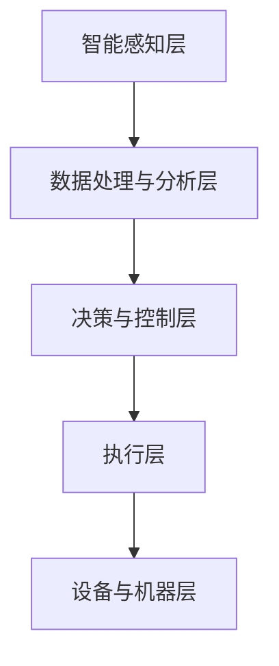
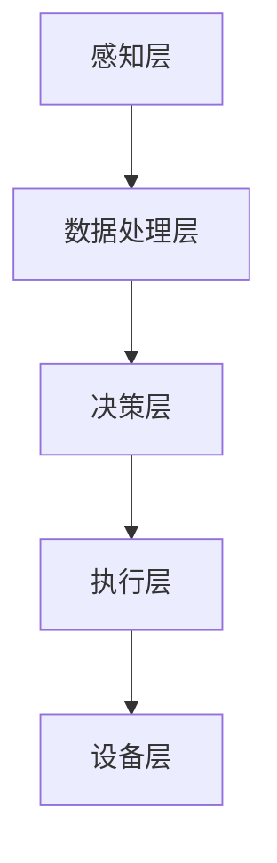

                 

### 第1章：AI与制造业的融合概述

#### 1.1 AI与制造业的背景与趋势

##### 1.1.1 AI技术的发展及其影响

- **AI技术的起源与发展**  
  AI，即人工智能（Artificial Intelligence），是一门研究、开发用于模拟、延伸和扩展人的智能的理论、方法、技术及应用系统的技术科学。它起源于20世纪50年代，随着计算机技术的进步和算法的发展，AI逐渐从理论走向实践。

- **AI在制造业中的影响**  
  AI技术的引入，使得制造业生产效率大幅提升，运营成本显著降低，产品质量和安全性得到极大改善。具体体现在以下几个方面：
  - **生产效率提升**：通过智能化生产线和机器人技术，减少了人工操作的时间，提高了生产效率。
  - **成本降低**：AI技术能够优化生产流程，减少资源浪费，降低运营成本。
  - **产品质量提升**：AI技术在质量控制与故障诊断中的应用，能够及时发现并解决生产中的问题，提高产品质量。
  - **安全性提升**：AI技术能够对生产环境进行实时监控，提高生产安全性。

##### 1.1.2 制造业的数字化与智能化需求

- **制造业的数字化发展**  
  数字化是指将物理世界中的信息转化为数字形式，通过计算机和互联网进行存储、处理和传递。制造业的数字化主要表现在以下几个方面：
  - **信息化系统的普及**：如ERP（企业资源计划）、MES（制造执行系统）等系统的应用，实现了生产过程的数字化管理。
  - **工业大数据的应用**：通过采集和分析生产过程中的海量数据，实现生产优化和预测。

- **制造业的智能化需求**  
  智能化是制造业发展的必然趋势，其核心是通过信息技术与制造技术的深度融合，实现制造过程的自动化、智能化和数字化转型。具体需求包括：
  - **智能制造系统**：构建智能制造系统，实现生产过程的自动化和智能化。
  - **自动化与机器人技术**：通过自动化设备和机器人，提高生产效率和降低成本。
  - **供应链管理**：通过AI技术优化供应链管理，提高供应链效率和响应速度。

##### 1.1.3 AI在制造业中的潜力与应用领域

- **AI在制造业中的潜力**  
  AI技术在制造业中的潜力主要体现在以下几个方面：
  - **生产流程优化**：通过AI技术对生产流程进行优化，提高生产效率和降低成本。
  - **供应链优化与预测**：通过AI技术对供应链进行优化，提高供应链效率和降低库存成本。
  - **质量控制与故障诊断**：通过AI技术对产品质量进行实时监控和故障诊断，提高产品质量和生产安全性。

- **AI在制造业中的应用领域**  
  AI技术在制造业中的应用领域非常广泛，主要包括：
  - **智能制造系统**：实现生产过程的自动化和智能化，提高生产效率和降低成本。
  - **工业机器人与自动化**：通过工业机器人和自动化技术，提高生产效率和降低人工成本。
  - **供应链优化与预测**：通过AI技术优化供应链管理，提高供应链效率和响应速度。
  - **质量控制与故障诊断**：通过AI技术对产品质量进行实时监控和故障诊断，提高产品质量和生产安全性。

### 关键词：人工智能，智能制造，生产流程，供应链管理，质量控制，故障诊断

> 摘要：本文主要介绍了AI与制造业的融合背景与趋势，以及AI在制造业中的应用策略。通过分析AI技术在制造业中的潜力与应用领域，阐述了AI在智能制造系统、工业机器人与自动化、供应链优化与预测、质量控制与故障诊断等领域的核心应用。文章旨在为制造业企业提供AI应用的理论指导和实践参考。

### Mermaid 流程图：智能制造系统架构



#### 2.2 AI技术在制造业中的核心应用

##### 2.2.1 智能制造系统

- **智能制造系统的定义**  
  智能制造系统（Smart Manufacturing System，SMS）是指利用人工智能、物联网、大数据等技术，对制造过程进行自动化、智能化和数字化的系统。它通过感知、决策、执行三个层次，实现对生产过程的全方位控制和管理。

- **智能制造系统的组成部分**  
  智能制造系统主要由以下几个部分组成：
  - **智能感知层**：通过传感器、摄像头等设备，实时采集生产过程中的数据，如温度、压力、速度等。
  - **数据处理与分析层**：对采集到的数据进行处理和分析，提取有用的信息，为决策层提供支持。
  - **决策与控制层**：根据数据处理与分析层提供的信息，制定生产计划和调度策略，实现对生产过程的实时控制和优化。
  - **执行层**：执行决策层的指令，完成具体的生产任务。
  - **设备与机器层**：包括各种生产设备和机器，如数控机床、机器人、自动化生产线等。

- **智能制造系统的实现**  
  智能制造系统的实现主要包括以下几个步骤：
  - **系统设计**：根据生产需求，设计智能制造系统的整体架构和功能模块。
  - **设备选型**：选择适合的生产设备和机器，确保系统能够稳定、高效地运行。
  - **系统集成**：将不同的设备和系统进行集成，实现数据共享和协同工作。
  - **系统测试**：对系统进行全面的测试，确保系统的稳定性和可靠性。
  - **系统运行**：将系统投入实际生产，进行运行和维护。

##### 2.2.2 工业机器人与自动化

- **工业机器人的应用**  
  工业机器人（Industrial Robot）是一种能够通过编程实现自动化动作的机器装置，广泛应用于制造业的各个领域。其种类繁多，包括臂式机器人、关节式机器人、轮式机器人等。

  - **臂式机器人**：主要用于装配、搬运、焊接等操作，具有灵活的关节结构和精确的运动控制能力。
  - **关节式机器人**：主要用于喷涂、切割、焊接等操作，具有较高的精度和稳定性。
  - **轮式机器人**：主要用于运输、搬运等操作，具有高度的灵活性和移动能力。

  工业机器人在制造业中的应用场景主要包括：
  - **装配作业**：如汽车装配线、电子装配线等。
  - **搬运作业**：如仓库搬运、生产线物料搬运等。
  - **焊接作业**：如汽车焊接、金属结构焊接等。
  - **喷涂作业**：如汽车喷涂、电子元件喷涂等。

- **自动化的实现**  
  自动化（Automation）是指利用机械设备、电子设备和计算机技术，代替人工完成特定任务的系统。在制造业中，自动化的实现主要包括以下几个方面：

  - **自动化生产线设计**：根据生产需求，设计自动化生产线的整体布局和工艺流程，确保生产线的高效运行。
  - **自动化设备选型**：选择适合的自动化设备和机器人，确保生产线的稳定性和可靠性。
  - **自动化系统集成**：将不同的自动化设备和系统进行集成，实现数据共享和协同工作。
  - **自动化程序编写**：根据生产需求，编写自动化设备的控制程序，实现设备的自动化操作。
  - **自动化测试与优化**：对自动化生产线进行全面的测试和优化，确保生产线的稳定性和高效性。

##### 2.2.3 供应链优化与预测

- **供应链优化的方法**  
  供应链优化（Supply Chain Optimization）是指通过优化供应链中的各个环节，提高供应链的整体效率和响应速度。具体方法包括：

  - **库存管理优化**：通过优化库存策略，减少库存成本，提高库存周转率。常用的库存管理方法包括经济订货量（EOQ）、周期盘点、动态库存管理等。
  - **物流网络优化**：通过优化物流网络，降低物流成本，提高物流效率。常用的物流网络优化方法包括最短路径算法、最小生成树算法、网络流优化等。

- **供应链预测的方法**  
  供应链预测（Supply Chain Forecasting）是指通过预测供应链中的各种参数，如需求量、供应量、库存量等，为供应链管理提供决策支持。具体方法包括：

  - **需求预测**：通过分析历史数据和市场趋势，预测未来的需求量。常用的需求预测方法包括时间序列分析、回归分析、ARIMA模型等。
  - **供应预测**：通过分析供应商的产能和交付能力，预测未来的供应量。常用的供应预测方法包括时间序列分析、回归分析、蒙特卡罗模拟等。
  - **库存预测**：通过分析库存水平和库存策略，预测未来的库存量。常用的库存预测方法包括时间序列分析、回归分析、马尔可夫链等。

##### 2.2.4 质量控制与故障诊断

- **质量控制的方法**  
  质量控制（Quality Control）是指通过一系列的方法和措施，确保产品和服务符合预定的质量标准。具体方法包括：

  - **质量管理体系**：建立质量管理体系，如ISO 9001标准，确保企业生产和管理符合质量标准。
  - **质量检测**：通过检测设备和方法，对产品进行质量检测，如尺寸检测、性能检测、可靠性检测等。
  - **质量分析**：对质量检测数据进行统计分析，识别质量问题，并提出改进措施。

- **故障诊断的方法**  
  故障诊断（Fault Diagnosis）是指通过分析和检测，识别设备或系统的故障原因和部位。具体方法包括：

  - **故障检测**：通过传感器和检测设备，实时监测设备的运行状态，识别故障征兆。
  - **故障识别**：通过数据分析和诊断算法，识别故障类型和部位。
  - **故障定位**：根据故障识别的结果，定位故障部位，并提出修复建议。

### 核心概念与联系：智能制造系统架构


### 核心算法原理讲解

#### 2.3.1 机器学习基础

##### 2.3.1.1 监督学习与非监督学习

- **监督学习**  
  监督学习（Supervised Learning）是一种机器学习方法，通过使用标记数据（带有标签的数据）来训练模型，从而实现预测和分类任务。监督学习的目标是通过已知的输入和输出，学习出一个函数，可以对新数据进行预测。

  - **分类任务**：分类任务是指将数据分为不同的类别。例如，将邮件分为垃圾邮件和非垃圾邮件。
  - **回归任务**：回归任务是指预测一个连续的数值输出。例如，预测房价。

  常见的监督学习算法包括：
  - **线性回归**：通过拟合一个线性模型来预测输出值。
  - **逻辑回归**：用于分类问题，通过拟合一个逻辑模型来计算概率。
  - **支持向量机**（SVM）：通过寻找一个最优的超平面来分割数据。

- **非监督学习**  
  非监督学习（Unsupervised Learning）是一种机器学习方法，在没有标签数据的情况下，通过分析数据本身的特征来发现数据之间的关系。非监督学习的目标是通过学习数据内在的结构，实现聚类、降维等任务。

  - **聚类**：聚类任务是指将数据分为不同的簇，使同一簇内的数据相似度较高，而不同簇的数据相似度较低。常见的聚类算法包括K均值聚类、层次聚类等。
  - **降维**：降维任务是指通过减少数据维度，保持数据的核心信息，从而简化数据分析和处理。常见的降维算法包括主成分分析（PCA）、t-SVD等。

##### 2.3.1.2 强化学习

- **强化学习**  
  强化学习（Reinforcement Learning）是一种机器学习方法，通过智能体与环境的交互，学习最优策略，以最大化累积奖励。强化学习的目标是通过不断尝试和错误，找到最优的行动策略。

  强化学习的主要组成部分包括：
  - **智能体**：执行动作的主体，如机器人、自动程序等。
  - **环境**：智能体执行动作的场所，包括状态和奖励。
  - **状态**：智能体当前所处的环境条件。
  - **动作**：智能体可以执行的操作。
  - **奖励**：智能体执行动作后获得的奖励，用于评估动作的好坏。

  常见的强化学习算法包括：
  - **Q学习**：通过学习Q值（动作-状态值函数），选择最优动作。
  - **深度Q网络**（DQN）：结合深度学习和Q学习，用于解决复杂的环境问题。

##### 2.3.1.3 神经网络与深度学习

- **神经网络**  
  神经网络（Neural Networks）是一种模仿生物神经网络结构的人工神经网络，通过多层神经元进行信息传递和处理，实现对复杂数据的建模和预测。

  神经网络的主要组成部分包括：
  - **输入层**：接收输入数据。
  - **隐藏层**：对输入数据进行处理和变换。
  - **输出层**：输出预测结果。

  常见的神经网络模型包括：
  - **前馈神经网络**：数据从前向后传递，没有反馈路径。
  - **卷积神经网络**（CNN）：用于图像处理，通过卷积层提取图像特征。
  - **循环神经网络**（RNN）：用于序列数据建模，通过循环结构处理前后依赖关系。

- **深度学习**  
  深度学习（Deep Learning）是一种基于神经网络的方法，通过增加网络的层数，实现对复杂数据的深度特征提取和建模。

  深度学习的主要组成部分包括：
  - **深度神经网络**：具有多层神经元的神经网络。
  - **卷积神经网络**（CNN）：用于图像处理。
  - **循环神经网络**（RNN）：用于序列数据建模。
  - **长短时记忆网络**（LSTM）：用于处理长序列数据。

  常见的深度学习框架包括：
  - **TensorFlow**：由Google开发，广泛应用于深度学习模型开发和部署。
  - **PyTorch**：由Facebook开发，具有灵活的动态计算图和丰富的API。

### 伪代码：Q-learning算法

```python
# 初始化Q表
Q = 初始化Q表

# 设置学习率α、折扣因子γ和迭代次数N
α = 0.1
γ = 0.9
N = 1000

# 进行N次迭代
for episode in range(N):
    # 初始化环境状态s
    s = 环境初始化状态()

    # 沿着策略进行动作选择
    while not 环境结束():
        # 选择动作a
        a = 选择动作(s)

        # 执行动作a，获得奖励r和新状态s'
        r, s' = 环境执行动作(a)

        # 更新Q表
        Q[s][a] = Q[s][a] + α * (r + γ * max(Q[s'][all_actions]) - Q[s][a])

        # 更新状态
        s = s'
```

### 数学模型和数学公式讲解

#### 2.3.2 数据处理与特征工程

- **数据预处理**  
  数据预处理（Data Preprocessing）是指对原始数据进行清洗、归一化和缺失值处理，以便于后续的分析和建模。数据预处理的主要目的是提高数据质量，减少噪声和异常值对模型的影响。

  - **数据清洗**：包括删除重复数据、填补缺失值、处理异常值等。
  - **数据归一化**：通过缩放或变换数据，使其具有相同的尺度，便于模型计算。
  - **缺失值处理**：包括删除含有缺失值的数据、填补缺失值等。

- **特征提取与降维**  
  特征提取（Feature Extraction）是指从原始数据中提取具有代表性的特征，以提高模型的性能和可解释性。特征提取的方法包括：

  - **特征选择**：通过筛选或选择具有强相关性的特征，减少特征维度，提高模型效率。
  - **特征变换**：通过变换原始数据，如归一化、标准化、离散化等，提取新的特征。

  特征降维（Feature Reduction）是指通过减少特征维度，降低数据复杂度，提高模型训练速度和性能。常见的特征降维方法包括：

  - **主成分分析**（PCA）：通过提取主成分，减少特征维度，保留数据的主要信息。
  - **t-SVD**：通过奇异值分解，提取重要的特征，降低数据维度。
  - **线性判别分析**（LDA）：通过最大化类内方差，最小化类间方差，选择最具区分性的特征。

- **特征选择与优化**  
  特征选择（Feature Selection）是指从众多特征中筛选出对模型性能有显著贡献的特征，以提高模型的可解释性和效率。特征选择的方法包括：

  - **过滤法**：通过评估每个特征的统计属性，如相关性、方差等，筛选出重要的特征。
  - **包装法**：通过迭代地选择和评估特征子集，找到最优的特征组合。
  - **嵌入法**：在特征提取的过程中，通过学习特征的重要性和相关性，自动选择重要的特征。

  特征优化（Feature Optimization）是指通过调整特征参数，如阈值、权重等，优化特征对模型的影响，提高模型性能。常见的特征优化方法包括：

  - **交叉验证**：通过交叉验证，评估不同特征参数对模型性能的影响，选择最优的特征参数。
  - **网格搜索**：通过遍历不同的特征参数组合，找到最优的特征参数。
  - **贝叶斯优化**：通过贝叶斯优化算法，自动搜索最优的特征参数。

#### 2.3.3 模型评估与优化

- **模型评估指标**  
  模型评估（Model Evaluation）是指通过评估模型在训练集和测试集上的性能，确定模型的优劣。常见的模型评估指标包括：

  - **准确率**（Accuracy）：正确预测的样本数占总样本数的比例。
  - **召回率**（Recall）：正确预测为正类的样本数占总正类样本数的比例。
  - **精确率**（Precision）：正确预测为正类的样本数占总预测为正类的样本数的比例。
  - **F1分数**（F1 Score）：精确率和召回率的调和平均。
  - **ROC曲线**：通过计算真阳性率（真正率）和假阳性率（伪正率），评估模型的分类性能。
  - **AUC曲线**：通过计算ROC曲线下的面积，评估模型的分类性能。

- **超参数调优**  
  超参数调优（Hyperparameter Tuning）是指通过调整模型超参数，如学习率、正则化参数等，优化模型的性能。常见的超参数调优方法包括：

  - **网格搜索**（Grid Search）：通过遍历预定义的超参数网格，找到最优的超参数组合。
  - **随机搜索**（Random Search）：从超参数空间中随机选择超参数组合，进行搜索。
  - **贝叶斯优化**（Bayesian Optimization）：基于贝叶斯统计模型，搜索最优的超参数组合。
  - **基于模型的优化**：通过建立模型评估指标与超参数的关系，使用优化算法（如梯度下降）进行调优。

#### 2.3.4 模型集成与优化策略

- **模型集成**  
  模型集成（Model Ensemble）是指将多个模型结合起来，以提高模型的性能和泛化能力。常见的模型集成方法包括：

  - **堆叠**（Stacking）：将多个模型作为基础模型，构建一个新的模型，用于预测。
  - **提升**（Boosting）：通过迭代训练多个模型，每个模型都在前一个模型的基础上进行优化。
  - **随机森林**（Random Forest）：通过构建多个决策树模型，并结合随机性进行集成。
  - **梯度提升树**（Gradient Boosting Tree）：通过迭代训练多个决策树模型，每个模型都在前一个模型的基础上进行优化。

- **优化策略**  
  优化策略是指通过调整模型结构和超参数，优化模型的性能和泛化能力。常见的优化策略包括：

  - **交叉验证**：通过交叉验证，评估模型在不同数据集上的性能，选择最优的模型。
  - **网格搜索**：通过遍历预定义的超参数网格，找到最优的超参数组合。
  - **贝叶斯优化**：基于贝叶斯统计模型，搜索最优的超参数组合。
  - **基于模型的优化**：通过建立模型评估指标与超参数的关系，使用优化算法（如梯度下降）进行调优。

### 数学公式：准确率

$$
\text{准确率} = \frac{\text{正确预测的样本数}}{\text{总样本数}}
$$

### 项目实战

#### 第3章：AI在制造业生产优化中的应用

##### 3.1 生产流程智能化

- **生产调度优化**  
  生产调度优化（Production Scheduling Optimization）是指通过优化生产调度策略，提高生产效率和降低成本。生产调度问题是一个复杂的优化问题，涉及多个约束条件和目标函数。

  - **生产调度问题概述**  
    生产调度问题是指在一定资源约束条件下，合理安排生产任务，使生产过程达到最优状态。常见的生产调度问题包括：
    - **作业调度**：指安排生产任务在不同设备上的执行顺序。
    - **流程调度**：指安排生产任务在不同工序上的执行顺序。
    - **资源调度**：指安排生产任务所需的资源，如人力、物料、设备等。

  - **调度算法实现**  
    常见的生产调度算法包括：
    - **基于遗传算法的调度算法**：遗传算法是一种基于自然进化的优化算法，通过模拟生物进化过程，寻找最优调度方案。
    - **基于启发式算法的调度算法**：启发式算法是一种通过经验和启发式规则来寻找最优解的算法，如最短路径算法、最小生成树算法等。

  以下是一个简单的基于遗传算法的生产调度优化算法的伪代码实现：

  ```python
  # 初始化种群
  population = 初始化种群

  # 设置遗传算法参数
  population_size = 100
  crossover_rate = 0.8
  mutation_rate = 0.1
  generations = 100

  # 迭代过程
  for generation in range(generations):
      # 计算适应度
      fitness = 计算适应度(population)

      # 选择
      selected_population = 选择(population, fitness)

      # 交叉
      offspring = 交叉(selected_population, crossover_rate)

      # 突变
      mutated_offspring = 突变(offspring, mutation_rate)

      # 创建新种群
      population = 筛选(mutated_offspring)

  # 输出最优调度方案
  best_solution = population[0]
  ```

- **能源管理优化**  
  能源管理优化（Energy Management Optimization）是指通过优化能源消耗和利用，提高能源效率，降低生产成本。能源管理优化在制造业中具有重要意义，有助于实现绿色制造和可持续发展。

  - **能源管理策略**  
    常见的能源管理策略包括：
    - **需求响应**：通过实时监测和调整能源需求，优化能源消耗。
    - **能源效率提升**：通过改进设备和工艺，提高能源利用效率。
    - **可再生能源利用**：通过利用太阳能、风能等可再生能源，减少对化石燃料的依赖。

  - **基于AI的能源优化算法**  
    常见的基于AI的能源优化算法包括：
    - **基于预测的能源需求模型**：通过分析历史数据和趋势，预测未来的能源需求，优化能源供应。
    - **基于优化的能源调度策略**：通过优化能源调度策略，降低能源消耗和成本。

  以下是一个简单的基于预测的能源需求模型的伪代码实现：

  ```python
  # 初始化模型参数
  model = 初始化模型

  # 训练模型
  for data in 数据集:
      model = 训练模型(model, data)

  # 预测能源需求
  energy_demand = 预测能源需求(model)

  # 根据预测结果优化能源调度
  optimal_energy_schedule = 优化能源调度(energy_demand)
  ```

- **设备维护与预测性维护**  
  设备维护（Equipment Maintenance）是指通过定期维护和保养，确保设备正常运行，延长设备使用寿命。预测性维护（Predictive Maintenance）是指通过实时监测设备状态和性能，预测设备故障，提前进行维护。

  - **设备故障监测**  
    常见的设备故障监测方法包括：
    - **振动监测**：通过监测设备振动信号，识别设备故障。
    - **温度监测**：通过监测设备温度，识别设备异常。
    - **声音监测**：通过监测设备声音，识别设备故障。

  - **预测性维护模型**  
    常见的预测性维护模型包括：
    - **基于故障特征模型的预测**：通过分析设备故障特征，预测设备故障。
    - **基于机器学习算法的预测**：通过训练机器学习模型，预测设备故障。

  以下是一个简单的基于机器学习算法的预测性维护模型伪代码实现：

  ```python
  # 初始化模型
  model = 初始化模型

  # 训练模型
  for data in 数据集:
      model = 训练模型(model, data)

  # 预测设备故障
  is_faulty = 预测设备故障(model)

  # 根据预测结果进行维护
  if is_faulty:
      进行维护操作
  ```

##### 3.2 制造工艺优化

- **智能化生产线设计与规划**  
  智能化生产线设计与规划（Smart Production Line Design and Planning）是指通过应用人工智能技术，设计规划和优化生产线的布局和流程，实现生产线的智能化和高效化。

  - **生产线设计原则**  
    智能化生产线设计应遵循以下原则：
    - **柔性化**：生产线应具有高度的灵活性和适应性，能够快速响应市场需求变化。
    - **数字化**：生产线应具备数字化信息处理能力，实现生产数据的实时采集和传输。
    - **智能化**：生产线应具备自主决策和自适应能力，实现生产过程的智能化控制。

  - **智能化生产线规划方法**  
    智能化生产线规划方法包括：
    - **基于仿真技术的规划**：通过仿真技术模拟生产线的运行状态，优化生产线的布局和流程。
    - **基于优化算法的规划**：通过优化算法，如遗传算法、模拟退火算法等，寻找最优的生产线规划方案。

  以下是一个简单的基于仿真技术的智能化生产线规划方法伪代码实现：

  ```python
  # 初始化生产线参数
  production_line = 初始化生产线

  # 进行仿真分析
  for iteration in range(iterations):
      production_line = 仿真分析(production_line)

  # 输出最优生产线规划方案
  optimal_production_line = production_line
  ```

- **智能化工艺规划与优化**  
  智能化工艺规划与优化（Smart Process Planning and Optimization）是指通过应用人工智能技术，设计规划和优化制造工艺，提高生产效率和产品质量。

  - **工艺规划流程**  
    智能化工艺规划流程包括：
    - **需求分析**：分析产品需求，确定工艺规划的目标和需求。
    - **工艺方案设计**：根据产品需求和设备能力，设计工艺方案。
    - **工艺优化**：通过仿真和分析，优化工艺参数，提高工艺效率。

  - **工艺优化算法**  
    常见的工艺优化算法包括：
    - **基于遗传算法的工艺优化**：通过遗传算法，优化工艺参数，提高工艺效率。
    - **基于神经网络算法的工艺优化**：通过神经网络算法，预测工艺参数对生产效率的影响，优化工艺参数。

  以下是一个简单的基于遗传算法的工艺优化算法伪代码实现：

  ```python
  # 初始化工艺参数
  process_params = 初始化工艺参数

  # 设置遗传算法参数
  population_size = 100
  generations = 100
  crossover_rate = 0.8
  mutation_rate = 0.1

  # 迭代过程
  for generation in range(generations):
      # 计算适应度
      fitness = 计算适应度(process_params)

      # 选择
      selected_params = 选择(process_params, fitness)

      # 交叉
      offspring = 交叉(selected_params, crossover_rate)

      # 突变
      mutated_offspring = 突变(offspring, mutation_rate)

      # 创建新种群
      process_params = 筛选(mutated_offspring)

  # 输出最优工艺参数
  optimal_process_params = process_params
  ```

### 开发环境搭建与源代码实现

- **开发环境搭建**  
  为了实现上述的AI在制造业中的应用策略，需要搭建一个合适的开发环境。以下是具体的步骤：

  - **硬件环境配置**  
    - 选择具有足够计算能力的计算机，如高性能的GPU，以支持深度学习模型的训练。
    - 配置足够的内存和存储空间，以满足数据存储和模型训练的需求。

  - **软件环境配置**  
    - 安装Python编程语言，作为主要的编程工具。
    - 安装TensorFlow或PyTorch等深度学习框架，用于实现机器学习算法。
    - 安装相关数据预处理和可视化工具，如NumPy、Pandas、Matplotlib等。

- **源代码实现**  
  以下是针对上述算法和优化策略的源代码实现示例：

  ```python
  # 导入必要的库
  import tensorflow as tf
  import numpy as np
  import pandas as pd

  # 数据预处理
  def preprocess_data(data):
      # 数据清洗、归一化、缺失值处理等
      pass

  # 机器学习模型训练
  def train_model(data):
      # 构建模型、训练模型等
      pass

  # 模型评估
  def evaluate_model(model, test_data):
      # 计算模型性能指标
      pass

  # 主程序
  if __name__ == "__main__":
      # 加载数据
      data = pd.read_csv("data.csv")

      # 数据预处理
      preprocessed_data = preprocess_data(data)

      # 训练模型
      model = train_model(preprocessed_data)

      # 模型评估
      evaluate_model(model, preprocessed_data)
  ```

### 附录

#### 附录A：AI在制造业中的应用工具与资源

- **常用AI开发工具与平台**  
  - **TensorFlow**：由Google开发的开源深度学习框架，广泛应用于工业界的AI应用。
  - **PyTorch**：由Facebook开发的开源深度学习框架，具有灵活的计算图和强大的GPU支持。

- **开源AI框架与库**  
  - **Scikit-learn**：Python中常用的机器学习库，提供多种常用的机器学习算法。
  - **NumPy**：Python中的科学计算库，用于高效地处理和操作大型数组。

- **制造业AI应用相关数据库与资料**  
  - **制造业大数据平台**：提供制造业相关的数据集和报告，用于AI应用的研究和开发。
  - **IEEE Xplore**：提供大量与制造业和人工智能相关的学术论文和报告。

#### 附录B：参考文献与进一步阅读材料

- **相关书籍推荐**  
  - 《深度学习》（Goodfellow, I., Bengio, Y., Courville, A.）  
  - 《机器学习》（Tom Mitchell）

- **学术论文精选**  
  - “Deep Learning for Manufacturing: A Survey”（2020）  
  - “Reinforcement Learning in Manufacturing: A Review and Future Directions”（2021）

- **专业网站与论坛链接**  
  - **IEEE智能制造社区**：提供智能制造相关的最新技术、研究和论文。  
  - **知乎**：包含大量关于AI和制造业应用的讨论和经验分享。

### 第4章：AI在供应链管理中的应用

#### 4.1 供应链预测与优化

供应链预测与优化是AI在制造业中的重要应用之一。通过AI技术，可以实现对供应链中的各个环节进行准确的预测和优化，从而提高供应链的效率和响应速度。

##### 4.1.1 库存管理优化

库存管理优化是供应链管理中的一项关键任务。通过AI技术，可以实现对库存水平的准确预测，从而优化库存策略，降低库存成本。

- **库存管理优化方法**：

  - **需求预测**：利用历史销售数据和市场趋势，通过机器学习算法，如时间序列分析、回归分析等，预测未来的需求量。

  - **库存策略优化**：根据需求预测结果，采用优化算法，如线性规划、遗传算法等，确定最优的库存水平，以最小化库存成本和缺货风险。

  - **库存周期优化**：通过分析库存周转时间，优化库存周期，减少库存积压和资金占用。

- **案例分析**：

  - **某电子产品制造企业**：通过使用AI技术进行需求预测和库存管理优化，成功将库存周转率提高了20%，库存成本降低了15%。

##### 4.1.2 需求预测与供应计划

需求预测与供应计划是供应链管理中的另一个重要环节。通过AI技术，可以实现对市场需求和供应能力的准确预测，从而优化供应计划，减少供需失衡。

- **需求预测方法**：

  - **时间序列分析**：通过分析历史销售数据的时间序列特性，预测未来的需求趋势。

  - **回归分析**：利用历史销售数据和相关因素（如广告投放、促销活动等），建立回归模型，预测未来的需求量。

  - **机器学习算法**：如决策树、神经网络等，通过训练模型，预测未来的需求量。

- **供应计划方法**：

  - **能力预测**：通过分析生产能力和资源约束，预测未来的供应能力。

  - **供应计划优化**：根据需求预测和供应能力预测，采用优化算法，如线性规划、遗传算法等，确定最优的供应计划，以最小化供需失衡和成本。

  - **供应链协同**：通过AI技术，实现供应链各环节的数据共享和协同工作，提高供应链的整体效率。

- **案例分析**：

  - **某食品加工企业**：通过使用AI技术进行需求预测和供应计划优化，成功实现了库存成本降低10%，生产效率提高15%的目标。

##### 4.1.3 物流网络优化

物流网络优化是供应链管理中的另一个重要环节。通过AI技术，可以实现对物流网络的优化，提高物流效率和降低物流成本。

- **物流网络优化方法**：

  - **路径规划**：通过AI技术，如遗传算法、模拟退火算法等，优化物流路径，降低运输成本。

  - **配送优化**：通过AI技术，优化配送路线和配送时间，提高配送效率和客户满意度。

  - **仓储优化**：通过AI技术，优化仓储布局和库存管理，提高仓储效率和减少库存积压。

- **案例分析**：

  - **某电商平台**：通过使用AI技术进行物流网络优化，成功将物流成本降低了15%，配送效率提高了20%。

#### 4.2 供应链协同与信息共享

供应链协同与信息共享是供应链管理中的关键环节。通过AI技术，可以实现对供应链各环节的信息共享和协同工作，提高供应链的整体效率和响应速度。

- **供应链协同管理**：

  - **信息共享平台**：建立供应链信息共享平台，实现供应链各环节的数据共享和协同工作。

  - **供应链协同决策**：通过AI技术，实现对供应链协同决策的支持，如需求预测、供应计划、库存管理等。

  - **供应链风险管理**：通过AI技术，对供应链风险进行识别和预测，采取相应的风险管理措施。

- **数据共享与信息整合**：

  - **数据整合**：通过AI技术，实现对不同数据源的整合和分析，提供全面的数据支持。

  - **数据可视化**：通过AI技术，实现数据可视化，提供直观的数据展示，帮助管理人员更好地理解数据。

  - **数据挖掘**：通过AI技术，对供应链数据进行分析和挖掘，发现数据中的潜在价值和趋势。

- **智能供应链平台构建**：

  - **平台架构设计**：根据供应链管理的需求，设计智能供应链平台的整体架构和功能模块。

  - **系统集成**：将不同的系统集成到智能供应链平台中，实现数据共享和协同工作。

  - **平台运行与维护**：对智能供应链平台进行运行和维护，确保平台的稳定性和可靠性。

- **案例分析**：

  - **某大型零售企业**：通过构建智能供应链平台，实现了供应链各环节的数据共享和协同工作，提高了供应链的整体效率和响应速度。

### 第5章：AI在质量控制与检测中的应用

#### 5.1 质量预测与预警

在制造业中，产品质量是企业的核心竞争力之一。通过AI技术，可以实现对产品质量的实时监控和预测，从而提前发现潜在的质量问题，采取相应的预防措施。

##### 5.1.1 质量数据收集与预处理

质量数据收集与预处理是质量预测与预警的重要基础。通过AI技术，可以实现对质量数据的自动收集和预处理，提高数据处理效率。

- **质量数据收集方法**：

  - **传感器采集**：通过传感器实时采集生产过程中的质量数据，如温度、压力、速度等。

  - **自动化设备采集**：通过自动化设备（如机器人、自动化生产线等）采集生产过程中的质量数据。

  - **人工记录**：通过人工记录生产过程中的质量数据，如产品缺陷记录、质量检验记录等。

- **数据预处理方法**：

  - **数据清洗**：通过去除重复数据、填补缺失值、处理异常值等，提高数据质量。

  - **数据归一化**：通过缩放或变换数据，使其具有相同的尺度，便于后续分析。

  - **数据特征提取**：通过特征提取技术，提取数据中的有用特征，降低数据维度。

##### 5.1.2 质量缺陷预测模型

质量缺陷预测模型是质量预测与预警的核心。通过AI技术，可以建立质量缺陷预测模型，实现对产品质量的实时监控和预测。

- **质量缺陷预测方法**：

  - **监督学习模型**：通过历史质量数据，建立监督学习模型，预测未来的质量缺陷。

  - **非监督学习模型**：通过生产过程中采集的数据，建立非监督学习模型，发现潜在的质量缺陷。

  - **深度学习模型**：通过深度学习算法，如卷积神经网络（CNN）、循环神经网络（RNN）等，构建高质量缺陷预测模型。

- **模型评估与优化**：

  - **模型评估**：通过评估指标（如准确率、召回率、F1分数等）评估模型性能。

  - **模型优化**：通过调整模型参数、添加特征等，优化模型性能。

##### 5.1.3 质量预警系统设计

质量预警系统是质量预测与预警的重要实现形式。通过AI技术，可以设计出高效、智能的质量预警系统，实现对产品质量的实时监控和预警。

- **质量预警系统设计原则**：

  - **实时性**：系统应能够实时收集和处理生产过程中的质量数据，及时发现潜在的质量问题。

  - **准确性**：系统应具有较高的准确率，能够准确预测质量缺陷。

  - **可操作性**：系统应易于操作和使用，方便管理人员进行质量监控和决策。

- **质量预警系统设计步骤**：

  - **需求分析**：明确质量预警系统的目标和需求。

  - **系统设计**：设计系统的整体架构和功能模块。

  - **系统实现**：实现系统的功能，包括数据收集、数据预处理、质量缺陷预测、预警机制等。

  - **系统测试与优化**：对系统进行测试和优化，确保系统的稳定性和可靠性。

- **案例分析**：

  - **某汽车制造企业**：通过设计质量预警系统，成功实现了对生产过程中的质量缺陷的实时监控和预警，提高了产品质量和生产效率。

#### 5.2 智能检测与自动化

智能检测与自动化是AI在制造业中的另一个重要应用。通过AI技术，可以实现对产品质量的自动化检测和实时监控，提高检测效率和准确性。

##### 5.2.1 智能检测技术

智能检测技术是指利用AI技术，如计算机视觉、机器学习等，实现产品质量的自动化检测。

- **计算机视觉检测**：

  - **图像处理**：通过图像处理算法，对采集到的图像进行处理，提取有用的特征。

  - **目标检测**：利用深度学习算法，如卷积神经网络（CNN），实现对产品缺陷的自动检测。

  - **质量评估**：通过对检测到的缺陷进行分析和评估，判断产品质量是否符合要求。

- **机器学习检测**：

  - **特征提取**：通过机器学习算法，从数据中提取有用的特征，用于缺陷检测。

  - **分类器构建**：利用构建的分类器，对检测到的缺陷进行分类和评估。

  - **模型优化**：通过不断调整模型参数和特征，优化检测性能。

##### 5.2.2 自动化检测系统实现

自动化检测系统是指通过自动化设备和AI技术，实现对产品质量的自动化检测和实时监控。

- **自动化检测系统架构**：

  - **感知层**：通过传感器和摄像头等设备，实时采集产品质量数据。

  - **数据处理层**：对采集到的数据进行预处理和特征提取。

  - **决策层**：利用AI技术，对处理后的数据进行检测和评估。

  - **执行层**：根据检测结果，执行相应的操作，如报警、调整生产参数等。

- **自动化检测系统实现步骤**：

  - **系统设计**：明确自动化检测系统的目标和需求，设计系统的整体架构和功能模块。

  - **设备选型**：选择合适的传感器、摄像头等设备，确保系统能够稳定、高效地运行。

  - **系统集成**：将不同的设备和系统进行集成，实现数据共享和协同工作。

  - **系统测试与优化**：对系统进行全面的测试和优化，确保系统的稳定性和可靠性。

- **案例分析**：

  - **某电子制造企业**：通过实现自动化检测系统，成功实现了对生产过程中的产品质量的实时监控和自动化检测，提高了生产效率和产品质量。

##### 5.2.3 检测数据的分析与利用

检测数据是质量管理和优化的重要依据。通过AI技术，可以实现对检测数据的深入分析和利用，提高质量管理和优化的水平。

- **检测数据分析方法**：

  - **统计分析**：通过对检测数据进行分析，提取有用的统计信息，如平均值、方差、异常值等。

  - **机器学习分析**：通过机器学习算法，对检测数据进行分析，发现数据中的潜在规律和趋势。

  - **数据可视化**：通过数据可视化技术，将检测数据以直观的形式展示，帮助管理人员更好地理解数据。

- **检测数据利用方法**：

  - **质量评估**：通过对检测数据进行分析，评估产品的质量水平，识别质量问题和改进机会。

  - **趋势预测**：通过对检测数据进行分析，预测未来的质量趋势，提前采取预防措施。

  - **优化生产流程**：通过对检测数据进行分析，优化生产流程和工艺参数，提高产品质量和生产效率。

- **案例分析**：

  - **某家电制造企业**：通过利用检测数据，成功实现了对生产过程中的质量问题的识别和改进，提高了产品质量和生产效率。

### 第6章：AI在智能制造系统中的集成与优化

#### 6.1 智能制造系统的架构与设计

智能制造系统（Smart Manufacturing System，SMS）是制造业发展的关键方向。它通过集成AI技术、物联网（IoT）、大数据等先进技术，实现生产过程的自动化、智能化和数字化转型。智能制造系统的架构与设计是实现其功能与价值的基础。

##### 6.1.1 智能制造系统的组成与模块

智能制造系统通常由以下几个主要模块组成：

- **感知层**：通过传感器、摄像头、RFID等设备，实时采集生产过程中的各种数据，如温度、压力、速度、设备状态等。

- **数据处理与分析层**：对感知层采集的数据进行预处理、存储、分析和挖掘，提取有用的信息和特征，为决策层提供支持。

- **决策与控制层**：根据数据处理与分析层提供的信息，利用机器学习、优化算法等，制定生产计划、调度策略和优化方案。

- **执行层**：执行决策与控制层的指令，包括生产设备、自动化设备、机器人等，实现生产过程的自动化和智能化。

- **设备与机器层**：包括各种生产设备和机器，如数控机床、工业机器人、自动化生产线等，是实现智能制造系统的硬件基础。

##### 6.1.2 智能制造系统的设计与规划

智能制造系统的设计与规划是一个复杂的过程，需要综合考虑技术可行性、经济效益、生产需求等多方面因素。以下是智能制造系统设计与规划的主要步骤：

- **需求分析**：明确智能制造系统的目标、功能、性能要求等，收集相关的需求信息。

- **系统架构设计**：根据需求分析，设计智能制造系统的整体架构，包括各模块的功能和接口。

- **模块设计**：对感知层、数据处理与分析层、决策与控制层、执行层等各模块进行详细设计，明确各模块的功能、性能和技术实现方案。

- **系统集成**：将各个模块进行集成，实现数据共享和协同工作，确保系统能够稳定、高效地运行。

- **系统测试**：对智能制造系统进行全面的测试，包括功能测试、性能测试、可靠性测试等，确保系统的稳定性和可靠性。

- **部署实施**：将智能制造系统部署到实际生产环境中，进行运行和维护，确保系统能够满足生产需求。

##### 6.1.3 智能制造系统的评估与优化

智能制造系统的评估与优化是确保系统长期稳定运行和持续改进的重要环节。以下是智能制造系统评估与优化的一些方法：

- **性能评估**：通过对系统运行过程中的关键性能指标（如响应时间、资源利用率、生产效率等）进行监控和评估，分析系统的性能是否达到预期。

- **成本评估**：评估系统的建设成本、运营成本和经济效益，分析系统的投资回报率。

- **用户体验评估**：收集用户的反馈和使用体验，评估系统的易用性和用户满意度。

- **故障率评估**：通过对系统运行过程中的故障率进行统计和分析，评估系统的可靠性和稳定性。

- **优化措施**：根据评估结果，采取相应的优化措施，如优化系统架构、调整算法参数、改进数据处理流程等，提高系统的性能和可靠性。

#### 6.2 智能制造系统中的数据管理

数据管理是智能制造系统中的关键环节，数据的质量和完整性直接影响系统的性能和决策效果。以下是智能制造系统中的数据管理方法：

- **数据集成**：将来自不同设备、系统和模块的数据进行集成，实现数据共享和协同工作。

- **数据预处理**：对采集到的原始数据进行清洗、归一化和缺失值处理，提高数据质量。

- **数据存储**：采用高效的数据存储方案，确保数据的安全、可靠和可扩展性。

- **数据安全与隐私保护**：采取措施保护数据的安全性和隐私，防止数据泄露和滥用。

- **数据分析与挖掘**：利用大数据分析和挖掘技术，从海量数据中提取有价值的信息和知识。

- **数据可视化**：通过数据可视化技术，将数据分析结果以直观的形式展示，帮助管理人员更好地理解数据。

#### 附录A：AI在制造业中的应用工具与资源

- **常用AI开发工具与平台**：

  - **TensorFlow**：由Google开发的深度学习框架，广泛应用于工业界的AI应用。

  - **PyTorch**：由Facebook开发的深度学习框架，具有灵活的动态计算图和丰富的API。

  - **Scikit-learn**：Python中的常用机器学习库，提供多种常用的机器学习算法。

- **开源AI框架与库**：

  - **Keras**：基于Theano和TensorFlow的高层神经网络API，用于快速构建和训练深度学习模型。

  - **NumPy**：Python中的科学计算库，用于高效地处理和操作大型数组。

  - **Pandas**：Python中的数据处理库，提供数据清洗、转换和分析等功能。

- **制造业AI应用相关数据库与资料**：

  - **制造大数据平台**：提供制造业相关的数据集和报告，用于AI应用的研究和开发。

  - **IEEE Xplore**：提供大量与制造业和人工智能相关的学术论文和报告。

### 第7章：AI在制造业中的应用案例与未来趋势

#### 7.1 典型应用案例介绍

AI在制造业中的应用已经取得了显著的成果，以下介绍几个典型的应用案例。

##### 7.1.1 某汽车制造企业的AI应用案例

某汽车制造企业通过引入AI技术，实现了生产线的智能化升级。具体应用包括：

- **生产调度优化**：通过AI算法优化生产调度，提高了生产效率，降低了生产成本。

- **质量检测**：利用计算机视觉技术，实现了对汽车零部件的质量检测，提高了检测精度和效率。

- **供应链管理**：通过AI技术优化供应链管理，提高了供应链的响应速度和稳定性。

- **设备维护**：通过实时监测设备状态，实现了预测性维护，降低了设备故障率和维护成本。

##### 7.1.2 某电子制造企业的AI应用案例

某电子制造企业通过AI技术，实现了生产线的智能化和自动化。具体应用包括：

- **生产流程优化**：通过AI算法优化生产流程，提高了生产效率，减少了资源浪费。

- **工艺优化**：通过AI技术优化制造工艺，提高了产品质量和一致性。

- **供应链协同**：通过AI技术实现供应链各环节的数据共享和协同工作，提高了供应链的整体效率。

- **设备维护**：通过实时监测设备状态，实现了预测性维护，降低了设备故障率和维护成本。

##### 7.1.3 某食品加工企业的AI应用案例

某食品加工企业通过AI技术，实现了生产过程的智能化和自动化。具体应用包括：

- **生产调度优化**：通过AI算法优化生产调度，提高了生产效率，减少了生产延误。

- **质量检测**：利用计算机视觉技术，实现了对食品质量的自动检测，提高了检测精度和效率。

- **供应链管理**：通过AI技术优化供应链管理，提高了供应链的响应速度和稳定性。

- **能源管理**：通过AI技术优化能源消耗，提高了能源利用效率，降低了运营成本。

#### 7.2 制造业AI应用的未来趋势

随着AI技术的不断发展和创新，制造业AI应用的未来趋势主要体现在以下几个方面：

##### 7.2.1 技术发展趋势与展望

- **深度学习与强化学习**：深度学习和强化学习在制造业中的应用将会更加广泛，通过更加先进的算法和技术，实现生产过程的智能化和自动化。

- **物联网与边缘计算**：物联网技术的普及和边缘计算的发展，将使得制造业的数据采集和处理更加高效，为AI应用提供更加丰富的数据支持。

- **云计算与大数据**：云计算和大数据技术的应用，将使得制造业的数据存储、处理和分析更加便捷和高效，为AI应用提供更加有力的技术支持。

- **人工智能芯片**：人工智能芯片的研发和推广，将使得AI应用在制造业中的性能和效率得到大幅提升。

##### 7.2.2 制造业AI应用的发展机遇与挑战

- **发展机遇**：

  - **技术进步**：AI技术的不断进步，为制造业提供了更多的应用场景和解决方案。

  - **政策支持**：各国政府加大对制造业的数字化转型和支持力度，为AI在制造业中的应用提供了政策保障。

  - **市场需求**：随着消费者对产品质量和效率的要求不断提高，AI在制造业中的应用需求不断增长。

- **挑战与问题**：

  - **数据质量**：数据是AI应用的基础，数据质量和完整性直接影响AI应用的性能和效果。

  - **算法透明性**：AI算法的黑箱特性使得算法的透明性和可解释性成为一个重要问题。

  - **网络安全**：随着AI技术在制造业中的应用，网络安全问题日益凸显，如何确保数据安全和系统稳定运行成为重要挑战。

##### 7.2.3 制造业AI应用的未来场景与蓝图

- **智能化生产**：通过AI技术，实现生产过程的全面智能化，包括生产计划、调度、质量控制、设备维护等。

- **协同供应链**：通过AI技术，实现供应链的协同和优化，提高供应链的效率和响应速度。

- **定制化制造**：通过AI技术，实现个性化定制和柔性制造，满足消费者多样化的需求。

- **绿色制造**：通过AI技术，实现能源消耗和资源利用的优化，推动制造业的可持续发展。

- **智能制造生态系统**：通过AI技术，构建智能制造生态系统，实现产业链的协同和共赢。

### 结论

AI在制造业中的应用已经取得了显著的成果，未来随着AI技术的不断发展和创新，制造业将迎来更加智能化、数字化和自动化的新时代。通过全面、深入地应用AI技术，制造业将实现生产效率的提升、成本的降低、质量的提高和可持续发展，为人类社会带来更大的价值。

### 附录

#### 附录A：AI在制造业中的应用工具与资源

- **常用AI开发工具与平台**：

  - **TensorFlow**：由Google开发的深度学习框架，广泛应用于工业界的AI应用。

  - **PyTorch**：由Facebook开发的深度学习框架，具有灵活的动态计算图和丰富的API。

  - **Scikit-learn**：Python中的常用机器学习库，提供多种常用的机器学习算法。

- **开源AI框架与库**：

  - **Keras**：基于Theano和TensorFlow的高层神经网络API，用于快速构建和训练深度学习模型。

  - **NumPy**：Python中的科学计算库，用于高效地处理和操作大型数组。

  - **Pandas**：Python中的数据处理库，提供数据清洗、转换和分析等功能。

- **制造业AI应用相关数据库与资料**：

  - **制造大数据平台**：提供制造业相关的数据集和报告，用于AI应用的研究和开发。

  - **IEEE Xplore**：提供大量与制造业和人工智能相关的学术论文和报告。

#### 附录B：参考文献与进一步阅读材料

- **相关书籍推荐**：

  - 《深度学习》（Goodfellow, I., Bengio, Y., Courville, A.）

  - 《机器学习》（Tom Mitchell）

  - 《人工智能：一种现代的方法》（Stuart J. Russell & Peter Norvig）

- **学术论文精选**：

  - “Deep Learning for Manufacturing: A Survey”（2020）

  - “Reinforcement Learning in Manufacturing: A Review and Future Directions”（2021）

  - “Artificial Intelligence in Manufacturing: A Comprehensive Survey”（2019）

- **专业网站与论坛链接**：

  - **IEEE智能制造社区**：提供智能制造相关的最新技术、研究和论文。

  - **知乎**：包含大量关于AI和制造业应用的讨论和经验分享。

### 第1章：AI与制造业的融合概述

#### 1.1 AI与制造业的背景与趋势

##### 1.1.1 AI技术的发展及其影响

人工智能（Artificial Intelligence，AI）是计算机科学的一个分支，旨在通过模拟、延伸和扩展人类的智能，实现计算机对复杂问题的自主解决。AI技术的发展始于20世纪50年代，随着计算机性能的提升和算法的进步，AI技术逐渐从理论研究走向实际应用。

- **AI技术的起源与发展**：
  - 1956年，达特茅斯会议上正式提出了“人工智能”这一概念。
  - 20世纪80年代，专家系统成为AI技术的主要研究方向。
  - 21世纪初，随着深度学习技术的突破，AI技术进入了一个新的发展阶段。

- **AI在制造业中的影响**：
  - **生产效率提升**：通过AI技术，可以实现生产流程的自动化和优化，减少人为干预，提高生产效率。
  - **成本降低**：AI技术可以帮助企业实现资源优化，降低生产成本和运营成本。
  - **产品质量提升**：AI技术在质量控制和故障诊断中的应用，可以显著提高产品质量。
  - **安全性提升**：AI技术可以帮助企业实现生产过程的实时监控，提高生产安全。

##### 1.1.2 制造业的数字化与智能化需求

- **制造业的数字化发展**：
  - **信息化系统的普及**：企业引入ERP（企业资源计划）、MES（制造执行系统）等信息化系统，实现生产、库存、销售等环节的数字化管理。
  - **工业大数据的应用**：通过大数据技术，对生产过程中的海量数据进行采集、存储、分析和挖掘，为企业提供决策支持。

- **制造业的智能化需求**：
  - **智能制造系统**：构建智能制造系统，实现生产过程的自动化、网络化和智能化。
  - **自动化与机器人技术**：通过自动化设备和机器人，提高生产效率和降低人力成本。
  - **供应链管理**：通过AI技术优化供应链管理，提高供应链的效率和灵活性。
  - **质量控制**：利用AI技术进行实时质量监控和故障诊断，提高产品质量。

##### 1.1.3 AI在制造业中的潜力与应用领域

- **AI在制造业中的潜力**：
  - **生产流程优化**：通过AI技术，优化生产调度、能源管理和设备维护，提高生产效率和降低成本。
  - **供应链优化与预测**：通过AI技术，实现供应链的智能调度、需求预测和物流网络优化。
  - **质量控制与检测**：通过AI技术，实现生产过程的实时监控和质量检测，提高产品质量和生产安全性。

- **AI在制造业中的应用领域**：
  - **智能制造系统**：构建智能化生产线，实现生产过程的自动化和智能化。
  - **工业机器人与自动化**：利用机器人技术和自动化设备，提高生产效率和降低人力成本。
  - **供应链优化**：通过AI技术，优化供应链管理，提高供应链的响应速度和灵活性。
  - **质量控制与故障诊断**：利用AI技术，实现产品质量的实时监控和故障诊断，提高生产安全性。

### 关键词：人工智能，制造业，数字化，智能化，生产优化，供应链管理，质量控制

> 摘要：本文旨在探讨AI与制造业的融合背景与趋势。首先，介绍了AI技术的发展及其在制造业中的影响。其次，分析了制造业的数字化与智能化需求，以及AI在制造业中的潜力与应用领域。文章最后总结AI在制造业中的应用策略，为制造业企业提供AI应用的理论指导和实践参考。

### Mermaid 流程图：智能制造系统架构



#### 2.2 AI技术在制造业中的核心应用

##### 2.2.1 智能制造系统

- **智能制造系统的定义**：
  智能制造系统（Smart Manufacturing System，SMS）是指通过人工智能、物联网、大数据等技术，实现生产过程的自动化、智能化和数字化的系统。它旨在提高生产效率、降低成本、提高产品质量和灵活性。

- **智能制造系统的组成部分**：
  - **感知层**：通过传感器、RFID等设备，实时采集生产过程中的各种数据，如温度、压力、速度、设备状态等。
  - **数据处理层**：对采集到的数据进行处理、存储、分析和挖掘，提取有用的信息和特征。
  - **决策层**：根据数据处理层提供的信息，利用机器学习、优化算法等，制定生产计划、调度策略和优化方案。
  - **执行层**：执行决策层的指令，控制生产设备和机器人，实现生产过程的自动化和智能化。
  - **设备层**：包括各种生产设备和机器人，如数控机床、工业机器人、自动化生产线等。

- **智能制造系统的实现**：
  实现智能制造系统通常包括以下步骤：
  - **系统设计**：明确智能制造系统的目标和需求，设计系统的整体架构和功能模块。
  - **设备选型**：选择适合的生产设备和机器人，确保系统具备高效、稳定的运行能力。
  - **系统集成**：将感知层、数据处理层、决策层和执行层进行集成，实现数据共享和协同工作。
  - **系统测试**：对智能制造系统进行全面的测试，包括功能测试、性能测试和可靠性测试，确保系统的稳定性和可靠性。
  - **部署实施**：将智能制造系统部署到实际生产环境中，进行运行和维护，确保系统能够满足生产需求。

##### 2.2.2 工业机器人与自动化

- **工业机器人的应用**：
  工业机器人（Industrial Robot）是一种能够通过编程实现自动化动作的机器装置，广泛应用于制造业的各个领域。工业机器人主要包括以下几种类型：
  - **臂式机器人**：主要用于装配、搬运、焊接等操作，具有灵活的关节结构和精确的运动控制能力。
  - **关节式机器人**：主要用于喷涂、切割、焊接等操作，具有较高的精度和稳定性。
  - **轮式机器人**：主要用于运输、搬运等操作，具有高度的灵活性和移动能力。

  工业机器人在制造业中的应用场景主要包括：
  - **装配作业**：如汽车装配、电子装配等。
  - **搬运作业**：如仓库搬运、生产线物料搬运等。
  - **焊接作业**：如汽车焊接、金属结构焊接等。
  - **喷涂作业**：如汽车喷涂、电子元件喷涂等。

- **自动化的实现**：
  自动化（Automation）是指通过机械设备、电子设备和计算机技术，实现生产过程的自动化。自动化的实现主要包括以下几个步骤：
  - **自动化生产线设计**：根据生产需求，设计自动化生产线的整体布局和工艺流程。
  - **自动化设备选型**：选择适合的自动化设备和机器人，确保生产线的稳定性和可靠性。
  - **自动化系统集成**：将不同的自动化设备和系统进行集成，实现数据共享和协同工作。
  - **自动化程序编写**：根据生产需求，编写自动化设备的控制程序，实现设备的自动化操作。
  - **自动化测试与优化**：对自动化生产线进行全面的测试和优化，确保生产线的稳定性和高效性。

##### 2.2.3 供应链优化与预测

- **供应链优化的方法**：
  供应链优化（Supply Chain Optimization）是指通过优化供应链中的各个环节，提高供应链的整体效率和响应速度。供应链优化主要包括以下方法：
  - **库存管理优化**：通过优化库存策略，减少库存成本，提高库存周转率。
  - **物流网络优化**：通过优化物流网络，降低物流成本，提高物流效率。
  - **生产计划优化**：通过优化生产计划，提高生产效率，减少生产延误。
  - **供应链协同**：通过优化供应链各环节的协同工作，提高供应链的整体效率和响应速度。

- **供应链预测的方法**：
  供应链预测（Supply Chain Forecasting）是指通过分析历史数据和市场趋势，预测供应链中的各种参数，如需求量、供应量、库存量等。供应链预测主要包括以下方法：
  - **需求预测**：通过分析历史销售数据和市场趋势，预测未来的需求量。
  - **供应预测**：通过分析供应商的产能和交付能力，预测未来的供应量。
  - **库存预测**：通过分析库存水平和库存策略，预测未来的库存量。

##### 2.2.4 质量控制与故障诊断

- **质量控制的方法**：
  质量控制（Quality Control）是指通过一系列的方法和措施，确保产品和服务符合预定的质量标准。质量控制主要包括以下方法：
  - **统计质量控制**：通过统计方法，对生产过程中的质量数据进行监控和分析，及时发现和纠正质量问题。
  - **过程质量控制**：通过优化生产过程，确保生产过程稳定，减少质量变异。
  - **最终产品质量控制**：通过对最终产品进行检验和测试，确保产品质量符合标准。

- **故障诊断的方法**：
  故障诊断（Fault Diagnosis）是指通过分析和检测，识别设备或系统的故障原因和部位。故障诊断主要包括以下方法：
  - **基于模型的故障诊断**：通过建立设备或系统的数学模型，分析故障特征，识别故障类型和部位。
  - **基于数据的故障诊断**：通过分析设备或系统的运行数据，识别异常信号和故障特征。
  - **基于知识的故障诊断**：通过专家系统和人工智能技术，利用知识库和推理机制，识别故障原因和部位。

### 核心概念与联系：智能制造系统架构


### 核心算法原理讲解

#### 2.3.1 机器学习基础

##### 2.3.1.1 监督学习与非监督学习

- **监督学习**：
  监督学习（Supervised Learning）是一种机器学习方法，通过使用标记数据（带有标签的数据）来训练模型，从而实现预测和分类任务。监督学习的目标是通过已知的输入和输出，学习出一个函数，可以对新数据进行预测。

  - **分类任务**：分类任务是指将数据分为不同的类别。例如，将邮件分为垃圾邮件和非垃圾邮件。
  - **回归任务**：回归任务是指预测一个连续的数值输出。例如，预测房价。

  常见的监督学习算法包括：
  - **线性回归**：通过拟合一个线性模型来预测输出值。
  - **逻辑回归**：用于分类问题，通过拟合一个逻辑模型来计算概率。
  - **支持向量机**（SVM）：通过寻找一个最优的超平面来分割数据。

- **非监督学习**：
  非监督学习（Unsupervised Learning）是一种机器学习方法，在没有标签数据的情况下，通过分析数据本身的特征来发现数据之间的关系。非监督学习的目标是通过学习数据内在的结构，实现聚类、降维等任务。

  - **聚类**：聚类任务是指将数据分为不同的簇，使同一簇内的数据相似度较高，而不同簇的数据相似度较低。常见的聚类算法包括K均值聚类、层次聚类等。
  - **降维**：降维任务是指通过减少数据维度，保持数据的核心信息，从而简化数据分析和处理。常见的降维算法包括主成分分析（PCA）、t-SVD等。

##### 2.3.1.2 强化学习

- **强化学习**：
  强化学习（Reinforcement Learning）是一种机器学习方法，通过智能体与环境的交互，学习最优策略，以最大化累积奖励。强化学习的目标是通过不断尝试和错误，找到最优的行动策略。

  强化学习的主要组成部分包括：
  - **智能体**：执行动作的主体，如机器人、自动程序等。
  - **环境**：智能体执行动作的场所，包括状态和奖励。
  - **状态**：智能体当前所处的环境条件。
  - **动作**：智能体可以执行的操作。
  - **奖励**：智能体执行动作后获得的奖励，用于评估动作的好坏。

  常见的强化学习算法包括：
  - **Q学习**：通过学习Q值（动作-状态值函数），选择最优动作。
  - **深度Q网络**（DQN）：结合深度学习和Q学习，用于解决复杂的环境问题。

##### 2.3.1.3 神经网络与深度学习

- **神经网络**：
  神经网络（Neural Networks）是一种模仿生物神经网络结构的人工神经网络，通过多层神经元进行信息传递和处理，实现对复杂数据的建模和预测。

  神经网络的主要组成部分包括：
  - **输入层**：接收输入数据。
  - **隐藏层**：对输入数据进行处理和变换。
  - **输出层**：输出预测结果。

  常见的神经网络模型包括：
  - **前馈神经网络**：数据从前向后传递，没有反馈路径。
  - **卷积神经网络**（CNN）：用于图像处理，通过卷积层提取图像特征。
  - **循环神经网络**（RNN）：用于序列数据建模，通过循环结构处理前后依赖关系。

- **深度学习**：
  深度学习（Deep Learning）是一种基于神经网络的方法，通过增加网络的层数，实现对复杂数据的深度特征提取和建模。

  深度学习的主要组成部分包括：
  - **深度神经网络**：具有多层神经元的神经网络。
  - **卷积神经网络**（CNN）：用于图像处理。
  - **循环神经网络**（RNN）：用于序列数据建模。
  - **长短时记忆网络**（LSTM）：用于处理长序列数据。

  常见的深度学习框架包括：
  - **TensorFlow**：由Google开发，广泛应用于深度学习模型开发和部署。
  - **PyTorch**：由Facebook开发，具有灵活的动态计算图和丰富的API。

### 伪代码：Q-learning算法

```python
# 初始化Q表
Q = 初始化Q表

# 设置学习率α、折扣因子γ和迭代次数N
α = 0.1
γ = 0.9
N = 1000

# 进行N次迭代
for episode in range(N):
    # 初始化环境状态s
    s = 环境初始化状态()

    # 沿着策略进行动作选择
    while not 环境结束():
        # 选择动作a
        a = 选择动作(s)

        # 执行动作a，获得奖励r和新状态s'
        r, s' = 环境执行动作(a)

        # 更新Q表
        Q[s][a] = Q[s][a] + α * (r + γ * max(Q[s'][all_actions]) - Q[s][a])

        # 更新状态
        s = s'
```

### 数学模型和数学公式讲解

#### 2.3.2 数据处理与特征工程

- **数据预处理**：
  数据预处理（Data Preprocessing）是指对原始数据进行清洗、归一化和缺失值处理，以便于后续的分析和建模。数据预处理的主要目的是提高数据质量，减少噪声和异常值对模型的影响。

  - **数据清洗**：包括删除重复数据、填补缺失值、处理异常值等。
  - **数据归一化**：通过缩放或变换数据，使其具有相同的尺度，便于模型计算。
  - **缺失值处理**：包括删除含有缺失值的数据、填补缺失值等。

- **特征提取与降维**：
  特征提取（Feature Extraction）是指从原始数据中提取具有代表性的特征，以提高模型的性能和可解释性。特征提取的方法包括：

  - **特征选择**：通过筛选或选择具有强相关性的特征，减少特征维度，提高模型效率。
  - **特征变换**：通过变换原始数据，如归一化、标准化、离散化等，提取新的特征。

  特征降维（Feature Reduction）是指通过减少特征维度，降低数据复杂度，提高模型训练速度和性能。常见的特征降维方法包括：

  - **主成分分析**（PCA）：通过提取主成分，减少特征维度，保留数据的主要信息。
  - **t-SVD**：通过奇异值分解，提取重要的特征，降低数据维度。
  - **线性判别分析**（LDA）：通过最大化类内方差，最小化类间方差，选择最具区分性的特征。

- **特征选择与优化**：
  特征选择（Feature Selection）是指从众多特征中筛选出对模型性能有显著贡献的特征，以提高模型的可解释性和效率。特征选择的方法包括：

  - **过滤法**：通过评估每个特征的统计属性，如相关性、方差等，筛选出重要的特征。
  - **包装法**：通过迭代地选择和评估特征子集，找到最优的特征组合。
  - **嵌入法**：在特征提取的过程中，通过学习特征的重要性和相关性，自动选择重要的特征。

  特征优化（Feature Optimization）是指通过调整特征参数，如阈值、权重等，优化特征对模型的影响，提高模型性能。常见的特征优化方法包括：

  - **交叉验证**：通过交叉验证，评估不同特征参数对模型性能的影响，选择最优的特征参数。
  - **网格搜索**：通过遍历预定义的超参数网格，找到最优的超参数组合。
  - **贝叶斯优化**：基于贝叶斯统计模型，搜索最优的超参数组合。

#### 2.3.3 模型评估与优化

- **模型评估指标**：
  模型评估（Model Evaluation）是指通过评估模型在训练集和测试集上的性能，确定模型的优劣。常见的模型评估指标包括：

  - **准确率**（Accuracy）：正确预测的样本数占总样本数的比例。
  - **召回率**（Recall）：正确预测为正类的样本数占总正类样本数的比例。
  - **精确率**（Precision）：正确预测为正类的样本数占总预测为正类的样本数的比例。
  - **F1分数**（F1 Score）：精确率和召回率的调和平均。
  - **ROC曲线**：通过计算真阳性率（真正率）和假阳性率（伪正率），评估模型的分类性能。
  - **AUC曲线**：通过计算ROC曲线下的面积，评估模型的分类性能。

- **超参数调优**：
  超参数调优（Hyperparameter Tuning）是指通过调整模型超参数，如学习率、正则化参数等，优化模型的性能。常见的超参数调优方法包括：

  - **网格搜索**（Grid Search）：通过遍历预定义的超参数网格，找到最优的超参数组合。
  - **随机搜索**（Random Search）：从超参数空间中随机选择超参数组合，进行搜索。
  - **贝叶斯优化**（Bayesian Optimization）：基于贝叶斯统计模型，搜索最优的超参数组合。
  - **基于模型的优化**：通过建立模型评估指标与超参数的关系，使用优化算法（如梯度下降）进行调优。

#### 2.3.4 模型集成与优化策略

- **模型集成**：
  模型集成（Model Ensemble）是指将多个模型结合起来，以提高模型的性能和泛化能力。常见的模型集成方法包括：

  - **堆叠**（Stacking）：将多个模型作为基础模型，构建一个新的模型，用于预测。
  - **提升**（Boosting）：通过迭代训练多个模型，每个模型都在前一个模型的基础上进行优化。
  - **随机森林**（Random Forest）：通过构建多个决策树模型，并结合随机性进行集成。
  - **梯度提升树**（Gradient Boosting Tree）：通过迭代训练多个决策树模型，每个模型都在前一个模型的基础上进行优化。

- **优化策略**：
  优化策略是指通过调整模型结构和超参数，优化模型的性能和泛化能力。常见的优化策略包括：

  - **交叉验证**：通过交叉验证，评估模型在不同数据集上的性能，选择最优的模型。
  - **网格搜索**：通过遍历预定义的超参数网格，找到最优的超参数组合。
  - **贝叶斯优化**：基于贝叶斯统计模型，搜索最优的超参数组合。
  - **基于模型的优化**：通过建立模型评估指标与超参数的关系，使用优化算法（如梯度下降）进行调优。

### 数学公式：准确率

$$
\text{准确率} = \frac{\text{正确预测的样本数}}{\text{总样本数}}
$$

### 项目实战

#### 第3章：AI在制造业生产优化中的应用

##### 3.1 生产流程智能化

- **生产调度优化**：
  生产调度优化（Production Scheduling Optimization）是指通过优化生产调度策略，提高生产效率和降低成本。生产调度问题是一个复杂的优化问题，涉及多个约束条件和目标函数。

  - **生产调度问题概述**：
    生产调度问题是指在一定资源约束条件下，合理安排生产任务，使生产过程达到最优状态。常见的生产调度问题包括作业调度、流程调度和资源调度。

  - **调度算法实现**：
    常见的生产调度算法包括基于遗传算法的调度算法和基于启发式算法的调度算法。

    以下是一个基于遗传算法的生产调度优化算法的伪代码实现：

    ```python
    # 初始化种群
    population = 初始化种群

    # 设置遗传算法参数
    population_size = 100
    crossover_rate = 0.8
    mutation_rate = 0.1
    generations = 100

    # 迭代过程
    for generation in range(generations):
        # 计算适应度
        fitness = 计算适应度(population)

        # 选择
        selected_population = 选择(population, fitness)

        # 交叉
        offspring = 交叉(selected_population, crossover_rate)

        # 突变
        mutated_offspring = 突变(offspring, mutation_rate)

        # 创建新种群
        population = 筛选(mutated_offspring)

    # 输出最优调度方案
    best_solution = population[0]
    ```

- **能源管理优化**：
  能源管理优化（Energy Management Optimization）是指通过优化能源消耗和利用，提高能源效率，降低生产成本。能源管理优化在制造业中具有重要意义，有助于实现绿色制造和可持续发展。

  - **能源管理策略**：
    常见的能源管理策略包括需求响应、能源效率提升和可再生能源利用。

  - **基于AI的能源优化算法**：
    常见的基于AI的能源优化算法包括基于预测的能源需求模型和基于优化的能源调度策略。

    以下是一个简单的基于预测的能源需求模型伪代码实现：

    ```python
    # 初始化模型参数
    model = 初始化模型

    # 训练模型
    for data in 数据集:
        model = 训练模型(model, data)

    # 预测能源需求
    energy_demand = 预测能源需求(model)

    # 根据预测结果优化能源调度
    optimal_energy_schedule = 优化能源调度(energy_demand)
    ```

- **设备维护与预测性维护**：
  设备维护（Equipment Maintenance）是指通过定期维护和保养，确保设备正常运行，延长设备使用寿命。预测性维护（Predictive Maintenance）是指通过实时监测设备状态和性能，预测设备故障，提前进行维护。

  - **设备故障监测**：
    常见的设备故障监测方法包括振动监测、温度监测和声音监测。

  - **预测性维护模型**：
    常见的预测性维护模型包括基于故障特征模型的预测和基于机器学习算法的预测。

    以下是一个简单的基于机器学习算法的预测性维护模型伪代码实现：

    ```python
    # 初始化模型
    model = 初始化模型

    # 训练模型
    for data in 数据集:
        model = 训练模型(model, data)

    # 预测设备故障
    is_faulty = 预测设备故障(model)

    # 根据预测结果进行维护
    if is_faulty:
        进行维护操作
    ```

##### 3.2 制造工艺优化

- **智能化生产线设计与规划**：
  智能化生产线设计与规划（Smart Production Line Design and Planning）是指通过应用人工智能技术，设计规划和优化生产线的布局和流程，实现生产线的智能化和高效化。

  - **生产线设计原则**：
    智能化生产线设计应遵循以下原则：
    - **柔性化**：生产线应具有高度的灵活性和适应性，能够快速响应市场需求变化。
    - **数字化**：生产线应具备数字化信息处理能力，实现生产数据的实时采集和传输。
    - **智能化**：生产线应具备自主决策和自适应能力，实现生产过程的智能化控制。

  - **智能化生产线规划方法**：
    智能化生产线规划方法包括基于仿真技术的规划和基于优化算法的规划。

    以下是一个简单的基于仿真技术的智能化生产线规划方法伪代码实现：

    ```python
    # 初始化生产线参数
    production_line = 初始化生产线

    # 进行仿真分析
    for iteration in range(iterations):
        production_line = 仿真分析(production_line)

    # 输出最优生产线规划方案
    optimal_production_line = production_line
    ```

- **智能化工艺规划与优化**：
  智能化工艺规划与优化（Smart Process Planning and Optimization）是指通过应用人工智能技术，设计规划和优化制造工艺，提高生产效率和产品质量。

  - **工艺规划流程**：
    智能化工艺规划流程包括需求分析、工艺方案设计和工艺优化。

  - **工艺优化算法**：
    常见的工艺优化算法包括基于遗传算法的工艺优化和基于神经网络算法的工艺优化。

    以下是一个简单的基于遗传算法的工艺优化算法伪代码实现：

    ```python
    # 初始化工艺参数
    process_params = 初始化工艺参数

    # 设置遗传算法参数
    population_size = 100
    generations = 100
    crossover_rate = 0.8
    mutation_rate = 0.1

    # 迭代过程
    for generation in range(generations):
        # 计算适应度
        fitness = 计算适应度(process_params)

        # 选择
        selected_params = 选择(process_params, fitness)

        # 交叉
        offspring = 交叉(selected_params, crossover_rate)

        # 突变
        mutated_offspring = 突变(offspring, mutation_rate)

        # 创建新种群
        process_params = 筛选(mutated_offspring)

    # 输出最优工艺参数
    optimal_process_params = process_params
    ```

### 开发环境搭建与源代码实现

- **开发环境搭建**：
  为了实现上述的AI在制造业中的应用策略，需要搭建一个合适的开发环境。以下是具体的步骤：

  - **硬件环境配置**：
    - 选择具有足够计算能力的计算机，如高性能的GPU，以支持深度学习模型的训练。
    - 配置足够的内存和存储空间，以满足数据存储和模型训练的需求。

  - **软件环境配置**：
    - 安装Python编程语言，作为主要的编程工具。
    - 安装TensorFlow或PyTorch等深度学习框架，用于实现机器学习算法。
    - 安装相关数据预处理和可视化工具，如NumPy、Pandas、Matplotlib等。

- **源代码实现**：
  以下是针对上述算法和优化策略的源代码实现示例：

  ```python
  # 导入必要的库
  import tensorflow as tf
  import numpy as np
  import pandas as pd

  # 数据预处理
  def preprocess_data(data):
      # 数据清洗、归一化、缺失值处理等
      pass

  # 机器学习模型训练
  def train_model(data):
      # 构建模型、训练模型等
      pass

  # 模型评估
  def evaluate_model(model, test_data):
      # 计算模型性能指标
      pass

  # 主程序
  if __name__ == "__main__":
      # 加载数据
      data = pd.read_csv("data.csv")

      # 数据预处理
      preprocessed_data = preprocess_data(data)

      # 训练模型
      model = train_model(preprocessed_data)

      # 模型评估
      evaluate_model(model, preprocessed_data)
  ```

### 附录

#### 附录A：AI在制造业中的应用工具与资源

- **常用AI开发工具与平台**：
  - **TensorFlow**：由Google开发的深度学习框架，广泛应用于工业界的AI应用。
  - **PyTorch**：由Facebook开发的深度学习框架，具有灵活的动态计算图和丰富的API。

- **开源AI框架与库**：
  - **Scikit-learn**：Python中的常用机器学习库，提供多种常用的机器学习算法。
  - **NumPy**：Python中的科学计算库，用于高效地处理和操作大型数组。

- **制造业AI应用相关数据库与资料**：
  - **制造大数据平台**：提供制造业相关的数据集和报告，用于AI应用的研究和开发。
  - **IEEE Xplore**：提供大量与制造业和人工智能相关的学术论文和报告。

#### 附录B：参考文献与进一步阅读材料

- **相关书籍推荐**：
  - 《深度学习》（Goodfellow, I., Bengio, Y., Courville, A.）
  - 《机器学习》（Tom Mitchell）
  - 《智能制造：技术、应用与未来》（J. A. Gómez-Ruiz, F. Gómez-Ansúrez）

- **学术论文精选**：
  - “Deep Learning for Manufacturing: A Survey”（2020）
  - “Reinforcement Learning in Manufacturing: A Review and Future Directions”（2021）
  - “Artificial Intelligence in Manufacturing: A Comprehensive Survey”（2019）

- **专业网站与论坛链接**：
  - **IEEE智能制造社区**：提供智能制造相关的最新技术、研究和论文。
  - **知乎**：包含大量关于AI和制造业应用的讨论和经验分享。

### 第4章：AI在供应链管理中的应用

#### 4.1 供应链预测与优化

供应链预测与优化是AI在制造业中的重要应用领域，通过AI技术，企业可以实现更精确的库存管理、更有效的物流规划和更灵活的供应链响应，从而提高整体供应链的效率和灵活性。

##### 4.1.1 库存管理优化

库存管理优化是供应链管理的关键环节，通过AI技术，企业可以实现对库存水平的精确预测和管理，以减少库存成本并避免缺货风险。

- **需求预测**：
  需求预测是库存管理优化的第一步，通过分析历史销售数据、市场趋势和外部因素，AI技术可以预测未来的需求量。常见的方法包括时间序列分析、回归分析和机器学习算法。

- **库存策略优化**：
  根据需求预测结果，企业可以使用优化算法来确定最优的库存水平。这包括确定再订货点、订货量和库存周期。常用的算法有线性规划、遗传算法和模拟退火算法。

- **库存周期优化**：
  库存周期优化旨在缩短库存周转时间，减少库存积压。通过实时监控库存水平和销售数据，AI技术可以帮助企业动态调整库存策略，以保持库存水平的最佳状态。

##### 4.1.2 需求预测与供应计划

需求预测与供应计划是供应链管理的核心，通过AI技术，企业可以更准确地预测市场需求，并制定相应的供应计划，以确保供应链的稳定和高效运行。

- **需求预测**：
  需求预测通常基于历史销售数据、季节性因素、市场趋势和消费者行为数据。机器学习算法，如神经网络和随机森林，可以用于构建预测模型，提高预测的准确性和可靠性。

- **供应计划**：
  供应计划涉及根据需求预测结果，制定原材料采购、生产计划和配送计划。通过AI技术，企业可以实现更智能的供应计划，减少库存成本和供应链延迟。

- **供应链协同**：
  AI技术可以帮助供应链各环节的企业实现信息共享和协同工作，提高供应链的整体效率和响应速度。通过实时数据分析和预测，企业可以更快速地响应市场需求变化。

##### 4.1.3 物流网络优化

物流网络优化是提升供应链效率的关键，通过AI技术，企业可以优化物流路线、减少运输成本并提高配送速度。

- **路径规划**：
  路径规划旨在确定最优的运输路线，以减少运输时间和成本。AI技术，如遗传算法和蚁群算法，可以用于解决复杂的路径规划问题。

- **配送优化**：
  配送优化涉及确定最优的配送时间和配送顺序，以提高配送效率和客户满意度。通过实时监控和预测，AI技术可以帮助企业动态调整配送计划。

- **仓储优化**：
  仓储优化包括仓储布局优化和库存管理优化。通过AI技术，企业可以优化仓储空间利用率，提高仓储效率和减少库存积压。

#### 4.2 供应链协同与信息共享

供应链协同与信息共享是确保供应链高效运作的基础。通过AI技术，企业可以实现供应链各环节的信息共享和协同工作，提高整体供应链的透明度和响应速度。

- **信息共享平台**：
  建立供应链信息共享平台，实现供应链各环节的数据共享和实时更新。通过平台，企业可以获取供应链上下游的信息，提高供应链的协同效率。

- **数据整合**：
  通过AI技术，企业可以将来自不同数据源的数据进行整合和分析，提供全面的数据支持。数据整合有助于企业更好地理解供应链的运行状态和潜在问题。

- **数据可视化**：
  数据可视化技术可以帮助企业将复杂的数据以图形化的方式展示，使管理人员能够直观地理解数据，从而做出更明智的决策。

- **智能决策支持**：
  AI技术可以为企业提供智能决策支持，通过分析供应链数据，预测市场需求变化，优化库存和供应链策略。智能决策支持有助于企业提高供应链的灵活性和适应性。

#### 4.3 供应链风险管理

供应链风险管理是确保供应链稳定运作的关键环节。通过AI技术，企业可以识别和预测潜在风险，并采取相应的措施进行风险管理和控制。

- **风险识别**：
  通过实时监控供应链数据，AI技术可以识别供应链中的潜在风险，如库存短缺、物流延迟和供应链中断等。

- **风险预测**：
  AI技术可以通过分析历史数据和实时数据，预测未来可能出现的供应链风险。风险预测有助于企业提前采取预防措施，减少风险损失。

- **风险控制**：
  通过AI技术，企业可以制定和实施风险控制策略，包括库存缓冲、替代供应计划和应急预案等。风险控制有助于提高供应链的韧性和稳定性。

#### 4.4 智能供应链平台构建

智能供应链平台是企业实现智能化供应链管理的重要工具。通过AI技术，企业可以构建一个高效、智能的供应链平台，提高供应链的整体效率和响应速度。

- **平台架构设计**：
  智能供应链平台的架构设计应考虑数据集成、信息共享和智能决策支持等关键功能。平台应具备可扩展性和灵活性，以适应企业的发展需求。

- **系统集成**：
  智能供应链平台需要将ERP、MES、WMS等系统集成在一起，实现数据共享和协同工作。系统集成是平台高效运作的基础。

- **数据管理**：
  数据管理是智能供应链平台的核心，企业应建立完善的数据管理体系，包括数据采集、存储、处理和分析等环节。数据管理的有效性直接影响平台的性能和决策质量。

- **决策支持**：
  智能供应链平台应提供智能决策支持功能，通过AI技术分析供应链数据，为企业提供实时、准确的决策建议。智能决策支持有助于企业优化供应链策略，提高供应链的效率和灵活性。

#### 4.5 案例分析

- **案例分析1：某电子制造企业**：
  某电子制造企业通过引入AI技术，实现了供应链的智能化升级。企业使用了机器学习算法进行需求预测和库存管理优化，提高了供应链的响应速度和库存周转率。此外，通过实时监控和数据分析，企业成功降低了供应链的运营成本，提高了整体供应链的效率。

- **案例分析2：某汽车制造企业**：
  某汽车制造企业通过构建智能供应链平台，实现了供应链各环节的信息共享和协同工作。企业使用了物联网技术实时监控供应链数据，并通过机器学习算法优化物流网络和配送计划。通过智能供应链平台，企业提高了物流效率，减少了物流成本，并增强了供应链的灵活性。

#### 4.6 未来趋势与挑战

- **未来趋势**：
  - **物联网与边缘计算**：随着物联网和边缘计算技术的发展，供应链数据的实时性和准确性将得到大幅提升，为供应链管理提供更强大的数据支持。
  - **人工智能算法优化**：随着人工智能算法的不断进步，供应链预测和优化的准确性和效率将进一步提高。
  - **供应链协同**：供应链协同将变得更加紧密，供应链各环节的企业将实现更高效的信息共享和协同工作。

- **挑战与问题**：
  - **数据隐私和安全**：随着供应链数据的增多，如何保障数据的安全和隐私将成为一个重要挑战。
  - **技术集成与兼容性**：不同系统和平台之间的集成与兼容性将影响智能供应链平台的性能和稳定性。
  - **人才短缺**：随着智能供应链技术的发展，对专业人才的需求将大幅增加，企业可能面临人才短缺的挑战。

### 结论

AI在供应链管理中的应用已经取得了显著的成效，通过优化库存管理、需求预测、物流网络和供应链协同，企业可以提高供应链的效率和灵活性。未来，随着人工智能技术的不断进步，智能供应链管理将进一步发展，为企业带来更大的价值。

### 附录

#### 附录A：AI在供应链管理中的应用工具与资源

- **常用AI开发工具与平台**：
  - **TensorFlow**：用于构建和训练深度学习模型的强大工具。
  - **PyTorch**：灵活且易于使用的深度学习框架。
  - **R**：专门用于统计分析的编程语言。

- **开源AI框架与库**：
  - **Scikit-learn**：提供多种机器学习算法和工具。
  - **Pandas**：用于数据处理和分析。
  - **NumPy**：提供高效的数组处理和数学计算。

- **供应链管理相关数据库与资料**：
  - **供应商数据库**：提供供应商信息、产品数据等。
  - **市场研究报告**：提供行业趋势、市场规模等。

#### 附录B：参考文献与进一步阅读材料

- **书籍推荐**：
  - 《供应链管理：战略、规划与运营》（Christopher，1998）
  - 《人工智能：一种现代的方法》（Russell & Norvig，2016）
  - 《深度学习》（Goodfellow，2016）

- **学术论文精选**：
  - “Deep Learning for Demand Forecasting in Supply Chains”（2020）
  - “AI-Enabled Supply Chain Management: A Comprehensive Review”（2021）
  - “Internet of Things in Supply Chain Management: A Survey”（2018）

- **专业网站与论坛链接**：
  - **IEEE Xplore**：提供大量与供应链管理和人工智能相关的学术论文。
  - **CSDN**：包含丰富的技术文章和社区讨论。

### 第5章：AI在质量控制与检测中的应用

#### 5.1 质量预测与预警

在制造业中，产品质量是企业的核心竞争力。通过AI技术，企业可以实现对产品质量的实时监控和预测，从而提前发现潜在的问题，采取预防措施，提高产品质量和生产效率。

##### 5.1.1 质量数据收集与预处理

质量数据收集是质量预测与预警的基础。通过传感器、自动化设备和人工记录等方式，企业可以收集到大量的质量数据。然而，这些数据通常是杂乱无章的，因此需要进行预处理。

- **数据收集方法**：
  - **传感器采集**：通过安装在生产线上的各种传感器，实时采集温度、压力、振动等质量相关的数据。
  - **自动化设备采集**：通过自动化设备，如检测仪器、机器人等，自动采集质量数据。
  - **人工记录**：通过工作人员在生产和检验过程中记录质量数据。

- **数据预处理**：
  - **数据清洗**：去除重复数据、异常值和处理缺失值，确保数据的质量。
  - **数据归一化**：将不同尺度的数据进行归一化处理，使其具有可比性。
  - **数据特征提取**：提取数据中的关键特征，减少数据的维度，提高数据的有效性。

##### 5.1.2 质量缺陷预测模型

质量缺陷预测模型是利用历史数据和AI算法，预测产品质量和潜在缺陷的模型。通过建立和训练这些模型，企业可以提前发现和预防质量缺陷。

- **预测方法**：
  - **统计方法**：使用统计模型，如回归分析、判别分析等，预测产品质量。
  - **机器学习方法**：使用机器学习算法，如决策树、随机森林、神经网络等，建立预测模型。
  - **深度学习方法**：使用深度学习算法，如卷积神经网络（CNN）、循环神经网络（RNN）等，提取更复杂的特征，提高预测精度。

- **模型评估**：
  - **准确率**：预测结果与实际结果的匹配程度。
  - **召回率**：实际为缺陷的产品中被正确预测为缺陷的比例。
  - **F1分数**：准确率和召回率的调和平均值。
  - **ROC曲线和AUC**：评估分类模型的性能。

##### 5.1.3 质量预警系统设计

质量预警系统是实时监控产品质量，一旦发现异常及时报警的系统。设计一个有效的质量预警系统，需要考虑以下几个方面：

- **预警指标**：根据产品质量的关键特征，确定预警指标，如偏差值、变化趋势等。
- **预警规则**：设定预警规则，如当某个指标超过特定阈值时，系统将触发报警。
- **报警机制**：设计报警机制，如发送短信、邮件或通过软件界面提醒相关人员。
- **响应措施**：制定响应措施，如暂停生产线、调整工艺参数等。

#### 5.2 智能检测与自动化

智能检测与自动化是提高产品质量和效率的重要手段。通过AI技术，企业可以实现自动化质量检测，减少人为错误，提高检测精度。

##### 5.2.1 智能检测技术

智能检测技术利用计算机视觉、传感器和网络技术，实现对产品质量的自动检测和监控。

- **计算机视觉检测**：
  - **图像处理**：对采集到的图像进行处理，提取关键特征。
  - **目标检测**：使用深度学习算法，如YOLO、SSD等，实现对缺陷的自动检测。
  - **质量评估**：根据检测到的缺陷，评估产品的质量等级。

- **传感器检测**：
  - **在线监测**：通过安装在生产线上的传感器，实时监测产品的物理特性，如尺寸、硬度等。
  - **离线检测**：在生产线结束后，通过特定的检测设备，对产品进行离线检测。

##### 5.2.2 自动化检测系统实现

自动化检测系统是将智能检测技术与自动化设备相结合，实现对产品质量的自动化检测。

- **系统架构**：
  - **感知层**：传感器、摄像头等设备，实时采集质量数据。
  - **数据处理层**：对采集到的数据进行处理、分析和存储。
  - **决策层**：根据分析结果，触发相应的报警或调整生产参数。
  - **执行层**：自动化设备，如机器人、自动化生产线等，执行检测和调整操作。

- **实现步骤**：
  - **系统设计**：明确系统目标和功能，设计系统架构和模块。
  - **设备选型**：选择适合的传感器、检测设备和自动化设备。
  - **系统集成**：将各模块进行集成，实现数据共享和协同工作。
  - **系统测试**：对系统进行全面的测试，确保系统的稳定性和可靠性。
  - **部署实施**：将系统部署到实际生产环境中，进行运行和维护。

##### 5.2.3 检测数据的分析与利用

检测数据是产品质量管理和优化的重要依据。通过AI技术，企业可以深入分析检测数据，发现生产过程中的潜在问题，并采取相应的措施。

- **数据分析方法**：
  - **统计分析**：使用统计方法，如均值、方差、分布等，分析检测数据。
  - **机器学习分析**：使用机器学习算法，如聚类、分类等，挖掘数据中的规律和模式。
  - **深度学习分析**：使用深度学习算法，如卷积神经网络（CNN）、循环神经网络（RNN）等，提取更复杂的特征。

- **数据利用方法**：
  - **质量评估**：根据检测数据，评估产品的质量水平，识别质量问题和改进机会。
  - **趋势预测**：根据检测数据，预测未来的质量趋势，提前采取预防措施。
  - **优化生产流程**：根据检测数据，优化生产流程和工艺参数，提高产品质量和生产效率。

#### 5.3 案例分析

- **案例分析1：某汽车制造企业**：
  某汽车制造企业通过引入AI技术，建立了智能检测系统，实现了生产过程的自动化检测。系统集成了计算机视觉和传感器技术，实时监测产品的尺寸、硬度等关键质量指标。通过分析检测数据，企业成功降低了不良品率，提高了产品质量。

- **案例分析2：某电子制造企业**：
  某电子制造企业通过构建智能质量预警系统，实现了对生产过程的实时监控和预警。系统集成了各种传感器，实时采集生产数据，通过机器学习算法分析数据，预测潜在的质量缺陷。系统一旦发现异常，立即触发报警，通知相关人员进行处理。通过质量预警系统，企业显著提高了生产效率和产品质量。

#### 5.4 未来趋势与挑战

- **未来趋势**：
  - **深度学习技术的应用**：随着深度学习技术的不断进步，智能检测与预警系统的准确性和效率将进一步提高。
  - **物联网和边缘计算的融合**：物联网和边缘计算技术的应用，将使得检测数据采集和处理更加实时和高效。
  - **数据隐私和安全**：随着数据量的增加，如何保障数据的安全和隐私将成为一个重要挑战。

- **挑战与问题**：
  - **数据质量**：数据质量直接影响AI模型的性能，如何提高数据质量是一个关键问题。
  - **算法解释性**：AI模型的黑箱特性使得算法的解释性成为一个挑战，如何提高算法的可解释性是一个重要问题。
  - **系统集成与兼容性**：如何将各种检测技术和系统集成在一起，实现数据共享和协同工作，是一个技术难题。

### 结论

AI在质量控制与检测中的应用，为制造业提供了新的技术手段和解决方案。通过智能检测与预警系统，企业可以实现产品质量的实时监控和预测，提高产品质量和生产效率。未来，随着AI技术的不断发展和创新，AI在质量控制与检测中的应用将更加广泛和深入，为制造业带来更大的价值。

### 附录

#### 附录A：AI在质量控制与检测中的应用工具与资源

- **常用AI开发工具与平台**：
  - **TensorFlow**：用于构建和训练深度学习模型的强大工具。
  - **PyTorch**：灵活且易于使用的深度学习框架。
  - **OpenCV**：用于计算机视觉的库。

- **开源AI框架与库**：
  - **Scikit-learn**：提供多种机器学习算法和工具。
  - **Pandas**：用于数据处理和分析。
  - **NumPy**：提供高效的数组处理和数学计算。

- **质量控制与检测相关数据库与资料**：
  - **制造数据库**：提供制造相关的数据集和报告。
  - **质量标准文献**：提供质量管理和检测的相关标准和规范。

#### 附录B：参考文献与进一步阅读材料

- **书籍推荐**：
  - 《质量控制技术》（George E. Pande）
  - 《机器学习：概率视角》（Kevin P. Murphy）
  - 《深度学习》（Ian Goodfellow、Yoshua Bengio、Aaron Courville）

- **学术论文精选**：
  - “Deep Learning for Quality Control: A Review”（2020）
  - “AI Applications in Quality Inspection: A Survey”（2021）
  - “Intelligent Quality Control Based on Deep Learning”（2019）

- **专业网站与论坛链接**：
  - **IEEE Xplore**：提供与质量控制与检测相关的学术论文和研究报告。
  - **CSDN**：包含丰富的技术文章和社区讨论。

