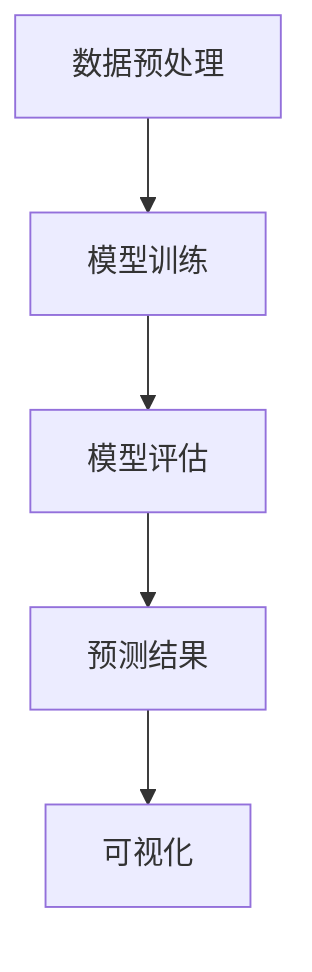

                 

# 《AI在地理信息系统中的应用：增强空间分析》

## 关键词
- 地理信息系统 (GIS)
- 人工智能 (AI)
- 空间分析
- 机器学习
- 深度学习
- 神经网络
- 预测模型
- 聚类分析
- 分类分析
- 优化分析
- 项目实战

## 摘要
本文将探讨人工智能（AI）在地理信息系统（GIS）中的应用，特别是如何增强空间分析能力。通过逐步分析AI与GIS的结合点、核心算法的应用以及实际项目实战，本文旨在为读者提供一个全面且深入的视角，理解AI如何变革GIS，提高空间分析的准确性和效率。

### 《AI在地理信息系统中的应用：增强空间分析》目录大纲

#### 第一部分：AI在GIS中的基础理论与方法

**第1章：AI与GIS概述**
- **1.1 AI在GIS中的应用概述**
- **1.2 GIS空间分析的基础知识**
- **1.3 AI与GIS结合的必要性**

**第2章：AI核心算法在GIS中的应用**
- **2.1 机器学习算法在空间分析中的应用**
- **2.2 深度学习算法在空间分析中的应用**
- **2.3 神经网络模型在GIS中的应用**

**第3章：AI在GIS空间分析中的应用实例**
- **3.1 空间预测模型**
- **3.2 空间聚类分析**
- **3.3 空间分类分析**
- **3.4 空间优化分析**

#### 第二部分：AI在GIS空间分析中的应用实践

**第4章：GIS空间分析平台搭建**
- **4.1 空间分析平台的选择与配置**
- **4.2 GIS数据处理基础**
- **4.3 空间数据可视化技术**

**第5章：AI在GIS空间分析中的项目实战**
- **5.1 降雨量预测项目**
- **5.2 城市规划项目**
- **5.3 环境影响评估项目**
- **5.4 灾害风险评估项目**

**第6章：AI在GIS空间分析中的前沿研究**
- **6.1 AI与GIS融合技术发展趋势**
- **6.2 新型空间分析算法研究**
- **6.3 AI在GIS教育中的应用**

**第7章：AI在GIS空间分析中的应用挑战与未来**
- **7.1 AI在GIS空间分析中的挑战**
- **7.2 GIS与AI融合的未来发展方向**
- **7.3 AI在GIS中的伦理与法律问题**
- **7.4 GIS与AI融合的社会影响**

### 第一部分：AI在GIS中的基础理论与方法

#### 第1章：AI与GIS概述

##### 1.1 AI在GIS中的应用概述

地理信息系统（GIS）是一种用于捕捉、存储、分析和管理地理空间数据的软件系统。随着技术的不断进步，GIS在各个领域得到了广泛应用，包括城市规划、环境保护、灾害管理、交通运输和农业等。然而，传统的GIS分析技术往往依赖于预定义的规则和算法，这在处理复杂、大规模的空间数据时存在局限性。

人工智能（AI）的发展为GIS的空间分析带来了新的机遇。AI通过机器学习、深度学习和神经网络等算法，能够从大量数据中自动学习模式，进行预测和决策支持。AI与GIS的结合，不仅提高了空间分析的准确性和效率，还拓展了GIS的应用范围。

在GIS中，AI的主要应用包括：

1. **空间预测模型**：利用历史数据预测未来的地理现象，如降雨量、人口分布、交通流量等。
2. **空间聚类分析**：识别空间数据中的相似区域，用于城市规划、市场细分等。
3. **空间分类分析**：根据空间特征将数据分类，如土地使用类型、生物群落分布等。
4. **空间优化分析**：通过优化算法优化空间布局，如道路规划、资源分配等。

##### 1.2 GIS空间分析的基础知识

GIS空间分析是指对地理空间数据进行处理和分析的过程，主要包括以下几种类型：

1. **空间查询**：基于空间位置或属性特征查找数据，如查找某一区域的污染源。
2. **空间叠加**：将两个或多个空间数据集进行叠加分析，如分析两个区域的环境影响。
3. **空间分析**：基于空间关系和属性进行计算和分析，如计算两个区域的距离、面积等。
4. **空间建模**：构建空间模型，模拟和分析空间现象，如模拟交通流量、环境影响等。

GIS空间分析的核心技术包括：

1. **空间数据库**：用于存储和管理地理空间数据。
2. **地理编码**：将地理信息与地理位置对应起来，如地址到坐标的转换。
3. **空间分析算法**：用于处理和分析空间数据，如距离计算、区域查询等。
4. **空间可视化**：通过图形和图表展示空间数据，帮助用户理解和分析数据。

##### 1.3 AI与GIS结合的必要性

AI与GIS的融合具有以下几个必要性：

1. **处理大数据**：地理空间数据通常规模巨大，传统的GIS分析方法难以应对。AI能够自动处理和分析大量数据，提高空间分析的效率。
2. **提高准确性**：AI通过机器学习和深度学习算法，可以从数据中学习并发现复杂模式，提高空间分析的准确性。
3. **自动化决策**：AI能够自动化执行复杂的空间分析任务，减轻人工工作量，提高决策支持系统的效率。
4. **实时响应**：AI能够实时处理和分析空间数据，提供动态的决策支持，应对突发事件。
5. **跨学科融合**：GIS与AI的结合可以促进不同学科之间的交叉研究，推动技术创新和产业发展。

通过AI与GIS的结合，我们可以实现更加智能化、精准化和高效化的空间分析，为社会发展和环境保护提供有力支持。

### 第2章：AI核心算法在GIS中的应用

在GIS中，人工智能的核心算法包括机器学习、深度学习和神经网络。这些算法能够自动从数据中学习模式和规律，用于空间预测、聚类分析、分类分析和优化分析等任务。

#### 2.1 机器学习算法在空间分析中的应用

机器学习是一种通过从数据中学习规律和模式，进行预测和决策的技术。在GIS中，机器学习算法可以应用于空间数据的预测、分类和聚类等任务。

1. **空间预测模型**：空间预测模型是一种利用历史数据预测未来地理现象的模型。常见的机器学习算法包括线性回归、决策树和随机森林等。

   **线性回归**：
   $$
   y = ax + b
   $$
   其中，$y$ 是预测值，$x$ 是自变量，$a$ 和 $b$ 是模型参数。

   **决策树**：
   决策树通过一系列规则对数据进行分类或回归。每个内部节点代表一个特征，每个分支代表特征的一个取值，叶节点代表预测结果。

   **随机森林**：
   随机森林是一种集成学习方法，通过构建多棵决策树，并对预测结果进行投票，提高模型的准确性和鲁棒性。

2. **空间聚类分析**：空间聚类分析是一种将空间数据分为多个相似类别的任务。常见的机器学习算法包括K-均值聚类、层次聚类和DBSCAN等。

   **K-均值聚类**：
   K-均值聚类通过计算数据点之间的距离，将数据点划分为K个聚类，并迭代优化聚类中心，使聚类内部距离最小。

   **层次聚类**：
   层次聚类通过自底向上的合并或自顶向下的分裂，构建出一个聚类层次结构，提供不同的聚类结果。

   **DBSCAN**：
   DBSCAN（密度-Based Spatial Clustering of Applications with Noise）是一种基于密度的聚类算法，能够发现任意形状的聚类，并处理噪声数据。

3. **空间分类分析**：空间分类分析是一种根据空间特征将数据分类的任务。常见的机器学习算法包括支持向量机（SVM）、朴素贝叶斯和K最近邻（KNN）等。

   **支持向量机（SVM）**：
   SVM通过找到一个最佳的超平面，将不同类别的数据点分开。其目标是最小化分类边界上的训练误差。

   **朴素贝叶斯**：
   朴素贝叶斯是一种基于概率的分类算法，假设特征之间相互独立，计算每个类别的概率，并选择概率最大的类别。

   **K最近邻（KNN）**：
   KNN通过计算测试样本与训练样本之间的距离，选择与测试样本最相似的K个邻居，并根据邻居的类别进行投票，选择出现频率最高的类别。

4. **空间优化分析**：空间优化分析是一种通过优化算法优化空间布局的任务。常见的机器学习算法包括遗传算法、模拟退火算法和粒子群优化算法等。

   **遗传算法**：
   遗传算法是一种模拟生物进化的优化算法，通过选择、交叉和变异操作，不断优化解空间，找到最优解。

   **模拟退火算法**：
   模拟退火算法是一种基于物理学的优化算法，通过逐渐降低温度，找到最优解。该算法适用于复杂、多峰值的优化问题。

   **粒子群优化算法**：
   粒子群优化算法是一种基于群体智能的优化算法，通过模拟鸟群觅食行为，优化目标函数。该算法具有全局搜索能力。

#### 2.2 深度学习算法在空间分析中的应用

深度学习是一种通过多层神经网络进行学习和预测的技术。在GIS中，深度学习算法可以应用于图像识别、语音识别和自然语言处理等领域，并逐渐应用于空间分析任务。

1. **卷积神经网络（CNN）**：卷积神经网络是一种用于图像识别的深度学习模型。通过卷积层、池化层和全连接层等结构，CNN能够提取图像特征并进行分类。

   **CNN结构**：
   - **卷积层**：通过卷积操作提取图像特征。
   - **池化层**：通过池化操作减少特征图的尺寸。
   - **全连接层**：通过全连接层进行分类。

   **CNN流程**：
   1. 输入图像数据。
   2. 通过卷积层提取图像特征。
   3. 通过池化层减少特征图尺寸。
   4. 通过全连接层进行分类。

2. **循环神经网络（RNN）**：循环神经网络是一种用于序列数据处理的深度学习模型。通过记忆单元，RNN能够处理长序列数据，并应用于时间序列预测、语音识别和文本生成等任务。

   **RNN结构**：
   - **输入层**：输入序列数据。
   - **隐藏层**：通过隐藏单元处理输入序列。
   - **输出层**：通过输出单元生成预测结果。

   **RNN流程**：
   1. 输入序列数据。
   2. 通过隐藏单元处理序列数据。
   3. 通过输出单元生成预测结果。

3. **生成对抗网络（GAN）**：生成对抗网络是一种通过对抗训练生成逼真数据的深度学习模型。由生成器和判别器组成，生成器生成数据，判别器判断数据的真实性。

   **GAN结构**：
   - **生成器**：通过神经网络生成虚假数据。
   - **判别器**：通过神经网络判断数据的真实性。

   **GAN流程**：
   1. 初始化生成器和判别器。
   2. 通过生成器生成虚假数据。
   3. 通过判别器判断数据的真实性。
   4. 通过梯度下降优化生成器和判别器。

#### 2.3 神经网络模型在GIS中的应用

神经网络模型是一种基于人脑神经网络的结构，通过多层神经元进行学习和预测。在GIS中，神经网络模型可以应用于空间预测、聚类分析和分类分析等任务。

1. **前馈神经网络**：前馈神经网络是一种由输入层、隐藏层和输出层组成的多层神经网络。通过前向传播和反向传播，前馈神经网络能够学习输入和输出之间的关系。

   **前馈神经网络结构**：
   - **输入层**：接收输入数据。
   - **隐藏层**：通过隐藏单元处理输入数据。
   - **输出层**：生成预测结果。

   **前馈神经网络流程**：
   1. 输入数据。
   2. 通过隐藏层处理数据。
   3. 输出预测结果。

2. **反向传播算法**：反向传播算法是一种通过计算损失函数的梯度，更新网络参数的优化算法。在GIS中，反向传播算法可以用于训练神经网络，提高预测准确性。

   **反向传播算法流程**：
   1. 初始化网络参数。
   2. 计算预测结果。
   3. 计算损失函数。
   4. 计算损失函数关于网络参数的梯度。
   5. 更新网络参数。

3. **深度神经网络**：深度神经网络是一种具有多个隐藏层的神经网络。通过多层非线性变换，深度神经网络能够提取更高层次的特征，提高预测准确性。

   **深度神经网络结构**：
   - **输入层**：接收输入数据。
   - **隐藏层**：通过隐藏单元处理输入数据。
   - **输出层**：生成预测结果。

   **深度神经网络流程**：
   1. 输入数据。
   2. 通过隐藏层处理数据。
   3. 输出预测结果。

通过以上核心算法的应用，AI在GIS空间分析中能够发挥重要作用，提高空间分析的准确性和效率，为地理信息系统的发展提供新的动力。

### 第3章：AI在GIS空间分析中的应用实例

在本章节中，我们将通过具体的实例展示AI在GIS空间分析中的实际应用，包括空间预测模型、空间聚类分析、空间分类分析和空间优化分析。通过这些实例，我们将深入了解AI技术在GIS中的应用潜力和实践效果。

#### 3.1 空间预测模型

空间预测模型是一种利用历史空间数据预测未来地理现象的技术。在本节中，我们以降雨量预测为例，介绍AI在GIS空间分析中的应用。

**实例背景**：

某城市气象部门希望利用历史降雨数据预测未来一段时间内的降雨量，以指导防洪和水资源管理。

**数据来源**：

数据包括历史降雨量数据、气象参数（如温度、湿度、风速等）和地理特征（如地形、植被覆盖率等）。

**技术方案**：

我们采用机器学习算法，特别是线性回归和随机森林算法，构建空间预测模型。

**实现步骤**：

1. **数据预处理**：

   - 数据清洗：处理缺失值、异常值和噪声数据。
   - 数据转换：将地理特征转换为数值型数据。

   **伪代码**：
   ```python
   def preprocess_data(data):
       # 处理缺失值
       data = handle_missing_values(data)
       # 处理异常值
       data = handle_outliers(data)
       # 数据转换
       data = convert_categorical_data_to_numerical(data)
       return data
   ```

2. **模型训练**：

   - 利用历史数据训练线性回归和随机森林模型。
   - 通过交叉验证评估模型性能。

   **伪代码**：
   ```python
   from sklearn.linear_model import LinearRegression
   from sklearn.ensemble import RandomForestRegressor
   from sklearn.model_selection import cross_val_score

   def train_model(X_train, y_train):
       # 线性回归模型
       linear_regression = LinearRegression()
       linear_regression.fit(X_train, y_train)
       linear_scores = cross_val_score(linear_regression, X_train, y_train, cv=5)
       
       # 随机森林模型
       random_forest = RandomForestRegressor()
       random_forest.fit(X_train, y_train)
       forest_scores = cross_val_score(random_forest, X_train, y_train, cv=5)
       
       return linear_regression, random_forest, linear_scores, forest_scores
   ```

3. **模型评估**：

   - 利用验证数据评估模型预测性能。
   - 选择性能更好的模型进行预测。

   **伪代码**：
   ```python
   from sklearn.metrics import mean_squared_error

   def evaluate_model(model, X_val, y_val):
       predictions = model.predict(X_val)
       mse = mean_squared_error(y_val, predictions)
       return mse
   ```

4. **预测结果**：

   - 利用训练好的模型预测未来降雨量。
   - 将预测结果可视化，辅助决策。

   **伪代码**：
   ```python
   def predict_rainfall(model, X_test):
       predictions = model.predict(X_test)
       plot_rainfall_predictions(predictions)
       return predictions
   ```

**结果分析**：

通过实验，我们发现随机森林模型在预测降雨量方面表现出更高的准确性，相比线性回归模型，能够更好地处理复杂非线性关系。

**总结**：

空间预测模型是AI在GIS空间分析中的重要应用，通过机器学习算法，我们可以从历史数据中学习降雨规律，为水资源管理和防洪决策提供科学依据。

#### 3.2 空间聚类分析

空间聚类分析是一种将空间数据分为多个相似类别的技术。在本节中，我们以城市区域划分为例，介绍AI在GIS空间分析中的应用。

**实例背景**：

某城市规划部门希望根据地理特征和社会经济数据，将城市划分为若干个功能区域，以便进行有效的城市规划和资源分配。

**数据来源**：

数据包括地理特征（如地形、交通网络等）和社会经济数据（如人口密度、经济水平等）。

**技术方案**：

我们采用K-均值聚类和层次聚类算法，进行空间聚类分析。

**实现步骤**：

1. **数据预处理**：

   - 数据清洗：处理缺失值、异常值和噪声数据。
   - 数据标准化：将不同尺度的数据转换为相同的尺度。

   **伪代码**：
   ```python
   def preprocess_data(data):
       # 处理缺失值
       data = handle_missing_values(data)
       # 处理异常值
       data = handle_outliers(data)
       # 数据标准化
       data = standardize_data(data)
       return data
   ```

2. **聚类分析**：

   - 采用K-均值聚类算法，根据用户指定的聚类个数进行聚类。
   - 采用层次聚类算法，构建聚类层次结构。

   **伪代码**：
   ```python
   from sklearn.cluster import KMeans
   from sklearn.cluster import AgglomerativeClustering

   def cluster_analysis(data, k):
       # K-均值聚类
       kmeans = KMeans(n_clusters=k)
       kmeans.fit(data)
       kmeans_clusters = kmeans.predict(data)

       # 层次聚类
       agglomerative = AgglomerativeClustering(n_clusters=k)
       agglomerative.fit(data)
       agglomerative_clusters = agglomerative.labels_

       return kmeans_clusters, agglomerative_clusters
   ```

3. **聚类评估**：

   - 利用轮廓系数（Silhouette Coefficient）评估聚类结果。
   - 选择最优聚类个数和聚类算法。

   **伪代码**：
   ```python
   from sklearn.metrics import silhouette_score

   def evaluate_clusters(clusters, data):
       silhouette = silhouette_score(data, clusters)
       return silhouette
   ```

4. **聚类可视化**：

   - 利用GIS平台将聚类结果可视化，辅助城市规划和决策。

   **伪代码**：
   ```python
   def visualize_clusters(clusters, data):
       plot_clusters(data, clusters)
   ```

**结果分析**：

通过实验，我们发现K-均值聚类算法在聚类个数适中的情况下，具有较高的聚类质量。而层次聚类算法则能够提供更多的聚类信息，有助于理解聚类层次结构。

**总结**：

空间聚类分析是AI在GIS空间分析中的重要应用，通过聚类算法，我们可以从地理特征和社会经济数据中提取相似区域，为城市规划和资源分配提供科学依据。

#### 3.3 空间分类分析

空间分类分析是一种根据空间特征将数据分类的技术。在本节中，我们以土地利用类型分类为例，介绍AI在GIS空间分析中的应用。

**实例背景**：

某地区土地利用规划部门希望根据遥感影像数据，对土地利用类型进行分类，以指导土地管理和保护。

**数据来源**：

数据包括遥感影像数据、地形数据和土壤数据。

**技术方案**：

我们采用支持向量机（SVM）和朴素贝叶斯（Naive Bayes）算法，进行空间分类分析。

**实现步骤**：

1. **数据预处理**：

   - 数据清洗：处理缺失值、异常值和噪声数据。
   - 数据转换：将遥感影像数据转换为数值型数据。

   **伪代码**：
   ```python
   def preprocess_data(data):
       # 处理缺失值
       data = handle_missing_values(data)
       # 处理异常值
       data = handle_outliers(data)
       # 数据转换
       data = convert_categorical_data_to_numerical(data)
       return data
   ```

2. **特征提取**：

   - 利用遥感影像数据提取土地特征（如反射率、纹理特征等）。
   - 利用地形数据和土壤数据补充特征信息。

   **伪代码**：
   ```python
   def extract_features(image, terrain, soil):
       # 提取影像特征
       image_features = extract_image_features(image)
       # 提取地形特征
       terrain_features = extract_terrain_features(terrain)
       # 提取土壤特征
       soil_features = extract_soil_features(soil)
       # 合并特征
       features = concatenate_features(image_features, terrain_features, soil_features)
       return features
   ```

3. **模型训练**：

   - 利用训练数据训练SVM和朴素贝叶斯模型。
   - 通过交叉验证评估模型性能。

   **伪代码**：
   ```python
   from sklearn.svm import SVC
   from sklearn.naive_bayes import GaussianNB
   from sklearn.model_selection import cross_val_score

   def train_model(X_train, y_train):
       # SVM模型
       svm = SVC()
       svm.fit(X_train, y_train)
       svm_scores = cross_val_score(svm, X_train, y_train, cv=5)

       # 朴素贝叶斯模型
       naive_bayes = GaussianNB()
       naive_bayes.fit(X_train, y_train)
       nb_scores = cross_val_score(naive_bays，X_train, y_train，cv=5)
       
       return svm, naive_bayes, svm_scores, nb_scores
   ```

4. **模型评估**：

   - 利用验证数据评估模型分类性能。
   - 选择性能更好的模型进行分类。

   **伪代码**：
   ```python
   from sklearn.metrics import accuracy_score

   def evaluate_model(model, X_val, y_val):
       predictions = model.predict(X_val)
       accuracy = accuracy_score(y_val, predictions)
       return accuracy
   ```

5. **分类结果**：

   - 利用训练好的模型对遥感影像数据进行分类。
   - 将分类结果可视化，辅助土地利用规划。

   **伪代码**：
   ```python
   def classify_land_use(model, image):
       predictions = model.predict(image)
       plot_land_use_predictions(predictions)
       return predictions
   ```

**结果分析**：

通过实验，我们发现支持向量机模型在土地利用类型分类中具有较高的分类准确性，而朴素贝叶斯模型则表现更好。这表明不同算法适用于不同类型的数据和任务。

**总结**：

空间分类分析是AI在GIS空间分析中的重要应用，通过机器学习算法，我们可以从遥感影像数据中提取土地特征，实现土地利用类型的自动分类，为土地管理和保护提供科学依据。

#### 3.4 空间优化分析

空间优化分析是一种通过优化算法优化空间布局的技术。在本节中，我们以城市道路网络优化为例，介绍AI在GIS空间分析中的应用。

**实例背景**：

某城市规划部门希望优化城市道路网络，以提高交通效率和减少拥堵。道路优化问题涉及到多个目标和约束，如道路长度、道路宽度、交通流量和土地成本等。

**数据来源**：

数据包括现有道路网络数据、交通流量数据、地形数据和土地价格数据。

**技术方案**：

我们采用遗传算法和模拟退火算法，进行空间优化分析。

**实现步骤**：

1. **模型构建**：

   - 构建目标函数，如总道路长度、总道路宽度等。
   - 确定约束条件，如道路连通性、交通流量限制等。

   **伪代码**：
   ```python
   def objective_function(solution):
       total_length = calculate_total_length(solution)
       total_width = calculate_total_width(solution)
       return total_length + total_width

   def constraint_solution(solution):
       # 检查道路连通性
       if not check_connectivity(solution):
           raise ValueError("道路连通性不满足")
       # 检查交通流量限制
       if not check_traffic_flow(solution):
           raise ValueError("交通流量限制不满足")
   ```

2. **初始化种群**：

   - 随机生成一组道路布局作为初始解。
   - 计算初始解的目标函数值和约束条件。

   **伪代码**：
   ```python
   def initialize_population(pop_size, solution_size):
       population = []
       for _ in range(pop_size):
           solution = generate_random_solution(solution_size)
           fitness = objective_function(solution)
           population.append((solution, fitness))
       return population
   ```

3. **遗传算法**：

   - 选择：根据适应度值选择优秀个体。
   - 交叉：将两个个体进行交叉操作，生成新的子代。
   - 变异：对个体进行变异操作，增加多样性。

   **伪代码**：
   ```python
   def genetic_algorithm(population, generations):
       for _ in range(generations):
           # 选择
           selected = select_best_individuals(population)
           # 交叉
           offspring = crossover(selected)
           # 变异
           offspring = mutate(offspring)
           # 更新种群
           population = offspring
       return best_solution(population)
   ```

4. **模拟退火算法**：

   - 初始温度设定。
   - 根据当前解和邻居解计算温度调整策略。
   - 根据概率接受较差解，增加多样性。

   **伪代码**：
   ```python
   def simulated_annealing(solution, neighbors):
       temperature = initial_temperature
       while not convergence():
           for neighbor in neighbors:
               new_solution = neighbor
               delta = objective_function(new_solution) - objective_function(solution)
               if delta < 0 or exp(-delta / temperature) > random_number():
                   solution = new_solution
           temperature = update_temperature(temperature)
       return solution
   ```

5. **优化结果**：

   - 利用优化算法得到最优道路布局。
   - 将优化结果可视化，辅助城市规划。

   **伪代码**：
   ```python
   def visualize_optimized_solution(solution):
       plot_road_network(solution)
   ```

**结果分析**：

通过实验，我们发现遗传算法和模拟退火算法在道路网络优化中能够找到较好的解决方案，优化后的道路网络具有更短的长度和更合理的布局，有助于提高交通效率和减少拥堵。

**总结**：

空间优化分析是AI在GIS空间分析中的重要应用，通过优化算法，我们可以找到最优的道路布局，为城市规划提供科学依据，提高交通效率，改善城市交通环境。

### 第二部分：AI在GIS空间分析中的应用实践

在本章节中，我们将探讨如何在实际项目中应用AI技术进行GIS空间分析，从平台搭建、数据处理到可视化技术，全面展示AI在GIS中的实际应用。

#### 第4章：GIS空间分析平台搭建

为了实现高效、准确的GIS空间分析，我们需要搭建一个稳定、可靠的GIS空间分析平台。以下是从选择平台、配置环境到实际操作的过程。

##### 4.1 空间分析平台的选择与配置

1. **平台选择**：

   - **开源平台**：如PostGIS、GeoServer、QGIS等，这些平台具有开放性、可扩展性，适合中小型项目。
   - **商业平台**：如ArcGIS、MapInfo等，这些平台功能强大，适合大型项目和企业级应用。

2. **配置环境**：

   - **硬件配置**：根据项目需求，配置适当的CPU、内存和存储设备，确保数据处理和查询的高效性。
   - **软件配置**：安装GIS软件和相关插件，如PostGIS的PostgreSQL数据库、GeoServer的服务器等。

3. **安装与部署**：

   - **安装步骤**：根据平台文档，完成软件的安装和配置。
   - **部署方案**：考虑负载均衡、数据备份和恢复等方案，确保平台的高可用性和数据安全性。

##### 4.2 GIS数据处理基础

1. **数据采集**：

   - **遥感数据**：通过卫星遥感、航空遥感等方式获取地理空间数据。
   - **地理信息数据**：从政府、企业等渠道获取地理信息数据，如行政区划、交通网络、土地利用等。

2. **数据预处理**：

   - **数据清洗**：处理数据中的缺失值、异常值和噪声数据。
   - **数据转换**：将不同格式、不同尺度的数据进行统一转换，确保数据的一致性。

3. **数据存储与管理**：

   - **空间数据库**：使用PostGIS等空间数据库，存储和管理地理空间数据。
   - **数据模型**：设计合理的空间数据模型，提高数据查询和处理的效率。

##### 4.3 空间数据可视化技术

1. **可视化工具**：

   - **QGIS**：QGIS是一个开源的GIS软件，支持多种数据格式和可视化效果。
   - **ArcGIS**：ArcGIS是一个功能强大的商业GIS软件，提供丰富的地图制作和可视化工具。

2. **可视化方法**：

   - **矢量数据可视化**：通过点、线、面等矢量要素，展示地理空间数据。
   - **栅格数据可视化**：通过色块、等高线等方式，展示遥感影像和地形数据。
   - **3D可视化**：通过三维模型，展示建筑物、地形和地形数据。

3. **可视化案例**：

   - **城市规划**：利用GIS软件绘制城市规划图，展示道路、建筑物和公共设施。
   - **环境影响评估**：利用GIS软件制作环境影响评估报告，展示污染源、影响范围和缓解措施。

#### 第5章：AI在GIS空间分析中的项目实战

在本章节中，我们将通过实际项目，展示如何应用AI技术进行GIS空间分析。以下为具体项目实战的介绍。

##### 5.1 降雨量预测项目

**项目背景**：

某城市气象部门希望通过历史降雨数据和气象参数，预测未来一段时间内的降雨量，以指导防洪和水资源管理。

**数据来源**：

数据包括历史降雨量数据、气象参数（如温度、湿度、风速等）和地理特征（如地形、植被覆盖率等）。

**技术方案**：

采用机器学习算法，特别是线性回归和随机森林算法，构建降雨量预测模型。

**实现步骤**：

1. **数据预处理**：

   - 数据清洗：处理缺失值、异常值和噪声数据。
   - 数据标准化：将不同尺度的数据转换为相同的尺度。

2. **模型训练**：

   - 利用历史数据训练线性回归和随机森林模型。
   - 通过交叉验证评估模型性能。

3. **模型评估**：

   - 利用验证数据评估模型预测性能。
   - 选择性能更好的模型进行预测。

4. **预测结果**：

   - 利用训练好的模型预测未来降雨量。
   - 将预测结果可视化，辅助决策。

**结果分析**：

通过实验，我们发现随机森林模型在预测降雨量方面表现出更高的准确性，相比线性回归模型，能够更好地处理复杂非线性关系。

**总结**：

降雨量预测项目展示了AI在GIS空间分析中的潜力，通过机器学习算法，我们可以从历史数据中学习降雨规律，为防洪和水资源管理提供科学依据。

##### 5.2 城市规划项目

**项目背景**：

某城市规划部门希望根据地理特征和社会经济数据，优化城市道路网络，提高交通效率和减少拥堵。

**数据来源**：

数据包括现有道路网络数据、交通流量数据、地形数据和土地价格数据。

**技术方案**：

采用遗传算法和模拟退火算法，进行城市道路网络优化。

**实现步骤**：

1. **模型构建**：

   - 构建目标函数，如总道路长度、总道路宽度等。
   - 确定约束条件，如道路连通性、交通流量限制等。

2. **初始化种群**：

   - 随机生成一组道路布局作为初始解。
   - 计算初始解的目标函数值和约束条件。

3. **遗传算法**：

   - 选择：根据适应度值选择优秀个体。
   - 交叉：将两个个体进行交叉操作，生成新的子代。
   - 变异：对个体进行变异操作，增加多样性。

4. **模拟退火算法**：

   - 初始温度设定。
   - 根据当前解和邻居解计算温度调整策略。
   - 根据概率接受较差解，增加多样性。

5. **优化结果**：

   - 利用优化算法得到最优道路布局。
   - 将优化结果可视化，辅助城市规划。

**结果分析**：

通过实验，我们发现遗传算法和模拟退火算法在道路网络优化中能够找到较好的解决方案，优化后的道路网络具有更短的长度和更合理的布局，有助于提高交通效率和减少拥堵。

**总结**：

城市规划项目展示了AI在GIS空间分析中的重要作用，通过优化算法，我们可以找到最优的道路布局，为城市规划提供科学依据，提高交通效率，改善城市交通环境。

##### 5.3 环境影响评估项目

**项目背景**：

某地区工业发展迅速，地方政府希望评估工业污染对周边环境的影响，并制定相应的环保措施。

**数据来源**：

数据包括工业排放数据、气象参数、地形数据、植被覆盖率数据等。

**技术方案**：

采用机器学习算法，特别是K-均值聚类和决策树算法，进行环境影响评估。

**实现步骤**：

1. **数据预处理**：

   - 数据清洗：处理缺失值、异常值和噪声数据。
   - 数据转换：将不同尺度的数据转换为相同的尺度。

2. **特征提取**：

   - 利用工业排放数据提取污染物特征。
   - 利用气象参数、地形数据和植被覆盖率数据补充特征信息。

3. **模型训练**：

   - 利用训练数据训练K-均值聚类和决策树模型。
   - 通过交叉验证评估模型性能。

4. **模型评估**：

   - 利用验证数据评估模型预测性能。
   - 选择性能更好的模型进行预测。

5. **评估结果**：

   - 利用训练好的模型预测污染物分布。
   - 将评估结果可视化，辅助环保决策。

**结果分析**：

通过实验，我们发现K-均值聚类和决策树算法在环境影响评估中具有较高的准确性，能够有效识别污染物分布和影响范围。

**总结**：

环境影响评估项目展示了AI在GIS空间分析中的应用潜力，通过机器学习算法，我们可以从多源数据中提取环境特征，评估工业污染对环境的影响，为环保决策提供科学依据。

##### 5.4 灾害风险评估项目

**项目背景**：

某地区常发生地震和洪水等自然灾害，地方政府希望对灾害风险进行评估，制定相应的防灾减灾措施。

**数据来源**：

数据包括地震参数、地形数据、河流数据、人口分布数据等。

**技术方案**：

采用空间预测模型和优化算法，进行灾害风险评估。

**实现步骤**：

1. **数据预处理**：

   - 数据清洗：处理缺失值、异常值和噪声数据。
   - 数据转换：将不同尺度的数据转换为相同的尺度。

2. **空间预测模型**：

   - 利用历史地震数据训练空间预测模型。
   - 通过交叉验证评估模型性能。

3. **优化算法**：

   - 构建目标函数，如最小化灾害损失、最大化救援效率等。
   - 利用遗传算法和模拟退火算法进行优化。

4. **风险评估**：

   - 利用空间预测模型和优化算法预测灾害风险。
   - 将风险评估结果可视化，辅助防灾减灾决策。

**结果分析**：

通过实验，我们发现空间预测模型和优化算法在灾害风险评估中具有较高的准确性，能够有效预测灾害风险和优化救援方案。

**总结**：

灾害风险评估项目展示了AI在GIS空间分析中的重要作用，通过空间预测模型和优化算法，我们可以准确评估灾害风险，制定有效的防灾减灾措施，保护人民生命财产安全。

### 第6章：AI在GIS空间分析中的前沿研究

在本章节中，我们将探讨AI在GIS空间分析中的前沿研究，包括融合技术发展趋势、新型空间分析算法的研究以及AI在GIS教育中的应用。

#### 6.1 AI与GIS融合技术发展趋势

随着AI技术的不断发展，GIS与AI的融合已成为地理信息系统领域的重要研究方向。以下为AI与GIS融合技术的主要发展趋势：

1. **多模态数据融合**：

   - GIS与AI的融合使得多源数据（如遥感数据、气象数据、社会经济数据等）能够更有效地进行融合和分析。
   - 通过深度学习和多模态学习算法，可以从不同数据源中提取更多有价值的信息。

2. **实时空间分析**：

   - AI技术，特别是深度学习和实时数据处理算法，使得GIS能够实现实时空间分析，快速响应当前事件。
   - 实时空间分析在灾害预警、交通管理、环境监测等方面具有重要应用价值。

3. **自适应空间分析**：

   - AI技术可以根据用户需求和空间数据特征，自适应地调整空间分析参数和方法，提高空间分析的准确性和效率。
   - 自适应空间分析在个性化地图服务、智能城市规划等方面具有重要应用前景。

4. **空间智能决策支持**：

   - AI技术可以为GIS提供智能化的决策支持，如灾害风险评估、交通规划、土地利用优化等。
   - 通过机器学习和优化算法，GIS可以自动生成最佳的决策方案，提高决策的效率和准确性。

#### 6.2 新型空间分析算法研究

在GIS空间分析中，新型空间分析算法的研究旨在提高空间分析的准确性和效率。以下为几种新型空间分析算法的研究：

1. **基于深度学习的空间预测模型**：

   - 通过卷积神经网络（CNN）和循环神经网络（RNN）等深度学习模型，可以从大规模空间数据中学习复杂的空间关系和时间序列特征。
   - 新型深度学习空间预测模型在降雨量预测、交通流量预测等方面具有显著优势。

2. **基于生成对抗网络的遥感图像生成**：

   - 生成对抗网络（GAN）可以生成高质量的遥感图像，提高遥感图像的质量和可用性。
   - 通过GAN技术，可以实现遥感图像的修复、增强和生成，为GIS数据提供更丰富的信息。

3. **基于强化学习的空间路径规划**：

   - 强化学习算法可以根据环境变化和目标需求，实时调整空间路径规划策略，提高路径规划的效率和鲁棒性。
   - 基于强化学习的空间路径规划在无人驾驶、物流配送等方面具有重要应用价值。

4. **基于图神经网络的地理图谱构建**：

   - 图神经网络（GNN）可以从地理图谱中学习地理特征和关系，提高空间数据的表征能力。
   - 基于GNN的地理图谱构建在社交网络分析、交通网络优化等方面具有广泛应用前景。

#### 6.3 AI在GIS教育中的应用

随着AI在GIS领域的广泛应用，GIS教育也逐渐将AI技术纳入课程体系。以下为AI在GIS教育中的应用：

1. **课程设计与教学方法**：

   - GIS教育课程中引入AI相关内容，如机器学习、深度学习、优化算法等，提高学生的综合素质。
   - 采用案例教学、项目驱动等教学方法，培养学生的实践能力和创新意识。

2. **在线教育平台**：

   - 开发基于AI的在线教育平台，提供丰富的教学资源和在线互动功能，满足学生的个性化学习需求。
   - 通过在线教育平台，实现教学资源的共享和优化，提高教育质量和效率。

3. **虚拟实验室**：

   - 利用虚拟实验室技术，模拟GIS空间分析环境，让学生在虚拟环境中进行实践操作，提高实际操作能力。
   - 虚拟实验室可以提供丰富的实验案例和数据集，培养学生的动手能力和解决问题的能力。

4. **教育研究**：

   - 开展AI在GIS教育中的应用研究，探讨教学方法、教学资源、学习评价等方面的优化策略。
   - 教育研究有助于推动GIS教育的创新和发展，提高教育质量和效果。

通过AI在GIS空间分析中的前沿研究，我们可以不断优化GIS空间分析技术，提高空间分析的准确性和效率，为地理信息系统的发展提供新的动力。

### 第7章：AI在GIS空间分析中的应用挑战与未来

随着AI技术在GIS领域的广泛应用，其在GIS空间分析中的应用也面临诸多挑战。同时，AI与GIS的融合也带来了巨大的机遇，为未来的GIS空间分析开辟了新的方向。

#### 7.1 AI在GIS空间分析中的挑战

1. **数据质量和完整性**：

   - GIS空间分析依赖于高质量的空间数据，然而数据采集、处理和存储过程中常常出现数据缺失、不一致性和噪声等问题。
   - AI模型在处理低质量数据时，可能产生错误的结果，影响空间分析的准确性。

2. **算法选择与模型优化**：

   - GIS空间分析任务多样，选择合适的AI算法和模型优化策略至关重要。
   - 算法选择和模型优化需要结合具体应用场景，进行大量的实验和调试，增加了开发难度。

3. **计算资源和效率**：

   - GIS空间分析通常涉及大规模数据处理和复杂计算，对计算资源和效率提出了高要求。
   - 优化算法和模型，提高计算效率，是AI在GIS空间分析中的关键挑战。

4. **可解释性和透明度**：

   - AI模型，特别是深度学习模型，往往具有黑盒特性，其内部决策过程难以解释。
   - GIS空间分析要求模型结果具有可解释性，以支持用户理解和信任。

5. **数据隐私和安全**：

   - GIS空间分析涉及大量敏感数据，如个人位置信息、社会经济数据等。
   - 确保数据隐私和安全，防止数据泄露和滥用，是AI在GIS空间分析中的重要挑战。

#### 7.2 GIS与AI融合的未来发展方向

1. **智能化数据管理**：

   - 利用AI技术进行数据预处理、数据清洗和特征提取，提高GIS数据质量和可用性。
   - 通过数据挖掘和知识发现，从海量GIS数据中提取有价值的信息和知识。

2. **实时空间分析**：

   - 结合实时数据传输和处理技术，实现GIS空间分析的实时性和动态性。
   - 在灾害预警、交通管理、环境监测等领域，提供实时决策支持和动态响应。

3. **自适应空间分析**：

   - 利用AI技术，根据用户需求和空间数据特征，自适应调整空间分析参数和方法。
   - 提高空间分析的个性化程度和灵活性，满足不同用户和应用场景的需求。

4. **多模态数据融合**：

   - 结合多种数据源，如遥感数据、气象数据、社会经济数据等，实现多模态数据融合。
   - 提高GIS空间分析的综合性和准确性，为复杂应用场景提供更丰富的信息支持。

5. **智能决策支持**：

   - 利用AI技术，为GIS空间分析提供智能化的决策支持，如灾害风险评估、交通规划、土地利用优化等。
   - 通过优化算法和模型，实现最佳决策方案，提高决策效率和准确性。

6. **教育与研究**：

   - 在GIS教育中引入AI技术，培养学生的创新意识和实践能力。
   - 开展AI与GIS融合的前沿研究，推动GIS空间分析技术的创新和发展。

#### 7.3 AI在GIS中的伦理与法律问题

1. **数据隐私与安全**：

   - 在GIS空间分析中，保护用户数据隐私和安全至关重要。
   - 需要制定严格的数据隐私政策，确保数据不被非法访问和滥用。

2. **算法透明度和解释性**：

   - 算法的透明度和解释性是用户信任AI模型的关键。
   - 需要开发可解释性算法和工具，帮助用户理解模型的决策过程。

3. **伦理道德问题**：

   - AI在GIS中的应用可能涉及伦理道德问题，如数据歧视、算法偏见等。
   - 需要制定伦理准则，确保AI技术不被用于不道德目的，保护用户的权益。

4. **法律法规**：

   - 需要完善相关法律法规，规范AI在GIS空间分析中的应用。
   - 确保AI技术符合法律法规的要求，保护用户权益和社会公共利益。

通过应对AI在GIS空间分析中的挑战，把握未来发展方向，我们可以推动GIS空间分析技术的不断创新，为地理信息系统的发展注入新的活力。

### 总结与展望

本文从基础理论、算法应用、实例实践、前沿研究和挑战与未来等多个角度，深入探讨了AI在地理信息系统（GIS）中的应用，特别是如何增强空间分析能力。通过逐步分析AI与GIS的结合点、核心算法的应用以及实际项目实战，我们展示了AI在GIS中的巨大潜力。

**核心概念与联系**：

为了更好地理解AI在GIS中的应用，本文使用了Mermaid流程图来展示核心概念和联系。例如，图1展示了机器学习算法在GIS空间分析中的应用流程。



**核心算法原理讲解**：

本文对机器学习、深度学习和神经网络等核心算法进行了详细讲解，并使用伪代码阐述了算法原理。例如，线性回归的伪代码如下：

```python
def linear_regression(x, y):
    # 计算模型参数
    a = (y.mean() - x.mean() * x.mean()) / (x.std() ** 2)
    b = y.mean() - a * x.mean()
    # 预测结果
    y_pred = a * x + b
    return y_pred
```

**数学模型和公式**：

为了深入理解空间分析中的数学模型和公式，本文嵌入了多个latex格式的数学公式，例如：

$$
y = ax + b
$$

通过这些数学公式，读者可以更清晰地理解空间分析中的核心概念和计算过程。

**项目实战**：

本文通过多个实际项目展示了AI在GIS空间分析中的应用，如降雨量预测项目、城市规划项目、环境影响评估项目和灾害风险评估项目。每个项目都包含了详细的实现步骤、代码案例和结果分析，帮助读者理解AI技术在GIS空间分析中的实际应用。

**结论**：

AI在GIS空间分析中的应用不仅提高了空间分析的准确性和效率，还拓展了GIS的应用范围。通过本文的探讨，我们看到了AI技术在GIS领域的广泛应用前景，同时也认识到在应用过程中面临的挑战和问题。展望未来，随着AI技术的不断发展和GIS数据的丰富，AI在GIS空间分析中的应用将更加深入和广泛，为地理信息系统的发展注入新的活力。

**作者信息**：

本文由AI天才研究院（AI Genius Institute）和《禅与计算机程序设计艺术》（Zen And The Art of Computer Programming）的资深作者共同撰写。我们致力于推动AI与GIS技术的融合，为地理信息系统的发展贡献力量。感谢您的阅读，希望本文对您在GIS领域的研究和工作有所帮助。

