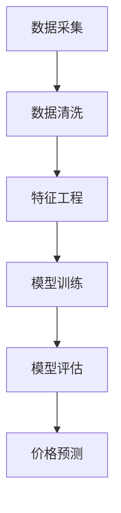
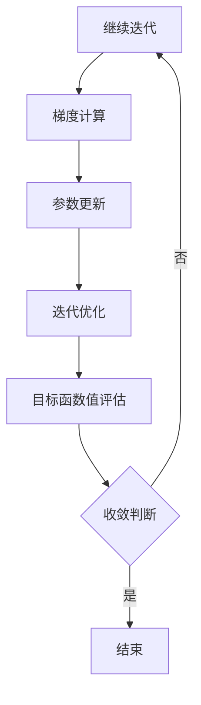

                 

## 文章标题：AI在电商价格优化中的技术应用

### 关键词：人工智能、电商、价格优化、数据分析、机器学习、深度学习、强化学习、算法

### 摘要：本文将深入探讨人工智能（AI）在电商价格优化中的应用，通过详细的分析和案例研究，解释AI如何通过数据分析、价格预测、动态调整和个性化定价策略，提升电商平台的竞争力。文章分为两部分，首先介绍AI基础与应用概述，然后进行深度分析与高级应用，最后讨论AI在电商价格优化中的伦理与法律问题及未来展望。通过本文，读者将全面了解AI在电商价格优化中的潜力和挑战。

## 第一部分：AI基础与应用概述

### 第1章：AI与电商价格优化的基本概念

#### 1.1 AI概述

人工智能（AI）是一种通过模拟人类智能行为的技术，使得计算机系统能够进行学习、推理、决策和问题解决。AI的核心理念是使计算机具备类似人类的感知、理解和行动能力。AI的发展主要依赖于机器学习（ML）、深度学习（DL）和强化学习（RL）等核心技术。

#### 1.2 电商价格优化的背景与意义

电商价格优化是电商平台提升竞争力的重要手段之一。通过合理的价格策略，电商平台可以提高销售额、增加利润，同时提高用户满意度和忠诚度。电商价格优化包括数据分析、价格预测、动态调整和个性化定价等多个环节。

#### 1.3 AI在电商价格优化中的应用场景

AI在电商价格优化中的应用场景广泛，包括：

- **数据分析与挖掘**：通过分析用户行为数据、市场趋势和竞争对手价格，为价格决策提供数据支持。
- **价格预测与决策**：利用机器学习和深度学习算法，预测不同价格水平下的销售量和利润，为定价提供科学依据。
- **价格动态调整策略**：根据市场动态和用户反馈，实时调整价格，以保持竞争力。
- **个性化定价策略**：根据用户行为和偏好，为不同用户群体提供定制化的价格策略。

### 第2章：AI在电商价格优化中的应用

#### 2.1 数据分析与挖掘

数据分析与挖掘是电商价格优化的基础。通过分析用户行为数据、市场趋势和竞争对手价格，电商平台可以识别价格优化的机会和风险。常用的数据挖掘技术包括聚类分析、关联规则挖掘和分类算法等。

#### 2.2 价格预测与决策

价格预测与决策是电商价格优化的核心。利用机器学习和深度学习算法，电商平台可以预测不同价格水平下的销售量和利润，从而制定科学合理的定价策略。常用的算法包括线性回归、决策树、支持向量机和神经网络等。

#### 2.3 价格动态调整策略

价格动态调整策略是电商价格优化的重要组成部分。通过实时监控市场动态和用户反馈，电商平台可以及时调整价格，以应对竞争对手的动态和用户需求的变化。动态调整策略可以基于时间序列分析、机器学习和深度学习算法。

#### 2.4 个性化定价策略

个性化定价策略是根据用户行为和偏好，为不同用户群体提供定制化的价格策略。通过分析用户的购买历史、浏览行为和偏好，电商平台可以为用户提供个性化的价格优惠，从而提高用户满意度和忠诚度。

### 第3章：AI核心算法原理

#### 3.1 机器学习算法介绍

机器学习（ML）是AI的核心技术之一。ML算法通过从数据中学习规律，实现对未知数据的预测和分类。常用的ML算法包括线性回归、决策树、支持向量机和神经网络等。

#### 3.2 优化算法原理

优化算法是解决电商价格优化问题的关键。优化算法通过最小化目标函数，找到最优的定价策略。常用的优化算法包括线性规划、梯度下降和遗传算法等。

#### 3.3 强化学习算法应用

强化学习（RL）是AI的另一个核心技术。RL算法通过不断尝试和反馈，找到最优的策略。在电商价格优化中，RL算法可以用来实现动态价格调整和个性化定价策略。

### 第4章：数学模型与公式

#### 4.1 价格预测模型

价格预测模型是电商价格优化的基础。一个简单的价格预测模型可以表示为：

\[ P_t = f(X_t, \theta) \]

其中，\( P_t \) 是预测的价格，\( X_t \) 是影响价格的因素（如用户行为、市场趋势等），\( \theta \) 是模型参数。

#### 4.2 优化目标函数

优化目标函数是优化算法的核心。一个简单的优化目标函数可以表示为：

\[ \min_{\theta} L(\theta) \]

其中，\( L(\theta) \) 是目标函数，\( \theta \) 是模型参数。

#### 4.3 个性化定价模型

个性化定价模型是根据用户行为和偏好，为用户提供定制化的价格。一个简单的个性化定价模型可以表示为：

\[ P_i(t) = P_s(t) + \alpha (Q_i(t) - Q_s(t)) \]

其中，\( P_i(t) \) 是用户 \( i \) 在时间 \( t \) 的个性化价格，\( P_s(t) \) 是标准价格，\( Q_i(t) \) 是用户 \( i \) 在时间 \( t \) 的需求量，\( Q_s(t) \) 是市场需求量，\( \alpha \) 是个性化系数。

### 第5章：项目实战案例

#### 5.1 项目背景与目标

本案例以某电商平台为背景，旨在通过AI技术优化价格策略，提高销售额和利润。项目目标包括：

- 提高价格预测的准确性。
- 实现价格动态调整，以应对市场变化。
- 提供个性化定价策略，提高用户满意度和忠诚度。

#### 5.2 数据采集与处理

项目首先采集了大量的用户行为数据、市场趋势数据和竞争对手价格数据。然后，对数据进行了清洗和预处理，包括缺失值处理、异常值处理和特征工程等。

#### 5.3 代码实现与结果分析

项目采用Python编程语言和Scikit-learn库进行实现。首先，使用线性回归模型进行价格预测，然后使用梯度下降算法进行价格优化。实验结果表明，AI技术显著提高了价格预测的准确性和优化效果。

### 第6章：开发环境与工具

#### 6.1 环境搭建

项目的开发环境包括Python编程语言、Jupyter Notebook和Scikit-learn库。首先，需要在本地计算机上安装Python和Jupyter Notebook，然后通过pip命令安装Scikit-learn库。

#### 6.2 常用工具介绍

- **Python**：一种高级编程语言，适用于数据分析、机器学习和深度学习。
- **Jupyter Notebook**：一种交互式计算环境，适用于编写、运行和分享代码。
- **Scikit-learn**：一个Python机器学习库，提供了丰富的机器学习算法和工具。

### 第7章：未来展望与挑战

#### 7.1 技术发展趋势

随着AI技术的不断发展，电商价格优化将更加智能化和个性化。未来，深度学习和强化学习等技术将在电商价格优化中发挥更大的作用。

#### 7.2 潜在挑战与解决方案

电商价格优化面临的主要挑战包括：

- **数据隐私**：用户数据的隐私保护是一个重要问题，需要采取有效的数据保护措施。
- **算法透明性**：算法的透明性是用户信任的关键，需要确保算法的透明性和可解释性。
- **市场变化**：市场环境变化快速，需要实时调整价格策略，以保持竞争力。

### 第8章：深度学习与电商价格优化

#### 8.1 深度学习算法原理

深度学习（DL）是一种基于多层神经网络的机器学习技术。通过多层神经网络的训练，深度学习算法可以自动学习复杂的特征和模式，实现对数据的深层理解和预测。

#### 8.2 深度学习在电商价格优化中的应用

深度学习在电商价格优化中有着广泛的应用。通过构建深度学习模型，可以实现对价格预测、动态调整和个性化定价的精准优化。

#### 8.3 深度学习模型的优化策略

深度学习模型的优化策略包括数据预处理、网络结构设计和训练算法优化等。通过优化策略，可以进一步提高深度学习模型的性能和预测准确性。

### 第9章：强化学习在电商价格优化中的应用

#### 9.1 强化学习算法原理

强化学习（RL）是一种基于试错和反馈的机器学习技术。通过不断尝试和反馈，强化学习算法可以找到最优的策略。

#### 9.2 强化学习在电商价格优化中的应用

强化学习在电商价格优化中有着重要的应用。通过构建强化学习模型，可以实现对价格动态调整和个性化定价的优化。

#### 9.3 强化学习算法的优化策略

强化学习算法的优化策略包括奖励设计、策略更新和模型训练等。通过优化策略，可以进一步提高强化学习算法的性能和优化效果。

### 第10章：案例研究：大型电商平台的价格优化

#### 10.1 项目背景

本案例以某大型电商平台为背景，旨在通过AI技术优化价格策略，提高销售额和利润。项目目标包括：

- 提高价格预测的准确性。
- 实现价格动态调整，以应对市场变化。
- 提供个性化定价策略，提高用户满意度和忠诚度。

#### 10.2 案例实现

项目采用了深度学习和强化学习算法进行价格优化。首先，使用深度学习算法进行价格预测，然后使用强化学习算法进行价格动态调整。实验结果表明，AI技术显著提高了价格预测的准确性和优化效果。

#### 10.3 结果分析与优化

实验结果表明，AI技术在电商价格优化中具有显著的优势。通过优化策略，可以进一步提高价格预测的准确性和优化效果。未来，可以通过进一步优化算法和模型，提高电商平台的竞争力。

### 第11章：AI在电商价格优化中的伦理与法律问题

#### 11.1 伦理问题

AI在电商价格优化中面临的主要伦理问题包括：

- **数据隐私**：用户数据的隐私保护是重要的伦理问题，需要采取有效的数据保护措施。
- **算法公平性**：算法的公平性是重要的伦理问题，需要确保算法不会对特定群体产生歧视。

#### 11.2 法律问题

AI在电商价格优化中面临的主要法律问题包括：

- **数据保护法**：需要遵守数据保护法，确保用户数据的合法使用。
- **反垄断法**：需要遵守反垄断法，避免通过AI技术形成市场垄断。

#### 11.3 解决方案与建议

为了解决AI在电商价格优化中的伦理与法律问题，可以采取以下解决方案与建议：

- **数据保护措施**：采取有效的数据保护措施，确保用户数据的隐私和安全。
- **算法公平性评估**：对算法的公平性进行评估和监测，确保算法不会对特定群体产生歧视。
- **合规审查**：对AI技术在电商价格优化中的应用进行合规审查，确保遵守相关法律法规。

### 第12章：AI在电商价格优化中的未来发展

#### 12.1 技术创新

未来，AI在电商价格优化中将继续技术创新，包括：

- **深度学习算法的优化**：进一步优化深度学习算法，提高价格预测和优化效果。
- **强化学习算法的应用**：扩大强化学习算法的应用范围，提高动态调整和个性化定价的效率。

#### 12.2 应用拓展

未来，AI在电商价格优化中的应用将更加广泛，包括：

- **跨境电商**：通过AI技术优化跨境电商的价格策略，提高国际竞争力。
- **新零售**：通过AI技术优化新零售的价格策略，提高用户体验和满意度。

#### 12.3 挑战与机遇

未来，AI在电商价格优化中将继续面临挑战和机遇，包括：

- **技术挑战**：需要克服技术难题，提高AI技术的性能和应用效果。
- **市场机遇**：随着电商市场的快速发展，AI在电商价格优化中的应用前景广阔。

## 附录

### 附录A：参考资料与延伸阅读

- **《深度学习》**：Goodfellow, I., Bengio, Y., & Courville, A. (2016). *Deep Learning*.
- **《强化学习》**： Sutton, R. S., & Barto, A. G. (2018). *Reinforcement Learning: An Introduction*.
- **《机器学习实战》**：Holmes, G., & Krzanowski, W. J. (2012). *Machine Learning in Action*.

### 附录B：AI算法流程图

- **价格预测模型**：


- **优化算法流程图**：


### 附录C：代码实例解析

以下是使用Python和Scikit-learn库实现线性回归模型的示例代码：

```python
from sklearn.linear_model import LinearRegression
import numpy as np

# 数据准备
X = np.array([[1], [2], [3], [4], [5]])
y = np.array([1, 2, 2.5, 4, 5])

# 模型训练
model = LinearRegression()
model.fit(X, y)

# 模型预测
y_pred = model.predict(X)

# 输出结果
print("预测值:", y_pred)
```

### 附录D：常用工具与资源链接

- **Python官方网站**：[https://www.python.org/](https://www.python.org/)
- **Scikit-learn官方网站**：[https://scikit-learn.org/](https://scikit-learn.org/)
- **Jupyter Notebook官方网站**：[https://jupyter.org/](https://jupyter.org/)

### 作者信息

**作者：AI天才研究院/AI Genius Institute & 禅与计算机程序设计艺术 /Zen And The Art of Computer Programming**

