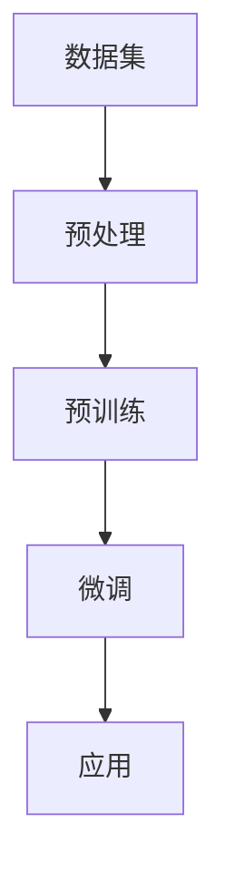

                 

# 文章标题: AI大模型创业：如何应对未来技术挑战？

> 关键词：AI大模型、创业、技术挑战、深度学习、Transformer、GAN、自监督学习

> 摘要：本文将探讨AI大模型在创业过程中的机遇与挑战，从基本概念、技术架构、核心算法、企业应用和发展趋势等方面进行深入分析，为创业者提供策略建议。

## 第1章: AI大模型概述

### 1.1 AI大模型的基本概念

AI大模型是指通过大量数据训练得到，具有强大表征和学习能力的深度神经网络模型。这些模型通常具有以下特点：

- **参数规模巨大**：AI大模型通常拥有上亿甚至千亿参数，这使其能够处理复杂数据，并具有强大的表征能力。
- **可处理复杂数据**：AI大模型能够处理多种类型的数据，如图片、文本、音频等，这使得它们在多个领域具有广泛的应用。
- **泛化能力强**：通过在大规模数据集上进行训练，AI大模型能够在不同领域内得到广泛应用，表现出强大的泛化能力。

### 1.2 AI大模型的技术架构

AI大模型的技术架构主要包括以下方面：

- **深度学习基础**：
  - **神经网络**：神经网络是AI大模型的基础，包括输入层、隐藏层和输出层。
  - **激活函数**：如ReLU、Sigmoid和Tanh，用于引入非线性特性。
  - **反向传播算法**：用于模型参数的更新和优化。

- **预训练与微调**：
  - **预训练**：在大规模数据集上进行预训练，使模型具备通用性。
  - **微调**：在特定任务上进行微调，使模型适应特定场景。

- **模型架构**：
  - **Transformer模型**：如BERT、GPT，具有自注意力机制，处理长序列数据能力强。
  - **GAN模型**：生成对抗网络，常用于图像生成和修复。

### 1.3 AI大模型的核心算法

AI大模型的核心算法包括以下几个方面：

- **优化算法**：
  - **Adam优化器**：自适应调整学习率的优化算法，广泛用于训练大模型。
  - **SGD优化器**：随机梯度下降，基础优化算法，但较Adam收敛速度慢。

- **损失函数**：
  - **交叉熵损失**：常用于分类问题，衡量预测标签与真实标签的差距。
  - **均方误差损失**：常用于回归问题，衡量预测值与真实值之间的差距。

### 1.4 AI大模型的企业应用

AI大模型在企业中的应用涵盖了多个领域，主要包括：

- **自然语言处理**：文本分类、情感分析、机器翻译等。
- **计算机视觉**：图像识别、目标检测、图像生成等。
- **语音识别**：语音识别、语音合成、语音增强等。
- **推荐系统**：基于用户行为和内容的推荐算法。

AI大模型在企业中具有以下商业价值：

- **提高生产力**：自动化生产流程，提高效率。
- **创新服务**：提供个性化的用户体验，创造新的商业模式。
- **降低成本**：自动化决策和预测，减少人力成本。

然而，AI大模型在应用过程中也面临一些挑战：

- **数据隐私**：数据安全和隐私保护问题。
- **计算资源**：训练大模型需要大量计算资源和存储空间。
- **模型解释性**：大模型的黑箱特性使得结果难以解释。

### 1.5 AI大模型的发展趋势

AI大模型的发展趋势主要包括以下几个方面：

- **模型压缩与加速**：为了满足实时性和移动设备的要求，模型压缩和加速技术成为研究热点。
- **多模态学习**：融合多种类型数据（如文本、图像、声音）进行学习。
- **自主学习和推理**：发展更智能的算法，实现更高效的自主学习与推理。

## Mermaid 流程图



## 第2章: AI大模型的核心算法原理

### 2.1 神经网络基础

神经网络是AI大模型的基础，其结构通常包括输入层、隐藏层和输出层。每个层都包含多个神经元，神经元之间通过加权连接。神经元的激活函数引入了非线性特性，使得神经网络能够学习复杂的映射关系。

- **输入层**：接收输入数据。
- **隐藏层**：包含多个神经元，进行特征提取和变换。
- **输出层**：产生输出结果。

神经网络中的激活函数有多种选择，如ReLU、Sigmoid和Tanh。ReLU函数简单且计算高效，适用于隐藏层；Sigmoid函数将输出映射到(0,1)区间，适用于分类问题；Tanh函数将输出映射到(-1,1)区间，具有对称性。

### 2.2 反向传播算法

反向传播算法是一种用于训练神经网络的优化算法。其基本原理是：首先进行前向传播，计算模型输出；然后计算误差，并反向传播误差，更新模型参数。

- **前向传播**：计算模型输出。
- **计算误差**：计算预测值与真实值之间的差距。
- **反向传播**：更新模型参数，减小误差。

反向传播算法的核心是梯度计算，通过计算每个参数的梯度，可以确定参数更新的方向和大小。

### 2.3 自监督学习

自监督学习是一种无监督学习方法，其核心思想是利用未标记的数据进行学习。自监督学习通常包括预训练和微调两个阶段：

- **预训练**：在大规模未标记数据上预训练，使模型具备通用性。
- **微调**：在特定任务上进行微调，使模型适应特定场景。

自监督学习可以减少对标注数据的依赖，提高模型的泛化能力，从而提高模型在真实世界中的应用效果。

### 2.4 迁移学习

迁移学习是一种利用预训练模型在新任务上取得良好效果的方法。其核心思想是将预训练模型在特定任务上的知识转移到新任务上。迁移学习可以减少对新领域数据的依赖，提高模型在新任务上的性能。

### 2.5 Transformer模型

Transformer模型是一种基于自注意力机制的深度学习模型，广泛应用于自然语言处理领域。其核心思想是将每个词的输出与所有词的输入相关联，从而处理长序列数据。

- **自注意力机制**：每个词的输出都与所有词的输入相关。
- **编码器-解码器架构**：编码器提取输入序列的特征，解码器生成输出序列。

Transformer模型在处理长文本和序列数据方面表现出强大的能力，已经成为自然语言处理领域的标准模型。

### 2.6 GAN模型

GAN模型是一种生成对抗网络，由生成器和判别器组成。生成器生成数据，判别器判断生成数据与真实数据。生成器和判别器相互对抗，生成逼真的数据。

- **生成器与判别器**：生成器生成数据，判别器判断生成数据与真实数据。
- **对抗训练**：生成器和判别器相互对抗，生成逼真的数据。

GAN模型广泛应用于图像生成和修复领域，其生成能力强大，能够生成高质量、逼真的图像。

### 伪代码

```python
# 前向传播
def forward_propagation(x):
    z = sigmoid(linear(x))
    a = ReLU(z)
    y = softmax(a)
    return y

# 反向传播
def backward_propagation(y, z, a, x):
    dZ = y - z
    dA = ReLU_derivative(a) * dZ
    dZ = dA * linear_derivative(x)
    dX = dZ * weight
    return dX
```

### 数学模型和数学公式

#### 损失函数

$$
J(\theta) = -\frac{1}{m} \sum_{i=1}^{m} [y_{i} \cdot \log(a_{i}) + (1 - y_{i}) \cdot \log(1 - a_{i})]
$$

其中，\( y_{i} \) 是真实标签，\( a_{i} \) 是预测概率。

### 项目实战

#### 实例：使用TensorFlow实现一个简单的线性回归模型

```python
import tensorflow as tf

# 模型参数
W = tf.Variable(0.0, name='weight')
b = tf.Variable(0.0, name='bias')

# 模型输入
x = tf.placeholder(tf.float32, name='x')
y = tf.placeholder(tf.float32, name='y')

# 模型计算
y_pred = x * W + b

# 损失函数
loss = tf.reduce_mean(tf.square(y_pred - y))

# 优化器
optimizer = tf.train.GradientDescentOptimizer(learning_rate=0.5)
train_op = optimizer.minimize(loss)

# 模型训练
with tf.Session() as sess:
    sess.run(tf.global_variables_initializer())
    for step in range(100):
        _, loss_val = sess.run([train_op, loss], feed_dict={x: [1, 2, 3, 4], y: [2, 4, 6, 8]})
        if step % 10 == 0:
            print(f"Step {step}: Loss={loss_val}")

# 模型评估
with tf.Session() as sess:
    sess.run(tf.global_variables_initializer())
    test_loss = sess.run(loss, feed_dict={x: [1, 2, 3, 4], y: [2, 4, 6, 8]})
    print(f"Test Loss={test_loss}")
```

### 代码解读与分析

- **模型参数初始化**：使用 `tf.Variable` 定义模型参数 \( W \) 和 \( b \)。
- **模型输入**：使用 `tf.placeholder` 定义模型输入 \( x \) 和 \( y \)。
- **模型计算**：使用 \( x \) 和 \( W \) 计算预测值 \( y_{\text{pred}} \)。
- **损失函数**：使用 \( y_{\text{pred}} \) 和 \( y \) 计算均方误差损失。
- **优化器**：使用 `tf.train.GradientDescentOptimizer` 定义优化器。
- **模型训练**：在训练过程中，更新模型参数以最小化损失。
- **模型评估**：在评估过程中，计算测试集上的损失，以评估模型性能。

## 总结

AI大模型在创业过程中具有巨大的潜力和广阔的应用前景。然而，要成功应对未来的技术挑战，创业者需要深入了解AI大模型的基本概念、技术架构、核心算法以及企业应用。此外，创业者还需要关注模型压缩与加速、多模态学习以及自主学习和推理等发展趋势。

通过本文的探讨，希望创业者能够对AI大模型有更深刻的认识，从而在创业过程中更好地应对技术挑战，抓住机遇，实现商业成功。

## 作者信息

作者：AI天才研究院/AI Genius Institute & 禅与计算机程序设计艺术 /Zen And The Art of Computer Programming

