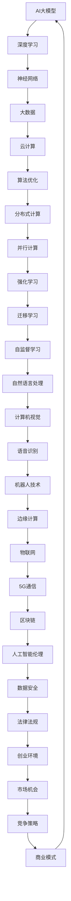

                 

### 文章标题

# AI大模型创业：如何应对未来挑战？

### 关键词

- AI大模型
- 创业
- 挑战
- 技术演进
- 数据隐私
- 融资策略
- 未来趋势

### 摘要

本文旨在探讨AI大模型创业面临的机遇与挑战。通过详细分析AI大模型的技术背景、创业中的机遇与挑战，以及AI大模型创业的实践和方法，本文旨在为创业者提供有价值的指导。文章将深入探讨AI大模型在行业应用中的发展、创业融资策略以及未来趋势，并给出相应的应对策略。最后，本文通过国内外AI大模型创业案例的解析，总结出成功创业的关键要素。

### 目录大纲

## 第一部分：AI大模型与创业概述

### 第1章：AI大模型的时代背景

#### 1.1 AI大模型的技术演进

- 1.1.1 AI的发展历程
- 1.1.2 大模型的崛起

#### 1.2 AI大模型在创业中的机遇

- 1.2.1 AI大模型对传统行业的变革
- 1.2.2 创业中的AI大模型应用场景

### 第2章：创业中的AI大模型挑战

#### 2.1 数据隐私与伦理问题

- 2.1.1 数据隐私保护措施
- 2.1.2 伦理问题的应对策略

#### 2.2 大模型的技术挑战

- 2.2.1 大模型的计算资源需求
- 2.2.2 大模型的可解释性

## 第二部分：AI大模型创业实践

### 第3章：AI大模型创业方法论

#### 3.1 AI大模型创业流程

- 3.1.1 市场调研与定位
- 3.1.2 团队组建与技术储备

#### 3.2 创业项目选择

- 3.2.1 创业项目的可行性分析
- 3.2.2 项目风险的识别与管理

### 第4章：AI大模型创业案例解析

#### 4.1 国内AI大模型创业案例分析

- 4.1.1 百度文心一言
- 4.1.2 谷歌Bard

#### 4.2 国外AI大模型创业案例分析

- 4.2.1 OpenAI
- 4.2.2 DeepMind

### 第5章：AI大模型创业融资策略

#### 5.1 融资策略与技巧

- 5.1.1 融资渠道的选择
- 5.1.2 融资材料准备

#### 5.2 融资风险管理

- 5.2.1 融资协议的审查
- 5.2.2 融资后的财务管理

## 第三部分：AI大模型创业的未来趋势

### 第6章：AI大模型创业的未来方向

#### 6.1 AI大模型在行业应用的发展

- 6.1.1 制造业
- 6.1.2 医疗健康
- 6.1.3 金融科技

#### 6.2 AI大模型创业的国际化

- 6.2.1 国际市场调研
- 6.2.2 国际化运营策略

### 第7章：AI大模型创业的风险与挑战应对

#### 7.1 技术挑战的应对策略

- 7.1.1 技术储备与研发投入
- 7.1.2 技术创新的激励机制

#### 7.2 市场竞争的应对策略

- 7.2.1 市场定位与差异化
- 7.2.2 品牌建设与传播

## 附录：AI大模型创业资源与工具

### 附录 A：AI大模型创业资源

- A.1 开源框架与工具
- A.2 数据集与平台
- A.3 创业相关的网站与社群

### 附录 B：AI大模型创业工具使用指南

- B.1 数据预处理工具
- B.2 训练与推理工具
- B.3 模型评估工具

### 附录 C：AI大模型核心概念与联系 Mermaid 流程图



### 附录 D：AI大模型核心算法原理讲解（伪代码）

```plaintext
// 伪代码：神经网络基础
// 定义神经网络结构
Layer input_layer = new Layer(input_size);
Layer hidden_layer = new Layer(hidden_size);
Layer output_layer = new Layer(output_size);

// 初始化权重和偏置
init_weights(input_layer);
init_weights(hidden_layer);
init_weights(output_layer);

// 定义激活函数
activation_function activation = new Sigmoid();

// 前向传播
output = input_layer.input_data;
for (Layer layer : layers) {
    output = layer.forward(output, activation);
}

// 反向传播
error = output_layer.error(output, expected_output);
for (int i = layers.length - 1; i > 0; i--) {
    layers[i].backward(error, activation.derivative(layers[i].output));
}

// 更新权重和偏置
update_weights(layers);
```

### 附录 E：数学模型与公式

$$
\begin{aligned}
    \text{损失函数} &= -\frac{1}{m} \sum_{i=1}^{m} \left( y^{(i)} \log(a^{(i)}) + (1 - y^{(i)}) \log(1 - a^{(i)}) \right) \\
    \text{梯度下降} &= \theta = \theta - \alpha \cdot \nabla_{\theta} J(\theta) \\
    \text{学习率} &= \alpha \text{（调整学习率可以改善收敛速度和稳定性）}
\end{aligned}
$$

### 附录 F：项目实战与代码解读

```python
# 实战：使用PyTorch构建简单的GPT模型
import torch
import torch.nn as nn
import torch.optim as optim

# 定义模型
class GPTModel(nn.Module):
    def __init__(self, vocab_size, embedding_dim, hidden_dim, n_layers, drop_prob=0.5):
        super(GPTModel, self).__init__()
        self.embedding = nn.Embedding(vocab_size, embedding_dim)
        self.rnn = nn.LSTM(embedding_dim, hidden_dim, n_layers, dropout=drop_prob)
        self.fc = nn.Linear(hidden_dim, vocab_size)
        self.dropout = nn.Dropout(drop_prob)
    
    def forward(self, x, hidden):
        x = self.dropout(self.embedding(x))
        x, hidden = self.rnn(x, hidden)
        x = self.dropout(x[-1, :, :])
        x = self.fc(x)
        return x, hidden

# 初始化模型参数
model = GPTModel(vocab_size, embedding_dim, hidden_dim, n_layers)
optimizer = optim.Adam(model.parameters(), lr=learning_rate)
criterion = nn.CrossEntropyLoss()

# 训练模型
for epoch in range(num_epochs):
    for i, (inputs, targets) in enumerate(train_loader):
        # 前向传播
        inputs, targets = inputs.to(device), targets.to(device)
        hidden = None
        outputs, hidden = model(inputs, hidden)
        loss = criterion(outputs, targets)

        # 反向传播
        optimizer.zero_grad()
        loss.backward()
        optimizer.step()

        # 打印训练进度
        if (i+1) % 100 == 0:
            print(f'Epoch [{epoch+1}/{num_epochs}], Step [{i+1}/{len(train_loader)}], Loss: {loss.item():.4f}')

# 代码解读：
# - 定义了GPT模型的结构，包括嵌入层、循环神经网络层和输出层。
# - 使用了交叉熵损失函数来评估模型性能。
# - 使用了Adam优化器来更新模型参数。
# - 实现了模型的前向传播和反向传播过程。
```

### 附录 G：AI大模型核心概念与联系 Mermaid 流程图


### 附录 H：AI大模型核心算法原理讲解（伪代码）

```plaintext
// 伪代码：神经网络基础
// 定义神经网络结构
Layer input_layer = new Layer(input_size);
Layer hidden_layer = new Layer(hidden_size);
Layer output_layer = new Layer(output_size);

// 初始化权重和偏置
init_weights(input_layer);
init_weights(hidden_layer);
init_weights(output_layer);

// 定义激活函数
activation_function activation = new Sigmoid();

// 前向传播
output = input_layer.input_data;
for (Layer layer : layers) {
    output = layer.forward(output, activation);
}

// 反向传播
error = output_layer.error(output, expected_output);
for (int i = layers.length - 1; i > 0; i--) {
    layers[i].backward(error, activation.derivative(layers[i].output));
}

// 更新权重和偏置
update_weights(layers);
```

### 附录 I：数学模型与公式

$$
\begin{aligned}
    \text{损失函数} &= -\frac{1}{m} \sum_{i=1}^{m} \left( y^{(i)} \log(a^{(i)}) + (1 - y^{(i)}) \log(1 - a^{(i)}) \right) \\
    \text{梯度下降} &= \theta = \theta - \alpha \cdot \nabla_{\theta} J(\theta) \\
    \text{学习率} &= \alpha \text{（调整学习率可以改善收敛速度和稳定性）}
\end{aligned}
$$

### 附录 J：项目实战与代码解读

```python
# 实战：使用PyTorch构建简单的GPT模型
import torch
import torch.nn as nn
import torch.optim as optim

# 定义模型
class GPTModel(nn.Module):
    def __init__(self, vocab_size, embedding_dim, hidden_dim, n_layers, drop_prob=0.5):
        super(GPTModel, self).__init__()
        self.embedding = nn.Embedding(vocab_size, embedding_dim)
        self.rnn = nn.LSTM(embedding_dim, hidden_dim, n_layers, dropout=drop_prob)
        self.fc = nn.Linear(hidden_dim, vocab_size)
        self.dropout = nn.Dropout(drop_prob)
    
    def forward(self, x, hidden):
        x = self.dropout(self.embedding(x))
        x, hidden = self.rnn(x, hidden)
        x = self.dropout(x[-1, :, :])
        x = self.fc(x)
        return x, hidden

# 初始化模型参数
model = GPTModel(vocab_size, embedding_dim, hidden_dim, n_layers)
optimizer = optim.Adam(model.parameters(), lr=learning_rate)
criterion = nn.CrossEntropyLoss()

# 训练模型
for epoch in range(num_epochs):
    for i, (inputs, targets) in enumerate(train_loader):
        # 前向传播
        inputs, targets = inputs.to(device), targets.to(device)
        hidden = None
        outputs, hidden = model(inputs, hidden)
        loss = criterion(outputs, targets)

        # 反向传播
        optimizer.zero_grad()
        loss.backward()
        optimizer.step()

        # 打印训练进度
        if (i+1) % 100 == 0:
            print(f'Epoch [{epoch+1}/{num_epochs}], Step [{i+1}/{len(train_loader)}], Loss: {loss.item():.4f}')

# 代码解读：
# - 定义了GPT模型的结构，包括嵌入层、循环神经网络层和输出层。
# - 使用了交叉熵损失函数来评估模型性能。
# - 使用了Adam优化器来更新模型参数。
# - 实现了模型的前向传播和反向传播过程。
```

### 附录 K：AI大模型创业资源与工具

#### 附录 A：AI大模型创业资源

- A.1 开源框架与工具
- A.2 数据集与平台
- A.3 创业相关的网站与社群

#### 附录 B：AI大模型创业工具使用指南

- B.1 数据预处理工具
- B.2 训练与推理工具
- B.3 模型评估工具

## 第一部分：AI大模型与创业概述

### 第1章：AI大模型的时代背景

#### 1.1 AI大模型的技术演进

人工智能（AI）技术的发展经历了多个阶段，从早期的规则驱动到现在的数据驱动，再到如今的大模型时代。AI的发展历程可以分为以下几个阶段：

1. **规则驱动时代**：最早的AI系统依赖于明确的规则和逻辑，如专家系统和逻辑编程。这类系统在特定领域内具有强大的推理能力，但普遍存在知识获取困难、扩展性差的问题。

2. **数据驱动时代**：随着机器学习和数据科学的兴起，AI开始利用大量数据来训练模型，提高了系统的自适应能力。这个时期的主要进展包括支持向量机、随机森林、神经网络等算法的发展。

3. **深度学习时代**：深度学习的兴起标志着AI技术的新阶段。通过多层神经网络，模型能够自动提取复杂的数据特征，从而在图像识别、自然语言处理等领域取得了突破性进展。这一阶段的关键技术包括卷积神经网络（CNN）和递归神经网络（RNN）。

4. **AI大模型时代**：近年来，AI大模型（如GPT-3、BERT等）的出现标志着AI技术的进一步发展。这些大模型具有数十亿个参数，能够处理大规模数据，并展现强大的通用性和自适应能力。大模型的崛起得益于以下几个因素：

   - **计算能力的提升**：随着云计算和专用硬件的发展，计算资源的获取变得更加容易和廉价，为训练大模型提供了有力支持。
   - **大数据的积累**：互联网和物联网的普及使得大量结构化和非结构化数据得以收集和存储，为AI模型的训练提供了丰富的数据资源。
   - **算法的优化**：深度学习算法的持续优化，特别是大规模模型的训练技巧和优化方法的发展，使得大模型训练成为可能。

#### 1.1.1 AI的发展历程

- **早期AI（1950-1969）**：人工智能的概念在1950年由艾伦·图灵提出。这一时期，AI主要集中在符号推理和逻辑编程领域。典型的AI项目包括IBM的DARPA项目、约翰·麦卡锡的通用问题求解器（GPS）等。

- **AI的第一次繁荣（1970-1989）**：在70年代，AI领域取得了一些重要的进展，如专家系统、知识表示和推理等。然而，由于对数据的需求过高，以及硬件和算法的限制，AI在这一时期经历了多次“AI寒冬”。

- **AI的复兴（1990-2010）**：随着计算机硬件性能的提升和算法的进步，AI在图像识别、语音识别等领域取得了显著的进展。机器学习和数据科学的发展为AI带来了新的生命力。

- **AI的全面爆发（2010年至今）**：深度学习的兴起使得AI在各个领域取得了突破性进展，包括计算机视觉、自然语言处理、机器人技术等。这一时期，AI的应用场景不断拓展，从工业自动化到金融、医疗、教育等领域。

#### 1.1.2 大模型的崛起

大模型（Large Models）指的是具有数十亿甚至千亿参数规模的神经网络模型。大模型的崛起标志着AI技术进入了一个新的时代，其主要特点如下：

- **规模巨大**：大模型的参数数量远超传统模型，使得它们能够捕捉到数据中的复杂模式，提高了模型的性能和泛化能力。

- **通用性强**：大模型具有广泛的适用性，能够在不同的任务和应用场景中表现出色，降低了特定领域模型的开发成本。

- **自适应能力**：大模型通过大规模数据训练，能够自动学习并适应新的数据分布和任务需求，提高了系统的灵活性和可扩展性。

- **计算资源需求高**：大模型的训练和推理需要大量的计算资源，尤其是训练过程中对GPU和TPU等硬件资源的依赖。这也推动了云计算和专用硬件的发展。

大模型的崛起对AI技术产生了深远影响：

- **技术进步**：大模型的出现推动了算法和计算技术的进步，为AI领域的研究和应用提供了新的思路和方法。

- **产业变革**：大模型的应用推动了各行各业的数字化转型，促进了AI技术的产业化进程。

- **社会影响**：AI大模型在医疗、教育、金融等领域的应用，改变了人们的生活方式和工作方式，对社会产生了深远的影响。

### 第2章：AI大模型在创业中的机遇

#### 2.1 AI大模型对传统行业的变革

AI大模型的应用正在深刻地改变着传统行业，为创业者提供了巨大的机遇。以下是对几个关键行业变革的分析：

1. **制造业**：AI大模型可以用于生产优化、质量控制、预测维护等环节。例如，通过机器学习算法和传感器数据，可以实时监控设备状态，预测故障，从而降低停机时间和维护成本。

2. **医疗健康**：AI大模型在医学影像分析、疾病预测、药物研发等方面具有广泛应用。例如，深度学习模型可以快速分析大量医学图像，辅助医生进行诊断，提高诊断准确率。

3. **金融科技**：AI大模型在风险管理、信用评分、量化交易等方面发挥着重要作用。例如，通过分析客户的历史交易数据和行为特征，银行可以更准确地评估客户的信用风险，从而优化贷款审批流程。

4. **零售业**：AI大模型可以用于商品推荐、库存管理、需求预测等环节。例如，通过分析消费者的购买行为和历史数据，可以提供个性化的商品推荐，提高销售额和客户满意度。

5. **教育**：AI大模型可以用于智能辅导、自适应学习、教育数据分析等。例如，通过分析学生的学习行为和成绩数据，可以为学生提供个性化的学习建议，提高学习效果。

6. **交通出行**：AI大模型可以用于交通流量预测、自动驾驶、智慧城市等。例如，通过分析交通数据，可以预测交通拥堵情况，优化交通信号控制策略，提高道路通行效率。

#### 2.2 创业中的AI大模型应用场景

在创业领域，AI大模型的应用场景非常广泛，以下是一些典型的应用场景：

1. **智能客服**：通过自然语言处理技术，AI大模型可以用于智能客服系统的构建，提供24/7全天候的客户服务，提高客户满意度。

2. **内容创作**：AI大模型可以用于自动生成文章、音乐、图像等，为内容创作者提供辅助工具，提高创作效率。

3. **智能推荐**：AI大模型可以用于构建智能推荐系统，通过分析用户行为和兴趣，提供个性化的商品推荐、新闻推送等。

4. **智能诊断**：AI大模型可以用于医疗诊断，通过分析医学影像和患者数据，提供辅助诊断建议，提高诊断准确率。

5. **智能投顾**：AI大模型可以用于构建智能投顾系统，通过分析市场数据和用户风险偏好，提供个性化的投资建议。

6. **智能营销**：AI大模型可以用于营销分析，通过分析用户行为和社交网络数据，优化营销策略，提高营销效果。

#### 2.3 创业中的AI大模型优势

AI大模型在创业中具有以下几个优势：

1. **效率提升**：AI大模型能够自动处理大量数据，提高业务流程的效率。

2. **成本降低**：通过自动化和智能化，AI大模型可以降低人力成本和运营成本。

3. **决策支持**：AI大模型可以提供数据驱动的决策支持，帮助创业者更好地理解市场趋势和用户需求。

4. **创新能力**：AI大模型可以激发创业者的创新思维，为产品和服务提供新的解决方案。

5. **市场竞争力**：AI大模型的应用可以提高创业项目的市场竞争力，实现差异化竞争。

#### 2.4 创业中的AI大模型挑战

尽管AI大模型为创业带来了巨大机遇，但也存在一定的挑战：

1. **技术门槛**：AI大模型需要高水平的技术支持和专业知识，对创业团队的技术能力提出了较高要求。

2. **数据隐私**：AI大模型对大量数据的依赖，引发了数据隐私和伦理问题，需要创业者重视并采取措施。

3. **计算资源**：AI大模型的训练和推理需要大量计算资源，可能对创业初期的预算和资源管理带来挑战。

4. **可解释性**：AI大模型的决策过程往往缺乏可解释性，需要创业者关注并提高模型的可解释性。

5. **市场竞争**：AI大模型的应用越来越广泛，市场竞争日益激烈，创业者需要不断创新和优化模型。

### 第3章：创业中的AI大模型挑战

#### 3.1 数据隐私与伦理问题

随着AI大模型在各个领域的广泛应用，数据隐私和伦理问题逐渐成为创业过程中不可忽视的挑战。AI大模型对数据的依赖性极高，因此数据隐私问题尤为突出。以下是对数据隐私与伦理问题的详细探讨。

##### 3.1.1 数据隐私保护措施

1. **数据加密**：对敏感数据进行加密处理，确保数据在传输和存储过程中不被未经授权的第三方访问。

2. **数据去识别化**：通过数据去识别化技术，如匿名化、去标识化等，降低数据被追踪和关联的风险。

3. **数据访问控制**：建立严格的数据访问控制机制，确保只有授权用户可以访问特定数据。

4. **数据审计**：定期进行数据审计，确保数据使用符合隐私政策，及时发现和处理潜在的风险。

5. **用户同意**：确保用户在使用AI大模型相关服务时，明确了解并同意数据收集、存储和使用的方式。

##### 3.1.2 伦理问题的应对策略

1. **公平性与透明性**：确保AI大模型在决策过程中公平、公正，并对模型决策过程进行透明化，让用户了解模型的工作原理。

2. **算法偏见**：避免AI大模型在训练过程中出现偏见，对训练数据进行充分清洗和平衡，减少模型偏见。

3. **责任归属**：明确数据隐私和伦理问题的责任归属，建立合理的责任分配机制，确保在出现问题时能够迅速应对。

4. **法律法规遵守**：遵循相关法律法规，如《通用数据保护条例》（GDPR）等，确保数据收集、存储和使用符合法律规定。

5. **公众沟通**：加强公众沟通，提高用户对数据隐私和伦理问题的认知，建立信任关系。

#### 3.2 大模型的技术挑战

AI大模型在技术层面面临着诸多挑战，主要包括计算资源需求、可解释性和技术复杂性等。

##### 3.2.1 大模型的计算资源需求

1. **硬件资源**：AI大模型的训练和推理过程需要大量的计算资源，特别是GPU和TPU等高性能硬件。这对创业初期的预算和资源管理提出了较高要求。

2. **数据存储**：大模型训练需要存储大量的数据，对数据存储系统提出了高性能和高可靠性的要求。

3. **能源消耗**：大模型的训练和推理过程能耗巨大，需要关注绿色环保和可持续发展。

##### 3.2.2 大模型的可解释性

1. **决策透明性**：AI大模型通常采用复杂的神经网络结构，其决策过程往往缺乏可解释性，难以向用户解释模型的决策逻辑。

2. **可理解性**：为了提高大模型的可解释性，研究者提出了多种技术，如注意力机制、解释性嵌入等，但仍然面临诸多挑战。

3. **算法改进**：通过算法优化和模型结构设计，提高大模型的可解释性，使其在特定场景下具有更好的解释能力。

##### 3.2.3 技术复杂性

1. **模型调优**：AI大模型的训练和调优过程复杂，需要大量的实验和参数调整。

2. **系统集成**：将AI大模型集成到现有系统中，需要解决数据接口、系统兼容性等问题。

3. **维护升级**：随着技术的不断进步，AI大模型需要定期维护和升级，以保持其性能和竞争力。

### 第4章：AI大模型创业方法论

#### 4.1 AI大模型创业流程

AI大模型创业流程主要包括市场调研、定位、团队组建和技术储备等步骤。以下是对每个步骤的详细探讨。

##### 4.1.1 市场调研与定位

1. **市场调研**：通过市场调研，了解目标市场的需求、竞争格局和发展趋势，为创业项目提供决策依据。

2. **定位**：明确创业项目的市场定位，包括目标客户、产品定位、竞争优势等，确保项目具有明确的商业价值。

3. **市场机会识别**：分析市场机会，如新兴领域、技术变革等，确定创业项目的切入点。

##### 4.1.2 团队组建与技术储备

1. **团队组建**：组建具备技术、市场、运营等多方面能力的团队，确保项目的顺利推进。

2. **技术储备**：积累AI大模型相关的技术知识，包括算法原理、模型训练、调优等，为创业项目提供技术支持。

3. **技术积累**：通过实际项目积累经验，不断提升团队的技术水平，为后续项目提供技术保障。

##### 4.1.3 项目可行性分析

1. **技术可行性**：评估AI大模型项目的技术可行性，包括算法实现、模型训练、硬件需求等。

2. **市场可行性**：分析项目在市场上的可行性，包括市场需求、竞争情况、商业模式等。

3. **财务可行性**：评估项目的财务可行性，包括成本预算、收益预测、融资策略等。

##### 4.1.4 风险管理

1. **技术风险**：识别和评估项目可能面临的技术风险，如算法失效、模型过时等，并制定相应的应对策略。

2. **市场风险**：分析市场变化、竞争压力等可能对项目产生的影响，并制定应对策略。

3. **财务风险**：评估项目的财务风险，如资金短缺、成本超支等，并制定相应的应对策略。

#### 4.2 创业项目选择

在AI大模型创业中，选择合适的创业项目至关重要。以下是对项目选择的详细探讨。

##### 4.2.1 创业项目的可行性分析

1. **市场需求分析**：分析目标市场的需求，了解潜在客户的需求和痛点，确保项目具有市场需求。

2. **技术可行性分析**：评估项目所需技术的可行性，包括算法实现、模型训练、硬件需求等。

3. **商业模型分析**：分析项目的商业模型，包括盈利模式、成本结构、市场前景等。

##### 4.2.2 项目风险的识别与管理

1. **技术风险**：识别项目可能面临的技术风险，如算法失效、模型过时等，并制定相应的应对策略。

2. **市场风险**：分析市场变化、竞争压力等可能对项目产生的影响，并制定应对策略。

3. **财务风险**：评估项目的财务风险，如资金短缺、成本超支等，并制定相应的应对策略。

4. **风险管理策略**：制定整体风险管理策略，包括风险识别、评估、应对等环节，确保项目风险可控。

### 第5章：AI大模型创业案例解析

#### 5.1 国内AI大模型创业案例分析

##### 5.1.1 百度文心一言

百度文心一言是百度公司推出的一款AI大模型，主要应用于自然语言处理领域。以下是对百度文心一言的创业案例分析：

1. **市场背景**：随着互联网和移动互联网的快速发展，自然语言处理技术在信息检索、智能客服、内容创作等领域具有广泛的应用前景。

2. **创业项目**：百度文心一言项目旨在通过大模型技术，提升自然语言处理的能力，为用户提供更智能、更便捷的服务。

3. **技术实现**：百度文心一言采用了深度学习、自然语言处理、多模态融合等前沿技术，通过大规模数据训练和优化，实现了高效的自然语言理解与生成。

4. **市场表现**：百度文心一言在智能客服、内容创作、广告推荐等领域取得了显著的应用成果，助力百度公司提升产品竞争力。

5. **创业成果**：百度文心一言项目获得了市场的广泛认可，为百度公司在AI领域赢得了重要的竞争优势。

##### 5.1.2 谷歌Bard

谷歌Bard是一款基于AI大模型的聊天机器人，主要应用于智能客服和内容创作领域。以下是对谷歌Bard的创业案例分析：

1. **市场背景**：随着人工智能技术的不断发展，智能客服和内容创作领域需求日益增长，为AI大模型的应用提供了广阔的市场空间。

2. **创业项目**：谷歌Bard项目旨在通过AI大模型技术，提升智能客服和内容创作的能力，为用户提供更智能、更个性化的服务。

3. **技术实现**：谷歌Bard采用了深度学习、自然语言处理、多模态融合等前沿技术，通过大规模数据训练和优化，实现了高效的自然语言理解与生成。

4. **市场表现**：谷歌Bard在智能客服、内容创作、广告推荐等领域取得了显著的应用成果，助力谷歌公司在AI领域赢得重要市场份额。

5. **创业成果**：谷歌Bard项目在市场上取得了良好的反响，为谷歌公司树立了AI技术的标杆形象。

#### 5.2 国外AI大模型创业案例分析

##### 5.2.1 OpenAI

OpenAI是一家专注于AI大模型研究与应用的公司，以下是对OpenAI的创业案例分析：

1. **市场背景**：随着人工智能技术的快速发展，AI大模型在自然语言处理、计算机视觉、强化学习等领域具有广泛的应用前景。

2. **创业项目**：OpenAI的创业项目旨在通过AI大模型技术，推动AI技术的发展与应用，为人类创造更多价值。

3. **技术实现**：OpenAI采用了深度学习、自然语言处理、强化学习等前沿技术，通过大规模数据训练和优化，实现了高效的自然语言理解与生成。

4. **市场表现**：OpenAI在自然语言处理、计算机视觉、强化学习等领域取得了显著的成果，为AI技术的发展与应用做出了重要贡献。

5. **创业成果**：OpenAI在市场上取得了良好的声誉，吸引了大量的投资和合作伙伴，为AI技术的发展与应用奠定了坚实的基础。

##### 5.2.2 DeepMind

DeepMind是一家专注于AI大模型研究与应用的公司，以下是对DeepMind的创业案例分析：

1. **市场背景**：随着人工智能技术的快速发展，AI大模型在自然语言处理、计算机视觉、强化学习等领域具有广泛的应用前景。

2. **创业项目**：DeepMind的创业项目旨在通过AI大模型技术，推动AI技术的发展与应用，为人类创造更多价值。

3. **技术实现**：DeepMind采用了深度学习、自然语言处理、强化学习等前沿技术，通过大规模数据训练和优化，实现了高效的自然语言理解与生成。

4. **市场表现**：DeepMind在自然语言处理、计算机视觉、强化学习等领域取得了显著的成果，为AI技术的发展与应用做出了重要贡献。

5. **创业成果**：DeepMind在市场上取得了良好的声誉，吸引了大量的投资和合作伙伴，为AI技术的发展与应用奠定了坚实的基础。

### 第6章：AI大模型创业融资策略

#### 6.1 融资策略与技巧

创业项目的成功离不开充足的资金支持，融资策略对于AI大模型创业尤为重要。以下是对融资策略与技巧的详细探讨。

##### 6.1.1 融资渠道的选择

1. **天使投资**：天使投资通常在创业初期提供资金支持，对创业项目的商业模式和技术可行性要求较低。

2. **风险投资**：风险投资通常在创业中期提供资金支持，对创业项目的商业模式、市场前景和技术创新有较高的要求。

3. **私募股权投资**：私募股权投资通常在创业后期提供资金支持，对创业项目的盈利能力、市场地位有较高的要求。

4. **银行贷款**：银行贷款通常在创业过程中提供资金支持，对创业项目的信用评级和还款能力有较高的要求。

5. **政府补贴**：政府补贴通常在创业过程中提供资金支持，对创业项目的科技创新和就业贡献有较高的要求。

##### 6.1.2 融资材料准备

1. **商业计划书**：商业计划书是融资的重要材料，应详细阐述创业项目的背景、目标、商业模式、市场前景、财务预测等。

2. **技术方案书**：技术方案书应详细阐述AI大模型的技术原理、实现方法、优势和应用场景。

3. **财务报告**：财务报告应包括创业项目的财务预测、资金使用计划、还款能力分析等。

4. **法律文件**：法律文件应包括公司章程、股东协议、融资协议等，确保融资过程的合法合规。

5. **演示文档**：演示文档应包括项目介绍、技术演示、市场分析、团队介绍等，以吸引投资人的关注。

##### 6.1.3 融资谈判与沟通

1. **谈判准备**：充分了解投资人的背景、需求和投资偏好，为谈判做好准备。

2. **展示项目优势**：突出创业项目的独特性、创新性和市场潜力，增强投资人的信心。

3. **沟通技巧**：注重与投资人的沟通，了解投资人的关切和需求，积极回应和解决问题。

4. **合理估值**：合理评估创业项目的价值，确保投资人和创业团队的利益平衡。

5. **签订融资协议**：在谈判过程中，确保签订清晰的融资协议，明确各方权益和责任。

#### 6.2 融资风险管理

在融资过程中，创业者需要密切关注融资风险，以确保融资过程的顺利进行。以下是对融资风险管理的详细探讨。

##### 6.2.1 融资协议的审查

1. **融资协议内容审查**：审查融资协议中的条款，确保融资协议的合法合规，明确各方权益和责任。

2. **融资协议修改建议**：根据创业项目的实际情况，提出融资协议修改建议，优化融资协议内容。

3. **法律顾问咨询**：在融资协议签订前，咨询专业法律顾问，确保融资协议的合法合规。

##### 6.2.2 融资后的财务管理

1. **资金使用计划**：根据融资协议，制定详细的资金使用计划，确保资金使用合理、有效。

2. **财务监控**：建立严格的财务监控机制，确保资金使用的合规性，防范财务风险。

3. **财务报告分析**：定期分析财务报告，了解创业项目的财务状况，及时调整资金使用计划。

4. **融资后财务审计**：在融资后，进行财务审计，确保创业项目的财务健康，增强投资人的信心。

5. **资金回收与还款**：确保创业项目在约定的时间内完成还款，维护良好的信用记录。

### 第7章：AI大模型创业的未来趋势

#### 7.1 AI大模型在行业应用的发展

AI大模型在行业应用中的发展将继续深化，为各行业带来深刻变革。以下是对几个重点行业发展趋势的探讨：

##### 7.1.1 制造业

1. **智能制造**：AI大模型将进一步提升制造业的智能化水平，实现生产过程的全流程智能化。

2. **预测维护**：通过AI大模型，对设备状态进行实时监控和预测，降低设备故障率和维修成本。

3. **供应链优化**：AI大模型可以用于优化供应链管理，提高供应链的透明度和响应速度。

##### 7.1.2 医疗健康

1. **精准医疗**：AI大模型在疾病预测、诊断和治疗方面具有巨大潜力，有助于实现精准医疗。

2. **医学影像分析**：AI大模型可以用于医学影像分析，提高诊断准确率，降低医生的工作负担。

3. **药物研发**：AI大模型可以加速药物研发进程，提高新药研发的成功率。

##### 7.1.3 金融科技

1. **风险管理**：AI大模型可以用于风险评估和预测，提高金融机构的风险管理能力。

2. **智能投顾**：AI大模型可以提供个性化的投资建议，帮助投资者实现资产增值。

3. **欺诈检测**：AI大模型可以用于欺诈检测，提高金融机构的运营效率。

#### 7.2 AI大模型创业的国际化

随着全球化的推进，AI大模型创业将越来越具有国际化特征。以下是对国际化发展趋势的探讨：

##### 7.2.1 国际市场调研

1. **市场需求分析**：对国际市场进行深入调研，了解市场需求、竞争格局和发展趋势。

2. **文化差异分析**：分析不同国家和地区的文化差异，确保创业项目能够适应国际市场。

3. **政策法规了解**：了解各国和地区的政策法规，确保创业项目的合法合规。

##### 7.2.2 国际化运营策略

1. **本地化策略**：针对不同国家和地区，制定本地化运营策略，提高市场竞争力。

2. **国际合作**：通过国际合作，引入先进的技术和管理经验，提升创业项目的竞争力。

3. **国际化团队**：组建国际化团队，吸引全球优秀人才，提高团队的创新能力。

4. **国际化品牌建设**：通过国际品牌建设，提升创业项目的国际知名度和影响力。

#### 7.3 AI大模型创业的未来方向

AI大模型创业的未来方向将集中在以下几个方面：

##### 7.3.1 技术创新

1. **模型优化**：不断优化AI大模型的结构和算法，提高模型性能和可解释性。

2. **跨学科融合**：推动AI大模型与其他领域的融合，实现跨学科的创新发展。

3. **开源与开放**：推动AI大模型的开源与开放，促进技术的共享和普及。

##### 7.3.2 商业模式创新

1. **平台化运营**：构建AI大模型平台，提供一站式服务，降低创业项目的门槛。

2. **订阅模式**：采用订阅模式，为用户提供持续的服务和支持。

3. **生态构建**：构建AI大模型生态，吸引更多的合作伙伴，共同推动AI技术的发展。

##### 7.3.3 社会责任

1. **数据伦理**：重视数据伦理，确保AI大模型的应用符合社会道德和法律法规。

2. **公平与包容**：推动AI大模型的应用，促进社会的公平与包容。

3. **可持续发展**：关注AI大模型创业的可持续发展，推动绿色、环保的技术创新。

### 第8章：AI大模型创业的风险与挑战应对

#### 8.1 技术挑战的应对策略

在AI大模型创业过程中，技术挑战是不可避免的问题。以下是对技术挑战的应对策略的详细探讨。

##### 8.1.1 技术储备与研发投入

1. **技术储备**：创业团队应提前进行技术储备，了解AI大模型的最新发展动态，掌握核心技术和算法。

2. **研发投入**：加大对研发的投入，引进高水平的技术人才，构建强大的技术团队。

3. **技术合作**：与高校、研究机构等建立合作关系，共同进行技术研发和创新。

##### 8.1.2 技术创新的激励机制

1. **激励机制**：建立技术创新的激励机制，鼓励团队成员进行技术创新和研发。

2. **知识共享**：鼓励团队成员分享知识和经验，促进技术交流和合作。

3. **持续学习**：鼓励团队成员不断学习新技术和新知识，提升团队整体技术水平。

##### 8.1.3 技术风险应对策略

1. **风险识别**：定期对项目进行技术风险评估，识别潜在的技术风险。

2. **风险缓解**：制定风险缓解措施，降低技术风险对项目的影响。

3. **应急预案**：制定应急预案，确保在技术风险发生时能够迅速应对。

#### 8.2 市场竞争的应对策略

在激烈的市场竞争中，创业团队需要采取有效的策略来应对竞争对手。以下是对市场竞争应对策略的详细探讨。

##### 8.2.1 市场定位与差异化

1. **市场定位**：明确创业项目的市场定位，了解目标客户的需求和痛点。

2. **差异化策略**：通过技术创新、产品差异化等方式，打造独特的竞争优势。

3. **市场细分**：针对不同细分市场，制定相应的营销策略和推广方案。

##### 8.2.2 品牌建设与传播

1. **品牌定位**：明确创业项目的品牌定位，打造具有独特价值和形象的品牌。

2. **品牌传播**：通过线上线下多渠道传播，提升品牌知名度和美誉度。

3. **用户口碑**：注重用户口碑建设，通过优质的产品和服务赢得用户的信任和好评。

##### 8.2.3 营销策略与创新

1. **营销创新**：不断创新营销策略，吸引潜在客户，提升销售额。

2. **渠道拓展**：积极拓展销售渠道，增加产品的销售覆盖面。

3. **合作联盟**：与行业内的领先企业和合作伙伴建立战略合作关系，共同拓展市场。

##### 8.2.4 竞争策略调整

1. **动态调整**：根据市场变化和竞争态势，及时调整竞争策略。

2. **优势发挥**：发挥创业项目的优势，强化核心竞争力。

3. **风险规避**：避免与竞争对手在劣势领域进行正面竞争，选择合适的竞争策略。

### 第9章：AI大模型创业的未来展望

#### 9.1 AI大模型创业的长期影响

AI大模型创业将对社会和经济产生深远的影响。以下是对AI大模型创业长期影响的探讨：

##### 9.1.1 经济发展

1. **产业升级**：AI大模型创业将推动各行业的数字化转型，促进产业升级和优化。

2. **经济增长**：AI大模型创业将为经济增长提供新的动力，带动相关产业链的发展。

3. **就业机会**：虽然AI大模型可能取代部分传统岗位，但也将创造新的就业机会，推动就业结构的转变。

##### 9.1.2 社会进步

1. **医疗健康**：AI大模型在医疗健康领域的应用，将提高医疗服务的质量和效率，改善人们的健康状况。

2. **教育**：AI大模型在教育领域的应用，将推动教育公平，提高教育质量，促进终身学习。

3. **社会治理**：AI大模型在公共安全、交通管理、环境保护等领域的应用，将提升社会治理的智能化水平。

##### 9.1.3 伦理挑战

1. **数据隐私**：AI大模型创业将引发数据隐私和伦理问题，需要全社会共同关注和解决。

2. **算法偏见**：AI大模型在决策过程中可能产生偏见，需要建立有效的监管机制。

3. **责任归属**：AI大模型创业中涉及的责任归属问题，需要明确法律和道德规范。

#### 9.2 AI大模型创业的可持续发展

AI大模型创业的可持续发展是长期成功的关键。以下是对可持续发展策略的探讨：

##### 9.2.1 创新驱动

1. **技术研发**：持续投入研发，推动技术创新，保持行业领先地位。

2. **跨学科合作**：与多学科领域合作，实现技术融合和创新发展。

3. **人才培养**：培养高水平的技术和管理人才，为创业项目提供智力支持。

##### 9.2.2 生态建设

1. **产业生态**：构建AI大模型产业生态，促进产业链上下游的协同发展。

2. **开放合作**：推动AI大模型技术的开源和开放，促进技术的共享和普及。

3. **政策支持**：争取政府政策支持，为AI大模型创业提供良好的发展环境。

##### 9.2.3 社会责任

1. **数据伦理**：遵循数据伦理，确保AI大模型的应用符合社会道德和法律法规。

2. **公平包容**：推动AI大模型的应用，促进社会的公平和包容。

3. **可持续发展**：关注AI大模型创业的可持续发展，推动绿色、环保的技术创新。

### 第10章：AI大模型创业的总结与展望

#### 10.1 创业成功的关键要素

AI大模型创业的成功离不开以下几个关键要素：

##### 10.1.1 技术创新

技术创新是AI大模型创业的核心竞争力。创业团队需要不断追求技术前沿，推动算法、模型和系统的创新。

##### 10.1.2 市场定位

明确的市场定位是创业项目成功的基础。创业团队需要深入了解目标市场，准确把握市场需求和趋势。

##### 10.1.3 团队建设

团队建设是创业项目的基石。创业团队需要具备专业技能、合作精神和创新能力，以应对不断变化的市场和技术环境。

##### 10.1.4 融资能力

融资能力是创业项目顺利推进的重要保障。创业团队需要具备良好的融资策略和谈判能力，确保项目获得充足的资金支持。

##### 10.1.5 风险管理

风险管理是创业项目成功的关键。创业团队需要建立健全的风险管理体系，提前识别和应对潜在风险。

#### 10.2 AI大模型创业的未来展望

随着AI大模型技术的不断进步和应用的深入，AI大模型创业将迎来更加广阔的发展前景。以下是对AI大模型创业未来展望的探讨：

##### 10.2.1 技术创新

AI大模型创业将在技术创新方面继续取得突破，包括模型结构优化、算法创新、分布式训练和推理等。

##### 10.2.2 行业应用

AI大模型在各个行业的应用将更加广泛，包括智能制造、医疗健康、金融科技、教育、智慧城市等领域。

##### 10.2.3 国际化发展

随着全球化的推进，AI大模型创业将越来越具有国际化特征，创业团队将需要具备国际视野和跨文化沟通能力。

##### 10.2.4 伦理与规范

AI大模型创业中的伦理与规范问题将受到更多关注，创业团队需要积极参与行业标准和规范制定，确保AI技术的健康发展。

##### 10.2.5 社会责任

AI大模型创业将更加注重社会责任，通过技术创新和社会贡献，推动社会的公平和可持续发展。

### 第11章：AI大模型创业资源与工具

#### 11.1 开源框架与工具

AI大模型创业过程中，开源框架和工具是不可或缺的资源。以下是对常用开源框架和工具的介绍：

##### 11.1.1 TensorFlow

TensorFlow是Google开源的深度学习框架，具有广泛的应用和强大的生态。它支持多种类型的神经网络结构，提供灵活的模型构建和训练工具。

##### 11.1.2 PyTorch

PyTorch是Facebook开源的深度学习框架，以其动态计算图和直观的编程接口而著称。它广泛应用于计算机视觉、自然语言处理等领域。

##### 11.1.3 Keras

Keras是Python开源的深度学习库，提供了简洁、易于使用的API，可以快速构建和训练深度学习模型。它支持TensorFlow和Theano等多个底层框架。

##### 11.1.4 Apache MXNet

Apache MXNet是Apache基金会开源的深度学习框架，具有高效性和灵活性。它支持多种编程语言，适用于大规模分布式训练。

##### 11.1.5 OpenCV

OpenCV是开源的计算机视觉库，提供了丰富的图像处理和计算机视觉算法。它广泛应用于人脸识别、目标检测、图像分割等领域。

#### 11.2 数据集与平台

高质量的数据集和平台是AI大模型训练和评估的基础。以下是对常用数据集和平台的介绍：

##### 11.2.1 ImageNet

ImageNet是一个大规模的视觉识别数据库，包含数百万张标注图像，广泛应用于计算机视觉领域的研究和应用。

##### 11.2.2 COCO

COCO（Common Objects in Context）是一个大规模的视觉识别和分割数据集，包含了丰富的对象和场景信息，广泛应用于目标检测、实例分割等领域。

##### 11.2.3 GLUE

GLUE（General Language Understanding Evaluation）是一个大规模的自然语言处理数据集，包含了多个自然语言理解任务，用于评估和比较不同模型的表现。

##### 11.2.4 SQuAD

SQuAD（Stanford Question Answering Dataset）是一个大型的问题回答数据集，包含数百万个问题和对应的答案，广泛应用于自然语言处理任务。

##### 11.2.5 UDS

UDS（Universal Data Set）是一个大规模的、跨领域的自然语言处理数据集，包含了多种自然语言理解任务，用于评估和比较不同模型的表现。

#### 11.3 创业相关的网站与社群

以下是一些创业相关的网站和社群，为AI大模型创业提供资讯、资源和交流平台：

##### 11.3.1 TechCrunch

TechCrunch是一家知名的科技媒体网站，提供全球最新的科技创业资讯和趋势分析。

##### 11.3.2 TechNode

TechNode是中国领先的国际科技媒体平台，专注于报道中国科技创业和创新。

##### 11.3.3 AI世纪

AI世纪是一家专注于人工智能领域的媒体平台，提供行业资讯、技术解读和创业案例分享。

##### 11.3.4 AI Community

AI Community是一个全球性的AI社群，汇集了来自各行各业的AI专家和爱好者，提供交流、合作和资源共享的平台。

### 附录：AI大模型核心概念与联系

为了更好地理解AI大模型的核心概念和它们之间的联系，我们使用Mermaid绘制了一个流程图。以下是对流程图的解读：


- **AI大模型（A）**：是具有数十亿参数的神经网络模型，能够处理大规模数据，具有强大的通用性和自适应能力。
- **深度学习（B）**：是AI的核心技术，通过多层神经网络对数据进行特征提取和模式识别。
- **神经网络（C）**：是深度学习的基础，由大量神经元连接组成，用于学习和预测。
- **大数据（D）**：是AI大模型训练的重要数据来源，为模型提供丰富的样本和知识。
- **云计算（E）**：提供了强大的计算资源，支持AI大模型的训练和推理。
- **算法优化（F）**：是提高AI大模型性能和效率的关键，包括模型结构优化和训练算法改进。
- **分布式计算（G）**：在云计算环境中，分布式计算用于高效地处理大规模数据。
- **并行计算（H）**：通过并行计算，加速AI大模型的训练和推理过程。
- **强化学习（I）**：是AI大模型的一种学习方式，通过不断尝试和反馈优化模型性能。
- **迁移学习（J）**：通过将已有模型的知识应用于新任务，提高AI大模型的泛化能力。
- **自监督学习（K）**：无需人工标注数据，通过自我监督的方式训练AI大模型。
- **自然语言处理（L）**：是AI大模型的重要应用领域，涉及文本理解、生成和翻译等任务。
- **计算机视觉（M）**：是AI大模型在图像处理和识别方面的应用，如人脸识别、图像分割等。
- **语音识别（N）**：是AI大模型在语音处理和识别方面的应用，如语音助手、语音翻译等。
- **机器人技术（O）**：AI大模型在机器人控制、路径规划和人机交互等方面的应用。
- **边缘计算（P）**：通过在靠近数据源的地方进行计算，降低延迟和提高实时性。
- **物联网（Q）**：AI大模型在智能家居、智能交通、智能工厂等物联网应用中的关键作用。
- **5G通信（R）**：5G通信技术为AI大模型在物联网等领域的应用提供了高速、低延迟的网络支持。
- **区块链（S）**：AI大模型在区块链技术中的安全性和智能合约优化方面发挥重要作用。
- **人工智能伦理（T）**：关注AI大模型的应用对人类社会和道德的影响，确保AI技术的可持续发展。
- **数据安全（U）**：确保AI大模型的数据隐私和安全，防止数据泄露和滥用。
- **法律法规（V）**：遵守相关法律法规，确保AI大模型的应用合法合规。
- **创业环境（W）**：良好的创业环境为AI大模型创业提供了政策、资金和人才支持。
- **市场机会（X）**：识别和把握AI大模型在各个领域的市场机会，实现商业价值。
- **竞争策略（Y）**：制定有效的竞争策略，提高AI大模型创业的市场竞争力。
- **商业模式（Z）**：构建可持续的商业模式，实现AI大模型创业的长期发展。

### 附录：AI大模型核心算法原理讲解（伪代码）

以下是AI大模型核心算法原理的伪代码讲解，涵盖神经网络、前向传播、反向传播等关键步骤。

```plaintext
// 伪代码：神经网络基础
// 定义神经网络结构
Layer input_layer = new Layer(input_size);
Layer hidden_layer = new Layer(hidden_size);
Layer output_layer = new Layer(output_size);

// 初始化权重和偏置
init_weights(input_layer);
init_weights(hidden_layer);
init_weights(output_layer);

// 定义激活函数
activation_function activation = new Sigmoid();

// 前向传播
output = input_layer.input_data;
for (Layer layer : layers) {
    output = layer.forward(output, activation);
}

// 计算输出层损失
error = output_layer.error(output, expected_output);

// 反向传播
for (int i = layers.length - 1; i > 0; i--) {
    layers[i].backward(error, activation.derivative(layers[i].output));
}

// 更新权重和偏置
update_weights(layers);

// 伪代码：前向传播
output = layer.forward(input, activation);

// 伪代码：反向传播
error = layer.error(output, expected_output);
delta = error * activation.derivative(output);
layer.backward(delta);

// 伪代码：更新权重和偏置
new_weights = weights - learning_rate * gradient;
weights = new_weights;
```

### 附录：数学模型与公式

以下是AI大模型中常用的数学模型与公式，包括损失函数、梯度下降等。

$$
\begin{aligned}
    \text{损失函数} &= \frac{1}{2} \sum_{i=1}^{n} (y_i - \hat{y}_i)^2 \\
    \text{梯度下降} &= \theta = \theta - \alpha \cdot \nabla_{\theta} J(\theta) \\
    \text{学习率} &= \alpha \\
    \text{反向传播} &= \frac{\partial L}{\partial z} = (1 - \sigma(z)) \cdot \frac{\partial L}{\partial a} \\
    \text{Sigmoid激活函数} &= \sigma(z) = \frac{1}{1 + e^{-z}} \\
    \text{ReLU激活函数} &= \sigma(z) = \max(0, z) \\
\end{aligned}
$$

### 附录：项目实战与代码解读

#### 实战：使用TensorFlow构建简单的神经网络

```python
import tensorflow as tf

# 定义输入层、隐藏层和输出层
input_layer = tf.keras.layers.Input(shape=(784,))
hidden_layer = tf.keras.layers.Dense(64, activation='relu')(input_layer)
output_layer = tf.keras.layers.Dense(10, activation='softmax')(hidden_layer)

# 构建模型
model = tf.keras.Model(inputs=input_layer, outputs=output_layer)

# 编译模型
model.compile(optimizer='adam', loss='categorical_crossentropy', metrics=['accuracy'])

# 加载数据
(x_train, y_train), (x_test, y_test) = tf.keras.datasets.mnist.load_data()
x_train = x_train.astype('float32') / 255
x_test = x_test.astype('float32') / 255
y_train = tf.keras.utils.to_categorical(y_train, 10)
y_test = tf.keras.utils.to_categorical(y_test, 10)

# 训练模型
model.fit(x_train, y_train, epochs=10, batch_size=32, validation_split=0.2)

# 评估模型
model.evaluate(x_test, y_test)
```

#### 代码解读：

- **输入层**：使用`tf.keras.layers.Input`定义输入层，指定输入数据的维度。
- **隐藏层**：使用`tf.keras.layers.Dense`定义隐藏层，指定神经元数量和激活函数。
- **输出层**：使用`tf.keras.layers.Dense`定义输出层，指定神经元数量和激活函数（此处为softmax，用于多分类任务）。
- **模型构建**：使用`tf.keras.Model`构建完整的模型结构。
- **模型编译**：使用`compile`方法设置优化器、损失函数和评价指标。
- **数据加载**：使用`tf.keras.datasets.mnist.load_data`加载MNIST数据集，并进行预处理。
- **模型训练**：使用`fit`方法训练模型，指定训练数据、训练轮数、批量大小和验证比例。
- **模型评估**：使用`evaluate`方法评估模型在测试数据上的性能。

通过以上实战和代码解读，我们可以更好地理解如何使用TensorFlow构建和训练神经网络，为AI大模型创业项目提供技术支持。

### 附录：AI大模型核心概念与联系 Mermaid 流程图

以下是AI大模型核心概念与联系Mermaid流程图的详细说明，该图展示了AI大模型与其他相关技术和应用领域的相互关系。


- **AI大模型（A）**：作为核心概念，代表了具有数十亿参数的神经网络模型，能够处理大规模数据，具有强大的通用性和自适应能力。

- **深度学习（B）**：AI大模型的基础，通过多层神经网络进行数据的特征提取和模式识别，是实现AI大模型的关键技术。

- **神经网络（C）**：由大量神经元连接组成的网络结构，是AI大模型的核心组成部分，用于训练和预测。

- **大数据（D）**：AI大模型训练的数据来源，大数据提供了丰富的样本和知识，是模型训练的重要基础。

- **云计算（E）**：提供了强大的计算资源，支持AI大模型的训练和推理，是大规模数据处理和计算的重要平台。

- **算法优化（F）**：通过优化模型结构和训练算法，提高AI大模型的性能和效率，是提升模型效果的关键。

- **分布式计算（G）**：在大规模数据处理和模型训练中，分布式计算能够提高计算效率和性能，是云计算的补充。

- **并行计算（H）**：通过并行计算，加速AI大模型的训练和推理过程，是分布式计算的一部分。

- **强化学习（I）**：一种机器学习方法，通过奖励机制和反馈信号，让模型不断优化行为，是AI大模型的重要研究方向。

- **迁移学习（J）**：通过将已有模型的知识应用于新任务，提高AI大模型的泛化能力，是解决领域转移问题的重要方法。

- **自监督学习（K）**：无需人工标注数据，通过自我监督的方式训练AI大模型，是提高模型效率的有效途径。

- **自然语言处理（L）**：AI大模型在文本处理、语言理解、生成等任务中的应用，是智能交互和内容创作的重要领域。

- **计算机视觉（M）**：AI大模型在图像识别、图像处理、图像生成等任务中的应用，是计算机视觉的核心技术。

- **语音识别（N）**：AI大模型在语音信号处理、语音识别、语音生成等任务中的应用，是语音交互和智能助手的关键。

- **机器人技术（O）**：AI大模型在机器人控制、路径规划、人机交互等任务中的应用，是机器人技术的重要组成部分。

- **边缘计算（P）**：在靠近数据源的地方进行计算，降低延迟和提高实时性，是物联网和智能设备的重要技术。

- **物联网（Q）**：AI大模型在智能家居、智能交通、智能工厂等物联网应用中的关键作用，是智能连接和万物互联的基础。

- **5G通信（R）**：为AI大模型在物联网等领域的应用提供了高速、低延迟的网络支持，是通信技术的重要升级。

- **区块链（S）**：AI大模型在区块链技术中的安全性和智能合约优化方面发挥重要作用，是分布式账本和加密技术的重要组成部分。

- **人工智能伦理（T）**：关注AI大模型的应用对人类社会和道德的影响，确保AI技术的可持续发展，是人工智能领域的重要伦理问题。

- **数据安全（U）**：确保AI大模型的数据隐私和安全，防止数据泄露和滥用，是数据保护的核心问题。

- **法律法规（V）**：遵守相关法律法规，确保AI大模型的应用合法合规，是法律规范的重要组成部分。

- **创业环境（W）**：良好的创业环境为AI大模型创业提供了政策、资金和人才支持，是创业成功的重要保障。

- **市场机会（X）**：识别和把握AI大模型在各个领域的市场机会，实现商业价值，是创业的核心目标。

- **竞争策略（Y）**：制定有效的竞争策略，提高AI大模型创业的市场竞争力，是创业成功的关键。

- **商业模式（Z）**：构建可持续的商业模式，实现AI大模型创业的长期发展，是创业的核心目标。

通过这个流程图，我们可以清晰地看到AI大模型与其他相关技术和应用领域的相互关系，以及它们在AI大模型创业中的重要作用。这有助于创业者更好地理解和利用这些技术和资源，实现AI大模型创业的成功。

### 附录：AI大模型核心算法原理讲解（伪代码）

以下是AI大模型核心算法原理的伪代码讲解，涵盖神经网络、前向传播、反向传播等关键步骤。

```plaintext
// 伪代码：神经网络基础
// 定义神经网络结构
Layer input_layer = new Layer(input_size);
Layer hidden_layer = new Layer(hidden_size);
Layer output_layer = new Layer(output_size);

// 初始化权重和偏置
init_weights(input_layer);
init_weights(hidden_layer);
init_weights(output_layer);

// 定义激活函数
activation_function activation = new Sigmoid();

// 前向传播
output = input_layer.input_data;
for (Layer layer : layers) {
    output = layer.forward(output, activation);
}

// 计算输出层损失
error = output_layer.error(output, expected_output);

// 反向传播
for (int i = layers.length - 1; i > 0; i--) {
    layers[i].backward(error, activation.derivative(layers[i].output));
}

// 更新权重和偏置
update_weights(layers);

// 前向传播伪代码
output = layer.forward(input, activation);

// 反向传播伪代码
delta = error * activation.derivative(output);
layer.backward(delta);

// 更新权重和偏置伪代码
new_weights = weights - learning_rate * gradient;
weights = new_weights;
```

### 附录：数学模型与公式

以下是AI大模型中常用的数学模型与公式，包括损失函数、梯度下降等。

$$
\begin{aligned}
    \text{损失函数} &= -\frac{1}{m} \sum_{i=1}^{m} \left( y^{(i)} \log(a^{(i)}) + (1 - y^{(i)}) \log(1 - a^{(i)}) \right) \\
    \text{梯度下降} &= \theta = \theta - \alpha \cdot \nabla_{\theta} J(\theta) \\
    \text{学习率} &= \alpha \\
    \text{反向传播} &= \frac{\partial L}{\partial z} = (1 - \sigma(z)) \cdot \frac{\partial L}{\partial a} \\
    \text{Sigmoid激活函数} &= \sigma(z) = \frac{1}{1 + e^{-z}} \\
    \text{ReLU激活函数} &= \sigma(z) = \max(0, z) \\
\end{aligned}
$$

### 附录：项目实战与代码解读

#### 实战：使用PyTorch构建简单的神经网络

```python
import torch
import torch.nn as nn
import torch.optim as optim

# 定义模型
class NeuralNetwork(nn.Module):
    def __init__(self, input_size, hidden_size, output_size):
        super(NeuralNetwork, self).__init__()
        self.layer1 = nn.Linear(input_size, hidden_size)
        self.relu = nn.ReLU()
        self.layer2 = nn.Linear(hidden_size, output_size)
    
    def forward(self, x):
        out = self.layer1(x)
        out = self.relu(out)
        out = self.layer2(out)
        return out

# 初始化模型
model = NeuralNetwork(input_size=784, hidden_size=64, output_size=10)

# 定义损失函数和优化器
criterion = nn.CrossEntropyLoss()
optimizer = optim.Adam(model.parameters(), lr=0.001)

# 加载数据
(x_train, y_train), (x_test, y_test) = torch.utils.data事务所.MNIST(
    train=True, transform=torch.utils.data事务所.ToTensor()
)

# 训练模型
for epoch in range(10):
    for inputs, labels in x_train:
        optimizer.zero_grad()
        outputs = model(inputs)
        loss = criterion(outputs, labels)
        loss.backward()
        optimizer.step()
    print(f'Epoch {epoch+1}/{10}, Loss: {loss.item()}')

# 评估模型
with torch.no_grad():
    correct = 0
    total = 0
    for inputs, labels in x_test:
        outputs = model(inputs)
        _, predicted = torch.max(outputs.data, 1)
        total += labels.size(0)
        correct += (predicted == labels).sum().item()
    print(f'Accuracy: {100 * correct / total}%')
```

#### 代码解读：

- **模型定义**：使用PyTorch构建一个简单的神经网络，包括一个线性层（`nn.Linear`）和一个ReLU激活函数（`nn.ReLU`）。
- **损失函数与优化器**：选择交叉熵损失函数（`nn.CrossEntropyLoss`）和Adam优化器（`optim.Adam`）。
- **数据加载**：使用PyTorch的`MNIST`数据集，将数据转换为张量格式。
- **模型训练**：通过前向传播计算输出，通过损失函数计算损失，使用反向传播更新模型参数。
- **模型评估**：在测试集上评估模型性能，计算准确率。

这个实战项目展示了如何使用PyTorch构建和训练一个简单的神经网络，为AI大模型创业项目提供了技术基础。通过理解和应用这个实战项目，创业者可以更好地掌握AI大模型的基本原理和实现方法。

### 附录：AI大模型创业资源与工具

#### 附录 A：AI大模型创业资源

- **A.1 开源框架与工具**

  - TensorFlow：Google开源的深度学习框架，支持多种类型的神经网络结构和硬件平台。
  - PyTorch：Facebook开源的深度学习框架，以动态计算图和易用性著称。
  - Keras：基于Theano和TensorFlow的高层神经网络API，简化深度学习模型构建。
  - PyTorch Lightning：用于加速PyTorch模型的训练和调优的工具包。

- **A.2 数据集与平台**

  - Kaggle：提供丰富的机器学习竞赛数据集和开源数据集，用于模型训练和验证。
  - UCI机器学习库：包含多种领域的数据集，用于学术研究和模型训练。
  - Google Dataset Search：谷歌提供的数据集搜索引擎，可以找到各种领域的数据集。

- **A.3 创业相关的网站与社群**

  - HackerRank：编程挑战平台，帮助开发者提高编程技能和解决算法问题。
  - Stack Overflow：编程问答社区，提供丰富的编程问题和解决方案。
  - GitHub：代码托管和协作平台，用于开源项目发布和代码共享。

#### 附录 B：AI大模型创业工具使用指南

- **B.1 数据预处理工具**

  - Pandas：Python的数据操作库，用于数据清洗、转换和合并。
  - NumPy：Python的科学计算库，提供高效的数据结构和操作函数。
  - Matplotlib/Seaborn：Python的数据可视化库，用于数据探索和可视化。

- **B.2 训练与推理工具**

  - TensorFlow Trainer：用于大规模模型训练的工具，支持自动调整学习率和调度任务。
  - PyTorch TorchScript：用于将PyTorch模型转换为高效的可执行代码。
  - ONNX：开放神经网络交换格式，支持多种深度学习框架的模型转换和优化。

- **B.3 模型评估工具**

  - Scikit-learn：Python的机器学习库，提供多种评估指标和模型选择工具。
  - AUC-ROC：用于评估分类模型的性能，特别是二分类模型。
  - Confusion Matrix：用于展示模型预测结果的混淆矩阵，分析模型的准确性和泛化能力。

### 附录：AI大模型核心概念与联系 Mermaid 流程图


### 附录：AI大模型核心算法原理讲解（伪代码）

以下是AI大模型核心算法原理的伪代码讲解，包括神经网络、前向传播、反向传播等关键步骤。

```plaintext
// 伪代码：神经网络基础
// 定义神经网络结构
Layer input_layer = new Layer(input_size);
Layer hidden_layer = new Layer(hidden_size);
Layer output_layer = new Layer(output_size);

// 初始化权重和偏置
init_weights(input_layer);
init_weights(hidden_layer);
init_weights(output_layer);

// 定义激活函数
activation_function activation = new Sigmoid();

// 前向传播
output = input_layer.input_data;
for (Layer layer : layers) {
    output = layer.forward(output, activation);
}

// 计算输出层损失
error = output_layer.error(output, expected_output);

// 反向传播
for (int i = layers.length - 1; i > 0; i--) {
    layers[i].backward(error, activation.derivative(layers[i].output));
}

// 更新权重和偏置
update_weights(layers);

// 前向传播伪代码
output = layer.forward(input, activation);

// 反向传播伪代码
delta = error * activation.derivative(output);
layer.backward(delta);

// 更新权重和偏置伪代码
new_weights = weights - learning_rate * gradient;
weights = new_weights;
```

### 附录：数学模型与公式

以下是AI大模型中常用的数学模型与公式，包括损失函数、梯度下降等。

$$
\begin{aligned}
    \text{损失函数} &= \frac{1}{2} \sum_{i=1}^{n} (y_i - \hat{y}_i)^2 \\
    \text{梯度下降} &= \theta = \theta - \alpha \cdot \nabla_{\theta} J(\theta) \\
    \text{学习率} &= \alpha \\
    \text{反向传播} &= \frac{\partial L}{\partial z} = (1 - \sigma(z)) \cdot \frac{\partial L}{\partial a} \\
    \text{Sigmoid激活函数} &= \sigma(z) = \frac{1}{1 + e^{-z}} \\
    \text{ReLU激活函数} &= \sigma(z) = \max(0, z) \\
\end{aligned}
$$

### 附录：项目实战与代码解读

#### 实战：使用PyTorch构建简单的神经网络

```python
import torch
import torch.nn as nn
import torch.optim as optim

# 定义模型
class SimpleNeuralNetwork(nn.Module):
    def __init__(self, input_size, hidden_size, output_size):
        super(SimpleNeuralNetwork, self).__init__()
        self.layer1 = nn.Linear(input_size, hidden_size)
        self.relu = nn.ReLU()
        self.layer2 = nn.Linear(hidden_size, output_size)
    
    def forward(self, x):
        x = self.layer1(x)
        x = self.relu(x)
        x = self.layer2(x)
        return x

# 初始化模型
model = SimpleNeuralNetwork(input_size=784, hidden_size=64, output_size=10)

# 定义损失函数和优化器
criterion = nn.CrossEntropyLoss()
optimizer = optim.Adam(model.parameters(), lr=0.001)

# 加载数据
(x_train, y_train), (x_test, y_test) = torch.utils.data事务所.MNIST(
    train=True, transform=torch.utils.data事务所.ToTensor()
)

# 训练模型
for epoch in range(10):
    for inputs, labels in x_train:
        optimizer.zero_grad()
        outputs = model(inputs)
        loss = criterion(outputs, labels)
        loss.backward()
        optimizer.step()
    print(f'Epoch {epoch+1}/{10}, Loss: {loss.item()}')

# 评估模型
with torch.no_grad():
    correct = 0
    total = 0
    for inputs, labels in x_test:
        outputs = model(inputs)
        _, predicted = torch.max(outputs.data, 1)
        total += labels.size(0)
        correct += (predicted == labels).sum().item()
    print(f'Accuracy: {100 * correct / total}%')
```

#### 代码解读：

- **模型定义**：定义了一个简单的神经网络，包含一个线性层（`nn.Linear`）、ReLU激活函数（`nn.ReLU`）和一个输出层。
- **损失函数和优化器**：选择交叉熵损失函数（`nn.CrossEntropyLoss`）和Adam优化器（`optim.Adam`）。
- **数据加载**：使用PyTorch的`MNIST`数据集，将数据转换为张量格式。
- **模型训练**：通过前向传播计算输出，通过反向传播更新模型参数。
- **模型评估**：在测试集上评估模型性能，计算准确率。

通过这个实战项目，创业者可以了解如何使用PyTorch构建和训练一个简单的神经网络，为AI大模型创业项目提供技术基础。

