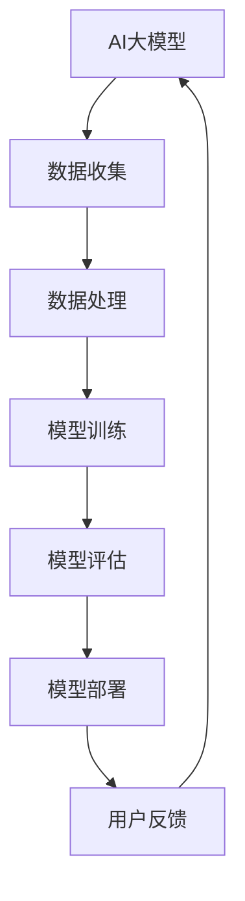
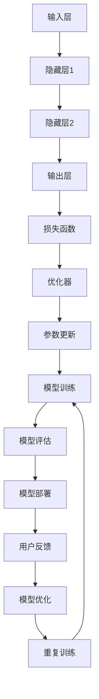
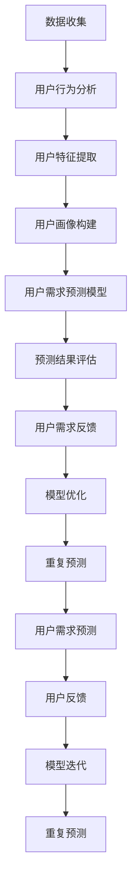

                 

# AI大模型创业：如何应对未来用户需求？

> 关键词：AI大模型、创业、用户需求、深度学习、自然语言处理、预测分析

> 摘要：本文旨在探讨AI大模型在创业领域中的应用，以及如何通过预测用户需求来提升创业成功率。我们将从AI大模型的基础知识出发，分析其在创业中的应用，并探讨如何预测和响应未来用户需求，以实现可持续发展。

## 目录大纲

1. AI大模型基础
   1.1 AI大模型概述
   1.2 AI大模型技术基础
2. AI大模型在创业中的应用
   2.1 创业公司AI战略规划
   2.2 AI大模型产品设计与开发
   2.3 AI大模型创业案例解析
3. 未来用户需求应对策略
   3.1 预测未来用户需求
   3.2 创新与应对策略
   3.3 AI大模型创业风险与应对
4. 附录
   4.1 AI大模型开发工具与资源
   4.2 AI大模型架构图与神经网络结构图
   4.3 伪代码：深度学习模型训练过程
   4.4 数学公式：损失函数与梯度下降优化算法
   4.5 用户需求预测流程图
   4.6 实际案例：某AI公司AI客服系统开发

### 第一部分: AI大模型基础

#### 第1章: AI大模型概述

##### 1.1.1 AI大模型的概念与重要性

AI大模型，即大型人工智能模型，通常是指那些参数数量庞大、能够处理海量数据并进行复杂任务学习的深度学习模型。这些模型在大规模数据处理、自然语言理解、图像识别等领域展现了强大的能力。随着计算能力的提升和数据量的爆炸性增长，AI大模型的发展成为推动人工智能技术进步的重要驱动力。

在创业领域，AI大模型的重要性体现在多个方面：

1. **创新驱动**：AI大模型能够处理复杂任务，为创业者提供强大的技术支持，加速产品创新。
2. **降低成本**：通过自动化和智能化，AI大模型能够显著降低人力成本和运营成本。
3. **提高效率**：AI大模型能够处理大量数据，快速分析用户行为和市场趋势，帮助创业者做出更明智的决策。
4. **增强竞争力**：拥有强大AI能力的创业公司能够在激烈的市场竞争中脱颖而出。

##### 1.1.2 AI大模型的发展历程

AI大模型的发展历程可以分为以下几个阶段：

1. **早期探索**：1990年代，研究人员开始探索大型神经网络模型，如Backpropagation和Hessian-Free Optimization。
2. **深度学习兴起**：2006年，Hinton等人提出了深度信念网络（DBN），深度学习开始进入人们的视野。
3. **GPU加速**：2009年，NVIDIA推出了GPU加速计算，为深度学习提供了强大的计算支持。
4. **大规模预训练**：2013年，Hinton等人在《Science》杂志上发表了关于AlexNet的论文，深度学习进入一个新的时代。
5. **大模型时代**：近年来，GPT、BERT等大规模预训练模型的出现，标志着AI大模型进入了成熟和广泛应用阶段。

##### 1.1.3 AI大模型在创业中的应用

AI大模型在创业中的应用非常广泛，以下是一些典型的应用场景：

1. **智能客服**：通过AI大模型，可以实现对用户咨询的自动化处理，提供高效的客户服务。
2. **推荐系统**：AI大模型能够根据用户行为和偏好，提供个性化的推荐服务，提升用户体验和粘性。
3. **数据分析**：AI大模型能够处理海量数据，进行数据挖掘和预测分析，帮助创业者发现商业机会。
4. **自动化决策**：通过AI大模型，可以自动化处理业务流程，提高运营效率，降低人力成本。
5. **智能营销**：AI大模型能够分析用户行为，优化广告投放策略，提高转化率。

##### 1.1.4 AI大模型与传统AI模型的区别

传统AI模型通常是指基于规则和符号推理的模型，如决策树、支持向量机等。与传统AI模型相比，AI大模型具有以下特点：

1. **参数规模**：传统AI模型的参数数量较少，而AI大模型通常具有数十亿甚至千亿级的参数。
2. **数据处理能力**：AI大模型能够处理大规模数据，而传统AI模型通常难以处理大量数据。
3. **自适应能力**：AI大模型通过大规模预训练，能够自适应地处理多种任务，而传统AI模型需要针对每个任务单独设计。
4. **泛化能力**：AI大模型通过大规模数据训练，能够获得更好的泛化能力，而传统AI模型往往容易过拟合。

#### 第2章: AI大模型技术基础

##### 2.1.1 深度学习基础

深度学习是AI大模型的核心技术，以下简要介绍深度学习的基础知识。

##### 2.1.1.1 神经网络结构

神经网络是深度学习的基础，它由输入层、隐藏层和输出层组成。每个层包含多个神经元，神经元之间通过加权连接。输入层接收外部数据，隐藏层对数据进行加工，输出层产生最终输出。

##### 2.1.1.2 前馈神经网络

前馈神经网络是一种常见的神经网络结构，数据从输入层流向隐藏层，然后到达输出层。没有循环连接，信息仅单向流动。

##### 2.1.1.3 反向传播算法

反向传播算法是一种用于训练神经网络的优化算法。它通过计算损失函数关于模型参数的梯度，并利用梯度下降方法更新参数，以最小化损失函数。

##### 2.1.2 自然语言处理基础

自然语言处理（NLP）是AI大模型的重要应用领域，以下简要介绍NLP的基础知识。

##### 2.1.2.1 词嵌入技术

词嵌入是一种将词语映射到高维向量空间的技术，它使得词语之间的语义关系可以通过向量间的几何关系来表示。

##### 2.1.2.2 序列模型与注意力机制

序列模型是用于处理序列数据的神经网络模型，如RNN、LSTM等。注意力机制是一种用于提高序列模型性能的机制，它通过动态分配不同权重来处理序列中的不同部分。

##### 2.1.2.3 转换器架构详解

转换器（Transformer）是一种基于注意力机制的序列到序列模型，它在自然语言处理领域取得了显著成果。转换器由编码器和解码器组成，它们通过多层的自注意力机制和点积注意力机制来处理输入序列和输出序列。

##### 2.1.3 大规模预训练模型原理

大规模预训练模型是AI大模型的重要组成部分，以下简要介绍其原理。

##### 2.1.3.1 预训练的概念与意义

预训练是指在大规模数据集上对模型进行训练，然后微调模型以适应特定任务。预训练的意义在于提高模型的泛化能力和自适应能力。

##### 2.1.3.2 自监督学习方法

自监督学习是一种利用未标注数据进行训练的方法，它通过预测数据中的某些部分来学习数据表示。自监督学习在大规模预训练中起到了关键作用。

##### 2.1.3.3 迁移学习与微调技术

迁移学习是指将预训练模型在特定任务上微调，以适应新的任务。微调技术通过调整模型参数，使模型在新任务上表现更好。

### 第二部分: AI大模型在创业中的应用

#### 第3章: 创业公司AI战略规划

##### 3.1.1 AI能力评估框架

为了在创业过程中有效地应用AI大模型，公司需要对自身的AI能力进行评估。以下是一个简单的AI能力评估框架：

1. **数据资源**：评估公司拥有的数据量、数据质量和数据多样性。
2. **计算资源**：评估公司的计算能力，包括CPU、GPU和存储资源。
3. **技术能力**：评估公司在AI算法、模型开发和数据处理方面的技术能力。
4. **团队组成**：评估公司AI团队的规模、经验和技能水平。
5. **应用场景**：评估公司可应用的AI场景和潜在的商业价值。

##### 3.1.2 AI项目ROI分析方法

在创业过程中，AI项目的ROI（投资回报率）分析是至关重要的。以下是一种简单的ROI分析方法：

1. **项目成本**：计算AI项目的总成本，包括硬件、软件、人力和运营成本。
2. **预期收益**：预测AI项目实施后的预期收益，包括直接收益（如销售额增加）和间接收益（如效率提升）。
3. **收益实现时间**：评估AI项目的收益实现时间，并计算项目的ROI。

##### 3.1.3 AI对企业业务流程的影响

AI大模型的应用可以显著改变企业的业务流程，以下是一些典型的影响：

1. **自动化**：AI大模型能够自动化处理重复性任务，提高工作效率。
2. **数据驱动的决策**：AI大模型能够分析大量数据，为企业提供数据驱动的决策支持。
3. **个性化服务**：AI大模型能够根据用户行为和偏好提供个性化服务，提升用户体验。
4. **业务流程优化**：AI大模型能够分析业务流程，发现优化机会，提高运营效率。

##### 3.1.4 AI战略规划实施步骤

为了成功地实施AI战略规划，公司可以按照以下步骤进行：

1. **明确目标**：确定公司应用AI的目标和预期成果。
2. **评估能力**：对公司的AI能力进行评估，确定需要补充的资源和技术。
3. **制定计划**：制定详细的AI战略规划，包括项目、团队、资源和时间表。
4. **实施项目**：按照计划实施AI项目，并确保项目按期完成。
5. **监控与调整**：对AI项目的进展进行监控，并根据实际情况进行调整。

#### 第4章: AI大模型产品设计与开发

##### 4.1.1 产品需求分析

产品需求分析是AI大模型产品开发的第一步，它旨在明确产品的功能、性能和用户体验。以下是一个简单的产品需求分析流程：

1. **需求收集**：通过访谈、问卷、用户反馈等方式收集用户需求。
2. **需求筛选**：对收集到的需求进行筛选，确定最重要的需求。
3. **需求文档**：编写详细的需求文档，包括功能需求、性能需求和用户体验需求。
4. **需求评审**：组织相关利益相关者对需求文档进行评审，确保需求的准确性和可行性。

##### 4.1.1.1 用户需求分析

用户需求分析是产品需求分析的核心，以下是一些常用的用户需求分析方法：

1. **问卷调查**：通过问卷调查收集用户需求和反馈。
2. **用户访谈**：与用户进行面对面访谈，深入了解用户需求。
3. **用户行为分析**：通过分析用户行为数据，发现用户的需求和痛点。
4. **用户画像**：通过构建用户画像，分析不同用户群体的需求差异。

##### 4.1.1.2 产品功能设计

产品功能设计是产品需求分析的结果，它旨在明确产品的功能模块和交互逻辑。以下是一个简单的产品功能设计流程：

1. **功能规划**：根据用户需求，规划产品的功能模块。
2. **功能分解**：将每个功能模块分解为具体的子功能。
3. **功能原型**：制作产品的功能原型，进行用户测试和反馈。
4. **功能验证**：通过用户测试和反馈，验证产品功能的可行性和用户满意度。

##### 4.1.1.3 产品迭代策略

产品迭代策略是产品开发的重要环节，它旨在不断优化产品功能，提升用户体验。以下是一些常用的产品迭代策略：

1. **快速迭代**：通过快速开发、测试和迭代，迅速推出产品版本。
2. **增量迭代**：在现有产品基础上，逐步添加新功能和改进现有功能。
3. **周期迭代**：按照固定的时间周期，对产品进行评估和优化。
4. **用户反馈迭代**：根据用户反馈，不断优化产品功能，提升用户体验。

##### 4.1.2 AI大模型模型开发

AI大模型模型开发是产品设计的核心，它包括数据集准备、模型设计、模型训练和模型评估等步骤。以下是一个简单的AI大模型模型开发流程：

1. **数据集准备**：收集、清洗和标注数据，准备用于模型训练的数据集。
2. **模型设计**：根据产品需求，设计合适的AI大模型结构。
3. **模型训练**：使用训练数据集对模型进行训练，调整模型参数。
4. **模型评估**：使用验证数据集对模型进行评估，选择最优模型。
5. **模型部署**：将训练好的模型部署到产品中，供用户使用。

##### 4.1.2.1 数据集选择与预处理

数据集选择与预处理是AI大模型模型开发的关键步骤，以下是一些常用的数据集选择与预处理方法：

1. **数据集选择**：根据产品需求，选择合适的数据集。例如，对于图像识别任务，可以选择ImageNet数据集。
2. **数据清洗**：去除数据集中的噪声和错误数据，提高数据质量。
3. **数据标注**：对数据进行标注，为模型训练提供标签。
4. **数据增强**：通过数据增强技术，增加数据多样性，提高模型泛化能力。
5. **数据归一化**：对数据进行归一化处理，使数据分布更加均匀，提高模型训练效果。

##### 4.1.2.2 模型设计与优化

模型设计与优化是AI大模型模型开发的核心步骤，以下是一些常用的模型设计与优化方法：

1. **模型选择**：根据任务需求和数据特点，选择合适的模型架构。例如，对于文本分类任务，可以选择BERT模型。
2. **超参数调优**：通过调整模型超参数，优化模型性能。常用的超参数包括学习率、批次大小、dropout比例等。
3. **模型优化**：通过模型优化技术，提高模型训练效率和性能。例如，可以使用混合精度训练、模型剪枝等技术。
4. **模型融合**：通过模型融合技术，将多个模型的结果进行融合，提高模型预测性能。

##### 4.1.2.3 模型训练与评估

模型训练与评估是AI大模型模型开发的重要步骤，以下是一个简单的模型训练与评估流程：

1. **模型训练**：使用训练数据集对模型进行训练，调整模型参数。
2. **模型评估**：使用验证数据集对模型进行评估，选择最优模型。
3. **模型调优**：根据评估结果，对模型进行调优，提高模型性能。
4. **模型部署**：将训练好的模型部署到产品中，供用户使用。

##### 4.1.3 AI大模型部署与运维

AI大模型部署与运维是产品上线后的重要环节，以下是一些常用的部署与运维方法：

1. **部署环境搭建**：搭建模型部署环境，包括硬件、软件和网络配置等。
2. **部署策略**：根据业务需求和负载情况，选择合适的部署策略。例如，可以使用容器化部署、云服务部署等。
3. **模型监控**：对模型性能进行实时监控，及时发现和解决问题。
4. **性能优化**：通过性能优化技术，提高模型运行效率和稳定性。例如，可以使用模型压缩、缓存技术等。
5. **故障转移**：在发生故障时，自动切换到备用模型或服务，保证业务连续性。

##### 4.1.3.1 部署环境搭建

部署环境搭建是AI大模型部署的第一步，以下是一个简单的部署环境搭建流程：

1. **硬件选择**：根据模型计算量和负载情况，选择合适的硬件设备。例如，对于GPU密集型任务，可以选择高性能的GPU服务器。
2. **软件安装**：安装操作系统、深度学习框架和其他必要的软件。
3. **网络配置**：配置网络环境，确保模型能够访问外部数据和资源。
4. **环境测试**：对部署环境进行测试，确保其稳定性和可靠性。

##### 4.1.3.2 部署策略

部署策略是AI大模型部署的核心，以下是一些常用的部署策略：

1. **容器化部署**：使用容器技术（如Docker）将模型和服务打包，实现轻量级、可移植的部署。
2. **云服务部署**：使用云计算平台（如AWS、Azure）提供的AI服务，实现弹性、高效、安全的部署。
3. **混合部署**：将模型和服务分别部署到不同的环境，实现灵活的部署和扩展。
4. **边缘计算部署**：在边缘设备（如物联网设备）上部署模型，实现实时、低延迟的计算。

##### 4.1.3.3 运维监控与优化

运维监控与优化是AI大模型部署后的重要环节，以下是一些常用的运维监控与优化方法：

1. **性能监控**：实时监控模型性能指标（如响应时间、吞吐量等），及时发现和解决问题。
2. **日志管理**：收集和存储模型运行日志，进行日志分析，发现潜在问题和优化机会。
3. **性能优化**：通过性能优化技术（如模型压缩、缓存技术等），提高模型运行效率和稳定性。
4. **故障恢复**：在发生故障时，自动切换到备用模型或服务，实现快速故障恢复。

#### 第5章: AI大模型创业案例解析

##### 5.1.1 案例一：某AI公司创业历程

案例一描述了一家AI公司在创业过程中的经历，包括AI技术的选择、产品开发、市场推广和商业模式探索等方面的内容。以下是一个简单的案例描述：

- **AI技术选择**：公司选择了基于深度学习的自然语言处理技术，开发了一款智能客服系统。
- **产品开发**：公司通过用户需求分析和功能设计，开发了一款具有高度自动化和智能化的客服系统。
- **市场推广**：公司通过线上推广和线下活动，将产品推广到了多个行业和领域。
- **商业模式探索**：公司通过提供SaaS服务、定制开发和合作伙伴模式，实现了商业模式的多样化。

##### 5.1.2 案例二：某AI产品创业案例分析

案例二详细分析了一家AI产品创业公司的成功经验，包括产品定位、市场需求分析、产品开发策略和商业模式设计等方面的内容。以下是一个简单的案例分析：

- **产品定位**：公司针对金融行业的需求，开发了一款智能风控系统。
- **市场需求分析**：公司通过市场调研和分析，确定了金融风控领域作为目标市场，并分析了市场需求和痛点。
- **产品开发策略**：公司采用迭代开发策略，快速推出产品原型，并进行用户测试和反馈，不断优化产品功能。
- **商业模式设计**：公司通过提供SaaS服务和定制开发服务，实现了商业模式的多样化，并建立了良好的客户关系。

##### 5.1.3 案例三：AI大模型创业常见问题与对策

案例三总结了AI大模型创业过程中常见的问题和对策，包括技术挑战、商业模式设计、市场竞争等方面的内容。以下是一个简单的案例总结：

- **技术挑战**：公司在技术选择和开发过程中遇到了数据质量、模型优化和性能瓶颈等问题。对策是加强数据质量管理和优化模型结构，提高模型性能。
- **商业模式设计**：公司在商业模式设计过程中遇到了市场定位不准确、客户需求不明确等问题。对策是通过市场调研和用户反馈，准确定位市场和客户需求，优化商业模式。
- **市场竞争**：公司在市场竞争中遇到了竞争对手强势、市场份额低等问题。对策是加强产品创新和差异化，提高产品质量和竞争力，积极开拓新市场。

### 第三部分: 未来用户需求应对策略

#### 第6章: 预测未来用户需求

##### 6.1.1 用户行为分析

用户行为分析是预测未来用户需求的重要手段，以下是一些常用的用户行为分析方法：

1. **数据分析**：通过对用户行为数据进行分析，发现用户的行为模式和偏好。
2. **数据可视化**：通过数据可视化技术，直观展示用户行为数据，帮助分析用户行为。
3. **机器学习模型**：使用机器学习模型，对用户行为数据进行建模和分析，预测用户需求。
4. **用户反馈**：收集用户反馈，了解用户对产品和服务的需求和意见，及时调整产品策略。

##### 6.1.1.1 数据收集与处理

数据收集与处理是用户行为分析的基础，以下是一些常用的数据收集与处理方法：

1. **数据收集**：通过日志、问卷调查、用户行为跟踪等方式收集用户行为数据。
2. **数据清洗**：去除数据中的噪声和错误数据，提高数据质量。
3. **数据预处理**：对数据进行归一化、特征提取和降维等处理，为模型训练提供高质量的数据集。

##### 6.1.1.2 用户行为预测模型

用户行为预测模型是用户行为分析的核心，以下是一些常用的用户行为预测模型：

1. **线性回归模型**：通过分析用户行为数据，建立线性回归模型，预测用户需求。
2. **决策树模型**：通过分析用户行为数据，建立决策树模型，预测用户需求。
3. **神经网络模型**：通过分析用户行为数据，建立神经网络模型，预测用户需求。
4. **集成模型**：将多个模型进行集成，提高用户行为预测的准确性。

##### 6.1.1.3 用户需求变化趋势

用户需求变化趋势是预测未来用户需求的重要依据，以下是一些常用的用户需求变化趋势分析方法：

1. **时间序列分析**：通过对用户需求数据进行时间序列分析，发现用户需求的变化趋势。
2. **季节性分析**：通过对用户需求数据进行季节性分析，发现用户需求的季节性变化规律。
3. **趋势预测**：通过分析用户需求数据的变化趋势，预测未来用户需求的发展方向。

##### 6.1.2 用户画像构建

用户画像构建是预测未来用户需求的重要手段，以下是一些常用的用户画像构建方法：

1. **用户特征提取**：通过对用户行为数据进行分析，提取用户的主要特征，如年龄、性别、地域、兴趣等。
2. **用户标签构建**：根据用户特征，构建用户标签，用于分类和聚类分析。
3. **用户分类模型**：使用机器学习模型，对用户标签进行分类，构建用户画像。
4. **用户聚类模型**：使用聚类算法，将用户按照相似度进行分类，构建用户画像。

##### 6.1.2.1 用户特征提取

用户特征提取是用户画像构建的关键步骤，以下是一些常用的用户特征提取方法：

1. **基于规则的特征提取**：根据业务需求，定义一系列规则，提取用户的主要特征。
2. **基于机器学习的特征提取**：使用机器学习算法，对用户行为数据进行分析，提取用户的主要特征。
3. **基于文本的特征提取**：通过对用户行为数据进行文本分析，提取用户的文本特征。
4. **基于图像的特征提取**：通过对用户行为数据进行图像分析，提取用户的图像特征。

##### 6.1.2.2 用户画像建模

用户画像建模是用户画像构建的核心步骤，以下是一些常用的用户画像建模方法：

1. **基于规则的建模**：根据业务需求，定义一系列规则，构建用户画像模型。
2. **基于机器学习的建模**：使用机器学习算法，对用户特征进行建模，构建用户画像模型。
3. **基于聚类分析的建模**：使用聚类算法，对用户特征进行聚类分析，构建用户画像模型。
4. **基于深度学习的建模**：使用深度学习算法，对用户特征进行建模，构建用户画像模型。

##### 6.1.2.3 用户需求预测

用户需求预测是用户画像构建的应用目标，以下是一些常用的用户需求预测方法：

1. **基于规则的预测**：根据用户画像模型，定义一系列规则，预测用户需求。
2. **基于机器学习的预测**：使用机器学习算法，对用户画像模型进行预测，预测用户需求。
3. **基于深度学习的预测**：使用深度学习算法，对用户画像模型进行预测，预测用户需求。
4. **基于大数据的预测**：通过对用户行为数据进行大数据分析，预测用户需求。

##### 6.1.3 用户需求预测模型

用户需求预测模型是用户需求预测的核心，以下是一些常用的用户需求预测模型：

1. **回归模型**：通过分析用户历史行为数据，建立回归模型，预测用户需求。
2. **分类模型**：通过分析用户历史行为数据，建立分类模型，预测用户需求。
3. **聚类模型**：通过分析用户历史行为数据，建立聚类模型，预测用户需求。
4. **时间序列模型**：通过分析用户历史行为数据，建立时间序列模型，预测用户需求。

##### 6.1.4 预测结果评估

预测结果评估是用户需求预测的重要环节，以下是一些常用的预测结果评估方法：

1. **准确率**：评估预测结果的准确性，计算预测准确率。
2. **召回率**：评估预测结果的召回率，计算预测召回率。
3. **F1分数**：综合考虑准确率和召回率，计算预测F1分数。
4. **ROC曲线**：评估预测结果的ROC曲线，计算预测ROC曲线下的面积。

##### 6.1.5 用户反馈机制

用户反馈机制是用户需求预测的重要环节，以下是一些常用的用户反馈机制：

1. **用户反馈收集**：通过问卷调查、用户访谈等方式，收集用户反馈。
2. **用户反馈分析**：对用户反馈进行分析，发现用户需求的变化和趋势。
3. **用户反馈更新**：根据用户反馈，更新用户需求预测模型，提高预测准确性。

##### 6.1.6 用户需求快速响应

用户需求快速响应是用户需求预测的应用目标，以下是一些常用的用户需求快速响应方法：

1. **实时预测**：通过实时预测技术，快速预测用户需求，为用户提供个性化服务。
2. **实时响应**：通过实时响应技术，快速响应用户需求，提供实时反馈和帮助。
3. **实时优化**：通过实时优化技术，根据用户需求的变化，实时调整产品策略和功能。

##### 6.1.7 用户需求持续优化

用户需求持续优化是用户需求预测的重要目标，以下是一些常用的用户需求持续优化方法：

1. **用户反馈收集**：持续收集用户反馈，了解用户需求的变化和趋势。
2. **用户反馈分析**：对用户反馈进行分析，发现用户需求的变化和趋势。
3. **用户需求预测**：基于用户反馈和用户需求数据，持续优化用户需求预测模型。
4. **产品迭代**：根据用户需求预测结果，持续优化产品功能和服务。

#### 第7章: 创新与应对策略

##### 7.1.1 技术创新

技术创新是应对未来用户需求的关键，以下是一些常用的技术创新方法：

1. **深度学习新技术**：研究最新的深度学习算法和架构，提高模型性能和效率。
2. **自然语言处理新技术**：研究最新的自然语言处理算法和模型，提高文本理解和生成能力。
3. **大规模预训练模型新技术**：研究最新的大规模预训练模型，提高模型泛化能力和自适应能力。

##### 7.1.2 商业模式创新

商业模式创新是应对未来用户需求的重要手段，以下是一些常用的商业模式创新方法：

1. **用户付费模式**：根据用户需求和价值，设计合理的用户付费模式，提高用户黏性和付费意愿。
2. **用户订阅模式**：通过用户订阅模式，提供持续的服务和更新，提高用户满意度和留存率。
3. **生态合作模式**：与行业合作伙伴合作，构建生态系统，共同开发新市场和业务模式。

##### 7.1.3 用户需求响应策略

用户需求响应策略是应对未来用户需求的重要环节，以下是一些常用的用户需求响应策略：

1. **实时反馈机制**：建立实时反馈机制，快速收集用户反馈，及时响应用户需求。
2. **用户体验优化**：根据用户反馈，持续优化产品和服务，提高用户体验和满意度。
3. **个性化推荐**：根据用户需求和偏好，提供个性化的推荐和服务，满足用户的个性化需求。

##### 7.1.4 用户需求快速响应

用户需求快速响应是用户需求响应策略的核心，以下是一些常用的用户需求快速响应方法：

1. **实时预测**：通过实时预测技术，快速预测用户需求，为用户提供实时反馈和帮助。
2. **实时响应**：通过实时响应技术，快速响应用户需求，提供实时服务和解决方案。
3. **实时优化**：通过实时优化技术，根据用户需求的变化，实时调整产品策略和功能。

##### 7.1.5 用户需求持续优化

用户需求持续优化是用户需求响应策略的重要目标，以下是一些常用的用户需求持续优化方法：

1. **用户反馈收集**：持续收集用户反馈，了解用户需求的变化和趋势。
2. **用户反馈分析**：对用户反馈进行分析，发现用户需求的变化和趋势。
3. **用户需求预测**：基于用户反馈和用户需求数据，持续优化用户需求预测模型。
4. **产品迭代**：根据用户需求预测结果，持续优化产品功能和服务。

#### 第8章: AI大模型创业风险与应对

##### 8.1.1 创业风险识别

在AI大模型创业过程中，风险识别是风险管理的重要步骤。以下是一些常见的AI大模型创业风险：

1. **技术风险**：包括算法研发难度、技术迭代速度、技术实现困难等。
2. **市场风险**：包括市场需求不明确、市场竞争激烈、客户接受度低等。
3. **资金风险**：包括资金不足、融资困难、资金链断裂等。
4. **人才风险**：包括人才流失、团队不完整、核心技术人员不足等。
5. **法律风险**：包括数据隐私、知识产权保护、法律法规合规性等。

##### 8.1.2 风险应对策略

针对识别出的风险，以下是一些常见的风险应对策略：

1. **技术风险管理**：
   - **技术创新**：持续进行技术研究和开发，提高技术竞争力。
   - **技术储备**：建立技术储备库，储备关键技术和解决方案。
   - **技术合作**：与行业领先企业和研究机构合作，共享技术和资源。

2. **市场风险管理**：
   - **市场调研**：进行详细的市场调研，了解市场需求和竞争状况。
   - **市场定位**：准确定位市场，制定明确的市场策略和目标。
   - **市场推广**：加强市场推广，提高品牌知名度和用户接受度。

3. **资金风险管理**：
   - **融资规划**：制定详细的融资计划，确保资金充足。
   - **成本控制**：严格控制成本，提高资金使用效率。
   - **财务审计**：定期进行财务审计，确保财务状况健康。

4. **人才风险管理**：
   - **人才引进**：制定人才引进策略，吸引行业顶尖人才。
   - **人才培养**：加强人才培养和培训，提高团队整体素质。
   - **激励机制**：建立激励机制，留住核心人才。

5. **法律风险管理**：
   - **法律法规学习**：了解相关法律法规，确保业务合规性。
   - **法律咨询**：聘请专业律师团队，提供法律咨询和风险评估。
   - **合规管理**：建立合规管理体系，确保业务合法合规。

##### 8.1.3 风险评估与监控

为了有效管理风险，以下是一些常用的风险评估与监控方法：

1. **风险评估**：对潜在风险进行评估，确定风险等级和影响程度。
2. **风险监控**：建立风险监控机制，实时监控风险变化和业务影响。
3. **预警机制**：建立风险预警机制，及时识别和应对潜在风险。
4. **风险报告**：定期生成风险报告，向管理层提供风险信息和建议。

#### 附录

##### 附录 A: AI大模型开发工具与资源

为了帮助创业者更好地进行AI大模型开发，以下是一些常用的AI大模型开发工具与资源：

1. **主流深度学习框架对比**：
   - **TensorFlow**：由Google开发，功能强大，社区支持丰富。
   - **PyTorch**：由Facebook开发，易于调试和模型构建。
   - **JAX**：由Google开发，支持自动微分和分布式计算。

2. **开发工具与平台**：
   - **GPU计算平台**：如Google Colab、AWS EC2等，提供强大的计算资源。
   - **数据处理工具**：如Pandas、NumPy等，用于数据清洗、预处理和分析。
   - **模型部署工具**：如TensorFlow Serving、PyTorch TorchScript等，用于模型部署和推理。
   - **代码版本控制工具**：如Git，用于代码管理和协作开发。

##### 附录 B: AI大模型架构图与神经网络结构图

以下是AI大模型架构图与神经网络结构图的示例：

**图1-1 AI大模型架构**



**图1-2 深度学习神经网络结构**



##### 附录 C: 伪代码：深度学习模型训练过程

以下是深度学习模型训练过程的伪代码示例：

```python
# 初始化模型参数
params = initialize_params()

# 初始化优化器
optimizer = initialize_optimizer()

# 循环进行模型训练
for epoch in range(num_epochs):
    # 遍历训练数据
    for data in train_data:
        # 前向传播
        predictions = forward_pass(data, params)
        
        # 计算损失
        loss = compute_loss(predictions, data.target)
        
        # 反向传播
        gradients = backward_pass(data, predictions, params)
        
        # 更新模型参数
        params = optimizer.update_params(params, gradients)
        
    # 在验证集上评估模型性能
    validation_loss = evaluate_model(validation_data, params)
    
    # 打印训练进度
    print(f"Epoch {epoch+1}/{num_epochs}, Validation Loss: {validation_loss}")

# 保存模型参数
save_model_params(params)
```

##### 附录 D: 数学公式：损失函数与梯度下降优化算法

以下是损失函数和梯度下降优化算法的数学公式示例：

**损失函数**

$$
\text{损失函数} = \frac{1}{n}\sum_{i=1}^{n} (\text{预测值} - \text{真实值})^2
$$

**梯度下降优化算法**

$$
\text{梯度下降} = \alpha \cdot \nabla_{\theta} J(\theta)
$$

其中，$\alpha$ 为学习率，$\theta$ 为模型参数，$J(\theta)$ 为损失函数。

##### 附录 E: 用户需求预测流程图

以下是用户需求预测流程图的示例：

**图1-3 用户需求预测流程**



##### 附录 F: 实际案例：某AI公司AI客服系统开发

以下是某AI公司AI客服系统开发的实际案例：

**1.1 系统需求分析**

某AI公司开发了一款AI客服系统，旨在提高客户服务效率和用户体验。系统需求包括：

- 7x24小时全天候在线客服
- 自动识别用户问题并给出智能答复
- 支持多语言交流
- 用户反馈机制
- 系统日志记录与分析

**1.2 数据收集与预处理**

- 数据来源：用户提问记录、网站访问日志、社交媒体评论
- 数据预处理：数据清洗、数据标注、数据归一化

**1.3 模型开发与训练**

- 模型选择：采用BERT模型作为基础模型
- 数据集划分：训练集、验证集、测试集
- 模型训练：使用GPU加速训练过程
- 模型评估：准确率、召回率、F1分数

**1.4 模型部署与运维**

- 部署环境：使用Kubernetes进行容器化部署
- 部署策略：负载均衡、故障转移、自动扩缩容
- 运维监控：使用Prometheus和Grafana进行监控
- 性能优化：基于用户反馈进行模型调整

**1.5 代码解读与分析**

以下是AI客服系统核心代码片段的解读与分析：

```python
# 导入必要库
import tensorflow as tf
import tensorflow_hub as hub
import tensorflow_text as text
import numpy as np

# 加载预训练BERT模型
bert_model = hub.load("https://tfhub.dev/google/bert_uncased_L-12_H-768_A-12/1")

# 定义模型输入
inputs = tf.keras.layers.Input(shape=(None,), dtype=tf.string)

# 应用BERT处理输入文本
encoded_inputs = bert_model(inputs)

# 定义模型输出
outputs = tf.keras.layers.Dense(1, activation="sigmoid")(encoded_inputs)

# 构建模型
model = tf.keras.Model(inputs=inputs, outputs=outputs)

# 编译模型
model.compile(optimizer="adam", loss="binary_crossentropy", metrics=["accuracy"])

# 训练模型
model.fit(train_data, train_labels, epochs=3, batch_size=32, validation_split=0.2)
```

**结论**

通过本文的讨论，我们可以看到AI大模型在创业领域具有巨大的潜力和应用价值。为了应对未来用户需求，创业公司需要：

1. **深入了解AI大模型的基础知识**，包括深度学习、自然语言处理等技术。
2. **制定明确的AI战略规划**，评估自身AI能力和市场需求。
3. **进行详细的产品需求分析**，设计并开发符合用户需求的AI产品。
4. **持续进行技术创新**，提高AI模型的性能和泛化能力。
5. **建立有效的用户需求预测和响应机制**，快速响应用户需求，优化用户体验。

随着AI技术的不断进步和市场的不断发展，AI大模型创业将迎来更广阔的前景。创业公司需要不断创新和调整策略，以应对未来用户需求的变化，实现可持续发展。

### 作者信息

作者：AI天才研究院/AI Genius Institute & 禅与计算机程序设计艺术 /Zen And The Art of Computer Programming

（完）

