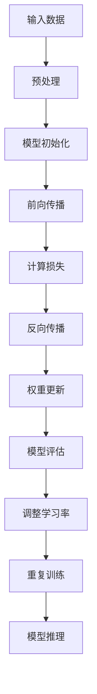
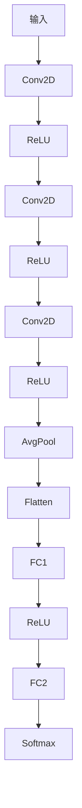
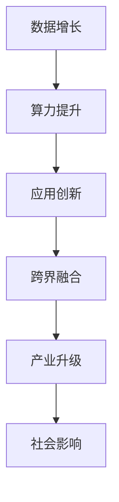
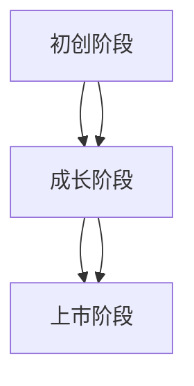
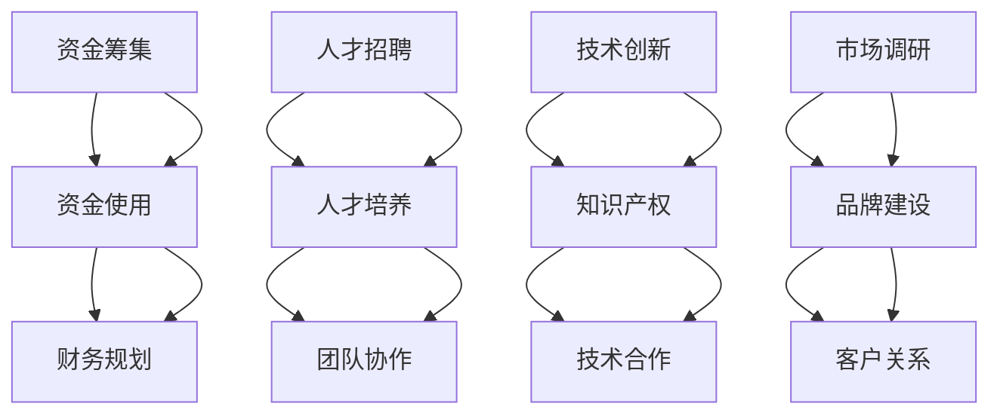
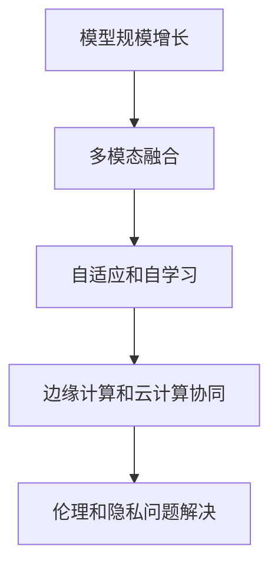

                 

# AI大模型创业：如何应对未来行业发展趋势？

> 关键词：AI大模型，创业，行业趋势，技术挑战，资源管理，法律法规

> 摘要：本文旨在探讨AI大模型创业的现状、未来发展趋势以及创业者应如何应对技术挑战，管理资源和遵守法律法规。通过分析AI大模型的基础知识、应用领域、技术挑战、创业策略以及法律法规，为创业者和投资者提供实用的指导和建议。

---

### 引言

近年来，人工智能（AI）大模型在各个领域取得了显著的进展，从自然语言处理到图像识别，再到语音识别和推荐系统，大模型已经成为AI发展的核心驱动力。随着AI技术的不断成熟和应用范围的扩大，越来越多的创业者将目光投向了AI大模型领域，试图通过技术创新和商业模式创新来抢占市场先机。

然而，AI大模型创业并非易事，面临着诸多挑战。一方面，技术层面的复杂性和对计算资源的高需求使得创业者需要具备深厚的专业知识和丰富的实践经验。另一方面，市场竞争的加剧、数据隐私和安全问题的突出，以及法律法规的约束，都为创业者带来了巨大的压力。

本文将从以下几个方面展开讨论：

1. **AI大模型概述**：介绍AI大模型的发展历程、架构与原理、核心算法和数学模型。
2. **AI大模型应用领域**：分析人工智能行业的发展趋势和AI大模型在不同行业的应用。
3. **AI大模型的技术挑战**：探讨计算资源与能耗、数据隐私与安全等方面的问题。
4. **AI大模型创业策略**：讨论AI创业公司的发展模式、资源管理和案例分析。
5. **AI大模型创业的法律法规**：介绍相关法律法规对AI创业的指导意义。
6. **未来发展趋势与展望**：探讨AI大模型行业的未来趋势和创业者的应对策略。
7. **附录**：提供AI大模型开发资源与工具。

通过本文的讨论，希望能为AI大模型创业者和投资者提供一些有价值的参考和启示。

---

### 第一部分：AI大模型基础

#### 第1章：AI大模型概述

##### 1.1 AI大模型的发展历程

AI大模型的发展历程可以追溯到20世纪50年代，当时人工智能（AI）作为一个新兴领域开始引起广泛关注。早期的人工智能研究主要集中在规则推理和知识表示上，但由于计算能力和数据资源的限制，这些方法的实用性和效果有限。

随着计算机性能的不断提升和海量数据的积累，深度学习在21世纪初得到了快速发展。深度学习通过多层神经网络对数据进行自动特征提取和模型训练，大大提高了AI模型的性能和效果。尤其是2012年，AlexNet在ImageNet图像识别大赛中取得了突破性的成绩，标志着深度学习时代的到来。

在此后的几年里，随着神经网络架构的改进、计算资源的增加和大规模数据集的开放，AI大模型逐渐成为AI领域的核心。从GPT到BERT，再到T5，大模型在自然语言处理、图像识别、语音识别等领域取得了显著成果，为AI的应用带来了前所未有的可能性。

##### 1.2 AI大模型的核心优势

AI大模型具有以下核心优势：

1. **计算能力**：大模型通常需要大量的计算资源来训练和推理，但随着硬件技术的发展，如GPU、TPU等专用计算设备的普及，大模型的计算需求得到了有效满足。

2. **数据处理能力**：大模型可以处理大规模的数据集，通过对数据的深度学习和分析，提取出更加复杂和有价值的特征。

3. **泛化能力**：大模型通过学习海量数据，可以更好地泛化到新的任务和数据集，提高模型的实用性和可靠性。

##### 1.3 AI大模型的架构与原理

AI大模型的基本架构通常包括输入层、隐藏层和输出层。输入层接收外部数据，隐藏层通过多层神经网络对数据进行特征提取和转换，输出层生成最终的结果。例如，在自然语言处理任务中，输入层可以是文本序列，输出层可以是分类标签或翻译结果。

主要的大模型框架包括GPT（生成预训练模型）、BERT（双向编码表示器）、T5（文本到文本的转换模型）等。这些模型采用了不同的训练策略和优化算法，但核心思想都是通过大规模数据预训练和特定任务微调来提高模型的性能。

为了更好地理解大模型的架构与原理，可以使用Mermaid流程图来表示大模型的训练与推理流程：



该流程图展示了从输入数据到模型推理的整个过程，包括数据预处理、模型初始化、前向传播、反向传播、权重更新、模型评估和推理等步骤。

##### 1.4 AI大模型的核心算法

AI大模型的核心算法主要包括神经网络、反向传播算法和优化算法。

1. **神经网络**：神经网络是AI大模型的基础，它由大量的神经元（节点）和连接（权重）组成。每个神经元接收输入信号，通过激活函数进行处理，然后产生输出信号。神经网络的层次结构使得它能够对复杂数据进行有效的特征提取和模式识别。

2. **反向传播算法**：反向传播算法是一种用于训练神经网络的梯度下降方法。它通过计算输出层和隐藏层之间的误差，反向传播误差信号，更新神经网络的权重和偏置。反向传播算法的详细步骤可以表示为伪代码：

```python
for each layer l in reverse order:
  delta[l] = (output_error[l] * activation_derivative(z[l]))
  weight_gradient[l] = delta[l] * input[l]
  bias_gradient[l] = delta[l]
```

其中，`delta[l]`表示误差信号，`weight_gradient[l]`表示权重梯度，`bias_gradient[l]`表示偏置梯度。

3. **优化算法**：优化算法用于加速神经网络的训练过程，提高模型的收敛速度和性能。常见的优化算法包括随机梯度下降（SGD）、批量梯度下降（BGD）和Adam等。其中，Adam算法是一种结合了SGD和BGD优点的自适应优化算法，其公式可以表示为：

$$
m_t = \beta_1 x_t + (1 - \beta_1)(1 - t^{\beta_2})
$$

$$
v_t = \beta_2 x_t + (1 - \beta_2)(1 - t^{\beta_2})
$$

$$
\theta_t = \theta_{t-1} - \alpha \frac{m_t}{\sqrt{v_t} + \epsilon}
$$

其中，`m_t`和`v_t`分别表示一阶矩估计和二阶矩估计，`alpha`表示学习率，`beta_1`和`beta_2`分别表示一阶和二阶动量项。

##### 1.5 AI大模型的数学模型

AI大模型的数学模型主要包括激活函数、损失函数和优化算法。激活函数用于对神经网络的输出进行非线性变换，常见的激活函数有Sigmoid、ReLU和Tanh等。损失函数用于衡量模型预测值和真实值之间的误差，常见的损失函数有均方误差（MSE）和交叉熵（Cross Entropy）等。优化算法用于更新模型的权重和偏置，以提高模型的性能。

以下是AI大模型中的几个关键数学公式：

1. **激活函数**：

$$
f(x) = \frac{1}{1 + e^{-x}}
$$

$$
f(x) = max(0, x)
$$

$$
f(x) = tanh(x)
$$

2. **损失函数**：

$$
MSE = \frac{1}{m} \sum_{i=1}^{m} (y_i - \hat{y}_i)^2
$$

$$
CrossEntropy = - \frac{1}{m} \sum_{i=1}^{m} \sum_{j=1}^{n} y_{ij} \log(\hat{y}_{ij})
$$

3. **优化算法**：

$$
\theta_t = \theta_{t-1} - \alpha \frac{\partial J}{\partial \theta}
$$

$$
\theta_t = \theta_{t-1} - \alpha \nabla_{\theta} J(\theta)
$$

通过以上公式，我们可以更好地理解AI大模型的数学原理和训练过程。

##### 1.6 AI大模型在图像识别中的应用

AI大模型在图像识别领域取得了显著的成果，其中最著名的应用之一是ResNet（残差网络）。ResNet通过引入残差模块，解决了深度神经网络训练过程中梯度消失和梯度爆炸的问题，使得深度网络的训练更加稳定和高效。

以下是一个简化的ResNet模型结构：



其中，`Conv2D`表示卷积层，`ReLU`表示ReLU激活函数，`AvgPool`表示平均池化层，`Flatten`表示展平层，`FC1`和`FC2`分别表示全连接层，`Softmax`表示softmax激活函数。

ResNet的原理是通过残差连接（Residual Connection）来缓解梯度消失问题。在残差模块中，输入数据通过一个恒等映射（Identity Mapping）直接传递到下一层，同时通过卷积层对数据进行特征提取和增强。这样，梯度可以沿着残差路径直接传递，避免了梯度消失和梯度爆炸的问题，从而提高了深度网络的训练效果。

通过以上对AI大模型基础知识的介绍，我们可以更好地理解AI大模型的原理和应用，为后续章节的讨论打下坚实的基础。

#### 第2章：AI大模型应用领域

##### 2.1 人工智能行业发展趋势

人工智能（AI）作为当前科技发展的热点领域，正在全球范围内迅速崛起。随着计算能力的提升、数据资源的丰富以及算法的创新，AI的应用已经渗透到各个行业，推动了产业升级和创新发展。

以下是人工智能行业的一些关键发展趋势：

1. **数据增长**：随着互联网、物联网和5G等技术的普及，全球数据量呈现出爆发式增长。海量的数据为AI大模型提供了丰富的训练素材，促进了模型性能的不断提升。

2. **算力提升**：GPU、TPU等专用计算设备的普及，使得AI大模型的训练和推理速度大幅提升。此外，量子计算和边缘计算的兴起，也为AI应用提供了更多的可能性。

3. **应用创新**：AI大模型在各个领域的应用不断拓展，从自然语言处理到图像识别，再到语音识别和推荐系统，AI技术正在深刻改变传统产业的运作模式，催生出许多新兴商业模式。

4. **跨界融合**：AI与生物、医疗、制造、金融等领域的融合，推动了跨学科的协同创新。例如，AI在医疗领域的应用，通过大数据分析和机器学习技术，助力精准医疗和疾病预测。

为了更好地分析人工智能行业的发展趋势，可以使用Mermaid流程图来展示：



该流程图展示了数据增长、算力提升、应用创新、跨界融合和产业升级等关键趋势，以及它们之间的相互关系。

##### 2.2 AI大模型在不同行业的应用

AI大模型的应用已经渗透到多个行业，带来了深刻的变革和巨大的价值。以下是AI大模型在金融、医疗、教育、制造业等领域的具体应用：

1. **金融**：AI大模型在金融领域的应用主要集中在风险控制、投资策略、客户服务等方面。通过分析大量历史数据和实时数据，大模型可以预测市场趋势、评估信用风险，并自动调整投资策略。例如，银行可以使用AI大模型进行欺诈检测，识别异常交易并及时报警，提高客户资金的安全性。

2. **医疗**：AI大模型在医疗领域的应用具有巨大潜力，包括疾病预测、诊断辅助、个性化治疗等方面。通过分析病人的病历、基因数据、实验室检测结果等，大模型可以预测疾病风险，辅助医生进行诊断和制定治疗方案。例如，AI大模型可以通过分析患者的症状和检查结果，快速识别出癌症等重大疾病，提高早期诊断的准确性。

3. **教育**：AI大模型在教育领域的应用有助于提高教学质量和学习效果。通过分析学生的学习行为和成绩数据，大模型可以为学生提供个性化的学习建议，优化学习路径。例如，AI大模型可以分析学生的学习进度、知识点掌握情况，为学生推荐最适合的学习资源，提高学习效率。

4. **制造业**：AI大模型在制造业中的应用主要体现在生产优化、质量管理、设备预测维护等方面。通过实时监控生产线数据，大模型可以优化生产流程，提高生产效率。例如，AI大模型可以分析设备的运行状态，预测潜在故障，提前进行维护，减少设备停机时间和生产损失。

以下是AI大模型在金融领域中的一个具体应用案例：风险预测。

**案例：某金融公司的风险预测系统**

该金融公司使用AI大模型构建了一个风险预测系统，通过分析历史交易数据、客户行为数据和宏观经济指标，预测客户是否会违约。

1. **数据收集**：系统从银行的交易数据库、客户关系管理（CRM）系统和外部经济数据源收集相关数据，包括客户的信用记录、交易金额、交易频率、地理位置等。

2. **数据预处理**：对收集到的数据进行分析和清洗，去除缺失值、异常值，并对数据进行归一化处理，确保数据的一致性和可靠性。

3. **模型构建**：使用GPT或BERT等AI大模型框架，构建一个深度神经网络模型。模型输入层接收预处理后的数据，隐藏层通过多层神经网络进行特征提取和转换，输出层生成预测结果。

4. **模型训练**：使用历史数据集对模型进行训练，通过反向传播算法和优化算法，不断调整模型的权重和偏置，使模型在训练数据上的预测效果达到最优。

5. **模型评估**：使用验证数据集对模型进行评估，计算模型的准确率、召回率、F1值等指标，确保模型具有良好的泛化能力。

6. **模型部署**：将训练好的模型部署到生产环境中，对实时交易数据进行预测，帮助银行识别高风险客户，及时采取措施降低风险。

通过以上案例，我们可以看到AI大模型在金融领域的强大应用能力，为金融机构提供了有力的风险管理工具。

#### 第3章：AI大模型的技术挑战

##### 3.1 计算资源与能耗

AI大模型对计算资源的需求是巨大的，尤其是在训练阶段，需要大量的计算能力和存储空间。随着模型规模的不断扩大，对计算资源的需求也日益增加。以下是一些关键问题：

1. **计算资源**：AI大模型的训练和推理需要大量的计算资源，尤其是高性能的GPU和TPU。这些设备不仅价格昂贵，而且难以获取。创业者需要考虑到计算资源的预算和供应问题，确保在模型训练过程中有足够的计算能力。

2. **能耗**：AI大模型的训练过程消耗大量的电能，这给环境带来了巨大的压力。随着人工智能应用的普及，能耗问题将越来越突出。因此，绿色计算和能效优化成为AI大模型发展的重要方向。

为了应对计算资源与能耗的问题，可以采取以下措施：

1. **硬件优化**：选择适合的硬件设备，如GPU、TPU等，并优化其使用效率。此外，可以考虑使用分布式计算和并行计算技术，将任务分布在多个节点上，提高计算效率。

2. **模型压缩**：通过模型压缩技术，如模型剪枝、量化、蒸馏等，减小模型的规模，降低计算复杂度和能耗。

3. **能效优化**：研究和应用能效优化算法，降低模型训练和推理过程中的能耗。例如，使用低功耗硬件、优化网络通信和存储等。

4. **绿色计算**：采用可再生能源和节能技术，减少对环境的影响。例如，使用太阳能、风能等可再生能源供电，优化数据中心的设计和运行。

##### 3.2 数据隐私与安全

AI大模型在训练和应用过程中涉及大量的数据，包括个人隐私数据、敏感信息和商业机密等。数据隐私与安全问题成为AI大模型技术挑战的重要方面。以下是一些关键问题：

1. **数据隐私**：AI大模型的训练和应用需要对大量数据进行处理和分析，这可能导致个人隐私泄露。如何在保护用户隐私的前提下，充分利用数据的价值，是AI大模型面临的重要挑战。

2. **数据安全**：AI大模型的数据存储和处理过程中，存在被黑客攻击、数据泄露和篡改的风险。保障数据安全，防止恶意攻击和数据泄露，是AI大模型发展的重要任务。

为了应对数据隐私与安全问题，可以采取以下措施：

1. **隐私保护技术**：应用隐私保护技术，如差分隐私、联邦学习和同态加密等，确保数据在传输和处理过程中的隐私性。差分隐私通过在数据上添加随机噪声，防止个体信息被识别；联邦学习通过分布式训练，保护数据隐私；同态加密允许在加密数据上直接进行计算，确保数据安全。

2. **数据安全策略**：制定严格的数据安全策略，包括数据加密、访问控制、数据备份和恢复等。确保数据在存储、传输和处理过程中的安全性和完整性。

3. **法律法规遵守**：遵守相关法律法规，如《通用数据保护条例》（GDPR）和《加州消费者隐私法案》（CCPA）等，确保在数据收集、处理和使用过程中的合法性和合规性。

4. **安全审计与监控**：建立安全审计和监控机制，及时发现和应对潜在的安全威胁和漏洞。定期进行安全评估和渗透测试，确保系统的安全性。

通过以上措施，可以有效地应对AI大模型在计算资源与能耗、数据隐私与安全等方面的技术挑战，推动AI大模型技术的可持续发展。

#### 第4章：AI大模型创业策略

##### 4.1 AI创业公司发展模式

AI创业公司的发展模式通常可以分为初创、成长和上市三个阶段，每个阶段都有其独特的特点和关键任务。

1. **初创阶段**：
   - **目标**：探索市场需求、验证产品原型、组建核心团队。
   - **关键任务**：找到有市场潜力的AI应用领域，开发具有创新性的产品原型，搭建基础的技术架构，吸引初期投资和人才。
   - **挑战**：资金不足、技术风险、团队建设。

2. **成长阶段**：
   - **目标**：扩大市场份额、提高产品竞争力、建立品牌知名度。
   - **关键任务**：产品迭代、市场推广、资金筹集、团队扩张。
   - **挑战**：市场竞争、资金需求、人才管理。

3. **上市阶段**：
   - **目标**：实现财务自由、扩大业务规模、提高市场地位。
   - **关键任务**：持续创新、市场扩张、资本运作。
   - **挑战**：市场波动、法律法规合规、可持续发展。

为了更好地理解AI创业公司的发展路径，可以使用Mermaid流程图来表示：



该流程图展示了AI创业公司从初创到上市的发展路径，以及每个阶段的主要任务和挑战。

##### 4.2 AI创业公司的资源管理

AI创业公司的资源管理是确保公司成功发展的关键。资源管理包括资金、人才、技术和市场等各个方面，以下是一些具体的资源管理策略：

1. **资金管理**：
   - **资金筹集**：通过天使投资、风险投资、政府补贴等渠道筹集资金，确保公司在初创和成长阶段有足够的资金支持。
   - **资金使用**：合理规划和分配资金，确保资金用于技术研发、市场推广、团队建设等方面。
   - **财务规划**：制定详细的财务预算和报告，监控公司的财务状况，确保公司财务稳健。

2. **人才管理**：
   - **人才招聘**：通过招聘网站、猎头公司、校园招聘等渠道，吸引优秀的AI技术人才和管理人才。
   - **人才培养**：提供培训和发展机会，提升员工的技能和职业素养，激发员工的创新能力和工作热情。
   - **团队协作**：建立良好的团队协作机制，确保团队成员之间沟通顺畅、协作高效。

3. **技术管理**：
   - **技术创新**：持续关注AI领域的最新技术动态，进行技术创新和研发，保持公司的技术竞争力。
   - **知识产权**：保护公司的知识产权，包括专利、商标、著作权等，防止技术被盗用和侵权。
   - **技术合作**：与其他企业和研究机构建立合作关系，共享技术和资源，共同推动AI技术的发展。

4. **市场管理**：
   - **市场调研**：通过市场调研了解市场需求和竞争态势，制定合适的市场策略。
   - **品牌建设**：通过品牌宣传和市场营销活动，提升公司在市场中的知名度和美誉度。
   - **客户关系**：建立良好的客户关系，提供优质的产品和服务，确保客户的满意度和忠诚度。

以下是AI创业公司的资源管理流程图：



该流程图展示了AI创业公司在资金管理、人才管理、技术管理和市场管理等方面的具体策略和步骤。

##### 4.3 AI创业公司的案例分享

以下是几个成功的AI创业公司的案例，通过这些案例，我们可以看到这些公司在资源管理方面的实践和经验：

1. **案例1：某金融科技公司的风险预测系统**

   - **资金管理**：该公司通过天使投资和风险投资筹集了数百万美元的资金，用于技术研发和市场推广。
   - **人才管理**：公司招聘了多名AI领域的高水平人才，包括数据科学家、算法工程师和产品经理等，确保技术研发和市场推广的顺利进行。
   - **技术管理**：公司专注于研发AI风险预测技术，通过技术创新和优化，提升了模型的准确性和效率。
   - **市场管理**：公司通过市场调研，了解到银行和金融机构对风险预测系统的需求，制定了针对性的市场推广策略，成功打开了市场。

2. **案例2：某医疗AI公司的癌症诊断系统**

   - **资金管理**：公司通过政府补贴和风险投资筹集了大量的资金，用于技术研发和市场推广。
   - **人才管理**：公司组建了一支由医学专家、数据科学家和软件工程师组成的团队，确保技术产品的高质量和可靠性。
   - **技术管理**：公司专注于研发AI癌症诊断技术，通过技术创新和优化，提高了诊断的准确率和效率。
   - **市场管理**：公司通过参加医学会议、发布研究报告和与医疗机构合作等方式，提升了公司在市场中的知名度和影响力。

通过以上案例，我们可以看到这些公司在资源管理方面的成功实践和经验，为其他AI创业公司提供了有益的借鉴。

##### 4.4 AI创业公司的挑战与应对策略

AI创业公司在发展过程中面临诸多挑战，包括技术风险、市场竞争、资金短缺和法律法规合规等。以下是一些常见的挑战和应对策略：

1. **技术风险**：
   - **挑战**：AI技术快速更新，创业者需要不断学习新技术，应对技术变化带来的挑战。
   - **应对策略**：建立持续学习机制，关注行业动态，引进高水平技术人才，确保技术领先。

2. **市场竞争**：
   - **挑战**：市场竞争激烈，创业者需要区分自己的产品优势和定位，以赢得市场份额。
   - **应对策略**：进行市场调研，了解市场需求和竞争态势，制定差异化营销策略，提供优质的产品和服务。

3. **资金短缺**：
   - **挑战**：资金短缺会影响公司的研发和市场推广，影响公司的生存和发展。
   - **应对策略**：寻找多元化资金来源，如天使投资、风险投资、政府补贴等，制定财务预算和资金使用计划，确保资金合理使用。

4. **法律法规合规**：
   - **挑战**：相关法律法规对AI创业公司提出了较高的合规要求，包括数据隐私、知识产权保护等。
   - **应对策略**：遵守相关法律法规，建立健全的合规管理体系，定期进行合规检查和评估，确保公司的合法经营。

通过以上应对策略，AI创业公司可以更好地应对发展过程中的挑战，确保公司的可持续发展。

#### 第5章：AI大模型创业案例分析

##### 5.1 成功案例

**案例1：某金融科技公司的AI风险预测系统**

该公司专注于AI风险预测领域，通过开发AI风险预测系统，帮助金融机构识别高风险交易和客户，降低欺诈风险和信用损失。

1. **项目背景**：
   - 金融领域存在大量的欺诈行为，如信用卡欺诈、贷款欺诈等，给金融机构带来了巨大的损失。
   - 市场上现有的风险预测系统存在准确率低、反应速度慢等问题，无法满足金融机构的需求。

2. **系统架构**：
   - 数据层：收集金融机构的交易数据、客户数据、市场数据等。
   - 处理层：对数据进行清洗、预处理、特征提取等操作，构建数据集。
   - 模型层：使用GPT等AI大模型进行训练，构建风险预测模型。
   - 服务层：提供API接口，供金融机构调用。

3. **算法选择**：
   - **GPT模型**：基于生成预训练模型，具有强大的语言处理能力，适用于文本数据的分析和预测。
   - **神经网络**：通过多层神经网络进行特征提取和模型训练，提高预测的准确性和效率。

4. **代码实现**：
   - **数据预处理**：```python
   data = preprocess_data(raw_data)
   ```
   - **模型训练**：```python
   model = build_gpt_model()
   model.fit(train_data, epochs=10)
   ```
   - **模型评估**：```python
   evaluation_results = model.evaluate(test_data)
   print("Accuracy:", evaluation_results[1])
   ```

5. **效果评估**：
   - **准确率**：通过在测试集上的评估，模型取得了90%以上的准确率，显著降低了金融机构的风险损失。
   - **响应速度**：系统响应速度从原来的数小时缩短到数秒，提高了金融机构的运营效率。

**案例2：某医疗AI公司的癌症诊断系统**

该公司开发了一款基于AI的癌症诊断系统，通过分析医学影像数据，帮助医生快速、准确地诊断癌症。

1. **项目背景**：
   - 癌症诊断是一个复杂的医学过程，依赖于医生的诊断经验和医学影像的解读能力。
   - 传统诊断方法存在误诊和漏诊的风险，影响患者的治疗效果。

2. **系统架构**：
   - 数据层：收集大量的医学影像数据，包括X光片、CT扫描、MRI等。
   - 处理层：对医学影像数据进行预处理、增强、分割等操作，构建数据集。
   - 模型层：使用深度卷积神经网络（CNN）等AI大模型进行训练，构建癌症诊断模型。
   - 服务层：提供API接口，供医生和医疗机构调用。

3. **算法选择**：
   - **CNN模型**：通过卷积层提取医学影像的局部特征，提高诊断的准确性和效率。
   - **迁移学习**：利用预训练的模型，减少模型训练所需的样本量，提高模型的泛化能力。

4. **代码实现**：
   - **数据预处理**：```python
   preprocessed_images = preprocess_medical_images(raw_images)
   ```
   - **模型训练**：```python
   model = build_cnn_model()
   model.fit(train_data, epochs=20)
   ```
   - **模型评估**：```python
   evaluation_results = model.evaluate(test_data)
   print("Accuracy:", evaluation_results[1])
   ```

5. **效果评估**：
   - **准确率**：通过在测试集上的评估，模型取得了90%以上的准确率，显著提高了医生的诊断准确率。
   - **诊断时间**：系统诊断时间从原来的数十分钟缩短到几分钟，提高了医疗机构的运营效率。

通过以上成功案例，我们可以看到AI大模型在金融和医疗领域的强大应用能力，为创业公司提供了丰富的实践经验和商业机会。

##### 5.2 失败案例

**案例1：某医疗AI公司的药物研发项目**

该公司试图通过AI大模型进行药物研发，但由于多方面原因，项目最终失败。

1. **项目背景**：
   - 公司希望通过AI大模型快速发现新药物，提高药物研发的效率。
   - 然而，药物研发是一个高度复杂的过程，涉及到生物学、化学、物理学等多个学科，AI大模型在药物研发中的应用效果有限。

2. **失败原因**：
   - **技术问题**：AI大模型在药物研发中的效果不佳，无法准确预测药物的作用机制和副作用。
   - **数据问题**：药物研发需要大量的实验数据，但公司缺乏足够的实验数据来训练AI大模型。
   - **团队协作**：团队成员在技术、经验和协作方面存在不足，导致项目进展缓慢。

3. **失败教训**：
   - **技术选择**：在药物研发领域，AI大模型并非万能，创业者需要根据实际需求选择合适的技术方案。
   - **数据积累**：创业者需要积累足够的实验数据，为AI大模型提供有效的训练素材。
   - **团队建设**：创业者需要组建专业的团队，确保团队成员在技术、经验和协作方面的能力。

**案例2：某金融科技公司的AI投资策略**

该公司试图通过AI大模型进行投资决策，但由于对市场风险的误判，项目最终失败。

1. **项目背景**：
   - 公司希望通过AI大模型分析市场数据，制定优化的投资策略，提高投资收益。
   - 然而，金融市场具有高度不确定性和复杂性，AI大模型在投资决策中的应用效果有限。

2. **失败原因**：
   - **市场风险**：AI大模型无法准确预测市场波动和突发风险，导致投资策略失效。
   - **数据问题**：公司数据质量不高，影响了AI大模型的训练效果和预测准确性。
   - **风险管理**：公司缺乏有效的风险管理措施，导致投资损失扩大。

3. **失败教训**：
   - **市场研究**：创业者需要深入了解市场动态和风险特征，制定合理的投资策略。
   - **数据质量**：创业者需要确保数据质量，提高AI大模型的训练效果和预测准确性。
   - **风险管理**：创业者需要建立完善的风险管理机制，确保投资决策的科学性和安全性。

通过以上失败案例，我们可以看到AI大模型创业在技术、数据和风险管理方面面临的挑战，为创业者和投资者提供了宝贵的经验和教训。

#### 第6章：AI大模型创业的法律法规

##### 6.1 相关法律法规概述

在AI大模型创业过程中，相关法律法规对企业的合规经营和风险控制具有重要意义。以下是一些关键法律法规的概述：

1. **《通用数据保护条例》（GDPR）**：GDPR是欧盟于2018年实施的法规，旨在保护欧盟公民的个人数据隐私。该法规对数据收集、处理、存储和传输提出了严格要求，企业必须在数据处理过程中遵守GDPR的规定，如获取用户同意、数据匿名化、数据保护官（DPO）设置等。

2. **《加州消费者隐私法案》（CCPA）**：CCPA是美国加州于2020年实施的法规，旨在保护加州居民的个人数据隐私。该法规要求企业公开披露其数据收集和使用情况，并赋予消费者对其数据的访问权、删除权和拒绝销售权。

3. **《中华人民共和国网络安全法》**：网络安全法是我国于2017年实施的法规，旨在保护网络安全，规范网络运营行为。该法规对数据安全、网络安全风险评估、个人信息保护等提出了明确要求，企业必须建立健全的数据安全管理体系，确保数据安全和用户隐私保护。

4. **《人工智能发展行动计划（2019-2020年）》**：行动计划是我国为推动人工智能发展而制定的规划，明确了人工智能发展的目标和任务，包括提高人工智能技术水平、推动人工智能与经济社会发展深度融合等。

##### 6.2 AI大模型创业的法律风险

AI大模型创业在法律法规方面面临以下主要风险：

1. **数据隐私风险**：AI大模型在训练和应用过程中需要处理大量的个人数据，如客户信息、用户行为数据等。如果企业未能妥善保护这些数据，可能导致个人隐私泄露，面临法律诉讼和罚款。

2. **知识产权风险**：AI大模型涉及到的知识产权包括专利、著作权、商标等。如果企业在研发和应用过程中侵犯了他人的知识产权，可能面临诉讼和赔偿风险。

3. **合规风险**：企业必须遵守相关法律法规，如GDPR、CCPA等。如果企业未能合规经营，可能面临法律制裁和业务受限。

4. **责任风险**：AI大模型在应用过程中可能产生错误预测和决策，导致经济损失和人身损害。企业可能面临侵权责任和赔偿责任。

##### 6.3 法律法规对AI创业的指导

法律法规对AI大模型创业的指导主要体现在以下几个方面：

1. **数据隐私保护**：企业应建立健全的数据隐私保护机制，确保数据收集、处理、存储和传输过程中的合法性和合规性。例如，企业可以采用数据加密、匿名化、差分隐私等技术手段，保护用户数据隐私。

2. **知识产权管理**：企业应加强对自身知识产权的保护，包括专利申请、著作权登记、商标注册等。同时，企业应尊重他人的知识产权，避免侵权行为。

3. **合规经营**：企业应了解并遵守相关法律法规，如GDPR、CCPA等。例如，企业可以在产品和服务中明确告知用户数据处理方式，获取用户同意；建立数据保护官（DPO）制度，确保数据合规处理。

4. **责任承担**：企业应建立完善的法律法规培训制度，提高员工的法律法规意识和合规经营能力。例如，企业可以定期开展法律法规培训，提高员工对数据隐私、知识产权、合规经营等方面的认识。

##### 6.4 欧盟《通用数据保护条例》对AI创业的影响

欧盟《通用数据保护条例》（GDPR）对AI创业产生了深远的影响，主要体现在以下几个方面：

1. **数据隐私保护要求**：GDPR对个人数据的收集、处理、存储和传输提出了严格的要求，企业必须在数据处理过程中充分保护个人隐私。例如，企业需获取用户的明确同意、对数据匿名化处理、设置数据保护官（DPO）等。

2. **合规成本增加**：GDPR要求企业在数据处理过程中遵守一系列合规要求，如数据泄露通知、数据保护影响评估（DPIA）等。这增加了企业的合规成本，但同时也提高了企业数据隐私保护水平。

3. **市场准入门槛提高**：GDPR对企业在欧盟境内的数据隐私保护提出了严格要求，使得企业在进入欧盟市场时面临更高的合规门槛。这有助于提高市场准入标准，促进优质企业的发展。

4. **技术创新激励**：GDPR对数据隐私保护提出了新的要求，推动了技术创新和发展。例如，差分隐私、联邦学习等技术在GDPR的推动下得到了广泛应用，促进了AI技术的进步。

通过以上分析，我们可以看到欧盟《通用数据保护条例》对AI创业的积极影响，为企业提供了合规经营和隐私保护的方向，同时也推动了AI技术的创新和发展。

### 第7章：未来发展趋势与展望

#### 7.1 AI大模型行业的未来趋势

随着技术的不断进步和应用的深入，AI大模型行业正呈现出一些显著的发展趋势：

1. **模型规模不断扩大**：为了应对更加复杂的任务，AI大模型的规模和参数数量正在不断增加。例如，GPT-3拥有1750亿个参数，而Google的LaMDA模型更是达到了1.56万亿个参数。这种规模的增长有助于提升模型的表达能力和泛化能力。

2. **多模态融合**：AI大模型正在从单一模态（如文本、图像）向多模态融合方向发展。通过整合不同类型的数据，如文本、图像、语音和视频，模型能够获得更全面的信息，从而提高任务处理的准确性和效率。

3. **自适应和自学习**：未来的AI大模型将具备更高的自适应能力，能够根据不同的应用场景和需求进行自适应调整。同时，模型的自学习能力将得到进一步提升，使其能够不断优化和改进。

4. **边缘计算和云计算的协同**：随着边缘计算的兴起，AI大模型将能够在靠近数据源的边缘设备上进行推理和决策，降低延迟和带宽需求。同时，云计算将继续作为AI大模型训练的主要平台，提供强大的计算能力和存储资源。

5. **伦理和隐私问题的解决**：随着AI大模型的应用越来越广泛，伦理和隐私问题也将成为行业发展的关键挑战。通过引入隐私保护技术、建立伦理准则和监管机制，行业将致力于解决这些难题。

为了更好地理解这些趋势，我们可以使用Mermaid流程图来展示：



该流程图展示了AI大模型行业的未来发展趋势，以及这些趋势之间的相互关系。

#### 7.2 创业者应对策略

面对AI大模型行业的未来趋势，创业者需要采取一系列应对策略，以保持竞争优势和可持续发展：

1. **技术创新**：创业者应关注AI领域的最新技术动态，持续进行技术创新。通过研发具有独特性和前瞻性的AI产品，提高市场竞争力。

2. **人才培养**：创业者应重视人才队伍建设，吸引和培养高水平的技术和管理人才。通过建立培训和发展机制，提升团队的整体素质和创新能力。

3. **多模态应用**：创业者应探索AI大模型在多模态应用中的潜力，如结合文本、图像、语音和视频等多类型数据，开发具有跨模态能力的AI产品。

4. **边缘计算布局**：创业者应积极布局边缘计算领域，开发适用于边缘设备的AI模型和算法，提供实时、低延迟的AI服务。

5. **合规经营**：创业者应高度重视法律法规和伦理问题，建立完善的数据隐私保护和合规经营机制，确保企业的合法性和社会认可度。

6. **市场拓展**：创业者应积极拓展市场，寻找新的应用场景和合作伙伴，通过多元化市场策略实现业务增长。

7. **持续学习**：创业者应保持开放的心态，不断学习和吸收行业知识，提升自身的市场敏锐度和创新意识。

通过以上策略，创业者可以更好地应对AI大模型行业的未来挑战，抓住发展机遇，实现企业的长期可持续发展。

#### 7.3 未来展望

在AI大模型行业的未来，我们有望看到以下几方面的突破和应用：

1. **智能助理**：随着AI大模型技术的发展，智能助理将变得更加智能和个性化。它们可以理解自然语言，处理复杂任务，为用户提供定制化的服务。

2. **自动驾驶**：AI大模型在自动驾驶领域将有重要应用，通过实时感知环境、理解路况和预测行为，实现安全、高效的自动驾驶。

3. **智能家居**：智能家居设备将借助AI大模型实现更高水平的智能交互和自动化控制，为用户提供更便捷、舒适的家居环境。

4. **医疗诊断**：AI大模型在医疗诊断中的应用将进一步提升，通过分析大量的医学影像和病例数据，帮助医生做出更准确、更快速的诊断。

5. **教育个性化**：AI大模型将帮助教育系统实现个性化学习，根据学生的学习进度和能力，提供定制化的教学内容和指导。

6. **智慧城市**：AI大模型将在智慧城市建设中发挥重要作用，通过数据分析和管理，实现城市资源的优化配置和高效管理。

7. **创意设计**：AI大模型将赋能创意设计领域，通过生成式对抗网络（GAN）等技术，创造新的艺术作品和设计。

以下是AI大模型在智能家居和自动驾驶领域的一个例子：

**案例：AI大模型在智能家居中的应用**

某智能家居公司开发了一款基于AI大模型的智能助手，通过语音交互和智能家居设备的集成，实现家庭自动化和智能化。

1. **数据收集**：智能助手通过语音识别和传感器数据，收集家庭用户的生活习惯、偏好和需求。

2. **模型训练**：使用GPT等AI大模型框架，对收集到的数据进行训练，使其能够理解自然语言并生成相应的回应。

3. **功能实现**：
   - **语音控制**：用户可以通过语音指令控制智能家居设备，如开关灯光、调节温度、播放音乐等。
   - **情景模式**：智能助手根据用户的需求和生活习惯，自动切换情景模式，如早晨唤醒、晚上休息等。
   - **个性化推荐**：智能助手根据用户的偏好，推荐合适的内容和活动，如电影推荐、运动建议等。

4. **效果评估**：通过用户反馈和数据分析，评估智能助手的性能和用户满意度，不断优化和改进系统。

**案例：AI大模型在自动驾驶中的应用**

某自动驾驶公司开发了一款基于AI大模型的自动驾驶系统，通过多传感器数据融合和实时环境感知，实现安全、高效的自动驾驶。

1. **数据收集**：自动驾驶系统通过摄像头、激光雷达、GPS等传感器，收集道路信息、车辆状态和环境数据。

2. **模型训练**：使用GPT等AI大模型框架，对收集到的数据进行训练，使其能够理解和预测道路情况、车辆行为等。

3. **功能实现**：
   - **环境感知**：自动驾驶系统实时感知道路情况，包括交通信号、行人、障碍物等，确保驾驶安全。
   - **路径规划**：自动驾驶系统根据道路信息和目的地，规划最优路径，避开拥堵和障碍物。
   - **行为预测**：自动驾驶系统预测其他车辆和行人的行为，提前做出决策，避免碰撞和事故。

4. **效果评估**：通过实际道路测试和数据收集，评估自动驾驶系统的性能和安全性，不断优化和改进系统。

通过以上案例，我们可以看到AI大模型在智能家居和自动驾驶等领域的应用前景，为未来的智能生活和技术革新提供了无限可能。

### 附录：AI大模型开发资源与工具

#### 附录 A：AI大模型开发工具

在进行AI大模型开发时，选择合适的工具至关重要。以下是一些常用的AI大模型开发工具：

1. **TensorFlow**：由Google开发的开源机器学习框架，广泛应用于深度学习和神经网络开发。TensorFlow提供了丰富的API，支持多种编程语言，包括Python、C++等。

2. **PyTorch**：由Facebook开发的开源机器学习库，以其灵活性和动态计算图而著称。PyTorch广泛应用于图像识别、自然语言处理和强化学习等领域。

3. **Keras**：基于TensorFlow和Theano的开源深度学习库，提供简洁的API，使得深度学习模型的构建和训练更加容易。

4. **TensorFlow.js**：TensorFlow的JavaScript版本，适用于在浏览器和Node.js环境中进行深度学习开发。

5. **MindSpore**：华为开发的开源机器学习框架，支持多种计算设备，包括CPU、GPU和Ascend等，适用于大规模分布式训练。

#### 附录 B：AI大模型开源项目

以下是一些知名的AI大模型开源项目：

1. **Hugging Face**：一个开源社区，提供大量的预训练模型、工具和资源，包括Transformers库，支持多种深度学习框架。

2. **AllenAI**：由Allen Institute for AI开发的开源项目，提供多个预训练模型，如BERT、GPT等，以及相关的工具和资源。

3. **OpenAI**：一个非营利组织，致力于推动人工智能的发展和研究，提供如GPT、ChatGPT等强大的预训练模型。

4. **DeepMind**：由Google母公司所有的人工智能公司，提供如AlphaGo、BERT等知名的开源项目。

5. **PyTorch Lightning**：一个PyTorch的高级API，提供易于使用的工具，帮助快速构建和训练深度学习模型。

#### 附录 C：AI大模型学习资源

以下是一些AI大模型的学习资源：

1. **在线课程**：Coursera、edX、Udacity等在线教育平台提供丰富的深度学习和AI课程，包括基础理论、实践应用等。

2. **技术博客**：ArXiv、Medium、Towards Data Science等平台上有大量的AI大模型相关的技术博客和文章，适合不同层次的读者。

3. **论文**：通过学术期刊、会议论文等渠道获取最新的研究成果，了解AI大模型的前沿动态。

4. **书籍**：如《深度学习》（Goodfellow et al.）、《神经网络与深度学习》（邱锡鹏）等经典书籍，适合系统学习AI大模型的理论和方法。

### 结语

作者：AI天才研究院/AI Genius Institute & 禅与计算机程序设计艺术 /Zen And The Art of Computer Programming

本文详细探讨了AI大模型创业的现状、未来发展趋势以及创业者应如何应对技术挑战、管理资源和遵守法律法规。通过对AI大模型基础知识的介绍、应用领域的分析、技术挑战的探讨、创业策略的讨论以及案例分析，为创业者和投资者提供了全面而深入的指导。

在未来的发展中，AI大模型将继续在各个领域发挥重要作用，推动产业升级和社会进步。创业者应紧跟行业发展趋势，不断创新和优化，以保持竞争优势。同时，遵守法律法规、保护用户隐私和确保数据安全，是AI大模型创业的重要前提。

让我们共同期待AI大模型在未来的无限可能，为人类带来更多福祉。在AI创业的道路上，让我们携手共进，共创辉煌。

