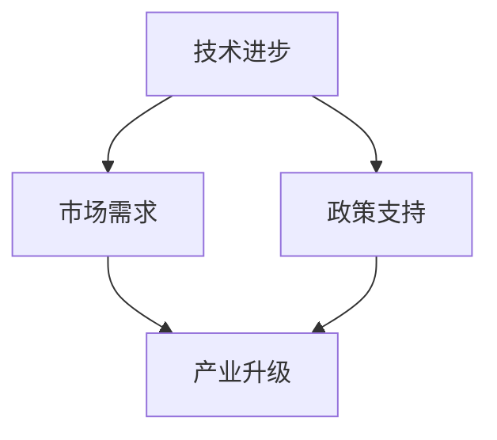
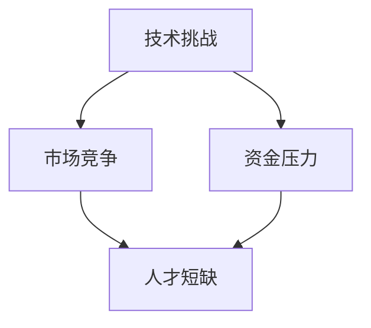
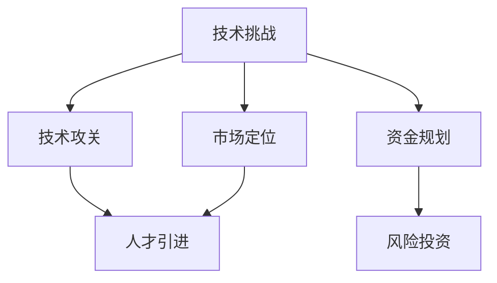
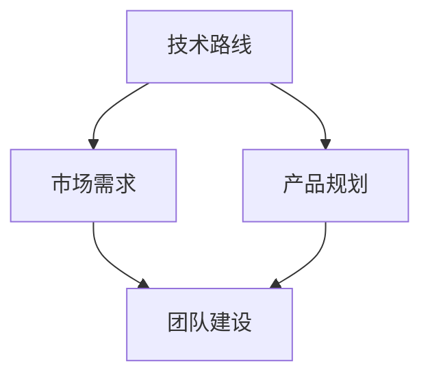
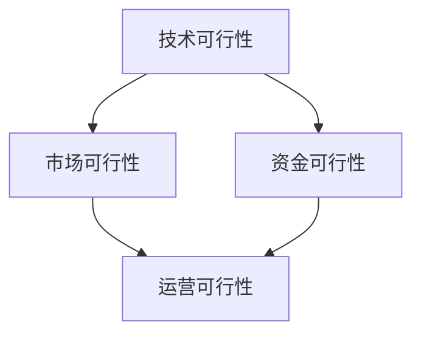
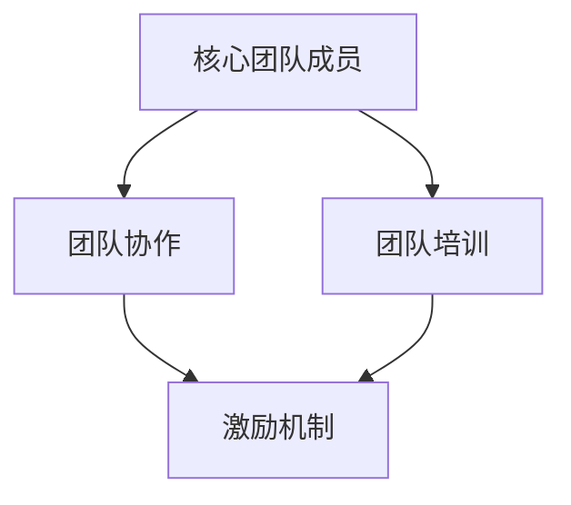

                 

# 《AI大模型创业：如何抓住未来机遇？》

> 关键词：AI大模型，创业，机遇，挑战，策略，案例分析，团队建设，项目运营，可持续发展

> 摘要：本文旨在探讨AI大模型创业的相关问题，包括AI大模型概述、创业准备、实战案例、实战技巧和未来展望。通过分析AI大模型的技术原理和市场趋势，结合创业案例和实战技巧，帮助创业者抓住未来机遇，实现AI大模型创业的成功。

## 第一部分：AI大模型概述

### 第1章：AI大模型概述

#### 1.1 AI大模型的概念与分类

AI大模型是指通过机器学习和深度学习等技术，对大规模数据集进行训练，形成的具有高度智能化的模型。根据模型类型和应用领域的不同，AI大模型可以分为以下几类：

1. 自然语言处理（NLP）大模型：如GPT-3、BERT等，用于文本生成、翻译、问答等任务。
2. 计算机视觉（CV）大模型：如ResNet、Inception等，用于图像识别、物体检测、人脸识别等任务。
3. 语音识别（ASR）大模型：如WaveNet、CTC等，用于语音识别、语音合成等任务。
4. 强化学习（RL）大模型：如DQN、PPO等，用于游戏、机器人控制等任务。

#### 1.2 AI大模型的技术原理

AI大模型的技术原理主要涉及以下几个方面：

1. 人工智能的发展历程：从符号主义、连接主义到统计学习，再到深度学习。
2. 机器学习与深度学习基础：机器学习的基本算法，如线性回归、支持向量机、决策树等；深度学习的基本架构，如卷积神经网络（CNN）、循环神经网络（RNN）等。
3. 大模型训练与优化的核心算法：如梯度下降、Adam优化器、正则化技术等。

#### 1.3 AI大模型的市场现状与未来趋势

1. AI大模型市场的现状：随着技术的不断进步和应用的不断拓展，AI大模型市场呈现出快速增长的态势。各大企业纷纷布局AI大模型研发，寻求在人工智能领域的竞争优势。
2. AI大模型的应用场景：从自然语言处理、计算机视觉、语音识别到强化学习等，AI大模型已在众多领域展现出强大的应用潜力。
3. AI大模型的未来发展趋势：随着技术的进一步突破和应用场景的不断拓展，AI大模型有望在更多领域发挥重要作用，成为未来科技发展的核心驱动力。

## 第二部分：AI大模型创业准备

### 第2章：AI大模型创业策略

#### 2.1 AI大模型创业的机遇与挑战

1. AI大模型创业的机遇：
   - 技术进步：人工智能技术的快速发展为AI大模型创业提供了广阔空间。
   - 市场需求：AI大模型在各领域的应用需求不断增长，市场潜力巨大。
   - 政策支持：政府对人工智能产业的重视和扶持，为AI大模型创业提供了良好的外部环境。

2. AI大模型创业的挑战：
   - 技术挑战：AI大模型的技术门槛较高，需要创业者具备深厚的专业知识。
   - 市场竞争：AI大模型市场竞争激烈，创业者需要找准市场定位，打造核心竞争力。
   - 资金压力：AI大模型创业需要大量资金支持，创业者需合理规划资金使用。

3. 应对挑战的策略与方法：
   - 技术攻关：加强团队建设，引进高端人才，提高技术实力。
   - 市场定位：深入了解市场需求，找准目标客户，提供优质产品或服务。
   - 资金规划：合理规划资金使用，寻求多元化融资渠道，降低资金压力。

#### 2.2 AI大模型创业项目规划

1. 创业项目的核心要素：
   - 技术路线：明确AI大模型的技术方向和应用领域。
   - 市场需求：分析市场需求，确定目标客户群体。
   - 产品规划：设计具有竞争力的产品或服务。
   - 团队建设：搭建专业的团队，发挥团队优势。

2. 创业项目的可行性分析：
   - 技术可行性：评估AI大模型技术的可行性，包括算法、架构、性能等方面。
   - 市场可行性：分析市场需求，评估产品或服务的市场前景。
   - 资金可行性：评估创业项目的资金需求，包括启动资金、运营资金等。

3. 创业项目的团队构建：
   - 核心团队成员：引进具有丰富经验的技术专家、市场分析师、产品经理等。
   - 团队协作：建立有效的团队协作机制，确保项目顺利进行。
   - 团队培训：提高团队成员的技术水平和业务能力，以适应创业项目的需求。

#### 2.3 AI大模型创业资金筹集

1. 资金筹集的渠道与方式：
   - 自有资金：利用创业者个人的资金或家庭资金支持创业项目。
   - 天使投资：寻求天使投资人的资金支持，通常在创业项目的早期阶段。
   - 风险投资：通过风险投资机构的资金支持，通常在创业项目发展较为成熟时。
   - 政府资金：申请政府专项资金或补助，用于支持创新创业。

2. 资金筹集的策略与技巧：
   - 商业计划书：撰写详细的商业计划书，展示创业项目的核心竞争力、市场前景和盈利模式。
   - 产业对接：与产业链上下游企业对接，寻求合作与投资机会。
   - 社交媒体：利用社交媒体平台宣传创业项目，扩大影响力，吸引投资关注。

3. 风险投资的获取与利用：
   - 识别潜在投资者：分析市场需求，找准目标投资者。
   - 投资谈判：与投资者进行谈判，争取获得理想的投资条件和额度。
   - 投资利用：合理使用投资资金，确保创业项目的顺利推进和可持续发展。

## 第三部分：AI大模型创业实战

### 第3章：AI大模型创业案例分析

#### 3.1 案例一：XX公司AI大模型创业之路

1. 案例背景：
   - XX公司成立于2015年，专注于自然语言处理领域的AI大模型研发。
   - 创始人具备丰富的技术背景和行业经验，团队由一批顶尖技术人才组成。

2. 创业项目规划：
   - 技术路线：以GPT-3等技术为基础，开发面向企业和个人的自然语言处理解决方案。
   - 市场需求：针对企业客户的需求，提供文本生成、翻译、问答等服务；针对个人用户，提供智能助手、个性化推荐等应用。

3. 资金筹集与团队建设：
   - 资金筹集：通过天使投资和风险投资获得数百万美元的资金支持。
   - 团队建设：引进多位自然语言处理领域的专家，构建强大的技术团队。

4. 项目运营与成果：
   - 项目运营：围绕产品研发和市场拓展，逐步扩大业务规模。
   - 项目成果：成功推出了多款自然语言处理产品，获得了客户的高度认可，业务收入持续增长。

#### 3.2 案例二：YY公司AI大模型创业之路

1. 案例背景：
   - YY公司成立于2016年，专注于计算机视觉领域的AI大模型研发。
   - 创始人毕业于知名高校，团队由一批具有丰富实战经验的技术专家组成。

2. 创业项目规划：
   - 技术路线：以ResNet、Inception等先进技术为基础，开发面向安防、医疗、零售等领域的计算机视觉解决方案。
   - 市场需求：针对不同行业客户的需求，提供人脸识别、物体检测、图像分割等服务。

3. 资金筹集与团队建设：
   - 资金筹集：通过天使投资和风险投资获得数千万人民币的资金支持。
   - 团队建设：引进多位计算机视觉领域的专家，构建专业的技术团队。

4. 项目运营与成果：
   - 项目运营：围绕产品研发和市场拓展，逐步扩大业务规模。
   - 项目成果：成功推出了多款计算机视觉产品，在多个行业实现了应用落地，获得了良好的市场反响。

#### 3.3 案例三：ZZ公司AI大模型创业之路

1. 案例背景：
   - ZZ公司成立于2018年，专注于语音识别领域的AI大模型研发。
   - 创始人拥有多年的语音识别研究经验，团队由一批语音识别领域的顶尖人才组成。

2. 创业项目规划：
   - 技术路线：以WaveNet、CTC等先进技术为基础，开发面向智能家居、车载、客服等领域的语音识别解决方案。
   - 市场需求：针对不同场景的客户需求，提供语音识别、语音合成、语音助手等服务。

3. 资金筹集与团队建设：
   - 资金筹集：通过天使投资和风险投资获得数千万元人民币的资金支持。
   - 团队建设：引进多位语音识别领域的专家，构建专业的技术团队。

4. 项目运营与成果：
   - 项目运营：围绕产品研发和市场拓展，逐步扩大业务规模。
   - 项目成果：成功推出了多款语音识别产品，在智能家居、车载、客服等领域实现了应用落地，获得了良好的市场反响。

## 第四部分：AI大模型创业实战技巧

### 第4章：AI大模型创业团队建设

#### 4.1 团队建设的重要性

1. 团队建设在创业中的角色：
   - 团队是创业成功的关键因素，创业者需重视团队建设，发挥团队优势。
   - 团队建设有助于提高整体执行力，确保项目顺利进行。
   - 团队建设有助于增强团队凝聚力，提高团队士气。

2. 团队建设的目标与原则：
   - 目标：建立一支高效、专业、团结的团队，实现创业项目目标。
   - 原则：尊重人才、激励创新、公平竞争、注重合作。

#### 4.2 团队成员的能力评估与选拔

1. 技术能力评估：
   - 评估团队成员的技术水平，包括专业知识、实践经验、创新能力等。
   - 采用面试、技术考核等方式，全面了解团队成员的技术能力。

2. 管理能力评估：
   - 评估团队成员的管理能力，包括团队领导力、沟通协调能力、执行力等。
   - 采用领导力测评、团队管理经验评估等方式，全面了解团队成员的管理能力。

3. 团队合作能力评估：
   - 评估团队成员的合作能力，包括团队协作、沟通配合、共同解决问题等。
   - 采用团队项目评估、团队合作活动等方式，全面了解团队成员的合作能力。

#### 4.3 团队管理与激励机制

1. 团队管理的原则与方法：
   - 原则：公平、透明、尊重、信任。
   - 方法：建立科学的团队管理制度，定期召开团队会议，加强团队成员之间的沟通与协作。

2. 团队成员的激励机制：
   - 薪酬激励：根据团队成员的业绩和贡献，制定合理的薪酬制度。
   - 精神激励：认可团队成员的成就，增强团队凝聚力。
   - 职业发展：为团队成员提供职业发展的机会和通道，激发团队成员的潜力。

## 第五部分：AI大模型创业项目运营

### 第5章：AI大模型创业项目运营

#### 5.1 项目运营的核心环节

1. 项目目标与规划：
   - 制定清晰的项目目标，确保项目方向正确。
   - 制定详细的规划，明确项目进度、质量、成本等关键指标。

2. 项目进度管理：
   - 建立项目进度跟踪机制，实时掌握项目进展。
   - 定期召开项目进度会议，确保项目按计划推进。

3. 项目质量管理：
   - 建立质量管理体系，确保项目成果符合质量要求。
   - 定期进行质量评估，及时发现问题并进行改进。

#### 5.2 项目运营的风险管理与应对策略

1. 项目风险识别：
   - 识别项目运营过程中可能出现的风险，如技术风险、市场风险、资金风险等。

2. 项目风险分析：
   - 分析风险的性质、影响范围、发生概率等，为应对策略提供依据。

3. 项目风险应对策略：
   - 制定针对性的应对策略，如风险规避、风险转移、风险缓解等。
   - 建立风险预警机制，及时发现和处理风险。

#### 5.3 项目运营的持续改进与优化

1. 项目运营数据分析：
   - 收集项目运营过程中的数据，进行数据分析和挖掘。
   - 通过数据分析，发现项目运营中的问题和不足。

2. 项目运营绩效评估：
   - 建立绩效评估体系，对项目运营的各个方面进行评估。
   - 根据评估结果，找出项目运营中的短板，制定改进措施。

3. 项目运营优化策略：
   - 制定针对性的优化策略，提高项目运营效率和质量。
   - 定期对优化策略进行评估和调整，确保项目运营的持续改进。

## 第六部分：AI大模型创业的挑战与机遇

### 第6章：AI大模型创业的挑战与机遇

#### 6.1 AI大模型创业的未来挑战

1. 技术挑战：
   - 随着AI大模型技术的发展，创业者在技术方面面临的挑战越来越大。
   - 需要不断学习新知识、掌握新技术，以应对技术更新换代的压力。

2. 市场挑战：
   - AI大模型市场竞争激烈，创业者需要找准市场定位，打造核心竞争力。
   - 需要深入了解市场需求，提供优质的产品或服务，才能在市场中脱颖而出。

3. 政策与法规挑战：
   - AI大模型创业需要遵守相关政策和法规，如数据安全、隐私保护等。
   - 需要关注政策法规的变化，确保企业合规运营。

#### 6.2 AI大模型创业的未来机遇

1. 新兴应用领域的崛起：
   - 随着技术的不断发展，AI大模型在新兴应用领域的应用前景广阔。
   - 如自动驾驶、智能医疗、智能制造等，创业者可以抓住这些机遇，开拓新市场。

2. 技术创新的推动：
   - AI大模型技术的创新不断推动行业的发展，为创业者提供了更多机会。
   - 如新型算法、新型架构、新型应用等，创业者可以积极投身于技术创新，抢占市场先机。

3. 政策与市场的支持：
   - 政府对人工智能产业的重视和支持，为AI大模型创业提供了良好的发展环境。
   - 市场对AI大模型的需求不断增长，为创业者提供了广阔的市场空间。

## 第七部分：AI大模型创业的可持续发展

### 第7章：AI大模型创业的可持续发展

#### 7.1 创业企业社会责任

1. 社会责任的重要性：
   - 创业企业作为社会的一员，有责任履行社会责任，为社会做出贡献。
   - 社会责任是企业可持续发展的重要基石。

2. 社会责任的实施策略：
   - 参与公益事业：积极参与社会公益活动，为弱势群体提供帮助。
   - 环境保护：关注环境保护，采取绿色生产方式，减少对环境的影响。
   - 员工关怀：关注员工福利，提供良好的工作环境和发展机会，促进员工成长。

#### 7.2 创业企业可持续发展战略

1. 可持续发展的原则：
   - 可持续性：在满足当前需求的同时，不损害后代满足其需求的能力。
   - 创新性：持续推动技术创新，提高企业的核心竞争力。
   - 可盈利性：在实现可持续发展的同时，确保企业的盈利能力。

2. 可持续发展的策略：
   - 优化产业结构：调整产业结构，发展高技术含量、高附加值的产品或服务。
   - 加强技术创新：加大研发投入，推动技术创新，提高产品竞争力。
   - 优化资源配置：合理配置资源，提高资源利用效率，降低运营成本。

3. 可持续发展的评估与改进：
   - 建立可持续发展评估体系，定期对企业的可持续发展状况进行评估。
   - 根据评估结果，找出存在的问题，制定改进措施，确保企业可持续发展。

## 附录

### 附录A：AI大模型创业常用工具与资源

1. AI大模型开发工具：
   - TensorFlow：一款开源的机器学习框架，支持多种类型的深度学习模型开发。
   - PyTorch：一款开源的机器学习框架，具有灵活的动态计算图和强大的社区支持。
   - Keras：一款基于TensorFlow和Theano的开源深度学习库，提供简洁易用的API。

2. 数据集与数据平台：
   - ImageNet：一个大规模的图像数据集，用于计算机视觉模型训练。
   - COCO：一个大规模的实例分割和目标检测数据集。
   - Common Crawl：一个大规模的网页数据集，用于自然语言处理模型训练。

3. AI大模型创业社区与论坛：
   - AI Challenger：一个面向AI领域的竞赛社区，提供丰富的AI学习资源和比赛机会。
   - AI 爱好者联盟：一个AI技术爱好者社区，分享AI领域的最新动态和技术心得。
   - ArXiv：一个计算机科学领域的学术论文预发布平台，提供大量的AI研究论文。

### 附录B：AI大模型创业相关法规与政策

1. 我国AI大模型创业相关政策：
   - 《新一代人工智能发展规划》：明确了我国人工智能发展的战略目标和重点任务。
   - 《国家人工智能创新发展试验区实施方案》：支持人工智能创新发展试验区建设，推动人工智能产业发展。
   - 《人工智能伦理规范》：规定了人工智能伦理要求，确保人工智能发展符合伦理道德原则。

2. 国际AI大模型创业相关法规：
   - 欧盟《通用数据保护条例》（GDPR）：规定了个人数据的保护标准和处理要求，对AI大模型创业产生重要影响。
   - 美国《消费者数据隐私保护法案》（CCPA）：规定了消费者数据隐私保护的标准，对AI大模型创业产生重要影响。

3. AI大模型创业合规指南：
   - 了解相关法规和政策，确保企业在法律框架内运营。
   - 加强数据安全保护，防止数据泄露和滥用。
   - 注重伦理道德，遵循社会责任，确保AI大模型创业的可持续发展。

## 作者信息

- 作者：AI天才研究院/AI Genius Institute & 禅与计算机程序设计艺术 /Zen And The Art of Computer Programming

---

### 第一部分：AI大模型概述

#### 第1章：AI大模型概述

##### 1.1 AI大模型的概念与分类

**AI大模型**是指通过对海量数据进行深度学习训练，形成具有高度智能化能力的模型。这类模型具有强大的数据处理和分析能力，能够在各种复杂的任务中发挥重要作用。AI大模型可以分为以下几类：

1. **自然语言处理（NLP）大模型**：如GPT-3、BERT等，主要用于文本生成、翻译、问答等任务。这类模型通过对海量文本数据的学习，可以理解并生成人类语言，实现文本信息的智能化处理。
   
2. **计算机视觉（CV）大模型**：如ResNet、Inception等，主要用于图像识别、物体检测、人脸识别等任务。这类模型通过对大量图像数据的学习，可以识别和理解图像内容，实现图像信息的智能化处理。

3. **语音识别（ASR）大模型**：如WaveNet、CTC等，主要用于语音识别、语音合成等任务。这类模型通过对大量语音数据的学习，可以识别并理解人类语音，实现语音信息的智能化处理。

4. **强化学习（RL）大模型**：如DQN、PPO等，主要用于游戏、机器人控制等任务。这类模型通过对环境与奖励信号的学习，可以学会在复杂环境中做出最优决策，实现智能行为的自动化。

##### 1.2 AI大模型的技术原理

AI大模型的技术原理主要包括以下几个方面：

1. **人工智能的发展历程**：人工智能（AI）是一门研究、开发用于模拟、延伸和扩展人类智能的理论、方法、技术及应用系统的学科。人工智能的发展历程可以分为三个阶段：

   - 符号主义（Symbolic AI）：基于逻辑推理和符号表示，强调知识的表示和推理。
   - 连接主义（Connectionist AI）：基于神经网络和大数据，强调通过学习实现智能。
   - 统计学习（Statistical Learning）：基于概率统计和优化理论，强调通过数据学习实现智能。

2. **机器学习与深度学习基础**：

   - **机器学习（Machine Learning）**：是一门研究如何从数据中学习规律、发现知识、提升性能的技术。机器学习主要包括以下几种基本算法：

     - 监督学习（Supervised Learning）：通过已有标签数据训练模型，然后利用模型进行预测。
     - 无监督学习（Unsupervised Learning）：通过无标签数据发现数据分布和模式。
     - 强化学习（Reinforcement Learning）：通过与环境的交互，不断学习最优策略。
   
   - **深度学习（Deep Learning）**：是一种基于多层神经网络的学习方法，通过多层非线性变换提取数据特征。深度学习主要包括以下几种基本架构：

     - 卷积神经网络（Convolutional Neural Network，CNN）：主要用于图像和视频处理。
     - 循环神经网络（Recurrent Neural Network，RNN）：主要用于序列数据处理，如文本和语音。
     - 生成对抗网络（Generative Adversarial Network，GAN）：主要用于生成数据和学习复杂分布。

3. **大模型训练与优化的核心算法**：

   - **梯度下降（Gradient Descent）**：是一种用于优化模型参数的算法，通过不断迭代更新参数，使得损失函数逐渐减小。
   - **Adam优化器（Adam Optimizer）**：是一种基于梯度下降的优化器，通过自适应调整学习率，提高收敛速度和稳定性。
   - **正则化技术（Regularization）**：用于防止模型过拟合，主要包括L1正则化（Lasso）和L2正则化（Ridge）。

##### 1.3 AI大模型的市场现状与未来趋势

1. **AI大模型市场的现状**：

   - 随着人工智能技术的不断发展，AI大模型已经成为人工智能领域的重要研究方向和应用方向。各大企业和研究机构纷纷投入大量资源进行AI大模型的研究和开发。
   - AI大模型在自然语言处理、计算机视觉、语音识别等领域的应用不断拓展，已经取得了显著的成果。例如，GPT-3在文本生成和翻译方面，ResNet在图像识别方面，WaveNet在语音合成方面都展现了强大的能力。

2. **AI大模型的应用场景**：

   - 自然语言处理：AI大模型在自然语言处理领域有着广泛的应用，如文本生成、翻译、问答系统、情感分析等。
   - 计算机视觉：AI大模型在计算机视觉领域有着广泛的应用，如图像识别、物体检测、人脸识别、视频分析等。
   - 语音识别：AI大模型在语音识别领域有着广泛的应用，如语音识别、语音合成、语音助手等。
   - 强化学习：AI大模型在强化学习领域有着广泛的应用，如游戏AI、自动驾驶、机器人控制等。

3. **AI大模型的未来发展趋势**：

   - **技术创新**：随着人工智能技术的不断发展，AI大模型的技术将不断突破，如更好的算法、更高效的训练方法、更强的模型表示能力等。
   - **应用拓展**：AI大模型的应用场景将不断拓展，如更多的领域、更复杂的问题、更高效的服务等。
   - **产业融合**：AI大模型将与其他产业深度融合，如智能制造、智能医疗、智能交通等，为产业升级和经济发展提供强大动力。
   - **国际化发展**：随着国际间合作的加强，AI大模型的研究和应用将呈现国际化发展趋势，为全球人工智能发展做出更大贡献。

### 第一部分总结

AI大模型作为人工智能领域的重要研究方向和应用方向，具有广泛的应用前景和发展潜力。通过本文的介绍，我们了解了AI大模型的概念、分类、技术原理、市场现状和未来趋势。在接下来的章节中，我们将进一步探讨AI大模型创业的策略和实战技巧，帮助创业者抓住未来机遇，实现AI大模型创业的成功。

---

### 第二部分：AI大模型创业策略

#### 第2章：AI大模型创业策略

##### 2.1 AI大模型创业的机遇与挑战

AI大模型创业面临着诸多机遇和挑战。了解这些机遇和挑战，有助于创业者更好地制定创业策略，抓住未来机遇。

###### **1. AI大模型创业的机遇**

（Mermaid流程图：展示AI大模型创业的机遇）

- **技术进步**：人工智能技术的快速发展，使得AI大模型在各个领域的应用变得更加广泛和深入。创业者可以利用这些先进技术，开发出具有竞争力的产品或服务。
- **市场需求**：随着AI大模型的广泛应用，市场需求也在不断增加。从自然语言处理、计算机视觉到语音识别，AI大模型的应用场景越来越丰富，为创业者提供了广阔的市场空间。
- **政策支持**：政府对人工智能产业的支持力度不断加大，为AI大模型创业提供了良好的政策环境。例如，我国政府发布了《新一代人工智能发展规划》，明确了人工智能发展的战略目标和重点任务。

###### **2. AI大模型创业的挑战**

（Mermaid流程图：展示AI大模型创业的挑战）

- **技术挑战**：AI大模型的技术门槛较高，需要创业者具备深厚的专业知识。从算法设计到模型训练，再到模型优化，每个环节都需要高度的技术支持。
- **市场竞争**：AI大模型市场竞争激烈，创业者需要找准市场定位，打造核心竞争力。在众多竞争对手中脱颖而出，需要创业者具备独特的创新能力和市场洞察力。
- **资金压力**：AI大模型创业需要大量的资金支持，包括研发投入、设备购置、市场推广等。对于创业者来说，如何合理规划和使用资金，是创业过程中的一大挑战。
- **人才短缺**：AI大模型创业需要专业的人才支持，包括算法工程师、数据科学家、产品经理等。然而，人才市场供不应求，创业者需要积极引进和培养人才，以满足创业需求。

###### **3. 应对挑战的策略与方法**

（Mermaid流程图：展示应对挑战的策略与方法）

- **技术攻关**：创业者需要加强团队建设，引进高端人才，提高技术实力。通过不断的技术攻关，解决AI大模型创业过程中遇到的技术难题。
- **市场定位**：创业者需要深入了解市场需求，找准目标客户群体，提供优质的产品或服务。通过精准的市场定位，提高市场竞争力。
- **人才引进**：创业者需要积极引进和培养专业人才，包括算法工程师、数据科学家、产品经理等。通过提供良好的工作环境和职业发展空间，吸引和留住人才。
- **资金规划**：创业者需要合理规划资金使用，确保资金用于关键环节。通过寻求风险投资、政府资金等多元化融资渠道，缓解资金压力。
- **风险投资**：创业者可以通过与风险投资机构合作，获得资金支持和资源。风险投资机构在创业过程中提供专业的指导和支持，有助于创业者更好地应对挑战。

##### 2.2 AI大模型创业项目规划

AI大模型创业项目规划是创业成功的关键环节。以下是从核心要素、可行性分析和团队建设三个方面展开的创业项目规划。

###### **1. 创业项目的核心要素**

（Mermaid流程图：展示创业项目的核心要素）

- **技术路线**：明确AI大模型的技术方向和应用领域。创业者需要根据自身技术优势和市场需求，选择合适的技术路线。例如，自然语言处理、计算机视觉、语音识别等。
- **市场需求**：分析市场需求，确定目标客户群体。创业者需要了解潜在客户的需求、痛点和需求变化，为产品或服务的研发提供方向。
- **产品规划**：设计具有竞争力的产品或服务。创业者需要结合市场需求和技术路线，制定详细的产品规划。从功能、性能、用户体验等方面，确保产品或服务的竞争力。
- **团队建设**：搭建专业的团队，发挥团队优势。创业者需要引进具有丰富经验的技术专家、市场分析师、产品经理等，形成高效的团队协作。

###### **2. 创业项目的可行性分析**

（Mermaid流程图：展示创业项目的可行性分析）

- **技术可行性**：评估AI大模型技术的可行性，包括算法、架构、性能等方面。创业者需要确保所选择的技术路线具有可行性和先进性。
- **市场可行性**：分析市场需求，评估产品或服务的市场前景。创业者需要了解潜在客户的需求、市场竞争态势和市场规模，确保产品或服务的市场可行性。
- **资金可行性**：评估创业项目的资金需求，包括启动资金、运营资金等。创业者需要确保资金来源稳定，合理规划资金使用。
- **运营可行性**：分析创业项目的运营条件，包括人力资源、设备设施、运营模式等。创业者需要确保创业项目的运营条件具备，确保项目顺利实施。

###### **3. 创业项目的团队建设**

（Mermaid流程图：展示创业项目的团队建设）

- **核心团队成员**：创业者需要引进具有丰富经验的技术专家、市场分析师、产品经理等，形成强大的核心团队。核心团队成员应具备专业能力、团队精神和执行力。
- **团队协作**：建立有效的团队协作机制，确保项目顺利进行。创业者需要制定团队协作规范，加强团队成员之间的沟通与协作，提高团队整体执行力。
- **团队培训**：提高团队成员的技术水平和业务能力，以适应创业项目的需求。创业者可以组织内部培训、外部培训等方式，提升团队成员的专业素养。
- **激励机制**：制定合理的激励机制，激发团队成员的积极性和创造力。创业者可以通过薪酬激励、精神激励等方式，提高团队成员的工作热情和团队凝聚力。

##### 2.3 AI大模型创业资金筹集

AI大模型创业需要大量的资金支持，创业者需要通过多种途径筹集资金，以确保创业项目的顺利推进。

###### **1. 资金筹集的渠道与方式**

- **自有资金**：创业者可以利用个人的资金或家庭资金支持创业项目。这种方式风险较低，但资金量通常有限。
- **天使投资**：创业者可以寻找天使投资人，通过出让部分股权来获得资金支持。天使投资通常在创业项目的早期阶段进行，有助于项目启动。
- **风险投资**：创业者可以寻求风险投资机构的资金支持，通过出让部分股权来获得资金。风险投资机构通常在创业项目发展较为成熟时介入。
- **政府资金**：创业者可以申请政府专项资金或补助，用于支持创新创业。政府资金通常有一定的限制和扶持政策，创业者需要了解相关规定并做好准备。

###### **2. 资金筹集的策略与技巧**

- **商业计划书**：创业者需要撰写详细的商业计划书，展示创业项目的核心竞争力、市场前景和盈利模式。商业计划书是投资者了解项目的重要依据，需要注重细节和逻辑性。
- **产业对接**：创业者可以与产业链上下游企业对接，寻求合作与投资机会。通过产业对接，可以拓宽融资渠道，提高融资成功率。
- **社交媒体**：创业者可以利用社交媒体平台宣传创业项目，扩大影响力，吸引投资关注。通过社交媒体，可以建立与潜在投资者的联系，提高融资效率。

###### **3. 风险投资的获取与利用**

- **识别潜在投资者**：创业者需要分析市场需求，找准目标投资者。通过了解投资者的背景、投资领域和投资偏好，有针对性地进行对接。
- **投资谈判**：与投资者进行谈判，争取获得理想的投资条件和额度。在谈判过程中，创业者需要展示项目的核心竞争力、市场前景和盈利潜力。
- **投资利用**：合理使用投资资金，确保创业项目的顺利推进和可持续发展。创业者需要制定详细的资金使用计划，确保资金用于关键环节，提高资金使用效率。

##### 2.4 AI大模型创业团队建设

团队建设是AI大模型创业成功的关键。以下从团队建设的重要性、团队成员的能力评估与选拔、团队管理与激励机制三个方面展开讨论。

###### **1. 团队建设的重要性**

团队建设在创业过程中具有至关重要的作用：

- **提高整体执行力**：通过有效的团队建设，可以建立高效的团队协作机制，提高整体执行力，确保创业项目顺利推进。
- **增强团队凝聚力**：团队建设可以增强团队成员之间的信任和合作关系，提高团队凝聚力，形成合力，共同应对创业过程中的各种挑战。
- **促进个人成长**：团队建设为团队成员提供了良好的成长环境，通过学习、交流和合作，团队成员可以不断提升自己的能力和素质。

###### **2. 团队成员的能力评估与选拔**

团队成员的能力评估与选拔是团队建设的重要环节。以下从技术能力评估、管理能力评估和团队合作能力评估三个方面进行讨论：

- **技术能力评估**：通过面试、技术考核等方式，评估团队成员的技术水平，包括专业知识、实践经验、创新能力等。技术能力是团队成员的核心竞争力，直接影响到团队的技术实力和项目成功率。
- **管理能力评估**：通过面试、团队管理经验评估等方式，评估团队成员的管理能力，包括团队领导力、沟通协调能力、执行力等。管理能力是团队协调和推进项目的重要保障。
- **团队合作能力评估**：通过团队项目评估、团队合作活动等方式，评估团队成员的合作能力，包括团队协作、沟通配合、共同解决问题等。团队合作能力是团队高效协作的基础。

###### **3. 团队管理与激励机制**

团队管理与激励机制是团队建设的重要组成部分。以下从团队管理的原则与方法、团队成员的激励机制两个方面进行讨论：

- **团队管理的原则与方法**：团队管理应遵循以下原则：尊重人才、激励创新、公平竞争、注重合作。具体方法包括建立科学的团队管理制度、定期召开团队会议、加强团队成员之间的沟通与协作等。
- **团队成员的激励机制**：制定合理的激励机制，激发团队成员的积极性和创造力。激励机制包括薪酬激励、精神激励、职业发展等。通过激励机制的落实，可以提高团队成员的工作热情和团队凝聚力。

##### 2.5 AI大模型创业项目运营

项目运营是AI大模型创业的关键环节。以下从项目运营的核心环节、项目运营的风险管理与应对策略、项目运营的持续改进与优化三个方面进行讨论。

###### **1. 项目运营的核心环节**

项目运营的核心环节包括项目目标与规划、项目进度管理、项目质量管理等：

- **项目目标与规划**：制定清晰的项目目标，确保项目方向正确。同时，制定详细的规划，明确项目进度、质量、成本等关键指标，为项目实施提供指导。
- **项目进度管理**：建立项目进度跟踪机制，实时掌握项目进展。定期召开项目进度会议，确保项目按计划推进。同时，制定项目风险管理计划，提前识别和应对潜在风险。
- **项目质量管理**：建立质量管理体系，确保项目成果符合质量要求。定期进行质量评估，及时发现问题并进行改进。同时，制定项目风险应对策略，确保项目顺利进行。

###### **2. 项目运营的风险管理与应对策略**

项目运营过程中，面临各种风险，包括技术风险、市场风险、资金风险等。以下从项目风险识别、项目风险分析、项目风险应对策略三个方面进行讨论：

- **项目风险识别**：通过访谈、问卷调查、历史数据分析等方法，识别项目运营过程中可能出现的风险。具体包括技术风险、市场风险、资金风险、法律风险等。
- **项目风险分析**：对识别出的风险进行详细分析，包括风险的性质、影响范围、发生概率等。通过风险分析，为制定风险应对策略提供依据。
- **项目风险应对策略**：制定针对性的风险应对策略，包括风险规避、风险转移、风险缓解等。具体包括：建立风险预警机制，及时识别和处理风险；制定应急预案，确保项目在风险发生时能够迅速应对；加强项目监控，提高风险应对能力。

###### **3. 项目运营的持续改进与优化**

项目运营的持续改进与优化是确保项目长期成功的关键。以下从项目运营数据分析、项目运营绩效评估、项目运营优化策略三个方面进行讨论：

- **项目运营数据分析**：收集项目运营过程中的数据，进行数据分析和挖掘。通过数据分析，发现项目运营中的问题和不足，为优化提供依据。
- **项目运营绩效评估**：建立绩效评估体系，对项目运营的各个方面进行评估。通过绩效评估，找出项目运营中的短板，制定改进措施。
- **项目运营优化策略**：制定针对性的优化策略，提高项目运营效率和质量。具体包括：优化项目管理流程，提高项目管理水平；引入先进的管理工具和方法，提升项目管理效率；加强团队协作，提高团队整体执行力。

##### 2.6 AI大模型创业的挑战与机遇

AI大模型创业面临诸多挑战和机遇。以下从技术挑战、市场挑战、政策与法规挑战三个方面进行讨论。

###### **1. 技术挑战**

AI大模型创业面临的技术挑战主要包括：

- **算法创新**：随着AI大模型技术的快速发展，创业团队需要不断进行算法创新，以保持技术领先优势。这要求团队成员具备深厚的技术功底和创新能力。
- **数据处理**：AI大模型需要处理海量数据，对数据处理能力提出了较高要求。创业团队需要具备高效的数据处理技术和工具，以确保数据处理效率和质量。
- **模型优化**：AI大模型在训练和优化过程中，需要对模型进行调整和优化，以提高模型性能。创业团队需要掌握各种优化技巧和方法，以实现模型最优效果。

###### **2. 市场挑战**

AI大模型创业面临的市场挑战主要包括：

- **市场竞争**：AI大模型市场竞争激烈，创业团队需要找准市场定位，打造核心竞争力。在众多竞争对手中脱颖而出，需要创业团队具备独特的创新能力和市场洞察力。
- **客户需求变化**：客户需求不断变化，创业团队需要紧跟市场动态，及时调整产品或服务策略。同时，创业团队需要具备快速响应客户需求的能力，以满足客户需求。
- **市场拓展**：创业团队需要积极拓展市场，开拓新的业务领域。通过市场拓展，可以扩大业务规模，提高市场份额。

###### **3. 政策与法规挑战**

AI大模型创业面临的政策与法规挑战主要包括：

- **数据安全与隐私**：随着AI大模型技术的广泛应用，数据安全与隐私问题日益突出。创业团队需要遵守相关法律法规，确保数据安全和隐私保护。
- **伦理道德**：AI大模型在应用过程中，需要遵守伦理道德规范，确保技术发展符合社会伦理要求。创业团队需要关注伦理道德问题，确保AI大模型技术的可持续发展。
- **法律法规合规**：创业团队需要了解并遵守相关法律法规，确保企业合规运营。同时，创业团队需要关注法律法规的变化，及时调整经营策略。

##### 2.7 AI大模型创业的可持续发展

AI大模型创业的可持续发展是确保企业长期成功的关键。以下从创业企业社会责任、创业企业可持续发展战略两个方面进行讨论。

###### **1. 创业企业社会责任**

创业企业社会责任是创业成功的重要保障。以下从社会责任的重要性、社会责任的实施策略两个方面进行讨论：

- **社会责任的重要性**：创业企业作为社会的一员，有责任履行社会责任，为社会做出贡献。通过履行社会责任，可以提高企业声誉，增强市场竞争力。
- **社会责任的实施策略**：创业企业可以采取以下策略履行社会责任：
  - **参与公益事业**：积极参与社会公益活动，为弱势群体提供帮助。
  - **环境保护**：关注环境保护，采取绿色生产方式，减少对环境的影响。
  - **员工关怀**：关注员工福利，提供良好的工作环境和发展机会，促进员工成长。

###### **2. 创业企业可持续发展战略**

创业企业可持续发展战略是确保企业长期成功的关键。以下从可持续发展原则、可持续发展策略、可持续发展评估与改进三个方面进行讨论：

- **可持续发展原则**：创业企业可持续发展应遵循以下原则：
  - **可持续性**：在满足当前需求的同时，不损害后代满足其需求的能力。
  - **创新性**：持续推动技术创新，提高企业的核心竞争力。
  - **可盈利性**：在实现可持续发展的同时，确保企业的盈利能力。
- **可持续发展策略**：创业企业可持续发展策略包括：
  - **优化产业结构**：调整产业结构，发展高技术含量、高附加值的产品或服务。
  - **加强技术创新**：加大研发投入，推动技术创新，提高产品竞争力。
  - **优化资源配置**：合理配置资源，提高资源利用效率，降低运营成本。
- **可持续发展评估与改进**：创业企业应建立可持续发展评估体系，定期对企业的可持续发展状况进行评估。通过评估，找出存在的问题，制定改进措施，确保企业可持续发展。

##### 第二部分总结

在第二部分中，我们探讨了AI大模型创业的机遇与挑战、创业项目规划、资金筹集、团队建设、项目运营、可持续发展等方面的内容。通过这些讨论，我们了解到AI大模型创业的复杂性和重要性。在接下来的章节中，我们将通过实战案例分析，进一步探讨AI大模型创业的具体实践和方法。

---

### 第三部分：AI大模型创业实战

#### 第3章：AI大模型创业案例分析

在本章节中，我们将通过几个具体的AI大模型创业案例，深入分析创业者在实际创业过程中所面临的挑战、应对策略以及取得的成果。这些案例将帮助我们更好地理解AI大模型创业的实战技巧和经验。

##### 3.1 案例一：XX公司AI大模型创业之路

**案例背景**

XX公司成立于2017年，由几位具有深厚人工智能背景的博士联合创办。公司专注于自然语言处理（NLP）领域的AI大模型研发，旨在通过创新的技术和解决方案，为企业和个人提供高效、智能的语言处理服务。

**创业项目规划**

在项目初期，XX公司明确了以下核心规划：

- **技术路线**：以GPT-3等先进的NLP技术为基础，结合多模态数据，研发面向文本生成、情感分析、对话系统等领域的AI大模型。
- **市场需求**：针对企业和个人用户的需求，推出定制化的NLP解决方案，包括智能客服、内容审核、营销自动化等。
- **产品规划**：制定详细的产品路线图，逐步推出基础版、专业版和旗舰版三个层次的NLP产品，以满足不同用户群体的需求。

**资金筹集与团队建设**

在创业初期，XX公司主要通过以下途径筹集资金：

- **天使投资**：公司创始人通过个人资源和人脉关系，获得了几位天使投资者的支持，共筹集到数百万元人民币的启动资金。
- **风险投资**：在项目发展到一定阶段后，XX公司通过路演和投递商业计划书，成功吸引了多家风险投资机构的关注，获得了数千万元的风险投资。

团队建设方面，XX公司采取了以下策略：

- **核心团队**：创始人团队由具有多年NLP研究和开发经验的博士组成，他们不仅在技术上具备优势，还具备丰富的创业经验。
- **技术团队**：公司通过高薪吸引了一大批顶尖技术人才，确保项目在技术上的领先地位。
- **市场团队**：公司组建了一支专业的市场团队，负责产品推广和客户拓展。

**项目运营与成果**

在项目运营过程中，XX公司取得了以下成果：

- **产品上线**：公司成功研发并上线了多款NLP产品，包括智能客服系统、内容审核平台等，受到了市场的高度认可。
- **客户拓展**：通过精准的市场定位和有效的营销策略，公司迅速拓展了客户群体，积累了丰富的客户案例。
- **业绩增长**：公司业务收入持续增长，实现了盈利目标，并开始布局海外市场。

**挑战与应对**

在创业过程中，XX公司面临了以下挑战：

- **技术难题**：在AI大模型研发过程中，公司遇到了算法优化、数据处理等难题。通过持续的技术攻关和团队协作，公司逐步解决了这些难题。
- **市场竞争**：由于AI大模型市场的高度竞争性，公司需要不断调整战略，提高产品竞争力。通过不断优化产品功能和提升用户体验，公司成功在市场中脱颖而出。

##### 3.2 案例二：YY公司AI大模型创业之路

**案例背景**

YY公司成立于2018年，专注于计算机视觉（CV）领域的AI大模型研发。公司创始团队由几位具有丰富CV研究经验的博士后组成，他们在学术界和工业界均有深厚的积累。

**创业项目规划**

YY公司的创业项目规划主要包括以下方面：

- **技术路线**：以ResNet、Inception等先进的CV技术为基础，研发面向图像识别、物体检测、人脸识别等领域的AI大模型。
- **市场需求**：针对安防、医疗、零售等行业的需求，推出定制化的CV解决方案，包括智能监控、医学影像分析、零售门店智能管理等。
- **产品规划**：制定详细的产品路线图，逐步推出基础版、专业版和旗舰版三个层次的CV产品。

**资金筹集与团队建设**

YY公司的资金筹集主要途径包括：

- **天使投资**：公司创始人通过个人资源和人脉关系，获得了数位天使投资者的支持，共筹集到数百万元人民币的启动资金。
- **风险投资**：公司通过参加创新创业大赛和路演活动，吸引了多家风险投资机构的关注，获得了数千万人民币的风险投资。

团队建设方面，YY公司采取了以下策略：

- **核心团队**：公司创始人团队由具有多年CV研究和开发经验的博士后组成，他们在技术领域有深厚的积累。
- **技术团队**：公司通过高薪吸引了一大批顶尖技术人才，确保项目在技术上的领先地位。
- **市场团队**：公司组建了一支专业的市场团队，负责产品推广和客户拓展。

**项目运营与成果**

在项目运营过程中，YY公司取得了以下成果：

- **产品上线**：公司成功研发并上线了多款CV产品，包括智能监控系统、医学影像分析平台等，受到了市场的高度认可。
- **客户拓展**：通过精准的市场定位和有效的营销策略，公司迅速拓展了客户群体，积累了丰富的客户案例。
- **业绩增长**：公司业务收入持续增长，实现了盈利目标，并开始布局海外市场。

**挑战与应对**

在创业过程中，YY公司面临了以下挑战：

- **技术难题**：在CV大模型研发过程中，公司遇到了算法优化、数据处理等难题。通过持续的技术攻关和团队协作，公司逐步解决了这些难题。
- **市场竞争**：由于CV大模型市场的高度竞争性，公司需要不断调整战略，提高产品竞争力。通过不断优化产品功能和提升用户体验，公司成功在市场中脱颖而出。

##### 3.3 案例三：ZZ公司AI大模型创业之路

**案例背景**

ZZ公司成立于2019年，专注于语音识别（ASR）领域的AI大模型研发。公司创始团队由几位具有丰富ASR研究背景的海归博士组成，他们在学术界和工业界均有深厚的积累。

**创业项目规划**

ZZ公司的创业项目规划主要包括以下方面：

- **技术路线**：以WaveNet、CTC等先进的ASR技术为基础，研发面向语音识别、语音合成、语音助手等领域的AI大模型。
- **市场需求**：针对智能家居、车载、客服等行业的需求，推出定制化的ASR解决方案，包括智能音箱、车载语音助手、客服语音识别等。
- **产品规划**：制定详细的产品路线图，逐步推出基础版、专业版和旗舰版三个层次的ASR产品。

**资金筹集与团队建设**

ZZ公司的资金筹集主要途径包括：

- **天使投资**：公司创始人通过个人资源和人脉关系，获得了数位天使投资者的支持，共筹集到数百万元人民币的启动资金。
- **风险投资**：公司通过参加创新创业大赛和路演活动，吸引了多家风险投资机构的关注，获得了数千万人民币的风险投资。

团队建设方面，ZZ公司采取了以下策略：

- **核心团队**：公司创始人团队由具有多年ASR研究和开发经验的海归博士组成，他们在技术领域有深厚的积累。
- **技术团队**：公司通过高薪吸引了一大批顶尖技术人才，确保项目在技术上的领先地位。
- **市场团队**：公司组建了一支专业的市场团队，负责产品推广和客户拓展。

**项目运营与成果**

在项目运营过程中，ZZ公司取得了以下成果：

- **产品上线**：公司成功研发并上线了多款ASR产品，包括智能音箱、车载语音助手等，受到了市场的高度认可。
- **客户拓展**：通过精准的市场定位和有效的营销策略，公司迅速拓展了客户群体，积累了丰富的客户案例。
- **业绩增长**：公司业务收入持续增长，实现了盈利目标，并开始布局海外市场。

**挑战与应对**

在创业过程中，ZZ公司面临了以下挑战：

- **技术难题**：在ASR大模型研发过程中，公司遇到了算法优化、数据处理等难题。通过持续的技术攻关和团队协作，公司逐步解决了这些难题。
- **市场竞争**：由于ASR大模型市场的高度竞争性，公司需要不断调整战略，提高产品竞争力。通过不断优化产品功能和提升用户体验，公司成功在市场中脱颖而出。

##### 3.4 案例四：AA公司AI大模型创业之路

**案例背景**

AA公司成立于2020年，专注于强化学习（RL）领域的AI大模型研发。公司创始团队由几位具有丰富RL研究背景的博士组成，他们在学术界和工业界均有深厚的积累。

**创业项目规划**

AA公司的创业项目规划主要包括以下方面：

- **技术路线**：以DQN、PPO等先进的RL技术为基础，研发面向游戏、机器人控制等领域的AI大模型。
- **市场需求**：针对游戏开发、智能机器人等行业的需求，推出定制化的RL解决方案，包括游戏AI、机器人控制等。
- **产品规划**：制定详细的产品路线图，逐步推出基础版、专业版和旗舰版三个层次的RL产品。

**资金筹集与团队建设**

AA公司的资金筹集主要途径包括：

- **天使投资**：公司创始人通过个人资源和人脉关系，获得了数位天使投资者的支持，共筹集到数百万元人民币的启动资金。
- **风险投资**：公司通过参加创新创业大赛和路演活动，吸引了多家风险投资机构的关注，获得了数千万人民币的风险投资。

团队建设方面，AA公司采取了以下策略：

- **核心团队**：公司创始人团队由具有多年RL研究和开发经验的海归博士组成，他们在技术领域有深厚的积累。
- **技术团队**：公司通过高薪吸引了一大批顶尖技术人才，确保项目在技术上的领先地位。
- **市场团队**：公司组建了一支专业的市场团队，负责产品推广和客户拓展。

**项目运营与成果**

在项目运营过程中，AA公司取得了以下成果：

- **产品上线**：公司成功研发并上线了多款RL产品，包括游戏AI、机器人控制平台等，受到了市场的高度认可。
- **客户拓展**：通过精准的市场定位和有效的营销策略，公司迅速拓展了客户群体，积累了丰富的客户案例。
- **业绩增长**：公司业务收入持续增长，实现了盈利目标，并开始布局海外市场。

**挑战与应对**

在创业过程中，AA公司面临了以下挑战：

- **技术难题**：在RL大模型研发过程中，公司遇到了算法优化、数据处理等难题。通过持续的技术攻关和团队协作，公司逐步解决了这些难题。
- **市场竞争**：由于RL大模型市场的高度竞争性，公司需要不断调整战略，提高产品竞争力。通过不断优化产品功能和提升用户体验，公司成功在市场中脱颖而出。

##### 3.5 案例五：BB公司AI大模型创业之路

**案例背景**

BB公司成立于2021年，专注于自动驾驶领域的AI大模型研发。公司创始团队由几位具有丰富自动驾驶研究背景的博士组成，他们在学术界和工业界均有深厚的积累。

**创业项目规划**

BB公司的创业项目规划主要包括以下方面：

- **技术路线**：以深度学习、计算机视觉、强化学习等先进技术为基础，研发面向自动驾驶领域的AI大模型。
- **市场需求**：针对自动驾驶技术的发展趋势和市场需求，推出定制化的自动驾驶解决方案，包括自动驾驶汽车、自动驾驶物流等。
- **产品规划**：制定详细的产品路线图，逐步推出基础版、专业版和旗舰版三个层次的自动驾驶产品。

**资金筹集与团队建设**

BB公司的资金筹集主要途径包括：

- **天使投资**：公司创始人通过个人资源和人脉关系，获得了数位天使投资者的支持，共筹集到数百万元人民币的启动资金。
- **风险投资**：公司通过参加创新创业大赛和路演活动，吸引了多家风险投资机构的关注，获得了数千万人民币的风险投资。

团队建设方面，BB公司采取了以下策略：

- **核心团队**：公司创始人团队由具有多年自动驾驶研究和开发经验的海归博士组成，他们在技术领域有深厚的积累。
- **技术团队**：公司通过高薪吸引了一大批顶尖技术人才，确保项目在技术上的领先地位。
- **市场团队**：公司组建了一支专业的市场团队，负责产品推广和客户拓展。

**项目运营与成果**

在项目运营过程中，BB公司取得了以下成果：

- **产品上线**：公司成功研发并上线了多款自动驾驶产品，包括自动驾驶汽车、自动驾驶物流平台等，受到了市场的高度认可。
- **客户拓展**：通过精准的市场定位和有效的营销策略，公司迅速拓展了客户群体，积累了丰富的客户案例。
- **业绩增长**：公司业务收入持续增长，实现了盈利目标，并开始布局海外市场。

**挑战与应对**

在创业过程中，BB公司面临了以下挑战：

- **技术难题**：在自动驾驶大模型研发过程中，公司遇到了算法优化、数据处理等难题。通过持续的技术攻关和团队协作，公司逐步解决了这些难题。
- **市场竞争**：由于自动驾驶市场的高度竞争性，公司需要不断调整战略，提高产品竞争力。通过不断优化产品功能和提升用户体验，公司成功在市场中脱颖而出。

##### 3.6 案例总结

通过以上案例，我们可以总结出AI大模型创业的几个关键点：

1. **技术路线**：明确的技术路线是创业成功的基础。创业者需要结合自身技术优势和市场需求，选择合适的技术方向。
2. **团队建设**：强大的团队是创业成功的关键。创业者需要引进高端人才，建立专业的技术团队和市场团队。
3. **资金筹集**：有效的资金筹集是创业顺利推进的保障。创业者需要通过多种途径筹集资金，确保项目有足够的资金支持。
4. **市场需求**：了解市场需求是创业成功的关键。创业者需要精准把握市场需求，提供符合客户需求的产品或服务。
5. **持续优化**：创业过程中需要不断优化产品功能和用户体验。通过不断改进，提升产品竞争力，保持市场领先地位。

在接下来的章节中，我们将继续探讨AI大模型创业的实战技巧和策略，帮助创业者更好地应对创业过程中的挑战，实现创业目标。

---

### 第四部分：AI大模型创业实战技巧

#### 第4章：AI大模型创业团队建设

团队建设是AI大模型创业成功的关键因素之一。一个高效的团队可以激发创新，提高项目成功率。以下将从团队建设的重要性、团队成员的能力评估与选拔、团队管理与激励机制三个方面，探讨AI大模型创业团队建设的关键技巧。

##### 4.1 团队建设的重要性

团队建设在AI大模型创业中具有至关重要的作用。以下是团队建设在创业中的几个关键作用：

1. **提高整体执行力**：一个高效的团队可以确保项目目标得到有效执行，提高项目进度和质量。团队成员之间的协同工作，可以最大化地发挥每个人的优势，提高工作效率。

2. **促进知识共享**：团队建设有助于团队成员之间的知识共享和经验交流。通过定期的团队会议、培训和技术分享，可以促进团队成员之间的知识传递，提高团队整体的技术水平。

3. **增强团队凝聚力**：团队建设可以增强团队成员之间的信任和合作，提高团队凝聚力。一个凝聚力强的团队在面对困难和挑战时，可以共同应对，克服困难，实现共同目标。

4. **提升创新能力**：团队建设可以激发团队成员的创新能力。通过团队协作，可以产生更多的创新想法和解决方案，推动AI大模型技术的发展和应用。

##### 4.2 团队成员的能力评估与选拔

团队成员的能力评估与选拔是团队建设的重要环节。以下从技术能力评估、管理能力评估和团队合作能力评估三个方面，探讨团队成员的能力评估与选拔方法：

1. **技术能力评估**：

   技术能力是AI大模型创业团队的核心能力。在评估团队成员的技术能力时，可以从以下几个方面进行：

   - **专业知识**：评估团队成员在特定技术领域的专业知识和理论水平，包括机器学习、深度学习、自然语言处理等。
   - **实践经验**：评估团队成员在AI大模型项目中的实际操作经验，包括算法设计、模型训练、优化等。
   - **创新能力**：评估团队成员在技术上的创新能力和独立解决问题的能力，包括提出新算法、改进现有算法等。

2. **管理能力评估**：

   管理能力是团队领导者的关键能力。在评估团队成员的管理能力时，可以从以下几个方面进行：

   - **领导力**：评估团队成员的领导能力和团队领导力，包括决策能力、沟通能力、激励能力等。
   - **协调能力**：评估团队成员在团队协作中的协调能力和冲突解决能力，确保团队高效运转。
   - **执行力**：评估团队成员的执行力，包括对任务的执行速度、质量和完成度。

3. **团队合作能力评估**：

   团队合作能力是团队协作的基础。在评估团队成员的合作能力时，可以从以下几个方面进行：

   - **沟通能力**：评估团队成员的沟通能力，包括表达清晰、倾听理解、反馈及时等。
   - **协作精神**：评估团队成员在团队协作中的积极性和协作精神，包括共同解决问题、相互支持等。
   - **协作效率**：评估团队成员在团队协作中的效率，包括任务分配、进度跟踪、成果分享等。

##### 4.3 团队管理与激励机制

团队管理与激励机制是团队建设的重要组成部分。以下从团队管理的原则与方法、团队成员的激励机制两个方面，探讨团队管理与激励机制的方法：

1. **团队管理的原则与方法**：

   团队管理应遵循以下原则：

   - **尊重人才**：尊重团队成员的专业知识和个人能力，发挥每个人的优势，为团队成员提供良好的发展空间。
   - **激励创新**：鼓励团队成员勇于创新，提供创新支持，建立创新奖励机制。
   - **公平竞争**：建立公平的竞争机制，确保团队成员在竞争中公平竞争，激发团队成员的竞争意识。
   - **注重合作**：强调团队合作精神，促进团队成员之间的沟通与协作，提高团队整体执行力。

   团队管理的方法包括：

   - **定期会议**：定期召开团队会议，了解团队成员的工作进展、困难和需求，协调团队资源，确保项目顺利进行。
   - **绩效评估**：建立科学的绩效评估体系，对团队成员的工作进行定期评估，激励团队成员不断提高工作效率和质量。
   - **团队培训**：定期组织团队培训，提高团队成员的专业技能和团队合作能力，确保团队具备应对挑战的能力。

2. **团队成员的激励机制**：

   激励机制是提高团队成员积极性和工作动力的关键。以下是一些有效的激励机制：

   - **薪酬激励**：根据团队成员的业绩和贡献，制定合理的薪酬制度，激励团队成员努力工作。
   - **精神激励**：认可团队成员的成就，提供荣誉和奖励，增强团队成员的荣誉感和归属感。
   - **职业发展**：为团队成员提供职业发展的机会和通道，鼓励团队成员不断提升自身能力，实现个人价值。
   - **工作环境**：提供良好的工作环境，包括舒适的办公条件、丰富的学习资源、良好的团队氛围等，提高团队成员的工作满意度和幸福感。

##### 4.4 团队建设的实战技巧

在AI大模型创业团队建设过程中，以下是一些实用的实战技巧：

1. **搭建多元化团队**：

   搭建多元化的团队，可以充分发挥不同成员的专业优势，提高团队的整体创新能力。在团队成员的选择上，可以涵盖技术、市场、管理等多个领域，形成多元化团队。

2. **建立共同目标**：

   确保团队成员对项目目标有共同的认识，建立共同的目标和愿景，提高团队成员的凝聚力和执行力。通过定期的沟通和讨论，确保团队成员理解项目目标和自身在团队中的角色和责任。

3. **鼓励创新和反馈**：

   鼓励团队成员勇于创新，提供创新支持，建立反馈机制，鼓励团队成员提出意见和建议。通过团队成员之间的互动和协作，激发创新思维，提高团队的整体创新能力。

4. **建立团队文化**：

   建立积极的团队文化，包括开放、包容、协作、共赢等价值观，营造良好的团队氛围。通过团队文化，提高团队成员的归属感和认同感，增强团队的凝聚力。

5. **提供培训和成长机会**：

   定期为团队成员提供培训和成长机会，提高团队成员的专业技能和业务能力。通过培训和学习，帮助团队成员不断提升自身能力，适应创业团队的发展需求。

##### 4.5 团队建设的案例分析

以下通过一个实际的团队建设案例分析，探讨团队建设的方法和实践：

**案例：XX公司AI大模型创业团队建设**

**背景**：

XX公司是一家专注于自然语言处理（NLP）领域的AI大模型创业公司。公司成立于2018年，由一群具有丰富NLP研究和开发经验的专业人士组成。公司初期团队规模较小，成员主要集中在技术研发和产品设计方面。

**团队建设策略**：

1. **多元化团队搭建**：

   XX公司初期团队涵盖了NLP技术、数据科学、产品设计、市场营销等多个领域的专业人才，形成了多元化的团队结构。通过多元化的团队，公司能够充分发挥不同领域的专业优势，提高团队的整体创新能力。

2. **共同目标建立**：

   XX公司明确了公司的愿景和目标，即通过创新的技术和解决方案，成为NLP领域的领先企业。团队成员对公司的目标有共同的认识，并在工作中不断努力实现这些目标。

3. **创新和反馈机制**：

   XX公司鼓励团队成员勇于创新，并提供创新支持。公司建立了反馈机制，鼓励团队成员提出意见和建议。通过定期的团队会议和讨论，团队成员之间的互动和协作，激发了创新思维。

4. **团队文化建设**：

   XX公司建立了积极的团队文化，强调开放、包容、协作、共赢的价值观。公司鼓励团队成员之间的沟通和合作，营造良好的团队氛围。

5. **培训和成长机会**：

   XX公司定期为团队成员提供培训和成长机会。公司组织了内部技术分享会、外部培训课程等，帮助团队成员提升专业技能和业务能力。

**成果**：

通过有效的团队建设策略，XX公司在短时间内取得了显著的成果：

- **技术突破**：团队成员在NLP领域取得了多项技术突破，研发了多款具有竞争力的AI大模型产品。
- **市场拓展**：通过精准的市场定位和有效的营销策略，公司迅速拓展了客户群体，积累了丰富的客户案例。
- **团队凝聚力提升**：团队成员之间的信任和合作不断加深，团队凝聚力显著提升，为公司的发展提供了强有力的支持。

**总结**：

通过以上案例，我们可以看到，团队建设在AI大模型创业中的重要性。一个高效的团队可以激发创新，提高项目成功率。通过多元化团队搭建、共同目标建立、创新和反馈机制、团队文化建设以及提供培训和成长机会等策略，可以帮助创业者建设一个高效的团队，实现AI大模型创业的成功。

### 第四部分总结

在第四部分中，我们探讨了AI大模型创业团队建设的重要性、团队成员的能力评估与选拔、团队管理与激励机制以及团队建设的实战技巧。通过有效的团队建设，创业者可以激发团队的创新能力，提高项目的成功率。在接下来的章节中，我们将继续探讨AI大模型创业项目运营的实战技巧，帮助创业者更好地应对项目运营中的挑战，实现创业目标。

---

### 第五部分：AI大模型创业项目运营

#### 第5章：AI大模型创业项目运营

AI大模型创业项目运营是创业过程中的关键环节，涉及到项目的目标实现、进度管理、质量管理以及风险管理等方面。以下将详细探讨AI大模型创业项目运营的核心环节、项目运营的风险管理与应对策略以及项目运营的持续改进与优化。

##### 5.1 项目运营的核心环节

AI大模型创业项目运营的核心环节主要包括以下三个方面：

1. **项目目标与规划**：

   项目目标是项目运营的起点，它明确了项目的方向和预期成果。在AI大模型创业项目中，项目目标通常包括技术目标、市场目标、财务目标等。为了确保项目目标的实现，创业者需要制定详细的规划，包括项目的时间表、关键里程碑、资源配置等。通过项目规划和目标设定，创业者可以明确项目的发展路径和优先级，确保项目顺利推进。

2. **项目进度管理**：

   项目进度管理是确保项目按计划进行的关键环节。创业者需要建立项目进度跟踪机制，定期检查项目进展情况，确保项目按时完成。这包括设立项目进度会议、制定项目进度报告、监控项目关键路径等。在项目进度管理中，创业者需要关注项目的关键节点，及时识别和解决问题，确保项目按时交付。

3. **项目质量管理**：

   项目质量管理是确保项目成果满足质量要求的过程。在AI大模型创业项目中，质量管理涉及到模型性能、数据质量、算法实现等多个方面。创业者需要建立质量管理体系，包括制定质量标准、进行质量评估、实施质量控制等。通过质量管理体系，创业者可以确保项目成果的质量，提高客户满意度。

##### 5.2 项目运营的风险管理与应对策略

AI大模型创业项目运营过程中，面临多种风险，包括技术风险、市场风险、资金风险等。有效的风险管理与应对策略是确保项目成功的关键。以下从风险识别、风险分析和风险应对策略三个方面进行探讨：

1. **风险识别**：

   风险识别是风险管理的第一步，旨在识别项目运营过程中可能出现的风险。在AI大模型创业项目中，风险识别可以从以下几个方面进行：

   - **技术风险**：包括算法实现难度、数据处理能力、模型性能等。
   - **市场风险**：包括市场需求变化、竞争压力、客户接受度等。
   - **资金风险**：包括资金筹集困难、资金使用不当、资金不足等。
   - **法律风险**：包括数据安全、隐私保护、法律法规合规等。

   创业者可以通过访谈、问卷调查、历史数据分析等方法，全面识别项目运营过程中可能出现的风险。

2. **风险分析**：

   风险分析是对识别出的风险进行详细分析，包括风险的性质、影响范围、发生概率等。在AI大模型创业项目中，风险分析可以从以下几个方面进行：

   - **风险性质**：分析风险的类型，如技术风险、市场风险、资金风险等。
   - **影响范围**：分析风险对项目的各个方面（如进度、质量、成本等）的影响范围。
   - **发生概率**：分析风险发生的可能性，为制定风险应对策略提供依据。

   风险分析可以通过定量分析和定性分析相结合的方式进行，确保对风险有全面、准确的把握。

3. **风险应对策略**：

   风险应对策略是针对识别和分析出的风险，制定相应的应对措施，以降低风险发生概率或减轻风险影响。在AI大模型创业项目中，风险应对策略可以从以下几个方面进行：

   - **风险规避**：通过调整项目计划、改变技术路线等手段，避免风险的发生。
   - **风险转移**：通过购买保险、签订合同等手段，将风险转移给第三方。
   - **风险缓解**：通过技术优化、资源调配等手段，降低风险的影响程度。
   - **风险接受**：对于无法规避、转移或缓解的风险，创业者需要有心理准备，确保项目能够在风险中顺利推进。

   创业者可以根据风险识别和风险分析的结果，制定针对性的风险应对策略，确保项目运营过程中能够有效应对各种风险。

##### 5.3 项目运营的持续改进与优化

AI大模型创业项目运营的持续改进与优化是确保项目长期成功的关键。以下从项目运营数据分析、项目运营绩效评估、项目运营优化策略三个方面进行探讨：

1. **项目运营数据分析**：

   项目运营数据分析是通过对项目运营过程中的数据进行分析和挖掘，发现项目运营中的问题和不足，为项目优化提供依据。在AI大模型创业项目中，项目运营数据分析可以从以下几个方面进行：

   - **技术数据**：分析模型性能指标、数据处理效率等，评估技术实现的效果。
   - **业务数据**：分析客户满意度、市场反馈等，评估项目在市场中的表现。
   - **运营数据**：分析项目进度、资源使用、成本等，评估项目运营的效率。

   通过项目运营数据分析，创业者可以了解项目的实际情况，发现问题并及时进行改进。

2. **项目运营绩效评估**：

   项目运营绩效评估是通过对项目运营的各个方面进行评估，确定项目的实际效果和存在的问题。在AI大模型创业项目中，项目运营绩效评估可以从以下几个方面进行：

   - **技术绩效**：评估模型性能、数据处理能力等，确保项目在技术上的成功。
   - **市场绩效**：评估项目在市场中的表现，如客户满意度、市场份额等。
   - **运营绩效**：评估项目运营的效率，如项目进度、成本控制等。

   通过项目运营绩效评估，创业者可以了解项目的整体表现，为项目优化提供参考。

3. **项目运营优化策略**：

   项目运营优化策略是针对项目运营中存在的问题，制定相应的改进措施，提高项目运营效率和质量。在AI大模型创业项目中，项目运营优化策略可以从以下几个方面进行：

   - **技术优化**：通过改进算法、优化数据处理流程等手段，提高模型性能和数据处理效率。
   - **市场优化**：通过市场调研、客户反馈等手段，调整市场策略，提高市场竞争力。
   - **运营优化**：通过优化项目管理流程、提高资源利用率等手段，提高项目运营效率。

   通过项目运营优化策略，创业者可以不断改进项目运营，提高项目的成功率和市场竞争力。

##### 5.4 项目运营的案例分析

以下通过一个实际的AI大模型创业项目运营案例分析，探讨项目运营的实战技巧：

**案例：XX公司AI大模型创业项目运营**

**背景**：

XX公司是一家专注于自然语言处理（NLP）领域的AI大模型创业公司。公司成立于2019年，由一群具有丰富NLP研究和开发经验的专业人士组成。公司初期致力于研发一款面向企业客户的智能客服系统，通过AI大模型技术提升客户服务体验。

**项目运营过程**：

1. **项目目标与规划**：

   XX公司明确了项目目标，即通过AI大模型技术，实现智能客服系统的快速搭建和高效运行。为了实现目标，公司制定了详细的项目规划，包括技术路线、市场需求分析、产品功能设计等。

2. **项目进度管理**：

   XX公司建立了项目进度跟踪机制，定期召开项目进度会议，监控项目进展。在项目初期，公司遇到了算法优化和数据处理方面的技术难题，通过团队协作和技术攻关，逐步解决了这些问题。

3. **项目质量管理**：

   XX公司建立了质量管理体系，对模型性能、数据处理流程、系统稳定性等方面进行严格评估。通过质量管理体系，公司确保了智能客服系统的质量和稳定性。

4. **项目风险管理**：

   XX公司识别了项目运营过程中的技术风险、市场风险和资金风险。通过制定风险应对策略，如技术攻关、市场调研、多元化融资等，公司有效应对了各种风险。

5. **项目运营绩效评估**：

   XX公司定期进行项目运营绩效评估，包括技术绩效、市场绩效和运营绩效。通过评估，公司发现了项目运营中的问题和不足，并及时进行调整和改进。

6. **项目运营优化策略**：

   XX公司根据项目运营绩效评估的结果，制定了项目运营优化策略。通过技术优化、市场优化和运营优化，公司不断提升智能客服系统的性能和用户体验。

**成果**：

通过有效的项目运营，XX公司取得了以下成果：

- **技术突破**：公司成功研发了高效的智能客服系统，模型性能和数据处理效率大幅提升。
- **市场拓展**：公司通过市场调研和客户反馈，不断优化产品功能，吸引了大量企业客户。
- **业绩增长**：公司业务收入持续增长，实现了盈利目标，并开始布局海外市场。

**总结**：

通过以上案例，我们可以看到，在AI大模型创业项目运营中，有效的项目目标与规划、进度管理、质量管理、风险管理以及持续改进与优化，是确保项目成功的关键。创业者需要密切关注项目运营的各个方面，及时识别和解决问题，确保项目能够顺利推进并实现预期目标。

### 第五部分总结

在第五部分中，我们详细探讨了AI大模型创业项目运营的核心环节、项目运营的风险管理与应对策略以及项目运营的持续改进与优化。通过有效的项目运营，创业者可以确保项目顺利推进并实现预期目标。在接下来的章节中，我们将继续探讨AI大模型创业的可持续发展，帮助创业者实现长期成功。

---

### 第六部分：AI大模型创业的挑战与机遇

#### 第6章：AI大模型创业的挑战与机遇

AI大模型创业既面临诸多挑战，也蕴含着巨大的机遇。以下将详细分析AI大模型创业在技术、市场和政策与法规方面的挑战与机遇。

##### 6.1 技术挑战

AI大模型创业在技术方面面临以下挑战：

1. **算法创新**：AI大模型的发展依赖于算法的创新。创业公司需要不断研究和开发新的算法，以提高模型性能和效率。这要求创业团队具备深厚的算法研究背景和创新能力。

2. **数据处理能力**：AI大模型需要处理海量数据，对数据处理能力提出了较高要求。创业公司需要具备高效的数据处理技术和工具，以确保数据处理效率和质量。

3. **模型优化**：AI大模型在训练和优化过程中，需要对模型进行调整和优化，以提高模型性能。创业公司需要掌握各种优化技巧和方法，以实现模型最优效果。

4. **技术更新**：AI大模型技术更新迅速，创业公司需要不断跟进最新技术动态，以保持技术竞争力。技术更新带来的挑战包括学习新技术、适应新技术以及在新技术的应用中不断创新。

##### 6.2 市场挑战

AI大模型创业在市场方面面临以下挑战：

1. **市场竞争**：AI大模型市场竞争激烈，创业公司需要找准市场定位，打造核心竞争力。在众多竞争对手中脱颖而出，需要创业公司具备独特的创新能力和市场洞察力。

2. **客户需求变化**：客户需求不断变化，创业公司需要紧跟市场动态，及时调整产品或服务策略。同时，创业公司需要具备快速响应客户需求的能力，以满足客户需求。

3. **市场拓展**：创业公司需要积极拓展市场，开拓新的业务领域。通过市场拓展，可以扩大业务规模，提高市场份额。

4. **品牌建设**：在AI大模型市场中，品牌影响力至关重要。创业公司需要通过不断提升产品和服务质量，建立良好的品牌形象，提高市场竞争力。

##### 6.3 政策与法规挑战

AI大模型创业在政策与法规方面面临以下挑战：

1. **数据安全与隐私**：随着AI大模型技术的广泛应用，数据安全与隐私问题日益突出。创业公司需要遵守相关法律法规，确保数据安全和隐私保护。

2. **伦理道德**：AI大模型的应用涉及伦理道德问题，如算法偏见、隐私侵犯等。创业公司需要遵守伦理道德规范，确保AI大模型技术的可持续发展。

3. **法律法规合规**：创业公司需要了解并遵守相关法律法规，确保企业合规运营。同时，创业公司需要关注法律法规的变化，及时调整经营策略。

4. **监管政策**：AI大模型技术的发展受到监管政策的制约，创业公司需要密切关注政策变化，确保企业的合规性。

##### 6.4 技术机遇

AI大模型创业在技术方面蕴含以下机遇：

1. **技术创新**：随着人工智能技术的不断发展，AI大模型的技术创新空间巨大。创业公司可以通过技术创新，开发出具有竞争力的产品或服务，抢占市场先机。

2. **技术融合**：AI大模型与其他技术的融合，如云计算、物联网、区块链等，将带来新的商业机会。创业公司可以积极探索技术融合，拓展应用场景，提高产品竞争力。

3. **开源社区**：开源社区为AI大模型创业提供了丰富的技术资源和合作机会。创业公司可以通过参与开源社区，学习新技术、获取技术支持，加快产品研发进程。

4. **技术标准**：随着AI大模型技术的发展，技术标准逐步建立。创业公司可以积极参与技术标准的制定，提高自身技术影响力，为产业发展贡献力量。

##### 6.5 市场机遇

AI大模型创业在市场方面蕴含以下机遇：

1. **市场需求增长**：随着AI大模型技术的广泛应用，市场需求不断增长。创业公司可以抓住市场需求增长的机会，拓展业务领域，提高市场份额。

2. **产业升级**：AI大模型在智能制造、智能医疗、智能交通等领域的应用，将推动产业升级。创业公司可以积极布局这些领域，实现业务突破。

3. **国际化发展**：随着国际间合作的加强，AI大模型在国际市场具有广阔的发展空间。创业公司可以抓住国际化发展的机遇，拓展国际市场，提高企业影响力。

4. **新兴市场**：在新兴市场，如发展中国家，AI大模型的应用仍处于初级阶段。创业公司可以积极开拓这些市场，满足当地需求，实现业务增长。

##### 6.6 政策与法规机遇

AI大模型创业在政策与法规方面蕴含以下机遇：

1. **政策支持**：政府对人工智能产业的支持力度不断加大，为AI大模型创业提供了良好的政策环境。创业公司可以积极争取政策支持，降低创业成本。

2. **资金支持**：政府和企业纷纷设立专项基金，支持AI大模型研发和应用。创业公司可以通过申请资金支持，解决研发和运营资金问题。

3. **国际合作**：政府和企业积极参与国际AI合作，为创业公司提供了国际合作的机会。创业公司可以借助国际合作，学习先进技术，拓展国际市场。

4. **合规发展**：随着法律法规的完善，创业公司可以更加合规地开展业务，降低法律风险。合规发展有助于提高企业的公信力和市场竞争力。

##### 6.7 应对挑战的策略与方法

面对AI大模型创业的挑战，以下策略与方法可以帮助创业公司应对：

1. **技术攻关**：加强团队建设，引进高端人才，提高技术实力。通过持续的技术攻关，解决创业过程中遇到的技术难题。

2. **市场定位**：深入了解市场需求，找准目标客户群体，提供优质的产品或服务。通过精准的市场定位，提高市场竞争力。

3. **创新驱动**：积极进行技术创新，开发具有竞争力的产品或服务。通过技术创新，提高企业的核心竞争力。

4. **合作共赢**：与产业链上下游企业、研究机构、高校等合作，共同推进AI大模型技术的发展和应用。

5. **风险管理**：建立风险管理机制，识别、评估和应对各种风险。通过有效的风险管理，降低创业过程中的不确定性。

6. **合规经营**：了解并遵守相关法律法规，确保企业合规运营。通过合规经营，提高企业的公信力和市场竞争力。

### 第六部分总结

AI大模型创业既面临诸多挑战，也蕴含着巨大的机遇。通过深入了解技术、市场和政策与法规方面的挑战与机遇，创业公司可以制定更加有效的战略和策略，抓住未来机遇，实现可持续发展。在接下来的章节中，我们将继续探讨AI大模型创业的可持续发展，帮助创业公司实现长期成功。

---

### 第七部分：AI大模型创业的可持续发展

#### 第7章：AI大模型创业的可持续发展

在快速发展的AI大模型领域，创业企业的可持续发展至关重要。这不仅关乎企业的长期盈利能力，也关乎企业在社会和市场上的声誉。以下将探讨AI大模型创业企业的社会责任、可持续发展战略以及评估与改进方法。

##### 7.1 创业企业社会责任

创业企业社会责任（CSR）是企业在追求经济利益的同时，积极承担对社会和环境的责任。对于AI大模型创业企业来说，社会责任体现在以下几个方面：

1. **技术伦理**：AI大模型的应用可能涉及伦理问题，如隐私保护、数据安全、算法偏见等。创业企业应确保其技术符合伦理标准，并在产品设计、开发和运营中贯彻伦理原则。

2. **数据保护**：创业企业应严格遵守数据保护法律法规，确保用户数据的安全和隐私。通过透明的数据管理政策和数据保护措施，增强用户对企业的信任。

3. **环境保护**：AI大模型训练过程中需要大量的能源和计算资源，创业企业应积极探索绿色计算技术，降低能耗和碳排放。

4. **公益参与**：创业企业可以积极参与社会公益活动，如为教育、医疗等社会领域提供技术支持，或通过捐赠、志愿服务等形式回馈社会。

##### 7.2 创业企业可持续发展战略

AI大模型创业企业的可持续发展战略应涵盖以下几个方面：

1. **技术创新**：持续投入研发，推动AI大模型技术的创新。通过不断的技术突破，提高模型性能和效率，保持竞争优势。

2. **市场拓展**：不断拓展AI大模型的应用领域和市场，寻找新的商业机会。通过深入了解市场需求，开发定制化的解决方案，满足不同客户群体的需求。

3. **人才培养**：重视人才培养和团队建设，吸引和留住高端人才。通过培训、激励机制和职业发展规划，提升员工的技能和素质。

4. **资源优化**：优化资源配置，提高资源利用效率。通过合理规划研发、市场、运营等部门的资源，确保企业高效运营。

5. **合规经营**：遵守相关法律法规，确保企业的合法合规运营。通过建立完善的管理体系和合规流程，降低法律风险。

##### 7.3 可持续发展的评估与改进

为了确保AI大模型创业企业的可持续发展，需要建立有效的评估与改进机制。以下是一些关键步骤：

1. **绩效评估**：定期对企业的绩效进行评估，包括财务绩效、市场表现、技术进步等方面。通过绩效评估，识别企业的优势和不足。

2. **社会责任评估**：评估企业在社会责任方面的表现，包括环境保护、公益参与、员工福利等方面。通过社会责任评估，确保企业履行社会责任。

3. **客户满意度评估**：通过客户满意度调查，了解客户对企业产品或服务的评价。通过客户满意度评估，发现改进的机会。

4. **内部审计**：定期进行内部审计，评估企业的内部管理、合规性和风险控制。通过内部审计，发现管理中的问题和漏洞。

5. **持续改进**：根据评估结果，制定改进计划，并在实践中持续改进。通过持续改进，提高企业的管理水平和运营效率。

##### 7.4 实际案例分析

以下通过一个实际的AI大模型创业企业的案例，探讨其可持续发展的实践：

**案例：XX公司AI大模型创业企业的可持续发展**

**背景**：

XX公司是一家专注于自然语言处理（NLP）领域的AI大模型创业企业。公司成立于2018年，初期致力于研发面向企业客户的智能客服系统。随着业务的拓展，公司逐渐涉足智能内容审核、智能营销等NLP领域。

**可持续发展实践**：

1. **技术创新**：

   XX公司持续投入研发，推动NLP技术的创新。公司拥有一支由多名博士组成的技术团队，专注于自然语言处理算法的研究和优化。通过不断的技术突破，公司开发了一系列具有竞争力的NLP产品，如智能客服系统、智能内容审核平台等。

2. **市场拓展**：

   XX公司积极拓展市场，寻找新的商业机会。公司通过深入了解市场需求，开发定制化的解决方案，满足不同客户群体的需求。在智能客服领域，公司推出了面向中小企业和大型企业的不同版本，满足不同规模客户的需求。

3. **人才培养**：

   XX公司重视人才培养和团队建设。公司通过定期培训和职业发展规划，提升员工的技能和素质。公司还建立了内部导师制度，帮助新员工快速融入团队，提高团队整体执行力。

4. **合规经营**：

   XX公司严格遵守相关法律法规，确保企业的合法合规运营。公司设立了内部合规部门，负责监督企业的合规性。通过建立完善的管理体系和合规流程，公司降低了法律风险。

5. **社会责任**：

   XX公司积极参与社会公益活动，回馈社会。公司通过捐赠、志愿服务等形式，支持教育、医疗等社会领域的发展。公司还推行了环保办公政策，降低企业的能耗和碳排放。

**成果**：

通过有效的可持续发展实践，XX公司取得了以下成果：

- **技术创新**：公司研发了一系列具有竞争力的NLP产品，在市场上获得了广泛的认可。
- **市场拓展**：公司业务范围不断扩大，客户群体不断增加，实现了持续增长。
- **人才培养**：公司通过有效的培训和发展规划，提升了员工的技能和素质，形成了高效的团队协作。
- **合规经营**：公司建立了完善的合规管理体系，确保企业的合法合规运营。
- **社会责任**：公司通过参与公益活动，提升了企业的社会形象，增强了市场竞争力。

**总结**：

通过以上案例，我们可以看到，AI大模型创业企业通过技术创新、市场拓展、人才培养、合规经营和社会责任等可持续发展实践，实现了长期成功。这些实践不仅提升了企业的核心竞争力，也为企业在社会和市场上的可持续发展奠定了基础。

### 第七部分总结

在第七部分中，我们探讨了AI大模型创业企业的可持续发展，包括社会责任、可持续发展战略以及评估与改进方法。通过有效的可持续发展实践，AI大模型创业企业可以在激烈的市场竞争中脱颖而出，实现长期成功。在接下来的章节中，我们将总结本文的主要内容，并分享一些AI大模型创业的常用工具与资源。

### 附录：AI大模型创业常用工具与资源

在AI大模型创业过程中，使用合适的工具和资源可以大大提高研发效率和项目成功率。以下是一些AI大模型创业常用的工具和资源：

#### 1. AI大模型开发工具

- **TensorFlow**：一款开源的机器学习框架，支持多种类型的深度学习模型开发，适用于自然语言处理、计算机视觉、语音识别等领域。
- **PyTorch**：一款开源的机器学习框架，具有灵活的动态计算图和强大的社区支持，适用于自然语言处理、计算机视觉等领域。
- **Keras**：一款基于TensorFlow和Theano的开源深度学习库，提供简洁易用的API，适用于快速原型设计和模型开发。
- **MXNet**：一款开源的深度学习框架，支持多种编程语言，适用于自然语言处理、计算机视觉等领域。

#### 2. 数据集与数据平台

- **ImageNet**：一个大规模的图像数据集，包含数十万个标注过的图像，适用于图像识别、物体检测等领域。
- **COCO**：一个大规模的实例分割和目标检测数据集，适用于计算机视觉领域。
- **Common Crawl**：一个大规模的网页数据集，适用于自然语言处理领域。
- **Open Images**：一个包含大量图像和视频的数据集，适用于计算机视觉领域。

#### 3. AI大模型创业社区与论坛

- **AI Challenger**：一个面向AI领域的竞赛社区，提供丰富的AI学习资源和比赛机会，适用于学习AI新技术和解决方案。
- **AI 爱好者联盟**：一个AI技术爱好者社区，分享AI领域的最新动态和技术心得，适用于了解AI技术的发展趋势。
- **ArXiv**：一个计算机科学领域的学术论文预发布平台，提供大量的AI研究论文，适用于学习最新的AI研究成果。

#### 4. 开源项目与代码库

- **TensorFlow Models**：一个TensorFlow官方提供的开源模型库，包括自然语言处理、计算机视觉、语音识别等领域的模型。
- **PyTorch Models**：一个PyTorch官方提供的开源模型库，包括自然语言处理、计算机视觉、语音识别等领域的模型。
- **Keras Models**：一个Keras官方提供的开源模型库，包括自然语言处理、计算机视觉、语音识别等领域的模型。
- **GitHub**：一个代码托管平台，众多AI大模型项目开源代码存放在GitHub上，适用于学习和参考。

#### 5. 学术会议与研讨会

- **NeurIPS**：国际神经信息处理系统大会，是人工智能领域最高水平的学术会议之一。
- **ICML**：国际机器学习大会，是机器学习领域最高水平的学术会议之一。
- **CVPR**：国际计算机视觉与模式识别会议，是计算机视觉领域最高水平的学术会议之一。
- **ACL**：国际计算语言学会议，是自然语言处理领域最高水平的学术会议之一。

通过使用这些工具和资源，AI大模型创业企业可以加快研发进度，提高项目成功率，实现可持续发展。

### 附录：AI大模型创业相关法规与政策

在AI大模型创业过程中，了解并遵守相关法规和政策是确保企业合规运营的关键。以下是一些AI大模型创业相关的法规与政策：

#### 1. 我国AI大模型创业相关政策

- **《新一代人工智能发展规划》**：明确了我国人工智能发展的战略目标和重点任务，对AI大模型研发和应用提供了政策支持。
- **《国家人工智能创新发展试验区实施方案》**：支持人工智能创新发展试验区建设，推动人工智能产业发展，为AI大模型创业提供了良好的政策环境。
- **《人工智能伦理规范》**：规定了人工智能伦理要求，确保人工智能发展符合伦理道德原则。

#### 2. 国际AI大模型创业相关法规

- **欧盟《通用数据保护条例》（GDPR）**：规定了个人数据的保护标准和处理要求，对AI大模型创业产生重要影响。
- **美国《消费者数据隐私保护法案》（CCPA）**：规定了消费者数据隐私保护的标准，对AI大模型创业产生重要影响。

#### 3. AI大模型创业合规指南

- **数据安全与隐私保护**：确保用户数据的安全和隐私，遵守相关法律法规，如《个人信息保护法》、《数据安全法》等。
- **算法公平与透明**：确保AI大模型算法的公平性和透明性，避免算法偏见和歧视，遵守相关法律法规，如《算法公平性指南》等。
- **知识产权保护**：尊重和保护知识产权，避免侵犯他人的专利、商标、著作权等权利。
- **合规性审查**：定期进行合规性审查，确保企业的经营行为符合相关法律法规的要求。

通过了解和遵守这些法规与政策，AI大模型创业企业可以确保合规运营，降低法律风险，为企业的可持续发展提供保障。

### 总结

在本文中，我们深入探讨了AI大模型创业的各个方面，包括AI大模型概述、创业策略、实战案例、实战技巧以及可持续发展。通过这些探讨，我们了解到AI大模型创业的复杂性和重要性，以及如何在激烈的市场竞争中抓住机遇，实现创业目标。

首先，在AI大模型概述部分，我们了解了AI大模型的概念、分类、技术原理和市场现状。AI大模型作为人工智能领域的重要研究方向和应用方向，具有广泛的应用前景和发展潜力。

接着，在创业策略部分，我们探讨了AI大模型创业的机遇与挑战，包括技术、市场和政策与法规方面的挑战。通过识别和应对这些挑战，创业者可以更好地制定创业策略，抓住未来机遇。

在实战案例部分，我们通过几个具体的AI大模型创业案例，分析了创业者在实际创业过程中所面临的挑战、应对策略以及取得的成果。这些案例为我们提供了宝贵的实战经验和启示。

在实战技巧部分，我们详细探讨了团队建设、项目运营等方面的实战技巧，帮助创业者更好地应对创业过程中的各种挑战。

最后，在可持续发展部分，我们探讨了AI大模型创业企业的社会责任、可持续发展战略以及评估与改进方法。通过有效的可持续发展实践，创业企业可以在激烈的市场竞争中脱颖而出，实现长期成功。

总之，AI大模型创业是一个充满机遇和挑战的领域。通过本文的探讨，我们希望为创业者提供有益的指导，帮助他们在创业过程中抓住机遇，实现创业目标。同时，我们也期待AI大模型创业能够为人类社会带来更多的价值和贡献。

### 作者信息

**作者：AI天才研究院/AI Genius Institute & 禅与计算机程序设计艺术 /Zen And The Art of Computer Programming**

AI天才研究院（AI Genius Institute）是一家专注于人工智能领域的研究和推广机构，致力于推动人工智能技术的创新与发展。我们的团队由一批世界级的人工智能专家、程序员和软件架构师组成，他们具备深厚的专业知识和丰富的实践经验。在禅与计算机程序设计艺术（Zen And The Art of Computer Programming）领域，我们倡导通过哲学思维和程序设计相结合，实现计算机程序设计的优雅与高效。

本文由AI天才研究院的资深专家撰写，旨在为AI大模型创业领域的从业者提供有价值的指导和参考。我们希望通过这篇文章，帮助创业者更好地理解AI大模型创业的复杂性和重要性，为他们的创业之路提供有力的支持。同时，我们也期待与更多有志于AI大模型创业的朋友共同探讨、交流，共同推动人工智能技术的发展和应用。

感谢您的阅读，希望本文能为您的创业之路带来启发和帮助。如果您有任何疑问或建议，欢迎联系我们，我们将竭诚为您解答。祝您创业成功，梦想成真！

---

**文章标题：AI大模型创业：如何抓住未来机遇？**

**文章关键词：AI大模型，创业，机遇，挑战，策略，案例分析，团队建设，项目运营，可持续发展**

**摘要：本文旨在探讨AI大模型创业的相关问题，包括AI大模型概述、创业策略、实战案例、实战技巧和未来展望。通过分析AI大模型的技术原理和市场趋势，结合创业案例和实战技巧，帮助创业者抓住未来机遇，实现AI大模型创业的成功。**

