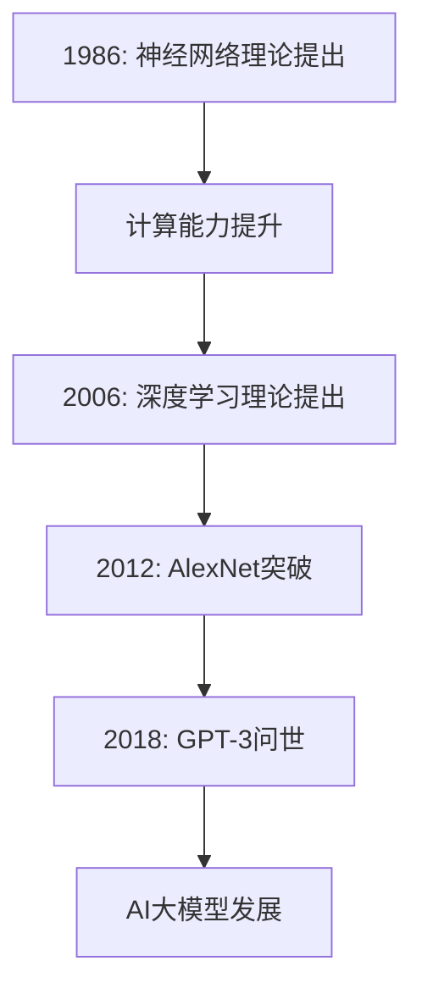
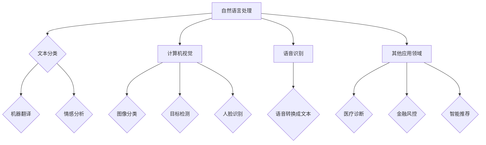
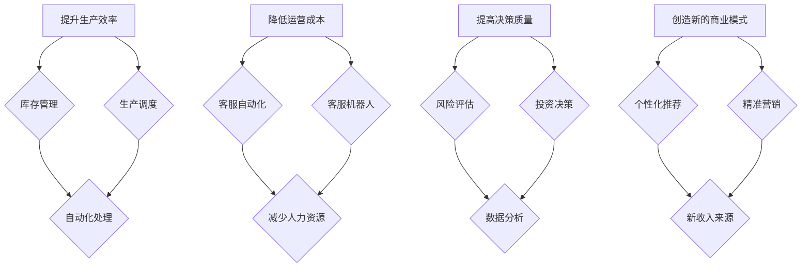

                 

### 文章标题

《AI大模型创业：如何构建未来可持续的商业模式？》

### 关键词

- AI大模型
- 创业
- 商业模式
- 可持续发展
- 技术创新

### 摘要

本文旨在探讨AI大模型创业中的商业模式构建，分析市场趋势、创业机会与挑战，提出可持续发展的策略。通过详述AI大模型的基础知识、创业策略、商业模式设计、团队建设、法律法规与伦理等方面，本文为AI大模型创业提供了系统的指导和建议。

### 目录大纲

以下是《AI大模型创业：如何构建未来可持续的商业模式？》这本书的完整目录大纲：

## 第一部分：AI大模型概述与市场趋势

### 第1章：AI大模型的基础知识

#### 1.1 AI大模型的概念与发展历程

- **AI大模型的基本概念**
- **AI大模型的发展历程**
- **AI大模型的主要类型**

#### 1.2 AI大模型的应用领域

- **自然语言处理**
- **计算机视觉**
- **语音识别**
- **其他应用领域**

#### 1.3 AI大模型的商业价值

- **提升生产效率**
- **降低运营成本**
- **提高决策质量**
- **创造新的商业模式**

### 第2章：AI大模型的市场趋势

#### 2.1 全球AI大模型市场分析

- **市场规模与增长趋势**
- **市场竞争格局**
- **行业政策与监管环境**

#### 2.2 中国AI大模型市场现状

- **市场规模与增长趋势**
- **市场竞争格局**
- **行业政策与监管环境**

#### 2.3 未来市场趋势预测

- **技术发展趋势**
- **应用场景拓展**
- **市场竞争格局变化**

## 第二部分：AI大模型创业策略

### 第3章：AI大模型创业的机会与挑战

#### 3.1 创业机会分析

- **技术进步带来的机会**
- **应用需求增长带来的机会**
- **新兴市场的机会**

#### 3.2 创业挑战分析

- **技术挑战**
- **资金挑战**
- **市场竞争**

#### 3.3 创业策略

- **选择合适的商业模式**
- **专注细分市场**
- **强化技术创新**

### 第4章：构建可持续的AI大模型商业模式

#### 4.1 商业模式设计原则

- **用户价值**
- **可持续盈利**
- **创新性**

#### 4.2 商业模式案例分析

- **成功案例分享**
- **失败案例剖析**

#### 4.3 商业模式优化策略

- **资本运作**
- **营销策略**
- **客户关系管理**

### 第5章：AI大模型创业团队建设

#### 5.1 团队成员角色与职责

- **技术团队**
- **产品团队**
- **运营团队**
- **市场团队**

#### 5.2 团队协作与沟通

- **团队协作工具**
- **沟通机制**
- **决策流程**

#### 5.3 团队管理与激励

- **团队管理原则**
- **员工激励**
- **人才培养**

### 第6章：AI大模型创业的法律法规与伦理

#### 6.1 法律法规

- **数据保护法规**
- **知识产权保护法规**
- **网络安全法规**

#### 6.2 伦理问题

- **数据隐私**
- **道德伦理**
- **社会责任**

#### 6.3 法律风险与合规策略

- **风险评估**
- **合规措施**
- **应对策略**

### 第7章：AI大模型创业实战

#### 7.1 项目策划与立项

- **项目目标**
- **项目计划**
- **风险评估**

#### 7.2 技术研发与产品化

- **技术路线**
- **产品开发**
- **测试与优化**

#### 7.3 市场推广与销售

- **市场定位**
- **营销策略**
- **销售渠道**

#### 7.4 运营管理

- **运营流程**
- **客户服务**
- **数据分析**

### 第8章：AI大模型创业的持续发展与创新

#### 8.1 市场动态与战略调整

- **市场趋势分析**
- **竞争对手分析**
- **战略调整策略**

#### 8.2 技术创新与产品升级

- **技术创新方向**
- **产品升级策略**
- **用户反馈机制**

#### 8.3 持续发展与扩张

- **企业文化建设**
- **市场扩张策略**
- **资本运营策略**

## 附录

### 附录A：AI大模型创业工具与资源

#### A.1 开发工具

- **深度学习框架**
- **数据库工具**
- **版本控制工具**

#### A.2 教育资源

- **在线课程**
- **书籍推荐**
- **论坛与社群**

#### A.3 政策与法规

- **国家政策**
- **行业法规**
- **国际合作与交流**

### 第9章：AI大模型创业案例研究

#### 9.1 国内AI大模型创业案例分析

- **创业背景与历程**
- **成功经验与教训**
- **未来展望**

#### 9.2 国际AI大模型创业案例分析

- **创业背景与历程**
- **成功经验与教训**
- **未来展望**

#### 9.3 案例比较与启示

- **成功因素对比**
- **失败原因分析**
- **对我国AI大模型创业的启示**

### 第10章：AI大模型创业的未来展望

#### 10.1 技术发展趋势

- **新技术突破**
- **技术融合与创新**

#### 10.2 应用场景拓展

- **新兴应用领域**
- **深度学习与物联网**

#### 10.3 商业模式创新

- **新型商业模式**
- **长期可持续发展的模式**

#### 10.4 行业发展前景

- **市场规模预测**
- **未来发展趋势**

### 第11章：AI大模型创业的可持续发展策略

#### 11.1 社会责任与伦理

- **数据安全与隐私**
- **环境保护与可持续发展**
- **社会责任**

#### 11.2 跨界合作与生态建设

- **跨界合作模式**
- **产业链生态建设**
- **开放式创新**

#### 11.3 创新创业生态系统的构建

- **创业环境优化**
- **创新资源整合**
- **创新成果转化**

### 第12章：AI大模型创业的总结与展望

#### 12.1 创业经验总结

- **技术创新**
- **商业模式创新**
- **团队建设**

#### 12.2 未来发展趋势

- **技术进步**
- **市场需求**
- **政策环境**

#### 12.3 创业者的素质与能力

- **创新思维**
- **领导能力**
- **团队协作**

#### 12.4 对创业者的建议

- **如何找到创业机会**
- **如何组建优秀的团队**
- **如何应对创业挑战**

### 第13章：附录

#### 13.1 相关政策法规

- **国家相关政策和法规**
- **行业标准和规范**

#### 13.2 研究报告与市场分析

- **行业研究报告**
- **市场趋势分析**

#### 13.3 参考文献

- **引用的书籍、论文、报告等**

以上为《AI大模型创业：如何构建未来可持续的商业模式？》这本书的完整目录大纲，涵盖了AI大模型的基础知识、市场趋势、创业策略、团队建设、法律法规与伦理、实战案例、未来发展展望等多个方面，旨在帮助读者全面了解AI大模型创业的方方面面。每个章节都包含具体的小节，用于深入探讨该章节的核心主题。目录中的“###”表示三级标题，用于区分不同章节的内容。每个章节都包含具体的小节，用于深入探讨该章节的核心主题。

### 第一部分：AI大模型概述与市场趋势

#### 第1章：AI大模型的基础知识

##### 1.1 AI大模型的概念与发展历程

AI大模型（Large-scale Artificial Intelligence Models），通常是指那些具有数百万甚至数十亿参数的大型神经网络模型，这些模型能够在多个领域实现高效的任务处理，如自然语言处理、计算机视觉、语音识别等。AI大模型的发展历程可以追溯到20世纪80年代，随着计算能力的提升和海量数据的积累，AI大模型得到了快速发展。

**基本概念：**

- **神经网络（Neural Network）**：一种模仿人脑神经网络结构和功能的计算模型。
- **深度学习（Deep Learning）**：一种基于神经网络的机器学习技术，通过多层神经网络来实现复杂任务。
- **大规模训练数据集（Large-scale Training Dataset）**：用于训练AI大模型的大量数据集，通常包含数十万到数亿个样本。

**发展历程：**

1. **1986年：** 神经网络理论初步提出，但由于计算能力和数据量的限制，神经网络的发展较为缓慢。
2. **2006年：** 深度学习理论正式提出，通过优化算法和计算资源的提升，深度学习开始显示出强大的潜力。
3. **2012年：**AlexNet在ImageNet竞赛中取得了突破性的成绩，标志着深度学习进入工业应用阶段。
4. **2018年：** GPT-3等AI大模型问世，展示了在自然语言处理领域的卓越能力。

**主要类型：**

- **卷积神经网络（CNN）**：主要用于图像识别和视觉处理。
- **循环神经网络（RNN）**：主要用于序列数据处理，如自然语言处理。
- **变换器（Transformer）**：引入了自注意力机制，大幅提升了模型的表现。

**Mermaid流程图：**

##### 1.2 AI大模型的应用领域

AI大模型的应用领域非常广泛，以下是一些主要的应用场景：

**自然语言处理（NLP）：** AI大模型在自然语言处理领域有着广泛的应用，如文本分类、机器翻译、情感分析等。GPT-3等模型在自然语言理解与生成方面展现了强大的能力。

**计算机视觉（CV）：** AI大模型在计算机视觉领域的应用包括图像分类、目标检测、人脸识别等。CNN等模型在图像处理任务中取得了显著的成果。

**语音识别（ASR）：** AI大模型在语音识别领域实现了高准确度的语音转换成文本。通过结合深度学习技术，语音识别模型在复杂噪声环境下表现优异。

**其他应用领域：** AI大模型还应用于医疗诊断、金融风控、智能推荐等多个领域，通过数据分析和模式识别，为行业提供了高效的解决方案。

**Mermaid流程图：**

##### 1.3 AI大模型的商业价值

AI大模型在商业领域的价值不可忽视，主要体现在以下几个方面：

**提升生产效率：** AI大模型能够自动处理大量数据，大幅提升企业的运营效率。例如，通过AI大模型进行库存管理、生产调度等，能够实现自动化和智能化。

**降低运营成本：** AI大模型通过自动化处理，减少了人工干预的必要性，从而降低了运营成本。例如，使用AI大模型进行客服、客服等，可以减少人力资源的投入。

**提高决策质量：** AI大模型通过数据分析，提供了更精准的预测和决策支持。例如，在金融领域，AI大模型可以用于风险评估、投资决策等，提高决策的准确性。

**创造新的商业模式：** AI大模型的应用为商业领域带来了新的商业模式。例如，通过AI大模型实现个性化推荐、精准营销等，为企业创造了新的收入来源。

**Mermaid流程图：**

#### 第2章：AI大模型的市场趋势

##### 2.1 全球AI大模型市场分析

**市场规模与增长趋势：** AI大模型市场近年来呈现出快速增长的趋势。根据市场研究报告，全球AI大模型市场预计将在未来几年内保持两位数的复合年增长率。市场规模的增长主要得益于人工智能技术的不断进步和各行各业对AI大模型的广泛应用。

**市场竞争格局：** 全球AI大模型市场竞争激烈，主要玩家包括谷歌、微软、亚马逊、IBM等科技巨头。这些公司通过不断推出新的AI大模型和产品，争夺市场份额。同时，一些新兴公司也在通过技术创新和商业模式创新，迅速崛起。

**行业政策与监管环境：** 全球各国政府高度重视人工智能的发展，出台了一系列政策支持和监管措施。例如，美国、欧盟等地区对数据隐私和网络安全提出了严格的要求，推动AI大模型的合规发展。

##### 2.2 中国AI大模型市场现状

**市场规模与增长趋势：** 中国AI大模型市场正处于快速发展阶段。随着人工智能技术的不断成熟和应用的拓展，中国AI大模型市场规模也在持续扩大。根据市场研究报告，中国AI大模型市场预计将在未来几年内保持高速增长。

**市场竞争格局：** 中国AI大模型市场竞争激烈，主要玩家包括百度、阿里巴巴、腾讯、华为等科技公司。这些公司通过不断推出新的AI大模型和产品，争夺市场份额。同时，一些初创公司也在通过技术创新和商业模式创新，迅速崛起。

**行业政策与监管环境：** 中国政府高度重视人工智能的发展，出台了一系列政策支持和监管措施。例如，《新一代人工智能发展规划》明确了人工智能的发展目标和任务，推动AI大模型的合规发展。同时，中国还加大了对数据隐私和网络安全等方面的监管力度。

##### 2.3 未来市场趋势预测

**技术发展趋势：** 随着人工智能技术的不断进步，AI大模型将变得更加高效和智能。未来，AI大模型将朝着更高维度、更细粒度、更复杂任务的方向发展。例如，多模态AI大模型将结合多种数据类型，实现更广泛的任务处理。

**应用场景拓展：** AI大模型的应用场景将不断拓展，从现有的自然语言处理、计算机视觉、语音识别等领域，扩展到医疗、金融、制造、教育等更多行业。AI大模型将为企业提供更加个性化的解决方案，满足不同领域的需求。

**市场竞争格局变化：** 随着技术的进步和应用的拓展，全球AI大模型市场竞争将更加激烈。未来，可能形成以科技巨头为主导的市场格局，同时，一些创新公司也将通过技术创新和商业模式创新，争夺市场份额。

### 第二部分：AI大模型创业策略

#### 第3章：AI大模型创业的机会与挑战

##### 3.1 创业机会分析

**技术进步带来的机会：** 人工智能技术的不断进步，为AI大模型创业提供了广阔的空间。随着计算能力的提升、算法的优化以及海量数据的积累，AI大模型的应用场景将不断拓展，为企业提供新的增长点。

**应用需求增长带来的机会：** 随着各行各业的数字化、智能化转型，对AI大模型的需求日益增长。特别是在医疗、金融、教育、制造等领域，AI大模型的应用将带来巨大的市场空间。

**新兴市场的机会：** 随着新兴市场的崛起，如东南亚、非洲等地区，对AI大模型的需求也在不断增加。这些地区拥有庞大的潜在用户群体，为AI大模型创业提供了新的市场机会。

##### 3.2 创业挑战分析

**技术挑战：** AI大模型创业面临的技术挑战主要包括模型训练的复杂度、算法的优化以及模型的可解释性等。创业者需要具备深厚的专业知识和技术能力，才能应对这些挑战。

**资金挑战：** AI大模型创业需要大量的资金投入，包括硬件设备、数据资源、算法研发等。创业者需要找到合适的融资渠道，确保项目的持续发展。

**市场竞争：** AI大模型市场竞争激烈，创业者需要面对来自科技巨头和其他创业公司的竞争。如何在激烈的市场竞争中脱颖而出，是创业者需要重点考虑的问题。

##### 3.3 创业策略

**选择合适的商业模式：** 创业者需要根据自身的优势和市场需求，选择合适的商业模式。例如，可以通过提供AI大模型服务、开发AI大模型应用等，实现商业盈利。

**专注细分市场：** 在AI大模型创业中，专注细分市场是关键。创业者可以针对特定行业或领域，提供定制化的AI大模型解决方案，满足市场需求。

**强化技术创新：** 技术创新是AI大模型创业的核心竞争力。创业者需要不断优化算法、提升模型性能，以保持市场竞争力。

### 第4章：构建可持续的AI大模型商业模式

##### 4.1 商业模式设计原则

**用户价值：** 商业模式设计应始终以用户价值为核心，满足用户需求，提供优质的服务和产品。

**可持续盈利：** 商业模式应具备可持续盈利的能力，确保企业的长期发展。

**创新性：** 商业模式设计应具备创新性，通过独特的价值主张和商业模式，形成企业的核心竞争力。

##### 4.2 商业模式案例分析

**成功案例分享：** 分析国内外AI大模型创业的成功案例，了解其商业模式设计、市场定位、技术创新等方面，为创业者提供借鉴。

**失败案例剖析：** 分析AI大模型创业的失败案例，了解其失败原因，包括商业模式设计不合理、技术问题、市场定位不准确等，为创业者提供警示。

##### 4.3 商业模式优化策略

**资本运作：** 创业者可以通过股权融资、债务融资等方式，获取充足的资金支持，推动企业快速发展。

**营销策略：** 创业者应制定有效的营销策略，包括品牌建设、市场推广、渠道拓展等，提升企业的市场知名度和影响力。

**客户关系管理：** 创业者应重视客户关系管理，提供优质的客户服务，建立长期稳定的客户关系，提升客户满意度。

### 第5章：AI大模型创业团队建设

##### 5.1 团队成员角色与职责

**技术团队：** 技术团队是AI大模型创业的核心，包括算法工程师、数据工程师、开发工程师等，负责模型的研发和优化。

**产品团队：** 产品团队负责产品规划和设计，包括产品经理、UI/UX设计师等，确保产品的市场竞争力。

**运营团队：** 运营团队负责市场推广、销售、客户服务等，确保产品的市场落地和客户满意度。

**市场团队：** 市场团队负责市场调研、竞争分析、品牌建设等，为企业的市场发展提供策略支持。

##### 5.2 团队协作与沟通

**团队协作工具：** 引入高效的团队协作工具，如项目管理软件、即时通讯工具、代码管理平台等，提升团队协作效率。

**沟通机制：** 建立有效的沟通机制，确保团队成员之间的信息传递和意见交流，提升团队凝聚力。

**决策流程：** 明确决策流程，确保团队在重要事项上的快速决策和执行力。

##### 5.3 团队管理与激励

**团队管理原则：** 建立科学的团队管理原则，包括目标管理、绩效评估、人才发展等，提升团队整体执行力。

**员工激励：** 设立多样化的激励机制，如股权激励、绩效奖金、培训机会等，激发员工的工作热情和创造力。

**人才培养：** 注重人才培养，提供系统化的培训和发展机会，提升团队整体技术水平。

### 第6章：AI大模型创业的法律法规与伦理

##### 6.1 法律法规

**数据保护法规：** 创业者应严格遵守数据保护法规，保护用户隐私和数据安全。

**知识产权保护法规：** 创业者应重视知识产权保护，确保自身的技术和产品不受侵犯。

**网络安全法规：** 创业者应确保AI大模型系统的安全，防范网络攻击和数据泄露。

##### 6.2 伦理问题

**数据隐私：** 处理用户数据时，应确保数据隐私得到保护，不得滥用用户数据。

**道德伦理：** 创业者应遵守道德伦理规范，确保AI大模型的应用不损害社会公共利益。

**社会责任：** 创业者应承担社会责任，关注AI大模型对社会的影响，积极参与公益活动。

##### 6.3 法律风险与合规策略

**风险评估：** 创业者应进行法律风险评估，识别潜在的法律风险，并采取相应的预防和应对措施。

**合规措施：** 制定合规措施，确保企业在法律框架内运营，包括合同管理、合规培训等。

**应对策略：** 面对法律风险，创业者应制定应对策略，包括法律咨询、风险控制等。

### 第7章：AI大模型创业实战

##### 7.1 项目策划与立项

**项目目标：** 明确项目目标，包括业务目标、技术目标等，确保项目的方向和目标清晰。

**项目计划：** 制定详细的项目计划，包括时间节点、任务分配、资源需求等，确保项目的进度和质量。

**风险评估：** 进行风险评估，识别项目风险，并制定相应的风险应对措施。

##### 7.2 技术研发与产品化

**技术路线：** 确定技术路线，选择合适的技术框架和工具，确保技术方案的可行性。

**产品开发：** 进行产品开发，包括需求分析、设计、编码、测试等环节，确保产品的质量。

**测试与优化：** 对产品进行测试和优化，确保产品的稳定性和性能。

##### 7.3 市场推广与销售

**市场定位：** 确定市场定位，包括目标客户、市场竞争等，确保产品的市场竞争力。

**营销策略：** 制定营销策略，包括品牌推广、市场活动、渠道拓展等，提升产品的市场知名度。

**销售渠道：** 建立销售渠道，包括线上渠道、线下渠道等，确保产品的销售渠道畅通。

##### 7.4 运营管理

**运营流程：** 制定运营流程，包括产品上线、客户服务、数据管理等，确保运营的规范和高效。

**客户服务：** 提供优质的客户服务，包括售前咨询、售后支持等，提升客户满意度。

**数据分析：** 进行数据分析，包括用户行为分析、市场趋势分析等，为运营决策提供数据支持。

### 第8章：AI大模型创业的持续发展与创新

##### 8.1 市场动态与战略调整

**市场趋势分析：** 分析市场动态，了解行业趋势和发展方向，为企业的战略调整提供依据。

**竞争对手分析：** 分析竞争对手的市场策略、技术实力、产品特点等，为企业的市场竞争策略提供参考。

**战略调整策略：** 根据市场动态和竞争对手分析，制定相应的战略调整策略，确保企业在市场竞争中保持优势。

##### 8.2 技术创新与产品升级

**技术创新方向：** 确定技术创新方向，包括算法优化、模型改进、硬件升级等，提升产品的技术竞争力。

**产品升级策略：** 制定产品升级策略，包括功能扩展、性能优化、用户体验提升等，满足市场需求。

**用户反馈机制：** 建立用户反馈机制，收集用户反馈，为产品优化和升级提供依据。

##### 8.3 持续发展与扩张

**企业文化建设：** 建立积极向上的企业文化，包括价值观、团队精神、员工关怀等，提升企业凝聚力。

**市场扩张策略：** 制定市场扩张策略，包括拓展新市场、开拓新客户等，实现企业的市场扩张。

**资本运营策略：** 制定资本运营策略，包括融资策略、投资策略等，确保企业的资金链稳定和可持续发展。

### 附录

##### 附录A：AI大模型创业工具与资源

**开发工具：** 介绍AI大模型创业所需的开发工具，包括深度学习框架、数据库工具、版本控制工具等。

**教育资源：** 推荐AI大模型创业所需的教育资源，包括在线课程、书籍推荐、论坛与社群等。

**政策与法规：** 介绍相关政策法规，包括国家政策、行业法规、国际合作与交流等，为创业者提供政策参考。

##### 附录B：研究数据与案例分析

**研究数据：** 收集和分析相关的行业数据，包括市场规模、增长趋势、竞争格局等，为创业者提供市场洞察。

**案例分析：** 分析国内外AI大模型创业的成功案例和失败案例，总结经验和教训，为创业者提供参考。

### 第9章：AI大模型创业案例研究

##### 9.1 国内AI大模型创业案例分析

**创业背景与历程：** 分析国内AI大模型创业公司的创业背景、发展历程、业务模式等，总结创业经验和教训。

**成功经验与教训：** 总结国内AI大模型创业公司的成功经验和教训，为创业者提供借鉴。

**未来展望：** 分析国内AI大模型创业公司的未来发展趋势和挑战，提出发展建议。

##### 9.2 国际AI大模型创业案例分析

**创业背景与历程：** 分析国际AI大模型创业公司的创业背景、发展历程、业务模式等，总结创业经验和教训。

**成功经验与教训：** 总结国际AI大模型创业公司的成功经验和教训，为创业者提供借鉴。

**未来展望：** 分析国际AI大模型创业公司的未来发展趋势和挑战，提出发展建议。

##### 9.3 案例比较与启示

**成功因素对比：** 比较国内和国际AI大模型创业公司的成功因素，分析其共性和差异。

**失败原因分析：** 分析国内和国际AI大模型创业公司的失败原因，总结教训。

**对我国AI大模型创业的启示：** 从国内和国际AI大模型创业案例中，总结对我国AI大模型创业的启示，为创业者提供参考。

### 第10章：AI大模型创业的未来展望

##### 10.1 技术发展趋势

**新技术突破：** 预测AI大模型领域的新技术突破，包括算法创新、硬件升级等。

**技术融合与创新：** 探讨AI大模型与其他技术的融合，如物联网、云计算等，以及由此带来的创新。

##### 10.2 应用场景拓展

**新兴应用领域：** 分析AI大模型在新兴应用领域的拓展，如医疗、金融、能源等。

**深度学习与物联网：** 探讨深度学习与物联网的结合，以及由此带来的应用场景拓展。

##### 10.3 商业模式创新

**新型商业模式：** 预测AI大模型领域的商业模式创新，包括服务模式、合作模式等。

**长期可持续发展的模式：** 探讨AI大模型长期可持续发展的商业模式，确保企业的长期稳定发展。

##### 10.4 行业发展前景

**市场规模预测：** 分析AI大模型领域的市场规模，预测未来的增长趋势。

**未来发展趋势：** 探讨AI大模型领域的未来发展趋势，包括技术进步、应用拓展等。

### 第11章：AI大模型创业的可持续发展策略

##### 11.1 社会责任与伦理

**数据安全与隐私：** 探讨AI大模型创业中的数据安全与隐私保护，确保用户数据的安全和隐私。

**环境保护与可持续发展：** 分析AI大模型创业对环境保护的影响，提出可持续发展的策略。

**社会责任：** 探讨AI大模型创业者的社会责任，包括公益捐赠、社会责任报告等。

##### 11.2 跨界合作与生态建设

**跨界合作模式：** 探讨AI大模型创业中的跨界合作模式，包括产业合作、技术创新等。

**产业链生态建设：** 分析AI大模型创业中的产业链生态建设，包括供应链管理、产业链协同等。

**开放式创新：** 探讨开放式创新在AI大模型创业中的应用，提升企业的创新能力。

##### 11.3 创新创业生态系统的构建

**创业环境优化：** 分析创业环境的优化，包括政策支持、创业资源整合等。

**创新资源整合：** 探讨创新资源的整合，包括人才、技术、资金等。

**创新成果转化：** 分析创新成果的转化，包括技术转移、商业转化等。

### 第12章：AI大模型创业的总结与展望

##### 12.1 创业经验总结

**技术创新：** 总结AI大模型创业中的技术创新经验，包括算法优化、硬件升级等。

**商业模式创新：** 总结AI大模型创业中的商业模式创新经验，包括服务模式、合作模式等。

**团队建设：** 总结AI大模型创业中的团队建设经验，包括团队协作、人才培养等。

##### 12.2 未来发展趋势

**技术进步：** 分析AI大模型领域的技术进步，包括算法创新、硬件升级等。

**市场需求：** 探讨AI大模型领域的新市场需求，包括新兴应用领域的拓展等。

**政策环境：** 分析政策环境对AI大模型创业的影响，包括政策支持、监管环境等。

##### 12.3 创业者的素质与能力

**创新思维：** 探讨创业者所需具备的创新思维，包括前瞻性、创新意识等。

**领导能力：** 分析创业者所需具备的领导能力，包括团队管理、决策能力等。

**团队协作：** 探讨创业者与团队协作的重要性，包括沟通、协作等。

##### 12.4 对创业者的建议

**如何找到创业机会：** 提出创业者如何发现和把握创业机会的建议。

**如何组建优秀的团队：** 分析创业者如何组建优秀的团队，包括人才选拔、团队建设等。

**如何应对创业挑战：** 探讨创业者如何应对创业过程中的挑战，包括技术挑战、市场竞争等。

### 第13章：附录

##### 13.1 相关政策法规

**国家政策：** 介绍国家出台的与AI大模型创业相关的政策。

**行业法规：** 介绍行业出台的与AI大模型创业相关的法规。

**国际合作与交流：** 介绍国际合作与交流的相关政策和规定。

##### 13.2 研究报告与市场分析

**研究报告：** 介绍与AI大模型创业相关的研究报告，包括市场分析、技术趋势等。

**市场分析：** 分析AI大模型创业的市场环境、竞争格局等。

##### 13.3 参考文献

**引用的书籍、论文、报告等：** 列出本书引用的相关书籍、论文、报告等。

以上为《AI大模型创业：如何构建未来可持续的商业模式？》的详细目录大纲。接下来的章节将逐一展开，深入探讨AI大模型创业的各个方面，为创业者提供全面、系统的指导和建议。

### 第一部分：AI大模型概述与市场趋势

AI大模型作为人工智能领域的一个重要分支，近年来受到了广泛的关注和应用。本章将首先介绍AI大模型的基础知识，包括其基本概念、发展历程、主要类型和应用领域，接着分析AI大模型的市场趋势，涵盖全球和中国市场的分析以及未来市场趋势的预测。

#### 1.1 AI大模型的概念与发展历程

**AI大模型的基本概念**

AI大模型（Large-scale Artificial Intelligence Models）是指那些参数规模达到数百万到数十亿级别的大型神经网络模型。这些模型通过大量的训练数据和学习算法，能够在复杂任务上实现高精度的预测和决策。AI大模型的主要特点是：

- **参数规模巨大**：与传统的中小型模型相比，AI大模型具有数百万到数十亿个参数，能够捕捉到更多的数据特征。
- **计算资源需求高**：训练和推理AI大模型需要大量的计算资源，包括高性能CPU、GPU和云计算资源。
- **学习能力强**：AI大模型能够处理复杂的任务，如自然语言处理、计算机视觉、语音识别等，具有较强的泛化能力。

**AI大模型的发展历程**

AI大模型的发展历程可以追溯到20世纪80年代，随着神经网络理论和深度学习技术的发展，AI大模型得到了迅速的发展。以下是几个重要的里程碑：

1. **1986年**：神经网络理论初步提出，但受限于计算能力和数据量的限制，神经网络的发展较为缓慢。
2. **2006年**：深度学习理论正式提出，通过优化算法和计算资源的提升，深度学习开始显示出强大的潜力。
3. **2012年**：AlexNet在ImageNet竞赛中取得了突破性的成绩，标志着深度学习进入工业应用阶段。
4. **2018年**：GPT-3等AI大模型问世，展示了在自然语言处理领域的卓越能力。

**AI大模型的主要类型**

AI大模型根据应用场景和模型结构可以分为多种类型，以下是一些常见的类型：

- **卷积神经网络（CNN）**：主要用于图像识别和视觉处理，通过卷积层捕捉图像的空间特征。
- **循环神经网络（RNN）**：主要用于序列数据处理，如自然语言处理和语音识别，通过循环层捕捉序列中的时间特征。
- **变换器（Transformer）**：引入了自注意力机制，大幅提升了模型的表现，广泛应用于自然语言处理和机器翻译等领域。

**Mermaid流程图：**

#### 1.2 AI大模型的应用领域

AI大模型在多个领域都展现了其强大的应用潜力，以下是一些主要的应用领域：

**自然语言处理（NLP）：** AI大模型在自然语言处理领域有着广泛的应用，包括文本分类、机器翻译、情感分析、问答系统等。GPT-3等模型在自然语言理解与生成方面展现了强大的能力。

**计算机视觉（CV）：** AI大模型在计算机视觉领域的应用包括图像分类、目标检测、人脸识别、视频分析等。CNN等模型在图像处理任务中取得了显著的成果。

**语音识别（ASR）：** AI大模型在语音识别领域实现了高准确度的语音转换成文本。通过结合深度学习技术，语音识别模型在复杂噪声环境下表现优异。

**其他应用领域：** AI大模型还应用于医疗诊断、金融风控、智能推荐等多个领域，通过数据分析和模式识别，为行业提供了高效的解决方案。

**Mermaid流程图：**

#### 1.3 AI大模型的商业价值

AI大模型在商业领域具有巨大的价值，主要体现在以下几个方面：

**提升生产效率：** AI大模型能够自动处理大量数据，大幅提升企业的运营效率。例如，通过AI大模型进行库存管理、生产调度等，能够实现自动化和智能化。

**降低运营成本：** AI大模型通过自动化处理，减少了人工干预的必要性，从而降低了运营成本。例如，使用AI大模型进行客服、客服等，可以减少人力资源的投入。

**提高决策质量：** AI大模型通过数据分析，提供了更精准的预测和决策支持。例如，在金融领域，AI大模型可以用于风险评估、投资决策等，提高决策的准确性。

**创造新的商业模式：** AI大模型的应用为商业领域带来了新的商业模式。例如，通过AI大模型实现个性化推荐、精准营销等，为企业创造了新的收入来源。

**Mermaid流程图：**

#### 1.4 AI大模型的市场趋势

**全球AI大模型市场分析**

**市场规模与增长趋势：** 根据市场研究报告，全球AI大模型市场预计将在未来几年内保持快速增长。随着人工智能技术的不断进步和应用场景的拓展，AI大模型的市场规模将持续扩大。

**市场竞争格局：** 全球AI大模型市场竞争激烈，主要玩家包括谷歌、微软、亚马逊、IBM等科技巨头。这些公司通过不断推出新的AI大模型和产品，争夺市场份额。同时，一些新兴公司也在通过技术创新和商业模式创新，迅速崛起。

**行业政策与监管环境：** 全球各国政府高度重视人工智能的发展，出台了一系列政策支持和监管措施。例如，美国、欧盟等地区对数据隐私和网络安全提出了严格的要求，推动AI大模型的合规发展。

**中国AI大模型市场现状**

**市场规模与增长趋势：** 中国AI大模型市场正处于快速发展阶段。随着人工智能技术的不断成熟和应用的拓展，中国AI大模型市场规模也在持续扩大。

**市场竞争格局：** 中国AI大模型市场竞争激烈，主要玩家包括百度、阿里巴巴、腾讯、华为等科技公司。这些公司通过不断推出新的AI大模型和产品，争夺市场份额。同时，一些初创公司也在通过技术创新和商业模式创新，迅速崛起。

**行业政策与监管环境：** 中国政府高度重视人工智能的发展，出台了一系列政策支持和监管措施。例如，《新一代人工智能发展规划》明确了人工智能的发展目标和任务，推动AI大模型的合规发展。同时，中国还加大了对数据隐私和网络安全等方面的监管力度。

**未来市场趋势预测**

**技术发展趋势：** 随着人工智能技术的不断进步，AI大模型将变得更加高效和智能。未来，AI大模型将朝着更高维度、更细粒度、更复杂任务的方向发展。例如，多模态AI大模型将结合多种数据类型，实现更广泛的任务处理。

**应用场景拓展：** AI大模型的应用场景将不断拓展，从现有的自然语言处理、计算机视觉、语音识别等领域，扩展到医疗、金融、制造、教育等更多行业。AI大模型将为企业提供更加个性化的解决方案，满足不同领域的需求。

**市场竞争格局变化：** 随着技术的进步和应用的拓展，全球AI大模型市场竞争将更加激烈。未来，可能形成以科技巨头为主导的市场格局，同时，一些创新公司也将通过技术创新和商业模式创新，争夺市场份额。

### 第二部分：AI大模型创业策略

#### 第3章：AI大模型创业的机会与挑战

AI大模型创业是一项充满机遇和挑战的任务。在这一章中，我们将分析AI大模型创业的机会，探讨技术进步、应用需求增长和新兴市场带来的机会。同时，我们也将深入讨论创业过程中可能面临的技术挑战、资金挑战和市场竞争，并提出相应的创业策略。

#### 3.1 创业机会分析

**技术进步带来的机会**

技术进步是AI大模型创业的主要驱动力之一。随着计算能力的提升和深度学习算法的优化，AI大模型在性能和效率上得到了显著提高。以下是一些具体的机会：

- **高性能计算资源**：云计算和GPU技术的发展为AI大模型提供了强大的计算支持，使得创业者能够利用这些资源进行模型训练和优化。
- **算法创新**：深度学习算法的不断演进，如Transformer架构的引入，为AI大模型的应用带来了新的可能性。
- **开源平台**：开源工具和框架的普及，如TensorFlow、PyTorch等，降低了AI大模型的入门门槛，为创业者提供了便利。

**应用需求增长带来的机会**

随着各行各业的数字化转型，对AI大模型的需求日益增长。以下是一些应用需求增长带来的机会：

- **自然语言处理（NLP）**：随着互联网内容的爆炸式增长，企业对文本分析、机器翻译、问答系统等NLP应用的需求不断上升。
- **计算机视觉（CV）**：自动驾驶、智能监控、医疗影像分析等领域的应用需求不断增长，推动了对高效、准确的计算机视觉模型的迫切需求。
- **语音识别（ASR）**：随着智能音箱、智能手机等设备的普及，对语音识别技术的需求持续上升。

**新兴市场的机会**

新兴市场的崛起为AI大模型创业提供了新的机会。以下是一些新兴市场的特点：

- **东南亚**：东南亚地区人口众多，互联网普及率不断提高，为AI大模型的应用提供了广阔的市场。
- **非洲**：非洲地区的数字基础设施逐步完善，AI大模型在农业、金融、医疗等领域的应用前景广阔。
- **拉丁美洲**：拉丁美洲地区经济发展迅速，AI大模型在智能城市、教育、金融等领域的应用需求增长显著。

#### 3.2 创业挑战分析

**技术挑战**

AI大模型创业面临的技术挑战主要包括：

- **模型训练和优化**：训练AI大模型需要大量的计算资源和时间，如何高效地进行模型训练和优化是一个重要挑战。
- **模型可解释性**：AI大模型的黑箱性质使得其决策过程难以解释，这给企业在合规和用户信任方面带来了挑战。
- **算法创新**：随着技术的不断发展，如何持续进行算法创新，以保持竞争优势，是创业者需要面对的挑战。

**资金挑战**

AI大模型创业需要大量的资金投入，包括硬件设备、数据资源、人才招聘等。以下是一些资金挑战：

- **初始资金**：初创企业在成立初期通常面临资金短缺的问题，如何找到合适的融资渠道，是创业者需要解决的首要问题。
- **持续投入**：AI大模型的研究和开发是一个持续的过程，需要不断投入资金以保持技术领先地位。

**市场竞争**

AI大模型市场竞争激烈，创业者需要面对来自科技巨头和其他创业公司的竞争。以下是一些市场竞争的挑战：

- **技术竞争**：科技巨头通常拥有强大的技术团队和资源，如何在这些巨头中脱颖而出，是创业者需要考虑的问题。
- **市场定位**：如何在竞争激烈的市场中找到自己的细分市场，并提供有竞争力的解决方案，是创业者需要解决的关键问题。

#### 3.3 创业策略

**选择合适的商业模式**

创业者需要根据自身的资源和市场需求，选择合适的商业模式。以下是一些常见的商业模式：

- **服务模式**：提供AI大模型服务，如API接口、模型租赁等，通过服务收费实现盈利。
- **产品模式**：开发基于AI大模型的软件产品，如智能语音助手、图像识别系统等，通过产品销售实现盈利。
- **合作模式**：与行业内的企业合作，共同开发AI大模型解决方案，通过合作分成实现盈利。

**专注细分市场**

在AI大模型创业中，专注细分市场是关键。以下是一些细分市场的建议：

- **医疗领域**：开发针对医疗诊断、药物研发等领域的AI大模型解决方案。
- **金融领域**：开发用于风险评估、智能投顾等领域的AI大模型。
- **零售领域**：开发用于库存管理、智能推荐等领域的AI大模型。

**强化技术创新**

技术创新是AI大模型创业的核心竞争力。以下是一些强化技术创新的建议：

- **持续研发**：持续投入研发资源，不断进行算法优化和模型改进。
- **开源合作**：积极参与开源项目，与其他开发者合作，共享技术成果。
- **人才培养**：吸引和培养优秀的算法工程师和数据科学家，提升团队的技术水平。

### 第4章：构建可持续的AI大模型商业模式

构建可持续的AI大模型商业模式是企业成功的关键。在这一章中，我们将探讨构建可持续AI大模型商业模式的几个关键原则，包括用户价值、可持续盈利和创新性。同时，通过成功和失败案例的分析，提供实际操作中的优化策略。

#### 4.1 商业模式设计原则

**用户价值**

用户价值是商业模式设计的核心。为了确保AI大模型商业模式的可持续性，企业必须确保其产品或服务能够解决用户的实际问题，提升用户体验。以下是一些实现用户价值的策略：

- **精准需求识别**：通过市场调研和用户反馈，准确识别用户需求，开发针对性的解决方案。
- **个性化服务**：利用AI大模型提供个性化服务，如个性化推荐、定制化报告等，提升用户满意度。
- **用户体验优化**：持续优化用户界面和交互流程，确保用户使用体验良好。

**可持续盈利**

可持续盈利是商业模式设计的另一个关键原则。企业必须确保其商业模式能够在长期内实现盈利。以下是一些实现可持续盈利的策略：

- **多元化收入来源**：通过提供多种产品和服务，实现多元化收入来源，降低单一收入来源的风险。
- **订阅模式**：采用订阅模式，通过定期收取订阅费用，实现持续收入。
- **价值链拓展**：通过向上游或下游拓展，增加附加值，提高盈利能力。

**创新性**

创新性是企业竞争力的关键。在快速变化的市场环境中，企业必须不断创新，以保持竞争优势。以下是一些实现创新性的策略：

- **技术创新**：不断进行技术研究和开发，引入新的算法和架构，提升模型性能。
- **模式创新**：探索新的商业模式，如共享经济、平台经济等，开拓市场空间。
- **组织创新**：优化组织结构和管理流程，提高运营效率。

#### 4.2 商业模式案例分析

**成功案例分享**

**案例一：OpenAI的GPT-3**

OpenAI的GPT-3是一个成功的AI大模型商业模式案例。GPT-3通过提供强大的自然语言处理能力，吸引了大量的开发者和企业客户。以下是GPT-3成功的关键因素：

- **技术创新**：GPT-3采用了先进的Transformer架构，实现了卓越的性能和效率。
- **用户体验**：GPT-3提供了简单易用的API接口，用户可以轻松集成和使用。
- **市场定位**：OpenAI成功定位了高端市场，通过订阅模式实现了持续收入。

**案例二：商汤科技**

商汤科技是一家专注于计算机视觉技术的公司，其商业模式在金融领域取得了成功。以下是商汤科技的成功因素：

- **技术创新**：商汤科技持续进行技术创新，推出了多款高性能计算机视觉模型。
- **合作伙伴**：商汤科技与多家金融机构建立了合作关系，为其提供定制化的视觉解决方案。
- **市场定位**：商汤科技成功定位了金融领域，通过满足金融机构的特定需求，实现了盈利。

**失败案例剖析**

**案例一：DeepStack**

DeepStack是一个失败的AI大模型项目，其失败的原因主要包括：

- **商业模式不清**：DeepStack的商业模式不明确，缺乏明确的盈利模式。
- **市场定位不准确**：DeepStack未能准确识别市场需求，产品与市场脱节。
- **技术创新不足**：DeepStack的技术创新不够，无法与竞争对手抗衡。

**案例二：Nervana**

Nervana是一个失败的AI大模型创业公司，其失败的原因主要包括：

- **资金链断裂**：Nervana在融资过程中遇到了困难，导致资金链断裂。
- **技术创新不足**：Nervana在技术创新方面进展缓慢，无法与竞争对手保持竞争力。
- **市场竞争激烈**：AI大模型市场竞争激烈，Nervana未能找到自己的市场定位。

#### 4.3 商业模式优化策略

**资本运作**

资本运作是AI大模型创业中至关重要的一环。以下是一些资本运作的策略：

- **股权融资**：通过发行股票，吸引投资者，为创业公司提供资金支持。
- **债务融资**：通过借款或发行债券，为创业公司提供资金。
- **并购**：通过并购其他公司，快速扩大市场份额和技术实力。

**营销策略**

营销策略是吸引客户和提高品牌知名度的重要手段。以下是一些营销策略：

- **内容营销**：通过发布高质量的技术博客、案例分析等内容，提升品牌影响力。
- **社交媒体营销**：利用社交媒体平台，如LinkedIn、Twitter等，与潜在客户建立联系。
- **线上广告**：通过Google AdWords、Facebook Ads等在线广告平台，提高品牌曝光度。

**客户关系管理**

客户关系管理是保持客户满意度和促进客户忠诚度的重要环节。以下是一些客户关系管理的策略：

- **客户支持**：提供优质的客户支持，包括在线客服、电话支持等，解决客户问题。
- **客户反馈**：定期收集客户反馈，了解客户需求，优化产品和服务。
- **客户忠诚计划**：通过客户忠诚计划，如积分、折扣等，激励客户持续使用产品。

### 第5章：AI大模型创业团队建设

一个成功的AI大模型创业项目离不开强大的团队支持。在这一章中，我们将讨论如何建设一个高效的AI大模型创业团队，包括团队成员的角色与职责、团队协作与沟通以及团队管理与激励。

#### 5.1 团队成员角色与职责

**技术团队**

技术团队是AI大模型创业的核心，包括以下角色：

- **算法工程师**：负责AI大模型的算法研究和开发，优化模型性能。
- **数据工程师**：负责数据处理、数据存储和数据分析，确保数据质量。
- **开发工程师**：负责AI大模型的应用开发，包括前端、后端和API接口。

**产品团队**

产品团队负责产品规划和设计，包括以下角色：

- **产品经理**：负责产品的整体规划和设计，确保产品满足市场需求。
- **UI/UX设计师**：负责产品的用户界面设计和用户体验优化。

**运营团队**

运营团队负责市场推广、销售和客户服务，包括以下角色：

- **市场营销经理**：负责市场推广和品牌建设，提升产品知名度。
- **销售经理**：负责销售渠道开发和客户关系管理，实现销售目标。
- **客户支持经理**：负责客户服务和客户体验管理，提升客户满意度。

**市场团队**

市场团队负责市场调研、竞争分析和品牌建设，包括以下角色：

- **市场分析师**：负责市场调研和数据分析，为产品规划和决策提供依据。
- **品牌经理**：负责品牌建设和市场推广，提升品牌影响力。

#### 5.2 团队协作与沟通

**团队协作工具**

高效的团队协作工具是团队协作与沟通的关键。以下是一些常用的团队协作工具：

- **项目管理软件**：如Trello、Asana等，用于任务分配和进度管理。
- **即时通讯工具**：如Slack、Microsoft Teams等，用于实时沟通和协作。
- **代码管理平台**：如GitLab、GitHub等，用于代码存储和版本管理。

**沟通机制**

建立有效的沟通机制是团队协作的基础。以下是一些沟通机制的策略：

- **定期会议**：定期举行团队会议，讨论项目进展、问题解决方案和决策。
- **透明沟通**：鼓励团队成员之间的透明沟通，确保信息共享和意见交流。
- **决策流程**：明确决策流程，确保团队成员在关键决策上的共识和执行力。

**决策流程**

明确的决策流程是团队协作的关键。以下是一些决策流程的策略：

- **共识决策**：鼓励团队成员参与决策过程，达成共识，提高决策质量。
- **快速决策**：在紧急情况下，采用快速决策机制，确保团队快速响应。
- **责任分配**：明确每个团队成员的职责和责任，确保决策后的执行。

#### 5.3 团队管理与激励

**团队管理原则**

团队管理原则是团队建设的基础。以下是一些团队管理原则：

- **目标导向**：明确团队目标，确保团队成员朝着共同的目标努力。
- **激励导向**：建立激励机制，激励团队成员积极工作，提升团队绩效。
- **人才发展**：关注团队成员的成长，提供培训和发展机会，提升团队整体能力。

**员工激励**

员工激励是团队管理的重要组成部分。以下是一些员工激励策略：

- **绩效奖金**：根据员工的工作绩效，发放绩效奖金，激励员工提高工作效率。
- **股权激励**：通过股权激励，将员工利益与公司利益绑定，增强员工的归属感和责任感。
- **培训机会**：提供多样化的培训机会，帮助员工提升技能和知识，提升职业素养。

**人才培养**

人才培养是团队持续发展的关键。以下是一些人才培养策略：

- **内部培训**：定期组织内部培训，提升团队成员的专业技能和知识水平。
- **外部培训**：鼓励员工参加外部培训和学习，拓宽视野，提升综合素质。
- **职业规划**：为员工制定明确的职业规划，提供职业发展路径和机会，激励员工持续成长。

### 第6章：AI大模型创业的法律法规与伦理

在AI大模型创业过程中，遵守法律法规和伦理规范是确保企业长期可持续发展的关键。在这一章中，我们将探讨AI大模型创业过程中可能遇到的法律风险，包括数据保护、知识产权保护和网络安全等方面的法律风险。同时，我们将讨论如何应对这些法律风险，并提出相应的合规策略。

#### 6.1 法律法规

**数据保护法规**

数据保护法规是AI大模型创业过程中必须遵守的重要法律规范。随着全球对数据隐私的重视，各国出台了一系列数据保护法规，如欧洲的《通用数据保护条例》（GDPR）和中国的《网络安全法》。以下是一些关键的数据保护法规：

- **《通用数据保护条例》（GDPR）**：GDPR是欧洲最为严格的数据保护法规，要求企业在处理个人数据时必须获得用户明确同意，并确保数据的安全性。
- **《网络安全法》**：中国《网络安全法》规定，企业在收集、使用和处理个人信息时必须遵循合法、正当、必要的原则，并采取必要的安全措施保护个人信息。

**知识产权保护法规**

知识产权保护法规是保护企业技术创新成果的重要法律工具。AI大模型创业过程中可能涉及到的知识产权保护法规包括专利法、著作权法和商标法等。以下是一些关键的知识产权保护法规：

- **《专利法》**：专利法保护企业的发明和创新，允许企业在一定时间内独占其发明。
- **《著作权法》**：著作权法保护原创作品，如代码、论文等，确保创作者的权益。
- **《商标法》**：商标法保护企业的商标，防止他人恶意使用或模仿。

**网络安全法规**

网络安全法规是保障企业信息安全和网络稳定运行的重要法律规范。以下是一些关键的网络安全法规：

- **《网络安全法》**：中国《网络安全法》要求企业在网络安全管理方面采取措施，防止网络攻击和数据泄露。
- **《信息安全技术》**：信息安全技术标准为企业的网络安全提供了具体的技术指南。

#### 6.2 伦理问题

**数据隐私**

数据隐私是AI大模型创业过程中需要高度重视的伦理问题。随着AI大模型在各个领域的广泛应用，如何保护用户数据隐私成为一个关键问题。以下是一些数据隐私保护策略：

- **匿名化处理**：对用户数据进行匿名化处理，去除可直接识别用户身份的信息。
- **数据加密**：使用数据加密技术，确保用户数据在传输和存储过程中的安全性。
- **用户知情权**：确保用户在提供数据时了解数据的用途和处理方式，并给予用户数据访问权和删除权。

**道德伦理**

道德伦理是AI大模型创业过程中必须遵守的基本原则。以下是一些道德伦理问题：

- **公平性**：确保AI大模型的应用不会歧视任何群体，如种族、性别等。
- **透明性**：确保AI大模型的决策过程透明，用户可以了解模型如何做出决策。
- **社会责任**：企业应承担社会责任，确保AI大模型的应用不损害社会公共利益。

**社会责任**

社会责任是AI大模型创业过程中需要承担的重要责任。以下是一些社会责任问题：

- **环境保护**：确保AI大模型的应用不会对环境造成负面影响。
- **员工福利**：关注员工的福利和工作条件，提供良好的工作环境和培训机会。
- **公益活动**：积极参与公益活动，回馈社会，提升企业的社会形象。

#### 6.3 法律风险与合规策略

**法律风险评估**

法律风险评估是企业在AI大模型创业过程中必须进行的重要步骤。以下是一些法律风险评估的策略：

- **合规审计**：定期进行合规审计，检查企业在数据保护、知识产权保护和网络安全等方面的合规性。
- **风险评估**：对潜在的法律风险进行评估，制定相应的风险应对措施。
- **培训与意识提升**：对员工进行法律法规和伦理培训，提高员工的合规意识和风险识别能力。

**合规措施**

合规措施是企业在AI大模型创业过程中必须采取的重要措施。以下是一些合规措施：

- **制定合规政策**：制定详细的企业合规政策，明确企业在数据保护、知识产权保护和网络安全等方面的要求。
- **建立合规体系**：建立完善的合规体系，包括合规管理、合规审查和合规执行等环节。
- **合规培训**：定期对员工进行合规培训，确保员工了解和遵守相关法律法规和伦理规范。

**应对策略**

应对策略是企业在面对法律风险时必须采取的措施。以下是一些应对策略：

- **法律咨询**：在遇到法律问题时，及时寻求专业法律咨询，确保企业的行为符合法律法规。
- **法律纠纷解决**：在法律纠纷发生时，采取有效的应对措施，包括调解、仲裁或诉讼等。
- **合规改进**：根据法律风险评估的结果，持续改进企业的合规管理，降低法律风险。

### 第7章：AI大模型创业实战

AI大模型创业不仅需要理论上的规划和策略，更需要实际的动手实践。在这一章中，我们将详细介绍AI大模型创业的实战过程，包括项目策划与立项、技术研发与产品化、市场推广与销售以及运营管理。通过这些实战步骤，我们将帮助读者更好地理解和应用AI大模型创业的知识。

#### 7.1 项目策划与立项

项目策划与立项是AI大模型创业的第一步，也是至关重要的一步。在这一阶段，创业者需要明确项目的目标、范围、资源和时间表。以下是一些关键步骤：

**1. 明确项目目标**

项目目标是项目策划的核心。创业者需要明确项目的目标，包括业务目标、技术目标和财务目标。例如，项目目标是开发一个基于深度学习的医疗影像诊断系统。

**2. 制定项目范围**

项目范围包括项目的具体内容和边界。创业者需要明确项目的范围，确保项目团队在项目执行过程中不会偏离目标。例如，项目的范围可能包括数据收集、模型训练、模型部署和用户反馈。

**3. 确定资源需求**

资源需求包括人力、资金、技术和设备等。创业者需要评估项目的资源需求，并确保有足够的资源来支持项目的实施。例如，可能需要雇佣数据科学家、算法工程师和软件开发人员。

**4. 制定时间表**

时间表是项目执行的重要指导。创业者需要制定详细的时间表，包括项目各阶段的起始和结束时间。例如，项目的时间表可能包括数据收集阶段（1个月）、模型训练阶段（2个月）和测试部署阶段（1个月）。

**5. 风险评估**

在项目策划阶段，创业者需要评估项目可能面临的风险，并制定相应的应对措施。常见风险包括技术风险、市场风险、资金风险等。

**6. 项目立项**

在完成上述步骤后，创业者需要向项目团队和高层管理人员进行项目立项汇报，获得批准和支持。

#### 7.2 技术研发与产品化

技术研发与产品化是AI大模型创业的核心环节。在这一阶段，创业者需要确保技术的可行性、产品的质量和性能。以下是一些关键步骤：

**1. 技术路线设计**

技术路线设计是技术研发的指导。创业者需要根据项目目标和技术需求，设计合适的技术路线。例如，可能采用卷积神经网络（CNN）或变换器（Transformer）架构。

**2. 模型研发**

模型研发是技术研发的关键。创业者需要选择合适的深度学习框架，如TensorFlow或PyTorch，进行模型研发。以下是一个基于Transformer架构的模型研发步骤：

- **数据预处理**：对原始数据进行清洗和预处理，包括数据去重、数据归一化等。
- **模型架构设计**：设计合适的模型架构，包括输入层、隐藏层和输出层。
- **模型训练**：使用训练数据集对模型进行训练，调整模型参数，优化模型性能。
- **模型评估**：使用验证数据集对模型进行评估，确保模型在未知数据上的表现良好。

**3. 产品化**

产品化是将研发成果转化为实际产品的过程。以下是一些产品化步骤：

- **接口设计**：设计API接口，确保用户可以方便地使用模型。
- **部署环境搭建**：搭建模型部署环境，包括服务器、数据库和缓存等。
- **测试与优化**：对产品进行测试，确保产品的稳定性和性能。根据用户反馈和测试结果，进行产品优化。

**4. 开发文档编写**

开发文档是技术传承和团队协作的重要工具。创业者需要编写详细的开发文档，包括技术方案、代码注释、测试报告等。

#### 7.3 市场推广与销售

市场推广与销售是AI大模型创业的关键环节。在这一阶段，创业者需要确保产品的市场定位准确，营销策略有效，销售渠道畅通。以下是一些关键步骤：

**1. 市场定位**

市场定位是产品成功的关键。创业者需要根据产品特点、目标市场和竞争对手，确定产品的市场定位。例如，产品可能定位为高端医疗影像诊断系统，面向大型医疗机构。

**2. 营销策略**

营销策略是推广产品的重要手段。创业者需要制定有效的营销策略，包括品牌建设、市场推广和渠道拓展等。以下是一些营销策略：

- **内容营销**：通过发布技术博客、案例分析等内容，提升品牌知名度和影响力。
- **社交媒体营销**：利用社交媒体平台，如LinkedIn、Twitter等，与潜在客户建立联系。
- **线上广告**：通过Google AdWords、Facebook Ads等在线广告平台，提高品牌曝光度。
- **线下活动**：参加行业展会、技术论坛等活动，与潜在客户面对面交流。

**3. 销售渠道**

销售渠道是产品销售的重要途径。创业者需要选择合适的销售渠道，包括直接销售、代理商销售和在线销售等。以下是一些销售渠道：

- **直接销售**：直接与客户建立联系，提供产品解决方案和售后服务。
- **代理商销售**：通过代理商进行产品推广和销售，降低销售成本。
- **在线销售**：通过官网、电商平台等在线渠道销售产品，提高销售效率。

**4. 销售管理**

销售管理是确保销售目标实现的重要环节。创业者需要建立完善的销售管理体系，包括销售目标设定、销售进度跟踪、客户关系管理等。以下是一些销售管理策略：

- **销售目标设定**：根据企业战略和市场需求，设定合理的销售目标。
- **销售进度跟踪**：定期跟踪销售进度，发现问题并及时调整策略。
- **客户关系管理**：通过CRM系统管理客户信息，提供优质的客户服务，提升客户满意度。

#### 7.4 运营管理

运营管理是确保产品稳定运行和持续发展的重要环节。在这一阶段，创业者需要关注产品的运营流程、客户服务和数据分析。以下是一些关键步骤：

**1. 运营流程**

运营流程是产品稳定运行的基础。创业者需要制定详细的运营流程，包括数据采集、数据处理、模型训练、模型部署和用户反馈等。以下是一个典型的运营流程：

- **数据采集**：通过数据采集工具收集用户数据，包括用户行为数据、系统日志等。
- **数据处理**：对采集到的数据进行分析和处理，包括数据清洗、数据归一化等。
- **模型训练**：使用处理后的数据对AI大模型进行训练，优化模型性能。
- **模型部署**：将训练好的模型部署到生产环境，确保模型能够实时响应用户请求。
- **用户反馈**：收集用户反馈，包括满意度调查、问题反馈等，用于模型优化和产品改进。

**2. 客户服务**

客户服务是提升用户满意度的重要环节。创业者需要提供优质的客户服务，包括售前咨询、售后支持和用户培训等。以下是一些客户服务策略：

- **售前咨询**：提供专业的售前咨询，帮助客户了解产品功能和优势。
- **售后支持**：建立完善的售后支持体系，包括在线客服、电话支持等，及时解决用户问题。
- **用户培训**：提供用户培训，帮助用户掌握产品使用技巧和操作方法。

**3. 数据分析**

数据分析是优化产品和提升运营效率的重要手段。创业者需要利用数据分析工具，对用户行为数据、系统日志等进行深入分析，发现潜在问题和改进点。以下是一些数据分析策略：

- **用户行为分析**：分析用户行为数据，了解用户的使用习惯和偏好，优化产品功能。
- **系统日志分析**：分析系统日志，监控系统性能和稳定性，及时发现和解决问题。
- **市场趋势分析**：分析市场趋势和数据，了解行业动态和竞争对手情况，制定相应的营销策略。

### 第8章：AI大模型创业的持续发展与创新

AI大模型创业不仅需要关注短期的生存和盈利，更需要关注长期的发展和创新能力。在这一章中，我们将探讨AI大模型创业的持续发展与创新，包括市场动态与战略调整、技术创新与产品升级以及创业生态系统的构建。

#### 8.1 市场动态与战略调整

市场动态是影响AI大模型创业的重要因素。随着技术的进步、市场的变化和竞争格局的演变，创业者需要及时调整战略，以适应市场环境。以下是一些市场动态与战略调整的策略：

**1. 市场趋势分析**

市场趋势分析是了解市场变化的重要手段。创业者需要定期分析市场趋势，包括技术趋势、应用场景拓展、市场竞争格局等。以下是一些市场趋势分析的方法：

- **行业报告**：阅读行业报告，了解行业发展趋势和预测。
- **市场研究**：通过市场调研，收集用户需求和市场数据。
- **竞争对手分析**：分析竞争对手的产品、战略和市场表现，了解竞争态势。

**2. 竞争对手分析**

竞争对手分析是制定战略的重要依据。创业者需要分析竞争对手的产品、技术、市场策略等，找出自身的优势和劣势。以下是一些竞争对手分析的方法：

- **产品对比**：对比竞争对手的产品，分析其优势和不足。
- **市场策略**：分析竞争对手的市场策略，包括定价策略、销售渠道等。
- **用户反馈**：收集用户对竞争对手产品的反馈，了解用户需求。

**3. 战略调整策略**

根据市场动态和竞争对手分析的结果，创业者需要及时调整战略。以下是一些战略调整策略：

- **产品创新**：根据市场趋势和用户需求，进行产品创新，提升产品的竞争力。
- **市场拓展**：拓展新的市场和应用场景，开拓新的收入来源。
- **战略合作**：与行业内的企业建立战略合作，共享资源，共同发展。

#### 8.2 技术创新与产品升级

技术创新与产品升级是AI大模型创业的核心竞争力。创业者需要不断进行技术创新，提升产品的性能和用户体验。以下是一些技术创新与产品升级的策略：

**1. 技术创新方向**

技术创新方向是指导技术发展的关键。创业者需要根据市场需求和技术趋势，确定技术创新的方向。以下是一些技术创新方向：

- **算法优化**：通过改进算法，提升模型的性能和效率。
- **硬件升级**：采用更先进的硬件设备，提升计算能力和数据处理效率。
- **多模态融合**：结合多种数据类型，如文本、图像、声音等，实现更广泛的应用场景。

**2. 产品升级策略**

产品升级策略是提升产品竞争力的重要手段。创业者需要根据市场反馈和用户需求，进行产品升级。以下是一些产品升级策略：

- **功能扩展**：根据用户需求，增加新的功能模块，提升产品的适用性。
- **性能优化**：通过性能优化，提升产品的运行速度和稳定性。
- **用户体验提升**：优化用户界面和交互设计，提升用户满意度。

**3. 用户反馈机制**

用户反馈机制是了解用户需求和改进产品的重要手段。创业者需要建立完善的用户反馈机制，收集用户对产品的意见和建议。以下是一些用户反馈机制的方法：

- **用户调研**：定期进行用户调研，了解用户需求和满意度。
- **在线反馈**：提供在线反馈渠道，方便用户提交意见和建议。
- **用户社区**：建立用户社区，鼓励用户参与产品讨论和改进。

#### 8.3 创业生态系统的构建

创业生态系统是支持AI大模型创业的重要环境。创业者需要构建一个良好的创业生态系统，包括技术资源、人才资源、资本资源等。以下是一些创业生态系统的构建策略：

**1. 技术资源整合**

技术资源整合是提升创业团队技术能力的重要手段。创业者可以通过以下方式整合技术资源：

- **开源合作**：参与开源项目，与其他开发者合作，共享技术成果。
- **技术联盟**：与行业内企业和技术团队建立技术联盟，共同研发新技术。
- **技术创新中心**：建立技术创新中心，聚集技术人才和资源，推动技术创新。

**2. 人才资源建设**

人才资源建设是创业团队的核心竞争力。创业者需要通过以下方式建设人才资源：

- **招聘人才**：通过招聘渠道，吸引优秀的技术人才和管理人才。
- **内部培养**：提供内部培训和职业发展机会，培养内部人才。
- **人才引进**：与高校和科研机构合作，引进高端技术人才。

**3. 资本资源获取**

资本资源获取是支持创业项目发展的重要保障。创业者需要通过以下方式获取资本资源：

- **股权融资**：通过股权融资，吸引投资者为创业项目提供资金支持。
- **债务融资**：通过债务融资，如贷款、债券等，为创业项目提供资金。
- **政府支持**：申请政府科技项目资金和政策支持，提升创业项目的竞争力。

**4. 创新成果转化**

创新成果转化是将技术创新转化为商业价值的重要环节。创业者需要通过以下方式实现创新成果转化：

- **技术转移**：将技术创新成果转移给合作伙伴或用户，实现商业化应用。
- **商业模式创新**：通过商业模式创新，将技术创新转化为商业机会。
- **专利申请**：申请专利，保护技术创新成果，提升企业竞争力。

### 第9章：AI大模型创业案例研究

通过研究AI大模型创业案例，我们可以更好地理解创业过程中的成功经验和失败教训，为创业者提供宝贵的启示。在这一章中，我们将分析国内外的AI大模型创业案例，包括创业背景、成功经验和教训，以及未来展望。

#### 9.1 国内AI大模型创业案例分析

**案例一：百济神州**

百济神州是一家专注于生物制药的AI大模型创业公司，其创业背景主要包括：

- **创业背景**：公司成立于2010年，由生物技术专家和企业家共同创立。公司最初致力于利用AI大模型进行药物研发和优化。
- **成功经验**：百济神州通过自主研发的AI大模型，成功开发了多个创新药物，如PD-1抑制剂。公司通过与国内外研究机构合作，积累了丰富的数据和研究成果。
- **教训**：在创业初期，百济神州面临着资金短缺、技术瓶颈和市场认知度低等挑战。公司通过持续技术创新和积极市场推广，逐渐赢得了市场认可。

**案例二：依图科技**

依图科技是一家专注于计算机视觉AI大模型的创业公司，其创业背景主要包括：

- **创业背景**：公司成立于2012年，由计算机视觉专家和企业家创立。公司最初致力于利用AI大模型进行图像识别和智能分析。
- **成功经验**：依图科技通过自主研发的AI大模型，成功应用于医疗、金融、安防等多个领域。公司通过与行业龙头企业的合作，实现了规模化应用。
- **教训**：在创业过程中，依图科技遇到了技术迭代快、市场竞争激烈等挑战。公司通过持续技术创新和商业模式创新，成功克服了这些挑战。

**未来展望**

国内AI大模型创业公司未来发展的关键在于：

- **持续技术创新**：加大研发投入，持续推动技术进步，保持竞争力。
- **应用场景拓展**：拓展新应用场景，如智能制造、智慧城市等，扩大市场空间。
- **跨界合作**：与行业内的企业建立战略合作，共享资源，实现共同发展。

#### 9.2 国际AI大模型创业案例分析

**案例一：DeepMind**

DeepMind是一家知名的AI大模型创业公司，其创业背景主要包括：

- **创业背景**：公司成立于2010年，由神经科学家兼企业家Demis Hassabis创立。公司最初致力于利用AI大模型进行游戏和科学计算。
- **成功经验**：DeepMind通过自主研发的AlphaGo等AI大模型，在围棋等领域的竞争中取得了突破性成果。公司通过Google的收购，获得了强大的资金和技术支持。
- **教训**：DeepMind在创业初期遇到了算法性能不稳定、资金不足等挑战。公司通过持续的技术创新和战略调整，成功克服了这些挑战。

**案例二：OpenAI**

OpenAI是一家专注于AI大模型研究的非营利组织，其创业背景主要包括：

- **创业背景**：公司成立于2015年，由企业家Elon Musk和其他AI研究者共同创立。公司最初致力于推动人工智能的发展和应用。
- **成功经验**：OpenAI通过自主研发的GPT-3等AI大模型，在自然语言处理等领域取得了重要成果。公司通过开放合作和共享技术，赢得了广泛认可。
- **教训**：OpenAI在创业初期面临着技术风险、资金压力等挑战。公司通过持续的技术创新和商业模式创新，成功克服了这些挑战。

**未来展望**

国际AI大模型创业公司未来发展的关键在于：

- **技术突破**：持续推动AI大模型的技术突破，实现更高效、更智能的模型。
- **应用拓展**：拓展新应用场景，如自动驾驶、智能机器人等，推动人工智能的应用。
- **伦理与监管**：关注AI大模型的伦理和监管问题，确保技术的可持续发展。

#### 9.3 案例比较与启示

**成功因素对比**

通过对比国内外AI大模型创业案例，可以发现以下成功因素：

- **技术创新**：无论是国内还是国际案例，技术创新都是成功的关键因素。持续的技术创新能够推动企业保持竞争力。
- **市场定位**：成功的创业公司都能够准确把握市场趋势和用户需求，提供有针对性的解决方案。
- **团队协作**：高效的团队协作和良好的企业文化是创业成功的保障。团队成员之间的紧密合作和共同目标能够推动企业快速发展。

**失败原因分析**

通过对比国内外AI大模型创业案例，可以发现以下失败原因：

- **技术瓶颈**：部分创业公司在技术研发过程中遇到了技术瓶颈，无法实现预期目标。
- **市场竞争**：在激烈的市场竞争中，部分创业公司无法与行业巨头竞争，导致市场份额减少。
- **商业模式不清晰**：部分创业公司的商业模式不清晰，导致盈利模式不稳定。

**对我国AI大模型创业的启示**

通过对国内外AI大模型创业案例的比较，可以得出以下对我国AI大模型创业的启示：

- **技术创新**：我国AI大模型创业公司应加大研发投入，持续推动技术创新，提升竞争力。
- **市场定位**：我国AI大模型创业公司应准确把握市场趋势和用户需求，提供有针对性的解决方案。
- **团队协作**：我国AI大模型创业公司应建立高效的团队协作机制，提升团队整体执行力。

### 第10章：AI大模型创业的未来展望

随着技术的进步和应用场景的拓展，AI大模型创业在未来将面临诸多机遇和挑战。在这一章中，我们将探讨AI大模型创业的未来发展趋势，包括技术突破、应用拓展和商业模式创新，同时分析行业的发展前景。

#### 10.1 技术发展趋势

**1. 算法创新**

算法创新是AI大模型发展的核心驱动力。在未来，我们可以预见到以下算法创新趋势：

- **多模态学习**：结合多种数据类型（如文本、图像、声音等），实现更广泛的应用场景。
- **强化学习**：通过强化学习算法，使AI大模型能够自主学习并优化决策过程。
- **联邦学习**：通过联邦学习技术，实现数据隐私保护下的模型训练和优化。

**2. 硬件升级**

硬件升级将为AI大模型的发展提供强大支持。以下是一些硬件升级趋势：

- **量子计算**：量子计算的发展将为AI大模型提供更高的计算能力和效率。
- **边缘计算**：边缘计算将使AI大模型能够实时处理和分析海量数据，提高系统的响应速度和实时性。

**3. 开源与协作**

开源和协作将推动AI大模型技术的快速发展。以下是一些开源和协作趋势：

- **开源框架**：如TensorFlow、PyTorch等开源框架将继续发展和完善，为开发者提供便捷的工具和资源。
- **学术界与工业界的合作**：学术界和工业界的紧密合作将加速技术突破和应用落地。

#### 10.2 应用场景拓展

**1. 新兴应用领域**

AI大模型在新兴应用领域的拓展将为创业公司提供新的市场机会。以下是一些新兴应用领域：

- **医疗健康**：AI大模型在疾病诊断、药物研发、个性化医疗等方面的应用前景广阔。
- **智能制造**：AI大模型在工业自动化、质量检测、生产优化等方面的应用将进一步提升生产效率。
- **智慧城市**：AI大模型在交通管理、环境监测、公共安全等方面的应用将推动智慧城市的发展。

**2. 传统行业转型**

传统行业的企业通过引入AI大模型实现数字化转型，将带来新的商业模式和增长点。以下是一些传统行业的转型趋势：

- **金融行业**：AI大模型在风险评估、智能投顾、反欺诈等方面的应用将提升金融服务质量。
- **零售行业**：AI大模型在商品推荐、库存管理、供应链优化等方面的应用将提升零售行业的效率。

#### 10.3 商业模式创新

**1. 平台化模式**

平台化模式将为AI大模型创业提供新的商业模式。以下是一些平台化模式趋势：

- **AI服务平台**：提供AI大模型服务，如API接口、模型租赁等，为开发者提供便捷的AI能力。
- **生态合作**：建立AI生态系统，与上下游企业合作，共同推动AI大模型的应用和发展。

**2. 服务化模式**

服务化模式将使AI大模型的应用更加灵活和多样化。以下是一些服务化模式趋势：

- **智能服务**：提供基于AI大模型的智能服务，如智能客服、智能助手等，提升用户体验和服务质量。
- **订阅模式**：采用订阅模式，通过定期收取订阅费用，实现持续收入。

**3. 共享经济模式**

共享经济模式将为AI大模型创业提供新的商业模式。以下是一些共享经济模式趋势：

- **共享计算资源**：通过共享计算资源，如GPU集群、云计算资源等，降低创业公司的成本。
- **共享数据资源**：通过共享数据资源，如公共数据集、用户数据等，提升AI大模型的训练效果和应用能力。

#### 10.4 行业发展前景

**1. 市场规模预测**

随着AI大模型技术的不断进步和应用场景的拓展，AI大模型行业的市场规模将持续扩大。以下是一些市场规模预测：

- **全球市场**：预计全球AI大模型市场规模将在未来几年内保持高速增长，达到数百亿美元。
- **中国市场**：预计中国AI大模型市场规模将在未来几年内快速增长，成为全球最大的AI大模型市场之一。

**2. 未来发展趋势**

AI大模型行业未来发展的关键趋势包括：

- **技术突破**：持续的技术创新将推动AI大模型性能和效率的提升。
- **应用拓展**：AI大模型将在更多新兴应用领域和传统行业实现广泛应用。
- **商业模式创新**：多样化的商业模式将推动AI大模型行业的可持续发展。

- **政策支持**：各国政府将继续加大对人工智能行业的政策支持，推动AI大模型的应用和发展。

### 第11章：AI大模型创业的可持续发展策略

AI大模型创业不仅追求短期盈利，更注重企业的长期可持续发展和创新。在这一章中，我们将探讨AI大模型创业的可持续发展策略，包括社会责任与伦理、跨界合作与生态建设以及创新创业生态系统的构建。

#### 11.1 社会责任与伦理

**1. 数据安全与隐私**

数据安全与隐私是AI大模型创业必须重视的问题。以下是一些数据安全与隐私保护策略：

- **数据加密**：对用户数据进行加密处理，确保数据在传输和存储过程中的安全性。
- **隐私保护**：遵循隐私保护原则，确保用户数据的收集、使用和处理合法、透明。
- **合规审查**：定期进行合规审查，确保企业的数据保护措施符合相关法律法规。

**2. 道德伦理**

道德伦理是AI大模型创业必须遵循的基本原则。以下是一些道德伦理策略：

- **公平性**：确保AI大模型的应用不会歧视任何群体，如种族、性别等。
- **透明性**：确保AI大模型的决策过程透明，用户可以了解模型如何做出决策。
- **社会责任**：关注社会问题，利用AI大模型解决社会痛点，如医疗健康、环境保护等。

**3. 社会责任**

社会责任是AI大模型创业的重要使命。以下是一些社会责任策略：

- **公益活动**：参与公益活动，回馈社会，提升企业的社会形象。
- **员工关怀**：关注员工福利和工作条件，提供良好的工作环境和培训机会。
- **环境保护**：关注环境保护，推动可持续发展，减少企业的环境影响。

#### 11.2 跨界合作与生态建设

**1. 跨界合作模式**

跨界合作模式是推动AI大模型创业可持续发展的重要手段。以下是一些跨界合作模式：

- **产业链合作**：与上下游企业合作，实现资源共享和协同发展。
- **产业联盟**：与其他企业成立产业联盟，共同推动技术创新和应用发展。
- **生态合作**：与科研机构、高校等建立生态合作，推动AI大模型技术的学术研究和产业化应用。

**2. 产业链生态建设**

产业链生态建设是推动AI大模型创业可持续发展的重要基础。以下是一些产业链生态建设策略：

- **技术协同**：加强产业链上下游企业之间的技术协同，推动技术进步和产业升级。
- **资源共享**：建立资源共享平台，促进企业之间的资源互补和协同发展。
- **标准制定**：积极参与标准制定，推动产业标准化和规范化发展。

**3. 开放式创新**

开放式创新是推动AI大模型创业可持续发展的重要途径。以下是一些开放式创新策略：

- **开放平台**：建立开放式创新平台，鼓励开发者和企业参与技术合作和共享。
- **知识产权共享**：推动知识产权共享，降低创新成本，提升产业创新效率。
- **技术开放**：鼓励企业开放技术成果，促进技术扩散和产业化应用。

#### 11.3 创新创业生态系统的构建

**1. 创业环境优化**

创业环境优化是推动AI大模型创业可持续发展的重要条件。以下是一些创业环境优化策略：

- **政策支持**：政府出台相关政策和措施，为AI大模型创业提供资金、技术、人才等支持。
- **创新资源整合**：整合社会资源，为AI大模型创业提供全方位的支持和服务。
- **创业孵化**：建立创业孵化平台，为AI大模型创业项目提供孵化服务，降低创业风险。

**2. 创新资源整合**

创新资源整合是推动AI大模型创业可持续发展的重要保障。以下是一些创新资源整合策略：

- **人才引进**：吸引和培养高端人才，为AI大模型创业提供人才支持。
- **技术引进**：引进国内外先进技术，提升AI大模型创业的技术水平。
- **资本运作**：通过股权融资、债务融资等手段，为AI大模型创业提供充足的资金支持。

**3. 创新成果转化**

创新成果转化是推动AI大模型创业可持续发展的重要环节。以下是一些创新成果转化策略：

- **技术转移**：推动技术创新成果向产业化应用转移，提升产业创新能力。
- **商业模式创新**：通过商业模式创新，将技术创新转化为商业价值，实现可持续发展。
- **知识产权保护**：加强知识产权保护，确保创新成果的合法权益。

### 第12章：AI大模型创业的总结与展望

AI大模型创业是一项复杂且充满挑战的任务，但同时也充满机遇。在这一章中，我们将总结AI大模型创业的主要经验，探讨未来发展趋势，分析创业者的素质与能力，并提出对创业者的建议。

#### 12.1 创业经验总结

**1. 技术创新**

技术创新是AI大模型创业的核心驱动力。通过持续的技术创新，企业能够保持竞争力，开拓新市场。以下是一些关键经验：

- **持续研发**：不断投入研发资源，推动算法优化和模型改进。
- **算法创新**：引入先进算法，提升模型的性能和效率。
- **多模态融合**：结合多种数据类型，实现更广泛的应用场景。

**2. 商业模式创新**

商业模式创新是AI大模型创业成功的关键。以下是一些关键经验：

- **精准市场定位**：准确识别市场需求，提供针对性的解决方案。
- **多元化收入来源**：通过提供多种产品和服务，实现多元化收入来源。
- **订阅模式**：采用订阅模式，实现持续收入。

**3. 团队建设**

团队建设是AI大模型创业成功的重要保障。以下是一些关键经验：

- **人才引进**：吸引和培养高端人才，提升团队的技术水平。
- **团队协作**：建立高效的团队协作机制，确保项目顺利进行。
- **人才培养**：提供培训和发展机会，提升团队的整体能力。

**4. 法律法规与伦理**

遵守法律法规和伦理规范是AI大模型创业的底线。以下是一些关键经验：

- **数据保护**：确保用户数据的安全和隐私。
- **知识产权保护**：保护企业的技术创新成果。
- **社会责任**：关注社会问题，推动可持续发展。

#### 12.2 未来发展趋势

**1. 技术进步**

随着人工智能技术的不断进步，AI大模型将变得更加高效和智能。以下是一些技术进步的趋势：

- **量子计算**：量子计算的发展将为AI大模型提供更高的计算能力和效率。
- **边缘计算**：边缘计算将使AI大模型能够实时处理和分析海量数据，提高系统的响应速度和实时性。
- **联邦学习**：联邦学习技术的发展将推动AI大模型的隐私保护和数据安全。

**2. 应用场景拓展**

AI大模型的应用场景将不断拓展，从现有的自然语言处理、计算机视觉、语音识别等领域，扩展到更多新兴领域。以下是一些应用场景拓展的趋势：

- **医疗健康**：AI大模型将在疾病诊断、药物研发、个性化医疗等方面实现广泛应用。
- **智能制造**：AI大模型将在工业自动化、质量检测、生产优化等方面提升生产效率。
- **智慧城市**：AI大模型将在交通管理、环境监测、公共安全等方面推动智慧城市的发展。

**3. 政策环境**

各国政府将继续加大对人工智能行业的政策支持，推动AI大模型的应用和发展。以下是一些政策环境的趋势：

- **政策支持**：政府出台相关政策，支持AI大模型创业和创新。
- **资金支持**：政府提供资金支持，为AI大模型创业提供资金保障。
- **知识产权保护**：加强知识产权保护，推动技术创新和应用。

#### 12.3 创业者的素质与能力

创业者的素质与能力是AI大模型创业成功的关键。以下是一些创业者应具备的素质与能力：

**1. 创新思维**

创新思维是创业者应具备的基本素质。以下是一些创新思维的能力：

- **前瞻性**：具备前瞻性思维，能够预见行业发展趋势。
- **创新意识**：具有创新意识，敢于尝试新的技术和商业模式。
- **跨界思维**：具备跨界思维，能够将不同领域的知识和技术相结合。

**2. 领导能力**

领导能力是创业者应具备的重要能力。以下是一些领导能力：

- **团队管理**：具备团队管理能力，能够带领团队高效工作。
- **决策能力**：具备决策能力，能够在关键时刻做出正确决策。
- **沟通能力**：具备沟通能力，能够与团队成员、合作伙伴和客户有效沟通。

**3. 团队协作**

团队协作是创业者成功的重要因素。以下是一些团队协作的能力：

- **合作意识**：具备合作意识，能够与团队成员共同完成任务。
- **协调能力**：具备协调能力，能够协调团队内部和外部的资源。
- **解决冲突**：具备解决冲突的能力，能够在团队中化解矛盾和冲突。

#### 12.4 对创业者的建议

对于正在考虑AI大模型创业的创业者，以下是一些建议：

**1. 找到创业机会**

创业者应关注行业发展趋势和市场需求，找到合适的创业机会。以下是一些找到创业机会的方法：

- **市场调研**：通过市场调研，了解行业趋势和用户需求。
- **技术趋势**：关注技术趋势，寻找具有潜力的技术方向。
- **跨界思维**：利用跨界思维，发现新的应用场景和商业模式。

**2. 组建优秀的团队**

创业者应组建一支优秀的团队，包括技术、产品、运营和市场等各方面的人才。以下是一些组建优秀团队的方法：

- **人才招聘**：通过人才招聘渠道，吸引优秀人才加入团队。
- **内部培养**：提供内部培训和发展机会，培养内部人才。
- **团队协作**：建立高效的团队协作机制，提升团队整体执行力。

**3. 应对创业挑战**

创业者应积极应对创业过程中的各种挑战，包括技术挑战、市场挑战和资金挑战。以下是一些应对挑战的方法：

- **技术创新**：不断进行技术创新，提升产品竞争力。
- **市场定位**：准确市场定位，提供有针对性的解决方案。
- **资金运作**：通过股权融资、债务融资等手段，确保企业的资金链稳定。

### 第13章：附录

#### 13.1 相关政策法规

在AI大模型创业过程中，了解和遵守相关政策法规是至关重要的。以下是一些相关的政策法规：

**1. 国家政策**

- **《新一代人工智能发展规划》**：明确了人工智能的发展目标和任务，为AI大模型创业提供了政策支持。
- **《国家大数据战略》**：推动大数据产业的发展，为AI大模型提供了丰富的数据资源。

**2. 行业法规**

- **《网络安全法》**：规定了网络安全的基本要求，保障用户数据的安全。
- **《数据安全法》**：明确了数据安全的基本要求，推动数据安全的保护。

**3. 国际合作与交流**

- **《全球人工智能合作原则》**：推动国际社会在人工智能领域的合作和交流。

#### 13.2 研究报告与市场分析

了解行业的研究报告和市场分析是创业者制定战略和决策的重要依据。以下是一些重要的研究报告和市场分析：

**1. 研究报告**

- **《全球人工智能市场报告》**：分析了全球人工智能市场的规模、增长趋势和主要参与者。
- **《中国人工智能产业发展报告》**：分析了中国人工智能产业的发展现状、趋势和挑战。

**2. 市场分析**

- **《AI大模型市场分析报告》**：分析了AI大模型市场的规模、增长趋势和主要应用领域。
- **《AI大模型应用场景分析报告》**：分析了AI大模型在不同领域的应用场景和市场规模。

#### 13.3 参考文献

以下是一些在撰写本书过程中引用的重要书籍、论文和报告：

**1. 书籍**

- **《深度学习》（Goodfellow, I., Bengio, Y., & Courville, A.）**：介绍了深度学习的基本概念和算法。
- **《人工智能：一种现代方法》（Russell, S., & Norvig, P.）**：介绍了人工智能的基本理论和应用。

**2. 论文**

- **“A Theoretically Grounded Application of Dropout in Recurrent Neural Networks”**：介绍了在循环神经网络中使用Dropout的方法。
- **“Attention Is All You Need”**：介绍了Transformer模型的基本原理。

**3. 报告**

- **《AI大模型发展报告》**：分析了AI大模型的发展现状、趋势和挑战。
- **《中国人工智能发展报告》**：分析了中国人工智能的发展现状、趋势和挑战。

