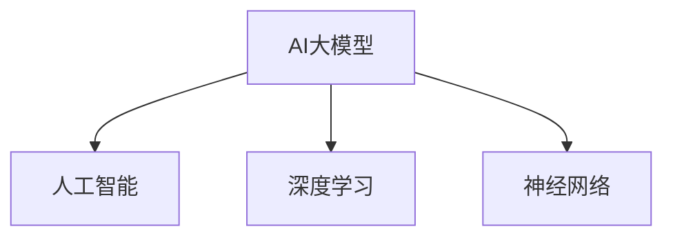
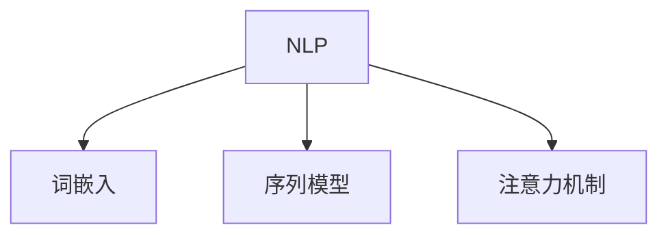
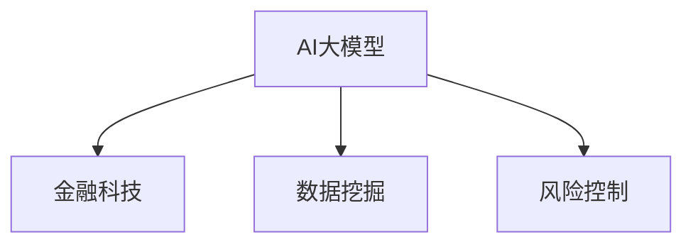
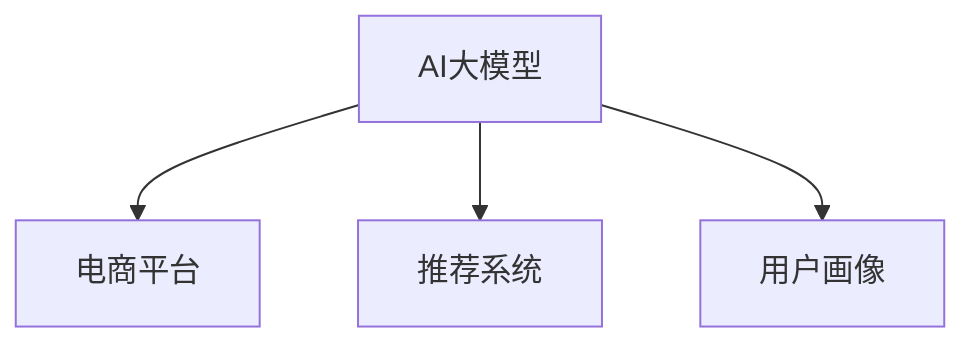
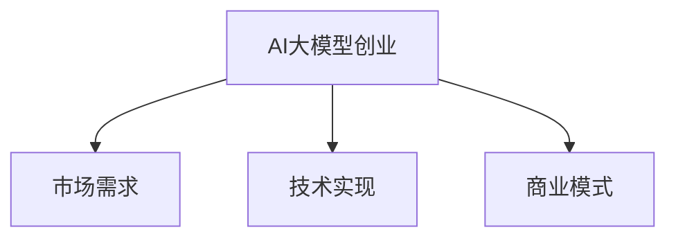
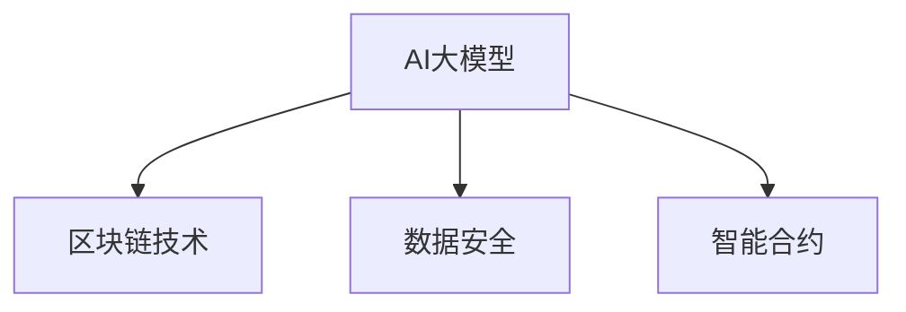

                 

# AI大模型创业：泡沫还是金矿？未来展望

> 关键词：人工智能、大模型、创业、挑战、机遇、深度学习、自然语言处理

> 摘要：本文将从AI大模型的基础概念、核心技术、应用领域、创业案例分析以及创业策略等多个角度，深入探讨AI大模型创业的现状与未来。通过分析AI大模型的本质、发展历程、应用场景以及创业中的挑战与机遇，旨在为创业者提供有价值的参考和启示。

## 第一部分：AI大模型基础

### 第1章：AI大模型概述

#### 1.1 AI大模型的概念

AI大模型是指通过深度学习等技术，训练出规模巨大、参数数量庞大的模型。这些模型能够处理复杂的任务，如自然语言处理、图像识别、预测分析等。AI大模型的核心是大规模神经网络，其参数数量往往达到亿级甚至更高。

- **核心概念与联系**：



- **核心算法原理讲解**：

```python
# 伪代码：AI大模型算法基本流程
def AI_large_model():
    # 数据预处理
    data_preprocessing()
    
    # 模型训练
    model_training()
    
    # 模型评估
    model_evaluation()
    
    # 模型应用
    model_application()
```

- **数学模型和数学公式**：

$$
y = \sigma(\sum_{i=1}^{n} w_i * x_i)
$$

- **举例说明**：以GPT模型为例，解释其训练和应用的流程。GPT（Generative Pre-trained Transformer）是一种基于Transformer架构的自然语言处理模型。其训练过程主要包括两个阶段：

  1. **预训练阶段**：使用大量的无监督文本数据，通过自回归语言模型训练，模型学习到文本的内在结构和语义信息。
  2. **微调阶段**：在预训练的基础上，针对特定任务进行微调，例如文本分类、问答系统等。

### 第2章：AI大模型核心技术

#### 2.1 深度学习基础

深度学习是人工智能的核心技术之一，其基本思想是通过多层神经网络对数据进行学习，实现从简单特征到复杂特征的提取和转换。深度学习的关键在于大规模数据和高性能计算。

- **数学模型和数学公式**：

$$
\frac{\partial E}{\partial w} = \frac{\partial}{\partial w} \sum_{i=1}^{n} (y_i - \hat{y}_i)
$$

- **伪代码**：

```python
def backward_propagation():
    # 前向传播
    forward_pass()
    
    # 计算误差
    compute_error()
    
    # 反向传播
    backward_pass()
    
    # 更新权重
    update_weights()
```

#### 2.2 自然语言处理技术

自然语言处理（NLP）是AI大模型的重要应用领域之一，其核心在于理解和生成人类语言。NLP技术包括词嵌入、序列模型和注意力机制等。

- **核心概念与联系**：



- **数学模型和数学公式**：

$$
\text{Attention}(Q, K, V) = \text{softmax}(\frac{QK^T}{\sqrt{d_k}})V
$$

### 第3章：AI大模型应用领域

#### 3.1 人工智能在金融领域的应用

AI大模型在金融领域具有广泛的应用，包括金融市场预测、风险控制、智能投顾等。以下是一个简单的例子：

- **举例说明**：利用AI大模型进行金融市场预测。首先，收集大量历史市场数据，如股票价格、交易量等。然后，使用深度学习算法对数据进行分析和建模，预测未来市场的走势。通过不断调整模型参数，提高预测的准确性。

#### 3.2 AI大模型在电商领域的应用

AI大模型在电商领域同样具有巨大的应用潜力，包括推荐系统、用户画像、商品优化等。以下是一个简单的例子：

- **举例说明**：构建一个基于AI大模型的推荐系统。首先，收集用户的历史行为数据，如购买记录、浏览记录等。然后，使用深度学习算法对用户行为进行分析和建模，预测用户可能感兴趣的商品。通过不断优化模型，提高推荐效果。

## 第二部分：AI大模型创业策略

### 第4章：AI大模型创业案例分析

#### 4.1 案例一：某金融科技公司

某金融科技公司通过构建一个基于AI大模型的智能投顾平台，为用户提供个性化的投资建议。以下是其核心概念与联系：

- **核心概念与联系**：



- **数学模型和数学公式**：

$$
\text{风险值} = \text{损失函数} + \text{置信区间}
$$

#### 4.2 案例二：某电商公司

某电商公司通过构建一个基于AI大模型的推荐系统，为用户提供个性化的购物推荐。以下是其核心概念与联系：

- **核心概念与联系**：



- **数学模型和数学公式**：

$$
\text{推荐分数} = \text{用户兴趣度} + \text{商品相关性}
$$

### 第5章：AI大模型创业挑战与机遇

#### 5.1 挑战

AI大模型创业面临的挑战主要包括计算资源、数据隐私、技术门槛等。以下是一个简单的例子：

- **举例说明**：计算资源挑战。构建一个AI大模型需要大量的计算资源，尤其是训练阶段。对于初创公司来说，购买高性能服务器可能成本高昂。一种解决方案是利用云计算资源，如亚马逊AWS、微软Azure等，通过付费使用云服务器来降低成本。

#### 5.2 机遇

AI大模型创业的机遇主要体现在以下几个方面：

- **举例说明**：AI大模型在新兴产业中的应用。随着人工智能技术的不断发展，AI大模型在医疗、教育、环保等新兴领域的应用前景广阔。创业者可以抓住这些机遇，开发具有创新性的AI产品和服务。

## 第6章：AI大模型创业路线图

### 第6章：AI大模型创业路线图

#### 6.1 步骤一：市场调研

市场调研是AI大模型创业的重要环节，旨在了解市场需求、竞争态势、用户痛点等。以下是一个简单的市场调研流程：

- **举例说明**：如何进行市场需求的调查。首先，通过在线调查、用户访谈、问卷调查等方式收集用户需求。然后，对收集到的数据进行分析，识别出用户的核心需求。最后，根据用户需求制定产品开发计划。

#### 6.2 步骤二：技术选型

技术选型是AI大模型创业的关键环节，旨在选择合适的AI大模型和技术框架。以下是一个简单的技术选型流程：

- **举例说明**：如何选择合适的AI大模型。首先，根据业务需求确定所需解决的问题类型，如自然语言处理、图像识别等。然后，根据解决类型选择合适的AI大模型，如GPT、BERT等。最后，对选定的模型进行性能测试和调优，确保其满足业务需求。

#### 6.3 步骤三：团队组建

团队组建是AI大模型创业的核心环节，旨在构建一支高效、专业的团队。以下是一个简单的团队组建流程：

- **举例说明**：如何构建高效的AI创业团队。首先，确定团队的核心职责和岗位，如数据科学家、软件工程师、产品经理等。然后，通过招聘、内部推荐等方式寻找合适的团队成员。最后，通过培训和激励措施提高团队的整体素质和执行力。

### 第7章：AI大模型创业案例分析

#### 7.1 案例一：某人工智能创业公司

某人工智能创业公司通过构建一个基于AI大模型的智能客服系统，为电商平台提供高效的客户服务。以下是其核心概念与联系：

- **核心概念与联系**：



- **数学模型和数学公式**：

$$
\text{成功率} = \text{市场需求} \times \text{技术实现} \times \text{商业模式}
$$

#### 7.2 案例二：某区块链+AI公司

某区块链+AI公司通过构建一个基于AI大模型和区块链技术的智能合约平台，为去中心化应用提供高效、安全的解决方案。以下是其核心概念与联系：

- **核心概念与联系**：



- **数学模型和数学公式**：

$$
\text{信任度} = \text{数据安全} + \text{智能合约效率}
$$

## 附录

### 附录A：AI大模型开发工具与资源

#### A.1 主流深度学习框架对比

- **举例说明**：TensorFlow和PyTorch的优缺点。

TensorFlow：

- 优点：拥有丰富的API和强大的生态系统，适用于各种深度学习任务。
- 缺点：相比PyTorch，TensorFlow在模型部署和优化方面较为复杂。

PyTorch：

- 优点：具有动态计算图，便于模型开发和调试。
- 缺点：在模型部署和优化方面相对较弱。

#### A.2 开发资源

- **举例说明**：推荐的学习资源，如书籍、在线课程等。

- **书籍**：

  - 《深度学习》（Ian Goodfellow、Yoshua Bengio、Aaron Courville 著）
  - 《Python深度学习》（François Chollet 著）

- **在线课程**：

  - Coursera上的《深度学习》课程
  - Udacity的《深度学习工程师纳米学位》课程

## 结语

AI大模型创业既充满挑战，又充满机遇。创业者需要深入理解AI大模型的本质和技术原理，同时关注市场需求和商业模式。通过合理的创业策略和团队组建，AI大模型创业有望成为未来人工智能领域的金矿。

> 作者：AI天才研究院/AI Genius Institute & 禅与计算机程序设计艺术 /Zen And The Art of Computer Programming

