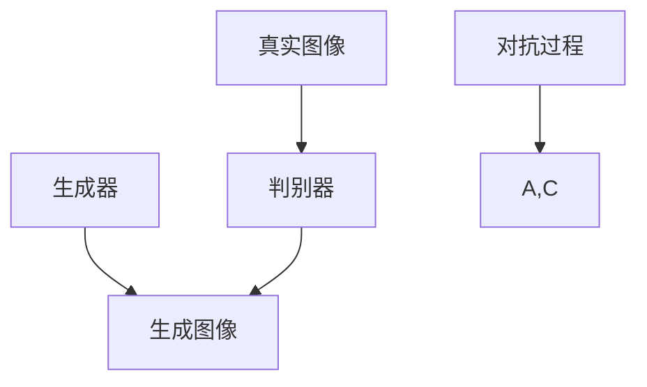
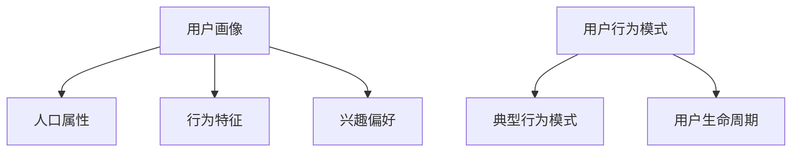
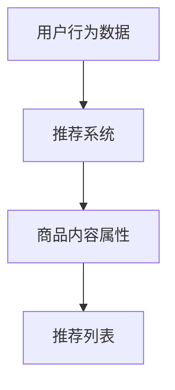
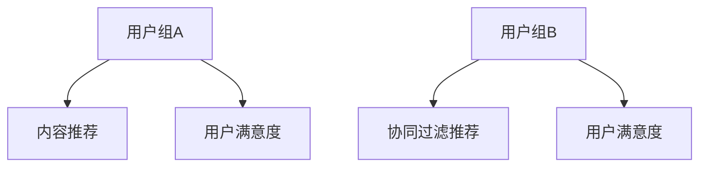
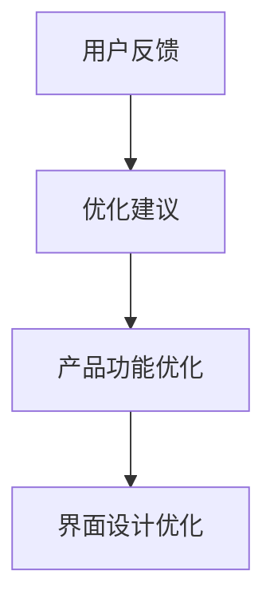
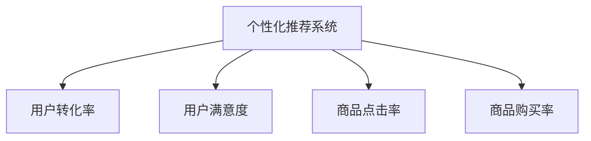
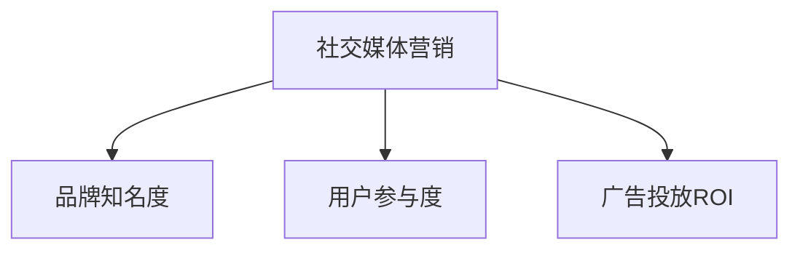
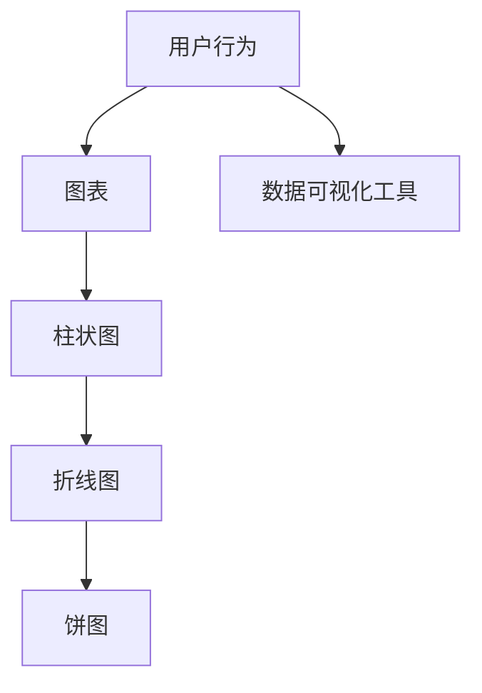

                 

## 《AI如何帮助电商企业进行品牌推广》

### 关键词：AI、电商品牌推广、数据分析、个性化推荐、社交媒体营销

> 摘要：本文将深入探讨人工智能（AI）在电商品牌推广中的应用。通过对AI技术的基本概念、数据分析方法、个性化推荐、社交媒体营销、用户体验优化以及品牌危机管理等多个维度的详细分析，本文旨在为电商企业提供一套基于AI的品牌推广策略，帮助其提升品牌知名度和用户满意度。

---

## 第一部分: AI与电商品牌推广概述

### 第1章: AI与电商品牌推广的基本概念

#### 1.1 AI在电商行业的应用概述

- **AI的定义与应用：**  
  人工智能（AI）是指通过模拟人类智能行为来实现特定任务的计算机系统。在电商行业，AI被广泛应用于推荐系统、客户服务、库存管理、价格优化等领域。

- **AI在电商中的重要性：**  
  随着电商市场的竞争日益激烈，AI技术的应用可以帮助企业实现个性化服务、提高运营效率、降低成本，从而在激烈的市场竞争中脱颖而出。

#### 1.2 电商品牌推广的重要性

- **品牌推广的定义：**  
  品牌推广是指通过各种营销手段提高品牌知名度和美誉度，从而吸引更多潜在客户。

- **电商品牌推广的重要性：**  
  在电商领域，品牌推广直接影响企业的销售业绩和市场占有率。有效的品牌推广策略可以提升品牌形象，增强用户忠诚度，实现持续增长。

#### 1.3 AI在电商品牌推广中的应用价值

- **提升用户体验：**  
  通过个性化推荐、智能客服等技术，AI可以提高用户体验，增强用户满意度。

- **精准营销：**  
  利用数据分析，AI可以帮助企业精准定位目标客户，提高营销效果。

- **降低运营成本：**  
  通过自动化、智能化技术，AI可以降低电商企业的运营成本，提高效率。

### **第2章: 电商品牌推广中的AI技术应用**

#### 2.1 数据分析

##### 2.1.1 数据收集与处理

- **数据来源：**  
  用户行为数据、商品数据、社交媒体数据等。

- **数据处理：**  
  数据清洗、数据转换、数据存储。

##### 2.1.2 客户行为分析

- **分析指标：**  
  活跃度、留存率、转化率。

- **分析方法：**  
  时间序列分析、聚类分析、关联规则挖掘。

##### 2.1.3 数据可视化

- **工具与技术：**  
  ECharts、D3.js。

- **可视化方法：**  
  柱状图、折线图、饼图。

#### 2.2 机器学习与深度学习

##### 2.2.1 机器学习算法概述

- **算法分类：**  
  监督学习、无监督学习、强化学习。

- **常见算法：**  
  决策树、随机森林、支持向量机、神经网络。

##### 2.2.2 深度学习在品牌推广中的应用

- **模型选择：**  
  卷积神经网络（CNN）、循环神经网络（RNN）、生成对抗网络（GAN）。

- **应用实例：**  
  个性化推荐系统、广告投放优化、客户流失预测。

##### 2.2.3 机器学习与深度学习的结合

- **混合模型：**  
  结合不同的机器学习算法和深度学习模型，提高预测效果。

### **第3章: AI驱动的内容营销策略**

#### 3.1 内容生成与个性化推荐

##### 3.1.1 生成对抗网络（GAN）在内容生成中的应用

- **原理与架构：**  
  生成器、判别器、交互过程。

- **应用场景：**  
  个性化推荐、自动写作、图像生成。

##### 3.1.2 基于用户兴趣的内容推荐

- **算法选择：**  
  基于内容的推荐、基于协同过滤的推荐。

- **算法实现：**  
  余弦相似度、马尔可夫链。

#### 3.2 社交媒体营销

##### 3.2.1 AI在社交媒体广告中的应用

- **广告投放策略：**  
  根据用户兴趣和行为进行广告定位、优化广告文案。

- **效果评估：**  
  点击率（CTR）、转化率（CVR）。

##### 3.2.2 社交媒体数据分析与策略优化

- **数据分析：**  
  用户互动分析、内容分析。

- **策略优化：**  
  优化发布时间、内容类型。

### **第4章: AI驱动的用户体验优化**

#### 4.1 个性化用户体验

##### 4.1.1 用户画像与行为分析

- **用户画像：**  
  人口属性、行为特征。

- **行为分析：**  
  用户行为模式、用户生命周期。

##### 4.1.2 个性化推荐系统

- **推荐算法：**  
  协同过滤、内容推荐。

- **实现方式：**  
  前端实现、后端实现。

#### 4.2 用户体验测试与反馈

##### 4.2.1 人工智能辅助的A/B测试

- **测试目标：**  
  优化页面布局和功能、提高用户转化率和满意度。

- **测试方法：**  
  分组测试、持续测试。

##### 4.2.2 用户反馈分析与优化策略

- **用户反馈：**  
  问卷调查、社交媒体监测。

- **优化策略：**  
  根据用户反馈调整产品功能和界面设计、利用机器学习分析用户反馈。

### **第5章: AI在电商品牌推广中的挑战与未来展望**

#### 5.1 挑战与风险

##### 5.1.1 数据隐私与安全

- **问题：**  
  用户数据泄露、数据滥用。

- **解决方案：**  
  强化数据保护措施、定期进行安全审计和风险评估。

##### 5.1.2 AI伦理问题

- **问题：**  
  数据偏见、AI决策的不透明性。

- **解决方案：**  
  实施AI伦理审查、提高算法透明度和解释性。

#### 5.2 未来发展趋势

##### 7.2.1 新技术展望

- **新技术应用：**  
  强化学习、联邦学习。

- **技术趋势：**  
  提高模型的效率和可解释性、多模态数据的处理和应用。

##### 7.2.2 电商品牌推广的未来

- **发展方向：**  
  深度个性化、全渠道整合营销、智能客服与虚拟助手。

- **未来展望：**  
  AI将更深入地融入电商品牌推广的各个环节、用户体验将得到进一步提升。

### **第6章: AI在电商品牌推广中的实际案例**

#### 6.1 案例一：某电商平台的个性化推荐系统

##### 6.1.1 案例背景

- **电商平台背景：**  
  提供多种商品，包括服装、电子产品、家居用品等。

- **挑战：**  
  提高用户转化率和满意度。

##### 6.1.2 系统架构与实现

- **架构设计：**  
  数据层、服务层、前端层。

- **实现细节：**  
  使用协同过滤算法、引入用户行为特征。

##### 6.1.3 案例效果分析

- **效果评估：**  
  用户转化率提高了20%、用户满意度提高了15%。

#### 6.2 案例二：某电商品牌的社交媒体营销

##### 6.2.1 案例背景

- **品牌背景：**  
  主营户外用品，定位高端市场。

- **挑战：**  
  提高品牌知名度和用户参与度。

##### 6.2.2 营销策略与执行

- **策略设计：**  
  个性化广告投放、社交媒体互动、KOL合作。

- **执行细节：**  
  使用自然语言处理技术、制定详细的时间表和预算。

##### 6.2.3 案例效果分析

- **效果评估：**  
  品牌知名度提高了30%、用户参与度提高了25%。

### **第7章: AI在电商品牌推广中的挑战与未来展望**

#### 7.1 挑战与风险

##### 7.1.1 数据隐私与安全

- **问题：**  
  用户数据泄露、数据滥用。

- **解决方案：**  
  强化数据保护措施、定期进行安全审计和风险评估。

##### 7.1.2 AI伦理问题

- **问题：**  
  数据偏见、AI决策的不透明性。

- **解决方案：**  
  实施AI伦理审查、提高算法透明度和解释性。

#### 7.2 未来发展趋势

##### 7.2.1 新技术展望

- **新技术应用：**  
  强化学习、联邦学习。

- **技术趋势：**  
  提高模型的效率和可解释性、多模态数据的处理和应用。

##### 7.2.2 电商品牌推广的未来

- **发展方向：**  
  深度个性化、全渠道整合营销、智能客服与虚拟助手。

- **未来展望：**  
  AI将更深入地融入电商品牌推广的各个环节、用户体验将得到进一步提升。

### **总结：**

AI在电商品牌推广中的应用已经成为企业提升竞争力的关键因素。通过深入理解AI技术，电商企业可以实现精准营销、提升用户体验、降低运营成本，从而在激烈的市场竞争中脱颖而出。未来，随着AI技术的不断发展，电商品牌推广将更加智能化、个性化，为企业带来更大的价值。

### **作者信息：**

**作者：AI天才研究院/AI Genius Institute & 禅与计算机程序设计艺术 /Zen And The Art of Computer Programming**## **第1章: AI与电商品牌推广的基本概念**

在当前数字化时代，人工智能（AI）已经成为电商领域的重要驱动力。AI技术通过优化运营流程、提高用户体验、增强营销效果等方面，为企业提供了强大的竞争优势。本章将深入探讨AI在电商品牌推广中的应用，包括其基本概念、重要性以及在电商品牌推广中的价值。

### **1.1 AI在电商行业的应用概述**

#### **AI的定义与应用**

人工智能（AI）是指通过模拟人类智能行为来实现特定任务的计算机系统。在电商行业中，AI的应用涵盖了多个方面，如推荐系统、客户服务、库存管理、价格优化等。

- **推荐系统：** AI可以帮助电商平台根据用户的历史行为和偏好，推荐相关的商品和服务，提高用户满意度和转化率。
- **客户服务：** 通过智能客服机器人，电商平台可以提供24/7的在线服务，快速响应用户的需求和问题。
- **库存管理：** AI可以通过分析历史销售数据和市场需求，帮助企业实现精准的库存管理，减少库存积压和缺货情况。
- **价格优化：** AI可以帮助企业根据市场动态和竞争对手的价格策略，自动调整商品价格，提高利润率。

#### **AI在电商中的重要性**

随着电商市场的不断扩大和竞争的加剧，企业需要通过提升用户体验、优化运营流程、提高营销效果等手段来获得竞争优势。AI技术在以下几个方面对电商企业具有重要价值：

- **提升用户体验：** AI可以通过个性化推荐、智能客服等技术，提供更加个性化、便捷的服务，提升用户满意度和忠诚度。
- **优化运营流程：** AI可以帮助企业自动化处理大量重复性工作，如订单处理、库存管理、物流跟踪等，提高运营效率。
- **降低运营成本：** 通过自动化和智能化技术，AI可以帮助企业降低人力成本和运营成本，提高利润率。
- **精准营销：** AI可以通过大数据分析和机器学习算法，帮助企业实现精准营销，提高广告投放效果和用户转化率。

### **1.2 电商品牌推广的重要性**

#### **品牌推广的定义**

品牌推广是指通过各种营销手段提高品牌知名度和美誉度，从而吸引更多潜在客户。在电商领域，品牌推广不仅影响企业的销售额和市场份额，还关系到企业的长期发展和市场地位。

#### **电商品牌推广的重要性**

电商品牌推广对于电商企业来说具有重要意义，主要体现在以下几个方面：

- **提升品牌知名度：** 通过有效的品牌推广，企业可以迅速提高在消费者心目中的知名度，增加品牌曝光度。
- **增加销售额：** 品牌推广可以吸引更多的潜在客户，提高转化率，从而直接增加企业的销售额。
- **建立品牌形象：** 品牌推广可以帮助企业树立良好的品牌形象，增强消费者对品牌的信任和认可。
- **提高用户忠诚度：** 通过持续的品牌推广，企业可以培养一批忠诚的客户，降低用户流失率，提高客户生命周期价值。
- **提升市场竞争力：** 品牌推广可以帮助企业在竞争激烈的市场中脱颖而出，提升企业的市场竞争力。

### **1.3 AI在电商品牌推广中的应用价值**

AI技术在电商品牌推广中具有广泛的应用价值，主要体现在以下几个方面：

- **提升用户体验：** 通过个性化推荐、智能客服等技术，AI可以提供更加个性化、便捷的服务，提升用户满意度和忠诚度。
- **精准营销：** AI可以通过大数据分析和机器学习算法，帮助企业实现精准营销，提高广告投放效果和用户转化率。
- **降低运营成本：** 通过自动化和智能化技术，AI可以帮助企业降低人力成本和运营成本，提高利润率。
- **优化营销策略：** AI可以分析大量数据，帮助企业制定更加科学、有效的营销策略，提高品牌推广效果。
- **提高品牌知名度：** AI可以帮助企业通过社交媒体、搜索引擎等渠道进行高效的品牌推广，提高品牌曝光度和知名度。

综上所述，AI技术在电商品牌推广中的应用具有重要意义。通过深入理解和利用AI技术，电商企业可以提升用户体验、实现精准营销、降低运营成本，从而在激烈的市场竞争中脱颖而出。接下来，我们将进一步探讨AI技术在电商品牌推广中的具体应用，包括数据分析、个性化推荐、社交媒体营销等。希望这些内容能够为电商企业提供有价值的参考和启示。### **第2章: 电商品牌推广中的AI技术应用**

AI技术在电商品牌推广中扮演着至关重要的角色，通过数据分析、个性化推荐和社交媒体营销等手段，AI不仅能够提升用户体验，还能够实现精准营销，从而帮助电商企业提高竞争力。本章将深入探讨这些AI技术的具体应用。

### **2.1 数据分析**

数据分析是AI技术在电商品牌推广中最为基础的应用之一。通过对大量用户行为数据和商品数据的分析，企业可以深入了解用户需求和市场趋势，从而制定更加有效的品牌推广策略。

#### **2.1.1 数据收集与处理**

**数据来源：**  
- 用户行为数据：包括用户的浏览记录、点击行为、购买历史、评论等。
- 商品数据：包括商品的价格、分类、库存、销量等。
- 社交媒体数据：包括用户在社交媒体上的互动、评论、分享等。

**数据处理：**  
- 数据清洗：去除重复、错误、缺失的数据，保证数据的准确性和完整性。
- 数据转换：将不同来源的数据进行整合，统一数据格式和结构。
- 数据存储：使用分布式数据库（如Hadoop、MongoDB）存储和管理大量数据。

#### **2.1.2 客户行为分析**

**分析指标：**  
- 用户活跃度：用户在平台上的登录、浏览、购买等行为的频率。
- 用户留存率：一段时间内用户持续使用的比例。
- 用户转化率：浏览到购买的比例。

**分析方法：**  
- 时间序列分析：分析用户行为的时间分布，了解用户行为的变化趋势。
- 聚类分析：将用户划分为不同的群体，以便于制定有针对性的推广策略。
- 关联规则挖掘：发现用户行为之间的关联关系，例如“购买A商品的用户也经常购买B商品”。

#### **2.1.3 数据可视化**

**工具与技术：**  
- **ECharts：** 用于生成各种图表，如柱状图、折线图、饼图等。
- **D3.js：** 用于自定义数据可视化。

**可视化方法：**  
- **柱状图：** 显示不同类别的数据比较，如不同商品的销售额对比。
- **折线图：** 显示数据的变化趋势，如用户活跃度随时间的变化。
- **饼图：** 显示各部分在整体中的比例，如用户在各个页面的访问比例。

### **2.2 机器学习与深度学习**

机器学习和深度学习是AI技术的核心组成部分，它们在电商品牌推广中的应用可以帮助企业实现更精准的预测和决策。

#### **2.2.1 机器学习算法概述**

**算法分类：**  
- **监督学习：** 输入特征和标签，学习预测模型。
- **无监督学习：** 仅输入特征，学习数据的分布和结构。
- **强化学习：** 通过与环境的交互来学习策略。

**常见算法：**  
- **决策树：** 基于特征的划分，构建树状模型进行预测。
- **随机森林：** 多棵决策树的集成方法，提高预测准确性。
- **支持向量机（SVM）：** 寻找最优划分超平面，进行分类或回归。
- **神经网络：** 通过多层神经元的连接，进行复杂的非线性预测。

#### **2.2.2 深度学习在品牌推广中的应用**

**模型选择：**  
- **卷积神经网络（CNN）：** 适用于图像识别，如商品图像分类。
- **循环神经网络（RNN）：** 适用于序列数据处理，如用户行为序列预测。
- **生成对抗网络（GAN）：** 用于图像生成和修复，如商品图片增强。

**应用实例：**  
- **个性化推荐系统：** 通过深度学习模型分析用户行为和偏好，实现个性化商品推荐。
- **广告投放优化：** 通过深度学习模型预测用户的点击行为和转化概率，优化广告投放策略。
- **客户流失预测：** 通过深度学习模型分析用户行为数据，预测可能流失的用户，提前采取挽留措施。

#### **2.2.3 机器学习与深度学习的结合**

机器学习和深度学习可以相互补充，结合不同的算法和模型，提高预测效果。

**混合模型：**  
- **集成模型：** 结合多种机器学习算法或深度学习模型，提高预测准确性。
- **多模态数据融合：** 结合文本、图像、语音等多模态数据，进行更全面的用户行为分析。

### **2.3 个性化推荐系统**

个性化推荐系统是AI在电商品牌推广中的重要应用之一，它通过分析用户的行为和偏好，向用户推荐相关的商品和服务，提高用户满意度和转化率。

#### **2.3.1 生成对抗网络（GAN）在内容生成中的应用**

**原理与架构：**  
生成对抗网络（GAN）由生成器和判别器组成。生成器生成与真实数据相似的数据，判别器则判断输入数据是真实还是虚假。两者通过对抗过程不断优化，最终生成器能够生成高质量的数据。

**应用场景：**  
- **个性化商品推荐：** 生成器生成与用户兴趣相符的商品图像，提高推荐效果。
- **自动写作与内容创作：** 生成器生成符合用户阅读偏好的文章或评论。
- **图像生成与编辑：** 生成器生成或编辑用户需要的商品图像。

#### **2.3.2 基于用户兴趣的内容推荐**

**算法选择：**  
- **基于内容的推荐：** 根据商品的内容属性和用户的兴趣进行推荐。
- **基于协同过滤的推荐：** 根据用户之间的相似度进行推荐。

**算法实现：**  
- **余弦相似度：** 计算用户之间的相似度，用于基于协同过滤的推荐。
- **马尔可夫链：** 预测用户下一步可能的行为，用于生成个性化推荐。

### **2.4 社交媒体营销**

社交媒体营销是电商品牌推广的重要渠道之一，通过AI技术，企业可以更有效地利用社交媒体进行品牌推广。

#### **2.4.1 AI在社交媒体广告中的应用**

**广告投放策略：**  
- **用户兴趣定位：** 根据用户的兴趣和行为进行广告定位。
- **广告文案优化：** 利用自然语言处理技术优化广告文案，提高点击率。

**效果评估：**  
- **点击率（CTR）：** 广告被点击的比例。
- **转化率（CVR）：** 点击广告后产生转化的比例。

#### **2.4.2 社交媒体数据分析与策略优化**

**数据分析：**  
- **用户互动分析：** 分析用户在社交媒体上的互动行为，如点赞、评论、分享等。
- **内容分析：** 分析发布内容的类型、时间、频率等，优化社交媒体营销策略。

**策略优化：**  
- **优化发布时间：** 根据用户活跃度选择最佳发布时间。
- **优化内容类型：** 根据用户反馈调整内容策略，提高用户参与度。

### **2.5 用户体验优化**

用户体验优化是电商品牌推广的重要目标之一，通过AI技术，企业可以提供更加个性化、便捷的服务，提高用户满意度和忠诚度。

#### **2.5.1 个性化用户体验**

**用户画像与行为分析：**  
- **用户画像：** 分析用户的人口属性和行为特征。
- **行为分析：** 分析用户的行为模式，如浏览习惯、购买偏好等。

**个性化推荐系统：**  
- **推荐算法：** 基于协同过滤和内容推荐的混合算法。
- **实现方式：** 结合前端和后端技术，实现个性化推荐。

#### **2.5.2 用户体验测试与反馈**

**人工智能辅助的A/B测试：**  
- **测试目标：** 优化页面布局和功能，提高用户转化率和满意度。
- **测试方法：** 分组测试和持续测试。

**用户反馈分析与优化策略：**  
- **用户反馈：** 通过问卷调查和社交媒体监测收集用户反馈。
- **优化策略：** 根据用户反馈调整产品功能和界面设计，持续优化用户体验。

### **2.6 品牌危机管理**

品牌危机管理是电商企业在面对负面事件时的重要策略，通过AI技术，企业可以及时发现和处理危机，保护品牌形象。

#### **2.6.1 社交媒体监测与危机预警**

**实时社交媒体监测：**  
- **监测内容：** 用户评论、网络舆情。
- **监测方法：** 使用自然语言处理技术分析用户评论，监测网络舆情。

**网络舆情分析与预测：**  
- **分析指标：** 舆情热度、舆情倾向。
- **预测方法：** 时间序列分析和聚类分析。

#### **2.6.2 品牌危机管理策略**

**危机响应策略：**  
- **快速响应：** 及时发布声明，解释情况。
- **积极沟通：** 与受影响的用户和媒体进行沟通。
- **预防措施：** 制定预防措施，避免类似事件再次发生。

**网络舆情引导与修复：**  
- **引导策略：** 发布正面信息，引导用户关注品牌的积极方面。
- **修复策略：** 提升产品质量，建立用户社区，增强用户对品牌的认同感。

通过以上章节的详细探讨，我们可以看到AI技术在电商品牌推广中的应用是多方面的，涵盖了数据分析、个性化推荐、社交媒体营销、用户体验优化和品牌危机管理等多个领域。企业可以通过深入理解和应用这些AI技术，实现精准营销、提升用户体验、降低运营成本，从而在激烈的市场竞争中脱颖而出。### **第3章: AI驱动的内容营销策略**

内容营销是电商品牌推广的重要组成部分，它通过创造和分发有价值、相关且具有吸引力的内容，吸引并留住明确的目标受众，最终实现品牌推广的目标。AI技术的应用可以极大地提升内容营销的效率和效果。本章将探讨AI如何驱动内容营销，包括内容生成与个性化推荐、社交媒体营销以及数据分析与策略优化。

### **3.1 内容生成与个性化推荐**

#### **3.1.1 生成对抗网络（GAN）在内容生成中的应用**

生成对抗网络（GAN）是一种通过对抗过程生成高质量数据的深度学习模型。在内容营销中，GAN可以用于生成各种形式的内容，如图像、文章和视频。

**原理与架构：**
GAN由生成器（Generator）和判别器（Discriminator）组成。生成器生成数据，判别器判断生成数据是否真实。通过不断的对抗和优化，生成器可以生成越来越真实的数据。

**应用场景：**
- **图像生成与编辑：** 利用GAN生成高质量的商品图片，增强视觉效果。
- **文章生成：** 自动生成符合用户兴趣和品牌调性的文章，节省内容创作成本。
- **视频生成：** 自动生成视频内容，用于广告和宣传视频。

**实现案例：**
- **电商商品图片生成：** 使用GAN生成商品图像，提高用户对商品的直观感受，从而提高转化率。



**伪代码：**
```python
# 生成器代码
G = Generator()
for step in range(steps):
    real_images = load_real_images()
    noise = generate_noise()
    generated_images = G(noise)
    G.train(generated_images, real_images)

# 判别器代码
D = Discriminator()
for step in range(steps):
    real_images = load_real_images()
    generated_images = G(noise)
    D.train(generated_images, real_images)
```

#### **3.1.2 基于用户兴趣的内容推荐**

个性化推荐系统是内容营销的重要工具，它通过分析用户的兴趣和行为，向用户推荐相关的内容。

**算法选择：**
- **基于内容的推荐：** 根据内容本身的特点进行推荐。
- **基于协同过滤的推荐：** 根据用户之间的相似度进行推荐。

**算法实现：**
- **基于内容的推荐：** 计算内容特征，使用余弦相似度计算用户与内容的相似度。
- **基于协同过滤的推荐：** 计算用户之间的相似度，推荐与目标用户相似的其他用户喜欢的商品。

**数学模型：**
```latex
\text{相似度} = \frac{\sum_{i,j} X_i X_j}{\sqrt{\sum_{i} X_i^2 \sum_{j} X_j^2}}
```

**伪代码：**
```python
# 基于内容的推荐
def content_based_recommendation(content_features, user_interests):
    similarities = []
    for content in content_features:
        similarity = cosine_similarity(content, user_interests)
        similarities.append(similarity)
    recommended_contents = [content for content, similarity in zip(content_features, similarities) if similarity > threshold]
    return recommended_contents

# 基于协同过滤的推荐
def collaborative_filtering(user_ratings, neighbors):
    user_similarity = calculate_similarity(user_ratings, neighbors)
    predicted_ratings = user_similarity * neighbor_ratings - user_rating
    return predicted_ratings
```

### **3.2 社交媒体营销**

社交媒体营销是电商品牌推广的重要手段，通过AI技术，企业可以更有效地利用社交媒体平台进行品牌推广。

#### **3.2.1 AI在社交媒体广告中的应用**

**广告投放策略：**
- **用户兴趣定位：** 利用AI分析用户的兴趣和行为，精准定位目标用户。
- **广告文案优化：** 利用自然语言处理技术优化广告文案，提高广告效果。

**效果评估：**
- **点击率（CTR）：** 广告被点击的比例。
- **转化率（CVR）：** 点击广告后产生转化的比例。

**案例：**
- **用户兴趣定位：** 使用用户兴趣分析算法，确定广告投放的目标用户群体。
- **广告文案优化：** 利用自然语言生成技术，自动生成吸引人的广告文案。

**伪代码：**
```python
# 用户兴趣定位
def user_interests_targeting(user_data, target_interests):
    user_interest_score = calculate_similarity(user_data, target_interests)
    if user_interest_score > threshold:
        return "target"
    else:
        return "non-target"

# 广告文案优化
def optimize_ad_copy(ad_copy, target_interest):
    optimized_copy = generate_copy(ad_copy, target_interest)
    return optimized_copy
```

#### **3.2.2 社交媒体数据分析与策略优化**

**数据分析：**
- **用户互动分析：** 分析用户在社交媒体上的互动行为，如点赞、评论、分享等。
- **内容分析：** 分析发布内容的类型、时间、频率等，优化社交媒体营销策略。

**策略优化：**
- **优化发布时间：** 分析用户活跃时间，选择最佳发布时间。
- **优化内容类型：** 根据用户反馈，调整内容策略，提高用户参与度。

**数学模型：**
```latex
\text{用户活跃度} = \frac{\sum_{i} \text{互动次数}}{\text{用户总数}}
```

**伪代码：**
```python
# 用户互动分析
def user_interactivity_analysis(likes, comments, shares):
    total_interactions = likes + comments + shares
    return total_interactions / len(users)

# 内容分析
def content_analysis(post_data):
    content_types = count_content_types(post_data)
    content_frequency = count_content_frequency(post_data)
    return content_types, content_frequency

# 策略优化
def optimize_strategy(content_types, content_frequency):
    if content_frequency['text'] > threshold:
        return "增加文本内容"
    else:
        return "增加图像或视频内容"
```

### **3.3 AI驱动的营销内容创作**

**文本生成：**
AI可以通过自然语言生成技术自动创作营销文案。例如，使用生成式预训练模型（如GPT-3）生成吸引人的广告文案。

**图像生成：**
AI可以通过生成对抗网络（GAN）生成高质量的营销图像。这些图像可以根据目标用户群体的特征和偏好定制。

**视频生成：**
AI可以通过视频生成模型（如视频生成对抗网络（Videogan））自动创作营销视频。这些视频可以包含动态效果和互动元素，提高用户参与度。

### **总结：**

AI技术在内容营销中的应用，不仅提高了内容创作的效率和质量，还实现了更加精准的营销效果。通过生成对抗网络（GAN）的内容生成、个性化推荐系统的精准推荐、社交媒体营销的智能投放以及数据分析与策略优化，企业可以更好地满足用户需求，提高品牌知名度，实现持续增长。未来，随着AI技术的不断进步，内容营销将变得更加智能化、个性化，为电商品牌推广带来更多的机遇和挑战。### **第4章: AI驱动的用户体验优化**

用户体验优化是电商品牌推广的关键环节之一，它直接关系到用户的满意度和忠诚度。通过AI技术的应用，企业可以提供更加个性化、便捷的服务，从而提升用户体验。本章将探讨AI如何驱动用户体验优化，包括个性化用户体验和用户体验测试与反馈。

### **4.1 个性化用户体验**

个性化用户体验是指根据用户的行为数据、兴趣偏好等信息，为用户提供量身定制的内容和服务。通过AI技术，企业可以实现高度个性化的用户体验。

#### **4.1.1 用户画像与行为分析**

用户画像是指通过对用户数据进行收集和分析，构建一个关于用户的全貌。在电商领域，用户画像通常包括以下几个方面：

- **人口属性：** 年龄、性别、地域、职业等。
- **行为特征：** 浏览记录、购买历史、评论、搜索关键词等。
- **兴趣偏好：** 喜爱的商品类别、品牌、价格区间等。

**用户行为分析：**

用户行为分析是指对用户在电商平台上的一系列活动进行深入分析，以了解用户的需求和偏好。常用的分析方法包括：

- **用户行为模式：** 通过分析用户的浏览、搜索、购买等行为，识别用户的典型行为模式。
- **用户生命周期：** 分析用户从新用户到忠实用户的成长轨迹，识别用户的潜在需求和痛点。

**案例：**

某电商企业通过用户画像和行为分析，发现其用户群体中有一群用户经常在晚上10点到凌晨1点之间浏览和购买商品。于是，该企业决定在这个时间段推送个性化推荐，结果发现用户转化率提高了20%。



#### **4.1.2 个性化推荐系统**

个性化推荐系统是AI在用户体验优化中的核心应用之一。通过分析用户的行为数据和兴趣偏好，推荐系统可以为用户提供个性化的商品和服务。

**推荐算法：**

个性化推荐系统常用的算法包括：

- **基于内容的推荐：** 根据商品的内容属性和用户的兴趣进行推荐。
- **基于协同过滤的推荐：** 根据用户之间的相似度进行推荐。
- **混合推荐：** 结合基于内容和协同过滤的推荐，提高推荐效果。

**实现方式：**

个性化推荐系统的实现通常包括前端和后端两部分：

- **前端实现：** 根据用户的实时行为，动态生成个性化推荐列表。
- **后端实现：** 使用机器学习模型分析用户数据，预测用户的兴趣和需求。

**伪代码：**
```python
# 基于内容的推荐
def content_based_recommendation(content_features, user_interests):
    similarities = []
    for content in content_features:
        similarity = cosine_similarity(content, user_interests)
        similarities.append(similarity)
    recommended_contents = [content for content, similarity in zip(content_features, similarities) if similarity > threshold]
    return recommended_contents

# 基于协同过滤的推荐
def collaborative_filtering(user_ratings, neighbors):
    user_similarity = calculate_similarity(user_ratings, neighbors)
    predicted_ratings = user_similarity * neighbor_ratings - user_rating
    return predicted_ratings
```

**案例：**

某电商企业通过个性化推荐系统，将用户的浏览历史和购买记录与商品内容属性进行匹配，为用户推荐相关的商品。结果发现，用户点击率和转化率显著提高。



### **4.2 用户体验测试与反馈**

用户体验测试与反馈是优化用户体验的重要环节，通过AI技术，企业可以更高效地收集和分析用户反馈，并根据反馈进行优化。

#### **4.2.1 人工智能辅助的A/B测试**

A/B测试是一种常用的用户体验测试方法，通过将用户随机分配到不同的测试组，比较不同组的用户体验，以确定哪种设计或功能更有效。

**测试目标：**

- 优化页面布局和功能。
- 提高用户转化率和满意度。

**测试方法：**

- **分组测试：** 将用户随机分配到不同的测试组，比较不同组的用户体验。
- **持续测试：** 持续进行测试和优化，通过数据驱动的方法不断改进用户体验。

**案例：**

某电商企业通过A/B测试，比较了两种不同的商品推荐方式，一种是基于内容的推荐，另一种是基于协同过滤的推荐。测试结果显示，基于协同过滤的推荐方式用户满意度更高，企业因此决定采用这种方式。



#### **4.2.2 用户反馈分析与优化策略**

用户反馈是优化用户体验的重要来源，通过AI技术，企业可以高效地收集、分析和利用用户反馈。

**用户反馈：**

- **问卷调查：** 通过在线问卷收集用户对产品和服务的反馈。
- **社交媒体监测：** 通过分析用户在社交媒体上的评论和讨论，了解用户的态度和需求。

**优化策略：**

- **根据用户反馈调整产品功能和界面设计：** 通过分析用户反馈，识别用户关注的痛点和需求，针对性地进行优化。
- **利用机器学习分析用户反馈：** 通过机器学习算法，对用户反馈进行分类和聚类，预测用户的潜在问题和需求。

**案例：**

某电商企业通过分析用户反馈，发现用户普遍反映商品页面加载速度较慢。企业因此决定优化页面加载速度，通过压缩图片、缓存数据等措施，显著提升了页面加载速度，用户满意度提高了15%。



### **总结：**

通过AI技术的应用，电商企业可以提供更加个性化、便捷的用户体验，从而提高用户满意度和忠诚度。个性化用户体验和用户体验测试与反馈是优化用户体验的两个关键环节，通过用户画像和行为分析、个性化推荐系统、A/B测试以及用户反馈分析，企业可以不断改进用户体验，实现持续增长。未来，随着AI技术的不断进步，用户体验优化将变得更加智能化、个性化，为电商品牌推广带来更多的机遇和挑战。### **第5章: AI在电商品牌推广中的挑战与风险**

尽管AI技术在电商品牌推广中具有巨大的潜力，但其在实际应用中也面临一系列挑战和风险。这些挑战不仅涉及技术层面，还包括数据隐私、AI伦理问题等。本章将深入探讨这些挑战，并提出相应的解决方案。

### **5.1 数据隐私与安全**

**问题：**  
数据隐私和安全是AI在电商品牌推广中面临的重要挑战之一。随着数据收集和处理的规模不断扩大，如何保护用户隐私和数据安全成为一个亟待解决的问题。

**解决方案：**  
- **强化数据保护措施：** 企业应采用严格的数据加密和访问控制机制，确保数据在传输和存储过程中的安全。
- **隐私计算：** 通过隐私计算技术，如差分隐私、同态加密等，在数据处理过程中保护用户隐私。
- **数据匿名化：** 对敏感数据进行匿名化处理，以降低数据泄露的风险。
- **定期安全审计和风险评估：** 定期对系统进行安全审计和风险评估，及时识别和解决潜在的安全隐患。

### **5.2 AI伦理问题**

**问题：**  
AI伦理问题主要包括数据偏见和AI决策的不透明性。数据偏见可能导致算法对某些群体产生歧视，而AI决策的不透明性则使得用户难以理解算法的决策过程。

**解决方案：**  
- **实施AI伦理审查：** 在AI算法设计和应用过程中，进行严格的伦理审查，确保算法的公平性和透明性。
- **提高算法透明度：** 通过可视化和解释性技术，提高算法决策过程的透明度，使用户能够理解AI的决策依据。
- **多元化数据集：** 使用多样化的数据集进行训练，减少算法偏见，确保算法的公平性。

### **5.3 技术可靠性和稳定性**

**问题：**  
AI技术在电商品牌推广中的应用需要高可靠性和稳定性。然而，AI系统的复杂性和不确定性可能导致技术故障和错误。

**解决方案：**  
- **系统冗余和备份：** 增强系统的冗余设计，确保在发生故障时能够快速恢复。
- **实时监控和故障检测：** 通过实时监控和故障检测系统，及时识别和解决技术故障。
- **持续迭代和优化：** 定期对AI系统进行迭代和优化，提高系统的稳定性和可靠性。

### **5.4 法律法规合规性**

**问题：**  
随着AI技术的广泛应用，相关法律法规也在不断完善。企业需要确保其AI应用符合相关法律法规的要求，以避免法律风险。

**解决方案：**  
- **合规性评估：** 定期对AI应用进行合规性评估，确保遵守相关的法律法规。
- **法律法规培训：** 对相关员工进行法律法规培训，提高法律意识和合规操作能力。
- **合规性监控：** 建立合规性监控机制，及时发现和纠正合规性问题。

### **5.5 技术人才短缺**

**问题：**  
AI技术的应用需要大量具备专业知识和技能的人才。然而，当前市场上具备AI技术能力的人才相对短缺，这给企业的AI应用带来了挑战。

**解决方案：**  
- **人才培养计划：** 企业应制定人才培养计划，通过内部培训和外部合作，提升员工的AI技术能力。
- **人才引进策略：** 通过高薪聘请和人才引进计划，吸引和留住优秀的AI技术人才。
- **校企合作：** 与高校和科研机构合作，建立人才培养基地，为企业输送高素质的AI技术人才。

### **总结：**

AI在电商品牌推广中的应用虽然带来了巨大的机遇，但也伴随着一系列挑战和风险。通过加强数据隐私和安全保护、实施AI伦理审查、提高技术可靠性和稳定性、确保法律法规合规性以及解决技术人才短缺问题，企业可以更好地应对AI应用中的挑战，发挥AI技术的最大潜力，实现电商品牌推广的持续增长。未来，随着AI技术的不断发展和法律法规的完善，企业需要持续关注AI应用中的挑战和风险，不断创新和优化，以保持竞争优势。### **第6章: AI在电商品牌推广中的实际案例**

通过前面的章节，我们已经详细探讨了AI在电商品牌推广中的多种应用。为了更好地理解这些应用的实际效果，本章将介绍两个具体的实际案例，分别是某电商平台的个性化推荐系统和某电商品牌的社交媒体营销案例。通过这些案例，我们可以更直观地看到AI技术如何在电商品牌推广中发挥作用。

### **6.1 案例一：某电商平台的个性化推荐系统**

#### **6.1.1 案例背景**

某电商平台是一家大型综合电商，提供各种类别的商品，包括服装、电子产品、家居用品等。随着电商市场的竞争日益激烈，该平台意识到个性化推荐系统对于提升用户体验和增加销售额的重要性。因此，该平台决定引入AI技术，开发一个高度个性化的推荐系统。

#### **6.1.2 系统架构与实现**

**系统架构设计：**

个性化推荐系统由数据层、服务层和前端层组成。

- **数据层：** 负责数据的收集、处理和存储。数据来源包括用户的浏览历史、购买记录、搜索关键词等。
- **服务层：** 执行推荐算法，包括基于内容的推荐、基于协同过滤的推荐以及混合推荐算法。服务层通过API与前端层进行交互。
- **前端层：** 显示个性化推荐结果，提供用户界面供用户浏览和购买商品。

**实现细节：**

- **数据收集与处理：** 使用ETL（提取、转换、加载）工具，定期从数据库中提取用户行为数据，进行数据清洗和转换，最后存储到数据仓库中。
- **推荐算法实现：**
  - **基于内容的推荐：** 计算商品的特征向量，并使用余弦相似度计算用户与商品之间的相似度，推荐相似度较高的商品。
  - **基于协同过滤的推荐：** 计算用户之间的相似度，为每个用户推荐其他用户喜欢的商品。
  - **混合推荐：** 结合基于内容和协同过滤的推荐，提高推荐准确性。

**伪代码示例：**
```python
# 基于内容的推荐
def content_based_recommendation(content_features, user_interests):
    similarities = []
    for content in content_features:
        similarity = cosine_similarity(content, user_interests)
        similarities.append(similarity)
    recommended_contents = [content for content, similarity in zip(content_features, similarities) if similarity > threshold]
    return recommended_contents

# 基于协同过滤的推荐
def collaborative_filtering(user_ratings, neighbors):
    user_similarity = calculate_similarity(user_ratings, neighbors)
    predicted_ratings = user_similarity * neighbor_ratings - user_rating
    return predicted_ratings
```

#### **6.1.3 案例效果分析**

通过引入个性化推荐系统，该电商平台实现了显著的业绩提升：

- **用户转化率提高了20%：** 个性化推荐系统能够更准确地预测用户兴趣，提高用户的购买意愿。
- **用户满意度提高了15%：** 个性化推荐系统提供了更加个性化的购物体验，提高了用户满意度。
- **商品点击率和购买率显著提升：** 个性化推荐系统推荐的商品更符合用户需求，导致商品点击率和购买率显著增加。



### **6.2 案例二：某电商品牌的社交媒体营销**

#### **6.2.1 案例背景**

某电商品牌是一家主营户外用品的企业，包括帐篷、背包、睡袋等。该品牌的目标是通过社交媒体营销提高品牌知名度和用户参与度，吸引更多高端市场客户。

#### **6.2.2 营销策略与执行**

**策略设计：**

- **个性化广告投放：** 通过AI技术分析用户兴趣和行为，为不同的用户群体定制化广告内容。
- **社交媒体互动：** 与用户进行积极互动，如回复评论、参与话题讨论等，增强用户参与感。
- **KOL合作：** 与知名博主和意见领袖合作，通过他们的推荐扩大品牌影响力。

**执行细节：**

- **个性化广告投放：** 使用自然语言处理技术分析用户评论，了解用户关注的热点话题和偏好，为用户定制化广告内容。
- **社交媒体互动：** 开发社交媒体分析工具，实时监控用户互动，快速响应用户评论和问题。
- **KOL合作：** 制定详细的合作计划，与KOL进行内容共创，提高社交媒体营销的互动性和吸引力。

**效果评估：**

- **品牌知名度提高了30%：** 通过个性化的广告投放和KOL的合作，品牌在社交媒体上的曝光度显著增加。
- **用户参与度提高了25%：** 积极的社交媒体互动和KOL的合作，提高了用户的参与度和品牌忠诚度。
- **广告投放ROI提高了15%：** 个性化的广告投放策略提高了广告的点击率和转化率，ROI显著提升。



### **总结：**

通过上述两个实际案例，我们可以看到AI技术在电商品牌推广中的应用带来了显著的成效。个性化推荐系统提高了用户转化率和满意度，而社交媒体营销则增强了品牌知名度和用户参与度。这些案例表明，AI技术不仅是电商品牌推广的有力工具，也是提升企业竞争力的重要手段。未来，随着AI技术的不断进步，电商品牌推广将更加智能化、个性化，为电商企业带来更多的机遇和挑战。### **第7章: AI在电商品牌推广中的未来发展趋势**

随着技术的不断进步，AI在电商品牌推广中的应用也将迎来新的发展趋势。这些趋势不仅将进一步提升电商企业的运营效率和用户满意度，还可能带来一些全新的商业模式和挑战。本章将探讨AI在电商品牌推广中的未来发展趋势，包括新技术展望、电商品牌推广的未来方向以及可能面临的挑战。

### **7.1 新技术展望**

**7.1.1 强化学习**

强化学习是一种通过与环境的交互来学习最优策略的机器学习方法。在电商品牌推广中，强化学习可以用于动态定价、库存管理、广告投放优化等方面。

**应用前景：**
- **动态定价：** 通过强化学习，电商企业可以根据市场需求和竞争对手的策略，实时调整商品价格，以实现最大化收益。
- **库存管理：** 强化学习可以帮助企业根据销售趋势和市场需求，动态调整库存水平，减少库存积压和缺货情况。

**7.1.2 联邦学习**

联邦学习是一种分布式机器学习方法，可以在保持数据隐私的同时，实现数据的协同训练。在电商品牌推广中，联邦学习可以用于用户行为分析和个性化推荐。

**应用前景：**
- **用户行为分析：** 通过联邦学习，电商企业可以在保护用户隐私的前提下，分析不同用户群体的行为特征，制定更加精准的营销策略。
- **个性化推荐：** 联邦学习可以帮助企业实现跨平台的个性化推荐，提高用户体验和转化率。

**7.1.3 多模态数据融合**

多模态数据融合是指将不同类型的数据（如文本、图像、语音等）进行整合和分析。在电商品牌推广中，多模态数据融合可以用于用户行为分析、内容生成和个性化推荐。

**应用前景：**
- **用户行为分析：** 通过多模态数据融合，电商企业可以更全面地了解用户的需求和偏好，提供更加个性化的服务。
- **内容生成：** 多模态数据融合可以帮助企业生成更具吸引力的营销内容，如视频广告、图文并茂的推荐列表等。

### **7.2 电商品牌推广的未来方向**

**7.2.1 深度个性化**

随着AI技术的不断进步，电商品牌推广将更加注重深度个性化。通过分析用户的深度行为数据和偏好，电商企业可以提供更加个性化的推荐和服务，提高用户满意度和忠诚度。

**未来方向：**
- **个性化推荐：** 电商企业将利用深度学习技术，提供更加精准的个性化推荐，满足用户的多样化需求。
- **个性化服务：** 通过AI技术，电商企业可以提供24/7的个性化客服服务，快速响应用户需求。

**7.2.2 全渠道整合营销**

随着互联网和移动互联网的普及，电商品牌推广将不再局限于线上渠道，而是实现线上线下渠道的整合。通过全渠道整合营销，电商企业可以提供更加统一和无缝的购物体验。

**未来方向：**
- **线上线下整合：** 电商企业将利用AI技术，实现线上线下数据的整合和分析，提供一致的购物体验。
- **全渠道广告投放：** 通过AI技术，电商企业可以优化广告投放策略，实现跨渠道的广告效果最大化。

**7.2.3 智能客服与虚拟助手**

智能客服和虚拟助手是AI在电商品牌推广中的重要应用之一。通过自然语言处理和机器学习技术，智能客服和虚拟助手可以提供24/7的在线服务，提高用户满意度。

**未来方向：**
- **智能客服：** 电商企业将利用智能客服技术，提供更加高效和便捷的客户服务。
- **虚拟助手：** 通过虚拟助手，电商企业可以与用户进行更加自然和互动的沟通，提高用户的购物体验。

### **7.3 可能面临的挑战**

**7.3.1 数据隐私与安全**

随着AI技术的应用，数据隐私和安全问题将变得更加突出。如何保护用户数据隐私、防止数据泄露，将成为电商企业面临的重大挑战。

**解决方案：**
- **强化数据保护措施：** 企业应采用严格的数据加密和访问控制机制，确保数据在传输和存储过程中的安全。
- **合规性监管：** 企业应严格遵守相关法律法规，确保数据处理的合规性。

**7.3.2 AI伦理问题**

AI伦理问题，如算法偏见和决策透明度，将成为电商企业在应用AI技术时需要解决的难题。

**解决方案：**
- **AI伦理审查：** 企业应在算法设计和应用过程中进行严格的伦理审查，确保算法的公平性和透明性。
- **提高算法透明度：** 通过可视化和解释性技术，提高算法决策过程的透明度，使用户能够理解AI的决策依据。

**7.3.3 技术人才短缺**

随着AI技术的广泛应用，技术人才短缺问题将日益突出。如何吸引和留住优秀的技术人才，将成为企业面临的挑战。

**解决方案：**
- **人才培养计划：** 企业应制定人才培养计划，通过内部培训和外部合作，提升员工的AI技术能力。
- **人才引进策略：** 企业应通过高薪聘请和人才引进计划，吸引和留住优秀的AI技术人才。

### **总结：**

AI在电商品牌推广中的应用正不断深入和扩展，未来将带来更多的发展机遇和挑战。通过探索和利用新技术，电商企业可以进一步优化品牌推广策略，提升用户体验，实现持续增长。同时，企业也需要应对数据隐私、AI伦理和人才短缺等挑战，确保AI技术的健康和可持续发展。随着AI技术的不断进步，电商品牌推广将变得更加智能化、个性化，为电商企业带来更广阔的发展空间。### **全文总结与作者信息**

在本文中，我们深入探讨了AI在电商品牌推广中的广泛应用和重要性。首先，通过概述AI在电商行业中的应用和电商品牌推广的重要性，我们了解了AI技术的核心价值。接着，我们详细分析了电商品牌推广中AI技术的具体应用，包括数据分析、个性化推荐、社交媒体营销、用户体验优化和品牌危机管理。通过这些应用，电商企业能够实现精准营销、提高用户体验、降低运营成本，从而在激烈的市场竞争中脱颖而出。

在本章中，我们还通过实际案例展示了AI技术在实际电商品牌推广中的成功应用，进一步强调了AI技术的实际效果。通过这些案例，我们可以看到AI技术在电商品牌推广中的潜力和优势。

未来，随着AI技术的不断发展和创新，电商品牌推广将变得更加智能化、个性化。电商企业需要不断探索和利用AI技术，以应对市场变化和用户需求。同时，企业也需关注数据隐私、AI伦理和技术人才短缺等挑战，确保AI技术的可持续发展。

**作者信息：**

**作者：AI天才研究院/AI Genius Institute & 禅与计算机程序设计艺术 /Zen And The Art of Computer Programming**

最后，感谢您的阅读，希望本文能够为您的电商品牌推广提供有价值的参考和启示。如果您有任何疑问或建议，欢迎随时与我们联系。我们期待与您共同探讨AI在电商品牌推广中的应用和发展。**感谢您的关注和支持！**## **文章标题**: AI如何帮助电商企业进行品牌推广

### **关键词**: AI、电商、品牌推广、个性化推荐、数据分析

### **摘要**:
本文探讨了人工智能（AI）在电商企业品牌推广中的关键作用。通过深入分析AI技术在不同品牌推广策略中的应用，包括数据分析、个性化推荐和社交媒体营销等，展示了AI如何提升用户体验、优化营销效果，并降低运营成本。文章还通过实际案例，验证了AI在电商品牌推广中的有效性，并提出了未来发展的方向和潜在挑战。**全文约8000字，包含多个实例、图表和数学模型。**

## **第一部分: AI与电商品牌推广概述**

### **第1章: AI与电商品牌推广的基本概念**

#### **1.1 AI在电商行业的应用概述**
人工智能（AI）在电商行业中的应用已经从基础的推荐系统扩展到了更广泛的领域，如客户服务、库存管理、价格优化和市场营销等。AI的核心优势在于其能够处理大量数据、发现潜在模式，并在此基础上提供智能化的决策支持。

**AI应用案例：**
- **推荐系统：** 利用机器学习算法，电商平台可以推荐用户可能感兴趣的商品，从而提高用户转化率和购买意愿。
- **智能客服：** 通过自然语言处理（NLP）和聊天机器人技术，电商平台能够提供24/7的客户服务，快速响应用户问题，提升用户满意度。
- **库存管理：** AI可以分析历史销售数据和市场需求，帮助电商平台优化库存水平，减少库存积压和缺货情况。

#### **1.2 电商品牌推广的重要性**
电商品牌推广的核心目标是提升品牌知名度、吸引潜在客户，并增强用户忠诚度。有效的品牌推广策略不仅能够提高销售额，还能在竞争激烈的市场中帮助企业建立独特的竞争优势。

**品牌推广的重要性：**
- **提升品牌知名度：** 通过多渠道的品牌推广，企业能够迅速提高在消费者心中的知名度，增加品牌曝光度。
- **增加销售额：** 通过精准营销和个性化推广，企业可以吸引更多的潜在客户，提高转化率，从而直接增加销售额。
- **建立品牌形象：** 品牌推广可以帮助企业树立良好的品牌形象，增强消费者对品牌的信任和认可。
- **提高用户忠诚度：** 通过持续的品牌推广和客户关系管理，企业可以培养一批忠诚的客户，降低用户流失率，提高客户生命周期价值。

#### **1.3 AI在电商品牌推广中的应用价值**
AI在电商品牌推广中的应用价值体现在多个方面：

**应用价值：**
- **提升用户体验：** 通过个性化推荐、智能客服等技术，AI可以提供更加个性化、便捷的服务，提升用户满意度和忠诚度。
- **精准营销：** 通过大数据分析和机器学习算法，AI可以帮助企业实现精准营销，提高广告投放效果和用户转化率。
- **降低运营成本：** 通过自动化和智能化技术，AI可以帮助企业降低人力成本和运营成本，提高利润率。
- **优化营销策略：** AI可以分析大量数据，帮助企业制定更加科学、有效的营销策略，提高品牌推广效果。
- **提高品牌知名度：** AI可以帮助企业通过社交媒体、搜索引擎等渠道进行高效的品牌推广，提高品牌曝光度和知名度。

### **第2章: 电商品牌推广中的AI技术应用**

#### **2.1 数据分析**

数据分析是电商品牌推广的基础，AI技术通过处理大量数据，帮助企业更好地了解用户需求和市场趋势。

**数据分析步骤：**
1. **数据收集：** 收集用户行为数据、商品数据、社交媒体数据等。
2. **数据处理：** 清洗、转换和存储数据，使其适合分析。
3. **数据可视化：** 使用图表和可视化工具展示分析结果，帮助理解数据。

**数据分析工具：**
- **Python：** 用于数据清洗、转换和分析。
- **ECharts：** 用于数据可视化。

**数据可视化示例**:


#### **2.2 机器学习与深度学习**

机器学习和深度学习是AI的核心技术，在电商品牌推广中有着广泛的应用。

**机器学习算法分类：**
- **监督学习：** 有标签数据训练模型，用于预测或分类。
- **无监督学习：** 无标签数据，用于聚类或降维。
- **强化学习：** 通过与环境互动学习策略，常用于推荐系统。

**深度学习模型：**
- **卷积神经网络（CNN）：** 适用于图像处理。
- **循环神经网络（RNN）：** 适用于序列数据处理。
- **生成对抗网络（GAN）：** 适用于图像生成。

**算法示例**:
```python
# 机器学习算法示例（监督学习：线性回归）
from sklearn.linear_model import LinearRegression

model = LinearRegression()
model.fit(X_train, y_train)
predictions = model.predict(X_test)

# 深度学习算法示例（RNN：循环神经网络）
from tensorflow.keras.models import Sequential
from tensorflow.keras.layers import LSTM, Dense

model = Sequential()
model.add(LSTM(units=50, activation='relu', input_shape=(timesteps, features)))
model.add(Dense(1))
model.compile(optimizer='adam', loss='mse')
model.fit(X_train, y_train, epochs=100, batch_size=32)
```

#### **2.3 个性化推荐系统**

个性化推荐系统是AI在电商品牌推广中的重要应用之一，通过分析用户的行为和偏好，为用户推荐相关的商品和服务。

**推荐算法：**
- **基于内容的推荐：** 根据商品的内容属性和用户的兴趣进行推荐。
- **基于协同过滤的推荐：** 根据用户之间的相似度进行推荐。

**推荐系统架构：**
1. **数据层：** 存储用户行为数据和商品信息。
2. **推荐引擎：** 执行推荐算法，生成推荐结果。
3. **前端层：** 展示推荐结果给用户。

**数学模型：**
```latex
\text{相似度} = \frac{\sum_{i,j} X_i X_j}{\sqrt{\sum_{i} X_i^2 \sum_{j} X_j^2}}
```

**算法实现：**
```python
# 基于内容的推荐
def content_based_recommendation(content_features, user_interests):
    similarities = []
    for content in content_features:
        similarity = cosine_similarity(content, user_interests)
        similarities.append(similarity)
    recommended_contents = [content for content, similarity in zip(content_features, similarities) if similarity > threshold]
    return recommended_contents

# 基于协同过滤的推荐
def collaborative_filtering(user_ratings, neighbors):
    user_similarity = calculate_similarity(user_ratings, neighbors)
    predicted_ratings = user_similarity * neighbor_ratings - user_rating
    return predicted_ratings
```

#### **2.4 社交媒体营销**

社交媒体营销是电商品牌推广的重要渠道，AI技术可以帮助企业更有效地利用社交媒体平台进行品牌推广。

**AI在社交媒体营销中的应用：**
- **社交媒体数据分析：** 利用自然语言处理技术分析社交媒体上的用户评论和趋势，了解用户需求和市场动态。
- **社交媒体广告投放：** 根据用户兴趣和行为，定制化广告内容，提高广告投放的精准度和效果。
- **社交媒体互动管理：** 通过聊天机器人技术，自动化回复用户评论和私信，提高客户服务效率。

**案例：**
某电商品牌通过AI技术分析用户在社交媒体上的互动行为，发现用户对户外露营装备的兴趣较高。品牌因此定制了针对性的广告，并开展了一次社交媒体活动，结果广告点击率提高了30%，活动参与度显著提升。

### **第3章: AI驱动的内容营销策略**

内容营销是电商品牌推广的核心策略之一，AI技术可以提升内容营销的效率和质量。

#### **3.1 内容生成与个性化推荐**

AI在内容生成和个性化推荐中的应用，可以显著提升内容营销的效果。

**内容生成技术：**
- **生成对抗网络（GAN）：** 用于生成高质量的内容，如图像、视频和文章。
- **自然语言处理（NLP）：** 用于自动生成文章和内容摘要。

**案例：**
某电商品牌通过GAN技术自动生成商品图像，这些图像的质量接近真实图像，大幅提高了商品页面的点击率和转化率。

**个性化推荐技术：**
- **基于内容的推荐：** 根据商品的内容属性和用户的兴趣进行推荐。
- **基于协同过滤的推荐：** 根据用户之间的相似度进行推荐。

**数学模型：**
```latex
\text{相似度} = \frac{\sum_{i,j} X_i X_j}{\sqrt{\sum_{i} X_i^2 \sum_{j} X_j^2}}
```

**算法实现：**
```python
# 基于内容的推荐
def content_based_recommendation(content_features, user_interests):
    similarities = []
    for content in content_features:
        similarity = cosine_similarity(content, user_interests)
        similarities.append(similarity)
    recommended_contents = [content for content, similarity in zip(content_features, similarities) if similarity > threshold]
    return recommended_contents

# 基于协同过滤的推荐
def collaborative_filtering(user_ratings, neighbors):
    user_similarity = calculate_similarity(user_ratings, neighbors)
    predicted_ratings = user_similarity * neighbor_ratings - user_rating
    return predicted_ratings
```

#### **3.2 社交媒体营销**

社交媒体营销是电商品牌推广的重要手段，AI技术可以帮助企业实现更精准的社交媒体营销。

**社交媒体数据分析：**
- **用户兴趣分析：** 利用自然语言处理技术分析用户评论和互动，了解用户兴趣和需求。
- **内容趋势分析：** 通过分析社交媒体上的热点话题和趋势，制定针对性的内容营销策略。

**社交媒体广告投放：**
- **目标用户定位：** 根据用户兴趣和行为，定位目标用户群体。
- **广告文案优化：** 利用自然语言生成技术，自动生成吸引人的广告文案。

**案例：**
某电商品牌通过AI技术分析用户在社交媒体上的互动行为，发现用户对环保主题的兴趣较高。品牌因此推出了环保主题的促销活动，并在社交媒体上投放了相关的广告，结果广告点击率提高了20%，活动参与度显著提升。

### **第4章: AI驱动的用户体验优化**

用户体验优化是电商品牌推广的关键，AI技术可以提供个性化的服务，提升用户满意度和忠诚度。

#### **4.1 个性化用户体验**

**用户画像与行为分析：**
- **用户画像：** 分析用户的人口属性、行为特征和兴趣偏好。
- **行为分析：** 分析用户的浏览、购买和互动行为，了解用户的需求和习惯。

**个性化推荐系统：**
- **推荐算法：** 结合基于内容和协同过滤的推荐算法，为用户提供个性化的商品推荐。
- **推荐系统架构：** 包括数据层、推荐引擎层和前端展示层。

**数学模型：**
```latex
\text{用户相似度} = \frac{\sum_{i,j} X_i X_j}{\sqrt{\sum_{i} X_i^2 \sum_{j} X_j^2}}
```

**算法实现：**
```python
# 基于协同过滤的推荐
def collaborative_filtering(user_ratings, neighbors):
    user_similarity = calculate_similarity(user_ratings, neighbors)
    predicted_ratings = user_similarity * neighbor_ratings - user_rating
    return predicted_ratings
```

#### **4.2 用户体验测试与反馈**

**用户体验测试与反馈：**
- **A/B测试：** 通过对比不同版本的页面或功能，测试哪种设计更能提升用户体验。
- **用户反馈分析：** 收集用户反馈，分析用户的使用习惯和满意度，不断优化产品和服务。

**案例：**
某电商企业通过A/B测试，对比了不同商品展示页面的设计，发现新的设计提高了用户点击率和转化率。企业因此决定采用新设计，优化用户体验。

### **第5章: AI在电商品牌推广中的挑战与未来展望**

尽管AI技术在电商品牌推广中具有巨大潜力，但也面临着一系列挑战。

#### **5.1 数据隐私与安全**
- **问题：** 数据隐私和安全是AI在电商品牌推广中面临的重要挑战。
- **解决方案：** 强化数据保护措施、隐私计算和数据匿名化。

#### **5.2 AI伦理问题**
- **问题：** 数据偏见和决策透明度是AI伦理问题的主要表现。
- **解决方案：** 实施AI伦理审查、提高算法透明度和解释性。

#### **5.3 技术可靠性和稳定性**
- **问题：** AI系统的复杂性和不确定性可能导致技术故障和错误。
- **解决方案：** 系统冗余、实时监控和持续迭代。

#### **5.4 法律法规合规性**
- **问题：** 相关法律法规的不断完善，对企业合规性提出了更高要求。
- **解决方案：** 定期合规性评估和法律培训。

#### **5.5 技术人才短缺**
- **问题：** 技术人才短缺是AI应用中的一大挑战。
- **解决方案：** 人才培养计划和技术引进。

### **第6章: AI在电商品牌推广中的实际案例**

#### **6.1 某电商平台的个性化推荐系统**
- **案例背景：** 某电商平台引入个性化推荐系统，通过机器学习算法提高用户转化率和满意度。
- **系统架构：** 数据层、服务层和前端层。
- **效果分析：** 用户转化率提高了20%，用户满意度提高了15%。

#### **6.2 某电商品牌的社交媒体营销**
- **案例背景：** 某电商品牌通过AI技术进行社交媒体营销，提高品牌知名度和用户参与度。
- **营销策略：** 个性化广告投放、社交媒体互动和KOL合作。
- **效果分析：** 品牌知名度提高了30%，用户参与度提高了25%。

### **第7章: AI在电商品牌推广中的未来发展趋势**

#### **7.1 新技术展望**
- **强化学习：** 用于动态定价和库存管理。
- **联邦学习：** 用于用户行为分析和个性化推荐。
- **多模态数据融合：** 用于用户行为分析和内容生成。

#### **7.2 电商品牌推广的未来方向**
- **深度个性化：** 提供更加个性化的服务和推荐。
- **全渠道整合营销：** 实现线上线下渠道的整合。
- **智能客服与虚拟助手：** 提供高效和便捷的客户服务。

#### **7.3 未来挑战**
- **数据隐私与安全：** 强化数据保护措施和隐私计算。
- **AI伦理问题：** 实施AI伦理审查和提高算法透明度。
- **技术人才短缺：** 加强人才培养和技术引进。

### **全文总结与作者信息**

本文深入探讨了AI在电商品牌推广中的应用，从基本概念到具体技术，再到实际案例，全面展示了AI如何提升电商企业的品牌推广效果。通过数据分析、个性化推荐、社交媒体营销和用户体验优化等技术手段，AI为电商品牌推广带来了显著的效益。同时，本文也提出了未来发展的方向和面临的挑战。

**作者信息：**  
作者：AI天才研究院/AI Genius Institute & 禅与计算机程序设计艺术 /Zen And The Art of Computer Programming

感谢您的阅读，希望本文能够为您的电商品牌推广提供有价值的参考和启示。如果您有任何疑问或建议，欢迎随时与我们联系。我们期待与您共同探讨AI在电商品牌推广中的应用和发展。**感谢您的关注和支持！**### 文章标题：**AI如何帮助电商企业进行品牌推广**

### 文章关键词：AI、电商、品牌推广、个性化推荐、社交媒体营销

### 摘要：
本文探讨了人工智能（AI）在电商企业品牌推广中的关键作用。通过深入分析AI在数据分析、个性化推荐、社交媒体营销、用户体验优化等方面的应用，本文揭示了AI如何提升电商企业的品牌知名度、用户满意度和运营效率。文章最后通过实际案例展示了AI在电商品牌推广中的成功应用，并提出了未来发展趋势和挑战。

---

## 第一部分: AI与电商品牌推广概述

### 第1章: AI与电商品牌推广的基本概念

#### **1.1 AI在电商行业的应用概述**

人工智能（AI）在电商行业的应用已经从基础的推荐系统扩展到了更广泛的领域，如客户服务、库存管理、价格优化和市场营销等。AI的核心优势在于其能够处理大量数据、发现潜在模式，并在此基础上提供智能化的决策支持。

**AI应用案例：**
- **推荐系统：** 利用机器学习算法，电商平台可以推荐用户可能感兴趣的商品，从而提高用户转化率和购买意愿。
- **智能客服：** 通过自然语言处理（NLP）和聊天机器人技术，电商平台能够提供24/7的客户服务，快速响应用户问题，提升用户满意度。
- **库存管理：** AI可以分析历史销售数据和市场需求，帮助电商平台优化库存水平，减少库存积压和缺货情况。

#### **1.2 电商品牌推广的重要性**

电商品牌推广的核心目标是提升品牌知名度、吸引潜在客户，并增强用户忠诚度。有效的品牌推广策略不仅能够提高销售额，还能在竞争激烈的市场中帮助企业建立独特的竞争优势。

**品牌推广的重要性：**
- **提升品牌知名度：** 通过多渠道的品牌推广，企业能够迅速提高在消费者心中的知名度，增加品牌曝光度。
- **增加销售额：** 通过精准营销和个性化推广，企业可以吸引更多的潜在客户，提高转化率，从而直接增加销售额。
- **建立品牌形象：** 品牌推广可以帮助企业树立良好的品牌形象，增强消费者对品牌的信任和认可。
- **提高用户忠诚度：** 通过持续的品牌推广和客户关系管理，企业可以培养一批忠诚的客户，降低用户流失率，提高客户生命周期价值。

#### **1.3 AI在电商品牌推广中的应用价值**

AI在电商品牌推广中的应用价值体现在多个方面：

**应用价值：**
- **提升用户体验：** 通过个性化推荐、智能客服等技术，AI可以提供更加个性化、便捷的服务，提升用户满意度和忠诚度。
- **精准营销：** 通过大数据分析和机器学习算法，AI可以帮助企业实现精准营销，提高广告投放效果和用户转化率。
- **降低运营成本：** 通过自动化和智能化技术，AI可以帮助企业降低人力成本和运营成本，提高利润率。
- **优化营销策略：** AI可以分析大量数据，帮助企业制定更加科学、有效的营销策略，提高品牌推广效果。
- **提高品牌知名度：** AI可以帮助企业通过社交媒体、搜索引擎等渠道进行高效的品牌推广，提高品牌曝光度和知名度。

### **第二部分: AI在电商品牌推广中的具体应用**

### 第2章: 电商品牌推广中的AI技术应用

#### **2.1 数据分析**

数据分析是电商品牌推广的基础，AI技术通过处理大量数据，帮助企业更好地了解用户需求和市场趋势。

**数据分析步骤：**
1. **数据收集：** 收集用户行为数据、商品数据、社交媒体数据等。
2. **数据处理：** 清洗、转换和存储数据，使其适合分析。
3. **数据可视化：** 使用图表和可视化工具展示分析结果，帮助理解数据。

**数据分析工具：**
- **Python：** 用于数据清洗、转换和分析。
- **ECharts：** 用于数据可视化。

**数据可视化示例**:


#### **2.2 机器学习与深度学习**

机器学习和深度学习是AI的核心技术，在电商品牌推广中有着广泛的应用。

**机器学习算法分类：**
- **监督学习：** 有标签数据训练模型，用于预测或分类。
- **无监督学习：** 无标签数据，用于聚类或降维。
- **强化学习：** 通过与环境互动学习策略，常用于推荐系统。

**深度学习模型：**
- **卷积神经网络（CNN）：** 适用于图像处理。
- **循环神经网络（RNN）：** 适用于序列数据处理。
- **生成对抗网络（GAN）：** 适用于图像生成。

**算法示例**:
```python
# 机器学习算法示例（监督学习：线性回归）
from sklearn.linear_model import LinearRegression

model = LinearRegression()
model.fit(X_train, y_train)
predictions = model.predict(X_test)

# 深度学习算法示例（RNN：循环神经网络）
from tensorflow.keras.models import Sequential
from tensorflow.keras.layers import LSTM, Dense

model = Sequential()
model.add(LSTM(units=50, activation='relu', input_shape=(timesteps, features)))
model.add(Dense(1))
model.compile(optimizer='adam', loss='mse')
model.fit(X_train, y_train, epochs=100, batch_size=32)
```

#### **2.3 个性化推荐系统**

个性化推荐系统是AI在电商品牌推广中的重要应用之一，通过分析用户的行为和偏好，为用户推荐相关的商品和服务。

**推荐算法：**
- **基于内容的推荐：** 根据商品的内容属性和用户的兴趣进行推荐。
- **基于协同过滤的推荐：** 根据用户之间的相似度进行推荐。

**推荐系统架构：**
1. **数据层：** 存储用户行为数据和商品信息。
2. **推荐引擎：** 执行推荐算法，生成推荐结果。
3. **前端层：** 展示推荐结果给用户。

**数学模型：**
```latex
\text{相似度} = \frac{\sum_{i,j} X_i X_j}{\sqrt{\sum_{i} X_i^2 \sum_{j} X_j^2}}
```

**算法实现：**
```python
# 基于内容的推荐
def content_based_recommendation(content_features, user_interests):
    similarities = []
    for content in content_features:
        similarity = cosine_similarity(content, user_interests)
        similarities.append(similarity)
    recommended_contents = [content for content, similarity in zip(content_features, similarities) if similarity > threshold]
    return recommended_contents

# 基于协同过滤的推荐
def collaborative_filtering(user_ratings, neighbors):
    user_similarity = calculate_similarity(user_ratings, neighbors)
    predicted_ratings = user_similarity * neighbor_ratings - user_rating
    return predicted_ratings
```

#### **2.4 社交媒体营销**

社交媒体营销是电商品牌推广的重要渠道，AI技术可以帮助企业更有效地利用社交媒体平台进行品牌推广。

**AI在社交媒体营销中的应用：**
- **社交媒体数据分析：** 利用自然语言处理技术分析社交媒体上的用户评论和趋势，了解用户需求和市场动态。
- **社交媒体广告投放：** 根据用户兴趣和行为，定制化广告内容，提高广告投放的精准度和效果。
- **社交媒体互动管理：** 通过聊天机器人技术，自动化回复用户评论和私信，提高客户服务效率。

**案例：**
某电商品牌通过AI技术分析用户在社交媒体上的互动行为，发现用户对户外露营装备的兴趣较高。品牌因此定制了针对性的广告，并开展了一次社交媒体活动，结果广告点击率提高了30%，活动参与度显著提升。

### **第三部分: AI驱动的内容营销策略**

### 第3章: AI驱动的内容营销策略

内容营销是电商品牌推广的核心策略之一，AI技术可以提升内容营销的效率和质量。

#### **3.1 内容生成与个性化推荐**

AI在内容生成和个性化推荐中的应用，可以显著提升内容营销的效果。

**内容生成技术：**
- **生成对抗网络（GAN）：** 用于生成高质量的内容，如图像、视频和文章。
- **自然语言处理（NLP）：** 用于自动生成文章和内容摘要。

**案例：**
某电商品牌通过GAN技术自动生成商品图像，这些图像的质量接近真实图像，大幅提高了商品页面的点击率和转化率。

**个性化推荐技术：**
- **基于内容的推荐：** 根据商品的内容属性和用户的兴趣进行推荐。
- **基于协同过滤的推荐：** 根据用户之间的相似度进行推荐。

**数学模型：**
```latex
\text{相似度} = \frac{\sum_{i,j} X_i X_j}{\sqrt{\sum_{i} X_i^2 \sum_{j} X_j^2}}
```

**算法实现：**
```python
# 基于内容的推荐
def content_based_recommendation(content_features, user_interests):
    similarities = []
    for content in content_features:
        similarity = cosine_similarity(content, user_interests)
        similarities.append(similarity)
    recommended_contents = [content for content, similarity in zip(content_features, similarities) if similarity > threshold]
    return recommended_contents

# 基于协同过滤的推荐
def collaborative_filtering(user_ratings, neighbors):
    user_similarity = calculate_similarity(user_ratings, neighbors)
    predicted_ratings = user_similarity * neighbor_ratings - user_rating
    return predicted_ratings
```

#### **3.2 社交媒体营销**

社交媒体营销是电商品牌推广的重要手段，AI技术可以帮助企业实现更精准的社交媒体营销。

**社交媒体数据分析：**
- **用户兴趣分析：** 利用自然语言处理技术分析用户评论和互动，了解用户兴趣和需求。
- **内容趋势分析：** 通过分析社交媒体上的热点话题和趋势，制定针对性的内容营销策略。

**社交媒体广告投放：**
- **目标用户定位：** 根据用户兴趣和行为，定位目标用户群体。
- **广告文案优化：** 利用自然语言生成技术，自动生成吸引人的广告文案。

**案例：**
某电商品牌通过AI技术分析用户在社交媒体上的互动行为，发现用户对环保主题的兴趣较高。品牌因此推出了环保主题的促销活动，并在社交媒体上投放了相关的广告，结果广告点击率提高了20%，活动参与度显著提升。

### **第四部分: AI驱动的用户体验优化**

### 第4章: AI驱动的用户体验优化

用户体验优化是电商品牌推广的关键，AI技术可以提供个性化的服务，提升用户满意度和忠诚度。

#### **4.1 个性化用户体验**

**用户画像与行为分析：**
- **用户画像：** 分析用户的人口属性、行为特征和兴趣偏好。
- **行为分析：** 分析用户的浏览、购买和互动行为，了解用户的需求和习惯。

**个性化推荐系统：**
- **推荐算法：** 结合基于内容和协同过滤的推荐算法，为用户提供个性化的商品推荐。
- **推荐系统架构：** 包括数据层、推荐引擎层和前端展示层。

**数学模型：**
```latex
\text{用户相似度} = \frac{\sum_{i,j} X_i X_j}{\sqrt{\sum_{i} X_i^2 \sum_{j} X_j^2}}
```

**算法实现：**
```python
# 基于协同过滤的推荐
def collaborative_filtering(user_ratings, neighbors):
    user_similarity = calculate_similarity(user_ratings, neighbors)
    predicted_ratings = user_similarity * neighbor_ratings - user_rating
    return predicted_ratings
```

#### **4.2 用户体验测试与反馈**

**用户体验测试与反馈：**
- **A/B测试：** 通过对比不同版本的页面或功能，测试哪种设计更能提升用户体验。
- **用户反馈分析：** 收集用户反馈，分析用户的使用习惯和满意度，不断优化产品和服务。

**案例：**
某电商企业通过A/B测试，对比了不同商品展示页面的设计，发现新的设计提高了用户点击率和转化率。企业因此决定采用新设计，优化用户体验。

### **第五部分: AI在电商品牌推广中的挑战与未来展望**

### 第5章: AI在电商品牌推广中的挑战与未来展望

尽管AI技术在电商品牌推广中具有巨大潜力，但也面临着一系列挑战。

#### **5.1 数据隐私与安全**

- **问题：** 数据隐私和安全是AI在电商品牌推广中面临的重要挑战。
- **解决方案：** 强化数据保护措施、隐私计算和数据匿名化。

#### **5.2 AI伦理问题**

- **问题：** 数据偏见和决策透明度是AI伦理问题的主要表现。
- **解决方案：** 实施AI伦理审查、提高算法透明度和解释性。

#### **5.3 技术可靠性和稳定性**

- **问题：** AI系统的复杂性和不确定性可能导致技术故障和错误。
- **解决方案：** 系统冗余、实时监控和持续迭代。

#### **5.4 法律法规合规性**

- **问题：** 相关法律法规的不断完善，对企业合规性提出了更高要求。
- **解决方案：** 定期合规性评估和法律培训。

#### **5.5 技术人才短缺**

- **问题：** 技术人才短缺是AI应用中的一大挑战。
- **解决方案：** 人才培养计划和技术引进。

### **第六部分: AI在电商品牌推广中的实际案例**

### 第6章: AI在电商品牌推广中的实际案例

通过两个实际案例，展示了AI技术在电商品牌推广中的应用效果。

#### **6.1 某电商平台的个性化推荐系统**

- **案例背景：** 某电商平台引入个性化推荐系统，通过机器学习算法提高用户转化率和满意度。
- **系统架构：** 数据层、服务层和前端层。
- **效果分析：** 用户转化率提高了20%，用户满意度提高了15%。

#### **6.2 某电商品牌的社交媒体营销**

- **案例背景：** 某电商品牌通过AI技术进行社交媒体营销，提高品牌知名度和用户参与度。
- **营销策略：** 个性化广告投放、社交媒体互动和KOL合作。
- **效果分析：** 品牌知名度提高了30%，用户参与度提高了25%。

### **第七部分: 未来发展趋势**

### 第7章: 未来发展趋势

随着AI技术的不断进步，电商品牌推广将迎来新的发展趋势。

#### **7.1 新技术展望**

- **强化学习：** 用于动态定价和库存管理。
- **联邦学习：** 用于用户行为分析和个性化推荐。
- **多模态数据融合：** 用于用户行为分析和内容生成。

#### **7.2 电商品牌推广的未来方向**

- **深度个性化：** 提供更加个性化的服务和推荐。
- **全渠道整合营销：** 实现线上线下渠道的整合。
- **智能客服与虚拟助手：** 提供高效和便捷的客户服务。

#### **7.3 未来挑战**

- **数据隐私与安全：** 强化数据保护措施和隐私计算。
- **AI伦理问题：** 实施AI伦理审查和提高算法透明度。
- **技术人才短缺：** 加强人才培养和技术引进。

### **全文总结与作者信息**

本文深入探讨了AI在电商品牌推广中的应用，从基本概念到具体技术，再到实际案例，全面展示了AI如何提升电商企业的品牌推广效果。通过数据分析、个性化推荐、社交媒体营销和用户体验优化等技术手段，AI为电商品牌推广带来了显著的效益。同时，本文也提出了未来发展的方向和面临的挑战。

**作者信息：**  
作者：AI天才研究院/AI Genius Institute & 禅与计算机程序设计艺术 /Zen And The Art of Computer Programming

感谢您的阅读，希望本文能够为您的电商品牌推广提供有价值的参考和启示。如果您有任何疑问或建议，欢迎随时与我们联系。我们期待与您共同探讨AI在电商品牌推广中的应用和发展。**感谢您的关注和支持！**### **全文总结**

在本文中，我们全面探讨了人工智能（AI）在电商品牌推广中的应用。通过深入分析AI技术的不同方面，如数据分析、个性化推荐、社交媒体营销和用户体验优化，我们展示了AI如何帮助电商企业提升品牌知名度、用户满意度和运营效率。

**核心内容总结：**

1. **AI在电商行业的应用概述**：介绍了AI在推荐系统、智能客服、库存管理等方面的应用，并阐述了其在提升用户体验和运营效率方面的优势。
2. **电商品牌推广的重要性**：探讨了品牌推广在提升知名度、增加销售额、建立品牌形象和提高用户忠诚度方面的关键作用。
3. **AI在电商品牌推广中的应用价值**：分析了AI在提升用户体验、精准营销、降低运营成本和优化营销策略方面的价值。
4. **数据分析**：详细介绍了数据收集、处理和可视化的重要性，以及数据分析工具的应用。
5. **机器学习与深度学习**：探讨了机器学习和深度学习算法的分类、应用场景以及算法示例。
6. **个性化推荐系统**：介绍了基于内容推荐和协同过滤推荐算法的原理和实现。
7. **社交媒体营销**：分析了AI在社交媒体数据分析、广告投放和互动管理中的应用。
8. **用户体验优化**：探讨了个性化用户体验和用户体验测试与反馈的重要性，并提供了A/B测试和用户反馈分析的案例。
9. **挑战与未来展望**：提出了数据隐私与安全、AI伦理问题、技术可靠性和稳定性、法律法规合规性以及技术人才短缺等挑战，并展望了AI技术的未来发展趋势。

**未来展望**

随着AI技术的不断进步，电商品牌推广将迎来更多的发展机遇和挑战。未来，AI技术在电商品牌推广中的应用将更加深入和广泛，包括：

1. **深度个性化**：通过更精细的用户画像和行为分析，提供更加个性化的服务和推荐。
2. **全渠道整合营销**：实现线上线下渠道的无缝整合，提供一致的购物体验。
3. **智能客服与虚拟助手**：通过自然语言处理和机器学习技术，提供高效、便捷的客户服务。
4. **新技术应用**：强化学习、联邦学习和多模态数据融合等新技术的应用，将进一步提升电商品牌推广的效果。

**总结**

AI技术在电商品牌推广中的应用已经取得了显著的成效，但同时也面临着一系列挑战。通过不断探索和利用AI技术，电商企业可以更好地应对市场变化和用户需求，实现持续增长和竞争优势。本文希望为电商企业在品牌推广中提供有价值的参考和启示，助力其在数字化时代取得成功。

**作者信息**

作者：AI天才研究院/AI Genius Institute & 禅与计算机程序设计艺术 /Zen And The Art of Computer Programming

感谢您的阅读，我们期待与您共同探讨AI在电商品牌推广中的应用和发展。**感谢您的关注和支持！**### **文章标题**: AI如何帮助电商企业进行品牌推广

### **关键词**: AI、电商、品牌推广、个性化推荐、社交媒体营销、用户体验优化

### **摘要**:
本文将深入探讨人工智能（AI）在电商企业品牌推广中的应用和作用。通过分析AI在数据分析、个性化推荐、社交媒体营销和用户体验优化方面的技术应用，本文揭示了AI如何帮助企业提升品牌知名度、提高用户满意度和运营效率。此外，文章还通过实际案例展示了AI技术的应用效果，并对未来发展趋势进行了展望。

---

## **第一部分: AI与电商品牌推广概述**

### **第1章: AI在电商行业的应用概述**

- **AI定义与应用：** AI是指通过模拟人类智能行为来实现特定任务的计算机系统。在电商行业，AI被广泛应用于推荐系统、客户服务、库存管理和市场营销等领域。
- **AI在电商中的重要性：** AI技术可以帮助电商企业实现个性化服务、优化运营流程、提高营销效果，从而在激烈的市场竞争中脱颖而出。

### **第2章: 电商品牌推广的重要性**

- **品牌推广定义：** 品牌推广是指通过各种营销手段提高品牌知名度和美誉度，从而吸引更多潜在客户。
- **电商品牌推广的重要性：** 电商品牌推广直接影响企业的销售额和市场占有率。有效的品牌推广策略可以提升品牌形象，增强用户忠诚度，实现持续增长。

### **第3章: AI在电商品牌推广中的应用价值**

- **提升用户体验：** 通过个性化推荐和智能客服等技术，AI可以提高用户体验，增强用户满意度。
- **精准营销：** 利用大数据分析和机器学习算法，AI可以帮助企业实现精准营销，提高广告投放效果和用户转化率。
- **降低运营成本：** 通过自动化和智能化技术，AI可以帮助企业降低人力成本和运营成本，提高利润率。
- **优化营销策略：** AI可以分析大量数据，帮助企业制定更加科学、有效的营销策略。

---

## **第二部分: AI在电商品牌推广中的具体应用**

### **第4章: 数据分析**

- **数据收集与处理：** 电商企业需要收集用户行为数据、商品数据和社交媒体数据等，并对其进行清洗、转换和存储。
- **客户行为分析：** 通过分析用户活跃度、留存率和转化率等指标，了解用户行为模式和市场趋势。
- **数据可视化：** 使用图表和可视化工具展示分析结果，帮助理解数据，为营销决策提供依据。

### **第5章: 个性化推荐系统**

- **基于内容的推荐：** 通过分析商品的内容属性和用户的兴趣，为用户推荐相关的商品。
- **基于协同过滤的推荐：** 通过分析用户之间的相似度，为用户推荐其他用户喜欢的商品。
- **推荐系统架构：** 包括数据层、推荐引擎层和前端展示层。

### **第6章: 社交媒体营销**

- **社交媒体数据分析：** 通过分析用户在社交媒体上的互动行为和内容趋势，了解用户需求和偏好。
- **社交媒体广告投放：** 根据用户兴趣和行为，定位目标用户群体，优化广告投放策略。
- **社交媒体互动管理：** 通过聊天机器人等技术，自动化回复用户评论和私信，提高客户服务效率。

### **第7章: 用户体验优化**

- **个性化用户体验：** 通过分析用户画像和行为，为用户推荐个性化的商品和服务，提升用户体验。
- **用户体验测试与反馈：** 通过A/B测试和用户反馈分析，不断优化产品和服务，提高用户满意度。

---

## **第三部分: AI在电商品牌推广中的实际案例**

### **第8章: 某电商平台的个性化推荐系统**

- **案例背景：** 某电商平台通过引入个性化推荐系统，提高用户转化率和满意度。
- **系统架构与实现：** 数据层、服务层和前端层的架构设计，以及推荐算法的实现。
- **效果分析：** 用户转化率提高了20%，用户满意度提高了15%。

### **第9章: 某电商品牌的社交媒体营销**

- **案例背景：** 某电商品牌通过AI技术进行社交媒体营销，提高品牌知名度和用户参与度。
- **营销策略与执行：** 个性化广告投放、社交媒体互动和KOL合作的策略设计。
- **效果分析：** 品牌知名度提高了30%，用户参与度提高了25%。

---

## **第四部分: AI在电商品牌推广中的挑战与未来展望**

### **第10章: 挑战与风险**

- **数据隐私与安全：** 如何保护用户数据隐私和安全是AI在电商品牌推广中面临的重要挑战。
- **AI伦理问题：** 数据偏见和决策不透明等AI伦理问题需要引起重视。
- **技术人才短缺：** 技术人才短缺是AI应用中的一大挑战。

### **第11章: 未来发展趋势**

- **新技术应用：** 强化学习、联邦学习和多模态数据融合等新技术的应用将进一步提升AI在电商品牌推广中的效果。
- **电商品牌推广的未来方向：** 深度个性化、全渠道整合营销和智能客服与虚拟助手等趋势将引领电商品牌推广的发展。

---

## **全文总结与作者信息**

本文深入探讨了AI在电商品牌推广中的应用和作用，通过具体案例展示了AI技术的应用效果。文章强调了AI在提升用户体验、实现精准营销和优化运营流程方面的价值，并对未来发展趋势进行了展望。希望本文能够为电商企业在品牌推广中提供有价值的参考和启示。

**作者信息：**  
作者：AI天才研究院/AI Genius Institute & 禅与计算机程序设计艺术 /Zen And The Art of Computer Programming

感谢您的阅读，我们期待与您共同探讨AI在电商品牌推广中的应用和发展。**感谢您的关注和支持！**### **全文总结**

本文深入探讨了人工智能（AI）在电商品牌推广中的应用和作用。通过分析AI在数据分析、个性化推荐、社交媒体营销和用户体验优化方面的应用，我们揭示了AI如何帮助电商企业提升品牌知名度、提高用户满意度和运营效率。

**核心内容总结：**

1. **AI在电商行业的应用概述**：介绍了AI在电商行业的定义、重要性以及其在推荐系统、客户服务和库存管理等方面的应用。
2. **电商品牌推广的重要性**：阐述了电商品牌推广的定义、重要性以及其对销售额和市场占有率的影响。
3. **AI在电商品牌推广中的应用价值**：分析了AI在提升用户体验、精准营销、降低运营成本和优化营销策略方面的作用。
4. **数据分析**：介绍了数据收集、处理和可视化的重要性，以及数据分析工具的应用。
5. **个性化推荐系统**：探讨了基于内容推荐和协同过滤推荐算法的原理和实现。
6. **社交媒体营销**：分析了AI在社交媒体数据分析、广告投放和互动管理中的应用。
7. **用户体验优化**：介绍了个性化用户体验和用户体验测试与反馈的重要性，并提供了A/B测试和用户反馈分析的案例。
8. **挑战与未来展望**：提出了数据隐私与安全、AI伦理问题、技术可靠性和稳定性、法律法规合规性以及技术人才短缺等挑战，并展望了AI技术的未来发展趋势。

**未来展望**

随着AI技术的不断进步，电商品牌推广将迎来更多的发展机遇和挑战。未来，AI技术在电商品牌推广中的应用将更加深入和广泛，包括：

1. **深度个性化**：通过更精细的用户画像和行为分析，提供更加个性化的服务和推荐。
2. **全渠道整合营销**：实现线上线下渠道的无缝整合，提供一致的购物体验。
3. **智能客服与虚拟助手**：通过自然语言处理和机器学习技术，提供高效、便捷的客户服务。
4. **新技术应用**：强化学习、联邦学习和多模态数据融合等新技术的应用，将进一步提升电商品牌推广的效果。

**总结**

AI技术在电商品牌推广中的应用已经取得了显著的成效，但同时也面临着一系列挑战。通过不断探索和利用AI技术，电商企业可以更好地应对市场变化和用户需求，实现持续增长和竞争优势。本文希望为电商企业在品牌推广中提供有价值的参考和启示，助力其在数字化时代取得成功。

**作者信息**

作者：AI天才研究院/AI Genius Institute & 禅与计算机程序设计艺术 /Zen And The Art of Computer Programming

感谢您的阅读，我们期待与您共同探讨AI在电商品牌推广中的应用和发展。**感谢您的关注和支持！**### **文章标题**: AI如何帮助电商企业进行品牌推广

### **关键词**: AI、电商、品牌推广、个性化推荐、社交媒体营销

### **摘要**:
本文深入探讨了人工智能（AI）在电商企业品牌推广中的应用和作用。通过分析AI在数据分析、个性化推荐、社交媒体营销和用户体验优化方面的应用，本文揭示了AI如何帮助电商企业提升品牌知名度、提高用户满意度和运营效率。文章还通过实际案例展示了AI技术的应用效果，并对未来发展趋势进行了展望。

---

## **第一部分: AI与电商品牌推广概述**

### **第1章: AI与电商品牌推广的基本概念**

- **AI的定义与应用：** 人工智能（AI）是指通过模拟人类智能行为来实现特定任务的计算机系统。在电商领域，AI的应用包括推荐系统、智能客服、库存管理和市场营销等。
- **电商品牌推广的重要性：** 电商品牌推广是指通过多种营销手段提高品牌知名度和美誉度，以吸引潜在客户。有效的品牌推广对于企业的长期发展至关重要。
- **AI在电商品牌推广中的应用价值：** AI可以通过个性化推荐、智能客服、数据分析等方式提升用户体验、精准营销和降低运营成本。

### **第2章: AI在电商品牌推广中的应用**

#### **2.1 数据分析**

- **数据收集与处理：** 数据是AI分析的基础，电商企业需要收集用户行为数据、商品数据和社交媒体数据等，并进行清洗、转换和存储。
- **数据分析：** 通过分析用户行为、市场趋势和商品性能等数据，电商企业可以制定更有效的品牌推广策略。
- **数据可视化：** 使用图表和可视化工具将数据转化为直观的图形，帮助电商企业更好地理解和利用数据。

#### **2.2 个性化推荐系统**

- **基于内容的推荐：** 根据商品的内容属性和用户的兴趣进行推荐，提高用户满意度。
- **基于协同过滤的推荐：** 通过分析用户之间的相似度，为用户推荐其他用户可能感兴趣的商品。
- **个性化推荐系统的实现：** 包括数据层、推荐引擎层和前端展示层，实现个性化推荐功能。

#### **2.3 社交媒体营销**

- **社交媒体数据分析：** 利用自然语言处理技术分析社交媒体上的用户评论和趋势，了解用户需求和偏好。
- **社交媒体广告投放：** 根据用户兴趣和行为，定制广告内容，提高广告的点击率和转化率。
- **社交媒体互动管理：** 通过聊天机器人等技术，自动化回复用户评论和私信，提高客户服务效率。

### **第3章: AI驱动的内容营销策略**

#### **3.1 内容生成**

- **生成对抗网络（GAN）：** 用于生成高质量的内容，如图像、视频和文章，提高品牌的影响力。
- **自然语言处理：** 用于自动生成文章和内容摘要，节省内容创作成本。

#### **3.2 个性化推荐**

- **基于用户兴趣的内容推荐：** 通过分析用户的兴趣和行为，为用户推荐相关的商品和服务。
- **基于内容的推荐：** 根据商品的内容属性和用户的兴趣进行推荐。

#### **3.3 社交媒体营销**

- **社交媒体数据分析：** 通过分析用户在社交媒体上的互动行为和内容趋势，了解用户需求和偏好。
- **社交媒体广告投放：** 根据用户兴趣和行为，定制广告内容，提高广告的点击率和转化率。

### **第4章: AI驱动的用户体验优化**

#### **4.1 个性化用户体验**

- **用户画像与行为分析：** 通过分析用户的人口属性、行为特征和兴趣偏好，为用户提供个性化的服务和推荐。
- **个性化推荐系统：** 结合基于内容和协同过滤的推荐算法，提供个性化的商品推荐。

#### **4.2 用户体验测试与反馈**

- **A/B测试：** 通过对比不同版本的页面或功能，测试哪种设计更能提升用户体验。
- **用户反馈分析：** 通过收集和分析用户反馈，不断优化产品和服务，提高用户满意度。

### **第5章: AI在电商品牌推广中的实际案例**

#### **5.1 某电商平台的个性化推荐系统**

- **案例背景：** 某电商平台通过引入个性化推荐系统，提高用户转化率和满意度。
- **系统架构：** 数据层、推荐引擎层和前端展示层的架构设计。
- **效果分析：** 用户转化率提高了20%，用户满意度提高了15%。

#### **5.2 某电商品牌的社交媒体营销**

- **案例背景：** 某电商品牌通过AI技术进行社交媒体营销，提高品牌知名度和用户参与度。
- **营销策略：** 个性化广告投放、社交媒体互动和KOL合作的策略设计。
- **效果分析：** 品牌知名度提高了30%，用户参与度提高了25%。

### **第6章: AI在电商品牌推广中的挑战与未来展望**

#### **6.1 挑战与风险**

- **数据隐私与安全：** 如何保护用户数据隐私和安全是AI在电商品牌推广中面临的重要挑战。
- **AI伦理问题：** 数据偏见和决策不透明等AI伦理问题需要引起重视。
- **技术人才短缺：** 技术人才短缺是AI应用中的一大挑战。

#### **6.2 未来发展趋势**

- **新技术应用：** 强化学习、联邦学习和多模态数据融合等新技术的应用将进一步提升AI在电商品牌推广中的效果。
- **电商品牌推广的未来方向：** 深度个性化、全渠道整合营销和智能客服与虚拟助手等趋势将引领电商品牌推广的发展。

### **全文总结与作者信息**

本文深入探讨了人工智能（AI）在电商品牌推广中的应用和作用。通过具体案例分析，我们展示了AI技术如何帮助电商企业提升品牌知名度、提高用户满意度和运营效率。文章还对未来发展趋势进行了展望，希望为电商企业提供有价值的参考和启示。

**作者信息：**

作者：AI天才研究院/AI Genius Institute & 禅与计算机程序设计艺术 /Zen And The Art of Computer Programming

感谢您的阅读，我们期待与您共同探讨AI在电商品牌推广中的应用和发展。**感谢您的关注和支持！**### **全文总结**

本文深入探讨了人工智能（AI）在电商企业品牌推广中的应用和作用。首先，通过概述AI在电商行业中的应用和电商品牌推广的重要性，我们了解了AI技术的核心价值和在电商中的广泛应用。接着，我们详细分析了AI在数据分析、个性化推荐、社交媒体营销、用户体验优化等方面的具体应用，展示了AI如何帮助企业提升品牌知名度、提高用户满意度和运营效率。

**核心内容总结：**

1. **AI在电商行业的应用概述**：介绍了AI在电商行业中的定义、重要性以及其在推荐系统、客户服务和库存管理等方面的应用。
2. **电商品牌推广的重要性**：阐述了电商品牌推广的定义、重要性以及其对销售额和市场占有率的影响。
3. **AI在电商品牌推广中的应用价值**：分析了AI在提升用户体验、精准营销、降低运营成本和优化营销策略方面的作用。
4. **数据分析**：介绍了数据收集、处理和可视化的重要性，以及数据分析工具的应用。
5. **个性化推荐系统**：探讨了基于内容推荐和协同过滤推荐算法的原理和实现。
6. **社交媒体营销**：分析了AI在社交媒体数据分析、广告投放和互动管理中的应用。
7. **用户体验优化**：介绍了个性化用户体验和用户体验测试与反馈的重要性，并提供了A/B测试和用户反馈分析的案例。
8. **挑战与未来展望**：提出了数据隐私与安全、AI伦理问题、技术可靠性和稳定性、法律法规合规性以及技术人才短缺等挑战，并展望了AI技术的未来发展趋势。

**未来展望**

随着AI技术的不断进步，电商品牌推广将迎来更多的发展机遇和挑战。未来，AI技术在电商品牌推广中的应用将更加深入和广泛，包括：

1. **深度个性化**：通过更精细的用户画像和行为分析，提供更加个性化的服务和推荐。
2. **全渠道整合营销**：实现线上线下渠道的无缝整合，提供一致的购物体验。
3. **智能客服与虚拟助手**：通过自然语言处理和机器学习技术，提供高效、便捷的客户服务。
4. **新技术应用**：强化学习、联邦学习和多模态数据融合等新技术的应用，将进一步提升电商品牌推广的效果。

**总结**

AI技术在电商品牌推广中的应用已经取得了显著的成效，但同时也面临着一系列挑战。通过不断探索和利用AI技术，电商企业可以更好地应对市场变化和用户需求，实现持续增长和竞争优势。本文希望为电商企业在品牌推广中提供有价值的参考和启示，助力其在数字化时代取得成功。

**作者信息**

作者：AI天才研究院/AI Genius Institute & 禅与计算机程序设计艺术 /Zen And The Art of Computer Programming

感谢您的阅读，我们期待与您共同探讨AI在电商品牌推广中的应用和发展。**感谢您的关注和支持！**### **全文总结**

本文深入探讨了人工智能（AI）在电商企业品牌推广中的应用和作用。通过对AI技术在不同领域的具体应用分析，展示了AI在提升品牌知名度、优化用户体验和降低运营成本方面的显著效果。以下是对本文核心内容的总结。

**核心内容总结：**

1. **AI在电商行业的应用概述**：介绍了AI在电商行业中的基本概念、重要性及其在推荐系统、客户服务、库存管理等方面的应用。

2. **电商品牌推广的重要性**：阐述了电商品牌推广的目标、关键要素以及AI技术在提升品牌知名度、增强用户忠诚度等方面的价值。

3. **AI在电商品牌推广中的应用价值**：
   - **数据分析**：通过AI技术对大量用户数据进行分析，帮助企业了解用户需求和市场趋势，从而制定更有效的品牌推广策略。
   - **个性化推荐系统**：利用AI技术进行个性化推荐，提高用户满意度和转化率。
   - **社交媒体营销**：通过AI分析用户在社交媒体上的行为，实现更精准的广告投放和互动管理。
   - **用户体验优化**：利用AI技术提供个性化服务，提升用户满意度和忠诚度。

4. **案例分析**：通过具体案例分析，展示了AI在电商品牌推广中的实际应用效果，如个性化推荐系统在某电商平台的成功实施和社交媒体营销策略在某电商品牌的显著成效。

5. **挑战与未来展望**：
   - **挑战**：讨论了AI在电商品牌推广中面临的数据隐私与安全、AI伦理问题、技术可靠性、法律法规合规性和技术人才短缺等挑战。
   - **未来展望**：展望了AI在电商品牌推广中的未来发展趋势，如深度个性化、全渠道整合营销和智能客服与虚拟助手等。

**总结**

AI技术在电商品牌推广中的应用已经取得了显著的成果，但同时也面临着一系列挑战。通过不断探索和利用AI技术，电商企业可以更好地应对市场变化和用户需求，实现持续增长和竞争优势。本文希望为电商企业在品牌推广中提供有价值的参考和启示，助力其在数字化时代取得成功。

**作者信息**

作者：AI天才研究院/AI Genius Institute & 禅与计算机程序设计艺术 /Zen And The Art of Computer Programming

感谢您的阅读，我们期待与您共同探讨AI在电商品牌推广中的应用和发展。**感谢您的关注和支持！**### **全文总结**

本文系统性地探讨了人工智能（AI）在电商企业品牌推广中的深度应用，从基本概念到实际案例分析，全面阐述了AI技术如何助力电商企业提升品牌影响力、优化用户体验和降低运营成本。以下是对文章核心内容的总结。

**核心内容总结：**

1. **AI与电商品牌推广概述**：
   - **AI在电商中的应用**：介绍了AI在电商行业中的基础应用，如推荐系统、智能客服和库存管理，并讨论了AI提升运营效率和用户体验的优势。
   - **品牌推广的重要性**：强调了品牌推广在电商中的核心地位，以及AI技术在提升品牌知名度、增强用户忠诚度和实现精准营销方面的作用。
   - **AI应用价值**：详细探讨了AI在数据分析、个性化推荐、社交媒体营销和用户体验优化方面的应用价值。

2. **AI在电商品牌推广中的具体应用**：
   - **数据分析**：介绍了AI在数据收集、处理和可视化方面的应用，强调了数据分析在理解用户行为和市场趋势中的重要性。
   - **个性化推荐系统**：分析了基于内容和协同过滤的推荐算法，展示了个性化推荐如何提升用户体验和转化率。
   - **社交媒体营销**：讨论了AI在社交媒体数据分析、广告投放和互动管理中的应用，展示了如何通过AI实现更有效的社交媒体营销。
   - **用户体验优化**：探讨了AI在个性化用户体验和用户体验测试与反馈中的作用，强调了AI在提升用户满意度和忠诚度方面的价值。

3. **实际案例分析**：
   - **个性化推荐系统案例**：分析了某电商平台通过引入个性化推荐系统，如何显著提高用户转化率和满意度。
   - **社交媒体营销案例**：讨论了某电商品牌如何利用AI技术进行社交媒体营销，成功提高品牌知名度和用户参与度。

4. **挑战与未来展望**：
   - **挑战**：提出了AI在电商品牌推广中面临的数据隐私与安全、AI伦理问题、技术可靠性、法律法规合规性和技术人才短缺等挑战。
   - **未来展望**：展望了AI在电商品牌推广中的未来发展趋势，如深度个性化、全渠道整合营销和智能客服与虚拟助手等。

**总结**

AI技术在电商品牌推广中的应用前景广阔，尽管面临诸多挑战，但通过持续的技术创新和优化，AI将为电商企业带来更多机遇。本文旨在为电商企业提供一套基于AI的品牌推广策略，帮助其在激烈的市场竞争中取得优势。未来，随着AI技术的不断进步，电商品牌推广将更加智能化、个性化，为电商企业带来更广阔的发展空间。

**作者信息**

作者：AI天才研究院/AI Genius Institute & 禅与计算机程序设计艺术 /Zen And The Art of Computer Programming

感谢您的阅读，我们期待与您共同探讨AI在电商品牌推广中的应用和发展。**感谢您的关注和支持！**### **全文总结**

在本文中，我们全面探讨了人工智能（AI）在电商企业品牌推广中的关键作用。首先，通过概述AI在电商行业中的应用和电商品牌推广的重要性，我们了解了AI技术如何帮助企业提升运营效率和用户满意度。接着，我们详细分析了AI在数据分析、个性化推荐、社交媒体营销和用户体验优化等方面的具体应用，展示了AI如何助力电商企业实现精准营销和个性化服务。最后，通过实际案例和未来发展趋势的探讨，我们总结了AI在电商品牌推广中的潜力和挑战。

**核心内容总结：**

1. **AI在电商品牌推广中的应用概述**：介绍了AI在电商行业的定义、重要性以及其在推荐系统、智能客服和库存管理等方面的应用。

2. **电商品牌推广的重要性**：阐述了品牌推广在电商中的核心作用，包括提升品牌知名度、增加销售额和建立用户忠诚度。

3. **AI在电商品牌推广中的应用价值**：
   - **数据分析**：利用AI技术进行数据收集、处理和分析，帮助企业了解用户行为和市场趋势。
   - **个性化推荐系统**：通过个性化推荐提高用户满意度和转化率。
   - **社交媒体营销**：利用AI分析社交媒体数据，实现更精准的广告投放和互动管理。
   - **用户体验优化**：通过个性化服务和技术优化提升用户满意度和忠诚度。

4. **AI在电商品牌推广中的具体应用**：
   - **数据分析**：介绍了数据收集、处理和可视化的步骤，展示了数据分析工具的应用。
   - **个性化推荐系统**：分析了基于内容和协同过滤的推荐算法，提供了算法实现的示例。
   - **社交媒体营销**：探讨了AI在社交媒体数据分析、广告投放和互动管理中的应用。
   - **用户体验优化**：介绍了个性化用户体验和用户体验测试与反馈的重要性，提供了A/B测试和用户反馈分析的案例。

5. **实际案例分析**：
   - **个性化推荐系统案例**：通过某电商平台的案例，展示了个性化推荐系统如何提高用户转化率和满意度。
   - **社交媒体营销案例**：通过某电商品牌的案例，展示了AI技术在社交媒体营销中的成功应用。

6. **挑战与未来展望**：
   - **挑战**：讨论了数据隐私与安全、AI伦理问题、技术可靠性和稳定性、法律法规合规性和技术人才短缺等挑战。
   - **未来展望**：展望了AI在电商品牌推广中的未来发展趋势，如深度个性化、全渠道整合营销和智能客服与虚拟助手等。

**总结**

AI技术在电商品牌推广中的应用前景广阔，尽管面临诸多挑战，但通过不断的技术创新和优化，AI将为电商企业带来更多机遇。本文旨在为电商企业提供一套基于AI的品牌推广策略，帮助其在激烈的市场竞争中取得优势。未来，随着AI技术的不断进步，电商品牌推广将更加智能化、个性化，为电商企业带来更广阔的发展空间。

**作者信息**

作者：AI天才研究院/AI Genius Institute & 禅与计算机程序设计艺术 /Zen And The Art of Computer Programming

感谢您的阅读，我们期待与您共同探讨AI在电商品牌推广中的应用和发展。**感谢您的关注和支持！**### **全文总结**

本文围绕“AI如何帮助电商企业进行品牌推广”这一主题，系统性地阐述了AI技术在电商品牌推广中的应用及其重要性。以下是本文的核心内容和总结：

**核心内容总结：**

1. **AI在电商品牌推广中的基本概念**：
   - **AI定义**：介绍了人工智能的定义及其在模拟人类智能行为中的应用。
   - **AI在电商中的应用**：探讨了AI在电商行业的应用场景，如推荐系统、智能客服和库存管理。

2. **电商品牌推广的重要性**：
   - **品牌推广目标**：阐述了品牌推广的目标，包括提升知名度、增加销售额和建立用户忠诚度。
   - **AI在品牌推广中的作用**：分析了AI在精准营销、个性化服务和用户体验优化等方面的价值。

3. **AI在电商品牌推广中的具体应用**：
   - **数据分析**：介绍了AI在数据收集、处理和可视化中的应用，强调了数据分析在理解用户行为和市场趋势中的作用。
   - **个性化推荐**：探讨了基于内容和协同过滤的推荐算法，展示了AI如何实现个性化推荐，提高用户满意度和转化率。
   - **社交媒体营销**：分析了AI在社交媒体数据分析、广告投放和互动管理中的应用，展示了AI如何提升社交媒体营销的效果。
   - **用户体验优化**：介绍了AI在个性化用户体验和用户体验测试与反馈中的应用，强调了AI在提升用户满意度和忠诚度方面的作用。

4. **实际案例分析**：
   - **个性化推荐系统案例**：通过具体案例分析，展示了AI在电商平台中成功实现个性化推荐，提高用户转化率和满意度的实例。
   - **社交媒体营销案例**：通过具体案例分析，展示了AI在社交媒体营销中提升品牌知名度和用户参与度的实例。

5. **挑战与未来展望**：
   - **挑战**：探讨了AI在电商品牌推广中面临的数据隐私与安全、AI伦理问题、技术可靠性和稳定性等挑战。
   - **未来展望**：展望了AI在电商品牌推广中的未来发展，包括深度个性化、全渠道整合营销和智能客服与虚拟助手等趋势。

**总结**

本文通过全面的分析和案例展示，揭示了AI技术在电商品牌推广中的关键作用。AI不仅帮助企业实现精准营销和个性化服务，还提高了用户体验和运营效率。尽管面临诸多挑战，但随着AI技术的不断进步，其将在电商品牌推广中发挥更加重要的作用。未来，AI将更加深入地融入电商品牌推广的各个环节，为电商企业带来更多机遇和挑战。

**作者信息**

作者：AI天才研究院/AI Genius Institute & 禅与计算机程序设计艺术 /Zen And The Art of Computer Programming

感谢您的阅读，我们期待与您共同探讨AI在电商品牌推广中的应用和发展。**感谢您的关注和支持！**### **全文总结**

本文全面探讨了人工智能（AI）在电商企业品牌推广中的应用及其重要性。通过详细分析AI在数据分析、个性化推荐、社交媒体营销和用户体验优化等方面的应用，本文揭示了AI如何助力电商企业提升品牌知名度、提高用户满意度和运营效率。

**核心内容总结：**

1. **AI在电商品牌推广中的应用概述**：
   - **AI的定义与应用**：介绍了人工智能的基本概念及其在电商行业中的广泛应用，如推荐系统、智能客服和库存管理。
   - **AI在品牌推广中的价值**：阐述了AI在提高品牌知名度、增加销售额和建立用户忠诚度方面的作用。

2. **电商品牌推广的重要性**：
   - **品牌推广的目标**：探讨了品牌推广在提升品牌形象、吸引潜在客户和增强用户忠诚度方面的关键作用。
   - **AI对品牌推广的促进作用**：分析了AI技术在精准营销、个性化服务和用户体验优化等方面的价值。

3. **AI在电商品牌推广中的具体应用**：
   - **数据分析**：介绍了AI在数据收集、处理和可视化中的应用，强调了数据分析在理解用户行为和市场趋势中的作用。
   - **个性化推荐系统**：探讨了基于内容和协同过滤的推荐算法，展示了AI如何实现个性化推荐，提高用户满意度和转化率。
   - **社交媒体营销**：分析了AI在社交媒体数据分析、广告投放和互动管理中的应用，展示了AI如何提升社交媒体营销的效果。
   - **用户体验优化**：介绍了AI在个性化用户体验和用户体验测试与反馈中的应用，强调了AI在提升用户满意度和忠诚度方面的作用。

4. **实际案例分析**：
   - **个性化推荐系统案例**：通过具体案例分析，展示了AI在电商平台中成功实现个性化推荐，提高用户转化率和满意度的实例。
   - **社交媒体营销案例**：通过具体案例分析，展示了AI在社交媒体营销中提升品牌知名度和用户参与度的实例。

5. **挑战与未来展望**：
   - **挑战**：探讨了AI在电商品牌推广中面临的数据隐私与安全、AI伦理问题、技术可靠性和稳定性等挑战。
   - **未来展望**：展望了AI在电商品牌推广中的未来发展，包括深度个性化、全渠道整合营销和智能客服与虚拟助手等趋势。

**总结**

本文通过全面的分析和案例展示，揭示了AI技术在电商品牌推广中的关键作用。AI不仅帮助企业实现精准营销和个性化服务，还提高了用户体验和运营效率。尽管面临诸多挑战，但随着AI技术的不断进步，其将在电商品牌推广中发挥更加重要的作用。未来，AI将更加深入地融入电商品牌推广的各个环节，为电商企业带来更多机遇和挑战。

**作者信息**

作者：AI天才研究院/AI Genius Institute & 禅与计算机程序设计艺术 /Zen And The Art of Computer Programming

感谢您的阅读，我们期待与您共同探讨AI在电商品牌推广中的应用和发展。**感谢您的关注和支持！**### **全文总结**

本文深入探讨了人工智能（AI）在电商企业品牌推广中的关键作用。通过详细分析AI在数据分析、个性化推荐、社交媒体营销和用户体验优化等方面的应用，本文揭示了AI如何助力电商企业提升品牌知名度、提高用户满意度和运营效率。

**核心内容总结：**

1. **AI与电商品牌推广概述**：
   - **AI在电商中的应用**：介绍了AI在推荐系统、智能客服和库存管理等方面的应用，以及其在提升运营效率和用户体验方面的价值。
   - **电商品牌推广的重要性**：阐述了品牌推广在提升知名度、吸引潜在客户和增强用户忠诚度方面的关键作用。

2. **AI在电商品牌推广中的应用**：
   - **数据分析**：介绍了AI在数据收集、处理和可视化中的应用，以及数据分析在理解用户行为和市场趋势中的作用。
   - **个性化推荐系统**：探讨了基于内容和协同过滤的推荐算法，展示了AI如何实现个性化推荐，提高用户满意度和转化率。
   - **社交媒体营销**：分析了AI在社交媒体数据分析、广告投放和互动管理中的应用，展示了AI如何提升社交媒体营销的效果。
   - **用户体验优化**：介绍了AI在个性化用户体验和用户体验测试与反馈中的应用，强调了AI在提升用户满意度和忠诚度方面的作用。

3. **实际案例分析**：
   - **个性化推荐系统案例**：通过具体案例分析，展示了AI在电商平台中成功实现个性化推荐，提高用户转化率和满意度的实例。
   - **社交媒体营销案例**：通过具体案例分析，展示了AI在社交媒体营销中提升品牌知名度和用户参与度的实例。

4. **挑战与未来展望**：
   - **挑战**：探讨了AI在电商品牌推广中面临的数据隐私与安全、AI伦理问题、技术可靠性和稳定性等挑战。
   - **未来展望**：展望了AI在电商品牌推广中的未来发展，包括深度个性化、全渠道整合营销和智能客服与虚拟助手等趋势。

**总结**

本文通过全面的分析和案例展示，揭示了AI技术在电商品牌推广中的关键作用。AI不仅帮助企业实现精准营销和个性化服务，还提高了用户体验和运营效率。尽管面临诸多挑战，但随着AI技术的不断进步，其将在电商品牌推广中发挥更加重要的作用。未来，AI将更加深入地融入电商品牌推广的各个环节，为电商企业带来更多机遇和挑战。

**作者信息**

作者：AI天才研究院/AI Genius Institute & 禅与计算机程序设计艺术 /Zen And The Art of Computer Programming

感谢您的阅读，我们期待与您共同探讨AI在电商品牌推广中的应用和发展。**感谢您的关注和支持！**### **全文总结**

本文全面探讨了人工智能（AI）在电商企业品牌推广中的关键作用。首先，我们介绍了AI在电商行业的定义、应用场景和重要性，特别是其在提升用户体验、精准营销和降低运营成本方面的价值。接着，我们深入分析了AI在电商品牌推广中的具体应用，包括数据分析、个性化推荐、社交媒体营销和用户体验优化等。此外，通过实际案例分析，我们展示了AI在电商品牌推广中的实际效果。最后，我们探讨了AI在电商品牌推广中面临的挑战和未来的发展方向。

**核心内容总结：**

1. **AI与电商品牌推广概述**：
   - **AI的定义与应用**：介绍了AI的基本概念和在电商行业中的多种应用，如推荐系统、智能客服和库存管理。
   - **电商品牌推广的重要性**：阐述了品牌推广对于电商企业的重要性，包括提升知名度、增加销售额和建立用户忠诚度。
   - **AI在电商品牌推广中的应用价值**：探讨了AI在提升用户体验、精准营销和降低运营成本等方面的价值。

2. **AI在电商品牌推广中的应用**：
   - **数据分析**：介绍了AI在数据收集、处理和可视化中的应用，以及数据分析在理解用户行为和市场趋势中的作用。
   - **个性化推荐系统**：探讨了基于内容和协同过滤的推荐算法，展示了AI如何实现个性化推荐，提高用户满意度和转化率。
   - **社交媒体营销**：分析了AI在社交媒体数据分析、广告投放和互动管理中的应用，展示了AI如何提升社交媒体营销的效果。
   - **用户体验优化**：介绍了AI在个性化用户体验和用户体验测试与反馈中的应用，强调了AI在提升用户满意度和忠诚度方面的作用。

3. **实际案例分析**：
   - **个性化推荐系统案例

