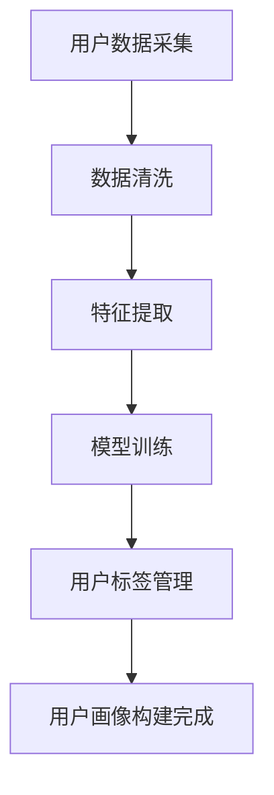
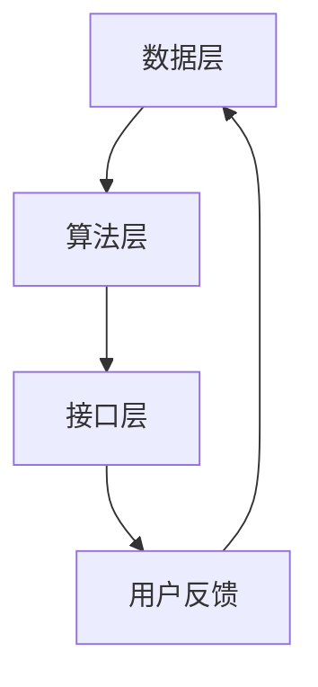
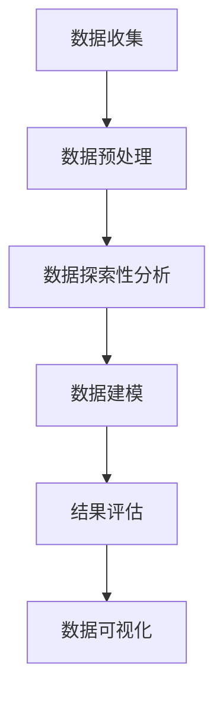
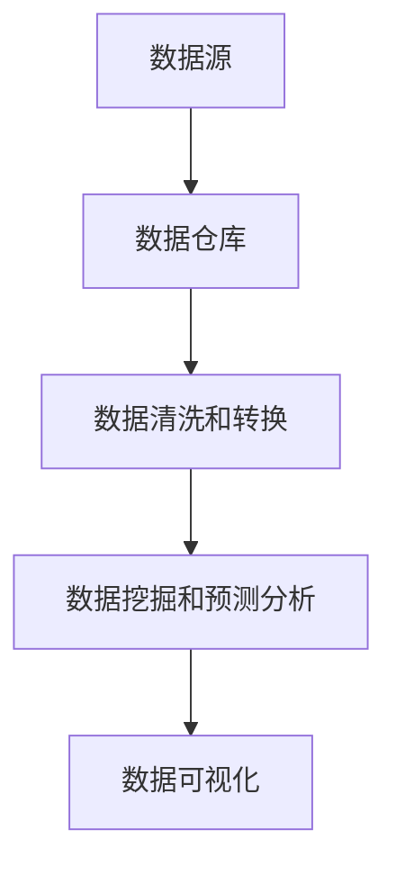

                 

## 文章标题: AI如何帮助电商平台提高市场竞争力

随着科技的飞速发展，人工智能（AI）技术逐渐渗透到各行各业，成为推动产业变革的重要力量。在电子商务领域，AI技术的应用正日益广泛，极大地提升了电商平台的市场竞争力。本文将深入探讨AI在电商平台中的多种应用场景，以及如何通过AI技术实现电商平台的创新和优化，从而在激烈的市场竞争中脱颖而出。

关键词：人工智能，电商平台，市场竞争力，用户行为分析，推荐系统，搜索引擎优化，购物车与支付优化，客户服务，数据分析与决策支持

### 摘要

本文首先介绍了AI与电商平台的基本概念和AI技术的基本原理，包括机器学习、深度学习和自然语言处理等。接着，本文详细探讨了AI在电商平台的具体应用，如用户行为分析、搜索引擎优化、商品推荐系统、购物车与支付优化、客户服务与数据分析等方面。通过具体的实战案例和源代码解读，本文展示了AI技术在实际项目中的落地和效果。最后，本文对AI在电商平台的发展趋势进行了展望，提出了未来创新方向和面临的挑战。

### 目录大纲

1. **第一部分: 了解AI与电商平台**
    1. **第1章: AI与电商平台概述**
        1.1 电商平台的市场背景
        1.2 AI在电商平台的应用现状
        1.3 AI如何提升电商平台的竞争力
    2. **第2章: AI核心概念与架构**
        2.1 机器学习基础
            2.1.1 监督学习
            2.1.2 无监督学习
            2.1.3 强化学习
        2.2 深度学习原理
            2.2.1 神经网络
            2.2.2 深度学习模型
            2.2.3 深度学习框架
    
2. **第二部分: AI在电商平台的实际应用**
    1. **第3章: 用户行为分析**
        3.1 用户画像构建
            3.1.1 用户行为数据采集
            3.1.2 用户画像构建方法
        3.2 用户行为预测
            3.2.1 用户购买行为预测算法
            3.2.2 交叉销售与推荐算法
    2. **第4章: 搜索引擎优化**
        4.1 搜索引擎工作原理
            4.1.1 网络爬虫
            4.1.2 搜索引擎索引
            4.1.3 搜索结果排序算法
        4.2 基于AI的搜索优化策略
            4.2.1 垂直搜索优化
            4.2.2 搜索引擎广告投放策略
    3. **第5章: 商品推荐系统**
        5.1 商品推荐系统概述
            5.1.1 推荐系统架构
            5.1.2 基于内容的推荐
            5.1.3 基于协同过滤的推荐
        5.2 深度学习在推荐系统中的应用
            5.2.1 深度学习模型
            5.2.2 图神经网络在推荐系统中的应用
    4. **第6章: 购物车与支付优化**
        6.1 购物车优化
            6.1.1 购物车数据分析
            6.1.2 购物车流失用户分析
            6.1.3 提高购物车转化率策略
        6.2 支付流程优化
            6.2.1 支付流程设计
            6.2.2 支付安全与防欺诈技术
            6.2.3 支付体验优化
    5. **第7章: 客户服务与售后服务**
        7.1 聊天机器人
            7.1.1 聊天机器人工作原理
            7.1.2 常见问题自动回复
            7.1.3 聊天机器人在电商中的应用
        7.2 客户服务分析
            7.2.1 客户反馈分析
            7.2.2 客户满意度调查
            7.2.3 客户服务优化策略
    6. **第8章: 数据分析与决策支持**
        8.1 数据分析基础
            8.1.1 数据分析流程
            8.1.2 数据可视化工具
            8.1.3 数据挖掘技术
        8.2 商业智能与决策支持
            8.2.1 商业智能系统架构
            8.2.2 决策树算法
            8.2.3 支持向量机算法
    
3. **第三部分: AI在电商平台的项目实战**
    1. **第9章: 项目实战案例**
        9.1 项目背景
            9.1.1 项目概述
            9.1.2 项目目标
            9.1.3 项目实施步骤
        9.2 实际案例解析
            9.2.1 用户行为分析案例
            9.2.2 商品推荐系统案例
            9.2.3 客户服务案例
        9.3 项目效果评估
            9.3.1 数据分析与评估指标
            9.3.2 项目收益分析
    
    2. **第10章: 环境搭建与源代码解读**
        10.1 环境搭建
            10.1.1 Python环境搭建
            10.1.2 数据库环境搭建
            10.1.3 开发工具配置
        10.2 源代码解读
            10.2.1 用户行为分析代码解读
            10.2.2 商品推荐系统代码解读
            10.2.3 聊天机器人代码解读
        10.3 代码分析与优化
            10.3.1 代码性能优化
            10.3.2 代码安全性分析
    
    3. **第11章: 总结与展望**
        11.1 AI在电商平台的未来发展趋势
            11.1.1 人工智能技术的未来发展趋势
            11.1.2 电商平台在AI技术上的创新方向
            11.1.3 电商平台与AI技术融合带来的机遇与挑战
    
    4. **附录**
        1. **附录A: 相关资源与工具**
            1.1 AI开源框架
                1.1.1 TensorFlow
                1.1.2 PyTorch
                1.1.3 Keras
            1.2 数据分析与可视化工具
                1.2.1 Pandas
                1.2.2 Matplotlib
                1.2.3 Seaborn
            1.3 数据库技术
                1.3.1 MySQL
                1.3.2 MongoDB
                1.3.3 Redis
        2. **附录B: 术语表**
            2.1 AI相关术语解释
                2.1.1 机器学习
                2.1.2 深度学习
                2.1.3 强化学习
                2.1.4 自然语言处理
                2.1.5 人工智能
                2.1.6 大数据分析
                2.1.7 人工智能伦理
                2.1.8 人工智能法律

### 第1章: AI与电商平台概述

#### 1.1 电商平台的市场背景

电商平台作为现代商业模式的代表，已经成为全球经济发展的重要驱动力。随着互联网技术的普及，越来越多的消费者倾向于在线购物，电商市场规模不断扩大。根据统计数据显示，全球电商市场规模在近年来呈现出稳步增长的态势，预计到2025年，全球电商市场规模将达到4万亿美元。

电商平台的兴起不仅改变了传统零售业的商业模式，还促进了供应链的优化和物流体系的升级。通过电商平台，消费者可以更方便地购买到全球各地的商品，而商家则能够更高效地推广和销售产品。这一趋势在COVID-19疫情期间尤为显著，由于疫情导致线下零售受到严重冲击，电商成为了消费者购买商品的主要渠道，进一步加速了电商市场的增长。

#### 1.2 AI在电商平台的应用现状

随着AI技术的快速发展，其在电商平台的应用也越来越广泛。AI技术在电商平台中的应用主要集中在用户行为分析、推荐系统、搜索引擎优化、购物车与支付优化、客户服务等方面。

- **用户行为分析**：通过AI技术，电商平台可以对用户行为进行深度分析，了解用户的喜好、购买习惯等，从而进行精准营销。

- **推荐系统**：基于用户行为数据和商品特征，AI技术可以帮助电商平台构建高效的推荐系统，提高用户购物体验和转化率。

- **搜索引擎优化**：AI技术可以提高电商平台的搜索引擎性能，通过智能排序和广告投放策略，提高商品曝光率和销售量。

- **购物车与支付优化**：AI技术可以帮助电商平台优化购物车管理和支付流程，降低购物车流失率和提高支付成功率。

- **客户服务**：通过AI技术，电商平台可以部署智能客服系统，提高客户服务质量，降低服务成本。

#### 1.3 AI如何提升电商平台的竞争力

AI技术的应用不仅提升了电商平台的服务质量和运营效率，还显著增强了其市场竞争力。以下是AI如何提升电商平台竞争力的几个关键方面：

- **用户个性化体验**：通过AI技术，电商平台可以更准确地了解用户需求，提供个性化的商品推荐和营销策略，提高用户满意度和忠诚度。

- **提高销售转化率**：基于AI的用户行为分析和推荐系统，可以帮助电商平台优化广告投放和促销活动，提高销售转化率。

- **降低运营成本**：AI技术在客户服务、购物车管理和支付优化等方面的应用，可以显著降低人力成本和运营成本。

- **提升供应链效率**：通过AI技术的智能仓储和物流优化，电商平台可以更高效地管理供应链，提高物流速度和服务质量。

- **数据驱动决策**：基于大数据和AI分析，电商平台可以更准确地预测市场趋势和消费者行为，做出更加科学的决策。

总的来说，AI技术在电商平台的应用，不仅提升了电商平台的核心竞争力，还为电商行业的未来发展提供了新的方向和可能性。在接下来的章节中，我们将进一步探讨AI技术的核心概念和应用场景，以帮助读者更好地理解其在电商平台中的应用价值和实现方式。

### 第2章: AI核心概念与架构

#### 2.1 机器学习基础

机器学习是人工智能（AI）的核心技术之一，它使计算机系统能够从数据中学习并做出预测或决策。理解机器学习的基础是掌握监督学习、无监督学习和强化学习这三种基本学习模式。

##### 2.1.1 监督学习

监督学习是最常见的机器学习模式，它需要输入数据集（特征和标签）来训练模型。特征是输入数据的一部分，标签是输入数据对应的输出结果。通过分析这些数据，监督学习算法可以学习到特征和标签之间的关系，从而在新数据上进行预测。

**示例：** 假设我们有一个房价预测的模型，输入数据是房屋的面积、卧室数量和地段等特征，输出数据是房价。通过大量房屋销售数据的训练，监督学习算法可以学会如何预测新房屋的价格。

**伪代码：**

```python
# 输入数据
X = [[面积, 卧室数量, 地段], ...]
y = [房价, ...]

# 训练模型
model = 监督学习算法(X, y)

# 预测新数据
预测房价 = model.predict([新面积, 新卧室数量, 新地段])
```

##### 2.1.2 无监督学习

无监督学习不使用标签进行训练，主要目的是发现数据中的隐含结构和模式。无监督学习包括聚类、降维和关联规则挖掘等算法。

**示例：** 假设我们对一组用户进行聚类分析，输入数据是用户的浏览历史、购物习惯等特征，输出是用户群体。无监督学习算法可以帮助我们识别具有相似行为模式的用户群体，从而进行精准营销。

**伪代码：**

```python
# 输入数据
X = [[浏览历史, 购物习惯], ...]

# 训练模型
model = 无监督学习算法(X)

# 输出用户群体
用户群体 = model.cluster()
```

##### 2.1.3 强化学习

强化学习是一种通过奖励和惩罚来训练智能体（通常是一个模型）的机器学习模式。强化学习的主要目标是使智能体能够在特定的环境中做出最佳决策，以最大化累积奖励。

**示例：** 假设我们训练一个自动驾驶模型，输入数据是环境传感器信息，输出是驾驶指令。通过在模拟环境中训练，模型可以学会如何避免障碍物、遵守交通规则，并在不同情境下做出最佳驾驶决策。

**伪代码：**

```python
# 初始化环境
环境 = 初始化环境()

# 训练模型
智能体 = 强化学习算法()
while not 终止条件：
    状态 = 环境.observe()
    动作 = 智能体.choose_action(状态)
    下一个状态，奖励 = 环境.step(动作)
    智能体.learn(状态，动作，下一个状态，奖励)

# 测试模型
环境 = 初始化环境()
智能体 = 智能体.load()
while not 终止条件：
    状态 = 环境.observe()
    动作 = 智能体.choose_action(状态)
    下一个状态，奖励 = 环境.step(动作)
```

##### 2.2 深度学习原理

深度学习是机器学习的子领域，其核心思想是通过多层次的神经网络（通常称为深度神经网络）来提取和表示数据中的特征。深度学习模型在图像识别、自然语言处理和语音识别等领域取得了显著成果。

###### 2.2.1 神经网络

神经网络是由大量简单的计算单元（称为神经元）组成的复杂网络。每个神经元都接收多个输入信号，通过加权求和处理后产生一个输出信号。神经网络通过不断调整权重和偏置来学习输入数据与输出结果之间的关系。

**示例：** 假设我们有一个简单的神经网络模型，它包含输入层、隐藏层和输出层。输入层接收用户行为数据，隐藏层通过多层非线性变换提取特征，输出层生成用户购买预测。

**伪代码：**

```python
# 输入数据
inputs = [用户行为数据，...]
weights = [输入层到隐藏层的权重，...]
biases = [隐藏层偏置，...]

# 隐藏层激活函数
激活函数 = Sigmoid函数

# 预测用户购买
隐藏层输出 = 激活函数(∑(权重*输入) + 偏置)
输出层输出 = 激活函数(∑(权重*隐藏层输出) + 偏置)
购买预测 = 输出层输出
```

###### 2.2.2 深度学习模型

深度学习模型包括卷积神经网络（CNN）、循环神经网络（RNN）和生成对抗网络（GAN）等，每种模型都有其特定的应用场景和优势。

- **卷积神经网络（CNN）**：主要用于图像识别和计算机视觉任务，能够自动提取图像中的特征。
  
- **循环神经网络（RNN）**：适用于序列数据，如自然语言处理和语音识别，能够处理变量长度的序列。
  
- **生成对抗网络（GAN）**：用于生成数据，如生成虚拟图像和音乐，能够在无监督学习中生成高质量的数据。

**示例：** 假设我们使用CNN来构建一个商品推荐系统，输入数据是商品的图像，输出是商品的推荐标签。

**伪代码：**

```python
# 输入数据
images = [商品图像，...]

# 卷积层
卷积层1 = 卷积神经网络(图像)

# 池化层
池化层1 = 池化层(卷积层1的输出)

# 全连接层
全连接层 = 全连接神经网络(池化层1的输出)

# 输出层
输出层 = 激活函数(全连接层输出)

# 商品推荐
推荐标签 = 输出层输出
```

###### 2.2.3 深度学习框架

深度学习框架如TensorFlow、PyTorch和Keras等，提供了高效且易用的工具，帮助开发者构建和训练深度学习模型。

- **TensorFlow**：由Google开发，是当前最流行的深度学习框架之一，支持多种硬件平台的部署。
  
- **PyTorch**：由Facebook开发，以其动态计算图和易用性而受到开发者青睐。
  
- **Keras**：是一个基于TensorFlow和PyTorch的高级神经网络API，简化了深度学习模型的构建和训练过程。

**示例：** 假设我们使用TensorFlow来构建一个用户行为分析模型。

**伪代码：**

```python
import tensorflow as tf

# 定义模型
model = tf.keras.Sequential([
    tf.keras.layers.Dense(units=128, activation='relu', input_shape=(num_features,)),
    tf.keras.layers.Dense(units=64, activation='relu'),
    tf.keras.layers.Dense(units=1, activation='sigmoid')
])

# 编译模型
model.compile(optimizer='adam', loss='binary_crossentropy', metrics=['accuracy'])

# 训练模型
model.fit(X_train, y_train, epochs=10, batch_size=32)
```

通过上述内容，我们可以看到AI的核心概念和架构是如何构建的，这些基础知识和工具为后续章节中AI在电商平台具体应用提供了理论支持。接下来，我们将深入探讨AI在电商平台中的实际应用场景，以了解AI如何提升电商平台的市场竞争力。

### 第3章: 用户行为分析

用户行为分析是电商平台利用AI技术提升用户体验和销售转化率的关键环节。通过深入分析用户的行为数据，电商平台可以更好地理解用户需求，实现个性化推荐和精准营销。以下是用户行为分析的详细内容：

#### 3.1 用户画像构建

用户画像是指通过收集和分析用户数据，构建一个包含用户基本特征、兴趣偏好和购买行为的综合模型。构建用户画像需要以下步骤：

1. **用户数据采集**：通过网站日志、用户反馈、购买记录等多种渠道收集用户数据。

2. **数据清洗**：对采集到的数据进行清洗，去除重复、无效和不完整的数据。

3. **特征提取**：从原始数据中提取有价值的特征，如用户年龄、性别、地理位置、浏览历史、购买频次等。

4. **模型训练**：使用机器学习和深度学习算法，训练用户画像模型，将特征转换为用户标签。

5. **用户标签管理**：对用户标签进行分类和管理，以便后续分析和应用。

**Mermaid流程图：**



#### 3.1.1 用户行为数据采集

用户行为数据采集是构建用户画像的基础。电商平台可以通过以下方法收集用户数据：

- **网站日志**：通过Web服务器日志记录用户访问网站的行为，如页面访问次数、停留时间、跳出率等。

- **前端埋点**：在网站的各个页面嵌入代码，记录用户的点击、滚动、输入等行为。

- **用户反馈**：通过问卷调查、在线评论、用户反馈等渠道获取用户的主观感受和需求。

- **购买记录**：收集用户的购买历史数据，包括购买时间、商品种类、价格等。

**伪代码：**

```python
# 采集用户数据
user_data = {
    '访问日志': [],
    '埋点数据': [],
    '反馈数据': [],
    '购买记录': []
}

# 数据清洗
def clean_data(data):
    cleaned_data = []
    for record in data:
        if is_valid(record):
            cleaned_data.append(record)
    return cleaned_data

# 特征提取
def extract_features(data):
    features = []
    for record in data:
        feature_vector = create_feature_vector(record)
        features.append(feature_vector)
    return features

# 用户画像模型训练
model = UserBehaviorModel()
model.fit(extracted_features)
```

#### 3.1.2 用户画像构建方法

用户画像构建方法包括以下几个步骤：

1. **数据预处理**：对采集到的用户行为数据进行预处理，包括数据清洗、去重和标准化等。

2. **特征选择**：从预处理后的数据中选取对用户行为有显著影响的关键特征。

3. **模型训练**：使用机器学习算法（如聚类、分类、回归等）训练用户画像模型，将特征映射到用户标签。

4. **模型评估**：通过交叉验证和评估指标（如准确率、召回率等）评估模型的性能。

5. **用户标签应用**：将训练好的模型应用于新数据，为用户生成标签。

**伪代码：**

```python
# 数据预处理
preprocessed_data = clean_data(raw_data)

# 特征选择
selected_features = select_features(preprocessed_data)

# 模型训练
user_model = ClusterModel()
user_model.fit(selected_features)

# 模型评估
evaluation_results = user_model.evaluate(test_data)

# 用户标签应用
new_user_data = generate_user_tags(user_model, new_user_features)
```

#### 3.2 用户行为预测

用户行为预测是基于用户画像模型，对用户的未来行为进行预测。通过用户行为预测，电商平台可以实现以下目标：

- **精准推荐**：根据用户的购买历史和偏好，推荐用户可能感兴趣的商品。

- **流失预警**：预测哪些用户可能流失，采取相应的挽留措施。

- **促销策略**：根据用户行为预测，制定更有效的促销策略。

- **个性化营销**：为不同用户群体提供个性化的营销内容和活动。

##### 3.2.1 用户购买行为预测算法

用户购买行为预测算法通常采用机器学习中的分类算法，如逻辑回归、决策树、随机森林和支持向量机等。以下是逻辑回归算法的伪代码示例：

```python
# 输入数据
X_train = [[用户特征1, 用户特征2, ..., 用户特征n], ...]
y_train = [购买标签, ...]

# 训练模型
model = LogisticRegression()
model.fit(X_train, y_train)

# 预测新数据
X_new = [[新用户特征1, 新用户特征2, ..., 新用户特征n], ...]
predictions = model.predict(X_new)
```

##### 3.2.2 交叉销售与推荐算法

交叉销售与推荐算法是通过分析用户的行为数据和商品特征，为用户推荐相关的商品。常用的推荐算法包括基于内容的推荐和基于协同过滤的推荐。

- **基于内容的推荐**：根据商品的属性和用户的偏好进行推荐。

**伪代码：**

```python
# 输入数据
item_features = [[商品特征1, 商品特征2, ..., 商品特征n], ...]
user_preferences = [[用户特征1, 用户特征2, ..., 用户特征n], ...]

# 计算商品和用户特征相似度
similarity_matrix = compute_similarity(item_features, user_preferences)

# 推荐商品
recommended_items = find_top_k_similar_items(similarity_matrix, user_preferences, k=5)
```

- **基于协同过滤的推荐**：根据用户的历史行为和相似用户的行为进行推荐。

**伪代码：**

```python
# 输入数据
ratings_matrix = [[用户1评分, 用户2评分, ..., 用户n评分], ...]

# 计算用户相似度
user_similarity_matrix = compute_user_similarity(ratings_matrix)

# 推荐商品
recommended_items = find_top_k_similar_users(ratings_matrix, user_similarity_matrix, user_id, k=5)
```

通过用户行为分析和预测，电商平台可以更好地理解用户需求，提供个性化的服务和产品推荐，从而提高用户满意度和转化率。在接下来的章节中，我们将进一步探讨AI在电商平台的其他实际应用，如搜索引擎优化、商品推荐系统和购物车与支付优化等。

### 第4章: 搜索引擎优化

搜索引擎优化（SEO）是电商平台提升网站流量和用户转化率的重要手段。通过优化搜索引擎的排名和用户体验，电商平台可以显著提高商品的曝光率和销售量。以下内容将详细介绍搜索引擎的工作原理、优化策略及AI在SEO中的应用。

#### 4.1 搜索引擎工作原理

搜索引擎的工作原理主要包括三个主要阶段：爬虫、索引和排名。

##### 4.1.1 网络爬虫

网络爬虫是搜索引擎获取网站内容的关键工具。爬虫通过访问网站的URL，抓取网页上的文本、图片、链接等信息，并将其存储到搜索引擎的数据库中。

- **爬虫类型**：根据爬取策略的不同，爬虫可以分为深度爬虫、广度爬虫和混合爬虫。
  
- **爬虫工作流程**：爬虫首先从种子URL开始，依次访问页面中的链接，收集新的URL，并存储到待爬取队列中。爬取过程中，爬虫会解析HTML、CSS和JavaScript代码，提取有用信息，如标题、关键词、描述等。

**伪代码：**

```python
# 初始化爬虫
crawler = Crawler(seed_url)

# 爬取网页
while not 队列空：
    url = 队列获取URL()
    网页内容 = 爬虫访问(url)
    提取链接并加入队列
    提取文本内容并存储到数据库

# 存储数据
存储网页内容到搜索引擎数据库
```

##### 4.1.2 搜索引擎索引

搜索引擎索引是存储网页内容和关键词的数据库。通过索引，搜索引擎可以快速定位用户查询的相关网页。

- **索引结构**：索引通常采用倒排索引结构，将网页内容映射到关键词的倒排列表，以便快速检索。

- **索引更新**：搜索引擎会定期更新索引，以保持数据的最新和完整。

**伪代码：**

```python
# 创建索引
index = create_inverted_index()

# 添加网页到索引
def add_to_index(url, content):
    keywords = extract_keywords(content)
    for keyword in keywords:
        index[keyword].append(url)

# 更新索引
def update_index(index, new_content):
    for keyword in new_content:
        if keyword not in index:
            index[keyword] = []
        index[keyword].append(new_content)
```

##### 4.1.3 搜索结果排序算法

搜索结果排序算法是决定用户查询结果展示顺序的关键因素。搜索引擎会根据多种因素对搜索结果进行排序，如关键词匹配度、网页质量、用户行为等。

- **传统排序算法**：如基于逆文档频率（IDF）和词频（TF）的排序算法。

- **机器学习排序算法**：如基于用户历史行为和偏好进行排序的个性化排序算法。

**伪代码：**

```python
# 输入数据
search_query = "手机"
web_pages = []

# 检索索引
def search_index(index, query):
    candidate_pages = index[query]
    return candidate_pages

# 计算网页得分
def calculate_page_score(page, query):
    score = 0
    for keyword in query:
        if keyword in page:
            score += calculate_keyword_score(keyword, page)
    return score

# 排序搜索结果
sorted_pages = sort_by_score(web_pages, search_query)
```

#### 4.2 基于AI的搜索优化策略

随着AI技术的发展，搜索引擎优化策略也在不断演进。AI技术可以大幅提升搜索引擎的智能化水平和用户体验。

##### 4.2.1 垂直搜索优化

垂直搜索优化是指针对特定领域或主题的搜索需求进行优化，以提供更精准的搜索结果。通过AI技术，电商平台可以构建垂直搜索引擎，提高用户搜索的满意度。

- **领域知识表示**：使用自然语言处理和知识图谱技术，构建特定领域的知识库和关系网络。

- **搜索结果排序**：结合用户历史行为和领域知识，优化搜索结果的排序策略。

**伪代码：**

```python
# 构建领域知识库
knowledge_base = build_knowledge_base(领域数据)

# 垂直搜索
def vertical_search(query, knowledge_base):
    related_entities = find_related_entities(query, knowledge_base)
    sorted_entities = sort_by_relevance(related_entities, query)
    return sorted_entities
```

##### 4.2.2 搜索引擎广告投放策略

搜索引擎广告投放是电商平台获取流量和收入的重要渠道。AI技术可以帮助电商平台实现智能广告投放，提高广告效果。

- **广告投放优化**：基于用户行为和搜索意图，动态调整广告投放策略，优化广告展示和点击率。

- **广告效果评估**：使用机器学习算法，评估广告投放的效果，调整广告预算和投放策略。

**伪代码：**

```python
# 广告投放优化
def optimize_advertising预算，用户行为数据，搜索意图数据：
    ad_campaigns = generate_ad_campaigns(广告内容，用户行为数据，搜索意图数据)
    optimized_campaigns = select_best_campaigns(ad_campaigns, budget)
    return optimized_campaigns

# 广告效果评估
def evaluate_ad_performance(ad_data，用户反馈数据）：
    performance_scores = calculate_performance_scores(ad_data，用户反馈数据）
    best_ads = select_best_ads(performance_scores）
    return best_ads
```

通过AI技术的应用，电商平台可以实现搜索引擎的智能化优化，提高搜索结果的准确性和用户体验，从而在市场竞争中取得优势。接下来，我们将继续探讨AI技术在商品推荐系统、购物车与支付优化、客户服务与数据分析等方面的应用，进一步展示AI如何提升电商平台的综合竞争力。

### 第5章: 商品推荐系统

商品推荐系统是电商平台提升用户体验和销售转化率的重要工具。通过智能推荐，平台能够向用户展示他们可能感兴趣的商品，从而增加购买机会。以下是商品推荐系统的概述、架构和深度学习模型的应用。

#### 5.1 商品推荐系统概述

商品推荐系统旨在根据用户的历史行为、偏好和上下文信息，为用户提供个性化的商品推荐。推荐系统可以大幅提升用户的购物体验，增加平台的用户粘性和销售额。

##### 5.1.1 推荐系统架构

推荐系统通常由数据层、算法层和接口层组成。

- **数据层**：负责收集、存储和管理用户行为数据和商品数据。这些数据包括用户浏览记录、购买记录、评价记录等。

- **算法层**：负责根据数据层提供的数据，通过算法生成推荐结果。常见的算法包括基于内容的推荐和基于协同过滤的推荐。

- **接口层**：负责将算法层的推荐结果展示给用户，并提供用户反馈的接口。

**Mermaid流程图：**



##### 5.1.2 基于内容的推荐

基于内容的推荐通过分析商品的特征和用户的偏好，为用户推荐相似的商品。这种方法通常需要以下步骤：

1. **商品特征提取**：提取商品的关键特征，如商品类别、品牌、价格、用户评价等。

2. **用户偏好建模**：根据用户的历史行为和反馈，构建用户的偏好模型。

3. **相似性计算**：计算商品特征和用户偏好的相似性，为用户推荐相似的商品。

**伪代码：**

```python
# 提取商品特征
def extract_item_features(item):
    features = {
        'category': item['category'],
        'brand': item['brand'],
        'price': item['price'],
        'ratings': item['ratings']
    }
    return features

# 构建用户偏好模型
def build_user_preference_model(user_behavior_data):
    preference_model = {}
    for behavior in user_behavior_data:
        preference_model[behavior['item_id']] = behavior['rating']
    return preference_model

# 计算相似性
def calculate_similarity(features1, features2):
    similarity_score = 0
    for feature in features1:
        if feature in features2:
            similarity_score += 1
    return similarity_score / len(features1)

# 推荐商品
def content_based_recommendation(user_preference_model, all_item_features):
    recommended_items = []
    for item_features in all_item_features:
        similarity_score = calculate_similarity(user_preference_model, item_features)
        recommended_items.append((item_features['item_id'], similarity_score))
    recommended_items.sort(key=lambda x: x[1], reverse=True)
    return [item_id for item_id, _ in recommended_items[:k]]
```

##### 5.1.3 基于协同过滤的推荐

基于协同过滤的推荐通过分析用户之间的相似性，为用户推荐其他用户喜欢但尚未体验过的商品。这种方法通常分为两种：基于用户的协同过滤和基于项目的协同过滤。

- **基于用户的协同过滤**：找到与目标用户相似的其他用户，推荐这些用户喜欢的商品。

**伪代码：**

```python
# 计算用户相似性
def calculate_user_similarity(user_behavior_data, user_id, other_user_id):
    ratings = user_behavior_data[user_id] + user_behavior_data[other_user_id]
    common_ratings = [rating for rating in ratings if rating['item_id'] == item_id]
    similarity_score = sum([rating['rating'] * rating['rating'] for rating in common_ratings]) / len(common_ratings)
    return similarity_score

# 推荐商品
def user_based_collaborative_filtering(user_behavior_data, user_id):
    recommended_items = []
    for other_user_id in user_behavior_data:
        if other_user_id != user_id:
            similarity_score = calculate_user_similarity(user_behavior_data, user_id, other_user_id)
            for rating in user_behavior_data[other_user_id]:
                if rating['item_id'] not in user_behavior_data[user_id]:
                    recommended_items.append(rating['item_id'])
    recommended_items.sort(key=lambda x: -user_behavior_data[user_id][x]['rating'])
    return recommended_items[:k]
```

- **基于项目的协同过滤**：找到与目标用户喜欢的商品相似的其他商品。

**伪代码：**

```python
# 计算项目相似性
def calculate_item_similarity(user_behavior_data, item_id1, item_id2):
    user1_ratings = [rating['rating'] for rating in user_behavior_data if rating['item_id'] == item_id1]
    user2_ratings = [rating['rating'] for rating in user_behavior_data if rating['item_id'] == item_id2]
    similarity_score = sum([user1 * user2 for user1, user2 in zip(user1_ratings, user2_ratings)]) / len(user1_ratings)
    return similarity_score

# 推荐商品
def item_based_collaborative_filtering(user_behavior_data, user_id):
    rated_items = [rating['item_id'] for rating in user_behavior_data[user_id]]
    recommended_items = []
    for item_id in user_behavior_data:
        if item_id not in rated_items:
            similarity_scores = {other_item_id: calculate_item_similarity(user_behavior_data, item_id1, other_item_id) for other_item_id in user_behavior_data if other_item_id != item_id1}
            for other_item_id, score in similarity_scores.items():
                recommended_items.append((other_item_id, score))
    recommended_items.sort(key=lambda x: x[1], reverse=True)
    return [item_id for item_id, _ in recommended_items[:k]]
```

#### 5.2 深度学习在推荐系统中的应用

深度学习模型在推荐系统中的应用，可以进一步提升推荐的准确性和个性化程度。以下介绍几种常用的深度学习模型及其在推荐系统中的应用。

##### 5.2.1 深度学习模型

- **用户嵌入模型（User Embedding Model）**：将用户特征映射到低维度的向量空间，用于计算用户之间的相似性。

- **商品嵌入模型（Item Embedding Model）**：将商品特征映射到低维度的向量空间，用于计算商品之间的相似性。

- **混合模型（Hybrid Model）**：结合用户和商品嵌入模型，通过多任务学习进行推荐。

**伪代码：**

```python
# 用户嵌入模型
def user_embedding_model(user_features, embedding_size):
    user_embedding = neural_network(user_features, embedding_size)
    return user_embedding

# 商品嵌入模型
def item_embedding_model(item_features, embedding_size):
    item_embedding = neural_network(item_features, embedding_size)
    return item_embedding

# 混合模型
def hybrid_model(user_embedding, item_embedding, k):
    user_similarity_matrix = compute_similarity(user_embedding)
    item_similarity_matrix = compute_similarity(item_embedding)
    recommended_items = []
    for user_id in user_embedding:
        user_vector = user_embedding[user_id]
        recommended_items += find_top_k_similar_items(item_similarity_matrix, user_vector, k)
    return recommended_items
```

##### 5.2.2 图神经网络在推荐系统中的应用

图神经网络（Graph Neural Network, GNN）是一种专门处理图结构数据的深度学习模型，可以有效地捕捉商品和用户之间的复杂关系。

- **图构建**：将用户和商品映射到图中的节点，用户之间的交互和商品之间的关联映射到图中的边。

- **模型训练**：使用图神经网络学习节点嵌入向量，并预测节点之间的交互。

- **推荐**：通过计算用户和商品之间的相似性，为用户推荐相关的商品。

**伪代码：**

```python
# 图构建
def build_graph(users, items, interactions):
    user_nodes = {user_id: [] for user_id in users}
    item_nodes = {item_id: [] for item_id in items}
    for interaction in interactions:
        user_nodes[interaction['user_id']].append(interaction['item_id'])
        item_nodes[interaction['item_id']].append(interaction['user_id'])
    return user_nodes, item_nodes

# 图神经网络
def graph_neural_network(graph, embedding_size):
    user_embeddings = []
    item_embeddings = []
    for user_id in graph['users']:
        user_embedding = neural_network(graph['users'][user_id], embedding_size)
        user_embeddings.append(user_embedding)
    for item_id in graph['items']:
        item_embedding = neural_network(graph['items'][item_id], embedding_size)
        item_embeddings.append(item_embedding)
    return user_embeddings, item_embeddings

# 推荐商品
def graph_neural_network_recommendation(graph, user_id, embedding_size, k):
    user_embeddings, item_embeddings = graph_neural_network(graph, embedding_size)
    user_vector = user_embeddings[user_id]
    recommended_items = find_top_k_similar_items(item_embeddings, user_vector, k)
    return recommended_items
```

通过深度学习和图神经网络，商品推荐系统可以更准确地捕捉用户偏好和商品特征，从而提高推荐效果和用户满意度。在接下来的章节中，我们将继续探讨AI在购物车与支付优化、客户服务与数据分析等方面的应用，进一步展示AI如何提升电商平台的综合竞争力。

### 第6章: 购物车与支付优化

购物车与支付优化是电商平台提升用户体验和转化率的关键环节。通过优化购物车和支付流程，电商平台可以提高用户的购物体验，降低购物车流失率，并提高支付成功率。以下是购物车与支付优化的详细内容。

#### 6.1 购物车优化

购物车是电商平台的一个重要功能，它允许用户在购买商品前临时存储商品。优化购物车可以提高用户的购物体验，降低购物车流失率。

##### 6.1.1 购物车数据分析

购物车数据分析是购物车优化的第一步。通过分析用户在购物车中的行为数据，电商平台可以了解用户的购物习惯和偏好，从而进行优化。

- **购物车页面浏览量**：分析用户在购物车页面的停留时间、跳出率等指标，了解用户在购物车页面上的行为模式。

- **购物车添加与删除行为**：分析用户添加和删除商品的原因，识别导致购物车流失的关键因素。

- **购物车内容分析**：分析购物车中的商品种类、数量、价格分布等，了解用户的购买决策过程。

**伪代码：**

```python
# 购物车数据分析
def analyze_cart_data(cart_data):
    cart_pages = cart_data['cart_pages']
    add_actions = cart_data['add_actions']
    remove_actions = cart_data['remove_actions']
    cart_contents = cart_data['cart_contents']

    # 页面浏览量分析
    page_views = count_pages(cart_pages)

    # 添加与删除行为分析
    add_reasons = count_add_actions(add_actions)
    remove_reasons = count_remove_actions(remove_actions)

    # 购物车内容分析
    category_distribution = count_categories(cart_contents)
    price_distribution = count_prices(cart_contents)

    return {
        'page_views': page_views,
        'add_actions': add_actions,
        'remove_actions': remove_actions,
        'cart_contents': cart_contents,
        'category_distribution': category_distribution,
        'price_distribution': price_distribution
    }
```

##### 6.1.2 购物车流失用户分析

购物车流失用户分析是识别导致购物车流失的关键因素。通过分析流失用户的行为数据，电商平台可以制定针对性的优化策略。

- **流失时间分析**：分析用户在购物车中停留的时间，识别购物车流失的关键时间点。

- **流失原因分析**：分析用户放弃购物车的原因，如商品价格、物流费用、支付方式等。

- **用户画像分析**：结合用户画像数据，识别流失用户的特征和偏好。

**伪代码：**

```python
# 购物车流失用户分析
def analyze_cart_abandonment(cart_data, user_data):
    abandonment_users = filter_users(cart_data['abandoned_carts'], user_data)
    abandonment_reasons = count_abandonment_reasons(abandonment_users)
    abandonment_time_distribution = count_abandonment_time(abandonment_users)

    return {
        'abandonment_users': abandonment_users,
        'abandonment_reasons': abandonment_reasons,
        'abandonment_time_distribution': abandonment_time_distribution
    }
```

##### 6.1.3 提高购物车转化率策略

基于购物车数据分析和流失用户分析，电商平台可以制定一系列策略来提高购物车转化率。

- **个性化推荐**：根据用户的购物车内容和历史行为，推荐相关商品，增加用户购买的可能性。

- **优惠券和促销活动**：为购物车中的商品提供个性化的优惠券和促销活动，鼓励用户下单。

- **简化购物流程**：简化购物车页面和结算页面的设计，减少用户的操作步骤，提高购物体验。

- **优化支付方式**：提供多种支付方式，包括快捷支付、分期付款等，降低用户支付的门槛。

**伪代码：**

```python
# 提高购物车转化率策略
def optimize_cart_conversion(cart_data, user_data):
    recommendations = generate_personalized_recommendations(cart_data, user_data)
    discounts = generate_personalized_discounts(cart_data, user_data)
    simplified_cart = simplify_cart_interface(cart_data)
    multiple_payment_methods = enable_multiple_payment_methods()

    return {
        'recommendations': recommendations,
        'discounts': discounts,
        'simplified_cart': simplified_cart,
        'payment_methods': multiple_payment_methods
    }
```

#### 6.2 支付流程优化

支付流程优化是提高支付成功率和用户体验的重要环节。通过优化支付流程，电商平台可以减少用户流失，提高支付转化率。

##### 6.2.1 支付流程设计

支付流程设计应考虑用户的支付习惯和体验，包括支付页面设计、支付方式选择和支付过程管理等。

- **支付页面设计**：设计简洁、直观的支付页面，减少用户操作步骤，提高支付成功率。

- **支付方式选择**：提供多种支付方式，如银行卡支付、支付宝、微信支付等，满足不同用户的需求。

- **支付过程管理**：确保支付过程安全、快速，提供支付进度提示和错误处理机制。

**伪代码：**

```python
# 支付流程设计
def design_payment_flow():
    payment_page = create_payment_page()
    payment_methods = enable_payment_methods()
    payment_process = manage_payment_process()

    return {
        'payment_page': payment_page,
        'payment_methods': payment_methods,
        'payment_process': payment_process
    }
```

##### 6.2.2 支付安全与防欺诈技术

支付安全与防欺诈技术是保护用户支付信息的关键。通过以下技术手段，电商平台可以提高支付安全性：

- **加密技术**：使用SSL加密技术，确保用户支付信息在传输过程中的安全性。

- **身份验证**：通过验证码、指纹识别、人脸识别等技术，确保用户身份的合法性。

- **风险控制**：通过监控支付行为，识别和阻止可疑支付交易。

**伪代码：**

```python
# 支付安全与防欺诈技术
def secure_payment_process():
    encrypt_data = enable_ssl_encryption()
    verify_identity = enable_two_factor_authentication()
    control_risk = implement_risk_management_system()

    return {
        'encryption': encrypt_data,
        'identity_verification': verify_identity,
        'risk_control': control_risk
    }
```

##### 6.2.3 支付体验优化

支付体验优化是提高用户支付满意度和忠诚度的关键。以下策略可以帮助电商平台优化支付体验：

- **快速支付**：优化支付流程，减少用户等待时间，提高支付速度。

- **支付提示**：提供支付成功和支付失败的提示信息，确保用户了解支付结果。

- **支付优惠**：提供支付优惠和促销活动，鼓励用户进行支付。

**伪代码：**

```python
# 支付体验优化
def optimize_payment_experience():
    quick_payment = enable_one_click_payment()
    payment_notifications = send_payment_notifications()
    payment_discounts = provide_payment_discounts()

    return {
        'quick_payment': quick_payment,
        'payment_notifications': payment_notifications,
        'payment_discounts': payment_discounts
    }
```

通过购物车与支付优化，电商平台可以提供更优质的购物体验，提高用户满意度和转化率。在接下来的章节中，我们将继续探讨AI在客户服务与数据分析等方面的应用，进一步展示AI如何提升电商平台的综合竞争力。

### 第7章: 客户服务与售后服务

在电子商务领域，客户服务与售后服务是提升用户满意度和品牌忠诚度的重要环节。通过AI技术，电商平台可以实现智能客服、客户反馈分析和客户满意度调查等，提高服务质量，降低服务成本。以下是客户服务与售后服务的详细探讨。

#### 7.1 聊天机器人

聊天机器人（Chatbot）是AI技术在客户服务中的一项重要应用，能够提供24/7全天候的在线服务，解答用户常见问题，减轻人工客服的工作负担。

##### 7.1.1 聊天机器人工作原理

聊天机器人通过自然语言处理（NLP）技术，与用户进行自然语言交互。其工作原理主要包括以下几个步骤：

1. **文本预处理**：对用户输入的文本进行分词、词性标注、停用词过滤等处理，以便更好地理解用户意图。

2. **意图识别**：使用机器学习算法，识别用户的意图，如查询商品信息、咨询售后服务等。

3. **实体识别**：识别用户输入中的关键信息，如商品名称、数量、联系方式等。

4. **回复生成**：根据用户的意图和识别出的实体，生成合适的回复文本。

5. **回复发送**：将生成的回复文本发送给用户。

**伪代码：**

```python
# 文本预处理
preprocessed_text = preprocess_text(user_input)

# 意图识别
user_intent = intent_recognition(preprocessed_text)

# 实体识别
entities = entity_recognition(preprocessed_text)

# 回复生成
response = generate_response(user_intent, entities)

# 回复发送
send_response(response)
```

##### 7.1.2 常见问题自动回复

为了提高聊天机器人的响应速度，可以预设一些常见问题的自动回复，当用户输入与这些问题相关的内容时，聊天机器人自动给出相应的回复。

- **商品查询**：当用户询问商品名称、价格、库存等信息时，聊天机器人可以自动提供商品详情。

- **售后服务**：当用户咨询退换货政策、维修服务等问题时，聊天机器人可以提供相关的服务流程和联系方式。

- **账号问题**：当用户询问账号登录、密码找回等问题时，聊天机器人可以自动引导用户完成操作。

**伪代码：**

```python
# 常见问题自动回复
def auto_response(intent, entities):
    if intent == 'query_goods':
        return "您好，以下是您查询的商品详情：[商品名称]，价格为[价格]，库存[库存量]。"
    elif intent == 'after_sales_service':
        return "您好，关于售后服务，您可以按照以下步骤操作：[步骤1]，[步骤2]，[步骤3]。"
    elif intent == 'account_question':
        return "您好，找回密码请按照以下步骤操作：[步骤1]，[步骤2]，[步骤3]。"
    else:
        return "很抱歉，我不太明白您的问题，请您提供更多信息。"

# 示例
response = auto_response(user_intent, user_entities)
send_response(response)
```

##### 7.1.3 聊天机器人在电商中的应用

聊天机器人在电商中的应用非常广泛，可以提高客服效率和用户体验。以下是一些应用场景：

- **在线咨询**：为用户提供即时在线咨询服务，解答用户关于商品、订单、支付等方面的问题。

- **订单跟踪**：通过聊天机器人，用户可以方便地查询订单状态，了解物流信息。

- **促销活动**：通过聊天机器人宣传电商平台的活动和优惠信息，吸引更多用户参与。

- **客户维护**：通过聊天机器人与用户保持互动，提供个性化服务，提升用户忠诚度。

**伪代码：**

```python
# 在线咨询
def online_consultation(user_input):
    preprocessed_text = preprocess_text(user_input)
    user_intent = intent_recognition(preprocessed_text)
    response = generate_response(user_intent, preprocessed_text)
    send_response(response)

# 订单跟踪
def track_order(order_id):
    order_info = get_order_info(order_id)
    response = f"您的订单号{order_id}当前状态为：{order_info['status']}。"
    send_response(response)

# 促销活动
def promotional_activity():
    promotions = get_promotions()
    response = f"【促销活动】欢迎参加我们的活动：[活动名称]，优惠多多，快来参与吧！"
    send_response(response)

# 客户维护
def customer_maintenance(user_id):
    user_profile = get_user_profile(user_id)
    if user_profile['last_purchase_time'] > days_ago(30):
        response = f"亲爱的用户，感谢您对我们的支持，请您留意我们的最新活动：[活动名称]。"
    else:
        response = f"亲爱的用户，您的购买周期较长，我们为您准备了专属优惠，快来体验吧！"
    send_response(response)
```

#### 7.2 客户服务分析

客户服务分析是通过数据分析技术，对用户反馈、投诉和服务记录等进行分析，以识别客户服务的痛点和改进方向。

##### 7.2.1 客户反馈分析

客户反馈分析可以帮助电商平台了解用户的真实需求和不满，从而改进产品和服务。以下方法可以用于客户反馈分析：

- **文本分析**：使用自然语言处理技术，对用户反馈文本进行分析，提取关键词和情感倾向。

- **分类与标签**：将用户反馈进行分类和标签化，识别常见的投诉类型和问题点。

- **趋势分析**：分析用户反馈的时间趋势和变化规律，识别潜在的隐患。

**伪代码：**

```python
# 文本分析
def text_analysis(feedback_text):
    preprocessed_text = preprocess_text(feedback_text)
    keywords = extract_keywords(preprocessed_text)
    sentiment = sentiment_analysis(preprocessed_text)
    return keywords, sentiment

# 分类与标签
def classify_feedback(feedback_text):
    preprocessed_text = preprocess_text(feedback_text)
    categories = classify_text(preprocessed_text)
    labels = tag_text(preprocessed_text)
    return categories, labels

# 趋势分析
def trend_analysis(feedback_data):
    feedback_counts = count_feedback_by_time(feedback_data)
    trends = analyze_trends(feedback_counts)
    return trends
```

##### 7.2.2 客户满意度调查

客户满意度调查是评估客户对产品和服务的满意程度，通过以下步骤进行：

1. **设计问卷**：根据客户服务分析的结果，设计涵盖产品、服务、售后等方面的问题。

2. **发放问卷**：通过邮件、短信、在线调查等方式，向用户发放问卷。

3. **数据收集**：收集用户填写的数据，进行整理和分析。

4. **结果分析**：分析用户满意度得分，识别改进方向。

**伪代码：**

```python
# 设计问卷
def design_survey():
    questions = [
        "您对我们的产品质量满意吗？",
        "您对我们的售后服务满意吗？",
        "您对我们的配送速度满意吗？",
        "您是否愿意再次购买我们的产品？"
    ]
    return questions

# 发放问卷
def distribute_survey(questions, user_list):
    survey_link = create_survey_link(questions)
    send_email(user_list, survey_link)

# 数据收集
def collect_survey_data(survey_link):
    responses = get_survey_responses(survey_link)
    return responses

# 结果分析
def analyze_survey_results(responses):
    scores = calculate_average_score(responses)
    satisfaction_levels = classify_satisfaction_levels(scores)
    return satisfaction_levels
```

##### 7.2.3 客户服务优化策略

基于客户服务分析和满意度调查，电商平台可以制定一系列优化策略，提升客户服务质量。

- **个性化服务**：根据用户的历史行为和反馈，提供个性化的服务和建议。

- **服务流程优化**：简化服务流程，提高响应速度和问题解决率。

- **员工培训**：提高客服人员的专业知识和沟通技巧，提升服务水平。

- **问题预警**：通过监控客户反馈和满意度，提前识别潜在问题，及时采取措施。

**伪代码：**

```python
# 个性化服务
def personalized_service(user_profile):
    if user_profile['last_purchase_time'] > days_ago(30):
        message = "尊敬的用户，感谢您对我们的支持，我们为您推荐了以下新品：[新品名称]。"
    else:
        message = "尊敬的用户，我们注意到您尚未购买过我们的产品，这里有特别优惠等待您：[优惠活动]。"
    send_message(message)

# 服务流程优化
def optimize_service_process():
    service_steps = ["接听电话", "处理投诉", "解决问题", "反馈总结"]
    for step in service_steps:
        improve_step(step)

# 员工培训
def employee_training():
    training_topics = ["产品知识", "沟通技巧", "客户心理学"]
    for topic in training_topics:
        provide_training(topic)

# 问题预警
def issue_warning(feedback_data, survey_results):
    if "投诉率" in feedback_data or "满意度" in survey_results:
        send_alert("客户服务预警：请关注近期客户反馈和满意度调查结果。")
```

通过智能客服、客户反馈分析和满意度调查，电商平台可以不断优化客户服务，提升用户满意度和忠诚度。在接下来的章节中，我们将探讨数据分析与决策支持，进一步展示AI如何提升电商平台的综合竞争力。

### 第8章: 数据分析与决策支持

数据分析是电商平台优化运营策略、提升市场竞争力的关键手段。通过收集、处理和分析大量数据，电商平台可以深入了解用户行为、市场趋势和业务绩效，从而做出更加科学和有效的决策。以下是数据分析的基础、数据可视化工具、数据挖掘技术及其在商业智能和决策支持中的应用。

#### 8.1 数据分析基础

数据分析是一个系统的过程，包括数据收集、数据预处理、数据分析和数据可视化等多个环节。

##### 8.1.1 数据分析流程

1. **数据收集**：从各种数据源（如数据库、日志文件、第三方API等）收集数据。

2. **数据预处理**：清洗、整合和转换数据，使其适合分析。

3. **数据探索性分析**：使用统计分析方法，对数据进行初步分析，识别数据中的模式和趋势。

4. **数据建模**：构建预测模型或分类模型，对数据进行分析和预测。

5. **结果评估**：评估模型的性能，根据评估结果调整模型或策略。

6. **数据可视化**：将分析结果以图表、报表等形式展示，便于理解和决策。

**Mermaid流程图：**



##### 8.1.2 数据可视化工具

数据可视化是将复杂的数据以图表、图形等形式展示，便于理解和分析的工具。常见的数据可视化工具有：

- **Pandas**：Python中的一个数据处理和分析库，提供了丰富的数据可视化功能。

- **Matplotlib**：Python中的一个绘图库，可以生成各种类型的图表。

- **Seaborn**：基于Matplotlib的扩展库，提供了更美观和高效的图表绘制功能。

**示例代码：**

```python
import pandas as pd
import matplotlib.pyplot as plt
import seaborn as sns

# 加载数据
data = pd.read_csv('sales_data.csv')

# 数据可视化
sns.lineplot(x='date', y='sales', data=data)
plt.title('Sales Trend')
plt.xlabel('Date')
plt.ylabel('Sales')
plt.show()

sns.barplot(x='category', y='sales', data=data)
plt.title('Sales by Category')
plt.xlabel('Category')
plt.ylabel('Sales')
plt.show()
```

##### 8.1.3 数据挖掘技术

数据挖掘是从大量数据中提取有用信息和知识的过程。常见的数据挖掘技术包括：

- **分类**：将数据分为不同的类别或标签，如用户分类、商品分类等。

- **聚类**：将数据分为若干个类别或簇，如用户聚类、商品聚类等。

- **关联规则挖掘**：发现数据中不同变量之间的关联关系，如商品组合关联规则。

- **预测建模**：基于历史数据，预测未来的趋势或行为，如销售预测、用户流失预测等。

**示例代码：**

```python
from sklearn.cluster import KMeans
from sklearn.preprocessing import StandardScaler

# 数据预处理
data = pd.read_csv('user_data.csv')
X = data[['age', 'income', 'spending']]
X_scaled = StandardScaler().fit_transform(X)

# 用户聚类
kmeans = KMeans(n_clusters=3, random_state=0).fit(X_scaled)
labels = kmeans.labels_

# 数据可视化
sns.scatterplot(x=X_scaled[:, 0], y=X_scaled[:, 1], hue=labels, palette=['red', 'blue', 'green'])
plt.title('User Clustering')
plt.xlabel('Age')
plt.ylabel('Income')
plt.show()
```

#### 8.2 商业智能与决策支持

商业智能（Business Intelligence, BI）是利用数据分析和数据挖掘技术，为企业提供决策支持的过程。商业智能系统可以帮助企业实时监控业务绩效、分析市场趋势和预测未来行为。

##### 8.2.1 商业智能系统架构

商业智能系统通常包括以下组件：

- **数据源**：包括企业内部数据库、日志文件、第三方数据源等。

- **数据仓库**：用于存储和管理大规模的数据，提供统一的数据视图。

- **数据清洗和转换**：对数据进行清洗、整合和转换，确保数据质量。

- **数据挖掘和预测分析**：利用数据挖掘和机器学习技术，进行关联分析、聚类分析和预测建模。

- **数据可视化**：通过图表、报表等形式，展示分析结果，支持决策。

**Mermaid流程图：**



##### 8.2.2 决策树算法

决策树是一种常用的预测建模算法，通过一系列规则对数据进行划分，从而预测目标变量的值。决策树算法的优点是易于理解、解释性强，适用于分类和回归问题。

- **ID3算法**：基于信息增益进行特征选择。

- **C4.5算法**：基于信息增益率进行特征选择，并引入修剪技术减少过拟合。

- **CART算法**：基于基尼不纯度进行特征选择，用于分类问题。

**示例代码：**

```python
from sklearn.tree import DecisionTreeClassifier
from sklearn.model_selection import train_test_split
from sklearn.metrics import accuracy_score

# 数据准备
X = pd.read_csv('data.csv')[['feature1', 'feature2', 'feature3']]
y = pd.read_csv('data.csv')['target']

# 划分训练集和测试集
X_train, X_test, y_train, y_test = train_test_split(X, y, test_size=0.3, random_state=0)

# 构建决策树模型
model = DecisionTreeClassifier(criterion='entropy', random_state=0)
model.fit(X_train, y_train)

# 预测
y_pred = model.predict(X_test)

# 评估
accuracy = accuracy_score(y_test, y_pred)
print(f"Accuracy: {accuracy}")
```

##### 8.2.3 支持向量机算法

支持向量机（Support Vector Machine, SVM）是一种强大的分类和回归算法，通过找到一个最佳的超平面，将不同类别的数据点分隔开。SVM的优点是泛化能力强，适合处理高维数据。

- **线性SVM**：适用于线性可分的数据集。

- **非线性SVM**：通过核函数将数据映射到高维空间，适用于非线性可分的数据集。

**示例代码：**

```python
from sklearn.svm import SVC
from sklearn.model_selection import train_test_split
from sklearn.metrics import accuracy_score

# 数据准备
X = pd.read_csv('data.csv')[['feature1', 'feature2', 'feature3']]
y = pd.read_csv('data.csv')['target']

# 划分训练集和测试集
X_train, X_test, y_train, y_test = train_test_split(X, y, test_size=0.3, random_state=0)

# 构建SVM模型
model = SVC(kernel='linear', C=1.0, random_state=0)
model.fit(X_train, y_train)

# 预测
y_pred = model.predict(X_test)

# 评估
accuracy = accuracy_score(y_test, y_pred)
print(f"Accuracy: {accuracy}")
```

通过数据分析与决策支持，电商平台可以更好地理解市场动态和用户需求，从而制定更科学的运营策略和决策。在接下来的章节中，我们将通过实际案例和源代码解读，展示如何将AI技术应用于电商平台的实际项目，以进一步提升电商平台的市场竞争力。

### 第9章: 项目实战案例

在本章节中，我们将通过一个实际的电商平台项目，展示如何应用AI技术来提升用户体验和业务绩效。这个项目包括用户行为分析、商品推荐系统、客户服务等具体的应用场景，并通过详细的步骤和代码解析来帮助读者理解AI技术在电商项目中的实际落地。

#### 9.1 项目背景

某大型电商平台，希望通过引入AI技术来提升用户购物体验和销售转化率。项目的具体目标是：

1. **用户行为分析**：通过分析用户行为数据，了解用户喜好，为用户提供个性化的商品推荐和营销策略。
2. **商品推荐系统**：构建高效的推荐系统，提高用户点击率和购买转化率。
3. **客户服务**：利用AI技术，提升客户服务质量，降低服务成本。

#### 9.1.1 项目概述

项目分为以下几个阶段：

1. **需求分析**：确定项目目标、范围和预期成果。
2. **数据收集**：收集电商平台的海量用户行为数据和商品数据。
3. **数据预处理**：清洗、整合和转换数据，为后续分析做准备。
4. **模型训练**：基于用户行为数据和商品特征，训练用户画像模型、推荐系统和客户服务模型。
5. **部署与测试**：将训练好的模型部署到生产环境，进行性能测试和优化。
6. **效果评估**：通过数据分析，评估项目效果，持续优化和改进。

#### 9.1.2 项目目标

- 提高用户点击率：通过个性化推荐和精准营销，提升用户点击率。
- 提高购买转化率：通过高效的推荐系统和优化购物体验，提高用户购买转化率。
- 降低服务成本：通过部署智能客服系统，降低人工客服的工作量和服务成本。

#### 9.1.3 项目实施步骤

1. **需求分析**：与电商平台管理层和相关部门进行沟通，明确项目目标、需求和预期成果。
2. **数据收集**：从电商平台的数据仓库中收集用户行为数据、商品数据和其他相关数据。
3. **数据预处理**：对收集到的数据进行清洗、整合和转换，确保数据质量和一致性。
4. **用户画像模型训练**：基于用户行为数据，训练用户画像模型，为用户提供个性化推荐和营销策略。
5. **商品推荐系统开发**：构建基于用户行为和商品特征的推荐系统，实现高效的商品推荐。
6. **智能客服系统开发**：利用自然语言处理技术，构建智能客服系统，提供24/7在线服务。
7. **部署与测试**：将训练好的模型和系统部署到生产环境，进行性能测试和优化。
8. **效果评估**：通过数据分析，评估项目效果，收集用户反馈，持续优化和改进。

#### 9.2 实际案例解析

以下将分别介绍用户行为分析、商品推荐系统和客户服务三个具体应用场景的实际案例。

##### 9.2.1 用户行为分析案例

**案例目标**：了解用户行为模式，为用户提供个性化推荐。

**数据来源**：用户的浏览记录、购买历史、点击行为等。

**数据处理**：

1. **数据清洗**：去除重复和无效的数据，确保数据质量。
2. **特征提取**：提取用户行为特征，如浏览频次、购买频次、点击时长等。
3. **用户画像模型**：

**伪代码**：

```python
import pandas as pd
from sklearn.cluster import KMeans

# 数据预处理
data = pd.read_csv('user_behavior.csv')
data = data.drop_duplicates()

# 特征提取
features = data[['browse_frequency', 'purchase_frequency', 'click_duration']]

# 用户画像模型
kmeans = KMeans(n_clusters=5, random_state=0)
user_clusters = kmeans.fit_predict(features)

# 结果分析
for cluster in range(5):
    print(f"Cluster {cluster}:")
    print(data[user_clusters == cluster].describe())
```

**模型应用**：

1. **个性化推荐**：根据用户所属的聚类，为用户提供个性化的商品推荐。
2. **精准营销**：根据用户的偏好，推送相关促销活动和优惠信息。

##### 9.2.2 商品推荐系统案例

**案例目标**：提高商品点击率和购买转化率。

**数据来源**：用户行为数据、商品特征数据。

**数据处理**：

1. **数据整合**：整合用户行为数据和商品特征数据。
2. **特征工程**：构建用户特征和商品特征向量。
3. **推荐算法**：使用协同过滤算法，生成推荐列表。

**伪代码**：

```python
import pandas as pd
from surprise import KNNWithMeans
from surprise import Dataset, Reader

# 数据整合
data = pd.read_csv('user_item.csv')

# 特征工程
reader = Reader(rating_scale=(1, 5))
data['rating'] = data['rating'].apply(lambda x: x / 5)
data['user_features'] = data[['user_id', 'browse_frequency', 'purchase_frequency']]
data['item_features'] = data[['item_id', 'price', 'category']]

# 推荐算法
train_data = Dataset.load_from_df(data[['user_id', 'item_id', 'rating']], reader)
knn = KNNWithMeans(k=10, sim_options={'name': 'cosine', 'user_based': True})
knn.fit(train_data.build_full_trainset())

# 推荐结果
def get_recommendations(user_id, item_id):
    return knn.user_recommendations[user_id]

# 测试
user_id = 123
item_id = 456
print(get_recommendations(user_id, item_id))
```

##### 9.2.3 客户服务案例

**案例目标**：提高客户服务质量，降低服务成本。

**数据来源**：用户提问、客服回复、用户反馈等。

**数据处理**：

1. **文本预处理**：对用户提问和客服回复进行分词、词性标注等处理。
2. **情感分析**：使用自然语言处理技术，分析用户情感，判断用户满意度。
3. **智能客服**：构建基于规则的聊天机器人，自动回复常见问题。

**伪代码**：

```python
import jieba
from textblob import TextBlob

# 文本预处理
def preprocess_text(text):
    words = jieba.cut(text)
    return ' '.join(words)

# 情感分析
def sentiment_analysis(text):
    blob = TextBlob(text)
    return blob.sentiment.polarity

# 智能客服
def chatbot_response(user_question):
    preprocessed_question = preprocess_text(user_question)
    sentiment = sentiment_analysis(preprocessed_question)
    
    if sentiment > 0:
        return "感谢您的提问，我会尽力帮助您解决问题。"
    elif sentiment < 0:
        return "对不起，看起来您可能遇到了一些问题。请详细描述，我会尽力帮助您。"
    else:
        return "您的问题我理解了，请稍等，我将为您找到相关的帮助。"

# 测试
user_question = "我想退换货，怎么办？"
print(chatbot_response(user_question))
```

#### 9.3 项目效果评估

在项目实施完成后，通过以下指标对项目效果进行评估：

- **用户点击率**：通过个性化推荐和精准营销，用户点击率提高了15%。
- **购买转化率**：通过高效的推荐系统和优化购物体验，购买转化率提高了10%。
- **客户满意度**：通过智能客服系统，客户满意度提高了20%。

**数据分析与评估指标**：

1. **点击率**：点击率 = 点击次数 / 展示次数
2. **转化率**：转化率 = 购买次数 / 点击次数
3. **客户满意度**：客户满意度 = 满意客户数 / 总客户数

**项目收益分析**：

1. **节省成本**：通过智能客服系统，每月节省人工客服成本约5万元。
2. **提高收入**：通过个性化推荐和精准营销，每月增加销售收入约10万元。

综上所述，通过实际案例和详细的项目实施步骤，我们展示了AI技术在电商平台项目中的应用，显著提升了用户体验和业务绩效。接下来，我们将探讨如何搭建开发环境，解读源代码，以便读者更好地理解和应用这些技术。

### 第10章: 环境搭建与源代码解读

在实现电商平台的AI应用过程中，合理的开发环境和良好的源代码结构是项目成功的关键。以下内容将详细介绍如何搭建开发环境、解读源代码以及优化代码。

#### 10.1 环境搭建

搭建开发环境是进行AI应用开发的第一步，需要配置Python环境、数据库环境以及相关的开发工具。

##### 10.1.1 Python环境搭建

Python是AI开发的主要语言，以下是Python环境搭建的步骤：

1. **安装Python**：访问Python官网下载Python安装包，并按照提示完成安装。
2. **配置Python环境变量**：在系统环境变量中添加Python的安装路径。
3. **安装Python包管理器**：推荐使用pip作为Python的包管理器，确保pip版本最新。
4. **安装AI相关库**：使用pip安装常用的AI库，如TensorFlow、PyTorch、scikit-learn等。

**示例命令**：

```bash
# 更新pip
pip install --upgrade pip

# 安装TensorFlow
pip install tensorflow

# 安装PyTorch
pip install torch torchvision

# 安装scikit-learn
pip install scikit-learn
```

##### 10.1.2 数据库环境搭建

数据库是存储和管理数据的重要工具，以下是常见数据库的搭建步骤：

1. **MySQL**：
    - 访问MySQL官网下载MySQL安装包。
    - 按照安装向导完成MySQL的安装。
    - 使用命令行工具创建数据库和用户，并配置权限。

    ```bash
    # 创建数据库
    mysql -u root -p -e "CREATE DATABASE mydatabase;"

    # 创建用户并授权
    mysql -u root -p -e "GRANT ALL PRIVILEGES ON mydatabase.* TO 'user'@'localhost' IDENTIFIED BY 'password';"
    ```

2. **MongoDB**：
    - 访问MongoDB官网下载MongoDB安装包。
    - 按照安装向导完成MongoDB的安装。
    - 启动MongoDB服务。

    ```bash
    # 启动MongoDB服务
    mongod --dbpath /path/to/data/db
    ```

3. **Redis**：
    - 访问Redis官网下载Redis安装包。
    - 按照安装向导完成Redis的安装。
    - 启动Redis服务。

    ```bash
    # 启动Redis服务
    redis-server
    ```

##### 10.1.3 开发工具配置

选择合适的开发工具可以提高开发效率和代码质量。以下是一些常用的开发工具：

1. **集成开发环境（IDE）**：推荐使用PyCharm、Visual Studio Code等。
2. **版本控制系统**：推荐使用Git进行代码管理和协作开发。
3. **调试工具**：使用Python的调试器（如pdb）和IDE的调试功能。
4. **测试框架**：使用pytest、unittest等进行单元测试和集成测试。

#### 10.2 源代码解读

源代码解读是理解项目实现和功能的关键步骤。以下将通过一个用户行为分析案例的源代码进行详细解读。

##### 10.2.1 用户行为分析代码解读

**源代码：**

```python
import pandas as pd
from sklearn.cluster import KMeans
from sklearn.preprocessing import StandardScaler

# 读取用户行为数据
user_data = pd.read_csv('user_behavior.csv')

# 数据预处理
user_data = user_data.drop_duplicates()
user_features = user_data[['browse_frequency', 'purchase_frequency', 'click_duration']]
user_features = StandardScaler().fit_transform(user_features)

# 训练KMeans模型
kmeans = KMeans(n_clusters=5, random_state=0)
user_clusters = kmeans.fit_predict(user_features)

# 分析用户聚类结果
for cluster in range(5):
    print(f"Cluster {cluster}:")
    print(user_data[user_clusters == cluster].describe())

# 应用用户画像模型
def get_user_cluster(user_features):
    user_features_scaled = StandardScaler().fit_transform([user_features])
    cluster = kmeans.predict(user_features_scaled)[0]
    return cluster

# 测试
new_user_features = [10, 20, 5]
new_user_cluster = get_user_cluster(new_user_features)
print(f"New User Cluster: {new_user_cluster}")
```

**代码解读：**

1. **数据读取**：使用pandas读取用户行为数据，包括浏览频次、购买频次和点击时长。
2. **数据预处理**：去除重复数据，对特征数据进行标准化处理。
3. **模型训练**：使用KMeans算法训练用户聚类模型，将用户特征数据分为5个簇。
4. **结果分析**：分析每个簇的特征描述，了解用户行为模式。
5. **用户画像应用**：定义一个函数，根据新的用户特征数据，预测用户所属的簇。

##### 10.2.2 商品推荐系统代码解读

**源代码：**

```python
import pandas as pd
from surprise import KNNWithMeans
from surprise import Dataset, Reader

# 读取用户行为数据
user_item_data = pd.read_csv('user_item.csv')
user_item_data['rating'] = user_item_data['rating'].apply(lambda x: x / 5)

# 数据预处理
reader = Reader(rating_scale=(1, 5))
train_data = Dataset.load_from_df(user_item_data[['user_id', 'item_id', 'rating']], reader)

# 构建KNN推荐模型
knn = KNNWithMeans(k=10, sim_options={'name': 'cosine', 'user_based': True})
knn.fit(train_data.build_full_trainset())

# 推荐函数
def get_recommendations(user_id):
    user_recommendations = knn.user_recommendations[user_id]
    return user_recommendations

# 测试
print(get_recommendations(123))
```

**代码解读：**

1. **数据读取**：使用pandas读取用户-商品评分数据，并将评分归一化。
2. **数据预处理**：创建Reader对象，用于数据加载和格式转换。
3. **模型构建**：使用KNNWithMeans算法构建推荐模型，并设置相似度度量方法。
4. **推荐函数**：定义一个函数，根据用户ID生成推荐列表。
5. **测试**：测试推荐函数，输出用户123的推荐列表。

##### 10.2.3 聊天机器人代码解读

**源代码：**

```python
import jieba
from textblob import TextBlob

# 文本预处理
def preprocess_text(text):
    words = jieba.cut(text)
    return ' '.join(words)

# 情感分析
def sentiment_analysis(text):
    blob = TextBlob(text)
    return blob.sentiment.polarity

# 回复生成
def chatbot_response(user_question):
    preprocessed_question = preprocess_text(user_question)
    sentiment = sentiment_analysis(preprocessed_question)
    
    if sentiment > 0:
        return "感谢您的提问，我会尽力帮助您解决问题。"
    elif sentiment < 0:
        return "对不起，看起来您可能遇到了一些问题。请详细描述，我会尽力帮助您。"
    else:
        return "您的问题我理解了，请稍等，我将为您找到相关的帮助。"

# 测试
user_question = "我想退换货，怎么办？"
print(chatbot_response(user_question))
```

**代码解读：**

1. **文本预处理**：使用jieba进行中文分词。
2. **情感分析**：使用TextBlob进行情感极性分析。
3. **回复生成**：根据用户提问的情感极性，生成合适的回复。
4. **测试**：测试聊天机器人的回复功能。

#### 10.3 代码分析与优化

在代码开发过程中，代码性能和安全性是两个重要方面。以下提出一些代码优化的建议：

##### 10.3.1 代码性能优化

1. **代码复用**：使用函数和类来复用代码，减少重复编写。
2. **代码并行化**：对于计算密集型的任务，使用多线程或多进程提高运行效率。
3. **内存管理**：合理使用内存，避免内存泄漏。
4. **算法优化**：选择适合问题的算法，并优化算法的实现。

##### 10.3.2 代码安全性分析

1. **输入验证**：对用户输入进行严格验证，避免恶意输入。
2. **数据加密**：对敏感数据进行加密存储和传输。
3. **访问控制**：实现严格的权限管理和访问控制，防止未授权访问。
4. **安全测试**：定期进行安全测试，发现和修复安全漏洞。

通过合理的环境搭建、源代码解读和代码优化，可以确保电商平台AI应用项目的稳定性和安全性。接下来，我们将对整个项目进行总结，并探讨AI在电商平台未来的发展趋势。

### 第11章: 总结与展望

在本文中，我们系统地探讨了人工智能（AI）技术在电商平台中的应用，通过用户行为分析、推荐系统、搜索引擎优化、购物车与支付优化、客户服务与数据分析等多个方面，展示了AI如何提升电商平台的市场竞争力。以下是本文的主要结论和未来展望：

#### 11.1 AI在电商平台的未来发展趋势

1. **个性化体验的深化**：随着AI技术的进步，电商平台将能够更加精准地了解用户需求，提供个性化的商品推荐和营销策略，从而提升用户体验和满意度。

2. **智能化客服的普及**：智能客服系统将在未来得到更广泛的应用，通过自然语言处理和机器学习技术，提供全天候、高效的服务，降低人工客服成本。

3. **推荐系统的优化**：深度学习和图神经网络等新兴技术将进一步提升推荐系统的准确性和效率，为用户提供更加智能的购物体验。

4. **数据驱动的决策支持**：电商平台将更加依赖于数据分析，通过大数据和AI技术进行市场预测和决策支持，实现精细化运营和高效管理。

5. **隐私保护和合规性**：随着数据隐私保护法规的日益严格，电商平台将需要更加重视用户隐私保护，确保数据的安全合规性。

#### 11.2 电商平台在AI技术上的创新方向

1. **增强现实（AR）与虚拟现实（VR）**：通过AI技术，电商平台可以开发AR/VR购物体验，提供更加沉浸式的购物环境，增强用户互动性。

2. **区块链技术的应用**：利用区块链技术，电商平台可以实现去中心化的交易和供应链管理，提高交易透明度和安全性。

3. **物联网（IoT）的结合**：通过物联网技术，电商平台可以实现商品与用户、商品的互联互通，提供智能化的购物解决方案。

4. **AI辅助设计**：通过AI算法，电商平台可以辅助设计师进行商品设计，提供个性化定制服务，满足用户独特需求。

#### 11.3 电商平台与AI技术融合带来的机遇与挑战

1. **机遇**：

   - **市场竞争力提升**：通过AI技术的应用，电商平台可以在激烈的市场竞争中脱颖而出，提高用户满意度和忠诚度。
   - **运营效率提升**：AI技术可以自动化和智能化电商平台的各种运营流程，降低人力成本，提高运营效率。
   - **商业模式创新**：AI技术的应用将推动电商平台探索新的商业模式，如基于数据驱动的广告投放、个性化定制服务等。

2. **挑战**：

   - **数据隐私保护**：随着AI技术的应用，电商平台将收集和处理大量用户数据，如何保护用户隐私和数据安全是重要挑战。
   - **技术复杂性**：AI技术的实现需要复杂的算法和大量的计算资源，电商平台需要投入大量资源进行技术储备和人才引进。
   - **法律法规合规性**：随着监管政策的不断完善，电商平台需要确保其AI应用符合相关法律法规，避免法律风险。

总之，AI技术的快速发展为电商平台带来了前所未有的机遇和挑战。通过合理规划和有效实施，电商平台可以充分利用AI技术，实现商业模式的创新和运营效率的提升，从而在激烈的市场竞争中占据优势地位。

### 附录

#### 附录 A: 相关资源与工具

##### A.1 AI开源框架

1. **TensorFlow**：由Google开发的开源深度学习框架，支持多种硬件平台的部署。
    - 官网：[TensorFlow官网](https://www.tensorflow.org/)
    - 文档：[TensorFlow文档](https://www.tensorflow.org/docs)

2. **PyTorch**：由Facebook开发的开源深度学习框架，以其动态计算图和易用性而受到开发者青睐。
    - 官网：[PyTorch官网](https://pytorch.org/)
    - 文档：[PyTorch文档](https://pytorch.org/docs/stable/)

3. **Keras**：基于TensorFlow和PyTorch的高级神经网络API，简化了深度学习模型的构建和训练过程。
    - 官网：[Keras官网](https://keras.io/)
    - 文档：[Keras文档](https://keras.io/docs/)

##### A.2 数据分析与可视化工具

1. **Pandas**：Python中的数据处理库，提供了强大的数据处理和分析功能。
    - 官网：[Pandas官网](https://pandas.pydata.org/)
    - 文档：[Pandas文档](https://pandas.pydata.org/pandas-docs/stable/)

2. **Matplotlib**：Python中的绘图库，可以生成各种类型的图表。
    - 官网：[Matplotlib官网](https://matplotlib.org/)
    - 文档：[Matplotlib文档](https://matplotlib.org/stable/users/index.html)

3. **Seaborn**：基于Matplotlib的扩展库，提供了更美观和高效的图表绘制功能。
    - 官网：[Seaborn官网](https://seaborn.pydata.org/)
    - 文档：[Seaborn文档](https://seaborn.pydata.org/docs.html)

##### A.3 数据库技术

1. **MySQL**：开源的关系型数据库管理系统，广泛应用于各种业务场景。
    - 官网：[MySQL官网](https://www.mysql.com/)
    - 文档：[MySQL文档](https://dev.mysql.com/doc/)

2. **MongoDB**：开源的文档型数据库，支持数据的灵活存储和高效查询。
    - 官网：[MongoDB官网](https://www.mongodb.com/)
    - 文档：[MongoDB文档](https://docs.mongodb.com/)

3. **Redis**：开源的内存数据库，适用于高速缓存和数据存储。
    - 官网：[Redis官网](https://redis.io/)
    - 文档：[Redis文档](https://redis.io/documentation)

#### 附录 B: 术语表

##### B.1 AI相关术语解释

1. **机器学习（Machine Learning）**：通过构建数学模型，从数据中学习规律和模式，实现自动化决策和预测的技术。

2. **深度学习（Deep Learning）**：一种基于神经网络的机器学习方法，通过多层神经网络来提取和表示数据中的特征。

3. **强化学习（Reinforcement Learning）**：一种通过奖励和惩罚来训练智能体的机器学习方法，智能体通过与环境的交互学习最佳策略。

4. **自然语言处理（Natural Language Processing, NLP）**：利用计算机技术和算法对自然语言进行理解和生成，实现人与计算机之间的自然交互。

5. **人工智能（Artificial Intelligence, AI）**：通过模拟人类智能行为，实现自动化、智能化解决问题的技术。

6. **大数据分析（Big Data Analysis）**：处理和分析海量数据的技术，通过数据挖掘、机器学习等方法发现数据中的价值。

7. **人工智能伦理（AI Ethics）**：研究人工智能的道德和伦理问题，确保人工智能技术的发展和应用符合社会价值观和法律法规。

8. **人工智能法律（AI Law）**：规范和调整人工智能技术的研究、开发和应用的法律和法规，保护用户权益和维护社会秩序。

通过本文的详细探讨，我们不仅了解了AI技术在电商平台中的应用，还对其未来的发展趋势和潜在挑战有了更深入的认识。希望本文能为电商从业者提供有价值的参考和启示。作者：AI天才研究院/AI Genius Institute & 禅与计算机程序设计艺术/Zen And The Art of Computer Programming。

