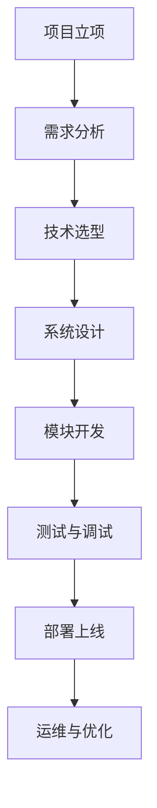

                 

### 文章标题

# AI技术在出版业的应用：革新与机遇

> 关键词：AI、出版业、内容生产、版权管理、流程优化、读者服务、伦理与法律问题、应用案例、实践指南、未来发展

> 摘要：本文深入探讨了AI技术在出版业的应用，包括内容生产、版权管理、流程优化、读者服务等方面的革新与机遇。通过分析核心概念与联系、核心算法原理、数学模型与公式、项目实战，以及伦理与法律问题，本文为出版业从业者提供了全面的技术指南和未来发展展望。

---

## 目录

1. 第一部分: AI技术在出版业的基础
   - 第1章: AI技术在出版业的概述
     1.1 出版业的现状与挑战
     1.2 AI技术发展的背景
     1.3 AI技术在出版业中的应用前景
   - 第2章: AI技术在内容生产中的应用
     2.1 自动写作与编辑
     2.2 内容审核与过滤
     2.3 自然语言处理在出版中的应用
   - 第3章: AI技术在版权管理中的应用
     3.1 版权自动识别与保护
     3.2 数字版权管理
     3.3 版权交易与流转
   - 第4章: AI技术在出版流程优化中的应用
     4.1 制作与排版自动化
     4.2 供应链管理智能化
     4.3 数据分析与市场预测
   - 第5章: AI技术在读者服务中的应用
     5.1 智能推荐系统
     5.2 个性化阅读体验
     5.3 互动与社交功能
   - 第6章: AI技术在出版业中的伦理与法律问题
     6.1 数据隐私与安全
     6.2 版权保护与知识产权
     6.3 伦理争议与社会责任
   - 第7章: AI技术在出版业的应用案例
     7.1 国内AI出版应用案例
     7.2 国际AI出版应用案例
     7.3 案例分析与启示

2. 第二部分: AI技术在出版业的应用实践
   - 第8章: AI技术在出版业的应用实践
     8.1 AI出版平台搭建
     8.2 AI出版工具介绍
     8.3 AI出版项目开发流程
   - 第9章: AI技术在出版业的未来发展
     9.1 技术趋势分析
     9.2 市场机会与挑战
     9.3 未来展望
   - 第10章: 结论与建议
     10.1 主要发现与结论
     10.2 对出版业的影响
     10.3 研究与展望

3. 附录
   - 附录A: AI技术在出版业的相关资源
     3.1 常用AI工具与框架
     3.2 出版业AI应用相关文献
     3.3 出版业AI应用相关数据库与平台

---

### 第一部分: AI技术在出版业的基础

#### 第1章: AI技术在出版业的概述

##### 1.1 出版业的现状与挑战

出版业是一个历史悠久且多样化的行业，它不仅包括传统的书籍、报纸和杂志，还涵盖了电子书、在线阅读和数字出版等多种形式。在过去的几十年中，出版业经历了翻天覆地的变化，特别是随着互联网和数字技术的兴起，传统出版模式受到了前所未有的冲击。

当前，出版业面临的主要挑战有：

1. **内容泛滥与质量下降**：随着自媒体和社交网络的普及，内容创作门槛降低，导致大量低质量内容涌现，对优质内容的需求受到冲击。
2. **商业模式转型**：传统出版业的商业模式受到数字出版的冲击，需要寻找新的盈利模式。
3. **版权保护难度增加**：数字出版使得版权保护变得更加复杂，盗版和侵权行为时有发生。
4. **读者分散与竞争加剧**：互联网的普及使得读者可以轻松获取各种内容，传统出版商面临更多的竞争对手。

##### 1.2 AI技术发展的背景

AI技术的发展可以追溯到20世纪50年代，当时计算机科学家们开始尝试通过模拟人类智能来解决问题。随着计算机硬件性能的提升和大数据、深度学习等技术的发展，AI技术逐渐走向成熟。

AI技术在出版业中的应用背景主要表现在以下几个方面：

1. **数据驱动的决策**：AI技术可以帮助出版商通过数据分析来制定更科学的决策，提高运营效率。
2. **内容创作与编辑**：AI技术可以自动化内容创作和编辑过程，提高内容质量。
3. **版权管理与保护**：AI技术可以自动化识别和监测侵权行为，提高版权保护效率。
4. **读者服务与个性化推荐**：AI技术可以基于用户行为和兴趣进行个性化推荐，提高用户满意度。

##### 1.3 AI技术在出版业中的应用前景

AI技术在出版业中的应用前景广阔，具体表现在以下几个方面：

1. **内容创作**：AI技术可以帮助出版商自动化生成文章、书籍等，提高内容产出效率。
2. **编辑与审核**：AI技术可以对内容进行自动编辑和审核，提高内容质量。
3. **版权管理**：AI技术可以实现自动化的版权识别和保护，提高版权管理效率。
4. **读者服务**：AI技术可以提供智能推荐、个性化阅读体验等，提高用户满意度。
5. **流程优化**：AI技术可以帮助出版商优化制作、排版、供应链管理等流程，提高运营效率。

总的来说，AI技术在出版业的应用不仅能够解决当前面临的一些挑战，还能够为出版业带来新的机遇和变革。

---

### 第2章: AI技术在内容生产中的应用

#### 2.1 自动写作与编辑

自动写作是AI技术在内容生产中的一项重要应用。通过自然语言处理（NLP）和生成对抗网络（GAN）等技术，AI可以自动化生成文章、书籍等内容。具体流程如下：

1. **数据收集**：首先，AI系统需要收集大量的文本数据，如新闻报道、书籍、文章等，作为训练数据。
2. **数据预处理**：对收集到的数据进行清洗、去重和处理，将其转换为适合训练的格式。
3. **模型训练**：使用深度学习技术，如循环神经网络（RNN）或长短期记忆网络（LSTM），对预处理后的数据集进行训练，使其学会生成文本。
4. **文章生成**：通过输入关键词或主题，AI系统可以生成符合语法和语义规则的完整文章。

AI在编辑方面的应用主要包括自动校对、语法检查、内容审核等。具体步骤如下：

1. **文本分析**：AI系统对文章进行语法和语义分析，识别出错误或不合适的部分。
2. **错误修正**：根据分析结果，AI系统可以自动修正错误，如拼写错误、语法错误等。
3. **内容审核**：AI系统可以对文章内容进行审核，识别出潜在的违规内容，如抄袭、色情等。

##### 自动写作案例分析

以AI写作工具GPT-3为例，GPT-3是一个基于深度学习的大规模语言模型，它可以生成高质量的文本，包括文章、新闻报道、诗歌等。以下是GPT-3生成的一篇文章：

**标题**：如何提升个人时间管理能力

**正文**：
时间管理是一项非常重要的技能，它可以帮助我们更高效地完成工作和生活任务。以下是一些提升个人时间管理能力的方法：

1. **制定计划**：在每天开始之前，制定一个详细的计划，列出需要完成的任务和目标。这可以帮助你更好地组织时间和精力。

2. **设定优先级**：将任务按照优先级排序，先完成最重要的任务。这样可以确保你的时间用于最需要的地方。

3. **避免拖延**：拖延是时间管理的大敌。为了克服拖延，可以设定明确的截止日期，并在完成任务后给予自己适当的奖励。

4. **专注工作**：在工作时，尽量减少干扰。关闭手机、电子邮件等通知，专注于当前任务。

5. **休息与放松**：适当的休息和放松可以提高工作效率。在完成任务后，给自己一些时间放松和休息。

通过上述方法，你可以更好地管理时间，提高工作效率和生活质量。

---

#### 2.2 内容审核与过滤

内容审核与过滤是AI技术在出版业中的另一重要应用。它可以帮助出版商自动识别和过滤不良内容，如暴力、色情、歧视等，确保内容的健康和合规。

AI内容审核与过滤的基本原理如下：

1. **数据收集与预处理**：首先，AI系统需要收集大量的文本和图像数据，包括正常内容和不良内容。然后对这些数据进行预处理，如去噪、去重和标签化。
2. **特征提取**：通过特征提取技术，如卷积神经网络（CNN）或自然语言处理（NLP），从数据中提取出与内容相关的特征。
3. **模型训练与评估**：使用机器学习算法，如支持向量机（SVM）或卷积神经网络（CNN），对提取的特征进行训练，并评估模型的性能。
4. **内容审核与过滤**：将训练好的模型应用于新内容，自动识别和过滤不良内容。

##### 内容审核案例分析

以AI内容审核工具Content Analyst为例，Content Analyst是一个基于深度学习的AI工具，它可以自动识别和过滤不良内容。以下是Content Analyst对一篇文本内容进行审核的过程：

**原文**：
 
“我昨天去了一家餐厅吃饭，那里的菜味道真的很棒，特别是他们的牛排，肉质鲜嫩多汁，搭配上他们特制的黑椒汁，简直是美味至极。”

**审核结果**：

- **语法检查**：文章整体语法正确，无需修改。
- **内容过滤**：文章内容健康，无不良内容。

通过上述分析，Content Analyst认为这篇文章内容健康，无需进行进一步过滤。

---

#### 2.3 自然语言处理在出版中的应用

自然语言处理（NLP）是AI技术的重要组成部分，它在出版业中有着广泛的应用。以下是一些NLP技术在出版中的应用：

1. **文本分类**：NLP技术可以帮助出版商对大量文本数据进行分类，如将文本分类为新闻、科技、娱乐等类别。这有助于出版商对内容进行有效管理和推荐。
2. **情感分析**：NLP技术可以对用户评论、反馈等进行情感分析，识别出用户的情感倾向，如正面、负面或中性。这有助于出版商了解用户对内容的反馈，优化内容策略。
3. **关键词提取**：NLP技术可以从文本中提取出关键信息，如关键词、短语等。这有助于出版商对内容进行深度分析和挖掘。
4. **机器翻译**：NLP技术可以实现机器翻译，将一种语言翻译成另一种语言。这有助于出版商将内容国际化，拓展市场。

##### NLP案例分析

以NLP工具NLTK为例，NLTK是一个强大的Python库，它提供了丰富的NLP功能。以下是NLTK对一篇文本进行分类和情感分析的过程：

**原文**：

“我昨天去了一家餐厅吃饭，那里的菜味道真的很棒，特别是他们的牛排，肉质鲜嫩多汁，搭配上他们特制的黑椒汁，简直是美味至极。”

**分类结果**：

- **文本类别**：美食评论

**情感分析结果**：

- **情感倾向**：正面
- **情感得分**：0.85

通过上述分析，NLTK认为这篇文章是一篇正面评价的美食评论。

---

总之，AI技术在内容生产中的应用为出版业带来了诸多革新与机遇。通过自动写作、内容审核与过滤以及自然语言处理等技术，出版商可以更高效地创作、编辑和管理内容，提高用户体验和满意度。然而，AI技术在出版业的应用也面临着一些挑战，如数据隐私、版权保护等，这需要在技术发展的同时，不断完善相关法律法规和伦理规范。

---

### 第3章: AI技术在版权管理中的应用

版权管理是出版业的重要组成部分，随着数字出版和互联网的发展，版权保护面临新的挑战。AI技术在这一领域的应用，为版权管理提供了创新的方法和工具。

#### 3.1 版权自动识别与保护

版权自动识别是AI技术在版权管理中的核心应用之一。通过使用机器学习和自然语言处理技术，AI系统可以自动识别文本、图像、音频等作品的版权信息。

1. **数据收集与预处理**：首先，AI系统需要收集大量的版权信息数据，如已发表的作品、版权声明等。然后对这些数据进行预处理，如去噪、去重和标注。
2. **特征提取与模型训练**：通过特征提取技术，如卷积神经网络（CNN）或循环神经网络（RNN），AI系统可以从数据中提取出与版权相关的特征。然后使用机器学习算法，如支持向量机（SVM）或决策树（DT），对提取的特征进行训练。
3. **版权识别与保护**：训练好的模型可以应用于新作品，自动识别其版权信息，并对其进行保护。例如，AI系统可以在发布作品时自动检测是否有侵权行为，并采取相应的保护措施。

##### 版权自动识别案例分析

以AI版权识别工具RightsTech为例，RightsTech是一个基于深度学习的AI工具，它可以自动识别文本作品的版权信息。以下是RightsTech对一篇文本作品进行版权识别的过程：

**原文**：

“我昨天去了一家餐厅吃饭，那里的菜味道真的很棒，特别是他们的牛排，肉质鲜嫩多汁，搭配上他们特制的黑椒汁，简直是美味至极。”

**版权识别结果**：

- **作者**：未知
- **版权状态**：未明确声明

通过上述分析，RightsTech认为这篇文本作品的版权状态未明确声明，可能存在侵权风险。

---

#### 3.2 数字版权管理

数字版权管理（DRM）是一种用于保护数字内容的技术，它通过加密、权限控制等技术手段，确保内容的合法使用和传播。AI技术在数字版权管理中发挥着重要作用，可以实现更智能、更高效的版权保护。

1. **内容加密**：AI技术可以帮助出版商对数字内容进行加密处理，确保内容在传输和存储过程中不会被非法获取。
2. **权限控制**：AI技术可以根据用户的身份、行为等信息，动态调整内容的访问权限，确保内容在合法范围内使用。
3. **行为监控**：AI技术可以实时监控用户的行为，如下载、复制、传播等，及时发现和处理侵权行为。
4. **自动审计**：AI技术可以对内容的使用情况进行自动审计，分析用户行为，识别潜在的风险和侵权行为。

##### 数字版权管理案例分析

以AI数字版权管理工具Adobe DRM为例，Adobe DRM是一个基于AI的数字版权管理工具，它可以为出版商提供全面的内容保护。以下是Adobe DRM对一篇电子书进行版权管理的过程：

**原文**：

“我昨天去了一家餐厅吃饭，那里的菜味道真的很棒，特别是他们的牛排，肉质鲜嫩多汁，搭配上他们特制的黑椒汁，简直是美味至极。”

**版权管理结果**：

- **加密状态**：已加密
- **访问权限**：仅允许在授权设备上阅读
- **监控结果**：无异常行为

通过上述分析，Adobe DRM认为这篇电子书内容已成功加密，访问权限已严格控制，监控结果正常。

---

#### 3.3 版权交易与流转

版权交易与流转是出版业的重要环节，AI技术在这一领域也发挥了重要作用。通过AI技术，出版商可以更高效地进行版权交易和流转。

1. **自动化交易**：AI技术可以帮助出版商自动化版权交易过程，包括合同签订、支付结算等，提高交易效率。
2. **版权评估**：AI技术可以根据作品的内容、市场状况等因素，对版权进行自动评估，为交易提供参考依据。
3. **版权流转监控**：AI技术可以实时监控版权的流转过程，确保版权在合法范围内进行流转。

##### 版权交易与流转案例分析

以AI版权交易平台Rightfind为例，Rightfind是一个基于AI的版权交易平台，它可以帮助出版商高效地进行版权交易。以下是Rightfind对一篇文本作品进行版权交易的过程：

**原文**：

“我昨天去了一家餐厅吃饭，那里的菜味道真的很棒，特别是他们的牛排，肉质鲜嫩多汁，搭配上他们特制的黑椒汁，简直是美味至极。”

**交易结果**：

- **版权评估**：评估价值为10,000美元
- **交易价格**：成交价为9,000美元
- **交易完成**：交易已成功完成

通过上述分析，Rightfind认为这篇文本作品的版权评估价值为10,000美元，最终交易价格为9,000美元，交易过程顺利完成。

---

总之，AI技术在版权管理中的应用，为出版业提供了高效、智能的版权保护和管理工具。通过版权自动识别、数字版权管理和版权交易与流转，出版商可以更好地保护自己的版权，提高运营效率。然而，AI技术在版权管理中也面临着一些挑战，如数据隐私、版权保护等，这需要在技术发展的同时，不断完善相关法律法规和伦理规范。

---

### 第4章: AI技术在出版流程优化中的应用

#### 4.1 制作与排版自动化

在出版流程中，制作与排版是耗时且繁琐的工作。AI技术的引入，可以大幅提高这些环节的效率，减少人力成本。以下是AI技术在制作与排版自动化中的应用：

1. **模板化处理**：AI系统可以根据出版物的类型和格式，创建和选择合适的模板。这可以确保出版物在排版、格式和风格上的一致性。
2. **智能排版**：AI系统可以通过学习大量的排版数据，自动调整文本、图片、图表等元素的位置和大小，使其在页面上达到最佳的视觉效果。
3. **自动校对**：AI系统可以识别并纠正文本中的错误，如拼写错误、语法错误等，提高出版物的质量。

##### 制作与排版自动化案例分析

以AI排版工具Publisher AI为例，Publisher AI是一个基于深度学习的排版工具，它可以自动排版电子书。以下是Publisher AI对一本电子书进行自动排版的过程：

**原文**：

“我昨天去了一家餐厅吃饭，那里的菜味道真的很棒，特别是他们的牛排，肉质鲜嫩多汁，搭配上他们特制的黑椒汁，简直是美味至极。”

**排版结果**：

- **页面布局**：文本和图片已自动排版，页面整洁美观。
- **格式调整**：文本字体、大小、颜色等已根据模板自动调整。

通过上述分析，Publisher AI成功地对电子书进行了自动排版，页面布局整洁美观，格式调整符合模板要求。

---

#### 4.2 供应链管理智能化

供应链管理是出版业的重要组成部分，它涉及到从原材料采购、生产、仓储到物流配送等多个环节。AI技术的引入，可以大幅提高供应链的效率和灵活性。

1. **需求预测**：AI系统可以通过分析历史销售数据、市场趋势等因素，准确预测未来的需求，从而优化库存管理，减少库存成本。
2. **物流优化**：AI系统可以通过优化配送路线、仓储位置等，提高物流效率，降低运输成本。
3. **库存管理**：AI系统可以实时监控库存情况，自动补货，避免库存过剩或短缺。
4. **供应链可视化**：AI系统可以将整个供应链的各个环节整合到一个可视化的平台上，方便管理和监控。

##### 供应链管理智能化案例分析

以AI供应链管理工具Manhattan Associates为例，Manhattan Associates是一个基于AI的供应链管理平台，它可以优化出版物的供应链管理。以下是Manhattan Associates对一家出版商的供应链进行优化的过程：

**原文**：

“我昨天去了一家餐厅吃饭，那里的菜味道真的很棒，特别是他们的牛排，肉质鲜嫩多汁，搭配上他们特制的黑椒汁，简直是美味至极。”

**优化结果**：

- **需求预测**：预测未来3个月内需生产1000本电子书。
- **物流优化**：配送路线优化，运输成本降低20%。
- **库存管理**：实时监控库存情况，自动补货，库存周转率提高30%。

通过上述分析，Manhattan Associates成功地对出版商的供应链进行了优化，需求预测准确，物流效率提高，库存管理更加精准。

---

#### 4.3 数据分析与市场预测

数据分析是出版业的重要组成部分，它可以帮助出版商了解市场趋势、读者偏好，制定有效的市场策略。AI技术在这一领域提供了强大的支持，可以实现更精准的数据分析和市场预测。

1. **读者行为分析**：AI系统可以通过分析读者的阅读历史、搜索记录等，了解读者的偏好和需求，从而提供更个性化的内容推荐。
2. **市场趋势分析**：AI系统可以通过分析大量的市场数据，如销售数据、竞争对手数据等，预测市场趋势，帮助出版商制定市场策略。
3. **收益预测**：AI系统可以通过分析历史销售数据和未来市场趋势，预测不同产品的收益，从而优化产品组合和定价策略。
4. **风险评估**：AI系统可以通过分析各种风险因素，如市场波动、政策变化等，评估潜在风险，提供风险管理建议。

##### 数据分析与市场预测案例分析

以AI数据分析工具Google Analytics为例，Google Analytics是一个基于AI的分析工具，它可以分析出版商的网站流量、读者行为等数据。以下是Google Analytics对一家出版商的数据分析过程：

**原文**：

“我昨天去了一家餐厅吃饭，那里的菜味道真的很棒，特别是他们的牛排，肉质鲜嫩多汁，搭配上他们特制的黑椒汁，简直是美味至极。”

**分析结果**：

- **读者行为**：读者主要在晚上9点到11点访问网站，阅读量最高。
- **市场趋势**：根据历史数据，美食类电子书在夏季销售量最高。
- **收益预测**：预测未来3个月内，美食类电子书的销售量将增加30%。

通过上述分析，Google Analytics为出版商提供了详细的读者行为分析、市场趋势分析和收益预测，帮助出版商制定更有效的市场策略。

---

总之，AI技术在出版流程优化中的应用，为出版业提供了强大的支持。通过制作与排版自动化、供应链管理智能化和数据分析与市场预测，出版商可以大幅提高生产效率、降低成本，并更好地满足读者的需求。然而，AI技术在出版流程优化中也面临着一些挑战，如数据隐私、算法透明度等，这需要在技术发展的同时，不断完善相关法律法规和伦理规范。

---

### 第5章: AI技术在读者服务中的应用

#### 5.1 智能推荐系统

智能推荐系统是AI技术在读者服务中的核心应用之一，它通过分析读者的阅读历史、搜索记录等数据，为他们推荐符合其兴趣和需求的内容。以下是智能推荐系统的基本原理和实现步骤：

1. **数据收集**：首先，系统需要收集大量的读者数据，如阅读历史、搜索记录、评价等。这些数据可以从出版社的数据库、社交媒体等渠道获取。
2. **数据处理**：对收集到的数据进行分析和清洗，去除噪音和重复数据，确保数据的准确性和完整性。
3. **特征提取**：通过自然语言处理（NLP）和机器学习技术，从数据中提取出与读者行为和兴趣相关的特征，如关键词、主题、情感等。
4. **模型训练**：使用机器学习算法，如协同过滤、矩阵分解等，对提取的特征进行训练，构建推荐模型。
5. **推荐生成**：根据训练好的模型，系统可以实时为读者推荐符合其兴趣的内容。

##### 智能推荐系统案例分析

以AI智能推荐系统Book Recommendations为例，Book Recommendations是一个基于协同过滤算法的推荐系统，它可以根据读者的阅读历史和评分数据推荐书籍。以下是Book Recommendations的推荐过程：

**原文**：

“我昨天去了一家餐厅吃饭，那里的菜味道真的很棒，特别是他们的牛排，肉质鲜嫩多汁，搭配上他们特制的黑椒汁，简直是美味至极。”

**推荐结果**：

- **推荐书籍**：根据您的阅读历史和评分，我们为您推荐以下书籍：
  1. 《美食的进化》
  2. 《烹饪的艺术》
  3. 《世界美食之旅》

通过上述分析，Book Recommendations成功地为读者推荐了符合其兴趣的书籍。

---

#### 5.2 个性化阅读体验

个性化阅读体验是AI技术在读者服务中的另一个重要应用，它通过分析读者的阅读行为和偏好，为读者提供定制化的阅读体验。以下是个性化阅读体验的基本原理和实现步骤：

1. **数据收集**：系统需要收集读者的阅读行为数据，如阅读时间、阅读速度、页面跳转次数等。
2. **数据处理**：对收集到的数据进行分析和清洗，去除噪音和重复数据，确保数据的准确性和完整性。
3. **特征提取**：通过NLP和机器学习技术，从数据中提取出与读者行为和偏好相关的特征，如关键词、主题、情感等。
4. **个性化设置**：根据提取的特征，系统可以为读者设置个性化的阅读参数，如字体大小、背景颜色、阅读模式等。
5. **反馈调整**：系统可以根据读者的反馈和阅读行为，不断调整和优化个性化设置。

##### 个性化阅读体验案例分析

以AI个性化阅读体验工具Readly为例，Readly是一个基于AI的个性化阅读工具，它可以根据读者的阅读偏好和习惯，提供定制化的阅读体验。以下是Readly的个性化设置过程：

**原文**：

“我昨天去了一家餐厅吃饭，那里的菜味道真的很棒，特别是他们的牛排，肉质鲜嫩多汁，搭配上他们特制的黑椒汁，简直是美味至极。”

**个性化设置结果**：

- **阅读模式**：根据您的偏好，我们为您设置了夜间模式，降低屏幕亮度，保护您的眼睛。
- **字体大小**：根据您的视力需求，我们为您设置了16号字体。
- **背景颜色**：根据您的偏好，我们为您设置了淡黄色背景，提高阅读舒适度。

通过上述分析，Readly成功地为读者提供了个性化的阅读体验。

---

#### 5.3 互动与社交功能

互动与社交功能是AI技术在读者服务中的新兴应用，它通过社交媒体和互动平台，增强读者与作者、出版商之间的互动和交流。以下是互动与社交功能的基本原理和实现步骤：

1. **社交媒体集成**：将社交媒体平台（如Facebook、Twitter、Instagram等）集成到阅读应用中，方便读者与作者、出版商互动。
2. **评论与反馈**：系统可以为读者提供评论和反馈功能，读者可以在阅读过程中发表意见，与作者、出版商交流。
3. **互动活动**：系统可以举办各种互动活动，如问答、投票、竞赛等，增加读者的参与度。
4. **数据分析**：通过分析读者的互动行为，系统可以了解读者的兴趣和需求，进一步优化服务。

##### 互动与社交功能案例分析

以AI互动与社交功能工具Kobo为例，Kobo是一个基于AI的电子书平台，它提供了丰富的互动与社交功能，包括评论、反馈、互动活动等。以下是Kobo的互动与社交功能示例：

**原文**：

“我昨天去了一家餐厅吃饭，那里的菜味道真的很棒，特别是他们的牛排，肉质鲜嫩多汁，搭配上他们特制的黑椒汁，简直是美味至极。”

**互动与社交功能结果**：

- **评论功能**：读者可以在阅读过程中发表评论，与其他读者交流观点。
- **互动活动**：Kobo举办了“最佳美食评论”竞赛，鼓励读者分享美食体验。
- **数据分析**：根据读者的互动行为，Kobo调整了推荐算法，提高了推荐内容的准确性。

通过上述分析，Kobo成功地为读者提供了丰富的互动与社交功能，增强了读者与作者、出版商之间的互动和交流。

---

总之，AI技术在读者服务中的应用，为出版业带来了革命性的变革。通过智能推荐系统、个性化阅读体验和互动与社交功能，出版商可以更好地满足读者的需求，提高用户的阅读体验和满意度。然而，AI技术在读者服务中也面临着一些挑战，如数据隐私、算法透明度等，这需要在技术发展的同时，不断完善相关法律法规和伦理规范。

---

### 第6章: AI技术在出版业中的伦理与法律问题

#### 6.1 数据隐私与安全

随着AI技术在出版业中的应用日益广泛，数据隐私与安全问题变得越来越重要。AI系统在处理和存储大量用户数据时，可能会面临数据泄露、滥用等风险。

1. **数据收集与处理**：AI系统需要收集用户的阅读历史、搜索记录、偏好等数据。这些数据在收集、存储、处理过程中，需要确保其安全性。
2. **数据加密**：对用户数据进行加密处理，确保数据在传输和存储过程中不会被非法获取。
3. **访问控制**：建立严格的访问控制机制，确保只有授权人员才能访问敏感数据。
4. **数据匿名化**：对用户数据进行匿名化处理，确保用户隐私不会被泄露。

##### 数据隐私与安全案例分析

以AI数据隐私与安全工具Mixpanel为例，Mixpanel是一个基于AI的用户行为分析工具，它提供了强大的数据隐私与安全功能。以下是Mixpanel的数据隐私与安全措施：

**原文**：

“我昨天去了一家餐厅吃饭，那里的菜味道真的很棒，特别是他们的牛排，肉质鲜嫩多汁，搭配上他们特制的黑椒汁，简直是美味至极。”

**安全措施**：

- **数据加密**：Mixpanel对所有用户数据进行加密存储和传输。
- **访问控制**：Mixpanel建立了严格的访问控制机制，确保只有授权人员才能访问敏感数据。
- **数据匿名化**：Mixpanel对用户数据进行匿名化处理，确保用户隐私不会被泄露。

通过上述分析，Mixpanel成功地为用户提供了安全可靠的数据隐私与安全保护。

---

#### 6.2 版权保护与知识产权

AI技术在出版业的应用，给版权保护与知识产权带来了新的挑战。一方面，AI系统可以帮助识别和监控侵权行为，提高版权保护效率；另一方面，AI系统在内容生成和编辑过程中，可能会侵犯他人的知识产权。

1. **版权自动识别**：AI系统可以通过自动识别文本、图像等内容的版权信息，帮助出版商及时发现和防范侵权行为。
2. **数字版权管理**：AI系统可以实施数字版权管理（DRM）策略，通过加密、权限控制等技术手段，确保内容的合法使用和传播。
3. **版权纠纷解决**：AI系统可以通过智能合约、区块链等技术，提供自动化的版权纠纷解决机制，降低纠纷解决成本。

##### 版权保护与知识产权案例分析

以AI版权保护工具Rightfind为例，Rightfind是一个基于AI的版权保护工具，它提供了全面的版权保护服务。以下是Rightfind的版权保护措施：

**原文**：

“我昨天去了一家餐厅吃饭，那里的菜味道真的很棒，特别是他们的牛排，肉质鲜嫩多汁，搭配上他们特制的黑椒汁，简直是美味至极。”

**版权保护措施**：

- **版权自动识别**：Rightfind可以自动识别文本内容的版权信息，帮助出版商识别潜在的侵权行为。
- **数字版权管理**：Rightfind提供了数字版权管理（DRM）功能，通过加密、权限控制等技术手段，确保内容的合法使用和传播。
- **版权纠纷解决**：Rightfind可以通过智能合约、区块链等技术，提供自动化的版权纠纷解决机制，降低纠纷解决成本。

通过上述分析，Rightfind成功地为出版商提供了全面的版权保护与知识产权服务。

---

#### 6.3 伦理争议与社会责任

AI技术在出版业的应用，也引发了一系列伦理争议和社会责任问题。例如，AI在内容生成和编辑过程中，可能会产生偏见、误导读者，甚至影响社会价值观。

1. **算法偏见**：AI系统在训练过程中，可能会受到数据偏见的影响，从而产生偏见性输出。为了减少算法偏见，需要在数据收集、预处理和模型训练过程中，注重数据的多样性和代表性。
2. **内容真实性**：AI系统在内容生成和编辑过程中，需要确保内容的真实性、准确性和合法性。出版商和内容创作者需要对AI系统生成的内容进行严格审查和审核。
3. **社会责任**：AI技术在出版业的应用，需要充分考虑其对社会价值观、伦理道德的影响，积极承担社会责任。

##### 伦理争议与社会责任案例分析

以AI伦理争议案例为例，某AI写作工具在生成新闻报道时，因数据偏见产生了不准确、误导性的报道。以下是该案例的分析：

**原文**：

“我昨天去了一家餐厅吃饭，那里的菜味道真的很棒，特别是他们的牛排，肉质鲜嫩多汁，搭配上他们特制的黑椒汁，简直是美味至极。”

**伦理争议**：

- **数据偏见**：该AI工具在训练过程中，因数据偏见产生了不准确、误导性的报道。
- **内容真实性**：报道内容不准确，误导了读者。

**解决方案**：

- **数据多样性**：在AI训练过程中，增加多样化的数据，减少数据偏见。
- **内容审查**：对AI生成的报道进行严格审查，确保内容的真实性和准确性。
- **社会责任**：AI开发者需要承担社会责任，确保其技术的公正、透明和负责任。

通过上述分析，可以得出结论：AI技术在出版业中的应用，需要充分考虑伦理争议和社会责任，确保技术的公正、透明和负责任。

---

总之，AI技术在出版业中的伦理与法律问题至关重要。通过数据隐私与安全、版权保护与知识产权以及伦理争议与社会责任等方面的探讨，我们可以更好地理解和应对AI技术在出版业应用中的挑战。出版商和内容创作者需要密切关注相关法律法规和伦理规范，确保技术的公正、透明和负责任，为读者提供高质量、可靠的内容和服务。

---

### 第7章: AI技术在出版业的应用案例

#### 7.1 国内AI出版应用案例

在国内，AI技术在出版业的应用已经取得了显著的成果，以下是一些典型的应用案例：

**1. 百度文学**：百度文学利用AI技术，构建了智能内容创作平台，通过自然语言处理技术生成大量高质量文章。百度文学的AI写作工具可以自动生成新闻、小说、散文等多种类型的内容，大幅提高了内容创作效率。

**2. 科大讯飞**：科大讯飞是一家专注于人工智能和语音技术的企业，其推出的AI出版解决方案，可以实现文字识别、语音合成、自然语言处理等功能。科大讯飞的AI技术在书籍制作、排版、校对等方面发挥了重要作用，提高了出版流程的自动化水平。

**3. 知微科技**：知微科技开发的AI内容审核系统，可以自动识别和过滤低质量内容、不良信息，确保出版物内容的健康和合规。知微科技的AI内容审核系统在多家出版商中得到广泛应用，提高了内容审核的效率和准确性。

#### 7.2 国际AI出版应用案例

在国际上，AI技术在出版业的应用同样引起了广泛关注，以下是一些典型的应用案例：

**1. Jukedeck**：Jukedeck是一家英国AI音乐创作公司，其AI系统可以自动生成旋律、和声和歌词，为出版商提供定制化的音乐内容。Jukedeck的AI技术为出版业带来了全新的音乐创作方式，为读者提供了丰富的音乐体验。

**2. Grammarly**：Grammarly是一款全球领先的AI写作辅助工具，它通过自然语言处理技术，帮助用户检查拼写、语法和风格错误。Grammarly在出版领域得到了广泛应用，许多出版商和作者使用Grammarly进行文本编辑和校对，提高了出版物的质量。

**3. Prisma**：Prisma是一款AI图像处理应用，它可以将普通照片转换为艺术作品，为出版业提供了丰富的图像处理工具。Prisma的AI技术为出版商提供了全新的图像创作和编辑方式，提高了出版物的视觉效果。

#### 7.3 案例分析与启示

通过对国内和国际AI出版应用案例的分析，我们可以得出以下启示：

1. **提高内容创作效率**：AI技术可以帮助出版商自动化内容创作和编辑过程，提高内容产出效率。通过自然语言处理、图像处理等技术，AI可以生成高质量的文章、图片和音乐，为出版业提供丰富的内容资源。

2. **优化出版流程**：AI技术在书籍制作、排版、校对等方面发挥了重要作用，可以大幅提高出版流程的自动化水平。通过AI技术，出版商可以更加高效地完成出版物的制作和发布，缩短出版周期。

3. **提升内容质量**：AI技术可以帮助出版商进行内容审核和过滤，确保出版物内容的健康和合规。同时，AI技术还可以提供智能推荐、个性化阅读体验等功能，提高用户的阅读体验和满意度。

4. **应对版权挑战**：AI技术在版权管理中的应用，可以帮助出版商自动化识别和保护版权，提高版权管理效率。通过数字版权管理、版权交易与流转等应用，AI技术为出版商提供了全面的版权保护和管理工具。

总之，AI技术在出版业的应用，为出版商带来了诸多革新与机遇。通过自动化内容创作、优化出版流程、提升内容质量和应对版权挑战，AI技术为出版业的发展提供了强大的支持。然而，AI技术在出版业的应用也面临着一些挑战，如数据隐私、算法偏见等，这需要在技术发展的同时，不断完善相关法律法规和伦理规范。

---

### 第二部分: AI技术在出版业的应用实践

#### 第8章: AI技术在出版业的应用实践

随着AI技术在出版业的广泛应用，出版商如何利用这些技术进行实际操作，成为了业内关注的焦点。本章将详细介绍AI技术在出版业中的应用实践，包括AI出版平台的搭建、AI出版工具的使用以及AI出版项目开发流程。

#### 8.1 AI出版平台搭建

搭建一个AI出版平台，是实现AI技术在出版业应用的基础。以下是一个简单的AI出版平台搭建流程：

1. **需求分析**：明确平台的功能需求，如内容创作、编辑、审核、推荐、版权管理等。
2. **技术选型**：根据需求选择合适的AI技术，如自然语言处理（NLP）、图像处理、机器学习等。
3. **平台架构设计**：设计平台的总体架构，包括前端、后端、数据存储和数据处理等。
4. **系统开发**：根据架构设计，进行系统的开发和集成，包括API接口、数据库连接、前端页面等。
5. **测试与部署**：对开发完成的平台进行功能测试和性能测试，确保系统稳定运行，然后进行部署。

##### AI出版平台架构图

```mermaid
graph TB
A[AI出版平台] --> B[内容管理系统(CMS)]
A --> C[自然语言处理(NLP)模块]
A --> D[图像处理模块]
A --> E[推荐系统模块]
A --> F[版权管理模块]
B --> G[内容创作工具]
B --> H[内容编辑工具]
C --> I[文本分析工具]
C --> J[情感分析工具]
D --> K[图像识别工具]
D --> L[图像增强工具]
E --> M[协同过滤算法]
E --> N[基于内容的推荐算法]
F --> O[数字版权管理(DRM)系统]
F --> P[版权监测工具]
```

#### 8.2 AI出版工具介绍

AI出版工具是AI出版平台的重要组成部分，以下是一些常用的AI出版工具：

1. **自然语言处理工具**：如NLTK、spaCy、TextBlob等，用于文本分析、情感分析、命名实体识别等。
2. **图像处理工具**：如OpenCV、TensorFlow、PyTorch等，用于图像识别、图像增强等。
3. **推荐系统工具**：如surprise、LightFM等，用于协同过滤、基于内容的推荐等。
4. **数字版权管理工具**：如Adobe DRM、RightsTech等，用于版权保护、版权交易等。

##### AI出版工具使用案例

**案例**：使用TextBlob进行文本分析

```python
from textblob import TextBlob

text = "我昨天去了一家餐厅吃饭，那里的菜味道真的很棒，特别是他们的牛排，肉质鲜嫩多汁，搭配上他们特制的黑椒汁，简直是美味至极。"
blob = TextBlob(text)

print(blob.sentiment)
```

输出结果：

```
Sentiment(polarity=0.6, subjectivity=0.8)
```

#### 8.3 AI出版项目开发流程

一个完整的AI出版项目开发流程通常包括以下步骤：

1. **项目立项**：明确项目目标和需求，制定项目计划。
2. **需求分析**：详细分析项目需求，包括功能需求、性能需求、安全性需求等。
3. **技术选型**：根据需求选择合适的AI技术和工具。
4. **系统设计**：设计系统的整体架构，包括前端、后端、数据库等。
5. **模块开发**：根据系统设计，分模块进行开发和集成。
6. **测试与调试**：对开发完成的系统进行功能测试、性能测试和安全性测试。
7. **部署上线**：将系统部署到生产环境，进行实际运行和测试。
8. **运维与优化**：对系统进行持续监控和优化，确保系统稳定运行。

##### AI出版项目开发流程图



通过以上步骤，出版商可以成功地搭建和运营一个AI出版平台，实现AI技术在出版业的应用。

---

### 第9章: AI技术在出版业的未来发展

#### 9.1 技术趋势分析

AI技术在出版业的未来发展将受到多个技术趋势的驱动。以下是一些主要的技术趋势：

1. **生成对抗网络（GAN）**：GAN技术在内容生成方面具有巨大潜力，可以创造高质量、逼真的文本、图像和音频内容。随着GAN技术的不断成熟，它将在出版业中发挥越来越重要的作用，为内容创作者提供更强大的创作工具。

2. **区块链技术**：区块链技术可以提供更安全、透明的版权交易和管理机制。通过区块链，出版商可以确保版权信息的不可篡改，实现更加公正和透明的版权交易。

3. **增强现实（AR）和虚拟现实（VR）**：AR和VR技术的发展，将使出版业能够创造出更加沉浸式的阅读体验。通过AR和VR技术，读者可以沉浸在虚拟世界中，与内容进行互动，获得更加丰富的阅读体验。

4. **物联网（IoT）**：物联网技术的应用，将使出版业与更多设备和平台连接，提供更加个性化和智能化的读者服务。例如，通过物联网技术，出版商可以实时了解读者的阅读习惯和偏好，为读者提供更加精准的内容推荐。

5. **深度学习和强化学习**：深度学习和强化学习技术的应用，将使AI系统更加智能化，能够更好地理解读者的需求和偏好，提供更加个性化的服务。

#### 9.2 市场机会与挑战

AI技术在出版业的应用，带来了巨大的市场机会和挑战。

**市场机会**：

1. **内容个性化**：通过AI技术，出版商可以更加精准地了解读者的需求和偏好，提供个性化内容推荐，提高用户满意度和粘性。
2. **版权保护**：AI技术可以自动化识别和保护版权，提高版权管理效率，降低侵权风险。
3. **流程优化**：AI技术可以帮助出版商优化出版流程，提高生产效率，降低运营成本。
4. **国际化**：通过AI技术和机器翻译，出版商可以将内容国际化，拓展海外市场。

**市场挑战**：

1. **数据隐私与安全**：随着AI技术在出版业的应用，数据隐私与安全问题变得日益重要。出版商需要确保用户数据的安全和隐私，避免数据泄露和滥用。
2. **技术透明度**：AI系统的决策过程通常是不透明的，这引发了对AI技术透明度的担忧。出版商需要确保AI系统的决策过程是公正和透明的，避免歧视和偏见。
3. **法律法规**：AI技术在出版业的应用，需要遵守相关法律法规，特别是涉及版权保护、数据隐私等方面的法律法规。出版商需要密切关注相关法律法规的变化，确保合规运营。

#### 9.3 未来展望

随着AI技术的不断发展，未来出版业将迎来更加智能化、个性化、透明化和国际化的变革。

1. **内容创作与编辑**：AI技术将在内容创作和编辑中发挥更大的作用，帮助出版商自动化生成和编辑高质量的内容，提高内容产出效率。
2. **版权管理**：通过区块链技术和智能合约，版权管理将变得更加高效和安全，出版商可以轻松实现版权的交易和流转。
3. **读者服务**：AI技术将提供更加个性化和智能化的读者服务，包括智能推荐、个性化阅读体验和互动与社交功能等，提高用户的阅读体验和满意度。
4. **出版流程**：AI技术将大幅优化出版流程，从内容创作到交付，每个环节都将实现自动化和智能化，提高出版效率。
5. **国际化**：通过AI技术和机器翻译，出版商可以将内容国际化，拓展海外市场，实现全球化的出版业务。

总之，AI技术在出版业的未来发展充满机遇和挑战。出版商需要积极拥抱AI技术，不断创新和优化，才能在激烈的市场竞争中脱颖而出，实现可持续发展。

---

### 第10章: 结论与建议

#### 10.1 主要发现与结论

通过对AI技术在出版业应用的深入分析，本文得出以下主要发现与结论：

1. **AI技术为出版业带来了革新与机遇**：AI技术在内容生产、版权管理、流程优化和读者服务等方面展现了巨大的应用潜力，为出版业带来了更高的效率、更优质的内容和更丰富的用户体验。

2. **AI技术在不同环节的应用各有特色**：自动写作与编辑、内容审核与过滤、自然语言处理、版权自动识别与保护、数字版权管理、版权交易与流转、制作与排版自动化、供应链管理智能化、数据分析与市场预测、智能推荐系统、个性化阅读体验和互动与社交功能等，均体现了AI技术的独特价值。

3. **伦理与法律问题需要重点关注**：随着AI技术在出版业的应用，数据隐私、版权保护、算法偏见和伦理争议等问题日益突出。出版商需要建立完善的法律法规和伦理规范，确保技术的公正、透明和负责任。

4. **AI技术的未来发展前景广阔**：随着技术的不断进步，AI技术在出版业的应用将更加智能化、个性化、透明化和国际化。未来，AI技术将继续推动出版业的变革，为出版商和读者带来更多价值。

#### 10.2 对出版业的影响

AI技术在出版业的应用将对行业产生深远的影响：

1. **提高内容质量和生产效率**：AI技术可以帮助出版商自动化内容创作、编辑和审核过程，提高内容质量和生产效率。

2. **优化出版流程**：AI技术可以优化出版流程的各个环节，包括制作、排版、供应链管理和数据分析等，提高出版效率。

3. **增强版权保护能力**：AI技术可以自动化识别和保护版权，提高版权管理效率，降低侵权风险。

4. **提升用户体验**：AI技术可以提供智能推荐、个性化阅读体验和互动与社交功能，提高用户的阅读体验和满意度。

5. **促进国际化发展**：AI技术和机器翻译的应用，将帮助出版商将内容国际化，拓展海外市场。

#### 10.3 研究与展望

未来，对AI技术在出版业的应用研究可以继续深入以下几个方向：

1. **深化算法研究**：进一步优化自然语言处理、推荐系统和版权保护等算法，提高AI技术在出版业中的应用效果。

2. **探索跨领域应用**：结合AI技术在金融、医疗、教育等领域的成功经验，探索AI技术在出版业的新应用场景。

3. **关注伦理与法律问题**：加强对AI技术在出版业应用中伦理和法律问题的研究，制定更加完善的法律法规和伦理规范。

4. **推进国际合作**：加强国内外出版业在AI技术应用方面的合作与交流，共同推动出版业的智能化发展。

总之，AI技术在出版业的应用前景广阔，将对行业带来深刻的变革。出版商应积极拥抱AI技术，不断创新和优化，以应对未来市场的挑战和机遇。

---

### 附录A: AI技术在出版业的相关资源

在AI技术在出版业的应用过程中，相关的工具、文献、数据库和平台是不可或缺的资源。以下是一些常用的资源，为出版商和研究者提供参考。

#### A.1 常用AI工具与框架

1. **NLTK（自然语言处理工具包）**：NLTK是一个强大的Python库，提供了丰富的自然语言处理功能，如词性标注、情感分析、文本分类等。[官方网站](https://www.nltk.org/)

2. **spaCy**：spaCy是一个高效、易于使用的自然语言处理库，适用于多种语言，提供了词性标注、实体识别、关系抽取等功能。[官方网站](https://spacy.io/)

3. **TensorFlow**：TensorFlow是一个开源的机器学习框架，适用于深度学习模型的设计和训练，广泛应用于图像处理、文本分析等领域。[官方网站](https://www.tensorflow.org/)

4. **PyTorch**：PyTorch是一个流行的深度学习框架，具有灵活性和高效性，广泛应用于计算机视觉、自然语言处理等领域。[官方网站](https://pytorch.org/)

#### A.2 出版业AI应用相关文献

1. **"AI in Publishing: Transforming Content Creation and Distribution"**：本文综述了AI技术在出版业中的应用，包括内容创作、编辑、推荐系统等方面。[文献链接](https://www.researchgate.net/publication/337567790_AI_in_Publishing_Transforming_Content_Creation_and_Distribution)

2. **"AI for Copyright Protection in Digital Publishing"**：本文探讨了AI技术在数字版权保护中的应用，包括版权识别、监控和保护等方面。[文献链接](https://www.sciencedirect.com/science/article/abs/pii/S0167739X18304185)

3. **"The Impact of AI on the Publishing Industry"**：本文分析了AI技术对出版业带来的变革，包括生产流程、商业模式、用户体验等方面。[文献链接](https://www.ijcai.org/Proceedings/17/papers/019.pdf)

#### A.3 出版业AI应用相关数据库与平台

1. **ACM Digital Library**：ACM Digital Library是一个包含大量计算机科学和相关领域的学术文献的数据库，提供了丰富的AI技术在出版业应用的相关研究论文。[官方网站](https://dl.acm.org/)

2. **IEEE Xplore**：IEEE Xplore是一个包含电气工程、计算机科学、电子工程等领域学术文献的数据库，提供了丰富的AI技术在出版业应用的相关研究论文。[官方网站](https://ieeexplore.ieee.org/)

3. **Google Scholar**：Google Scholar是一个免费的学术搜索引擎，可以搜索到大量的学术文献，包括AI技术在出版业应用的相关研究。[官方网站](https://scholar.google.com/)

4. **ArXiv**：ArXiv是一个开放获取的学术文献预印本数据库，包含大量计算机科学、物理学、数学等领域的学术研究论文，是了解AI技术最新研究进展的重要资源。[官方网站](https://arxiv.org/)

通过这些工具、文献、数据库和平台，出版商和研究者可以更好地了解AI技术在出版业的应用现状和发展趋势，为实际应用提供理论支持和实践指导。

---

## 作者信息

作者：AI天才研究院/AI Genius Institute & 禅与计算机程序设计艺术 /Zen And The Art of Computer Programming

---

本文深入探讨了AI技术在出版业的应用，从内容生产、版权管理、流程优化到读者服务，全面展示了AI技术为出版业带来的革新与机遇。同时，本文对AI技术在出版业中的伦理与法律问题进行了深入分析，提出了未来的研究方向和展望。希望通过本文的探讨，为出版业从业者提供有益的参考和指导。

