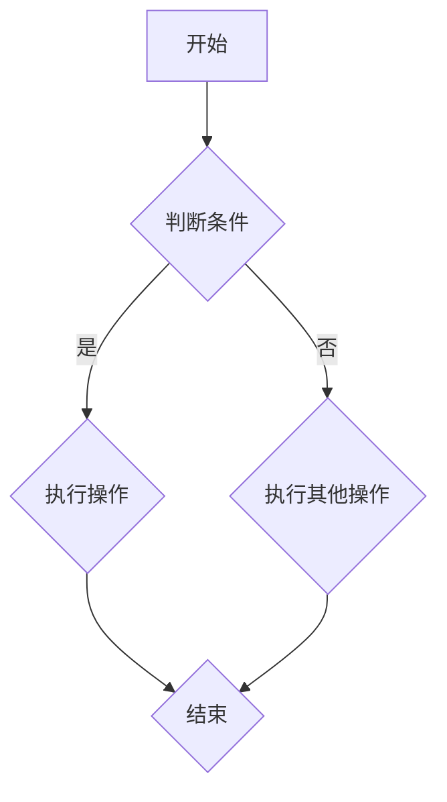

                 

# 《AI技术栈的实战解析》

## 关键词

- 人工智能
- 技术栈
- 实战解析
- 机器学习
- 深度学习
- 自然语言处理
- 计算机视觉
- 强化学习
- 项目实战

## 摘要

本文旨在深入解析AI技术栈的实战应用，涵盖从基础理论到实际项目开发的全面内容。文章首先介绍了AI技术的发展历程和核心技术，包括机器学习、深度学习、自然语言处理和计算机视觉等。随后，本文详细探讨了AI技术在各个领域的应用，如智能制造、医疗健康、金融科技和交通运输。接着，文章分析了AI技术对社会的影响和伦理问题，并探讨了相关的法律法规。最后，本文通过具体的项目实战案例，展示了如何搭建AI开发环境、进行数据采集与处理、模型训练与优化、模型评估与部署。本文旨在为读者提供一套系统的AI技术实战指南，帮助其在AI领域取得实际成果。

### 第一部分：AI技术栈基础

#### 第1章：AI技术概述与基础

##### 1.1 AI技术的发展历程

AI技术的发展历程可以分为几个阶段：从最初的专家系统（Expert Systems）阶段，到基于规则的系统（Rule-Based Systems），再到基于数据的机器学习（Data-Driven Machine Learning）阶段。随着计算能力的提升和大数据的普及，深度学习（Deep Learning）成为AI领域的重要突破。

- **软件1.0时代**：早期计算机程序的逻辑和规则都是人为设定的，软件功能受限。
- **软件2.0时代**：随着算法和数据的引入，软件开始具备自我学习和优化能力，人工智能的概念开始萌芽。
- **AI时代**：深度学习和神经网络技术的突破，使得计算机能够实现复杂的认知任务。

##### 1.2 AI的核心技术

AI的核心技术包括：

- **机器学习（Machine Learning）**：通过算法从数据中学习规律，进行预测和决策。
- **深度学习（Deep Learning）**：基于多层神经网络，能够自动提取特征并进行复杂任务。
- **自然语言处理（Natural Language Processing，NLP）**：使计算机理解和生成人类语言。
- **计算机视觉（Computer Vision）**：使计算机能够理解和解释视觉信息。
- **强化学习（Reinforcement Learning）**：通过试错和反馈进行学习，适用于动态决策问题。

##### 1.3 AI技术的应用领域

AI技术的应用领域广泛，包括但不限于：

- **智能制造**：通过AI技术优化生产流程，提高生产效率。
- **医疗健康**：用于医学影像分析、疾病诊断和个性化治疗。
- **金融科技**：用于风险管理、欺诈检测和智能投资。
- **交通运输**：自动驾驶、智能交通管理和物流优化。

##### 1.4 AI技术的社会影响与伦理问题

AI技术对社会的影响深远：

- **劳动力市场**：自动化技术可能会取代部分传统工作，但也会创造新的就业机会。
- **教育**：AI可以个性化教学，提高学习效率，但也会影响教师的角色。
- **伦理问题**：数据隐私、算法偏见和决策透明性是AI技术面临的重大挑战。

##### 1.5 AI技术栈的基本架构

AI技术栈的基本架构包括三个层次：

- **数据层**：数据是AI的基石，包括数据采集、存储、处理和分析。
- **算法层**：包含机器学习、深度学习、自然语言处理和计算机视觉等算法。
- **应用层**：将算法应用于具体场景，如智能助手、自动驾驶和智能医疗。

### 第二部分：AI技术栈实战

#### 第6章：AI项目实战

##### 6.1 AI项目策划与实施

在策划和实施AI项目时，需要遵循以下步骤：

1. **需求分析**：明确项目的目标和需求。
2. **数据准备**：收集并处理相关数据。
3. **模型选择**：根据任务选择合适的机器学习模型。
4. **模型训练**：使用训练数据对模型进行训练。
5. **模型评估**：使用测试数据评估模型性能。
6. **模型部署**：将模型部署到生产环境中。

##### 6.2 数据采集与处理

数据采集和处理是AI项目的关键步骤，包括：

- **数据源选择**：选择合适的数据源，如公开数据集、企业内部数据等。
- **数据清洗**：去除噪声、缺失值和重复数据。
- **特征工程**：提取对模型训练有帮助的特征。
- **数据预处理**：进行归一化、标准化等处理。

##### 6.3 模型训练与优化

模型训练和优化包括：

- **选择训练算法**：如梯度下降、随机梯度下降等。
- **调整超参数**：如学习率、批量大小等。
- **模型评估**：使用交叉验证等方法评估模型性能。
- **模型优化**：通过调整算法和超参数，提高模型性能。

##### 6.4 模型评估与部署

模型评估和部署包括：

- **评估指标**：如准确率、召回率、F1分数等。
- **部署策略**：如在线部署、离线部署等。
- **监控与维护**：持续监控模型性能，必要时进行调整。

##### 6.5 项目案例分析

以自动驾驶为例，分析一个典型的AI项目：

- **需求分析**：实现无人驾驶汽车。
- **数据采集**：收集大量驾驶数据。
- **模型训练**：使用深度学习模型训练自动驾驶算法。
- **模型评估**：在模拟环境和实际道路上测试模型性能。
- **模型部署**：将模型部署到自动驾驶汽车上。

#### 第7章：AI开发环境搭建

##### 7.1 Python开发环境搭建

Python是AI开发的主要语言，搭建Python开发环境包括：

- **安装Python**：下载并安装Python。
- **配置虚拟环境**：使用virtualenv或conda创建虚拟环境。
- **安装依赖库**：如NumPy、Pandas、TensorFlow、PyTorch等。

##### 7.2 常用深度学习框架安装与配置

常用的深度学习框架包括TensorFlow和PyTorch，安装和配置包括：

- **安装框架**：下载并安装TensorFlow或PyTorch。
- **配置GPU支持**：确保框架支持GPU加速。
- **安装相关库**：安装如CUDA、cuDNN等GPU驱动。

##### 7.3 代码版本控制工具Git的使用

Git是版本控制的主要工具，使用Git包括：

- **安装Git**：下载并安装Git。
- **初始化仓库**：在项目目录中初始化Git仓库。
- **提交更改**：提交代码更改到仓库。
- **分支管理**：创建、合并和删除分支。

##### 7.4 数据库与数据管理工具

数据库和数据管理工具用于存储和管理数据，包括：

- **关系数据库**：如MySQL、PostgreSQL。
- **NoSQL数据库**：如MongoDB、Cassandra。
- **数据仓库**：如Hadoop、Spark。

#### 第8章：AI技术伦理与法规

##### 8.1 AI技术伦理问题

AI技术伦理问题包括：

- **数据隐私**：如何保护用户的个人数据。
- **算法偏见**：如何避免算法对某些群体产生偏见。
- **透明性**：如何确保算法决策的透明性和可解释性。

##### 8.2 数据隐私保护

数据隐私保护措施包括：

- **数据加密**：对敏感数据进行加密。
- **匿名化**：对个人数据进行匿名化处理。
- **数据访问控制**：限制数据访问权限。

##### 8.3 法律法规与政策

全球范围内，许多国家和地区都制定了相关的AI法律法规，如：

- **欧盟**：《通用数据保护条例》（GDPR）。
- **美国**：《加州消费者隐私法案》（CCPA）。
- **中国**：《个人信息保护法》（PIPL）。

#### 第9章：AI技术与未来

##### 9.1 AI技术的发展趋势

AI技术的发展趋势包括：

- **算法创新**：深度学习、强化学习等算法的持续优化。
- **硬件加速**：GPU、TPU等硬件的加速计算能力。
- **多模态学习**：整合多种数据源，如文本、图像和声音。

##### 9.2 AI技术对未来社会的影响

AI技术对未来社会的影响包括：

- **经济影响**：改变劳动力市场，提高生产效率。
- **教育影响**：个性化教学，提高学习效果。
- **社会影响**：改善生活质量，提高社会福祉。

##### 9.3 AI技术的未来挑战与机遇

AI技术的未来挑战与机遇包括：

- **技术挑战**：算法复杂度、数据隐私和安全等问题。
- **机遇**：在医疗、金融、交通等领域的广泛应用，创造新的商业模式。

#### 附录

##### 附录A：AI技术常用工具与资源

- **开源深度学习框架**：TensorFlow、PyTorch、Keras。
- **数据集与数据源**：ImageNet、CIFAR-10、Kaggle。
- **AI技术社区与论坛**：Stack Overflow、Reddit、AI联盟。
- **AI技术相关书籍与论文**：《深度学习》（Goodfellow et al.）、《人工智慧：一种现代的方法》（Mitchell）。

##### 附录B：Mermaid流程图示例

### 作者信息

作者：AI天才研究院/AI Genius Institute & 禅与计算机程序设计艺术 /Zen And The Art of Computer Programming

