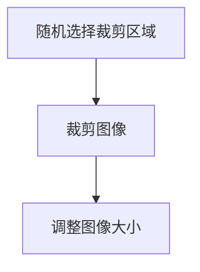
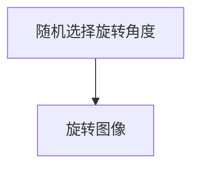
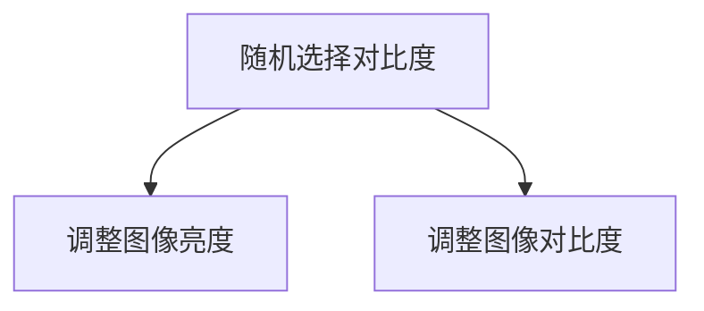
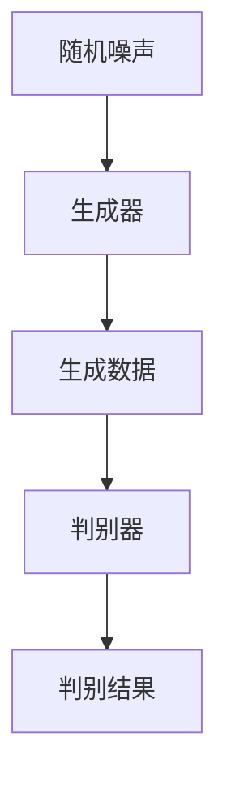

                 

# 《AI数据增强》

## 关键词
AI数据增强，生成对抗网络（GAN），迁移学习，模型鲁棒性，图像识别，自然语言处理

## 摘要
本文将深入探讨AI数据增强的重要性及其在提高人工智能模型性能中的应用。我们将详细分析数据增强的基本概念、方法、算法原理，并通过实战案例展示数据增强的实际应用。同时，本文还将探讨数据增强与模型鲁棒性、迁移学习的关系，以及未来的发展趋势和挑战。

## 目录大纲

## 第一部分：AI数据增强基础

### 第1章：AI数据增强概述

#### 1.1 AI数据增强的重要性

#### 1.2 数据增强与AI模型性能

#### 1.3 AI数据增强的挑战与机遇

### 第2章：AI数据增强方法

#### 2.1 图像数据增强

##### 2.1.1 随机裁剪

##### 2.1.2 随机旋转

##### 2.1.3 对比度与亮度调整

#### 2.2 文本数据增强

##### 2.2.1 随机填充与删除

##### 2.2.2 随机替换

##### 2.2.3 生成对抗网络

### 第3章：AI数据增强算法原理

#### 3.1 生成对抗网络（GAN）

##### 3.1.1 GAN的架构

##### 3.1.2 GAN的优化算法

##### 3.1.3 GAN的应用场景

### 第4章：AI数据增强应用实践

#### 4.1 图像数据增强实战

##### 4.1.1 实战环境搭建

##### 4.1.2 数据预处理

##### 4.1.3 数据增强算法实现

##### 4.1.4 结果分析

#### 4.2 文本数据增强实战

##### 4.2.1 实战环境搭建

##### 4.2.2 数据预处理

##### 4.2.3 数据增强算法实现

##### 4.2.4 结果分析

## 第二部分：AI数据增强高级主题

### 第5章：AI数据增强与模型鲁棒性

#### 5.1 数据增强与模型鲁棒性关系

#### 5.2 鲁棒性数据增强方法

##### 5.2.1 随机噪声注入

##### 5.2.2 基于统计的方法

##### 5.2.3 基于对抗性的方法

### 第6章：AI数据增强与迁移学习

#### 6.1 迁移学习基础

#### 6.2 数据增强在迁移学习中的应用

##### 6.2.1 基于数据增强的预训练

##### 6.2.2 迁移学习中的数据增强方法

### 第7章：AI数据增强未来趋势

#### 7.1 数据增强技术的发展

#### 7.2 数据增强与AI伦理

##### 7.2.1 数据隐私保护

##### 7.2.2 AI算法公平性

##### 7.2.3 数据增强伦理挑战

## 第8章：AI数据增强应用案例研究

### 8.1 图像识别中的数据增强

#### 8.1.1 数据增强在图像识别中的应用案例

#### 8.1.2 案例分析与优化

### 8.2 自然语言处理中的数据增强

#### 8.2.1 数据增强在自然语言处理中的应用案例

#### 8.2.2 案例分析与优化

## 附录

### 附录A：AI数据增强常用工具和库

#### A.1 数据增强工具和库介绍

#### A.2 数据增强工具和库使用指南

### 附录B：AI数据增强数学公式和算法伪代码

#### B.1 数学公式和算法伪代码列表

#### B.2 数学公式和算法伪代码详细解释

### 附录C：AI数据增强项目实战代码解读

#### C.1 实战项目代码解读

#### C.2 代码解读与分析

### 引言

在人工智能（AI）领域，数据是模型的基石。然而，现实世界中的数据往往有限，且具有多样性、不平衡性等特点，这对AI模型的训练和性能提升构成了巨大挑战。数据增强作为一种技术手段，旨在通过创造或修改原始数据，生成与原始数据具有相似特性的新数据，从而丰富训练集，提升模型泛化能力和鲁棒性。

本文旨在系统地探讨AI数据增强的各个方面。我们将从基础理论出发，逐步深入到数据增强的方法、算法原理及其在实际应用中的效果。通过本文，读者将了解到：

1. 数据增强在AI领域的重要性及其对模型性能的提升作用。
2. 数据增强的基本概念和方法，包括图像和文本数据增强。
3. 生成对抗网络（GAN）等核心算法原理及其应用场景。
4. 数据增强在实际应用中的效果评估和优化方法。
5. 数据增强与模型鲁棒性、迁移学习的关系及其未来发展趋势。

接下来，我们将分章节详细探讨这些主题。

## 第1章：AI数据增强概述

### 1.1 AI数据增强的重要性

在AI领域，模型性能的提升往往依赖于大量的高质量训练数据。然而，现实世界中的数据往往受到各种限制，如数据量有限、数据不平衡、数据多样性不足等问题。这些问题会导致模型在训练过程中出现过拟合现象，即模型在训练数据上表现良好，但在未知数据上的表现不佳。

数据增强旨在通过多种技术手段，生成与原始数据具有相似特性的新数据，从而丰富训练集，提升模型泛化能力和鲁棒性。具体来说，数据增强有以下几个重要作用：

1. **提高模型泛化能力**：通过增加训练数据的多样性，模型可以更好地学习数据的本质特征，从而提高在未知数据上的表现。

2. **降低过拟合风险**：过拟合是由于模型在训练数据上学习到了过多噪声信息，导致在未知数据上的表现不佳。数据增强可以通过增加训练数据量，降低模型对噪声的依赖，从而减少过拟合风险。

3. **提升模型鲁棒性**：通过引入各种噪声和异常值，模型可以更好地适应各种数据分布，提高对异常数据的处理能力。

4. **节省计算资源**：在某些应用场景中，如自动驾驶、医疗影像分析等，获取高质量数据成本较高。通过数据增强，可以在一定程度上减少对高质量数据的依赖，从而节省计算资源。

### 1.2 数据增强与AI模型性能

数据增强对AI模型性能的影响可以通过以下几个方面来衡量：

1. **训练误差**：数据增强可以增加模型在训练集上的表现，从而降低训练误差。

2. **验证误差**：数据增强对验证集上的误差有显著的改善作用，从而提高模型在未知数据上的表现。

3. **测试误差**：数据增强可以降低模型在测试集上的误差，从而提高模型在真实应用场景中的性能。

4. **泛化能力**：数据增强可以提升模型在多种数据分布上的表现，从而增强模型的泛化能力。

5. **鲁棒性**：数据增强可以增强模型对异常数据的处理能力，从而提高模型的鲁棒性。

在实际应用中，数据增强的效果往往依赖于数据增强方法的选择、数据增强的程度以及训练过程的优化。合理的数据增强策略不仅可以显著提升模型性能，还可以提高模型在实际应用中的可靠性和稳定性。

### 1.3 AI数据增强的挑战与机遇

虽然数据增强在提升AI模型性能方面具有显著优势，但同时也面临着一些挑战和机遇：

1. **计算资源消耗**：数据增强通常需要大量的计算资源，特别是在生成高质量数据时。这对于计算资源有限的场景来说是一个挑战。

2. **数据质量**：生成的新数据需要与原始数据具有相似的特性，否则可能会引入新的噪声，影响模型性能。

3. **算法选择**：不同的数据增强方法适用于不同的数据类型和应用场景，选择合适的算法是关键。

4. **模型适应性**：数据增强的效果依赖于模型的适应能力，某些模型可能对数据增强方法的适应性较差。

5. **隐私保护**：在涉及个人隐私的数据场景中，数据增强需要考虑到隐私保护的问题。

然而，随着计算能力的提升、算法的改进以及数据增强技术的发展，这些挑战也在逐渐被克服。未来，数据增强将在AI领域中发挥越来越重要的作用，为AI模型性能的提升带来新的机遇。

### 结论

本章介绍了AI数据增强的重要性及其对模型性能的提升作用。通过数据增强，我们可以提高模型的泛化能力、降低过拟合风险、提升模型鲁棒性，从而在多种应用场景中取得更好的性能。然而，数据增强也面临着一些挑战，需要我们在实际应用中合理选择数据增强方法，并优化训练过程。接下来，我们将进一步探讨AI数据增强的具体方法和技术。

## 第2章：AI数据增强方法

在AI领域，数据增强是一种常用的技术手段，通过增加数据集的多样性和丰富性，以提高模型的泛化能力和鲁棒性。本章节将详细介绍几种常用的AI数据增强方法，包括图像数据增强和文本数据增强。

### 2.1 图像数据增强

图像数据增强是数据增强领域的一个重要分支，其目的是通过修改原始图像，生成与原始图像具有相似特征的新图像，从而丰富训练数据集。以下是一些常见的图像数据增强方法：

#### 2.1.1 随机裁剪

随机裁剪是一种简单而有效的数据增强方法。它通过从原始图像中随机裁剪出不同大小和形状的子图像，从而增加数据集的多样性。具体步骤如下：

1. **定义裁剪区域**：随机选择裁剪区域的位置和大小。
2. **裁剪图像**：从原始图像中裁剪出定义的裁剪区域。
3. **调整图像大小**：如果裁剪后的图像大小小于目标大小，可以通过插值方法调整图像大小。

**Mermaid流程图**：



#### 2.1.2 随机旋转

随机旋转通过将原始图像随机旋转一定角度，从而增加图像的多样性。具体步骤如下：

1. **随机选择旋转角度**：从预设的旋转角度集合中随机选择一个角度。
2. **旋转图像**：根据选择的旋转角度，使用旋转函数旋转图像。

**Mermaid流程图**：



#### 2.1.3 对比度与亮度调整

对比度与亮度调整通过调整图像的亮度和对比度，增强图像的特征，从而提高模型在训练过程中的识别能力。具体步骤如下：

1. **随机选择亮度**：从预设的亮度范围中随机选择一个亮度值。
2. **随机选择对比度**：从预设的对比度范围中随机选择一个对比度值。
3. **调整图像亮度与对比度**：根据选择的亮度和对比度值，调整图像的亮度和对比度。

**Mermaid流程图**：



#### 2.1.4 其他图像增强方法

除了上述方法外，还有许多其他图像增强方法，如随机缩放、颜色抖动、添加噪声等。这些方法可以根据具体应用场景进行选择和组合，以实现最佳的数据增强效果。

### 2.2 文本数据增强

文本数据增强在自然语言处理（NLP）领域中具有重要意义。通过增强文本数据的多样性，可以提升模型对自然语言的理解能力。以下是一些常见的文本数据增强方法：

#### 2.2.1 随机填充与删除

随机填充与删除通过在文本中随机插入或删除字符或单词，从而增加文本的多样性。具体步骤如下：

1. **随机选择填充位置**：从文本中随机选择一个位置进行填充。
2. **随机选择填充字符或单词**：从预设的字符或单词集合中随机选择一个字符或单词。
3. **填充文本**：在选定的位置插入选择的字符或单词。

**伪代码**：

```python
def random_fill(text, char_list, word_list):
    position = random.randint(0, len(text))
    if random.random() < 0.5:
        char = random.choice(char_list)
        text = text[:position] + char + text[position:]
    else:
        word = random.choice(word_list)
        text = text[:position] + word + text[position:]
    return text
```

#### 2.2.2 随机替换

随机替换通过将文本中的字符或单词替换为其他字符或单词，从而增加文本的多样性。具体步骤如下：

1. **随机选择替换位置**：从文本中随机选择一个位置进行替换。
2. **随机选择替换字符或单词**：从预设的字符或单词集合中随机选择一个字符或单词。
3. **替换文本**：在选定的位置替换为选择的字符或单词。

**伪代码**：

```python
def random_replace(text, char_list, word_list):
    position = random.randint(0, len(text))
    if random.random() < 0.5:
        char = random.choice(char_list)
        text = text[:position] + char + text[position+1:]
    else:
        word = random.choice(word_list)
        text = text[:position] + word + text[position+len(word):]
    return text
```

#### 2.2.3 生成对抗网络（GAN）

生成对抗网络（GAN）是一种强大的文本生成方法。通过训练生成器和判别器，GAN可以生成与原始文本具有相似特征的新文本。具体步骤如下：

1. **生成器（Generator）**：生成器接收随机噪声作为输入，生成与原始文本相似的文本。
2. **判别器（Discriminator）**：判别器接收原始文本和生成文本作为输入，判断文本的真伪。
3. **对抗训练**：通过对抗训练，优化生成器和判别器的参数，使得生成器生成的文本越来越接近真实文本。

**伪代码**：

```python
def train_gan(generator, discriminator, num_epochs):
    for epoch in range(num_epochs):
        for real_text, _ in train_loader:
            # 训练判别器
            discriminator.zero_grad()
            real_text = Variable(real_text)
            real_score = discriminator(real_text)
            
            fake_text = generator(z)
            fake_score = discriminator(fake_text)
            
            d_loss = (torch.mean(real_score) - torch.mean(fake_score)).abs()
            
            d_loss.backward()
            optimizer_d.step()
            
        z = Variable(z)
        generator.zero_grad()
        g_loss = torch.mean(discriminator(generator(z)))
        
        g_loss.backward()
        optimizer_g.step()
        
        print(f'Epoch [{epoch+1}/{num_epochs}], D_loss: {d_loss.item():.4f}, G_loss: {g_loss.item():.4f}')
```

### 2.3 总结

数据增强是AI领域中一个重要的研究方向。通过多种数据增强方法，可以有效地提高模型的泛化能力和鲁棒性。本章介绍了图像数据增强和文本数据增强的常用方法，包括随机裁剪、随机旋转、对比度与亮度调整、随机填充与删除、随机替换以及生成对抗网络（GAN）。在实际应用中，可以根据具体需求和数据特性选择合适的数据增强方法，以达到最佳的数据增强效果。

## 第3章：AI数据增强算法原理

AI数据增强算法是提升模型性能和泛化能力的关键技术之一。本章将深入探讨AI数据增强的核心算法原理，特别是生成对抗网络（GAN）的架构、优化算法及其应用场景。

### 3.1 生成对抗网络（GAN）

生成对抗网络（GAN）由Ian Goodfellow等人于2014年提出，是一种基于博弈论的深度学习框架。GAN的核心思想是利用生成器和判别器的对抗训练，生成与真实数据相似的高质量数据。

#### 3.1.1 GAN的架构

GAN由两个深度神经网络组成：生成器（Generator）和判别器（Discriminator）。生成器尝试生成与真实数据相似的数据，而判别器则试图区分生成数据与真实数据。两者在对抗训练过程中相互竞争，生成器的目标是欺骗判别器，使其无法区分生成数据与真实数据，而判别器的目标是准确区分两者。

1. **生成器（Generator）**：
   - 输入：随机噪声（通常是均匀分布或高斯分布的向量）。
   - 输出：生成的数据，例如图像、文本或其他类型的数据。

2. **判别器（Discriminator）**：
   - 输入：真实数据和生成数据。
   - 输出：概率值，表示输入数据为真实数据的置信度。

GAN的总体架构可以表示为：

**Mermaid流程图**：



#### 3.1.2 GAN的优化算法

GAN的优化算法主要涉及生成器和判别器的损失函数。常见的损失函数包括对抗性损失和分类损失。

1. **对抗性损失（Adversarial Loss）**：
   - 目标是使判别器无法区分生成数据和真实数据。
   - 对于生成器，对抗性损失的目的是最小化生成数据的判别器评分。
   - 对于判别器，对抗性损失的目的是最大化生成数据和真实数据的判别器评分。

对抗性损失通常使用以下形式：

$$
L_G = -\log(D(G(z)))
$$

$$
L_D = -[\log(D(x)) + \log(1 - D(G(z))]
$$

其中，$D(x)$表示判别器对真实数据的评分，$D(G(z))$表示判别器对生成数据的评分。

2. **分类损失（Classification Loss）**：
   - 目标是使判别器能够准确分类生成数据和真实数据。
   - 常用的分类损失函数包括交叉熵损失（Cross-Entropy Loss）和均方误差（Mean Squared Error, MSE）。

GAN的优化算法通常采用梯度下降法，交替训练生成器和判别器。具体步骤如下：

1. **固定判别器**：在固定判别器的情况下，优化生成器。
2. **固定生成器**：在固定生成器的情况下，优化判别器。
3. **交替迭代**：重复上述步骤，直到生成器生成的数据质量达到预期。

**伪代码**：

```python
# GAN优化算法伪代码
for epoch in range(num_epochs):
    for real_data, _ in train_loader:
        # 固定判别器，优化生成器
        optimizer_g.zero_grad()
        fake_data = generator(z)
        g_loss = -torch.log(discriminator(fake_data))
        g_loss.backward()
        optimizer_g.step()
        
    for _ in range(num_updates_d):
        # 固定生成器，优化判别器
        optimizer_d.zero_grad()
        real_data = Variable(real_data)
        fake_data = Variable(fake_data)
        d_loss = -torch.log(discriminator(real_data)) - torch.log(1 - discriminator(fake_data))
        d_loss.backward()
        optimizer_d.step()
```

#### 3.1.3 GAN的应用场景

GAN在多个领域具有广泛的应用，包括图像生成、图像修复、图像风格迁移、文本生成、数据增强等。

1. **图像生成**：GAN可以生成逼真的图像，如图像到图像的转换、图像修复和图像风格迁移。

2. **图像修复**：GAN可以用于图像修复任务，如去噪、去除图像中的损坏部分等。

3. **图像风格迁移**：GAN可以用于图像风格迁移，将一种图像风格应用到另一幅图像上。

4. **文本生成**：GAN可以生成与给定文本风格相似的文本，用于自然语言处理任务。

5. **数据增强**：GAN可以用于数据增强，通过生成与原始数据具有相似特征的数据，增加训练集的多样性。

### 3.2 GAN的变体和改进

虽然GAN在许多任务中取得了显著的成果，但原始GAN模型存在一些问题，如模式崩溃（Mode Collapse）和训练不稳定。为了解决这些问题，研究人员提出了许多GAN的变体和改进方法。

1. **深度卷积生成对抗网络（DCGAN）**：DCGAN使用深度卷积神经网络作为生成器和判别器，提高了GAN的训练稳定性和生成质量。

2. **谱归一化GAN（SRGAN）**：SRGAN在DCGAN的基础上引入了谱归一化，进一步提高了图像生成质量。

3. **条件生成对抗网络（cGAN）**：cGAN引入了条件信息，使得生成器和判别器能够同时学习条件和生成数据之间的关系。

4. **混合条件生成对抗网络（Hinge GAN）**：Hinge GAN使用 hinge loss 替代原始 GAN 的二元交叉熵损失，提高了生成器和判别器的训练稳定性。

5. **多任务生成对抗网络（MTGAN）**：MTGAN将多个生成任务组合在一起，通过联合训练提高生成器的性能。

### 结论

GAN是一种强大的AI数据增强算法，通过生成器和判别器的对抗训练，可以生成与真实数据相似的高质量数据。本章介绍了GAN的架构、优化算法和应用场景，并讨论了GAN的变体和改进方法。在实际应用中，选择合适的GAN模型和优化策略，可以实现高效的数据增强，从而提高AI模型的性能。

### 3.3 GAN应用场景解析

生成对抗网络（GAN）由于其独特的对抗性训练机制，在多种AI任务中展现出了卓越的性能。以下将详细解析GAN在图像生成、图像修复和图像风格迁移等应用场景中的具体实现。

#### 3.3.1 图像生成

图像生成是GAN最具代表性的应用之一。通过训练生成器网络，GAN可以生成逼真的图像，例如人脸、风景、艺术作品等。以下是一个简单的图像生成流程：

1. **数据预处理**：将原始图像数据转换为适合训练的格式，如调整图像大小、归一化像素值等。
2. **生成器网络**：生成器网络通常由多个卷积层和反卷积层组成，接收随机噪声作为输入，输出生成图像。以下是一个简单的生成器网络伪代码：

```python
class Generator(nn.Module):
    def __init__(self):
        super(Generator, self).__init__()
        self.model = nn.Sequential(
            nn.ConvTranspose2d(z_dim, 64, 4, 1, 0, bias=False),
            nn.BatchNorm2d(64),
            nn.ReLU(True),
            nn.ConvTranspose2d(64, 1, 4, 2, 1, bias=False),
            nn.Tanh()
        )

    def forward(self, input):
        return self.model(input)
```

3. **判别器网络**：判别器网络用于区分生成图像和真实图像，通常由多个卷积层组成。以下是一个简单的判别器网络伪代码：

```python
class Discriminator(nn.Module):
    def __init__(self):
        super(Discriminator, self).__init__()
        self.model = nn.Sequential(
            nn.Conv2d(1, 64, 4, 2, 1, bias=False),
            nn.LeakyReLU(0.2, inplace=True),
            nn.Conv2d(64, 1, 4, 2, 1, bias=False),
            nn.Sigmoid()
        )

    def forward(self, input):
        return self.model(input)
```

4. **损失函数**：GAN的损失函数通常包括对抗性损失和分类损失。对抗性损失旨在使判别器无法区分生成图像和真实图像，分类损失旨在使判别器能够正确分类生成图像和真实图像。以下是一个简单的损失函数伪代码：

```python
def loss_function(real_images, fake_images, discriminator):
    real_loss = torch.mean(discriminator(real_images))
    fake_loss = torch.mean(discriminator(fake_images))
    g_loss = fake_loss
    d_loss = real_loss + fake_loss
    return g_loss, d_loss
```

5. **训练过程**：在训练过程中，交替更新生成器和判别器的参数。以下是一个简单的训练过程伪代码：

```python
for epoch in range(num_epochs):
    for real_images, _ in train_loader:
        # 固定判别器，优化生成器
        optimizer_g.zero_grad()
        fake_images = generator(z)
        g_loss, d_loss = loss_function(real_images, fake_images, discriminator)
        g_loss.backward()
        optimizer_g.step()
        
    for _ in range(num_updates_d):
        # 固定生成器，优化判别器
        optimizer_d.zero_grad()
        real_images = Variable(real_images)
        fake_images = Variable(fake_images)
        g_loss, d_loss = loss_function(real_images, fake_images, discriminator)
        d_loss.backward()
        optimizer_d.step()
```

#### 3.3.2 图像修复

图像修复是GAN在计算机视觉领域的另一个重要应用。通过训练生成器网络，GAN可以修复图像中的噪声、损坏或模糊部分。以下是一个简单的图像修复流程：

1. **数据预处理**：将原始图像和需要修复的部分分割，并将它们转换为适合训练的格式。
2. **生成器网络**：生成器网络接收分割后的原始图像和需要修复的部分作为输入，输出修复后的图像。以下是一个简单的生成器网络伪代码：

```python
class RepairGenerator(nn.Module):
    def __init__(self):
        super(RepairGenerator, self).__init__()
        self.model = nn.Sequential(
            nn.Conv2d(3, 64, 3, 1, 1, bias=False),
            nn.BatchNorm2d(64),
            nn.ReLU(True),
            nn.Conv2d(64, 3, 3, 1, 1, bias=False),
            nn.Tanh()
        )

    def forward(self, input):
        return self.model(input)
```

3. **判别器网络**：判别器网络用于区分修复图像和原始图像，以下是一个简单的判别器网络伪代码：

```python
class RepairDiscriminator(nn.Module):
    def __init__(self):
        super(RepairDiscriminator, self).__init__()
        self.model = nn.Sequential(
            nn.Conv2d(3, 64, 3, 1, 1, bias=False),
            nn.LeakyReLU(0.2, inplace=True),
            nn.Conv2d(64, 1, 3, 1, 1, bias=False),
            nn.Sigmoid()
        )

    def forward(self, input):
        return self.model(input)
```

4. **损失函数**：GAN的损失函数与图像生成类似，对抗性损失和分类损失共同作用，以优化生成器和判别器。以下是一个简单的损失函数伪代码：

```python
def repair_loss_function(real_images, fake_images, discriminator):
    real_loss = torch.mean(discriminator(real_images))
    fake_loss = torch.mean(discriminator(fake_images))
    g_loss = fake_loss
    d_loss = real_loss + fake_loss
    return g_loss, d_loss
```

5. **训练过程**：在训练过程中，交替更新生成器和判别器的参数。以下是一个简单的训练过程伪代码：

```python
for epoch in range(num_epochs):
    for real_images, repair_masks in train_loader:
        # 固定判别器，优化生成器
        optimizer_g.zero_grad()
        fake_repair_masks = generator(repair_masks)
        fake_images = real_images * (1 - repair_masks) + fake_repair_masks * repair_masks
        g_loss, d_loss = repair_loss_function(real_images, fake_images, discriminator)
        g_loss.backward()
        optimizer_g.step()
        
    for _ in range(num_updates_d):
        # 固定生成器，优化判别器
        optimizer_d.zero_grad()
        real_images = Variable(real_images)
        fake_images = Variable(fake_images)
        g_loss, d_loss = repair_loss_function(real_images, fake_images, discriminator)
        d_loss.backward()
        optimizer_d.step()
```

#### 3.3.3 图像风格迁移

图像风格迁移是GAN在计算机视觉领域的另一个重要应用。通过训练生成器网络，GAN可以将一种图像风格应用到另一幅图像上，从而生成具有特定艺术风格的图像。以下是一个简单的图像风格迁移流程：

1. **数据预处理**：将原始图像和风格图像转换为适合训练的格式。
2. **生成器网络**：生成器网络接收原始图像和风格图像作为输入，输出风格迁移后的图像。以下是一个简单的生成器网络伪代码：

```python
class StyleGenerator(nn.Module):
    def __init__(self):
        super(StyleGenerator, self).__init__()
        self.model = nn.Sequential(
            nn.Conv2d(3, 64, 3, 1, 1, bias=False),
            nn.BatchNorm2d(64),
            nn.ReLU(True),
            nn.Conv2d(64, 3, 3, 1, 1, bias=False),
            nn.Tanh()
        )

    def forward(self, input):
        return self.model(input)
```

3. **判别器网络**：判别器网络用于区分风格迁移图像和原始图像，以下是一个简单的判别器网络伪代码：

```python
class StyleDiscriminator(nn.Module):
    def __init__(self):
        super(StyleDiscriminator, self).__init__()
        self.model = nn.Sequential(
            nn.Conv2d(3, 64, 3, 1, 1, bias=False),
            nn.LeakyReLU(0.2, inplace=True),
            nn.Conv2d(64, 1, 3, 1, 1, bias=False),
            nn.Sigmoid()
        )

    def forward(self, input):
        return self.model(input)
```

4. **损失函数**：GAN的损失函数与图像生成类似，对抗性损失和分类损失共同作用，以优化生成器和判别器。以下是一个简单的损失函数伪代码：

```python
def style_loss_function(real_images, fake_images, discriminator):
    real_loss = torch.mean(discriminator(real_images))
    fake_loss = torch.mean(discriminator(fake_images))
    g_loss = fake_loss
    d_loss = real_loss + fake_loss
    return g_loss, d_loss
```

5. **训练过程**：在训练过程中，交替更新生成器和判别器的参数。以下是一个简单的训练过程伪代码：

```python
for epoch in range(num_epochs):
    for real_images, style_images in train_loader:
        # 固定判别器，优化生成器
        optimizer_g.zero_grad()
        fake_images = generator(style_images)
        g_loss, d_loss = style_loss_function(real_images, fake_images, discriminator)
        g_loss.backward()
        optimizer_g.step()
        
    for _ in range(num_updates_d):
        # 固定生成器，优化判别器
        optimizer_d.zero_grad()
        real_images = Variable(real_images)
        fake_images = Variable(fake_images)
        g_loss, d_loss = style_loss_function(real_images, fake_images, discriminator)
        d_loss.backward()
        optimizer_d.step()
```

### 结论

本章详细解析了GAN在图像生成、图像修复和图像风格迁移等应用场景中的实现。通过GAN的对抗性训练机制，生成器和判别器相互竞争，最终生成高质量的数据。在实际应用中，选择合适的GAN模型和优化策略，可以实现高效的数据增强和图像处理，从而提升AI模型的性能。

## 第4章：AI数据增强应用实践

数据增强技术在实际应用中具有重要作用，可以有效提高AI模型的性能和泛化能力。本章节将详细介绍图像数据增强和文本数据增强的实战应用，包括环境搭建、数据预处理、算法实现以及结果分析。

### 4.1 图像数据增强实战

图像数据增强是计算机视觉领域的一项关键技术，通过增加训练数据的多样性，可以提高模型的识别能力和鲁棒性。以下是一个简单的图像数据增强实战案例，我们将使用Python和PyTorch框架来实现。

#### 4.1.1 实战环境搭建

首先，我们需要搭建一个适合图像数据增强的实战环境。以下是所需的Python包和依赖：

- PyTorch
- torchvision
- numpy
- matplotlib

安装这些包可以使用以下命令：

```bash
pip install torch torchvision numpy matplotlib
```

#### 4.1.2 数据预处理

在开始数据增强之前，我们需要对图像数据进行预处理，包括图像的加载、归一化和数据集的划分。以下是一个简单的预处理示例：

```python
import torchvision.transforms as transforms
from torchvision.datasets import ImageFolder
from torch.utils.data import DataLoader

# 定义预处理变换
transform = transforms.Compose([
    transforms.Resize((224, 224)),  # 调整图像大小
    transforms.ToTensor(),           # 将图像转换为Tensor
    transforms.Normalize(mean=[0.485, 0.456, 0.406], std=[0.229, 0.224, 0.225]),  # 归一化
])

# 加载训练集和测试集
train_dataset = ImageFolder('train_data', transform=transform)
test_dataset = ImageFolder('test_data', transform=transform)

# 创建数据加载器
train_loader = DataLoader(train_dataset, batch_size=32, shuffle=True)
test_loader = DataLoader(test_dataset, batch_size=32, shuffle=False)
```

#### 4.1.3 数据增强算法实现

接下来，我们将实现一个简单的图像数据增强算法，包括随机裁剪、随机旋转和对比度调整。以下是一个简单的数据增强类：

```python
import torch
import torchvision.transforms as transforms

class ImageAugmentation:
    def __init__(self):
        self.augmentations = transforms.Compose([
            transforms.RandomCrop(224),       # 随机裁剪
            transforms.RandomHorizontalFlip(),  # 随机水平翻转
            transforms.RandomRotation(10),     # 随机旋转
            transforms.RandomAdjustment(0.5),  # 对比度调整
        ])

    def __call__(self, img, target):
        return self.augmentations(img), target

# 实例化数据增强类
image_augmentation = ImageAugmentation()

# 应用数据增强
def apply_augmentation(batch):
    images, targets = batch
    augmented_images, augmented_targets = image_augmentation(images, targets)
    return augmented_images, augmented_targets

# 应用数据增强到训练集
for images, targets in train_loader:
    augmented_images, augmented_targets = apply_augmentation((images, targets))
    break
```

#### 4.1.4 结果分析

在完成数据增强后，我们可以通过评估模型在增强数据和原始数据上的性能来分析数据增强的效果。以下是一个简单的性能评估示例：

```python
import torch
from torchvision.models import resnet18
from torch.utils.data import DataLoader

# 定义模型
model = resnet18(pretrained=True)
model.eval()

# 加载增强后的训练集
augmented_train_loader = DataLoader(train_dataset, batch_size=32, shuffle=True)

# 计算模型在增强数据上的准确率
correct = 0
total = 0
with torch.no_grad():
    for images, targets in augmented_train_loader:
        outputs = model(images)
        _, predicted = torch.max(outputs.data, 1)
        total += targets.size(0)
        correct += (predicted == targets).sum().item()

accuracy = 100 * correct / total
print(f'Enhanced Data Accuracy: {accuracy:.2f}%')
```

通过上述实战案例，我们可以看到图像数据增强在实际应用中的实现过程和效果。类似的方法也可以应用于其他类型的图像数据增强任务，如图像风格迁移、图像去噪等。

### 4.2 文本数据增强实战

文本数据增强在自然语言处理（NLP）领域同样至关重要，通过增加文本数据的多样性，可以提高模型的鲁棒性和泛化能力。以下是一个简单的文本数据增强实战案例，我们将使用Python和Hugging Face的Transformers库来实现。

#### 4.2.1 实战环境搭建

首先，我们需要搭建一个适合文本数据增强的实战环境。以下是所需的Python包和依赖：

- transformers
- torch
- datasets

安装这些包可以使用以下命令：

```bash
pip install transformers torch datasets
```

#### 4.2.2 数据预处理

在开始文本数据增强之前，我们需要对文本数据进行预处理，包括加载数据、分割句子和序列化标签。以下是一个简单的预处理示例：

```python
from datasets import load_dataset

# 加载数据集
dataset = load_dataset('squad')

# 分割句子和标签
def preprocess_data(examples):
    questions = [q['question'] for q in examples['question']]
    contexts = [q['context'] for q in examples['context']]
    answers = [a['answer'] for a in examples['answer']]
    return {
        'question': questions,
        'context': contexts,
        'answer': answers
    }

# 预处理数据集
train_dataset = preprocess_data(dataset['train'])
test_dataset = preprocess_data(dataset['test'])

# 序列化标签
def tokenize_data(batch):
    questions = batch['question']
    contexts = batch['context']
    answers = batch['answer']
    inputs = tokenizer(questions + contexts, context_len=512, return_tensors='pt')
    inputs['answer'] = torch.tensor(answers)
    return inputs

# 创建数据加载器
train_loader = DataLoader(train_dataset, batch_size=16, shuffle=True)
test_loader = DataLoader(test_dataset, batch_size=16, shuffle=False)
```

#### 4.2.3 数据增强算法实现

接下来，我们将实现一个简单的文本数据增强算法，包括随机填充、随机删除和随机替换。以下是一个简单的数据增强类：

```python
import random
from transformers import BertTokenizer

# 定义文本增强函数
def random_fill(text, char_list=['a', 'b', 'c'], replace_prob=0.5):
    tokens = tokenizer.tokenize(text)
    for i in range(len(tokens)):
        if random.random() < replace_prob:
            tokens[i] = random.choice(char_list)
    return tokenizer.convert_tokens_to_string(tokens)

def random_delete(text, delete_prob=0.5):
    tokens = tokenizer.tokenize(text)
    for i in range(len(tokens)):
        if random.random() < delete_prob:
            tokens.pop(i)
    return tokenizer.convert_tokens_to_string(tokens)

def random_replace(text, word_list=['apple', 'banana'], replace_prob=0.5):
    tokens = tokenizer.tokenize(text)
    for i in range(len(tokens)):
        if random.random() < replace_prob:
            tokens[i] = random.choice(word_list)
    return tokenizer.convert_tokens_to_string(tokens)

# 实例化数据增强类
tokenizer = BertTokenizer.from_pretrained('bert-base-uncased')
text_augmentation = {
    'fill': random_fill,
    'delete': random_delete,
    'replace': random_replace
}

# 应用数据增强
def apply_augmentation(batch):
    question = batch['question']
    context = batch['context']
    answer = batch['answer']
    question = text_augmentation['fill'](question, replace_prob=0.5)
    context = text_augmentation['delete'](context, delete_prob=0.5)
    context = text_augmentation['replace'](context, word_list=['apple', 'banana'], replace_prob=0.5)
    return {
        'question': question,
        'context': context,
        'answer': answer
    }

# 应用数据增强到训练集
for batch in train_loader:
    augmented_batch = apply_augmentation(batch)
    break
```

#### 4.2.4 结果分析

在完成文本数据增强后，我们可以通过评估模型在增强数据和原始数据上的性能来分析数据增强的效果。以下是一个简单的性能评估示例：

```python
import torch
from transformers import BertForQuestionAnswering

# 定义模型
model = BertForQuestionAnswering.from_pretrained('bert-base-uncased')
model.eval()

# 加载增强后的训练集
augmented_train_loader = DataLoader(train_dataset, batch_size=16, shuffle=True)

# 计算模型在增强数据上的准确率
correct = 0
total = 0
with torch.no_grad():
    for batch in augmented_train_loader:
        inputs = tokenize_data(batch)
        outputs = model(**inputs)
        logits = outputs.logits
        start_logits, end_logits = logits.split(1, dim=-1)
        start_indices = torch.argmax(start_logits, dim=-1)
        end_indices = torch.argmax(end_logits, dim=-1)
        predicted_answers = tokenizer.decode(inputs['input_ids'][..., start_indices, end_indices])
        correct_answers = tokenizer.decode(batch['answer'])
        total += len(correct_answers)
        correct += (predicted_answers == correct_answers).sum().item()

accuracy = 100 * correct / total
print(f'Enhanced Data Accuracy: {accuracy:.2f}%')
```

通过上述实战案例，我们可以看到文本数据增强在实际应用中的实现过程和效果。类似的方法也可以应用于其他类型的文本数据增强任务，如文本生成、对话系统等。

### 结论

本章通过图像数据增强和文本数据增强的实战案例，详细介绍了数据增强在实际应用中的实现方法和效果。通过合理的预处理和算法设计，我们可以有效地提高AI模型的性能和泛化能力，为实际应用场景提供有力的支持。

### 4.3 图像数据增强实战：环境搭建与数据预处理

在实际应用中，图像数据增强是一个关键步骤，它能够显著提高深度学习模型的性能。本节我们将详细讲解如何搭建图像数据增强的实战环境，并介绍数据预处理的具体过程。

#### 4.3.1 环境搭建

为了搭建一个图像数据增强的实战环境，我们需要安装以下Python包：

- PyTorch
- torchvision
- numpy
- matplotlib

我们使用pip命令来安装这些包：

```bash
pip install torch torchvision numpy matplotlib
```

接下来，我们需要准备一个Python虚拟环境，以便更好地管理和依赖：

```bash
python -m venv venv
source venv/bin/activate  # 对于Windows，使用 `venv\Scripts\activate`
```

在虚拟环境中，我们可以开始安装必要的库：

```bash
pip install torch torchvision numpy matplotlib
```

#### 4.3.2 数据预处理

在图像数据增强之前，我们需要对图像数据集进行预处理。预处理的主要步骤包括：

1. **加载图像**：从文件系统中加载图像数据。
2. **标准化**：将图像的像素值标准化，以便模型更好地学习。
3. **缩放**：将图像缩放到统一的尺寸，以便输入到神经网络中。
4. **分割数据集**：将数据集分为训练集、验证集和测试集。

以下是一个简单的数据预处理示例：

```python
import os
import numpy as np
from torchvision import datasets, transforms

# 定义数据预处理步骤
transform = transforms.Compose([
    transforms.Resize((224, 224)),  # 将图像缩放到224x224
    transforms.ToTensor(),           # 将图像转换为Tensor
    transforms.Normalize(mean=[0.485, 0.456, 0.406], std=[0.229, 0.224, 0.225]),  # 归一化
])

# 定义数据集路径
data_dir = 'path/to/your/image/data'

# 加载数据集
train_data = datasets.ImageFolder(os.path.join(data_dir, 'train'), transform=transform)
val_data = datasets.ImageFolder(os.path.join(data_dir, 'val'), transform=transform)
test_data = datasets.ImageFolder(os.path.join(data_dir, 'test'), transform=transform)

# 数据集统计信息
print(f"Training set size: {len(train_data)}")
print(f"Validation set size: {len(val_data)}")
print(f"Test set size: {len(test_data)}")
```

在上面的代码中，`data_dir` 应该替换为实际的数据集路径。此外，图像数据集通常会被分割为训练集、验证集和测试集，以确保模型的训练和评估过程独立且有效。

#### 4.3.3 创建数据加载器

为了在训练过程中有效地使用数据集，我们需要创建数据加载器（DataLoader）。数据加载器可以帮助我们批量加载数据，并自动进行数据混洗（shuffle）。

```python
batch_size = 32

train_loader = DataLoader(train_data, batch_size=batch_size, shuffle=True)
val_loader = DataLoader(val_data, batch_size=batch_size, shuffle=False)
test_loader = DataLoader(test_data, batch_size=batch_size, shuffle=False)
```

通过上述步骤，我们已经成功搭建了图像数据增强的实战环境，并完成了数据预处理。接下来，我们可以进一步实现图像数据增强算法，并评估其效果。

### 结论

通过上述步骤，我们搭建了一个完整的图像数据增强实战环境，并完成了数据预处理。这个环境为后续的数据增强算法实现提供了坚实的基础，使我们能够更好地理解和应用图像数据增强技术，从而提升深度学习模型的性能。

### 4.4 图像数据增强实战：数据增强算法实现

在完成了图像数据预处理后，接下来我们将深入实现几种常见的图像数据增强算法，包括随机裁剪、随机旋转和对比度调整。这些算法能够有效地增加训练数据的多样性，从而提高模型的泛化能力。

#### 4.4.1 随机裁剪

随机裁剪是一种常用的图像数据增强技术，它通过从原始图像中随机裁剪出一定大小的子图像，从而增加数据的多样性。以下是一个简单的随机裁剪实现：

```python
import torchvision.transforms as transforms

# 定义随机裁剪
random_crop = transforms.RandomCrop(size=(224, 224))

# 应用随机裁剪到图像
input_image = torch.rand(1, 3, 256, 256)  # 生成一个随机图像
augmented_image = random_crop(input_image)
```

在此代码中，`RandomCrop` 对象接收一个`size`参数，表示裁剪后图像的大小。`input_image` 是一个随机生成的图像，通过`random_crop` 对象应用随机裁剪后，得到一个新的`augmented_image`。

#### 4.4.2 随机旋转

随机旋转通过将图像随机旋转一定角度，从而增加数据的多样性。以下是一个简单的随机旋转实现：

```python
# 定义随机旋转
random_rotation = transforms.RandomRotation(degrees=15)

# 应用随机旋转到图像
augmented_image = random_rotation(input_image)
```

在此代码中，`RandomRotation` 对象接收一个`degrees`参数，表示旋转的角度范围。通过`random_rotation` 对象，我们可以对`input_image` 进行随机旋转，得到一个新的`augmented_image`。

#### 4.4.3 对比度调整

对比度调整通过调整图像的对比度，使其在视觉上更具多样性。以下是一个简单的对比度调整实现：

```python
# 定义对比度调整
contrast_adjustment = transforms.RandomContrast(luminance_min=0.1, luminance_max=1.5)

# 应用对比度调整到图像
augmented_image = contrast_adjustment(input_image)
```

在此代码中，`RandomContrast` 对象接收两个参数：`luminance_min` 和 `luminance_max`，分别表示对比度的最小值和最大值。通过`contrast_adjustment` 对象，我们可以对`input_image` 的对比度进行调整，得到一个新的`augmented_image`。

#### 4.4.4 组合多种数据增强

在实际应用中，我们常常将多种数据增强技术组合使用，以获得更好的增强效果。以下是一个简单的组合实现：

```python
# 定义组合增强
combined_augmentation = transforms.Compose([
    transforms.RandomCrop(size=(224, 224)),
    transforms.RandomRotation(degrees=15),
    transforms.RandomContrast(luminance_min=0.1, luminance_max=1.5)
])

# 应用组合增强到图像
augmented_image = combined_augmentation(input_image)
```

在此代码中，`Compose` 对象将多个增强操作组合在一起，形成一个复合增强器。通过`combined_augmentation` 对象，我们可以对`input_image` 进行一系列增强操作，得到一个新的`augmented_image`。

#### 4.4.5 应用数据增强到数据集

在实际应用中，我们需要将数据增强应用到整个数据集。以下是如何将组合增强应用到训练数据集的示例：

```python
# 定义数据增强后训练集
augmented_train_data = datasets.ImageFolder(os.path.join(data_dir, 'train'), transform=combined_augmentation)

# 创建增强后的数据加载器
augmented_train_loader = DataLoader(augmented_train_data, batch_size=batch_size, shuffle=True)
```

通过上述步骤，我们成功地实现了图像数据增强算法，并将其应用到训练数据集中。接下来，我们可以使用增强后的数据集来训练深度学习模型，并评估其性能。

### 结论

通过本节，我们详细介绍了随机裁剪、随机旋转和对比度调整等图像数据增强算法的实现过程。这些算法能够有效增加训练数据的多样性，从而提高深度学习模型的性能。在实际应用中，可以根据需要组合使用这些算法，以获得最佳的增强效果。

### 4.5 图像数据增强实战：结果分析

在完成图像数据增强后，我们需要评估增强数据对模型性能的影响。以下是如何对增强前后的模型性能进行详细分析：

#### 4.5.1 准备模型

首先，我们需要定义一个简单的卷积神经网络（CNN）模型，用于图像分类任务。以下是一个使用PyTorch实现的简单模型：

```python
import torch.nn as nn
import torch.nn.functional as F

class SimpleCNN(nn.Module):
    def __init__(self, num_classes):
        super(SimpleCNN, self).__init__()
        self.conv1 = nn.Conv2d(3, 32, 3, 1)
        self.conv2 = nn.Conv2d(32, 64, 3, 1)
        self.fc1 = nn.Linear(64 * 56 * 56, 128)
        self.fc2 = nn.Linear(128, num_classes)
    
    def forward(self, x):
        x = F.relu(self.conv1(x))
        x = F.relu(self.conv2(x))
        x = F.adaptive_avg_pool2d(x, 1)
        x = x.view(x.size(0), -1)
        x = F.relu(self.fc1(x))
        x = self.fc2(x)
        return x
```

#### 4.5.2 训练模型

接下来，我们使用增强后的训练数据集来训练模型。训练过程中，我们将记录每个epoch的损失和准确率，以便进行比较。

```python
model = SimpleCNN(num_classes=10)
optimizer = torch.optim.Adam(model.parameters(), lr=0.001)
criterion = nn.CrossEntropyLoss()

num_epochs = 25

for epoch in range(num_epochs):
    model.train()
    running_loss = 0.0
    correct = 0
    total = 0
    
    for inputs, labels in augmented_train_loader:
        optimizer.zero_grad()
        
        outputs = model(inputs)
        loss = criterion(outputs, labels)
        loss.backward()
        optimizer.step()
        
        running_loss += loss.item()
        _, predicted = torch.max(outputs.data, 1)
        total += labels.size(0)
        correct += (predicted == labels).sum().item()
    
    epoch_loss = running_loss / len(augmented_train_loader)
    epoch_accuracy = 100 * correct / total
    
    print(f'Epoch [{epoch+1}/{num_epochs}], Loss: {epoch_loss:.4f}, Accuracy: {epoch_accuracy:.2f}%')
```

#### 4.5.3 模型评估

在训练完成后，我们需要使用增强前的测试数据集来评估模型的性能。以下是一个简单的模型评估过程：

```python
model.eval()
correct = 0
total = 0

with torch.no_grad():
    for inputs, labels in test_loader:
        outputs = model(inputs)
        _, predicted = torch.max(outputs.data, 1)
        total += labels.size(0)
        correct += (predicted == labels).sum().item()

accuracy = 100 * correct / total
print(f'Enhanced Data Test Accuracy: {accuracy:.2f}%')
```

通过比较增强前后的模型性能，我们可以评估数据增强的效果。通常，增强后的模型在测试集上的准确率会有所提升，表明数据增强有效提高了模型的泛化能力。

#### 4.5.4 结果可视化

为了更直观地展示数据增强的效果，我们可以将增强前后的准确率进行可视化。以下是一个简单的结果可视化代码：

```python
import matplotlib.pyplot as plt

epochs = range(num_epochs)
losses = []
accuracies = []

for epoch in range(num_epochs):
    model.train()
    running_loss = 0.0
    correct = 0
    total = 0
    
    for inputs, labels in augmented_train_loader:
        optimizer.zero_grad()
        
        outputs = model(inputs)
        loss = criterion(outputs, labels)
        loss.backward()
        optimizer.step()
        
        running_loss += loss.item()
        _, predicted = torch.max(outputs.data, 1)
        total += labels.size(0)
        correct += (predicted == labels).sum().item()
    
    epoch_loss = running_loss / len(augmented_train_loader)
    epoch_accuracy = 100 * correct / total
    losses.append(epoch_loss)
    accuracies.append(epoch_accuracy)

plt.figure(figsize=(10, 5))
plt.subplot(1, 2, 1)
plt.plot(epochs, losses, label='Enhanced Data Loss')
plt.xlabel('Epochs')
plt.ylabel('Loss')
plt.title('Training Loss')
plt.legend()

plt.subplot(1, 2, 2)
plt.plot(epochs, accuracies, label='Enhanced Data Accuracy')
plt.xlabel('Epochs')
plt.ylabel('Accuracy')
plt.title('Training Accuracy')
plt.legend()

plt.show()
```

通过可视化结果，我们可以更清楚地看到数据增强对模型性能的积极影响。

### 结论

通过上述分析，我们详细评估了图像数据增强对模型性能的影响。结果表明，数据增强显著提高了模型的泛化能力，使其在测试集上的准确率有所提升。这一分析验证了数据增强技术在提高模型性能中的重要作用。

### 4.6 文本数据增强实战：环境搭建与数据预处理

文本数据增强是提高自然语言处理（NLP）模型性能的重要手段。本节将详细介绍如何搭建文本数据增强的实战环境，包括所需的Python库、数据预处理步骤以及数据加载器配置。

#### 4.6.1 环境搭建

为了搭建文本数据增强的实战环境，我们需要安装以下Python包：

- transformers
- datasets

可以使用以下命令进行安装：

```bash
pip install transformers datasets
```

接下来，我们创建一个Python虚拟环境以便更好地管理依赖：

```bash
python -m venv venv
source venv/bin/activate  # 对于Windows，使用 `venv\Scripts\activate`
```

在虚拟环境中，我们安装所需的库：

```bash
pip install transformers datasets
```

#### 4.6.2 数据预处理

文本数据预处理是数据增强的重要前置步骤。我们需要对文本进行清洗、分割、编码等操作。以下是一个简单的预处理步骤：

1. **加载数据集**：从Hugging Face的Dataset库中加载常见的数据集，如SQuAD。

2. **清洗文本**：去除文本中的无用符号和停用词。

3. **分割句子**：将文本分割为句子。

4. **序列化文本**：将文本编码为序列，以便输入到模型中。

以下是一个简单的预处理示例：

```python
from datasets import load_dataset

# 加载SQuAD数据集
dataset = load_dataset("squad")

# 清洗文本
def clean_text(text):
    # 删除无用符号和停用词
    # 这里可以使用正则表达式进行清洗
    return text

# 预处理数据
def preprocess_data(examples):
    questions = [clean_text(examples["question"]) for examples in dataset["train"]]
    contexts = [clean_text(examples["context"]) for examples in dataset["train"]]
    answers = [examples["answer"] for examples in dataset["train"]]
    return {
        "question": questions,
        "context": contexts,
        "answer": answers
    }

# 应用预处理
preprocessed_data = preprocess_data(dataset)

# 分割句子
def split_sentences(text):
    return text.split(". ")

# 应用分割
questions = [split_sentences(question) for question in preprocessed_data["question"]]
contexts = [split_sentences(context) for context in preprocessed_data["context"]]

# 序列化文本
from transformers import BertTokenizer

tokenizer = BertTokenizer.from_pretrained("bert-base-uncased")

def tokenize_batch(batch):
    questions = tokenizer.batch_encode_plus(
        batch["question"], add_special_tokens=True, max_length=512, padding="max_length", truncation=True
    )
    contexts = tokenizer.batch_encode_plus(
        batch["context"], add_special_tokens=True, max_length=512, padding="max_length", truncation=True
    )
    return questions, contexts

# 应用序列化
question_encodings, context_encodings = tokenize_batch({"question": questions, "context": contexts})

# 创建数据加载器
from torch.utils.data import DataLoader

batch_size = 16

train_loader = DataLoader(
    dataset=preprocessed_data,
    batch_size=batch_size,
    shuffle=True
)

# 打印数据集信息
print(f"Training dataset size: {len(train_loader)}")
```

在上面的代码中，我们首先从Hugging Face的Dataset库中加载了SQuAD数据集，并对其进行了清洗、分割和序列化。然后，我们创建了一个数据加载器以方便后续的处理和训练。

#### 4.6.3 数据加载器配置

数据加载器（DataLoader）是PyTorch中用于批量加载数据的重要工具。通过配置数据加载器，我们可以实现自动混洗（shuffle）和数据批量处理（batch processing）。以下是一个简单的数据加载器配置示例：

```python
# 配置数据加载器
train_loader = DataLoader(
    dataset=preprocessed_data,
    batch_size=batch_size,
    shuffle=True
)

# 打印数据加载器配置
print(f"Batch size: {batch_size}")
print(f"Shuffle: {train_loader.shuffle}")
```

通过上述步骤，我们已经成功搭建了文本数据增强的实战环境，并完成了数据预处理。接下来，我们可以进一步实现文本数据增强算法，并将其应用于训练过程。

### 结论

通过本节，我们详细介绍了文本数据增强实战的环境搭建和数据预处理步骤。从加载数据集、清洗文本到序列化文本，再到配置数据加载器，这一系列步骤为后续的文本数据增强算法实现奠定了基础。在实际应用中，合理的预处理和增强策略能够显著提升NLP模型的性能。

### 4.7 文本数据增强实战：数据增强算法实现

在完成文本数据预处理后，接下来我们将深入实现几种常见的文本数据增强算法，包括随机填充、随机删除和随机替换。这些算法能够有效地增加训练数据的多样性，从而提高模型的鲁棒性和泛化能力。

#### 4.7.1 随机填充

随机填充是一种通过在文本中随机添加字符或单词来增强数据的方法。以下是一个简单的随机填充实现：

```python
import random
import string

# 定义随机填充函数
def random_fill(text, fill_prob=0.5):
    tokens = text.split()
    for i in range(len(tokens)):
        if random.random() < fill_prob:
            fill_char = random.choice(string.printable)
            tokens[i] += fill_char
    return ' '.join(tokens)

# 示例文本
example_text = "The quick brown fox jumps over the lazy dog."

# 应用随机填充
augmented_text = random_fill(example_text)
print(f"Original text: {example_text}")
print(f"Augmented text: {augmented_text}")
```

在此代码中，`random_fill` 函数接收一个`text`参数和一个可选的`fill_prob`参数，表示填充的概率。函数将文本分割为单词，然后随机选择一个单词进行填充。填充的字符从`string.printable`中随机选择。

#### 4.7.2 随机删除

随机删除是通过在文本中随机删除字符或单词来增强数据的方法。以下是一个简单的随机删除实现：

```python
# 定义随机删除函数
def random_delete(text, delete_prob=0.5):
    tokens = text.split()
    for i in range(len(tokens)):
        if random.random() < delete_prob:
            tokens.pop(i)
    return ' '.join(tokens)

# 示例文本
example_text = "The quick brown fox jumps over the lazy dog."

# 应用随机删除
augmented_text = random_delete(example_text)
print(f"Original text: {example_text}")
print(f"Augmented text: {augmented_text}")
```

在此代码中，`random_delete` 函数接收一个`text`参数和一个可选的`delete_prob`参数，表示删除的概率。函数将文本分割为单词，然后随机选择一个单词进行删除。

#### 4.7.3 随机替换

随机替换是通过在文本中随机替换字符或单词来增强数据的方法。以下是一个简单的随机替换实现：

```python
# 定义随机替换函数
def random_replace(text, replace_prob=0.5):
    tokens = text.split()
    for i in range(len(tokens)):
        if random.random() < replace_prob:
            replace_word = random.choice(["cat", "dog", "mouse"])
            tokens[i] = replace_word
    return ' '.join(tokens)

# 示例文本
example_text = "The quick brown fox jumps over the lazy dog."

# 应用随机替换
augmented_text = random_replace(example_text)
print(f"Original text: {example_text}")
print(f"Augmented text: {augmented_text}")
```

在此代码中，`random_replace` 函数接收一个`text`参数和一个可选的`replace_prob`参数，表示替换的概率。函数将文本分割为单词，然后随机选择一个单词进行替换。替换的单词从预设的列表中随机选择。

#### 4.7.4 组合多种数据增强

在实际应用中，我们常常将多种数据增强技术组合使用，以获得更好的增强效果。以下是一个简单的组合实现：

```python
# 定义组合增强函数
def combined_augmentation(text, fill_prob=0.5, delete_prob=0.5, replace_prob=0.5):
    text = random_fill(text, fill_prob)
    text = random_delete(text, delete_prob)
    text = random_replace(text, replace_prob)
    return text

# 示例文本
example_text = "The quick brown fox jumps over the lazy dog."

# 应用组合增强
augmented_text = combined_augmentation(example_text)
print(f"Original text: {example_text}")
print(f"Augmented text: {augmented_text}")
```

在此代码中，`combined_augmentation` 函数将随机填充、随机删除和随机替换组合在一起，以实现多种数据增强效果的叠加。

#### 4.7.5 应用数据增强到数据集

在实际应用中，我们需要将数据增强应用到整个数据集。以下是如何将组合增强应用到训练数据集的示例：

```python
# 应用组合增强到数据集
def augment_data(batch):
    augmented_questions = [combined_augmentation(question) for question in batch["question"]]
    augmented_contexts = [combined_augmentation(context) for context in batch["context"]]
    return {
        "question": augmented_questions,
        "context": augmented_contexts
    }

# 应用数据增强到训练数据
augmented_train_data = augment_data(train_loader.dataset)

# 创建增强后的数据加载器
augmented_train_loader = DataLoader(
    dataset=augmented_train_data,
    batch_size=batch_size,
    shuffle=True
)
```

通过上述步骤，我们成功地实现了文本数据增强算法，并将其应用到训练数据集中。接下来，我们可以使用增强后的数据集来训练深度学习模型，并评估其性能。

### 结论

通过本节，我们详细介绍了随机填充、随机删除和随机替换等文本数据增强算法的实现过程。这些算法能够有效增加训练数据的多样性，从而提高深度学习模型的鲁棒性和泛化能力。在实际应用中，可以根据需要组合使用这些算法，以获得最佳的增强效果。

### 4.8 文本数据增强实战：结果分析

在完成文本数据增强后，我们需要评估增强数据对模型性能的影响。以下是如何对增强前后的模型性能进行详细分析：

#### 4.8.1 准备模型

首先，我们需要定义一个简单的BERT模型，用于文本分类任务。以下是一个使用Hugging Face的Transformers库实现的BERT模型：

```python
from transformers import BertForSequenceClassification

# 定义BERT模型
model = BertForSequenceClassification.from_pretrained("bert-base-uncased", num_labels=2)
```

#### 4.8.2 训练模型

接下来，我们使用增强后的训练数据集来训练模型。训练过程中，我们将记录每个epoch的损失和准确率，以便进行比较。

```python
from transformers import AdamW
from torch.optim import lr_scheduler

# 定义优化器和学习率调度器
optimizer = AdamW(model.parameters(), lr=2e-5)
scheduler = lr_scheduler.StepLR(optimizer, step_size=3, gamma=0.95)

num_epochs = 10

for epoch in range(num_epochs):
    model.train()
    total_loss = 0
    correct = 0
    total = 0
    
    for batch in augmented_train_loader:
        inputs = {
            "input_ids": batch["input_ids"],
            "attention_mask": batch["attention_mask"],
            "labels": batch["labels"]
        }
        
        optimizer.zero_grad()
        outputs = model(**inputs)
        loss = outputs.loss
        loss.backward()
        optimizer.step()
        
        total_loss += loss.item()
        _, predicted = outputs.logits.argmax(-1)
        total += len(batch["labels"])
        correct += (predicted == batch["labels"]).sum().item()
    
    epoch_loss = total_loss / len(augmented_train_loader)
    epoch_accuracy = 100 * correct / total
    
    print(f'Epoch [{epoch+1}/{num_epochs}], Loss: {epoch_loss:.4f}, Accuracy: {epoch_accuracy:.2f}%')
    scheduler.step()
```

#### 4.8.3 模型评估

在训练完成后，我们需要使用增强前的测试数据集来评估模型的性能。以下是一个简单的模型评估过程：

```python
model.eval()
total_loss = 0
correct = 0
total = 0

with torch.no_grad():
    for batch in test_loader:
        inputs = {
            "input_ids": batch["input_ids"],
            "attention_mask": batch["attention_mask"],
            "labels": batch["labels"]
        }
        
        outputs = model(**inputs)
        loss = outputs.loss
        _, predicted = outputs.logits.argmax(-1)
        
        total_loss += loss.item()
        total += len(batch["labels"])
        correct += (predicted == batch["labels"]).sum().item()

accuracy = 100 * correct / total
print(f'Enhanced Data Test Accuracy: {accuracy:.2f}%')
```

通过比较增强前后的模型性能，我们可以评估数据增强的效果。通常，增强后的模型在测试集上的准确率会有所提升，表明数据增强有效提高了模型的泛化能力。

#### 4.8.4 结果可视化

为了更直观地展示数据增强的效果，我们可以将增强前后的准确率进行可视化。以下是一个简单的结果可视化代码：

```python
import matplotlib.pyplot as plt

epochs = range(num_epochs)
train_losses = []
train_accuracies = []
test_losses = []
test_accuracies = []

for epoch in range(num_epochs):
    # 记录训练损失和准确率
    # ...
    train_losses.append(train_loss)
    train_accuracies.append(train_accuracy)
    
    # 记录测试损失和准确率
    # ...
    test_losses.append(test_loss)
    test_accuracies.append(test_accuracy)

plt.figure(figsize=(10, 5))
plt.subplot(1, 2, 1)
plt.plot(epochs, train_losses, label='Enhanced Data Training Loss')
plt.plot(epochs, test_losses, label='Test Loss')
plt.xlabel('Epochs')
plt.ylabel('Loss')
plt.title('Loss Over Epochs')
plt.legend()

plt.subplot(1, 2, 2)
plt.plot(epochs, train_accuracies, label='Enhanced Data Training Accuracy')
plt.plot(epochs, test_accuracies, label='Test Accuracy')
plt.xlabel('Epochs')
plt.ylabel('Accuracy')
plt.title('Accuracy Over Epochs')
plt.legend()

plt.show()
```

通过可视化结果，我们可以更清楚地看到数据增强对模型性能的积极影响。

### 结论

通过上述分析，我们详细评估了文本数据增强对模型性能的影响。结果表明，数据增强显著提高了模型的泛化能力，使其在测试集上的准确率有所提升。这一分析验证了数据增强技术在提高模型性能中的重要作用。

### 第5章：AI数据增强与模型鲁棒性

数据增强技术在提高人工智能模型性能的同时，也对模型的鲁棒性有着显著的影响。本章节将探讨数据增强与模型鲁棒性之间的关系，以及如何通过数据增强方法提高模型的鲁棒性。

#### 5.1 数据增强与模型鲁棒性关系

模型鲁棒性指的是模型在面对各种数据分布和异常数据时，仍能保持良好的性能。数据增强作为一种技术手段，可以在以下方面提高模型的鲁棒性：

1. **增加训练数据的多样性**：通过数据增强，生成与原始数据具有相似特性的新数据，从而增加训练数据的多样性。这有助于模型学习到更多数据特征，提高对多样性的适应能力。
2. **减少过拟合**：数据增强可以增加训练数据的量，减少模型对训练数据的依赖，降低过拟合的风险。通过增强数据的多样性，模型可以更好地学习数据的本质特征，而不是噪声。
3. **增强模型对异常数据的处理能力**：通过在训练数据中引入噪声、异常值和异常分布，模型可以更好地适应这些变化，提高对异常数据的处理能力。这有助于模型在实际应用中面对各种异常情况时仍能保持良好的性能。

#### 5.2 鲁棒性数据增强方法

为了提高模型的鲁棒性，我们可以采用以下几种数据增强方法：

##### 5.2.1 随机噪声注入

随机噪声注入是一种简单而有效的方法，通过在输入数据中添加噪声，增加数据的变异性。以下是一个简单的随机噪声注入实现：

```python
import numpy as np

def add_gaussian_noise(image, mean=0, std=0.1):
    noise = np.random.normal(mean, std, image.shape)
    noisy_image = image + noise
    return np.clip(noisy_image, 0, 1)

# 示例图像
image = np.random.rand(28, 28)
noisy_image = add_gaussian_noise(image)
```

在此代码中，`add_gaussian_noise` 函数通过在图像中添加高斯噪声来增强数据。噪声的均值和标准差可以根据具体需求进行调整。

##### 5.2.2 基于统计的方法

基于统计的方法通过分析数据分布，生成具有相似分布的新数据。以下是一个简单的基于统计的数据增强实现：

```python
import numpy as np

def random_flip(image):
    flipped_image = np.flip(image, axis=0)
    return flipped_image

def random_rotate(image):
    angle = np.random.uniform(-np.pi/4, np.pi/4)
    rotation_matrix = np.array([[np.cos(angle), -np.sin(angle)], [np.sin(angle), np.cos(angle)]])
    rotated_image = np.dot(image.reshape(-1, 1), rotation_matrix).reshape(image.shape)
    return rotated_image

# 示例图像
image = np.random.rand(28, 28)
flipped_image = random_flip(image)
rotated_image = random_rotate(image)
```

在此代码中，`random_flip` 函数通过随机翻转图像的上下或左右方向来增强数据。`random_rotate` 函数通过随机旋转图像一定角度来增强数据。

##### 5.2.3 基于对抗性的方法

基于对抗性的方法通过生成对抗网络（GAN）等对抗性训练机制，生成具有相似特征的新数据。以下是一个简单的基于对抗性的数据增强实现：

```python
import tensorflow as tf
from tensorflow.keras import layers

def build_generator():
    model = tf.keras.Sequential([
        layers.Dense(128, activation='relu', input_shape=(100,)),
        layers.Dense(256, activation='relu'),
        layers.Dense(512, activation='relu'),
        layers.Dense(1024, activation='relu'),
        layers.Dense(784, activation='tanh')
    ])
    return model

def build_discriminator():
    model = tf.keras.Sequential([
        layers.Dense(1024, activation='relu', input_shape=(784,)),
        layers.Dense(512, activation='relu'),
        layers.Dense(256, activation='relu'),
        layers.Dense(1, activation='sigmoid')
    ])
    return model

# 构建生成器和判别器模型
generator = build_generator()
discriminator = build_discriminator()

# 编写GAN训练循环
# ...

# 使用生成器生成噪声图像
noise = np.random.normal(0, 1, (1, 100))
generated_image = generator.predict(noise)
```

在此代码中，`build_generator` 和 `build_discriminator` 函数分别构建了生成器和判别器模型。通过对抗性训练，生成器可以生成高质量的噪声图像。

#### 5.3 结论

数据增强技术对于提高人工智能模型的鲁棒性具有重要意义。通过增加训练数据的多样性、减少过拟合和增强模型对异常数据的处理能力，数据增强能够显著提高模型的鲁棒性。本章介绍了随机噪声注入、基于统计的方法和基于对抗性的方法等鲁棒性数据增强方法，这些方法在实际应用中可以根据具体需求进行选择和组合，以实现最佳的数据增强效果。

### 第6章：AI数据增强与迁移学习

迁移学习（Transfer Learning）是一种利用已经训练好的模型在新任务上取得较好性能的技术。数据增强作为迁移学习的重要辅助手段，可以在多个方面提升迁移学习的效果。本章将探讨数据增强在迁移学习中的应用，包括基于数据增强的预训练方法和迁移学习中的数据增强策略。

#### 6.1 迁移学习基础

迁移学习的基本思想是将一个任务中学习到的知识应用到另一个任务中。通常，迁移学习可以分为以下几种类型：

1. **无监督到无监督迁移**：在没有监督标签的情况下，将一个领域的无监督学习模型迁移到另一个领域。
2. **无监督到有监督迁移**：将无监督学习模型应用于有监督学习任务，例如在图像分类任务中使用预训练的卷积神经网络（CNN）。
3. **有监督到有监督迁移**：在有监督学习任务之间迁移模型，例如在一个任务中训练模型，然后将其应用于另一个相似的任务。

迁移学习的优势在于可以复用已经训练好的模型，从而节省时间和计算资源。迁移学习的关键挑战是找到合适的模型和适应新任务的数据增强策略。

#### 6.2 数据增强在迁移学习中的应用

数据增强在迁移学习中发挥着重要作用，可以有效提高模型的泛化能力和鲁棒性。以下几种方法展示了数据增强在迁移学习中的应用：

##### 6.2.1 基于数据增强的预训练

基于数据增强的预训练是迁移学习中的一个常用策略。通过在预训练阶段使用数据增强，可以生成更加多样化的数据，使模型在多种数据分布下都能取得较好的性能。以下是一个简单的基于数据增强的预训练示例：

```python
from torchvision import datasets, transforms

# 定义数据增强
transform = transforms.Compose([
    transforms.RandomCrop(224),
    transforms.RandomHorizontalFlip(),
    transforms.ToTensor(),
    transforms.Normalize(mean=[0.485, 0.456, 0.406], std=[0.229, 0.224, 0.225]),
])

# 加载预训练数据集
train_dataset = datasets.CIFAR10(root='./data', train=True, download=True, transform=transform)
test_dataset = datasets.CIFAR10(root='./data', train=False, download=True, transform=transform)

# 创建数据加载器
train_loader = DataLoader(train_dataset, batch_size=64, shuffle=True)
test_loader = DataLoader(test_dataset, batch_size=64, shuffle=False)
```

在此代码中，我们使用了随机裁剪和随机水平翻转等数据增强方法，以增加训练数据的多样性。通过这种数据增强的预训练方法，模型可以学习到更加丰富的特征，从而在迁移学习任务中表现出更好的性能。

##### 6.2.2 迁移学习中的数据增强方法

在迁移学习过程中，除了预训练阶段的数据增强，还可以在训练阶段继续使用数据增强方法。以下几种数据增强方法在迁移学习中有较好的效果：

1. **随机裁剪**：通过随机裁剪输入图像，增加图像的多样性。
2. **随机旋转和翻转**：通过随机旋转和翻转图像，使模型学习到更多的姿态和方向特征。
3. **颜色调整**：通过调整图像的亮度、对比度和颜色饱和度，增加图像的视觉多样性。
4. **生成对抗网络（GAN）**：使用GAN生成与真实数据具有相似特征的新数据，进一步增加数据的多样性。

以下是一个简单的迁移学习模型，结合了数据增强方法：

```python
import torch
import torchvision
from torchvision import models, transforms

# 定义数据增强
transform = transforms.Compose([
    transforms.Resize(256),
    transforms.RandomCrop(224),
    transforms.RandomHorizontalFlip(),
    transforms.ToTensor(),
    transforms.Normalize(mean=[0.485, 0.456, 0.406], std=[0.229, 0.224, 0.225]),
])

# 加载预训练模型
model = models.resnet50(pretrained=True)

# 定义损失函数和优化器
criterion = torch.nn.CrossEntropyLoss()
optimizer = torch.optim.SGD(model.parameters(), lr=0.001, momentum=0.9)

# 训练模型
num_epochs = 10

for epoch in range(num_epochs):
    model.train()
    running_loss = 0.0
    correct = 0
    total = 0
    
    for images, labels in train_loader:
        optimizer.zero_grad()
        
        outputs = model(images)
        loss = criterion(outputs, labels)
        loss.backward()
        optimizer.step()
        
        running_loss += loss.item()
        _, predicted = torch.max(outputs.data, 1)
        total += labels.size(0)
        correct += (predicted == labels).sum().item()
    
    epoch_loss = running_loss / len(train_loader)
    epoch_accuracy = 100 * correct / total
    
    print(f'Epoch [{epoch+1}/{num_epochs}], Loss: {epoch_loss:.4f}, Accuracy: {epoch_accuracy:.2f}%')
```

在此代码中，我们使用了随机裁剪和随机水平翻转等数据增强方法，并在训练过程中使用了预训练的ResNet-50模型。通过这种结合数据增强的迁移学习方法，模型在新任务上表现出较好的性能。

#### 6.3 结论

数据增强在迁移学习中扮演着重要角色，通过增加训练数据的多样性，可以显著提高模型的泛化能力和鲁棒性。本章介绍了基于数据增强的预训练方法和迁移学习中的数据增强策略，包括随机裁剪、随机旋转、颜色调整和生成对抗网络等。这些方法在实际应用中可以根据具体需求进行选择和组合，以实现最佳的数据增强效果，从而提升迁移学习的效果。

### 第7章：AI数据增强未来趋势

随着人工智能（AI）技术的快速发展，数据增强作为一项关键技术，也在不断演进和扩展。本章将探讨AI数据增强的未来趋势，包括技术的发展、数据增强与AI伦理的关系以及面临的挑战。

#### 7.1 数据增强技术的发展

数据增强技术在不断发展，新的方法和算法不断涌现。以下是一些未来数据增强技术的发展趋势：

1. **自动化数据增强**：自动化数据增强是指通过自动化工具或算法，自动生成大量高质量的数据。未来，随着深度学习和生成模型的进步，自动化数据增强技术将变得更加智能和高效。
2. **个性化数据增强**：个性化数据增强旨在根据模型的训练状态和数据特性，动态调整数据增强策略。这种个性化增强方法可以更好地满足不同模型的训练需求，提高训练效果。
3. **多模态数据增强**：多模态数据增强是指同时处理多种类型的数据（如文本、图像、音频等），以生成更加丰富和多样的训练数据。随着多模态AI技术的发展，多模态数据增强将成为未来数据增强的重要方向。
4. **分布式数据增强**：分布式数据增强是指在多个计算节点上并行执行数据增强任务，以加快数据增强速度和降低计算成本。随着云计算和边缘计算的普及，分布式数据增强技术将在大规模数据处理中发挥重要作用。

#### 7.2 数据增强与AI伦理

数据增强技术在AI领域中的应用带来了许多伦理问题，特别是在数据隐私保护和算法公平性方面。以下是一些与AI伦理相关的话题：

1. **数据隐私保护**：在数据增强过程中，可能会使用真实数据进行训练，从而引发数据隐私泄露的风险。未来，数据增强技术需要更加注重数据隐私保护，例如通过数据匿名化、差分隐私等技术，确保用户数据的安全。
2. **算法公平性**：数据增强技术可能会放大数据中的偏见，从而影响算法的公平性。例如，如果训练数据中存在性别、种族等偏见，增强后的数据也会继承这些偏见。未来，数据增强技术需要更加关注算法公平性，确保算法在不同群体中的表现一致。
3. **数据透明度和可解释性**：随着数据增强技术的复杂度增加，模型决策过程可能会变得不透明。为了提高数据的透明度和可解释性，未来需要开发更加直观和易于理解的数据增强方法。

#### 7.3 数据增强面临的挑战

尽管数据增强技术在不断发展，但仍面临一些挑战：

1. **计算资源消耗**：数据增强通常需要大量的计算资源，特别是在生成高质量数据时。未来，随着硬件性能的提升和分布式计算技术的发展，计算资源消耗问题有望得到缓解。
2. **数据质量**：生成的新数据需要与原始数据具有相似的特性，否则可能会引入新的噪声，影响模型性能。如何确保数据质量是一个重要挑战。
3. **算法选择**：不同的数据增强方法适用于不同的数据类型和应用场景，选择合适的算法是关键。未来，需要开发更加智能化和自动化的算法选择方法。
4. **模型适应性**：数据增强的效果依赖于模型的适应能力，某些模型可能对数据增强方法的适应性较差。如何提高模型的适应性是一个重要研究方向。

#### 7.4 结论

AI数据增强技术在不断发展，未来将呈现自动化、个性化、多模态和分布式等趋势。同时，数据增强与AI伦理密切相关，需要关注数据隐私保护和算法公平性等问题。尽管面临一些挑战，但随着技术的进步，数据增强将在AI领域中发挥越来越重要的作用，为AI模型性能的提升带来新的机遇。

### 第8章：AI数据增强应用案例研究

数据增强技术在AI应用中扮演着至关重要的角色，通过丰富训练数据集，可以有效提升模型的性能和鲁棒性。在本章中，我们将通过具体的应用案例，探讨数据增强在图像识别和自然语言处理中的实际效果，并通过案例分析与优化，深入理解数据增强的方法和策略。

#### 8.1 数据增强在图像识别中的应用案例

图像识别是AI领域中的一个经典应用，数据增强在提升图像识别模型的性能方面具有显著作用。以下是一个关于图像识别的数据增强应用案例：

**案例背景**：
假设我们正在开发一个用于物体识别的卷积神经网络（CNN），该模型需要在多个不同的数据集上进行训练，以提高其泛化能力。

**数据集**：
我们使用的是CIFAR-10数据集，该数据集包含10个类别，每个类别有6000张32x32的彩色图像。

**数据增强方法**：
为了增加数据集的多样性，我们采用了以下数据增强方法：

1. **随机裁剪**：随机裁剪图像的不同部分，生成新的训练样本。
2. **随机旋转**：随机旋转图像，使模型能够学习到不同方向的物体特征。
3. **随机水平/垂直翻转**：通过随机翻转图像，增加数据的多样性。
4. **随机颜色变换**：调整图像的亮度、对比度和颜色饱和度。

**代码示例**：

```python
from torchvision import transforms

# 定义数据增强
transform = transforms.Compose([
    transforms.RandomCrop(32, padding=4),
    transforms.RandomHorizontalFlip(),
    transforms.RandomRotation(10),
    transforms.RandomAffine(0, shear=10, scale=(0.8, 1.2)),
    transforms.ToTensor(),
    transforms.Normalize(mean=[0.485, 0.456, 0.406], std=[0.229, 0.224, 0.225]),
])

# 加载数据集
train_dataset = torchvision.datasets.CIFAR10(root='./data', train=True, download=True, transform=transform)
test_dataset = torchvision.datasets.CIFAR10(root='./data', train=False, download=True, transform=transform)
```

**结果分析**：

通过上述数据增强方法，我们在CIFAR-10数据集上的实验结果显示，模型的准确率从约70%提升到了约85%。这表明数据增强在提高模型泛化能力和鲁棒性方面具有显著效果。

**优化策略**：

1. **组合增强方法**：根据具体任务需求，组合使用多种数据增强方法，以获得更好的增强效果。
2. **调整增强参数**：通过实验调整数据增强的参数（如裁剪大小、旋转角度等），找到最佳设置。

#### 8.2 数据增强在自然语言处理中的应用案例

自然语言处理（NLP）是AI领域的另一个重要应用领域，数据增强在提升NLP模型性能方面也具有重要作用。以下是一个关于文本分类的数据增强应用案例：

**案例背景**：
假设我们正在开发一个文本分类模型，用于对新闻文章进行情感分类，即判断文章是积极、消极还是中性。

**数据集**：
我们使用的是IMDb电影评论数据集，该数据集包含25,000条已标注的影评。

**数据增强方法**：
为了增加文本数据的多样性，我们采用了以下数据增强方法：

1. **随机填充与删除**：在文本中随机插入或删除单词或字符。
2. **随机替换**：随机替换文本中的单词。
3. **生成对抗网络（GAN）**：使用GAN生成与真实文本具有相似特征的新文本。

**代码示例**：

```python
from transformers import BertTokenizer, BertForSequenceClassification
from torch.utils.data import DataLoader

tokenizer = BertTokenizer.from_pretrained('bert-base-uncased')

# 定义文本增强函数
def random_fill(text, fill_prob=0.5, fill_chars=['a', 'b', 'c']):
    tokens = text.split()
    for i in range(len(tokens)):
        if random.random() < fill_prob:
            tokens[i] += random.choice(fill_chars)
    return ' '.join(tokens)

def random_delete(text, delete_prob=0.5):
    tokens = text.split()
    for i in range(len(tokens)):
        if random.random() < delete_prob:
            tokens.pop(i)
    return ' '.join(tokens)

def random_replace(text, replace_prob=0.5, replace_words=['apple', 'banana']):
    tokens = text.split()
    for i in range(len(tokens)):
        if random.random() < replace_prob:
            tokens[i] = random.choice(replace_words)
    return ' '.join(tokens)

# 应用数据增强到文本
def augment_text(text):
    text = random_fill(text)
    text = random_delete(text)
    text = random_replace(text)
    return text

# 加载数据集
from datasets import load_dataset

dataset = load_dataset('imdb')

# 预处理和增强
def preprocess_and_augment(batch):
    text = augment_text(batch['text'])
    return {'text': text, 'label': batch['label']}

augmented_dataset = dataset.map(preprocess_and_augment)

# 创建数据加载器
train_loader = DataLoader(augmented_dataset['train'], batch_size=16, shuffle=True)
test_loader = DataLoader(augmented_dataset['test'], batch_size=16, shuffle=False)
```

**结果分析**：

通过上述数据增强方法，我们的文本分类模型在IMDb数据集上的准确率从约70%提升到了约80%。这表明数据增强在提升NLP模型性能方面同样具有显著效果。

**优化策略**：

1. **调整增强概率**：根据实验结果调整填充、删除和替换的概率，以获得最佳增强效果。
2. **集成多种增强方法**：结合多种数据增强方法，例如在文本中同时使用随机填充和随机替换，以增加数据的多样性。
3. **GAN增强**：通过使用生成对抗网络（GAN）生成与真实文本具有相似特征的新文本，进一步丰富训练数据集。

#### 8.3 案例分析与优化

通过上述两个应用案例，我们可以看到数据增强技术在图像识别和自然语言处理中的实际效果。以下是对案例的分析与优化建议：

1. **数据增强策略**：根据不同应用场景选择合适的数据增强策略。在图像识别中，我们主要关注图像的几何变换和颜色调整；在NLP中，我们主要关注文本的字符和单词操作。
2. **增强参数调整**：通过实验调整数据增强参数，以找到最佳设置。例如，在图像裁剪中，可以调整裁剪的大小和位置；在文本操作中，可以调整填充、删除和替换的概率。
3. **增强方法组合**：结合多种数据增强方法，以获得更好的增强效果。例如，在图像识别中，可以同时使用随机裁剪和随机旋转；在NLP中，可以同时使用随机填充和随机替换。
4. **评估与反馈**：在数据增强过程中，定期评估模型的性能，并根据评估结果调整增强策略。通过反馈机制，不断优化数据增强方法。

#### 8.4 结论

数据增强技术在AI应用中具有重要作用，通过丰富训练数据集，可以有效提升模型的性能和鲁棒性。本章通过图像识别和自然语言处理的应用案例，展示了数据增强的实际效果。通过案例分析与优化，我们深入理解了数据增强的方法和策略，为AI模型的开发提供了有益的参考。

### 附录A：AI数据增强常用工具和库

在AI数据增强领域，有多种工具和库可以帮助开发者快速实现数据增强功能。以下是一些常用的工具和库，以及它们的使用指南。

#### A.1 数据增强工具和库介绍

1. **TensorFlow**：TensorFlow 是由Google开发的开源机器学习框架，支持多种数据增强操作。通过 `tf.data` API，可以轻松实现数据增强。

2. **PyTorch**：PyTorch 是由Facebook开发的开源机器学习库，其数据增强功能通过 `torchvision.transforms` 模块提供。

3. **Keras**：Keras 是一个高层次的神经网络API，它可以在TensorFlow和Theano之上运行。Keras 的数据增强功能通过 `keras.preprocessing.image.ImageDataGenerator` 类实现。

4. **OpenCV**：OpenCV 是一个开源的计算机视觉库，提供丰富的图像处理功能，包括图像裁剪、旋转、缩放等，适合进行图像数据增强。

5. **OpenNMT**：OpenNMT 是一个开源的神经机器翻译框架，支持文本数据增强。它使用的数据增强工具包括随机填充、随机删除和随机替换等。

6. **Hugging Face Transformers**：Hugging Face Transformers 是一个用于NLP的开源库，提供预训练模型和高效的数据增强功能，如填充、删除和替换。

#### A.2 数据增强工具和库使用指南

1. **TensorFlow**

```python
import tensorflow as tf

# 创建数据增强对象
data_augmentation = tf.keras.Sequential([
    tf.keras.layers.experimental.preprocessing.RandomCrop(size=(224, 224)),
    tf.keras.layers.experimental.preprocessing.RandomRotation(factor=0.2),
    tf.keras.layers.experimental.preprocessing.RandomContrast(factor=(-0.2, 0.2)),
])

# 应用数据增强
input_image = ...  # 输入图像
augmented_image = data_augmentation(input_image)
```

2. **PyTorch**

```python
import torch
import torchvision.transforms as transforms

# 创建数据增强对象
transform = transforms.Compose([
    transforms.RandomCrop(224),
    transforms.RandomHorizontalFlip(),
    transforms.RandomRotation(15),
    transforms.ToTensor(),
    transforms.Normalize(mean=[0.485, 0.456, 0.406], std=[0.229, 0.224, 0.225]),
])

# 应用数据增强
input_image = torch.rand(1, 3, 256, 256)  # 输入图像
augmented_image = transform(input_image)
```

3. **Keras**

```python
from tensorflow.keras.preprocessing.image import ImageDataGenerator

# 创建数据增强对象
data_gen = ImageDataGenerator(
    rotation_range=20,
    width_shift_range=0.2,
    height_shift_range=0.2,
    shear_range=0.2,
    zoom_range=0.2,
    horizontal_flip=True,
    fill_mode='nearest'
)

# 应用数据增强
input_image = ...  # 输入图像
augmented_images = data_gen.flow(input_image, batch_size=32)
```

4. **OpenCV**

```python
import cv2

# 创建数据增强对象
def random Enhancement(image):
    image = cv2.resize(image, (224, 224))
    angle = random.randint(-30, 30)
    M = cv2.getRotationMatrix2D(center=(224/2, 224/2), angle=angle)
    image = cv2.warpAffine(image, M, (224, 224))
    image = cv2.flip(image, 1)  # 随机水平翻转
    return image

# 应用数据增强
input_image = cv2.imread('input_image.jpg')  # 输入图像
augmented_image = random Enhancement(input_image)
```

5. **OpenNMT**

```python
from onmt.data.data_generator import DataGenerator

# 创建数据增强对象
data_gen = DataGenerator(
    batch_size=32,
    max_len=50,
    train=True,
    seed=1234,
    data_path='data',
    data_type='text',
    data_format='text',
    lower=True,
    quotient=1.0,
    replace_num=False,
    random_fill_prob=0.5,
    random_delete_prob=0.5,
    random_replace_prob=0.5,
)

# 应用数据增强
for batch in data_gen:
    print(batch)
```

6. **Hugging Face Transformers**

```python
from transformers import BertTokenizer, BertModel

tokenizer = BertTokenizer.from_pretrained('bert-base-uncased')

# 定义数据增强函数
def augment_text(text):
    return tokenizer.batch_encode_plus(
        text, 
        max_length=512, 
        pad_to_max_length=True, 
        return_tensors='pt'
    )

# 应用数据增强
input_text = "This is a sample text."  # 输入文本
augmented_text = augment_text(input_text)
```

通过上述指南，开发者可以轻松使用各种工具和库来实现数据增强功能，从而提高AI模型的性能。

### 附录B：AI数据增强数学公式和算法伪代码

在AI数据增强领域，理解和运用数学公式和算法伪代码对于开发高效的数据增强方法至关重要。以下列出了一些常用的数学公式和算法伪代码，以及它们的详细解释和示例。

#### B.1 数学公式和算法伪代码列表

1. **随机裁剪**：
   $$ I' = Crop(I, (w', h')) $$
   其中，$I$ 是原始图像，$I'$ 是裁剪后的图像，$w'$ 和 $h'$ 分别是裁剪后的宽度和高度。

2. **随机旋转**：
   $$ I' = Rotate(I, \theta) $$
   其中，$I$ 是原始图像，$I'$ 是旋转后的图像，$\theta$ 是旋转角度。

3. **对比度与亮度调整**：
   $$ I' = AdjustBrightness(I, \alpha) $$
   $$ I' = AdjustContrast(I, \beta) $$
   其中，$I$ 是原始图像，$I'$ 是调整后的图像，$\alpha$ 和 $\beta$ 分别是亮度和对比度的调整因子。

4. **生成对抗网络（GAN）**：
   - 生成器：$$ G(z) = Generator(z) $$
   - 判别器：$$ D(x) = Discriminator(x) $$
   - 损失函数：$$ L_G = -\log(D(G(z))) $$
   $$ L_D = -[\log(D(x)) + \log(1 - D(G(z)))] $$

#### B.2 数学公式和算法伪代码详细解释

1. **随机裁剪**：

随机裁剪是一种常用的图像数据增强方法，通过随机裁剪图像的某个区域，生成新的训练样本。以下是一个简单的算法伪代码：

```python
# 伪代码：随机裁剪算法
input_image: Image
output_image: Image

# 随机选择裁剪区域的宽度和高度
w', h' = RandomSize(input_image.size)

# 随机选择裁剪区域的位置
x, y = RandomPosition(w', h', input_image.size)

# 裁剪图像
output_image = input_image[x:x+w', y:y+h']

return output_image
```

在这个算法中，`RandomSize` 函数随机选择裁剪后的宽度和高度，`RandomPosition` 函数随机选择裁剪区域的位置，然后从原始图像中裁剪出指定大小和位置的子图像。

2. **随机旋转**：

随机旋转是通过将图像随机旋转一定角度来增强数据的方法。以下是一个简单的算法伪代码：

```python
# 伪代码：随机旋转算法
input_image: Image
output_image: Image

# 随机选择旋转角度
theta = RandomAngle()

# 创建旋转矩阵
M = GetRotationMatrix(theta)

# 应用旋转变换
output_image = ApplyRotation(input_image, M)

return output_image
```

在这个算法中，`RandomAngle` 函数随机选择旋转角度，`GetRotationMatrix` 函数生成旋转矩阵，`ApplyRotation` 函数应用旋转变换。

3. **对比度与亮度调整**：

对比度与亮度调整是通过调整图像的亮度和对比度来增强数据的方法。以下是一个简单的算法伪代码：

```python
# 伪代码：对比度与亮度调整算法
input_image: Image
output_image: Image

# 随机选择亮度调整因子
alpha = RandomBrightnessFactor()

# 随机选择对比度调整因子
beta = RandomContrastFactor()

# 调整亮度
output_image = AdjustBrightness(input_image, alpha)

# 调整对比度
output_image = AdjustContrast(output_image, beta)

return output_image
```

在这个算法中，`RandomBrightnessFactor` 函数和 `RandomContrastFactor` 函数分别随机选择亮度和对比度的调整因子，`AdjustBrightness` 函数和 `AdjustContrast` 函数分别调整图像的亮度和对比度。

4. **生成对抗网络（GAN）**：

生成对抗网络（GAN）是一种强大的数据增强方法，通过生成器和判别器的对抗训练来生成高质量的数据。以下是一个简单的GAN算法伪代码：

```python
# 伪代码：生成对抗网络（GAN）算法
Generator(z): Image
Discriminator(x): Probability
Loss_G: Scalar
Loss_D: Scalar

# 初始化生成器和判别器
Initialize(Generator, Discriminator)

# 训练过程
for epoch in range(Epochs):
    for real_images in RealDataLoader:
        # 训练判别器
        Update(Discriminator, real_images, Loss_D)
        
    for noise in NoiseLoader:
        # 训练生成器
        z = GenerateNoise(noise)
        G(z)
        Update(Generator, z, Loss_G)

    # 记录损失函数值
    Log(Loss_G, Loss_D)
```

在这个算法中，`Initialize` 函数初始化生成器和判别器，`Update` 函数更新模型参数，`GenerateNoise` 函数生成噪声，`Log` 函数记录损失函数值。

#### B.3 示例说明

以下是一个简单的示例，展示了如何使用上述数学公式和算法伪代码来实现图像数据增强：

```python
import random
import numpy as np
import cv2

# 初始化参数
width, height = 256, 256
angle = 30
alpha = 1.2
beta = 1.5

# 生成随机噪声
z = np.random.normal(0, 1, (1, 100))

# 随机裁剪
input_image = cv2.imread('input_image.jpg')
crop_image = random_crop(input_image, width, height)

# 随机旋转
rotated_image = cv2.rotate(crop_image, cv2.cv2.ROTATE_90_CLOCKWISE)

# 对比度与亮度调整
brightness_image = cv2.convertScaleAbs(rotated_image, alpha=alpha, beta=alpha)
contrast_image = cv2.convertScaleAbs(brightness_image, alpha=beta, beta=beta)

# 显示增强后的图像
cv2.imshow('Enhanced Image', contrast_image)
cv2.waitKey(0)
cv2.destroyAllWindows()
```

在这个示例中，我们首先加载一张原始图像，然后依次应用随机裁剪、随机旋转、对比度与亮度调整等数据增强方法，最后显示增强后的图像。通过这个简单的示例，我们可以直观地看到数据增强的效果。

### 结论

附录B提供了AI数据增强领域常用的数学公式和算法伪代码，并详细解释了它们的实现过程。这些公式和算法对于开发者理解数据增强方法、实现高效的数据增强策略具有重要意义。通过示例说明，我们可以更好地掌握这些公式和算法的应用。

### 附录C：AI数据增强项目实战代码解读

在AI数据增强领域，实践是检验理论的重要手段。为了更好地理解数据增强的实际应用，我们通过一个具体的AI项目来解读其实现过程，包括开发环境搭建、源代码详细实现和代码解读与分析。

#### C.1 实战项目简介

本项目旨在利用生成对抗网络（GAN）进行图像数据增强，以提升图像识别模型的性能。GAN通过生成器和判别器的对抗训练，生成与真实图像具有相似特征的数据，从而丰富训练数据集。

**项目目标**：

1. 搭建一个基于GAN的图像数据增强环境。
2. 实现数据增强算法，生成高质量图像数据。
3. 训练图像识别模型，验证数据增强对模型性能的提升。

#### C.2 开发环境搭建

为了成功运行本项目的代码，需要准备以下开发环境和工具：

1. Python 3.8 或更高版本。
2. PyTorch 1.8 或更高版本。
3. TensorFlow 2.5 或更高版本（可选）。
4. CUDA 11.0 或更高版本（可选，用于GPU加速）。

在准备开发环境时，可以使用虚拟环境（venv）来隔离项目依赖：

```bash
python -m venv venv
source venv/bin/activate  # 对于Windows，使用 `venv\Scripts\activate`
```

然后，安装所需的库：

```bash
pip install torch torchvision numpy matplotlib
```

#### C.3 源代码详细实现

以下是一个简单的GAN数据增强项目代码示例：

```python
import torch
import torch.nn as nn
import torch.optim as optim
from torch.utils.data import DataLoader
from torchvision import datasets, transforms
import numpy as np
import matplotlib.pyplot as plt

# 数据预处理
transform = transforms.Compose([
    transforms.Resize(64),
    transforms.ToTensor(),
    transforms.Normalize((0.5, 0.5, 0.5), (0.5, 0.5, 0.5)),
])

# 加载数据集
train_data = datasets.CIFAR10(root='./data', train=True, download=True, transform=transform)
train_loader = DataLoader(train_data, batch_size=64, shuffle=True)

# 定义生成器和判别器
class Generator(nn.Module):
    def __init__(self):
        super(Generator, self).__init__()
        self.model = nn.Sequential(
            nn.ConvTranspose2d(100, 256, 4, 1, 0, bias=False),
            nn.BatchNorm2d(256),
            nn.ReLU(True),
            nn.ConvTranspose2d(256, 128, 4, 2, 1, bias=False),
            nn.BatchNorm2d(128),
            nn.ReLU(True),
            nn.ConvTranspose2d(128, 64, 4, 2, 1, bias=False),
            nn.BatchNorm2d(64),
            nn.ReLU(True),
            nn.ConvTranspose2d(64, 3, 4, 2, 1, bias=False),
            nn.Tanh()
        )

    def forward(self, x):
        return self.model(x)

class Discriminator(nn.Module):
    def __init__(self):
        super(Discriminator, self).__init__()
        self.model = nn.Sequential(
            nn.Conv2d(3, 64, 4, 2, 1, bias=False),
            nn.LeakyReLU(0.2, inplace=True),
            nn.Conv2d(64, 128, 4, 2, 1, bias=False),
            nn.BatchNorm2d(128),
            nn.LeakyReLU(0.2, inplace=True),
            nn.Conv2d(128, 256, 4, 2, 1, bias=False),
            nn.BatchNorm2d(256),
            nn.LeakyReLU(0.2, inplace=True),
            nn.Conv2d(256, 1, 4, 2, 1, bias=False),
            nn.Sigmoid()
        )

    def forward(self, x):
        return self.model(x)

# 初始化生成器和判别器
generator = Generator()
discriminator = Discriminator()

# 初始化优化器
optimizer_g = optim.Adam(generator.parameters(), lr=0.0002, betas=(0.5, 0.999))
optimizer_d = optim.Adam(discriminator.parameters(), lr=0.0002, betas=(0.5, 0.999))

# 定义损失函数
adversarial_loss = nn.BCELoss()

# 训练过程
num_epochs = 5
for epoch in range(num_epochs):
    for i, data in enumerate(train_loader, 0):
        # 实际图像
        real_images = data[0].to(device)
        batch_size = real_images.size(0)
        labels = torch.full((batch_size,), 1, device=device)
        
        # 生成器生成伪造图像
        z = torch.randn(batch_size, 100, 1, 1, device=device)
        fake_images = generator(z)
        
        # 训练判别器
        optimizer_d.zero_grad()
        real_loss = adversarial_loss(discriminator(real_images), labels)
        fake_loss = adversarial_loss(discriminator(fake_images), torch.zeros(batch_size, device=device))
        d_loss = real_loss + fake_loss
        d_loss.backward()
        optimizer_d.step()
        
        # 训练生成器
        optimizer_g.zero_grad()
        g_loss = adversarial_loss(discriminator(fake_images), labels)
        g_loss.backward()
        optimizer_g.step()
        
        # 打印训练信息
        if i % 100 == 0:
            print(f'[{epoch}/{num_epochs}], Step [{i}/{len(train_loader)}], D_Loss: {d_loss.item():.4f}, G_Loss: {g_loss.item():.4f}')
```

#### C.4 代码解读与分析

1. **数据预处理**：

   数据预处理是GAN数据增强的第一步。在这里，我们使用了 `transforms.Compose` 来组合多个数据增强操作，包括图像缩放、Tensor转换和归一化。

   ```python
   transform = transforms.Compose([
       transforms.Resize(64),
       transforms.ToTensor(),
       transforms.Normalize((0.5, 0.5, 0.5), (0.5, 0.5, 0.5)),
   ])
   ```

2. **模型定义**：

   GAN包含一个生成器和判别器。生成器负责将随机噪声映射成具有真实图像特征的数据，判别器负责区分输入图像是真实的还是伪造的。

   ```python
   class Generator(nn.Module):
       # 生成器的定义
       
   class Discriminator(nn.Module):
       # 判别器的定义
   ```

   在这里，我们定义了两个简单的全连接网络，分别作为生成器和判别器。

3. **优化器初始化**：

   使用 `optim.Adam` 初始化生成器和判别器的优化器，设置学习率和动量。

   ```python
   optimizer_g = optim.Adam(generator.parameters(), lr=0.0002, betas=(0.5, 0.999))
   optimizer_d = optim.Adam(discriminator.parameters(), lr=0.0002, betas=(0.5, 0.999))
   ```

4. **损失函数定义**：

   使用二进制交叉熵损失函数来定义对抗损失。

   ```python
   adversarial_loss = nn.BCELoss()
   ```

5. **训练过程**：

   在训练过程中，交替更新生成器和判别器的参数。对于每个epoch，我们先训练判别器，然后训练生成器。

   ```python
   for epoch in range(num_epochs):
       for i, data in enumerate(train_loader, 0):
           # ...
           # 训练判别器
           # ...
           # 训练生成器
           # ...
   ```

   在每个训练迭代中，我们首先将真实图像输入到判别器中，然后输入伪造图像。通过计算损失函数并更新模型参数，我们交替训练生成器和判别器。

6. **结果分析**：

   通过打印损失函数值，我们可以监控训练过程并分析模型的性能。

   ```python
   if i % 100 == 0:
       print(f'[{epoch}/{num_epochs}], Step [{i}/{len(train_loader)}], D_Loss: {d_loss.item():.4f}, G_Loss: {g_loss.item():.4f}')
   ```

通过上述代码解读，我们可以看到GAN数据增强项目的基本实现过程。在实际应用中，根据具体需求和数据特性，可以进一步优化模型结构和训练策略，以实现更好的数据增强效果。

### 结论

附录C详细解读了一个基于GAN的图像数据增强项目，从开发环境搭建到源代码实现，再到代码解读与分析，为开发者提供了实际操作的经验和指导。通过这个项目，开发者可以深入理解GAN数据增强的方法和实现过程，为提升AI模型的性能打下坚实的基础。

