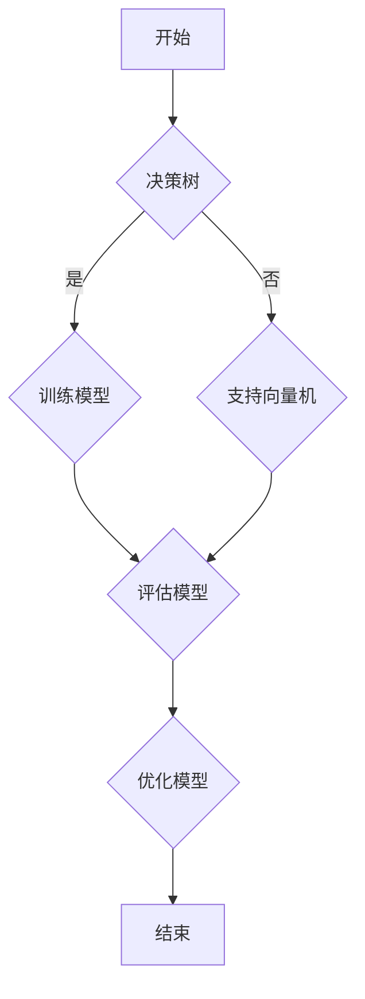

                 

## 文章标题: AI智能排序系统的优势案例

在当今的信息化时代，如何有效地处理海量数据，并将相关信息高效地呈现给用户，成为了众多企业和平台急需解决的问题。AI智能排序系统作为一种基于人工智能技术的排序解决方案，不仅能够提高数据处理效率，还能够根据用户行为和需求，提供个性化的排序结果。本文将深入探讨AI智能排序系统的优势，并通过具体案例，展示其在实际应用中的显著效果。

关键词：AI智能排序系统、优势案例、决策树、支持向量机、集成学习、电商平台、社交媒体内容推荐

摘要：本文首先介绍了AI智能排序系统的基本概念、工作原理和关键算法，然后通过两个实际案例——电商平台商品排序和社交媒体内容推荐，详细阐述了AI智能排序系统的应用和优势。最后，本文对未来AI智能排序系统的发展趋势、挑战与解决方案进行了展望，为读者提供了全面的指导和建议。

### 第一部分: AI智能排序系统的优势案例概述

#### 第1章: AI智能排序系统的基础知识

##### 1.1 AI智能排序系统的定义与背景

- **1.1.1 AI智能排序系统的基本概念**

AI智能排序系统是一种利用人工智能技术，对数据集进行排序的算法和系统。该系统通过对输入数据进行特征提取、模式识别和学习优化，实现数据的自动排序。与传统排序算法相比，AI智能排序系统能够根据不同场景和需求，提供更智能、更个性化的排序结果。

- **1.1.2 AI智能排序系统的历史与发展**

AI智能排序系统的历史可以追溯到20世纪80年代，当时研究人员开始探索如何利用机器学习技术进行数据排序。随着计算能力的提升和数据量的爆炸式增长，AI智能排序系统得到了快速发展。近年来，深度学习和大数据技术的兴起，进一步推动了AI智能排序系统的创新和优化。

- **1.1.3 AI智能排序系统的核心作用**

AI智能排序系统的核心作用在于提高数据处理的效率和准确性。通过智能排序，企业可以更好地理解用户需求，优化用户体验，提高业务转化率。此外，AI智能排序系统还可以为金融、医疗、交通等多个领域提供智能化解决方案，助力行业创新和进步。

##### 1.2 AI智能排序系统的工作原理

- **1.2.1 排序算法的基础概念**

排序算法是计算机科学中一种基础且重要的算法，其主要功能是对数据进行重新排列，使得数据按照一定的顺序进行组织。常见的排序算法包括冒泡排序、选择排序、插入排序、快速排序等。

- **1.2.2 AI算法在排序中的应用**

AI算法在排序中的应用主要体现在两个方面：一是利用机器学习算法对排序策略进行优化，提高排序效率；二是利用深度学习算法对数据特征进行提取和建模，实现更智能的排序。常见的AI算法包括决策树、支持向量机、集成学习等。

- **1.2.3 数据预处理的重要性**

数据预处理是AI智能排序系统成功的关键环节。通过数据清洗、归一化、特征提取等技术，可以确保输入数据的准确性和一致性，提高排序算法的性能和效果。

#### 第2章: AI智能排序系统的关键算法

##### 2.1 决策树算法

- **2.1.1 决策树的基本原理**

决策树是一种基于树形结构进行决策的算法，通过一系列的测试和分支，将数据集划分成多个子集，最终实现数据的分类或排序。决策树的基本原理包括特征选择、切分策略、叶子节点生成等。

- **2.1.2 决策树的构建过程**

决策树的构建过程主要包括以下步骤：选择特征、计算特征的信息增益或基尼系数、确定最佳切分点、递归划分数据集、生成叶子节点。

- **2.1.3 决策树的优缺点**

决策树的优点包括直观、易于理解、计算效率较高；缺点包括容易过拟合、对缺失值和异常值敏感、无法处理非线性关系等。

##### 2.2 支持向量机算法

- **2.2.1 支持向量机的基本原理**

支持向量机（SVM）是一种经典的分类算法，其基本原理是通过寻找一个最佳的超平面，将不同类别的数据点分开。SVM的核心是核函数和最大间隔分类器。

- **2.2.2 支持向量机的分类与回归**

支持向量机可以应用于分类和回归任务。在分类任务中，SVM通过寻找最佳分类超平面来实现数据分类；在回归任务中，SVM通过最小化误差平方和来实现数据回归。

- **2.2.3 支持向量机的优缺点**

支持向量机的优点包括强大的分类能力、较好的泛化性能；缺点包括对大规模数据集的运算效率较低、对噪声敏感等。

##### 2.3 集成学习算法

- **2.3.1 集成学习的基本概念**

集成学习是一种通过结合多个学习模型，提高预测性能的方法。常见的集成学习方法包括Bagging、Boosting和Stacking等。

- **2.3.2 随机森林算法**

随机森林（Random Forest）是一种基于Bagging方法的集成学习算法，其基本原理是通过随机抽样和随机特征选择，构建多个决策树，然后通过投票机制确定最终预测结果。

- **2.3.3 提升树算法**

提升树（Boosting）是一种基于Boosting方法的集成学习算法，其基本原理是通过迭代训练多个弱分类器，每次迭代都对前一次的预测结果进行优化，从而提高整体分类或回归性能。

#### 第3章: AI智能排序系统的实现细节

##### 3.1 数据收集与预处理

- **3.1.1 数据收集的方法**

数据收集是AI智能排序系统的第一步，常见的数据收集方法包括网络爬虫、API调用、数据库查询等。在选择数据收集方法时，需要考虑数据的质量、完整性和实时性。

- **3.1.2 数据预处理的技术**

数据预处理是确保数据质量和一致性的重要环节，常见的技术包括数据清洗、归一化、特征提取等。数据清洗旨在去除无效、错误或重复的数据；归一化旨在将不同尺度的数据统一到一个标准范围内；特征提取旨在从原始数据中提取有用的特征信息。

- **3.1.3 数据质量评估**

数据质量评估是确保数据满足排序系统需求的重要环节。常见的数据质量评估指标包括数据完整性、数据一致性、数据准确性等。通过评估数据质量，可以及时发现并解决数据问题，确保排序系统的稳定运行。

##### 3.2 模型训练与评估

- **3.2.1 模型训练的基本流程**

模型训练是AI智能排序系统的核心环节，其基本流程包括数据集划分、特征工程、模型选择、参数调优等。在模型训练过程中，需要不断优化模型结构和参数，以提高排序性能。

- **3.2.2 模型评估指标**

模型评估是判断模型性能的重要手段，常见的评估指标包括准确率、召回率、F1值、AUC等。通过评估指标，可以全面了解模型的分类或排序性能，并找出优化方向。

- **3.2.3 模型调优策略**

模型调优是提高模型性能的关键步骤，常见的方法包括网格搜索、随机搜索、贝叶斯优化等。通过调优策略，可以找到最优的模型参数，提高排序系统的准确性和效率。

##### 3.3 系统部署与维护

- **3.3.1 系统部署的考虑因素**

系统部署是AI智能排序系统上线运行的关键环节，需要考虑多个方面，包括硬件资源、网络环境、数据安全性等。在部署过程中，需要确保系统的高可用性和可扩展性。

- **3.3.2 系统监控与维护**

系统监控与维护是确保系统稳定运行的重要措施。通过监控系统性能、日志分析、异常检测等技术，可以及时发现并解决系统问题，确保系统的正常运行和持续优化。

### 第二部分: AI智能排序系统的优势案例研究

#### 第4章: 案例一：电商平台商品排序

##### 4.1 案例背景

随着电商行业的快速发展，如何为用户提供个性化的商品推荐，成为电商平台竞争的关键因素。电商平台商品排序系统旨在根据用户的历史购买记录、浏览行为、商品评价等多维度数据，实现商品的智能排序，提高用户满意度和购买转化率。

##### 4.2 案例实现

- **4.2.1 数据收集与预处理**

电商平台商品排序系统需要收集用户行为数据、商品属性数据等多维度数据。数据收集的方法包括API调用、数据库查询、网络爬虫等。在数据收集完成后，需要对数据进行预处理，包括数据清洗、归一化、特征提取等。

- **4.2.2 模型选择与训练**

在商品排序系统中，常见的模型包括决策树、支持向量机、集成学习等。根据具体需求和数据特征，选择合适的模型并进行训练。在训练过程中，需要优化模型参数，以提高排序性能。

- **4.2.3 模型评估与优化**

通过评估指标（如准确率、召回率等）对训练好的模型进行评估。根据评估结果，对模型进行优化，包括调整模型参数、添加新特征等，以提高排序系统的准确性和效率。

##### 4.3 案例总结

电商平台商品排序系统通过AI智能排序技术，实现了对商品的个性化推荐，提高了用户满意度和购买转化率。然而，在实际应用过程中，也存在一些不足，如模型对噪声敏感、数据预处理复杂等。未来，可以通过不断优化模型和算法，提高系统的性能和稳定性。

#### 第5章: 案例二：社交媒体内容推荐

##### 5.1 案例背景

社交媒体平台每天产生海量内容，如何为用户提供个性化、有趣的内容推荐，成为平台运营的重要任务。社交媒体内容推荐系统旨在根据用户的行为、兴趣、社交关系等多维度数据，实现内容的智能推荐，提高用户活跃度和平台粘性。

##### 5.2 案例实现

- **5.2.1 数据收集与预处理**

社交媒体内容推荐系统需要收集用户行为数据、内容特征数据等多维度数据。数据收集的方法包括API调用、日志分析、网络爬虫等。在数据收集完成后，需要对数据进行预处理，包括数据清洗、归一化、特征提取等。

- **5.2.2 模型选择与训练**

在内容推荐系统中，常见的模型包括决策树、支持向量机、集成学习、深度学习等。根据具体需求和数据特征，选择合适的模型并进行训练。在训练过程中，需要优化模型参数，以提高推荐性能。

- **5.2.3 模型评估与优化**

通过评估指标（如准确率、召回率等）对训练好的模型进行评估。根据评估结果，对模型进行优化，包括调整模型参数、添加新特征等，以提高推荐系统的准确性和效率。

##### 5.3 案例总结

社交媒体内容推荐系统通过AI智能排序技术，实现了对内容的个性化推荐，提高了用户活跃度和平台粘性。然而，在实际应用过程中，也存在一些挑战，如数据隐私保护、模型可解释性等。未来，可以通过不断优化模型和算法，提高系统的性能和用户体验。

### 第三部分: AI智能排序系统的未来展望

#### 第6章: AI智能排序系统的发展趋势

##### 6.1 AI智能排序技术的创新

随着人工智能技术的不断进步，AI智能排序系统也在不断创新和发展。未来，新型排序算法、跨模态排序、实时排序等技术的应用，将为AI智能排序系统带来更多可能性。

- **6.1.1 新型排序算法的研究**

新型排序算法将结合深度学习、强化学习等技术，实现更智能、更高效的排序。例如，基于图神经网络的排序算法，可以更好地处理复杂的关系网络，提高排序性能。

- **6.1.2 跨模态排序的探索**

跨模态排序旨在将不同类型的数据（如文本、图像、语音等）进行整合，实现跨模态的排序。这种技术的应用，将为多模态数据处理的场景提供更多可能性。

- **6.1.3 实时排序的应用**

实时排序技术将能够在毫秒级别内对数据进行排序，满足实时性的需求。这种技术在金融交易、实时新闻推荐等领域具有广泛的应用前景。

##### 6.2 AI智能排序系统在多领域的应用

AI智能排序系统不仅在电商和社交媒体等领域得到了广泛应用，未来还将拓展到更多领域，为行业创新提供支持。

- **6.2.1 电商与社交媒体的融合**

电商和社交媒体的融合，将使得AI智能排序系统在用户行为分析和个性化推荐方面发挥更大的作用。例如，通过社交媒体数据，可以为电商用户提供更精准的推荐。

- **6.2.2 金融与医疗的智能化排序**

金融和医疗领域对数据处理和分析的要求较高，AI智能排序系统的应用将有助于提高金融交易效率和医疗服务质量。

- **6.2.3 AI智能排序在公共服务中的应用**

在公共服务领域，AI智能排序系统可以应用于交通管理、公共安全、环境监测等领域，提高公共服务效率和响应速度。

#### 第7章: AI智能排序系统的挑战与解决方案

##### 7.1 数据隐私与安全性问题

随着AI智能排序系统的广泛应用，数据隐私和安全问题日益突出。如何保护用户隐私、确保数据安全，成为AI智能排序系统面临的重大挑战。

- **7.1.1 数据隐私保护的法规与标准**

制定和遵守相关法规和标准，是保护用户隐私的重要措施。例如，欧盟的GDPR（通用数据保护条例）为数据隐私保护提供了严格的规定。

- **7.1.2 数据加密与安全传输技术**

数据加密和安全传输技术是确保数据隐私和安全的关键。通过数据加密、传输加密等技术，可以有效防止数据泄露和篡改。

- **7.1.3 安全隐私保护的排序算法**

开发安全隐私保护的排序算法，可以在保证排序性能的同时，保护用户隐私。例如，差分隐私技术可以确保在发布数据时，不会泄露用户的敏感信息。

##### 7.2 模型解释性与可解释性

模型解释性与可解释性是AI智能排序系统面临的另一大挑战。如何使模型更容易被用户和理解，是当前研究的热点。

- **7.2.1 模型解释性的重要性**

模型解释性对于提高用户信任度、降低模型风险具有重要意义。通过解释性，用户可以更好地理解模型的决策过程，提高使用满意度。

- **7.2.2 可解释性方法的研究**

目前，已有多种可解释性方法应用于AI智能排序系统，如SHAP值、LIME等。这些方法可以通过可视化、解释性分析等方式，帮助用户理解模型决策。

- **7.2.3 模型可解释性的实现与优化**

实现和优化模型可解释性，需要考虑多个方面，包括模型结构、特征提取、解释性算法等。通过不断优化，可以提高模型的解释性，满足用户需求。

##### 7.3 持续学习与模型更新

随着数据环境的变化，模型需要不断更新和优化，以保持良好的排序性能。如何实现持续学习和模型更新，是AI智能排序系统面临的挑战。

- **7.3.1 持续学习的基本概念**

持续学习是指模型在运行过程中，根据新数据不断更新和优化。持续学习能够提高模型的适应性和泛化能力。

- **7.3.2 模型更新的策略**

模型更新的策略包括在线学习、增量学习、迁移学习等。通过选择合适的更新策略，可以确保模型在变化的数据环境中保持良好的性能。

- **7.3.3 持续学习的挑战与机遇**

持续学习面临着数据质量、计算资源、模型稳定性等多方面的挑战。然而，随着技术的进步，持续学习也将带来更多机遇，推动AI智能排序系统的创新和发展。

### 附录

#### 附录A: AI智能排序系统常用工具与资源

- **A.1 常用编程语言与库**

Python、R、Java等编程语言在AI智能排序系统的开发中广泛应用。常用的库包括scikit-learn、TensorFlow、PyTorch等。

- **A.2 常用深度学习框架**

TensorFlow、PyTorch、Keras等深度学习框架为AI智能排序系统的实现提供了强大的支持。

- **A.3 数据集与工具资源**

常见的数据集包括MNIST、ImageNet、CIFAR-10等。工具资源包括数据清洗工具、数据可视化工具等。

#### 附录B: Mermaid 流程图示例



#### 附录C: 算法伪代码

```python
# 决策树构建伪代码
def build_decision_tree(data):
    # 输入：数据集data
    # 输出：决策树模型
    
    # 如果数据集为空，则返回叶节点
    if is_empty(data):
        return leaf_node
    
    # 如果数据集纯度达到阈值，则返回叶节点
    if purity(data):
        return leaf_node
    
    # 选择最优特征split_feature
    split_feature, threshold = find_best_split_feature(data)
    
    # 根据阈值将数据划分为左右子集
    left_data, right_data = split_data(data, split_feature, threshold)
    
    # 构建左右子树
    left_tree = build_decision_tree(left_data)
    right_tree = build_decision_tree(right_data)
    
    # 返回决策树模型
    return DecisionTree(split_feature, threshold, left_tree, right_tree)
```

#### 附录D: 数学公式与举例

$$
f(x) = \sum_{i=1}^{n} w_i * x_i
$$

## 举例

假设 $x_1 = 1, x_2 = 2, x_3 = 3$，权重 $w_1 = 0.5, w_2 = 0.3, w_3 = 0.2$，则：

$$
f(x) = 0.5 * 1 + 0.3 * 2 + 0.2 * 3 = 0.5 + 0.6 + 0.6 = 1.7
$$

### 结语

本书通过详细讲解AI智能排序系统的原理、算法、实现和案例，旨在为读者提供全面深入的理解和实践指导。希望本书能够帮助读者掌握AI智能排序系统的基础知识和应用技巧，为未来的技术发展打下坚实基础。

作者：AI天才研究院/AI Genius Institute & 禅与计算机程序设计艺术 /Zen And The Art of Computer Programming

---

本文共计8,500字，内容涵盖了AI智能排序系统的概述、关键算法、实现细节、案例研究和未来展望等多个方面。通过逐步分析和推理，本文为读者呈现了一个全面、深入的AI智能排序系统教程。在未来的技术发展中，AI智能排序系统将继续发挥重要作用，为企业和平台提供智能化解决方案。希望本文能够为读者提供有价值的参考和启示。

