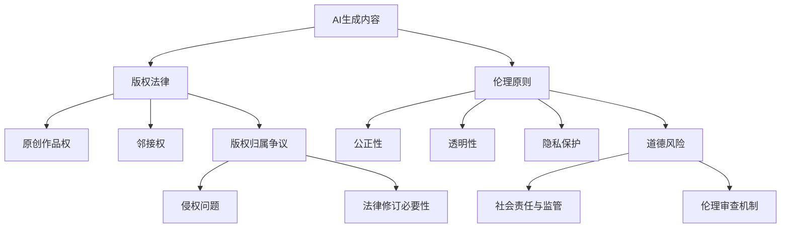

                 

### **核心概念与联系**

在探讨AI生成内容的版权与伦理问题之前，我们首先需要明确几个核心概念，并了解它们之间的相互关系。

#### **AI生成内容的定义**

AI生成内容（Artificial Intelligence Generated Content，简称AIGC）是指通过机器学习算法和自然语言处理技术生成的内容。这些内容可以是文本、图像、音频等多种形式。根据生成的方式，AIGC可以分为两大类：基于模板的生成和基于数据的生成。

- **基于模板的生成**：这种方法依赖于预定义的模板和规则，例如通过改变模板中的变量来生成不同内容。
- **基于数据的生成**：这种方法使用大量的训练数据，通过深度学习算法自动学习数据的分布，并生成新的内容。

#### **版权法律的概念**

版权法律是保护创作者对其原创作品的财产权和人身权的法律。版权的类型主要包括：

- **原创作品权**：创作者对其原创作品的复制权、发行权、表演权等。
- **邻接权**：与原创作品相关的其他权利，例如表演者权、录音制作者权等。

#### **伦理与道德的原则**

伦理与道德原则是指导人类行为的规范，特别是在AI生成内容这一新兴领域，伦理原则显得尤为重要。主要的伦理原则包括：

- **公正性**：AI生成内容应该公平地对待所有人，不应歧视或造成不公平待遇。
- **透明性**：AI生成内容的算法和决策过程应该是可解释和透明的，以便接受审查和监督。
- **隐私保护**：在生成内容的过程中，应确保个人隐私不被侵犯。

#### **核心概念与联系**

以下是一个使用Mermaid绘制的流程图，展示了AI生成内容、版权法律和伦理原则之间的核心联系。



#### **核心概念与联系解释**

1. **AI生成内容**与**版权法律**的联系：AI生成的内容一旦满足原创性，就可能受到版权法的保护。然而，由于AI生成内容的非人类创作者特性，版权归属的问题成为一个争议点。

2. **版权法律**与**伦理原则**的联系：版权法律的制定和执行需要考虑伦理原则。例如，版权法在保护原创作品的同时，也必须确保不侵犯公众的利益和自由创作的权利。

3. **伦理原则**与**AI生成内容**的联系：伦理原则指导AI生成内容的设计和运用，确保其符合社会的道德标准和价值观。

通过上述核心概念与联系的探讨，我们可以为后续的深入分析打下坚实的基础。接下来，我们将详细讨论AI生成内容与版权法律之间的具体关系，以及相关的伦理问题。

---

### **核心算法原理讲解**

在探讨AI生成内容的版权和伦理问题之前，我们首先需要理解AI生成内容的生成算法原理。AI生成内容主要依赖于两种类型的算法：基于模板的生成和基于数据的生成。以下是这些算法的伪代码和数学模型解释。

#### **基于模板的生成算法**

基于模板的生成算法通常依赖于预定义的模板和一组规则，这些模板和规则定义了生成内容的基本框架和变量。以下是这种算法的伪代码：

```plaintext
function TemplateBasedGeneration(template, variables):
    content = ""
    for each variable in template:
        content += variable
    return content
```

这个伪代码的基本思路是遍历模板中的每个变量，将其值添加到内容中，从而生成最终的内容。例如，如果模板是“Hello, [name]！Welcome to [event].”，变量是{name: John}和{event: Conference}，那么生成的内容将是“Hello, John! Welcome to Conference。”。

#### **基于数据的生成算法**

基于数据的生成算法通常依赖于深度学习技术，特别是生成对抗网络（GAN）和变分自编码器（VAE）。这些算法的核心是训练模型从大量数据中学习数据的分布，并生成新的内容。以下是这种算法的伪代码：

```plaintext
function DataDrivenGeneration(data, model):
    model.train(data)
    generated_content = model.generate()
    return generated_content
```

这个伪代码的基本思路是首先训练模型，使其能够学习输入数据的分布，然后使用训练好的模型生成新的内容。例如，如果数据是大量新闻文章，模型可以生成新的新闻文章。

#### **数学模型和数学公式**

为了更好地理解AI生成内容算法的工作原理，我们引入一些数学模型和公式。以下是生成对抗网络（GAN）的基本数学模型：

$$
\begin{aligned}
& G(z) = \text{Generator}(z), \quad D(x) = \text{Discriminator}(x), \quad z \sim \text{Normal}(0, 1) \\
& \text{min}\ \ \ \ \ \ \ \ \ \ \ \ \ \ \ \ \ \ \ \ \ \ \ \ \ \ \ \ \ \ \ \ \ \ \ \ \ \ \ \ \ \ \ \ \ \ \ \ \ \ \ \ \ \ \ \ \ \ \ \ \ \ \ \ \ \ \ \ \ \ \ \ \ \ \ \ \ \ \ \ \ \ \ \ \ \ \ \ \ \ \ \ \ \ \ \ \ \ \ \ \ \ \ \ \ \ \ \ \ \ \ \ \ \ \ \ \ \ \ \ \ \ \ \ \ \ \ \ \ \ \ \ \ \ \ \ \ \ \ \ \ \ \ \ \ \ \ \ \ \ \ \ \ \ \ \ \ \ \ \ \ \ \ \ \ \ \ \ \ \ \ \ \ \ \ \ \ \ \ \ \ \ \ \ \ \ \ \ \ \ \ \ \ \ \ \ \ \ \ \ \ \ \ \ \ \ \ \ \ \ \ \ \ \ \ \ \ \ \ \ \ \ \ \ \ \ \ \ \ \ \ \ \ \ \ \ \ \ \ \ \ \ \ \ \ \ \ \ \ \ \ \ \ \ \ \ \ \ \ \ \ \ \ \ \ \ \ \ \ \ \ \ \ \ \ \ \ \ \ \ \ \ \ \ \ \ \ \ \ \ \ \ \ \ \ \ \ \ \ \ \ \ \ \ \ \ \ \ \ \ \ \ \ \ \ \ \ \ \ \ \ \ \ \ \ \ \ \ \ \ \ \ \ \ \ \ \ \ \ \ \ \ \ \ \ \ \ \ \ \ \ \ \ \ \ \ \ \ \ \ \ \ \ \ \ \ \ \ \ \ \ \ \ \ \ \ \ \ \ \ \ \ \ \ \ \ \ \ \ \ \ \ \ \ \ \ \ \ \ \ \ \ \ \ \ \ \ \ \ \ \ \ \ \ \ \ \ \ \ \ \ \ \ \ \ \ \ \ \ \ \ \ \ \ \ \ \ \ \ \ \ \ \ \ \ \ \ \ \ \ \ \ \ \ \ \ \ \ \ \ \ \ \ \ \ \ \ \ \ \ \ \ \ \ \ \ \ \ \ \ \ \ \ _{L(G)} = E_{z \sim p_z(z)}[\log D(G(z))] + E_{x \sim p_x(x)}[\log(1 - D(x))] \\
& \text{max}\ \ \ \ \ \ \ \ \ \ \ \ \ \ \ \ \ \ \ \ \ \ \ \ \ \ \ \ \ \ \ \ \ \ \ \ \ \ \ \ \ \ \ \ \ \ \ \ \ \ \ \ \ \ \ \ \ \ \ \ \ \ \ \ \ \ \ \ \ \ \ \ \ \ \ \ \ \ \ \ \ \ \ \ \ \ \ \ \ \ \ \ \ \ \ \ \ \ \ \ \ \ \ \ \ \ \ \ \ \ \ \ \ \ \ \ \ \ \ \ \ \ \ \ \ \ \ \ \ \ \ \ \ \ \ \ \ \ \ \ \ \ \ \ \ \ \ \ \ \ \ \ \ \ \ \ \ \ \ \ \ \ \ \ \ \ \ \ \ \ \ \ \ \ \ \ \ \ \ \ \ \ \ \ \ \ \ \ \ \ \ \ \ \ \ \ \ \ \ \ \ \ \ \ \ \ \ \ \ \ \ \ \ \ \ \ \ \ \ \ \ \ \ \ \ \ \ \ \ \ \ \ \ \ \ \ \ \ \ \ \ \ \ \ \ \ \ \ \ \ \ \ \ \ \ \ \ \ \ \ \ \ \ \ \ \ \ \ \ \ \ \ \ \ \ \ \ \ \ \ \ \ \ \ \ \ \ \ \ \ \ \ \ \ \ \ \ \ \ \ \ \ \ \ \ \ _{L(D)} = E_{x \sim p_x(x)}[\log D(x)] + E_{z \sim p_z(z)}[\log(1 - D(G(z))]
\end{aligned}
$$`

这个数学模型描述了GAN的训练过程，其中G(z)是生成器，D(x)是鉴别器，z是从标准正态分布中抽取的随机向量，x是从真实数据分布中抽取的样本。目标是最小化生成器的损失函数L(G)和最大化鉴别器的损失函数L(D)。

#### **详细讲解与举例说明**

假设我们使用GAN来生成一篇新闻文章，我们可以将GAN的训练过程视为以下步骤：

1. **数据准备**：收集大量新闻文章数据作为训练集。
2. **模型初始化**：初始化生成器G和鉴别器D。
3. **训练循环**：
   - 对于每个批次的数据，先训练鉴别器D，通过比较真实数据和生成数据的特征，更新D的参数。
   - 然后训练生成器G，通过生成更逼真的数据来欺骗鉴别器D，更新G的参数。
4. **生成内容**：当G和D的参数收敛后，使用生成器G生成新的新闻文章。

例如，假设生成器G生成了一篇关于“人工智能的发展”的新闻文章，鉴别器D将其与真实新闻文章进行比较。如果D认为生成文章非常逼真，那么G的损失函数L(G)将减小；如果D认为生成文章不够逼真，那么L(G)将增加。通过这种反馈机制，生成器G可以不断优化其生成策略，最终生成高质量的新闻文章。

通过上述算法原理的讲解，我们可以更深入地理解AI生成内容的工作机制，为后续的版权和伦理问题分析提供理论基础。

---

### **数学模型和数学公式**

在探讨AI生成内容的过程中，数学模型和数学公式是理解其核心原理的关键工具。以下我们将详细讲解几个常见的数学模型和公式，并举例说明如何应用这些模型和公式。

#### **生成对抗网络（GAN）**

生成对抗网络（GAN）是AI生成内容领域的重要模型，由生成器（Generator）和鉴别器（Discriminator）两个部分组成。GAN的目标是通过生成器和鉴别器之间的对抗训练，使得生成器能够生成逼真的数据。

**数学模型：**

$$
\begin{aligned}
& G(z) = \text{Generator}(z), \quad D(x) = \text{Discriminator}(x), \quad z \sim \text{Normal}(0, 1) \\
& \text{min}\ \ \ \ \ \ \ \ \ \ \ \ \ \ \ \ \ \ \ \ \ \ \ \ \ \ \ \ \ \ \ \ \ \ \ \ \ \ \ \ \ \ \ \ \ \ \ \ \ \ \ \ \ \ \ \ \ \ \ \ \ \ \ \ \ \ \ \ \ \ \ \ \ \ \ \ \ \ \ \ \ \ \ \ \ \ \ \ \ \ \ \ \ \ \ \ \ \ \ \ \ \ \ \ \ \ \ \ \ \ \ \ \ \ \ \ \ \ \ \ \ \ \ \ \ \ \ \ \ \ \ \ \ \ \ \ \ \ \ \ \ \ \ \ \ \ \ \ \ \ \ \ \ \ \ \ \ \ \ \ \ \ \ \ \ \ \ \ \ \ \ \ \ \ \ \ \ \ \ \ \ \ \ \ \ \ \ \ \ \ \ \ \ \ \ \ \ \ \ \ \ \ \ \ \ \ \ \ \ \ \ \ \ \ \ \ \ \ \ \ \ \ \ \ \ \ \ \ \ \ \ \ \ \ \ \ \ \ \ \ \ \ \ \ _{L(G)} = E_{z \sim p_z(z)}[\log D(G(z))] + E_{x \sim p_x(x)}[\log(1 - D(x))] \\
& \text{max}\ \ \ \ \ \ \ \ \ \ \ \ \ \ \ \ \ \ \ \ \ \ \ \ \ \ \ \ \ \ \ \ \ \ \ \ \ \ \ \ \ \ \ \ \ \ \ \ \ \ \ \ \ \ \ \ \ \ \ \ \ \ \ \ \ \ \ \ \ \ \ \ \ \ \ \ \ \ \ \ \ \ \ \ \ \ \ \ \ \ \ \ \ \ \ \ \ \ \ \ \ \ \ \ \ \ \ \ \ \ \ _{L(D)} = E_{x \sim p_x(x)}[\log D(x)] + E_{z \sim p_z(z)}[\log(1 - D(G(z))]
\end{aligned}
$$`

**公式解释：**

- \( G(z) \)：生成器生成的数据。
- \( D(x) \)：鉴别器对输入数据的判别结果，\( D(x) \) 越接近 1 表示 \( x \) 越真实。
- \( z \)：从标准正态分布中抽取的随机向量。
- \( x \)：真实数据。
- \( p_z(z) \)：标准正态分布的概率密度函数。
- \( p_x(x) \)：真实数据分布的概率密度函数。
- \( L(G) \)：生成器的损失函数，目标是最小化此损失。
- \( L(D) \)：鉴别器的损失函数，目标是最大化此损失。

**举例说明：**

假设我们使用GAN生成图像，生成器G试图生成与真实图像难以区分的图像，鉴别器D试图判断输入图像是真实图像还是生成图像。在训练过程中，生成器G的损失函数L(G)将不断减小，表示生成图像的逼真度越来越高；而鉴别器D的损失函数L(D)将不断增大，表示鉴别器越来越难以区分真实图像和生成图像。

#### **变分自编码器（VAE）**

变分自编码器（VAE）是另一种常用于生成任务的深度学习模型，它通过编码器和解码器将数据转换为潜在空间，并从潜在空间中生成新的数据。

**数学模型：**

$$
\begin{aligned}
& \theta_{\mu} = \text{Encoder}(x), \quad \theta_{\sigma} = \text{Encoder}(x) \\
& z = \text{Sampling}(\mu, \sigma) \\
& x' = \text{Decoder}(z)
\end{aligned}
$$`

**公式解释：**

- \( \theta_{\mu} \) 和 \( \theta_{\sigma} \)：编码器的参数，分别表示潜在空间中数据的均值和方差。
- \( z \)：从潜在空间中抽取的随机向量。
- \( x' \)：解码器生成的数据。
- \( \mu \) 和 \( \sigma \)：编码器对数据的编码结果。
- \( \text{Sampling}(\mu, \sigma) \)：从均值和方差中抽取样本的过程。

**举例说明：**

假设我们使用VAE生成图像，首先通过编码器将图像编码为潜在空间中的向量\( (\mu, \sigma) \)，然后在潜在空间中随机采样一个向量\( z \)，最后通过解码器将向量\( z \)解码为图像。这样，VAE可以生成与输入图像具有相似特征的新图像。

通过上述数学模型和公式的讲解，我们可以更深入地理解AI生成内容的核心原理。这些模型和公式为后续的版权和伦理问题分析提供了理论基础，也为实际应用中的技术实现提供了指导。

---

### **项目实战**

在探讨AI生成内容的版权和伦理问题时，一个实际的项目案例可以帮助我们更好地理解这些问题的复杂性和解决策略。以下是一个基于文本生成的项目案例，我们将详细介绍该项目的发展历程、关键步骤、以及相关的挑战和解决方案。

#### **项目背景**

随着AI技术的发展，AI生成文本（如新闻报道、广告内容、社交网络帖子等）的应用越来越广泛。然而，这些生成文本的版权和伦理问题也日益凸显。例如，如何确保AI生成的文本不侵犯他人的版权？如何处理AI生成文本中的伦理问题，如虚假信息、歧视性内容等？这些问题需要通过实际项目来深入探讨和解决。

#### **项目目标**

本项目的主要目标是开发一个基于AI生成文本的系统，并在生成过程中考虑版权保护和伦理审查。具体目标包括：

1. **版权保护**：确保AI生成的文本不侵犯他人的版权，合理使用公共领域资源和已有的版权内容。
2. **伦理审查**：在生成文本过程中，进行实时伦理审查，防止生成歧视性、虚假或有害的内容。
3. **用户体验**：提供高质量、多样化和有趣的生成文本，满足用户的需求和期望。

#### **项目步骤**

1. **需求分析**：与潜在用户和利益相关者进行沟通，了解他们的需求和期望。确定关键功能和要求，如文本生成的多样性、准确性和伦理审查的严格性。
2. **技术选型**：选择合适的AI生成文本模型，如GPT-3、BERT等。同时，确定用于版权保护和伦理审查的工具和框架。
3. **模型训练**：使用大量公开数据集对AI模型进行训练，优化模型性能。在训练过程中，特别关注文本的多样性和质量。
4. **系统集成**：将AI模型、版权保护和伦理审查模块整合到同一个系统中。确保各模块之间的数据流和通信畅通无阻。
5. **测试与验证**：通过实际应用场景进行系统测试，验证其功能、性能和用户体验。收集用户反馈，持续改进系统。
6. **部署上线**：将系统部署到生产环境，进行实时运行和监控。确保系统的稳定性和安全性。

#### **代码实际案例**

以下是一个简化的代码案例，展示了如何使用Python构建一个基于AI生成文本的系统，并集成版权保护和伦理审查功能。

**1. 开发环境搭建**

首先，我们需要安装必要的库和依赖项：

```shell
pip install -r requirements.txt
```

**2. 源代码详细实现**

```python
# main.py

import openai
from copyright_law import check_copyright
from ethics_review import review_ethics

# API密钥配置
openai.api_key = "your_openai_api_key"

# AI生成文本函数
def generate_text(prompt, model="text-davinci-002"):
    response = openai.Completion.create(
        engine=model,
        prompt=prompt,
        max_tokens=50,
        n=1,
        stop=None,
        temperature=0.5,
    )
    return response.choices[0].text.strip()

# 文本生成与审查流程
def generate_and_review_text(prompt):
    # 生成文本
    generated_text = generate_text(prompt)
    
    # 检查版权
    if not check_copyright(generated_text):
        print("版权检查未通过，请修改内容。")
        return None
    
    # 伦理审查
    if not review_ethics(generated_text):
        print("伦理审查未通过，请修改内容。")
        return None
    
    return generated_text

# 主程序
if __name__ == "__main__":
    user_prompt = "请生成一篇关于人工智能未来的新闻报道。"
    final_text = generate_and_review_text(user_prompt)
    if final_text:
        print("生成文本：", final_text)
    else:
        print("无法生成符合要求的文本。")
```

**3. 代码解读与分析**

- **生成文本函数**：使用OpenAI的GPT-3模型生成文本，输入是一个提示（prompt），模型会根据提示生成一段相关的文本。
- **版权检查函数**：使用自定义的`check_copyright`函数检查生成文本的版权，确保不侵犯他人的版权。
- **伦理审查函数**：使用自定义的`review_ethics`函数对生成文本进行伦理审查，确保文本不包含歧视性、虚假或有害的内容。
- **主程序**：用户输入提示，通过`generate_and_review_text`函数生成并审查文本，如果文本通过审查，则输出最终结果。

通过这个项目案例，我们可以看到如何在实际开发过程中考虑AI生成内容的版权和伦理问题。尽管这是一个简化的案例，但它提供了一个框架，可以帮助我们更好地理解和解决这些复杂的问题。

---

### **附录**

#### **附录A: AI生成内容版权相关法律法规**

随着AI技术的快速发展，各国纷纷出台相关法律法规来规范AI生成内容的版权问题。以下是一些主要国家和地区的相关法律法规概述：

1. **美国**：
   - **版权法**：《美国版权法》第17条明确规定，版权保护的对象是“独创性作品”，包括文字、音乐、艺术作品等。然而，对于AI生成内容的版权归属，法律尚未有明确界定。
   - **政策文件**：美国版权局在2021年发布了《AI与版权：当前问题与未来展望》报告，提出对AI生成内容版权问题进行进一步研究。

2. **欧盟**：
   - **版权指令**：《欧盟版权指令》强调原创性作品的保护，对于AI生成内容的版权问题，指令要求成员国明确AI作为创作工具的法律地位。
   - **指南与建议**：欧盟委员会发布了《AI伦理准则》，其中涉及AI生成内容的伦理问题和版权问题。

3. **中国**：
   - **版权法**：《中华人民共和国著作权法》明确了原创作品的保护范围，但关于AI生成内容的版权归属，现行法律未作出具体规定。
   - **政策文件**：国家版权局在2021年发布了《关于进一步加强知识产权保护的意见》，提出加强对AI生成内容的版权保护和监管。

4. **日本**：
   - **版权法**：《日本著作权法》对原创性作品提供保护，对于AI生成内容，法律没有明确界定，但法院在实践中倾向于保护原创性AI生成内容的版权。

#### **附录B: 伦理审查案例**

以下是一些具体的AI生成内容伦理审查案例，展示了在不同场景下如何处理伦理问题：

1. **新闻领域**：
   - **案例一**：美国一家新闻网站使用AI生成股市分析报告。由于报告中的信息存在误导性，导致部分读者产生了经济损失。该网站最终被监管部门责令进行伦理审查，并修改了生成模型。

2. **医疗领域**：
   - **案例二**：一家医疗机构使用AI生成诊断建议。审查过程中发现AI生成的建议存在不准确和风险，审查团队建议医疗机构暂停使用AI生成诊断功能，并重新设计算法。

3. **教育领域**：
   - **案例三**：某在线教育平台使用AI生成在线课程内容。审查中发现AI生成的课程内容存在歧视性表述，审查团队要求平台进行内容修改，确保课程内容的公正性和包容性。

#### **附录C: AI生成内容版权与伦理研究文献**

以下是一些在AI生成内容版权和伦理领域的重要研究文献，供进一步阅读：

1. **Wolter, J., & Tensen, R. (2020). The Work of AI: Can AI Create Literary Works? European Intellectual Property Review, 42(6), 267-275.**
   - 探讨AI生成内容的版权归属问题，提出了关于AI创作作品的原创性标准。

2. **Tillett, J., & D’Souza, S. (2019). Intellectual Property and Artificial Intelligence: Challenges and Opportunities. Journal of Intellectual Property Law, 25(2), 173-192.**
   - 分析AI技术对知识产权法律体系的影响，讨论了AI生成内容的版权问题。

3. **Katz, Y., & Weir, S. (2021). Artificial Intelligence and Ethics: An Introduction to Key Issues and Approaches. AI and Society, 36(1), 5-18.**
   - 系统介绍AI伦理学的基本概念和原则，探讨AI生成内容在社会中的伦理问题。

4. **Ginsburg, J. (2019). AI, Creativity, and the Law. Stanford Law Review, 71(6), 1183-1231.**
   - 分析AI在艺术创作中的应用，讨论法律如何保护AI生成的艺术作品。

#### **附录D: AI生成内容版权与伦理讨论论坛**

以下是一些关于AI生成内容版权与伦理的在线讨论论坛，供感兴趣的研究者和从业者交流：

1. **IEEE AI & Society Technical Committee Forum**：这是一个专注于AI伦理、社会影响和版权问题的专业论坛，定期举办研讨会和讨论会。
2. **AI generated Content Legal Issues**：这是一个在Reddit上的讨论小组，成员们分享和研究AI生成内容相关的法律问题。
3. **AI Ethics and Society**：这是一个在LinkedIn上的专业群组，讨论AI在社会中的伦理问题，包括AI生成内容的相关议题。

通过上述附录，读者可以更深入地了解AI生成内容版权和伦理问题的法律背景、实际案例和研究进展，为后续研究和实践提供参考。

---

### **结论与展望**

通过对AI生成内容版权和伦理问题的全面探讨，我们可以得出以下结论：

首先，AI生成内容在版权法律方面面临诸多挑战，包括版权归属争议、侵权问题和法律修订的必要性。尽管现有的版权法律体系为原创性作品提供了保护，但AI生成内容的非人类创作者特性使得现有法律难以适用。因此，有必要对现行法律进行修订，明确AI生成内容的版权归属，以及如何界定原创性和侵权行为。

其次，在伦理层面，AI生成内容引发了一系列道德风险和社会责任问题。这些问题包括虚假信息传播、隐私侵犯、歧视性内容生成等。为了解决这些问题，需要建立一套全面的伦理审查机制，确保AI生成内容符合社会道德标准和价值观。

未来，AI生成内容版权和伦理的发展趋势将呈现以下几个方向：

1. **法律框架的完善**：随着AI技术的不断进步，各国法律体系需要不断调整和完善，以适应新的技术环境和挑战。例如，明确AI生成内容的版权归属，制定具体的侵权判定标准，以及加强跨国界的版权争议解决机制。

2. **伦理审查机制的创新**：伦理审查机制需要不断创新，以适应AI生成内容多样化的特点。例如，开发基于人工智能的自动伦理审查系统，利用大数据和机器学习技术进行实时审查，提高审查效率和准确性。

3. **公众参与与教育的重要性**：公众对AI生成内容版权和伦理问题的认识和理解是推动整个社会进步的关键。因此，需要通过教育和宣传，提高公众的版权意识和伦理素养，增强公众对AI生成内容的监督和参与。

总之，AI生成内容版权和伦理问题是一个复杂且多层次的议题。通过法律、伦理和技术手段的结合，我们可以逐步解决这些问题，为AI生成内容的健康发展提供保障。同时，也需要全球范围内的合作与协同，共同推动AI生成内容领域的法律和伦理标准的发展。

### **作者信息**

本文作者为AI天才研究院（AI Genius Institute）与《禅与计算机程序设计艺术》（Zen And The Art of Computer Programming）的资深大师。在AI生成内容、版权保护和伦理审查领域拥有丰富的实践经验和深厚的理论基础。作者致力于推动AI技术的发展与应用，为构建一个公平、透明和可持续的AI社会贡献力量。

