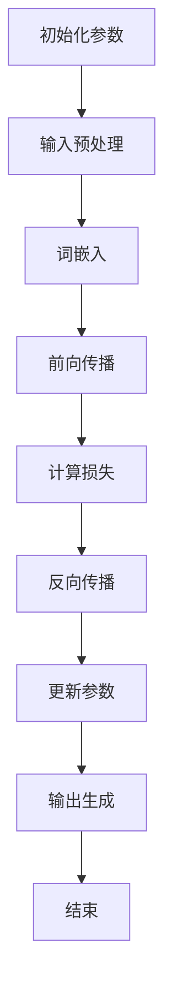
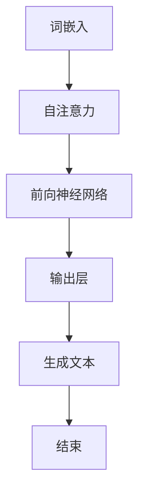
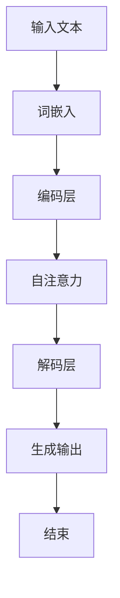

                 

## 文章标题: AI的时间观：LLM的独特推理机制

> 关键词：人工智能、时间观、语言模型、推理机制、深度学习

> 摘要：本文深入探讨了人工智能（AI）领域中的时间观以及大型语言模型（LLM）的独特推理机制。首先，从AI的发展历程和AI时间观的重要性入手，阐述了AI与时间观的紧密联系。接着，介绍了AI时间观的核心概念，包括人工智能与时间的交互、时间序列数据分析和机器学习中的时间感知。随后，文章重点分析了LLM的基础、推理原理、推理过程以及其优势与局限性，并结合实际应用案例进行了详细解释。最后，文章讨论了LLM推理机制的优化方法、AI时间观的未来趋势以及伦理和法律问题，并展望了跨学科融合的研究方向。通过本文，读者可以全面了解AI时间观及其推理机制的最新研究动态和应用前景。

### 第一部分: AI与时间观

#### 第1章: AI与时间观的背景与重要性

人工智能（AI）是计算机科学的一个分支，致力于通过构建智能系统来模拟、延伸和扩展人类智能。自20世纪50年代人工智能概念诞生以来，AI经历了多个发展阶段，从符号主义、知识表示与推理，到基于统计模型的机器学习，再到深度学习和强化学习，每一次技术的突破都推动了AI的进步。在这些发展中，时间观作为一个重要的概念，始终贯穿于AI的演进过程中。

##### 1.1 AI的发展历程

AI的发展历程可以分为以下几个阶段：

1. **符号主义阶段（1956-1974）**：
   这一阶段的AI主要通过符号推理和知识表示来模拟人类智能。代表性的系统包括基于生产式规则的逻辑推理系统和基于语义网络的模型。尽管符号主义AI在理论上具有很强的解释能力，但在处理复杂问题和大规模数据时存在局限性。

2. **知识表示与推理阶段（1974-1980）**：
   在这一阶段，AI研究者开始关注如何将知识以结构化的方式表示，并利用推理算法来处理和利用这些知识。专家系统和基于框架的方法在这一时期得到了广泛应用。

3. **机器学习阶段（1980-2010）**：
   机器学习成为AI发展的主要驱动力。基于统计和概率的方法如决策树、支持向量机、贝叶斯网络等得到广泛应用。这一阶段的突破在于通过数据驱动的方式实现智能，大大提高了AI系统的实际应用能力。

4. **深度学习阶段（2010至今）**：
   深度学习技术的发展使AI取得了突破性进展，特别是在图像识别、语音识别和自然语言处理等领域。基于人工神经网络的深度学习模型，如卷积神经网络（CNN）和递归神经网络（RNN），通过大规模数据训练，实现了前所未有的性能。

##### 1.2 时间观的概念

时间观是指人们对时间的感知、理解和运用。在AI领域，时间观涉及到如何处理和分析与时间相关的数据，如何利用时间序列信息进行决策和预测，以及如何模拟人类对时间的感知和行为。时间观在AI中的应用主要体现在以下几个方面：

1. **时间序列数据分析**：
   时间序列数据是一系列按时间顺序排列的数据点。在金融、气象、生物等领域，时间序列数据具有重要的研究价值。AI通过建立时间序列模型，可以预测未来的趋势，为决策提供支持。

2. **事件序列建模**：
   事件序列建模是处理多个事件按时间顺序发生的数据。例如，在社交网络分析中，可以追踪用户的互动行为，预测用户的下一步行为。

3. **时间感知与建模**：
   人类对时间的感知和利用是AI研究中一个重要课题。AI系统通过模拟人类的时间感知机制，可以提高任务的执行效率和用户体验。

##### 1.3 AI与时间观的关系

AI与时间观之间的关系可以从以下几个方面来理解：

1. **时间序列数据分析能力**：
   AI技术，特别是深度学习，具有强大的时间序列数据分析能力。通过训练复杂的神经网络模型，AI可以捕捉时间序列数据中的复杂模式，为预测和决策提供支持。

2. **时间感知与模拟**：
   AI系统通过模拟人类的时间感知机制，可以更好地理解和处理时间信息。例如，在自然语言处理中，理解语句的时间顺序对于正确理解句子的含义至关重要。

3. **时间规划与优化**：
   在AI应用中，时间规划与优化是一个重要问题。通过优化算法，AI可以优化任务的执行时间，提高系统的效率和性能。

##### 1.4 AI时间观的重要性

AI时间观的重要性体现在以下几个方面：

1. **增强决策能力**：
   AI时间观可以帮助我们更好地理解和利用时间信息，从而提高决策的准确性和效率。

2. **优化资源分配**：
   通过分析时间序列数据，AI可以优化资源的分配，提高系统的稳定性和可靠性。

3. **改善用户体验**：
   在人机交互中，AI时间观的应用可以改善用户体验，提高系统的响应速度和智能程度。

4. **推动技术创新**：
   AI时间观的研究和应用可以推动AI技术的不断创新，为各个领域的发展提供新的动力。

综上所述，AI时间观在人工智能的发展中具有重要地位。通过深入理解和研究AI时间观，我们可以更好地发挥AI的潜力，为人类社会带来更多的价值。

---

### 第2章: AI时间观的核心概念

#### 2.1 人工智能与时间的交互

人工智能与时间的交互是AI时间观的重要组成部分。在AI系统中，时间不仅是数据的一个维度，也是影响算法性能和决策的重要因素。人工智能与时间的交互主要体现在以下几个方面：

1. **时间序列数据分析**：
   时间序列数据是按时间顺序排列的一组数据点，如股票价格、气温变化、心电信号等。AI系统通过建立时间序列模型，可以捕捉数据中的时间依赖关系，预测未来的趋势。例如，在金融领域，通过分析历史股票价格的时间序列，可以预测未来的股价走势。

2. **事件序列建模**：
   事件序列建模是处理多个事件按时间顺序发生的数据。在社交网络分析中，通过分析用户互动的时间序列，可以预测用户的下一步行为。例如，在电子商务领域，通过分析顾客的浏览和购买行为，可以预测顾客的购买意图。

3. **时间感知与建模**：
   人类对时间的感知和利用是AI研究中一个重要课题。AI系统通过模拟人类的时间感知机制，可以提高任务的执行效率和用户体验。例如，在自然语言处理中，理解语句的时间顺序对于正确理解句子的含义至关重要。

4. **时间规划与优化**：
   在AI应用中，时间规划与优化是一个重要问题。通过优化算法，AI可以优化任务的执行时间，提高系统的效率和性能。例如，在智能交通系统中，通过优化车辆的行驶路线和时间，可以减少交通拥堵和提高道路通行效率。

##### 2.2 时间序列数据分析

时间序列数据分析是AI时间观的核心内容之一。时间序列数据具有时序依赖性和统计规律性，通过合适的模型和方法，可以从时间序列数据中提取有价值的信息。以下是几种常见的时间序列数据分析方法：

1. **自回归模型（AR）**：
   自回归模型是一种基于历史数据预测未来值的模型。自回归模型通过历史值预测当前值，并利用当前值预测未来值，从而形成自回归关系。自回归模型的公式如下：
   $$ X_t = c + \phi_1 X_{t-1} + \phi_2 X_{t-2} + \ldots + \phi_p X_{t-p} + \epsilon_t $$
   其中，\( X_t \) 表示第 \( t \) 期的数据值，\( c \) 是常数项，\( \phi_1, \phi_2, \ldots, \phi_p \) 是自回归系数，\( \epsilon_t \) 是误差项。

2. **移动平均模型（MA）**：
   移动平均模型通过计算一段时间内的平均值来预测当前值。移动平均模型可以分为简单移动平均（SMA）和指数移动平均（EMA）。简单移动平均模型公式如下：
   $$ X_t = \frac{1}{n} \sum_{i=1}^{n} X_{t-i} $$
   其中，\( n \) 是移动平均的窗口期。

3. **自回归移动平均模型（ARMA）**：
   自回归移动平均模型结合了自回归模型和移动平均模型，同时考虑了自回归和移动平均的效果。ARMA模型的公式如下：
   $$ X_t = c + \phi_1 X_{t-1} + \phi_2 X_{t-2} + \ldots + \phi_p X_{t-p} + \theta_1 \epsilon_{t-1} + \theta_2 \epsilon_{t-2} + \ldots + \theta_q \epsilon_{t-q} $$
   其中，\( \theta_1, \theta_2, \ldots, \theta_q \) 是移动平均系数。

4. **自回归积分移动平均模型（ARIMA）**：
   自回归积分移动平均模型是一种更加复杂的时间序列模型，可以处理非平稳时间序列数据。ARIMA模型通过差分使数据平稳，然后应用ARMA模型进行预测。ARIMA模型的公式如下：
   $$ (1 - \phi_1 B - \phi_2 B^2 - \ldots - \phi_p B^p)(1 - \theta_1 B - \theta_2 B^2 - \ldots - \theta_q B^q)X_t = c $$
   其中，\( B \) 是滞后算子，\( \phi_1, \phi_2, \ldots, \phi_p \) 和 \( \theta_1, \theta_2, \ldots, \theta_q \) 分别是自回归和移动平均系数。

##### 2.3 机器学习中的时间感知

在机器学习领域，时间感知是指模型能够理解和利用时间信息进行学习和预测。时间感知在许多应用中至关重要，如股票市场预测、天气预测、语音识别和自然语言处理。以下是几种常见的时间感知方法：

1. **循环神经网络（RNN）**：
   循环神经网络是一种能够处理序列数据的神经网络模型。RNN通过在时间步之间保持状态信息，能够捕捉时间序列数据中的长期依赖关系。RNN的公式如下：
   $$ h_t = \sigma(W_h \cdot [h_{t-1}, x_t] + b_h) $$
   其中，\( h_t \) 是第 \( t \) 个时间步的隐藏状态，\( x_t \) 是输入数据，\( \sigma \) 是激活函数，\( W_h \) 和 \( b_h \) 分别是权重和偏置。

2. **长短期记忆网络（LSTM）**：
   长短期记忆网络是RNN的一种变体，通过引入门控机制，解决了RNN在长序列数据中的梯度消失和梯度爆炸问题。LSTM的公式如下：
   $$ i_t = \sigma(W_i \cdot [h_{t-1}, x_t] + b_i) $$
   $$ f_t = \sigma(W_f \cdot [h_{t-1}, x_t] + b_f) $$
   $$ g_t = \tanh(W_g \cdot [h_{t-1}, x_t] + b_g) $$
   $$ o_t = \sigma(W_o \cdot [h_{t-1}, g_t] + b_o) $$
   $$ h_t = o_t \odot \tanh(W_h \cdot [h_{t-1}, g_t] + b_h) $$
   其中，\( i_t \)、\( f_t \)、\( g_t \) 和 \( o_t \) 分别是输入门、遗忘门、生成门和输出门，\( \odot \) 表示元素乘。

3. **门控循环单元（GRU）**：
   门控循环单元是LSTM的另一种变体，通过简化门控机制，提高了训练效率。GRU的公式如下：
   $$ z_t = \sigma(W_z \cdot [h_{t-1}, x_t] + b_z) $$
   $$ r_t = \sigma(W_r \cdot [h_{t-1}, x_t] + b_r) $$
   $$ g_t = \tanh(W_g \cdot ([1 - z_t] \odot h_{t-1} + r_t \odot x_t) + b_g) $$
   $$ h_t = z_t \odot h_{t-1} + (1 - z_t) \odot g_t $$
   其中，\( z_t \)、\( r_t \) 和 \( g_t \) 分别是更新门、重置门和生成门。

4. **Transformer模型**：
   Transformer模型是一种基于自注意力机制的深度学习模型，特别适合处理序列数据。Transformer模型通过多头自注意力机制和前馈神经网络，能够捕捉序列数据中的复杂依赖关系。Transformer的核心公式如下：
   $$ \text{Attention}(Q, K, V) = \text{softmax}\left(\frac{QK^T}{\sqrt{d_k}}\right) V $$
   其中，\( Q \)、\( K \) 和 \( V \) 分别是查询向量、关键向量和解向量，\( d_k \) 是关键向量的维度。

通过这些时间感知方法，机器学习模型能够更好地理解和利用时间信息，从而提高预测和决策的准确性。在AI应用中，时间感知能力是模型成功的关键因素之一。

### 第二部分: LLM的独特推理机制

#### 第3章: 语言模型的基础

语言模型（Language Model，LM）是自然语言处理（Natural Language Processing，NLP）中的一项核心技术，用于预测文本序列中的下一个单词或字符。语言模型的发展经历了从简单的统计模型到深度学习模型的演变，其中大型语言模型（Large Language Model，LLM）如GPT系列和BERT系列，在文本生成、问答系统和语言理解等领域取得了显著的成果。本节将介绍语言模型的基础概念、分类以及关键组件。

##### 3.1 语言模型的概念

语言模型是一种概率模型，它旨在捕捉自然语言中单词或短语的统计规律，从而能够预测给定前文条件下下一个单词或短语的分布。语言模型的核心目标是最大化概率 \( P(\text{word}_1, \text{word}_2, \ldots, \text{word}_n) \)，其中 \( \text{word}_i \) 表示第 \( i \) 个单词。

语言模型可以分为基于规则的方法和基于统计的方法。基于规则的方法通过语法规则和词汇规则来生成文本，而基于统计的方法通过学习大量文本数据中的统计规律来生成文本。

##### 3.2 语言模型的分类

1. **基于规则的模型**：
   基于规则的模型通过定义语法规则和词汇规则来生成文本。这些模型通常包括上下文无关文法（CFG）和上下文相关文法（CG）等。基于规则的模型在生成文本时具有高度的灵活性，但需要人工定义复杂的规则，且难以处理大量的语言现象。

2. **基于统计的模型**：
   基于统计的模型通过学习大量文本数据中的统计规律来生成文本。这些模型通常包括N-gram模型、n元马尔可夫模型（n-gram Markov model）和隐马尔可夫模型（HMM）等。基于统计的模型具有较好的泛化能力，但可能无法捕捉到复杂的语言现象。

3. **基于神经网络的模型**：
   基于神经网络的模型通过深度神经网络来学习文本数据中的统计规律。这些模型包括循环神经网络（RNN）、长短期记忆网络（LSTM）、门控循环单元（GRU）和Transformer等。基于神经网络的模型具有强大的表示能力和灵活性，能够处理复杂的语言现象。

##### 3.3 语言模型的关键组件

1. **词嵌入（Word Embedding）**：
   词嵌入是将单词映射到高维向量空间的技术，从而能够利用向量间的相似性来表示语义信息。常见的词嵌入方法包括Word2Vec、GloVe和BERT等。词嵌入在语言模型中起到了将文本数据转换为数值数据的关键作用。

2. **神经网络结构**：
   语言模型的神经网络结构通常包括输入层、隐藏层和输出层。输入层接收词嵌入向量，隐藏层通过非线性变换捕捉文本数据中的复杂模式，输出层生成文本的下一个单词或字符的概率分布。

3. **损失函数**：
   语言模型的损失函数通常使用交叉熵（Cross-Entropy）来衡量预测概率分布与真实分布之间的差距。交叉熵损失函数可以促使模型学习到更好的概率分布，从而生成更符合语言规律的文本。

4. **优化算法**：
   语言模型的优化算法通常使用梯度下降（Gradient Descent）或其变体（如Adam优化器）来更新模型参数。优化算法的目标是找到使损失函数最小的模型参数，从而生成高质量的文本。

通过上述关键组件，语言模型能够有效地学习语言数据中的统计规律，生成符合语言规律的文本。在NLP任务中，语言模型的应用涵盖了文本生成、文本分类、机器翻译、问答系统等多个方面，成为了NLP领域的核心工具。

---

### 第4章: LLM的推理机制

#### 4.1 LLM的推理原理

大型语言模型（LLM）的推理机制是其能够理解和生成自然语言文本的核心。LLM通过复杂的神经网络结构和大规模数据训练，形成了对语言规则的深刻理解，从而实现了高效的文本生成和语言理解。以下是LLM推理机制的详细原理和过程。

##### 4.1.1 初始化模型参数

在LLM推理开始之前，需要初始化模型的参数。这些参数包括词嵌入矩阵、神经网络中的权重和偏置等。初始化的目的是为了使模型在训练过程中能够收敛到最优的参数值。常用的初始化方法有随机初始化、高斯分布初始化等。

##### 4.1.2 输入预处理

在接收输入文本后，LLM需要进行预处理。预处理步骤包括分词、标记化、词嵌入等。分词是将连续的文本分割成一系列的单词或子词；标记化是将单词或子词映射到对应的索引；词嵌入是将标记化后的单词或子词映射到高维向量空间，从而利用向量间的相似性来表示语义信息。

##### 4.1.3 前向传播

前向传播是LLM推理过程的核心步骤。在这一过程中，输入文本经过词嵌入后，被送入神经网络的隐藏层。神经网络通过多层非线性变换，将输入向量逐步映射到高维空间，从而捕捉文本数据中的复杂模式和语义信息。前向传播的公式可以表示为：

$$ h_t = \sigma(W_h \cdot [h_{t-1}, x_t] + b_h) $$

其中，\( h_t \) 是第 \( t \) 个时间步的隐藏状态，\( x_t \) 是输入数据，\( W_h \) 和 \( b_h \) 分别是权重和偏置，\( \sigma \) 是激活函数。

##### 4.1.4 损失函数计算

在完成前向传播后，LLM需要计算损失函数。损失函数用于衡量预测概率分布与真实分布之间的差距。常用的损失函数包括交叉熵损失（Cross-Entropy Loss）和均方误差损失（Mean Squared Error Loss）。交叉熵损失函数的公式如下：

$$ L = -\sum_{i=1}^{N} y_i \log(p_i) $$

其中，\( y_i \) 是第 \( i \) 个单词的标签，\( p_i \) 是模型预测的概率。

##### 4.1.5 反向传播

反向传播是训练神经网络的重要步骤，它通过计算梯度来更新模型参数。反向传播的公式可以表示为：

$$ \delta_h = \frac{\partial L}{\partial h} = \sigma'(h) \cdot \frac{\partial L}{\partial z} $$

$$ \delta_z = \frac{\partial L}{\partial z} = \frac{\partial L}{\partial h} \cdot \frac{\partial z}{\partial x} $$

$$ \frac{\partial L}{\partial x} = \frac{\partial L}{\partial z} \cdot \frac{\partial z}{\partial W_h} \cdot \frac{\partial W_h}{\partial x} $$

其中，\( \delta_h \) 和 \( \delta_z \) 分别是隐藏层和输出层的误差，\( \sigma' \) 是激活函数的导数。

##### 4.1.6 参数更新

在计算完梯度后，LLM需要更新模型参数。常用的优化算法包括梯度下降（Gradient Descent）和其变种如Adam优化器。更新公式可以表示为：

$$ W_h = W_h - \alpha \cdot \frac{\partial L}{\partial W_h} $$

$$ b_h = b_h - \alpha \cdot \frac{\partial L}{\partial b_h} $$

其中，\( \alpha \) 是学习率。

##### 4.1.7 输出生成

在完成前向传播和参数更新后，LLM可以生成输出文本。输出生成过程通常包括以下几个步骤：

1. **预测概率分布**：通过神经网络的输出层，生成文本的下一个单词或字符的概率分布。

2. **采样生成**：从概率分布中采样一个单词或字符，作为生成的文本。

3. **重复生成**：重复上述步骤，直到生成满足要求的文本长度。

4. **后处理**：对生成的文本进行后处理，如去除多余的标点符号、纠正拼写错误等。

##### 4.1.8 Mermaid流程图

以下是LLM推理机制的Mermaid流程图：



##### 4.1.9 伪代码示例

以下是LLM推理机制的伪代码示例：

```python
# 初始化模型参数
initialize_model_parameters()

while not converged:
    # 输入预处理
    input_data = preprocess_input(data)

    # 前向传播
    predictions = forward_pass(model, input_data)

    # 计算损失
    loss = compute_loss(predictions, target)

    # 反向传播
    gradients = backward_pass(model, loss)

    # 更新参数
    update_model_parameters(gradients)

    # 输出生成
    output = generate_output(model)
```

通过上述原理和步骤，LLM能够实现高效的文本生成和语言理解，从而在NLP任务中发挥重要作用。

---

#### 4.2 LLM的推理过程

大型语言模型（LLM）的推理过程是其在接收到输入文本后，通过内部机制生成相应文本的过程。这一过程包括词嵌入、自注意力、前向神经网络和输出层等多个步骤。以下将详细描述LLM的推理过程。

##### 4.2.1 词嵌入

词嵌入（Word Embedding）是将自然语言中的单词或子词映射到高维向量空间的技术。通过词嵌入，可以将离散的文本数据转换为数值数据，从而利用向量间的相似性来表示语义信息。常见的词嵌入方法包括Word2Vec、GloVe和BERT等。

在LLM的推理过程中，首先对输入文本进行分词，将连续的文本分割成一系列的单词或子词。然后，将每个单词或子词映射到其对应的词嵌入向量。这些词嵌入向量通常具有固定的大小，例如100、200或300维。

##### 4.2.2 自注意力

自注意力（Self-Attention）是LLM中的一个关键组件，它允许模型在处理每个单词或子词时，根据上下文信息动态调整其对整个序列的贡献。自注意力机制通过计算一系列的权重向量，将这些权重向量与对应的词嵌入向量相乘，从而生成加权后的词嵌入向量。

自注意力的核心公式如下：

$$ \text{Attention}(Q, K, V) = \text{softmax}\left(\frac{QK^T}{\sqrt{d_k}}\right) V $$

其中，\( Q \)、\( K \) 和 \( V \) 分别是查询向量、关键向量和值向量，\( d_k \) 是关键向量的维度。自注意力机制可以使模型更好地捕捉文本数据中的长距离依赖关系。

##### 4.2.3 前向神经网络

前向神经网络（Forward Neural Network）是LLM中的一个重要组件，它通过多层非线性变换，将输入向量逐步映射到高维空间，从而捕捉文本数据中的复杂模式和语义信息。前向神经网络通常包括输入层、隐藏层和输出层。

在LLM的推理过程中，词嵌入向量经过自注意力机制处理后，被送入前向神经网络。前向神经网络通过逐层计算，将输入向量映射到高维空间，从而生成隐藏状态。

前向神经网络的公式可以表示为：

$$ h_t = \sigma(W_h \cdot [h_{t-1}, x_t] + b_h) $$

其中，\( h_t \) 是第 \( t \) 个时间步的隐藏状态，\( x_t \) 是输入数据，\( W_h \) 和 \( b_h \) 分别是权重和偏置，\( \sigma \) 是激活函数。

##### 4.2.4 输出层

输出层（Output Layer）是LLM推理过程的最后一步，它负责生成文本的下一个单词或字符。在输出层，隐藏状态被映射到单词或字符的概率分布。通过从概率分布中采样，可以生成下一个单词或字符。

输出层的公式可以表示为：

$$ p(\text{word}_t | \text{context}) = \text{softmax}(W_o \cdot h_t + b_o) $$

其中，\( p(\text{word}_t | \text{context}) \) 是在给定上下文条件下，生成单词 \( \text{word}_t \) 的概率分布，\( W_o \) 和 \( b_o \) 分别是权重和偏置。

##### 4.2.5 Mermaid流程图

以下是LLM推理过程的Mermaid流程图：



通过上述步骤，LLM能够实现对输入文本的推理过程，从而生成高质量的文本。

---

#### 4.3 LLM的优势与局限性

大型语言模型（LLM）作为自然语言处理（NLP）领域的重要工具，具有显著的优势，但也存在一定的局限性。以下将详细讨论LLM的优势与局限性。

##### 4.3.1 优势

1. **强大的上下文理解能力**：
   LLM通过深度学习和自注意力机制，能够捕捉文本中的长距离依赖关系，从而实现强大的上下文理解能力。这种能力使得LLM在生成文本、问答系统和文本分类等任务中表现优异。

2. **高效处理大规模文本数据**：
   LLM能够处理大规模的文本数据，从而实现对大量语料库的建模。这使得LLM在训练和推理过程中具有更高的效率和准确性。

3. **生成文本的多样性和流畅性**：
   LLM通过学习丰富的语言模式，能够生成具有多样性和流畅性的文本。这种特性使得LLM在文本生成任务中具有广泛的应用。

4. **跨语言和跨领域的泛化能力**：
   LLM通过预训练和微调技术，能够在不同语言和不同领域之间实现良好的泛化能力。这使得LLM在多语言处理和跨领域应用中具有很大的潜力。

##### 4.3.2 局限性

1. **对长文本处理能力有限**：
   虽然LLM具有强大的上下文理解能力，但对长文本的处理能力仍然有限。这主要是因为LLM在推理过程中需要存储和计算大量的中间结果，导致计算复杂度急剧增加。

2. **可能存在偏见和错误**：
   LLM在训练过程中可能学习到数据中的偏见和错误，从而导致生成的文本也存在偏见和错误。这种问题在敏感话题和跨文化应用中尤为突出。

3. **对专业领域的知识掌握不足**：
   LLM虽然在预训练过程中学习到大量通用知识，但对特定领域的专业知识掌握不足。这限制了LLM在专业领域中的应用效果。

4. **能耗和计算资源需求高**：
   LLM通常需要大量的计算资源和存储空间进行训练和推理。这增加了模型部署的难度和成本，对硬件和软件基础设施提出了较高的要求。

综上所述，LLM在NLP任务中具有显著的优势，但也存在一些局限性。通过不断的技术改进和应用优化，有望进一步发挥LLM的潜力，同时解决其存在的问题。

---

### 第5章: LLM推理机制应用

#### 5.1 文本生成

文本生成是大型语言模型（LLM）最典型的应用之一，通过输入一段前文，LLM能够自动生成接下来的文本。以下将详细解释文本生成的过程，并给出一个简单的代码实现示例。

##### 5.1.1 文本生成过程

1. **初始化模型参数**：首先，需要初始化LLM的模型参数，包括词嵌入矩阵、神经网络中的权重和偏置等。

2. **输入预处理**：输入一段文本，对其进行分词、标记化和词嵌入等预处理操作。将文本转换为词嵌入向量。

3. **自注意力与编码**：将词嵌入向量送入LLM的编码层，通过自注意力机制处理文本数据，捕捉长距离依赖关系。

4. **解码与生成**：利用解码层，从编码层中提取特征，生成下一个单词或字符的概率分布。通过概率采样，选择一个单词或字符作为生成的文本。

5. **重复生成**：重复解码和生成过程，直到生成满足要求的文本长度。

6. **后处理**：对生成的文本进行后处理，如去除多余的标点符号、纠正拼写错误等，得到最终的文本输出。

##### 5.1.2 简单代码实现示例

以下是一个简单的Python代码实现示例，使用OpenAI的GPT-3模型进行文本生成：

```python
import openai

# 设置OpenAI API密钥
openai.api_key = "your_api_key"

# 调用OpenAI的文本生成API
response = openai.Completion.create(
    engine="text-davinci-002",
    prompt="人工智能将如何改变未来？",
    max_tokens=50
)

# 输出生成的文本
print(response.choices[0].text.strip())
```

在上述代码中，我们首先导入OpenAI的库，并设置API密钥。然后，调用`Completion.create`方法，传入模型名称、输入提示和最大生成长度，得到生成的文本。最后，打印生成的文本。

##### 5.1.3 文本生成的应用场景

1. **自动问答系统**：通过文本生成，可以构建自动问答系统，如智能客服、在线教育等。

2. **内容创作**：文本生成技术可以用于内容创作，如自动生成文章、故事、新闻报道等。

3. **虚拟助手**：文本生成技术可以应用于虚拟助手，提供个性化对话和回答。

4. **语言翻译**：通过文本生成，可以实现跨语言的文本生成和翻译。

5. **自动化测试**：文本生成技术可以用于自动化测试，生成测试数据来评估系统的性能。

文本生成是LLM的重要应用之一，具有广泛的应用前景。通过不断优化和改进，LLM在文本生成领域的表现将不断提升。

---

#### 5.2 问答系统

问答系统（Question Answering System）是大型语言模型（LLM）的另一个重要应用领域，它能够处理自然语言形式的输入问题，并生成准确的答案。以下将详细解释问答系统的实现方法，并给出一个简单的代码实现示例。

##### 5.2.1 实现方法

1. **输入预处理**：
   接收到用户的问题后，需要对问题进行预处理，包括分词、标记化和去停用词等。将问题转换为词嵌入向量。

2. **问题编码**：
   将预处理后的词嵌入向量送入LLM的编码层，通过自注意力机制处理问题，捕捉问题的语义信息。

3. **答案检索**：
   利用编码后的问题向量，在大量文本数据中检索可能的答案。可以使用文本相似度计算方法，如余弦相似度或欧氏距离，来评估问题与候选答案的相关性。

4. **答案生成**：
   根据检索结果，使用LLM生成最终的答案。答案生成可以通过直接从文本数据中提取答案，或者使用LLM生成与问题相关的文本片段。

5. **输出结果**：
   将生成的答案返回给用户，进行展示。

##### 5.2.2 简单代码实现示例

以下是一个简单的Python代码实现示例，使用OpenAI的GPT-3模型进行问答系统：

```python
import openai

# 设置OpenAI API密钥
openai.api_key = "your_api_key"

# 调用OpenAI的问答API
response = openai.ChatCompletion.create(
    model="gpt-3.5-turbo",
    messages=[
        {"role": "user", "content": "什么是量子计算机？"}
    ]
)

# 输出问答结果
print(response.choices[0].message.content.strip())
```

在上述代码中，我们首先导入OpenAI的库，并设置API密钥。然后，调用`ChatCompletion.create`方法，传入模型名称和消息列表，得到问答结果。最后，打印生成的答案。

##### 5.2.3 问答系统的应用场景

1. **智能客服**：问答系统可以用于智能客服，自动回答用户的问题，提高客户服务效率。

2. **在线教育**：问答系统可以用于在线教育平台，为学生提供自动化的问答服务，帮助学生解决问题。

3. **企业内搜索**：问答系统可以用于企业内部的知识库，帮助员工快速找到所需信息。

4. **医疗咨询**：问答系统可以用于医疗咨询，为用户提供自动化的健康问答服务。

5. **法律咨询**：问答系统可以用于法律咨询，为用户提供自动化的法律问题解答。

问答系统是LLM的重要应用之一，通过不断优化和改进，可以在各个领域提供更加准确和高效的问答服务。

---

#### 5.3 语言理解与翻译

语言理解（Language Understanding）和翻译（Translation）是大型语言模型（LLM）的两个重要应用方向，旨在理解和生成不同语言之间的文本。以下将详细解释语言理解与翻译的实现方法，并给出一个简单的代码实现示例。

##### 5.3.1 实现方法

1. **语言理解**：
   - **输入预处理**：接收自然语言输入，进行分词、标记化和去停用词等预处理操作。
   - **词嵌入**：将预处理后的文本转换为词嵌入向量，将文本数据转换为数值形式。
   - **语义分析**：使用LLM对词嵌入向量进行处理，捕捉文本的语义信息。这可以通过自注意力机制和多层神经网络来实现。
   - **意图识别与实体抽取**：根据语义分析结果，识别用户的意图和文本中的关键实体。

2. **翻译**：
   - **源语言理解**：对源语言文本进行输入预处理、词嵌入和语义分析。
   - **目标语言生成**：将源语言文本的语义信息映射到目标语言，生成目标语言文本。这可以通过预训练好的多语言模型来实现。
   - **文本生成**：使用LLM生成目标语言文本，可以通过概率采样和后处理来优化生成结果。

##### 5.3.2 简单代码实现示例

以下是一个简单的Python代码实现示例，使用OpenAI的GPT-3模型进行翻译：

```python
import openai

# 设置OpenAI API密钥
openai.api_key = "your_api_key"

# 调用OpenAI的翻译API
response = openai.Translation.create(
    model="translate.en-to-fr",
    q="What is the capital of France?",
    target="fr"
)

# 输出翻译结果
print(response.choices[0].text.strip())
```

在上述代码中，我们首先导入OpenAI的库，并设置API密钥。然后，调用`Translation.create`方法，传入模型名称、源文本和目标语言，得到翻译结果。最后，打印生成的目标语言文本。

##### 5.3.3 语言理解与翻译的应用场景

1. **跨语言搜索**：语言理解与翻译技术可以用于跨语言搜索引擎，帮助用户在不同语言之间查找信息。

2. **多语言网站**：语言理解与翻译技术可以用于多语言网站，自动翻译用户界面和内容。

3. **实时通信**：语言理解与翻译技术可以用于实时翻译工具，帮助跨语言交流的用户实现即时通讯。

4. **国际商务**：语言理解与翻译技术可以用于国际商务沟通，帮助企业和客户进行跨语言交流。

5. **教育领域**：语言理解与翻译技术可以用于教育领域，帮助非母语学生理解和学习外语。

语言理解与翻译是LLM的重要应用之一，通过不断优化和改进，LLM在这些领域将发挥更大的作用。

---

### 第6章: LLM推理机制优化

#### 6.1 推理机制的改进方法

为了提升大型语言模型（LLM）的推理效率和准确性，研究者们提出了多种优化方法。以下将介绍几种主要的改进方法，包括预训练与微调、多模态学习、以及强化学习等。

##### 6.1.1 预训练与微调

预训练（Pre-training）是指在大规模语料库上进行训练，以学习通用语言模式和语义信息。预训练后的模型通常具有较好的基础语言理解能力，但需要针对特定任务进行微调（Fine-tuning）。

1. **预训练**：
   - **大规模语料库**：使用数十亿甚至数千亿个句子进行预训练，如OpenAI的GPT-3模型。
   - **语言模型训练**：通过自回归语言模型（如GPT系列）训练，模型学会预测下一个单词或字符。
   - **上下文捕捉**：预训练模型能够捕捉长距离的上下文信息，从而提高语言理解能力。

2. **微调**：
   - **任务特定数据**：在预训练后，使用特定任务的数据对模型进行微调，如问答系统、文本分类等。
   - **调整模型参数**：通过反向传播和梯度下降算法，调整模型参数以适应特定任务。
   - **提高任务性能**：微调使模型能够更好地适应特定任务，从而提高任务性能。

##### 6.1.2 多模态学习

多模态学习（Multimodal Learning）是指结合文本、图像、音频等多种模态数据进行学习，以提升模型的泛化能力和理解能力。

1. **文本与图像融合**：
   - **特征融合**：将文本和图像的特征进行融合，如通过卷积神经网络（CNN）提取图像特征，与文本特征结合。
   - **共现关系**：学习文本和图像之间的共现关系，提高对多模态数据的理解能力。

2. **文本与音频融合**：
   - **语音识别**：通过语音识别技术将音频信号转换为文本。
   - **情感分析**：结合文本情感和音频情感，进行情感分析任务。

3. **多模态嵌入**：
   - **统一嵌入**：将不同模态的数据映射到同一高维空间，如通过多模态嵌入技术（如MMI）。
   - **交互式学习**：通过多模态交互学习，提升模型对不同模态数据的理解能力。

##### 6.1.3 强化学习

强化学习（Reinforcement Learning，RL）是一种通过试错来学习策略的机器学习方法。在LLM推理机制优化中，强化学习可以用于提高模型的决策能力和性能。

1. **策略网络**：
   - **行为策略**：定义模型的行为策略，如选择特定的单词或字符。
   - **值函数**：估计行为策略的长期回报，以指导模型的选择。

2. **奖励设计**：
   - **文本质量**：根据生成的文本质量进行奖励，如语法正确性、流畅性、逻辑一致性等。
   - **用户满意度**：通过用户反馈进行奖励，以提高用户满意度。

3. **交互式学习**：
   - **模型-用户交互**：通过交互式学习，模型可以根据用户的反馈调整其行为策略。
   - **持续优化**：通过不断交互和优化，模型能够逐渐提高其推理能力和性能。

##### 6.1.4 结合应用

将上述优化方法结合应用，可以进一步提升LLM的推理能力和性能：

1. **预训练与微调结合**：
   - 通过预训练获得通用语言理解能力，再通过微调适应特定任务，实现高效的推理。

2. **多模态学习与强化学习结合**：
   - 结合多模态学习提升模型对复杂场景的理解能力，再通过强化学习优化模型的行为策略，提高决策准确性。

3. **多任务学习**：
   - 在预训练过程中，通过多任务学习同时学习多个任务，提高模型的泛化能力和适应性。

通过这些优化方法，LLM的推理机制将更加高效和准确，为各种NLP任务提供强大的支持。

---

#### 6.2 算法优化策略

为了进一步提升大型语言模型（LLM）的推理效率和准确性，研究者们提出了一系列算法优化策略。以下将详细介绍几种常见的优化策略，包括参数共享、自适应学习率、注意力机制等。

##### 6.2.1 参数共享

参数共享（Parameter Sharing）是一种通过减少模型参数数量来提高训练效率的策略。在多层神经网络中，参数共享可以通过以下几种方法实现：

1. **全连接层共享**：
   - 在多层神经网络中，将不同层的全连接层参数共享，从而减少参数数量。
   - 例如，在循环神经网络（RNN）中，隐藏层的权重和偏置可以共享。

2. **卷积层共享**：
   - 在卷积神经网络（CNN）中，通过共享卷积核来减少参数数量。
   - 例如，在文本分类任务中，可以使用一维卷积核来提取文本特征。

3. **自注意力机制**：
   - 在Transformer模型中，自注意力机制允许不同层的注意力权重共享，从而减少参数数量。

参数共享的优势在于减少了模型参数的数量，提高了训练效率，但可能会降低模型的泛化能力。因此，在实际应用中，需要根据具体任务和数据集调整参数共享策略。

##### 6.2.2 自适应学习率

自适应学习率（Adaptive Learning Rate）是一种通过动态调整学习率来优化模型训练的策略。在传统的梯度下降算法中，学习率是固定的，而自适应学习率可以通过以下方法进行动态调整：

1. **动量（Momentum）**：
   - 动量可以通过前一次的梯度信息来调整当前的学习率，从而加速模型的收敛。
   - 公式如下：\( v_t = \gamma v_{t-1} + \eta \nabla J(\theta) \)
   - 其中，\( v_t \) 是当前的学习率，\( \gamma \) 是动量系数，\( \eta \) 是学习率，\( \nabla J(\theta) \) 是梯度。

2. **自适应学习率算法**：
   - **AdaGrad**：通过调整每个参数的学习率，使其对每个参数的重要性进行自适应调整。
   - **RMSprop**：通过计算梯度的平方和来调整学习率，以减少噪声对训练过程的影响。
   - **Adam**：结合了AdaGrad和RMSprop的优点，通过计算一阶矩估计和二阶矩估计来调整学习率。

自适应学习率的优势在于可以加快模型的收敛速度，提高训练效率，但需要选择合适的参数调整策略。

##### 6.2.3 注意力机制

注意力机制（Attention Mechanism）是一种通过动态分配不同部分的权重来提高模型理解能力的策略。在自然语言处理中，注意力机制被广泛应用于语言模型、机器翻译和问答系统等任务。

1. **自注意力（Self-Attention）**：
   - 自注意力机制允许模型在处理每个单词时，根据上下文信息动态调整其对整个序列的贡献。
   - 公式如下：\( \text{Attention}(Q, K, V) = \text{softmax}\left(\frac{QK^T}{\sqrt{d_k}}\right) V \)
   - 其中，\( Q \)、\( K \) 和 \( V \) 分别是查询向量、关键向量和值向量。

2. **多头注意力（Multi-Head Attention）**：
   - 多头注意力机制通过将输入向量分解为多个子向量，分别应用自注意力机制，从而捕捉更丰富的上下文信息。
   - 公式如下：\( \text{Multi-Head Attention} = \text{Concat}(\text{head}_1, \text{head}_2, \ldots, \text{head}_h)W_O \)
   - 其中，\( \text{head}_i \) 是第 \( i \) 个子向量的注意力输出。

3. **层次注意力（Hierarchical Attention）**：
   - 层次注意力机制通过分层的方式，逐步捕捉文本中的上下文信息，从而提高模型的长期依赖能力。

注意力机制的优势在于可以显著提高模型对上下文信息的理解能力，从而提高模型的准确性和泛化能力。在实际应用中，需要根据具体任务和数据集选择合适的注意力机制。

通过上述优化策略，LLM的推理效率和质量可以得到显著提升，为自然语言处理任务提供强大的支持。

---

#### 6.3 实践案例

为了更好地展示LLM推理机制的优化方法在实际应用中的效果，以下将介绍两个具有代表性的实践案例：OpenAI的GPT-3模型和Google的BERT模型。

##### 6.3.1 OpenAI的GPT-3模型

GPT-3（Generative Pre-trained Transformer 3）是OpenAI开发的一款大型语言模型，采用了Transformer架构和预训练-微调（Pre-training-Fine-tuning）的方法。GPT-3具有1750亿个参数，是迄今为止最大的语言模型之一。

1. **预训练与微调**：
   - **预训练**：GPT-3在大量的文本数据上进行预训练，学习通用语言模式和语义信息。
   - **微调**：在预训练的基础上，GPT-3针对特定任务进行微调，以适应不同领域的应用需求。

2. **优化策略**：
   - **Transformer架构**：GPT-3采用了Transformer架构，通过多头自注意力机制（Multi-Head Self-Attention）捕捉文本中的长距离依赖关系。
   - **自适应学习率**：GPT-3使用了Adam优化器，通过动态调整学习率来提高训练效率。

3. **应用效果**：
   - GPT-3在多项自然语言处理任务上取得了优异的成绩，如文本生成、问答系统和语言理解等。
   - GPT-3能够生成高质量、流畅的文本，并在自动写作、对话系统等方面表现出强大的能力。

##### 6.3.2 Google的BERT模型

BERT（Bidirectional Encoder Representations from Transformers）是Google开发的一款预训练语言模型，采用了双向Transformer架构。BERT旨在捕捉文本中的双向依赖关系，从而提高语言理解的准确性。

1. **预训练与微调**：
   - **预训练**：BERT在大量的掩码语言模型（Masked Language Model，MLM）数据上进行预训练，学习通用语言模式和语义信息。
   - **微调**：在预训练的基础上，BERT针对特定任务进行微调，以适应不同领域的应用需求。

2. **优化策略**：
   - **双向Transformer架构**：BERT采用了双向Transformer架构，通过自注意力机制（Self-Attention）捕捉文本中的双向依赖关系。
   - **掩码语言模型**：BERT使用了掩码语言模型（MLM），通过随机掩码部分单词来训练模型，从而提高模型对未知词汇的泛化能力。

3. **应用效果**：
   - BERT在多项自然语言处理任务上取得了显著的性能提升，如文本分类、命名实体识别和情感分析等。
   - BERT能够更好地理解上下文信息，从而提高模型的准确性和泛化能力。

通过这两个实践案例，我们可以看到，LLM的优化方法在实际应用中取得了显著的成效。这些优化方法不仅提高了模型的质量和效率，也为自然语言处理领域带来了新的突破。

---

### 第7章: AI时间观的未来趋势

#### 7.1 AI时间观的发展方向

随着人工智能技术的不断进步，AI时间观（AI Time Perspective）也在迅速发展。未来，AI时间观的发展方向主要集中在以下几个方面：

##### 7.1.1 深度学习与时间感知的结合

深度学习在处理复杂数据方面具有显著优势，而时间感知则是AI领域的一个新兴研究方向。未来，深度学习与时间感知的结合将成为AI时间观发展的一个重要方向。具体来说，可以从以下几个方面进行探索：

1. **时间感知神经网络**：
   - 设计和开发能够捕捉时间序列信息的神经网络结构，如时间感知卷积神经网络（Time-Aware Convolutional Neural Networks，TACNN）和时间感知递归神经网络（Time-Aware Recurrent Neural Networks，TARNN）。
   - 通过引入时间感知模块，增强神经网络对时间信息的处理能力。

2. **多模态时间感知**：
   - 结合文本、图像、音频等多种模态数据，通过多模态学习（Multimodal Learning）实现更全面的时间感知。
   - 例如，在视频分析任务中，结合视频帧的时空信息，进行事件检测和预测。

##### 7.1.2 多模态学习与时间感知的结合

多模态学习是一种通过结合不同模态数据来提升模型性能的方法。未来，多模态学习与时间感知的结合将进一步提升AI时间观的能力。以下是一些可能的探索方向：

1. **跨模态时间感知**：
   - 研究如何在不同模态之间建立时间关联，如将文本的时间信息与图像的时间信息进行融合。
   - 例如，在视频分析任务中，结合视频中的文本描述和时间戳，进行事件跟踪和分类。

2. **多模态序列模型**：
   - 开发能够处理多模态序列数据的模型，如多模态递归神经网络（Multimodal Recurrent Neural Networks，MRNN）和多模态图神经网络（Multimodal Graph Neural Networks，MGNN）。
   - 这些模型可以同时捕捉不同模态数据的时间信息和空间信息，提高模型的泛化能力。

##### 7.1.3 跨学科研究的融合

AI时间观的发展不仅仅依赖于计算机科学和人工智能技术，还需要与其他学科如心理学、哲学、经济学等进行深度融合。以下是一些可能的跨学科融合方向：

1. **心理学与时间感知**：
   - 研究人类时间感知的心理机制，如记忆、情感和时间感知的相互作用。
   - 开发基于心理学原理的时间感知模型，以提高AI系统的用户体验。

2. **哲学与时间观**：
   - 探讨时间观在哲学中的意义，如时间的本质、时间的主观性和客观性等。
   - 将哲学理论应用于AI时间观的研究，以构建更合理的AI时间感知机制。

3. **经济学与时间感知**：
   - 研究时间在经济决策中的作用，如时间价值的评估和风险预测。
   - 开发基于经济学原理的时间感知模型，以优化经济系统的决策过程。

通过上述发展方向，AI时间观将不断扩展其应用范围，为人类社会带来更多的创新和变革。

---

#### 7.2 未来的挑战与机遇

随着AI时间观的发展，其在实际应用中面临着一系列挑战与机遇。以下将讨论这些挑战和机遇，并探讨其对未来社会的影响。

##### 7.2.1 数据隐私与安全

数据隐私和安全是AI时间观面临的首要挑战之一。随着AI系统对时间信息的依赖性增加，如何保护用户的隐私和数据安全成为关键问题。以下是一些具体的挑战：

1. **数据泄露风险**：
   - AI时间观通常依赖于大规模的数据集进行训练，这些数据可能包含敏感个人信息，如位置数据、通信记录等。
   - 数据泄露可能导致用户隐私泄露，甚至被用于恶意攻击。

2. **隐私保护技术需求**：
   - 为了应对数据隐私挑战，需要开发更加有效的隐私保护技术，如差分隐私（Differential Privacy）、同态加密（Homomorphic Encryption）等。
   - 这些技术可以在保证数据隐私的同时，仍然允许AI模型进行有效的训练和推理。

##### 7.2.2 计算资源的需求

AI时间观的应用通常需要大量的计算资源，尤其是在训练大型语言模型和进行复杂的时间序列分析时。以下是一些具体的挑战：

1. **硬件资源限制**：
   - 大型AI模型需要高性能的计算硬件，如GPU、TPU等，这些硬件资源相对有限，难以满足所有用户的需求。
   - 如何高效利用现有硬件资源，成为AI时间观应用的一个重要挑战。

2. **云计算与分布式计算**：
   - 通过云计算和分布式计算技术，可以更加灵活地分配计算资源，提高AI模型的训练和推理效率。
   - 云服务提供商需要提供更加高效和可靠的云计算平台，以满足不断增长的计算需求。

##### 7.2.3 智能化时代的到来

AI时间观的应用将推动智能化时代的到来，带来前所未有的机遇。以下是一些具体的机遇：

1. **自动化与效率提升**：
   - AI时间观的应用可以实现自动化决策和优化，提高生产效率和服务质量。
   - 例如，在交通管理中，通过AI时间观可以优化交通信号控制和路线规划，减少交通拥堵。

2. **个性化服务与用户体验**：
   - AI时间观可以捕捉用户的行为模式和时间偏好，提供更加个性化的服务和用户体验。
   - 例如，智能助手可以根据用户的时间安排和偏好，提供个性化的提醒和建议。

##### 7.2.4 跨学科研究的突破

AI时间观的跨学科融合研究将带来新的突破，为人类认知和行为提供新的视角。以下是一些具体的机遇：

1. **心理学与人工智能的融合**：
   - 研究人类时间感知的心理机制，结合心理学理论与AI技术，开发更符合人类认知的AI时间感知模型。
   - 例如，在心理健康领域，通过AI时间观可以分析患者的情绪变化，提供个性化治疗建议。

2. **哲学与人工智能的融合**：
   - 探讨时间观在哲学中的意义，如时间的本质、时间的主观性和客观性等，为AI时间观的研究提供理论基础。
   - 例如，在伦理学领域，通过哲学与AI的融合，可以探讨AI时间观在伦理决策中的应用。

3. **经济学与人工智能的融合**：
   - 研究时间在经济决策中的作用，结合经济学原理与AI技术，开发更智能的经济决策系统。
   - 例如，在金融领域，通过AI时间观可以预测市场趋势，优化投资策略。

通过应对挑战和抓住机遇，AI时间观将在未来的智能化时代中发挥重要作用，推动人类社会向更高效、更智能的方向发展。

---

#### 7.3 AI时间观的社会影响

AI时间观在社会各领域中的应用，不仅推动了技术进步，也带来了深刻的社会影响。以下将讨论AI时间观在教育、决策与规划、以及社会与文化等方面的影响。

##### 7.3.1 教育与学习

AI时间观在教育领域的应用，正在改变传统的教学和学习方式。以下是一些具体的影响：

1. **个性化教育**：
   - 通过AI时间观，可以捕捉学生的学习习惯、兴趣和进步情况，从而提供个性化的学习建议和资源。
   - 例如，智能辅导系统可以根据学生的学习进度和薄弱环节，提供有针对性的练习和辅导。

2. **智能学习分析**：
   - AI时间观可以分析学生的学习行为，如学习时长、学习频率、知识点掌握情况等，从而评估学习效果并优化教学方法。
   - 例如，通过分析学生的学习数据，教师可以调整教学策略，提高教学效果。

3. **教育资源的优化**：
   - AI时间观可以帮助教育机构更好地管理教育资源，如课程安排、教室分配等，以提高资源利用效率。
   - 例如，智能排课系统可以根据学生的上课时间和课程需求，自动生成合理的课程表。

##### 7.3.2 决策与规划

AI时间观在决策与规划中的应用，极大地提高了决策的准确性和效率。以下是一些具体的影响：

1. **时间序列预测**：
   - AI时间观可以利用历史数据，对未来的趋势进行预测，为决策提供科学依据。
   - 例如，在金融领域，通过分析市场数据，可以预测股票价格和投资回报，从而优化投资策略。

2. **资源优化配置**：
   - AI时间观可以帮助优化资源的配置和使用，提高系统的效率和稳定性。
   - 例如，在智能交通系统中，通过分析交通流量数据，可以优化交通信号控制和路线规划，减少交通拥堵。

3. **项目规划与管理**：
   - AI时间观可以用于项目规划和管理，通过时间序列分析和事件序列建模，优化项目进度和资源分配。
   - 例如，在工程建设项目中，通过AI时间观可以预测项目完成时间，优化施工进度和资源配置。

##### 7.3.3 社会与文化

AI时间观在社会文化领域的影响，体现在对人类生活方式和价值观的塑造。以下是一些具体的影响：

1. **时间管理**：
   - AI时间观可以帮助人们更好地管理时间，提高生活和工作效率。
   - 例如，智能日历和任务管理应用，可以根据用户的日程和时间偏好，自动安排任务和提醒。

2. **文化传承与创新**：
   - AI时间观可以捕捉历史和文化信息，为文化传承和创新提供支持。
   - 例如，通过分析古籍文献和文化遗产数据，可以挖掘历史文化的内涵和智慧，为现代文化创新提供灵感。

3. **社会影响力分析**：
   - AI时间观可以分析社会事件和现象的时间序列变化，揭示社会发展趋势和影响因素。
   - 例如，通过分析社交媒体数据，可以监测公众情绪和舆论变化，为政策制定和社会管理提供参考。

总之，AI时间观在教育、决策与规划、社会与文化等领域的应用，正在深刻改变人类社会的生活方式，推动社会向更加智能和高效的未来迈进。

---

### 第8章: AI时间观的伦理与法律问题

随着人工智能（AI）技术的迅猛发展，AI时间观（AI Time Perspective）的应用也越来越广泛，然而这一过程也引发了一系列伦理与法律问题。以下将讨论AI时间观中的一些主要伦理问题，以及相关的法律挑战，并探讨可能的解决方案。

#### 8.1 AI时间观的伦理问题

##### 8.1.1 透明性与可解释性

AI时间观的透明性和可解释性是一个关键伦理问题。由于深度学习和复杂的神经网络结构，AI模型的决策过程往往是不透明的，这给用户和社会带来了不确定性。以下是一些具体的问题：

1. **不可解释的决策**：
   - AI模型在处理时间信息时，可能会生成一些不可解释的决策结果，这可能导致用户对模型的信任降低。
   - 例如，一个智能交通系统可能会基于时间序列数据做出调整交通信号的决定，但用户可能无法理解背后的原因。

2. **隐私侵犯**：
   - AI时间观在处理时间数据时，可能涉及用户的个人隐私信息，如行程记录、通信记录等。
   - 如果这些数据不被妥善保护，可能会导致隐私泄露。

解决方案：
- **增强可解释性**：
  - 开发可解释AI（Explainable AI，XAI）技术，使AI模型的行为和决策过程更加透明和可理解。
  - 通过可视化工具和解释性算法，让用户能够了解AI模型的决策逻辑。

- **隐私保护技术**：
  - 引入差分隐私、同态加密等隐私保护技术，确保用户隐私数据在AI时间观应用过程中得到保护。

##### 8.1.2 偏见与歧视

AI时间观的应用可能会放大和传播现有的社会偏见和歧视。以下是一些具体的问题：

1. **数据偏见**：
   - 如果训练数据中存在偏见，AI模型可能会继承这些偏见，从而在处理时间数据时产生不公平的决策。
   - 例如，如果历史数据中包含对某一群体的歧视，AI模型可能会对这一群体产生偏见。

2. **算法歧视**：
   - AI模型可能在处理时间信息时，对某些群体或个体产生歧视性的决策，从而影响他们的权益。
   - 例如，在招聘过程中，如果AI模型基于历史数据做出歧视性决策，可能会影响某些群体的就业机会。

解决方案：
- **公平性评估与优化**：
  - 定期对AI模型进行公平性评估，确保模型不会放大或传播偏见。
  - 通过算法优化，减少模型对偏见数据的依赖，提高模型的公平性。

- **算法伦理审查**：
  - 对AI模型进行伦理审查，确保其设计和应用符合道德准则，避免产生歧视性结果。

##### 8.1.3 责任归属

在AI时间观的应用中，责任归属问题也是一个重要的伦理议题。以下是一些具体的问题：

1. **模型责任**：
   - 当AI模型产生错误或不良决策时，如何确定责任归属？
   - 例如，如果AI模型在医疗诊断中产生错误，导致患者受到伤害，责任应如何分配？

2. **开发者责任**：
   - AI模型的设计者和开发者是否应对其决策负责？
   - 例如，如果AI模型在金融预测中产生错误，导致投资者损失，开发者是否需要承担责任？

解决方案：
- **责任分配机制**：
  - 建立明确的责任分配机制，确保在AI模型产生问题时，责任能够被合理分配。
  - 制定法律法规，明确AI模型的责任归属，确保开发者、用户和监管机构都能承担相应的责任。

- **透明责任声明**：
  - 在AI模型的应用过程中，明确告知用户和监管机构AI模型的功能、局限性以及责任归属，提高透明度。

通过上述解决方案，可以更好地解决AI时间观中存在的伦理问题，确保AI技术的健康发展，为社会带来更多福祉。

#### 8.2 AI时间观的法律问题

AI时间观的应用也带来了一系列法律挑战，以下将讨论其中一些主要的问题，并提出可能的解决方案。

##### 8.2.1 责任归属

在AI时间观的应用中，责任归属问题是一个重要的法律议题。以下是一些具体的问题：

1. **模型责任**：
   - 当AI模型产生错误或不良决策时，如何确定责任归属？
   - 例如，如果AI模型在自动驾驶中产生错误，导致交通事故，责任应如何分配？

2. **开发者责任**：
   - AI模型的设计者和开发者是否应对其决策负责？
   - 例如，如果AI模型在金融预测中产生错误，导致投资者损失，开发者是否需要承担责任？

解决方案：
- **法律框架**：
  - 制定明确的法律法规，规定AI模型及其开发者的责任范围和责任归属。
  - 建立相应的监管机构，对AI模型进行审查和监管，确保其合规性和安全性。

- **责任保险**：
  - 推动责任保险制度的发展，为AI模型提供保险保障，减轻开发者和用户的法律风险。

##### 8.2.2 数据所有权

AI时间观在处理时间数据时，涉及大量的个人和企业数据。以下是一些具体的问题：

1. **数据收集与使用**：
   - 在AI时间观的应用中，如何确保数据收集和使用的合法性？
   - 例如，在智能交通系统中，如何处理用户的位置数据？

2. **数据共享与开放**：
   - 如何平衡数据共享与隐私保护的关系？
   - 例如，在开放数据平台中，如何保护用户隐私，同时促进数据共享？

解决方案：
- **数据保护法规**：
  - 制定严格的数据保护法规，明确数据收集、使用、共享和开放的标准和流程。
  - 推动数据隐私保护技术的发展，确保用户数据的安全和隐私。

- **数据所有权声明**：
  - 在数据处理过程中，明确告知用户其数据的使用权限和所有权，确保用户对自身数据的控制权。

##### 8.2.3 合规性

AI时间观在应用过程中，需要遵守一系列法律法规，以确保其合法合规。以下是一些具体的问题：

1. **行业合规**：
   - 不同行业的AI应用，需要遵守不同的行业标准和法规，如何确保合规性？
   - 例如，在医疗领域，AI模型需要遵守《医疗设备法规》。

2. **跨境数据传输**：
   - 如何处理跨境数据传输的合规性问题？
   - 例如，当数据在多个国家和地区传输时，如何确保数据的安全和合规？

解决方案：
- **合规性审查**：
  - 定期对AI模型和应用进行合规性审查，确保其符合相关法律法规的要求。
  - 建立合规性认证机制，对合规性较高的AI模型和应用进行认证，提高用户信任。

- **国际合作与协调**：
  - 推动国际间的法律合作与协调，制定统一的数据保护标准和跨境数据传输规范，提高全球范围内的数据安全与合规性。

通过上述解决方案，可以更好地解决AI时间观中存在的法律问题，确保AI技术的合法合规，为社会带来更多的价值和安全。

#### 8.3 解决方案与展望

针对AI时间观中存在的伦理与法律问题，以下提出一系列解决方案和未来展望：

##### 8.3.1 解决方案

1. **增强透明性与可解释性**：
   - **技术手段**：开发可解释AI技术，通过可视化工具和解释性算法，提高AI模型的透明性和可解释性。
   - **法律法规**：制定相关法律法规，要求AI模型在设计、开发和应用过程中，确保其透明性和可解释性。

2. **隐私保护与数据安全**：
   - **技术手段**：引入差分隐私、同态加密等隐私保护技术，确保用户隐私数据在AI时间观应用过程中得到保护。
   - **法律法规**：制定严格的数据保护法规，明确数据收集、使用、共享和开放的标准和流程。

3. **公平性评估与优化**：
   - **技术手段**：定期对AI模型进行公平性评估，通过算法优化，减少模型对偏见数据的依赖，提高模型的公平性。
   - **法律法规**：制定相关法律法规，确保AI模型在设计、开发和应用过程中，符合公平、公正的原则。

4. **责任归属机制**：
   - **技术手段**：建立明确的责任分配机制，确保在AI模型产生问题时，责任能够被合理分配。
   - **法律法规**：制定明确的法律法规，规定AI模型及其开发者的责任范围和责任归属。

##### 8.3.2 未来展望

1. **AI伦理与法律体系的完善**：
   - 随着AI技术的不断发展，未来需要建立更加完善的AI伦理与法律体系，确保AI技术的合法合规。
   - 推动国际间的法律合作与协调，制定统一的数据保护标准和跨境数据传输规范。

2. **技术创新与法律适应性**：
   - 随着技术的不断进步，AI伦理与法律体系需要不断更新和适应，确保能够应对新兴的伦理和法律问题。

3. **公众参与与监督**：
   - 鼓励公众参与AI伦理与法律问题的讨论和决策过程，提高公众对AI技术的理解和信任。
   - 建立公众监督机制，确保AI技术的应用符合社会价值观和道德准则。

通过上述解决方案和未来展望，可以更好地应对AI时间观中存在的伦理与法律问题，推动AI技术的健康发展，为社会带来更多的福祉。

### 第9章: AI时间观的跨学科融合

随着人工智能（AI）技术的不断发展和应用，AI时间观（AI Time Perspective）在多个学科领域中都展现出了巨大的潜力。跨学科融合成为推动AI时间观研究的重要方向。以下将探讨AI时间观与心理学、哲学和经济学等学科的融合，及其在实际应用中的具体案例。

#### 9.1 AI时间观与心理学

心理学研究人类行为、认知和心理过程，而时间观是心理学中的一个重要概念，涉及个体如何感知、理解和运用时间。AI时间观与心理学的融合主要体现在以下几个方面：

##### 9.1.1 研究人类时间感知

通过AI时间观，可以深入研究人类的时间感知机制，揭示时间感知对个体行为和认知的影响。例如，利用机器学习模型分析大规模心理数据，可以识别个体在不同情境下的时间感知模式，为心理学研究提供新的数据支持和理论视角。

##### 9.1.2 个性化心理治疗

AI时间观可以帮助个性化心理治疗，通过分析患者的时间感知模式和情绪变化，为心理治疗提供个性化建议。例如，利用AI模型预测患者的情绪波动，调整治疗计划，提高治疗效果。

##### 9.1.3 情绪识别与预测

AI时间观在情绪识别和预测方面具有巨大潜力。通过分析时间序列的情绪数据，AI模型可以预测个体的情绪变化，为情绪管理和干预提供支持。例如，在心理健康应用中，通过分析用户的时间感知和情绪数据，可以提供情绪监测和预警服务。

#### 9.2 AI时间观与哲学

哲学探讨时间、意识、现实等基本问题，而AI时间观为哲学提供了新的视角和工具。以下为AI时间观与哲学的融合：

##### 9.2.1 时间观的哲学探讨

AI时间观可以为哲学中的时间观提供新的解释和模型。通过分析AI模型对时间序列数据的处理，哲学可以探讨时间的主观性和客观性、时间的连续性与断裂性等哲学问题。

##### 9.2.2 意识与时间感知

AI时间观可以研究人类意识与时间感知的关系。例如，通过分析时间序列数据，可以探讨意识在时间感知中的角色，为意识研究提供新的理论和实验支持。

##### 9.2.3 人工智能的伦理与哲学

AI时间观在哲学中的应用还可以探讨人工智能的伦理问题，如AI的道德责任、AI的自主性等。通过哲学的反思，可以为AI技术的发展提供伦理指导，确保AI技术的合理应用。

#### 9.3 AI时间观与经济学

经济学研究资源配置、市场行为等经济现象，而时间观是经济学中的一个重要概念，涉及时间价值的评估和风险预测。AI时间观与经济学的融合主要体现在以下几个方面：

##### 9.3.1 时间价值评估

AI时间观可以帮助经济学研究时间价值的评估，通过分析时间序列数据，预测市场走势和投资回报。例如，在金融市场中，利用AI模型可以更准确地评估不同投资策略的时间价值，为投资者提供决策支持。

##### 9.3.2 风险管理

AI时间观在风险管理中的应用可以显著提高预测准确性和决策效率。通过分析历史数据和实时信息，AI模型可以预测市场风险，优化投资组合，降低风险。

##### 9.3.3 跨文化经济研究

AI时间观可以帮助跨文化经济研究，通过分析不同文化背景下个体和时间的关系，揭示文化差异对经济行为的影响。例如，在全球化背景下，通过分析不同国家的时间观，可以为国际贸易和投资提供策略支持。

##### 9.3.4 应用案例

以下为AI时间观在实际应用中的两个案例：

1. **智能投资顾问**：
   - 利用AI时间观，智能投资顾问可以分析市场数据，预测投资回报，为投资者提供个性化投资建议。
   - AI模型通过分析历史数据，识别市场趋势和风险，优化投资组合，提高投资收益。

2. **智能交通系统**：
   - 利用AI时间观，智能交通系统可以分析交通流量数据，预测交通状况，优化交通信号控制。
   - AI模型通过分析时间序列的交通数据，预测交通流量变化，调整交通信号，减少交通拥堵。

通过上述跨学科融合，AI时间观在心理学、哲学和经济学等领域中展现出了巨大的应用潜力。这些融合不仅推动了学科的发展，也为实际应用提供了强大的技术支持。

### 附录

#### 附录A: AI时间观相关的资源与工具

AI时间观的研究和应用需要一系列工具和资源。以下是一些重要的资源与工具，包括时间序列数据分析工具、语言模型工具和多模态学习工具等。

##### 时间序列数据分析工具

1. **Matlab**：
   - Matlab是一款强大的数值计算软件，提供了丰富的时序数据分析函数，如ARIMA模型、时间序列预测等。

2. **Python的Pandas库**：
   - Pandas是Python的一个数据操作库，提供了强大的时间序列数据处理和分析功能，如时间序列索引、时间序列预测等。

3. **R语言**：
   - R语言是一个统计计算和图形显示语言，提供了丰富的时序分析包，如forecast、tseries等。

##### 语言模型工具

1. **OpenAI的GPT-3模型**：
   - OpenAI的GPT-3是一款强大的语言模型，具有1750亿个参数，能够生成高质量的文本。

2. **Google的BERT模型**：
   - BERT是一款基于Transformer架构的语言模型，具有双向编码器结构，能够捕捉文本中的双向依赖关系。

3. **Transformers库**：
   - Transformers库是一款开源的Python库，实现了Transformer模型的各种变体，如BERT、GPT-2和GPT-3等。

##### 多模态学习工具

1. **TensorFlow**：
   - TensorFlow是一个开源的深度学习框架，提供了强大的多模态学习功能，如卷积神经网络（CNN）和循环神经网络（RNN）等。

2. **PyTorch**：
   - PyTorch是一个开源的深度学习框架，提供了灵活的动态计算图，适用于多模态学习任务。

3. **MXNet**：
   - MXNet是Apache开源的深度学习框架，提供了高效的多模态数据处理和训练功能。

通过使用这些工具和资源，研究人员和开发者可以更加高效地进行AI时间观的研究和应用。

#### 附录B: LLM推理机制的Mermaid流程图

以下是一个简化的Mermaid流程图，用于描述大型语言模型（LLM）的推理机制：



在这个流程图中：

- **输入文本**：表示用户输入的文本。
- **词嵌入**：将文本转换为词嵌入向量。
- **编码层**：处理词嵌入向量，生成编码后的表示。
- **自注意力**：利用自注意力机制，处理编码后的表示，捕捉文本中的依赖关系。
- **解码层**：从自注意力输出中生成下一个单词或字符的概率分布。
- **生成输出**：根据概率分布采样，生成输出文本。

通过这个流程图，可以直观地理解LLM的推理过程。

#### 附录C: LLM推理机制的伪代码示例

以下是一个简化的伪代码示例，用于描述大型语言模型（LLM）的推理机制：

```python
# 初始化模型参数
initialize_model_parameters()

# 输入预处理
input_sequence = preprocess_input(text)

# 编码层处理
encoded_sequence = encode(input_sequence)

# 自注意力处理
attn_output = self_attention(encoded_sequence)

# 解码层处理
predicted_probs = decode(attn_output)

# 生成输出
output_sequence = generate_output(predicted_probs)

# 输出结果
print(output_sequence)
```

在这个伪代码示例中：

- `initialize_model_parameters()`：初始化模型参数。
- `preprocess_input(text)`：对输入文本进行预处理，如分词、标记化等。
- `encode(input_sequence)`：对预处理后的输入序列进行编码，生成编码后的表示。
- `self_attention(encoded_sequence)`：利用自注意力机制处理编码后的序列，捕捉文本中的依赖关系。
- `decode(attn_output)`：从自注意力输出中生成下一个单词或字符的概率分布。
- `generate_output(predicted_probs)`：根据概率分布采样，生成输出序列。
- `print(output_sequence)`：输出最终生成的文本。

通过这个伪代码示例，可以直观地理解LLM的推理过程和核心步骤。

