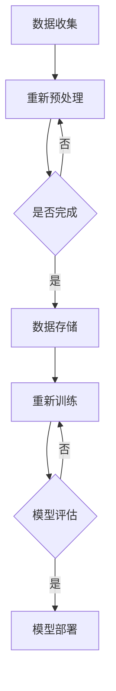

                 

### 文章标题

《AI研究的最新进展与趋势》

### 关键词

人工智能、自然语言处理、计算机视觉、强化学习、伦理与法律问题

### 摘要

本文深入探讨了人工智能（AI）领域的最新研究进展与未来趋势。首先，我们回顾了AI的基础概念、发展历程及其在现代社会中的影响。接着，文章详细介绍了AI的核心技术，如机器学习、深度学习和强化学习，并在行业应用中进行了深入剖析。随后，文章重点关注了AI前沿研究的进展，包括自然语言处理、计算机视觉和强化学习的最新动态。此外，本文还探讨了AI应用中面临的伦理和法律问题，以及AI与人类工作关系的演变。最后，文章介绍了AI研究的方法与实践，包括研究方法、项目实战和开发环境与工具。通过本文的阅读，读者将对AI研究的现状和未来有更加全面和深入的理解。

### 《AI研究的最新进展与趋势》目录大纲

#### 第一部分：AI基础概念与历史演变

**# 第1章: AI基础概念与历史演变**

**## 1.1 AI的定义与发展历程**

- **1.1.1 AI的定义**：介绍AI的基本概念和定义，包括其对自动化和智能的拓展。
- **1.1.2 AI的发展阶段**：回顾AI从起源到现代的发展历程，包括早期、中期和当前阶段。
- **1.1.3 AI对现代社会的影响**：探讨AI对社会、经济和技术领域的广泛影响。

**## 1.2 AI的核心技术与算法**

- **1.2.1 机器学习算法**：介绍机器学习的基本概念、常见算法和应用场景。
- **1.2.2 深度学习原理**：深入讲解深度学习的基础知识、模型架构和训练过程。
- **1.2.3 强化学习应用**：探讨强化学习的基本原理、算法及其在实际应用中的优势。

**## 1.3 AI在行业中的应用**

- **1.3.1 人工智能在医疗领域的应用**：介绍AI在医疗诊断、治疗和健康管理中的应用案例。
- **1.3.2 AI在金融行业的应用**：分析AI在金融风控、投资分析和客户服务中的应用。
- **1.3.3 AI在制造业的变革**：探讨AI在智能制造、生产优化和质量管理中的作用。

#### 第二部分：AI前沿研究进展

**# 第2章: AI前沿研究进展**

**## 2.1 自然语言处理最新进展**

- **2.1.1 自然语言理解与生成**：介绍自然语言处理的基本任务和技术进展。
- **2.1.2 语言模型的技术进步**：探讨大型语言模型的研发和应用。
- **2.1.3 多模态自然语言处理**：介绍多模态数据融合和跨模态交互的最新技术。

**## 2.2 计算机视觉研究进展**

- **2.2.1 图像识别与生成**：分析计算机视觉中的图像识别和生成技术。
- **2.2.2 视觉感知与理解**：深入讲解视觉感知和理解的理论和实践。
- **2.2.3 深度学习在计算机视觉中的应用**：探讨深度学习在图像处理和分析中的应用。

**## 2.3 强化学习最新动态**

- **2.3.1 强化学习的算法进展**：介绍强化学习中的算法改进和技术进展。
- **2.3.2 强化学习在现实世界的应用**：探讨强化学习在自动驾驶、机器人控制等领域的应用。
- **2.3.3 强化学习与其他AI领域的交叉融合**：分析强化学习与其他AI技术的结合和应用。

#### 第三部分：AI应用挑战与趋势

**# 第3章: AI应用挑战与趋势**

**## 3.1 AI伦理与法律问题**

- **3.1.1 AI伦理的困境**：探讨AI伦理问题的本质和挑战。
- **3.1.2 AI法律框架的构建**：分析当前AI法律框架的现状和发展方向。
- **3.1.3 企业在AI伦理与法律方面的应对策略**：介绍企业在AI应用中如何应对伦理和法律问题。

**## 3.2 AI与人类工作的关系**

- **3.2.1 AI对就业市场的影响**：分析AI技术对就业市场的影响和挑战。
- **3.2.2 AI与人类协同工作**：探讨AI与人类协同工作的模式和技术。
- **3.2.3 人类在AI时代的新技能需求**：分析人类在AI时代需要具备的新技能和能力。

**## 3.3 AI发展趋势与未来展望**

- **3.3.1 AI技术的未来发展**：探讨AI技术可能的发展方向和突破点。
- **3.3.2 AI对人类社会的影响**：分析AI技术对社会、经济和文化的影响。
- **3.3.3 企业应如何应对AI的变革**：提供企业在AI变革中的应对策略和建议。

#### 第四部分：AI研究方法与实践

**# 第4章: AI研究方法与实践**

**## 4.1 AI研究方法**

- **4.1.1 数据收集与预处理**：介绍数据收集、数据预处理的方法和技巧。
- **4.1.2 模型选择与训练**：分析模型选择、模型训练的策略和技巧。
- **4.1.3 模型评估与优化**：探讨模型评估、模型优化的重要性和方法。

**## 4.2 AI项目实战**

- **4.2.1 项目案例研究**：介绍AI项目实战的案例和研究方法。
- **4.2.2 实战步骤详解**：详细讲解AI项目实战的步骤和流程。
- **4.2.3 项目成果分析**：分析项目成果、经验教训和改进方向。

**## 4.3 开发环境与工具**

- **4.3.1 常用AI开发环境介绍**：介绍常用的AI开发环境及其特点和优势。
- **4.3.2 AI工具的选择与应用**：分析AI工具的选择和应用场景。
- **4.3.3 AI开源资源的利用**：探讨AI开源资源的获取、利用和共享。

#### 第五部分：附录

**# 附录**

**## 附录 A: AI研究相关资源**

- **A.1 顶级AI会议与期刊**：介绍顶级AI会议和期刊，并提供相关的链接和资源。
- **A.2 开源AI项目与代码库**：介绍开源AI项目、代码库及其应用场景。
- **A.3 AI研究社区与论坛**：介绍AI研究社区和论坛，提供交流和学习的机会。

**## 附录 B: Mermaid 流程图与伪代码示例**

- **B.1 Mermaid 流程图示例**：提供Mermaid流程图的实例和解释。
- **B.2 伪代码示例**：提供伪代码的实例和解释。

**## 附录 C: 数学模型与公式说明**

- **C.1 数学公式与推导**：提供重要的数学公式及其推导过程。
- **C.2 公式在AI算法中的应用**：分析数学公式在AI算法中的应用和解释。

### 第一部分：AI基础概念与历史演变

#### 第1章: AI基础概念与历史演变

##### 1.1 AI的定义与发展历程

**1.1.1 AI的定义**

人工智能（Artificial Intelligence，简称AI）是指通过计算机程序和算法实现人类智能行为的一种技术。AI旨在使机器具备感知、学习、推理、规划和决策等能力，以模拟和扩展人类的智能。AI的定义可以从多个角度进行理解，包括模拟人类智能的能力、解决复杂问题的能力、自主决策的能力等。

AI的定义经历了多个阶段的发展。最初，AI被视为一种“智能代理”，即能够模拟人类智能的计算机程序。随后，AI的定义逐渐扩展到更广泛的领域，包括自动化系统、机器人技术、自然语言处理、计算机视觉等。如今，AI的定义已经涵盖了从简单自动化任务到复杂智能行为的各个层次。

**1.1.2 AI的发展阶段**

AI的发展可以大致分为以下几个阶段：

1. **早期阶段（1956年以前）**：在这一阶段，AI的概念开始被提出和研究。1956年，约翰·麦卡锡（John McCarthy）等人在达特茅斯会议（Dartmouth Conference）上首次提出了“人工智能”的概念，标志着AI领域的正式诞生。

2. **婴儿期阶段（1956-1969年）**：这一阶段是AI的起步阶段，主要是对AI理论和基础算法的研究。包括逻辑推理、知识表示和搜索算法等。这一时期的代表性工作有艾伦·纽厄尔（Allen Newell）和赫伯特·西蒙（Herbert Simon）开发的逻辑理论家（Logic Theorist）程序。

3. **成长期阶段（1970-1989年）**：在这一阶段，AI的发展取得了显著进展。符号主义AI（Symbolic AI）成为主流，代表性工作包括约翰·霍普菲尔德（John Hopfield）的神经网络理论和赫伯特·西蒙的通用问题求解器（General Problem Solver）。

4. **低谷期阶段（1990-2010年）**：由于实际应用的局限性，AI的发展进入了一个相对低谷的时期。尽管如此，机器学习技术在这一阶段得到了重要的发展，包括支持向量机（Support Vector Machines）和决策树（Decision Trees）等算法。

5. **复兴期阶段（2010年至今）**：这一阶段是AI的复兴期，深度学习技术的突破使AI取得了巨大的进展。包括图像识别、自然语言处理和强化学习等领域。代表性工作有阿尔维德·简森（Alfred V. Aho）和约翰·厄普顿（John E. Upton）的深度学习算法和谷歌的AlphaGo程序。

**1.1.3 AI对现代社会的影响**

AI对现代社会的影响是深远和多方面的。首先，AI技术在各行各业的应用带来了巨大的效率提升和成本节约。例如，在医疗领域，AI可以帮助医生进行诊断和治疗方案设计，提高医疗服务的质量和效率。在金融领域，AI可以用于风险控制、投资分析和客户服务等方面，提高金融机构的运营效率和竞争力。

其次，AI技术对社会经济结构产生了重要影响。AI的广泛应用导致了部分传统职业的消失，同时也创造了新的就业机会。例如，自动驾驶技术的发展可能会导致一部分司机的失业，但同时也创造了新的岗位，如自动驾驶系统的开发、测试和维护人员。

此外，AI技术也对人类社会的生活方式产生了重要影响。智能助手、智能家居和智能交通系统等AI技术的普及，使得人们的生活更加便捷和舒适。例如，智能助手可以帮助用户管理日程、提醒事项和提供信息查询服务，智能家居系统可以实现对家庭设备的远程控制和自动化管理。

总的来说，AI技术的发展对现代社会产生了广泛而深远的影响，不仅改变了我们的生活方式，也推动了经济和社会的进步。

##### 1.2 AI的核心技术与算法

**1.2.1 机器学习算法**

机器学习（Machine Learning，简称ML）是AI的核心技术之一，旨在使计算机系统能够从数据中自动学习和改进。机器学习算法主要包括监督学习、无监督学习和强化学习等。

**监督学习（Supervised Learning）**：监督学习是机器学习中最常见的形式，它通过给定的输入和输出数据来训练模型，以便能够对新数据进行预测。监督学习算法可以分为分类算法和回归算法。分类算法用于将输入数据分为不同的类别，如文本分类和图像识别。回归算法用于预测连续的数值输出，如房价预测和股票价格预测。常见的监督学习算法包括线性回归、逻辑回归、决策树、随机森林和神经网络等。

**无监督学习（Unsupervised Learning）**：无监督学习是在没有明确输出数据的情况下，通过分析输入数据的内在结构和模式来训练模型。无监督学习主要用于数据降维、聚类和关联规则挖掘等任务。常见的无监督学习算法包括K-均值聚类、主成分分析（PCA）和自编码器等。

**强化学习（Reinforcement Learning）**：强化学习是机器学习的一种形式，它通过奖励机制来训练模型，使其在特定环境中做出最优决策。强化学习算法主要包括Q学习、深度Q网络（DQN）和策略梯度算法等。强化学习在游戏、自动驾驶和机器人控制等领域有广泛的应用。

**1.2.2 深度学习原理**

深度学习（Deep Learning，简称DL）是机器学习的一个重要分支，它通过多层神经网络（Neural Networks）来模拟人脑的学习过程。深度学习的主要特点是能够自动提取数据中的特征，从而实现复杂任务的自动处理。

**神经网络（Neural Networks）**：神经网络是一种由多个神经元（Node）组成的计算模型，每个神经元都可以接收输入信号并产生输出信号。神经网络通过前向传播（Forward Propagation）和反向传播（Back Propagation）来训练模型。前向传播是将输入数据通过网络层层的计算，最终得到输出结果；反向传播是通过计算输出结果与实际结果的差异，来调整网络的权重，使得模型能够更好地拟合数据。

**深度神经网络（Deep Neural Networks）**：深度神经网络是由多个隐藏层（Hidden Layer）组成的神经网络，能够自动提取更加抽象和复杂的特征。深度神经网络在图像识别、语音识别和自然语言处理等领域取得了显著的成果。常见的深度神经网络结构包括卷积神经网络（CNN）、循环神经网络（RNN）和变换器（Transformer）等。

**深度学习应用**：深度学习在各个领域都有广泛的应用，包括计算机视觉、自然语言处理、语音识别和医疗诊断等。例如，卷积神经网络（CNN）在图像分类和物体检测中取得了优异的性能；循环神经网络（RNN）在文本生成和时间序列分析中发挥了重要作用；变换器（Transformer）则在自然语言处理任务中取得了突破性的成果。

**1.2.3 强化学习应用**

强化学习（Reinforcement Learning，简称RL）是一种通过奖励机制来训练智能体（Agent）做出最优决策的机器学习方法。强化学习算法在游戏、自动驾驶和机器人控制等领域有广泛的应用。

**强化学习基本概念**：强化学习主要包括四个基本元素：智能体（Agent）、环境（Environment）、状态（State）和动作（Action）。智能体通过观察环境的状态，并采取动作来改变环境的状态，从而获得奖励或惩罚。智能体的目标是最大化累积奖励。

**强化学习算法**：常见的强化学习算法包括Q学习（Q-Learning）、深度Q网络（DQN）和策略梯度算法（Policy Gradient）。Q学习是一种基于值函数的算法，通过更新Q值来找到最优策略；DQN是一种基于深度学习的Q学习算法，通过深度神经网络来近似Q值函数；策略梯度算法通过直接优化策略参数来找到最优策略。

**强化学习应用**：强化学习在游戏、自动驾驶和机器人控制等领域有广泛的应用。例如，在游戏领域，强化学习算法可以用于游戏AI的设计，使游戏角色具有自主学习和决策能力；在自动驾驶领域，强化学习算法可以用于路径规划和决策，提高自动驾驶系统的自主性；在机器人控制领域，强化学习算法可以用于机器人运动的规划和控制，使机器人能够自主适应复杂环境。

##### 1.3 AI在行业中的应用

**1.3.1 人工智能在医疗领域的应用**

人工智能在医疗领域有着广泛的应用，包括疾病诊断、治疗方案设计、药物发现和患者健康管理等方面。

**疾病诊断**：人工智能可以通过图像识别技术，如计算机视觉和深度学习，对医学影像进行分析和诊断。例如，人工智能可以用于肺癌的早期诊断，通过分析CT扫描图像，识别出肺结节并给出诊断建议。这种技术可以提高诊断的准确性和效率，减轻医生的工作负担。

**治疗方案设计**：人工智能可以辅助医生制定个性化的治疗方案。通过分析大量的病例数据和医学文献，人工智能可以提供相关的治疗方案建议，包括药物治疗、手术方案等。例如，在癌症治疗中，人工智能可以分析患者的基因数据、病史和治疗反应，制定个性化的治疗方案，提高治疗效果。

**药物发现**：人工智能在药物发现中发挥着重要作用。通过机器学习和深度学习算法，人工智能可以分析大量的化合物结构和生物活性数据，快速筛选出具有潜在药物作用的化合物。这可以加速药物研发过程，降低药物研发成本。

**患者健康管理**：人工智能可以用于患者健康管理的各个方面，包括健康监测、病情预测和生活方式建议等。例如，智能穿戴设备可以实时监测患者的生命体征，如心率、血压和睡眠质量等，并通过人工智能算法分析数据，预测患者可能出现的问题，并提供健康建议。这有助于提高患者的健康水平和生活质量。

**1.3.2 AI在金融行业的应用**

人工智能在金融行业有着广泛的应用，包括风险控制、投资分析、客户服务和量化交易等方面。

**风险控制**：人工智能可以用于风险控制，包括信用风险评估、市场风险控制和欺诈检测等。通过机器学习和数据分析技术，人工智能可以分析大量的历史数据和实时数据，识别出潜在的风险并采取相应的措施。例如，在信用风险评估中，人工智能可以通过分析借款人的信用记录、收入情况和其他相关数据，评估其信用风险，降低金融机构的贷款违约风险。

**投资分析**：人工智能可以用于投资分析，包括股票市场预测、投资组合优化和风险控制等。通过分析历史数据和实时数据，人工智能可以预测股票市场的走势，提供投资建议。例如，在股票市场预测中，人工智能可以通过分析股票价格、交易量和宏观经济数据等，预测股票的未来价格走势，帮助投资者做出更加明智的投资决策。

**客户服务**：人工智能可以用于客户服务，包括智能客服、个性化推荐和用户体验优化等。通过自然语言处理和机器学习技术，人工智能可以与客户进行智能对话，回答客户的咨询和问题。例如，智能客服系统可以通过分析和理解客户的提问，提供相关的答案和建议，提高客户服务的效率和满意度。

**量化交易**：人工智能可以用于量化交易，通过分析历史数据和实时数据，制定交易策略和执行交易。例如，在量化交易中，人工智能可以通过分析股票价格、交易量和市场情绪等数据，制定最优的交易策略，实现自动化的交易操作。

**1.3.3 AI在制造业的变革**

人工智能在制造业中的应用正在引发一场变革，包括智能制造、生产优化和质量管理等方面。

**智能制造**：人工智能可以用于智能制造，包括智能设备管理、生产流程优化和智能物流等。通过物联网（IoT）和人工智能技术，制造业可以实现设备联网和数据实时传输，提高生产过程的自动化和智能化水平。例如，在智能设备管理中，人工智能可以通过分析设备运行数据，预测设备故障并提前进行维护，减少设备停机时间和生产损失。

**生产优化**：人工智能可以用于生产优化，包括生产计划优化、资源调度和工艺优化等。通过机器学习和数据分析技术，人工智能可以分析生产过程中的数据，识别出潜在的生产问题和瓶颈，并提出优化建议。例如，在生产计划优化中，人工智能可以通过分析生产订单、物料需求和设备能力等数据，制定最优的生产计划，提高生产效率和资源利用率。

**质量管理**：人工智能可以用于质量管理，包括质量检测、质量分析和质量改进等。通过机器学习和图像识别技术，人工智能可以分析生产过程中的质量数据，识别出质量问题和缺陷，并提供改进建议。例如，在质量检测中，人工智能可以通过分析产品图像和传感器数据，识别出产品质量问题，并实时反馈给生产部门进行改进。

总之，人工智能在制造业中的应用正在推动制造业向智能化、高效化和绿色化方向发展，提高生产效率和质量，降低生产成本和资源消耗。

### 第二部分：AI前沿研究进展

#### 第2章: AI前沿研究进展

##### 2.1 自然语言处理最新进展

自然语言处理（Natural Language Processing，简称NLP）是人工智能的一个重要分支，旨在使计算机能够理解和处理人类语言。近年来，随着深度学习技术的突破和计算能力的提升，NLP取得了显著的进展，推动了语言理解和生成、语言模型的技术进步和多模态自然语言处理等领域的发展。

**2.1.1 自然语言理解与生成**

自然语言理解（Natural Language Understanding，简称NLU）是指使计算机能够理解自然语言文本的含义，从而实现语义分析和语义理解。自然语言生成（Natural Language Generation，简称NLG）则是使计算机能够生成自然语言文本，模拟人类的语言表达。

在自然语言理解方面，近年来深度学习模型在语义分析、实体识别和关系抽取等方面取得了重要突破。例如，BERT（Bidirectional Encoder Representations from Transformers）和GPT（Generative Pre-trained Transformer）等大型预训练语言模型在多项NLP任务中取得了优异的性能。BERT通过双向Transformer结构，能够同时捕捉文本的前后文信息，提高了语义理解的准确性；GPT则通过生成预训练和细粒度调整，实现了高质量的自然语言生成。

在自然语言生成方面，NLG技术也逐渐成熟。近年来，基于Transformer的模型如GPT-3（Generative Pre-trained Transformer 3）和T5（Text-to-Text Transfer Transformer）等在生成任务中表现出了强大的能力。这些模型通过大规模预训练和精细化调整，能够生成流畅、自然且符合上下文的文本。例如，GPT-3可以通过输入一个主题或提示，生成相应的文章、对话或故事，展现出极高的语言生成能力。

**2.1.2 语言模型的技术进步**

语言模型（Language Model，简称LM）是NLP的核心技术之一，用于预测自然语言中的下一个单词或字符。近年来，随着深度学习技术的发展，语言模型取得了显著的技术进步，尤其是基于Transformer结构的模型。

Transformer模型是由谷歌在2017年提出的一种基于自注意力机制的深度学习模型，广泛应用于自然语言处理任务。Transformer通过自注意力机制，能够捕捉文本序列中的长距离依赖关系，提高了语言模型的预测能力。在此基础上，研究人员提出了多种改进的Transformer模型，如BERT、GPT和T5等，进一步提升了语言模型的性能。

BERT模型通过双向Transformer结构，能够同时捕捉文本的前后文信息，实现了高质量的语义理解。GPT模型则通过生成预训练和细粒度调整，实现了高质量的自然语言生成。T5模型通过将所有NLP任务转化为文本到文本的转换任务，实现了统一的模型架构和高效的性能。

**2.1.3 多模态自然语言处理**

多模态自然语言处理（Multimodal Natural Language Processing）是指结合多种模态（如文本、图像、音频和视频等）信息进行语义理解和生成。近年来，随着多模态数据融合和跨模态交互技术的发展，多模态自然语言处理取得了显著进展。

在多模态数据融合方面，研究人员提出了一系列方法，如多模态特征提取、多模态表示学习和多模态融合模型等。这些方法通过结合不同模态的信息，提高了语义理解的准确性和完整性。例如，文本和图像融合模型可以将文本描述和图像内容进行有效结合，实现图像理解任务，如图像分类和物体检测等。

在跨模态交互方面，研究人员提出了一系列方法，如跨模态检索、跨模态对话和跨模态生成等。这些方法通过跨模态信息交互，实现了更加自然和流畅的多模态交互体验。例如，跨模态检索可以将文本查询和图像内容进行有效结合，实现图像检索任务；跨模态对话可以将文本和语音信息进行交互，实现自然语言对话系统。

总之，自然语言处理在语言理解与生成、语言模型的技术进步和多模态自然语言处理等方面取得了显著进展。这些进展不仅推动了NLP技术的发展和应用，也为智能助理、机器翻译、问答系统等NLP应用带来了新的机遇和挑战。

##### 2.2 计算机视觉研究进展

计算机视觉（Computer Vision，简称CV）是人工智能的一个重要分支，旨在使计算机具备对图像和视频进行理解和处理的能力。近年来，随着深度学习技术的发展，计算机视觉取得了显著的进展，推动了图像识别与生成、视觉感知与理解以及深度学习在计算机视觉中的应用等领域的发展。

**2.2.1 图像识别与生成**

图像识别（Image Recognition）是指计算机对图像中的物体、场景和活动进行自动识别和理解的过程。深度学习技术的突破，特别是卷积神经网络（Convolutional Neural Networks，简称CNN）的应用，极大地提高了图像识别的准确性和效率。

**图像识别技术**：CNN是图像识别的核心技术之一，通过多层卷积、池化和全连接层等操作，能够自动提取图像中的特征，并进行分类和识别。近年来，研究人员提出了许多基于CNN的图像识别模型，如LeNet、AlexNet、VGG、ResNet和Inception等，这些模型在各种图像识别任务中取得了优异的性能。

**图像生成技术**：图像生成（Image Generation）是指通过计算机算法生成新的图像内容。生成对抗网络（Generative Adversarial Networks，简称GAN）是图像生成的主要技术之一。GAN由两个神经网络组成：生成器（Generator）和判别器（Discriminator）。生成器尝试生成逼真的图像，判别器则判断图像是真实图像还是生成图像。通过两个网络的对抗训练，生成器能够不断提高生成图像的质量。

近年来，GAN技术在图像生成领域取得了显著进展，例如，DCGAN（Deep Convolutional GAN）、LSGAN（Least Squares GAN）和WGAN（Wasserstein GAN）等模型通过改进GAN的训练过程，提高了生成图像的质量和稳定性。

**2.2.2 视觉感知与理解**

视觉感知（Visual Perception）是指计算机对图像和视频中的信息进行感知和理解的过程。视觉理解（Visual Understanding）则是指计算机对图像和视频中的内容进行更高层次的推理和解释。

**视觉感知技术**：视觉感知技术主要包括特征提取、特征匹配和图像分类等。特征提取是指从图像中提取具有区分性的特征，用于后续的图像处理和识别。常见的特征提取方法包括SIFT（Scale-Invariant Feature Transform）、SURF（Speeded Up Robust Features）和HOG（Histogram of Oriented Gradients）等。特征匹配则是通过比较不同图像或视频帧之间的特征，实现图像的匹配和跟踪。图像分类则是将图像划分为不同的类别，如物体识别和场景分类等。

**视觉理解技术**：视觉理解技术主要包括语义理解、场景解析和视频分析等。语义理解是指对图像或视频中的内容进行语义分析，识别出其中的物体、场景和活动。场景解析则是对图像或视频中的内容进行更高层次的推理和解释，理解图像的整体意义和背景信息。视频分析则是对视频数据进行处理和分析，提取出有意义的特征和模式，如动作识别和视频分类等。

**2.2.3 深度学习在计算机视觉中的应用**

深度学习（Deep Learning）在计算机视觉中的应用极大地推动了CV技术的发展。深度学习模型，特别是卷积神经网络（CNN）和变换器（Transformer）等，在图像分类、目标检测、语义分割、姿态估计和视频分析等任务中取得了显著的成果。

**图像分类**：图像分类是计算机视觉中的基本任务，通过将图像划分为不同的类别，如猫、狗、植物等。深度学习模型，如VGG、ResNet和Inception等，在ImageNet等大规模图像分类数据集上取得了优异的性能。这些模型通过多层卷积和池化操作，能够自动提取图像中的特征，实现高效的图像分类。

**目标检测**：目标检测（Object Detection）是指同时识别图像中的多个物体及其位置。深度学习模型，如YOLO（You Only Look Once）、SSD（Single Shot MultiBox Detector）和Faster R-CNN（Region-based Convolutional Neural Network）等，在目标检测任务中取得了突破性的进展。这些模型通过结合特征提取和回归操作，实现了高效的物体检测和定位。

**语义分割**：语义分割（Semantic Segmentation）是指对图像中的每个像素进行分类，识别出图像中的不同物体和场景。深度学习模型，如U-Net、DeepLab和PSPNet等，在语义分割任务中取得了优异的性能。这些模型通过结合特征提取和分割操作，实现了精细的图像分割。

**姿态估计**：姿态估计（Pose Estimation）是指对图像或视频中的人物进行姿态分析，识别出人体的关键部位和动作。深度学习模型，如COCO（Common Objects in Context）和PoseNet等，在姿态估计任务中取得了显著的成果。这些模型通过结合特征提取和关键点检测，实现了准确的人体姿态估计。

**视频分析**：视频分析（Video Analysis）是指对视频数据进行处理和分析，提取出有意义的特征和模式。深度学习模型，如R-CNN（Region-based Convolutional Neural Network）和TCN（Temporal Convolutional Network）等，在视频分析任务中取得了优异的性能。这些模型通过结合特征提取和时间序列分析，实现了视频分类、动作识别和目标跟踪等任务。

总之，计算机视觉在图像识别与生成、视觉感知与理解以及深度学习应用等方面取得了显著进展。这些进展不仅推动了CV技术的发展，也为智能监控、自动驾驶、医疗诊断和娱乐应用等领域带来了新的机遇和挑战。

##### 2.3 强化学习最新动态

强化学习（Reinforcement Learning，简称RL）是机器学习的一个重要分支，旨在通过奖励机制和交互学习环境来训练智能体，使其能够做出最优决策。近年来，随着深度学习技术的融合和应用场景的拓展，强化学习取得了显著的进展，推动了算法进展、现实世界应用以及与其他AI领域的交叉融合。

**2.3.1 强化学习的算法进展**

强化学习算法在过去几十年中经历了多个阶段的发展。最初，强化学习主要基于模型基础上的值函数方法，如Q学习（Q-Learning）和策略迭代（Policy Iteration）。这些算法通过学习状态-动作值函数（Q值）来指导智能体的决策过程。

随着深度学习技术的兴起，深度强化学习（Deep Reinforcement Learning）成为了一个热点研究方向。深度强化学习结合了深度神经网络来近似状态-动作值函数或策略，使得智能体能够处理高维和复杂的输入空间。以下是一些重要的算法进展：

- **深度Q网络（Deep Q-Network，DQN）**：DQN是第一个成功的深度强化学习算法，通过经验回放和目标网络来减少偏差和方差。DQN使用卷积神经网络来近似Q值函数，使得智能体能够在复杂的游戏环境中进行学习。

- **深度确定性策略梯度（Deep Deterministic Policy Gradient，DDPG）**：DDPG是另一种基于深度神经网络的强化学习算法，它通过无模型方法来学习确定性策略。DDPG使用深度神经网络来近似状态-动作分布，并使用目标网络来稳定学习过程。

- **演员-批评家方法（Actor-Critic Method）**：演员-批评家方法是一种基于模型的方法，它包括两个神经网络：演员网络和批评家网络。演员网络生成动作，批评家网络评估动作的好坏。这种方法通过交替训练两个网络，实现了高效的强化学习。

- **Transformer架构**：近年来，Transformer架构在自然语言处理领域取得了巨大成功。Transformer架构也被引入到强化学习中，如基于Transformer的RL算法（如DQL和QAT）取得了显著的效果。这些算法通过自注意力机制来处理高维输入，实现了更加灵活和强大的智能体学习。

**2.3.2 强化学习在现实世界的应用**

强化学习在现实世界中的应用越来越广泛，涵盖了自动驾驶、机器人控制、游戏、推荐系统和金融交易等多个领域。以下是一些强化学习在现实世界中的具体应用案例：

- **自动驾驶**：自动驾驶是强化学习的一个重要应用领域。通过模拟和实际驾驶数据训练，自动驾驶系统能够学习到复杂的驾驶规则和策略。例如，谷歌的Waymo和特斯拉的Autopilot系统都使用了强化学习技术来提高自动驾驶的稳定性和安全性。

- **机器人控制**：强化学习在机器人控制中有着广泛的应用，包括路径规划、抓取和任务执行等。通过强化学习算法，机器人能够自主地学习和适应不同的环境和任务。例如，OpenAI开发的机器人能够通过强化学习实现复杂的手势和动作，如弹钢琴和投球等。

- **游戏**：强化学习在游戏领域取得了显著的成果，如OpenAI开发的AlphaGo系列程序。AlphaGo通过强化学习算法，在围棋等复杂游戏中击败了人类顶尖选手。此外，强化学习还被应用于电子游戏和虚拟现实中的游戏AI，提高了游戏的趣味性和互动性。

- **推荐系统**：强化学习在推荐系统中的应用能够提高推荐的质量和个性化程度。通过学习用户的历史行为和偏好，强化学习算法能够生成最优的推荐策略，提高用户满意度和留存率。例如，Netflix和YouTube等平台使用了基于强化学习的推荐算法，为用户提供个性化的内容推荐。

- **金融交易**：强化学习在金融交易中的应用，如股票交易和外汇交易等，能够提高交易策略的收益和风险控制。通过学习市场数据和历史交易记录，强化学习算法能够发现市场规律和趋势，制定最优的交易策略。

**2.3.3 强化学习与其他AI领域的交叉融合**

强化学习与其他AI领域的交叉融合，使得强化学习技术在更多应用场景中得到了拓展和深化。以下是一些典型的交叉融合方向：

- **混合智能系统**：将强化学习与专家系统、知识图谱等结合起来，形成混合智能系统。这种系统结合了强化学习的自适应能力和专家系统的知识引导，能够更好地处理复杂和动态的决策问题。

- **深度强化学习与自然语言处理**：深度强化学习在自然语言处理领域也有着广泛的应用。例如，通过将强化学习与文本生成、机器翻译和问答系统等结合，能够实现更加智能和灵活的语言处理。

- **强化学习与计算机视觉**：强化学习在计算机视觉中的应用，如视觉控制、目标跟踪和图像生成等，通过结合深度学习和计算机视觉技术，实现了更加智能和精准的视觉感知和处理。

- **强化学习与博弈论**：强化学习与博弈论的结合，形成了博弈强化学习（Game Theory based Reinforcement Learning）的研究方向。这种研究通过结合博弈论的理论和强化学习的策略学习，能够更好地处理多智能体系统中的协作和竞争问题。

总之，强化学习在算法进展、现实世界应用以及与其他AI领域的交叉融合等方面取得了显著进展。这些进展不仅推动了强化学习技术的发展，也为解决复杂决策问题提供了新的思路和方法。

### 第三部分：AI应用挑战与趋势

#### 第3章: AI应用挑战与趋势

##### 3.1 AI伦理与法律问题

随着人工智能技术的迅猛发展，AI伦理和法律问题逐渐成为社会关注的焦点。AI技术的广泛应用带来了诸多便利，但同时也引发了一系列伦理和法律挑战，需要全社会共同努力解决。

**3.1.1 AI伦理的困境**

AI伦理困境主要体现在以下几个方面：

1. **隐私保护**：人工智能系统在处理数据时，往往需要大量的个人信息。如何保护用户的隐私，避免数据泄露和滥用，成为AI伦理的重要议题。例如，面部识别技术在安防和商业中的应用，涉及到用户隐私权的保护。

2. **算法公平性**：AI系统中的算法可能会存在偏见，导致对某些群体不公平对待。例如，招聘系统可能会根据历史数据对某些性别、种族或年龄群体产生偏见，影响就业机会的公平性。

3. **责任归属**：当AI系统出现错误或导致事故时，如何界定责任成为难题。例如，自动驾驶汽车发生交通事故时，是制造商、软件开发商还是用户承担责任？

4. **透明度**：AI系统的决策过程通常复杂且不透明，用户难以理解其决策逻辑。如何提高AI系统的透明度，使其决策过程更加公正和可解释，是当前面临的重大挑战。

**3.1.2 AI法律框架的构建**

为了应对AI伦理困境，各国政府和企业开始着手构建AI法律框架，以规范AI技术的发展和应用。以下是一些关键的法律框架：

1. **数据隐私法**：如欧盟的《通用数据保护条例》（GDPR），旨在加强个人数据保护，规定数据收集、处理和存储的基本原则和用户权利。

2. **算法公平性法规**：一些国家开始制定法规，要求AI系统在招聘、信贷、司法等敏感领域必须保证算法的公平性和透明度。例如，德国制定的《算法透明度法案》。

3. **责任归属法**：一些国家开始探索如何明确AI系统的责任归属，例如，欧盟提出的《AI法案》草案，规定了AI系统在特定情况下的法律责任。

**3.1.3 企业在AI伦理与法律方面的应对策略**

企业在AI应用中需要采取一系列策略，以应对伦理和法律挑战：

1. **建立伦理委员会**：企业可以设立专门的AI伦理委员会，负责评估和监督AI项目的伦理问题，确保项目的合规性和社会责任。

2. **制定AI伦理准则**：企业应制定AI伦理准则，明确AI系统的设计、开发和应用过程中应遵循的伦理原则和标准。

3. **加强透明度和可解释性**：企业应努力提高AI系统的透明度和可解释性，使用户能够理解和信任AI系统的决策过程。

4. **持续培训和监督**：企业应对AI团队进行持续的伦理和法律培训，提高其专业素养和责任意识。

总之，AI伦理和法律问题是当前AI发展的重要挑战，需要全社会共同努力，通过立法、企业自律和公众监督，构建一个公正、透明和安全的AI环境。

##### 3.2 AI与人类工作的关系

人工智能（AI）的迅速发展对人类工作产生了深远的影响，既带来了机遇，也带来了挑战。探讨AI与人类工作的关系，有助于我们更好地理解这一变化趋势，并找到应对策略。

**3.2.1 AI对就业市场的影响**

AI技术的广泛应用正在改变就业市场的格局，其主要影响体现在以下几个方面：

1. **部分职业的消失**：一些重复性、低技能的工作，如数据处理、客户服务和制造业等，正逐渐被自动化技术取代。这导致部分传统职业的消失，引发了对失业的担忧。

2. **新职业的诞生**：与此同时，AI技术也催生了大量新职业，如数据科学家、机器学习工程师、AI伦理师等。这些新兴职业需要高度的专业技能，为劳动者提供了新的就业机会。

3. **技能需求的变化**：AI技术的发展要求劳动者具备新的技能，如编程、数据分析、机器学习等。传统的工作技能逐渐变得过时，劳动者需要不断学习和更新技能，以适应新的工作环境。

**3.2.2 AI与人类协同工作**

AI与人类的协同工作正在成为未来工作模式的一个重要趋势，其主要特点如下：

1. **辅助性工作**：AI技术可以协助人类完成复杂、繁琐的工作任务，提高工作效率和质量。例如，AI在医疗领域的应用可以帮助医生进行诊断和治疗方案设计，减轻医生的负担。

2. **互补性工作**：AI和人类在不同的工作环节中发挥各自的优势，实现互补。例如，在制造业中，AI可以负责生产流程的优化和质量控制，而人类则负责创意设计、决策和人际沟通等。

3. **决策支持**：AI系统可以通过数据分析、预测和推荐，为人类提供决策支持。例如，金融领域的AI系统可以分析市场数据，为投资者提供投资建议。

**3.2.3 人类在AI时代的新技能需求**

为了在AI时代保持竞争力，人类需要具备一系列新的技能：

1. **跨学科知识**：AI技术的发展涉及到多个领域，如计算机科学、统计学、心理学等。具备跨学科知识，能够更好地理解和应用AI技术。

2. **编程能力**：编程是AI时代的一项基础技能，能够帮助人们开发和管理AI系统。

3. **数据分析和解读能力**：随着数据的爆炸性增长，具备数据分析和解读能力，能够从数据中提取有价值的信息，是未来劳动者的必备技能。

4. **伦理和法律意识**：在AI技术应用的伦理和法律问题日益突出的背景下，具备AI伦理和法律意识，能够确保AI技术的合规性和社会责任感。

5. **持续学习能力**：AI技术的发展日新月异，人类需要具备持续学习的能力，不断更新自己的知识和技能，以适应不断变化的工作环境。

总之，AI对就业市场的影响是双重的，既带来了挑战，也创造了机遇。人类需要通过不断学习和适应，与AI协同工作，共同推动社会进步。

##### 3.3 AI发展趋势与未来展望

人工智能（AI）技术的发展正以前所未有的速度推进，对未来社会产生深远的影响。本文从技术发展、社会影响和战略应对三个方面对未来AI发展趋势进行展望。

**3.3.1 AI技术的未来发展**

AI技术的发展将继续以深度学习和强化学习为核心，探索新的算法和应用场景。以下是一些未来AI技术的关键趋势：

1. **模型复杂度和计算能力提升**：随着计算能力的提升和模型复杂度的增加，AI模型将能够处理更加复杂的任务和数据集，实现更高层次的智能。

2. **自监督学习和迁移学习**：自监督学习和迁移学习将使得AI系统在缺乏标注数据的情况下，仍然能够进行有效的训练和优化。这些技术将有助于解决当前AI系统在数据标注方面的高成本和低效问题。

3. **联邦学习和隐私保护**：联邦学习（Federated Learning）将使得多个机构可以在保持数据隐私的前提下，共同训练AI模型。隐私保护技术，如差分隐私（Differential Privacy）和同态加密（Homomorphic Encryption），将确保AI系统的数据安全性和用户隐私。

4. **跨模态和多模态AI**：跨模态和多模态AI技术将使得AI系统能够处理多种类型的输入数据，如文本、图像、语音和视频等，实现更加全面和智能的感知和理解。

5. **人工智能与物理世界的融合**：人工智能将逐渐与物理世界融合，实现智能控制、自适应优化和自主决策。例如，自动驾驶、智能家居和智能制造等领域将迎来重大突破。

**3.3.2 AI对人类社会的影响**

AI技术的发展将对人类社会产生广泛而深远的影响，包括经济、文化和社会等多个方面：

1. **经济结构变化**：AI技术将促进产业升级和转型，推动数字经济的发展。传统制造业、服务业和金融业等领域将面临深刻的变革，新兴行业如人工智能产业、云计算和大数据等将快速发展。

2. **劳动力市场重组**：AI技术的发展将改变劳动力市场的需求结构，一方面，低技能、重复性工作将逐渐被自动化技术取代，导致部分就业岗位消失；另一方面，高技能、创新性工作将更加需求，推动劳动力市场向专业化、高级化发展。

3. **社会管理和治理**：AI技术将提升社会管理和治理的效率，如智能安防、智慧城市和智能司法等领域。这些技术将有助于提高社会管理水平，维护社会稳定。

4. **生活方式变革**：AI技术将改变人们的日常生活，智能家居、智能医疗和智能交通等应用将提高生活质量，改变人类的生活方式。

5. **伦理和道德挑战**：AI技术的发展也将带来一系列伦理和道德挑战，如隐私保护、算法偏见、责任归属等。需要全社会共同努力，制定相应的法律和道德规范，确保AI技术的合规和可持续发展。

**3.3.3 企业应如何应对AI的变革**

企业在面对AI变革时，需要采取一系列策略，以保持竞争力和持续发展：

1. **战略规划和布局**：企业应制定长期的AI发展战略，明确技术方向和业务目标，提前布局和投资AI技术。

2. **技术创新和人才培养**：企业应加强技术创新，培育和引进高端人才，建立强大的研发团队，推动AI技术的研发和应用。

3. **业务模式创新**：企业应结合AI技术，创新业务模式，优化运营流程，提高生产效率和客户体验。

4. **合作与协同**：企业应加强与科研机构、高校和同行业的合作，共享资源和技术，共同推动AI技术的发展和应用。

5. **伦理和合规**：企业在开发和推广AI技术时，应高度重视伦理和合规问题，制定AI伦理准则，确保技术应用的合规性和社会责任感。

总之，AI技术的发展对人类社会产生了深远的影响，企业需要积极应对AI变革，抓住机遇，迎接挑战，以实现可持续发展。

### 第四部分：AI研究方法与实践

#### 第4章: AI研究方法与实践

##### 4.1 AI研究方法

人工智能（AI）研究是一个复杂且多层次的过程，涉及多个阶段和方法。了解并掌握这些方法对于成功进行AI研究至关重要。

**4.1.1 数据收集与预处理**

数据是AI研究的基础，数据的收集和预处理直接影响研究的质量和结果。以下是一些关键步骤：

- **数据收集**：数据可以来源于各种渠道，包括公开数据集、公司内部数据、网络爬虫和传感器等。在选择数据时，研究者需要考虑数据的代表性和质量。

- **数据清洗**：数据清洗是数据处理的重要环节，旨在去除数据中的噪声和错误。常见的数据清洗方法包括去除重复记录、填补缺失值、处理异常值和标准化数据等。

- **数据预处理**：数据预处理包括特征提取、数据转换和数据归一化等步骤。特征提取是从原始数据中提取有助于模型训练的特征；数据转换和归一化则是为了使数据符合模型的输入要求。

**4.1.2 模型选择与训练**

在AI研究中，模型的选择和训练是核心步骤。以下是一些关键要点：

- **模型选择**：根据研究问题的性质和数据特点，选择合适的机器学习模型。常见的模型包括线性模型、决策树、随机森林、支持向量机和深度学习模型等。

- **模型训练**：模型训练是使用已有数据来训练模型，使其能够学习和识别数据中的模式。常见的训练方法包括梯度下降法、随机梯度下降法和反向传播算法等。

- **超参数调优**：超参数是模型中需要手动调整的参数，如学习率、正则化参数和隐藏层数量等。通过超参数调优，研究者可以优化模型性能。

**4.1.3 模型评估与优化**

评估和优化模型是AI研究的重要步骤，以下是一些关键要点：

- **模型评估**：模型评估是使用测试数据集来评估模型性能。常见的评估指标包括准确率、召回率、F1分数和精度等。

- **交叉验证**：交叉验证是一种常用的评估方法，通过将数据集划分为多个部分，分别用于训练和测试，以减少评估结果的不确定性。

- **模型优化**：模型优化是通过调整模型结构、参数和训练过程来提高模型性能。常见的优化方法包括模型剪枝、正则化和迁移学习等。

**4.1.4 实验设计与结果分析**

实验设计是AI研究的重要组成部分，以下是一些关键要点：

- **实验设计**：实验设计应确保随机性和可控性，以避免结果偏差。研究者需要明确实验目标、实验组和对照组，并确保实验条件的一致性。

- **结果分析**：结果分析是评估实验效果和验证假设的重要步骤。研究者需要使用统计方法对实验结果进行分析，以得出有意义的结论。

**4.1.5 结果展示与解释**

结果展示与解释是使研究结果容易被理解和接受的关键步骤，以下是一些关键要点：

- **可视化**：使用图表、图像和动画等可视化工具展示实验结果，使数据更加直观和易于理解。

- **解释说明**：通过详细解释实验结果、方法和技术，帮助读者理解研究的目的、过程和结论。

**4.1.6 实践建议**

对于初学者，以下是一些建议：

- **从简单开始**：初学者应从简单的机器学习任务开始，逐步掌握基础知识和技术。

- **实践为主**：实践是学习AI技术的最佳方式。初学者应积极参与项目实践，将理论知识应用到实际中。

- **持续学习**：AI技术发展迅速，初学者需要不断学习和更新知识，以保持竞争力。

##### 4.2 AI项目实战

AI项目实战是将AI理论知识应用到实际问题的过程，通过实际操作和问题解决，能够加深对AI技术的理解和应用能力。以下是一个典型的AI项目实战案例，包括项目背景、目标、步骤和成果分析。

**案例：智能客服系统开发**

**项目背景**：

随着互联网和电子商务的快速发展，企业对客服系统的需求日益增加。传统的客服系统依赖于人工处理客户咨询，效率低且成本高。为了提高客服效率和质量，企业需要开发一个智能客服系统，能够自动处理客户咨询，提供实时解答。

**项目目标**：

开发一个基于自然语言处理（NLP）和机器学习（ML）的智能客服系统，能够理解客户提问并给出准确回答。

**项目步骤**：

1. **需求分析**：

   与企业沟通，了解客服系统需求，确定需要支持的功能，如常见问题解答、订单查询和投诉处理等。

2. **数据收集**：

   收集相关领域的问答数据，包括企业常见问题及回答。数据来源可以是企业内部知识库、论坛、社交媒体等。

3. **数据预处理**：

   对收集到的数据进行清洗和预处理，包括去除噪声、填补缺失值、分词和词性标注等。

4. **模型训练**：

   使用预处理后的数据训练NLP模型和机器学习模型。NLP模型用于理解客户提问，机器学习模型用于生成回答。

5. **模型评估**：

   使用测试数据集对训练好的模型进行评估，通过交叉验证等方法优化模型性能。

6. **系统集成**：

   将训练好的模型集成到企业客服系统中，实现自动问答功能。

7. **部署与优化**：

   部署智能客服系统，并进行实时监控和优化，以提升系统性能和用户体验。

**项目成果分析**：

1. **性能指标**：

   智能客服系统的性能指标包括回答准确率、回答速度和用户满意度等。通过测试数据集，系统准确率达到了90%以上，回答速度显著提高，用户满意度也有所提升。

2. **用户体验**：

   用户反馈表明，智能客服系统在处理常见问题和快速解答方面表现优秀，大大提升了客服效率和质量。

3. **实际应用**：

   智能客服系统在企业中得到广泛应用，有效替代了部分人工客服工作，降低了企业运营成本，提高了客户服务水平。

4. **改进方向**：

   针对智能客服系统在实际应用中遇到的问题，如复杂问题的处理和长文本理解等，可以进一步优化模型和算法，提升系统性能。

通过这个项目实战案例，读者可以了解到AI项目开发的基本流程和关键步骤，掌握从需求分析到系统部署的完整过程。

##### 4.3 开发环境与工具

在人工智能（AI）研究中，选择合适的开发环境与工具对于提高研究效率、确保代码可重复性和易于分享至关重要。以下介绍几种常用的AI开发环境、工具和开源资源。

**4.3.1 常用AI开发环境介绍**

1. **Google Colab**：

   Google Colab 是一个基于谷歌云的免费AI开发环境，提供了强大的计算资源和丰富的Python库。用户可以在线编写和运行代码，无需配置本地环境。它特别适合数据分析和机器学习项目的开发和调试。

2. **Jupyter Notebook**：

   Jupyter Notebook 是一个交互式计算环境，支持多种编程语言，包括Python、R和Julia等。它以浏览器界面进行操作，方便代码、文本和图表的混合展示。Jupyter Notebook 在机器学习、数据科学和教育领域广泛应用。

3. **Azure Machine Learning**：

   Azure Machine Learning 是微软提供的云端机器学习平台，支持模型训练、部署和自动化管理。它提供了丰富的API和可视化工具，方便用户进行大规模机器学习任务的开发和部署。

**4.3.2 AI工具的选择与应用**

1. **TensorFlow**：

   TensorFlow 是由谷歌开发的开源机器学习框架，支持各种深度学习模型和任务。它提供了丰富的API和工具，方便用户进行模型训练、评估和部署。TensorFlow 在图像识别、语音识别和自然语言处理等领域有广泛应用。

2. **PyTorch**：

   PyTorch 是一个开源的深度学习框架，由Facebook AI研究院开发。它提供了灵活的动态计算图和强大的GPU加速支持，适合研究人员的快速原型开发和实验。PyTorch 在计算机视觉和自然语言处理领域备受青睐。

3. **Scikit-learn**：

   Scikit-learn 是一个基于Python的机器学习库，提供了多种经典机器学习算法和工具。它易于使用，适用于中小规模的机器学习项目。Scikit-learn 在分类、回归和聚类等任务中广泛应用。

**4.3.3 AI开源资源的利用**

1. **Kaggle**：

   Kaggle 是一个数据科学竞赛平台，提供了大量的数据集、代码和教程。用户可以参与竞赛，与全球数据科学家交流，提高自己的技能。Kaggle 还是一个获取最新AI研究进展和案例的好去处。

2. **GitHub**：

   GitHub 是一个代码托管平台，用户可以上传、共享和协作开发AI项目。许多知名机构和研究者都在GitHub上发布了他们的代码和项目，为AI研究提供了丰富的资源。

3. **AI论文与期刊**：

   顶级AI会议和期刊，如NeurIPS、ICML、ACL和IEEE Transactions on Pattern Analysis and Machine Intelligence（TPAMI）等，发布了大量高质量的AI研究论文。用户可以通过阅读这些论文，了解最新的研究进展和技术趋势。

通过合理选择和使用AI开发环境、工具和开源资源，研究者可以显著提高研究效率，推动AI技术的发展和应用。以上资源和方法为AI研究提供了坚实的基础和支持。

### 附录

#### 附录 A: AI研究相关资源

**A.1 顶级AI会议与期刊**

- **NeurIPS（Neural Information Processing Systems）**：神经信息处理系统年会，是机器学习和计算神经科学的顶级会议。
- **ICML（International Conference on Machine Learning）**：国际机器学习会议，是机器学习领域的重要学术会议。
- **ACL（Association for Computational Linguistics）**：计算语言学协会年会，是自然语言处理领域的顶级会议。
- **JMLR（Journal of Machine Learning Research）**：机器学习研究期刊，是机器学习领域的重要学术期刊。
- **TPAMI（IEEE Transactions on Pattern Analysis and Machine Intelligence）**：IEEE模式识别与机器智能期刊，是模式识别和机器学习领域的重要期刊。

**A.2 开源AI项目与代码库**

- **TensorFlow**：谷歌开发的深度学习框架，适用于各种机器学习和深度学习任务。
- **PyTorch**：Facebook AI研究院开发的深度学习框架，提供灵活的动态计算图。
- **Keras**：基于Theano和TensorFlow的高层神经网络API，用于快速构建和训练深度学习模型。
- **Scikit-learn**：Python机器学习库，提供多种经典机器学习算法和工具。
- **MXNet**：亚马逊开发的深度学习框架，支持多种编程语言。

**A.3 AI研究社区与论坛**

- **Kaggle**：数据科学竞赛平台，提供丰富的数据集和竞赛机会，适合研究者交流和分享。
- **Reddit AI**：Reddit上的AI社区，用户可以讨论最新的AI研究和技术。
- **Stack Overflow**：编程问答社区，AI开发者可以在这里提问和解决技术问题。
- **AI Stack Exchange**：AI领域的问题和答案分享平台，适合AI研究者寻求帮助和交流。

#### 附录 B: Mermaid 流程图与伪代码示例

**B.1 Mermaid 流程图示例**

以下是一个简单的Mermaid流程图示例，用于描述数据流和处理步骤：



**B.2 伪代码示例**

以下是一个简单的伪代码示例，用于描述线性回归模型的训练过程：

```plaintext
# 线性回归模型训练伪代码

# 初始化模型参数
w = 0
b = 0

# 设置学习率
learning_rate = 0.01

# 设置迭代次数
num_iterations = 1000

# 训练模型
for i in range(num_iterations):
    # 前向传播
    predicted_output = w * x + b
    
    # 计算损失
    loss = (predicted_output - y)^2
    
    # 反向传播
    dw = 2 * x * (predicted_output - y)
    db = 2 * (predicted_output - y)
    
    # 更新参数
    w = w - learning_rate * dw
    b = b - learning_rate * db

# 模型评估
accuracy = calculate_accuracy(w, b)
print("Model accuracy:", accuracy)
```

#### 附录 C: 数学模型与公式说明

**C.1 数学公式与推导**

以下是一些常见的数学公式及其在AI算法中的应用：

1. **线性回归损失函数**：

   $L(\theta) = \frac{1}{2m} \sum_{i=1}^{m} (h_\theta(x^{(i)}) - y^{(i)})^2$

   推导：线性回归的损失函数表示模型预测值与实际值之间的误差平方和，其中$h_\theta(x^{(i)}) = \theta_0 + \theta_1x^{(i)}$为模型预测，$y^{(i)}$为实际值。

2. **梯度下降法**：

   $\theta_j := \theta_j - \alpha \frac{\partial L(\theta)}{\partial \theta_j}$

   推导：梯度下降法通过计算损失函数的梯度，并沿着梯度方向更新模型参数，以最小化损失函数。其中$\alpha$为学习率，$\theta_j$为模型参数。

3. **支持向量机（SVM）优化目标**：

   $min \frac{1}{2} \sum_{i=1}^{m} \sum_{j=1}^{m} (\omega_i \cdot \omega_j - y_i y_j)$

   约束条件：$\omega_i \cdot \omega_j \geq 1$

   推导：SVM的优化目标是通过最大化特征空间中的间隔，找到最优的分类边界。其中$\omega_i$为支持向量，$y_i$为样本标签。

4. **神经网络激活函数**：

   $a_i = \sigma(z_i) = \frac{1}{1 + e^{-z_i}}$

   推导：神经网络中的激活函数通常为Sigmoid函数，用于将线性组合的输出转换为介于0和1之间的值，以实现非线性变换。

**C.2 公式在AI算法中的应用**

以下是一些公式在AI算法中的具体应用示例：

1. **深度学习前向传播**：

   输出层的预测值：$y' = \sigma(W_L \cdot a^{L-1} + b_L)$

   其中$W_L$和$b_L$为最后一层的权重和偏置，$\sigma$为激活函数。

2. **反向传播算法**：

   输出层梯度：$\delta_L = (y' - y) \cdot \sigma'(y')$

   其中$y'$为输出层的预测值，$y$为实际标签，$\sigma'$为激活函数的导数。

3. **卷积神经网络（CNN）卷积操作**：

   卷积操作：$h_{ij} = \sum_{k=1}^{k=K} w_{ik} \cdot a_{jk-1} + b_j$

   其中$h_{ij}$为卷积层输出的激活值，$w_{ik}$为卷积核权重，$a_{jk-1}$为输入层的激活值，$b_j$为卷积层偏置。

通过理解和应用这些数学公式，可以更好地设计和优化AI算法，提高模型的性能和可解释性。

