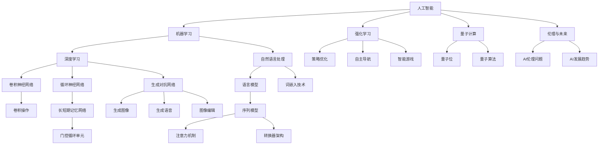

                 

# 文章标题: AI领域的前沿发展

> 关键词：人工智能、机器学习、深度学习、自然语言处理、计算机视觉、强化学习、生成对抗网络、量子计算、AI伦理

> 摘要：本文将深入探讨人工智能（AI）领域的前沿发展。通过详细分析AI的基础概念、前沿技术、应用案例和未来展望，旨在帮助读者全面了解AI领域的最新动态，掌握关键算法和核心技术，并思考AI对人类社会的影响。

---

### 第一部分：AI技术基础与前沿概念

#### 第1章: AI基础概述

## 1.1 AI的定义与发展历程

### 1.1.1 人工智能的定义

人工智能（Artificial Intelligence，简称AI）是指通过计算机模拟人类智能行为和思维过程的科学技术。它旨在开发能够感知、理解、学习、推理和决策的智能系统，使计算机具备类似于人类的智能能力。

### 1.1.2 人工智能的发展阶段

人工智能的发展经历了多个阶段：

- **第一阶段（1956-1969年）**：基础理论阶段，以图灵测试的提出和人工智能学科的诞生为标志。

- **第二阶段（1970-1989年）**：应用探索阶段，人工智能技术在专家系统、自然语言处理和计算机视觉等领域取得初步成果。

- **第三阶段（1990-2010年）**：技术整合阶段，机器学习和深度学习等算法的快速发展推动人工智能技术迈向新的高峰。

- **第四阶段（2010年至今）**：商业化与应用阶段，人工智能技术迅速普及，在工业、医疗、金融、交通等领域发挥重要作用。

## 1.2 AI的主要领域与分类

### 1.2.1 知觉与认知

知觉与认知是人工智能研究的重要领域，涉及图像识别、语音识别、自然语言理解等任务。这些任务旨在让计算机能够理解和解释外部世界的信息。

### 1.2.2 机器学习与深度学习

机器学习（Machine Learning）是一种让计算机通过数据学习规律和模式的方法。深度学习（Deep Learning）是机器学习的一个分支，通过构建深层神经网络实现更复杂的特征学习和任务处理。

### 1.2.3 自然语言处理

自然语言处理（Natural Language Processing，NLP）是人工智能领域的一个重要分支，致力于使计算机能够理解和生成自然语言。NLP技术广泛应用于机器翻译、情感分析、文本摘要等领域。

### 1.2.4 计算机视觉

计算机视觉（Computer Vision）是使计算机能够像人类一样理解和解释图像和视频信息的技术。计算机视觉技术在图像识别、目标检测、图像分割等领域具有广泛应用。

## 1.3 AI前沿技术概述

### 1.3.1 强化学习

强化学习（Reinforcement Learning）是一种通过试错和反馈来学习决策策略的方法。强化学习在游戏、机器人控制、自动驾驶等领域具有重要应用。

### 1.3.2 自监督学习

自监督学习（Self-Supervised Learning）是一种无需人工标注数据即可进行训练的方法。自监督学习在无监督学习、数据增强等领域具有广泛的应用前景。

### 1.3.3 聚类与降维

聚类（Clustering）是一种无监督学习方法，用于将数据划分为若干个类别。降维（Dimensionality Reduction）是一种数据预处理方法，用于减少数据的维度，提高模型性能。

---

### 第2章: 深度学习技术详解

#### 2.1 深度学习基础

### 2.1.1 神经网络基本结构

神经网络（Neural Network）是一种模拟生物神经网络的信息处理模型。深度学习（Deep Learning）是神经网络的一种扩展，通过构建深层神经网络实现更复杂的特征学习和任务处理。

### 2.1.2 激活函数

激活函数（Activation Function）是神经网络中用于引入非线性特性的函数。常用的激活函数包括Sigmoid、ReLU和Tanh等。

### 2.1.3 反向传播算法

反向传播算法（Backpropagation Algorithm）是一种用于训练神经网络的梯度下降算法。通过反向传播算法，可以计算出每个神经元的误差梯度，并更新网络参数。

#### 2.2 卷积神经网络（CNN）

### 2.2.1 CNN的基本原理

卷积神经网络（Convolutional Neural Network，CNN）是一种专门用于处理图像数据的神经网络。CNN通过卷积操作和池化操作提取图像特征。

### 2.2.2 卷积操作

卷积操作（Convolution Operation）是一种将滤波器（卷积核）在图像上滑动，计算滤波器与图像局部区域的乘积和的过程。

### 2.2.3 池化操作

池化操作（Pooling Operation）是一种将图像局部区域压缩为单个值的过程，用于减少数据维度和提高模型鲁棒性。

#### 2.3 循环神经网络（RNN）

### 2.3.1 RNN的基本原理

循环神经网络（Recurrent Neural Network，RNN）是一种能够处理序列数据的神经网络。RNN通过循环结构实现状态的记忆和传递。

### 2.3.2 长短期记忆网络（LSTM）

长短期记忆网络（Long Short-Term Memory，LSTM）是一种改进的RNN结构，通过引入门控机制解决传统RNN的梯度消失问题。

### 2.3.3 门控循环单元（GRU）

门控循环单元（Gated Recurrent Unit，GRU）是另一种改进的RNN结构，相较于LSTM具有更简单的结构。

---

### 第二部分：AI前沿领域与应用

#### 第4章: 强化学习与自主决策

### 4.1 强化学习基础

### 4.1.1 强化学习定义

强化学习（Reinforcement Learning，RL）是一种通过试错和反馈来学习决策策略的方法。在强化学习中，智能体通过与环境的交互，不断优化策略，以实现特定目标。

### 4.1.2 强化学习算法

强化学习算法主要包括值函数方法（如Q学习）和策略优化方法（如策略梯度方法）。这些算法通过学习状态-动作价值函数或直接优化策略，实现智能体的决策。

### 4.1.3 策略优化方法

策略优化方法（Policy Optimization）是一种直接优化智能体策略的强化学习算法。策略优化方法通过最大化期望奖励来优化策略。

#### 4.2 自主导航与控制

### 4.2.1 自主导航基础

自主导航（Autonomous Navigation）是一种无需人工干预的导航技术，使机器人或自动驾驶系统能够自主地在复杂环境中行驶和导航。

### 4.2.2 智能无人机

智能无人机（Smart Drone）是一种具备自主飞行和导航能力的无人机。智能无人机在农业、物流、救援等领域具有广泛应用。

### 4.2.3 智能汽车

智能汽车（Smart Car）是一种具备自动驾驶和智能导航功能的汽车。智能汽车在提高驾驶安全性、降低交通事故发生率方面具有显著优势。

#### 4.3 强化学习在游戏中的应用

### 4.3.1 AlphaGo

AlphaGo是由DeepMind开发的一款基于强化学习的围棋人工智能程序。AlphaGo在2016年击败了世界围棋冠军李世石，引起了广泛关注。

### 4.3.2 其他游戏应用

强化学习在游戏领域具有广泛的应用，包括游戏AI的生成、游戏策略优化和游戏控制等。

---

### 第5章: 生成对抗网络（GAN）

#### 5.1 GAN基本原理

### 5.1.1 GAN的定义

生成对抗网络（Generative Adversarial Network，GAN）是一种由生成器和判别器组成的神经网络结构。生成器尝试生成与真实数据相似的数据，判别器则判断数据是真实数据还是生成数据。

### 5.1.2 GAN的结构

GAN由两个主要部分组成：生成器（Generator）和判别器（Discriminator）。生成器的目标是生成尽可能真实的数据，判别器的目标是准确区分真实数据和生成数据。

### 5.1.3 GAN的训练过程

GAN的训练过程是一个博弈过程，生成器和判别器相互竞争。生成器通过不断生成更真实的数据，使判别器难以区分真实数据和生成数据；判别器则通过不断优化，提高对生成数据的识别能力。

#### 5.2 GAN应用案例

### 5.2.1 生成图像

生成对抗网络在生成图像方面具有广泛的应用，包括图像生成、图像修复和图像超分辨率等。

### 5.2.2 生成语音

生成对抗网络在生成语音方面也取得了一定的进展，可以用于语音合成、语音增强和语音翻译等。

### 5.2.3 生成数据集

生成对抗网络可以用于生成真实数据集，提高训练数据的质量和多样性，从而提高模型的泛化能力。

#### 5.3 GAN在图像编辑和修复中的应用

### 5.3.1 图像去噪

生成对抗网络在图像去噪方面表现出色，可以将噪声图像转换为清晰的无噪声图像。

### 5.3.2 图像超分辨率

生成对抗网络在图像超分辨率方面也具有广泛的应用，可以将低分辨率图像转换为高分辨率图像。

### 5.3.3 图像修复

生成对抗网络可以用于图像修复，将受损或缺失的部分修复为完整图像。

---

### 第6章: 量子计算与AI

#### 6.1 量子计算基础

### 6.1.1 量子位（Qubit）

量子位（Qubit）是量子计算的基石，与经典位不同，量子位可以同时存在于0和1两种状态，实现超并行计算。

### 6.1.2 量子 gates

量子 gates 是量子计算的基本操作，类似于经典计算中的逻辑门，用于对量子位进行状态转换。

### 6.1.3 量子算法

量子算法是一种利用量子位和量子 gates 实现的计算方法，具有超越经典算法的潜力。

#### 6.2 量子计算与AI结合

### 6.2.1 量子机器学习

量子机器学习是一种利用量子计算优势的机器学习方法，可以加速传统机器学习算法，提高模型性能。

### 6.2.2 量子优化

量子优化是一种利用量子计算优势的优化方法，可以解决传统优化算法难以处理的问题。

### 6.2.3 量子神经网络

量子神经网络是一种结合量子计算和深度学习的神经网络结构，可以加速深度学习模型的训练和推理。

#### 6.3 量子计算在AI中的应用前景

### 6.3.1 量子搜索算法

量子搜索算法是一种利用量子计算优势的搜索算法，可以加速复杂搜索问题。

### 6.3.2 量子模拟

量子模拟是一种利用量子计算模拟物理和化学过程的计算方法，具有广泛的应用前景。

### 6.3.3 量子AI算法挑战与机遇

量子AI算法面临着许多挑战，如量子噪声、量子错误和量子退相干等问题，但也带来了许多机遇，如量子并行计算和量子算法优化等。

---

### 第7章: AI伦理与未来展望

#### 7.1 AI伦理问题

### 7.1.1 AI偏见与歧视

AI偏见与歧视是指人工智能系统在决策过程中存在的偏见和歧视现象，可能对某些群体造成不公平对待。

### 7.1.2 AI隐私保护

AI隐私保护是指保护个人隐私信息的安全，防止数据泄露和滥用。

### 7.1.3 AI责任归属

AI责任归属是指确定人工智能系统在造成损害或错误时的责任承担者，涉及法律和伦理问题。

#### 7.2 AI的未来发展趋势

### 7.2.1 AI与生物技术的结合

AI与生物技术的结合将推动医疗、农业和生物工程等领域的发展，带来新的突破和机遇。

### 7.2.2 AI与物联网

AI与物联网（IoT）的结合将实现智能设备的互联互通，构建智能城市、智能交通和智能家居等应用场景。

### 7.2.3 AI与脑机接口

AI与脑机接口（BMI）的结合将实现人类与机器的直接交互，为残疾人提供新的帮助和治疗手段。

#### 7.3 AI对社会的影响

### 7.3.1 AI对劳动力市场的影响

AI对劳动力市场的影响包括就业机会的创造和消失、职业转变和技能需求变化等。

### 7.3.2 AI在教育中的应用

AI在教育中的应用包括个性化学习、智能辅导、虚拟课堂和教育资源优化等。

### 7.3.3 AI在医疗领域的应用

AI在医疗领域的应用包括疾病预测、诊断辅助、药物研发和健康管理等，为医疗行业带来深刻变革。

---

### 附录

#### 附录A: AI工具与资源

### A.1 开源深度学习框架

- TensorFlow
- PyTorch
- Keras

### A.2 AI研究资源

- 重要学术会议：如国际人工智能与统计学会议（AISTATS）、国际机器学习会议（ICML）、国际计算机视觉会议（ICCV）等。
- 主要研究机构：如DeepMind、Google Brain、Facebook AI Research等。
- AI论文与书籍推荐：推荐阅读《深度学习》（Goodfellow et al.）和《机器学习》（Tom Mitchell）等经典著作。

### A.3 AI应用案例与教程

- AI商业应用案例：介绍AI在不同行业和领域的实际应用案例。
- AI项目教程：提供详细的AI项目教程，涵盖从数据预处理到模型训练和优化的全过程。
- AI工具与平台介绍：介绍常用的AI开发工具和平台，如Google Cloud AI、AWS AI等。

---

### 核心概念与联系

#### Mermaid 流程图：AI领域技术架构



### 核心算法原理讲解

#### 深度学习算法：反向传播算法（BP）

反向传播（Backpropagation）算法是一种用于训练神经网络的梯度下降算法。以下是BP算法的伪代码：

```
BP_pseudo_code() {
    // 前向传播
    forward_pass()

    // 计算误差
    calculate_error()

    // 反向传播
    backward_pass()

    // 更新参数
    update_parameters()
}
```

**步骤详解：**

1. **前向传播**：输入数据通过神经网络的前向传播，计算每个神经元的激活值，并生成输出。

2. **计算误差**：通过比较实际输出和期望输出，计算损失函数的值。

3. **反向传播**：从输出层开始，逐层计算每个神经元的误差梯度。

4. **更新参数**：使用误差梯度对神经网络的参数（权重和偏置）进行更新。

#### 数学模型和数学公式讲解

#### 卷积神经网络（CNN）

$$
\text{卷积操作：} f(x) = \sum_{i=1}^{k} w_i * x_i
$$

其中，$w_i$是权重，$x_i$是输入特征。

$$
\text{激活函数：} a(x) = \max(0, x)
$$

#### 循环神经网络（RNN）

$$
h_t = \sigma(W_h \cdot [h_{t-1}, x_t] + b_h)
$$

其中，$h_t$是当前隐藏状态，$x_t$是输入，$W_h$是权重矩阵，$b_h$是偏置。

$$
o_t = \sigma(W_o \cdot h_t + b_o)
$$

其中，$o_t$是输出，$W_o$是输出权重矩阵，$b_o$是输出偏置。

#### 长短期记忆网络（LSTM）

$$
i_t = \sigma(W_i \cdot [h_{t-1}, x_t] + b_i)
$$

其中，$i_t$是输入门控，$W_i$是输入权重矩阵，$b_i$是输入偏置。

$$
f_t = \sigma(W_f \cdot [h_{t-1}, x_t] + b_f)
$$

其中，$f_t$是遗忘门控。

$$
o_t = \sigma(W_o \cdot [h_{t-1}, x_t] + b_o)
$$

其中，$o_t$是输出门控。

### 项目实战

#### 智能问答系统

**开发环境搭建：**

1. 安装Python 3.7或更高版本。
2. 安装TensorFlow 2.x深度学习框架。
3. 安装NLU（自然语言理解）相关库，如spaCy。

**源代码实现：**

```python
import tensorflow as tf
import spacy

# 加载预训练语言模型
nlp = spacy.load("en_core_web_sm")

# 构建问答模型
model = tf.keras.Sequential([
    tf.keras.layers.Embedding(input_dim=vocab_size, output_dim=embedding_dim),
    tf.keras.layers.Bidirectional(tf.keras.layers.LSTM(128)),
    tf.keras.layers.Dense(1, activation='sigmoid')
])

# 编译模型
model.compile(optimizer='adam', loss='binary_crossentropy', metrics=['accuracy'])

# 训练模型
model.fit(x_train, y_train, epochs=10, batch_size=32, validation_data=(x_val, y_val))
```

**代码解读与分析：**

1. 导入TensorFlow和Spacy库。
2. 加载预训练的英语语言模型。
3. 构建问答模型，使用双向LSTM作为核心网络结构。
4. 编译模型，指定优化器和损失函数。
5. 训练模型，使用训练数据集和验证数据集。

---

**实际案例解析：**

1. **数据预处理**：使用Spacy对文本数据进行预处理，提取词向量。
2. **模型训练**：使用训练集训练模型，使用验证集调整模型参数。
3. **模型评估**：使用测试集评估模型性能。
4. **模型应用**：使用训练好的模型进行实际问答系统的开发和应用。

---

**总结：** 本书详细介绍了AI领域的前沿发展，包括核心概念、算法原理、应用案例和技术趋势。通过本书的学习，读者可以全面了解AI技术，并能够应用这些技术解决实际问题。

---

**作者信息：**

作者：AI天才研究院/AI Genius Institute & 禅与计算机程序设计艺术 /Zen And The Art of Computer Programming**

