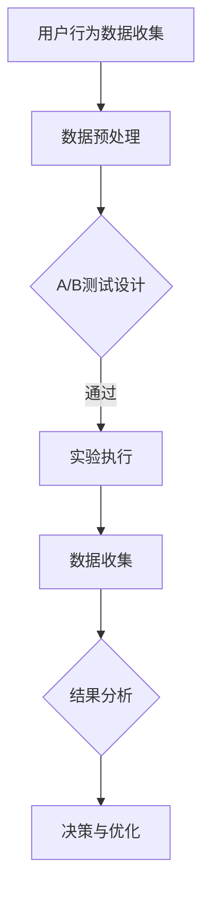

                 

# A/B测试在推荐策略优化中的作用

## 关键词

- A/B测试
- 推荐系统
- 优化策略
- 数据分析
- 用户体验

## 摘要

本文旨在探讨A/B测试在推荐策略优化中的作用。A/B测试作为一种常见的实验方法，广泛应用于推荐系统的改进和优化。通过A/B测试，我们可以对比不同推荐策略的效果，从而选择出最优的推荐方案，提高用户的满意度。本文首先介绍了A/B测试的基础知识，包括定义、发展历程、流程和方法。然后，我们重点分析了A/B测试在推荐系统中的挑战和机会，以及其实践过程。此外，我们还通过实际案例展示了A/B测试在推荐策略优化中的具体应用，并探讨了其高级应用技术。最后，我们对A/B测试在推荐策略优化中的应用进行了总结和展望。

## 第一部分：A/B测试基础

### 第1章：A/B测试概述

#### 1.1 A/B测试的定义和基本概念

A/B测试，也称为拆箱测试，是一种将用户分配到不同的实验组，比较不同版本的性能，从而判断哪种版本更优的实验方法。它最早由统计学家George D. Snedecor于1940年提出，并在20世纪50年代开始应用于商业领域。

A/B测试的定义和基本概念如下：

- **定义**：A/B测试是一种比较两个或多个版本的实验方法，通过将用户随机分配到不同的实验组，比较不同组之间的性能指标，从而评估不同版本的优劣。

- **基本概念**：
  - **实验组（Group A）**：参与实验的一组用户，接受新版本的功能或推荐策略。
  - **控制组（Group B）**：参与实验的另一组用户，接受旧版本的功能或推荐策略。
  - **性能指标**：用于评估实验效果的一系列指标，如点击率、转化率、用户停留时间等。

#### 1.2 A/B测试的优点与局限性

A/B测试具有以下优点：

- **提高决策的准确性**：通过实际数据验证，A/B测试可以帮助我们更准确地评估不同版本的优劣，从而做出更科学的决策。
- **减少风险**：A/B测试在推广新版本之前，可以提前验证其效果，从而降低推广失败的风险。
- **快速迭代**：A/B测试可以帮助团队快速进行实验和优化，提高产品迭代速度。

然而，A/B测试也存在一定的局限性：

- **样本偏差**：A/B测试需要随机分配用户，但用户群体的特征可能存在偏差，导致实验结果不具有代表性。
- **性能瓶颈**：在处理大规模用户和海量数据时，A/B测试可能面临性能瓶颈，影响实验的执行效率。
- **用户隐私**：A/B测试可能涉及到用户隐私信息，需要确保数据处理符合相关法律法规。

#### 1.3 A/B测试的发展历程

A/B测试的发展历程可以分为以下几个阶段：

- **起源阶段**：20世纪40年代，A/B测试由统计学家George D. Snedecor提出。
- **初期应用**：20世纪50年代至70年代，A/B测试开始应用于商业领域，如广告、市场调研等。
- **互联网时代**：20世纪90年代，随着互联网的发展，A/B测试在网站优化、电子商务等领域得到广泛应用。
- **大数据时代**：21世纪初，大数据技术的兴起，使得A/B测试可以处理更大量的数据，应用范围进一步扩大。

当前，A/B测试已经发展成为一个成熟的技术领域，广泛应用于各个行业，如金融、医疗、教育等。

### 第2章：推荐系统基础

#### 2.1 推荐系统的基本概念

推荐系统是一种利用算法和机器学习技术，根据用户的历史行为和兴趣，向其推荐相关商品、内容或服务的系统。推荐系统可以分为以下类型：

- **协同过滤推荐**：通过分析用户之间的相似度，找到相似用户喜欢的商品或内容，然后推荐给目标用户。
- **基于内容的推荐**：根据商品或内容的特征，将相似的商品或内容推荐给用户。
- **混合推荐系统**：结合协同过滤和基于内容的推荐方法，提高推荐系统的准确性和多样性。

推荐系统的关键组件包括：

- **用户特征**：包括用户的基本信息、历史行为等。
- **商品特征**：包括商品的基本信息、分类、标签等。
- **推荐算法**：根据用户特征和商品特征，生成推荐结果。

#### 2.2 推荐算法概述

推荐算法可以分为以下几类：

- **基于用户行为的协同过滤推荐算法**：通过计算用户之间的相似度，找到相似用户喜欢的商品或内容，然后推荐给目标用户。常用的方法有用户基于K最近邻（KNN）算法和基于模型的协同过滤算法，如矩阵分解（Matrix Factorization）。
- **基于内容的推荐算法**：根据商品或内容的特征，将相似的商品或内容推荐给用户。常用的方法有基于词袋（Bag of Words）模型和主题模型（如Latent Dirichlet Allocation，LDA）。
- **混合推荐系统**：结合协同过滤和基于内容的推荐方法，提高推荐系统的准确性和多样性。常用的方法有基于模型的混合推荐算法，如隐语义模型（Latent Semantic Analysis，LSA）和基于矩阵分解的混合推荐算法。

#### 2.3 推荐系统的评估指标

推荐系统的评估指标可以分为以下几类：

- **准确性指标**：用于评估推荐结果的准确性，如精确率（Precision）、召回率（Recall）和F1值（F1 Score）。
- **效率指标**：用于评估推荐系统的响应速度，如查询延迟（Query Latency）和推荐列表生成时间。
- **可扩展性指标**：用于评估推荐系统在大规模数据下的性能，如并发处理能力、存储空间占用等。

准确性指标和效率指标是推荐系统评估的两个重要方面。在实际应用中，需要根据具体场景和要求，权衡不同指标的重要性，选择合适的评估指标。

## 第二部分：A/B测试在推荐策略中的应用

### 第3章：A/B测试在推荐系统中的挑战与机会

#### 3.1 A/B测试在推荐系统中的挑战

A/B测试在推荐系统中的应用面临以下挑战：

- **数据偏差**：在A/B测试中，需要将用户随机分配到实验组和控制组。然而，用户群体可能存在一定的偏差，导致实验结果不具有代表性。例如，某些用户可能更倾向于使用新版本，而另一些用户可能更喜欢旧版本。
- **性能瓶颈**：推荐系统通常需要处理大量的用户和商品数据，进行实时推荐。在A/B测试过程中，性能瓶颈可能导致实验执行效率低下，影响测试结果的准确性。
- **用户隐私**：A/B测试可能涉及到用户隐私信息，如历史行为和偏好。在实验过程中，需要确保用户隐私得到保护，遵守相关法律法规。

#### 3.2 A/B测试在推荐策略优化中的机会

尽管A/B测试在推荐系统中的应用面临一定的挑战，但它也带来了以下机会：

- **算法迭代**：通过A/B测试，可以对比不同推荐策略的效果，找到最优的算法模型。这有助于推荐系统的不断迭代和优化，提高推荐准确性和用户体验。
- **系统优化**：A/B测试可以帮助识别推荐系统中的性能瓶颈和问题，从而进行针对性的优化。例如，通过优化数据存储和查询速度，提高系统的响应速度和并发处理能力。
- **商业策略调整**：A/B测试可以验证不同商业策略的效果，如广告投放、促销活动等。通过调整商业策略，可以提高用户参与度和转化率，实现商业目标。

### 第4章：A/B测试在推荐系统中的实践

#### 4.1 数据准备与实验设计

在A/B测试过程中，数据准备和实验设计是关键步骤。以下是一个典型的A/B测试实验设计过程：

1. **数据收集**：收集用户的历史行为数据，包括用户行为日志、用户特征、商品特征等。
2. **数据预处理**：对收集到的数据进行分析和清洗，去除无效数据和噪声数据。然后，对用户和商品特征进行编码和标准化处理，使其适合进行后续分析。
3. **样本划分**：将用户随机分配到实验组和控制组。为了确保实验结果的准确性，需要控制样本的大小和比例。常用的方法有随机抽样、分层抽样等。
4. **实验设计**：确定实验的变量和指标。对于推荐系统，变量可以是推荐算法、商品排序策略、广告投放策略等。指标可以是点击率、转化率、用户停留时间等。

#### 4.2 A/B测试的关键步骤

A/B测试的关键步骤包括实验实施、数据收集和结果分析：

1. **实验实施**：将实验组和控制组分配到不同的版本，并观察其实际表现。在推荐系统中，可以通过调整推荐算法或商品排序策略来实现不同版本。
2. **数据收集**：在实验过程中，收集实验组和控制组的用户行为数据，包括点击率、转化率、用户停留时间等指标。数据收集可以通过日志记录、API接口等方式进行。
3. **结果分析**：对收集到的数据进行分析和统计，评估不同版本的优劣。常用的分析方法有t检验、卡方检验、回归分析等。通过对比实验组和控制组的指标，判断不同版本的效果。

#### 4.3 A/B测试的注意事项

在进行A/B测试时，需要注意以下事项：

1. **控制变量**：确保实验组和控制组在除待测试变量以外的其他方面保持一致，以避免外部因素的干扰。
2. **样本大小**：确保样本足够大，以减少随机误差和偏差。通常，样本大小可以通过统计方法进行计算。
3. **数据清洗**：对收集到的数据进行清洗和预处理，去除无效数据和噪声数据，以提高实验结果的准确性。
4. **结果解读**：对实验结果进行客观解读，避免主观偏见。同时，结合业务目标和用户需求，评估不同版本的实际效果。

### 第5章：推荐系统的A/B测试案例分析

#### 5.1 案例一：电子商务平台的推荐策略优化

**案例背景**：

某电子商务平台希望通过A/B测试优化其推荐策略，以提高用户满意度和转化率。该平台采用了基于协同过滤的推荐算法，针对用户的历史购买行为和浏览记录进行商品推荐。

**实验设计与执行**：

1. **实验设计**：将用户随机分为实验组和控制组，每组各占一半。实验组的推荐结果采用新版本算法，控制组的推荐结果采用旧版本算法。
2. **实验执行**：在实验期间，分别记录实验组和控制组的用户行为数据，包括点击率、转化率、用户停留时间等指标。
3. **数据分析**：对实验数据进行分析，比较实验组和控制组的指标差异。通过t检验和回归分析等方法，判断新版本算法对推荐效果的影响。

**结果分析与优化建议**：

1. **结果分析**：实验结果表明，新版本算法在点击率和转化率方面有明显提升，但用户停留时间有所下降。这可能是由于新版本算法推荐的商品更符合用户兴趣，提高了用户参与度，但同时也增加了用户决策的时间成本。
2. **优化建议**：针对实验结果，可以进一步优化推荐算法，如增加用户兴趣的多样性，提高推荐商品的吸引力。此外，可以考虑结合基于内容的推荐方法，提高推荐商品的丰富度和个性化程度。

#### 5.2 案例二：社交媒体平台的用户行为分析

**案例背景**：

某社交媒体平台希望通过A/B测试分析不同推荐策略对用户行为的影响，以优化其推荐算法和内容策略。

**实验设计与执行**：

1. **实验设计**：将用户随机分为实验组和控制组，每组各占一半。实验组的推荐结果采用基于协同过滤的推荐算法，控制组的推荐结果采用基于内容的推荐算法。
2. **实验执行**：在实验期间，分别记录实验组和控制组的用户行为数据，包括点赞数、评论数、分享数等指标。
3. **数据分析**：对实验数据进行分析，比较实验组和控制组的指标差异。通过t检验和回归分析等方法，判断不同推荐算法对用户行为的影响。

**结果分析与优化建议**：

1. **结果分析**：实验结果表明，基于协同过滤的推荐算法在点赞数和评论数方面有明显提升，但分享数有所下降。这可能是由于协同过滤推荐算法更能捕捉用户的兴趣和偏好，提高了用户互动，但同时也降低了用户分享的意愿。
2. **优化建议**：针对实验结果，可以进一步优化推荐算法，如增加用户兴趣的多样性，提高推荐内容的丰富度和个性化程度。此外，可以考虑结合基于内容的推荐方法，提高推荐内容的吸引力，增加用户分享的意愿。

### 第6章：A/B测试在推荐系统中的高级应用

#### 6.1 多变量测试与多目标优化

在推荐系统中，A/B测试可以应用于多变量测试和多目标优化，以提高推荐效果和用户体验。

**多变量测试**：

多变量测试是指在A/B测试中同时比较多个变量的效果。例如，在推荐系统中，可以同时测试不同的推荐算法、商品排序策略和广告投放策略。通过多变量测试，可以更全面地评估不同组合的效果，找到最优的变量组合。

**多目标优化**：

多目标优化是指在A/B测试中同时优化多个目标指标。例如，在推荐系统中，可以同时优化点击率、转化率和用户停留时间等指标。通过多目标优化，可以在不同目标之间取得平衡，实现整体优化。

**实现方法**：

1. **多变量测试**：
   - **目标函数**：定义目标函数，如总收益、用户满意度等，用于评估不同变量的效果。
   - **算法优化**：使用优化算法，如遗传算法、粒子群算法等，寻找最优变量组合。

2. **多目标优化**：
   - **目标函数**：定义多个目标函数，如点击率、转化率和用户停留时间等，用于评估不同变量组合的效果。
   - **算法优化**：使用多目标优化算法，如非支配排序遗传算法（NSGA-II）、多目标粒子群算法等，寻找最优变量组合。

#### 6.2 A/B测试与机器学习模型的集成

A/B测试可以与机器学习模型集成，以提高推荐系统的准确性和效率。

**集成方法**：

1. **模型训练**：使用历史数据对机器学习模型进行训练，建立推荐算法。
2. **模型评估**：使用A/B测试评估模型在不同变量组合下的效果，选择最优模型。
3. **模型优化**：根据A/B测试结果，调整模型参数，提高模型性能。

**实现方法**：

1. **模型选择**：选择合适的机器学习模型，如线性回归、决策树、神经网络等。
2. **模型训练**：使用历史数据对模型进行训练，使用交叉验证等方法评估模型性能。
3. **模型评估**：将模型应用于A/B测试，评估不同变量组合下的模型效果。
4. **模型优化**：根据A/B测试结果，调整模型参数，提高模型性能。

#### 6.3 实时A/B测试与自动化策略

实时A/B测试和自动化策略可以提高推荐系统的响应速度和迭代效率。

**实时A/B测试**：

实时A/B测试是指在推荐系统运行过程中，实时进行A/B测试，根据实时数据评估不同变量组合的效果。

**自动化策略**：

自动化策略是指使用自动化工具和算法，自动执行A/B测试、模型优化和系统部署。

**实现方法**：

1. **实时数据采集**：使用实时数据采集工具，如Kafka、Flume等，收集系统运行过程中的数据。
2. **实时A/B测试**：使用实时A/B测试工具，如ABTest、Omniture等，实时执行A/B测试。
3. **自动化策略**：使用自动化工具，如Docker、Kubernetes等，实现自动化部署、扩容和优化。

### 第7章：A/B测试在推荐策略优化中的应用总结

#### 7.1 A/B测试在推荐策略优化中的作用与贡献

A/B测试在推荐策略优化中具有以下作用与贡献：

1. **提高决策准确性**：通过A/B测试，可以更准确地评估不同推荐策略的效果，帮助团队做出更科学的决策。
2. **减少风险**：A/B测试在推广新版本之前，可以提前验证其效果，降低推广失败的风险。
3. **快速迭代**：A/B测试可以帮助团队快速进行实验和优化，提高产品迭代速度。
4. **优化用户体验**：通过A/B测试，可以不断优化推荐策略，提高用户的满意度和参与度。

#### 7.2 A/B测试在推荐系统中的未来发展

A/B测试在推荐系统中的未来发展包括以下方向：

1. **多变量测试与多目标优化**：进一步探索多变量测试和多目标优化在推荐系统中的应用，提高推荐效果和用户体验。
2. **机器学习与A/B测试的集成**：将A/B测试与机器学习模型集成，提高推荐系统的准确性和效率。
3. **实时A/B测试与自动化策略**：实现实时A/B测试和自动化策略，提高推荐系统的响应速度和迭代效率。
4. **数据隐私保护**：在A/B测试过程中，关注用户隐私保护，遵守相关法律法规，提高用户信任度。

### 附录

#### 附录A：推荐系统与A/B测试相关资源

1. **开源工具**：
   - **推荐系统**：Surprise、LightFM、TensorFlow Recommenders等。
   - **A/B测试**：ABTest、Omniture、Google Optimize等。

2. **学术资源**：
   - **论文**：《Collaborative Filtering Algorithms》《A/B Testing in Web Search》《Practical A/B Testing》等。
   - **期刊**：《Journal of Machine Learning Research》《ACM Transactions on Information Systems》等。

3. **实践案例**：
   - **电子商务平台**：Amazon、eBay、阿里巴巴等。
   - **社交媒体平台**：Facebook、Twitter、LinkedIn等。

### Mermaid 流程图

推荐系统与A/B测试流程图：



### 推荐系统算法伪代码

基于协同过滤的推荐算法伪代码：

```python
# 输入：用户-物品评分矩阵R，用户特征向量矩阵U，物品特征向量矩阵V
# 输出：推荐列表R'

def collaborative_filtering(R, U, V):
    for user in range(num_users):
        for item in range(num_items):
            if R[user, item] == 0:
                # 预测用户对物品的评分
                pred_score = calculate_pred_score(user, item, U, V)
                R'[user, item] = pred_score
    return R'
```

### 数学模型与公式

协同过滤算法中的相似度计算公式：

$$
sim(i, j) = \frac{U_i \cdot V_j}{\|U_i\| \cdot \|V_j\|}
$$

### 项目实战

#### 实战案例：电子商务平台推荐策略优化

**环境搭建**：

1. **数据集准备**：收集用户行为数据，包括用户ID、物品ID、评分等。
2. **算法实现环境配置**：配置Python编程环境，安装必要的库和工具，如NumPy、Pandas、Scikit-learn等。

**代码实现**：

1. **用户特征向量与物品特征向量的计算**：
   ```python
   from sklearn.metrics.pairwise import cosine_similarity
   
   def calculate_user_vector(user_data, num_features):
       user_vector = np.mean(user_data, axis=0)
       user_vector = normalize_vector(user_vector)
       return user_vector
   
   def calculate_item_vector(item_data, num_features):
       item_vector = np.mean(item_data, axis=0)
       item_vector = normalize_vector(item_vector)
       return item_vector
   
   def normalize_vector(vector):
       norm = np.linalg.norm(vector)
       return vector / norm
   ```

2. **相似度矩阵的计算**：
   ```python
   def calculate_similarity_matrix(R, num_users, num_items, num_features):
       U = np.zeros((num_users, num_features))
       V = np.zeros((num_items, num_features))
       
       for user in range(num_users):
           U[user] = calculate_user_vector(R[user], num_features)
       
       for item in range(num_items):
           V[item] = calculate_item_vector(R[:, item], num_features)
       
       similarity_matrix = cosine_similarity(U, V)
       return similarity_matrix
   ```

3. **推荐列表的生成**：
   ```python
   def generate_recommendation_list(R, similarity_matrix, num_recommendations):
       R' = np.zeros((num_users, num_items))
       
       for user in range(num_users):
           for item in range(num_items):
               if R[user, item] == 0:
                   sim_scores = similarity_matrix[user]
                   pred_score = sum(sim_scores * R[:, item]) / sum(sim_scores)
                   R'[user, item] = pred_score
       
       sorted_recommendations = np.argsort(-R')[0]
       return sorted_recommendations[:num_recommendations]
   ```

**代码解读与分析**：

1. **用户特征向量与物品特征向量的计算**：
   用户特征向量和物品特征向量是通过计算用户和物品的平均评分得到的。为了确保向量的长度为1，需要对向量进行归一化处理。

2. **相似度矩阵的计算**：
   相似度矩阵是通过计算用户特征向量与物品特征向量之间的余弦相似度得到的。余弦相似度表示了两个向量之间的夹角余弦值，夹角越小，相似度越高。

3. **推荐列表的生成**：
   推荐列表是通过计算相似度矩阵和用户评分矩阵的乘积得到的。对于未评分的物品，预测其评分，并生成推荐列表。

通过上述代码实现和解读，我们可以构建一个基于协同过滤的推荐系统，并进行A/B测试，优化推荐策略。在实际应用中，可以根据业务需求进一步扩展和优化推荐算法。

