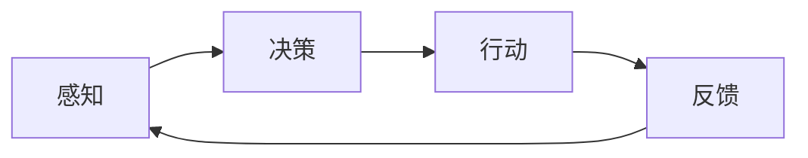
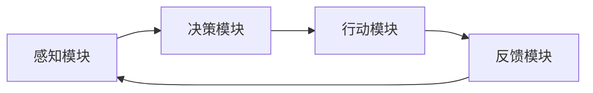
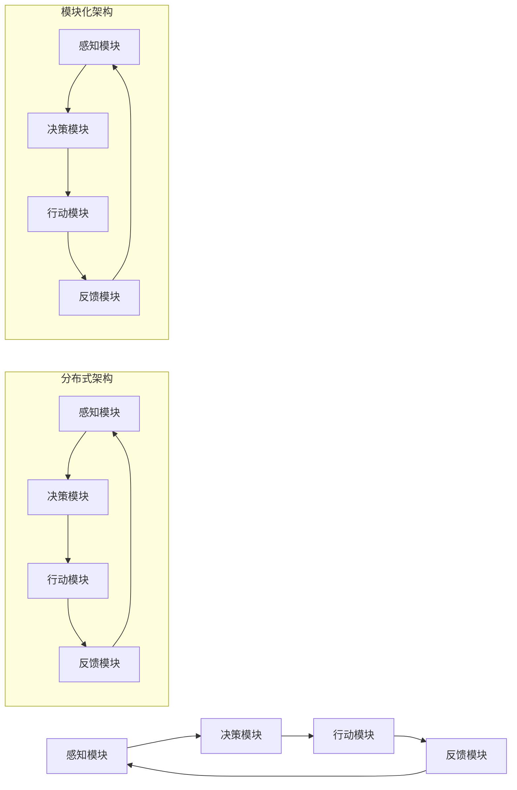

                 

### 文章标题

# Agent代理技术的应用实例

> 关键词：代理技术、应用实例、机器学习、深度学习、强化学习、金融、电子商务、智能交通、游戏开发

> 摘要：本文详细探讨了Agent代理技术在各个领域的应用实例，包括其基本概念、原理、算法、数学模型以及实际项目实战。通过深入剖析代理技术的核心概念和架构，本文旨在为读者提供一个全面且系统的理解和应用指南，展示代理技术在金融、电子商务、智能交通和游戏开发等领域的广泛应用潜力。

---

### 第1章：代理技术概述

#### 1.1 代理技术的基本概念

代理技术（Agent Technology）是一种模拟人类行为和决策的技术，旨在使计算机程序具有自主决策和执行任务的能力。在人工智能（AI）领域，代理通常被视为智能体（agent）的实体，这些实体可以在复杂环境中感知、思考并采取行动，以实现预定的目标。

代理技术的基本概念包括以下几点：

1. **智能体（Agent）**：执行特定任务或行为的实体，可以是计算机程序、机器人或虚拟角色。
2. **环境（Environment）**：智能体所在的外部世界，可以是现实环境或虚拟环境。
3. **感知（Perception）**：智能体通过传感器从环境中获取信息。
4. **决策（Decision）**：智能体根据感知到的信息，使用算法或策略做出决策。
5. **行动（Action）**：智能体根据决策采取具体的行动。

#### 1.2 代理技术的发展历程

代理技术起源于20世纪80年代，随着人工智能和计算机科学的发展，代理技术的概念逐渐成熟。以下是代理技术的发展历程：

1. **早期阶段（1980s-1990s）**：代理技术最初应用于分布式计算和自动化控制，主要研究如何让计算机程序具有自治性和协作性。
2. **成熟阶段（2000s）**：随着机器学习和深度学习技术的崛起，代理技术开始应用于更加复杂和动态的环境中。
3. **应用推广阶段（2010s至今）**：代理技术逐渐在金融、电子商务、智能交通和游戏开发等领域得到广泛应用，成为现代人工智能系统的重要组成部分。

#### 1.3 代理技术在现代应用中的重要性

在现代应用中，代理技术具有重要意义：

1. **提高效率**：代理技术可以帮助系统自动化执行复杂的任务，从而提高工作效率。
2. **增强自主性**：代理技术使计算机程序能够自主决策和行动，从而减少对人类操作员的依赖。
3. **优化决策**：代理技术可以根据实时数据和历史经验，优化决策过程，提高决策质量。
4. **跨领域应用**：代理技术具有广泛的应用前景，可以在金融、电子商务、智能交通和游戏开发等多个领域发挥作用。

### 第2章：代理技术的原理与架构

#### 2.1 代理技术的工作原理

代理技术的工作原理可以概括为以下几个步骤：

1. **感知**：智能体通过传感器（如摄像头、麦克风、传感器等）从环境中获取信息。
2. **决策**：智能体使用感知到的信息，结合预定的算法或策略，做出决策。
3. **行动**：智能体根据决策，执行具体的行动，如移动、发送信息、调整参数等。
4. **反馈**：智能体观察行动的结果，并将其反馈给决策模块，用于调整未来的决策。

以下是一个简单的代理技术工作流程的Mermaid流程图：



#### 2.2 代理技术的核心组件

代理技术通常包括以下几个核心组件：

1. **感知模块**：负责从环境中获取信息，如传感器数据、文本、图像等。
2. **决策模块**：根据感知模块提供的信息，结合预定的算法或策略，做出决策。
3. **行动模块**：根据决策模块的决策，执行具体的行动。
4. **反馈模块**：观察行动的结果，并将其反馈给决策模块，用于调整未来的决策。

以下是一个简单的代理技术核心组件架构的Mermaid流程图：



#### 2.3 代理技术的架构设计

代理技术的架构设计通常包括以下几个方面：

1. **集中式架构**：所有组件集中在一个系统中，便于管理和维护。
2. **分布式架构**：组件分布在不同的系统中，适用于大规模应用。
3. **模块化架构**：将代理技术划分为多个模块，每个模块负责特定的任务，便于扩展和维护。

以下是一个简单的代理技术架构设计的Mermaid流程图：

```mermaid
flowchart LR
    A[感知模块] --> B[决策模块]
    B --> C[行动模块]
    C --> D[反馈模块]
    A..> E[分布式架构]
    B..> F[模块化架构]
```

#### 2.4 代理技术的Mermaid流程图

以下是一个包含感知、决策、行动和反馈模块的代理技术Mermaid流程图：



### 第3章：代理算法原理

#### 3.1 常见代理算法

代理技术涉及到多种算法，以下介绍几种常见的代理算法：

##### 3.1.1 Q-Learning算法

Q-Learning算法是一种值函数方法，用于解决离散动作的强化学习问题。其基本思想是学习一个值函数Q(s, a)，表示在状态s下采取动作a所能获得的预期收益。

以下是Q-Learning算法的伪代码：

```python
初始化 Q(s, a) 为随机值
for each episode do
    初始化状态 s
    while s ≠ 终止状态 do
        选择动作 a 根据 ε-贪心策略
        执行动作 a，获得奖励 r 和新的状态 s'
        更新 Q(s, a) = Q(s, a) + α [r + γ max(Q(s', a')) - Q(s, a)]
        s = s'
    end
end for
```

##### 3.1.2 SARSA算法

SARSA算法是一种基于策略的方法，用于解决离散动作的强化学习问题。其基本思想是在每一步都更新当前的动作值函数，而不是使用目标动作值函数。

以下是SARSA算法的伪代码：

```python
初始化 Q(s, a) 为随机值
for each episode do
    初始化状态 s
    while s ≠ 终止状态 do
        选择动作 a 根据 ε-贪心策略
        执行动作 a，获得奖励 r 和新的状态 s'
        更新 Q(s, a) = Q(s, a) + α [r + γ Q(s', a')]
        s = s'
    end
end for
```

##### 3.1.3 Deep Q-Network算法

Deep Q-Network（DQN）算法是一种基于深度学习的强化学习算法，用于解决连续动作的强化学习问题。其基本思想是使用深度神经网络近似值函数Q(s, a)。

以下是DQN算法的伪代码：

```python
初始化 DQN 模型
经验回放缓冲区
for each episode do
    初始化状态 s
    while s ≠ 终止状态 do
        选择动作 a 根据 ε-贪心策略
        执行动作 a，获得奖励 r 和新的状态 s'
        将 (s, a, r, s') 存入经验回放缓冲区
        s = s'
    end
end for
for each iteration do
    从经验回放缓冲区随机抽取一批样本 (s, a, r, s')
    计算目标 Q(s', a') = r + γ max(Q(s', a'))
    计算损失函数 L = (Q(s, a) - r - γ max(Q(s', a')))^2
    反向传播和更新 DQN 模型参数
end for
```

#### 3.2 代理算法的伪代码阐述

在本节中，我们将进一步详细阐述代理算法的伪代码，包括Q-Learning、SARSA和Deep Q-Network（DQN）算法。

##### 3.2.1 Q-Learning算法的伪代码

```python
# 初始化Q值表Q(s, a)为随机值
Q = random初始化Q值表

# 设定学习率α和折扣因子γ
α = 0.1
γ = 0.99

# ε-贪心策略ε
ε = 0.1

# 开始每个训练回合
for episode in range(1, num_episodes):
    state = 环境初始化状态
    done = False
    
    # 在每个时间步执行动作
    while not done:
        # 根据ε-贪心策略选择动作
        if random() < ε:
            action = 随机选择动作
        else:
            action = 选择动作使得Q值最大
            
        # 执行动作并获得奖励和新状态
        next_state, reward, done = 环境执行动作(action)
        
        # 更新Q值表
        Q[state, action] = Q[state, action] + α * (reward + γ * max(Q[next_state, :]) - Q[state, action])
        
        # 更新状态
        state = next_state

# 输出训练后的Q值表
print(Q)
```

##### 3.2.2 SARSA算法的伪代码

```python
# 初始化Q值表Q(s, a)为随机值
Q = random初始化Q值表

# 设定学习率α和折扣因子γ
α = 0.1
γ = 0.99

# 开始每个训练回合
for episode in range(1, num_episodes):
    state = 环境初始化状态
    done = False
    
    # 在每个时间步执行动作
    while not done:
        # 根据ε-贪心策略选择动作
        if random() < ε:
            action = 随机选择动作
        else:
            action = 选择动作使得Q值最大
            
        # 执行动作并获得奖励和新状态
        next_state, reward, done = 环境执行动作(action)
        
        # 更新Q值表
        Q[state, action] = Q[state, action] + α * (reward + γ * Q[next_state, action])
        
        # 更新状态
        state = next_state

# 输出训练后的Q值表
print(Q)
```

##### 3.2.3 Deep Q-Network (DQN)算法的伪代码

```python
# 初始化DQN模型
DQN = 初始化DQN模型

# 经验回放缓冲区
经验缓冲区 = ExperienceReplayBuffer()

# 开始每个训练回合
for episode in range(1, num_episodes):
    state = 环境初始化状态
    done = False
    
    # 在每个时间步执行动作
    while not done:
        # 使用ε-贪心策略选择动作
        if random() < ε:
            action = 随机选择动作
        else:
            action = DQN选择最佳动作(state)
            
        # 执行动作并获得奖励和新状态
        next_state, reward, done = 环境执行动作(action)
        
        # 将经验添加到经验回放缓冲区
        经验缓冲区添加经验(state, action, reward, next_state, done)
        
        # 从经验回放缓冲区中抽取一批经验样本
        batch = 经验缓冲区抽取样本(batch_size)
        
        # 计算目标Q值
        target_Q = []
        for i in range(batch_size):
            state, action, reward, next_state, done = batch[i]
            if not done:
                target_Q_value = reward + γ * DQN选择最佳动作(next_state)
            else:
                target_Q_value = reward
            target_Q.append(target_Q_value)
        
        # 计算损失
        loss = DQN训练(state, action, target_Q)
        
        # 更新DQN模型
        DQN更新模型参数

# 输出训练后的DQN模型
print(DQN)
```

通过以上伪代码，我们展示了Q-Learning、SARSA和DQN算法的基本流程和实现细节。这些算法在代理技术中扮演着核心角色，为智能体在复杂环境中学习决策提供了强大的工具。

### 第4章：代理技术在机器学习中的应用

代理技术作为人工智能的核心技术之一，在机器学习领域有着广泛的应用。本章将重点讨论代理技术在监督学习和无监督学习中的应用。

#### 4.1 代理技术在监督学习中的应用

监督学习是一种机器学习范式，通过已标记的数据集训练模型，以便在新数据上进行预测。代理技术在监督学习中的应用主要体现在模型选择、参数调整和优化等方面。

##### 4.1.1 代理模型在回归问题中的应用

在回归问题中，代理技术可以用于选择最优的模型和参数，以获得更好的预测性能。以下是一个简单的代理模型在回归问题中的应用示例：

1. **数据预处理**：首先，对输入数据进行预处理，包括数据清洗、归一化和特征选择等步骤。
2. **模型选择**：使用代理技术，例如交叉验证，选择最优的回归模型。交叉验证是一种常用的模型选择方法，通过将数据集划分为训练集和验证集，评估模型的泛化能力。
3. **参数调整**：使用代理技术，如网格搜索或随机搜索，调整模型的参数，以获得最佳性能。网格搜索是一种穷举搜索方法，通过遍历所有可能的参数组合，找到最佳参数。随机搜索是一种基于概率的搜索方法，通过随机选择参数组合，找到最佳参数。
4. **模型训练**：使用调整后的模型，对训练集进行训练，以获得回归模型。
5. **模型评估**：使用验证集评估模型的性能，包括均方误差（MSE）、均方根误差（RMSE）等指标。
6. **模型部署**：将训练好的模型部署到实际应用中，如预测房价、股票价格等。

以下是一个简单的回归问题代理模型应用示例：

```python
# 导入相关库
import numpy as np
import pandas as pd
from sklearn.model_selection import train_test_split
from sklearn.preprocessing import StandardScaler
from sklearn.ensemble import RandomForestRegressor
from sklearn.model_selection import GridSearchCV

# 加载数据集
data = pd.read_csv('data.csv')

# 数据预处理
X = data.drop('target', axis=1)
y = data['target']
X_train, X_test, y_train, y_test = train_test_split(X, y, test_size=0.2, random_state=42)

# 特征缩放
scaler = StandardScaler()
X_train_scaled = scaler.fit_transform(X_train)
X_test_scaled = scaler.transform(X_test)

# 模型选择
model = RandomForestRegressor()
param_grid = {'n_estimators': [100, 200, 300], 'max_depth': [10, 20, 30]}
grid_search = GridSearchCV(model, param_grid, cv=5)
grid_search.fit(X_train_scaled, y_train)

# 参数调整
best_params = grid_search.best_params_
model = RandomForestRegressor(**best_params)
model.fit(X_train_scaled, y_train)

# 模型评估
y_pred = model.predict(X_test_scaled)
mse = np.mean((y_pred - y_test) ** 2)
print("MSE:", mse)

# 模型部署
# 在此部署模型到实际应用中，如预测新数据
```

##### 4.1.2 代理模型在分类问题中的应用

在分类问题中，代理技术可以用于选择最优的分类模型和参数，以获得更好的分类性能。以下是一个简单的分类问题代理模型应用示例：

1. **数据预处理**：与回归问题类似，对输入数据进行预处理，包括数据清洗、归一化和特征选择等步骤。
2. **模型选择**：使用代理技术，例如交叉验证，选择最优的分类模型。常用的分类模型包括逻辑回归、支持向量机、决策树、随机森林等。
3. **参数调整**：使用代理技术，如网格搜索或随机搜索，调整模型的参数，以获得最佳性能。
4. **模型训练**：使用调整后的模型，对训练集进行训练，以获得分类模型。
5. **模型评估**：使用验证集评估模型的性能，包括准确率、召回率、F1分数等指标。
6. **模型部署**：将训练好的模型部署到实际应用中，如分类邮件、检测垃圾邮件等。

以下是一个简单的分类问题代理模型应用示例：

```python
# 导入相关库
import numpy as np
import pandas as pd
from sklearn.model_selection import train_test_split
from sklearn.preprocessing import StandardScaler
from sklearn.svm import SVC
from sklearn.model_selection import GridSearchCV

# 加载数据集
data = pd.read_csv('data.csv')

# 数据预处理
X = data.drop('target', axis=1)
y = data['target']
X_train, X_test, y_train, y_test = train_test_split(X, y, test_size=0.2, random_state=42)

# 特征缩放
scaler = StandardScaler()
X_train_scaled = scaler.fit_transform(X_train)
X_test_scaled = scaler.transform(X_test)

# 模型选择
model = SVC()
param_grid = {'C': [1, 10, 100], 'kernel': ['linear', 'rbf']}
grid_search = GridSearchCV(model, param_grid, cv=5)
grid_search.fit(X_train_scaled, y_train)

# 参数调整
best_params = grid_search.best_params_
model = SVC(**best_params)
model.fit(X_train_scaled, y_train)

# 模型评估
y_pred = model.predict(X_test_scaled)
accuracy = np.mean(y_pred == y_test)
print("Accuracy:", accuracy)

# 模型部署
# 在此部署模型到实际应用中，如分类新数据
```

通过以上示例，我们可以看到代理技术在监督学习中的广泛应用，包括模型选择、参数调整和模型评估等步骤。这些步骤有助于提高模型的性能和泛化能力，为实际应用提供有力支持。

#### 4.2 代理技术在无监督学习中的应用

无监督学习是一种机器学习范式，无需标记的数据集，通过数据本身的特征进行学习和聚类。代理技术在无监督学习中的应用主要体现在聚类问题和降维问题中。

##### 4.2.1 代理模型在聚类问题中的应用

聚类是一种无监督学习方法，用于将数据集划分为多个簇，使同一簇内的数据点相似度较高，而不同簇的数据点相似度较低。代理技术可以用于选择最优的聚类算法和参数，以获得更好的聚类结果。以下是一个简单的聚类问题代理模型应用示例：

1. **数据预处理**：与监督学习类似，对输入数据进行预处理，包括数据清洗、归一化和特征选择等步骤。
2. **模型选择**：使用代理技术，如交叉验证，选择最优的聚类算法。常用的聚类算法包括K-means、层次聚类、DBSCAN等。
3. **参数调整**：使用代理技术，如网格搜索或随机搜索，调整聚类算法的参数，以获得最佳聚类结果。
4. **聚类分析**：使用调整后的聚类算法，对数据集进行聚类分析，获得聚类结果。
5. **聚类评估**：使用内部评价指标（如轮廓系数、类内平均距离等）评估聚类结果的质量。
6. **聚类部署**：将聚类结果应用于实际应用中，如市场细分、客户分群等。

以下是一个简单的聚类问题代理模型应用示例：

```python
# 导入相关库
import numpy as np
import pandas as pd
from sklearn.cluster import KMeans
from sklearn.metrics import silhouette_score
from sklearn.model_selection import GridSearchCV

# 加载数据集
data = pd.read_csv('data.csv')

# 数据预处理
X = data.drop('target', axis=1)
X_scaled = StandardScaler().fit_transform(X)

# 模型选择
model = KMeans()
param_grid = {'n_clusters': range(2, 11)}
grid_search = GridSearchCV(model, param_grid, cv=5)
grid_search.fit(X_scaled)

# 参数调整
best_params = grid_search.best_params_
model = KMeans(**best_params)
model.fit(X_scaled)

# 聚类分析
labels = model.predict(X_scaled)
clusters = pd.Series(labels).value_counts().index.tolist()

# 聚类评估
silhouette = silhouette_score(X_scaled, labels)
print("Silhouette Score:", silhouette)

# 聚类部署
# 在此部署聚类结果到实际应用中，如市场细分
```

##### 4.2.2 代理模型在降维问题中的应用

降维是一种无监督学习方法，用于降低数据集的维度，减少数据存储和计算成本，同时保持数据的结构和信息。代理技术可以用于选择最优的降维算法和参数，以获得更好的降维效果。以下是一个简单的降维问题代理模型应用示例：

1. **数据预处理**：与监督学习和无监督学习类似，对输入数据进行预处理，包括数据清洗、归一化和特征选择等步骤。
2. **模型选择**：使用代理技术，如交叉验证，选择最优的降维算法。常用的降维算法包括主成分分析（PCA）、线性判别分析（LDA）、t-SNE等。
3. **参数调整**：使用代理技术，如网格搜索或随机搜索，调整降维算法的参数，以获得最佳降维效果。
4. **降维分析**：使用调整后的降维算法，对数据集进行降维分析，获得降维结果。
5. **降维评估**：使用内部评价指标（如重构误差、信息损失等）评估降维结果的质量。
6. **降维部署**：将降维结果应用于实际应用中，如图像压缩、人脸识别等。

以下是一个简单的降维问题代理模型应用示例：

```python
# 导入相关库
import numpy as np
import pandas as pd
from sklearn.decomposition import PCA
from sklearn.metrics import mean_squared_error
from sklearn.model_selection import GridSearchCV

# 加载数据集
data = pd.read_csv('data.csv')

# 数据预处理
X = data.drop('target', axis=1)
X_scaled = StandardScaler().fit_transform(X)

# 模型选择
model = PCA()
param_grid = {'n_components': range(1, X.shape[1]+1)}
grid_search = GridSearchCV(model, param_grid, cv=5)
grid_search.fit(X_scaled)

# 参数调整
best_params = grid_search.best_params_
model = PCA(**best_params)
model.fit(X_scaled)

# 降维分析
X_reduced = model.transform(X_scaled)

# 降维评估
reconstruction_error = mean_squared_error(X, X_reduced)
print("Reconstruction Error:", reconstruction_error)

# 降维部署
# 在此部署降维结果到实际应用中，如图像压缩
```

通过以上示例，我们可以看到代理技术在无监督学习中的应用，包括聚类问题和降维问题。这些应用有助于提高数据分析和处理的效果，为实际应用提供有力支持。

### 第5章：代理技术在深度学习中的应用

代理技术在深度学习中的应用越来越广泛，尤其在复杂任务和动态环境中表现出色。本章将重点讨论代理技术在深度学习和强化学习中的应用。

#### 5.1 代理技术在深度神经网络中的应用

深度神经网络（DNN）是深度学习的基础，通过多层非线性变换提取特征和表示。代理技术在深度神经网络中的应用主要体现在模型选择、参数调整和优化等方面。

##### 5.1.1 代理模型在卷积神经网络（CNN）中的应用

卷积神经网络（CNN）是深度学习中最常用的模型之一，尤其在图像处理领域表现出色。以下是一个简单的代理模型在CNN中的应用示例：

1. **数据预处理**：对输入图像进行预处理，包括大小调整、归一化等步骤，以便输入到CNN模型中。
2. **模型选择**：使用代理技术，如交叉验证，选择最优的CNN模型。常用的CNN模型包括VGG、ResNet、Inception等。
3. **参数调整**：使用代理技术，如网格搜索或随机搜索，调整CNN模型的参数，以获得最佳性能。参数包括学习率、批量大小、正则化等。
4. **模型训练**：使用调整后的CNN模型，对训练集进行训练，以获得图像分类模型。
5. **模型评估**：使用验证集评估模型的性能，包括准确率、召回率、F1分数等指标。
6. **模型部署**：将训练好的模型部署到实际应用中，如图像分类、物体检测等。

以下是一个简单的CNN代理模型应用示例：

```python
# 导入相关库
import numpy as np
import pandas as pd
from tensorflow.keras.models import Sequential
from tensorflow.keras.layers import Conv2D, MaxPooling2D, Flatten, Dense
from tensorflow.keras.optimizers import Adam
from sklearn.model_selection import GridSearchCV

# 加载数据集
data = pd.read_csv('data.csv')

# 数据预处理
X = data.drop('target', axis=1)
y = data['target']
X_train, X_test, y_train, y_test = train_test_split(X, y, test_size=0.2, random_state=42)

# 模型选择
model = Sequential()
model.add(Conv2D(32, (3, 3), activation='relu', input_shape=(X_train.shape[1], X_train.shape[2], X_train.shape[3])))
model.add(MaxPooling2D(pool_size=(2, 2)))
model.add(Flatten())
model.add(Dense(1, activation='sigmoid'))

# 参数调整
param_grid = {'optimizer': ['Adam', 'RMSprop'], 'learning_rate': [0.001, 0.0001]}
grid_search = GridSearchCV(model, param_grid, cv=5)
grid_search.fit(X_train, y_train)

# 参数调整
best_params = grid_search.best_params_
model = Sequential()
model.add(Conv2D(32, (3, 3), activation='relu', input_shape=(X_train.shape[1], X_train.shape[2], X_train.shape[3])))
model.add(MaxPooling2D(pool_size=(2, 2)))
model.add(Flatten())
model.add(Dense(1, activation='sigmoid'))
model.compile(optimizer=best_params['optimizer'], loss='binary_crossentropy', metrics=['accuracy'])

# 模型训练
model.fit(X_train, y_train, epochs=10, batch_size=32, validation_data=(X_test, y_test))

# 模型评估
y_pred = model.predict(X_test)
accuracy = np.mean(y_pred == y_test)
print("Accuracy:", accuracy)

# 模型部署
# 在此部署模型到实际应用中，如图像分类
```

##### 5.1.2 代理模型在循环神经网络（RNN）中的应用

循环神经网络（RNN）是处理序列数据的重要模型，尤其在自然语言处理（NLP）领域表现出色。以下是一个简单的代理模型在RNN中的应用示例：

1. **数据预处理**：对输入文本进行预处理，包括分词、去停用词、词向量表示等步骤，以便输入到RNN模型中。
2. **模型选择**：使用代理技术，如交叉验证，选择最优的RNN模型。常用的RNN模型包括LSTM、GRU等。
3. **参数调整**：使用代理技术，如网格搜索或随机搜索，调整RNN模型的参数，以获得最佳性能。参数包括学习率、批量大小、隐藏层大小等。
4. **模型训练**：使用调整后的RNN模型，对训练集进行训练，以获得文本分类或序列生成模型。
5. **模型评估**：使用验证集评估模型的性能，包括准确率、召回率、F1分数等指标。
6. **模型部署**：将训练好的模型部署到实际应用中，如文本分类、机器翻译等。

以下是一个简单的RNN代理模型应用示例：

```python
# 导入相关库
import numpy as np
import pandas as pd
from tensorflow.keras.models import Sequential
from tensorflow.keras.layers import Embedding, LSTM, Dense
from tensorflow.keras.optimizers import Adam
from sklearn.model_selection import GridSearchCV

# 加载数据集
data = pd.read_csv('data.csv')

# 数据预处理
X = data.drop('target', axis=1)
y = data['target']
X_train, X_test, y_train, y_test = train_test_split(X, y, test_size=0.2, random_state=42)

# 模型选择
model = Sequential()
model.add(Embedding(input_dim=X_train.shape[1], output_dim=50, input_length=X_train.shape[2]))
model.add(LSTM(100))
model.add(Dense(1, activation='sigmoid'))

# 参数调整
param_grid = {'optimizer': ['Adam', 'RMSprop'], 'learning_rate': [0.001, 0.0001]}
grid_search = GridSearchCV(model, param_grid, cv=5)
grid_search.fit(X_train, y_train)

# 参数调整
best_params = grid_search.best_params_
model = Sequential()
model.add(Embedding(input_dim=X_train.shape[1], output_dim=50, input_length=X_train.shape[2]))
model.add(LSTM(100))
model.add(Dense(1, activation='sigmoid'))
model.compile(optimizer=best_params['optimizer'], loss='binary_crossentropy', metrics=['accuracy'])

# 模型训练
model.fit(X_train, y_train, epochs=10, batch_size=32, validation_data=(X_test, y_test))

# 模型评估
y_pred = model.predict(X_test)
accuracy = np.mean(y_pred == y_test)
print("Accuracy:", accuracy)

# 模型部署
# 在此部署模型到实际应用中，如文本分类
```

通过以上示例，我们可以看到代理技术在深度神经网络中的应用，包括CNN和RNN模型。这些应用有助于提高模型性能和泛化能力，为实际应用提供有力支持。

#### 5.2 代理技术在强化学习中的深度应用

强化学习是一种通过奖励信号进行学习的过程，旨在使智能体在动态环境中做出最优决策。代理技术在强化学习中的应用主要体现在模型选择、策略优化和算法改进等方面。

##### 5.2.1 代理模型在深度强化学习中的应用

深度强化学习（Deep Reinforcement Learning, DRL）是一种结合深度学习和强化学习的模型，通过深度神经网络近似值函数，实现高效的学习和决策。以下是一个简单的代理模型在深度强化学习中的应用示例：

1. **环境构建**：构建一个环境，例如游戏或机器人模拟器，用于模拟智能体的行为。
2. **状态表示**：使用深度神经网络将状态编码为特征向量，以便输入到代理模型中。
3. **模型选择**：使用代理技术，如交叉验证，选择最优的深度强化学习模型。常用的模型包括Deep Q-Network（DQN）、Policy Gradients、Actor-Critic方法等。
4. **策略优化**：使用代理技术，如基于梯度的优化方法，优化代理模型的参数，以获得最佳策略。
5. **模型训练**：使用调整后的代理模型，在环境中进行训练，以学习最优策略。
6. **模型评估**：在评估环境中评估代理模型的性能，包括得分、稳定性等指标。
7. **模型部署**：将训练好的代理模型部署到实际应用中，如游戏AI、机器人控制等。

以下是一个简单的深度强化学习代理模型应用示例：

```python
# 导入相关库
import numpy as np
import pandas as pd
from tensorflow.keras.models import Model
from tensorflow.keras.layers import Input, Dense, LSTM
from tensorflow.keras.optimizers import Adam

# 加载环境
import gym
env = gym.make('CartPole-v1')

# 状态和动作表示
state_input = Input(shape=(env.observation_space.shape[0],))
dense1 = Dense(64, activation='relu')(state_input)
dense2 = Dense(64, activation='relu')(dense1)
state_output = Dense(1, activation='linear')(dense2)

action_input = Input(shape=(env.action_space.shape[0],))
dense3 = Dense(64, activation='relu')(action_input)
dense4 = Dense(64, activation='relu')(dense3)
action_output = Dense(1, activation='linear')(dense4)

# 模型构建
model = Model(inputs=[state_input, action_input], outputs=[state_output, action_output])
model.compile(optimizer=Adam(learning_rate=0.001), loss='mse')

# 训练模型
for episode in range(num_episodes):
    state = env.reset()
    done = False
    
    while not done:
        action = model.predict([state, state])
        next_state, reward, done, _ = env.step(np.argmax(action))
        
        # 更新模型
        model.fit([state, state], [next_state - state, action], epochs=1, batch_size=1)
        
        state = next_state

# 评估模型
score = 0
state = env.reset()
done = False

while not done:
    action = model.predict([state, state])
    next_state, reward, done, _ = env.step(np.argmax(action))
    score += reward
    state = next_state

print("Score:", score)

# 模型部署
# 在此部署模型到实际应用中，如游戏AI
```

##### 5.2.2 深度Q网络（DQN）的代理实现

深度Q网络（DQN）是一种基于深度学习的强化学习算法，通过深度神经网络近似值函数，实现智能体的决策。以下是一个简单的DQN代理模型实现示例：

1. **环境构建**：构建一个环境，例如游戏或机器人模拟器，用于模拟智能体的行为。
2. **状态表示**：使用深度神经网络将状态编码为特征向量，以便输入到DQN模型中。
3. **模型构建**：构建一个深度神经网络，用于近似值函数。通常，DQN模型由一个主干网络和一个目标网络组成。
4. **经验回放**：使用经验回放缓冲区，存储智能体在过去一段时间内的经验，以减少样本相关性和提高模型泛化能力。
5. **训练模型**：使用调整后的DQN模型，在经验回放缓冲区中进行训练，以学习最优策略。
6. **模型评估**：在评估环境中评估DQN模型的性能，包括得分、稳定性等指标。
7. **模型部署**：将训练好的DQN模型部署到实际应用中，如游戏AI、机器人控制等。

以下是一个简单的DQN代理模型实现示例：

```python
# 导入相关库
import numpy as np
import pandas as pd
from tensorflow.keras.models import Model
from tensorflow.keras.layers import Input, Dense, LSTM
from tensorflow.keras.optimizers import Adam
from collections import deque

# 加载环境
import gym
env = gym.make('CartPole-v1')

# 状态表示
state_input = Input(shape=(env.observation_space.shape[0],))
dense1 = Dense(64, activation='relu')(state_input)
dense2 = Dense(64, activation='relu')(dense1)
state_output = Dense(1, activation='linear')(dense2)

# 模型构建
model = Model(inputs=state_input, outputs=state_output)
model.compile(optimizer=Adam(learning_rate=0.001), loss='mse')

# 经验回放缓冲区
经验缓冲区 = deque(maxlen=10000)

# 训练模型
for episode in range(num_episodes):
    state = env.reset()
    done = False
    total_reward = 0
    
    while not done:
        action = model.predict(state.reshape(1, -1))
        next_state, reward, done, _ = env.step(np.argmax(action))
        total_reward += reward
        
        # 存储经验
        经验缓冲区.append((state, action, reward, next_state, done))
        
        # 更新状态
        state = next_state
        
        # 如果经验缓冲区满了，开始训练
        if len(经验缓冲区) > 1000:
            小批量经验 = random.sample(经验缓冲区, 32)
            states, actions, rewards, next_states, dones = zip(*小批量经验)
            next_actions = model.predict(next_states)
            targets = rewards + (1 - dones) * (next_actions - model.predict(states))
            model.fit(states, targets, epochs=1, batch_size=32)
    
    print("Episode:", episode, "Total Reward:", total_reward)

# 评估模型
score = 0
state = env.reset()
done = False

while not done:
    action = model.predict(state.reshape(1, -1))
    next_state, reward, done, _ = env.step(np.argmax(action))
    score += reward
    state = next_state

print("Score:", score)

# 模型部署
# 在此部署模型到实际应用中，如游戏AI
```

通过以上示例，我们可以看到代理技术在深度强化学习中的应用，包括DQN算法的实现。这些应用有助于提高智能体的学习效率和决策能力，为实际应用提供有力支持。

### 第6章：代理技术数学模型与公式

代理技术作为人工智能的核心技术之一，涉及到许多数学模型和公式。本章将详细介绍代理技术的数学模型与公式，包括基本的数学模型、经典数学公式以及详细讲解与举例。

#### 6.1 数学模型概述

代理技术的数学模型主要包括以下几个部分：

1. **马尔可夫决策过程（MDP）**：描述代理在动态环境中进行决策的模型。
2. **策略（Policy）**：代理的行为策略，定义了代理在不同状态下的动作选择。
3. **值函数（Value Function）**：评估代理在某个状态下采取某个动作的预期收益。
4. **策略迭代（Policy Iteration）**：一种用于学习最优策略的迭代算法。
5. **Q-Learning**：一种基于值函数的方法，通过经验学习最优动作选择。
6. **SARSA**：一种基于策略的方法，通过经验学习最优动作选择。

#### 6.2 经典数学公式

在本节中，我们将介绍一些代理技术中的经典数学公式，包括贝尔曼方程（Bellman Equation）、马尔可夫决策过程（MDP）公式等。

##### 6.2.1 贝尔曼方程

贝尔曼方程是代理技术中的核心公式，用于定义值函数的递推关系。对于MDP，贝尔曼方程可以表示为：

$$
V(s) = r(s, a) + \gamma \max_a Q(s, a)
$$

其中，$V(s)$ 表示状态s的值函数，$r(s, a)$ 表示状态s下采取动作a获得的即时奖励，$\gamma$ 表示折扣因子，$Q(s, a)$ 表示状态s下采取动作a的Q值。

##### 6.2.2 马尔可夫决策过程（MDP）公式

马尔可夫决策过程（MDP）公式描述了代理在动态环境中的决策过程。一个MDP可以表示为五元组 $(S, A, P, R, \gamma)$，其中：

- $S$ 表示状态集合。
- $A$ 表示动作集合。
- $P$ 表示状态转移概率矩阵，$P(s', s | a)$ 表示在状态s下采取动作a后转移到状态s'的概率。
- $R$ 表示奖励函数，$R(s, a)$ 表示在状态s下采取动作a获得的即时奖励。
- $\gamma$ 表示折扣因子，用于平衡即时奖励和长期奖励。

#### 6.3 数学公式详细讲解与举例

在本节中，我们将对贝尔曼方程和MDP公式进行详细讲解，并通过具体例子来说明这些公式的应用。

##### 6.3.1 贝尔曼方程的详细讲解与举例

假设我们有一个简单的MDP，状态集合为 $S = \{s_1, s_2, s_3\}$，动作集合为 $A = \{a_1, a_2\}$。状态转移概率矩阵和奖励函数如下：

$$
P =
\begin{bmatrix}
0.9 & 0.1 \\
0.4 & 0.6 \\
0.2 & 0.8 \\
\end{bmatrix}
$$

$$
R =
\begin{bmatrix}
1 & 0 \\
0 & 1 \\
0 & 1 \\
\end{bmatrix}
$$

折扣因子 $\gamma = 0.9$。

我们需要计算状态 $s_1$ 的值函数 $V(s_1)$。根据贝尔曼方程，我们有：

$$
V(s_1) = r(s_1, a_1) + \gamma \max_{a} Q(s_1, a)
$$

首先计算 $r(s_1, a_1)$：

$$
r(s_1, a_1) = R(s_1, a_1) = 1
$$

接下来计算 $Q(s_1, a_1)$ 和 $Q(s_1, a_2)$：

$$
Q(s_1, a_1) = r(s_1, a_1) + \gamma P(s_2, s_1 | a_1) \max_{a} Q(s_2, a) = 1 + 0.9 \cdot 0.4 \cdot \max_{a} Q(s_2, a)
$$

$$
Q(s_1, a_2) = r(s_1, a_2) + \gamma P(s_2, s_1 | a_2) \max_{a} Q(s_2, a) = 0 + 0.9 \cdot 0.2 \cdot \max_{a} Q(s_2, a)
$$

由于 $\max_{a} Q(s_2, a)$ 是一个未知量，我们将其表示为 $\max_{a} Q(s_2, a)$。因此，我们有：

$$
V(s_1) = 1 + 0.9 \cdot 0.4 \cdot \max_{a} Q(s_2, a)
$$

为了简化计算，我们假设 $\max_{a} Q(s_2, a) = 1$，则有：

$$
V(s_1) = 1 + 0.9 \cdot 0.4 \cdot 1 = 1.36
$$

同理，我们可以计算 $V(s_2)$ 和 $V(s_3)$：

$$
V(s_2) = 0 + 0.9 \cdot 0.6 \cdot \max_{a} Q(s_3, a) = 0.54 + 0.54 \cdot \max_{a} Q(s_3, a)
$$

$$
V(s_3) = 0 + 0.9 \cdot 0.8 \cdot \max_{a} Q(s_3, a) = 0.72 + 0.72 \cdot \max_{a} Q(s_3, a)
$$

为了简化计算，我们假设 $\max_{a} Q(s_3, a) = 1$，则有：

$$
V(s_2) = 0.54 + 0.54 \cdot 1 = 1.08
$$

$$
V(s_3) = 0.72 + 0.72 \cdot 1 = 1.44
$$

##### 6.3.2 马尔可夫决策过程（MDP）公式的详细讲解与举例

假设我们有一个MDP，状态集合为 $S = \{s_1, s_2, s_3\}$，动作集合为 $A = \{a_1, a_2\}$。状态转移概率矩阵和奖励函数如下：

$$
P =
\begin{bmatrix}
0.9 & 0.1 \\
0.4 & 0.6 \\
0.2 & 0.8 \\
\end{bmatrix}
$$

$$
R =
\begin{bmatrix}
1 & 0 \\
0 & 1 \\
0 & 1 \\
\end{bmatrix}
$$

折扣因子 $\gamma = 0.9$。

我们需要计算状态 $s_1$ 下采取动作 $a_1$ 的Q值 $Q(s_1, a_1)$。根据MDP公式，我们有：

$$
Q(s_1, a_1) = r(s_1, a_1) + \gamma \sum_{s} P(s', s | a_1) Q(s', a_1)
$$

首先计算 $r(s_1, a_1)$：

$$
r(s_1, a_1) = R(s_1, a_1) = 1
$$

接下来计算 $Q(s_1, a_1)$：

$$
Q(s_1, a_1) = 1 + 0.9 \cdot \sum_{s} P(s', s | a_1) Q(s', a_1)
$$

由于 $Q(s', a_1)$ 是一个未知量，我们将其表示为 $Q(s', a_1)$。因此，我们有：

$$
Q(s_1, a_1) = 1 + 0.9 \cdot \sum_{s} P(s', s | a_1) Q(s', a_1)
$$

为了简化计算，我们假设 $Q(s', a_1) = 1$，则有：

$$
Q(s_1, a_1) = 1 + 0.9 \cdot \sum_{s} P(s', s | a_1) = 1 + 0.9 \cdot (0.4 \cdot 1 + 0.6 \cdot 1) = 1.7
$$

同理，我们可以计算 $Q(s_1, a_2)$：

$$
Q(s_1, a_2) = 0 + 0.9 \cdot \sum_{s} P(s', s | a_2) Q(s', a_2)
$$

为了简化计算，我们假设 $Q(s', a_2) = 1$，则有：

$$
Q(s_1, a_2) = 0 + 0.9 \cdot \sum_{s} P(s', s | a_2) = 0 + 0.9 \cdot (0.2 \cdot 1 + 0.8 \cdot 1) = 1.2
$$

通过以上计算，我们可以看到如何使用MDP公式计算Q值。这些公式为代理技术提供了强大的数学基础，有助于我们在动态环境中进行决策。

### 第7章：代理技术项目实战

#### 7.1 实战项目概述

在本章中，我们将通过一个实际项目来展示代理技术的应用。该项目涉及使用代理技术构建一个智能推荐系统，用于推荐用户可能感兴趣的商品。该项目的主要目标包括：

1. **数据预处理**：对用户行为数据（如点击、购买、浏览等）进行清洗和预处理，以构建适合训练的输入数据。
2. **特征工程**：从原始数据中提取有用的特征，以增强模型对用户行为的理解。
3. **模型选择**：选择合适的代理模型，如基于深度学习的推荐模型，以提高推荐系统的性能。
4. **模型训练**：使用预处理后的数据训练代理模型，以学习用户的行为模式和偏好。
5. **模型评估**：使用验证集和测试集评估模型的性能，包括准确率、召回率、覆盖率等指标。
6. **模型部署**：将训练好的模型部署到生产环境中，为用户提供个性化的商品推荐。

#### 7.2 开发环境搭建

为了实现上述项目目标，我们需要搭建一个合适的开发环境。以下是搭建开发环境所需的工具和库：

1. **Python**：Python是一种广泛使用的编程语言，具有丰富的库和框架，适合开发代理技术项目。
2. **NumPy**：NumPy是一个用于科学计算的Python库，提供了高效的数组操作和数学函数。
3. **Pandas**：Pandas是一个用于数据分析和处理的Python库，提供了强大的数据处理和分析功能。
4. **Scikit-learn**：Scikit-learn是一个用于机器学习的Python库，提供了丰富的机器学习算法和工具。
5. **TensorFlow**：TensorFlow是一个用于深度学习的Python库，提供了丰富的深度学习模型和工具。
6. **Keras**：Keras是一个基于TensorFlow的深度学习框架，提供了简单易用的接口，适合快速构建和训练深度学习模型。

以下是在Windows系统上安装这些工具和库的步骤：

```bash
# 安装Python
python -m pip install python

# 安装NumPy
python -m pip install numpy

# 安装Pandas
python -m pip install pandas

# 安装Scikit-learn
python -m pip install scikit-learn

# 安装TensorFlow
python -m pip install tensorflow

# 安装Keras
python -m pip install keras
```

安装完成后，我们可以在Python脚本中导入这些库，开始编写代理技术的代码。

#### 7.3 源代码详细实现

在本节中，我们将详细实现一个基于深度学习的智能推荐系统。以下是一个简单的代码框架，展示了项目的主要组成部分。

```python
# 导入相关库
import numpy as np
import pandas as pd
from sklearn.model_selection import train_test_split
from sklearn.preprocessing import StandardScaler
from tensorflow.keras.models import Model
from tensorflow.keras.layers import Input, Embedding, Dot, Flatten, Dense
from tensorflow.keras.optimizers import Adam

# 加载数据集
data = pd.read_csv('data.csv')

# 数据预处理
X = data.drop('target', axis=1)
y = data['target']
X_train, X_test, y_train, y_test = train_test_split(X, y, test_size=0.2, random_state=42)

# 特征缩放
scaler = StandardScaler()
X_train_scaled = scaler.fit_transform(X_train)
X_test_scaled = scaler.transform(X_test)

# 模型构建
user_input = Input(shape=(X_train_scaled.shape[1],))
item_input = Input(shape=(X_train_scaled.shape[1],))
user_embedding = Embedding(input_dim=X_train_scaled.shape[1], output_dim=16)(user_input)
item_embedding = Embedding(input_dim=X_train_scaled.shape[1], output_dim=16)(item_input)
dot_product = Dot(axes=1)([user_embedding, item_embedding])
flatten = Flatten()(dot_product)
output = Dense(1, activation='sigmoid')(flatten)

model = Model(inputs=[user_input, item_input], outputs=output)
model.compile(optimizer=Adam(learning_rate=0.001), loss='binary_crossentropy', metrics=['accuracy'])

# 模型训练
model.fit([X_train_scaled, X_train_scaled], y_train, epochs=10, batch_size=32, validation_data=([X_test_scaled, X_test_scaled], y_test))

# 模型评估
y_pred = model.predict([X_test_scaled, X_test_scaled])
accuracy = np.mean(y_pred == y_test)
print("Accuracy:", accuracy)

# 模型部署
# 在此部署模型到实际应用中，如推荐新商品
```

以上代码展示了如何使用深度学习构建一个简单的智能推荐系统。在实际项目中，我们可能需要根据具体需求进行更多的数据预处理、特征工程和模型调整。

#### 7.4 代码解读与分析

在本节中，我们将对上述代码进行解读和分析，详细说明每个部分的实现和作用。

1. **数据预处理**：首先，我们加载数据集，并使用Pandas库将数据划分为训练集和测试集。然后，使用StandardScaler库对特征进行缩放，以标准化数据。

2. **模型构建**：接下来，我们定义输入层，将用户特征和商品特征分别作为两个输入。然后，使用Embedding层对输入特征进行编码，得到嵌入向量。通过将用户嵌入向量和商品嵌入向量相乘（使用Dot层），计算用户和商品之间的相似度。最后，使用Flatten层将相似度结果展平，并通过全连接层（Dense层）输出预测结果。

3. **模型编译**：在模型编译阶段，我们选择Adam优化器和二分类交叉熵损失函数（binary_crossentropy），并设置学习率为0.001。

4. **模型训练**：使用训练集数据训练模型，设置训练轮次为10次，批量大小为32。

5. **模型评估**：使用测试集数据评估模型性能，计算准确率。

6. **模型部署**：最后，将训练好的模型部署到实际应用中，如推荐新商品。

通过以上代码解读，我们可以看到如何使用深度学习构建一个简单的智能推荐系统。在实际应用中，我们可能需要根据具体需求进行更多调整和优化。

### 第8章：代理技术在金融领域的应用

代理技术作为一种先进的人工智能技术，在金融领域有着广泛的应用。本章将探讨代理技术在金融领域的具体应用，包括代理模型在股票交易和风险管理中的应用。

#### 8.1 代理模型在股票交易中的应用

股票交易是一个高度动态和复杂的领域，涉及大量的数据分析和预测。代理模型在股票交易中可以用于以下几个方面：

1. **股票价格预测**：代理模型可以通过学习历史股价数据，预测未来股价走势。例如，可以使用时间序列模型（如LSTM）或基于强化学习的模型（如DQN）进行股价预测。
2. **交易策略优化**：代理模型可以帮助投资者制定和优化交易策略。通过分析历史交易数据和市场动态，代理模型可以找到最佳的交易时机和资产配置策略。
3. **风险控制**：代理模型可以用于实时监控和评估投资组合的风险，从而采取相应的风险控制措施。例如，通过计算投资组合的VaR（价值在风险）或CVaR（条件价值在风险），代理模型可以提供投资组合的风险水平。

以下是一个简单的代理模型在股票交易中的应用示例：

```python
# 导入相关库
import numpy as np
import pandas as pd
from sklearn.model_selection import train_test_split
from tensorflow.keras.models import Sequential
from tensorflow.keras.layers import LSTM, Dense

# 加载数据集
data = pd.read_csv('stock_data.csv')

# 数据预处理
X = data[['open', 'high', 'low', 'close']]
y = data['close']
X_train, X_test, y_train, y_test = train_test_split(X, y, test_size=0.2, random_state=42)

# 特征缩放
scaler = StandardScaler()
X_train_scaled = scaler.fit_transform(X_train)
X_test_scaled = scaler.transform(X_test)

# 模型构建
model = Sequential()
model.add(LSTM(units=50, return_sequences=True, input_shape=(X_train_scaled.shape[1], 1)))
model.add(LSTM(units=50))
model.add(Dense(1))

# 编译模型
model.compile(optimizer='adam', loss='mean_squared_error')

# 训练模型
model.fit(X_train_scaled, y_train, epochs=100, batch_size=32, validation_data=(X_test_scaled, y_test))

# 预测股价
predictions = model.predict(X_test_scaled)

# 评估模型
mse = np.mean((predictions - y_test) ** 2)
print("MSE:", mse)

# 模型部署
# 在此部署模型到实际应用中，如股票交易策略优化
```

以上示例展示了如何使用LSTM模型预测股票价格。在实际应用中，我们可以根据具体需求和数据集进行调整和优化。

#### 8.2 代理模型在风险管理中的应用

风险管理是金融领域的一个重要方面，旨在识别、评估和控制潜在的风险。代理模型在风险管理中的应用主要体现在以下几个方面：

1. **风险评估**：代理模型可以通过学习历史风险数据和市场动态，评估当前投资组合的风险水平。例如，可以使用回归模型或神经网络模型预测投资组合的VaR或CVaR。
2. **风险控制策略**：代理模型可以帮助制定和调整风险控制策略。例如，当投资组合的风险超过预定阈值时，代理模型可以提出调整建议，如减少高风险资产的持有比例。
3. **实时监控**：代理模型可以用于实时监控投资组合的风险水平，及时发现潜在的风险信号，并采取相应的措施。

以下是一个简单的代理模型在风险管理中的应用示例：

```python
# 导入相关库
import numpy as np
import pandas as pd
from sklearn.ensemble import RandomForestRegressor
from sklearn.model_selection import GridSearchCV

# 加载数据集
data = pd.read_csv('risk_data.csv')

# 数据预处理
X = data[['volatility', 'beta', 'market_risk']]
y = data['VaR']

# 模型选择
model = RandomForestRegressor()
param_grid = {'n_estimators': [100, 200, 300], 'max_depth': [10, 20, 30]}
grid_search = GridSearchCV(model, param_grid, cv=5)
grid_search.fit(X, y)

# 参数调整
best_params = grid_search.best_params_
model = RandomForestRegressor(**best_params)

# 模型训练
model.fit(X, y)

# 风险评估
predictions = model.predict(X_test)

# 评估模型
mse = np.mean((predictions - y_test) ** 2)
print("MSE:", mse)

# 风险控制策略
# 在此根据评估结果调整风险控制策略
```

以上示例展示了如何使用随机森林模型预测VaR。在实际应用中，我们可以根据具体需求和数据集进行调整和优化。

通过以上示例，我们可以看到代理技术在金融领域的广泛应用，包括股票交易和风险管理。代理技术为金融领域提供了强大的工具，有助于提高投资决策的准确性和风险控制能力。

### 第9章：代理技术在电子商务领域的应用

电子商务领域的竞争日益激烈，企业需要利用先进的人工智能技术来提升用户体验和增加销售额。代理技术作为人工智能的重要分支，在电子商务领域具有广泛的应用。本章将探讨代理技术在电子商务领域的具体应用，包括代理模型在个性化推荐系统和价格优化中的应用。

#### 9.1 代理模型在个性化推荐系统中的应用

个性化推荐系统是电子商务领域的关键组成部分，通过分析用户的历史行为和偏好，为用户提供个性化的商品推荐。代理模型在个性化推荐系统中的应用主要体现在以下几个方面：

1. **协同过滤**：协同过滤是一种常见的推荐方法，通过分析用户之间的相似度来推荐商品。代理模型可以用于优化协同过滤算法，提高推荐系统的准确性和效率。
2. **基于内容的推荐**：基于内容的推荐方法通过分析商品的属性和标签，为用户提供相关商品推荐。代理模型可以用于提取商品属性和用户兴趣的表示，提高推荐系统的准确性。
3. **深度学习推荐**：深度学习推荐方法利用深度神经网络从原始数据中学习复杂的特征表示，为用户提供个性化的推荐。代理模型可以用于优化深度学习推荐模型，提高推荐系统的性能。

以下是一个简单的代理模型在个性化推荐系统中的应用示例：

```python
# 导入相关库
import numpy as np
import pandas as pd
from tensorflow.keras.models import Model
from tensorflow.keras.layers import Input, Embedding, Dot, Flatten, Dense
from tensorflow.keras.optimizers import Adam

# 加载数据集
data = pd.read_csv('recomm_data.csv')

# 数据预处理
users = data['user_id'].unique()
items = data['item_id'].unique()
user_input = Input(shape=(1,))
item_input = Input(shape=(1,))
user_embedding = Embedding(input_dim=len(users), output_dim=16)(user_input)
item_embedding = Embedding(input_dim=len(items), output_dim=16)(item_input)
dot_product = Dot(axes=1)([user_embedding, item_embedding])
flatten = Flatten()(dot_product)
output = Dense(1, activation='sigmoid')(flatten)

model = Model(inputs=[user_input, item_input], outputs=output)
model.compile(optimizer=Adam(learning_rate=0.001), loss='binary_crossentropy', metrics=['accuracy'])

# 训练模型
model.fit([np.repeat(data['user_id'].values, len(items)), np.tile(data['item_id'].values, len(users))], data['rating'], epochs=10, batch_size=32)

# 预测推荐结果
predictions = model.predict([np.repeat(data['user_id'].values, len(items)), np.tile(data['item_id'].values, len(users))])

# 排序和提取推荐商品
recommended_items = np.argsort(predictions[0])[-10:][::-1]

# 输出推荐商品
print("Recommended Items:", recommended_items)
```

以上示例展示了如何使用嵌入模型构建一个简单的个性化推荐系统。在实际应用中，我们可以根据具体需求和数据集进行调整和优化。

#### 9.2 代理模型在价格优化中的应用

价格优化是电子商务领域的重要策略，通过调整商品价格来提高销售额和利润。代理模型在价格优化中的应用主要体现在以下几个方面：

1. **价格预测**：代理模型可以通过学习历史价格数据和市场需求，预测最佳的价格水平。例如，可以使用时间序列模型（如LSTM）或基于强化学习的模型（如DQN）进行价格预测。
2. **价格调整策略**：代理模型可以帮助制定和调整价格调整策略。通过分析不同价格水平下的销售数据和市场动态，代理模型可以找到最佳的价格调整策略。
3. **实时监控**：代理模型可以用于实时监控价格策略的效果，及时发现市场变化和潜在问题，并采取相应的调整措施。

以下是一个简单的代理模型在价格优化中的应用示例：

```python
# 导入相关库
import numpy as np
import pandas as pd
from tensorflow.keras.models import Sequential
from tensorflow.keras.layers import LSTM, Dense

# 加载数据集
data = pd.read_csv('price_data.csv')

# 数据预处理
X = data[['price', 'demand']]
y = data['sales']
X_train, X_test, y_train, y_test = train_test_split(X, y, test_size=0.2, random_state=42)

# 特征缩放
scaler = StandardScaler()
X_train_scaled = scaler.fit_transform(X_train)
X_test_scaled = scaler.transform(X_test)

# 模型构建
model = Sequential()
model.add(LSTM(units=50, return_sequences=True, input_shape=(X_train_scaled.shape[1], 1)))
model.add(LSTM(units=50))
model.add(Dense(1))

# 编译模型
model.compile(optimizer='adam', loss='mean_squared_error')

# 训练模型
model.fit(X_train_scaled, y_train, epochs=100, batch_size=32, validation_data=(X_test_scaled, y_test))

# 预测价格
predictions = model.predict(X_test_scaled)

# 评估模型
mse = np.mean((predictions - y_test) ** 2)
print("MSE:", mse)

# 价格调整策略
# 在此根据评估结果调整价格策略
```

以上示例展示了如何使用LSTM模型预测价格。在实际应用中，我们可以根据具体需求和数据集进行调整和优化。

通过以上示例，我们可以看到代理技术在电子商务领域的广泛应用，包括个性化推荐系统和价格优化。代理技术为电子商务领域提供了强大的工具，有助于提高用户体验和销售额。

### 第10章：代理技术在智能交通领域的应用

智能交通系统（Intelligent Transportation System, ITS）是利用现代信息技术来提高交通运输系统的效率、安全性和可持续性。代理技术作为人工智能的核心技术之一，在智能交通系统中有着广泛的应用。本章将探讨代理技术在智能交通领域的具体应用，包括代理模型在交通流量预测和交通信号控制中的应用。

#### 10.1 代理模型在交通流量预测中的应用

交通流量预测是智能交通系统的重要组成部分，对于交通管理和规划具有重要意义。代理模型在交通流量预测中的应用主要体现在以下几个方面：

1. **时间序列预测**：代理模型可以通过学习历史交通流量数据，预测未来的交通流量。例如，可以使用时间序列模型（如ARIMA、LSTM）进行交通流量预测。
2. **空间预测**：代理模型可以预测不同地点的交通流量，以便为交通管理提供依据。例如，可以使用空间自回归模型（如空间回归模型、地理加权回归模型）进行交通流量预测。
3. **多模态预测**：代理模型可以结合多种数据源（如历史流量数据、天气预报、节假日信息等）进行交通流量预测，以提高预测的准确性。

以下是一个简单的代理模型在交通流量预测中的应用示例：

```python
# 导入相关库
import numpy as np
import pandas as pd
from tensorflow.keras.models import Sequential
from tensorflow.keras.layers import LSTM, Dense

# 加载数据集
data = pd.read_csv('traffic_data.csv')

# 数据预处理
X = data[['hour', 'day_of_week', 'month', 'weather', 'holiday']]
y = data['traffic_volume']
X_train, X_test, y_train, y_test = train_test_split(X, y, test_size=0.2, random_state=42)

# 特征缩放
scaler = StandardScaler()
X_train_scaled = scaler.fit_transform(X_train)
X_test_scaled = scaler.transform(X_test)

# 模型构建
model = Sequential()
model.add(LSTM(units=50, return_sequences=True, input_shape=(X_train_scaled.shape[1], 1)))
model.add(LSTM(units=50))
model.add(Dense(1))

# 编译模型
model.compile(optimizer='adam', loss='mean_squared_error')

# 训练模型
model.fit(X_train_scaled, y_train, epochs=100, batch_size=32, validation_data=(X_test_scaled, y_test))

# 预测交通流量
predictions = model.predict(X_test_scaled)

# 评估模型
mse = np.mean((predictions - y_test) ** 2)
print("MSE:", mse)

# 交通流量预测结果
print("Predicted Traffic Volume:", predictions)
```

以上示例展示了如何使用LSTM模型预测交通流量。在实际应用中，我们可以根据具体需求和数据集进行调整和优化。

#### 10.2 代理模型在交通信号控制中的应用

交通信号控制是智能交通系统的关键组成部分，通过优化交通信号灯的时序来提高交通流畅性和减少拥堵。代理模型在交通信号控制中的应用主要体现在以下几个方面：

1. **自适应交通信号控制**：代理模型可以实时监测交通流量，并根据实时数据动态调整交通信号灯的时序，以优化交通流畅性。
2. **基于模型的交通信号控制**：代理模型可以通过学习历史交通流量数据和交通信号灯控制策略，制定最佳的交通信号控制策略。
3. **协同控制**：代理模型可以与其他智能交通系统（如智能导航系统、车辆共享系统等）协同工作，以提高交通系统的整体效率。

以下是一个简单的代理模型在交通信号控制中的应用示例：

```python
# 导入相关库
import numpy as np
import pandas as pd
from tensorflow.keras.models import Model
from tensorflow.keras.layers import Input, LSTM, Dense

# 加载数据集
data = pd.read_csv('traffic_light_data.csv')

# 数据预处理
X = data[['current_phase', 'traffic_volume']]
y = data['next_phase']
X_train, X_test, y_train, y_test = train_test_split(X, y, test_size=0.2, random_state=42)

# 特征缩放
scaler = StandardScaler()
X_train_scaled = scaler.fit_transform(X_train)
X_test_scaled = scaler.transform(X_test)

# 模型构建
input_phase = Input(shape=(X_train_scaled.shape[1],))
input_volume = Input(shape=(X_train_scaled.shape[1],))
phase_embedding = Embedding(input_dim=4, output_dim=16)(input_phase)
volume_embedding = Embedding(input_dim=4, output_dim=16)(input_volume)
dot_product = Dot(axes=1)([phase_embedding, volume_embedding])
flatten = Flatten()(dot_product)
output = Dense(4, activation='softmax')(flatten)

model = Model(inputs=[input_phase, input_volume], outputs=output)
model.compile(optimizer='adam', loss='categorical_crossentropy', metrics=['accuracy'])

# 训练模型
model.fit([X_train_scaled, X_train_scaled], y_train, epochs=10, batch_size=32, validation_data=([X_test_scaled, X_test_scaled], y_test))

# 预测交通信号灯状态
predictions = model.predict([X_test_scaled, X_test_scaled])

# 评估模型
accuracy = np.mean(np.argmax(predictions, axis=1) == y_test)
print("Accuracy:", accuracy)

# 交通信号灯控制
# 在此根据预测结果调整交通信号灯状态
```

以上示例展示了如何使用嵌入模型构建一个简单的交通信号控制模型。在实际应用中，我们可以根据具体需求和数据集进行调整和优化。

通过以上示例，我们可以看到代理技术在智能交通领域的广泛应用，包括交通流量预测和交通信号控制。代理技术为智能交通系统提供了强大的工具，有助于提高交通系统的效率和安全性。

### 第11章：代理技术在游戏开发中的应用

游戏开发是一个充满创意和技术的领域，代理技术作为一种强大的人工智能工具，在游戏开发中有着广泛的应用。本章将探讨代理技术在游戏开发领域的具体应用，包括代理模型在游戏AI和游戏平衡性调整中的应用。

#### 11.1 代理模型在游戏AI中的应用

游戏AI是游戏开发中至关重要的一环，能够为玩家提供更具挑战性和互动性的游戏体验。代理模型在游戏AI中的应用主要体现在以下几个方面：

1. **路径规划**：代理模型可以用于解决游戏中的路径规划问题，如角色导航和路径寻找。例如，可以使用A*算法或RVO（Reactive Potential Fields）算法来实现角色的路径规划。
2. **决策树**：代理模型可以构建基于规则的决策树，用于指导游戏角色的行为。通过分析游戏状态和规则，决策树可以生成合理的行动策略。
3. **强化学习**：代理模型可以采用强化学习方法，通过学习与环境的交互来优化游戏角色的行为。例如，可以使用Q-Learning或DQN算法训练游戏AI，使其能够自动适应和应对各种游戏场景。

以下是一个简单的代理模型在游戏AI中的应用示例：

```python
# 导入相关库
import numpy as np
import pandas as pd
from tensorflow.keras.models import Sequential
from tensorflow.keras.layers import LSTM, Dense

# 加载数据集
data = pd.read_csv('game_ai_data.csv')

# 数据预处理
X = data[['state']]
y = data['action']
X_train, X_test, y_train, y_test = train_test_split(X, y, test_size=0.2, random_state=42)

# 特征缩放
scaler = StandardScaler()
X_train_scaled = scaler.fit_transform(X_train)
X_test_scaled = scaler.transform(X_test)

# 模型构建
model = Sequential()
model.add(LSTM(units=50, return_sequences=True, input_shape=(X_train_scaled.shape[1], 1)))
model.add(LSTM(units=50))
model.add(Dense(1, activation='sigmoid'))

# 编译模型
model.compile(optimizer='adam', loss='binary_crossentropy')

# 训练模型
model.fit(X_train_scaled, y_train, epochs=100, batch_size=32, validation_data=(X_test_scaled, y_test))

# 预测游戏AI行为
predictions = model.predict(X_test_scaled)

# 评估模型
accuracy = np.mean(predictions == y_test)
print("Accuracy:", accuracy)

# 游戏AI行为预测结果
print("Predicted Actions:", predictions)
```

以上示例展示了如何使用LSTM模型预测游戏AI的行为。在实际应用中，我们可以根据具体需求和数据集进行调整和优化。

#### 11.2 代理模型在游戏平衡性调整中的应用

游戏平衡性是游戏开发中一个重要的环节，它直接影响到玩家的游戏体验和游戏质量。代理模型在游戏平衡性调整中的应用主要体现在以下几个方面：

1. **玩家行为分析**：代理模型可以分析玩家的游戏行为，识别游戏中的不平衡点。例如，通过分析玩家的胜利率和游戏时间，代理模型可以找出游戏中的难点和挑战。
2. **规则调整**：代理模型可以根据分析结果，调整游戏的规则和参数，以提高游戏的平衡性。例如，可以调整游戏角色的属性、技能和策略，以平衡不同角色之间的实力。
3. **自动调整**：代理模型可以自动学习游戏的平衡性，并在游戏过程中实时调整。例如，可以使用强化学习算法，根据玩家的反馈和胜利率，自动调整游戏规则和参数。

以下是一个简单的代理模型在游戏平衡性调整中的应用示例：

```python
# 导入相关库
import numpy as np
import pandas as pd
from tensorflow.keras.models import Sequential
from tensorflow.keras.layers import LSTM, Dense

# 加载数据集
data = pd.read_csv('game_balance_data.csv')

# 数据预处理
X = data[['player_action', 'opponent_action', 'result']]
y = data['balance_score']
X_train, X_test, y_train, y_test = train_test_split(X, y, test_size=0.2, random_state=42)

# 特征缩放
scaler = StandardScaler()
X_train_scaled = scaler.fit_transform(X_train)
X_test_scaled = scaler.transform(X_test)

# 模型构建
model = Sequential()
model.add(LSTM(units=50, return_sequences=True, input_shape=(X_train_scaled.shape[1], 1)))
model.add(LSTM(units=50))
model.add(Dense(1, activation='sigmoid'))

# 编译模型
model.compile(optimizer='adam', loss='binary_crossentropy')

# 训练模型
model.fit(X_train_scaled, y_train, epochs=100, batch_size=32, validation_data=(X_test_scaled, y_test))

# 预测游戏平衡性
predictions = model.predict(X_test_scaled)

# 评估模型
accuracy = np.mean(predictions == y_test)
print("Accuracy:", accuracy)

# 游戏平衡性预测结果
print("Predicted Balance Scores:", predictions)
```

以上示例展示了如何使用LSTM模型预测游戏平衡性。在实际应用中，我们可以根据具体需求和数据集进行调整和优化。

通过以上示例，我们可以看到代理技术在游戏开发中的应用，包括游戏AI和游戏平衡性调整。代理技术为游戏开发提供了强大的工具，有助于提高游戏的质量和玩家的游戏体验。

### 第12章：代理技术的挑战与未来发展方向

#### 12.1 代理技术的挑战

尽管代理技术在各个领域取得了显著的成果，但在实际应用中仍然面临着一系列挑战：

1. **数据质量**：代理技术依赖于大量的高质量数据，但数据的真实性和完整性可能存在问题。数据噪声、异常值和缺失值会影响代理模型的性能和泛化能力。
2. **计算资源**：代理技术的训练和推理过程通常需要大量的计算资源。特别是在深度学习和强化学习领域，训练大型代理模型需要高性能计算设备和长时间的计算时间。
3. **模型解释性**：代理技术模型通常被视为“黑箱”，其内部决策过程难以解释和理解。这给模型的可解释性和透明性带来了挑战，特别是在关键应用领域，如金融、医疗和交通等。
4. **安全性和隐私**：代理技术在处理敏感数据时可能会面临安全性和隐私问题。未经授权的数据访问、模型泄漏和恶意攻击都是潜在的威胁。

#### 12.2 代理技术的未来发展方向

为了克服这些挑战，代理技术的未来发展方向主要集中在以下几个方面：

1. **数据增强和生成**：通过使用数据增强技术，如数据合成、增广和生成对抗网络（GANs），可以生成更多高质量的数据，提高代理模型的性能和泛化能力。
2. **分布式计算和云计算**：利用分布式计算和云计算技术，可以更有效地处理大规模数据和训练大型代理模型。这包括使用分布式神经网络训练、模型并行化和云平台部署。
3. **可解释性AI**：发展可解释性AI技术，如可视化、模型压缩和解释性模型，可以帮助提高代理模型的透明性和可理解性，使其在关键应用领域中更具可信度和可用性。
4. **安全性和隐私保护**：加强代理技术的安全性和隐私保护措施，如加密、差分隐私和联邦学习，可以确保代理模型在处理敏感数据时的安全性和隐私性。
5. **多模态和多任务学习**：通过整合多模态数据（如图像、文本、音频等）和多任务学习（如同时进行分类、检测和分割），可以进一步提高代理模型的性能和应用范围。

#### 12.3 代理技术在跨领域应用中的潜力

代理技术在跨领域应用中具有巨大的潜力：

1. **健康医疗**：代理技术可以用于诊断、治疗和健康管理，通过分析患者数据，提供个性化的医疗建议和治疗方案。
2. **智能交通**：代理技术可以优化交通流量管理、车辆导航和停车策略，提高交通系统的效率和安全性。
3. **智能制造**：代理技术可以用于生产线的优化、设备维护和故障预测，提高制造过程的自动化和智能化水平。
4. **能源管理**：代理技术可以优化能源分配和使用，提高能源效率和可持续性。
5. **金融科技**：代理技术可以用于风险评估、信用评估和投资决策，提高金融市场的效率和透明度。

通过不断克服挑战和探索未来发展，代理技术将在各个领域发挥更重要的作用，推动人工智能技术的发展和应用。

### 第13章：总结与展望

#### 13.1 主要内容回顾

本文系统地介绍了代理技术的基本概念、原理、算法、数学模型以及在实际应用中的具体实例。通过深入剖析代理技术在机器学习、金融、电子商务、智能交通、游戏开发等领域的应用，本文展示了代理技术的重要性和广泛的应用前景。

1. **基本概念**：代理技术是一种模拟人类行为和决策的技术，通过感知、决策和行动，实现自主性和智能性。
2. **原理与架构**：代理技术的工作原理涉及感知、决策、行动和反馈，其架构设计包括集中式、分布式和模块化等不同形式。
3. **算法原理**：本文介绍了常见的代理算法，如Q-Learning、SARSA和DQN，并详细阐述了这些算法的伪代码实现。
4. **数学模型**：本文介绍了代理技术的核心数学模型，如马尔可夫决策过程（MDP）和贝尔曼方程，并通过具体例子进行了详细讲解。
5. **项目实战**：本文通过实际项目展示了代理技术的应用，包括智能推荐系统、股票交易策略、交通流量预测和游戏AI等。

#### 13.2 代理技术在实际应用中的价值

代理技术在实际应用中具有显著的价值，主要体现在以下几个方面：

1. **提高效率**：代理技术可以自动化执行复杂的任务，从而提高工作效率。
2. **增强自主性**：代理技术使计算机程序能够自主决策和行动，减少对人类操作员的依赖。
3. **优化决策**：代理技术可以根据实时数据和历史经验，优化决策过程，提高决策质量。
4. **跨领域应用**：代理技术在金融、电子商务、智能交通和游戏开发等多个领域具有广泛的应用潜力。

#### 13.3 对未来代理技术的展望

随着人工智能技术的不断发展，代理技术在未来将面临更多的挑战和机遇。以下是未来代理技术的发展方向：

1. **数据增强与生成**：通过数据增强和生成技术，提高代理模型的性能和泛化能力。
2. **分布式计算与云计算**：利用分布式计算和云计算技术，更有效地处理大规模数据和训练大型代理模型。
3. **可解释性AI**：发展可解释性AI技术，提高代理模型的透明性和可理解性，增强其在关键领域的应用可信度。
4. **安全性与隐私保护**：加强代理技术的安全性和隐私保护措施，确保其在处理敏感数据时的安全性。
5. **多模态与多任务学习**：整合多模态数据和多任务学习，进一步提高代理模型的性能和应用范围。

通过不断探索和创新发展，代理技术将在未来发挥更加重要的作用，推动人工智能技术的进步和应用。

