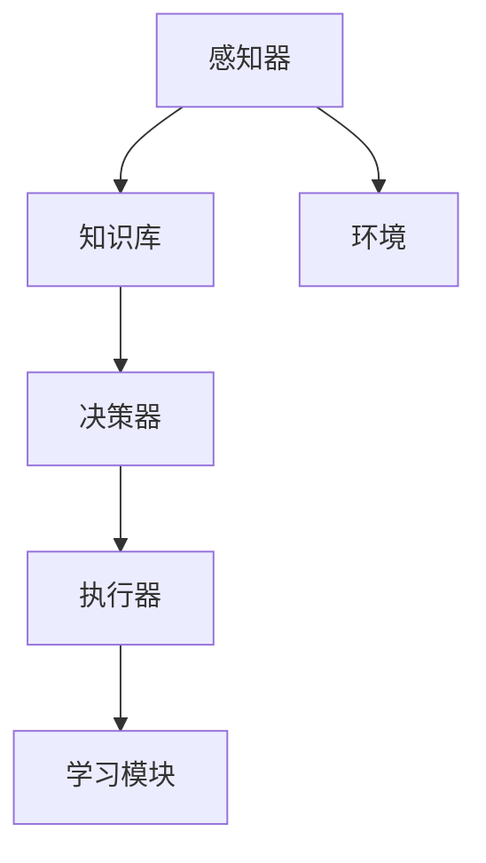

                 

# 《Agent技术的发展与应用》

## 关键词
- Agent技术
- 智能系统
- 自然语言处理
- 计算机视觉
- 智能交通
- 强化学习
- 数学模型

## 摘要
本文将深入探讨Agent技术的发展与应用。首先，我们将回顾Agent技术的定义、发展历程和应用领域。接着，我们将分析Agent技术的架构与原理，并介绍其核心算法和数学模型。随后，我们将重点介绍Agent技术在自然语言处理、计算机视觉和智能交通系统中的应用。最后，我们将探讨Agent技术的开发与实现，并展望其未来发展趋势。通过本文，读者将全面了解Agent技术的原理、应用和实践，为未来的人工智能发展提供新的思路和方向。

## 第1章：Agent技术概述

### 1.1.1 Agent技术的定义与基本概念

Agent技术，也称为智能代理技术，是一种模拟人类思维和行为的方法，旨在创建能够自主决策、学习和适应环境的智能系统。Agent可以被视为具有独立意志、自主行动和感知能力的个体，能够在复杂环境中执行特定任务。Agent技术的基本概念包括以下几个方面：

1. **自主性**：Agent能够独立进行决策和执行任务，而不需要外部干预。
2. **感知能力**：Agent能够通过传感器获取环境信息，以理解当前状态。
3. **行动能力**：Agent可以根据感知到的信息，选择合适的动作，以实现目标。
4. **学习与适应**：Agent能够通过经验积累，改进其行为策略，以更好地适应环境变化。

### 1.1.2 Agent技术的发展历程

Agent技术的起源可以追溯到20世纪80年代，当时的研究主要集中在分布式人工智能（Distributed Artificial Intelligence，DAI）和智能代理的概念上。随着计算机技术的发展，Agent技术逐渐应用于各个领域，如自然语言处理、计算机视觉和智能交通系统。近年来，深度学习和强化学习等先进技术的引入，进一步推动了Agent技术的发展。

### 1.1.3 Agent技术的分类

根据Agent的行为特点和功能，可以将Agent技术分为以下几类：

1. **反应型Agent**：这类Agent仅根据当前感知到的环境信息进行反应，不涉及学习或规划。
2. **认知型Agent**：这类Agent具备有限的学习和规划能力，能够在不同情境下调整行为策略。
3. **社会型Agent**：这类Agent能够在多个Agent之间进行协作，共同完成任务。
4. **混合型Agent**：这类Agent结合了反应型、认知型和社会型Agent的特点，具备更复杂的决策能力。

### 1.1.4 Agent技术的应用领域

Agent技术具有广泛的应用领域，包括但不限于：

1. **自然语言处理**：Agent技术可以应用于文本分类、机器翻译、情感分析和问答系统等领域。
2. **计算机视觉**：Agent技术可以用于目标检测、图像识别、视觉注意力和视觉问答系统等。
3. **智能交通系统**：Agent技术可以用于无人机调度、自动驾驶、交通监控和智能停车场管理。
4. **智能推荐系统**：Agent技术可以用于协同过滤、基于内容的推荐和强化学习等。
5. **智能医疗诊断**：Agent技术可以用于医疗图像分析、疾病预测和个性化治疗方案设计。

## 第2章：Agent技术的架构与原理

### 2.1.1 Agent系统的组成

Agent系统通常由以下几个关键组成部分构成：

1. **感知器**：用于获取环境信息，如摄像头、传感器和麦克风等。
2. **知识库**：存储Agent所拥有的知识，包括事实、规则和模型等。
3. **决策器**：根据感知器和知识库的信息，生成合适的动作策略。
4. **执行器**：执行决策器生成的动作，实现Agent的目标。
5. **学习模块**：用于改进Agent的行为，通过经验学习和适应。

### 2.1.2 Agent之间的通信机制

Agent之间的通信机制是实现协作的关键。常见的通信机制包括：

1. **消息传递**：Agent通过发送和接收消息进行通信，如事件驱动的通信模型。
2. **共享内存**：多个Agent共享同一块内存区域，以交换信息。
3. **市场机制**：Agent通过市场进行商品和服务交换，实现协作。

### 2.1.3 Agent的智能决策过程

Agent的智能决策过程可以分为以下几个步骤：

1. **感知**：Agent通过感知器获取环境信息。
2. **状态评估**：Agent根据当前状态，评估不同动作的可能结果。
3. **策略选择**：Agent根据评估结果，选择最优动作策略。
4. **执行**：Agent执行所选动作，并观察结果。
5. **反馈**：Agent根据执行结果，调整其行为策略。

### 2.1.4 Agent技术的核心算法

Agent技术的核心算法包括：

1. **强化学习**：Agent通过与环境互动，学习最优动作策略。
2. **遗传算法**：基于遗传进化原理，优化Agent的行为策略。
3. **贝叶斯网络**：用于表示Agent的知识和推理过程。
4. **马尔可夫决策过程（MDP）**：用于求解Agent的最优策略。

## 第3章：Agent技术的数学模型

### 3.1.1 马尔可夫决策过程（MDP）

马尔可夫决策过程（MDP）是一个概率模型，用于描述Agent在不确定环境中的决策过程。MDP由以下五个元素组成：

1. **状态空间（S）**：描述环境的状态集合。
2. **行动空间（A）**：描述Agent可执行的动作集合。
3. **状态转移概率（P）**：描述给定当前状态和行动，到达下一个状态的概率。
4. **奖励函数（R）**：描述Agent在执行特定行动时获得的奖励。
5. **策略（π）**：描述Agent在状态空间中的行为规则。

MDP的目标是找到最优策略π*，使得长期奖励期望最大化。

### 3.1.2 贝叶斯网络

贝叶斯网络是一种概率图模型，用于表示Agent的知识和推理过程。贝叶斯网络由以下元素组成：

1. **变量节点**：表示Agent的感知变量。
2. **条件概率表**：描述变量之间的依赖关系。
3. **边**：表示变量之间的条件依赖关系。

贝叶斯网络通过推理算法，如信念传播，实现Agent的推理和决策。

### 3.1.3 遗传算法

遗传算法是一种基于自然进化的优化算法，用于求解Agent的最优行为策略。遗传算法的主要步骤包括：

1. **编码**：将Agent的行为策略编码为染色体。
2. **初始化种群**：随机生成初始种群。
3. **适应度评估**：计算种群的适应度，以评估个体优劣。
4. **选择**：选择适应度较高的个体，进行交叉和变异操作。
5. **迭代**：重复选择、交叉和变异，直到找到最优策略。

### 3.1.4 强化学习

强化学习是一种通过试错学习来优化Agent行为策略的方法。强化学习的主要步骤包括：

1. **初始化**：设置Agent的初始状态。
2. **行动选择**：根据当前状态，选择最优行动。
3. **执行行动**：执行所选行动，并观察结果。
4. **奖励评估**：根据执行结果，评估获得的奖励。
5. **策略更新**：根据奖励评估，更新Agent的策略。

强化学习通过不断迭代，优化Agent的行为策略，使其在复杂环境中取得更好的表现。

## 第4章：Agent技术在自然语言处理中的应用

### 4.1.1 文本分类与主题建模

文本分类和主题建模是自然语言处理中的常见任务。Agent技术可以通过以下方式应用于这些任务：

1. **文本分类**：Agent可以学习大量文本数据，并自动将新文本分类到预定义的类别中。这可以通过训练一个分类模型来实现，如朴素贝叶斯分类器或支持向量机（SVM）。
2. **主题建模**：Agent可以使用主题建模算法，如LDA（Latent Dirichlet Allocation），从大量文本中提取潜在主题，以帮助理解文本内容。

### 4.1.2 机器翻译与自然语言生成

1. **机器翻译**：Agent技术可以应用于机器翻译任务，通过训练神经网络翻译模型，将一种语言翻译成另一种语言。例如，使用序列到序列（Seq2Seq）模型进行翻译。
2. **自然语言生成**：Agent可以生成符合语法和语义规则的自然语言文本，如新闻报道、产品描述等。这可以通过训练一个生成模型，如变分自编码器（VAE）或生成对抗网络（GAN）来实现。

### 4.1.3 情感分析与社会舆情监控

情感分析与社会舆情监控是理解公众意见和情感的重要手段。Agent技术可以通过以下方式应用于这些任务：

1. **情感分析**：Agent可以分析文本中的情感倾向，如正面、负面或中性。这可以通过训练一个情感分类模型来实现，如卷积神经网络（CNN）或长短期记忆网络（LSTM）。
2. **社会舆情监控**：Agent可以实时监控社交媒体和新闻网站，识别热点事件和公众情感变化，为决策者提供支持。

### 4.1.4 问答系统与对话生成

问答系统和对话生成是自然语言处理中的热门研究方向。Agent技术可以通过以下方式应用于这些任务：

1. **问答系统**：Agent可以回答用户提出的问题，通过训练一个问答模型来实现，如记忆网络或对话生成模型。
2. **对话生成**：Agent可以与用户进行自然语言对话，通过训练一个对话生成模型来实现，如循环神经网络（RNN）或注意力机制。

## 第5章：Agent技术在计算机视觉中的应用

### 5.1.1 目标检测与跟踪

目标检测与跟踪是计算机视觉中的重要任务。Agent技术可以通过以下方式应用于这些任务：

1. **目标检测**：Agent可以识别图像中的目标物体，通过训练一个目标检测模型来实现，如YOLO（You Only Look Once）或SSD（Single Shot MultiBox Detector）。
2. **目标跟踪**：Agent可以在视频序列中跟踪目标物体，通过训练一个目标跟踪模型来实现，如光流法或粒子滤波。

### 5.1.2 图像分类与识别

图像分类与识别是计算机视觉中的基本任务。Agent技术可以通过以下方式应用于这些任务：

1. **图像分类**：Agent可以分类图像中的对象，通过训练一个图像分类模型来实现，如卷积神经网络（CNN）或迁移学习。
2. **图像识别**：Agent可以识别图像中的具体对象，通过训练一个图像识别模型来实现，如ResNet或Inception。

### 5.1.3 视觉注意力机制

视觉注意力机制是近年来计算机视觉领域的重要研究方向。Agent技术可以通过以下方式应用于视觉注意力机制：

1. **局部注意力**：Agent可以关注图像中的关键区域，通过训练一个局部注意力模型来实现，如基于ROI Pooling的方法。
2. **全局注意力**：Agent可以关注图像中的整体信息，通过训练一个全局注意力模型来实现，如基于Transformer的方法。

### 5.1.4 视觉问答系统

视觉问答系统是计算机视觉与自然语言处理相结合的研究方向。Agent技术可以通过以下方式应用于视觉问答系统：

1. **图像理解**：Agent可以理解图像中的内容，通过训练一个图像理解模型来实现，如基于图像特征的分类器。
2. **问答生成**：Agent可以生成问题的答案，通过训练一个问答生成模型来实现，如基于序列到序列（Seq2Seq）的方法。

## 第6章：Agent技术在智能推荐系统中的应用

### 6.1.1 协同过滤与基于内容的推荐

智能推荐系统是Agent技术在商业领域的重要应用。Agent技术可以通过以下方式应用于推荐系统：

1. **协同过滤**：Agent可以基于用户历史行为和兴趣，为用户推荐相关商品或内容。协同过滤包括用户基于协同过滤（User-based Collaborative Filtering）和项目基于协同过滤（Item-based Collaborative Filtering）两种方法。
2. **基于内容的推荐**：Agent可以基于商品或内容的属性，为用户推荐相似的商品或内容。基于内容的推荐方法包括基于关键词的推荐和基于属性的推荐。

### 6.1.2 强化学习在推荐系统中的应用

强化学习在推荐系统中的应用是一个热门研究方向。Agent技术可以通过以下方式应用于强化学习：

1. **用户-项目交互**：Agent可以学习用户和项目之间的交互模式，通过强化学习算法，如Q-learning或SARSA，为用户推荐最优商品。
2. **自适应推荐**：Agent可以根据用户行为和历史反馈，实时调整推荐策略，以提高推荐效果。

### 6.1.3 深度学习在推荐系统中的应用

深度学习在推荐系统中的应用越来越广泛。Agent技术可以通过以下方式应用于深度学习：

1. **用户表示**：Agent可以使用深度学习模型，如卷积神经网络（CNN）或循环神经网络（RNN），学习用户的兴趣和行为模式。
2. **项目表示**：Agent可以使用深度学习模型，如卷积神经网络（CNN）或循环神经网络（RNN），学习项目的属性和特征。

### 6.1.4 多模态推荐系统

多模态推荐系统是结合多种数据源的推荐系统。Agent技术可以通过以下方式应用于多模态推荐系统：

1. **文本-图像联合建模**：Agent可以结合文本和图像数据，学习用户和项目的共同特征，以提高推荐效果。
2. **用户-项目-上下文联合建模**：Agent可以结合用户、项目和上下文信息，学习三者之间的关联，为用户推荐最优商品。

## 第7章：Agent技术在智能交通系统中的应用

### 7.1.1 无人机调度与交通监控

智能交通系统是Agent技术在交通领域的重要应用。Agent技术可以通过以下方式应用于无人机调度与交通监控：

1. **无人机调度**：Agent可以实时监控交通状况，并根据交通流量自动调整无人机路线，以提高交通效率。
2. **交通监控**：Agent可以通过无人机或传感器网络，实时监测交通状况，为交通管理部门提供数据支持。

### 7.1.2 自动驾驶与车联网技术

自动驾驶和车联网技术是未来智能交通系统的重要方向。Agent技术可以通过以下方式应用于自动驾驶和车联网技术：

1. **自动驾驶**：Agent可以使用深度学习和强化学习技术，实现自主驾驶，提高行车安全。
2. **车联网技术**：Agent可以通过车联网技术，实现车辆之间的通信和协同，以提高交通效率。

### 7.1.3 智能交通信号控制

智能交通信号控制是优化交通流量的重要手段。Agent技术可以通过以下方式应用于智能交通信号控制：

1. **实时交通数据采集**：Agent可以实时采集交通数据，如车辆速度、密度和流量，为交通信号控制提供数据支持。
2. **自适应信号控制**：Agent可以根据实时交通数据，自适应调整交通信号，以提高交通效率。

### 7.1.4 智能停车场管理

智能停车场管理是提高停车场使用效率的重要手段。Agent技术可以通过以下方式应用于智能停车场管理：

1. **车位监测**：Agent可以通过传感器网络，实时监测车位状态，为车主提供停车信息。
2. **停车引导**：Agent可以根据实时车位信息，为车主提供最佳停车路线，以提高停车效率。

## 第8章：Agent技术的开发与实现

### 8.1.1 开发环境搭建

在开发Agent技术时，需要搭建一个合适的开发环境。以下是一个基本的开发环境搭建步骤：

1. **操作系统**：选择Linux操作系统，如Ubuntu或CentOS。
2. **编程语言**：选择Python作为主要编程语言，因为它拥有丰富的库和框架，适用于各种应用场景。
3. **深度学习框架**：选择TensorFlow或PyTorch作为深度学习框架，因为它们拥有强大的功能和良好的社区支持。
4. **其他工具**：安装Git进行版本控制，使用Jupyter Notebook进行开发，安装必要的数据处理库，如NumPy和Pandas。

### 8.1.2 Agent系统设计与实现

设计一个Agent系统时，需要考虑以下几个方面：

1. **需求分析**：明确系统的目标和功能要求。
2. **系统架构**：设计系统的整体架构，包括感知器、知识库、决策器和执行器等组成部分。
3. **模块划分**：将系统划分为不同的模块，如感知模块、决策模块和执行模块等。
4. **接口设计**：设计模块之间的接口，确保模块之间的协作和通信。
5. **实现细节**：根据模块划分和接口设计，实现系统的各个模块，并进行集成和测试。

### 8.1.3 Agent性能优化与调试

在开发Agent系统时，需要关注系统的性能和稳定性。以下是一些性能优化和调试的方法：

1. **算法优化**：选择高效的算法和数据结构，以减少计算时间和内存消耗。
2. **并行计算**：利用多核处理器和分布式计算，提高系统的计算能力。
3. **缓存机制**：使用缓存机制，减少重复计算和数据访问。
4. **调试工具**：使用调试工具，如Python的pdb模块，定位和修复代码中的错误。
5. **测试与评估**：设计测试用例，对系统进行全面的测试和评估，确保系统的稳定性和可靠性。

### 8.1.4 代码版本管理与协作开发

在开发过程中，需要使用代码版本管理工具，如Git，进行代码的版本控制和协作开发。以下是一些常用方法：

1. **分支管理**：使用分支管理，将不同功能模块的代码分开管理，以方便开发和合并。
2. **提交记录**：使用提交记录，记录代码的修改历史和变更内容。
3. **代码审查**：进行代码审查，确保代码的质量和一致性。
4. **持续集成**：使用持续集成工具，如Jenkins，自动构建和测试代码，确保代码的稳定性和可靠性。
5. **协作开发**：使用代码托管平台，如GitHub或GitLab，进行协作开发和代码共享。

## 第9章：Agent技术在企业中的应用案例

### 9.1.1 智能客服系统

智能客服系统是Agent技术在企业服务领域的应用。以下是一个智能客服系统的案例：

1. **需求分析**：分析企业客户服务需求，确定智能客服系统的功能要求。
2. **系统设计**：设计智能客服系统的整体架构，包括感知模块、决策模块和执行模块等。
3. **感知模块**：使用自然语言处理技术，如情感分析和关键词提取，从用户输入中提取关键信息。
4. **决策模块**：使用机器学习算法，如朴素贝叶斯分类器或深度神经网络，为用户提供合适的回答。
5. **执行模块**：使用语音合成技术，将回答转换为自然语言文本或语音输出。

### 9.1.2 智能供应链管理

智能供应链管理是Agent技术在企业物流和供应链管理领域的应用。以下是一个智能供应链管理系统的案例：

1. **需求分析**：分析企业供应链管理的需求，确定智能供应链管理系统的功能要求。
2. **系统设计**：设计智能供应链管理系统的整体架构，包括感知模块、决策模块和执行模块等。
3. **感知模块**：使用传感器和网络技术，实时监控供应链各环节的物流信息。
4. **决策模块**：使用机器学习算法，如线性回归或强化学习，优化供应链各环节的资源配置。
5. **执行模块**：使用自动化技术，如无人机或机器人，实现物流运输和仓储管理。

### 9.1.3 智能金融风控

智能金融风控是Agent技术在金融领域的应用。以下是一个智能金融风控系统的案例：

1. **需求分析**：分析金融行业的风险管控需求，确定智能金融风控系统的功能要求。
2. **系统设计**：设计智能金融风控系统的整体架构，包括感知模块、决策模块和执行模块等。
3. **感知模块**：使用数据挖掘技术，从大量金融数据中提取风险指标。
4. **决策模块**：使用机器学习算法，如逻辑回归或决策树，对风险进行评估和预测。
5. **执行模块**：使用风险管理工具，如风险隔离和风险分散，实施风险控制措施。

### 9.1.4 智能医疗诊断

智能医疗诊断是Agent技术在医疗领域的应用。以下是一个智能医疗诊断系统的案例：

1. **需求分析**：分析医疗行业的诊断需求，确定智能医疗诊断系统的功能要求。
2. **系统设计**：设计智能医疗诊断系统的整体架构，包括感知模块、决策模块和执行模块等。
3. **感知模块**：使用计算机视觉技术，从医学图像中提取病变特征。
4. **决策模块**：使用深度学习算法，如卷积神经网络（CNN），对病变进行分类和诊断。
5. **执行模块**：使用医学知识库，为患者提供诊断建议和治疗方案。

## 第10章：Agent技术的发展趋势与未来展望

### 10.1.1 新兴应用领域

随着人工智能技术的发展，Agent技术将在新兴应用领域得到广泛应用。以下是一些潜在的应用领域：

1. **智能家居**：Agent技术可以用于智能家居系统，实现家电设备自动控制和智能互动。
2. **虚拟现实与增强现实**：Agent技术可以用于虚拟现实与增强现实场景中的角色扮演和交互。
3. **金融科技**：Agent技术可以用于金融科技领域，实现智能投顾、智能理财和智能风控。
4. **智能农业**：Agent技术可以用于智能农业系统，实现作物监测、病虫害预测和自动化灌溉。

### 10.1.2 混合智能系统

混合智能系统是结合多种智能技术，实现更高层次的智能化。Agent技术在混合智能系统中具有重要作用。以下是一些混合智能系统的应用场景：

1. **智能医疗**：结合医学知识库、机器学习和Agent技术，实现智能医疗诊断和治疗。
2. **智能交通**：结合自动驾驶、车联网技术和Agent技术，实现智能交通管理系统。
3. **智能制造**：结合工业物联网、机器人和Agent技术，实现智能生产系统。

### 10.1.3 量子计算与Agent技术

量子计算是一种新兴的计算技术，具有极高的并行计算能力。结合量子计算和Agent技术，可以进一步提升智能系统的性能。以下是一些潜在的应用场景：

1. **量子智能优化**：利用量子计算的优势，优化Agent的决策过程，实现更高效的智能行为。
2. **量子模拟**：利用量子计算模拟复杂物理系统，为Agent提供更丰富的感知信息。
3. **量子安全通信**：利用量子计算实现安全通信，保障Agent系统的数据安全。

### 10.1.4 Agent技术在人工智能伦理问题中的应用

人工智能伦理问题是当前社会关注的焦点。Agent技术在人工智能伦理问题中具有重要作用。以下是一些应用场景：

1. **责任归属**：通过Agent技术，明确人工智能系统的责任归属，降低人工智能事故的风险。
2. **透明度**：通过Agent技术，提高人工智能系统的透明度，使其行为更加可解释。
3. **道德决策**：通过Agent技术，实现道德决策，使人工智能系统能够在伦理困境中做出合理的选择。

## 附录

### 附录A：Agent技术常用工具与资源

以下是一些常用的Agent技术工具与资源：

1. **深度学习框架**：TensorFlow、PyTorch、Keras、Theano等。
2. **自然语言处理库**：NLTK、spaCy、gensim、nltk-stanford等。
3. **计算机视觉库**：OpenCV、Pillow、PIL、OpenNN等。
4. **数据集**：ImageNet、CIFAR-10、MNIST、COIL-20等。
5. **代码托管平台**：GitHub、GitLab、Bitbucket等。
6. **论文与书籍**：《人工智能：一种现代方法》、《强化学习：原理与Python实现》、《深度学习：周志华等著》等。

### 附录B：Agent技术的Mermaid流程图

以下是一个简单的Agent系统流程图的Mermaid表示：



## 附录C：致谢

在此，我要感谢所有为Agent技术的发展和应用做出贡献的专家和学者。特别感谢我的导师对我的指导和支持，使我能够完成这篇技术博客。同时，感谢所有参与技术讨论和项目开发的团队成员，你们的努力和智慧为Agent技术的进步做出了重要贡献。最后，感谢所有阅读本文的读者，希望本文能为您在Agent技术领域的研究和应用提供帮助和启发。

### 作者

AI天才研究院/AI Genius Institute

禅与计算机程序设计艺术 /Zen And The Art of Computer Programming
``````

