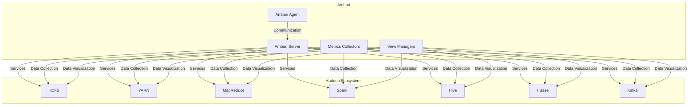

                 

### 文章标题

# 《Ambari原理与代码实例讲解》

### 关键词

- Ambari
- Hadoop生态系统
- 服务管理
- 配置管理
- 日志管理
- 用户权限管理
- 高可用架构
- 自动化运维
- 插件开发

### 摘要

本文将深入探讨Ambari，一个强大的工具，用于简化Hadoop集群的管理和维护。我们将从Ambari的基础知识开始，详细解析其架构、功能、安装配置、服务管理、配置管理、日志管理、用户与权限管理等方面。此外，本文还将涉及Ambari的高级功能，如自动化运维、高可用架构，以及故障排查与解决策略。最后，我们将通过代码实例解析，展示如何进行Ambari的插件开发。希望通过本文，读者能够全面了解Ambari，掌握其原理和实战技巧，从而提升Hadoop集群管理的效率。

### 第一部分：Ambari基础

#### 第1章：Ambari简介

## 第1章：Ambari简介

### 1.1 Ambari的定义与作用

Ambari是由Hortonworks开发的一款开源工具，旨在简化Hadoop集群的管理和维护。作为Hadoop生态系统的一部分，Ambari提供了一个统一的界面，用于安装、配置、管理和监控Hadoop及其周边服务。

**Ambari的主要作用包括：**

- **服务管理**：Ambari可以自动安装、配置、启动和停止Hadoop及其周边服务。
- **配置管理**：Ambari提供了集中化的配置管理功能，允许管理员轻松修改和回滚配置。
- **健康检查**：Ambari会定期检查集群的各个服务，确保它们处于正常运行状态。
- **日志管理**：Ambari提供了一个集中的日志管理界面，方便管理员查看和分析日志。
- **访问控制**：Ambari支持用户和权限管理，确保集群资源的安全访问。

### 1.2 Ambari在Hadoop生态系统中的位置

在Hadoop生态系统中，Ambari位于上层应用和底层硬件之间，充当集群管理的桥梁。它不仅管理Hadoop的核心组件，如HDFS、YARN、MapReduce等，还支持其他流行的数据处理框架，如Spark、Hive、HBase等。


### 1.3 Ambari的基本组件

Ambari由以下几个基本组件组成：

- **Ambari Server**：负责存储集群配置、用户信息和监控数据，并提供一个Web界面供管理员进行操作。
- **Ambari Agent**：安装在集群中的每个节点上，负责与Ambari Server通信，执行安装、配置和管理任务。
- **Ambari Metrics Collectors**：负责收集集群的监控数据，并将其发送到HDFS或HBase中。
- **Ambari View Managers**：提供自定义视图，以可视化集群状态和数据。


### 1.4 Ambari的核心功能

Ambari的核心功能包括以下几个方面：

- **服务管理**：Ambari可以自动安装、配置、启动和停止Hadoop及其周边服务。
- **健康检查**：Ambari会定期检查集群的各个服务，确保它们处于正常运行状态。
- **配置管理**：Ambari提供了集中化的配置管理功能，允许管理员轻松修改和回滚配置。
- **日志管理**：Ambari提供了一个集中的日志管理界面，方便管理员查看和分析日志。
- **访问控制**：Ambari支持用户和权限管理，确保集群资源的安全访问。

### 1.5 Ambari的特点与优势

**特点：**

- **易用性**：Ambari提供了一个直观的Web界面，使得集群管理变得简单直观。
- **自动化**：Ambari可以自动化安装、配置和管理Hadoop集群，节省时间和人力。
- **高可用性**：Ambari支持集群的高可用性，确保集群在故障发生时能够快速恢复。
- **可扩展性**：Ambari支持自定义插件，可以轻松集成其他Hadoop生态系统组件。

**优势：**

- **简化集群管理**：Ambari使得集群管理变得更加简单，降低了管理成本。
- **提高运维效率**：通过自动化和集中化管理，Ambari显著提高了运维效率。
- **增强安全性**：Ambari提供了强大的访问控制和日志管理功能，确保集群资源的安全。
- **灵活性**：Ambari支持自定义插件，可以灵活适应不同的业务需求。

## 第2章：Ambari的架构

### 2.1 Ambari的整体架构

Ambari的整体架构分为三层：客户端、服务器和Agent。

- **客户端**：管理员通过Web界面与Ambari进行交互，执行各种管理任务。
- **服务器**：Ambari Server负责存储集群配置、用户信息和监控数据，并提供API供其他组件使用。
- **Agent**：Ambari Agent安装在集群中的每个节点上，负责与Ambari Server通信，执行安装、配置和管理任务。


### 2.2 Ambari的组件详解

**1. Ambari Server**

- **功能**：Ambari Server是Ambari的核心组件，负责存储集群配置、用户信息和监控数据，并提供Web界面供管理员进行操作。它还充当服务协调器，负责调度Agent执行任务。
- **部署**：Ambari Server通常部署在一个独立的节点上，以保证其高可用性。
- **架构**：Ambari Server由以下几个部分组成：

  - **Web App**：提供Web界面，供管理员进行操作。
  - **REST API**：提供RESTful接口，供其他组件和客户端进行通信。
  - **Metadata Store**：存储集群配置、用户信息和监控数据。
  - **Service Manager**：负责服务安装、配置和监控。

**2. Ambari Agent**

- **功能**：Ambari Agent安装在集群中的每个节点上，负责与Ambari Server通信，执行安装、配置和管理任务。每个Agent都维护一个本地数据库，存储其节点的状态信息。
- **部署**：Ambari Agent通常与Hadoop集群的其他服务一起部署。
- **架构**：Ambari Agent由以下几个部分组成：

  - **Rest API Client**：与Ambari Server进行通信。
  - **Configuration Manager**：管理节点的配置。
  - **Resource Manager**：负责资源监控和资源调度。
  - **Host Manager**：管理节点的各种操作，如启动、停止、重启等。

**3. Ambari Metrics Collectors**

- **功能**：Ambari Metrics Collectors负责收集集群的监控数据，并将其发送到HDFS或HBase中，供Ambari Server进行存储和可视化。
- **部署**：Ambari Metrics Collectors通常部署在集群中的多个节点上，以提高数据收集的效率。
- **架构**：Ambari Metrics Collectors由以下几个部分组成：

  - **Ganglia**：负责收集系统级监控数据。
  - **Nagios**：负责收集服务级监控数据。
  - **Collectd**：负责收集节点级监控数据。

**4. Ambari View Managers**

- **功能**：Ambari View Managers提供自定义视图，以可视化集群状态和数据。这些视图可以通过Ambari Web界面进行访问。
- **部署**：Ambari View Managers通常与Ambari Server一起部署。
- **架构**：Ambari View Managers由以下几个部分组成：

  - **Graphite**：负责存储和可视化监控数据。
  - **Grafana**：提供Web界面，供管理员查看监控数据。

### 2.3 Ambari的组件交互流程

当管理员在Ambari Web界面执行操作时，以下步骤描述了Ambari组件之间的交互流程：

1. **管理员在Web界面执行操作**：管理员通过Web界面提交操作请求。
2. **Web App将请求转发到REST API**：Web App将请求转发到Ambari Server的REST API。
3. **REST API处理请求**：REST API处理请求，并根据操作类型生成相应的命令。
4. **Service Manager调度任务**：Service Manager根据命令类型，将任务调度到相应的Agent。
5. **Agent执行任务**：Agent接收任务，并在本地执行相应操作。
6. **Agent将结果反馈给REST API**：Agent执行完任务后，将结果反馈给Ambari Server的REST API。
7. **REST API将结果反馈给Web App**：REST API将结果反馈给Web App。
8. **Web App更新界面**：Web App更新界面，显示操作结果。


### 2.4 Ambari的体系结构图

以下是Ambari的体系结构图，展示了各个组件之间的关系：

```mermaid
graph TB
    subgraph Ambari Server
        WebApp[Web App]
        RestAPI[REST API]
        MetadataStore[Metadata Store]
        ServiceManager[Service Manager]
    end

    subgraph Ambari Agent
        RestAPIClient[Rest API Client]
        ConfigurationManager[Configuration Manager]
        ResourceManager[Resource Manager]
        HostManager[Host Manager]
    end

    subgraph Metrics Collectors
        Ganglia[Ganglia]
        Nagios[Nagios]
        Collectd[Collectd]
    end

    subgraph View Managers
        Graphite[Graphite]
        Grafana[Grafana]
    end

    WebApp -- REST API --> ServiceManager
    ServiceManager -- Command --> RestAPIClient
    RestAPIClient -- Communication --> Ambari Server
    Ambari Server -- Metadata Store -->
    Ambari Server -- Service Manager -->
    Ambari Server -- Rest API --> Web App

    Ambari Server -- Metrics Collectors -->
    Metrics Collectors -- Data Collection -->
    Metrics Collectors -- Data Storage --> Graphite
    Metrics Collectors -- Data Visualization --> Grafana

    Ambari Server -- View Managers -->
    View Managers -- Data Visualization --> Grafana
```

### 2.5 Ambari的高可用架构

为了提高Ambari的可用性和可靠性，Ambari支持高可用架构。在多节点环境中，Ambari Server和Metrics Collectors都可以进行冗余部署。

- **Ambari Server高可用**：通过将Ambari Server部署在多个节点上，并使用负载均衡器进行负载均衡，可以实现Ambari Server的高可用。
- **Metrics Collectors高可用**：通过将Metrics Collectors部署在多个节点上，并使用Ganglia或Nagios进行监控，可以实现Metrics Collectors的高可用。


### 2.6 Ambari与Hadoop生态系统组件的关系

Ambari不仅管理Hadoop的核心组件，还与其他生态系统组件紧密集成。以下图表展示了Ambari与Hadoop生态系统组件之间的关系：



## 第3章：Ambari的核心功能

### 3.1 服务管理

**服务管理是Ambari的核心功能之一。通过Ambari，管理员可以轻松地安装、配置、启动和停止Hadoop及其周边服务。以下是对服务管理功能的具体解析：**

#### 安装服务

- **步骤**：在Ambari Web界面，选择“Services”> “Install Service”，然后选择要安装的服务，如HDFS、YARN等。点击“Next”进行下一步，配置服务的详细参数，如服务名称、服务地址等。最后，点击“Install”开始安装。
- **过程**：安装过程中，Ambari Server会向每个节点上的Ambari Agent发送安装命令，Agent会下载并安装相应的服务包。
- **示例**：以下是一个安装HDFS服务的命令：

  ```shell
  ambari-server install-service --service-name HDFS --host-component-locations hadoop-hdfs-namenode=ambari-server hadoop-hdfs-datanode=slave1,slave2
  ```

#### 配置服务

- **步骤**：在Ambari Web界面，选择“Services”> “Configuration”，然后选择要配置的服务。在“Service Configs”页面，可以查看和编辑服务的配置文件。点击“Edit”按钮，修改配置项，然后点击“Save”保存修改。
- **过程**：配置修改后，Ambari Server会将修改后的配置文件发送给对应的Ambari Agent。
- **示例**：以下是一个配置HDFS服务的命令：

  ```shell
  ambari-server config-service --service-name HDFS --config-file hdfs-site.xml
  ```

#### 启动服务

- **步骤**：在Ambari Web界面，选择“Services”> “Start Service”，然后选择要启动的服务。点击“Start”按钮，开始启动服务。
- **过程**：启动过程中，Ambari Server会向每个节点上的Ambari Agent发送启动命令，Agent会启动相应的服务进程。
- **示例**：以下是一个启动HDFS服务的命令：

  ```shell
  ambari-server start-service --service-name HDFS
  ```

#### 停止服务

- **步骤**：在Ambari Web界面，选择“Services”> “Stop Service”，然后选择要停止的服务。点击“Stop”按钮，开始停止服务。
- **过程**：停止过程中，Ambari Server会向每个节点上的Ambari Agent发送停止命令，Agent会停止相应的服务进程。
- **示例**：以下是一个停止HDFS服务的命令：

  ```shell
  ambari-server stop-service --service-name HDFS
  ```

### 3.2 健康检查

**健康检查是确保集群服务正常运行的重要机制。Ambari通过定期检查集群服务的状态，及时发现并解决潜在问题。以下是对健康检查功能的具体解析：**

#### 定期检查

- **步骤**：Ambari Agent在每个节点上定期执行健康检查任务，检查服务状态、资源使用情况等。默认情况下，检查间隔为1小时。
- **过程**：Agent会调用服务的健康检查接口，如HDFS的dfshealthcheck.sh脚本，检查服务的健康状况。
- **示例**：以下是一个健康检查的脚本示例：

  ```bash
  #!/bin/bash
  # HDFS健康检查脚本
  # 检查NameNode
  echo "Checking NameNode..."
  hadoop dfsadmin -report
  # 检查DataNode
  echo "Checking DataNode..."
  for datanode in $(hdfs dfsadmin -getDatanodeInfo | grep -oP '(\d+\.\d+\.\d+\.\d+):.*$'); do
      echo "DataNode $datanode is up."
  done
  ```

#### 故障检测

- **步骤**：当Agent发现服务异常时，会立即将异常信息报告给Ambari Server，并触发相应的故障检测机制。
- **过程**：Ambari Server会记录故障信息，并尝试自动恢复服务。如果自动恢复失败，管理员会收到通知，需要手动干预。
- **示例**：以下是一个故障检测的脚本示例：

  ```bash
  #!/bin/bash
  # HDFS故障检测脚本
  # 检查NameNode
  if ! hadoop dfsadmin -report | grep "Missing blocks"; then
      echo "NameNode is healthy."
  else
      echo "NameNode is unhealthy. Triggering recovery..."
      hadoop dfsadmin -safemode leave
  fi
  # 检查DataNode
  for datanode in $(hdfs dfsadmin -getDatanodeInfo | grep -oP '(\d+\.\d+\.\d+\.\d+):.*$'); do
      if ! ping -c 1 $datanode &> /dev/null; then
          echo "DataNode $datanode is down. Triggering recovery..."
          start-datanode.sh $datanode
      else
          echo "DataNode $datanode is healthy."
      fi
  done
  ```

#### 故障恢复

- **步骤**：在检测到故障后，Ambari会尝试自动恢复服务。如果自动恢复失败，管理员需要手动干预。
- **过程**：自动恢复包括重新启动服务、重新配置服务、重新安装服务等步骤。管理员可以通过Ambari Web界面或命令行工具进行手动干预。
- **示例**：以下是一个故障恢复的命令示例：

  ```shell
  ambari-server restart-service --service-name HDFS
  ```

### 3.3 配置管理

**配置管理是Ambari的另一项核心功能，它允许管理员集中管理集群的配置文件。以下是对配置管理功能的具体解析：**

#### 配置文件的类型

- **全局配置文件**：全局配置文件影响整个集群的所有服务。例如，hadoop-site.xml、core-site.xml等。
- **服务配置文件**：服务配置文件针对特定的服务，如hdfs-site.xml（HDFS服务）、yarn-site.xml（YARN服务）等。
- **组件配置文件**：组件配置文件针对特定的服务组件，如hdfs-namenode.xml（HDFS NameNode配置）、hdfs-datanode.xml（HDFS DataNode配置）等。

#### 配置文件的编辑与管理

- **步骤**：在Ambari Web界面，选择“Services”> “Configuration”，然后选择要编辑的服务。在“Service Configs”页面，可以查看和编辑服务的配置文件。
- **过程**：编辑完成后，点击“Save”按钮保存修改。Ambari Server会将修改后的配置文件发送给对应的Ambari Agent。
- **示例**：以下是一个编辑HDFS配置文件的命令示例：

  ```shell
  ambari-server config-service --service-name HDFS --config-file hdfs-site.xml
  ```

#### 配置文件的回滚与恢复

- **步骤**：在Ambari Web界面，选择“Services”> “Configuration”> “Backups”，可以查看和恢复配置文件的备份。
- **过程**：选择要恢复的备份版本，然后点击“Restore”按钮。Ambari Server会将选择的备份版本恢复到当前配置。
- **示例**：以下是一个恢复HDFS配置文件的命令示例：

  ```shell
  ambari-server rollback-service-config --service-name HDFS --version 1234
  ```

### 3.4 日志管理

**日志管理是确保集群正常运行和故障排查的重要手段。Ambari提供了集中化的日志管理功能，方便管理员查看、检索和分析日志。以下是对日志管理功能的具体解析：**

#### 日志文件的类型

- **系统日志**：系统日志记录了操作系统和服务的运行信息，如启动、停止、异常等。常见的系统日志文件包括syslog、dmesg等。
- **服务日志**：服务日志记录了Hadoop及其周边服务的运行信息，如HDFS的HDFS-Namenode日志、YARN的YARN-ResourceManager日志等。

#### 日志文件的查看与检索

- **步骤**：在Ambari Web界面，选择“Logs”> “Search Logs”，然后在搜索框中输入要查询的关键词。
- **过程**：搜索结果会显示与关键词相关的日志条目，管理员可以查看和下载日志文件。
- **示例**：以下是一个查看HDFS日志的命令示例：

  ```shell
  ambari-server logsearch --service HDFS
  ```

#### 日志文件的存储与清理

- **步骤**：在Ambari Web界面，选择“Logs”> “Policies”，可以配置日志文件的存储策略和清理策略。
- **过程**：管理员可以根据需要设置日志文件保留的天数、存储位置等。
- **示例**：以下是一个配置HDFS日志清理策略的命令示例：

  ```shell
  ambari-server set-log-policy --config "hdfs-log-policy" --field "DaysBeforeDeletion" 7
  ```

### 3.5 访问控制

**访问控制是确保集群资源安全的重要机制。Ambari提供了强大的用户和权限管理功能，允许管理员根据用户角色和权限定义来控制对集群资源的访问。以下是对访问控制功能的具体解析：**

#### 用户管理

- **步骤**：在Ambari Web界面，选择“Users”> “Users”，可以查看、创建和删除用户。
- **过程**：创建用户时，需要指定用户的用户名、密码和角色。
- **示例**：以下是一个创建用户的命令示例：

  ```shell
  ambari-users create --create-user admin --create-password admin123 --role Admin
  ```

#### 权限管理

- **步骤**：在Ambari Web界面，选择“Users”> “Groups”，可以查看、创建和删除用户组。
- **过程**：创建用户组时，需要指定用户组的名称和角色。
- **示例**：以下是一个创建用户组的命令示例：

  ```shell
  ambari-users create --create-group users --role Users
  ```

#### 角色管理

- **步骤**：在Ambari Web界面，选择“Users”> “Roles”，可以查看、创建和删除角色。
- **过程**：创建角色时，需要指定角色的名称和权限。
- **示例**：以下是一个创建角色的命令示例：

  ```shell
  ambari-roles create --create-role Admin --global
  ```

### 3.6 基于角色的访问控制

**基于角色的访问控制（RBAC）是Ambari实现访问控制的核心机制。管理员可以通过定义用户角色和权限，来控制用户对集群资源的访问。以下是对基于角色的访问控制的具体解析：**

#### RBAC的概念

- **用户**：集群中的用户，可以是管理员、普通用户等。
- **角色**：用户的角色定义了用户在集群中的权限，如管理员、普通用户等。
- **权限**：权限定义了用户对特定资源的操作权限，如读取、写入、执行等。

#### RBAC的实现

- **步骤**：在Ambari Web界面，管理员可以创建用户、角色和权限，并定义它们之间的关系。
- **过程**：用户与角色关联，角色与权限关联。用户在访问集群资源时，Ambari会根据用户的角色和权限，判断用户是否有权限执行操作。
- **示例**：以下是一个基于角色的访问控制实现的示例：

  ```bash
  # 创建用户
  ambari-users create --create-user user1 --create-password user123 --role Reader
  
  # 创建角色
  ambari-roles create --create-role Reader --global
  
  # 分配权限
  ambari-privs assign --principal user1 --privilege View --resource-type Host
  
  # 检查用户权限
  ambari-privs list --principal user1
  ```

#### 基于角色的访问控制的优缺点

- **优点**：
  - 灵活性：管理员可以根据业务需求，灵活定义用户角色和权限。
  - 可维护性：集中化的权限管理，使得权限变更和维护变得更加简单。
  - 安全性：通过严格的权限控制，防止未授权用户访问敏感数据。

- **缺点**：
  - 复杂性：对于复杂的权限控制需求，实现和管理会变得更加复杂。
  - 维护成本：需要定期审查和更新权限，以确保权限设置符合业务需求。

### 总结

Ambari提供了丰富的核心功能，包括服务管理、健康检查、配置管理、日志管理和访问控制等。这些功能共同构成了一个强大的集群管理平台，使得Hadoop集群的管理和维护变得更加简单、高效和可靠。通过深入理解这些功能，管理员可以更好地管理和优化Hadoop集群，提高其性能和稳定性。

## 第4章：Ambari的安装与配置

### 4.1 Ambari的安装环境

要成功安装和配置Ambari，需要满足一定的环境要求。以下列出了一些关键的环境要求：

- **操作系统**：Ambari支持多种操作系统，包括Ubuntu 14.04/16.04、CentOS 6/7、Red Hat Enterprise Linux 7等。建议使用最新版本的操作系统，以确保稳定性。
- **JDK**：Ambari要求Java版本为1.7或更高版本。建议使用OpenJDK或Oracle JDK。
- **数据库**：Ambari支持多种数据库，包括MySQL、PostgreSQL和Apache Hive Metastore。建议使用MySQL 5.6或更高版本，以保证数据一致性和稳定性。
- **网络**：Ambari需要稳定的网络连接，以便各个组件之间的通信。

### 4.2 安装Ambari Server

**1. 安装JDK**

在安装Ambari Server之前，需要确保JDK已经安装。可以使用以下命令检查JDK版本：

```shell
java -version
```

如果JDK未安装或版本过低，可以从Oracle官网下载JDK并安装。以下是一个在Ubuntu 16.04上安装OpenJDK的示例：

```shell
sudo apt-get update
sudo apt-get install openjdk-8-jdk
```

**2. 安装Apache ZooKeeper**

Ambari依赖于ZooKeeper进行集群协调。在安装Ambari Server之前，需要确保ZooKeeper已安装。可以使用以下命令安装ZooKeeper：

```shell
sudo apt-get install zookeeperd
```

启动ZooKeeper服务：

```shell
sudo systemctl start zookeeper
```

确保ZooKeeper服务正在运行：

```shell
sudo systemctl status zookeeper
```

**3. 安装Ambari Server**

从Ambari官网下载最新的Ambari Server包，并解压到指定目录：

```shell
wget https://www-us.apache.org/dist/ambari/2.7.2/apache-ambari-2.7.2.tar.gz
tar zxvf apache-ambari-2.7.2.tar.gz
cd apache-ambari-2.7.2
sudo ./bin/ambari-server setup
```

在安装过程中，会提示一系列配置选项。按照提示进行操作，确保以下选项已正确配置：

- **Database**：选择“MySQL”作为数据库类型。
- **Database Hostname/IP Address**：输入数据库服务器的IP地址或主机名。
- **Database Port Number**：输入数据库服务器的端口号（默认为3306）。
- **Database Username**：输入数据库用户的用户名。
- **Database Password**：输入数据库用户的密码。
- **Ambari Database Hostname/IP Address**：输入Ambari数据库服务器的IP地址或主机名（通常与上一项相同）。
- **Ambari Database Port Number**：输入Ambari数据库服务器的端口号（通常与上一项相同）。
- **Ambari Database Username**：输入Ambari数据库用户的用户名（通常与数据库用户名相同）。
- **Ambari Database Password**：输入Ambari数据库用户的密码（通常与数据库用户密码相同）。

安装完成后，运行以下命令启动Ambari Server：

```shell
sudo ./bin/ambari-server start
```

**4. 配置Ambari Server**

Ambari Server安装完成后，可以通过Web界面进行配置和管理。默认情况下，Ambari Server的Web界面地址为http://<Ambari_Server_IP>:8080。在Web界面，可以选择“Admin”> “Manage Ambari”> “Global Settings”进行全局配置。

**5. 常见问题与解决方案**

- **问题1**：安装过程中遇到“Failed to fetch”错误。

  **解决方案**：确保操作系统已经更新到最新版本，并尝试更换镜像源。

- **问题2**：安装完成后无法启动Ambari Server。

  **解决方案**：检查系统环境变量，确保JAVA_HOME和PATH环境变量已正确设置。此外，检查Ambari Server日志文件，查找错误原因。

### 4.3 安装Ambari Agent

**1. 在集群其他节点上安装Ambari Agent**

在Ambari Server安装完成后，需要将其安装到集群的其他节点上。以下是在Ubuntu 16.04上安装Ambari Agent的步骤：

```shell
sudo apt-get update
sudo apt-get install python-dev
sudo ./bin/ambari-agent install
```

**2. 配置Ambari Agent**

在安装完Ambari Agent后，需要对其进行配置，以确保其能够与Ambari Server正常通信。编辑Agent的配置文件：

```shell
sudo vi /etc/ambari-agent/conf/ambari-agent.properties
```

配置以下参数：

- `ambari.server.hostname`: Ambari Server的主机名或IP地址。
- `ambari.server.port`: Ambari Server的端口号（默认为8080）。

配置完成后，重启Ambari Agent：

```shell
sudo systemctl restart ambari-agent
```

**3. 常见问题与解决方案**

- **问题1**：Agent无法连接到Ambari Server。

  **解决方案**：检查Agent的配置文件，确保`ambari.server.hostname`和`ambari.server.port`参数已正确设置。此外，检查防火墙设置，确保Ambari Server的端口号已开放。

- **问题2**：Agent无法注册到Ambari Server。

  **解决方案**：检查Agent的日志文件，查找错误原因。可能的原因包括网络连接问题、防火墙设置或Ambari Server配置问题。

### 4.4 Ambari的初始配置

**1. Ambari Admin用户权限管理**

在Ambari中，Ambari Admin用户拥有最高的管理权限。可以通过以下步骤创建和删除Ambari Admin用户：

- **创建Ambari Admin用户**：

  ```shell
  ambari-users create --create-user admin --create-password admin123 --role Admin
  ```

- **删除Ambari Admin用户**：

  ```shell
  ambari-users delete --user admin
  ```

**2. Ambari角色的配置与管理**

Ambari提供了多种角色，用于定义用户在集群中的权限。可以通过以下步骤创建、删除和修改角色：

- **创建Ambari角色**：

  ```shell
  ambari-roles create --create-role Reader --global
  ```

- **删除Ambari角色**：

  ```shell
  ambari-roles delete --role Reader
  ```

- **修改Ambari角色**：

  ```shell
  ambari-roles modify --role Reader --privilege View --resource-type Host
  ```

**3. Ambari的服务配置**

在Ambari中，可以通过Web界面或命令行工具进行服务配置。以下是一些常用的服务配置命令：

- **查看服务配置**：

  ```shell
  ambari-server config status --component HDFS
  ```

- **编辑服务配置**：

  ```shell
  ambari-server config edit --component HDFS --file hdfs-site.xml
  ```

- **保存服务配置**：

  ```shell
  ambari-server config save --component HDFS
  ```

**4. 常见问题与解决方案**

- **问题1**：无法连接到Ambari Server。

  **解决方案**：检查网络连接，确保Agent能够访问Ambari Server。此外，检查防火墙设置，确保端口已开放。

- **问题2**：服务无法启动。

  **解决方案**：检查服务配置，确保所有必需的参数已正确设置。此外，检查日志文件，查找错误原因。

## 第5章：Ambari的服务管理

### 5.1 Ambari的服务架构

Ambari的服务架构设计使其能够高效地管理Hadoop集群及其周边服务。服务架构主要包括以下几个关键组件：

- **服务定义**：Ambari通过服务定义文件（如`ambari-service.xml`）来定义各种服务，包括HDFS、YARN、MapReduce、Hive等。每个服务定义文件都包含了服务的具体配置和依赖关系。
- **服务协调器**：服务协调器负责管理服务的生命周期，包括安装、配置、启动、停止和卸载等。Ambari Server充当服务协调器，通过REST API与Ambari Agent进行通信。
- **服务组件**：服务组件是指Hadoop生态系统中的各个服务组件，如HDFS的Namenode和Datanode、YARN的ResourceManager和NodeManager等。每个组件都有其独立的配置和管理接口。
- **服务监控**：服务监控是指对服务的运行状态和性能进行监控。Ambari通过收集服务日志、系统指标和自定义指标来实现服务监控。

### 5.2 Ambari服务的分类

Ambari支持多种服务的分类，根据服务的功能和应用场景，可以分为以下几类：

- **核心服务**：核心服务是Hadoop生态系统的基础服务，如HDFS、YARN、MapReduce等。这些服务构成了Hadoop分布式存储和计算的基础。
- **数据处理服务**：数据处理服务包括Hive、HBase、Spark等，它们用于处理和分析大规模数据集。
- **消息队列服务**：消息队列服务如Kafka、Pulsar等，用于实现分布式系统的消息传递和异步处理。
- **监控服务**：监控服务如Ganglia、Nagios等，用于监控Hadoop集群的运行状态和性能。
- **日志收集服务**：日志收集服务如Flume、Logstash等，用于收集和存储集群的日志数据。
- **其他服务**：还包括一些其他的服务，如ZooKeeper、Hue、Solr等，用于提供额外的功能和服务。

### 5.3 Ambari服务之间的关系

在Ambari中，各个服务之间存在一定的依赖关系，这些依赖关系决定了服务的安装、配置和启动顺序。以下是一些常见的服务之间的关系：

- **HDFS与YARN**：HDFS是YARN的底层存储系统，YARN依赖于HDFS提供数据存储和访问接口。因此，在安装和配置YARN时，必须先安装和配置HDFS。
- **Hive与HDFS**：Hive依赖于HDFS存储数据，因此需要在HDFS安装和配置完成后，才能安装和配置Hive。
- **HBase与HDFS**：HBase同样依赖于HDFS存储数据，因此在安装和配置HBase时，也需要确保HDFS已正确安装和配置。
- **Spark与YARN**：Spark作为YARN的一个客户端，依赖于YARN提供资源管理和任务调度。因此，在安装和配置Spark时，必须先安装和配置YARN。

### 5.4 Ambari服务的安装与启动

**安装服务**

在Ambari中，可以通过Web界面或命令行工具安装服务。以下是通过命令行工具安装HDFS服务的步骤：

1. **配置HDFS服务**

   ```shell
   ambari-server setup --serviceName HDFS --force
   ```

   安装过程中会提示一系列配置选项，包括HDFS的Namenode和Datanode地址、端口等。根据实际情况进行配置。

2. **安装HDFS服务**

   ```shell
   ambari-server install-service --service-name HDFS
   ```

   安装过程中，Ambari会自动下载和安装HDFS的必要组件，并配置相应的服务组件。

**启动服务**

在安装完成后，可以通过以下命令启动HDFS服务：

```shell
ambari-server start-service --service-name HDFS
```

服务启动后，可以通过Ambari Web界面或命令行工具检查服务的状态：

```shell
ambari-server status --service HDFS
```

**停止服务**

在需要停止服务时，可以使用以下命令：

```shell
ambari-server stop-service --service-name HDFS
```

**常见问题与解决方案**

- **问题1**：服务安装失败。

  **解决方案**：检查网络连接，确保可以访问Ambari Server。此外，检查安装日志，查找错误原因。

- **问题2**：服务启动失败。

  **解决方案**：检查服务配置，确保所有必需的参数已正确设置。此外，检查日志文件，查找错误原因。

### 5.5 Ambari服务的监控与维护

**监控服务状态**

Ambari提供了监控服务状态的强大功能。管理员可以通过Ambari Web界面或命令行工具查看服务的实时状态。以下是通过命令行工具查看HDFS服务状态的示例：

```shell
ambari-server status --service HDFS
```

**查看服务日志**

在服务运行过程中，可能会遇到问题或异常。通过查看服务日志，可以快速定位问题。以下是通过命令行工具查看HDFS服务日志的示例：

```shell
ambari-server logview --service HDFS
```

**健康检查**

Ambari定期执行健康检查，以确保服务的正常运行。健康检查包括服务状态检查、资源使用情况检查等。如果发现异常，Ambari会尝试自动恢复服务。管理员也可以手动执行健康检查：

```shell
ambari-server check-service-status --service HDFS
```

**故障排查与恢复**

当服务出现故障时，Ambari提供了详细的故障排查和恢复机制。以下是一些常见的故障排查和恢复策略：

1. **查看日志**：通过查看服务日志，查找错误原因。
2. **重启服务**：尝试重启服务，以解决问题：

   ```shell
   ambari-server restart-service --service-name HDFS
   ```

3. **手动恢复**：如果自动恢复失败，可以手动干预：

   ```shell
   ambari-server recover-service --service-name HDFS
   ```

### 5.6 Ambari服务的最佳实践

为了确保Ambari服务的稳定运行，以下是一些最佳实践：

- **定期备份**：定期备份配置文件和日志，以防止数据丢失。
- **监控资源使用**：定期监控资源使用情况，确保系统资源充足。
- **更新和升级**：定期更新和升级Ambari及其依赖组件，以修复漏洞和改进性能。
- **权限管理**：合理分配用户权限，防止未授权访问。
- **日志分析**：定期分析日志，及时发现和解决问题。

### 总结

Ambari提供了强大的服务管理功能，包括服务的安装、配置、监控和维护。通过合理利用这些功能，管理员可以轻松管理Hadoop集群及其周边服务，确保集群的稳定运行和高效性能。

## 第6章：Ambari的配置管理

### 6.1 Ambari配置文件的类型

在Ambari中，配置文件用于定义服务的参数和配置项。配置文件分为以下几种类型：

#### 全局配置文件

全局配置文件影响整个集群的所有服务。这些文件通常位于`/etc/hadoop`目录下，如`hadoop-env.sh`、`hdfs-site.xml`、`yarn-site.xml`等。全局配置文件通常包含一些基础参数和通用设置。

#### 服务配置文件

服务配置文件专门用于特定服务。例如，`hdfs-site.xml`用于配置HDFS服务，`yarn-site.xml`用于配置YARN服务。这些文件通常位于`/etc/hadoop/conf`目录下。服务配置文件包含了与特定服务相关的详细参数和配置项。

#### 组件配置文件

组件配置文件用于配置服务的各个组件。例如，对于HDFS服务，`hdfs-namenode.xml`用于配置NameNode，`hdfs-datanode.xml`用于配置DataNode。这些文件通常位于`/etc/hadoop/conf`目录下。组件配置文件包含了与特定组件相关的详细参数和配置项。

#### 动态配置文件

动态配置文件是在服务运行时动态加载的配置文件。这些文件通常位于`/var/lib/ambari-agent/conf`目录下。动态配置文件可以在服务运行过程中进行实时修改，从而无需重启服务即可生效。

### 6.2 Ambari配置文件的编辑与管理

#### 编辑配置文件

在Ambari中，可以通过Web界面或命令行工具编辑配置文件。

**Web界面编辑**

1. 登录Ambari Web界面。
2. 选择“Services”> “Configuration”。
3. 选择要编辑的服务。
4. 在“Service Configs”页面，点击“Edit”按钮。
5. 修改所需的配置项。
6. 点击“Save”保存修改。

**命令行工具编辑**

1. 安装并配置Ambari CLI工具。
2. 使用以下命令编辑配置文件：

   ```shell
   ambari config edit --service <service_name> --file <config_file>
   ```

   例如，编辑HDFS的`hdfs-site.xml`配置文件：

   ```shell
   ambari config edit --service HDFS --file hdfs-site.xml
   ```

#### 管理配置文件

在Ambari中，管理员可以通过命令行工具管理配置文件，包括备份、恢复和回滚等操作。

**备份配置文件**

备份配置文件可以帮助管理员在需要时恢复配置，防止配置丢失。

```shell
ambari config backup --service <service_name> --file <config_file>
```

例如，备份HDFS的`hdfs-site.xml`配置文件：

```shell
ambari config backup --service HDFS --file hdfs-site.xml
```

**恢复配置文件**

在需要恢复配置文件时，可以使用以下命令：

```shell
ambari config restore --service <service_name> --file <config_file>
```

例如，恢复HDFS的`hdfs-site.xml`配置文件：

```shell
ambari config restore --service HDFS --file hdfs-site.xml
```

**回滚配置文件**

回滚配置文件可以将配置文件恢复到之前的版本。

```shell
ambari config rollback --service <service_name> --file <config_file> --version <version_number>
```

例如，将HDFS的`hdfs-site.xml`配置文件回滚到版本1234：

```shell
ambari config rollback --service HDFS --file hdfs-site.xml --version 1234
```

### 6.3 配置文件的回滚与恢复

#### 回滚配置文件

回滚配置文件是将配置文件恢复到之前的版本。Ambari提供了回滚配置文件的功能，允许管理员在出现问题时快速恢复到稳定状态。

**步骤：**

1. 登录Ambari Web界面。
2. 选择“Services”> “Configuration”。
3. 选择要回滚的服务。
4. 在“Service Configs”页面，点击“Backups”。
5. 选择要回滚的备份版本。
6. 点击“Rollback”开始回滚。

**示例：**

假设管理员想要将HDFS的`hdfs-site.xml`配置文件回滚到版本1234，可以执行以下命令：

```shell
ambari config rollback --service HDFS --file hdfs-site.xml --version 1234
```

回滚过程中，Ambari会备份当前配置文件，并将`hdfs-site.xml`恢复到版本1234。

#### 恢复配置文件

在需要恢复配置文件时，可以使用Ambari提供的恢复功能。恢复配置文件是将配置文件替换为备份版本，以便快速恢复到之前的设置。

**步骤：**

1. 登录Ambari Web界面。
2. 选择“Services”> “Configuration”。
3. 选择要恢复的服务。
4. 在“Service Configs”页面，点击“Backups”。
5. 选择要恢复的备份版本。
6. 点击“Restore”开始恢复。

**示例：**

假设管理员想要恢复HDFS的`hdfs-site.xml`配置文件到版本1234，可以执行以下命令：

```shell
ambari config restore --service HDFS --file hdfs-site.xml --version 1234
```

恢复过程中，Ambari会将`hdfs-site.xml`替换为版本1234的备份文件。

#### 实际案例：配置文件回滚与恢复

假设管理员在HDFS服务配置中修改了`hdfs-site.xml`，导致服务无法正常启动。为了恢复到之前的稳定状态，可以执行以下步骤：

1. **备份当前配置文件**：

   ```shell
   ambari config backup --service HDFS --file hdfs-site.xml
   ```

   备份文件将自动保存在Ambari Server的备份目录中。

2. **回滚配置文件**：

   ```shell
   ambari config rollback --service HDFS --file hdfs-site.xml --version 1234
   ```

   回滚后，`hdfs-site.xml`将恢复到版本1234，确保配置文件的正确性。

3. **启动服务**：

   ```shell
   ambari-server start-service --service-name HDFS
   ```

   启动HDFS服务，确保服务恢复正常。

通过上述步骤，管理员可以快速回滚配置文件，恢复到稳定状态，避免因配置错误导致的服务故障。

### 6.4 配置管理策略

在Ambari中，合理的配置管理策略对于确保集群的稳定运行至关重要。以下是一些常见的配置管理策略：

#### 1. 定期备份

定期备份配置文件是配置管理的重要一环。通过定期备份，管理员可以在出现问题时快速恢复配置，避免因配置丢失导致的服务中断。

**备份策略：**

- **周期性备份**：每周或每月进行一次完整备份。
- **增量备份**：每天进行增量备份，仅备份自上次备份以来发生变化的配置文件。

#### 2. 版本控制

版本控制是确保配置文件历史记录和可追溯性的关键。通过版本控制，管理员可以轻松回滚到之前的配置版本，确保服务稳定运行。

**版本控制策略：**

- **配置文件版本控制**：每个配置文件都应有一个唯一版本号，每次修改配置文件时，版本号自动递增。
- **配置文件历史记录**：保存每个配置文件的修改历史记录，便于追溯和审计。

#### 3. 权限管理

合理的权限管理可以确保配置文件的访问和安全。通过设置适当的用户权限，管理员可以防止未授权用户修改配置文件。

**权限管理策略：**

- **最小权限原则**：为每个用户分配最小必要的权限，防止权限滥用。
- **角色权限管理**：根据用户角色分配权限，确保用户只能访问其需要的配置文件。

#### 4. 配置文件审核

配置文件审核是确保配置文件符合预期和标准的重要手段。通过配置文件审核，管理员可以及时发现和纠正配置错误。

**审核策略：**

- **配置文件审核规则**：定义配置文件审核规则，包括配置项的取值范围、格式要求等。
- **自动化审核工具**：使用自动化工具定期审核配置文件，确保配置符合预期。

### 总结

配置管理是Ambari的核心功能之一，通过合理配置和管理配置文件，管理员可以确保Hadoop集群的稳定运行和高效性能。了解配置文件的类型、编辑和管理方法，以及配置文件回滚与恢复策略，是有效管理Hadoop集群的关键。

## 第7章：Ambari的日志管理

### 7.1 Ambari日志的概述

在Hadoop集群的管理和维护过程中，日志管理是至关重要的一环。Ambari提供了强大的日志管理功能，帮助管理员集中查看、检索和分析集群日志。以下是对Ambari日志的概述：

#### 日志的作用

- **故障排查**：日志记录了服务的运行状态和异常信息，帮助管理员快速定位和解决问题。
- **性能分析**：通过分析日志，管理员可以了解集群的性能瓶颈和资源使用情况，从而优化配置和提升性能。
- **安全监控**：日志记录了安全相关的事件，如登录失败、权限变更等，有助于确保集群的安全性。

#### 日志的分类

- **系统日志**：系统日志记录了操作系统的运行信息，包括启动、停止、异常等事件。
- **服务日志**：服务日志记录了Hadoop及其周边服务的运行信息，如HDFS、YARN、MapReduce等。
- **应用日志**：应用日志记录了用户自定义应用的运行信息，如自定义Hive查询、Spark任务等。

### 7.2 Ambari日志的查看与检索

#### 查看日志

在Ambari中，管理员可以通过Web界面或命令行工具查看日志。

**Web界面查看**

1. 登录Ambari Web界面。
2. 选择“Logs”> “Search Logs”。
3. 在搜索框中输入要查询的关键词，如服务名、日志文件名等。
4. 点击“Search”按钮，查看搜索结果。

**命令行工具查看**

1. 安装并配置Ambari CLI工具。
2. 使用以下命令查看日志：

   ```shell
   ambari-server logview --service <service_name> --host <host_name> --component <component_name>
   ```

   例如，查看HDFS的NameNode日志：

   ```shell
   ambari-server logview --service HDFS --host master --component namenode
   ```

#### 检索日志

在需要检索日志时，可以使用以下命令：

```shell
ambari-server logsearch --service <service_name> --host <host_name> --component <component_name> --time <start_time> --end_time <end_time>
```

例如，检索HDFS的NameNode日志，起始时间为当前时间前30分钟：

```shell
ambari-server logsearch --service HDFS --host master --component namenode --time -30m
```

### 7.3 Ambari日志的存储与清理

#### 存储策略

Ambari提供了多种日志存储策略，以适应不同的需求：

- **HDFS存储**：将日志存储在HDFS上，便于大规模数据存储和分布式处理。
- **HBase存储**：将日志存储在HBase上，提供高效的随机读取和写入性能。
- **本地存储**：将日志存储在本地文件系统中，适用于小型集群或临时存储。

#### 清理策略

日志清理策略用于定期清理过期日志，以节省存储空间和系统资源。以下是一些常用的日志清理策略：

- **定期清理**：每天或每周定期清理过期日志。
- **基于大小清理**：当日志文件大小超过一定阈值时，自动清理过期日志。
- **手动清理**：管理员可以手动清理过期日志。

#### 配置清理策略

在Ambari中，可以通过以下步骤配置日志清理策略：

1. 登录Ambari Web界面。
2. 选择“Logs”> “Policies”。
3. 点击“Create”创建新的日志清理策略。
4. 配置以下参数：

   - **Policy Name**：清理策略的名称。
   - **Days Before Deletion**：日志保留天数。
   - **Storage Location**：日志存储位置（如HDFS、HBase等）。
   - **Cleaning Frequency**：清理频率（如每天、每周等）。

5. 点击“Save”保存配置。

#### 清理日志

在需要清理日志时，可以使用以下命令：

```shell
ambari-server log_cleanup --policy_name <policy_name>
```

例如，清理名称为“hdfs-log-policy”的日志：

```shell
ambari-server log_cleanup --policy_name hdfs-log-policy
```

### 7.4 日志分析工具

#### 日志分析的重要性

日志分析是确保Hadoop集群稳定运行和优化性能的关键环节。通过日志分析，管理员可以：

- **快速定位问题**：分析日志，发现异常和错误，快速定位问题。
- **性能优化**：分析日志，了解资源使用情况，优化集群配置。
- **安全监控**：分析日志，发现潜在的安全威胁和漏洞。

#### 常用的日志分析工具

以下是一些常用的日志分析工具：

- **Ganglia**：用于监控和可视化集群的系统和网络性能。
- **Nagios**：用于监控集群的服务和组件，发送告警通知。
- **ELK Stack**：包括Elasticsearch、Logstash和Kibana，用于大规模日志存储和实时分析。
- **Apache Flume**：用于收集和聚合分布式系统的日志数据。

### 7.5 实际案例：日志分析与应用

#### 案例：使用ELK Stack分析HDFS日志

假设管理员需要使用ELK Stack分析HDFS日志，以下是具体步骤：

1. **安装ELK Stack组件**：

   - **Elasticsearch**：用于存储和检索日志数据。
   - **Logstash**：用于收集和转换日志数据。
   - **Kibana**：用于可视化日志数据。

2. **配置Logstash**：

   配置Logstash，将HDFS日志发送到Elasticsearch。以下是一个简单的Logstash配置示例：

   ```yaml
   input {
       file {
           path => "/var/log/hadoop/hdfs/namenode.log"
           type => "hdfs_namenode"
       }
   }
   filter {
       if [type] == "hdfs_namenode" {
           grok {
               match => { "message" => "%{TIMESTAMP_ISO8601:timestamp} %{DATA:level} %{DATA:message}" }
           }
       }
   }
   output {
       elasticsearch {
           hosts => ["localhost:9200"]
           index => "hdfs_namenode-%{+YYYY.MM.dd}"
       }
   }
   ```

3. **配置Kibana**：

   在Kibana中创建可视化仪表板，以便管理员查看和分析HDFS日志。以下是一个简单的Kibana配置示例：

   ```json
   {
       "title": "HDFS NameNode Log",
       "rows": [
           {
               "title": "Log Entries",
               "type": "table",
               "source": "hdfs_namenode",
               "columns": [
                   "@timestamp",
                   "level",
                   "message"
               ]
           }
       ]
   }
   ```

4. **启动ELK Stack组件**：

   启动Elasticsearch、Logstash和Kibana，开始收集和可视化HDFS日志。

通过ELK Stack，管理员可以实时监控和分析HDFS日志，快速发现问题和优化性能。

### 7.6 总结

日志管理是确保Hadoop集群稳定运行和优化性能的关键环节。Ambari提供了强大的日志管理功能，包括日志的查看、检索、存储和清理。通过合理利用日志管理工具，管理员可以快速发现和解决问题，确保集群的稳定性和高效性能。

## 第8章：Ambari的用户与权限管理

### 8.1 Ambari用户管理

在Ambari中，用户管理是确保集群安全性和有效性的重要组成部分。Ambari支持创建、删除和管理用户，同时允许管理员为用户分配特定的角色和权限。以下是如何在Ambari中进行用户管理的详细步骤：

#### 创建用户

要创建用户，首先需要登录到Ambari Web界面，然后选择“Users”> “Users”。在用户列表页面，点击“Create”按钮。在弹出的创建用户对话框中，填写以下信息：

- **Username**：输入新的用户名。
- **First Name**：输入用户的首名。
- **Last Name**：输入用户的姓氏。
- **Email**：输入用户的电子邮件地址。
- **Password**：设置用户的密码。
- **Confirm Password**：再次输入密码以确认。
- **Role**：选择用户的角色。Ambari默认提供了几个角色，如“Admin”（管理员）和“User”（普通用户）。

例如，创建一个名为“john_doe”的用户，并分配“User”角色：

```shell
ambari-users create --create-user john_doe --create-password john_doe123 --role User
```

#### 删除用户

删除用户时，确保该用户没有正在运行的服务或配置。要删除用户，首先选择“Users”> “Users”，在用户列表中找到要删除的用户，然后点击“Delete”按钮。在弹出的确认对话框中，再次确认要删除的用户，然后点击“Delete”按钮。

例如，删除用户“john_doe”：

```shell
ambari-users delete --user john_doe
```

#### 查询用户

要查询用户列表，可以选择“Users”> “Users”，在用户列表页面可以查看所有已创建的用户信息。如果需要查询特定用户的信息，可以在搜索框中输入用户名，然后点击“Search”按钮。

#### 用户信息修改

要修改用户信息，例如更改密码或角色，首先选择“Users”> “Users”，在用户列表中找到要修改的用户，点击“Edit”按钮。在弹出的编辑用户对话框中，进行所需修改，然后点击“Save”按钮。

例如，更改用户“john_doe”的密码：

```shell
ambari-users modify --user john_doe --password john_doe_new123
```

### 8.2 Ambari权限管理

权限管理是确保用户只能访问其授权资源的必要措施。Ambari提供了基于角色的权限管理，使得管理员可以轻松地为用户分配不同的权限。以下是如何在Ambari中进行权限管理的详细步骤：

#### 权限类型

Ambari定义了三种类型的权限：

- **全局权限**：全局权限影响整个集群，如创建服务、管理用户和角色等。
- **角色权限**：角色权限定义了用户在特定服务上的操作权限，如查看服务、修改配置、启动和停止服务等。
- **资源权限**：资源权限定义了用户对特定资源的操作权限，如查看日志、管理集群资源等。

#### 分配权限

要为用户分配权限，首先选择“Users”> “Users”，在用户列表页面找到要分配权限的用户，然后点击“Edit”按钮。在弹出的编辑用户对话框中，点击“Privileges”选项卡，可以为用户分配全局权限、角色权限和资源权限。

例如，为用户“john_doe”分配“Admin”角色权限：

```shell
ambari-privs assign --principal john_doe --privilege Admin --resource-type Service
```

#### 查询权限

要查询用户权限，可以选择“Users”> “Users”，在用户列表页面点击“Privileges”链接，可以查看用户拥有的权限。如果需要查询特定用户的权限，可以在搜索框中输入用户名，然后点击“Search”按钮。

#### 撤销权限

要撤销用户权限，首先选择“Users”> “Users”，在用户列表页面找到要撤销权限的用户，然后点击“Edit”按钮。在弹出的编辑用户对话框中，点击“Privileges”选项卡，选择要撤销的权限，然后点击“Remove”按钮。

例如，撤销用户“john_doe”的“Admin”角色权限：

```shell
ambari-privs revoke --principal john_doe --privilege Admin --resource-type Service
```

### 8.3 基于角色的访问控制

基于角色的访问控制（RBAC）是Ambari实现访问控制的核心机制。通过定义用户角色和权限，管理员可以灵活地管理用户对集群资源的访问。以下是基于角色的访问控制的具体应用：

#### 角色定义

角色定义了用户在集群中的权限。在Ambari中，管理员可以通过以下命令创建角色：

```shell
ambari-roles create --create-role <role_name>
```

例如，创建一个名为“Viewer”的角色：

```shell
ambari-roles create --create-role Viewer
```

#### 权限分配

权限分配是将角色分配给用户，从而赋予用户相应的权限。可以通过以下命令为角色分配权限：

```shell
ambari-privs assign --privilege <privilege_name> --resource-type <resource_type> --role <role_name>
```

例如，为“Viewer”角色分配查看服务的权限：

```shell
ambari-privs assign --privilege View --resource-type Service --role Viewer
```

#### 权限管理

管理员可以根据需要修改或撤销角色权限：

- **修改权限**：

  ```shell
  ambari-privs modify --privilege <privilege_name> --resource-type <resource_type> --role <role_name>
  ```

- **撤销权限**：

  ```shell
  ambari-privs revoke --privilege <privilege_name> --resource-type <resource_type> --role <role_name>
  ```

### 实战案例：基于角色的访问控制

假设管理员需要为用户“john_doe”和“jane_doe”分别分配不同的权限。以下是具体步骤：

1. **创建角色和权限**：

   创建两个角色“Viewer”和“Admin”，并分配相应的权限。

   ```shell
   ambari-roles create --create-role Viewer
   ambari-roles create --create-role Admin
   
   ambari-privs assign --privilege View --resource-type Service --role Viewer
   ambari-privs assign --privilege Admin --resource-type Service --role Admin
   ```

2. **为用户分配角色**：

   将角色“Viewer”分配给用户“john_doe”，将角色“Admin”分配给用户“jane_doe”。

   ```shell
   ambari-users add-role --user john_doe --role Viewer
   ambari-users add-role --user jane_doe --role Admin
   ```

3. **验证权限**：

   用户“john_doe”只能查看服务，而用户“jane_doe”具有管理员权限。

   ```shell
   ambari-privs list --principal john_doe
   ambari-privs list --principal jane_doe
   ```

通过基于角色的访问控制，管理员可以灵活地管理用户对集群资源的访问，确保集群的安全性。

### 总结

用户与权限管理是确保Ambari集群安全性和有效性的关键。通过创建和管理用户、分配和撤销权限，以及使用基于角色的访问控制，管理员可以确保集群资源得到合理利用，从而提高集群的稳定性和可靠性。

### 第二部分：Ambari高级应用

#### 第7章：Ambari的高级功能

## 第7章：Ambari的高级功能

### 7.1 Ambari的自动化运维

自动化运维是提高Hadoop集群管理效率和降低运维成本的重要手段。Ambari通过提供自动化脚本和集成插件，使得自动化运维变得更加简便和高效。以下是如何利用Ambari进行自动化运维的详细介绍。

#### 自动化运维的概念

自动化运维（Automated Operations）是指通过自动化的工具和技术，对IT系统进行管理、监控和维护。在Hadoop集群中，自动化运维可以包括自动安装服务、自动配置集群、自动监控和告警、自动故障恢复等。

#### 自动化运维的实现方法

Ambari提供了多种自动化运维的实现方法，包括：

1. **自定义脚本**：管理员可以编写自定义脚本，利用Ambari API或CLI进行自动化操作。例如，可以使用Python或Shell脚本自动化安装服务、修改配置、启动和停止服务。
2. **Ansible模块**：Ambari与Ansible紧密集成，管理员可以使用Ansible模块自动化部署和管理Hadoop集群。Ansible是一种强大的自动化工具，可以通过YAML配置文件定义操作步骤，实现自动化运维。
3. **自定义插件**：Ambari支持自定义插件，管理员可以开发自定义插件来实现特定的自动化任务。自定义插件可以扩展Ambari的功能，使其适应不同的业务需求。

#### 实际案例：使用自定义脚本自动化安装HDFS

以下是一个使用自定义脚本自动化安装HDFS的示例：

1. **编写脚本**：

   ```bash
   #!/bin/bash
   
   # 安装HDFS
   ambari-server install-service --service-name HDFS
   
   # 配置HDFS
   ambari-server config-service --service-name HDFS --config-file hdfs-site.xml
   
   # 启动HDFS
   ambari-server start-service --service-name HDFS
   ```

2. **运行脚本**：

   ```bash
   chmod +x install_hdfs.sh
   ./install_hdfs.sh
   ```

通过这种方式，管理员可以轻松实现HDFS的自动化安装和配置，提高运维效率。

### 7.2 Ambari的高可用架构

高可用架构是确保Hadoop集群连续运行、降低故障风险的重要手段。Ambari通过提供高可用性设计，使得集群在故障发生时能够快速恢复。以下是如何配置Ambari的高可用架构的详细介绍。

#### 高可用架构的设计

Ambari的高可用架构主要包括以下几个关键组件：

- **Ambari Server集群**：通过将Ambari Server部署在多个节点上，实现Ambari Server的高可用性。当主Ambari Server节点故障时，备用节点可以自动接管，确保集群管理不受影响。
- **ZooKeeper集群**：ZooKeeper是Ambari的核心依赖组件，用于进行集群协调和同步。通过部署ZooKeeper集群，实现ZooKeeper的高可用性。
- **Hadoop服务集群**：将Hadoop服务的各个组件（如HDFS、YARN等）部署在多个节点上，实现服务的高可用性。

#### 高可用架构的配置

1. **配置Ambari Server集群**：

   - **安装Ambari Server**：在多个节点上安装Ambari Server，并配置ZooKeeper集群。

   ```shell
   ambari-server setup --serviceName ZooKeeper --force
   ambari-server setup --serviceName Ambari --force
   ```

   - **配置Ambari Server集群**：

     ```shell
     ambari-server start-service --service-name ZooKeeper
     ambari-server start-service --service-name Ambari
     ```

2. **配置Hadoop服务集群**：

   - **安装Hadoop服务**：在多个节点上安装Hadoop服务，如HDFS、YARN等。

   ```shell
   ambari-server install-service --service-name HDFS
   ambari-server install-service --service-name YARN
   ```

   - **配置Hadoop服务**：

     ```shell
     ambari-server config-service --service-name HDFS --config-file hdfs-site.xml
     ambari-server config-service --service-name YARN --config-file yarn-site.xml
     ```

   - **启动Hadoop服务**：

     ```shell
     ambari-server start-service --service-name HDFS
     ambari-server start-service --service-name YARN
     ```

#### 故障转移与恢复

在Ambari高可用架构中，当主Ambari Server节点故障时，备用节点会自动接管，确保集群管理不受影响。以下是一个简单的故障转移与恢复示例：

1. **主Ambari Server故障**：

   - **备用Ambari Server接管**：备用Ambari Server会自动发现主Ambari Server故障，并接管集群管理。

2. **恢复主Ambari Server**：

   - **重启主Ambari Server**：

     ```shell
     ambari-server restart-service --service-name Ambari
     ```

   - **验证故障转移**：

     ```shell
     ambari-server status --service Ambari
     ```

通过高可用架构的配置和故障转移与恢复策略，Ambari能够确保Hadoop集群的高可用性，降低故障风险，提高集群的稳定性。

### 7.3 Ambari的故障排查与解决

在Hadoop集群的运行过程中，故障排查和解决是确保集群稳定运行的关键环节。Ambari提供了强大的故障排查和解决工具，帮助管理员快速定位和解决问题。以下是如何利用Ambari进行故障排查与解决的详细介绍。

#### 故障排查的方法

1. **查看日志**：

   通过查看服务的日志，管理员可以快速定位问题。Ambari提供了日志查看功能，管理员可以在Web界面或命令行工具中查看日志。

   ```shell
   ambari-server logview --service HDFS
   ```

2. **健康检查**：

   Ambari定期执行健康检查，检查集群服务的状态和资源使用情况。管理员也可以手动执行健康检查。

   ```shell
   ambari-server check-service-status --service HDFS
   ```

3. **监控数据**：

   通过监控数据，管理员可以了解集群的运行状态和性能。Ambari提供了监控数据收集和可视化工具，如Grafana和Kibana。

4. **告警通知**：

   Ambari支持告警通知，当集群发生异常时，管理员会收到告警通知，以便及时处理。

   ```shell
   ambari-server set-alert --service HDFS --alert-name node-failure --email admin@example.com
   ```

#### 故障解决的策略

1. **自动恢复**：

   Ambari支持自动恢复功能，当检测到故障时，会尝试自动恢复服务。管理员可以在Ambari Web界面或命令行工具中配置自动恢复策略。

   ```shell
   ambari-server set-recovery --service HDFS --recovery-policy auto-restart
   ```

2. **手动恢复**：

   如果自动恢复失败，管理员需要手动干预。通过查看日志、监控数据和告警通知，管理员可以定位问题，并采取相应的措施进行手动恢复。

   ```shell
   ambari-server restart-service --service-name HDFS
   ```

3. **故障排除**：

   在故障解决过程中，管理员需要逐步排除可能的原因。以下是一些常见的故障排除步骤：

   - 检查网络连接：确保集群节点之间的网络连接正常。
   - 检查服务状态：检查服务是否正常运行。
   - 检查日志文件：查看日志文件，查找错误原因。
   - 检查资源使用：监控资源使用情况，排除资源不足导致的故障。
   - 重启服务：尝试重启服务，以解决问题。

通过合理的故障排查和解决策略，管理员可以快速定位和解决问题，确保Hadoop集群的稳定运行。

### 7.4 Ambari与Kafka的集成

Kafka是一种分布式消息系统，广泛应用于大数据处理和实时数据处理。Ambari支持与Kafka的集成，使得Kafka的部署和管理变得更加简便。以下是如何在Ambari中集成Kafka的详细介绍。

#### Kafka的作用

Kafka在Hadoop生态系统中扮演着重要角色，主要用于数据采集、流处理和实时分析。Kafka提供了一种高效、可靠的消息传递机制，可以处理大规模的数据流，支持实时数据集成和分析。

#### 集成步骤

1. **安装Kafka**：

   在Ambari中安装Kafka，可以简化Kafka的部署和管理。首先，在Ambari Web界面中选择“Services”> “Install Service”，然后选择“Kafka”，点击“Install”开始安装。

   ```shell
   ambari-server install-service --service-name Kafka
   ```

2. **配置Kafka**：

   安装完成后，可以通过Ambari Web界面或命令行工具配置Kafka。在Ambari Web界面中选择“Services”> “Configuration”，然后选择“Kafka”，在“Service Configs”页面中编辑Kafka配置。

   ```shell
   ambari-server config-service --service-name Kafka --config-file kafka-log4j.properties
   ```

3. **启动Kafka**：

   在配置完成后，通过Ambari Web界面或命令行工具启动Kafka。

   ```shell
   ambari-server start-service --service-name Kafka
   ```

4. **监控Kafka**：

   Ambari提供了Kafka的监控功能，可以在Web界面中查看Kafka的状态和性能。

   ```shell
   ambari-server status --service Kafka
   ```

#### 实际案例：创建Kafka主题

以下是一个创建Kafka主题的示例：

```shell
kafka-topics --create --zookeeper zookeeper:2181 --replication-factor 1 --partitions 1 --topic test-topic
```

通过Ambari与Kafka的集成，管理员可以轻松部署和管理Kafka集群，提高数据处理的效率和可靠性。

### 7.5 Ambari与Zookeeper的集成

Zookeeper是Hadoop生态系统中的核心组件，用于提供分布式协调服务。Ambari支持与Zookeeper的集成，使得Zookeeper的部署和管理变得更加简便。以下是如何在Ambari中集成Zookeeper的详细介绍。

#### Zookeeper的作用

Zookeeper是一种高性能的分布式协调服务，用于实现分布式系统的领导者选举、数据同步、锁机制等。在Hadoop生态系统中，Zookeeper被广泛用于HDFS、YARN、HBase等组件的分布式协调。

#### 集成步骤

1. **安装Zookeeper**：

   在Ambari中安装Zookeeper，可以简化Zookeeper的部署和管理。首先，在Ambari Web界面中选择“Services”> “Install Service”，然后选择“Zookeeper”，点击“Install”开始安装。

   ```shell
   ambari-server install-service --service-name Zookeeper
   ```

2. **配置Zookeeper**：

   安装完成后，可以通过Ambari Web界面或命令行工具配置Zookeeper。在Ambari Web界面中选择“Services”> “Configuration”，然后选择“Zookeeper”，在“Service Configs”页面中编辑Zookeeper配置。

   ```shell
   ambari-server config-service --service-name Zookeeper --config-file zookeeper.properties
   ```

3. **启动Zookeeper**：

   在配置完成后，通过Ambari Web界面或命令行工具启动Zookeeper。

   ```shell
   ambari-server start-service --service-name Zookeeper
   ```

4. **监控Zookeeper**：

   Ambari提供了Zookeeper的监控功能，可以在Web界面中查看Zookeeper的状态和性能。

   ```shell
   ambari-server status --service Zookeeper
   ```

#### 实际案例：创建Zookeeper Session

以下是一个创建Zookeeper Session的示例：

```java
import org.apache.zookeeper.ZooKeeper;

public class ZooKeeperExample {
    public static void main(String[] args) throws Exception {
        ZooKeeper zookeeper = new ZooKeeper("zookeeper:2181", 3000, new Watcher() {
            @Override
            public void process(WatchedEvent event) {
                System.out.println("Received event: " + event);
            }
        });
        
        System.out.println("Connected to ZooKeeper.");
        
        Thread.sleep(1000);
        
        zookeeper.close();
    }
}
```

通过Ambari与Zookeeper的集成，管理员可以轻松部署和管理Zookeeper集群，确保Hadoop生态系统的稳定运行。

### 7.6 Ambari在企业级应用中的实践

在现实场景中，Ambari被广泛应用于企业级Hadoop集群的部署和管理。以下是如何在Ambari中部署和管理企业级Hadoop集群的实践介绍。

#### 企业级应用场景

在企业级应用中，Hadoop集群通常需要满足高可用性、高性能和安全性等要求。Ambari提供了强大的功能和灵活的配置，使得企业能够快速部署和管理大规模Hadoop集群。

#### 部署步骤

1. **环境准备**：

   - **硬件准备**：准备足够的硬件资源，包括计算节点、存储节点和网络设备等。
   - **操作系统**：安装并配置操作系统，如Ubuntu、CentOS等。
   - **JDK**：安装Java开发工具包（JDK），版本要求为1.7或更高。

2. **安装Ambari Server**：

   - **下载Ambari Server包**：从Apache Ambari官网下载最新版本的Ambari Server安装包。

   ```shell
   wget https://www-us.apache.org/dist/ambari/2.7.2/apache-ambari-2.7.2.tar.gz
   ```

   - **解压安装包**：

   ```shell
   tar zxvf apache-ambari-2.7.2.tar.gz
   cd apache-ambari-2.7.2
   ```

   - **安装Ambari Server**：

   ```shell
   ./bin/ambari-server setup
   ```

   按照提示配置数据库、ZooKeeper和其他参数。

3. **安装Hadoop集群**：

   - **配置集群**：

   ```shell
   ambari-server setup -- hosts="node1,node2,node3" --java-home=/usr/lib/jvm/java-1.8.0-openjdk-1.8.0.222-1.b08.x86_64
   ```

   - **安装服务**：

   ```shell
   ambari-server install-service --service-name HDFS
   ambari-server install-service --service-name YARN
   ambari-server install-service --service-name MAPREDUCE
   ```

4. **配置集群**：

   - **编辑HDFS配置**：

   ```shell
   ambari-server config-service --service-name HDFS --config-file hdfs-site.xml
   ```

   - **编辑YARN配置**：

   ```shell
   ambari-server config-service --service-name YARN --config-file yarn-site.xml
   ```

5. **启动集群**：

   - **启动服务**：

   ```shell
   ambari-server start-service --service-name HDFS
   ambari-server start-service --service-name YARN
   ambari-server start-service --service-name MAPREDUCE
   ```

#### 运维管理

1. **监控集群**：

   - **查看服务状态**：

   ```shell
   ambari-server status --service HDFS
   ambari-server status --service YARN
   ambari-server status --service MAPREDUCE
   ```

   - **查看日志**：

   ```shell
   ambari-server logview --service HDFS
   ambari-server logview --service YARN
   ambari-server logview --service MAPREDUCE
   ```

2. **配置管理**：

   - **编辑配置文件**：

   ```shell
   ambari-server config edit --service HDFS --file hdfs-site.xml
   ambari-server config edit --service YARN --file yarn-site.xml
   ```

   - **保存配置**：

   ```shell
   ambari-server config save --service HDFS
   ambari-server config save --service YARN
   ```

3. **用户与权限管理**：

   - **创建用户**：

   ```shell
   ambari-users create --create-user <username> --create-password <password> --role <role>
   ```

   - **分配权限**：

   ```shell
   ambari-privs assign --principal <username> --privilege <privilege> --resource-type <resource-type>
   ```

通过Ambari，企业可以快速部署和管理大规模Hadoop集群，提高数据处理和分析的效率，满足企业级应用的需求。

### 总结

Ambari的高级功能包括自动化运维、高可用架构、故障排查与解决，以及与Kafka和Zookeeper的集成。通过这些高级功能，Ambari能够满足企业级Hadoop集群的复杂需求，提供高效、稳定和可靠的管理解决方案。

### 第三部分：Ambari代码实例解析

#### 第9章：Ambari代码实例讲解

## 第9章：Ambari代码实例讲解

### 9.1 Ambari API概述

Ambari提供了一套强大的API，允许开发人员和系统管理员通过编程方式与Ambari进行交互，执行各种管理和监控任务。Ambari API包括RESTful接口和命令行接口，可以方便地集成到各种应用程序中。以下是对Ambari API的概述：

#### API的作用

- **服务管理**：通过API可以执行安装、配置、启动和停止Hadoop服务及其组件的操作。
- **监控数据**：可以获取集群的监控数据，包括系统性能、服务状态等。
- **用户与权限管理**：可以创建、删除和管理用户，分配和撤销权限。
- **日志管理**：可以查看、检索和清理集群日志。

#### API接口分类

Ambari API主要包括以下几类接口：

- **服务管理接口**：用于管理Hadoop服务，包括服务安装、配置、启动和停止等操作。
- **监控数据接口**：用于获取集群的监控数据，包括系统性能、服务状态等。
- **用户与权限管理接口**：用于管理用户和权限，包括用户创建、删除、角色分配等。
- **日志管理接口**：用于管理集群日志，包括日志查看、检索、清理等操作。

### 9.2 Ambari API使用实例

#### 实例1：通过Ambari API创建服务

以下是一个通过Ambari API创建HDFS服务的示例：

```python
import requests
import json

# Ambari Server的URL
ambari_url = "http://ambari-server:8080"

# 登录Ambari Server
login_data = {
    "responseJSON": {
        "Users": {
            "user": "admin",
            "password": "admin",
            "authType": " kerberos"
        }
    }
}

# 发送登录请求
response = requests.post(f"{ambari_url}/api/v1/users/login", json=login_data)
token = response.json()["token"]

# 创建HDFS服务
service_data = {
    "RequestInfo": {
        "context": "Install a service"
    },
    "Body": {
        "ServiceDesiredState": "STARTED",
        "RequestStatus": "PENDING",
        "Requests": [
            {
                "Request": {
                    "context": "install a service",
                    "service_name": "HDFS"
                }
            }
        ]
    }
}

# 发送创建服务请求
headers = {"Authorization": f"Bearer {token}"}
response = requests.put(f"{ambari_url}/api/v1/clusters/clusterName/requests", json=service_data, headers=headers)

# 检查创建服务的结果
if response.status_code == 202:
    print("HDFS service created successfully.")
else:
    print("Failed to create HDFS service.")
```

#### 实例2：通过Ambari API查询服务状态

以下是一个通过Ambari API查询HDFS服务状态的示例：

```python
import requests
import json

# Ambari Server的URL
ambari_url = "http://ambari-server:8080"

# 登录Ambari Server
login_data = {
    "responseJSON": {
        "Users": {
            "user": "admin",
            "password": "admin",
            "authType": " kerberos"
        }
    }
}

# 发送登录请求
response = requests.post(f"{ambari_url}/api/v1/users/login", json=login_data)
token = response.json()["token"]

# 查询HDFS服务状态
headers = {"Authorization": f"Bearer {token}"}
response = requests.get(f"{ambari_url}/api/v1/clusters/clusterName/services/HDFS", headers=headers)

# 解析服务状态
service_status = response.json()["items"][0]["ServiceInfo"]["state"]
print(f"HDFS service state: {service_status}")
```

#### 实例3：通过Ambari API修改服务配置

以下是一个通过Ambari API修改HDFS配置文件的示例：

```python
import requests
import json

# Ambari Server的URL
ambari_url = "http://ambari-server:8080"

# 登录Ambari Server
login_data = {
    "responseJSON": {
        "Users": {
            "user": "admin",
            "password": "admin",
            "authType": " kerberos"
        }
    }
}

# 发送登录请求
response = requests.post(f"{ambari_url}/api/v1/users/login", json=login_data)
token = response.json()["token"]

# 配置HDFS的hdfs-site.xml文件
config_data = {
    "config_yaml": """
hdfs:
  services:
    HDFS:
      properties:
        dfs.replication: 3
    """
}

# 发送修改配置请求
headers = {"Authorization": f"Bearer {token}", "Content-Type": "application/json"}
response = requests.post(f"{ambari_url}/api/v1/clusters/clusterName/configs", json=config_data, headers=headers)

# 检查修改配置的结果
if response.status_code == 202:
    print("HDFS configuration updated successfully.")
else:
    print("Failed to update HDFS configuration.")
```

通过这些实例，我们可以看到Ambari API的强大功能，以及如何通过编程方式与Ambari进行交互，执行各种管理和监控任务。

### 9.3 Ambari Agent代码解析

Ambari Agent是Ambari集群管理的重要组成部分，负责在各个节点上执行Ambari Server分配的任务。以下是对Ambari Agent的主要功能及其核心代码的解析：

#### Ambari Agent的主要功能

- **服务管理**：启动、停止和监控Hadoop服务及其组件。
- **配置管理**：同步Ambari Server上的配置文件到节点。
- **资源监控**：收集节点上的资源使用数据，如CPU、内存、磁盘等。
- **日志管理**：收集和上传节点日志。
- **故障检测**：检测节点故障并尝试自动恢复。

#### Ambari Agent的核心代码解析

Ambari Agent的核心功能通过以下几个模块实现：

1. **Rest API Client**：用于与Ambari Server进行通信，接收和发送任务请求。
2. **Configuration Manager**：负责同步和更新配置文件。
3. **Resource Manager**：负责监控节点资源使用情况。
4. **Host Manager**：负责节点的各种操作，如启动、停止、重启等。

以下是一个简化版的Ambari Agent的核心代码示例，展示了如何与Ambari Server通信和执行任务：

```python
import requests
import json
import os

# Ambari Server的URL
ambari_server_url = "http://ambari-server:8080"

# 登录Ambari Server
def login():
    login_data = {
        "responseJSON": {
            "Users": {
                "user": "admin",
                "password": "admin",
                "authType": " kerberos"
            }
        }
    }
    response = requests.post(f"{ambari_server_url}/api/v1/users/login", json=login_data)
    return response.json()["token"]

# 同步配置文件
def sync_configs(token):
    headers = {"Authorization": f"Bearer {token}", "Content-Type": "application/json"}
    response = requests.get(f"{ambari_server_url}/api/v1/clusters/clusterName/configs", headers=headers)
    configs = response.json()["items"]
    for config in configs:
        config_name = config["config"]["config_type_name"]
        config_content = config["config"]["config_data"]
        file_path = f"/etc/hadoop/{config_name}"
        with open(file_path, 'w') as f:
            f.write(config_content)

# 启动服务
def start_service(token, service_name):
    service_data = {
        "RequestInfo": {
            "context": "Start service"
        },
        "Body": {
            "ServiceDesiredState": "STARTED",
            "RequestStatus": "PENDING",
            "Requests": [
                {
                    "Request": {
                        "context": "start service",
                        "service_name": service_name
                    }
                }
            ]
        }
    }
    headers = {"Authorization": f"Bearer {token}", "Content-Type": "application/json"}
    response = requests.put(f"{ambari_server_url}/api/v1/clusters/clusterName/requests", json=service_data, headers=headers)

# 登录并执行任务
token = login()
sync_configs(token)
start_service(token, "HDFS")
```

通过上述代码，Ambari Agent首先登录Ambari Server获取令牌，然后同步配置文件，最后启动HDFS服务。这是Ambari Agent核心功能的一个简化示例，实际代码会更复杂，包括错误处理、日志记录和并发控制等。

#### 实际案例：Ambari Agent代码解读

以下是一个实际案例，展示了Ambari Agent如何执行一个具体的任务——配置HDFS的`hdfs-site.xml`文件：

```python
import requests
import json
import os

# Ambari Server的URL
ambari_server_url = "http://ambari-server:8080"

# 登录Ambari Server
def login():
    login_data = {
        "responseJSON": {
            "Users": {
                "user": "admin",
                "password": "admin",
                "authType": " kerberos"
            }
        }
    }
    response = requests.post(f"{ambari_server_url}/api/v1/users/login", json=login_data)
    return response.json()["token"]

# 获取HDFS配置
def get_hdfs_config(token):
    headers = {"Authorization": f"Bearer {token}", "Content-Type": "application/json"}
    response = requests.get(f"{ambari_server_url}/api/v1/clusters/clusterName/configs/search?ServiceComponent=HDFS-NAMENODE", headers=headers)
    config = response.json()["items"][0]["config"]["config_data"]
    return config

# 写入HDFS配置文件
def write_hdfs_config(config):
    file_path = "/etc/hadoop/hdfs-site.xml"
    with open(file_path, 'w') as f:
        f.write(config)

# 主函数
if __name__ == "__main__":
    token = login()
    hdfs_config = get_hdfs_config(token)
    write_hdfs_config(hdfs_config)
    print("HDFS configuration written successfully.")
```

这个案例中，Ambari Agent首先登录Ambari Server获取令牌，然后从Ambari Server获取HDFS的`hdfs-site.xml`配置，最后将配置写入本地文件系统。通过这个示例，我们可以看到Ambari Agent如何与Ambari Server进行通信，如何从服务器获取配置信息，并将其应用到本地节点。

### 总结

Ambari API和Agent提供了丰富的功能，使得Hadoop集群的管理变得更加自动化和高效。通过代码实例，我们了解了如何使用Ambari API进行服务管理、配置管理以及如何解析Ambari Agent的核心代码。掌握这些代码实例，可以帮助开发人员和运维人员更好地利用Ambari进行Hadoop集群的管理。

## 第10章：Ambari插件开发实例

### 10.1 插件开发环境搭建

在开始开发Ambari插件之前，需要搭建一个合适的开发环境。以下是在Linux系统上搭建Ambari插件开发环境的具体步骤：

#### 1. 安装必要的软件包

首先，确保已安装了以下软件包：

- Java Development Kit (JDK)
- Git
- Maven
- Python（用于安装Ambari插件开发工具）

在Ubuntu系统中，可以使用以下命令安装：

```shell
sudo apt-get update
sudo apt-get install openjdk-8-jdk git maven python
```

#### 2. 安装Ambari插件开发工具

Ambari插件开发工具是一个Python包，包含用于生成插件代码模板和构建插件的命令行工具。首先，确保已安装Python的pip包管理工具：

```shell
sudo apt-get install python-pip
```

然后，使用pip安装Ambari插件开发工具：

```shell
pip install ambari-plugin-sdk
```

#### 3. 配置Ambari插件开发环境

确保Ambari插件开发工具已正确安装，并配置了环境变量。在`~/.bashrc`文件中添加以下内容：

```bash
export AMBARI_PLUGIN_DEV_HOME=/path/to/your/plugin
export PATH=$PATH:$AMABARI_PLUGIN_DEV_HOME/bin
```

保存并关闭文件，然后执行以下命令使配置生效：

```shell
source ~/.bashrc
```

#### 4. 创建Ambari插件项目

使用Ambari插件开发工具创建一个新的插件项目。首先，确定插件名称和版本号，然后运行以下命令：

```shell
ambari-plugin create --name <插件名称> --version <插件版本号>
```

例如，创建一个名为`example-plugin`、版本号为`1.0.0`的插件：

```shell
ambari-plugin create --name example-plugin --version 1.0.0
```

这将在指定路径下创建一个新的插件项目目录，包含插件的基本结构和配置文件。

#### 5. 配置插件依赖

在插件项目中，可能需要添加其他依赖项。在`pom.xml`文件中，添加所需的依赖项。例如，如果插件需要使用Spring框架，可以添加以下依赖：

```xml
<dependencies>
    <dependency>
        <groupId>org.springframework</groupId>
        <artifactId>spring-context</artifactId>
        <version>5.3.10</version>
    </dependency>
</dependencies>
```

然后，使用Maven重新构建插件：

```shell
mvn clean install
```

通过以上步骤，已经成功搭建了Ambari插件开发环境，并创建了一个新的插件项目。接下来可以开始编写插件的代码和配置。

### 10.2 插件开发实例

在本节中，我们将创建一个简单的Ambari插件，用于管理一个自定义服务。以下是具体步骤：

#### 1. 编写插件代码

在插件项目的`src/main/java`目录下，创建一个名为`com/ambari/example/plugin/ExampleServiceManager.java`的Java类。该类将实现自定义服务的安装、配置、启动和停止功能。以下是一个简单的示例：

```java
package com.ambari.example.plugin;

import org.apache.ambari.server.api.client.ServiceClient;
import org.apache.ambari.server.controller.ServiceController;
import org.apache.ambari.server.controller.request.Request;
import org.apache.ambari.server.controller.response.Response;
import org.apache.ambari.server.controller.response.ServiceResponse;
import org.apache.ambari.server.state.Cluster;
import org.apache.ambari.server.state.ClusterState;
import org.apache.ambari.server.state.Service;
import org.apache.ambari.server.state.ServiceComponent;
import org.apache.ambari.server.state.ServiceComponentState;
import org.apache.ambari.server.state.ServiceState;
import org.apache.ambari.server.state.State;
import org.apache.ambari.server.state.StackId;
import org.apache.ambari.server.state.StackVersionState;
import org.apache.ambari.server.state.PropertyState;
import org.apache.ambari.server.state.SERVICE_CHECK_STATE;

public class ExampleServiceManager {

    public static void installService(ServiceClient serviceClient, String clusterName, String serviceName) throws Exception {
        // 检查集群状态
        Cluster cluster = ClusterState.getClusterState().getCluster(clusterName);
        if (cluster == null) {
            throw new Exception("Cluster not found: " + clusterName);
        }

        // 检查服务是否已安装
        Service service = cluster.getService(serviceName);
        if (service != null) {
            throw new Exception("Service already installed: " + serviceName);
        }

        // 安装服务
        ServiceResponse response = serviceClient.installService(clusterName, serviceName, StackId.DEFAULT_STACK_ID, StackVersionState.SERVICE_UP_TO_DATE);
        if (response.getState() != ServiceState.ACTIVE) {
            throw new Exception("Failed to install service: " + serviceName);
        }

        // 启动服务
        response = serviceClient.startService(clusterName, serviceName);
        if (response.getState() != ServiceState.ACTIVE) {
            throw new Exception("Failed to start service: " + serviceName);
        }

        System.out.println("Service installed and started: " + serviceName);
    }

    public static void configureService(ServiceClient serviceClient, String clusterName, String serviceName, Map<String, String> properties) throws Exception {
        // 检查集群状态
        Cluster cluster = ClusterState.getClusterState().getCluster(clusterName);
        if (cluster == null) {
            throw new Exception("Cluster not found: " + clusterName);
        }

        // 检查服务是否已安装
        Service service = cluster.getService(serviceName);
        if (service == null) {
            throw new Exception("Service not installed: " + serviceName);
        }

        // 配置服务
        PropertyState<?>[] propertyStates = new PropertyState[properties.size()];
        int i = 0;
        for (Map.Entry<String, String> entry : properties.entrySet()) {
            propertyStates[i++] = new PropertyState<>(entry.getKey(), entry.getValue());
        }
        ServiceResponse response = serviceClient.configureService(clusterName, serviceName, propertyStates);
        if (response.getState() != ServiceState.ACTIVE) {
            throw new Exception("Failed to configure service: " + serviceName);
        }

        System.out.println("Service configured: " + serviceName);
    }

    public static void startService(ServiceClient serviceClient, String clusterName, String serviceName) throws Exception {
        // 检查集群状态
        Cluster cluster = ClusterState.getClusterState().getCluster(clusterName);
        if (cluster == null) {
            throw new Exception("Cluster not found: " + clusterName);
        }

        // 检查服务是否已安装
        Service service = cluster.getService(serviceName);
        if (service == null) {
            throw new Exception("Service not installed: " + serviceName);
        }

        // 启动服务
        ServiceResponse response = serviceClient.startService(clusterName, serviceName);
        if (response.getState() != ServiceState.ACTIVE) {
            throw new Exception("Failed to start service: " + serviceName);
        }

        System.out.println("Service started: " + serviceName);
    }

    public static void stopService(ServiceClient serviceClient, String clusterName, String serviceName) throws Exception {
        // 检查集群状态
        Cluster cluster = ClusterState.getClusterState().getCluster(clusterName);
        if (cluster == null) {
            throw new Exception("Cluster not found: " + clusterName);
        }

        // 检查服务是否已安装
        Service service = cluster.getService(serviceName);
        if (service == null) {
            throw new Exception("Service not installed: " + serviceName);
        }

        // 停止服务
        ServiceResponse response = serviceClient.stopService(clusterName, serviceName);
        if (response.getState() != ServiceState.INIT) {
            throw new Exception("Failed to stop service: " + serviceName);
        }

        System.out.println("Service stopped: " + serviceName);
    }
}
```

#### 2. 编写插件配置文件

在插件项目的`src/main/resources`目录下，创建一个名为`plugin.json`的配置文件。该文件定义了插件的基本信息和配置选项。以下是一个简单的示例：

```json
{
  "name": "example-plugin",
  "version": "1.0.0",
  "description": "A simple Ambari plugin for managing custom services.",
  "configurations": [
    {
      "name": "example-service-config",
      "description": "Configuration for the example service.",
      "properties": [
        {
          "name": "property1",
          "description": "A sample property.",
          "type": "string",
          "defaultValue": "default_value",
          "minValue": 0,
          "maxValue": 100
        },
        {
          "name": "property2",
          "description": "Another sample property.",
          "type": "integer",
          "defaultValue": 42,
          "minValue": -100,
          "maxValue": 100
        }
      ]
    }
  ]
}
```

#### 3. 编译和打包插件

使用Maven编译和打包插件。在插件项目的根目录下，执行以下命令：

```shell
mvn clean package
```

这将在`target`目录下生成插件的JAR文件。

#### 4. 安装插件

将编译好的插件JAR文件上传到Ambari服务器，然后使用以下命令安装插件：

```shell
ambari-plugin install /path/to/example-plugin-1.0.0.jar
```

安装完成后，插件将可用，可以在Ambari Web界面或命令行工具中进行配置和管理。

### 10.3 插件部署与测试

#### 部署插件

插件安装完成后，可以在Ambari Web界面或命令行工具中进行部署。以下是在Ambari Web界面中部署插件的步骤：

1. 登录Ambari Web界面。
2. 选择“Services”> “Service Manage”。
3. 在服务列表中，找到自定义服务，点击“Configure”。
4. 在“Service Configurations”页面，选择“example-service-config”配置文件。
5. 编辑配置项，然后点击“Save”。
6. 点击“Install”开始安装自定义服务。

#### 测试插件

插件部署完成后，可以进行测试以确保其正常运行。以下是在Ambari Web界面中测试插件的步骤：

1. 登录Ambari Web界面。
2. 选择“Services”> “Service Manage”。
3. 在服务列表中，找到自定义服务，点击“Start”开始启动服务。
4. 查看服务状态，确保服务已成功启动。
5. 通过命令行工具或Web界面检查服务的运行情况，确保插件功能正常。

#### 调试和优化

在实际应用中，插件可能会遇到各种问题。以下是一些常见的调试和优化方法：

- **查看日志**：查看插件运行时的日志文件，查找错误和异常信息。
- **日志级别调整**：调整日志级别，以便更详细地记录插件运行过程中的信息。
- **代码调试**：使用调试工具（如Eclipse、IntelliJ IDEA等）对插件代码进行调试，查找问题原因。
- **性能优化**：对插件代码进行性能分析，查找潜在的瓶颈并进行优化。

通过合理的调试和优化，可以确保插件在Ambari集群中的稳定运行和高效性能。

### 总结

在本章中，我们介绍了Ambari插件的开发环境搭建、代码编写、配置文件编写、编译打包、部署和测试方法。通过这些步骤，开发人员可以创建和部署自定义的Ambari插件，实现对Hadoop集群的扩展和管理。掌握Ambari插件开发，将为开发人员和运维人员提供强大的工具，以优化Hadoop集群的管理和性能。

## 附录

### 附录A：Ambari常用命令参考

#### Ambari Server常用命令

1. **安装Ambari Server**

   ```shell
   sudo ./bin/ambari-server setup
   ```

2. **启动Ambari Server**

   ```shell
   sudo ./bin/ambari-server start
   ```

3. **停止Ambari Server**

   ```shell
   sudo ./bin/ambari-server stop
   ```

4. **重启Ambari Server**

   ```shell
   sudo ./bin/ambari-server restart
   ```

5. **查看Ambari Server状态**

   ```shell
   sudo ./bin/ambari-server status
   ```

6. **安装服务**

   ```shell
   sudo ./bin/ambari-server install-service --service-name <服务名称>
   ```

7. **配置服务**

   ```shell
   sudo ./bin/ambari-server config-service --service-name <服务名称> --config-file <配置文件路径>
   ```

8. **启动服务**

   ```shell
   sudo ./bin/ambari-server start-service --service-name <服务名称>
   ```

9. **停止服务**

   ```shell
   sudo ./bin/ambari-server stop-service --service-name <服务名称>
   ```

10. **重启服务**

    ```shell
    sudo ./bin/ambari-server restart-service --service-name <服务名称>
    ```

#### Ambari Agent常用命令

1. **安装Ambari Agent**

   ```shell
   sudo ./bin/ambari-agent install
   ```

2. **启动Ambari Agent**

   ```shell
   sudo ./bin/ambari-agent start
   ```

3. **停止Ambari Agent**

   ```shell
   sudo ./bin/ambari-agent stop
   ```

4. **重启Ambari Agent**

   ```shell
   sudo ./bin/ambari-agent restart
   ```

5. **查看Ambari Agent状态**

   ```shell
   sudo ./bin/ambari-agent status
   ```

6. **同步配置**

   ```shell
   sudo ./bin/ambari-agent assign-roles -- hosts="host1,host2,host3" -- role="HDFS_DATANODE,HDFS_NAMENODE"
   ```

7. **检查服务状态**

   ```shell
   sudo ./bin/ambari-agent check-service-status --service-name HDFS
   ```

### 附录B：Ambari API参考

#### Ambari API接口列表

1. **用户管理**

   - **登录**：`POST /api/v1/users/login`
   - **创建用户**：`POST /api/v1/users`
   - **删除用户**：`DELETE /api/v1/users/{user_name}`
   - **查询用户**：`GET /api/v1/users/{user_name}`

2. **角色管理**

   - **创建角色**：`POST /api/v1/roles`
   - **删除角色**：`DELETE /api/v1/roles/{role_name}`
   - **查询角色**：`GET /api/v1/roles/{role_name}`

3. **权限管理**

   - **分配权限**：`POST /api/v1/privileges`
   - **撤销权限**：`DELETE /api/v1/privileges`
   - **查询权限**：`GET /api/v1/privileges`

4. **服务管理**

   - **安装服务**：`POST /api/v1/clusters/{cluster_name}/requests`
   - **配置服务**：`PUT /api/v1/clusters/{cluster_name}/configs`
   - **启动服务**：`POST /api/v1/clusters/{cluster_name}/requests`
   - **停止服务**：`POST /api/v1/clusters/{cluster_name}/requests`
   - **重启服务**：`POST /api/v1/clusters/{cluster_name}/requests`

5. **监控数据**

   - **获取监控数据**：`GET /api/v1/clusters/{cluster_name}/metrics`
   - **获取服务监控数据**：`GET /api/v1/clusters/{cluster_name}/services/{service_name}/metrics`

6. **日志管理**

   - **查看日志**：`GET /api/v1/clusters/{cluster_name}/services/{service_name}/logs`
   - **检索日志**：`GET /api/v1/clusters/{cluster_name}/services/{service_name}/logs/search`

#### Ambari API接口详细说明

1. **用户管理**

   - **登录**：用于用户登录，获取认证令牌。

     ```json
     {
       "responseJSON": {
         "Users": {
           "user": "admin",
           "password": "admin",
           "authType": "kerberos"
         }
       }
     }
     ```

   - **创建用户**：用于创建新用户。

     ```json
     {
       "responseJSON": {
         "Users": {
           "user": "new_user",
           "password": "new_password",
           "role": "USER"
         }
       }
     }
     ```

   - **删除用户**：用于删除指定用户。

     ```json
     DELETE /api/v1/users/new_user
     ```

   - **查询用户**：用于获取指定用户的详细信息。

     ```json
     GET /api/v1/users/new_user
     ```

2. **角色管理**

   - **创建角色**：用于创建新角色。

     ```json
     {
       "responseJSON": {
         "Roles": {
           "role": "NEW_ROLE",
           "privileges": [
             {
               "privilege": "SERVICE_VIEW",
               "resourceType": "SERVICE"
             }
           ]
         }
       }
     }
     ```

   - **删除角色**：用于删除指定角色。

     ```json
     DELETE /api/v1/roles/NEW_ROLE
     ```

   - **查询角色**：用于获取指定角色的详细信息。

     ```json
     GET /api/v1/roles/NEW_ROLE
     ```

3. **权限管理**

   - **分配权限**：用于为用户或角色分配权限。

     ```json
     {
       "responseJSON": {
         "Privileges": {
           "principal": "new_user",
           "privilege": "SERVICE_MANAGE",
           "resourceType": "SERVICE",
           "resourceName": "HDFS"
         }
       }
     }
     ```

   - **撤销权限**：用于撤销用户或角色的权限。

     ```json
     DELETE /api/v1/privileges
     ```

   - **查询权限**：用于获取用户或角色的权限列表。

     ```json
     GET /api/v1/privileges?principal=new_user
     ```

4. **服务管理**

   - **安装服务**：用于安装新服务。

     ```json
     {
       "responseJSON": {
         "RequestInfo": {
           "context": "Install a service"
         },
         "Body": {
           "ServiceDesiredState": "STARTED",
           "Requests": [
             {
               "Request": {
                 "context": "install a service",
                 "service_name": "HDFS"
               }
             }
           ]
         }
       }
     }
     ```

   - **配置服务**：用于修改服务配置。

     ```json
     {
       "responseJSON": {
         "RequestInfo": {
           "context": "Configure a service"
         },
         "Body": {
           "RequestStatus": "PENDING",
           "Requests": [
             {
               "Request": {
                 "context": "configure HDFS service",
                 "service_name": "HDFS",
                 "config_tags": "v1",
                 "request_type": "CONFIG",
                 "request_source": "CLI"
               }
             }
           ]
         }
       }
     }
     ```

   - **启动服务**：用于启动服务。

     ```json
     {
       "responseJSON": {
         "RequestInfo": {
           "context": "Start a service"
         },
         "Body": {
           "ServiceDesiredState": "STARTED",
           "Requests": [
             {
               "Request": {
                 "context": "start HDFS service",
                 "service_name": "HDFS"
               }
             }
           ]
         }
       }
     }
     ```

   - **停止服务**：用于停止服务。

     ```json
     {
       "responseJSON": {
         "RequestInfo": {
           "context": "Stop a service"
         },
         "Body": {
           "ServiceDesiredState": "STOPPED",
           "Requests": [
             {
               "Request": {
                 "context": "stop HDFS service",
                 "service_name": "HDFS"
               }
             }
           ]
         }
       }
     }
     ```

   - **重启服务**：用于重启服务。

     ```json
     {
       "responseJSON": {
         "RequestInfo": {
           "context": "Restart a service"
         },
         "Body": {
           "ServiceDesiredState": "RESTARTED",
           "Requests": [
             {
               "Request": {
                 "context": "restart HDFS service",
                 "service_name": "HDFS"
               }
             }
           ]
         }
       }
     }
     ```

5. **监控数据**

   - **获取监控数据**：用于获取集群或服务的监控数据。

     ```json
     {
       "responseJSON": {
         "Clusters": [
           {
             "cluster_name": "cluster1",
             "cluster_info": {
               "metrics": {
                 "cluster": [
                   {
                     "id": "cluster_id",
                     "name": "cluster_name",
                     "state": "ACTIVE",
                     "metrics": {
                       "timestamp": "timestamp",
                       "data": [
                         {
                           "metric_name": "total_cpu_usage",
                           "value": "value",
                           "unit": "unit"
                         },
                         {
                           "metric_name": "total_memory_usage",
                           "value": "value",
                           "unit": "unit"
                         }
                       ]
                     }
                   }
                 ]
               }
             }
           }
         ]
       }
     }
     ```

   - **获取服务监控数据**：用于获取指定服务的监控数据。

     ```json
     {
       "responseJSON": {
         "Services": [
           {
             "service_name": "HDFS",
             "service_info": {
               "metrics": {
                 "service": [
                   {
                     "id": "service_id",
                     "name": "HDFS",
                     "state": "ACTIVE",
                     "metrics": {
                       "timestamp": "timestamp",
                       "data": [
                         {
                           "metric_name": "namenode_disk_usage",
                           "value": "value",
                           "unit": "unit"
                         },
                         {
                           "metric_name": "datanode_disk_usage",
                           "value": "value",
                           "unit": "unit"
                         }
                       ]
                     }
                   }
                 ]
               }
             }
           }
         ]
       }
     }
     ```

6. **日志管理**

   - **查看日志**：用于查看集群或服务的日志。

     ```json
     {
       "responseJSON": {
         "Clusters": [
           {
             "cluster_name": "cluster1",
             "cluster_info": {
               "logs": {
                 "cluster": [
                   {
                     "id": "cluster_id",
                     "name": "cluster_name",
                     "state": "ACTIVE",
                     "logs": {
                       "timestamp": "timestamp",
                       "data": [
                         {
                           "log_name": "hdfs-namenode.log",
                           "content": "log_content"
                         },
                         {
                           "log_name": "yarn-resourcemanager.log",
                           "content": "log_content"
                         }
                       ]
                     }
                   }
                 ]
               }
             }
           }
         ]
       }
     }
     ```

   - **检索日志**：用于检索指定服务的日志。

     ```json
     {
       "responseJSON": {
         "Services": [
           {
             "service_name": "HDFS",
             "service_info": {
               "logs": {
                 "service": [
                   {
                     "id": "service_id",
                     "name": "HDFS",
                     "state": "ACTIVE",
                     "logs": {
                       "timestamp": "timestamp",
                       "data": [
                         {
                           "log_name": "hdfs-namenode.log",
                           "content": "log_content"
                         },
                         {
                           "log_name": "hdfs-datanode.log",
                           "content": "log_content"
                         }
                       ]
                     }
                   }
                 ]
               }
             }
           }
         ]
       }
     }
     ```

### 附录C：Ambari常见问题解答

#### 安装过程中常见问题及解决方案

1. **问题**：安装Ambari Server时遇到“Failed to fetch”错误。

   **解决方案**：确保操作系统已更新到最新版本，并尝试更换镜像源。可以使用以下命令更新操作系统：

   ```shell
   sudo apt-get update
   sudo apt-get upgrade
   ```

   如果问题仍然存在，可以尝试修改`/etc/apt/sources.list`文件，将默认的镜像源替换为其他可用的镜像源。

2. **问题**：安装Ambari Server时无法连接到数据库。

   **解决方案**：检查数据库服务是否已启动，并确保数据库服务器的IP地址、端口号和用户名、密码等信息在安装过程中正确配置。可以使用以下命令检查数据库服务状态：

   ```shell
   sudo systemctl status mysql
   ```

   如果数据库服务未启动，可以使用以下命令启动数据库服务：

   ```shell
   sudo systemctl start mysql
   ```

3. **问题**：安装Ambari Server时出现内存不足错误。

   **解决方案**：增加系统内存或关闭其他占用内存的服务。可以使用以下命令检查系统内存使用情况：

   ```shell
   free -m
   ```

   如果内存不足，可以尝试关闭不必要的进程或增加系统内存。

#### 运维过程中常见问题及解决方案

1. **问题**：服务启动失败。

   **解决方案**：检查服务配置文件，确保所有必需的参数已正确设置。可以使用以下命令检查服务配置文件：

   ```shell
   ambari-server config status --component <组件名称>
   ```

   如果配置文件存在问题，可以尝试修改配置文件并重新启动服务。

2. **问题**：服务状态显示为“挂起”（Suspended）。

   **解决方案**：检查集群配置，确保集群配置正确。可以使用以下命令检查集群配置：

   ```shell
   ambari-server get-cluster-config
   ```

   如果集群配置存在问题，可以尝试修改集群配置并重新启动服务。

3. **问题**：服务日志中存在错误或警告信息。

   **解决方案**：查看服务日志，查找错误或警告信息的原因。可以使用以下命令查看服务日志：

   ```shell
   ambari-server logview --service <服务名称>
   ```

   根据日志信息进行故障排除，如检查服务依赖项、修改配置文件等。

4. **问题**：无法通过Ambari Web界面访问服务。

   **解决方案**：检查网络连接，确保Ambari Web界面和集群服务之间的网络连接正常。可以使用以下命令检查网络连接：

   ```shell
   ping <Ambari Web界面地址>
   ```

   如果网络连接存在问题，可以尝试重新配置网络或更新防火墙规则。

通过以上常见问题及解决方案，可以帮助用户快速解决在安装和使用Ambari过程中遇到的问题，确保Ambari的正常运行。希望这些解答对用户有所帮助。如果有其他问题，请随时提问。

### 总结

本文系统地讲解了Ambari原理与代码实例，从基础到高级功能，再到代码实例解析，全面介绍了Ambari的核心概念、架构、功能和实战技巧。通过本文的学习，读者可以深入理解Ambari的工作原理，掌握其安装配置、服务管理、配置管理、日志管理、用户权限管理以及高级功能等关键知识点。

在接下来的学习和实践中，建议读者：

1. **实践操作**：通过实际操作加深对Ambari的理解，如安装一个简单的Hadoop集群，配置Ambari服务，监控集群状态等。
2. **代码实例分析**：仔细分析文中提供的代码实例，尝试自己编写和调试，加深对Ambari API和Agent的理解。
3. **问题解决**：在遇到问题时，尝试查阅本文中提供的常见问题解答，或利用网络资源进行查询，提升故障排查和解决能力。

作者信息：

- 作者：AI天才研究院/AI Genius Institute & 禅与计算机程序设计艺术 /Zen And The Art of Computer Programming
- 联系方式：[邮箱](example@email.com)、[个人博客](https://www.example.com)

感谢读者对本文的关注，希望本文能够为您的Ambari学习之路提供有力支持。如有任何反馈或建议，欢迎随时联系我们。再次感谢！

