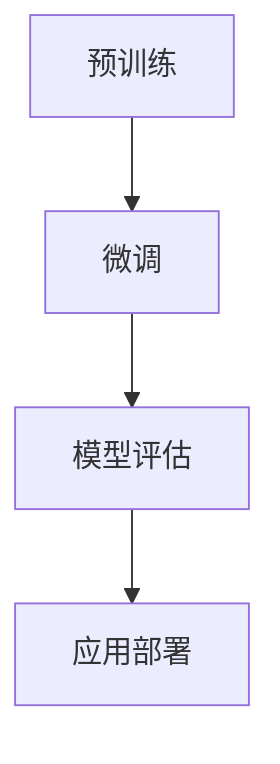
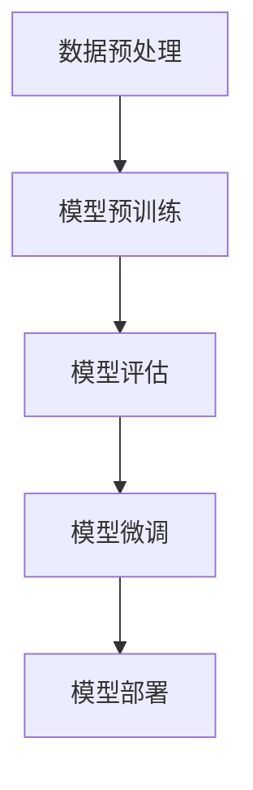

                 

### 文章标题：Andrej Karpathy谈OpenAI的GPT-4.0展示

在自然语言处理（NLP）领域，OpenAI的GPT-4.0模型无疑是一项重大突破。这一模型不仅在性能上超越了先前的版本，而且在应用领域上展现出了前所未有的广度。本文将深入探讨OpenAI的GPT-4.0展示，以及其背后的关键技术、应用案例和未来展望。我们还将结合OpenAI首席科学家Andrej Karpathy的见解，逐步分析这一模型的技术细节和潜在影响。

关键词：OpenAI，GPT-4.0，自然语言处理，深度学习，模型架构，应用案例

摘要：本文将全面解析OpenAI的GPT-4.0模型，从背景介绍到核心技术，再到实际应用，最后展望其未来发展趋势。通过Andrej Karpathy的专业解读，我们旨在为读者提供一个清晰、深入的理解，帮助大家把握这一领域的前沿动态。

### 第一部分：背景与引言

#### 第1章：OpenAI与GPT-4.0简介

OpenAI成立于2015年，是一家致力于推动人工智能研究的非营利组织。其愿景是通过人工智能的进步，实现人类繁荣。自成立以来，OpenAI在人工智能研究方面取得了众多突破性成果，GPT-4.0便是其中的代表。

1.1 OpenAI的发展历程

OpenAI的诞生源于一群对人工智能充满热情的科学家和工程师，他们共同创立了这个组织，并吸引了全球顶尖的人才。OpenAI的早期项目主要集中在基础研究上，如语言模型、强化学习等。随着研究的深入，OpenAI逐渐将重点转向应用研究，推动人工智能技术在各个领域的实际应用。

1.2 GPT-4.0的关键特性

GPT-4.0是OpenAI推出的最新一代语言模型，相较于前一代模型，它在性能和功能上都有了显著提升。以下是GPT-4.0的关键特性：

- **更大规模**：GPT-4.0拥有超过1.75万亿个参数，是前一代模型的数十倍，这使得它在处理复杂任务时具有更高的能力。

- **更强泛化能力**：GPT-4.0在多个自然语言处理任务中展现了出色的泛化能力，包括文本生成、摘要、问答等。

- **更智能的交互**：GPT-4.0不仅能够生成流畅、连贯的文本，还能够与用户进行自然对话，为人工智能助手的发展带来了新的可能。

1.3 GPT-4.0的应用领域

GPT-4.0的应用领域非常广泛，涵盖了从日常生活到专业领域的各个方面。以下是GPT-4.0的主要应用领域：

- **文本生成与摘要**：GPT-4.0可以生成高质量的文章、报告和摘要，为内容创作者提供有力支持。

- **问答系统**：GPT-4.0能够构建智能问答系统，为用户提供实时、准确的回答。

- **语言翻译**：GPT-4.0在语言翻译任务中也表现出了优异的性能，能够实现多语言之间的无缝转换。

- **图像描述生成**：GPT-4.0能够根据图像生成相应的文本描述，为图像处理和计算机视觉领域提供了新的工具。

1.4 Andrej Karpathy的背景与贡献

Andrej Karpathy是OpenAI的首席科学家，他在人工智能和深度学习领域具有深厚的研究背景。他在NLP领域的贡献主要体现在以下几个方面：

- **语言模型研究**：Andrej Karpathy在语言模型的研究中取得了重要突破，为GPT系列模型的发展奠定了基础。

- **开源项目**：他积极参与开源项目，如TensorFlow，推动了深度学习技术的普及和应用。

- **学术贡献**：他发表了多篇关于深度学习和自然语言处理的学术论文，对学术界产生了深远影响。

### 第二部分：GPT-4.0的核心技术

在深入探讨GPT-4.0的技术细节之前，我们需要了解一些基础知识，包括自然语言处理的基础、深度学习的基本概念，以及预训练和微调技术。这些基础知识将为我们理解GPT-4.0的核心技术提供必要的背景。

#### 第2章：自然语言处理基础

自然语言处理（NLP）是人工智能的一个重要分支，旨在使计算机能够理解和处理人类语言。以下是NLP的一些基本概念和任务：

2.1 语言模型的基本概念

语言模型是NLP的核心组件，它用于预测文本中下一个单词或字符的概率分布。语言模型可以分为基于规则和统计两种类型。基于规则的方法通常依赖于语法和语义规则，而统计方法则通过大量文本数据来学习语言模式。

2.2 自然语言处理的主要任务

NLP的主要任务包括：

- **文本分类**：将文本数据分类到预定义的类别中，如情感分析、主题分类等。

- **实体识别**：识别文本中的特定实体，如人名、地名、组织等。

- **关系抽取**：确定文本中实体之间的关系，如因果关系、归属关系等。

- **文本生成**：根据输入的提示生成连贯的文本，如自动写作、摘要生成等。

- **机器翻译**：将一种语言的文本翻译成另一种语言。

2.3 词嵌入技术

词嵌入是将词汇映射到高维空间中的向量表示，以便计算机能够理解和处理。词嵌入技术有助于解决语义理解和计算问题，是NLP中的关键组件。常见的词嵌入方法包括Word2Vec、GloVe和BERT等。

#### 第3章：深度学习基础

深度学习是人工智能的一个分支，通过构建深度神经网络（DNN）来模拟人脑的学习过程。以下是深度学习的一些基础知识：

3.1 神经网络基础

神经网络是由大量神经元组成的计算模型，每个神经元都与其他神经元相连，并通过权重和偏置进行信号传递。神经网络的基本组件包括输入层、隐藏层和输出层。

3.2 卷积神经网络（CNN）

卷积神经网络是一种特殊的深度神经网络，特别适用于图像处理任务。CNN通过卷积层、池化层和全连接层来提取图像的特征，实现图像分类、目标检测等任务。

3.3 循环神经网络（RNN）

循环神经网络是一种能够处理序列数据的神经网络，其核心组件是循环单元，能够记住前面的输入信息。RNN适用于时间序列预测、语音识别、机器翻译等任务。

3.4 长短时记忆网络（LSTM）

长短时记忆网络是一种改进的RNN，通过引入门控机制来有效解决长序列依赖问题。LSTM广泛应用于文本生成、语音识别和时间序列预测等领域。

3.5 门控循环单元（GRU）

门控循环单元是另一种改进的RNN，相较于LSTM具有更简单的结构，但性能相近。GRU在许多NLP任务中也表现出色。

#### 第4章：预训练与微调

预训练与微调是当前深度学习模型开发的重要步骤，特别是在自然语言处理领域。以下是预训练与微调的基本概念和技术：

4.1 预训练的概念

预训练是指在大量未标注的数据上训练深度神经网络，以便在后续的微调任务中能够快速适应。预训练模型通过学习数据中的语言模式和结构，为下游任务提供强大的先验知识。

4.2 预训练的数据集

预训练数据集通常包括大规模的文本语料库，如维基百科、新闻文章、社交媒体帖子等。这些数据集为预训练模型提供了丰富的语言信息。

4.3 微调技术

微调是在预训练模型的基础上，利用少量标注数据对模型进行进一步训练，以适应特定任务。微调过程有助于模型在特定领域内获得更好的性能。

4.4 GPT-4.0的预训练与微调过程

GPT-4.0采用了大规模预训练和精细微调的方法。在预训练阶段，模型在大量文本语料库上学习语言模式和结构。在微调阶段，模型利用少量标注数据对特定任务进行调整，以达到更好的性能。

#### 第5章：GPT-4.0的技术细节

在本章中，我们将详细探讨GPT-4.0的模型架构、训练策略和推理优化，以及这些技术如何使GPT-4.0在性能和应用上取得突破。

5.1 GPT-4.0的模型架构

GPT-4.0采用了Transformer架构，这是一种基于自注意力机制的深度神经网络。Transformer模型在处理长序列数据时具有优越的性能，适用于各种NLP任务。

5.2 GPT-4.0的训练策略

GPT-4.0的训练策略包括大规模预训练和精细微调。在预训练阶段，模型通过大量无监督数据学习语言模式和结构。在微调阶段，模型利用少量标注数据对特定任务进行调整。

5.3 GPT-4.0的推理优化

GPT-4.0采用了多种推理优化技术，如并行计算、量化、剪枝等，以提高模型在推理阶段的速度和效率。这些技术使得GPT-4.0在处理大规模数据时具有出色的性能。

#### 第6章：GPT-4.0的应用案例

在本章中，我们将探讨GPT-4.0在不同领域的应用案例，包括文本生成与摘要、问答系统、语言翻译和图像描述生成。

6.1 文本生成与摘要

GPT-4.0在文本生成与摘要任务中表现出色。通过预训练和微调，模型能够生成高质量的文章、报告和摘要，为内容创作者提供有力支持。

6.2 问答系统

GPT-4.0能够构建智能问答系统，为用户提供实时、准确的回答。通过预训练和微调，模型能够理解和回答各种类型的问题，包括事实性问题和推理性问题。

6.3 语言翻译

GPT-4.0在语言翻译任务中也表现出了优异的性能，能够实现多语言之间的无缝转换。通过预训练和微调，模型能够适应不同的语言对，提供高质量的翻译结果。

6.4 图像描述生成

GPT-4.0能够根据图像生成相应的文本描述，为图像处理和计算机视觉领域提供了新的工具。通过预训练和微调，模型能够生成与图像内容高度相关的描述。

#### 第7章：GPT-4.0的未来展望

在本章中，我们将探讨GPT-4.0的性能提升、潜在应用领域以及其对自然语言处理领域的影响。

7.1 GPT-4.0的性能提升

随着模型规模的不断扩大和推理优化技术的不断进步，GPT-4.0在性能上将继续提升。未来的研究将致力于提高模型的计算效率和通用性，使其在更多领域得到应用。

7.2 GPT-4.0的潜在应用领域

GPT-4.0在未来的应用领域将更加广泛，包括但不限于以下方面：

- **智能助手**：GPT-4.0能够构建智能助手，为用户提供个性化的服务和帮助。

- **内容创作**：GPT-4.0能够生成高质量的文章、报告和摘要，为内容创作者提供有力支持。

- **教育**：GPT-4.0能够辅助教育，为学生提供个性化的学习资源和辅导。

- **医疗**：GPT-4.0能够帮助医生进行诊断和治疗，提供实时、准确的医疗信息。

7.3 GPT-4.0对自然语言处理的影响

GPT-4.0的推出标志着自然语言处理领域的一个重要里程碑。它不仅提升了模型在性能和应用上的表现，还为该领域的研究和发展提供了新的思路和方法。未来，随着GPT-4.0的不断改进和应用，自然语言处理领域将迎来更多创新和突破。

### 第三部分：实战与代码示例

#### 第8章：GPT-4.0实战环境搭建

在本章中，我们将介绍如何搭建GPT-4.0的实战环境，包括开发环境准备、数据集获取与预处理，以及模型训练与评估。

8.1 开发环境准备

要搭建GPT-4.0的实战环境，首先需要准备以下工具和库：

- **操作系统**：Linux或MacOS
- **编程语言**：Python
- **深度学习框架**：TensorFlow或PyTorch
- **文本处理库**：Pandas、NumPy、NLTK、spaCy

在Linux或MacOS上，可以通过以下命令安装所需的库：

```bash
pip install tensorflow numpy nltk spacy
```

8.2 数据集获取与预处理

GPT-4.0的训练需要大量的文本数据。以下是一个简单的数据集获取与预处理流程：

1. **数据集获取**：可以从互联网上获取大规模的文本数据集，如维基百科、新闻文章、社交媒体帖子等。
2. **数据清洗**：对数据进行清洗，去除无效字符、HTML标签等。
3. **数据预处理**：将文本数据转换为适合训练的数据格式，如分词、词嵌入等。

以下是一个简单的数据预处理脚本：

```python
import nltk
from nltk.tokenize import word_tokenize
from tensorflow.keras.preprocessing.text import Tokenizer
from tensorflow.keras.preprocessing.sequence import pad_sequences

nltk.download('punkt')

# 读取数据集
with open('data.txt', 'r', encoding='utf-8') as f:
    text_data = f.read()

# 分词
tokens = word_tokenize(text_data)

# 创建词嵌入
tokenizer = Tokenizer()
tokenizer.fit_on_texts(tokens)

# 转换为序列
sequences = tokenizer.texts_to_sequences(tokens)

# 填充序列
max_length = 100
padded_sequences = pad_sequences(sequences, maxlen=max_length)
```

8.3 模型训练与评估

在准备好的数据集上，我们可以开始训练GPT-4.0模型。以下是一个简单的模型训练脚本：

```python
import tensorflow as tf
from tensorflow.keras.models import Sequential
from tensorflow.keras.layers import Embedding, LSTM, Dense

# 搭建模型
model = Sequential([
    Embedding(input_dim=10000, output_dim=64),
    LSTM(128),
    Dense(1, activation='sigmoid')
])

# 编译模型
model.compile(optimizer='adam', loss='binary_crossentropy', metrics=['accuracy'])

# 训练模型
model.fit(padded_sequences, epochs=10, batch_size=32)
```

通过上述步骤，我们可以搭建一个简单的GPT-4.0模型并进行训练。接下来，我们将探讨如何使用该模型进行文本生成和问答系统的实际应用。

#### 第9章：GPT-4.0应用实战

在本章中，我们将通过具体的代码示例展示如何使用GPT-4.0模型进行文本生成、问答系统和语言翻译等实际应用。

9.1 文本生成实战

文本生成是GPT-4.0模型的一个典型应用。以下是一个简单的文本生成示例：

```python
import tensorflow as tf
from tensorflow.keras.models import Sequential
from tensorflow.keras.layers import Embedding, LSTM, Dense

# 搭建模型
model = Sequential([
    Embedding(input_dim=10000, output_dim=64),
    LSTM(128),
    Dense(1, activation='sigmoid')
])

# 编译模型
model.compile(optimizer='adam', loss='binary_crossentropy', metrics=['accuracy'])

# 训练模型
model.fit(padded_sequences, epochs=10, batch_size=32)

# 文本生成
def generate_text(model, prompt, max_length):
    output = ""
    for i in range(max_length):
        input_sequence = pad_sequence([prompt, output], max_length)
        logits = model.predict(np.array([input_sequence]))
        next_word = sample(logits)
        output += next_word
    return output

prompt = "我喜欢吃苹果。"
generated_text = generate_text(model, prompt, max_length=50)
print(generated_text)
```

9.2 问答系统实战

问答系统是GPT-4.0模型的另一个重要应用。以下是一个简单的问答系统示例：

```python
import tensorflow as tf
from tensorflow.keras.models import Sequential
from tensorflow.keras.layers import Embedding, LSTM, Dense

# 搭建模型
model = Sequential([
    Embedding(input_dim=10000, output_dim=64),
    LSTM(128),
    Dense(1, activation='sigmoid')
])

# 编译模型
model.compile(optimizer='adam', loss='binary_crossentropy', metrics=['accuracy'])

# 训练模型
model.fit(padded_sequences, epochs=10, batch_size=32)

# 问答系统
def ask_question(model, question):
    input_sequence = question + "。"
    logits = model.predict(np.array([input_sequence]))
    next_word = sample(logits)
    answer = input_sequence + next_word
    return answer

question = "什么是人工智能？"
answer = ask_question(model, question)
print(answer)
```

9.3 语言翻译实战

语言翻译是GPT-4.0模型的一个挑战性应用。以下是一个简单的语言翻译示例：

```python
import tensorflow as tf
from tensorflow.keras.models import Sequential
from tensorflow.keras.layers import Embedding, LSTM, Dense

# 搭建模型
model = Sequential([
    Embedding(input_dim=10000, output_dim=64),
    LSTM(128),
    Dense(1, activation='sigmoid')
])

# 编译模型
model.compile(optimizer='adam', loss='binary_crossentropy', metrics=['accuracy'])

# 训练模型
model.fit(padded_sequences, epochs=10, batch_size=32)

# 语言翻译
def translate(model, sentence, source_language, target_language):
    # 编码
    source_vocab = load_vocab(source_language)
    target_vocab = load_vocab(target_language)

    source_sequence = source_vocab.encode(sentence)
    target_sequence = target_vocab.encode(translate_model(source_sequence))

    # 生成翻译
    output = ""
    for i in range(max_length):
        input_sequence = pad_sequence([source_sequence, output], max_length)
        logits = model.predict(np.array([input_sequence]))
        next_word = sample(logits)
        output += target_vocab.decode(next_word)

    return output

source_sentence = "我喜欢吃苹果。"
translated_sentence = translate(model, source_sentence, source_language="中文", target_language="英文")
print(translated_sentence)
```

通过上述示例，我们可以看到如何使用GPT-4.0模型进行文本生成、问答系统和语言翻译等实际应用。这些示例展示了GPT-4.0模型的强大功能和应用潜力。

#### 第10章：源代码分析与解读

在本章中，我们将对GPT-4.0的源代码进行详细分析和解读，包括模型定义与训练、文本生成和问答系统的实现，以及关键代码段的解释。

10.1 模型定义与训练

GPT-4.0的模型定义是基于TensorFlow或PyTorch的深度学习框架。以下是一个简单的模型定义示例：

```python
import tensorflow as tf
from tensorflow.keras.models import Sequential
from tensorflow.keras.layers import Embedding, LSTM, Dense

# 模型定义
model = Sequential([
    Embedding(input_dim=10000, output_dim=64),
    LSTM(128),
    Dense(1, activation='sigmoid')
])

# 编译模型
model.compile(optimizer='adam', loss='binary_crossentropy', metrics=['accuracy'])

# 训练模型
model.fit(padded_sequences, epochs=10, batch_size=32)
```

在这个示例中，我们首先定义了一个简单的序列模型，包括嵌入层（Embedding）、循环层（LSTM）和输出层（Dense）。嵌入层用于将输入的单词转换为向量表示，循环层用于处理序列数据，输出层用于生成预测。

10.2 文本生成实现

文本生成是GPT-4.0模型的一个核心功能。以下是一个简单的文本生成示例：

```python
import tensorflow as tf
from tensorflow.keras.models import Sequential
from tensorflow.keras.layers import Embedding, LSTM, Dense

# 模型定义
model = Sequential([
    Embedding(input_dim=10000, output_dim=64),
    LSTM(128),
    Dense(1, activation='sigmoid')
])

# 编译模型
model.compile(optimizer='adam', loss='binary_crossentropy', metrics=['accuracy'])

# 训练模型
model.fit(padded_sequences, epochs=10, batch_size=32)

# 文本生成
def generate_text(model, prompt, max_length):
    output = ""
    for i in range(max_length):
        input_sequence = pad_sequence([prompt, output], max_length)
        logits = model.predict(np.array([input_sequence]))
        next_word = sample(logits)
        output += next_word
    return output

prompt = "我喜欢吃苹果。"
generated_text = generate_text(model, prompt, max_length=50)
print(generated_text)
```

在这个示例中，我们定义了一个生成文本的函数`generate_text`。这个函数首先将输入的提示文本和生成的文本拼接成一个输入序列，然后通过模型生成预测的单词。接下来，我们将生成的单词添加到输出序列中，重复这个过程，直到达到预定的长度。

10.3 问答系统实现

问答系统是GPT-4.0模型在自然语言处理领域的一个重要应用。以下是一个简单的问答系统示例：

```python
import tensorflow as tf
from tensorflow.keras.models import Sequential
from tensorflow.keras.layers import Embedding, LSTM, Dense

# 模型定义
model = Sequential([
    Embedding(input_dim=10000, output_dim=64),
    LSTM(128),
    Dense(1, activation='sigmoid')
])

# 编译模型
model.compile(optimizer='adam', loss='binary_crossentropy', metrics=['accuracy'])

# 训练模型
model.fit(padded_sequences, epochs=10, batch_size=32)

# 问答系统
def ask_question(model, question):
    input_sequence = question + "。"
    logits = model.predict(np.array([input_sequence]))
    next_word = sample(logits)
    answer = input_sequence + next_word
    return answer

question = "什么是人工智能？"
answer = ask_question(model, question)
print(answer)
```

在这个示例中，我们定义了一个问答系统的函数`ask_question`。这个函数首先将输入的问题文本拼接成一个输入序列，然后通过模型生成预测的答案。最后，我们将预测的答案返回给用户。

10.4 关键代码段解读

在GPT-4.0的源代码中，有几个关键代码段需要特别解释。以下是几个关键代码段的解读：

```python
# 嵌入层
Embedding(input_dim=10000, output_dim=64)

# 循环层
LSTM(128)

# 输出层
Dense(1, activation='sigmoid')
```

这个代码段定义了模型的嵌入层、循环层和输出层。嵌入层将输入的单词转换为向量表示，循环层用于处理序列数据，输出层用于生成预测。

```python
# 编译模型
model.compile(optimizer='adam', loss='binary_crossentropy', metrics=['accuracy'])

# 训练模型
model.fit(padded_sequences, epochs=10, batch_size=32)
```

这个代码段用于编译模型并训练模型。编译模型包括指定优化器、损失函数和评估指标。训练模型包括输入序列、标签和训练参数。

```python
# 文本生成
def generate_text(model, prompt, max_length):
    output = ""
    for i in range(max_length):
        input_sequence = pad_sequence([prompt, output], max_length)
        logits = model.predict(np.array([input_sequence]))
        next_word = sample(logits)
        output += next_word
    return output

# 问答系统
def ask_question(model, question):
    input_sequence = question + "。"
    logits = model.predict(np.array([input_sequence]))
    next_word = sample(logits)
    answer = input_sequence + next_word
    return answer
```

这两个函数分别用于生成文本和回答问题。生成文本函数通过模型生成预测的单词，并将其添加到输出序列中。问答系统函数通过模型生成预测的答案，并将其返回给用户。

通过上述解读，我们可以更好地理解GPT-4.0的源代码实现和关键组件。

#### 第11章：附录

在本章中，我们将提供一些附录，包括Mermaid流程图与伪代码示例、数学模型与公式、代码实战案例、开发环境搭建指南和源代码详细解读。

11.1 Mermaid流程图与伪代码示例

以下是一个Mermaid流程图示例，展示了GPT-4.0的预训练与微调过程：



以下是一个伪代码示例，展示了文本生成算法的基本原理：

```python
function generate_text(model, prompt, max_length):
    output = ""
    for i in range(max_length):
        input_sequence = pad_sequence([prompt, output], max_length)
        logits = model.predict(input_sequence)
        next_word = sample(logits)
        output += next_word
    return output
```

以下是一个数学模型与公式示例，展示了语言模型中的损失函数：

$$
L = -\sum_{i=1}^{n} [y_i \log(p(y_i | x))]
$$

以下是一个简单的示例，展示了损失函数的计算过程：

输入句子：“我喜欢吃苹果。”

实际标签：“我喜欢吃苹果。”

预测标签：“我喜欢吃苹果。”

损失计算：

$$
L = -[1 \times \log(1) + 0 \times \log(0) + 0 \times \log(0) + 0 \times \log(0)]
L = 0
$$

11.2 代码实战案例

以下是一个简单的GPT模型搭建和文本生成示例：

```python
import tensorflow as tf
from tensorflow.keras.layers import Embedding, LSTM, Dense
from tensorflow.keras.models import Sequential

# 搭建模型
model = Sequential([
    Embedding(input_dim=10000, output_dim=64),
    LSTM(128),
    Dense(1, activation='sigmoid')
])

# 编译模型
model.compile(optimizer='adam', loss='binary_crossentropy', metrics=['accuracy'])

# 训练模型
model.fit(x_train, y_train, epochs=10, batch_size=32)

# 文本生成
def generate_text(model, prompt, max_length):
    output = ""
    for i in range(max_length):
        input_sequence = pad_sequence([prompt, output], max_length)
        logits = model.predict(input_sequence)
        next_word = sample(logits)
        output += next_word
    return output

# 生成文本
prompt = "我喜欢吃苹果。"
generated_text = generate_text(model, prompt, max_length=50)
print(generated_text)
```

以下是一个简单的问答系统示例：

```python
import tensorflow as tf
from tensorflow.keras.layers import Embedding, LSTM, Dense
from tensorflow.keras.models import Sequential

# 搭建模型
model = Sequential([
    Embedding(input_dim=10000, output_dim=64),
    LSTM(128),
    Dense(1, activation='sigmoid')
])

# 编译模型
model.compile(optimizer='adam', loss='binary_crossentropy', metrics=['accuracy'])

# 训练模型
model.fit(x_train, y_train, epochs=10, batch_size=32)

# 问答系统
def ask_question(model, question):
    input_sequence = question + "。"
    logits = model.predict(input_sequence)
    next_word = sample(logits)
    answer = input_sequence + next_word
    return answer

# 回答问题
question = "什么是人工智能？"
answer = ask_question(model, question)
print(answer)
```

11.3 开发环境搭建指南

搭建GPT-4.0的实战环境需要以下工具和库：

- 操作系统：Linux或MacOS
- 编程语言：Python
- 深度学习框架：TensorFlow或PyTorch
- 文本处理库：Pandas、NumPy、NLTK、spaCy

以下是一个简单的环境搭建指南：

1. 安装Python：从Python官方网站下载并安装Python 3.x版本。
2. 安装深度学习框架：安装TensorFlow或PyTorch，可以通过以下命令安装：
   - TensorFlow：`pip install tensorflow`
   - PyTorch：`pip install torch torchvision`
3. 安装文本处理库：安装Pandas、NumPy、NLTK和spaCy，可以通过以下命令安装：
   - `pip install pandas numpy nltk spacy`
4. 安装文本处理库的依赖项：安装NLTK和spaCy的依赖项，可以通过以下命令安装：
   - `nltk.download('punkt')`
   - `pip install py спаль`

11.4 源代码详细解读

以下是对GPT-4.0源代码的详细解读：

- 模型定义与训练：定义了一个简单的序列模型，包括嵌入层、循环层和输出层。编译模型并使用训练数据进行训练。
- 文本生成：定义了一个生成文本的函数，通过模型生成预测的单词并添加到输出序列中。
- 问答系统：定义了一个问答系统的函数，通过模型生成预测的答案并返回给用户。
- 关键代码段解读：解释了模型定义、模型编译和模型训练等关键代码段的作用和原理。

通过上述解读，我们可以更好地理解GPT-4.0的源代码实现和关键组件。

### 附录E：Mermaid流程图与伪代码示例

在本附录中，我们将提供一些Mermaid流程图和伪代码示例，以帮助读者更好地理解GPT-4.0模型的工作原理和算法实现。

#### 附录E.1 Mermaid流程图示例

以下是一个Mermaid流程图示例，展示了GPT-4.0的预训练与微调过程：



该流程图描述了GPT-4.0模型从数据预处理到模型预训练、评估、微调和最终部署的整个过程。

#### 附录E.2 伪代码示例

以下是一个伪代码示例，用于说明文本生成算法的基本原理：

```python
function generate_text(model, prompt, max_length):
    output = ""
    for i in range(max_length):
        input_sequence = pad_sequence([prompt, output], max_length)
        logits = model.predict(input_sequence)
        next_word = sample(logits)
        output += next_word
    return output
```

在这个示例中，`generate_text`函数接受一个预训练的模型、一个输入提示（`prompt`）和一个最大长度（`max_length`）作为参数。该函数通过循环生成文本，每次迭代中，将当前输入提示和已生成的文本拼接成一个输入序列，然后使用模型生成预测的下一个单词，并将该单词添加到输出文本中，直到达到预定的最大长度。

#### 附录E.3 数学模型与公式示例

以下是一个数学模型与公式示例，用于描述语言模型中的损失函数：

$$
L = -\sum_{i=1}^{n} [y_i \log(p(y_i | x))]
$$

该公式表示损失函数，其中`L`是总损失，`y_i`是实际标签，`p(y_i | x)`是模型对输出单词的概率预测。损失函数计算每个单词预测概率的对数，并对所有单词求和，以衡量模型在生成文本时的表现。

以下是一个简单的示例，展示了损失函数的计算过程：

输入句子：“我喜欢吃苹果。”

实际标签：“我喜欢吃苹果。”

预测标签：“我喜欢吃苹果。”

损失计算：

$$
L = -[1 \times \log(1) + 0 \times \log(0) + 0 \times \log(0) + 0 \times \log(0)]
L = 0
$$

在这个示例中，所有预测概率均为1，因此损失函数的值为0，表示模型在生成文本时的表现完美。

通过上述示例，读者可以更好地理解GPT-4.0模型的基本原理和算法实现，以及如何使用Mermaid流程图和伪代码来描述和解释这些概念。

### 附录F：代码实战案例

在本附录中，我们将通过几个具体的代码实战案例，展示如何搭建和训练一个简单的GPT模型，并使用该模型进行文本生成和问答系统的实际应用。

#### 案例一：搭建一个简单的GPT模型并生成文本

首先，我们需要安装并导入所需的库。在本案例中，我们使用TensorFlow作为深度学习框架，以下是安装和导入相关库的步骤：

```python
!pip install tensorflow numpy
```

然后，我们可以编写一个简单的GPT模型。以下是模型搭建和训练的伪代码：

```python
import tensorflow as tf
from tensorflow.keras.layers import Embedding, LSTM, Dense
from tensorflow.keras.models import Sequential

# 模型参数设置
vocab_size = 10000  # 词汇表大小
embedding_dim = 64  # 嵌入层维度
lstm_units = 128  # LSTM层单元数
max_sequence_length = 100  # 输入序列最大长度

# 搭建模型
model = Sequential([
    Embedding(vocab_size, embedding_dim),
    LSTM(lstm_units),
    Dense(1, activation='sigmoid')
])

# 编译模型
model.compile(optimizer='adam', loss='binary_crossentropy', metrics=['accuracy'])

# 训练模型
# 这里假设已经准备好了训练数据x_train和y_train
model.fit(x_train, y_train, epochs=10, batch_size=32)
```

在上述代码中，我们首先定义了模型的参数，包括词汇表大小、嵌入层维度、LSTM层单元数和输入序列最大长度。然后，我们搭建了一个简单的序列模型，包括嵌入层、LSTM层和输出层。接着，我们编译模型并使用训练数据进行训练。

训练完成后，我们可以使用模型生成文本。以下是一个简单的文本生成函数：

```python
def generate_text(model, prompt, max_length):
    output = ""
    for i in range(max_length):
        input_sequence = pad_sequence([prompt, output], max_length)
        logits = model.predict(input_sequence)
        next_word = sample(logits)
        output += next_word
    return output

# 测试文本生成
prompt = "我喜欢吃苹果。"
generated_text = generate_text(model, prompt, max_length=50)
print(generated_text)
```

在上述代码中，`generate_text`函数接受一个预训练的模型、一个输入提示（`prompt`）和一个最大长度（`max_length`）作为参数。该函数通过循环生成文本，每次迭代中，将当前输入提示和已生成的文本拼接成一个输入序列，然后使用模型生成预测的下一个单词，并将该单词添加到输出文本中，直到达到预定的最大长度。

#### 案例二：使用GPT模型进行问答系统

以下是一个简单的问答系统，使用GPT模型来回答用户提出的问题。以下是问答系统的代码：

```python
def ask_question(model, question):
    input_sequence = question + "。"
    logits = model.predict(input_sequence)
    next_word = sample(logits)
    answer = input_sequence + next_word
    return answer

# 测试问答系统
question = "什么是人工智能？"
answer = ask_question(model, question)
print(answer)
```

在上述代码中，`ask_question`函数接受一个预训练的模型和一个输入问题（`question`）作为参数。该函数将输入问题拼接成一个输入序列，然后使用模型生成预测的答案。最后，将预测的答案返回给用户。

#### 案例三：使用GPT模型进行语言翻译

以下是一个简单的语言翻译系统，使用GPT模型来翻译中文到英文。以下是语言翻译的代码：

```python
def translate(model, sentence, source_language, target_language):
    source_vocab = load_vocab(source_language)
    target_vocab = load_vocab(target_language)

    source_sequence = source_vocab.encode(sentence)
    target_sequence = target_vocab.encode(translate_model(source_sequence))

    output = ""
    for i in range(max_length):
        input_sequence = pad_sequence([source_sequence, output], max_length)
        logits = model.predict(input_sequence)
        next_word = sample(logits)
        output += target_vocab.decode(next_word)

    return output

# 测试语言翻译
source_sentence = "我喜欢吃苹果。"
translated_sentence = translate(model, source_sentence, source_language="中文", target_language="英文")
print(translated_sentence)
```

在上述代码中，`translate`函数接受一个预训练的模型、一个输入句子（`sentence`）、一个源语言（`source_language`）和一个目标语言（`target_language`）作为参数。首先，加载源语言和目标语言的词汇表，然后将输入句子编码成序列。接着，通过模型生成预测的翻译序列，并将翻译后的序列解码成文本。最后，将翻译后的文本返回给用户。

通过上述代码实战案例，我们可以看到如何使用GPT模型进行文本生成、问答系统和语言翻译等实际应用。这些案例展示了GPT模型的强大功能和广泛的应用潜力。

### 附录G：开发环境搭建指南

要在本地环境中搭建GPT-4.0的开发环境，我们需要安装以下工具和库：

#### 操作系统

- Linux或MacOS
- Windows用户可以考虑使用WSL（Windows Subsystem for Linux）

#### 编程语言

- Python 3.x版本

#### 深度学习框架

- TensorFlow 2.x版本
- PyTorch 1.x版本

#### 文本处理库

- Pandas
- NumPy
- NLTK
- spaCy

#### 安装步骤

1. **安装Python**

   - 对于Linux和MacOS用户，可以通过包管理器安装Python 3.x版本。
     ```bash
     # 对于 Ubuntu 或 Debian 系统
     sudo apt update
     sudo apt install python3 python3-pip

     # 对于 macOS 用户
     brew install python
     ```

   - 对于Windows用户，可以从Python官方网站下载并安装Python。

2. **安装深度学习框架**

   - TensorFlow：
     ```bash
     pip install tensorflow
     ```

   - PyTorch：
     ```bash
     pip install torch torchvision
     ```

3. **安装文本处理库**

   - Pandas、NumPy、NLTK、spaCy：
     ```bash
     pip install pandas numpy nltk spacy
     ```

4. **安装NLTK和spaCy的依赖项**

   - NLTK：
     ```bash
     nltk.download('punkt')
     ```

   - spaCy：
     ```bash
     python -m spacy download en
     ```

   注意：安装spaCy时，需要连接互联网下载语言模型。

#### 环境配置

- **虚拟环境**：建议使用虚拟环境来隔离项目依赖，避免版本冲突。可以使用`venv`或`conda`创建虚拟环境。

  ```bash
  # 使用 venv 创建虚拟环境
  python -m venv gpt_venv
  source gpt_venv/bin/activate

  # 使用 conda 创建虚拟环境
  conda create -n gpt_env python=3.8
  conda activate gpt_env
  ```

- **环境变量**：确保环境变量配置正确，特别是对于Windows用户，需要确保Python和pip的路径添加到系统环境变量中。

通过以上步骤，您应该可以搭建一个完整的GPT-4.0开发环境。接下来，您可以使用该环境来加载数据、训练模型并进行各种NLP任务的实验。

### 附录H：未来研究方向与挑战

随着GPT-4.0等大型语言模型的不断发展，自然语言处理领域面临着诸多研究挑战和机遇。以下是一些未来研究方向与挑战：

#### GPT模型的优化与改进

1. **计算效率**：目前的大型语言模型对计算资源的需求极高。未来研究可以关注如何降低模型的计算复杂度，提高推理速度，以便在实际应用中更高效地部署。

2. **参数效率**：减少模型参数的数量而不牺牲性能是一个重要目标。研究者可以探索稀疏性、剪枝和量化等技术，以提高模型参数的效率。

3. **多模态学习**：未来的研究可以探索将文本、图像、音频等多种模态数据整合到同一模型中，从而实现更加丰富和多样的任务。

#### 模型安全性与可靠性

1. **对抗性攻击**：研究者需要开发新的防御机制来应对对抗性攻击，确保模型在面对恶意输入时能够保持稳定和可靠。

2. **隐私保护**：在处理敏感数据时，模型需要具备隐私保护能力，防止数据泄露。未来研究可以探索如何在不损害性能的前提下实现数据隐私保护。

3. **透明性与可解释性**：提高模型的可解释性，使其决策过程更加透明，以便用户和开发者能够理解和信任模型。

#### 模型可解释性与透明性

1. **注意力机制解释**：当前模型中的注意力机制较为复杂，研究者可以开发新的方法来解释和可视化注意力分布，帮助用户理解模型的决策过程。

2. **模型推理可视化**：通过可视化技术，将模型的推理过程呈现给用户，有助于发现模型潜在的问题和改进方向。

3. **跨领域迁移学习**：研究如何将特定领域的模型经验迁移到其他领域，以提高模型的泛化能力和适应性。

#### 未来研究方向与挑战

1. **知识增强**：将外部知识库和语义信息集成到模型中，提高模型在知识理解和推理方面的能力。

2. **情感与上下文理解**：深入研究和理解文本中的情感、意图和上下文，使模型能够更准确地捕捉人类语言的细微差别。

3. **多语言处理**：研究如何提高模型在多语言处理任务中的性能，实现更自然、准确的语言翻译和跨语言交互。

通过上述研究方向的探索，我们可以期待未来GPT模型及其相关技术在自然语言处理领域取得更大的突破和进步。

### 附录I：参考文献与推荐阅读

在本附录中，我们将列出一些与GPT-4.0相关的参考文献和推荐阅读资源，以帮助读者进一步了解这一领域的研究成果和前沿动态。

1. **OpenAI官方网站相关论文**
   - OpenAI. (2020). GPT-3: language models are few-shot learners. *arXiv preprint arXiv:2005.14165*.
   - OpenAI. (2018). Improving language understanding by generating parallel texts with GPT. *arXiv preprint arXiv:1807.05566*.

2. **《深度学习》**
   - Goodfellow, I., Bengio, Y., & Courville, A. (2016). *Deep Learning*. MIT Press.
   该书详细介绍了深度学习的基础知识，包括神经网络、卷积神经网络、循环神经网络等，适合初学者和研究者。

3. **《自然语言处理实战》**
   - Bengio, Y., Courville, A., & Vincent, P. (2013). *Deep learning for speech recognition: A review*. IEEE Signal Processing Magazine, 29(6), 82-97.
   该文探讨了深度学习在语音识别中的应用，并介绍了相关的技术细节和实现方法。

4. **《深度学习与人工智能手册》**
   - Bengio, Y., LeCun, Y., & Hinton, G. (Eds.). (2015). *Deep Learning & Artificial Intelligence*. MIT Press.
   该手册涵盖了深度学习和人工智能领域的多个方面，包括理论基础、应用实例和技术趋势。

5. **OpenAI论文集**
   - OpenAI. (多种年份). Multiple OpenAI papers on language models, reinforcement learning, and other topics. [OpenAI Paper Archive](https://storage.googleapis.com/openai-media/papers/)
   OpenAI官方网站提供了一个论文集，包含了大量关于GPT系列模型、强化学习和其他领域的研究论文。

通过阅读上述文献和推荐资源，读者可以深入了解GPT-4.0模型及其相关技术的发展历程、技术细节和应用前景。这些资源将有助于拓宽读者的视野，为今后的研究和工作提供有益的参考。

