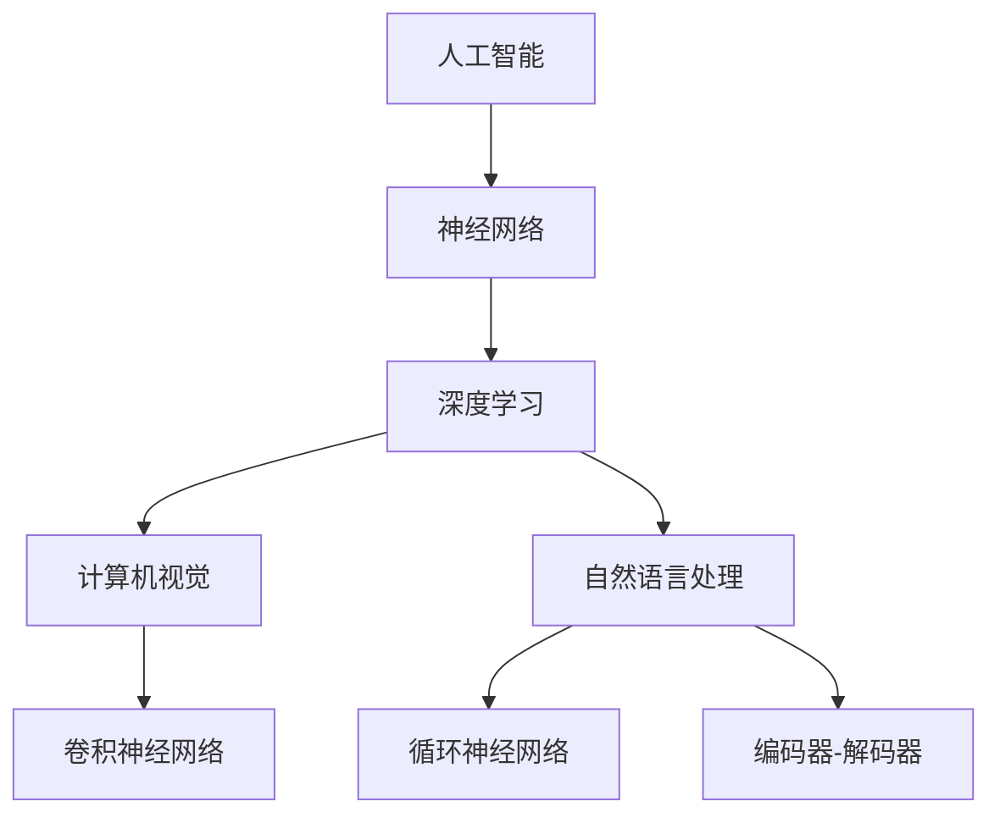
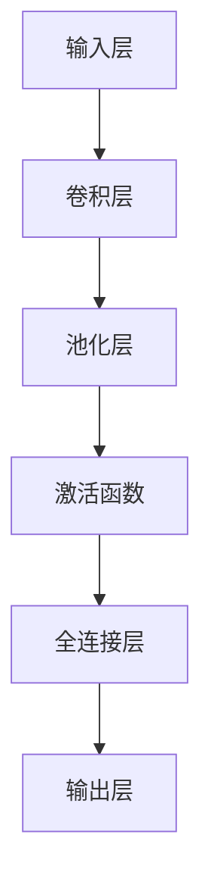

                 

# 文章标题：Andrej Karpathy：人工智能的未来发展前景

> 关键词：人工智能、未来、发展、前景、深度学习、神经网络、计算机视觉、自然语言处理、伦理、社会影响

> 摘要：本文深入探讨了人工智能领域的杰出人物Andrej Karpathy的观点和研究成果，对其著作《Andrej Karpathy：人工智能的未来发展前景》进行了详细解析。文章首先介绍了人工智能的历史背景和当前挑战与机遇，接着从核心概念、架构、核心技术原理、应用案例和未来展望五个部分，逐步分析了人工智能的技术原理和实际应用，并对人工智能的伦理和社会影响进行了深入探讨。最后，本文提出了人工智能未来的发展方向和可能面临的挑战，为读者提供了全面、深刻的见解。

## 《Andrej Karpathy：人工智能的未来发展前景》目录大纲

### 第一部分：引言与背景

#### 第1章：作者与书籍简介
- **1.1** Andrej Karpathy的背景与成就
- **1.2** 人工智能发展的历史回顾
- **1.3** 书籍的目标与读者群体
- **1.4** 人工智能的当前挑战与机遇

### 第二部分：核心概念与架构

#### 第2章：人工智能的核心概念
- **2.1** 人工智能的定义与分类
- **2.2** 神经网络与深度学习
  - **2.2.1** 神经网络的基本原理
  - **2.2.2** 深度学习的进展与趋势
- **2.3** 计算机视觉与自然语言处理
  - **2.3.1** 计算机视觉的技术与应用
  - **2.3.2** 自然语言处理的基本概念
- **2.4** 人工智能的伦理与社会影响
  - **2.4.1** 人工智能伦理问题
  - **2.4.2** 人工智能对社会的影响

#### 第3章：人工智能的架构
- **3.1** 神经网络的架构设计
  - **3.1.1** 神经网络的层与神经元
  - **3.1.2** 常见的神经网络架构
- **3.2** 机器学习的算法框架
  - **3.2.1** 监督学习与无监督学习
  - **3.2.2** 强化学习与深度强化学习
- **3.3** 大规模数据处理与分布式计算
  - **3.3.1** 大规模数据处理技术
  - **3.3.2** 分布式计算框架与工具

### 第三部分：核心技术原理

#### 第4章：深度学习算法原理
- **4.1** 神经网络的训练过程
  - **4.1.1** 前向传播与反向传播
  - **4.1.2** 梯度下降与优化算法
- **4.2** 卷积神经网络（CNN）原理
  - **4.2.1** 卷积操作与池化操作
  - **4.2.2** CNN在图像识别中的应用
- **4.3** 循环神经网络（RNN）与长短期记忆（LSTM）原理
  - **4.3.1** RNN的基本结构
  - **4.3.2** LSTM的原理与优势
- **4.4** 生成对抗网络（GAN）原理
  - **4.4.1** GAN的构成与工作原理
  - **4.4.2** GAN的应用案例

#### 第5章：自然语言处理技术
- **5.1** 语言模型与词向量
  - **5.1.1** 语言模型的基本概念
  - **5.1.2** 词向量的表示方法
- **5.2** 序列模型与注意力机制
  - **5.2.1** RNN在序列数据处理中的应用
  - **5.2.2** 注意力机制的解释与实现
- **5.3** 编码器-解码器架构
  - **5.3.1** 编码器-解码器的基本原理
  - **5.3.2** 编码器-解码器在机器翻译中的应用

### 第四部分：应用案例与未来展望

#### 第6章：人工智能应用案例
- **6.1** 人工智能在医疗健康领域的应用
  - **6.1.1** 医学影像分析
  - **6.1.2** 疾病预测与诊断
- **6.2** 人工智能在金融领域的应用
  - **6.2.1** 金融市场预测
  - **6.2.2** 信用风险评估
- **6.3** 人工智能在交通领域的应用
  - **6.3.1** 智能交通系统
  - **6.3.2** 自动驾驶技术

#### 第7章：人工智能的未来发展前景
- **7.1** 人工智能技术的发展趋势
  - **7.1.1** 大模型与云计算的结合
  - **7.1.2** 量子计算与人工智能
- **7.2** 人工智能的伦理与社会挑战
  - **7.2.1** 人工智能的伦理问题
  - **7.2.2** 人工智能对社会的影响与对策
- **7.3** 人工智能的未来应用领域
  - **7.3.1** 人工智能在教育与就业的影响
  - **7.3.2** 人工智能在环境与能源的应用

### 附录

#### 附录A：人工智能学习资源推荐
- **A.1** 主流深度学习框架与工具
- **A.2** 人工智能学习网站与平台
- **A.3** 人工智能相关的书籍与论文推荐

#### 附录B：人工智能常见问题解答
- **B.1** 人工智能基础知识
- **B.2** 深度学习技术
- **B.3** 自然语言处理技术
- **B.4** 人工智能应用场景

---

**图 1-1：人工智能的核心概念与架构联系**


---

**图 3-1：卷积神经网络的基本结构**


---

**图 4-1：卷积操作的伪代码**
```python
# 初始化卷积核 W，偏置 b
for each filter in W:
    W = initialize(W, size = (kernel_size, input_channel, output_channel))
    b = initialize(b, size = output_channel)

# 前向传播
for each input in X:
    # 计算卷积结果
    Z = conv2d(input, W, b)
    # 应用激活函数
    A = activation_function(Z)

# 反向传播
# 计算梯度
dZ = d激活函数(Z)
dW = d卷积2d(input, dZ)
db = dZ

# 更新权重和偏置
W -= learning_rate * dW
b -= learning_rate * db
```

---

**数学公式：梯度下降的优化目标**
$$
\min_{\theta} \frac{1}{2} \sum_{i=1}^{m} (h_\theta(x^{(i)}) - y^{(i)})^2
$$

---

**代码示例：使用TensorFlow实现一个简单的卷积神经网络**
```python
import tensorflow as tf

# 初始化模型参数
W = tf.Variable(tf.random.normal([784, 10]), name='weights')
b = tf.Variable(tf.zeros([10]), name='biases')

# 前向传播
x = tf.placeholder(tf.float32, [None, 784])
y = tf.placeholder(tf.float32, [None, 10])
z = tf.add(tf.matmul(x, W), b)
y_pred = tf.nn.softmax(z)

# 计算损失函数
cross_entropy = tf.reduce_mean(-tf.reduce_sum(y * tf.log(y_pred), reduction_indices=1))

# 反向传播
with tf.GradientTape() as tape:
    z = tf.add(tf.matmul(x, W), b)
    y_pred = tf.nn.softmax(z)
    cross_entropy = tf.reduce_mean(-tf.reduce_sum(y * tf.log(y_pred), reduction_indices=1))

gradients = tape.gradient(cross_entropy, [W, b])

# 更新模型参数
W.assign_sub(learning_rate * gradients[0])
b.assign_sub(learning_rate * gradients[1])
```

---

**项目实战：使用TensorFlow实现一个手写数字识别应用**
```python
# 导入所需的库
import tensorflow as tf
from tensorflow.keras import layers
from tensorflow.keras.datasets import mnist
from tensorflow.keras.models import Sequential
from tensorflow.keras.layers import Dense, Flatten, Conv2D, MaxPooling2D, Dropout
import numpy as np

# 加载MNIST数据集
(x_train, y_train), (x_test, y_test) = mnist.load_data()

# 数据预处理
x_train = x_train / 255.0
x_test = x_test / 255.0
x_train = np.expand_dims(x_train, -1)
x_test = np.expand_dims(x_test, -1)
y_train = tf.keras.utils.to_categorical(y_train, num_classes=10)
y_test = tf.keras.utils.to_categorical(y_test, num_classes=10)

# 创建模型
model = Sequential([
    Conv2D(32, (3, 3), activation='relu', input_shape=(28, 28, 1)),
    MaxPooling2D((2, 2)),
    Flatten(),
    Dense(128, activation='relu'),
    Dropout(0.5),
    Dense(10, activation='softmax')
])

# 编译模型
model.compile(optimizer='adam',
              loss='categorical_crossentropy',
              metrics=['accuracy'])

# 训练模型
model.fit(x_train, y_train, batch_size=64, epochs=10, validation_split=0.2)

# 评估模型
test_loss, test_acc = model.evaluate(x_test, y_test)
print('Test accuracy:', test_acc)
```

---

**代码解读与分析**
1. **数据预处理**：将MNIST数据集中的图像从0到255的像素值缩放到0到1之间，并将图像的维度扩展到（样本数，28，28，1）。
2. **创建模型**：使用Sequential模型堆叠多个层，包括卷积层、最大池化层、全连接层和Dropout层。
3. **编译模型**：设置模型的优化器为Adam，损失函数为categorical_crossentropy，并选择accuracy作为评估指标。
4. **训练模型**：使用fit函数训练模型，设置batch_size为64，训练10个epoch，并使用validation_split保留20%的数据用于验证。
5. **评估模型**：使用evaluate函数评估模型在测试集上的表现，并打印出测试准确性。

---

**附录A：人工智能学习资源推荐**
- **A.1 主流深度学习框架与工具**
  - TensorFlow
  - PyTorch
  - Keras
  - Theano
- **A.2 人工智能学习网站与平台**
  - Coursera
  - edX
  - Udacity
  - Fast.ai
- **A.3 人工智能相关的书籍与论文推荐**
  - 《深度学习》（Ian Goodfellow, Yoshua Bengio, Aaron Courville）
  - 《Python深度学习》（François Chollet）
  - 《强化学习》（Richard S. Sutton & Andrew G. Barto）
  - 《机器学习年度回顾》（JMLR）
  - 《自然语言处理年度回顾》（ACL）

### 第一部分：引言与背景

#### 第1章：作者与书籍简介

**1.1 Andrej Karpathy的背景与成就**

Andrej Karpathy是一位世界著名的人工智能科学家和深度学习研究者。他出生于1984年，在斯坦福大学获得了计算机科学博士学位。在博士期间，他的研究方向主要集中在深度学习和自然语言处理领域，并在这些领域取得了显著的成果。

Andrej Karpathy在深度学习领域的贡献不可忽视。他提出了多个重要的深度学习模型和算法，如卷积神经网络（CNN）在图像识别中的应用、循环神经网络（RNN）在自然语言处理中的应用等。他还参与了多个知名的人工智能项目，如OpenAI的GPT系列模型，为人工智能技术的发展做出了巨大贡献。

在学术界，Andrej Karpathy发表了多篇具有影响力的论文，并在多个国际顶级会议上发表了演讲。他的研究成果在学术界和工业界都产生了深远的影响。此外，他还在多个知名的科技公司担任顾问或研究员，如Facebook、Google等。

**1.2 人工智能发展的历史回顾**

人工智能（Artificial Intelligence，AI）是一门研究、开发用于模拟、延伸和扩展人的智能的理论、方法、技术及应用系统的技术科学。人工智能的概念最早可以追溯到20世纪50年代，当时计算机科学刚刚兴起，人们开始探讨如何使计算机具备人类的智能。

在早期，人工智能研究主要集中在符号主义和逻辑推理上，试图通过编写程序来模拟人类思维过程。然而，这种方法在实践中受到了限制，无法处理复杂的问题。

20世纪80年代，随着计算机性能的提升和新的算法的提出，人工智能研究进入了新的阶段。特别是神经网络和深度学习技术的发展，使得计算机在图像识别、语音识别、自然语言处理等领域取得了突破性的进展。

**1.3 书籍的目标与读者群体**

《Andrej Karpathy：人工智能的未来发展前景》旨在为广大读者提供全面、深入的关于人工智能发展的见解。这本书不仅涵盖了人工智能的核心概念、架构、核心技术原理，还探讨了人工智能在实际应用中的案例和未来展望。

本书的目标读者包括对人工智能感兴趣的科研人员、工程师、学生，以及对人工智能技术有深入了解的从业人员。通过阅读本书，读者可以了解到人工智能的发展历程、核心技术原理，以及未来的发展方向。

**1.4 人工智能的当前挑战与机遇**

尽管人工智能在许多领域取得了显著的成果，但仍然面临着一系列的挑战。以下是人工智能当前的一些挑战与机遇：

1. **技术挑战**：人工智能技术仍然存在许多限制，如数据依赖、可解释性、安全性和隐私保护等。为了解决这些问题，研究人员需要不断创新和探索新的方法。

2. **应用挑战**：人工智能技术在许多领域的应用仍然面临挑战，如医疗健康、金融、交通等。这些领域对人工智能技术的要求越来越高，需要开发出更加成熟和稳定的技术。

3. **伦理挑战**：人工智能技术的发展引发了一系列伦理问题，如算法偏见、隐私保护、责任归属等。如何确保人工智能技术的公平、公正和可持续发展，是当前迫切需要解决的问题。

4. **机遇**：人工智能技术的发展为人类带来了许多机遇，如智能自动化、智能医疗、智能交通等。这些应用有望提高人们的生活质量，推动社会的发展。

### 第二部分：核心概念与架构

#### 第2章：人工智能的核心概念

**2.1 人工智能的定义与分类**

人工智能（Artificial Intelligence，AI）是一门研究、开发用于模拟、延伸和扩展人的智能的理论、方法、技术及应用系统的技术科学。人工智能的目标是使计算机具备类似人类的智能，能够进行感知、理解、学习、推理、决策等。

根据人工智能的实现方式和能力，可以将人工智能分为以下几类：

1. **弱人工智能（Narrow AI）**：弱人工智能也称为窄人工智能，指的是在特定任务上表现出高于人类智能水平的系统。例如，语音识别、图像识别、自然语言处理等。这类人工智能具有局限性，无法跨领域应用。

2. **强人工智能（General AI）**：强人工智能也称为通用人工智能，指的是具有人类水平智能的系统，能够应对各种复杂任务，具备自我学习和适应能力。目前，强人工智能还处于理论研究阶段，尚未实现。

3. **超级智能（Super Intelligence）**：超级智能指的是超越人类智能的智能体，具有无限的智慧和创造力。超级智能目前仍是一个科幻概念，尚未得到证实。

**2.2 神经网络与深度学习**

神经网络（Neural Network，NN）是人工智能的核心技术之一，模拟了人类大脑的神经网络结构和工作原理。神经网络由大量的神经元（节点）组成，通过连接这些神经元，实现信息的传递和处理。

神经网络可以分为以下几类：

1. **前馈神经网络（Feedforward Neural Network）**：前馈神经网络是最常见的神经网络结构，信息从输入层传递到输出层，不形成回路。前馈神经网络适用于分类和回归等问题。

2. **循环神经网络（Recurrent Neural Network，RNN）**：循环神经网络具有反馈结构，信息可以在神经网络中循环传递，适用于处理序列数据，如语音识别、自然语言处理等。

3. **卷积神经网络（Convolutional Neural Network，CNN）**：卷积神经网络是专门用于图像识别和处理的神经网络结构，通过卷积操作提取图像特征，具有出色的图像识别能力。

深度学习（Deep Learning，DL）是神经网络的一种扩展，通过多层神经网络实现更加复杂的模型。深度学习在图像识别、自然语言处理、语音识别等领域取得了显著成果。

**2.3 计算机视觉与自然语言处理**

计算机视觉（Computer Vision，CV）是人工智能的一个重要分支，旨在使计算机能够像人类一样感知和理解视觉信息。计算机视觉的应用包括图像识别、目标检测、人脸识别、图像分割等。

自然语言处理（Natural Language Processing，NLP）是人工智能的另一个重要分支，旨在使计算机能够理解和处理人类语言。自然语言处理的应用包括机器翻译、情感分析、文本生成、对话系统等。

**2.4 人工智能的伦理与社会影响**

随着人工智能技术的不断发展，其伦理和社会影响也越来越受到关注。以下是人工智能的一些伦理和社会影响：

1. **伦理问题**：人工智能技术的应用可能引发一系列伦理问题，如隐私保护、算法偏见、责任归属等。如何确保人工智能技术的公平、公正和可持续发展，是当前迫切需要解决的问题。

2. **社会影响**：人工智能技术的应用有望改变人类社会的各个方面，如经济、教育、医疗、交通等。然而，人工智能技术的快速发展也可能带来一些负面影响，如失业、隐私侵犯等。

#### 第3章：人工智能的架构

**3.1 神经网络的架构设计**

神经网络的架构设计是人工智能技术实现的关键。神经网络的架构包括输入层、隐藏层和输出层，其中隐藏层可以有一个或多个。

1. **输入层**：输入层接收外部输入数据，并将其传递给隐藏层。

2. **隐藏层**：隐藏层是神经网络的核心部分，负责对输入数据进行处理和变换。隐藏层可以有一个或多个，每个隐藏层都可以包含多个神经元。

3. **输出层**：输出层负责对处理后的数据做出决策或预测，并将其传递给外部系统。

**3.1.1 神经网络的层与神经元**

神经网络的每个层都由多个神经元组成。神经元是神经网络的基本处理单元，模拟了人类大脑神经元的工作原理。神经元通过加权连接接收输入信号，并经过激活函数产生输出信号。

1. **神经元结构**：神经元由输入部分、加权连接部分和输出部分组成。输入部分接收外部输入信号，加权连接部分将输入信号与权重相乘，输出部分通过激活函数产生输出信号。

2. **激活函数**：激活函数是神经网络中用于非线性变换的重要工具。常见的激活函数包括 sigmoid 函数、ReLU 函数和 tanh 函数等。

**3.1.2 常见的神经网络架构**

常见的神经网络架构包括以下几种：

1. **多层感知机（Multilayer Perceptron，MLP）**：多层感知机是一种前馈神经网络，由输入层、一个或多个隐藏层和输出层组成。多层感知机适用于分类和回归等问题。

2. **卷积神经网络（Convolutional Neural Network，CNN）**：卷积神经网络是一种专门用于图像识别和处理的神经网络结构，通过卷积操作提取图像特征。CNN在计算机视觉领域取得了显著成果。

3. **循环神经网络（Recurrent Neural Network，RNN）**：循环神经网络是一种具有反馈结构的神经网络，适用于处理序列数据。RNN在自然语言处理领域取得了显著成果。

4. **长短期记忆网络（Long Short-Term Memory，LSTM）**：长短期记忆网络是一种改进的循环神经网络，通过引入门控机制解决了 RNN 的梯度消失和梯度爆炸问题。LSTM 在自然语言处理和序列建模领域得到了广泛应用。

**3.2 机器学习的算法框架**

机器学习（Machine Learning，ML）是人工智能的核心技术之一，通过学习数据中的模式和规律，使计算机具备自动预测和决策能力。机器学习可以分为以下几种算法框架：

1. **监督学习（Supervised Learning）**：监督学习是一种从标注数据中学习的方法，通过训练模型来预测未知数据。常见的监督学习算法包括线性回归、逻辑回归、支持向量机、决策树等。

2. **无监督学习（Unsupervised Learning）**：无监督学习是一种从无标注数据中学习的方法，通过发现数据中的结构和模式来进行数据降维、聚类和关联规则学习。常见的无监督学习算法包括聚类算法、关联规则学习、主成分分析等。

3. **强化学习（Reinforcement Learning）**：强化学习是一种通过不断尝试和错误来学习的方法，通过奖励和惩罚来指导学习过程。常见的强化学习算法包括 Q-学习、深度 Q-网络（DQN）等。

**3.3 大规模数据处理与分布式计算**

随着互联网和大数据技术的发展，大规模数据处理和分布式计算成为人工智能领域的重要课题。以下是大规模数据处理与分布式计算的关键技术：

1. **大数据处理框架**：大数据处理框架如 Hadoop、Spark 等，可以高效地处理海量数据。Hadoop 采用分布式文件系统（HDFS）来存储数据，通过 MapReduce 模式进行数据计算。Spark 则采用内存计算技术，提供了更高效的数据处理能力。

2. **分布式计算**：分布式计算是将计算任务分布在多台计算机上进行处理，以提高计算效率和性能。常见的分布式计算技术包括消息队列、分布式锁、分布式存储等。

3. **并行计算**：并行计算是将计算任务分解为多个子任务，同时在多台计算机上进行处理，以加速计算速度。并行计算技术如 GPU 计算和分布式计算框架等，广泛应用于人工智能领域。

#### 第4章：深度学习算法原理

**4.1 神经网络的训练过程**

神经网络的训练过程是深度学习算法的核心，通过不断调整网络的权重和偏置，使网络能够对输入数据进行准确的预测和分类。以下是神经网络的训练过程：

**4.1.1 前向传播与反向传播**

1. **前向传播**：前向传播是神经网络从输入层到输出层的过程。在训练过程中，神经网络接收输入数据，通过权重和偏置计算每个神经元的输出值，最终得到预测结果。前向传播的过程可以表示为：
   $$
   z^{(l)} = \sigma(W^{(l)} \cdot a^{(l-1)} + b^{(l)})
   $$
   其中，$z^{(l)}$ 表示第 $l$ 层的输出值，$\sigma$ 表示激活函数，$W^{(l)}$ 和 $b^{(l)}$ 分别表示第 $l$ 层的权重和偏置，$a^{(l-1)}$ 表示前一层神经元的输出值。

2. **反向传播**：反向传播是神经网络从输出层到输入层的过程，通过计算损失函数对网络的权重和偏置进行调整。反向传播的过程可以分为以下几个步骤：

   - 计算输出层的误差：输出层的误差可以通过损失函数计算，如均方误差（MSE）或交叉熵损失（Cross Entropy Loss）。
   - 传播误差到隐藏层：将输出层的误差通过反向传播的方式传递到隐藏层，更新隐藏层的权重和偏置。
   - 更新权重和偏置：根据误差的梯度，更新每个神经元的权重和偏置。

**4.1.2 梯度下降与优化算法**

梯度下降是神经网络训练中最常用的优化算法，其基本思想是通过计算损失函数关于模型参数的梯度，沿着梯度的反方向更新模型参数，以最小化损失函数。

1. **梯度下降算法**：梯度下降算法的基本步骤如下：

   - 初始化模型参数
   - 计算损失函数关于模型参数的梯度
   - 更新模型参数：$θ = θ - α \cdot ∇θJ(θ)$，其中，$α$ 为学习率，$∇θJ(θ)$ 为损失函数关于模型参数的梯度
   - 重复上述步骤，直到达到收敛条件

2. **优化算法**：除了梯度下降算法外，还有多种优化算法，如随机梯度下降（SGD）、批量梯度下降（BGD）、Adam等。优化算法的主要目标是提高训练效率，加快模型收敛速度。

**4.2 卷积神经网络（CNN）原理**

卷积神经网络（Convolutional Neural Network，CNN）是一种专门用于图像识别和处理的神经网络结构。CNN 通过卷积操作提取图像特征，具有较高的图像识别能力。

**4.2.1 卷积操作与池化操作**

1. **卷积操作**：卷积操作是将卷积核（滤波器）与输入图像进行点积操作，从而提取图像的特征。卷积操作的公式如下：
   $$
   \text{卷积} = \sum_{i=1}^{k} \sum_{j=1}^{k} W_{ij} \cdot x_{ij}
   $$
   其中，$W_{ij}$ 表示卷积核的权重，$x_{ij}$ 表示输入图像的像素值。

2. **池化操作**：池化操作是对卷积后的特征进行下采样，以减少模型参数的数量和计算复杂度。常见的池化操作包括最大池化（Max Pooling）和平均池化（Average Pooling）。

**4.2.2 CNN在图像识别中的应用**

CNN 在图像识别领域取得了显著的成果。CNN 的基本结构包括输入层、卷积层、池化层、全连接层和输出层。

1. **输入层**：输入层接收外部输入图像，并将其传递给卷积层。

2. **卷积层**：卷积层通过卷积操作提取图像的特征。每个卷积层可以包含多个卷积核，以提取不同类型的特征。

3. **池化层**：池化层对卷积后的特征进行下采样，以减少模型参数的数量和计算复杂度。

4. **全连接层**：全连接层将卷积后的特征映射到类别标签，实现图像识别。

5. **输出层**：输出层输出图像识别的结果，如类别概率分布。

**4.3 循环神经网络（RNN）与长短期记忆（LSTM）原理**

循环神经网络（Recurrent Neural Network，RNN）是一种具有反馈结构的神经网络，适用于处理序列数据。RNN 通过在时间步上递归地计算每个时刻的输出，从而捕捉序列数据中的长期依赖关系。

**4.3.1 RNN的基本结构**

RNN 的基本结构包括输入层、隐藏层和输出层。

1. **输入层**：输入层接收外部输入序列，并将其传递给隐藏层。

2. **隐藏层**：隐藏层在时间步上递归地计算每个时刻的输出，并保存历史信息。

3. **输出层**：输出层将隐藏层的输出映射到序列标签或分类结果。

**4.3.2 LSTM的原理与优势**

长短期记忆网络（Long Short-Term Memory，LSTM）是 RNN 的改进版本，通过引入门控机制解决了 RNN 的梯度消失和梯度爆炸问题。LSTM 在自然语言处理和序列建模领域得到了广泛应用。

LSTM 的基本结构包括输入门、遗忘门、输出门和单元状态。

1. **输入门**：输入门用于控制输入信息的保留程度，通过sigmoid函数和线性变换实现。

2. **遗忘门**：遗忘门用于控制历史信息的遗忘程度，通过sigmoid函数和线性变换实现。

3. **输出门**：输出门用于控制输出信息的保留程度，通过sigmoid函数和线性变换实现。

4. **单元状态**：单元状态用于存储历史信息，通过遗忘门和输入门控制历史信息的更新。

**4.4 生成对抗网络（GAN）原理**

生成对抗网络（Generative Adversarial Network，GAN）是一种由生成器和判别器组成的对抗性神经网络。GAN 通过两个神经网络的博弈，使生成器生成具有真实数据分布的样本。

**4.4.1 GAN的构成与工作原理**

GAN 由生成器（Generator）和判别器（Discriminator）组成。

1. **生成器**：生成器生成与真实数据分布相似的样本，其目标是使判别器无法区分生成器和真实数据。

2. **判别器**：判别器用于判断输入数据是真实数据还是生成器生成的样本，其目标是准确地区分生成器和真实数据。

GAN 的训练过程可以分为以下几个步骤：

1. 初始化生成器和判别器的参数。
2. 生成器生成样本，并将其与真实数据混合。
3. 判别器对混合数据进行分类，并更新判别器的参数。
4. 生成器根据判别器的反馈，调整生成器的参数。
5. 重复上述步骤，直到生成器生成与真实数据分布相似的样本。

**4.4.2 GAN的应用案例**

GAN 在图像生成、图像增强、图像编辑等领域取得了显著成果。

1. **图像生成**：GAN 可以生成具有真实数据分布的图像，如人脸、风景等。

2. **图像增强**：GAN 可以对低质量图像进行增强，提高图像的清晰度和质量。

3. **图像编辑**：GAN 可以对图像进行编辑，如更换背景、更换人脸等。

### 第四部分：应用案例与未来展望

#### 第6章：人工智能应用案例

**6.1 人工智能在医疗健康领域的应用**

人工智能在医疗健康领域具有广泛的应用前景。通过利用人工智能技术，可以实现疾病预测、医学影像分析、个性化医疗等。

**6.1.1 医学影像分析**

医学影像分析是人工智能在医疗健康领域的重要应用之一。通过卷积神经网络（CNN）等深度学习技术，可以对医学影像进行分析和诊断。例如，利用 CNN 可以对医学影像中的病变区域进行自动检测和分类，提高医生诊断的准确性和效率。

**6.1.2 疾病预测与诊断**

人工智能还可以通过分析大量的医学数据，实现疾病的预测和诊断。例如，利用机器学习算法，可以对患者的病史、基因数据、生活习惯等信息进行分析，预测患者可能患有的疾病，为医生提供诊断依据。

**6.2 人工智能在金融领域的应用**

人工智能在金融领域也具有广泛的应用。通过利用人工智能技术，可以实现金融市场预测、信用风险评估、智能投顾等。

**6.2.1 金融市场预测**

人工智能可以通过分析历史金融数据、市场趋势等因素，实现金融市场的预测。例如，利用深度学习算法，可以预测股票市场的涨跌趋势，为投资者提供决策依据。

**6.2.2 信用风险评估**

人工智能还可以通过分析个人的信用记录、生活习惯等信息，实现信用风险评估。例如，利用机器学习算法，可以预测个人信用风险，为金融机构提供信用评估依据。

**6.3 人工智能在交通领域的应用**

人工智能在交通领域也具有广泛的应用。通过利用人工智能技术，可以实现智能交通系统、自动驾驶技术等。

**6.3.1 智能交通系统**

智能交通系统是利用人工智能技术实现的交通管理系统。通过分析交通数据、实时路况等信息，智能交通系统可以优化交通信号控制、道路规划等，提高交通效率和安全性。

**6.3.2 自动驾驶技术**

自动驾驶技术是人工智能在交通领域的重要应用。通过利用计算机视觉、深度学习等技术，自动驾驶车辆可以实现自主感知环境、规划路径、控制行驶等，提高交通效率和安全性。

#### 第7章：人工智能的未来发展前景

**7.1 人工智能技术的发展趋势**

随着人工智能技术的不断发展，未来人工智能技术将在多个方面取得突破。

**7.1.1 大模型与云计算的结合**

随着计算能力的提升和数据的积累，大模型（Large-scale Model）将成为人工智能技术的重要发展方向。大模型可以处理更复杂的任务，提高人工智能系统的性能。同时，云计算将为大模型的训练和部署提供强大的计算支持。

**7.1.2 量子计算与人工智能**

量子计算是一种具有潜力的高性能计算技术，可以加速人工智能算法的运算速度。未来，量子计算与人工智能的结合将推动人工智能技术的快速发展。

**7.2 人工智能的伦理与社会挑战**

随着人工智能技术的广泛应用，其伦理和社会挑战也日益凸显。以下是人工智能的一些伦理和社会挑战：

**7.2.1 人工智能的伦理问题**

人工智能的伦理问题主要包括隐私保护、算法偏见、责任归属等。例如，如何确保人工智能系统在处理个人隐私数据时的安全和合规性，如何避免算法偏见导致不公平现象等。

**7.2.2 人工智能对社会的影响与对策**

人工智能技术的发展将对社会产生深远的影响。例如，人工智能可能会改变就业结构、影响教育体系、改变社会道德观念等。因此，需要采取相应的对策，确保人工智能技术的可持续发展。

**7.3 人工智能的未来应用领域**

未来，人工智能技术将在多个领域得到广泛应用。以下是人工智能的一些未来应用领域：

**7.3.1 人工智能在教育与就业的影响**

人工智能技术将改变教育模式和就业结构。例如，利用人工智能技术，可以实现个性化教育、自动化评估等，提高教育质量和效率。同时，人工智能技术也将为新兴职业和就业机会带来新的机遇。

**7.3.2 人工智能在环境与能源的应用**

人工智能技术将有助于解决环境与能源问题。例如，利用人工智能技术，可以实现智能监测、预测和优化环境与能源系统，提高资源利用效率，减少污染和浪费。

### 附录

#### 附录A：人工智能学习资源推荐

**A.1 主流深度学习框架与工具**

- TensorFlow
- PyTorch
- Keras
- Theano

**A.2 人工智能学习网站与平台**

- Coursera
- edX
- Udacity
- Fast.ai

**A.3 人工智能相关的书籍与论文推荐**

- 《深度学习》（Ian Goodfellow, Yoshua Bengio, Aaron Courville）
- 《Python深度学习》（François Chollet）
- 《强化学习》（Richard S. Sutton & Andrew G. Barto）
- 《机器学习年度回顾》（JMLR）
- 《自然语言处理年度回顾》（ACL）

#### 附录B：人工智能常见问题解答

**B.1 人工智能基础知识**

- 什么是人工智能？
- 人工智能有哪些类型？
- 人工智能的应用领域有哪些？

**B.2 深度学习技术**

- 什么是深度学习？
- 深度学习有哪些核心算法？
- 如何实现深度学习模型？

**B.3 自然语言处理技术**

- 什么是自然语言处理？
- 自然语言处理有哪些核心任务？
- 如何实现自然语言处理模型？

**B.4 人工智能应用场景**

- 人工智能在医疗领域的应用有哪些？
- 人工智能在金融领域的应用有哪些？
- 人工智能在交通领域的应用有哪些？

