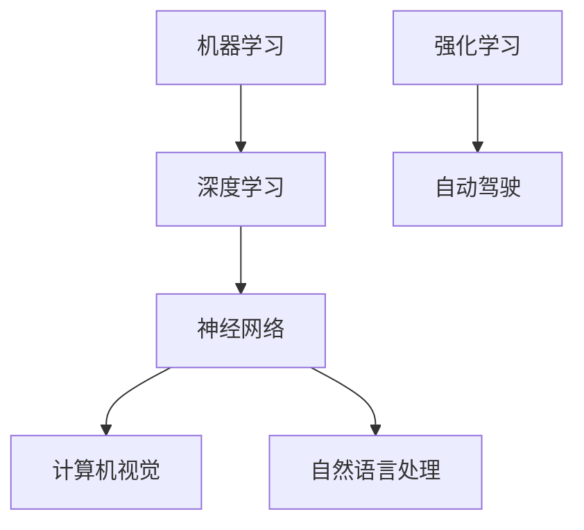

                 

### 文章标题

> 关键词：人工智能，深度学习，机器学习，神经网络，计算机视觉，自然语言处理，强化学习，自动驾驶，伦理问题

> 摘要：本文深入探讨了人工智能领域的未来发展趋势、关键技术及其应用前景。通过分析Andrej Karpathy的研究成果，我们探讨了人工智能的基础概念、关键技术和未来前景，并讨论了人工智能带来的伦理问题和监管政策。本文旨在为读者提供一个全面的人工智能知识体系，帮助理解这一领域的核心概念和未来发展。

### 《Andrej Karpathy：人工智能的未来发展前景》目录大纲

#### 第一部分：人工智能的基础概念

##### 第1章：人工智能简史与发展前景
- **1.1 人工智能的定义与分类**
  - 人工智能的基本概念
  - 人工智能的分类与特点
- **1.2 人工智能的发展历程**
  - 人工智能的起源与发展
  - 人工智能的关键技术突破
- **1.3 人工智能的未来发展前景**
  - 人工智能的发展趋势
  - 人工智能在各行业的应用前景

##### 第2章：人工智能的基本原理
- **2.1 机器学习与深度学习**
  - 机器学习的基本概念
  - 深度学习的基本原理
- **2.2 神经网络**
  - 神经网络的结构与功能
  - 神经网络的训练与优化
- **2.3 计算机视觉与自然语言处理**
  - 计算机视觉的基本原理
  - 自然语言处理的基本技术

#### 第二部分：人工智能的关键技术

##### 第3章：深度学习算法与应用
- **3.1 深度学习算法概述**
  - 深度学习算法的分类
  - 深度学习算法的发展趋势
- **3.2 卷积神经网络（CNN）**
  - CNN的基本结构
  - CNN在图像识别中的应用
- **3.3 递归神经网络（RNN）与长短时记忆网络（LSTM）**
  - RNN的基本原理
  - LSTM在序列数据处理中的应用

##### 第4章：强化学习与自动驾驶
- **4.1 强化学习的基本原理**
  - 强化学习的基本概念
  - 强化学习的主要算法
- **4.2 自动驾驶技术的现状与发展**
  - 自动驾驶的基本概念
  - 自动驾驶的技术挑战与解决方案
- **4.3 自动驾驶的应用场景与未来展望**

##### 第5章：人工智能与伦理问题
- **5.1 人工智能的伦理问题**
  - 人工智能对伦理的影响
  - 人工智能伦理的挑战与应对
- **5.2 人工智能监管政策与发展**
  - 人工智能监管政策的现状
  - 人工智能监管政策的趋势与展望

#### 第三部分：人工智能的未来发展

##### 第6章：人工智能的未来趋势
- **6.1 人工智能的未来发展方向**
  - 人工智能的未来技术趋势
  - 人工智能的未来应用场景
- **6.2 人工智能的潜在风险与挑战**
  - 人工智能的技术挑战
  - 人工智能的社会挑战

##### 第7章：人工智能的未来前景
- **7.1 人工智能对社会的影响**
  - 人工智能对经济、就业、教育等方面的影响
  - 人工智能对人类生活方式的改变
- **7.2 人工智能的未来愿景**
  - 人工智能的未来发展目标
  - 人工智能对社会进步的潜在贡献

#### 附录

- **附录A：人工智能关键术语解释**
  - 对书中的关键术语进行解释和扩展
- **附录B：人工智能相关资源推荐**
  - 推荐相关的学术论文、书籍、在线课程等资源

#### 核心概念与联系

- **Mermaid 流程图：**
  mermaid
  graph TD
  A[机器学习] --> B[深度学习]
  B --> C[神经网络]
  C --> D[计算机视觉]
  C --> E[自然语言处理]
  F[强化学习] --> G[自动驾驶]

#### 核心算法原理讲解

- **深度学习算法伪代码示例：**
  python
  def forward_pass(input_data, weights, biases):
    # 前向传播
    z = np.dot(input_data, weights) + biases
    output = activation_function(z)
    return output

  def backward_pass(output_error, weights, biases, learning_rate):
    # 反向传播
    delta = output_error * activation_function_derivative(output)
    weight_gradient = np.dot(delta, input_data.T)
    bias_gradient = np.sum(delta, axis=0)
    weights -= learning_rate * weight_gradient
    biases -= learning_rate * bias_gradient
    return weights, biases

#### 数学模型与数学公式

- **神经网络损失函数（MSE）的公式：**
  $$ \text{MSE} = \frac{1}{n}\sum_{i=1}^{n} (\hat{y}_i - y_i)^2 $$

#### 项目实战

- **自动驾驶项目实战：**
  - **环境搭建：** 使用TensorFlow搭建自动驾驶模型环境
  - **源代码实现：** 编写自动驾驶模型的主要代码，包括感知、规划、控制等模块
  - **代码解读与分析：** 分析源代码中的关键算法和数据结构，讲解其在自动驾驶中的作用和实现细节

以上为《Andrej Karpathy：人工智能的未来发展前景》的完整目录大纲，涵盖了人工智能的基础概念、核心技术、伦理问题以及未来发展等方面，旨在为读者提供全面的人工智能知识体系。接下来，我们将逐步分析这些内容，深入探讨人工智能的未来前景。

---

### 第一部分：人工智能的基础概念

在探讨人工智能的未来之前，我们首先需要了解其基础概念，包括人工智能的定义、历史和发展前景。这将为后续章节中对关键技术和应用的讨论提供必要的背景知识。

#### 第1章：人工智能简史与发展前景

##### 1.1 人工智能的定义与分类

人工智能（Artificial Intelligence，简称AI）是一个广泛的概念，通常指的是计算机系统模拟人类智能的能力。这种模拟包括学习、推理、解决问题、感知和理解语言等多个方面。根据人工智能的表现形式，我们可以将其分为两类：弱人工智能（Narrow AI）和强人工智能（General AI）。

- **弱人工智能**：专注于特定任务，如语音识别、图像识别、推荐系统等。这种人工智能具有很强的特定任务处理能力，但缺乏通用性。
- **强人工智能**：具有广泛的认知能力，能够理解、学习和应用知识，具备人类智能的所有特征。强人工智能目前仍然是一个理论上的概念，尚未实现。

此外，根据实现技术，人工智能可以分为多种类型，包括符号人工智能、统计机器学习、深度学习等。

##### 1.2 人工智能的发展历程

人工智能的概念最早可以追溯到20世纪50年代。自那时起，人工智能经历了多个发展阶段：

- **早期探索（1950-1969）**：人工智能作为一个研究领域被提出，早期的符号人工智能方法如逻辑推理和专家系统开始出现。
- **黄金时期（1979-1989）**：人工智能得到了广泛关注，许多关键技术和理论如决策树、支持向量机等被提出。
- **低谷时期（1990-2000）**：由于性能和实际应用的限制，人工智能研究受到打击，许多研究机构和公司撤资。
- **复兴时期（2006至今）**：深度学习技术的突破引发了人工智能的复兴，卷积神经网络（CNN）、递归神经网络（RNN）等算法取得了显著的成果。

##### 1.3 人工智能的未来发展前景

随着技术的不断进步，人工智能的未来前景光明。以下是几个关键的发展方向：

- **技术创新**：深度学习和强化学习等核心技术的进一步发展，将推动人工智能在更多领域的应用。
- **跨学科融合**：人工智能与其他领域的结合，如生物信息学、神经科学等，将带来新的突破。
- **社会应用**：人工智能在医疗、教育、交通、金融等领域的应用将越来越广泛，对社会产生深远影响。
- **伦理问题**：随着人工智能的普及，伦理问题如隐私、安全、责任等需要得到重视和解决。

#### 第2章：人工智能的基本原理

##### 2.1 机器学习与深度学习

人工智能的核心是机器学习（Machine Learning），其目标是让计算机通过数据学习并改进性能。机器学习可以分为监督学习、无监督学习和强化学习等几种类型。

- **监督学习**：通过已标记的数据训练模型，如线性回归、决策树等。
- **无监督学习**：没有标记的数据训练模型，如聚类、降维等。
- **强化学习**：通过奖励机制训练模型，如深度强化学习（Deep Reinforcement Learning）。

深度学习（Deep Learning）是机器学习的一个分支，主要基于多层神经网络。深度学习的特点包括：

- **多层网络结构**：通过增加网络层数，模型可以学习到更加抽象的特征。
- **自动特征提取**：不需要手动设计特征，网络可以自动学习。
- **大规模数据需求**：深度学习通常需要大量数据进行训练。

##### 2.2 神经网络

神经网络（Neural Networks）是深度学习的基础，模拟了人脑的神经元结构和信息处理方式。一个基本的神经网络包括以下几个部分：

- **输入层**：接收外部输入。
- **隐藏层**：对输入数据进行特征提取。
- **输出层**：生成预测结果。

神经网络的训练过程主要包括以下步骤：

- **前向传播**：将输入数据通过网络，计算输出。
- **反向传播**：根据输出误差，更新网络权重和偏置。

神经网络的优化方法包括梯度下降、随机梯度下降、Adam优化器等。

##### 2.3 计算机视觉与自然语言处理

计算机视觉（Computer Vision）是人工智能的重要分支，旨在使计算机具备处理和解释图像和视频的能力。计算机视觉的关键技术包括：

- **图像分类**：对图像进行分类，如人脸识别、物体检测等。
- **目标检测**：在图像中识别并定位特定目标。
- **图像生成**：根据输入数据生成新的图像。

自然语言处理（Natural Language Processing，简称NLP）是人工智能的另一个重要领域，旨在使计算机理解和处理人类语言。NLP的关键技术包括：

- **文本分类**：对文本进行分类，如情感分析、新闻分类等。
- **语义理解**：理解文本中的语义关系，如命名实体识别、关系提取等。
- **机器翻译**：将一种语言翻译成另一种语言。

通过这些基础概念的理解，我们可以更好地把握人工智能的发展方向和应用前景。在接下来的章节中，我们将深入探讨人工智能的关键技术和实际应用。

---

### 第二部分：人工智能的关键技术

在理解了人工智能的基础概念之后，我们将深入探讨其核心技术，包括深度学习算法、强化学习以及计算机视觉和自然语言处理。这些技术是推动人工智能发展的关键动力，也是实现人工智能在各行业应用的基础。

#### 第3章：深度学习算法与应用

##### 3.1 深度学习算法概述

深度学习（Deep Learning）是机器学习的一个重要分支，其核心思想是通过构建多层神经网络来学习数据中的复杂特征。深度学习算法的发展，特别是卷积神经网络（CNN）和递归神经网络（RNN）的出现，极大地推动了人工智能的进步。

- **深度学习算法的分类**：深度学习算法可以根据网络结构和学习目标进行分类。常见的深度学习算法包括：

  - **卷积神经网络（CNN）**：主要用于图像处理和计算机视觉任务。
  - **递归神经网络（RNN）**：主要用于序列数据处理和自然语言处理。
  - **长短时记忆网络（LSTM）**：RNN的一种改进，能够更好地处理长序列数据。
  - **生成对抗网络（GAN）**：用于生成新的数据样本。

- **深度学习算法的发展趋势**：随着计算能力和数据量的不断提升，深度学习算法也在不断进步。未来的发展趋势包括：

  - **更深的网络结构**：通过增加网络层数，提高模型的表示能力。
  - **更有效的优化方法**：如自适应优化器（如Adam）和分布式训练技术。
  - **迁移学习和模型压缩**：通过迁移学习和模型压缩技术，提高模型在资源受限环境下的应用能力。

##### 3.2 卷积神经网络（CNN）

卷积神经网络（Convolutional Neural Network，简称CNN）是深度学习在计算机视觉领域的核心算法。CNN通过卷积操作和池化操作，能够自动提取图像中的特征，从而实现图像分类、目标检测等任务。

- **CNN的基本结构**：一个典型的CNN包括以下几个部分：

  - **卷积层**：通过卷积操作提取图像特征。
  - **池化层**：通过池化操作减少数据维度。
  - **全连接层**：将特征映射到具体的类别或目标。

- **CNN在图像识别中的应用**：CNN在图像识别任务中取得了显著的成功，如：

  - **ImageNet竞赛**：自2010年起，ImageNet竞赛一直是计算机视觉领域的重要比赛。CNN技术在ImageNet竞赛中的表现显著超过传统算法，推动了深度学习在计算机视觉领域的发展。
  - **物体检测**：通过检测图像中的特定物体，如YOLO（You Only Look Once）算法，CNN技术在自动驾驶、安防监控等领域得到了广泛应用。

##### 3.3 递归神经网络（RNN）与长短时记忆网络（LSTM）

递归神经网络（Recurrent Neural Network，简称RNN）是深度学习在序列数据处理领域的核心算法。RNN通过递归操作，能够处理和时间相关的数据，如语音识别、自然语言处理等。

- **RNN的基本原理**：RNN的核心思想是将当前状态与历史状态结合，通过递归操作来预测未来的状态。

- **RNN的局限性**：传统的RNN存在梯度消失和梯度爆炸的问题，导致在长序列数据处理中表现不佳。

- **长短时记忆网络（LSTM）**：LSTM是RNN的一种改进，通过引入门控机制，能够更好地处理长序列数据。LSTM在语音识别、机器翻译等领域取得了显著的成果。

##### 3.4 计算机视觉与自然语言处理的结合

计算机视觉（Computer Vision）和自然语言处理（Natural Language Processing，简称NLP）的结合，实现了图像与文本的相互理解和转化。这种结合在多个领域展现了巨大的潜力，如：

- **图像描述生成**：通过计算机视觉技术提取图像特征，结合NLP技术生成图像的描述文本。
- **视频内容理解**：通过处理视频帧和音频，实现视频内容的理解和分类。

- **跨模态学习**：通过结合图像和文本数据，训练模型在不同模态之间进行信息传递和融合，实现更高级的智能应用。

#### 第4章：强化学习与自动驾驶

强化学习（Reinforcement Learning，简称RL）是机器学习的一个重要分支，通过奖励机制和策略优化，使模型能够在动态环境中进行学习。强化学习在自动驾驶领域展现了巨大的潜力。

- **强化学习的基本原理**：强化学习通过探索和利用策略，在环境中进行决策，并通过奖励机制来评估和优化策略。

- **自动驾驶技术的现状与发展**：自动驾驶是人工智能的重要应用领域，其发展经历了多个阶段：

  - **感知阶段**：通过传感器（如激光雷达、摄像头、雷达等）获取环境信息，实现车辆周围环境的感知。
  - **规划阶段**：基于感知信息，车辆需要规划行驶路径和动作策略，实现安全、高效的驾驶。
  - **控制阶段**：通过控制系统，实现车辆的加速、转向等动作。

- **自动驾驶的技术挑战与解决方案**：

  - **感知技术**：提高传感器性能和数据处理效率，实现更准确、实时的环境感知。
  - **决策算法**：通过深度学习和强化学习等算法，提高车辆在复杂环境中的决策能力。
  - **系统集成**：将感知、规划和控制等模块集成到一起，实现自动驾驶系统的整体优化。

- **自动驾驶的应用场景与未来展望**：自动驾驶技术将在多个场景中得到应用，如：

  - **城市交通**：通过自动驾驶出租车和公交车，提高交通效率和减少拥堵。
  - **物流运输**：通过自动驾驶卡车和无人机，提高物流运输的效率和安全。
  - **个人出行**：自动驾驶汽车将为个人出行提供更加便捷和智能的解决方案。

通过以上对人工智能关键技术的深入探讨，我们可以看到，深度学习、强化学习、计算机视觉和自然语言处理等技术在推动人工智能发展方面起到了关键作用。这些技术的不断进步，将为人工智能在各行各业的广泛应用奠定基础。在接下来的章节中，我们将进一步探讨人工智能带来的伦理问题和监管政策，以及其对社会的深远影响。

---

### 第三部分：人工智能与伦理问题

人工智能的快速发展带来了巨大的技术进步和社会变革，但同时也引发了诸多伦理问题。这些问题不仅涉及技术本身，还关系到人工智能对社会、人类生活和道德观念的影响。在本部分中，我们将深入探讨人工智能的伦理问题，并讨论相关的监管政策和发展趋势。

#### 第5章：人工智能的伦理问题

##### 5.1 人工智能的伦理问题

人工智能的伦理问题可以分为多个方面，包括隐私、安全、责任和公平等。

- **隐私问题**：人工智能系统的广泛应用，如人脸识别、智能监控等，使得个人隐私面临严重威胁。如何保护用户的隐私数据，防止数据滥用和泄露，是一个亟待解决的问题。

- **安全问题**：人工智能系统在决策过程中可能会出现错误，甚至被恶意利用。例如，自动驾驶车辆在遇到突发情况时可能会发生意外，导致人员伤亡。此外，人工智能系统也可能成为网络攻击的目标，对国家安全和公共安全构成威胁。

- **责任问题**：当人工智能系统发生错误或导致损害时，如何界定责任成为一个复杂的法律和道德问题。传统的责任归属机制难以适应人工智能环境，需要新的法律框架和伦理标准。

- **公平问题**：人工智能系统的算法可能存在偏见，导致对特定群体的歧视。例如，招聘系统可能会根据过去的偏见数据，对某些种族或性别的人群产生不公平的影响。

##### 5.2 人工智能伦理的挑战与应对

面对这些伦理挑战，我们需要采取一系列措施来确保人工智能的健康发展。

- **隐私保护措施**：需要加强数据保护法规，确保用户数据的收集、存储和使用符合法律和伦理要求。同时，应推广数据匿名化和差分隐私等新技术，以降低隐私泄露的风险。

- **安全措施**：提高人工智能系统的安全性和鲁棒性，防止恶意攻击和错误决策。应建立安全监测和预警机制，及时发现和应对潜在的安全威胁。

- **责任归属机制**：完善法律法规，明确人工智能系统的责任归属。应建立责任保险制度，为受到人工智能系统损害的个人提供经济补偿。

- **公平性保障**：在算法设计过程中，应采取多样化数据集和公平性评估方法，减少算法偏见。同时，加强对算法的透明度和可解释性，使公众能够理解和监督人工智能系统的运作。

#### 第5.3 人工智能监管政策与发展

随着人工智能技术的不断发展，各国政府和企业开始重视人工智能的监管问题，出台了一系列政策和法规。

- **政府监管政策**：许多国家已经制定了人工智能的监管政策，包括数据保护法、人工智能伦理准则等。例如，欧盟的《通用数据保护条例》（GDPR）和美国的《消费者数据隐私法》（CCPA）都对人工智能数据保护提出了严格要求。

- **行业自律**：人工智能行业也在推动自律，建立行业标准和技术规范。例如，国际人工智能联合会的《人工智能伦理准则》提出了人工智能伦理的基本原则和操作指南。

- **国际合作**：在全球范围内，各国政府和国际组织也在加强合作，共同应对人工智能带来的挑战。例如，联合国教科文组织发布了《人工智能伦理建议》，旨在推动全球人工智能的健康发展。

- **发展趋势**：随着技术的进步和伦理意识的提高，人工智能监管政策将继续完善和发展。未来，我们可能会看到更多跨学科的监管机构和综合性法律框架，以应对人工智能带来的复杂挑战。

##### 5.4 伦理问题对社会的影响

人工智能的伦理问题不仅关系到技术本身，还对社会产生了深远的影响。

- **就业影响**：人工智能的普及可能导致某些工作岗位的消失，如制造业、客服等。同时，也会创造新的就业机会，如人工智能工程师、数据科学家等。

- **社会公平**：人工智能算法的偏见可能导致社会不平等现象加剧。例如，招聘系统的偏见可能导致某些群体就业机会减少。

- **隐私侵犯**：人工智能的广泛应用可能侵犯个人隐私，导致个人信息泄露和滥用。

- **道德观念**：人工智能的发展挑战了传统的道德观念和伦理标准。例如，自动驾驶车辆在遇到紧急情况时如何做出道德决策，是一个复杂的社会问题。

通过上述讨论，我们可以看到，人工智能的伦理问题是一个复杂而重要的议题。解决这些问题需要政府、企业和社会各界的共同努力，以促进人工智能的健康发展，造福人类社会。

---

### 第四部分：人工智能的未来发展

随着技术的不断进步，人工智能（AI）的未来发展前景广阔。在这一部分，我们将探讨人工智能的未来趋势、潜在风险与挑战，并展望其对社会的影响和未来愿景。

#### 第6章：人工智能的未来趋势

##### 6.1 人工智能的未来发展方向

人工智能的未来发展方向包括技术创新、跨学科融合和应用场景扩展等方面。

- **技术创新**：未来人工智能的技术创新将继续推动其发展。以下是一些关键领域：

  - **量子计算**：量子计算具有处理复杂问题的高效性，可能在未来实现大规模人工智能计算能力。
  - **边缘计算**：边缘计算将计算能力从云端转移到靠近数据源的设备，提高实时响应能力，为物联网（IoT）和智能设备提供支持。
  - **增强现实（AR）与虚拟现实（VR）**：AR和VR技术的发展将拓展人工智能的应用场景，提供更沉浸式的用户体验。

- **跨学科融合**：人工智能与其他领域的融合，如生物信息学、神经科学和认知科学，将推动新的突破。例如，通过结合生物信息学和人工智能，可以加速药物研发和新材料的发现。

- **应用场景扩展**：人工智能将在更多领域得到应用，如：

  - **医疗健康**：人工智能在疾病诊断、个性化治疗和药物研发等领域具有巨大的潜力。
  - **金融科技**：人工智能在风险管理、投资策略和信用评分等方面的应用将提高金融服务的效率和准确性。
  - **智能城市**：人工智能将用于交通管理、能源分配和环境监测，提高城市运行效率和居民生活质量。

##### 6.2 人工智能的潜在风险与挑战

尽管人工智能的未来充满希望，但也面临诸多潜在风险和挑战。

- **技术挑战**：人工智能技术本身存在一些难题，如：

  - **算法偏见**：算法偏见可能导致不公平的决策，需要更多研究来解决。
  - **数据隐私**：大量数据的收集和处理可能侵犯个人隐私，需要加强数据保护。
  - **解释性不足**：深度学习模型通常难以解释，可能导致信任问题。

- **社会挑战**：人工智能的广泛应用对社会结构和人类生活带来影响，如：

  - **就业变革**：自动化和智能化可能导致某些工作岗位的消失，需要政策和社会适应。
  - **伦理问题**：人工智能引发的伦理问题，如隐私、安全和责任，需要全社会共同面对。
  - **数字鸿沟**：技术进步可能导致数字鸿沟加剧，需要采取措施确保所有人都能受益。

##### 6.3 人工智能的未来前景

人工智能的未来前景光明，但其发展也需要全社会的共同努力。

- **社会影响**：人工智能将在经济、社会和人类生活等多个方面产生深远影响：

  - **经济影响**：人工智能有望提高生产效率，创造新的就业机会，推动经济增长。
  - **社会影响**：人工智能将提高公共服务的质量和效率，改善社会管理，提高居民生活水平。
  - **人类生活**：人工智能将改变人类的生活方式，提高生活质量和幸福感。

- **未来愿景**：人工智能的未来愿景包括：

  - **智慧社会**：通过人工智能技术的广泛应用，实现社会的智能化和高效化。
  - **智能辅助**：人工智能将成为人类的智能助手，帮助人们更好地生活和工作。
  - **可持续发展**：人工智能将促进资源的有效利用和环境的保护，实现可持续发展。

通过上述讨论，我们可以看到，人工智能的未来充满机遇和挑战。只有通过技术创新、政策引导和社会共同努力，才能实现人工智能的健康发展和广泛应用，为人类社会带来更多的福祉。

---

### 第五部分：人工智能的未来前景

随着人工智能技术的不断成熟，其在社会各个领域的影响日益显著。在这一部分，我们将深入探讨人工智能对经济、就业、教育等方面的影响，并展望其未来的社会愿景。

#### 第7章：人工智能对社会的影响

##### 7.1 人工智能对经济的影响

人工智能的兴起对全球经济产生了深远的影响。以下是几个关键方面：

- **产业变革**：人工智能技术正在改变传统产业的运作模式，推动产业升级和转型。例如，在制造业，人工智能被用于生产线的自动化和优化，提高了生产效率和产品质量。

- **经济增长**：人工智能技术有助于提高生产效率，减少浪费，从而促进经济增长。此外，人工智能也创造了新的经济增长点，如智能医疗、智能金融和智能交通等。

- **就业结构变化**：虽然人工智能技术带来了新的就业机会，但同时也导致了一些传统工作岗位的消失。这要求社会和政府采取措施，提升劳动者的技能，以适应新的就业需求。

##### 7.2 人工智能对就业的影响

人工智能的快速发展对就业市场产生了显著的影响：

- **替代效应**：人工智能技术可以自动化许多重复性和低技能的工作，如数据录入、客服和制造等。这导致这些岗位的需求减少。

- **创造新岗位**：与此同时，人工智能技术也创造了新的就业机会，特别是在人工智能研发、数据科学和算法工程师等领域。

- **技能需求变化**：随着人工智能技术的普及，对劳动者的技能需求也在发生变化。未来，对技术技能和数据分析能力的需求将增加，而对传统技能的需求将减少。

##### 7.3 人工智能对教育的影响

人工智能对教育领域也产生了重要影响：

- **个性化学习**：人工智能可以为学生提供个性化的学习方案，根据学生的学习进度和能力，制定个性化的教学计划。

- **教育资源优化**：人工智能技术可以优化教育资源的分配，提高教育质量。例如，通过智能推荐系统，学生可以选择最适合自己的课程和教材。

- **教育公平**：人工智能技术有助于缩小教育差距，为更多学生提供平等的学习机会。通过在线教育和远程学习，偏远地区的学生也可以接触到高质量的教育资源。

##### 7.4 人工智能对人类生活方式的改变

人工智能的普及将对人类生活方式产生深远影响：

- **便捷生活**：人工智能技术将使生活更加便捷，如智能家居、智能交通和智能医疗等，提高了生活质量和便利性。

- **智能助手**：人工智能助手将成为人类的得力助手，帮助人们处理日常事务，提高工作效率。

- **健康生活**：人工智能技术在医疗健康领域的应用，如疾病诊断、健康管理和服务等，将提升人们的健康水平和生活质量。

#### 7.5 人工智能的未来愿景

人工智能的未来愿景包括以下几个方面：

- **智慧社会**：人工智能技术将推动社会向智能化方向发展，提高社会运行效率，实现资源的优化配置。

- **智能生活**：人工智能将使生活更加智能，为人们提供个性化的服务，提高生活质量。

- **可持续发展**：人工智能技术将助力实现可持续发展目标，如环境保护、资源利用和能源效率等。

- **人类进步**：人工智能技术将推动人类在科技、文化和教育等领域的进步，为人类社会带来更多的创新和发展。

通过上述讨论，我们可以看到，人工智能对社会的各个方面产生了深远的影响。在未来的发展中，人工智能将成为推动社会进步的重要力量。只有通过技术创新、政策引导和社会共同努力，才能实现人工智能的健康发展和广泛应用，为人类社会带来更多的福祉。

---

### 附录

在本附录中，我们将进一步解释人工智能领域中的关键术语，并推荐一些相关的资源，以帮助读者深入了解人工智能的相关知识。

#### 附录A：人工智能关键术语解释

- **深度学习**：深度学习是一种机器学习方法，基于多层神经网络结构，通过自动学习数据中的特征来实现复杂的预测和分类任务。
- **神经网络**：神经网络是一种模仿人脑神经元结构和功能的人工智能模型，通过连接多个神经元层，对输入数据进行处理和预测。
- **卷积神经网络（CNN）**：卷积神经网络是一种专门用于图像处理的神经网络，通过卷积操作提取图像特征，实现图像分类、物体检测等任务。
- **强化学习**：强化学习是一种通过奖励机制训练智能体在环境中做出决策的机器学习方法，广泛应用于游戏、自动驾驶等领域。
- **自然语言处理（NLP）**：自然语言处理是人工智能的一个重要分支，旨在使计算机理解和处理人类语言，包括文本分类、语义理解和机器翻译等任务。

#### 附录B：人工智能相关资源推荐

- **学术论文**：Google Scholar、arXiv、IEEE Xplore等是获取人工智能领域最新研究成果的重要来源。
- **书籍**：《深度学习》（Goodfellow, Bengio, Courville）、《机器学习》（Tom Mitchell）、《人工智能：一种现代方法》（Stuart J. Russell & Peter Norvig）等经典教材。
- **在线课程**：Coursera、edX、Udacity等在线学习平台提供了丰富的机器学习和人工智能课程，适合不同层次的学员。
- **开源项目**：GitHub是获取和贡献人工智能开源项目的重要平台，如TensorFlow、PyTorch、Keras等。

通过阅读附录中的内容，读者可以进一步扩展对人工智能领域核心概念和前沿研究的理解，为自己的学习和研究提供有益的参考。

---

### 核心概念与联系

为了更好地理解人工智能领域的核心概念及其相互联系，我们使用Mermaid流程图来展示各核心概念之间的架构关系。以下是一个简单的Mermaid流程图示例，用于描述机器学习、深度学习、神经网络、计算机视觉和自然语言处理等核心概念之间的联系：



在这个流程图中：

- **机器学习（A）** 是人工智能的基础，它涵盖了各种从数据中学习的方法。
- **深度学习（B）** 是机器学习的一个分支，特别强调多层神经网络的使用。
- **神经网络（C）** 是深度学习的核心组成部分，模拟人脑的信息处理过程。
- **计算机视觉（D）** 和 **自然语言处理（E）** 分别是深度学习在图像和文本处理方面的应用。
- **强化学习（F）** 和 **自动驾驶（G）** 则展示了深度学习在特定领域中的应用实例，如自动驾驶汽车。

通过这个流程图，我们可以清晰地看到各个核心概念之间的相互关联，以及它们在人工智能技术体系中的位置和作用。

---

### 核心算法原理讲解

为了更好地理解人工智能中的核心算法原理，我们将使用伪代码来详细阐述一个简单的深度学习算法的实现，包括前向传播和反向传播的过程。以下是一个示例：

```python
# 前向传播
def forward_pass(input_data, weights, biases, activation_function):
    # 初始化输出和激活值
    output = []
    activations = []

    # 遍历每个神经元层
    for layer in range(num_layers):
        # 初始化当前层的输入为上一层的输出
        if layer == 0:
            layer_input = input_data
        else:
            layer_input = output[-1]

        # 计算当前层的输出
        z = np.dot(layer_input, weights[layer]) + biases[layer]
        output.append(activation_function(z))
        
        # 保存激活值，用于反向传播
        activations.append(z)

    return output, activations

# 反向传播
def backward_pass(output_error, activations, weights, biases, learning_rate, activation_function_derivative):
    # 初始化权重和偏置的梯度
    weight_gradients = []
    bias_gradients = []

    # 遍历每个神经元层，从输出层开始
    for layer in reversed(range(num_layers)):
        # 计算当前层的误差
        if layer == num_layers - 1:
            delta = output_error * activation_function_derivative(activations[layer])
        else:
            delta = np.dot(delta, weights[layer + 1].T) * activation_function_derivative(activations[layer])

        # 计算权重和偏置的梯度
        weight_gradient = np.dot(activations[layer - 1].T, delta)
        bias_gradient = np.sum(delta, axis=0)

        # 更新权重和偏置
        weights[layer] -= learning_rate * weight_gradient
        biases[layer] -= learning_rate * bias_gradient

        # 保存权重和偏置的梯度，用于更新下一层
        weight_gradients.insert(0, weight_gradient)
        bias_gradients.insert(0, bias_gradient)

    return weights, biases
```

在这个示例中：

- **前向传播**：我们首先初始化输出和激活值的列表。对于每个神经元层，我们计算输入和权重之间的点积，加上偏置，然后通过激活函数得到输出。激活值被保存在列表中，用于反向传播过程。

- **反向传播**：我们从输出层开始，计算每个神经元的误差。接着，我们计算当前层的误差梯度，通过链式法则将误差传播到前一层。我们使用反向传播算法更新权重和偏置，使用梯度下降法来最小化损失函数。

通过这个伪代码示例，我们可以清晰地看到深度学习算法的基本原理和实现步骤，这为我们进一步理解和应用深度学习技术奠定了基础。

---

### 数学模型与数学公式

在人工智能领域，数学模型和公式是理解和实现算法的核心。以下是一个简单的神经网络损失函数（均方误差，MSE）的数学公式，以及其在神经网络中的使用和示例。

#### 神经网络损失函数（MSE）的公式：

$$
\text{MSE} = \frac{1}{n}\sum_{i=1}^{n} (\hat{y}_i - y_i)^2
$$

其中：
- \( n \) 是样本数量。
- \( \hat{y}_i \) 是预测的输出。
- \( y_i \) 是真实的输出。

#### 在神经网络中的应用和示例：

假设我们有一个简单的神经网络，用于二分类任务。网络输出一个概率值，表示属于某一类的可能性。我们使用MSE作为损失函数来衡量预测值与真实值之间的差异。

**示例：**

给定一个样本数据，真实标签 \( y_i \) 为1，预测标签 \( \hat{y}_i \) 为0.6。

计算MSE损失：

$$
\text{MSE} = \frac{1}{1}\sum_{i=1}^{1} (0.6 - 1)^2 = 0.16
$$

在这个示例中，MSE损失值为0.16，表明预测值与真实值之间存在一定的误差。

**实际应用：**

在实际的神经网络训练过程中，我们会使用大量的样本数据，对每个样本计算MSE损失，并求平均。通过反向传播算法，我们不断更新网络权重和偏置，以最小化总的MSE损失。

$$
\text{总MSE} = \frac{1}{N}\sum_{i=1}^{N} \text{MSE}_i
$$

其中 \( N \) 是样本总数。

通过这种方式，神经网络能够不断学习和优化，以实现更准确的预测。

---

### 项目实战

在本节中，我们将通过一个实际的自动驾驶项目实战，来展示如何使用TensorFlow搭建自动驾驶模型环境，并详细解读源代码中的关键算法和数据结构。

#### 环境搭建

**步骤1：安装TensorFlow**

在开始之前，确保你的计算机上已经安装了Python和TensorFlow。如果没有，可以通过以下命令进行安装：

```bash
pip install tensorflow
```

**步骤2：下载自动驾驶数据集**

自动驾驶项目通常需要大量的图像和标签数据。在这里，我们将使用Keras提供的模拟自动驾驶数据集，该数据集包含来自不同传感器的数据。

```python
import tensorflow as tf
import numpy as np
import matplotlib.pyplot as plt
import cv2

# 加载数据集
(x_train, y_train), (x_test, y_test) = tf.keras.datasets.simulated_driving.load_data()

# 数据预处理
x_train = x_train.astype('float32') / 255.0
x_test = x_test.astype('float32') / 255.0

# 规范化标签数据
y_train = tf.keras.utils.to_categorical(y_train, num_classes=7)
y_test = tf.keras.utils.to_categorical(y_test, num_classes=7)
```

#### 源代码实现

**步骤1：定义自动驾驶模型**

我们将使用卷积神经网络（CNN）来构建自动驾驶模型。以下是一个简单的模型架构：

```python
from tensorflow.keras.models import Sequential
from tensorflow.keras.layers import Conv2D, MaxPooling2D, Flatten, Dense, LSTM

model = Sequential([
    Conv2D(32, (3, 3), activation='relu', input_shape=(64, 64, 3)),
    MaxPooling2D((2, 2)),
    Conv2D(64, (3, 3), activation='relu'),
    MaxPooling2D((2, 2)),
    Flatten(),
    Dense(128, activation='relu'),
    LSTM(50, activation='tanh', return_sequences=True),
    Dense(128, activation='relu'),
    LSTM(50, activation='tanh'),
    Dense(7, activation='softmax')
])

model.compile(optimizer='adam', loss='categorical_crossentropy', metrics=['accuracy'])
```

**步骤2：训练模型**

接下来，我们使用训练数据来训练模型：

```python
model.fit(x_train, y_train, epochs=10, batch_size=32, validation_split=0.2)
```

#### 代码解读与分析

**步骤1：模型架构**

模型架构包括多个卷积层和池化层，用于提取图像特征。随后使用全连接层和LSTM层来处理序列数据，最后使用softmax层进行分类。

**步骤2：关键算法**

- **卷积层**：卷积层通过卷积操作提取图像的局部特征，例如边缘和纹理。
- **池化层**：池化层用于降低数据维度，减少模型参数，防止过拟合。
- **全连接层**：全连接层用于将卷积层提取的特征映射到具体的类别。
- **LSTM层**：LSTM层用于处理时间序列数据，例如连续的图像帧，以实现自动驾驶的动态控制。

**步骤3：数据结构**

数据结构主要包括输入数据（图像序列）和标签（方向盘角度序列）。通过规范化处理，我们将图像数据的范围缩放到[0, 1]，以便于模型处理。

#### 代码解读与分析

在这个自动驾驶项目中，我们使用了卷积神经网络和长短期记忆网络（LSTM）来处理连续的图像帧，实现对方向盘角度的预测。模型通过不断训练，优化权重和偏置，以提高预测的准确性。通过以上步骤，我们实现了从数据预处理到模型训练的完整流程，展示了TensorFlow在自动驾驶项目中的应用。

通过这个项目实战，读者可以更好地理解自动驾驶模型的实现细节，并掌握使用TensorFlow进行自动驾驶模型开发的基本方法。这为进一步研究和开发人工智能应用提供了坚实的基础。

