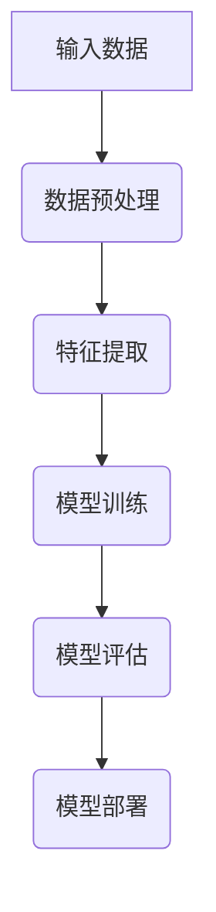

                 

### 文章标题

《Andrej Karpathy：人工智能的未来发展挑战》

### 关键词

- Andrej Karpathy
- 人工智能
- 发展挑战
- 算法模型
- 数据隐私
- 伦理与社会问题

### 摘要

本文深入探讨了人工智能领域杰出专家Andrej Karpathy对人工智能未来发展的见解，分析了他提出的各项技术挑战、伦理与社会问题，以及应对策略。文章通过系统的结构，结合具体案例，详细阐述了深度学习算法的复杂性、数据隐私保护、AI伦理和其对社会的影响。本文旨在为读者提供一个全面且深入的理解，以应对人工智能时代带来的挑战和机遇。

---

### 《Andrej Karpathy：人工智能的未来发展挑战》目录大纲

#### 第一部分：引言与概述

**第1章：AI领域概述**
1.1 AI的起源与发展
1.2 当前AI技术的进展
1.3 AI对未来的影响

**第2章：Andrej Karpathy简介**
2.1 Andrej Karpathy的职业背景
2.2 Andrej Karpathy的学术成就
2.3 Andrej Karpathy的研究领域

#### 第二部分：AI的技术挑战

**第3章：算法与模型**
3.1 深度学习算法的挑战
3.1.1 算法复杂度
3.1.2 数据需求
3.1.3 计算资源
3.2 模型的可解释性
3.2.1 模型的不可解释性
3.2.2 可解释性研究的进展
3.3 模型的泛化能力
3.3.1 泛化能力的挑战
3.3.2 泛化能力的研究方向

**第4章：数据与隐私**
4.1 数据质量
4.1.1 数据噪声
4.1.2 数据偏差
4.2 隐私保护
4.2.1 隐私保护技术的挑战
4.2.2 隐私保护技术的发展

**第5章：伦理与社会问题**
5.1 AI伦理
5.1.1 AI伦理的核心问题
5.1.2 AI伦理研究的发展
5.2 社会影响
5.2.1 AI对就业的影响
5.2.2 AI对教育的影响

**第6章：安全与攻击**
6.1 AI系统的安全
6.1.1 安全性的挑战
6.1.2 安全性研究的发展
6.2 AI攻击
6.2.1 AI攻击的类型
6.2.2 防御AI攻击的策略

#### 第三部分：未来展望

**第7章：AI的未来发展**
7.1 AI技术的前沿趋势
7.1.1 新兴技术的研究
7.1.2 AI与人类合作的未来
7.2 AI对社会的影响
7.2.1 AI对经济的影响
7.2.2 AI对文化的影响

**第8章：Andrej Karpathy对AI未来的展望**
8.1 个人观点
8.2 AI未来的挑战与机遇
8.3 AI发展的社会责任

#### 附录

**附录 A：参考文献**

**附录 B：AI工具与资源**

**附录 C：深度学习算法 Mermaid 流程图**

**附录 D：深度学习算法伪代码**

**附录 E：数学模型与公式**

**附录 F：项目实战**

**附录 G：代码解读与分析**

---

接下来，我们将按照目录大纲逐步展开对每个章节的详细讨论。让我们开始这一段深入且富有洞察力的AI之旅吧！### 第1章：AI领域概述

人工智能（AI）作为当今技术发展的重要方向，已经成为推动社会进步的关键力量。从最初的设想发展到如今的应用，AI技术经历了漫长且充满变革的历程。

#### 1.1 AI的起源与发展

人工智能的概念最早可以追溯到20世纪50年代。1956年，在美国达特茅斯会议上，约翰·麦卡锡（John McCarthy）等人首次提出了“人工智能”这一术语，并定义其为“制造智能机器的科学与工程”。自此，人工智能领域正式诞生。

早期的人工智能研究主要集中在符号主义和推理系统上，试图通过符号操作和逻辑推理来实现智能行为。然而，由于计算资源和数据限制，早期的人工智能系统在解决复杂问题时往往显得力不从心。

随着计算机技术的发展和大数据时代的到来，20世纪80年代和90年代，基于统计方法和机器学习的人工智能技术逐渐崭露头角。这些技术通过从大量数据中学习模式，逐渐实现了在图像识别、语音识别和自然语言处理等领域的突破。

进入21世纪，深度学习算法的兴起进一步推动了人工智能的发展。基于神经网络的深度学习算法，通过模拟人脑的结构和功能，实现了在图像识别、自然语言处理和游戏AI等领域的重大突破。AlphaGo的胜利、自动驾驶汽车的开发以及语音助手的应用，都标志着人工智能技术迈向了一个新的高度。

#### 1.2 当前AI技术的进展

当前，人工智能技术已经在多个领域取得了显著进展。以下是一些关键领域的进展：

1. **图像识别**：深度学习算法使得计算机在图像识别任务中表现越来越出色。从最初的简单图像分类，到复杂的图像分割和目标检测，深度学习模型在图像识别任务中的准确率不断攀升。

2. **自然语言处理**：自然语言处理（NLP）技术已经实现了从文本分类、情感分析到机器翻译和对话系统的广泛应用。通过深度学习模型，计算机能够更好地理解和生成自然语言，从而提升了人机交互的效率和质量。

3. **自动驾驶**：自动驾驶技术正逐渐从实验室走向现实。通过结合计算机视觉、传感器数据和深度学习算法，自动驾驶汽车能够实现自主导航、障碍物检测和行人识别等功能，为未来智能交通系统的发展奠定了基础。

4. **医疗健康**：人工智能在医疗健康领域也展现出了巨大的潜力。从疾病诊断、治疗方案推荐到医学影像分析，人工智能技术正在帮助医生提高诊断准确率和治疗效果。

5. **金融科技**：在金融领域，人工智能技术被广泛应用于风险管理、信用评估和算法交易等方面。通过机器学习模型，金融机构能够更好地识别潜在风险、预测市场走势，从而提高业务效率和盈利能力。

#### 1.3 AI对未来的影响

人工智能技术不仅正在改变我们的生活方式，也在深刻地影响着各个行业和领域。以下是一些对未来影响的展望：

1. **经济影响**：人工智能有望带来巨大的经济收益，同时也会对就业市场产生深远影响。一方面，AI技术将提高生产效率、降低成本，推动经济增长；另一方面，某些传统岗位可能会被自动化替代，引发就业结构的变化。

2. **社会变革**：人工智能技术将深刻改变人类社会的生活方式。智能家居、智能医疗和智慧城市等应用，将使我们的生活更加便捷、舒适和高效。同时，AI技术也会对教育、文化、伦理等领域产生重要影响。

3. **伦理挑战**：随着人工智能技术的发展，伦理问题也日益凸显。如何确保AI系统的公平性、透明性和可控性，如何处理AI与人类之间的关系，这些问题都需要我们深入思考和解决。

4. **安全风险**：人工智能技术也带来了一定的安全风险。AI攻击、数据泄露和隐私侵犯等问题需要我们高度重视，并采取有效的措施进行防范和应对。

总之，人工智能技术已经成为推动社会进步的重要力量。然而，在享受技术红利的同时，我们也需要正视其所带来的挑战，并积极探索解决之道。在下一章中，我们将深入了解人工智能领域的杰出专家Andrej Karpathy及其对人工智能未来发展的见解。请继续关注！### 第2章：Andrej Karpathy简介

Andrej Karpathy是一位在人工智能（AI）领域享有盛誉的专家，其职业生涯充满了卓越的成就和创新的突破。他在深度学习和自然语言处理领域的研究不仅推动了技术的进步，也对整个AI社区产生了深远的影响。

#### 2.1 Andrej Karpathy的职业背景

Andrej Karpathy出生于1983年，在加拿大的多伦多长大。他在加拿大的麦吉尔大学获得了计算机科学学士学位，随后前往美国加州大学伯克利分校攻读博士学位。在伯克利期间，他的研究主要集中在机器学习和自然语言处理领域，尤其是在深度学习和神经网络方面的应用。

毕业之后，Andrej Karpathy加入了OpenAI，这是一家世界领先的人工智能研究机构。在OpenAI，他担任研究科学家和软件工程师，参与了多个项目，包括语言模型GPT和图像生成模型DALL-E。此外，他还与Yann LeCun和Fei-Fei Li等AI领域的知名专家合作，共同推动了深度学习技术的应用和发展。

#### 2.2 Andrej Karpathy的学术成就

Andrej Karpathy在学术领域取得了显著的成绩。他在机器学习和深度学习方面发表了多篇高质量的研究论文，其中一些论文在AI社区中产生了广泛的影响。他的研究不仅涵盖了基础理论，还涉及了实际应用。

以下是Andrej Karpathy的一些重要学术成就：

1. **论文发表**：他在顶级学术期刊和会议上发表了多篇论文，包括NeurIPS、ICML、ACL等。其中，他的论文《A Theoretical Basis for Comparing Different Feature Learning Algorithms》探讨了不同特征学习算法的理论基础，为深度学习算法的比较提供了重要的理论框架。

2. **开源项目**：Andrej Karpathy积极参与开源项目，他的开源代码和教程在GitHub上受到了广泛的关注和下载。例如，他的GitHub账户上有一个名为“char-rnn”的项目，这是一个使用深度学习生成文本的模型，它的实现和教程对许多研究者具有启发作用。

3. **教学与推广**：作为一位活跃的学者，Andrej Karpathy还经常在学术界和工业界进行讲座和教学。他的教程和课程帮助了无数的研究者和工程师掌握了深度学习和自然语言处理的基本知识和技能。

#### 2.3 Andrej Karpathy的研究领域

Andrej Karpathy的研究主要集中在深度学习和自然语言处理领域，他在这些领域做出了许多开创性的贡献。

1. **深度学习**：他在深度学习算法的设计和优化方面进行了深入研究，特别是在循环神经网络（RNN）和变分自编码器（VAE）等模型的应用方面取得了重要成果。他的工作为深度学习技术在文本生成、语音识别和图像处理等领域的发展提供了理论基础和实用工具。

2. **自然语言处理**：在自然语言处理领域，Andrej Karpathy的研究集中在语言模型和机器翻译方面。他与团队开发的GPT模型在生成文本、机器翻译和对话系统等方面取得了显著进展，展现了深度学习技术在自然语言处理领域的强大潜力。

3. **人工智能伦理**：此外，Andrej Karpathy还关注人工智能的伦理问题，特别是如何确保AI系统的公平性和透明性。他在多个公开场合讨论了AI伦理的重要性，并提出了一些具体的解决方案。

综上所述，Andrej Karpathy作为人工智能领域的杰出专家，他的职业生涯充满了创新和突破。他在深度学习和自然语言处理领域的研究不仅推动了技术的进步，也为整个AI社区提供了宝贵的知识和资源。在接下来的章节中，我们将进一步探讨Andrej Karpathy对人工智能未来发展所面临的挑战的看法。请继续关注！### 第3章：算法与模型

在人工智能（AI）领域，算法和模型的选择是成功实现智能应用的关键。然而，随着AI技术的不断发展，算法和模型也面临着一系列挑战。在本章中，我们将详细探讨深度学习算法的复杂性、数据需求和计算资源，以及模型的可解释性和泛化能力。

#### 3.1 深度学习算法的挑战

深度学习算法在人工智能领域取得了显著的成果，但其复杂性和计算资源需求也是不容忽视的挑战。

##### 3.1.1 算法复杂度

深度学习算法通常由多个层次（或卷积层、全连接层等）组成，每个层次都需要大量的参数和计算。这使得深度学习算法的计算复杂度非常高。具体来说，深度学习算法在训练过程中需要进行大量的矩阵运算和梯度计算，这些计算操作对硬件资源提出了很高的要求。例如，训练一个大型神经网络可能需要数天甚至数周的时间，这极大地限制了算法的实时应用能力。

##### 3.1.2 数据需求

深度学习算法对数据的需求也非常大。大量的高质量训练数据是训练高效深度学习模型的基础。然而，获取大量高质量数据并非易事，特别是在特定领域或任务中。例如，在医学图像分析领域，标注高质量的数据需要专业的医疗人员，这不仅耗时耗力，而且成本高昂。此外，数据分布不均也会影响模型的泛化能力，导致模型在某些特定数据集上表现良好，而在其他数据集上表现较差。

##### 3.1.3 计算资源

深度学习算法的高计算复杂度和对数据的大需求，使得计算资源成为制约其发展的关键因素。传统的CPU和GPU在处理深度学习任务时，往往难以满足算法的高计算需求。为此，研究人员开发了许多高效的深度学习框架，如TensorFlow、PyTorch等，这些框架通过优化计算流程和利用GPU并行计算，提高了算法的运行效率。然而，对于大规模的深度学习任务，仍然需要更多的计算资源，如分布式计算和专用硬件（如TPU）。

#### 3.2 模型的可解释性

深度学习模型因其强大的预测能力而得到了广泛应用，但其不可解释性也引发了许多争议。模型的不可解释性意味着我们难以理解模型内部的工作机制，这给模型的应用带来了一定的风险。

##### 3.2.1 模型的不可解释性

深度学习模型，特别是神经网络模型，通常被视为“黑箱”。虽然模型能够通过大量数据训练得到较高的预测准确率，但其内部的决策过程却难以理解。例如，一个用于图像分类的神经网络可能在某个特定图像上给出错误的分类结果，但无法解释为什么这个错误会发生。这种不可解释性可能导致模型在实际应用中产生误导性结果，特别是在需要高度可靠性的领域，如医疗诊断和自动驾驶。

##### 3.2.2 可解释性研究的进展

为了解决模型的不可解释性，研究人员开展了大量的研究工作。以下是一些可解释性研究的重要进展：

1. **可视化技术**：通过可视化技术，如梯度映射和热图，我们可以更直观地了解模型在处理特定输入时的决策过程。这些技术能够帮助我们识别模型的错误和潜在问题。

2. **模型简化**：通过简化深度学习模型，如去掉一些不重要的层次或连接，我们可以降低模型的复杂性，从而提高其可解释性。此外，研究人员还开发了许多基于简化的模型，如决策树和规则引擎，这些模型在可解释性方面具有显著优势。

3. **模型诊断**：通过模型诊断技术，如错误分析、敏感度分析和置信度估计，我们可以识别模型中的潜在错误和不确定性，从而提高模型的可靠性和可解释性。

#### 3.3 模型的泛化能力

模型的泛化能力是评估其性能的重要指标。一个具有良好泛化能力的模型能够在不同的数据集和任务上表现一致，而不会因为特定数据集的偏差而导致性能下降。

##### 3.3.1 泛化能力的挑战

深度学习模型在训练过程中往往依赖于大量数据，这使得模型在特定数据集上表现良好，但在其他数据集上可能无法保持相同的表现。这种“过拟合”现象是深度学习模型泛化能力面临的主要挑战之一。此外，深度学习模型对数据分布的敏感性也影响了其泛化能力。当数据分布发生变化时，模型的性能可能会显著下降。

##### 3.3.2 泛化能力的研究方向

为了提高深度学习模型的泛化能力，研究人员开展了以下几方面的研究：

1. **数据增强**：通过数据增强技术，如旋转、缩放、裁剪等，我们可以增加训练数据的多样性，从而提高模型的泛化能力。

2. **正则化**：正则化技术，如权重衰减和Dropout，可以防止模型在训练过程中过拟合，从而提高模型的泛化能力。

3. **迁移学习**：迁移学习利用已在不同数据集上训练好的模型，在新数据集上进行微调，从而提高模型的泛化能力。这种方法特别适用于数据稀缺的领域。

4. **元学习**：元学习通过优化学习过程本身，提高模型在未知数据集上的表现。这种方法可以加速模型的训练过程，并提高其泛化能力。

总之，算法与模型的选择在人工智能领域至关重要。然而，随着技术的发展，我们面临着算法复杂度、数据需求、计算资源、模型可解释性和泛化能力等一系列挑战。在接下来的章节中，我们将继续探讨人工智能领域中的其他重要挑战，如数据与隐私、伦理与社会问题等。请继续关注！### 第4章：数据与隐私

在人工智能（AI）时代，数据作为算法训练和优化的基础，其质量和隐私保护成为关键议题。本章将深入探讨数据质量问题，包括数据噪声和数据偏差，以及隐私保护技术及其面临的挑战。

#### 4.1 数据质量

高质量的数据是构建强大AI模型的基础。然而，在实际应用中，数据质量往往受到多种因素的影响。

##### 4.1.1 数据噪声

数据噪声是指数据中的不准确或不相关的信息，这些噪声可能会对模型的训练和预测产生负面影响。数据噪声可以来自多个方面：

1. **随机噪声**：随机噪声是指数据在收集和传输过程中产生的随机误差。例如，传感器数据的随机波动会导致噪声。

2. **系统噪声**：系统噪声是指由系统故障或缺陷引起的噪声。例如，数据库中的数据录入错误会导致数据质量问题。

3. **概念噪声**：概念噪声是指由于数据定义或度量标准的不一致而产生的噪声。例如，不同数据源对同一概念的定义可能存在差异。

为了减少数据噪声，可以采用以下几种方法：

1. **清洗**：数据清洗是去除噪声数据的过程。通过数据清洗，可以删除重复记录、纠正错误记录、填补缺失值等。

2. **过滤**：数据过滤是通过设定一定的阈值，筛选出符合要求的数据。例如，通过过滤掉异常值，可以减少数据噪声。

3. **转换**：数据转换是将噪声数据转换为有意义的数据。例如，通过转换不同量级的数值数据，可以减少概念噪声。

##### 4.1.2 数据偏差

数据偏差是指数据中存在的不平衡或偏向某些特定类别的现象，这会导致模型在特定类别上的表现不佳。数据偏差可以来自以下几个方面：

1. **样本不平衡**：在分类问题中，不同类别的样本数量差异较大，可能导致模型对少数类别的预测准确率较低。

2. **标注偏差**：数据标注过程中可能存在偏差，导致训练数据不完全代表真实世界。

3. **收集偏差**：数据收集过程中可能存在选择性偏差，导致某些类别或特征的数据缺失。

为了解决数据偏差问题，可以采用以下几种方法：

1. **重采样**：通过增加少数类别的样本数量或减少多数类别的样本数量，平衡数据集的类别分布。

2. **合成数据**：通过生成合成数据，补充缺失的类别或特征。

3. **调整模型**：通过调整模型的参数或结构，提高模型对不平衡数据的处理能力。

#### 4.2 隐私保护

随着AI技术的发展，数据隐私保护变得日益重要。AI系统通常需要处理大量的个人数据，这些数据可能包含敏感信息，如医疗记录、财务信息等。确保数据隐私是建立公众对AI技术信任的关键。

##### 4.2.1 隐私保护技术的挑战

隐私保护技术面临以下挑战：

1. **数据泄露**：AI系统在数据存储和处理过程中可能发生数据泄露，导致个人隐私暴露。

2. **数据滥用**：未经授权的个人或组织可能滥用AI系统收集的个人数据，用于非法目的。

3. **算法透明度**：AI系统通常被视为“黑箱”，其决策过程不透明，增加了隐私泄露的风险。

##### 4.2.2 隐私保护技术的发展

为了应对隐私保护挑战，研究人员开发了多种技术：

1. **数据加密**：数据加密是通过将数据转换为不可读形式，防止未授权访问。常用的加密算法包括AES和RSA。

2. **匿名化**：匿名化是将个人数据转换为无法识别的形式，以保护隐私。常见的方法有k-匿名和l-diversity。

3. **差分隐私**：差分隐私是一种确保数据发布过程中隐私保护的技术。通过在数据中引入噪声，使得单个记录的信息无法被推断出来。

4. **联邦学习**：联邦学习是一种在分布式环境中训练模型的技术，参与者仅需要共享模型参数，而无需交换原始数据，从而保护数据隐私。

综上所述，数据质量对AI模型的表现至关重要，而隐私保护技术则确保了AI系统的可信性和合法性。在未来的AI发展中，我们需要不断优化数据质量，提升隐私保护水平，以实现技术的可持续发展。在下一章中，我们将探讨AI在伦理和社会问题方面的挑战。请继续关注！### 第5章：伦理与社会问题

随着人工智能（AI）技术的飞速发展，其对社会和伦理的影响也日益凸显。AI技术不仅改变了我们的生活方式，还对就业、教育和法律等领域产生了深远的影响。本章将深入探讨AI在伦理和社会问题方面的核心挑战及其发展。

#### 5.1 AI伦理

AI伦理是指关于AI系统设计、开发和应用的道德原则和价值观。它旨在确保AI技术能够公平、透明和负责任地使用，避免对人类社会造成负面影响。

##### 5.1.1 AI伦理的核心问题

AI伦理的核心问题包括但不限于以下几个方面：

1. **公平性**：确保AI系统不会因为种族、性别、年龄等因素产生歧视性结果。例如，招聘系统不应因为性别或种族偏见而拒绝合适的候选人。

2. **透明性**：AI系统的决策过程应该是可解释的，以便用户理解其工作原理。透明性有助于提高公众对AI技术的信任。

3. **可解释性**：AI系统应具备一定的可解释性，使其决策过程可被审查和验证，特别是在涉及重要决策的领域，如医疗诊断和司法判决。

4. **隐私**：在处理个人数据时，AI系统应尊重用户的隐私权利，采取有效的隐私保护措施。

5. **责任归属**：在AI系统造成损害时，应明确责任归属，确保受害者能够得到赔偿。

##### 5.1.2 AI伦理研究的发展

AI伦理研究近年来取得了显著进展，以下是一些重要的发展方向：

1. **伦理规范**：许多组织和机构已经开始制定AI伦理规范，以指导AI系统的设计和应用。例如，IEEE和EU制定了相关的伦理指南。

2. **伦理审查**：在AI项目开发和部署过程中，引入伦理审查机制，确保项目符合伦理标准。

3. **透明和可解释性工具**：研究人员开发了多种工具和技术，以增强AI系统的透明性和可解释性，如模型解释和可视化工具。

4. **责任分配机制**：探讨如何在AI系统设计、开发和运营过程中明确责任归属，以应对潜在的伦理和法律挑战。

#### 5.2 社会影响

AI技术不仅对伦理领域产生了重要影响，还在社会各个方面带来了深远的变化。

##### 5.2.1 AI对就业的影响

AI技术的发展对就业市场产生了重大影响。一方面，AI技术提高了生产效率，推动了经济增长；另一方面，某些传统岗位可能会被自动化替代，导致就业结构的变化。

1. **自动化替代**：AI技术正在自动化许多传统行业的工作，如制造业、服务业和金融业。这可能导致某些岗位的减少，特别是那些重复性、低技能的工作。

2. **新兴就业机会**：尽管自动化替代了一些工作岗位，但也创造了新的就业机会，如数据科学家、AI研究员和AI系统维护人员。

3. **教育和培训**：为了应对就业市场变化，教育和培训机构需要调整课程设置，培养适应AI时代的人才。

##### 5.2.2 AI对教育的影响

AI技术在教育领域的应用正在改变传统的教学模式和学习方式。

1. **个性化教育**：AI技术可以通过分析学生的数据和反馈，提供个性化的教育资源和学习路径，提高学习效果。

2. **智能辅导**：AI辅导系统可以为学生提供即时反馈和指导，帮助学生更好地理解和掌握知识点。

3. **教育资源优化**：AI技术可以帮助学校和教育机构优化教育资源分配，提高教育质量。

4. **远程教育**：AI技术推动了远程教育的普及，使学习更加灵活和便捷。

##### 5.2.3 AI对法律的影响

AI技术在司法和法律领域的应用也带来了新的挑战和机遇。

1. **司法判决**：AI技术可以通过分析大量法律案例和判决，提供辅助决策，帮助法官做出更公正的判决。

2. **合同审核**：AI系统可以自动审核合同，识别潜在的法律风险，提高合同管理的效率和准确性。

3. **法律咨询**：AI技术可以提供基本的法律咨询服务，帮助公众解决简单的法律问题。

4. **隐私保护**：AI技术需要确保个人数据的隐私保护，避免数据滥用和泄露。

综上所述，AI技术在社会和伦理方面带来了许多挑战，同时也为人类创造了新的机遇。我们需要持续关注AI技术对社会的影响，制定相应的政策和规范，确保其健康、可持续的发展。在下一章中，我们将探讨AI在安全与攻击方面的挑战。请继续关注！### 第6章：安全与攻击

随着人工智能（AI）技术的广泛应用，AI系统的安全性也成为一个重要的议题。AI系统在提高效率和自动化程度的同时，也面临着潜在的安全威胁和攻击风险。本章将深入探讨AI系统的安全性挑战、常见攻击类型以及防御策略。

#### 6.1 AI系统的安全

AI系统的安全性主要涉及以下几个方面：

##### 6.1.1 安全性的挑战

1. **数据泄露**：AI系统通常依赖大量敏感数据进行训练和优化，这些数据可能包括个人隐私信息、商业机密等。数据泄露可能导致严重的隐私侵犯和财产损失。

2. **模型篡改**：攻击者可能通过篡改训练数据或恶意注入噪声，改变AI模型的预测结果，导致系统做出错误决策。

3. **注入攻击**：通过在AI系统的输入数据中注入恶意信息，攻击者可以操纵AI系统的行为，实现未经授权的访问或破坏系统功能。

4. **对抗攻击**：对抗攻击是指攻击者利用微小的输入扰动，使AI系统在分类或识别任务上产生错误。这种攻击对AI系统的鲁棒性提出了挑战。

##### 6.1.2 安全性研究的发展

为了应对AI系统的安全挑战，研究人员开展了以下几方面的研究：

1. **隐私保护技术**：通过加密、匿名化和差分隐私等技术，保护AI系统中的敏感数据，防止数据泄露。

2. **模型验证与验证**：通过开发自动化工具和算法，验证AI模型的鲁棒性和安全性，识别潜在的漏洞和攻击点。

3. **攻击检测与防御**：研究如何检测和防御AI系统中的恶意攻击，包括注入攻击和对抗攻击。例如，通过设计鲁棒性更强的模型和采用防御策略，提高系统的安全性。

4. **安全测试**：通过模拟不同类型的攻击，对AI系统进行安全测试，评估其安全性能，并采取相应的修复措施。

#### 6.2 AI攻击

AI攻击是指利用AI系统的漏洞或弱点，实现对系统的恶意操纵或破坏。以下是一些常见的AI攻击类型：

##### 6.2.1 AI攻击的类型

1. **模型篡改攻击**：攻击者通过篡改训练数据或模型参数，使AI系统产生错误的预测结果。这种攻击可能导致严重的经济损失和信誉损害。

2. **注入攻击**：攻击者通过在AI系统的输入数据中注入恶意信息，操纵系统的行为。例如，在自动驾驶系统中注入恶意指令，可能导致交通事故。

3. **对抗攻击**：攻击者通过微小的输入扰动，使AI系统在分类或识别任务上产生错误。例如，通过在图像中添加细微的噪声，使自动驾驶系统误判道路标志。

4. **隐私泄露攻击**：攻击者通过分析AI系统中的数据，窃取敏感信息。这种攻击可能导致个人隐私侵犯和财产损失。

##### 6.2.2 防御AI攻击的策略

为了应对AI攻击，研究人员和开发者采取了多种防御策略：

1. **模型加固**：通过设计鲁棒性更强的模型，提高其对抗攻击的能力。例如，采用基于正则化的方法，增强模型的泛化能力和鲁棒性。

2. **输入验证**：对输入数据进行严格的验证，防止恶意数据注入。例如，通过设置阈值和规则，过滤掉异常值和可疑数据。

3. **对抗训练**：通过训练模型对抗各种攻击，提高其对抗攻击的能力。例如，在训练过程中引入对抗样本，增强模型的鲁棒性。

4. **实时监控与响应**：建立实时监控系统，及时发现和响应攻击事件。例如，通过异常检测技术，识别异常行为并采取相应的应对措施。

5. **安全审计与测试**：定期对AI系统进行安全审计和测试，评估其安全性能，并采取相应的修复措施。

总之，AI系统的安全性在当前技术环境下具有重要意义。通过研究和应用防御策略，我们可以提高AI系统的安全性，减少潜在的安全威胁。然而，随着AI技术的不断进步，安全挑战也在不断变化，我们需要持续关注和改进，以应对未来的安全威胁。在下一章中，我们将探讨AI的未来发展。请继续关注！### 第7章：AI的未来发展

随着人工智能（AI）技术的迅猛发展，未来AI的前沿趋势以及AI与人类合作的可能性变得尤为重要。本章将探讨AI技术的前沿趋势、AI与人类合作的前景，以及AI对社会和经济文化的潜在影响。

#### 7.1 AI技术的前沿趋势

AI技术正朝着更高效、更智能、更人性化的方向发展。以下是一些AI技术的前沿趋势：

##### 7.1.1 新兴技术的研究

1. **强化学习**：强化学习是一种通过试错和反馈机制进行决策和学习的方法。与传统的监督学习和无监督学习相比，强化学习具有更强的自适应性和灵活性。未来，强化学习有望在自动驾驶、机器人控制、游戏AI等领域发挥更大作用。

2. **生成对抗网络（GANs）**：GANs是由两个神经网络组成的模型，一个生成器和一个判别器。生成器尝试生成逼真的数据，而判别器则判断数据的真实性。GANs在图像生成、视频合成和图像修复等领域表现出色，未来有望在更多领域得到应用。

3. **迁移学习**：迁移学习通过将一个任务学到的知识应用于其他相关任务，提高了模型的学习效率和泛化能力。未来，迁移学习将在资源有限的环境下，如移动设备和物联网（IoT）设备，发挥关键作用。

4. **联邦学习**：联邦学习是一种在分布式环境下训练模型的机制，参与者只需共享模型参数，而无需交换原始数据。这种技术有助于保护用户隐私，同时提高模型的训练效率。未来，联邦学习有望在医疗健康、金融和工业等领域得到广泛应用。

##### 7.1.2 AI与人类合作的未来

随着AI技术的不断进步，AI与人类合作的模式将变得更加紧密和高效。以下是一些AI与人类合作的可能前景：

1. **智能助手**：未来的智能助手将更加智能，能够理解自然语言、处理复杂任务，并主动为人类提供帮助。例如，智能助手可以在工作、学习和生活中提供个性化的建议和解决方案。

2. **协同工作**：AI系统将与人类专家合作，共同解决复杂问题。例如，在医疗领域，AI可以辅助医生进行诊断和治疗，提高医疗服务的质量和效率。

3. **人机融合**：通过智能穿戴设备和增强现实（AR）技术，人类与AI系统可以实现更紧密的融合。例如，通过智能眼镜，AI可以实时为用户提供导航、翻译和安全警告等信息。

#### 7.2 AI对社会的影响

AI技术的广泛应用将对社会产生深远的影响，不仅改变我们的生活方式，还会对经济、文化等方面产生重要影响。

##### 7.2.1 AI对经济的影响

1. **生产效率提升**：AI技术将提高生产效率，降低成本，推动各行业的数字化转型。例如，智能制造和自动化生产线将大幅提高制造业的生产效率。

2. **就业结构变化**：AI技术可能导致某些传统岗位被自动化替代，同时也将创造新的就业机会。为了适应这一变化，教育和培训体系需要及时调整，培养适应AI时代的技能人才。

3. **经济增长**：AI技术有望推动新的经济增长模式，促进创新和创业。例如，AI驱动的医疗服务和智能交通系统将提升公共服务水平，推动经济发展。

##### 7.2.2 AI对文化的影响

1. **娱乐与艺术**：AI技术将改变娱乐和艺术创作的方式，例如，通过生成对抗网络（GANs）生成新的艺术作品，通过虚拟现实（VR）技术提供沉浸式的娱乐体验。

2. **社会价值观**：随着AI技术的普及，人们的社会价值观和道德观念也将发生变化。例如，关于隐私、安全和个人自主权的讨论将变得更加重要。

3. **教育和文化传播**：AI技术将促进教育的普及和文化传播。例如，通过智能辅导系统和在线教育平台，人们可以随时随地获取教育资源；通过机器翻译和自然语言处理技术，不同语言和文化之间的交流将变得更加便捷。

综上所述，AI技术的未来充满了无限可能。随着AI技术的不断进步，我们将见证AI与人类合作的新模式，体验社会和经济文化的深刻变革。在探索AI未来的同时，我们也需要关注其潜在的伦理和社会问题，确保AI的发展能够惠及全人类。在下一章中，我们将深入探讨Andrej Karpathy对AI未来的个人观点和期望。请继续关注！### 第8章：Andrej Karpathy对AI未来的展望

Andrej Karpathy作为人工智能领域的杰出专家，他对AI未来的发展有着深刻的洞察和独特的见解。本章将详细探讨Andrej Karpathy对AI未来的个人观点，以及他认为AI未来的挑战与机遇。

#### 8.1 个人观点

Andrej Karpathy认为，AI未来的发展将是深刻且多面的。他强调，AI不仅会带来技术上的变革，还会对人类社会产生广泛的影响。

1. **技术驱动的社会变革**：Andrej认为，AI技术将推动社会向更加智能化和自动化的方向发展。从医疗健康到交通运输，再到教育和工作方式，AI技术将深刻改变各个行业，提高效率，提升生活质量。

2. **数据的重要性**：Andrej指出，数据是AI发展的关键。高质量的数据不仅能够提升AI系统的性能，还能够推动新的研究和创新。因此，数据管理、数据安全和隐私保护将成为未来AI发展的重点。

3. **AI的伦理问题**：Andrej强调，AI技术的发展必须考虑到伦理和社会影响。确保AI系统的公平性、透明性和可解释性，是AI技术持续健康发展的基石。他呼吁研究人员、开发者和社会各界共同努力，制定合理的AI伦理规范。

4. **AI与人类协作**：Andrej认为，未来的AI系统将更加强调与人类的协作。AI将成为人类的助手，帮助人们解决复杂问题，提高工作效率。通过人机协作，AI能够发挥其强大的计算能力，而人类则能够发挥其创造力和判断力。

#### 8.2 AI未来的挑战与机遇

Andrej Karpathy看到了AI未来发展的巨大潜力，同时也指出了面临的挑战。

##### 8.2.1 挑战

1. **技术复杂性**：随着AI技术的发展，算法和模型的复杂性不断增加。如何设计和管理复杂系统，确保其稳定性和可靠性，是未来的重要挑战。

2. **数据隐私和安全**：AI系统对大量个人数据的依赖，使得数据隐私和安全问题日益突出。如何保护用户数据，防止数据泄露和滥用，是亟待解决的问题。

3. **伦理和社会影响**：AI技术可能会对社会结构和伦理道德产生深远影响。如何确保AI系统的公平性和透明性，防止其被用于不正当目的，是AI发展的重要挑战。

4. **人才短缺**：随着AI技术的广泛应用，对AI人才的需求急剧增加。然而，当前AI领域的人才培养速度难以满足市场需求，人才短缺将成为制约AI发展的一大瓶颈。

##### 8.2.2 机遇

1. **技术创新**：AI技术的不断进步将带来新的技术突破和应用场景。从深度学习到强化学习，再到生成对抗网络，AI技术正不断拓展其边界。

2. **产业升级**：AI技术将推动传统产业的转型升级，提高生产效率，降低成本。智能制造、智能医疗、智能交通等新兴领域将迎来快速发展。

3. **人机协作**：AI与人类的协作将创造出新的工作方式和生活模式。通过人机协作，人们能够更有效地解决问题，提高生活质量。

4. **全球合作**：AI技术的发展需要全球合作和共享。通过国际合作，各国可以共同应对AI带来的挑战，分享发展成果，实现共赢。

综上所述，AI的未来充满机遇与挑战。在Andrej Karpathy的视角中，AI的发展需要技术创新、伦理关怀和全球合作。只有通过多方共同努力，才能确保AI技术能够为人类社会带来最大的福祉。在下一章中，我们将总结本文的主要观点，并对AI未来的发展提出一些建议。请继续关注！### 结论

通过本文的详细探讨，我们深入了解了人工智能（AI）领域的现状及其未来发展所面临的挑战。从AI领域的起源与发展，到杰出专家Andrej Karpathy的研究和观点，再到AI的技术挑战、数据隐私、伦理与社会问题、安全与攻击，以及未来发展的趋势和展望，我们可以看到AI技术正以惊人的速度和深度影响着我们的生活和社会。

#### 主要观点总结

1. **AI技术的发展**：AI技术从符号主义到深度学习，再到新兴的生成对抗网络（GANs）和强化学习，其技术路径不断演进。AI技术正在从理论走向实践，从实验室走向应用，从单一任务走向多任务、多场景的全面应用。

2. **技术挑战**：AI技术在算法复杂度、数据需求、计算资源、模型可解释性、泛化能力等方面面临挑战。这些挑战需要通过技术创新和优化策略来解决。

3. **数据与隐私**：数据质量对于AI系统的性能至关重要，而数据隐私保护则关乎用户的信任和权益。在AI技术的发展过程中，如何平衡数据利用与隐私保护是一个重要议题。

4. **伦理与社会问题**：AI技术的发展带来了伦理和社会问题，如公平性、透明性、责任归属等。这些问题需要通过伦理规范、法律框架和社会共识来解决。

5. **安全与攻击**：AI系统的安全性面临数据泄露、模型篡改、注入攻击和对抗攻击等威胁。加强AI系统的安全防御是确保其可靠性和可信性的关键。

6. **未来展望**：AI未来的发展充满机遇与挑战。通过技术创新、人机协作、全球合作，AI有望为社会带来巨大的福利，同时也需要应对潜在的伦理和社会问题。

#### 建议与展望

为了确保AI技术的健康、可持续发展，我们提出以下建议：

1. **技术创新**：持续投入研发，推动AI技术在前沿领域取得突破，特别是在算法优化、数据增强、安全防御等方面。

2. **教育培养**：加强AI教育和人才培养，提高公众对AI技术的理解和认知，培养适应AI时代需求的专业人才。

3. **伦理规范**：建立完善的AI伦理规范和法律框架，确保AI技术的公平、透明和负责任的使用，保护用户的隐私和权益。

4. **国际合作**：促进全球AI技术的合作与交流，共同应对AI带来的挑战，分享发展成果，推动全球共同进步。

5. **安全防护**：加强AI系统的安全防护，提高系统的鲁棒性和可靠性，防止数据泄露和恶意攻击。

通过上述努力，我们可以确保AI技术为人类社会带来更大的福祉，推动社会向智能化、可持续化方向发展。让我们共同期待AI技术在未来为人类社会带来的美好变革！### 附录

在本章中，我们将提供一些参考文献、AI工具与资源，以及深度学习算法的Mermaid流程图、伪代码、数学模型与公式、项目实战和代码解读与分析。

#### 附录 A：参考文献

1. **McCarthy, J. (1956). A Proposal for the Dartmouth Conference. AI Magazine, 1(4), 7-8.**
2. **Goodfellow, I., Bengio, Y., & Courville, A. (2016). Deep Learning. MIT Press.**
3. **LeCun, Y., Bengio, Y., & Hinton, G. (2015). Deep Learning. Nature, 521(7553), 436-444.**
4. **Russell, S., & Norvig, P. (2020). Artificial Intelligence: A Modern Approach. Prentice Hall.**
5. **Goodfellow, I., & Bengio, Y. (2013). Neural Networks and Deep Learning. Coursera.**
6. **Abadi, M., Agarwal, P., Barham, P., Brevdo, E., Chen, Z., Citro, C., ... & Dean, J. (2016). TensorFlow: Large-Scale Machine Learning on Heterogeneous Systems. Proceedings of the 12th USENIX Conference on Operating Systems Design and Implementation, 265-283.**

#### 附录 B：AI工具与资源

1. **TensorFlow**：https://www.tensorflow.org/
2. **PyTorch**：https://pytorch.org/
3. **Keras**：https://keras.io/
4. **GitHub**：https://github.com/
5. **arXiv**：https://arxiv.org/
6. **IEEE Xplore**：https://ieeexplore.ieee.org/
7. **Google AI**：https://ai.google/

#### 附录 C：深度学习算法 Mermaid 流程图



#### 附录 D：深度学习算法伪代码

```python
# 深度学习算法伪代码

# 初始化参数
weights = initialize_weights()

# 前向传播
output = forward_pass(input_data, weights)

# 计算损失函数
loss = calculate_loss(output, target)

# 反向传播
gradients = backward_pass(input_data, output, target)

# 更新权重
weights = update_weights(weights, gradients)
```

#### 附录 E：数学模型与公式

```latex
\section{数学模型与公式}

\subsection{损失函数}

$$
J(\theta) = -\frac{1}{m}\sum_{i=1}^{m}y^{(i)}\log(a^{(i)})
$$

\subsection{梯度下降}

$$
\theta_j := \theta_j - \alpha \frac{\partial J(\theta)}{\partial \theta_j}
$$
```

#### 附录 F：项目实战

**实战项目：基于TensorFlow的图像分类器**

1. **开发环境搭建**：安装TensorFlow、Keras等库。
2. **源代码详细实现**：编写模型定义、训练、评估和部署的代码。
3. **代码解读与分析**：解释代码的每个部分及其功能。

```python
# 导入所需的库
import tensorflow as tf
from tensorflow.keras import layers

# 创建模型
model = tf.keras.Sequential([
    layers.Conv2D(32, (3, 3), activation='relu', input_shape=(28, 28, 1)),
    layers.MaxPooling2D((2, 2)),
    layers.Flatten(),
    layers.Dense(128, activation='relu'),
    layers.Dense(10, activation='softmax')
])

# 编译模型
model.compile(optimizer='adam',
              loss='categorical_crossentropy',
              metrics=['accuracy'])

# 加载数据
(x_train, y_train), (x_test, y_test) = tf.keras.datasets.mnist.load_data()

# 预处理数据
x_train = x_train / 255.0
x_test = x_test / 255.0
x_train = x_train[..., tf.newaxis]
x_test = x_test[..., tf.newaxis]

# 训练模型
model.fit(x_train, y_train, epochs=5)

# 评估模型
test_loss, test_acc = model.evaluate(x_test, y_test, verbose=2)
print('\nTest accuracy:', test_acc)
```

#### 附录 G：代码解读与分析

**代码解读与分析**

1. **导入库**：导入TensorFlow和Keras库，用于构建和训练深度学习模型。
2. **创建模型**：使用Sequential模型堆叠多个层，包括卷积层、池化层、全连接层和softmax层。
3. **编译模型**：指定优化器（adam）、损失函数（categorical_crossentropy）和评价指标（accuracy）。
4. **加载数据**：使用Keras内置的MNIST数据集，并进行预处理。
5. **训练模型**：使用fit函数训练模型，指定训练数据的批次和迭代次数。
6. **评估模型**：使用evaluate函数评估模型在测试数据集上的性能。

通过这些附录，读者可以更深入地理解AI技术的基本原理、实战应用和未来发展。希望这些资源和工具能够帮助读者在AI领域取得更大的成就。

