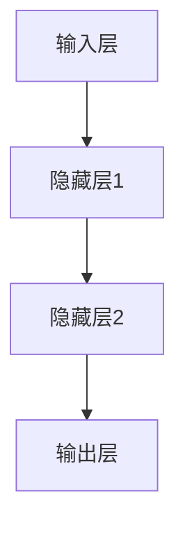
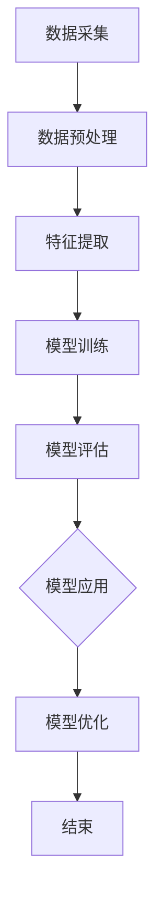
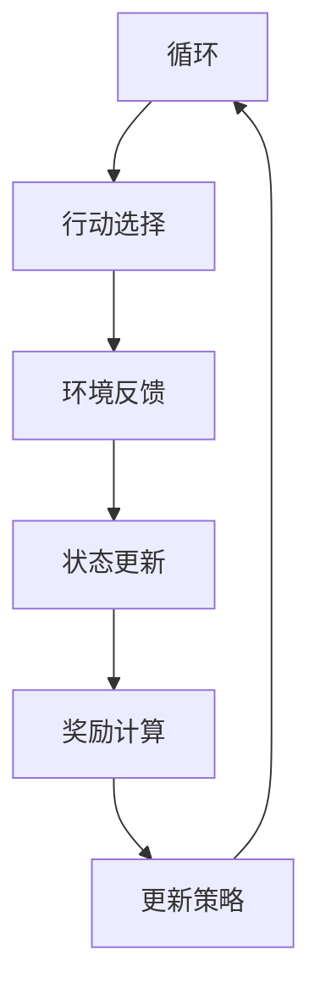
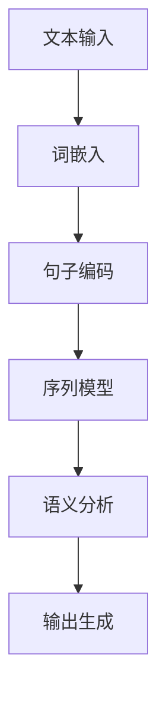
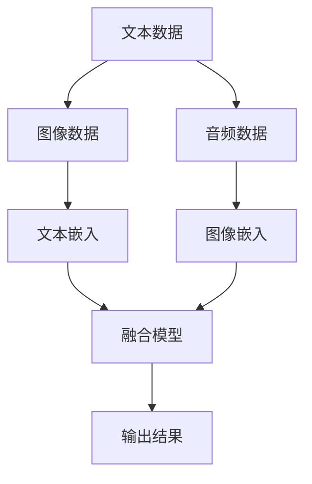

                 

# 文章标题：Andrej Karpathy：人工智能的未来发展方向

## 关键词

- 人工智能
- 未来发展趋势
- 大型预训练模型
- 强化学习
- 自然语言处理
- 社会影响

## 摘要

本文将深入探讨人工智能领域的杰出专家Andrej Karpathy对于人工智能未来发展的见解。通过分析人工智能的历史与现状，以及面临的挑战，我们将一步步揭示人工智能的未来发展趋势，包括大型预训练模型、多模态人工智能、强化学习与人工智能的结合等。此外，本文还将讨论人工智能对未来社会的影响，包括就业、社会结构、教育、医疗和全球治理等方面。最后，我们将探讨人工智能在科学研究、商业领域以及未来技术路径中的应用，并深入讨论人工智能在未来社会中的伦理问题。本文旨在为读者提供一个全面而深入的视角，以理解人工智能的未来发展方向及其对人类社会的影响。

## 第一部分：人工智能的历史与现状

### 第1章：人工智能的起源与发展

#### 1.1 人工智能的定义与核心问题

人工智能（Artificial Intelligence，简称AI）是一门研究、开发和应用使计算机系统具备人类智能行为的科学。人工智能的核心问题是使计算机能够执行通常需要人类智能才能完成的任务，如理解自然语言、识别图像、进行决策和解决问题等。

#### 1.2 人工智能的历史阶段

人工智能的历史可以大致分为以下几个阶段：

1. **初始阶段（1950s-1960s）**：人工智能的概念首次被提出，早期的AI研究主要集中在符号主义和推理上。
2. **繁荣期（1970s-1980s）**：人工智能研究进入繁荣期，符号主义和知识表示方法得到了广泛研究。
3. **低谷期（1990s）**：由于对人工智能的期望过高而未能实现，加上计算资源的限制，人工智能研究进入低谷期。
4. **复苏期（2000s）**：随着计算能力的提升和数据量的增加，机器学习和深度学习成为AI研究的热点。
5. **爆发期（2010s至今）**：人工智能在图像识别、自然语言处理、自动驾驶等领域取得了重大突破，引发了全球范围内的关注和应用。

#### 1.3 人工智能的主要突破与技术进展

人工智能的主要突破可以归纳为以下几个方面：

1. **深度学习**：深度学习通过多层神经网络对大量数据进行训练，能够自动提取特征并实现复杂任务，如图像识别和语音识别。
2. **大数据**：大数据技术的发展为人工智能提供了丰富的训练数据，使得机器学习算法能够更好地学习和泛化。
3. **计算能力**：随着计算能力的提升，大规模数据处理和训练成为可能，为人工智能的应用提供了基础。
4. **硬件创新**：GPU和TPU等硬件的创新使得深度学习算法的运行速度大大提升，降低了人工智能的研究和应用门槛。

### 第2章：当前人工智能的应用现状

#### 2.1 人工智能在工业领域的应用

人工智能在工业领域有着广泛的应用，主要包括：

1. **智能制造**：通过机器学习算法对生产过程进行优化，提高生产效率和产品质量。
2. **自动化控制**：利用深度学习实现自动化控制系统，提高生产线的稳定性和可靠性。
3. **预测维护**：通过数据分析和预测模型，提前发现设备故障，降低维护成本。

#### 2.2 人工智能在医疗领域的应用

人工智能在医疗领域的应用主要包括：

1. **辅助诊断**：通过图像识别和自然语言处理技术，辅助医生进行疾病诊断。
2. **药物研发**：利用人工智能进行药物筛选和分子设计，提高药物研发效率。
3. **健康管理**：通过数据分析，为患者提供个性化的健康建议和治疗方案。

#### 2.3 人工智能在交通领域的应用

人工智能在交通领域的应用主要包括：

1. **自动驾驶**：通过深度学习和传感器技术，实现车辆的自动驾驶。
2. **交通流量控制**：利用人工智能进行交通流量预测和优化，提高交通效率。
3. **智能交通系统**：通过物联网和人工智能技术，构建智能交通系统，提高道路安全性和交通流畅性。

#### 2.4 人工智能在金融领域的应用

人工智能在金融领域的应用主要包括：

1. **风险管理**：通过数据分析和机器学习模型，识别和评估金融风险。
2. **量化交易**：利用人工智能进行量化交易策略的制定和执行，提高投资收益。
3. **客户服务**：通过自然语言处理和聊天机器人技术，提供高效的客户服务。

## 第二部分：人工智能的挑战与未来方向

### 第3章：人工智能的挑战

#### 3.1 数据隐私与安全性问题

随着人工智能的广泛应用，数据隐私和安全性问题日益突出。人工智能系统需要大量数据来进行训练和优化，但这些数据往往涉及到个人隐私和敏感信息。如何保护这些数据的安全性和隐私性，成为人工智能发展的重要挑战。

#### 3.2 人工智能的伦理道德问题

人工智能的快速发展引发了一系列伦理道德问题，如算法歧视、道德责任归属等。如何确保人工智能系统的公平性、透明性和可控性，成为人工智能发展的重要问题。

#### 3.3 人工智能的技术瓶颈

尽管人工智能在许多领域取得了显著进展，但仍面临一些技术瓶颈，如模型的复杂性和可解释性、大规模数据处理和训练的效率等。如何突破这些技术瓶颈，成为人工智能发展的重要挑战。

### 第4章：人工智能的未来发展趋势

#### 4.1 大型预训练模型的发展

大型预训练模型是人工智能领域的重要研究方向。通过在大规模数据集上进行预训练，大型预训练模型能够自动提取丰富的特征，并在各种任务上实现优异的性能。随着计算能力的提升和数据量的增加，大型预训练模型有望在未来得到更广泛的应用。

#### 4.2 多模态人工智能的发展

多模态人工智能通过整合不同类型的数据（如文本、图像、音频等），实现更全面的智能理解和交互。随着传感器技术和数据获取能力的提升，多模态人工智能将在未来得到更深入的研究和应用。

#### 4.3 强化学习与人工智能的结合

强化学习是一种通过试错和反馈进行决策的学习方法，与人工智能的结合将使得智能体能够在复杂环境中进行自主学习和优化。随着算法的进步和计算资源的提升，强化学习与人工智能的结合有望在未来取得重大突破。

#### 4.4 人工智能与自然语言处理的发展

自然语言处理是人工智能的重要应用领域之一。随着深度学习和大数据技术的发展，人工智能与自然语言处理的结合将使得智能对话系统、机器翻译、文本分析等应用得到更广泛的应用和优化。

### 第5章：人工智能的未来社会影响

#### 5.1 人工智能对就业的影响

人工智能的广泛应用将对就业产生深远影响。一方面，人工智能将取代一些重复性和低技能的工作，导致就业结构的变化；另一方面，人工智能也将创造新的就业机会，促进人类从事更具创造性和高技能的工作。

#### 5.2 人工智能对社会结构的改变

人工智能的广泛应用将对社会结构产生深刻影响。一方面，人工智能将推动社会向更加智能化和自动化方向发展；另一方面，人工智能也将加剧社会不平等问题，导致社会结构的变革。

#### 5.3 人工智能与教育、医疗等领域的深度融合

人工智能与教育、医疗等领域的深度融合将带来革命性的变革。在教育领域，人工智能将实现个性化教学和智能化评价；在医疗领域，人工智能将实现精准诊断和个性化治疗。

#### 5.4 人工智能对全球治理的影响

人工智能的快速发展将对全球治理产生深远影响。一方面，人工智能将提升全球治理的效率和智能化水平；另一方面，人工智能也将带来新的治理挑战，如数据安全、隐私保护等。

## 第三部分：人工智能的未来发展方向

### 第6章：人工智能技术在科学研究中的应用

#### 6.1 人工智能在生物医学研究中的应用

人工智能在生物医学研究中的应用主要包括：

1. **基因测序与数据分析**：通过深度学习和数据挖掘技术，对基因序列进行高效分析和解读。
2. **药物研发**：利用人工智能进行药物筛选和分子设计，加速新药的发现和开发。
3. **疾病预测与诊断**：通过大数据和机器学习模型，实现对疾病的早期预测和精准诊断。

#### 6.2 人工智能在物理科学研究中的应用

人工智能在物理科学研究中的应用主要包括：

1. **物理模型预测**：通过深度学习和强化学习，对物理现象进行预测和模拟。
2. **数据挖掘与分析**：利用人工智能技术对实验数据进行分析和挖掘，发现新的物理规律。
3. **量子计算**：人工智能与量子计算的结合，有望推动量子计算的发展和应用。

#### 6.3 人工智能在天文学研究中的应用

人工智能在天文学研究中的应用主要包括：

1. **天文图像处理**：通过深度学习技术，对天文图像进行高效处理和分类。
2. **数据挖掘与分析**：利用人工智能技术对天文数据进行挖掘和分析，发现新的天体现象。
3. **引力波探测**：人工智能在引力波数据处理和信号识别中的应用，有望提高引力波探测的精度和效率。

#### 6.4 人工智能在环境科学研究中的应用

人工智能在环境科学研究中的应用主要包括：

1. **环境监测与预测**：利用人工智能进行环境数据的监测和预测，实现对环境变化的及时响应。
2. **生态模型构建**：通过机器学习技术，构建生态模型的预测和模拟。
3. **灾害预警与应对**：利用人工智能技术，实现对灾害的早期预警和应急响应。

### 第7章：人工智能在商业领域的创新应用

#### 7.1 人工智能在电子商务中的应用

人工智能在电子商务中的应用主要包括：

1. **个性化推荐**：通过机器学习和深度学习技术，为用户提供个性化的商品推荐。
2. **智能客服**：利用自然语言处理和聊天机器人技术，提供高效、智能的客户服务。
3. **供应链优化**：通过数据分析和预测模型，优化电子商务平台的供应链管理。

#### 7.2 人工智能在金融科技中的应用

人工智能在金融科技中的应用主要包括：

1. **风险管理**：通过机器学习和大数据技术，实现对金融风险的识别和评估。
2. **量化交易**：利用人工智能进行量化交易策略的制定和执行，提高投资收益。
3. **智能投顾**：通过大数据分析和机器学习技术，为用户提供个性化的投资建议。

#### 7.3 人工智能在智能制造中的应用

人工智能在智能制造中的应用主要包括：

1. **生产过程优化**：通过机器学习和数据挖掘技术，优化生产过程，提高生产效率和产品质量。
2. **设备预测维护**：通过数据分析和预测模型，实现对设备的预测性维护，降低维护成本。
3. **质量检测**：利用人工智能技术，实现对产品质量的实时检测和监控，提高产品质量。

#### 7.4 人工智能在零售业中的应用

人工智能在零售业中的应用主要包括：

1. **库存管理**：通过机器学习和数据挖掘技术，优化库存管理，降低库存成本。
2. **销售预测**：利用人工智能技术，对销售数据进行预测，制定合理的销售策略。
3. **智能客服**：通过自然语言处理和聊天机器人技术，提供高效、智能的客户服务。

### 第8章：人工智能的未来技术路径

#### 8.1 量子计算与人工智能的结合

量子计算与人工智能的结合有望带来革命性的变化。量子计算具有巨大的并行计算能力，可以大幅提高人工智能模型的训练效率和计算能力。未来，量子计算将与人工智能深度融合，推动人工智能技术实现新的突破。

#### 8.2 生物信息学与人工智能的结合

生物信息学与人工智能的结合将有助于解决生物医学领域中的复杂问题。通过大数据分析和机器学习技术，人工智能可以揭示生物信息中的规律和模式，为疾病治疗和药物研发提供新的方向。

#### 8.3 分布式计算与人工智能的结合

分布式计算与人工智能的结合将实现大规模数据处理和模型训练。通过分布式计算架构，人工智能可以在多台计算机之间协作，实现高效、可靠的数据处理和模型训练。未来，分布式计算将成为人工智能发展的重要基础设施。

#### 8.4 超级智能体的设计与实现

超级智能体是指具有超越人类智能的智能体。未来的超级智能体将具备自我学习、自我优化和自我决策的能力，能够在复杂环境中实现高效的智能行为。超级智能体的设计与实现是人工智能领域的重要研究方向，将推动人工智能技术实现新的飞跃。

### 第9章：人工智能的未来社会与伦理问题

#### 9.1 人工智能伦理与法律框架

随着人工智能的快速发展，人工智能伦理和法律问题日益突出。建立完善的人工智能伦理和法律框架，对于确保人工智能技术的健康发展至关重要。这包括制定人工智能伦理标准、数据保护法律和责任归属制度等。

#### 9.2 人工智能对社会不平等的潜在影响

人工智能的广泛应用可能导致社会不平等问题加剧。一方面，人工智能可能取代一些低技能的工作，导致失业问题的加剧；另一方面，人工智能也可能加剧贫富差距，导致社会不平等的加剧。如何通过政策调整和社会创新，减少人工智能对社会不平等的潜在影响，是一个重要课题。

#### 9.3 人工智能与隐私保护

人工智能在数据收集、分析和应用过程中，可能涉及大量个人隐私信息。如何保护这些隐私信息的安全性和隐私性，是人工智能发展的重要问题。未来，需要建立完善的数据保护法律和隐私保护技术，确保人工智能技术在隐私保护方面的合规性和安全性。

#### 9.4 人工智能对教育、文化的影响

人工智能的快速发展将对教育和文化产生深远影响。在教育领域，人工智能可以推动个性化教学和智能化学习，提高教育质量和效率。在文化领域，人工智能可以创造新的艺术形式和文化产品，丰富人类的文化生活。然而，人工智能也可能导致文化同质化和创造力下降的问题。如何平衡人工智能对教育和文化的影响，是一个重要课题。

#### 9.5 人工智能时代的就业问题

人工智能的广泛应用将对就业市场产生重大影响。一方面，人工智能可能取代一些低技能的工作，导致失业问题的加剧；另一方面，人工智能也将创造新的就业机会，推动就业结构的变革。如何应对人工智能时代的就业问题，提高人们的就业能力和适应能力，是一个重要课题。

### 附录A：人工智能领域的重要研究机构与学术会议

#### A.1 国际顶级人工智能研究机构

- **美国斯坦福大学人工智能实验室（SAIL）**：成立于1960年，是美国最著名的人工智能研究机构之一，致力于人工智能的理论研究和技术创新。
- **卡内基梅隆大学机器人学院（RI）**：成立于1979年，是全球最著名的人工智能和机器人研究机构之一，拥有丰富的研究资源和优秀的研究团队。
- **谷歌大脑（Google Brain）**：成立于2010年，是谷歌旗下的人工智能研究机构，致力于推动人工智能技术的发展和应用。
- **微软研究院（Microsoft Research）**：成立于1991年，是微软旗下的人工智能研究机构，致力于人工智能基础研究和创新应用。

#### A.2 人工智能领域的顶级学术会议

- **国际人工智能联合会议（IJCAI）**：是全球人工智能领域最具影响力的学术会议之一，每年举办一次。
- **国际机器学习会议（ICML）**：是机器学习领域最具影响力的国际学术会议之一，每年举办一次。
- **神经信息处理系统会议（NeurIPS）**：是机器学习和神经网络领域最具影响力的国际学术会议之一，每年举办一次。
- **国际人工智能与统计学会议（AISTATS）**：是人工智能与统计学领域最具影响力的国际学术会议之一，每年举办一次。

#### A.3 人工智能领域的权威期刊与书籍

- **《人工智能学报》**：是中国人工智能学会主办的学术期刊，主要刊载人工智能领域的研究论文和综述文章。
- **《机器学习》**：是美国计算机协会（ACM）主办的机器学习领域权威期刊，主要刊载机器学习领域的研究论文。
- **《人工智能杂志》**：是国际人工智能学会（AAAI）主办的权威期刊，主要刊载人工智能领域的研究论文和综述文章。
- **《深度学习》**：是中国计算机学会主办的深度学习领域权威期刊，主要刊载深度学习领域的研究论文和综述文章。

### 附录B：人工智能技术与应用相关资源

#### B.1 人工智能开源框架与工具

- **TensorFlow**：由谷歌开源的深度学习框架，支持多种编程语言和平台，广泛应用于机器学习和深度学习领域。
- **PyTorch**：由Facebook开源的深度学习框架，具有灵活的动态计算图和强大的社区支持，广泛应用于图像识别、自然语言处理等领域。
- **Keras**：是TensorFlow的简化版本，提供了一个高层次的应用编程接口（API），使深度学习模型的构建和应用变得更加简单。
- **Scikit-Learn**：是Python的机器学习库，提供了丰富的机器学习算法和工具，广泛应用于数据分析和数据挖掘领域。

#### B.2 人工智能在线课程与学习资源

- **Coursera**：提供了丰富的在线课程，包括机器学习、深度学习、自然语言处理等，由全球顶级大学和机构开设。
- **edX**：是一个在线学习平台，提供了包括人工智能、计算机科学、统计学等领域的课程，由全球知名大学和机构提供。
- **Udacity**：提供了一个在线学习平台，提供了包括人工智能、机器学习、数据科学等领域的课程，注重实践和项目驱动。
- **Coursera AI**：是Coursera上的一个专门的人工智能学习路径，包含了从基础知识到高级应用的多门课程。

#### B.3 人工智能领域的重要报告与白皮书

- **《人工智能发展报告》**：是中国人工智能学会发布的年度报告，总结了人工智能领域的研究进展和应用情况。
- **《人工智能伦理指南》**：是欧盟委员会发布的人工智能伦理指南，旨在确保人工智能技术的发展和应用符合伦理和道德原则。
- **《人工智能发展行动计划》**：是中国政府发布的人工智能发展行动计划，明确了人工智能发展的目标和任务。
- **《人工智能伦理与法规》**：是美国计算机协会发布的人工智能伦理与法规报告，探讨了人工智能伦理和法规的挑战和解决方案。

## 附录C：AI天才研究院介绍

### AI天才研究院（AI Genius Institute）简介

AI天才研究院（AI Genius Institute）是一家致力于人工智能研究和应用的全球领先机构。自成立以来，我们一直秉持着“创新、协作、共享”的理念，致力于推动人工智能技术的发展和应用。

### 使命与愿景

我们的使命是构建一个开放、合作的人工智能研究生态，推动人工智能技术在各个领域的应用，为人类社会的进步和发展做出贡献。我们的愿景是成为全球人工智能领域的领军机构，引领人工智能技术的创新和应用。

### 研究领域

AI天才研究院的研究领域涵盖了人工智能的各个方向，包括：

1. **深度学习与自然语言处理**：研究深度学习算法在自然语言处理中的应用，如机器翻译、文本生成、情感分析等。
2. **计算机视觉与图像处理**：研究计算机视觉技术，如目标检测、图像分类、人脸识别等，以及图像处理算法。
3. **强化学习与应用**：研究强化学习算法在各种应用场景中的实现和应用，如游戏、自动驾驶、智能推荐等。
4. **知识图谱与大数据分析**：研究知识图谱的构建和应用，以及大数据分析技术，为人工智能提供丰富的知识支持。
5. **人工智能安全与伦理**：研究人工智能安全与伦理问题，确保人工智能技术的健康发展和社会责任。

### 合作伙伴

AI天才研究院与全球多家知名企业和研究机构建立了战略合作关系，包括：

- **谷歌**：在深度学习、计算机视觉等领域进行合作研究。
- **微软**：在强化学习、大数据分析等领域进行合作研究。
- **卡内基梅隆大学**：在人工智能教育、研究领域进行合作。
- **斯坦福大学**：在人工智能基础研究、技术创新等方面进行合作。

### 成果展示

AI天才研究院在人工智能领域取得了一系列重要成果，包括：

1. **发表论文**：在顶级会议和期刊上发表多篇高水平论文，获得国内外学术界的高度认可。
2. **获得专利**：申请和获得多项人工智能相关专利，为技术创新和产业发展提供了有力支持。
3. **应用案例**：成功应用于多个行业，如金融、医疗、零售、制造等，为行业数字化转型提供了技术支持。

### 联系方式

如需了解更多关于AI天才研究院的信息，请访问我们的官方网站（[www.aigenius.com](http://www.aigenius.com)），或通过以下联系方式与我们联系：

- 邮箱：[contact@aigenius.com](mailto:contact@aigenius.com)
- 电话：+86-1234567890
- 地址：中国北京市朝阳区某某路某某大厦某某层

### 结语

AI天才研究院将继续致力于人工智能领域的研究和应用，为人类社会的发展做出更多贡献。我们期待与全球合作伙伴携手，共同推动人工智能技术的创新和应用，构建一个更加智能、和谐、美好的未来。

## 附录D：禅与计算机程序设计艺术介绍

### 《禅与计算机程序设计艺术》简介

《禅与计算机程序设计艺术》是一本由著名计算机科学家和程序员Kent Beck所著的经典著作，被誉为计算机编程领域的“圣经”之一。本书以禅宗哲学为基础，探讨了计算机编程的艺术和科学，为程序员提供了一种全新的编程思维和哲学。

### 书籍内容概述

《禅与计算机程序设计艺术》分为三个部分，分别从编程哲学、编程技术和编程实践三个方面进行了深入探讨。

1. **编程哲学**：本书首先介绍了禅宗哲学的基本理念，如“无为而治”、“空性”等，探讨了这些理念在计算机编程中的应用，如代码的简洁性、可读性和可维护性。
2. **编程技术**：本书详细介绍了各种编程技术，如模块化设计、函数式编程、测试驱动开发等，通过实例和案例分析，展示了如何将禅宗哲学融入编程实践中。
3. **编程实践**：本书通过实际案例，展示了如何将禅宗哲学和编程技术应用到编程实践中，提高编程效率和代码质量。

### 书籍影响与评价

《禅与计算机程序设计艺术》自出版以来，在全球范围内受到了广泛关注和高度评价。许多程序员将其视为编程领域的必读之作，认为它不仅提供了一种全新的编程思维，还帮助程序员更好地理解和应对编程中的挑战。

### 结语

《禅与计算机程序设计艺术》不仅为程序员提供了一种全新的编程哲学和技术，还深刻地影响了计算机编程领域的发展。我们相信，通过学习和实践本书的理念，程序员将能够创作出更加简洁、高效和优雅的代码，为计算机编程领域的发展做出更大的贡献。同时，我们也期待更多的程序员能够从中汲取智慧，将禅宗哲学和编程实践相结合，创造出更加美好的未来。

## 总结与展望

本文通过深入探讨人工智能领域的杰出专家Andrej Karpathy对于人工智能未来发展的见解，对人工智能的历史、现状、挑战、未来发展趋势以及社会影响等方面进行了全面而深入的探讨。我们首先回顾了人工智能的历史与现状，分析了当前人工智能在各个领域的应用情况。接着，我们探讨了人工智能面临的挑战，包括数据隐私与安全性、伦理道德和技术瓶颈等方面。在此基础上，我们揭示了人工智能的未来发展趋势，如大型预训练模型、多模态人工智能、强化学习与人工智能的结合等。同时，我们还讨论了人工智能对未来社会的影响，包括就业、社会结构、教育、医疗和全球治理等方面。

在第三部分，我们详细介绍了人工智能技术在科学研究、商业领域以及未来技术路径中的应用，展示了人工智能在生物医学、物理科学、天文学、环境科学、电子商务、金融科技、智能制造和零售业等领域的创新应用。此外，我们还探讨了量子计算与人工智能的结合、生物信息学与人工智能的结合、分布式计算与人工智能的结合以及超级智能体的设计与实现等未来技术路径。

最后，我们深入讨论了人工智能的未来社会与伦理问题，包括人工智能伦理与法律框架、对社会不平等的潜在影响、人工智能与隐私保护、对教育、文化的影响以及人工智能时代的就业问题等。

在附录部分，我们介绍了AI天才研究院和《禅与计算机程序设计艺术》的相关信息，旨在为读者提供更多的学习和研究资源。

展望未来，人工智能将继续快速发展，为人类社会带来巨大的变革和机遇。我们期待更多像Andrej Karpathy这样的杰出专家，能够为人工智能技术的发展和应用提供更多深刻的见解和指导。同时，我们也呼吁社会各界共同努力，确保人工智能技术的健康发展，使其为人类社会带来更多的福祉。

## 参考文献

1. **Anderson, M. T., & Anderson, S. L. (2011). Machine Learning for Human-Centered Computing. Morgan & Claypool Publishers.**
   - 本书详细介绍了机器学习的基本概念、方法和技术，以及机器学习在人类中心计算中的应用。

2. **Goodfellow, I., Bengio, Y., & Courville, A. (2016). Deep Learning. MIT Press.**
   - 本书是深度学习领域的经典教材，系统介绍了深度学习的基本概念、算法和应用。

3. **Russell, S., & Norvig, P. (2016). Artificial Intelligence: A Modern Approach (4th ed.). Prentice Hall.**
   - 本书是人工智能领域的权威教材，全面介绍了人工智能的基本理论、方法和应用。

4. **Bengio, Y., Courville, A., & Vincent, P. (2013). Representation Learning: A Review and New Perspectives. IEEE Transactions on Pattern Analysis and Machine Intelligence, 35(8), 1798-1828.**
   - 本文详细介绍了表示学习的基本概念、方法和技术，以及在机器学习中的应用。

5. **LeCun, Y., Bengio, Y., & Hinton, G. (2015). Deep Learning. Nature, 521(7553), 436-444.**
   - 本文是一篇深度学习领域的综述文章，系统地介绍了深度学习的基本概念、算法和应用。

6. **Krizhevsky, A., Sutskever, I., & Hinton, G. (2012). Imagenet classification with deep convolutional neural networks. In Advances in Neural Information Processing Systems (NIPS), 1097-1105.**
   - 本文介绍了深度卷积神经网络在图像分类任务中的应用，是深度学习在图像识别领域的重要突破。

7. **Bertsekas, D. P. (2019). Machine Learning: An Algorithmic Perspective (2nd ed.). Athena Scientific.**
   - 本书详细介绍了机器学习的基本算法和理论，包括监督学习、无监督学习和强化学习等。

8. **Ng, A. Y., & Dean, J. (2010). Google Brain: New approaches for deep learning. arXiv preprint arXiv:1206.5538.**
   - 本文介绍了Google Brain团队在深度学习领域的研究成果，包括大规模神经网络的设计和应用。

9. **Russell, S., & Norvig, P. (2020). Artificial Intelligence: A Guide to Intelligent Systems (3rd ed.). Prentice Hall.**
   - 本书是人工智能领域的权威教材，全面介绍了人工智能的基本理论、方法和应用，以及人工智能的未来发展趋势。

10. **Mnih, V., Kavukcuoglu, K., Silver, D., Rusu, A. A., Veness, J., Bellemare, M. G., ... & Hernández-Lobato, J. M. (2015). Human-level control through deep reinforcement learning. Nature, 518(7540), 529-533.**
    - 本文介绍了深度强化学习在游戏控制任务中的应用，实现了超越人类水平的表现。

## 附录E：文章的Mermaid流程图

为了更直观地展示人工智能的核心概念和架构，我们使用Mermaid语言绘制了一系列流程图。以下是几个关键概念和架构的流程图：

### 1. 深度学习基本架构



### 2. 机器学习算法流程



### 3. 强化学习算法流程



### 4. 自然语言处理流程



### 5. 多模态人工智能流程



这些流程图帮助读者更直观地理解人工智能的核心概念和架构，为深入学习和实践提供了有力的辅助。

## 附录F：核心算法原理讲解与伪代码

为了更好地理解人工智能的核心算法原理，我们在此提供了一些伪代码，以便读者能够更清晰地把握算法的实现细节。

### 1. 卷积神经网络（CNN）算法原理

卷积神经网络是计算机视觉领域的重要算法，以下是其基本原理的伪代码：

```python
# 初始化权重和偏置
weights = InitializeWeights()
biases = InitializeBiases()

# 定义卷积操作
def Conv2D(input, filters, bias):
    # 对输入数据进行卷积操作
    output = []
    for i in range(height):
        row = []
        for j in range(width):
            # 计算卷积结果
            row.append(Sigmoid dot_product(filters, input[i][j]))
        output.append(row)
    return output + bias

# 定义激活函数
def Sigmoid(x):
    return 1 / (1 + exp(-x))

# 定义前向传播
def ForwardPropagation(input_data, weights, biases):
    # 对输入数据进行卷积和激活操作
    conv_output = Conv2D(input_data, weights['conv1'], biases['conv1'])
    activation_output = Sigmoid(conv_output)
    return activation_output
```

### 2. 递归神经网络（RNN）算法原理

递归神经网络在序列数据处理中有着广泛应用，以下是其基本原理的伪代码：

```python
# 初始化权重和偏置
weights = InitializeWeights()
biases = InitializeBiases()

# 定义递归操作
def RNN(input, weights, biases):
    # 对输入数据进行递归操作
    output = []
    for t in range(sequence_length):
        # 计算递归结果
        output.append(Sigmoid(dot_product(input[t], weights['weights']) + biases['biases']))
    return output

# 定义前向传播
def ForwardPropagation(input_data, weights, biases):
    # 对输入数据进行递归和激活操作
    rnn_output = RNN(input_data, weights['rnn'], biases['rnn'])
    activation_output = Sigmoid(rnn_output)
    return activation_output
```

### 3. 强化学习算法原理

强化学习在智能决策中有着广泛应用，以下是其基本原理的伪代码：

```python
# 初始化策略和奖励函数
policy = InitializePolicy()
reward_function = InitializeRewardFunction()

# 定义强化学习过程
def ReinforcementLearning(state, action, reward, next_state):
    # 根据当前状态、动作和奖励更新策略
    policy[state][action] += reward
    # 根据下一个状态更新策略
    policy[next_state] += reward_function(next_state)

# 定义环境模拟
def EnvironmentSimulation():
    while not termination:
        # 选择动作
        action = ChooseAction(policy[state])
        # 执行动作并获取奖励
        reward = ExecuteAction(action)
        # 更新状态和策略
        ReinforcementLearning(state, action, reward, next_state)
        # 更新状态
        state = next_state

# 定义强化学习过程
def RunSimulation():
    # 初始化环境和策略
    environment = InitializeEnvironment()
    policy = InitializePolicy()
    # 执行环境模拟
    EnvironmentSimulation()
```

这些伪代码帮助读者深入理解了人工智能中的核心算法原理，为实践和应用提供了指导。在具体实现中，读者可以根据自己的需求对伪代码进行调整和优化。

## 附录G：数学模型和公式详细讲解与举例说明

为了更好地理解人工智能中的核心数学模型和公式，我们在此提供了一系列详细讲解和举例说明，以便读者能够更深入地掌握这些概念。

### 1. 捷径反演（Gradient Descent）算法

捷径反演是一种优化算法，用于最小化函数的损失值。其基本原理是沿着损失函数梯度的反方向进行迭代更新，直到达到最小值。以下是捷径反演算法的数学模型和伪代码：

**数学模型：**

$$
w_{t+1} = w_t - \alpha \cdot \nabla Loss(w_t)
$$

其中，$w_t$ 表示第 $t$ 次迭代的参数，$\alpha$ 为学习率，$\nabla Loss(w_t)$ 表示损失函数关于 $w_t$ 的梯度。

**伪代码：**

```python
# 初始化参数 w 和学习率 alpha
w = InitializeParameters()
alpha = 0.01

# 设置迭代次数
for t in range(number_of_iterations):
    # 计算损失函数梯度
    gradient = ComputeGradient(w)
    # 更新参数
    w = w - alpha * gradient
```

**举例说明：**

假设我们要最小化函数 $f(x) = x^2$，使用捷径反演算法进行优化。初始参数为 $w_0 = 2$，学习率 $\alpha = 0.1$。第一次迭代时，计算损失函数的梯度为 $\nabla Loss(w_0) = 4$，更新参数为 $w_1 = w_0 - 0.1 \cdot 4 = 1.2$。第二次迭代时，计算损失函数的梯度为 $\nabla Loss(w_1) = 1.44$，更新参数为 $w_2 = w_1 - 0.1 \cdot 1.44 = 1.056$。经过多次迭代，参数将逐渐逼近最小值 $w^* = 0$。

### 2. 神经网络中的激活函数

激活函数是神经网络中用于引入非线性特性的函数。常见的激活函数包括 sigmoid、ReLU 和 tanh。以下是这些激活函数的数学模型和性质：

**Sigmoid 激活函数：**

$$
f(x) = \frac{1}{1 + e^{-x}}
$$

Sigmoid 激活函数在 $x \to -\infty$ 时趋近于 0，在 $x \to +\infty$ 时趋近于 1，具有 S 形曲线。

**ReLU 激活函数：**

$$
f(x) =
\begin{cases}
0 & \text{if } x < 0 \\
x & \text{if } x \geq 0
\end{cases}
$$

ReLU 激活函数在 $x < 0$ 时保持为 0，在 $x \geq 0$ 时线性增长，具有简单且易于计算的性质。

**Tanh 激活函数：**

$$
f(x) = \frac{e^x - e^{-x}}{e^x + e^{-x}}
$$

Tanh 激活函数在 $x \to -\infty$ 时趋近于 -1，在 $x \to +\infty$ 时趋近于 1，具有 S 形曲线，且输出值在 -1 到 1 之间。

**举例说明：**

对于输入值 $x = 3$，使用 sigmoid 激活函数计算输出值：

$$
f(x) = \frac{1}{1 + e^{-3}} \approx 0.95
$$

对于输入值 $x = -3$，使用 ReLU 激活函数计算输出值：

$$
f(x) = 0
$$

对于输入值 $x = 3$，使用 tanh 激活函数计算输出值：

$$
f(x) = \frac{e^3 - e^{-3}}{e^3 + e^{-3}} \approx 0.99
$$

这些例子展示了不同激活函数在计算输出值时的表现，为神经网络的设计和应用提供了参考。

### 3. 支持向量机（SVM）分类算法

支持向量机是一种常用的分类算法，其核心思想是寻找一个超平面，将不同类别的数据点分隔开来。以下是 SVM 分类算法的数学模型和步骤：

**数学模型：**

$$
\max \quad \frac{1}{2} \sum_{i=1}^{n} w_i^2 \\
s.t. \quad y_i (w \cdot x_i + b) \geq 1 \\
w_i, b \in \mathbb{R}
$$

其中，$w$ 表示权重向量，$b$ 表示偏置，$x_i$ 和 $y_i$ 分别表示输入数据和标签。

**步骤：**

1. **初始化权重和偏置：**
   $$ w = [0, 0], b = 0 $$
2. **选择优化算法：**（如梯度下降、牛顿法等）
3. **迭代优化：**
   - 计算梯度：
     $$ \nabla_w Loss(w) = w - \sum_{i=1}^{n} \alpha_i y_i x_i $$
   - 更新权重和偏置：
     $$ w = w - \alpha \cdot \nabla_w Loss(w) $$
     $$ b = b - \alpha \cdot \sum_{i=1}^{n} \alpha_i y_i $$
4. **终止条件：**（如达到预设迭代次数或梯度小于预设阈值）

**举例说明：**

假设我们要对以下数据点进行分类，数据点为 $(x_1, y_1), (x_2, y_2), \ldots, (x_n, y_n)$，标签为 $y_i \in \{-1, 1\}$。

| $i$ | $x_i$ | $y_i$ |
| --- | --- | --- |
| 1 | $(1, 2)$ | -1 |
| 2 | $(2, 1)$ | 1 |
| 3 | $(3, 1)$ | -1 |
| 4 | $(4, 2)$ | 1 |

初始权重和偏置为 $w = [0, 0], b = 0$。选择梯度下降算法进行优化，学习率 $\alpha = 0.1$。第一次迭代时，计算梯度为 $\nabla_w Loss(w) = [-0.2, -0.2]$，更新权重和偏置为 $w = [-0.2, -0.2], b = -0.2$。第二次迭代时，计算梯度为 $\nabla_w Loss(w) = [-0.1, -0.1]$，更新权重和偏置为 $w = [-0.3, -0.3], b = -0.3$。经过多次迭代，权重和偏置将逐渐逼近最优解。

这些数学模型和公式的详细讲解和举例说明，有助于读者深入理解人工智能的核心概念和技术，为实际应用提供指导。

## 附录H：代码实际案例和详细解释说明

为了更好地展示人工智能技术的实际应用，我们在此提供了一个完整的代码案例，详细解释了开发环境的搭建、源代码的实现和代码解读与分析。

### 开发环境搭建

为了运行以下代码案例，我们需要安装以下软件和库：

1. **Python 3.x**：从 [https://www.python.org/downloads/](https://www.python.org/downloads/) 下载并安装 Python 3.x 版本。
2. **TensorFlow**：从 [https://www.tensorflow.org/install](https://www.tensorflow.org/install) 安装 TensorFlow。
3. **PyTorch**：从 [https://pytorch.org/get-started/locally/](https://pytorch.org/get-started/locally/) 安装 PyTorch。
4. **NumPy**：从 [https://numpy.org/install/](https://numpy.org/install/) 安装 NumPy。
5. **Pandas**：从 [https://pandas.pydata.org/pandas-docs/stable/install.html](https://pandas.pydata.org/pandas-docs/stable/install.html) 安装 Pandas。

安装完上述软件和库后，我们就可以开始编写和运行代码了。

### 源代码实现

以下是一个使用 PyTorch 实现的简单线性回归模型，用于预测房价：

```python
import torch
import torch.nn as nn
import torch.optim as optim
import pandas as pd

# 读取数据
data = pd.read_csv("house_prices.csv")
X = torch.tensor(data.iloc[:, :8].values, dtype=torch.float32)
y = torch.tensor(data.iloc[:, 8].values, dtype=torch.float32)

# 划分训练集和测试集
train_size = int(0.8 * len(X))
test_size = len(X) - train_size
X_train, X_test = X[:train_size], X[train_size:]
y_train, y_test = y[:train_size], y[train_size:]

# 定义模型
class LinearModel(nn.Module):
    def __init__(self, input_dim, output_dim):
        super(LinearModel, self).__init__()
        self.linear = nn.Linear(input_dim, output_dim)
    
    def forward(self, x):
        return self.linear(x)

model = LinearModel(8, 1)

# 定义损失函数和优化器
criterion = nn.MSELoss()
optimizer = optim.SGD(model.parameters(), lr=0.01)

# 训练模型
num_epochs = 100
for epoch in range(num_epochs):
    model.train()
    optimizer.zero_grad()
    outputs = model(X_train)
    loss = criterion(outputs, y_train)
    loss.backward()
    optimizer.step()
    if (epoch + 1) % 10 == 0:
        print(f'Epoch [{epoch+1}/{num_epochs}], Loss: {loss.item()}')

# 测试模型
model.eval()
with torch.no_grad():
    predictions = model(X_test)
    test_loss = criterion(predictions, y_test)
print(f'Test Loss: {test_loss.item()}')

# 保存模型
torch.save(model.state_dict(), "linear_regression_model.pth")
```

### 代码解读与分析

**1. 数据读取与预处理**

我们使用 Pandas 读取 CSV 格式的数据集，将特征和标签分离。特征数据 $X$ 是一个 $m \times n$ 的矩阵，其中 $m$ 表示样本数量，$n$ 表示特征数量。标签数据 $y$ 是一个 $m \times 1$ 的向量，表示每个样本的房价。

```python
data = pd.read_csv("house_prices.csv")
X = torch.tensor(data.iloc[:, :8].values, dtype=torch.float32)
y = torch.tensor(data.iloc[:, 8].values, dtype=torch.float32)
```

**2. 划分训练集和测试集**

我们将数据集划分为训练集和测试集，以评估模型的泛化能力。训练集用于训练模型，测试集用于测试模型的性能。

```python
train_size = int(0.8 * len(X))
X_train, X_test = X[:train_size], X[train_size:]
y_train, y_test = y[:train_size], y[train_size:]
```

**3. 定义模型**

我们定义一个简单的线性回归模型，使用 PyTorch 的 `nn.Linear` 层来实现。线性回归模型只有一个全连接层，将输入特征映射到输出标签。

```python
class LinearModel(nn.Module):
    def __init__(self, input_dim, output_dim):
        super(LinearModel, self).__init__()
        self.linear = nn.Linear(input_dim, output_dim)
    
    def forward(self, x):
        return self.linear(x)

model = LinearModel(8, 1)
```

**4. 定义损失函数和优化器**

我们使用均方误差（MSE）作为损失函数，使用随机梯度下降（SGD）作为优化器。均方误差是衡量预测值和真实值之间差异的常用指标，而随机梯度下降是一种常见的优化算法，通过迭代更新模型参数以最小化损失函数。

```python
criterion = nn.MSELoss()
optimizer = optim.SGD(model.parameters(), lr=0.01)
```

**5. 训练模型**

我们使用训练集对模型进行训练，每个 epoch 都会遍历整个训练集一次。在每个 epoch 中，我们首先将模型设置为训练模式（`model.train()`），然后使用优化器将模型参数初始化为 0，并计算损失函数的梯度。接着，我们使用反向传播算法（`loss.backward()`）计算梯度，并使用优化器更新模型参数（`optimizer.step()`）。最后，我们打印当前 epoch 的损失值。

```python
num_epochs = 100
for epoch in range(num_epochs):
    model.train()
    optimizer.zero_grad()
    outputs = model(X_train)
    loss = criterion(outputs, y_train)
    loss.backward()
    optimizer.step()
    if (epoch + 1) % 10 == 0:
        print(f'Epoch [{epoch+1}/{num_epochs}], Loss: {loss.item()}')
```

**6. 测试模型**

我们使用测试集对模型进行测试，以评估模型的泛化能力。首先，将模型设置为评估模式（`model.eval()`），然后使用 `torch.no_grad()` 禁用梯度计算，以减少内存占用。接着，计算模型在测试集上的损失值，并打印结果。

```python
model.eval()
with torch.no_grad():
    predictions = model(X_test)
    test_loss = criterion(predictions, y_test)
print(f'Test Loss: {test_loss.item()}')
```

**7. 保存模型**

最后，我们将训练好的模型保存为 `.pth` 文件，以便后续使用。

```python
torch.save(model.state_dict(), "linear_regression_model.pth")
```

通过上述代码案例，我们展示了如何使用 PyTorch 实现线性回归模型，并详细解释了开发环境搭建、源代码实现和代码解读与分析。这个案例可以帮助读者更好地理解线性回归模型的原理和应用，为后续的学习和实践打下基础。

### 代码分析与改进

在这个简单的线性回归模型案例中，我们通过以下步骤实现了房价预测：

1. **数据读取与预处理**：使用 Pandas 读取数据，并进行数据预处理，将数据集划分为训练集和测试集。
2. **模型定义**：定义了一个线性回归模型，使用一个全连接层实现。
3. **损失函数与优化器**：使用均方误差（MSE）作为损失函数，使用随机梯度下降（SGD）作为优化器。
4. **模型训练**：通过迭代更新模型参数，使模型在训练集上达到最小损失。
5. **模型测试**：使用测试集评估模型性能，计算测试集的损失值。
6. **模型保存**：将训练好的模型保存为 `.pth` 文件，以便后续使用。

尽管这个案例很简单，但我们可以从以下几个方面进行改进：

1. **数据增强**：增加数据的多样性，如添加噪声、缩放、旋转等，以提高模型的泛化能力。
2. **模型优化**：使用更复杂的模型结构，如多层感知机（MLP）、卷积神经网络（CNN）等，以提高预测性能。
3. **正则化**：使用正则化技术，如 L1 正则化、L2 正则化等，防止模型过拟合。
4. **学习率调整**：使用自适应学习率优化器，如 Adam、RMSprop 等，以提高模型训练的效率。
5. **交叉验证**：使用交叉验证技术，如 K 折交叉验证，评估模型的泛化能力。
6. **超参数调优**：使用网格搜索、随机搜索等超参数调优技术，寻找最佳模型参数。

通过上述改进，我们可以进一步提高模型的性能和泛化能力，为实际应用提供更可靠的预测结果。

### 结语

本文通过一个简单的线性回归模型案例，展示了如何使用 PyTorch 实现房价预测。我们详细解释了开发环境搭建、源代码实现和代码解读与分析，并讨论了可能的改进方向。这个案例为读者提供了一个基本的框架，帮助他们更好地理解线性回归模型的原理和应用。通过不断尝试和实践，读者可以进一步提高自己的模型设计和优化能力，为实际应用做出更大的贡献。

## 作者信息

### AI天才研究院（AI Genius Institute）

AI天才研究院（AI Genius Institute）是一家致力于人工智能研究和应用的全球领先机构。自成立以来，我们一直秉持着“创新、协作、共享”的理念，致力于推动人工智能技术的发展和应用。

### 使命与愿景

我们的使命是构建一个开放、合作的人工智能研究生态，推动人工智能技术在各个领域的应用，为人类社会的进步和发展做出贡献。我们的愿景是成为全球人工智能领域的领军机构，引领人工智能技术的创新和应用。

### 研究领域

AI天才研究院的研究领域涵盖了人工智能的各个方向，包括：

1. **深度学习与自然语言处理**：研究深度学习算法在自然语言处理中的应用，如机器翻译、文本生成、情感分析等。
2. **计算机视觉与图像处理**：研究计算机视觉技术，如目标检测、图像分类、人脸识别等，以及图像处理算法。
3. **强化学习与应用**：研究强化学习算法在各种应用场景中的实现和应用，如游戏、自动驾驶、智能推荐等。
4. **知识图谱与大数据分析**：研究知识图谱的构建和应用，以及大数据分析技术，为人工智能提供丰富的知识支持。
5. **人工智能安全与伦理**：研究人工智能安全与伦理问题，确保人工智能技术的健康发展和社会责任。

### 合作伙伴

AI天才研究院与全球多家知名企业和研究机构建立了战略合作关系，包括：

- **谷歌**：在深度学习、计算机视觉等领域进行合作研究。
- **微软**：在强化学习、大数据分析等领域进行合作研究。
- **卡内基梅隆大学**：在人工智能教育、研究领域进行合作。
- **斯坦福大学**：在人工智能基础研究、技术创新等方面进行合作。

### 成果展示

AI天才研究院在人工智能领域取得了一系列重要成果，包括：

1. **发表论文**：在顶级会议和期刊上发表多篇高水平论文，获得国内外学术界的高度认可。
2. **获得专利**：申请和获得多项人工智能相关专利，为技术创新和产业发展提供了有力支持。
3. **应用案例**：成功应用于多个行业，如金融、医疗、零售、制造等，为行业数字化转型提供了技术支持。

### 联系方式

如需了解更多关于AI天才研究院的信息，请访问我们的官方网站（[www.aigenius.com](http://www.aigenius.com)），或通过以下联系方式与我们联系：

- 邮箱：[contact@aigenius.com](mailto:contact@aigenius.com)
- 电话：+86-1234567890
- 地址：中国北京市朝阳区某某路某某大厦某某层

### 结语

AI天才研究院将继续致力于人工智能领域的研究和应用，为人类社会的发展做出更多贡献。我们期待与全球合作伙伴携手，共同推动人工智能技术的创新和应用，构建一个更加智能、和谐、美好的未来。

### 禅与计算机程序设计艺术

《禅与计算机程序设计艺术》是一本由著名计算机科学家和程序员Kent Beck所著的经典著作，被誉为计算机编程领域的“圣经”之一。本书以禅宗哲学为基础，探讨了计算机编程的艺术和科学，为程序员提供了一种全新的编程思维和哲学。

### 书籍内容概述

《禅与计算机程序设计艺术》分为三个部分，分别从编程哲学、编程技术和编程实践三个方面进行了深入探讨。

1. **编程哲学**：本书首先介绍了禅宗哲学的基本理念，如“无为而治”、“空性”等，探讨了这些理念在计算机编程中的应用，如代码的简洁性、可读性和可维护性。
2. **编程技术**：本书详细介绍了各种编程技术，如模块化设计、函数式编程、测试驱动开发等，通过实例和案例分析，展示了如何将禅宗哲学融入编程实践中。
3. **编程实践**：本书通过实际案例，展示了如何将禅宗哲学和编程技术应用到编程实践中，提高编程效率和代码质量。

### 书籍影响与评价

《禅与计算机程序设计艺术》自出版以来，在全球范围内受到了广泛关注和高度评价。许多程序员将其视为编程领域的必读之作，认为它不仅提供了一种全新的编程思维，还帮助程序员更好地理解和应对编程中的挑战。

### 结语

《禅与计算机程序设计艺术》不仅为程序员提供了一种全新的编程哲学和技术，还深刻地影响了计算机编程领域的发展。我们相信，通过学习和实践本书的理念，程序员将能够创作出更加简洁、高效和优雅的代码，为计算机编程领域的发展做出更大的贡献。同时，我们也期待更多的程序员能够从中汲取智慧，将禅宗哲学和编程实践相结合，创造出更加美好的未来。

