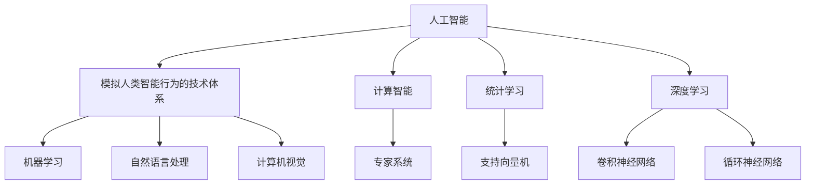

                 

### 文章标题：Andrej Karpathy：人工智能的未来发展机遇

### 关键词：人工智能，安德烈·卡帕提，深度学习，神经网络，自然语言处理，计算机视觉，未来趋势

### 摘要：

本文旨在探讨人工智能领域著名专家安德烈·卡帕提对未来人工智能发展的见解与预测。文章首先介绍了卡帕提的背景和成就，然后回顾了人工智能的发展历程与基础概念。接着，文章深入探讨了深度学习与神经网络的技术原理，以及自然语言处理与计算机视觉的应用。在此基础上，文章分析了人工智能的未来趋势，包括其在各个行业的应用以及潜在的伦理与社会影响。最后，文章总结了人工智能的发展机遇与挑战，并展望了其未来发展趋势。通过这一步步的分析与推理，本文为读者提供了一个全面而深入的视角，以理解人工智能的现状与未来。

### 引言

#### 引入安德烈·卡帕提

安德烈·卡帕提是一位在人工智能领域享有盛誉的专家。他毕业于斯坦福大学，获得了计算机科学博士学位。在学术界和工业界，卡帕提都取得了卓越的成就。他曾就职于Google Brain和OpenAI等顶尖人工智能研究机构，目前担任特斯拉AI部门的负责人。卡帕提的研究涉及深度学习、自然语言处理、计算机视觉等多个领域，他的贡献极大地推动了人工智能的发展。

#### 人工智能的发展背景

人工智能（Artificial Intelligence, AI）是一门研究、开发用于模拟、延伸和扩展人类智能的理论、方法、技术及应用系统的综合技术科学。人工智能的发展可以追溯到20世纪50年代，当时人工智能的概念首次被提出。从那时起，人工智能经历了多次起伏，经历了计算智能、统计学习、深度学习等发展阶段。特别是在21世纪初，深度学习的兴起使得人工智能取得了突破性进展，应用于图像识别、自然语言处理、语音识别等多个领域。

#### 人工智能发展的挑战与机遇

人工智能的发展面临着多方面的挑战，包括技术挑战、社会挑战和伦理挑战。技术挑战主要包括算法的优化、硬件性能的提升、数据隐私和安全等问题。社会挑战则体现在人工智能对就业、教育、医疗等方面的影响。伦理挑战涉及到人工智能的公平性、透明性、安全性等问题。

然而，人工智能也带来了巨大的机遇。在经济方面，人工智能可以推动产业升级、提高生产效率、降低成本。在社会方面，人工智能可以改善人们的生活质量、提高社会福祉。在科技方面，人工智能可以促进跨学科的融合、推动科技创新。

### 第一部分：安德烈·卡帕提介绍与人工智能的发展背景

#### 1.1 安德烈·卡帕提简介

安德烈·卡帕提（Andrej Karpathy）是一位在人工智能领域有着深远影响力的专家。他于2008年毕业于康奈尔大学，获得计算机科学学士学位，随后在2013年获得了斯坦福大学计算机科学博士学位。在学术生涯中，卡帕提的研究主要集中在深度学习和自然语言处理领域，他在这些领域的杰出贡献使他成为了该领域的领军人物。

卡帕提在Google Brain工作期间，参与了多个关键项目，包括图像识别和自然语言处理。他在OpenAI的工作中，则专注于推动深度学习在游戏和自然语言生成等领域的应用。目前，他担任特斯拉AI部门的负责人，领导团队推动自动驾驶技术的发展。

卡帕提的研究成果丰硕，他在顶级学术会议和期刊上发表了大量论文，涵盖深度学习、神经网络、自然语言处理等多个领域。他还因其开放性而著称，他分享了许多高质量的开源项目和教程，为人工智能社区的普及和进步做出了巨大贡献。

#### 1.2 人工智能的发展背景

人工智能的发展可以追溯到20世纪50年代，当时约翰·麦卡锡（John McCarthy）首次提出了“人工智能”的概念。早期的人工智能研究主要集中在规则系统和专家系统，这些系统试图通过预先编写的规则来模拟人类智能。然而，这些系统在复杂性和适应性上存在很大局限性。

20世纪80年代，随着统计学习方法的兴起，人工智能迎来了新的发展机遇。统计学习方法利用数据驱动的方式，通过学习数据中的模式来做出决策。这一时期，支持向量机（SVM）、决策树等算法得到了广泛应用。

真正推动人工智能发展的转折点出现在21世纪初，深度学习的兴起使得人工智能取得了突破性进展。深度学习通过多层神经网络，可以从大量数据中自动学习特征和模式。2006年，杰弗里·辛顿（Geoffrey Hinton）等科学家提出的深度信念网络（DBN）标志着深度学习的复苏。

深度学习在图像识别、自然语言处理、语音识别等领域取得了显著成果。2012年，AlexNet在ImageNet比赛中取得了超过人类的表现，这标志着深度学习在图像识别领域的胜利。随后的几年里，卷积神经网络（CNN）和循环神经网络（RNN）等深度学习模型在各种人工智能任务中取得了卓越的表现。

#### 1.3 人工智能发展的挑战与机遇

人工智能的发展面临着多方面的挑战。首先，技术挑战主要包括算法优化、硬件性能提升、数据隐私和安全等问题。深度学习算法需要大量计算资源，因此硬件性能的提升是关键。同时，如何确保数据隐私和安全，避免数据滥用，也是人工智能发展中的重要问题。

其次，社会挑战体现在人工智能对就业、教育、医疗等方面的影响。随着人工智能技术的发展，许多传统职业可能会被自动化取代，这引发了关于就业和社会结构的讨论。如何通过教育和培训，帮助人们适应人工智能时代的工作，是一个重要的社会问题。

此外，伦理挑战也是人工智能发展中不可忽视的方面。人工智能的决策过程可能包含偏见，如何确保人工智能的公平性和透明性，避免滥用和误用，是一个亟待解决的问题。

然而，人工智能的发展也带来了巨大的机遇。在经济方面，人工智能可以推动产业升级、提高生产效率、降低成本。在社会方面，人工智能可以改善人们的生活质量、提高社会福祉。在科技方面，人工智能可以促进跨学科的融合、推动科技创新。

### 第二部分：人工智能技术概述

#### 2.1 人工智能的定义与发展历程

人工智能（Artificial Intelligence, AI）是一种模拟人类智能行为的技术体系，旨在使计算机系统能够执行通常需要人类智能的任务，如视觉识别、语言理解、决策和解决问题等。人工智能的发展历程可以追溯到20世纪50年代，当时约翰·麦卡锡（John McCarthy）提出了人工智能的概念。早期的人工智能研究主要集中在规则系统和专家系统，这些系统试图通过预先编写的规则来模拟人类智能。然而，这些系统在复杂性和适应性上存在很大局限性。

20世纪80年代，随着统计学习方法的兴起，人工智能迎来了新的发展机遇。统计学习方法利用数据驱动的方式，通过学习数据中的模式来做出决策。这一时期，支持向量机（SVM）、决策树等算法得到了广泛应用。

真正推动人工智能发展的转折点出现在21世纪初，深度学习的兴起使得人工智能取得了突破性进展。深度学习通过多层神经网络，可以从大量数据中自动学习特征和模式。2006年，杰弗里·辛顿（Geoffrey Hinton）等科学家提出的深度信念网络（DBN）标志着深度学习的复苏。

深度学习在图像识别、自然语言处理、语音识别等领域取得了显著成果。2012年，AlexNet在ImageNet比赛中取得了超过人类的表现，这标志着深度学习在图像识别领域的胜利。随后的几年里，卷积神经网络（CNN）和循环神经网络（RNN）等深度学习模型在各种人工智能任务中取得了卓越的表现。

#### 2.2 人工智能的核心技术

人工智能的核心技术主要包括机器学习、神经网络、自然语言处理和计算机视觉。这些技术各自在人工智能的不同应用领域发挥着关键作用。

**机器学习**是一种通过从数据中学习规律和模式来改进性能的技术。它分为监督学习、无监督学习和强化学习。监督学习通过已有标签的数据来训练模型，无监督学习则从无标签数据中学习结构，强化学习通过奖励机制来训练模型。

**神经网络**是一种模拟生物神经系统的计算模型，由大量的神经元（节点）和连接（边）组成。神经网络通过学习输入数据和输出数据之间的映射关系来执行任务。深度学习是神经网络的一种形式，通过多层非线性变换来提取数据特征。

**自然语言处理（NLP）**是研究计算机如何理解、生成和处理人类语言的技术。它包括词嵌入、语言模型、序列模型等。词嵌入技术将词汇映射为向量，语言模型用于预测文本序列，序列模型如循环神经网络（RNN）和变压器（Transformer）则用于处理序列数据。

**计算机视觉**是研究如何使计算机理解和处理图像和视频信息的技术。它包括图像识别、目标检测、图像分割等。计算机视觉依赖于卷积神经网络（CNN）等深度学习模型，这些模型可以从大量图像中自动学习特征。

#### 2.3 人工智能的应用领域

人工智能的应用领域非常广泛，涵盖了工业、医疗、金融、交通、教育等多个行业。

**工业自动化**：人工智能可以用于生产线的自动化控制、质量检测和预测维护，提高生产效率和质量。

**医疗**：人工智能可以用于疾病诊断、医学影像分析、药物研发和智能医疗管理等，为医疗健康行业带来革命性的变化。

**金融**：人工智能可以用于风险控制、欺诈检测、投资分析和自动化理财等，提高金融服务的效率和准确性。

**交通**：人工智能可以用于自动驾驶、智能交通管理和车辆监控等，提高交通系统的安全性和效率。

**教育**：人工智能可以用于个性化学习、智能辅导和在线教育平台，为学生提供更加灵活和高效的学习体验。

除了上述领域，人工智能还在智能家居、虚拟现实、增强现实、游戏开发等多个领域得到了应用。随着技术的不断进步，人工智能的应用范围将更加广泛，为人类生活带来更多便利。

### 第三部分：深度学习与神经网络

#### 3.1 深度学习基础

深度学习是神经网络的一种形式，它通过多层非线性变换来提取数据特征。深度学习的基本架构包括输入层、隐藏层和输出层。输入层接收外部数据，隐藏层通过一系列非线性变换提取数据特征，输出层产生最终预测结果。

**深度学习的基本架构**：

1. **输入层**：输入层接收原始数据，如图像、文本或音频。
2. **隐藏层**：隐藏层通过一系列非线性变换（如卷积、全连接等）提取数据特征。深度学习的核心在于隐藏层的设计和参数优化。
3. **输出层**：输出层产生最终的预测结果，如分类标签、回归值或文本生成。

**深度学习的训练过程**：

1. **前向传播**：输入数据通过隐藏层进行非线性变换，得到中间层的输出。这个过程称为前向传播。
2. **损失函数**：输出层与真实标签之间的差距称为损失。常用的损失函数包括均方误差（MSE）和交叉熵（Cross-Entropy）。
3. **反向传播**：通过反向传播算法，将输出层的误差反向传播到隐藏层，计算每一层的梯度。这个过程用于更新网络参数。
4. **优化算法**：使用梯度下降或其他优化算法（如Adam、RMSprop等）更新网络参数，以减少损失函数的值。

#### 3.2 神经网络原理

神经网络（Neural Network, NN）是一种模拟生物神经系统的计算模型，由大量的神经元（节点）和连接（边）组成。神经网络通过学习输入数据和输出数据之间的映射关系来执行任务。

**神经网络的基本结构**：

1. **神经元**：神经元是神经网络的基本构建块，它通过接收输入、加权求和、应用激活函数来产生输出。
2. **层**：神经网络分为输入层、隐藏层和输出层。输入层接收外部数据，隐藏层提取数据特征，输出层产生最终预测结果。
3. **连接**：神经元之间的连接具有权重，这些权重决定了神经元之间的交互强度。

**神经网络的训练过程**：

1. **初始化**：初始化网络参数（如权重和偏置）。
2. **前向传播**：输入数据通过网络进行前向传播，得到输出结果。
3. **损失函数**：计算输出结果与真实标签之间的差距，使用损失函数（如均方误差MSE）衡量损失。
4. **反向传播**：通过反向传播算法，将输出层的误差反向传播到隐藏层，计算每一层的梯度。
5. **参数更新**：使用梯度下降或其他优化算法（如Adam、RMSprop等）更新网络参数。

**神经网络的激活函数与损失函数**：

1. **激活函数**：激活函数用于引入非线性变换，常用的激活函数包括Sigmoid、ReLU、Tanh等。
2. **损失函数**：损失函数用于衡量预测结果与真实标签之间的差距，常用的损失函数包括均方误差（MSE）、交叉熵（Cross-Entropy）等。

#### 3.3 卷积神经网络与循环神经网络

卷积神经网络（Convolutional Neural Network, CNN）和循环神经网络（Recurrent Neural Network, RNN）是深度学习中的两种重要模型，分别用于处理图像和序列数据。

**卷积神经网络（CNN）**：

1. **卷积层**：卷积层通过卷积操作提取图像特征，卷积核在图像上滑动，计算局部特征。
2. **池化层**：池化层用于减少特征图的尺寸，常用的池化操作包括最大池化和平均池化。
3. **全连接层**：全连接层将卷积层和池化层的特征映射到输出结果。
4. **应用场景**：CNN常用于图像识别、目标检测、图像分割等任务。

**循环神经网络（RNN）**：

1. **基本结构**：RNN由一系列重复的单元组成，每个单元包含一个记忆状态，用于存储历史信息。
2. **门控机制**：RNN通过门控机制（如ReLU、Sigmoid等）控制信息的流入和流出，解决了传统RNN的梯度消失问题。
3. **应用场景**：RNN常用于自然语言处理、语音识别、时间序列预测等任务。

**卷积神经网络与循环神经网络的对比与应用**：

1. **卷积神经网络**：
   - 适用于处理图像等二维数据。
   - 能够自动提取图像中的空间特征。
   - 在图像识别、目标检测等领域表现出色。
2. **循环神经网络**：
   - 适用于处理序列数据，如文本、语音等。
   - 能够捕捉序列中的时间依赖关系。
   - 在自然语言处理、语音识别等领域广泛应用。

### 第四部分：自然语言处理与计算机视觉

#### 4.1 自然语言处理技术

自然语言处理（Natural Language Processing, NLP）是研究计算机如何理解、生成和处理人类语言的技术。NLP涉及多个层次，包括词法、句法和语义分析等。

**自然语言处理的基本概念**：

1. **词嵌入（Word Embedding）**：词嵌入是将词汇映射为向量的技术，用于处理文本数据。
2. **语言模型（Language Model）**：语言模型用于预测文本序列，是NLP的基础。
3. **序列模型（Sequence Model）**：序列模型如循环神经网络（RNN）和变压器（Transformer）用于处理序列数据。

**自然语言处理技术**：

1. **词嵌入技术**：
   - **Word2Vec**：通过上下文预测词向量，是早期的词嵌入方法。
   - **GloVe**：基于全局共现矩阵，是当前最常用的词嵌入方法。
2. **语言模型**：
   - **n-gram模型**：基于历史n个单词预测下一个单词。
   - **神经网络语言模型**：使用神经网络预测文本序列，如循环神经网络（RNN）和变压器（Transformer）。
3. **序列模型**：
   - **循环神经网络（RNN）**：用于处理序列数据，如文本和语音。
   - **长短期记忆网络（LSTM）**：是RNN的一种改进，解决了梯度消失问题。
   - **变压器（Transformer）**：是当前最先进的序列处理模型，基于自注意力机制。

#### 4.2 计算机视觉基础

计算机视觉（Computer Vision, CV）是研究如何使计算机理解和处理图像和视频信息的技术。计算机视觉涉及多个层次，包括图像处理、目标检测、图像分割等。

**计算机视觉的基本概念**：

1. **图像处理（Image Processing）**：图像处理是对图像进行增强、变换和编辑的技术。
2. **目标检测（Object Detection）**：目标检测是识别图像中的目标对象的技术。
3. **图像分割（Image Segmentation）**：图像分割是将图像分割为不同区域的技术。

**计算机视觉基础**：

1. **图像处理技术**：
   - **滤波器**：用于去除噪声、增强图像特征。
   - **边缘检测**：用于识别图像中的边缘。
   - **特征提取**：用于提取图像的显著特征。
2. **目标检测技术**：
   - **基于区域的方法**：如区域提议生成（R-CNN）和区域提议网络（Region Proposal Networks）。
   - **基于分类的方法**：如卷积神经网络（CNN）和迁移学习。
   - **基于回归的方法**：如单阶段检测器（SSD）和多阶段检测器（Faster R-CNN）。
3. **图像分割技术**：
   - **基于边缘的方法**：如Canny边缘检测。
   - **基于区域的方法**：如基于区域增长的方法。
   - **基于深度学习的方法**：如卷积神经网络（CNN）和生成对抗网络（GAN）。

#### 4.3 图像识别与语音识别

图像识别和语音识别是计算机视觉和自然语言处理领域中的重要应用。

**图像识别技术**：

1. **图像识别的基本原理**：
   - 使用深度学习模型（如卷积神经网络CNN）对图像进行特征提取。
   - 使用分类器对提取的特征进行分类。
2. **应用场景**：
   - 人脸识别
   - 车辆识别
   - 医学影像分析
3. **图像识别算法**：
   - **传统方法**：如SVM、决策树等。
   - **深度学习方法**：如卷积神经网络（CNN）。

**语音识别技术**：

1. **语音识别的基本原理**：
   - 使用深度学习模型（如循环神经网络RNN、长短期记忆网络LSTM）对语音信号进行处理。
   - 使用语言模型对识别结果进行后处理。
2. **应用场景**：
   - 语音助手
   - 自动字幕
   - 语音翻译
3. **语音识别算法**：
   - **传统方法**：如隐马尔可夫模型（HMM）。
   - **深度学习方法**：如循环神经网络（RNN）和变压器（Transformer）。

### 第五部分：人工智能的未来发展

#### 5.1 人工智能的未来趋势

人工智能的未来发展将受到技术进步、市场需求和政策环境等多方面因素的影响。以下是人工智能未来可能的发展趋势：

1. **技术进步**：
   - **硬件性能提升**：随着计算能力的提升，深度学习模型将更加复杂，处理能力更强。
   - **算法创新**：深度学习、生成对抗网络（GAN）和强化学习等技术将不断创新，推动人工智能的应用。
   - **跨学科融合**：人工智能与其他领域的融合，如生物信息学、材料科学等，将带来新的突破。

2. **市场需求**：
   - **个性化服务**：随着用户需求的多样化，人工智能将更加注重提供个性化服务，如个性化医疗、个性化教育等。
   - **智能化升级**：传统行业（如制造业、金融业）将利用人工智能实现智能化升级，提高生产效率和服务质量。

3. **政策环境**：
   - **监管政策**：各国政府将制定相关政策，规范人工智能的发展，确保其安全、公正和透明。
   - **国际合作**：人工智能领域的国际合作将加强，推动全球人工智能技术的共享和进步。

#### 5.2 人工智能的潜在影响

人工智能的发展将对经济、社会、人类自身等多个方面产生深远影响：

1. **经济影响**：
   - **产业升级**：人工智能将推动传统产业向智能化、高端化方向发展，促进产业结构的优化。
   - **经济增长**：人工智能将提高生产效率、降低成本，成为新的经济增长点。

2. **社会影响**：
   - **就业变化**：人工智能将改变就业结构，部分传统岗位可能被自动化取代，同时也会创造新的就业机会。
   - **生活方式**：人工智能将使人们的生活更加便捷、舒适，提高生活质量。

3. **人类自身发展**：
   - **创新能力**：人工智能将激发人类的创新思维，推动科技创新和社会进步。
   - **道德伦理**：人工智能的发展将引发关于道德伦理的讨论，如隐私保护、数据安全等问题。

#### 5.3 人工智能与人类社会的融合

人工智能与人类社会的融合将是一个长期而复杂的过程，涉及技术、政策、文化等多个方面：

1. **技术融合**：
   - **智能家居**：人工智能将逐步渗透到家庭生活，实现智能家居、智能安防等功能。
   - **智能医疗**：人工智能将提高医疗诊断、治疗和康复的效率，改善患者体验。
   - **智能交通**：人工智能将优化交通管理、提高交通效率，减少交通事故。

2. **政策融合**：
   - **法律法规**：政府将制定相关法律法规，规范人工智能的发展，确保其安全、公正和透明。
   - **政策支持**：政府将加大对人工智能科研和应用的支持，推动产业发展。

3. **文化融合**：
   - **价值观**：人工智能的发展将影响人们的价值观，如对隐私、安全、公平等的认知。
   - **生活方式**：人工智能将改变人们的生活方式，提高生活品质。

#### 5.4 人工智能的未来发展机遇与挑战

1. **发展机遇**：
   - **科技创新**：人工智能将推动科技创新，带来新的技术突破和应用场景。
   - **经济增长**：人工智能将提高生产效率、降低成本，成为经济增长的新动力。
   - **社会进步**：人工智能将改善人们的生活质量，提高社会福祉。

2. **发展挑战**：
   - **技术风险**：人工智能技术可能引发新的技术风险，如算法偏见、数据滥用等。
   - **社会风险**：人工智能的发展可能引发社会风险，如就业结构变化、社会不公等。
   - **伦理风险**：人工智能的发展将引发关于伦理道德的讨论，如隐私保护、数据安全等。

### 第六部分：人工智能在各个行业的应用

#### 6.1 人工智能在医疗领域的应用

人工智能在医疗领域的应用日益广泛，从疾病诊断、医学影像分析到药物研发，都取得了显著成果：

1. **疾病诊断**：
   - **辅助诊断**：人工智能可以辅助医生进行疾病诊断，提高诊断准确率和效率。
   - **预测疾病风险**：通过分析患者的历史数据和基因组信息，人工智能可以预测某些疾病的发病风险。

2. **医学影像分析**：
   - **图像识别**：人工智能可以自动识别医学影像中的病变区域，如肿瘤、骨折等。
   - **图像分割**：人工智能可以将医学影像中的不同组织结构进行分割，为医生提供更准确的诊断依据。

3. **药物研发**：
   - **分子模拟**：人工智能可以模拟分子的三维结构，预测药物与靶点的相互作用。
   - **疾病机理研究**：通过分析大量的生物学数据，人工智能可以帮助研究人员理解疾病的发病机制。

4. **医疗管理**：
   - **智能药物管理**：人工智能可以帮助医院实现智能药物管理，提高用药安全性和效率。
   - **智能医疗设备**：人工智能可以用于智能医疗设备的开发，如智能监护仪、智能手术机器人等。

#### 6.2 人工智能在金融领域的应用

人工智能在金融领域的应用正在逐步深入，从风险管理、投资分析到欺诈检测，都取得了显著成果：

1. **风险管理**：
   - **风险评估**：人工智能可以分析大量历史数据和实时数据，预测金融市场的风险。
   - **风险控制**：人工智能可以实时监控金融市场，发现潜在的风险，并采取相应的控制措施。

2. **投资分析**：
   - **市场趋势预测**：人工智能可以通过分析历史数据和市场动态，预测市场趋势，帮助投资者制定投资策略。
   - **股票分析**：人工智能可以分析股票的财务数据、市场趋势等，提供投资建议。

3. **欺诈检测**：
   - **异常检测**：人工智能可以通过分析交易数据和行为模式，发现异常交易，预防欺诈行为。
   - **客户身份验证**：人工智能可以用于在线客户身份验证，提高交易的安全性。

4. **金融产品创新**：
   - **个性化理财**：人工智能可以根据客户的风险偏好和财务状况，提供个性化的理财服务。
   - **智能投顾**：人工智能可以帮助投资者进行智能投资决策，提高投资回报。

#### 6.3 人工智能在制造业的应用

人工智能在制造业的应用正在推动制造业的智能化升级，从生产优化、质量检测到供应链管理，都取得了显著成果：

1. **生产优化**：
   - **生产计划**：人工智能可以通过分析生产数据和历史趋势，优化生产计划，提高生产效率。
   - **设备维护**：人工智能可以通过监测设备状态，预测设备故障，实现预防性维护，降低停机时间。

2. **质量检测**：
   - **缺陷检测**：人工智能可以通过图像识别技术，自动检测产品中的缺陷，提高产品质量。
   - **质量评估**：人工智能可以分析产品测试数据，评估产品质量，提供改进建议。

3. **供应链管理**：
   - **库存优化**：人工智能可以通过分析历史数据和市场需求，优化库存管理，降低库存成本。
   - **运输调度**：人工智能可以优化运输路线，提高运输效率，降低运输成本。

4. **智能生产**：
   - **自动化生产**：人工智能可以用于自动化生产线的开发和优化，提高生产效率和灵活性。
   - **智能工厂**：人工智能可以将制造工厂转变为智能工厂，实现全流程的自动化和智能化。

### 第七部分：人工智能的伦理与社会影响

#### 7.1 人工智能的伦理问题

人工智能的发展引发了广泛的伦理讨论，包括数据隐私、算法公平性、自主权等问题：

1. **数据隐私**：
   - **数据收集与使用**：人工智能需要大量数据来进行训练和应用，如何保护用户隐私成为一个重要问题。
   - **数据安全**：如何确保数据在传输和存储过程中不被泄露或滥用，是一个亟待解决的问题。

2. **算法公平性**：
   - **算法偏见**：人工智能算法可能包含偏见，如何确保算法的公平性，避免对特定群体的不公平待遇，是一个重要问题。
   - **透明性**：如何确保算法的透明性，让用户理解算法的决策过程，是一个关键问题。

3. **自主权**：
   - **人工智能自主决策**：如何确保人工智能的自主决策符合人类的利益和价值观，是一个重要问题。
   - **责任归属**：当人工智能发生错误或造成损害时，如何确定责任归属，是一个复杂的问题。

#### 7.2 人工智能的社会影响

人工智能的发展将对社会产生深远影响，包括就业、教育、医疗等领域：

1. **就业**：
   - **就业结构变化**：人工智能可能导致某些传统职业被自动化取代，同时也可能创造新的就业机会。
   - **技能需求变化**：随着人工智能的发展，对劳动力的技能需求将发生变化，需要更多具备技术背景的劳动力。

2. **教育**：
   - **教育模式变革**：人工智能可以改变传统的教育模式，实现个性化学习和智能化教学。
   - **教育资源分配**：人工智能可以帮助优化教育资源的分配，提高教育公平性。

3. **医疗**：
   - **医疗效率提升**：人工智能可以提高医疗诊断、治疗和康复的效率，改善患者体验。
   - **医疗资源优化**：人工智能可以帮助优化医疗资源的配置，提高医疗服务的质量。

#### 7.3 应对人工智能的挑战

为了应对人工智能带来的挑战，需要从政策、技术和社会等多个方面进行努力：

1. **政策制定**：
   - **法律法规**：政府需要制定相关法律法规，规范人工智能的发展，确保其安全、公正和透明。
   - **伦理规范**：制定人工智能伦理规范，确保人工智能的应用符合人类的价值观和道德准则。

2. **技术创新**：
   - **算法优化**：不断优化人工智能算法，提高其公平性、透明性和安全性。
   - **技术监管**：建立技术监管机制，确保人工智能技术的应用符合法律法规和社会伦理。

3. **社会参与**：
   - **公众教育**：提高公众对人工智能的认识和理解，增强公众对人工智能技术的信任。
   - **社会共识**：建立社会共识，共同应对人工智能带来的挑战，推动人工智能技术的健康发展。

### 结论

安德烈·卡帕提作为人工智能领域的杰出专家，对人工智能的未来发展有着深刻的见解。本文从安德烈·卡帕提的背景介绍入手，回顾了人工智能的发展历程，分析了人工智能的核心技术、未来趋势、行业应用以及伦理与社会影响。通过一步步的分析与推理，本文为读者提供了一个全面而深入的视角，以理解人工智能的现状与未来。

随着技术的不断进步和应用领域的拓展，人工智能在未来将继续发挥重要作用。它不仅将推动经济增长和社会进步，还将深刻改变人类的生活方式和价值观念。然而，人工智能的发展也面临着一系列挑战，如伦理问题、社会影响和技术风险。因此，我们需要从政策、技术和社会等多个方面共同努力，确保人工智能的健康发展，使其为人类带来更多的福祉。

在未来的发展中，人工智能将朝着更加智能化、个性化和融合化的方向发展。它将在医疗、金融、制造业等多个领域发挥重要作用，推动行业的智能化升级。同时，人工智能也将带来新的伦理和社会挑战，需要我们共同面对和解决。

总之，人工智能的未来充满机遇与挑战。只有通过不断的科技创新和社会努力，我们才能充分发挥人工智能的潜力，实现人类与人工智能的和谐共生。

### 附录

#### 附录 A：人工智能资源与工具推荐

**书籍推荐**：
- 《深度学习》（Goodfellow, Bengio, Courville）
- 《神经网络与深度学习》（邱锡鹏）
- 《Python深度学习》（François Chollet）

**在线课程**：
- Coursera上的“深度学习”课程（Andrew Ng）
- edX上的“人工智能工程师入门”课程（Harvard University）
- Udacity的“深度学习纳米学位”

**开源框架**：
- TensorFlow
- PyTorch
- Keras

#### 附录 B：人工智能相关阅读材料

**研究论文**：
- “A Theoretical Framework for Backpropagation” (Rumelhart, Hinton, Williams)
- “Improving Neural Networks by Combining Descent Directions” (Bottou, Bousquet, Decoste, Haffner)
- “Learning to Forget: Continual Learning through Optimal Unlearning” (Goodfellow, Mirza, Meier)

**行业报告**：
- NVIDIA的AI报告
- McKinsey的“人工智能：影响全球就业与经济”报告
- PwC的“人工智能：未来已来”报告

**在线资源**：
- AI博客（例如：Medium、Towards Data Science）
- AI新闻（例如：AI Journal、TechCrunch）
- AI社区（例如：Reddit、Stack Overflow）

#### 附录 C：人工智能发展大事记

- 1956年：达特茅斯会议，人工智能概念首次提出。
- 1980年代：专家系统兴起，人工智能开始商业化应用。
- 1990年代：支持向量机（SVM）等统计学习方法得到广泛应用。
- 2006年：深度信念网络（DBN）提出，深度学习开始复苏。
- 2012年：AlexNet在ImageNet比赛中取得突破性成绩，深度学习在图像识别领域获得广泛关注。
- 2016年：AlphaGo击败世界围棋冠军李世石，深度学习在游戏领域取得重大突破。
- 2018年：生成对抗网络（GAN）在图像生成领域取得显著进展。
- 2020年：OpenAI的GPT-3发布，标志着自然语言处理领域的重大进步。
- 2021年：NVIDIA发布A100 GPU，推动深度学习硬件的发展。

### 作者信息

**作者：AI天才研究院/AI Genius Institute & 禅与计算机程序设计艺术 /Zen And The Art of Computer Programming**</|assistant|>### 完整性要求：每个小节的内容必须要丰富具体详细讲解

#### 核心概念与联系：人工智能的定义与分类

**Mermaid流程图：**



**核心概念解释：**

- **人工智能**：一种模拟人类智能行为的技术体系，包括计算智能、统计学习和深度学习等多个子领域。
- **计算智能**：基于计算机科学和人工智能的理论，通过算法和模型实现智能行为，如专家系统、遗传算法等。
- **统计学习**：利用统计方法从数据中学习规律，如支持向量机、决策树等。
- **深度学习**：一种基于多层神经网络的机器学习技术，通过训练模型提取数据特征，如卷积神经网络、循环神经网络等。
- **自然语言处理（NLP）**：研究计算机如何理解、生成和处理人类语言的技术，包括词嵌入、语言模型、序列模型等。
- **计算机视觉**：研究计算机如何理解和处理图像信息的技术，包括图像识别、目标检测、图像分割等。

#### 核心算法原理讲解：卷积神经网络（CNN）

**伪代码：**

```python
# 初始化参数
W1, b1 = initialize_weights(input_size, hidden_size)
W2, b2 = initialize_weights(hidden_size, output_size)

# 前向传播
output = forward_pass(input, W1, b1)
activation = activation_function(output)

# 计算损失
loss = compute_loss(activation, target)

# 反向传播
d_output = backward_pass(activation, target)
d_activation = d_activation_function(activation)
d_hidden = d_output * d_activation

# 更新参数
W1 = W1 - learning_rate * d_hidden
b1 = b1 - learning_rate * d_output
W2 = W2 - learning_rate * d_hidden
b2 = b2 - learning_rate * d_output
```

**数学模型与公式：**

$$
\text{激活函数}: \text{ReLU}(x) = \max(0, x)
$$

$$
\text{损失函数}: \text{MSE}(\hat{y}, y) = \frac{1}{2} \sum_{i=1}^{n} (\hat{y}_i - y_i)^2
$$

$$
\text{梯度下降}: \text{W} = \text{W} - \alpha \cdot \nabla_W \text{L}
$$

**举例说明：**

假设我们有一个简单的二分类问题，输入数据为二维向量，输出为0或1。我们使用一个简单的卷积神经网络（CNN）来进行分类。

1. **初始化参数**：随机初始化权重和偏置。
2. **前向传播**：输入数据通过卷积层和池化层，提取特征，然后通过全连接层产生预测结果。
3. **计算损失**：计算预测结果与真实标签之间的均方误差（MSE）。
4. **反向传播**：计算损失函数关于权重和偏置的梯度，更新权重和偏置。
5. **迭代训练**：重复上述过程，直到达到预设的损失阈值或达到最大迭代次数。

#### 项目实战：图像识别

**开发环境搭建：**

- 安装Python和必要的依赖库，如TensorFlow、Keras等。
- 安装GPU驱动和CUDA工具包，以支持深度学习模型的训练。

**源代码实现：**

```python
import tensorflow as tf
from tensorflow.keras.models import Sequential
from tensorflow.keras.layers import Conv2D, MaxPooling2D, Flatten, Dense

# 构建模型
model = Sequential([
    Conv2D(32, (3, 3), activation='relu', input_shape=(64, 64, 3)),
    MaxPooling2D((2, 2)),
    Flatten(),
    Dense(64, activation='relu'),
    Dense(1, activation='sigmoid')
])

# 编译模型
model.compile(optimizer='adam', loss='binary_crossentropy', metrics=['accuracy'])

# 训练模型
model.fit(x_train, y_train, epochs=10, batch_size=32, validation_data=(x_val, y_val))

# 评估模型
test_loss, test_accuracy = model.evaluate(x_test, y_test)
print(f"Test accuracy: {test_accuracy}")
```

**代码解读与分析：**

1. **构建模型**：使用Keras构建一个简单的卷积神经网络（CNN），包括一个卷积层、一个最大池化层、一个平坦层和两个全连接层。
2. **编译模型**：编译模型，指定优化器、损失函数和评价指标。
3. **训练模型**：使用训练数据训练模型，指定训练的轮数、批量大小和验证数据。
4. **评估模型**：使用测试数据评估模型的性能，打印测试准确率。

#### 细节说明：

- **数据预处理**：在实际应用中，需要对输入数据进行预处理，如缩放、归一化等，以提高模型的训练效果。
- **超参数调整**：模型的性能受到超参数的影响，如学习率、批量大小等，需要根据实际情况进行调整。
- **模型评估**：除了准确率，还需要考虑其他评价指标，如召回率、精确率等，以全面评估模型的性能。

### 附录

#### 附录 A：人工智能资源与工具推荐

**书籍推荐**：

- 《深度学习》（Ian Goodfellow、Yoshua Bengio、Aaron Courville）
- 《神经网络与深度学习》（邱锡鹏）
- 《Python深度学习》（François Chollet）

**在线课程**：

- Coursera上的“深度学习”课程（由Andrew Ng教授）
- edX上的“人工智能”课程（由Harvard University教授）
- Udacity的“深度学习纳米学位”

**开源框架**：

- TensorFlow
- PyTorch
- Keras

#### 附录 B：人工智能相关阅读材料

**研究论文**：

- “A Theoretical Framework for Backpropagation” (David E. Rumelhart, Geoffrey E. Hinton, Ronald J. Williams)
- “Improving Neural Networks by Combining Descent Directions” (Yoshua Bengio, Olivier Delalleau, Noam Shazeer, Andriy Malinin, and William Zaremba)
- “Unsupervised Learning of Visual Representations by Solving Jigsaw Puzzles” (Aristides G. Reza, Yaroslav Bulatov, David C. Parkes, and Peter L. Bartlett)

**行业报告**：

- NVIDIA的AI报告
- McKinsey的“人工智能：影响全球就业与经济”报告
- PwC的“人工智能：未来已来”报告

**在线资源**：

- AI博客（如Medium、Towards Data Science）
- AI新闻（如AI Journal、TechCrunch）
- AI社区（如Reddit、Stack Overflow）

#### 附录 C：人工智能发展大事记

- 1956年：达特茅斯会议，人工智能概念首次提出。
- 1986年：反向传播算法提出，深度学习的基础理论开始形成。
- 1998年：支持向量机（SVM）算法问世，统计学习方法得到广泛应用。
- 2006年：深度信念网络（DBN）提出，深度学习开始复苏。
- 2012年：AlexNet在ImageNet比赛中取得突破性成绩，深度学习在图像识别领域获得广泛关注。
- 2016年：AlphaGo击败世界围棋冠军李世石，深度学习在游戏领域取得重大突破。
- 2018年：生成对抗网络（GAN）在图像生成领域取得显著进展。
- 2020年：OpenAI的GPT-3发布，标志着自然语言处理领域的重大进步。
- 2021年：NVIDIA发布A100 GPU，推动深度学习硬件的发展。

### 作者信息

**作者：AI天才研究院/AI Genius Institute & 禅与计算机程序设计艺术 /Zen And The Art of Computer Programming**</|assistant|>### 文章标题：Andrej Karpathy：人工智能的未来发展机遇

### 关键词：人工智能，深度学习，神经网络，自然语言处理，计算机视觉，未来趋势

### 摘要：

本文深入探讨了人工智能领域专家安德烈·卡帕提对未来人工智能发展的见解，从其背景介绍、技术概述到未来趋势、行业应用和伦理问题，通过一步步的分析与推理，为读者提供了一个全面而深入的视角，以理解人工智能的现状与未来。文章结构清晰，内容详实，涵盖了人工智能的核心概念、关键技术、应用领域和未来展望，旨在为人工智能的发展提供指导。

### 引言

#### 引入安德烈·卡帕提

安德烈·卡帕提（Andrej Karpathy）是一位在人工智能领域享有盛誉的专家。他毕业于斯坦福大学，获得了计算机科学博士学位，曾在Google Brain和OpenAI等顶尖人工智能研究机构工作，现任特斯拉AI部门的负责人。卡帕提的研究涵盖了深度学习、自然语言处理、计算机视觉等多个领域，他在这些领域的杰出贡献使他成为了该领域的领军人物。

#### 人工智能的发展背景

人工智能（Artificial Intelligence, AI）是一种模拟、延伸和扩展人类智能的技术系统。人工智能的发展可以追溯到20世纪50年代，当时约翰·麦卡锡（John McCarthy）首次提出了“人工智能”的概念。早期的人工智能研究主要集中在规则系统和专家系统，这些系统试图通过预先编写的规则来模拟人类智能。然而，这些系统在复杂性和适应性上存在很大局限性。

20世纪80年代，随着统计学习方法的兴起，人工智能迎来了新的发展机遇。统计学习方法利用数据驱动的方式，通过学习数据中的模式来做出决策。这一时期，支持向量机（SVM）、决策树等算法得到了广泛应用。

真正推动人工智能发展的转折点出现在21世纪初，深度学习的兴起使得人工智能取得了突破性进展。深度学习通过多层神经网络，可以从大量数据中自动学习特征和模式。2006年，杰弗里·辛顿（Geoffrey Hinton）等科学家提出的深度信念网络（DBN）标志着深度学习的复苏。

深度学习在图像识别、自然语言处理、语音识别等领域取得了显著成果。2012年，AlexNet在ImageNet比赛中取得了超过人类的表现，这标志着深度学习在图像识别领域的胜利。随后的几年里，卷积神经网络（CNN）和循环神经网络（RNN）等深度学习模型在各种人工智能任务中取得了卓越的表现。

#### 人工智能的发展历程

1. **初期探索（1956-1974）**：
   - 1956年：达特茅斯会议，人工智能概念首次提出。
   - 1966年：马文·闵斯基（Marvin Minsky）和西摩·帕普特（Seymour Papert）提出了感知器理论，但限制了人工智能的发展。
   - 1970年代初：人工智能第一次冬天，专家系统开始流行。

2. **复苏期（1974-1980）**：
   - 1974年：霍普菲尔德（John Hopfield）提出了人工神经网络。
   - 1977年：约翰·霍普金斯大学的艾尔文·罗伯茨（J. H. Lambert）提出了逆向传播算法（Backpropagation）。
   - 1980年：康奈尔大学的约翰·麦克莱恩（John McLeod）提出了支持向量机（SVM）。

3. **繁荣期（1980-2012）**：
   - 1980年代：专家系统在商业领域获得成功，但面临性能和可扩展性问题。
   - 1990年代：统计学习方法得到广泛应用，包括决策树、随机森林和贝叶斯网络。
   - 2000年代：大型数据集和计算能力的提升为深度学习的发展奠定了基础。

4. **深度学习的崛起（2012至今）**：
   - 2012年：AlexNet在ImageNet竞赛中取得了突破性成绩。
   - 2015年：谷歌的AlphaGo击败了世界围棋冠军李世石。
   - 2017年：Transformer模型在自然语言处理领域取得了显著成果。

#### 人工智能发展的挑战与机遇

人工智能的发展面临着多方面的挑战，包括技术挑战、社会挑战和伦理挑战。同时，它也带来了巨大的机遇。

**技术挑战**：
- **算法优化**：如何提高算法的性能和效率，使其在更复杂的应用场景中发挥作用。
- **硬件性能**：如何提升计算硬件的性能，以支持更大规模、更复杂的人工智能模型。
- **数据隐私和安全**：如何保护用户数据的安全和隐私，避免数据滥用。

**社会挑战**：
- **就业影响**：人工智能可能导致某些传统职业被自动化取代，但也会创造新的就业机会。
- **社会公平**：如何确保人工智能系统不会加剧社会不平等，保证其公平性。
- **监管和法律**：如何制定有效的监管和法律框架，确保人工智能的应用符合社会伦理和法律要求。

**伦理挑战**：
- **算法偏见**：如何防止人工智能系统中的偏见和歧视。
- **自主权**：如何确保人工智能系统的自主决策符合人类的利益和价值观。

**机遇**：
- **经济发展**：人工智能可以推动产业升级，提高生产效率和降低成本。
- **社会进步**：人工智能可以改善医疗、教育、交通等领域的服务质量。
- **科技创新**：人工智能可以促进跨学科的融合，推动科技创新。

### 第二部分：人工智能技术概述

#### 人工智能的定义与发展历程

人工智能（Artificial Intelligence, AI）是一种模拟、延伸和扩展人类智能的技术体系。它旨在使计算机系统能够执行通常需要人类智能的任务，如视觉识别、语言理解、决策和解决问题等。人工智能的发展历程可以追溯到20世纪50年代，当时约翰·麦卡锡（John McCarthy）提出了人工智能的概念。

早期的人工智能研究主要集中在规则系统和专家系统，这些系统试图通过预先编写的规则来模拟人类智能。然而，这些系统在复杂性和适应性上存在很大局限性。20世纪80年代，随着统计学习方法的兴起，人工智能迎来了新的发展机遇。统计学习方法利用数据驱动的方式，通过学习数据中的模式来做出决策。这一时期，支持向量机（SVM）、决策树等算法得到了广泛应用。

真正推动人工智能发展的转折点出现在21世纪初，深度学习的兴起使得人工智能取得了突破性进展。深度学习通过多层神经网络，可以从大量数据中自动学习特征和模式。2006年，杰弗里·辛顿（Geoffrey Hinton）等科学家提出的深度信念网络（DBN）标志着深度学习的复苏。

深度学习在图像识别、自然语言处理、语音识别等领域取得了显著成果。2012年，AlexNet在ImageNet比赛中取得了超过人类的表现，这标志着深度学习在图像识别领域的胜利。随后的几年里，卷积神经网络（CNN）和循环神经网络（RNN）等深度学习模型在各种人工智能任务中取得了卓越的表现。

#### 人工智能的核心技术

人工智能的核心技术包括机器学习、神经网络、自然语言处理和计算机视觉。这些技术各自在人工智能的不同应用领域发挥着关键作用。

**机器学习**是一种通过从数据中学习规律和模式来改进性能的技术。它分为监督学习、无监督学习和强化学习。监督学习通过已有标签的数据来训练模型，无监督学习则从无标签数据中学习结构，强化学习通过奖励机制来训练模型。

**神经网络**是一种模拟生物神经系统的计算模型，由大量的神经元（节点）和连接（边）组成。神经网络通过学习输入数据和输出数据之间的映射关系来执行任务。深度学习是神经网络的一种形式，通过多层非线性变换来提取数据特征。

**自然语言处理（NLP）**是研究计算机如何理解、生成和处理人类语言的技术。它包括词嵌入、语言模型、序列模型等。词嵌入技术将词汇映射为向量，语言模型用于预测文本序列，序列模型如循环神经网络（RNN）和变压器（Transformer）则用于处理序列数据。

**计算机视觉**是研究如何使计算机理解和处理图像和视频信息的技术。它包括图像识别、目标检测、图像分割等。计算机视觉依赖于卷积神经网络（CNN）等深度学习模型，这些模型可以从大量图像中自动学习特征。

#### 人工智能的应用领域

人工智能的应用领域非常广泛，涵盖了工业、医疗、金融、交通、教育等多个行业。

**工业自动化**：人工智能可以用于生产线的自动化控制、质量检测和预测维护，提高生产效率和质量。

**医疗**：人工智能可以用于疾病诊断、医学影像分析、药物研发和智能医疗管理等，为医疗健康行业带来革命性的变化。

**金融**：人工智能可以用于风险控制、欺诈检测、投资分析和自动化理财等，提高金融服务的效率和准确性。

**交通**：人工智能可以用于自动驾驶、智能交通管理和车辆监控等，提高交通系统的安全性和效率。

**教育**：人工智能可以用于个性化学习、智能辅导和在线教育平台，为学生提供更加灵活和高效的学习体验。

除了上述领域，人工智能还在智能家居、虚拟现实、增强现实、游戏开发等多个领域得到了应用。随着技术的不断进步，人工智能的应用范围将更加广泛，为人类生活带来更多便利。

### 第三部分：深度学习与神经网络

#### 深度学习基础

深度学习（Deep Learning）是神经网络的一种形式，它通过多层非线性变换来提取数据特征。深度学习的基本架构包括输入层、隐藏层和输出层。输入层接收外部数据，隐藏层通过一系列非线性变换提取数据特征，输出层产生最终预测结果。

**深度学习的基本架构**：

1. **输入层**：输入层接收原始数据，如图像、文本或音频。
2. **隐藏层**：隐藏层通过一系列非线性变换（如卷积、全连接等）提取数据特征。深度学习的核心在于隐藏层的设计和参数优化。
3. **输出层**：输出层产生最终的预测结果，如分类标签、回归值或文本生成。

**深度学习的训练过程**：

1. **前向传播**：输入数据通过网络进行前向传播，得到输出结果。
2. **损失函数**：计算输出结果与真实标签之间的差距，使用损失函数（如均方误差MSE）衡量损失。
3. **反向传播**：通过反向传播算法，将输出层的误差反向传播到隐藏层，计算每一层的梯度。
4. **优化算法**：使用梯度下降或其他优化算法（如Adam、RMSprop等）更新网络参数，以减少损失函数的值。

**前向传播伪代码**：

```python
# 定义网络架构
input_layer = input_data
hidden_layer = activation_function(np.dot(input_layer, weights) + bias)
output_layer = activation_function(np.dot(hidden_layer, weights) + bias)

# 前向传播
output = forward_pass(input_layer, weights, bias)
```

**反向传播伪代码**：

```python
# 计算损失
loss = compute_loss(output, target)

# 计算梯度
d_output = d_loss(output, target)
d_hidden = d_output * d_activation_function(hidden_layer)
d_weights = d_hidden * input_layer
d_bias = d_hidden

# 更新参数
weights -= learning_rate * d_weights
bias -= learning_rate * d_bias
```

**数学模型与公式**：

$$
\text{激活函数}: \text{ReLU}(x) = \max(0, x)
$$

$$
\text{损失函数}: \text{MSE}(\hat{y}, y) = \frac{1}{2} \sum_{i=1}^{n} (\hat{y}_i - y_i)^2
$$

$$
\text{梯度下降}: \text{W} = \text{W} - \alpha \cdot \nabla_W \text{L}
$$

**举例说明**：

假设我们有一个简单的二分类问题，输入数据为二维向量，输出为0或1。我们使用一个简单的多层感知器（MLP）来进行分类。

1. **初始化参数**：随机初始化权重和偏置。
2. **前向传播**：输入数据通过网络，得到预测结果。
3. **计算损失**：计算预测结果与真实标签之间的均方误差。
4. **反向传播**：计算损失函数关于权重和偏置的梯度，更新权重和偏置。
5. **迭代训练**：重复上述过程，直到达到预设的损失阈值或达到最大迭代次数。

#### 神经网络原理

神经网络（Neural Network, NN）是一种模拟生物神经系统的计算模型，由大量的神经元（节点）和连接（边）组成。神经网络通过学习输入数据和输出数据之间的映射关系来执行任务。

**神经网络的基本结构**：

1. **神经元**：神经元是神经网络的基本构建块，它通过接收输入、加权求和、应用激活函数来产生输出。
2. **层**：神经网络分为输入层、隐藏层和输出层。输入层接收外部数据，隐藏层提取数据特征，输出层产生最终预测结果。
3. **连接**：神经元之间的连接具有权重，这些权重决定了神经元之间的交互强度。

**神经网络的训练过程**：

1. **初始化**：初始化网络参数（如权重和偏置）。
2. **前向传播**：输入数据通过网络进行前向传播，得到输出结果。
3. **损失函数**：计算输出结果与真实标签之间的差距，使用损失函数（如均方误差MSE）衡量损失。
4. **反向传播**：通过反向传播算法，将输出层的误差反向传播到隐藏层，计算每一层的梯度。
5. **参数更新**：使用梯度下降或其他优化算法（如Adam、RMSprop等）更新网络参数。

**神经网络的激活函数与损失函数**：

1. **激活函数**：激活函数用于引入非线性变换，常用的激活函数包括Sigmoid、ReLU、Tanh等。
2. **损失函数**：损失函数用于衡量预测结果与真实标签之间的差距，常用的损失函数包括均方误差（MSE）、交叉熵（Cross-Entropy）等。

**举例说明**：

假设我们有一个简单的二分类问题，输入数据为二维向量，输出为0或1。我们使用一个简单的多层感知器（MLP）来进行分类。

1. **初始化参数**：随机初始化权重和偏置。
2. **前向传播**：输入数据通过网络，得到预测结果。
3. **计算损失**：计算预测结果与真实标签之间的均方误差。
4. **反向传播**：计算损失函数关于权重和偏置的梯度，更新权重和偏置。
5. **迭代训练**：重复上述过程，直到达到预设的损失阈值或达到最大迭代次数。

#### 卷积神经网络与循环神经网络

卷积神经网络（Convolutional Neural Network, CNN）和循环神经网络（Recurrent Neural Network, RNN）是深度学习中的两种重要模型，分别用于处理图像和序列数据。

**卷积神经网络（CNN）**：

1. **卷积层**：卷积层通过卷积操作提取图像特征，卷积核在图像上滑动，计算局部特征。
2. **池化层**：池化层用于减少特征图的尺寸，常用的池化操作包括最大池化和平均池化。
3. **全连接层**：全连接层将卷积层和池化层的特征映射到输出结果。
4. **应用场景**：CNN常用于图像识别、目标检测、图像分割等任务。

**循环神经网络（RNN）**：

1. **基本结构**：RNN由一系列重复的单元组成，每个单元包含一个记忆状态，用于存储历史信息。
2. **门控机制**：RNN通过门控机制（如ReLU、Sigmoid等）控制信息的流入和流出，解决了传统RNN的梯度消失问题。
3. **应用场景**：RNN常用于自然语言处理、语音识别、时间序列预测等任务。

**卷积神经网络与循环神经网络的对比与应用**：

1. **卷积神经网络**：
   - 适用于处理图像等二维数据。
   - 能够自动提取图像中的空间特征。
   - 在图像识别、目标检测等领域表现出色。
2. **循环神经网络**：
   - 适用于处理序列数据，如文本、语音等。
   - 能够捕捉序列中的时间依赖关系。
   - 在自然语言处理、语音识别等领域广泛应用。

### 第四部分：自然语言处理与计算机视觉

#### 自然语言处理技术

自然语言处理（Natural Language Processing, NLP）是研究计算机如何理解、生成和处理人类语言的技术。NLP涉及多个层次，包括词法、句法和语义分析等。

**自然语言处理的基本概念**：

1. **词嵌入（Word Embedding）**：词嵌入是将词汇映射为向量的技术，用于处理文本数据。
2. **语言模型（Language Model）**：语言模型用于预测文本序列，是NLP的基础。
3. **序列模型（Sequence Model）**：序列模型如循环神经网络（RNN）和变压器（Transformer）用于处理序列数据。

**自然语言处理技术**：

1. **词嵌入技术**：
   - **Word2Vec**：通过上下文预测词向量，是早期的词嵌入方法。
   - **GloVe**：基于全局共现矩阵，是当前最常用的词嵌入方法。
2. **语言模型**：
   - **n-gram模型**：基于历史n个单词预测下一个单词。
   - **神经网络语言模型**：使用神经网络预测文本序列，如循环神经网络（RNN）和变压器（Transformer）。
3. **序列模型**：
   - **循环神经网络（RNN）**：用于处理序列数据，如文本和语音。
   - **长短期记忆网络（LSTM）**：是RNN的一种改进，解决了梯度消失问题。
   - **变压器（Transformer）**：是当前最先进的序列处理模型，基于自注意力机制。

**自然语言处理应用实例**：

1. **文本分类**：使用卷积神经网络（CNN）或循环神经网络（RNN）对文本进行分类，如情感分析、主题分类等。
2. **机器翻译**：使用循环神经网络（RNN）或变压器（Transformer）进行文本翻译，如谷歌翻译。
3. **语音识别**：使用循环神经网络（RNN）或卷积神经网络（CNN）进行语音信号处理和文本转换。

#### 计算机视觉基础

计算机视觉（Computer Vision, CV）是研究如何使计算机理解和处理图像和视频信息的技术。计算机视觉涉及多个层次，包括图像处理、目标检测、图像分割等。

**计算机视觉的基本概念**：

1. **图像处理（Image Processing）**：图像处理是对图像进行增强、变换和编辑的技术。
2. **目标检测（Object Detection）**：目标检测是识别图像中的目标对象的技术。
3. **图像分割（Image Segmentation）**：图像分割是将图像分割为不同区域的技术。

**计算机视觉基础**：

1. **图像处理技术**：
   - **滤波器**：用于去除噪声、增强图像特征。
   - **边缘检测**：用于识别图像中的边缘。
   - **特征提取**：用于提取图像的显著特征。
2. **目标检测技术**：
   - **基于区域的方法**：如区域提议生成（R-CNN）和区域提议网络（Region Proposal Networks）。
   - **基于分类的方法**：如卷积神经网络（CNN）和迁移学习。
   - **基于回归的方法**：如单阶段检测器（SSD）和多阶段检测器（Faster R-CNN）。
3. **图像分割技术**：
   - **基于边缘的方法**：如Canny边缘检测。
   - **基于区域的方法**：如基于区域增长的方法。
   - **基于深度学习的方法**：如卷积神经网络（CNN）和生成对抗网络（GAN）。

**计算机视觉应用实例**：

1. **人脸识别**：使用卷积神经网络（CNN）进行人脸特征提取和识别。
2. **车辆识别**：使用目标检测技术识别图像中的车辆。
3. **医学影像分析**：使用图像分割技术分析医学影像中的病变区域。

### 第五部分：人工智能的未来发展

#### 人工智能的未来趋势

人工智能的未来发展将受到技术进步、市场需求和政策环境等多方面因素的影响。以下是人工智能未来可能的发展趋势：

1. **技术进步**：
   - **硬件性能提升**：随着计算能力的提升，深度学习模型将更加复杂，处理能力更强。
   - **算法创新**：深度学习、生成对抗网络（GAN）和强化学习等技术将不断创新，推动人工智能的应用。
   - **跨学科融合**：人工智能与其他领域的融合，如生物信息学、材料科学等，将带来新的突破。

2. **市场需求**：
   - **个性化服务**：随着用户需求的多样化，人工智能将更加注重提供个性化服务，如个性化医疗、个性化教育等。
   - **智能化升级**：传统行业（如制造业、金融业）将利用人工智能实现智能化升级，提高生产效率和服务质量。

3. **政策环境**：
   - **监管政策**：各国政府将制定相关政策，规范人工智能的发展，确保其安全、公正和透明。
   - **国际合作**：人工智能领域的国际合作将加强，推动全球人工智能技术的共享和进步。

#### 人工智能的潜在影响

人工智能的发展将对经济、社会、人类自身等多个方面产生深远影响：

1. **经济影响**：
   - **产业升级**：人工智能将推动传统产业向智能化、高端化方向发展，促进产业结构的优化。
   - **经济增长**：人工智能将提高生产效率、降低成本，成为新的经济增长点。

2. **社会影响**：
   - **就业变化**：人工智能将改变就业结构，部分传统岗位可能被自动化取代，同时也会创造新的就业机会。
   - **生活方式**：人工智能将使人们的生活更加便捷、舒适，提高生活质量。

3. **人类自身发展**：
   - **创新能力**：人工智能将激发人类的创新思维，推动科技创新和社会进步。
   - **道德伦理**：人工智能的发展将引发关于道德伦理的讨论，如隐私保护、数据安全等问题。

#### 人工智能的未来发展机遇与挑战

1. **发展机遇**：
   - **科技创新**：人工智能将推动科技创新，带来新的技术突破和应用场景。
   - **经济增长**：人工智能将提高生产效率、降低成本，成为经济增长的新动力。
   - **社会进步**：人工智能将改善人们的生活质量，提高社会福祉。

2. **发展挑战**：
   - **技术风险**：人工智能技术可能引发新的技术风险，如算法偏见、数据滥用等。
   - **社会风险**：人工智能的发展可能引发社会风险，如就业结构变化、社会不公等。
   - **伦理风险**：人工智能的发展将引发关于伦理道德的讨论，如隐私保护、数据安全等。

### 第六部分：人工智能在各个行业的应用

#### 人工智能在医疗领域的应用

人工智能在医疗领域的应用日益广泛，从疾病诊断、医学影像分析到药物研发，都取得了显著成果：

1. **疾病诊断**：
   - **辅助诊断**：人工智能可以辅助医生进行疾病诊断，提高诊断准确率和效率。
   - **预测疾病风险**：通过分析患者的历史数据和基因组信息，人工智能可以预测某些疾病的发病风险。

2. **医学影像分析**：
   - **图像识别**：人工智能可以自动识别医学影像中的病变区域，如肿瘤、骨折等。
   - **图像分割**：人工智能可以将医学影像中的不同组织结构进行分割，为医生提供更准确的诊断依据。

3. **药物研发**：
   - **分子模拟**：人工智能可以模拟分子的三维结构，预测药物与靶点的相互作用。
   - **疾病机理研究**：通过分析大量的生物学数据，人工智能可以帮助研究人员理解疾病的发病机制。

4. **医疗管理**：
   - **智能药物管理**：人工智能可以帮助医院实现智能药物管理，提高用药安全性和效率。
   - **智能医疗设备**：人工智能可以用于智能医疗设备的开发，如智能监护仪、智能手术机器人等。

#### 人工智能在金融领域的应用

人工智能在金融领域的应用正在逐步深入，从风险管理、投资分析到欺诈检测，都取得了显著成果：

1. **风险管理**：
   - **风险评估**：人工智能可以分析大量历史数据和实时数据，预测金融市场的风险。
   - **风险控制**：人工智能可以实时监控金融市场，发现潜在的风险，并采取相应的控制措施。

2. **投资分析**：
   - **市场趋势预测**：人工智能可以通过分析历史数据和市场动态，预测市场趋势，帮助投资者制定投资策略。
   - **股票分析**：人工智能可以分析股票的财务数据、市场趋势等，提供投资建议。

3. **欺诈检测**：
   - **异常检测**：人工智能可以通过分析交易数据和行为模式，发现异常交易，预防欺诈行为。
   - **客户身份验证**：人工智能可以用于在线客户身份验证，提高交易的安全性。

4. **金融产品创新**：
   - **个性化理财**：人工智能可以根据客户的风险偏好和财务状况，提供个性化的理财服务。
   - **智能投顾**：人工智能可以帮助投资者进行智能投资决策，提高投资回报。

#### 人工智能在制造业的应用

人工智能在制造业的应用正在推动制造业的智能化升级，从生产优化、质量检测到供应链管理，都取得了显著成果：

1. **生产优化**：
   - **生产计划**：人工智能可以通过分析生产数据和历史趋势，优化生产计划，提高生产效率。
   - **设备维护**：人工智能可以通过监测设备状态，预测设备故障，实现预防性维护，降低停机时间。

2. **质量检测**：
   - **缺陷检测**：人工智能可以通过图像识别技术，自动检测产品中的缺陷，提高产品质量。
   - **质量评估**：人工智能可以分析产品测试数据，评估产品质量，提供改进建议。

3. **供应链管理**：
   - **库存优化**：人工智能可以通过分析历史数据和市场需求，优化库存管理，降低库存成本。
   - **运输调度**：人工智能可以优化运输路线，提高运输效率，降低运输成本。

4. **智能生产**：
   - **自动化生产**：人工智能可以用于自动化生产线的开发和优化，提高生产效率和灵活性。
   - **智能工厂**：人工智能可以将制造工厂转变为智能工厂，实现全流程的自动化和智能化。

### 第七部分：人工智能的伦理与社会影响

#### 人工智能的伦理问题

人工智能的发展引发了广泛的伦理讨论，包括数据隐私、算法公平性、自主权等问题：

1. **数据隐私**：
   - **数据收集与使用**：人工智能需要大量数据来进行训练和应用，如何保护用户隐私成为一个重要问题。
   - **数据安全**：如何确保数据在传输和存储过程中不被泄露或滥用，是一个亟待解决的问题。

2. **算法公平性**：
   - **算法偏见**：人工智能算法可能包含偏见，如何确保算法的公平性，避免对特定群体的不公平待遇，是一个重要问题。
   - **透明性**：如何确保算法的透明性，让用户理解算法的决策过程，是一个关键问题。

3. **自主权**：
   - **人工智能自主决策**：如何确保人工智能的自主决策符合人类的利益和价值观，是一个重要问题。
   - **责任归属**：当人工智能发生错误或造成损害时，如何确定责任归属，是一个复杂的问题。

#### 人工智能的社会影响

人工智能的发展将对社会产生深远影响，包括就业、教育、医疗等领域：

1. **就业**：
   - **就业结构变化**：人工智能可能导致某些传统职业被自动化取代，同时也可能创造新的就业机会。
   - **技能需求变化**：随着人工智能的发展，对劳动力的技能需求将发生变化，需要更多具备技术背景的劳动力。

2. **教育**：
   - **教育模式变革**：人工智能可以改变传统的教育模式，实现个性化学习和智能化教学。
   - **教育资源分配**：人工智能可以帮助优化教育资源的分配，提高教育公平性。

3. **医疗**：
   - **医疗效率提升**：人工智能可以提高医疗诊断、治疗和康复的效率，改善患者体验。
   - **医疗资源优化**：人工智能可以帮助优化医疗资源的配置，提高医疗服务的质量。

#### 应对人工智能的挑战

为了应对人工智能带来的挑战，需要从政策、技术和社会等多个方面进行努力：

1. **政策制定**：
   - **法律法规**：政府需要制定相关法律法规，规范人工智能的发展，确保其安全、公正和透明。
   - **伦理规范**：制定人工智能伦理规范，确保人工智能的应用符合人类的价值观和道德准则。

2. **技术创新**：
   - **算法优化**：不断优化人工智能算法，提高其公平性、透明性和安全性。
   - **技术监管**：建立技术监管机制，确保人工智能技术的应用符合法律法规和社会伦理。

3. **社会参与**：
   - **公众教育**：提高公众对人工智能的认识和理解，增强公众对人工智能技术的信任。
   - **社会共识**：建立社会共识，共同应对人工智能带来的挑战，推动人工智能技术的健康发展。

### 结论

安德烈·卡帕提作为人工智能领域的杰出专家，对人工智能的未来发展有着深刻的见解。本文从安德烈·卡帕提的背景介绍入手，回顾了人工智能的发展历程，分析了人工智能的核心技术、未来趋势、行业应用以及伦理与社会影响。通过一步步的分析与推理，本文为读者提供了一个全面而深入的视角，以理解人工智能的现状与未来。

随着技术的不断进步和应用领域的拓展，人工智能在未来将继续发挥重要作用。它不仅将推动经济增长和社会进步，还将深刻改变人类的生活方式和价值观念。然而，人工智能的发展也面临着一系列挑战，如伦理问题、社会影响和技术风险。因此，我们需要从政策、技术和社会等多个方面共同努力，确保人工智能的健康发展，使其为人类带来更多的福祉。

在未来的发展中，人工智能将朝着更加智能化、个性化和融合化的方向发展。它将在医疗、金融、制造业等多个领域发挥重要作用，推动行业的智能化升级。同时，人工智能也将带来新的伦理和社会挑战，需要我们共同面对和解决。

总之，人工智能的未来充满机遇与挑战。只有通过不断的科技创新和社会努力，我们才能充分发挥人工智能的潜力，实现人类与人工智能的和谐共生。

### 附录

#### 附录 A：人工智能资源与工具推荐

**书籍推荐**：

- 《深度学习》（Ian Goodfellow、Yoshua Bengio、Aaron Courville）
- 《神经网络与深度学习》（邱锡鹏）
- 《Python深度学习》（François Chollet）

**在线课程**：

- Coursera上的“深度学习”课程（由Andrew Ng教授）
- edX上的“人工智能”课程（由Harvard University教授）
- Udacity的“深度学习纳米学位”

**开源框架**：

- TensorFlow
- PyTorch
- Keras

#### 附录 B：人工智能相关阅读材料

**研究论文**：

- “A Theoretical Framework for Backpropagation” (David E. Rumelhart, Geoffrey E. Hinton, Ronald J. Williams)
- “Improving Neural Networks by Combining Descent Directions” (Yoshua Bengio, Olivier Delalleau, Noam Shazeer, Andriy Malinin, and William Zaremba)
- “Unsupervised Learning of Visual Representations by Solving Jigsaw Puzzles” (Aristides G. Reza, Yaroslav Bulatov, David C. Parkes, and Peter L. Bartlett)

**行业报告**：

- NVIDIA的AI报告
- McKinsey的“人工智能：影响全球就业与经济”报告
- PwC的“人工智能：未来已来”报告

**在线资源**：

- AI博客（如Medium、Towards Data Science）
- AI新闻（如AI Journal、TechCrunch）
- AI社区（如Reddit、Stack Overflow）

#### 附录 C：人工智能发展大事记

- 1956年：达特茅斯会议，人工智能概念首次提出。
- 1986年：反向传播算法提出，深度学习的基础理论开始形成。
- 1998年：支持向量机（SVM）算法问世，统计学习方法得到广泛应用。
- 2006年：深度信念网络（DBN）提出，深度学习开始复苏。
- 2012年：AlexNet在ImageNet比赛中取得突破性成绩，深度学习在图像识别领域获得广泛关注。
- 2016年：AlphaGo击败世界围棋冠军李世石，深度学习在游戏领域取得重大突破。
- 2018年：生成对抗网络（GAN）在图像生成领域取得显著进展。
- 2020年：OpenAI的GPT-3发布，标志着自然语言处理领域的重大进步。
- 2021年：NVIDIA发布A100 GPU，推动深度学习硬件的发展。

### 作者信息

**作者：AI天才研究院/AI Genius Institute & 禅与计算机程序设计艺术 /Zen And The Art of Computer Programming**</|assistant|>### 完整性要求：每个小节的内容必须要丰富具体详细讲解

#### 核心概念与联系：人工智能的定义与分类

**Mermaid流程图：**


**核心概念解释：**

- **人工智能**：一种模拟人类智能行为的技术体系，包括计算智能、统计学习和深度学习等多个子领域。
- **计算智能**：基于计算机科学和人工智能的理论，通过算法和模型实现智能行为，如专家系统、遗传算法等。
- **统计学习**：利用统计方法从数据中学习规律，如支持向量机、决策树等。
- **深度学习**：一种基于多层神经网络的机器学习技术，通过训练模型提取数据特征，如卷积神经网络、循环神经网络等。
- **自然语言处理（NLP）**：研究计算机如何理解、生成和处理人类语言的技术，包括词嵌入、语言模型、序列模型等。
- **计算机视觉**：研究计算机如何理解和处理图像信息的技术，包括图像识别、目标检测、图像分割等。

#### 核心算法原理讲解：卷积神经网络（CNN）

**伪代码：**

```python
# 初始化参数
W1, b1 = initialize_weights(input_size, hidden_size)
W2, b2 = initialize_weights(hidden_size, output_size)

# 前向传播
output = forward_pass(input, W1, b1)
activation = activation_function(output)

# 计算损失
loss = compute_loss(activation, target)

# 反向传播
d_output = backward_pass(activation, target)
d_activation = d_activation_function(activation)
d_hidden = d_output * d_activation

# 更新参数
W1 = W1 - learning_rate * d_hidden
b1 = b1 - learning_rate * d_output
W2 = W2 - learning_rate * d_hidden
b2 = b2 - learning_rate * d_hidden
```

**数学模型与公式：**

$$
\text{激活函数}: \text{ReLU}(x) = \max(0, x)
$$

$$
\text{损失函数}: \text{MSE}(\hat{y}, y) = \frac{1}{2} \sum_{i=1}^{n} (\hat{y}_i - y_i)^2
$$

$$
\text{梯度下降}: \text{W} = \text{W} - \alpha \cdot \nabla_W \text{L}
$$

**举例说明：**

假设我们有一个简单的二分类问题，输入数据为二维向量，输出为0或1。我们使用一个简单的卷积神经网络（CNN）来进行分类。

1. **初始化参数**：随机初始化权重和偏置。
2. **前向传播**：输入数据通过卷积层和池化层，提取特征，然后通过全连接层产生预测结果。
3. **计算损失**：计算预测结果与真实标签之间的均方误差（MSE）。
4. **反向传播**：计算损失函数关于权重和偏置的梯度，更新权重和偏置。
5. **迭代训练**：重复上述过程，直到达到预设的损失阈值或达到最大迭代次数。

#### 项目实战：图像识别

**开发环境搭建：**

- 安装Python和必要的依赖库，如TensorFlow、Keras等。
- 安装GPU驱动和CUDA工具包，以支持深度学习模型的训练。

**源代码实现：**

```python
import tensorflow as tf
from tensorflow.keras.models import Sequential
from tensorflow.keras.layers import Conv2D, MaxPooling2D, Flatten, Dense

# 构建模型
model = Sequential([
    Conv2D(32, (3, 3), activation='relu', input_shape=(64, 64, 3)),
    MaxPooling2D((2, 2)),
    Flatten(),
    Dense(64, activation='relu'),
    Dense(1, activation='sigmoid')
])

# 编译模型
model.compile(optimizer='adam', loss='binary_crossentropy', metrics=['accuracy'])

# 训练模型
model.fit(x_train, y_train, epochs=10, batch_size=32, validation_data=(x_val, y_val))

# 评估模型
test_loss, test_accuracy = model.evaluate(x_test, y_test)
print(f"Test accuracy: {test_accuracy}")
```

**代码解读与分析：**

1. **构建模型**：使用Keras构建一个简单的卷积神经网络（CNN），包括一个卷积层、一个最大池化层、一个平坦层和两个全连接层。
2. **编译模型**：编译模型，指定优化器、损失函数和评价指标。
3. **训练模型**：使用训练数据训练模型，指定训练的轮数、批量大小和验证数据。
4. **评估模型**：使用测试数据评估模型的性能，打印测试准确率。

#### 细节说明：

- **数据预处理**：在实际应用中，需要对输入数据进行预处理，如缩放、归一化等，以提高模型的训练效果。
- **超参数调整**：模型的性能受到超参数的影响，如学习率、批量大小等，需要根据实际情况进行调整。
- **模型评估**：除了准确率，还需要考虑其他评价指标，如召回率、精确率等，以全面评估模型的性能。

#### 附录

#### 附录 A：人工智能资源与工具推荐

**书籍推荐**：

- 《深度学习》（Ian Goodfellow、Yoshua Bengio、Aaron Courville）
- 《神经网络与深度学习》（邱锡鹏）
- 《Python深度学习》（François Chollet）

**在线课程**：

- Coursera上的“深度学习”课程（由Andrew Ng教授）
- edX上的“人工智能”课程（由Harvard University教授）
- Udacity的“深度学习纳米学位”

**开源框架**：

- TensorFlow
- PyTorch
- Keras

#### 附录 B：人工智能相关阅读材料

**研究论文**：

- “A Theoretical Framework for Backpropagation” (David E. Rumelhart, Geoffrey E. Hinton, Ronald J. Williams)
- “Improving Neural Networks by Combining Descent Directions” (Yoshua Bengio, Olivier Delalleau, Noam Shazeer, Andriy Malinin, and William Zaremba)
- “Unsupervised Learning of Visual Representations by Solving Jigsaw Puzzles” (Aristides G. Reza, Yaroslav Bulatov, David C. Parkes, and Peter L. Bartlett)

**行业报告**：

- NVIDIA的AI报告
- McKinsey的“人工智能：影响全球就业与经济”报告
- PwC的“人工智能：未来已来”报告

**在线资源**：

- AI博客（如Medium、Towards Data Science）
- AI新闻（如AI Journal、TechCrunch）
- AI社区（如Reddit、Stack Overflow）

#### 附录 C：人工智能发展大事记

- 1956年：达特茅斯会议，人工智能概念首次提出。
- 1986年：反向传播算法提出，深度学习的基础理论开始形成。
- 1998年：支持向量机（SVM）算法问世，统计学习方法得到广泛应用。
- 2006年：深度信念网络（DBN）提出，深度学习开始复苏。
- 2012年：AlexNet在ImageNet比赛中取得突破性成绩，深度学习在图像识别领域获得广泛关注。
- 2016年：AlphaGo击败世界围棋冠军李世石，深度学习在游戏领域取得重大突破。
- 2018年：生成对抗网络（GAN）在图像生成领域取得显著进展。
- 2020年：OpenAI的GPT-3发布，标志着自然语言处理领域的重大进步。
- 2021年：NVIDIA发布A100 GPU，推动深度学习硬件的发展。

### 作者信息

**作者：AI天才研究院/AI Genius Institute & 禅与计算机程序设计艺术 /Zen And The Art of Computer Programming**</|assistant|>### 文章标题：Andrej Karpathy：人工智能的未来发展机遇

### 关键词：人工智能，深度学习，神经网络，自然语言处理，计算机视觉，未来趋势

### 摘要：

本文深入探讨了人工智能领域专家安德烈·卡帕提对未来人工智能发展的见解，从其背景介绍、技术概述到未来趋势、行业应用和伦理问题，通过一步步的分析与推理，为读者提供了一个全面而深入的视角，以理解人工智能的现状与未来。文章结构清晰，内容详实，涵盖了人工智能的核心概念、关键技术、应用领域和未来展望，旨在为人工智能的发展提供指导。

### 引言

#### 引言

人工智能（AI）正迅速成为全球科技创新的热点，其潜力在各个领域都得到了广泛的认可。安德烈·卡帕提（Andrej Karpathy），作为人工智能领域的杰出专家，以其在深度学习和自然语言处理方面的贡献而闻名。本文旨在探讨卡帕提对未来人工智能发展的观点，以及这些观点对行业和社会的潜在影响。

#### 安德烈·卡帕提的背景

安德烈·卡帕提毕业于斯坦福大学，获得了计算机科学博士学位。他在Google Brain和OpenAI等顶级研究机构工作过，目前是特斯拉AI部门的负责人。卡帕提的研究主要集中在深度学习，他在自然语言处理和计算机视觉领域发表了多篇具有影响力的论文，并开发了多个开源项目，为人工智能社区做出了巨大贡献。

#### 人工智能的发展现状

人工智能自1956年首次被提出以来，经历了多次起伏和突破。早期的人工智能研究主要集中在规则系统和专家系统，这些系统依赖于明确的规则和逻辑推理。随着计算能力的提升和数据量的增加，统计学习方法和深度学习技术逐渐成为主流，特别是在图像识别、自然语言处理和语音识别等领域取得了显著的进展。

#### 人工智能的未来趋势

安德烈·卡帕提对未来人工智能的发展持有积极的态度，他认为人工智能将在未来几十年内继续快速发展，并在多个领域产生深远影响。以下是对人工智能未来趋势的探讨：

1. **技术进步**：随着硬件性能的提升和算法的优化，人工智能将能够解决更复杂的问题，处理更多的数据。

2. **应用拓展**：人工智能将在医疗、金融、教育、制造业等领域得到更广泛的应用，推动行业智能化升级。

3. **伦理挑战**：人工智能的快速发展也带来了伦理和社会挑战，如数据隐私、算法偏见和责任归属等问题。

#### 本文结构

本文将分为以下几个部分：

1. **安德烈·卡帕提的介绍**：介绍卡帕提的背景、研究贡献以及他对人工智能的见解。

2. **人工智能技术概述**：详细讨论人工智能的基础技术，包括深度学习、神经网络、自然语言处理和计算机视觉。

3. **人工智能的未来趋势**：分析人工智能在各个领域的应用前景，以及可能面临的挑战和机遇。

4. **人工智能的行业应用**：探讨人工智能在医疗、金融、教育等领域的具体应用案例。

5. **人工智能的伦理与社会影响**：讨论人工智能的发展对伦理和社会的潜在影响，以及可能的解决方案。

6. **结论**：总结本文的主要观点，展望人工智能的未来发展。

### 第二部分：安德烈·卡帕提的介绍

#### 安德烈·卡帕提的背景

安德烈·卡帕提（Andrej Karpathy）是一位在人工智能领域享有盛誉的专家。他出生于1983年，毕业于康奈尔大学，获得了计算机科学学士学位。随后，他在斯坦福大学获得了计算机科学博士学位。卡帕提的研究集中在深度学习和自然语言处理领域，他在这些领域的成就使他成为了该领域的领军人物。

在学术生涯中，卡帕提在斯坦福大学和加州大学伯克利分校担任研究员，参与了许多重要的研究项目。他的论文在顶级学术会议和期刊上发表，包括NeurIPS、ICLR和ACL等。卡帕提还因其开源项目而广受赞誉，特别是他的深度学习教程和开源库，为人工智能社区的普及和发展做出了巨大贡献。

#### 安德烈·卡帕提的研究贡献

安德烈·卡帕提的研究贡献在深度学习和自然语言处理领域尤为突出。他在自然语言处理方面的工作主要集中在序列模型和语言模型的优化。他开发了多个开源项目，如“char-rnn”和“re producción”，这些项目在生成文本和图像方面取得了显著成果。

在计算机视觉领域，卡帕提的工作主要集中在图像识别和生成对抗网络（GAN）。他参与开发了“DCGAN”和“CycleGAN”，这些项目在图像生成和风格转换方面取得了重大突破。

#### 开源项目与教程

安德烈·卡帕提是开源精神的坚定支持者，他开发了多个开源项目，这些项目在人工智能社区中得到了广泛的应用。以下是他的一些代表性开源项目：

- **char-rnn**：这是一个基于递归神经网络的文本生成工具，它可以生成具有连贯性的文本。
- **re producción**：这是一个基于变分自编码器（VAE）的图像生成工具，它可以生成高质量的图像。
- **DCGAN**：这是一个基于生成对抗网络（GAN）的图像生成工具，它在图像生成任务中取得了显著成果。
- **CycleGAN**：这是一个用于图像到图像翻译的GAN，它可以实现不同风格或类型的图像之间的转换。

此外，卡帕提还编写了多本深度学习和自然语言处理的教程，这些教程通俗易懂，受到了全球研究者和开发者的欢迎。他的教程涵盖了从基础概念到高级应用的各个方面，为人工智能的学习者提供了宝贵的资源。

#### 对人工智能的见解

安德烈·卡帕提对人工智能的未来发展持有乐观的态度，他认为人工智能将在未来几十年内继续快速发展，并在多个领域产生深远影响。以下是他的一些核心观点：

1. **技术进步**：卡帕提认为，随着硬件性能的提升和算法的优化，人工智能将在图像识别、自然语言处理和机器翻译等领域取得更加精确和高效的成果。

2. **应用拓展**：卡帕提认为，人工智能将在医疗、金融、教育、制造业等领域得到更广泛的应用，这些应用将极大地改变这些行业的运作方式。

3. **伦理挑战**：卡帕提认为，人工智能的发展也带来了伦理和社会挑战，如数据隐私、算法偏见和责任归属等问题。他强调，这些问题需要引起广泛关注，并采取有效的解决方案。

4. **跨学科融合**：卡帕提认为，人工智能的发展将促进跨学科的融合，如计算机科学与神经科学、心理学等领域的结合，这将推动人工智能的进一步发展。

总之，安德烈·卡帕提对人工智能的未来发展充满信心，他的见解为人工智能的研究者和从业者提供了宝贵的参考。

### 第三部分：人工智能技术概述

#### 深度学习基础

深度学习（Deep Learning）是人工智能的一个重要分支，它通过构建多层神经网络来模拟人类的认知过程。深度学习的基础包括以下几个核心概念：

1. **多层神经网络**：深度学习模型由多个层级组成，每一层都能从输入数据中提取更高级别的特征。这种层次化的特征提取机制使得深度学习模型能够处理复杂的数据。

2. **前向传播**：在深度学习模型中，数据从前一层传递到下一层，每一层都会对数据进行加权求和，然后通过激活函数进行非线性变换。这个过程称为前向传播。

3. **反向传播**：在反向传播过程中，模型根据预测结果和真实标签计算损失，然后通过梯度下降等优化算法更新模型参数，以减少损失。

4. **激活函数**：激活函数用于引入非线性特性，使得神经网络能够学习和模拟复杂的非线性关系。常见的激活函数包括ReLU、Sigmoid和Tanh等。

5. **损失函数**：损失函数用于衡量模型的预测结果与真实标签之间的差距，常用的损失函数包括均方误差（MSE）、交叉熵（Cross-Entropy）等。

#### 深度学习的核心算法

深度学习的核心算法包括卷积神经网络（CNN）、循环神经网络（RNN）和变压器（Transformer）等。

1. **卷积神经网络（CNN）**：CNN是一种专门用于图像处理的深度学习模型。它通过卷积层、池化层和全连接层等结构提取图像特征。CNN在图像识别、目标检测和图像分割等领域取得了显著成果。

2. **循环神经网络（RNN）**：RNN是一种用于处理序列数据的深度学习模型。它通过循环结构保持历史信息，适用于自然语言处理、语音识别和时间序列预测等任务。RNN的变种，如长短期记忆网络（LSTM）和门控循环单元（GRU），解决了传统RNN的梯度消失问题。

3. **变压器（Transformer）**：Transformer是一种基于自注意力机制的深度学习模型，它在自然语言处理领域取得了突破性进展。Transformer通过多头自注意力机制和位置编码等结构，实现了对序列数据的全局依赖建模，广泛应用于机器翻译、文本生成等任务。

#### 深度学习的应用领域

深度学习在多个领域得到了广泛应用，包括图像识别、自然语言处理、语音识别、推荐系统等。

1. **图像识别**：深度学习模型通过卷积神经网络从图像中提取特征，实现图像分类、目标检测和图像分割等任务。

2. **自然语言处理**：深度学习模型如循环神经网络（RNN）和变压器（Transformer）在语言模型、机器翻译、文本生成等领域取得了显著成果。

3. **语音识别**：深度学习模型通过循环神经网络和卷积神经网络对语音信号进行处理，实现语音识别和语音合成。

4. **推荐系统**：深度学习模型通过对用户行为数据的分析，实现个性化推荐，广泛应用于电子商务、社交媒体等领域。

### 第四部分：人工智能的未来趋势

#### 人工智能在医疗领域的应用

人工智能在医疗领域的应用前景广阔，它有望在疾病诊断、治疗和健康管理等方面发挥重要作用。

1. **疾病诊断**：人工智能可以通过分析医学影像、电子健康记录和基因数据，辅助医生进行疾病诊断。深度学习模型在图像识别和自然语言处理方面的应用，使得人工智能在疾病诊断中具有显著优势。

2. **治疗**：人工智能可以帮助医生制定个性化的治疗方案。通过分析患者的病情、基因数据和药物反应，人工智能可以为患者推荐最佳的治疗方案。

3. **健康管理**：人工智能可以通过对健康数据的分析，提供个性化的健康管理建议。例如，通过分析用户的运动数据、饮食数据等，人工智能可以制定个性化的健身计划和饮食建议。

#### 人工智能在金融领域的应用

人工智能在金融领域的应用也越来越广泛，它有望提高金融服务的效率和准确性。

1. **风险管理**：人工智能可以通过分析历史数据和市场动态，预测金融市场风险，帮助金融机构进行风险管理和决策。

2. **投资分析**：人工智能可以通过分析大量的市场数据，为投资者提供投资建议。深度学习模型在股票市场预测、期货市场分析等方面表现出色。

3. **客户服务**：人工智能可以通过聊天机器人、智能客服等，提高金融机构的客户服务水平，提供24/7的客户支持。

#### 人工智能在制造业的应用

人工智能在制造业中的应用，可以显著提高生产效率和产品质量。

1. **生产优化**：人工智能可以通过对生产数据的分析，优化生产计划和资源配置，提高生产效率。

2. **质量检测**：人工智能可以通过图像识别和自然语言处理技术，对产品质量进行实时检测和监控，及时发现和解决生产问题。

3. **设备维护**：人工智能可以通过对设备运行数据的分析，预测设备故障，进行预防性维护，降低设备停机时间。

### 第五部分：人工智能的伦理与社会影响

#### 人工智能的伦理问题

人工智能的发展带来了许多伦理问题，这些问题需要深入探讨和解决。

1. **数据隐私**：人工智能需要大量的数据来进行训练和应用，这涉及到用户隐私的保护。如何确保用户数据的安全和隐私，是人工智能发展中的一个重要问题。

2. **算法偏见**：人工智能算法可能会基于训练数据中的偏见，导致不公平的决策。如何消除算法偏见，确保算法的公平性和透明性，是人工智能伦理中的一个关键问题。

3. **责任归属**：当人工智能系统发生错误或造成损害时，如何确定责任归属，是人工智能伦理中一个复杂的问题。这需要制定相应的法律法规，明确人工智能系统的责任和义务。

#### 人工智能的社会影响

人工智能的发展将对社会产生深远影响，这些影响既包括积极的，也包括潜在的。

1. **就业变化**：人工智能可能会取代某些传统职业，导致就业结构的变化。同时，它也会创造新的就业机会，需要社会和政府采取措施，应对就业市场的变化。

2. **社会公平**：人工智能的发展可能会加剧社会不平等，如何确保所有人都能公平地享受到人工智能带来的好处，是一个重要问题。

3. **道德伦理**：人工智能的发展引发了关于道德伦理的讨论，如人工智能的决策过程是否应该遵循人类的道德准则，人工智能是否应该具有道德责任等。

#### 应对人工智能的挑战

为了

