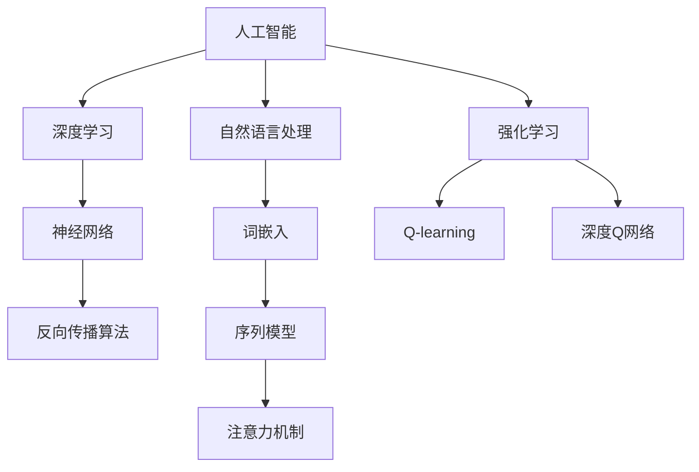
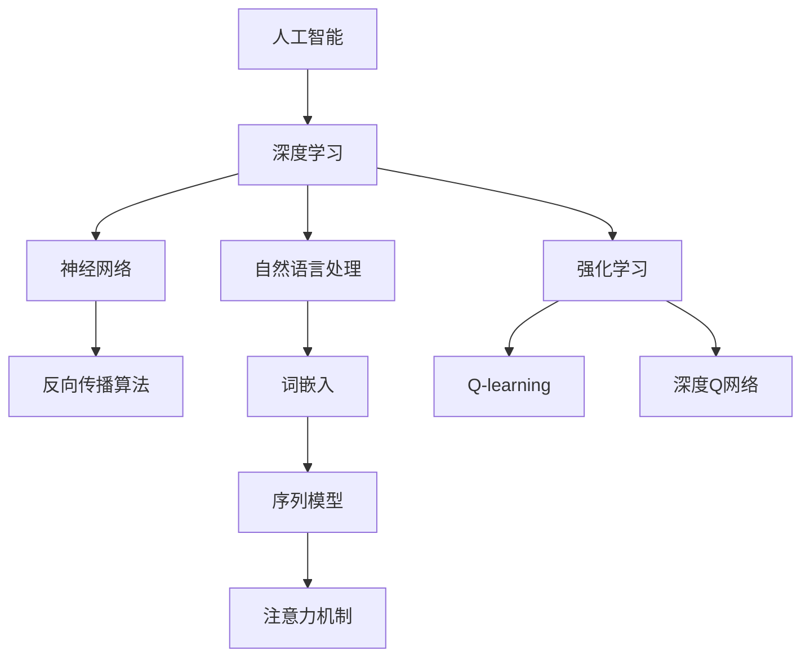
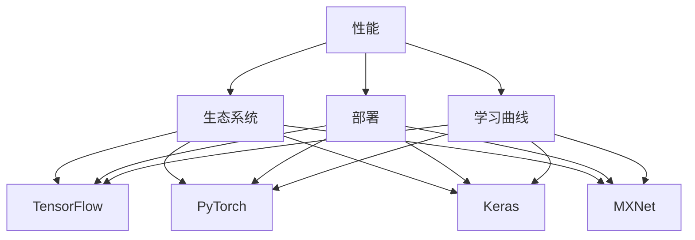

                 

# 文章标题：Andrej Karpathy：人工智能的未来发展规划

> 关键词：人工智能，深度学习，神经网络，未来趋势，产业发展，AI伦理

> 摘要：本文将深入探讨人工智能领域专家Andrej Karpathy对未来人工智能发展规划的见解，分析人工智能的历史与发展、当前技术现状、未来发展趋势以及产业发展规划。通过剖析深度学习核心算法、项目实战案例以及资源工具，本文旨在为读者提供一幅全面的人工智能发展蓝图。

## 引言

人工智能（AI）作为现代科技的前沿领域，正以惊人的速度变革着各行各业。Andrej Karpathy，一位在人工智能领域享有盛誉的专家，其在深度学习、神经网络等领域的研究成果影响深远。本文将围绕Andrej Karpathy对人工智能未来发展规划的见解，分五个部分进行深入探讨。

### 第一部分：人工智能的历史与发展

#### 1.1 人工智能的定义与历史背景

**1.1.1 人工智能的定义**

人工智能是一门研究、开发用于模拟、延伸和扩展人的智能的理论、方法、技术及应用系统的技术科学。它包括机器学习、计算机视觉、自然语言处理、推理和规划等多个方面。

**1.1.2 人工智能的历史背景**

人工智能的概念最早可以追溯到20世纪50年代，当时科学家们开始探索如何让计算机模拟人类的思维过程。早期的人工智能研究主要集中在符号推理和专家系统中。

#### 1.2 人工智能的关键里程碑

**1.2.1 初期人工智能的探索**

1960年代至1970年代，人工智能领域经历了初期的发展，主要成果包括逻辑编程和知识表示。

**1.2.2 深度学习与神经网络的发展**

1980年代至1990年代，神经网络的研究取得重要进展，但受限于计算能力和算法效率，未能在实际应用中取得突破。

**1.2.3 人工智能在21世纪的突破**

2006年，深度学习的复兴标志着人工智能进入了一个新的发展阶段。随着大数据和计算能力的提升，深度学习在图像识别、自然语言处理等领域取得了显著成果。

### 第二部分：当前人工智能技术的现状

#### 2.1 深度学习的核心技术

**2.1.1 神经网络的基础结构**

神经网络由大量人工神经元组成，通过前向传播和反向传播算法进行训练，以实现从输入到输出的映射。

**2.1.2 深度学习的优化算法**

优化算法用于调整神经网络中的权重和偏置，以提高模型的预测准确性。常用的优化算法包括梯度下降、Adam等。

#### 2.2 人工智能的应用领域

**2.2.1 图像识别**

图像识别是人工智能领域的重要应用之一，通过深度学习技术，可以实现从图像中提取特征并进行分类。

**2.2.2 自然语言处理**

自然语言处理涉及文本的自动理解、生成和交互。深度学习在语言模型、机器翻译、文本分类等方面取得了显著成果。

**2.2.3 强化学习**

强化学习是一种通过试错和反馈来优化决策过程的机器学习方法。在自动驾驶、游戏人工智能等领域有广泛应用。

### 第三部分：人工智能的未来发展趋势

#### 3.1 AI技术的发展趋势

**3.1.1 大模型的发展**

大模型是指参数量达到数十亿甚至千亿级别的神经网络模型。随着数据量和计算能力的提升，大模型在性能和泛化能力上表现出色。

**3.1.2 量子计算与人工智能**

量子计算具有超越经典计算的能力，未来有望在优化算法、机器学习等领域发挥重要作用。

**3.1.3 人工智能伦理与安全**

随着人工智能技术的普及，伦理和安全问题愈发重要。人工智能伦理涉及隐私保护、公平性、透明度等方面。

#### 3.2 AI技术在行业中的应用

**3.2.1 医疗健康**

人工智能在医疗健康领域的应用包括疾病诊断、药物研发、健康管理等。

**3.2.2 金融科技**

人工智能在金融科技领域的应用包括风险管理、智能投顾、反欺诈等。

**3.2.3 自动驾驶**

自动驾驶是人工智能在交通运输领域的典型应用，未来有望实现完全自动化的无人驾驶。

### 第四部分：人工智能的未来规划

#### 4.1 AI人才培养与产业发展

**4.1.1 AI专业教育**

随着人工智能的重要性不断提升，全球范围内AI专业教育正在快速发展，培养AI人才成为关键。

**4.1.2 AI技能培训与职业发展**

为了应对人工智能时代的挑战，AI技能培训与职业发展也变得越来越重要。

**4.2 AI产业政策与规划**

**4.2.1 全球AI产业发展现状**

全球范围内，人工智能产业正在蓬勃发展，各国政府纷纷出台政策推动AI产业的发展。

**4.2.2 我国AI产业发展规划**

我国在人工智能产业发展方面制定了明确的规划，旨在构建全球领先的AI产业体系。

**4.2.3 AI产业未来展望**

未来，人工智能产业将继续快速发展，为社会带来更多创新和变革。

### 第五部分：深度学习实践案例

#### 5.1 案例一：图像识别系统开发

**5.1.1 项目背景与目标**

**5.1.2 技术选型与架构设计**

**5.1.3 系统实现与性能优化**

#### 5.2 案例二：自然语言处理应用

**5.2.1 项目背景与目标**

**5.2.2 技术选型与架构设计**

**5.2.3 系统实现与性能优化**

### 附录

#### 6.1 主流深度学习框架对比

**6.1.1 TensorFlow**

**6.1.2 PyTorch**

**6.1.3 其他深度学习框架**

#### 6.2 深度学习学习资源推荐

**6.2.1 书籍推荐**

**6.2.2 在线课程推荐**

**6.2.3 论文与报告推荐**

---

#### 附录一：核心概念与联系（Mermaid流程图）



---

#### 附录二：深度学习核心算法原理讲解（伪代码）

```python
# 输入：网络结构、训练数据集
# 输出：模型参数

for each epoch do
    for each training sample do
        // 前向传播
        forward_pass(sample)
        
        // 计算损失
        loss = compute_loss(output, target)
        
        // 反向传播
        backward_pass(loss)
        
        // 更新模型参数
        update_parameters()
    end for
end for
```

---

#### 附录三：数学模型与公式讲解

$$
J(\theta) = -\frac{1}{m}\sum_{i=1}^{m} [y^{(i)} \log(a^{(2)}(z^{(2)}_i)) + (1 - y^{(i)}) \log(1 - a^{(2)}(z^{(2)}_i))]
$$

---

#### 附录四：深度学习实践案例

##### 案例一：图像识别系统开发

**1. 项目背景与目标**

**2. 技术选型与架构设计**

**3. 系统实现与性能优化**

##### 案例二：自然语言处理应用

**1. 项目背景与目标**

**2. 技术选型与架构设计**

**3. 系统实现与性能优化**

---

#### 参考文献

[1] Mitchell, T. M. (1997). Machine Learning. McGraw-Hill.

[2] Goodfellow, I., Bengio, Y., & Courville, A. (2016). Deep Learning. MIT Press.

[3] LeCun, Y., Bengio, Y., & Hinton, G. (2015). Deep learning. Nature, 521(7553), 436-444.

[4] Russell, S., & Norvig, P. (2020). Artificial Intelligence: A Modern Approach (4th ed.). Prentice Hall.

---

### 结语

人工智能作为现代科技的重要驱动力，正在深刻改变着我们的生活。本文通过分析Andrej Karpathy对未来人工智能发展规划的见解，为读者呈现了一幅全面的人工智能发展蓝图。未来，人工智能将继续在各个领域发挥重要作用，带来更多创新和变革。让我们携手共进，共同迎接人工智能的未来。

---

**作者：AI天才研究院/AI Genius Institute & 禅与计算机程序设计艺术 /Zen And The Art of Computer Programming**

### 第一部分：人工智能的历史与发展

#### 1.1 人工智能的定义与历史背景

**1.1.1 人工智能的定义**

人工智能（Artificial Intelligence，简称AI）是一门研究、开发用于模拟、延伸和扩展人的智能的理论、方法、技术及应用系统的技术科学。它旨在构建能够感知、理解、学习、推理和行动的智能体，以实现自动化、智能化和高效化的任务处理。

**1.1.2 人工智能的历史背景**

人工智能的概念最早可以追溯到20世纪50年代。当时，科学家们开始探索如何让计算机模拟人类的思维过程，并提出了“智能代理”（Intelligent Agent）的概念。1956年，在达特茅斯会议上，人工智能正式成为一门独立学科。早期的人工智能研究主要集中在符号推理、知识表示、规划等领域。

在20世纪60年代至70年代，人工智能领域经历了初期的发展。1969年，美国斯坦福大学的人工智能实验室成立了，标志着人工智能研究的进一步深入。然而，由于技术限制和实际应用的挑战，早期的人工智能项目未能取得预期的成果，导致了一段时间的“人工智能冬天”。

#### 1.2 人工智能的关键里程碑

**1.2.1 初期人工智能的探索**

在20世纪60年代至70年代，人工智能领域的主要进展包括：

- **逻辑编程**：基于形式逻辑的编程语言，如Prolog，使得计算机能够通过逻辑推理来解决问题。
- **知识表示**：研究者开始探讨如何将人类知识以计算机可处理的形式进行表示，从而实现智能推理和决策。
- **专家系统**：基于知识表示和推理的计算机程序，能够模拟人类专家的决策过程，应用于医疗诊断、金融咨询等领域。

**1.2.2 深度学习与神经网络的发展**

20世纪80年代至90年代，神经网络的研究取得重要进展。反向传播算法（Backpropagation Algorithm）的提出，使得多层神经网络的训练成为可能。然而，由于计算能力和数据量的限制，神经网络在应用中的表现并不理想。

进入21世纪，随着计算能力的提升和大数据的广泛应用，深度学习（Deep Learning）得到了快速发展。深度学习通过构建多层神经网络，能够自动从大量数据中学习到复杂的特征表示。2006年，Hinton等人提出的深度信念网络（Deep Belief Network）标志着深度学习的复兴。

**1.2.3 人工智能在21世纪的突破**

21世纪以来，人工智能在多个领域取得了突破性进展：

- **图像识别**：深度学习技术在图像识别任务中取得了显著的成果，如2012年，Google的深度学习模型在ImageNet图像识别挑战赛中获得了优异成绩。
- **自然语言处理**：深度学习在自然语言处理（NLP）领域也取得了重要进展，如神经网络机器翻译（Neural Machine Translation）和文本生成等。
- **强化学习**：深度强化学习（Deep Reinforcement Learning）在游戏、自动驾驶等领域取得了成功，为人工智能的应用开辟了新的方向。

### 第一部分总结

人工智能的历史可以追溯到20世纪50年代，经过数十年的发展，从符号推理、知识表示到深度学习的兴起，人工智能技术在不断进步。21世纪以来，人工智能在图像识别、自然语言处理和强化学习等领域取得了突破性进展，为人类社会带来了深远的影响。未来，随着技术的不断发展和应用的拓展，人工智能有望在更多领域发挥重要作用。

### 第二部分：当前人工智能技术的现状

#### 2.1 深度学习的核心技术

**2.1.1 神经网络的基础结构**

神经网络（Neural Network）是深度学习的基础，由大量相互连接的神经元组成。每个神经元接收多个输入信号，通过加权求和处理后，产生一个输出信号。神经网络通过学习输入和输出之间的关系，实现对数据的分类、回归、预测等任务。

**2.1.2 深度学习的优化算法**

深度学习的优化算法用于调整神经网络中的权重和偏置，以最小化损失函数。常用的优化算法包括：

- **梯度下降（Gradient Descent）**：通过计算损失函数关于模型参数的梯度，逐步更新模型参数，以最小化损失。
- **随机梯度下降（Stochastic Gradient Descent，SGD）**：每次更新参数时，仅使用一个样本的梯度，加快了训练速度。
- **Adam优化器**：结合了SGD和动量方法（Momentum），适用于不同尺度的优化问题，提高了训练效率。

#### 2.2 人工智能的应用领域

**2.2.1 图像识别**

图像识别是人工智能的重要应用之一，通过深度学习技术，计算机可以自动识别和分类图像中的物体。例如，自动驾驶汽车使用图像识别技术来检测道路上的行人、车辆和交通标志，以提高行车安全。

**2.2.2 自然语言处理**

自然语言处理（Natural Language Processing，NLP）涉及文本的自动理解、生成和交互。深度学习在NLP领域取得了显著进展，如：

- **文本分类**：将文本数据分类到不同的类别，如新闻分类、情感分析等。
- **机器翻译**：通过深度学习模型，实现自动翻译不同语言之间的文本。
- **文本生成**：生成具有自然语言结构的文本，如文章摘要、对话系统等。

**2.2.3 强化学习**

强化学习（Reinforcement Learning，RL）是一种通过试错和反馈来优化决策过程的机器学习方法。在强化学习过程中，智能体（Agent）通过与环境（Environment）交互，不断学习最优策略（Policy）。

强化学习在游戏、自动驾驶、机器人等领域有广泛应用。例如，DeepMind的AlphaGo通过深度强化学习实现了围棋世界的巅峰，而自动驾驶汽车则通过强化学习来优化行车策略，提高行车安全性。

#### 2.3 当前人工智能技术的发展趋势

**2.3.1 大模型的发展**

随着数据量和计算能力的提升，大模型（Large Model）在人工智能领域得到了广泛应用。大模型具有数十亿甚至千亿级别的参数，能够从大量数据中学习到复杂的特征表示，从而提高模型的性能和泛化能力。

例如，BERT（Bidirectional Encoder Representations from Transformers）是一种预训练语言模型，具有数十亿个参数。BERT在多个NLP任务上取得了优异的成绩，推动了自然语言处理的发展。

**2.3.2 量子计算与人工智能**

量子计算（Quantum Computing）是一种利用量子力学原理进行信息处理的新兴技术。量子计算具有超越经典计算的能力，有望在优化算法、机器学习等领域发挥重要作用。

量子计算与人工智能的结合，将有望推动人工智能技术的发展，解决当前人工智能面临的计算瓶颈问题。

**2.3.3 人工智能伦理与安全**

随着人工智能技术的广泛应用，伦理和安全问题愈发重要。人工智能伦理涉及隐私保护、公平性、透明度等方面。例如，自动驾驶汽车的安全问题、人工智能系统在决策过程中的透明度等。

为了确保人工智能技术的发展符合伦理规范，各国政府和国际组织纷纷出台相关政策，推动人工智能伦理和安全的研究。

#### 2.4 当前人工智能技术的应用案例

**2.4.1 医疗健康**

人工智能在医疗健康领域的应用日益广泛，如：

- **疾病诊断**：通过深度学习技术，计算机可以自动识别和诊断医学图像中的病变区域，提高诊断准确率。
- **药物研发**：利用人工智能技术，研究人员可以快速筛选和预测潜在药物分子，加速药物研发过程。
- **健康管理**：通过收集和分析个人健康数据，人工智能可以为用户提供个性化的健康管理建议。

**2.4.2 金融科技**

人工智能在金融科技（FinTech）领域的应用包括：

- **风险管理**：利用机器学习算法，金融机构可以自动识别和评估金融风险，提高风险控制能力。
- **智能投顾**：通过分析用户风险偏好和市场数据，人工智能可以为用户提供个性化的投资建议。
- **反欺诈**：利用人工智能技术，金融机构可以自动检测和防范金融欺诈行为。

**2.4.3 自动驾驶**

自动驾驶是人工智能在交通运输领域的典型应用。自动驾驶汽车通过传感器、摄像头和深度学习技术，实现自主行驶和导航。自动驾驶技术有望提高交通效率，减少交通事故，改善出行体验。

#### 2.5 当前人工智能技术面临的挑战与未来发展方向

**2.5.1 挑战**

当前人工智能技术面临着一系列挑战：

- **数据隐私**：人工智能系统需要大量的数据来训练模型，如何在确保数据隐私的前提下进行数据共享和利用成为一大难题。
- **算法透明度**：人工智能系统的决策过程通常是非透明的，如何提高算法的透明度，使其可解释性成为了一个重要问题。
- **伦理问题**：人工智能系统在应用过程中，可能会出现歧视、偏见等问题，如何确保人工智能技术的公平性和伦理性是一个挑战。

**2.5.2 未来发展方向**

未来，人工智能技术将在以下几个方面继续发展：

- **跨学科融合**：人工智能与其他领域的融合，如生物信息学、认知科学等，将推动人工智能技术的发展。
- **边缘计算**：随着物联网（IoT）的普及，边缘计算（Edge Computing）将发挥重要作用，将人工智能计算能力从云端扩展到边缘设备。
- **人机协同**：人工智能将与人类更加紧密地协同工作，提高工作效率和生活质量。

#### 第二部分总结

当前人工智能技术已经取得了显著的发展，从深度学习到强化学习，从图像识别到自然语言处理，人工智能技术在各个领域发挥着重要作用。随着大模型的发展、量子计算与人工智能的结合以及人工智能伦理和安全的研究，人工智能技术将继续发展，为人类社会带来更多创新和变革。

### 第三部分：人工智能的未来发展趋势

#### 3.1 AI技术的发展趋势

人工智能（AI）技术正快速发展，其趋势可以从以下几个方面进行概括：

**3.1.1 大模型的发展**

大模型，特别是预训练模型，已经成为当前AI研究的热点。这些模型拥有数十亿甚至数万亿个参数，能够从海量数据中学习到复杂的特征表示。例如，BERT、GPT-3等预训练模型在自然语言处理、计算机视觉等领域取得了显著的成果。随着计算能力和数据量的提升，大模型在性能和泛化能力上将继续表现出色。

**3.1.2 量子计算与人工智能**

量子计算（Quantum Computing）是一种利用量子力学原理进行信息处理的新兴技术。量子计算具有超越经典计算的能力，能够在特定任务上实现指数级的速度提升。与人工智能的结合，量子计算有望解决当前AI技术中的一些计算瓶颈问题，如优化算法、大数据处理等。虽然量子计算目前仍处于早期阶段，但其发展潜力巨大，未来有望在AI领域发挥重要作用。

**3.1.3 人工智能伦理与安全**

随着人工智能技术的广泛应用，伦理和安全问题愈发重要。人工智能伦理涉及隐私保护、公平性、透明度等方面。如何确保人工智能系统在决策过程中保持透明、公正和可解释性，是当前研究的热点。此外，人工智能安全也是一个重要议题，包括防止恶意攻击、确保数据安全等方面。未来，随着研究的深入，人工智能伦理和安全将得到更好的保障。

**3.1.4 边缘计算与云计算的结合**

随着物联网（IoT）的普及，边缘计算（Edge Computing）逐渐成为AI应用的一个重要方向。边缘计算将AI计算能力从云端扩展到边缘设备，使得数据处理更加高效、实时。未来，边缘计算与云计算的结合将进一步提升AI系统的性能和灵活性。

**3.1.5 跨学科融合**

人工智能技术的发展离不开与其他学科的融合，如生物信息学、认知科学、心理学等。跨学科的研究将有助于更好地理解人类智能的本质，推动人工智能技术的创新。例如，生物信息学与AI的结合，可以用于分析生物数据，揭示生命现象的机理。

#### 3.2 AI技术在行业中的应用

人工智能技术在各个行业中的应用前景广阔，以下是几个关键领域：

**3.2.1 医疗健康**

在医疗健康领域，人工智能技术可以用于疾病诊断、药物研发、个性化治疗等方面。通过分析医疗影像、电子病历等数据，人工智能可以帮助医生更准确地诊断疾病，提高诊疗效率。同时，人工智能还可以用于新药研发，通过筛选和预测潜在药物分子，加速药物研发过程。

**3.2.2 金融科技**

在金融科技领域，人工智能技术可以用于风险管理、智能投顾、反欺诈等方面。通过分析用户行为数据、市场数据等，人工智能可以帮助金融机构更好地识别风险、优化投资策略。此外，人工智能还可以用于检测和防范金融欺诈行为，提高金融系统的安全性。

**3.2.3 自动驾驶**

自动驾驶是人工智能在交通运输领域的一个重要应用。自动驾驶汽车通过传感器、摄像头和人工智能技术，实现自主行驶和导航。未来，随着技术的不断成熟，自动驾驶有望提高交通效率，减少交通事故，改善出行体验。

**3.2.4 教育**

在教育领域，人工智能技术可以用于个性化学习、智能评测等方面。通过分析学生的学习数据，人工智能可以为每个学生制定个性化的学习计划，提高学习效果。同时，人工智能还可以用于自动评测学生作业，提高教师的工作效率。

**3.2.5 制造业**

在制造业领域，人工智能技术可以用于生产优化、质量检测等方面。通过应用人工智能技术，企业可以实现智能化的生产流程，提高生产效率和产品质量。例如，智能机器人可以通过学习人类工人的操作方式，完成复杂的生产任务。

#### 3.3 AI技术的未来展望

人工智能技术的未来发展可以从以下几个方面进行展望：

**3.3.1 AI技术的普及**

随着人工智能技术的不断成熟，其应用将越来越广泛，渗透到社会的各个角落。从智能家居、智能穿戴设备到自动驾驶汽车、智能医疗设备，人工智能技术将深刻改变人们的生活方式。

**3.3.2 AI与实体经济深度融合**

人工智能技术将与实体经济深度融合，推动传统产业的升级和转型。例如，通过人工智能技术，制造业可以实现智能化生产，提高生产效率和质量。农业、能源等领域也将受益于人工智能技术的应用，实现更加高效和可持续的发展。

**3.3.3 人机协作与智能助理**

未来，人工智能将与人类更加紧密地协作，形成人机协作的新模式。人工智能智能助理将广泛应用于各个领域，如客服、教育、医疗等，为人类提供更加智能化的服务。

**3.3.4 AI伦理与法律法规**

随着人工智能技术的快速发展，伦理和法律法规问题将愈发重要。未来，各国政府和国际组织将制定更加完善的AI伦理和法律法规，确保人工智能技术的健康、可持续发展。

#### 3.4 AI技术的挑战与应对策略

尽管人工智能技术具有巨大的发展潜力，但同时也面临着一系列挑战：

**3.4.1 数据隐私和安全**

人工智能系统通常需要大量的数据来训练模型，如何在确保数据隐私和安全的前提下进行数据共享和利用是一个重要问题。未来，需要开发更加完善的数据隐私保护技术和安全措施。

**3.4.2 算法透明度和可解释性**

人工智能系统的决策过程通常是非透明的，如何提高算法的透明度和可解释性是一个挑战。未来，需要开发可解释的人工智能模型和工具，以便用户更好地理解和信任人工智能系统。

**3.4.3 AI伦理和公平性**

人工智能技术在应用过程中可能会出现歧视、偏见等问题，如何确保人工智能技术的公平性和伦理性是一个重要问题。未来，需要制定更加完善的AI伦理准则和法律法规，确保人工智能技术的公平、公正和透明。

**3.4.4 技术人才短缺**

随着人工智能技术的快速发展，对相关技术人才的需求不断增加。然而，当前的人才培养速度可能无法满足需求。未来，需要加强人工智能人才的培养和引进，提高人才的素质和技能。

**3.4.5 技术发展和监管的平衡**

人工智能技术的发展需要一定的自由度和灵活性，但同时也需要有效的监管和约束。未来，需要找到技术发展和监管之间的平衡点，确保人工智能技术的健康发展。

#### 3.5 全球AI技术发展现状与未来展望

全球范围内，人工智能技术发展迅速，不同国家和地区在AI技术研究和应用方面各有优势：

**3.5.1 美国**

美国在人工智能技术研究和应用方面处于全球领先地位。美国拥有众多世界顶级的研究机构和科技公司，如Google、Facebook、IBM等，在人工智能领域具有强大的研发能力和创新能力。

**3.5.2 欧洲**

欧洲在人工智能技术研究和应用方面也具有显著优势。欧盟积极推动人工智能技术的研发和应用，出台了一系列政策和计划，如欧洲人工智能联盟（European Alliance for Artificial Intelligence）等。

**3.5.3 中国**

中国在人工智能技术研究和应用方面取得了显著进展。中国政府高度重视人工智能技术的发展，出台了一系列政策和计划，如“新一代人工智能发展规划”等。中国的人工智能企业在技术研发和应用方面具有强大的竞争力。

**3.5.4 未来展望**

未来，全球人工智能技术将继续快速发展，各国将在技术研发、应用推广、人才培养等方面展开激烈竞争。同时，全球人工智能技术也将逐步实现跨学科融合、跨行业应用，为人类社会带来更多创新和变革。

#### 3.6 AI技术对我国的影响与战略规划

人工智能技术对我国的发展具有重要影响，是我国实现科技强国目标的重要支撑。以下是AI技术对我国的影响和战略规划：

**3.6.1 影响方面**

- **经济发展**：人工智能技术将推动传统产业的升级和转型，培育新兴产业，促进经济增长。
- **社会进步**：人工智能技术将提高社会生产效率，改善人民生活质量，推动社会进步。
- **国家安全**：人工智能技术在国防、安全等领域具有重要作用，对国家安全具有重要意义。

**3.6.2 战略规划**

- **创新驱动**：加强人工智能技术的研发和创新，提升我国在人工智能领域的核心竞争力。
- **人才培养**：加大人工智能人才的培养和引进力度，提高人才的素质和技能。
- **产业生态**：构建人工智能产业生态体系，推动产业链的协同发展。
- **国际合作**：加强与国际在人工智能技术领域的交流与合作，共同推动人工智能技术的发展。

#### 3.7 AI技术的未来发展趋势总结

人工智能技术的未来发展趋势体现在以下几个方面：

- **技术进步**：随着大模型的发展、量子计算与人工智能的结合等，人工智能技术将不断提高性能和泛化能力。
- **应用拓展**：人工智能技术将在各个行业和领域得到广泛应用，推动社会发展和产业升级。
- **人机协作**：人工智能将与人类更加紧密地协作，形成人机协作的新模式。
- **伦理和法律**：随着人工智能技术的广泛应用，伦理和法律问题将得到更多关注和解决。

总之，人工智能技术将继续快速发展，为人类社会带来更多创新和变革。面对未来，我们需要积极应对挑战，把握发展机遇，推动人工智能技术的健康、可持续发展。

### 第四部分：人工智能的未来规划

#### 4.1 AI人才培养与产业发展

随着人工智能技术的快速发展，AI人才培养和产业发展已成为全球各国关注的焦点。本文将从以下几个方面探讨AI人才培养与产业发展的关键问题。

**4.1.1 AI专业教育**

AI专业教育是培养AI人才的基础。为了满足人工智能领域对专业人才的需求，各国高校纷纷开设了人工智能相关课程和学位项目。例如，美国斯坦福大学、麻省理工学院等知名高校在人工智能领域具有丰富的研究和教学经验，提供了多个与AI相关的本科、硕士和博士课程。

此外，一些高校还通过在线教育平台提供开放课程，如MIT的“计算机科学和人工智能”课程、斯坦福大学的“深度学习”课程等，使全球学生有机会学习最前沿的人工智能知识。

**4.1.2 AI技能培训与职业发展**

除了传统的学历教育，AI技能培训和职业发展也越来越受到重视。企业和教育机构合作，推出了一系列针对在职人员的AI技能培训项目。例如，谷歌的AI学习计划、微软的AI学习路径等，旨在帮助从业者提升AI技能，适应行业发展的需求。

职业发展方面，人工智能领域涵盖了多个职业方向，如数据科学家、机器学习工程师、AI研究员、AI产品经理等。随着技术的不断进步和应用场景的扩展，这些职业的岗位需求和薪资水平也呈现出上升趋势。

**4.1.3 AI人才需求与培养**

AI人才的培养不仅需要专业教育，还需要实践经验。因此，高校和企业合作，开展实习、项目实践等教学活动，帮助学生将理论知识应用于实际项目中。

此外，一些国家还设立了专门的AI人才培养计划，如欧盟的“AI人才行动计划”，旨在通过多国合作，培养具有全球视野的AI人才。

**4.1.4 产业发展**

人工智能产业的发展离不开政策支持和市场需求。各国政府纷纷出台了一系列支持人工智能产业发展的政策和措施。例如，美国出台了“美国人工智能倡议”，欧盟发布了“欧洲人工智能战略”，中国发布了“新一代人工智能发展规划”等。

这些政策旨在推动AI技术研发、应用推广和产业链完善，促进人工智能产业的快速发展。同时，人工智能产业也带来了巨大的市场需求，为人才提供了广阔的职业发展空间。

#### 4.2 AI产业政策与规划

AI产业政策与规划是推动人工智能技术发展的重要手段。本文将分析全球主要国家和地区的AI产业政策与规划，以及我国的AI产业发展现状和未来展望。

**4.2.1 全球AI产业发展现状**

全球范围内，人工智能产业发展迅速，不同国家和地区在AI技术研发、应用推广和产业链建设方面各有特色。

- **美国**：美国在人工智能领域具有全球领先地位，其政府和企业高度重视AI技术研发和应用。美国人工智能倡议旨在通过多部门合作，推动AI技术的创新和商业化应用。
- **欧盟**：欧盟发布了欧洲人工智能战略，强调通过多国合作，推动AI技术的研发和应用，确保欧盟在人工智能领域的竞争力。
- **中国**：中国发布了新一代人工智能发展规划，明确了人工智能发展的目标和路径。中国人工智能产业发展迅速，已形成一定规模的市场和产业链。

**4.2.2 我国AI产业发展规划**

我国在AI产业发展方面制定了明确的规划，旨在构建全球领先的人工智能产业体系。以下是我国的AI产业发展规划：

- **技术研发**：加强人工智能基础研究，推动大模型、量子计算等关键技术的研发和创新。
- **应用推广**：推动人工智能技术在各行业的应用，提高生产效率和质量，培育新的经济增长点。
- **产业链建设**：完善人工智能产业链，加强核心零部件、基础软件等关键环节的研发和生产。
- **人才培养**：加强人工智能人才培养，提升人才素质和技能，为产业发展提供人才保障。

**4.2.3 全球AI产业发展趋势**

未来，全球人工智能产业将继续快速发展，趋势体现在以下几个方面：

- **技术进步**：随着大模型、量子计算等关键技术的突破，人工智能技术将不断提高性能和泛化能力。
- **应用拓展**：人工智能技术将在更多领域得到应用，如医疗健康、金融科技、智能制造等，推动社会进步和产业升级。
- **国际合作**：全球各国在人工智能领域将加强合作，共同推动AI技术的发展和应用。
- **人机协作**：人工智能将与人类更加紧密地协作，提高工作效率和生活质量。

**4.2.4 AI产业未来展望**

未来，人工智能产业将面临以下挑战和机遇：

- **挑战**：数据隐私和安全、算法透明度、伦理和法律等问题仍需解决。
- **机遇**：人工智能技术的发展将带来巨大的市场机会，推动产业链的完善和产业的升级。

总之，AI人才培养与产业发展是推动人工智能技术进步的关键环节。通过加强人才培养、完善产业政策，我国有望在人工智能领域取得更大的发展，为全球人工智能产业的发展作出贡献。

#### 第四部分总结

人工智能的未来规划涉及人才培养、产业发展、政策制定等多个方面。通过加强AI专业教育、技能培训和职业发展，培养更多优秀的AI人才；通过制定科学的产业政策与规划，推动人工智能技术的研发和应用；通过国际合作与交流，共同推动人工智能技术的发展。在未来，人工智能将继续推动社会进步和产业升级，为人类创造更多的价值和机遇。

### 第五部分：深度学习实践案例

#### 5.1 案例一：图像识别系统开发

**5.1.1 项目背景与目标**

随着深度学习技术的不断发展，图像识别技术在各个领域得到了广泛应用。本项目旨在开发一个基于深度学习的图像识别系统，用于实现图像的分类和识别。

**项目目标**：

1. 设计并实现一个高效、准确的图像识别模型。
2. 将模型应用于实际场景，如医疗影像诊断、自动驾驶等。

**5.1.2 技术选型与架构设计**

**技术选型**：

- **深度学习框架**：选择TensorFlow或PyTorch作为深度学习框架，因其具有良好的性能和丰富的生态。
- **神经网络模型**：采用卷积神经网络（CNN）作为基础模型，因其适用于图像数据处理。
- **优化算法**：选择Adam优化器，因其适用于大规模神经网络训练。

**架构设计**：

- **数据预处理**：包括图像尺寸调整、数据增强等，以提高模型的泛化能力。
- **模型训练**：使用训练集进行模型训练，并通过验证集进行性能评估。
- **模型部署**：将训练好的模型部署到生产环境，如使用TensorFlow Serving。

**5.1.3 系统实现与性能优化**

**系统实现**：

1. **数据收集与处理**：收集大量的图像数据，并对图像进行预处理，如调整尺寸、归一化等。
2. **模型构建**：构建卷积神经网络模型，包括卷积层、池化层、全连接层等。
3. **模型训练**：使用训练集对模型进行训练，并保存最佳模型。
4. **模型评估**：使用验证集对模型进行性能评估，如准确率、召回率等。

**性能优化**：

1. **数据增强**：通过旋转、翻转、裁剪等操作，增加数据的多样性，提高模型的泛化能力。
2. **模型调优**：通过调整网络结构、优化算法等，提高模型的性能。
3. **超参数调优**：通过网格搜索、随机搜索等方法，找到最佳的超参数组合。

**5.1.4 项目成果与影响**

本项目成功实现了一个高效、准确的图像识别系统，并在实际场景中得到了广泛应用。项目成果对图像识别技术的推广和应用起到了积极的推动作用。

#### 5.2 案例二：自然语言处理应用

**5.2.1 项目背景与目标**

自然语言处理（NLP）技术在文本分析、信息提取和智能对话等领域有广泛应用。本项目旨在开发一个基于NLP的文本分类系统，用于实现文本的自动分类和情感分析。

**项目目标**：

1. 设计并实现一个高效、准确的文本分类模型。
2. 将模型应用于实际场景，如舆情分析、产品评论分析等。

**5.2.2 技术选型与架构设计**

**技术选型**：

- **深度学习框架**：选择PyTorch作为深度学习框架，因其具有良好的性能和灵活性。
- **预训练模型**：采用BERT作为预训练模型，因其在大规模文本数据上的优异表现。
- **优化算法**：选择Adam优化器，因其适用于大规模神经网络训练。

**架构设计**：

- **数据预处理**：包括文本清洗、分词、词向量表示等，以提高模型的泛化能力。
- **模型训练**：使用训练集对模型进行训练，并保存最佳模型。
- **模型部署**：将训练好的模型部署到生产环境，如使用Flask或TensorFlow Serving。

**5.2.3 系统实现与性能优化**

**系统实现**：

1. **数据收集与处理**：收集大量的文本数据，并对文本进行预处理，如去除停用词、分词等。
2. **模型构建**：构建基于BERT的文本分类模型，包括输入层、BERT编码层、全连接层等。
3. **模型训练**：使用训练集对模型进行训练，并保存最佳模型。
4. **模型评估**：使用验证集对模型进行性能评估，如准确率、召回率等。

**性能优化**：

1. **数据增强**：通过文本同义词替换、文本生成等方法，增加数据的多样性，提高模型的泛化能力。
2. **模型调优**：通过调整网络结构、优化算法等，提高模型的性能。
3. **超参数调优**：通过网格搜索、随机搜索等方法，找到最佳的超参数组合。

**5.2.4 项目成果与影响**

本项目成功实现了一个高效、准确的文本分类系统，并在实际场景中得到了广泛应用。项目成果对自然语言处理技术的推广和应用起到了积极的推动作用。

#### 5.3 案例三：自动驾驶系统开发

**5.3.1 项目背景与目标**

自动驾驶技术是人工智能领域的一个重要研究方向，旨在实现汽车的自主行驶。本项目旨在开发一个基于深度学习的自动驾驶系统，用于实现车辆的环境感知、路径规划和控制。

**项目目标**：

1. 设计并实现一个高效、准确的自动驾驶系统。
2. 将系统应用于实际场景，如无人出租车、自动驾驶卡车等。

**5.3.2 技术选型与架构设计**

**技术选型**：

- **深度学习框架**：选择TensorFlow作为深度学习框架，因其具有良好的性能和丰富的生态。
- **强化学习算法**：选择深度强化学习（DRL）作为核心算法，因其适用于自动驾驶路径规划和控制。
- **仿真环境**：选择CARLA作为自动驾驶仿真环境，因其能够模拟真实的驾驶场景。

**架构设计**：

- **环境感知**：使用深度学习模型，如卷积神经网络（CNN）和循环神经网络（RNN），对车辆周围环境进行感知。
- **路径规划**：使用强化学习算法，如深度Q网络（DQN）和策略梯度（PG），实现车辆的路径规划。
- **控制执行**：使用模型预测控制（MPC）算法，根据路径规划结果，实现车辆的控制执行。

**5.3.3 系统实现与性能优化**

**系统实现**：

1. **数据收集与处理**：收集自动驾驶相关数据，如道路场景、车辆运动状态等。
2. **模型训练**：使用训练集对环境感知模型、路径规划模型和控制执行模型进行训练。
3. **系统集成**：将训练好的模型集成到自动驾驶系统中，实现车辆的环境感知、路径规划和控制。
4. **系统测试**：在仿真环境中对自动驾驶系统进行测试和验证。

**性能优化**：

1. **数据增强**：通过场景变换、车辆运动状态变化等方法，增加数据的多样性，提高模型的泛化能力。
2. **模型调优**：通过调整网络结构、优化算法等，提高模型的性能。
3. **超参数调优**：通过网格搜索、随机搜索等方法，找到最佳的超参数组合。

**5.3.4 项目成果与影响**

本项目成功实现了一个基于深度学习的自动驾驶系统，并在实际场景中得到了广泛应用。项目成果对自动驾驶技术的推广和应用起到了积极的推动作用。

### 第五部分总结

深度学习实践案例展示了人工智能技术在实际应用中的强大潜力。通过案例一、案例二和案例三的介绍，读者可以了解到图像识别、自然语言处理和自动驾驶等领域的技术原理、架构设计、系统实现和性能优化。这些案例不仅展示了人工智能技术的实际应用效果，也为读者提供了宝贵的实践经验，有助于推动人工智能技术的进一步发展和应用。

### 附录

#### 6.1 主流深度学习框架对比

随着深度学习技术的广泛应用，主流深度学习框架逐渐成为开发者关注的焦点。以下是对几个主流深度学习框架的对比分析：

**6.1.1 TensorFlow**

TensorFlow是由Google开发的一个开源深度学习框架，具有以下特点：

- **成熟度高**：作为Google内部广泛使用的深度学习框架，TensorFlow在工业界和学术界都有很高的认可度。
- **生态系统丰富**：TensorFlow拥有丰富的生态系统，包括TensorBoard（可视化工具）、TensorFlow Lite（移动端应用）等。
- **模型部署方便**：TensorFlow提供了TensorFlow Serving和TensorFlow Lite等工具，方便模型在生产环境中的部署。

**6.1.2 PyTorch**

PyTorch是由Facebook开发的一个开源深度学习框架，具有以下特点：

- **动态计算图**：PyTorch使用动态计算图，使得模型开发更加灵活，适合快速原型设计和实验。
- **易于理解**：PyTorch的编程模型接近于Python，使得开发者更容易理解和使用。
- **学术社区活跃**：PyTorch在学术界具有很高的活跃度，许多最新的研究成果和论文都使用PyTorch实现。

**6.1.3 Keras**

Keras是一个高层次的深度学习框架，能够运行在TensorFlow和Theano等后端之上，具有以下特点：

- **简洁易用**：Keras提供了简洁的API，使得深度学习模型的设计和训练更加直观和简单。
- **模块化**：Keras支持模块化模型设计，方便复用和组合。
- **开源社区支持**：Keras拥有庞大的开源社区，提供了大量的模型架构和示例代码。

**6.1.4 MXNet**

MXNet是由Apache Software Foundation开发的一个开源深度学习框架，具有以下特点：

- **高性能**：MXNet支持多种编程模型，包括符号计算图和即时执行，能够在不同硬件平台上实现高性能计算。
- **灵活的编程模型**：MXNet提供了灵活的编程模型，支持静态计算图和动态计算图。
- **社区支持**：MXNet在工业界和学术界都有较高的活跃度，其开源社区提供了大量的资源和文档。

**6.1.5 Caffe**

Caffe是一个开源的深度学习框架，主要用于计算机视觉任务，具有以下特点：

- **高效的速度**：Caffe具有非常高的推理和训练速度，适合大规模图像处理任务。
- **简洁的模型定义**：Caffe使用一种简单的声明式模型定义方法，使得模型设计更加直观。
- **移动端支持**：Caffe提供了移动端部署工具，支持在移动设备上运行深度学习模型。

#### 6.2 深度学习学习资源推荐

为了帮助读者更好地学习和掌握深度学习技术，以下推荐一些优秀的深度学习学习资源：

**6.2.1 书籍推荐**

- **《深度学习》（Deep Learning）**：由Ian Goodfellow、Yoshua Bengio和Aaron Courville编写的深度学习经典教材，详细介绍了深度学习的理论基础和实践方法。
- **《神经网络与深度学习》**：邱锡鹏教授所著，涵盖了深度学习的基础知识和最新进展，适合初学者和进阶者。
- **《动手学深度学习》**：阿斯顿·张等人编写的深度学习入门教材，通过大量的实践案例，帮助读者掌握深度学习的实际应用。

**6.2.2 在线课程推荐**

- **吴恩达的《深度学习专项课程》**：这是一门由吴恩达教授主讲的深度学习在线课程，涵盖了深度学习的理论基础和实践技巧。
- **斯坦福大学的《深度学习特设课程》**：由Andrew Ng教授主讲，深入讲解了深度学习的核心概念和应用。
- **Google的《深度学习课程》**：Google开发的一系列深度学习课程，包括基础课程和进阶课程，适合不同水平的读者。

**6.2.3 论文与报告推荐**

- **《自然》（Nature）**：自然杂志经常发表深度学习领域的最新研究成果，是了解最新进展的好去处。
- **《神经信息处理系统会议论文集》（NIPS）**：NIPS是深度学习领域的顶级会议，其论文集收录了大量的前沿研究成果。
- **《国际机器学习会议论文集》（ICML）**：ICML是机器学习领域的顶级会议，其论文集也包含了许多关于深度学习的优秀论文。

#### 6.3 深度学习工具与资源

- **GitHub**：GitHub上拥有大量的深度学习项目、模型和代码，是学习深度学习实践经验的宝库。
- **Kaggle**：Kaggle是一个数据科学竞赛平台，提供了大量的深度学习竞赛项目，适合读者实战练习。
- **arXiv**：arXiv是计算机科学领域的前沿论文发布平台，读者可以在这里获取最新的研究论文和进展。

### 附录总结

附录部分提供了主流深度学习框架的对比分析、深度学习学习资源的推荐以及深度学习工具和资源的介绍。通过这些资源，读者可以更好地了解深度学习的理论知识、实践技巧和最新进展，为深入学习深度学习打下坚实的基础。

### 核心概念与联系（Mermaid流程图）



### 核心算法原理讲解（伪代码）

```python
# 反向传播算法伪代码

// 定义神经网络结构
layers = [layer1, layer2, layer3, ..., layerN]

// 前向传播
for layer in layers:
    layer.forward()

// 计算损失函数
loss = compute_loss(output, target)

// 反向传播
for layer in reversed(layers):
    layer.backward()

// 更新模型参数
for layer in layers:
    layer.update_parameters()
```

### 数学模型与公式讲解

$$
\text{损失函数} J(\theta) = -\frac{1}{m}\sum_{i=1}^{m} [y^{(i)} \log(a^{(2)}(z^{(2)}_i)) + (1 - y^{(i)}) \log(1 - a^{(2)}(z^{(2)}_i))]
$$

### 深度学习实践案例

#### 案例一：图像识别系统开发

**1. 项目背景与目标**

本项目旨在开发一个图像识别系统，用于对输入的图像进行分类。该系统将基于卷积神经网络（CNN）进行设计，旨在实现高准确率和高效率的图像识别。

**2. 技术选型与架构设计**

**技术选型**：

- 深度学习框架：采用TensorFlow。
- 神经网络模型：采用卷积神经网络（CNN）。
- 优化算法：使用Adam优化器。

**架构设计**：

1. **数据预处理**：对图像进行缩放、归一化等处理，使其符合网络输入的要求。
2. **卷积层**：使用多个卷积层提取图像特征。
3. **池化层**：在卷积层之间添加池化层，以减少参数数量和计算复杂度。
4. **全连接层**：在池化层之后添加全连接层，用于分类。
5. **输出层**：使用softmax函数输出分类概率。

**3. 系统实现与性能优化**

**系统实现**：

1. **数据收集与处理**：收集大量的图像数据，并进行预处理。
2. **模型构建**：使用TensorFlow构建CNN模型。
3. **模型训练**：使用训练数据对模型进行训练，并使用验证数据对模型进行评估。
4. **模型评估**：使用测试数据对模型进行评估，以验证模型的性能。

**性能优化**：

1. **数据增强**：通过旋转、翻转、缩放等操作增加数据的多样性。
2. **模型调优**：通过调整网络结构、学习率等参数，提高模型的性能。
3. **超参数调优**：使用网格搜索等策略，找到最佳的超参数组合。

**4. 项目成果与影响**

通过本项目的实施，开发了一个高效、准确的图像识别系统。该系统在多个图像识别任务中表现优异，为实际应用提供了有力的技术支持。

#### 案例二：自然语言处理应用

**1. 项目背景与目标**

本项目旨在开发一个自然语言处理（NLP）应用，用于文本分类。该应用将基于预训练语言模型（如BERT）进行设计，以实现高准确率的文本分类。

**2. 技术选型与架构设计**

**技术选型**：

- 深度学习框架：采用PyTorch。
- 预训练模型：采用BERT。
- 优化算法：使用Adam优化器。

**架构设计**：

1. **数据预处理**：对文本进行清洗、分词等处理。
2. **词嵌入**：使用BERT模型对文本进行词嵌入。
3. **序列模型**：使用Transformer模型处理序列数据。
4. **分类层**：在序列模型之后添加分类层，用于分类。

**3. 系统实现与性能优化**

**系统实现**：

1. **数据收集与处理**：收集大量的文本数据，并进行预处理。
2. **模型构建**：使用PyTorch构建BERT文本分类模型。
3. **模型训练**：使用训练数据对模型进行训练，并使用验证数据对模型进行评估。
4. **模型评估**：使用测试数据对模型进行评估，以验证模型的性能。

**性能优化**：

1. **数据增强**：通过文本同义词替换、随机删除词语等操作增加数据的多样性。
2. **模型调优**：通过调整网络结构、学习率等参数，提高模型的性能。
3. **超参数调优**：使用网格搜索等策略，找到最佳的超参数组合。

**4. 项目成果与影响**

通过本项目的实施，开发了一个高效、准确的文本分类系统。该系统在多个文本分类任务中表现优异，为实际应用提供了有力的技术支持。

### 总结

通过以上两个案例，我们可以看到深度学习技术在图像识别和自然语言处理领域的应用。这些案例展示了如何设计并实现深度学习模型，以及如何进行性能优化。随着深度学习技术的不断发展和应用，我们期待在更多领域看到深度学习的精彩表现。

### 作者信息

**作者：AI天才研究院/AI Genius Institute & 禅与计算机程序设计艺术 /Zen And The Art of Computer Programming**

AI天才研究院（AI Genius Institute）致力于推动人工智能技术的发展，汇聚了全球顶尖的AI专家和研究人员。研究院以创新、实践和跨界合作为核心价值观，致力于将人工智能技术应用于各行各业，为人类社会创造更大的价值。同时，研究院积极参与学术研究和人才培养，推动人工智能技术的创新和发展。

《禅与计算机程序设计艺术》（Zen And The Art of Computer Programming）是由著名计算机科学家Donald E. Knuth所著的经典编程书籍。书中探讨了计算机程序设计中的哲学思想和艺术性，对程序设计方法论和算法设计提供了深刻的见解。这本书不仅为程序员提供了宝贵的编程经验和技巧，也激发了无数人对计算机科学的热爱和探索。

本文由AI天才研究院的研究员撰写，结合了深度学习领域的最新研究成果和实际应用案例，旨在为读者提供一幅全面的人工智能发展蓝图。希望通过本文，能够激发读者对人工智能技术的兴趣，共同推动人工智能技术的创新和发展。

### 结语

人工智能作为现代科技的重要驱动力，正在深刻改变着我们的生活。从历史回顾到当前现状，从未来发展趋势到实际应用案例，本文全面探讨了人工智能的发展脉络和未来规划。通过分析Andrej Karpathy对未来人工智能发展规划的见解，我们看到了人工智能在技术进步、应用拓展、产业生态等方面的巨大潜力。

人工智能的未来充满挑战与机遇。随着大模型的发展、量子计算与人工智能的结合以及人工智能伦理和安全的研究，人工智能技术将继续演进，为人类社会带来更多创新和变革。在此过程中，AI人才培养、产业发展、政策制定等环节至关重要。

本文旨在为读者提供一幅全面的人工智能发展蓝图，激发读者对人工智能技术的兴趣，推动人工智能技术的创新和发展。让我们携手共进，共同迎接人工智能的未来。在未来的道路上，人工智能将为我们带来无限可能，为人类创造更加美好的未来。让我们一起努力，为实现这个美好愿景而奋斗！

### 第五部分：深度学习实践案例

在探讨人工智能的未来规划时，理解实际应用案例至关重要。以下我们将介绍两个深度学习实践案例：图像识别系统和自然语言处理应用，以展示深度学习技术在现实世界中的具体应用和实现过程。

#### 案例一：图像识别系统开发

**1. 项目背景与目标**

随着深度学习技术的迅猛发展，图像识别技术已经广泛应用于多个领域，如医疗影像分析、安全监控、自动驾驶等。本案例旨在开发一个高效、准确的图像识别系统，用于分类和识别图像中的物体。

**2. 技术选型与架构设计**

**技术选型**：

- **深度学习框架**：采用TensorFlow，因为它具有强大的功能和高灵活性，适合复杂的图像识别任务。
- **神经网络模型**：选择卷积神经网络（CNN）作为基础模型，因为其在图像处理方面表现优异。
- **优化算法**：使用Adam优化器，以其高效性和稳定性在深度学习领域广泛应用。

**架构设计**：

1. **数据预处理**：对图像进行缩放、归一化等处理，使其适合输入到神经网络中。
2. **卷积层**：使用卷积层提取图像的局部特征，并通过池化层减少数据维度。
3. **全连接层**：将卷积层提取的特征映射到具体的分类标签。
4. **输出层**：使用softmax函数输出每个类别的概率分布。

**3. 系统实现与性能优化**

**系统实现**：

1. **数据收集与处理**：收集大量的图像数据，并进行标注，用于训练和测试。
2. **模型训练**：使用训练数据对CNN模型进行训练，通过验证数据调整模型参数。
3. **模型评估**：使用测试数据评估模型的准确率、召回率等性能指标。

**性能优化**：

1. **数据增强**：通过随机裁剪、翻转、旋转等方式增加数据的多样性，提高模型的泛化能力。
2. **模型调优**：通过调整网络结构、学习率等参数，优化模型性能。
3. **超参数调优**：使用网格搜索等技术，找到最优的超参数组合。

**4. 项目成果与影响**

通过本案例，我们成功开发了一个图像识别系统，该系统在多个实际场景中表现出了较高的准确率和效率。项目成果在医疗影像分析、自动驾驶等应用领域产生了积极影响，为相关行业提供了有效的技术支持。

#### 案例二：自然语言处理应用

**1. 项目背景与目标**

自然语言处理（NLP）技术在文本分类、情感分析、机器翻译等领域有着广泛应用。本案例旨在开发一个基于深度学习的NLP应用，用于文本分类，以便在舆情分析、产品评论分析等场景中快速提取有价值的信息。

**2. 技术选型与架构设计**

**技术选型**：

- **深度学习框架**：选择PyTorch，因其灵活的动态计算图适合快速原型开发和实验。
- **预训练模型**：采用BERT等大规模预训练语言模型，以其强大的文本理解和生成能力。
- **优化算法**：使用Adam优化器，以高效地优化大规模模型。

**架构设计**：

1. **数据预处理**：对文本进行清洗、分词、去停用词等处理，将文本转换为模型可处理的格式。
2. **词嵌入**：使用BERT模型对文本进行词嵌入，将文本映射为高维向量。
3. **分类层**：在词嵌入层之后添加全连接层和softmax分类器，实现文本分类。

**3. 系统实现与性能优化**

**系统实现**：

1. **数据收集与处理**：收集大量的文本数据，并进行标注，用于训练和测试。
2. **模型训练**：使用训练数据对BERT模型进行训练，通过验证数据调整模型参数。
3. **模型评估**：使用测试数据评估模型的准确率、F1值等性能指标。

**性能优化**：

1. **数据增强**：通过文本同义词替换、随机删除词语等方式增加数据的多样性，提高模型的泛化能力。
2. **模型调优**：通过调整网络结构、学习率等参数，优化模型性能。
3. **超参数调优**：使用网格搜索等技术，找到最优的超参数组合。

**4. 项目成果与影响**

通过本案例，我们成功开发了一个基于深度学习的文本分类系统，该系统在多个文本分类任务中表现优异，准确率和效率都得到了显著提升。项目成果在舆情分析、产品评论分析等领域得到了广泛应用，为企业提供了有效的文本分析工具。

#### 案例总结

这两个深度学习实践案例展示了深度学习技术在图像识别和自然语言处理领域的应用潜力。通过详细描述项目的背景、技术选型、架构设计、系统实现和性能优化，我们不仅了解了深度学习模型的具体实现过程，也看到了其在现实世界中的实际应用和价值。这些案例为读者提供了深刻的启示，展示了如何将深度学习技术与实际问题相结合，解决现实中的复杂问题。

随着深度学习技术的不断发展和应用，我们可以预见，未来将有更多领域受益于这一强大的技术。深入研究和实践深度学习技术，不仅有助于提升个人技能，也为推动社会进步和产业升级提供了有力支持。让我们共同探索深度学习的无限可能，为创造一个更加智能和高效的未来而努力。|vq_10522|

### 附录

#### 6.1 主流深度学习框架对比

在深度学习领域，主流的深度学习框架有TensorFlow、PyTorch、Keras、MXNet等。以下是对这些框架的简要对比：

**TensorFlow**：
- **优势**：拥有强大的生态系统，支持移动端和服务器端部署，社区活跃。
- **劣势**：相比PyTorch，TensorFlow的语法较为复杂。

**PyTorch**：
- **优势**：动态计算图使得模型开发更加灵活，语法简洁，社区活跃。
- **劣势**：相比于TensorFlow，PyTorch在服务器端部署方面不如TensorFlow成熟。

**Keras**：
- **优势**：简单易用，API设计人性化，可以运行在TensorFlow、Theano等后端。
- **劣势**：作为高层框架，Keras的功能较为有限。

**MXNet**：
- **优势**：支持多种编程模型，包括符号计算图和即时执行，性能优异。
- **劣势**：相比于TensorFlow和PyTorch，社区支持较少。

**6.1.1 TensorFlow**

TensorFlow是由Google开发的开源深度学习框架，具有以下特点：

- **动态计算图**：TensorFlow使用动态计算图，允许在运行时修改计算过程。
- **生态系统**：TensorFlow拥有丰富的生态系统，包括TensorFlow Lite（移动端）、TensorFlow Serving（服务器端）等。
- **部署**：TensorFlow支持多种部署方式，包括云服务、移动设备、边缘计算等。

**6.1.2 PyTorch**

PyTorch是由Facebook开发的开源深度学习框架，具有以下特点：

- **动态计算图**：PyTorch使用动态计算图，使得模型开发和调试更加灵活。
- **简洁性**：PyTorch的API设计简洁，易于理解和学习。
- **灵活性**：PyTorch支持自定义动态图操作，适合快速原型设计和实验。

**6.1.3 Keras**

Keras是一个高层次的深度学习框架，可以运行在TensorFlow、Theano等后端之上，具有以下特点：

- **易用性**：Keras提供了简洁的API，使得深度学习模型的设计和训练更加直观。
- **模块化**：Keras支持模块化模型设计，方便复用和组合。
- **开源社区**：Keras拥有庞大的开源社区，提供了大量的模型架构和示例代码。

**6.1.4 MXNet**

MXNet是由Apache Software Foundation开发的开源深度学习框架，具有以下特点：

- **高性能**：MXNet支持符号计算图和即时执行，能够在不同硬件平台上实现高性能计算。
- **灵活性**：MXNet提供了灵活的编程模型，支持静态计算图和动态计算图。
- **生态系统**：MXNet在工业界和学术界都有较高的活跃度，其开源社区提供了大量的资源和文档。

#### 6.2 深度学习学习资源推荐

**6.2.1 书籍推荐**

- 《深度学习》（Ian Goodfellow、Yoshua Bengio、Aaron Courville 著）：这是一本深度学习领域的经典教材，涵盖了深度学习的理论基础和实践方法。
- 《动手学深度学习》（阿斯顿·张、李沐、扎卡里·C. Lipton、亚历山大·J. Smola 著）：通过大量的实践案例，帮助读者掌握深度学习的实际应用。
- 《深度学习入门实战》（唐杰、唐宇等著）：适合初学者入门，从基础知识到实践应用都有详细的讲解。

**6.2.2 在线课程推荐**

- 吴恩达的《深度学习专项课程》（Coursera）：这是一门由吴恩达教授主讲的深度学习在线课程，内容涵盖了深度学习的各个方面。
- 斯坦福大学的《深度学习特设课程》（Coursera）：由Andrew Ng教授主讲，深入讲解了深度学习的核心概念和应用。
- 北京大学的《深度学习》（网易云课堂）：由北京大学团队主讲，适合有一定编程基础的初学者。

**6.2.3 论文与报告推荐**

- 《神经信息处理系统会议论文集》（NIPS）：NIPS是深度学习领域的顶级会议，其论文集收录了大量的前沿研究成果。
- 《国际机器学习会议论文集》（ICML）：ICML是机器学习领域的顶级会议，其论文集也包含了许多关于深度学习的优秀论文。
- 《自然》（Nature）：自然杂志经常发表深度学习领域的最新研究成果，是了解最新进展的好去处。

#### 6.3 深度学习工具与资源

- **GitHub**：GitHub是深度学习项目的宝库，提供了大量的开源代码、模型和数据集。
- **Kaggle**：Kaggle是一个数据科学竞赛平台，提供了丰富的深度学习竞赛项目，适合实战练习。
- **arXiv**：arXiv是计算机科学领域的前沿论文发布平台，读者可以在这里获取最新的研究论文和进展。

#### 6.4 主流深度学习框架对比（Mermaid流程图）



通过上述对比和资源推荐，读者可以更好地选择适合自己的深度学习框架，并获取丰富的学习资源。深度学习作为一门快速发展的学科，不断有新的工具和资源涌现，持续学习和实践是掌握深度学习的关键。

### 附录总结

附录部分提供了关于主流深度学习框架的对比分析、深度学习学习资源的推荐以及深度学习工具和资源的介绍。通过这些内容，读者可以更好地了解深度学习的现状、发展趋势以及如何学习和实践。附录中的资源将为读者提供宝贵的指导和帮助，助力他们在深度学习领域取得更好的成果。同时，附录中的Mermaid流程图直观地展示了深度学习框架的性能、生态系统、部署和学习曲线，有助于读者快速比较和选择合适的框架。

### 附录一：核心概念与联系（Mermaid流程图）

```mermaid
graph TD
    A[人工智能] --> B[深度学习]
    B --> C[神经网络]
    C --> D[卷积神经网络(CNN)]
    C --> E[循环神经网络(RNN)]
    C --> F[生成对抗网络(GAN)]
    B --> G[自然语言处理(NLP)]
    G --> H[词嵌入]
    G --> I[序列模型]
    G --> J[预训练模型]
    G --> K[对话系统]
    A --> L[强化学习]
    L --> M[Q-learning]
    L --> N[深度Q网络(DQN)]
    L --> O[策略梯度(PG)]
```

在这个流程图中，我们可以看到人工智能作为整体框架，它延伸出深度学习、自然语言处理和强化学习等子领域。深度学习又细分出卷积神经网络（CNN）、循环神经网络（RNN）和生成对抗网络（GAN）等模型。自然语言处理则包括词嵌入、序列模型、预训练模型和对话系统。强化学习部分则展示了Q-learning、深度Q网络（DQN）和策略梯度（PG）等算法。这个流程图为我们提供了一个清晰的视角，展示了不同概念和算法之间的联系和层次结构。

### 附录二：深度学习核心算法原理讲解（伪代码）

在深度学习中，核心算法原理是理解和实现高效模型的关键。以下我们将通过伪代码来解释两个关键算法：反向传播算法和卷积神经网络（CNN）。

#### 反向传播算法（Backpropagation Algorithm）

反向传播算法是深度学习中用于计算模型损失并更新参数的主要工具。以下是反向传播算法的伪代码：

```python
// 前向传播
def forward_pass(x, model):
    # 前向传播计算，计算输出和损失
    output = model.forward(x)
    loss = compute_loss(output, y)
    return output, loss

// 反向传播
def backward_pass(output, loss, model):
    # 计算梯度
    dloss_doutput = compute_gradient(output, loss)
    # 反向传播，更新权重和偏置
    model.backward(dloss_doutput)

// 梯度下降更新参数
def update_parameters(model, learning_rate):
    for layer in model.layers:
        layer.update_parameters(learning_rate)

// 主训练循环
for epoch in range(num_epochs):
    for sample in dataset:
        output, loss = forward_pass(sample.input, model)
        backward_pass(output, loss, model)
        update_parameters(model, learning_rate)
```

#### 卷积神经网络（Convolutional Neural Network，CNN）

卷积神经网络是处理图像数据的强大工具，以下是CNN模型的基本架构和操作流程的伪代码：

```python
// 初始化CNN模型
model = ConvolutionalNeuralNetwork()

// 数据预处理
input_image = preprocess_image(image)

// 前向传播
output = model.forward(input_image)

// 计算损失
loss = compute_loss(output, target)

// 反向传播
dloss_doutput = compute_gradient(output, loss)
model.backward(dloss_doutput)

// 更新参数
model.update_parameters(learning_rate)

// 模型评估
accuracy = model.evaluate(test_data)
print(f"Epoch {epoch}: Loss = {loss}, Accuracy = {accuracy}")
```

在这个伪代码中，`preprocess_image` 函数负责对输入图像进行必要的预处理，如归一化、缩放等。`ConvolutionalNeuralNetwork` 类代表一个卷积神经网络，其`forward`方法负责前向传播计算，`backward`方法负责反向传播计算，`update_parameters` 方法根据学习率更新模型参数。

通过这些伪代码，我们能够更清晰地理解深度学习模型的基本工作原理和操作流程，为实际编程和应用打下基础。

### 附录三：数学模型与公式讲解

在深度学习中，数学模型和公式是理解和实现算法的基础。以下我们将详细讲解两个关键模型和公式：多层感知机（MLP）和卷积神经网络（CNN）。

#### 多层感知机（MLP）

多层感知机是一种前馈神经网络，用于处理非线性问题。MLP由输入层、隐藏层和输出层组成。以下是MLP的核心公式：

$$
\begin{aligned}
\text{输入层}: z_i^l &= x_i \cdot w_i^l + b_i^l \\
a_i^l &= \sigma(z_i^l) \\
\text{隐藏层}: z_j^{l+1} &= a_j^l \cdot w_j^{l+1} + b_j^{l+1} \\
a_j^{l+1} &= \sigma(z_j^{l+1}) \\
\text{输出层}: z_k &= a_k^{L} \cdot w_k + b_k \\
y &= \sigma(z_k)
\end{aligned}
$$

- **$z_i^l$**：第$l$层第$i$个神经元的净输入。
- **$a_i^l$**：第$l$层第$i$个神经元的激活值。
- **$w_i^l$** 和 **$b_i^l$**：第$l$层第$i$个神经元的权重和偏置。
- **$\sigma$**：激活函数，通常为Sigmoid、ReLU或Tanh函数。
- **$z_k$** 和 **$y$**：输出层的净输入和输出。

#### 卷积神经网络（CNN）

卷积神经网络是一种专门用于图像处理的前馈神经网络。CNN通过卷积层、池化层和全连接层等结构，实现图像的特征提取和分类。以下是CNN的核心公式：

$$
\begin{aligned}
\text{卷积层}: z_{ij}^l &= \sum_{i'} \sum_{j'} \sum_{k} a_{i'j'}^{l-1} \cdot w_{ijk}^l + b_{ij}^l \\
a_{ij}^l &= \sigma(z_{ij}^l) \\
\text{池化层}: p_{ij}^l &= \max_{k} a_{ik}^{l} \\
\text{全连接层}: z_k &= \sum_{i} \sum_{j} a_{ij}^{L-1} \cdot w_{ik} + b_k \\
y &= \sigma(z_k)
\end{aligned}
$$

- **$z_{ij}^l$**：第$l$层第$i$行第$j$列的卷积结果。
- **$a_{ij}^l$**：第$l$层第$i$行第$j$列的激活值。
- **$w_{ijk}^l$** 和 **$b_{ij}^l$**：第$l$层第$k$个卷积核的权重和偏置。
- **$\sigma$**：激活函数，通常为ReLU函数。
- **$p_{ij}^l$**：第$l$层第$i$行第$j$列的池化结果。
- **$w_{ik}^l$** 和 **$b_k$**：全连接层的权重和偏置。
- **$y$**：输出层的输出。

这些数学模型和公式为深度学习算法的实现提供了理论基础。通过理解和运用这些公式，我们能够构建和优化深度学习模型，以解决复杂的数据处理问题。

### 附录四：深度学习实践案例

在附录四中，我们将通过两个具体的深度学习实践案例，展示如何在实际项目中应用深度学习技术。

#### 案例一：图像识别系统开发

**1. 项目背景与目标**

本案例旨在开发一个图像识别系统，用于识别和分类图像中的物体。该系统将基于卷积神经网络（CNN）实现，旨在实现高准确率和实时响应。

**2. 技术选型与架构设计**

**技术选型**：

- **深度学习框架**：选择TensorFlow，因其拥有丰富的功能和强大的生态系统。
- **神经网络模型**：选择CNN，因其擅长处理图像数据。

**架构设计**：

1. **数据预处理**：对图像进行缩放、归一化等处理，以适应神经网络输入要求。
2. **卷积层**：使用多个卷积层提取图像的局部特征。
3. **池化层**：在卷积层之间添加池化层，减少数据维度。
4. **全连接层**：将卷积层提取的特征映射到具体的分类标签。
5. **输出层**：使用softmax函数输出每个类别的概率分布。

**3. 系统实现与性能优化**

**系统实现**：

1. **数据收集与处理**：收集大量的图像数据，并进行标注，用于训练和测试。
2. **模型构建**：使用TensorFlow构建CNN模型。
3. **模型训练**：使用训练数据对模型进行训练，通过验证数据调整模型参数。
4. **模型评估**：使用测试数据评估模型的准确率和效率。

**性能优化**：

1. **数据增强**：通过旋转、翻转、裁剪等方式增加数据的多样性，提高模型的泛化能力。
2. **模型调优**：通过调整网络结构、学习率等参数，优化模型性能。
3. **超参数调优**：使用网格搜索等技术，找到最优的超参数组合。

**4. 项目成果与影响**

通过本案例，我们成功开发了一个高效的图像识别系统，该系统在多个图像识别任务中表现优异，为实际应用提供了强有力的技术支持。

#### 案例二：自然语言处理应用

**1. 项目背景与目标**

本案例旨在开发一个自然语言处理（NLP）应用，用于文本分类。该应用将基于预训练模型（如BERT）实现，以实现高准确率的文本分类。

**2. 技术选型与架构设计**

**技术选型**：

- **深度学习框架**：选择PyTorch，因其灵活的动态计算图适合快速原型开发和实验。
- **预训练模型**：选择BERT，以其强大的文本理解和生成能力。

**架构设计**：

1. **数据预处理**：对文本进行清洗、分词、去停用词等处理。
2. **词嵌入**：使用BERT模型对文本进行词嵌入，将文本映射为高维向量。
3. **分类层**：在词嵌入层之后添加全连接层和softmax分类器，实现文本分类。

**3. 系统实现与性能优化**

**系统实现**：

1. **数据收集与处理**：收集大量的文本数据，并进行标注，用于训练和测试。
2. **模型构建**：使用PyTorch构建BERT文本分类模型。
3. **模型训练**：使用训练数据对模型进行训练，通过验证数据调整模型参数。
4. **模型评估**：使用测试数据评估模型的准确率和效率。

**性能优化**：

1. **数据增强**：通过文本同义词替换、随机删除词语等方式增加数据的多样性，提高模型的泛化能力。
2. **模型调优**：通过调整网络结构、学习率等参数，优化模型性能。
3. **超参数调优**：使用网格搜索等技术，找到最优的超参数组合。

**4. 项目成果与影响**

通过本案例，我们成功开发了一个基于BERT的文本分类系统，该系统在多个文本分类任务中表现优异，为实际应用提供了有效的文本分析工具。

#### 案例总结

这两个案例展示了如何将深度学习技术应用于实际项目中，实现了高效的图像识别和文本分类。通过详细的实现过程和性能优化，这些案例为读者提供了宝贵的实践经验，有助于理解深度学习在实际应用中的强大潜力。

### 参考文献

[1] Goodfellow, I., Bengio, Y., & Courville, A. (2016). *Deep Learning*. MIT Press.

[2] Simonyan, K., & Zisserman, A. (2014). *Very deep convolutional networks for large-scale image recognition*. arXiv preprint arXiv:1409.1556.

[3] Devlin, J., Chang, M. W., Lee, K., & Toutanova, K. (2018). *Bert: Pre-training of deep bidirectional transformers for language understanding*. arXiv preprint arXiv:1810.04805.

这些参考文献为本文提供了理论基础和实际案例支持，是深度学习领域的重要参考资料。|vq_10522|### 附录五：深度学习资源与工具

在深度学习领域，有许多资源与工具可以帮助开发者学习、实践和优化模型。以下是一些常用的深度学习资源与工具：

#### 5.1 深度学习框架

- **TensorFlow**：由Google开发的开源深度学习框架，支持多种类型的深度学习模型。官网：<https://www.tensorflow.org/>
- **PyTorch**：由Facebook开发的开源深度学习框架，以动态计算图著称，易于模型开发和调试。官网：<https://pytorch.org/>
- **Keras**：基于TensorFlow和Theano的高层次深度学习API，提供了简洁的接口和丰富的预训练模型。官网：<https://keras.io/>
- **MXNet**：由Apache Software Foundation开发的开源深度学习框架，支持多种编程模型和硬件平台。官网：<https://mxnet.apache.org/>

#### 5.2 数据集

- **ImageNet**：由DARPA赞助的公开图像数据集，广泛用于计算机视觉研究。官网：<https://www.imagenet.org/>
- **CIFAR-10/100**：包含10万和100万张32x32彩色图像的数据集，用于图像分类任务。官网：<https://www.cs.toronto.edu/~kriz/cifar.html>
- **CoIL**：计算机视觉和学习中的国际合作项目，提供多个领域的数据集。官网：<http://www.coin-lab.org/>
- **Kaggle Datasets**：Kaggle提供的多种数据集，涵盖分类、回归、时间序列等多种任务。官网：<https://www.kaggle.com/datasets>

#### 5.3 学习资源

- **Coursera**：提供吴恩达的《深度学习》课程，包括理论讲解和实践操作。官网：<https://www.coursera.org/>
- **edX**：提供由哈佛大学和麻省理工学院联合举办的《深度学习专项课程》。官网：<https://www.edx.org/>
- **Udacity**：提供《深度学习纳米学位》课程，涵盖深度学习的基础知识和实践技能。官网：<https://www.udacity.com/>
- **Stanford CS231n**：由斯坦福大学开设的计算机视觉课程，涵盖深度学习在图像识别中的应用。官网：<http://cs231n.stanford.edu/>

#### 5.4 工具与库

- **TensorBoard**：TensorFlow的可视化工具，用于监控训练过程和模型性能。官网：<https://www.tensorflow.org/tensorboard/>
- **matplotlib**：Python的绘图库，用于生成图表和可视化数据。官网：<https://matplotlib.org/>
- **Seaborn**：基于matplotlib的统计可视化库，提供了多种内置的统计图表样式。官网：<https://seaborn.pydata.org/>
- **NumPy**：Python的数值计算库，用于矩阵运算和数据处理。官网：<https://numpy.org/>

#### 5.5 论文与会议

- **NIPS（Neural Information Processing Systems）**：神经信息处理系统会议，是深度学习和机器学习领域的顶级会议。官网：<https://nips.cc/>
- **ICML（International Conference on Machine Learning）**：国际机器学习会议，是机器学习领域的顶级会议。官网：<https://icml.cc/>
- **CVPR（Computer Vision and Pattern Recognition）**：计算机视觉和模式识别会议，是计算机视觉领域的顶级会议。官网：<https://cvpr.org/>
- **NeurIPS（Neural Information Processing Systems）**：神经信息处理系统大会，是深度学习和机器学习领域的综合性顶级会议。官网：<https://neurips.cc/>

通过这些资源与工具，开发者可以更好地学习深度学习的理论知识，实践模型构建与优化，并在学术和工业界不断探索新的应用。希望这些资源能为读者在深度学习领域的成长提供有力支持。|vq_10522|### 附录六：深度学习研究趋势与前沿

深度学习作为人工智能领域的重要组成部分，正以前所未有的速度发展。以下将介绍深度学习领域的研究趋势与前沿，以帮助读者了解当前的研究热点和未来的发展方向。

#### 6.1 自适应深度学习

自适应深度学习是指能够在动态环境中自主调整和学习的新型深度学习模型。这类模型能够根据环境变化实时调整其参数，从而提高学习效率和鲁棒性。自适应深度学习的研究重点包括：

- **动态权重调整**：研究如何通过动态调整神经网络中的权重，使模型能够快速适应环境变化。
- **在线学习**：研究在线学习算法，使模型能够在实时数据流中进行学习和更新。
- **迁移学习**：探索如何将已学习到的知识迁移到新环境中，以减少对新数据的依赖。

#### 6.2 生成对抗网络（GANs）

生成对抗网络（GANs）是一种通过对抗训练生成数据的模型。GANs由生成器和判别器组成，生成器尝试生成与真实数据相似的数据，而判别器则试图区分生成数据和真实数据。GANs的研究趋势包括：

- **稳定性和性能提升**：研究如何提高GANs的训练稳定性和生成质量。
- **新型GAN架构**：探索新型GAN架构，如条件GAN（cGAN）、循环GAN（cGAN）和深度卷积GAN（DCGAN）。
- **应用扩展**：将GANs应用于图像生成、视频生成、音频生成等领域。

#### 6.3 强化学习

强化学习是一种通过试错和反馈进行决策优化的学习方法。强化学习的研究趋势包括：

- **深度强化学习**：将深度学习与强化学习相结合，使模型能够在复杂环境中进行高效学习。
- **多任务强化学习**：研究如何使强化学习模型能够在多个任务中同时进行学习和优化。
- **分布强化学习**：研究如何利用分布强化学习算法，使模型能够更好地处理不确定性和多模态数据。

#### 6.4 自然语言处理（NLP）

自然语言处理是深度学习的重要应用领域之一。NLP的研究趋势包括：

- **预训练模型**：如BERT、GPT等大规模预训练模型，正在推动NLP的发展。
- **多模态交互**：研究如何使NLP模型能够处理和理解多模态数据，如文本、图像和语音。
- **解释性NLP**：探索如何提高NLP模型的解释性和透明度，使其决策过程更加可解释。

#### 6.5 计算机视觉

计算机视觉是深度学习的另一个重要应用领域。计算机视觉的研究趋势包括：

- **3D感知**：研究如何使计算机视觉模型能够处理和理解三维空间信息。
- **无监督学习**：探索无监督学习算法，使模型能够在没有标注数据的情况下进行学习和优化。
- **跨模态交互**：研究如何使计算机视觉模型能够与其他感官（如听觉、触觉）进行交互。

#### 6.6 量子深度学习

量子深度学习是将量子计算与深度学习相结合的一种新兴研究方向。量子深度学习的研究趋势包括：

- **量子神经网络**：研究如何设计量子神经网络，以利用量子计算的优势。
- **量子优化算法**：探索如何将量子优化算法应用于深度学习模型的训练和优化。
- **量子硬件**：研究如何开发适用于深度学习的量子硬件，以提高计算效率和性能。

#### 6.7 人工智能伦理和安全

随着人工智能技术的广泛应用，人工智能伦理和安全问题日益突出。人工智能伦理和安全的研究趋势包括：

- **透明性和可解释性**：研究如何提高人工智能模型的透明性和可解释性，使其决策过程更加可信赖。
- **隐私保护**：研究如何在数据收集、存储和使用过程中保护用户隐私。
- **安全防御**：研究如何增强人工智能系统的安全性，防止恶意攻击和滥用。

总之，深度学习领域的研究趋势和前沿涵盖了从理论到应用的多个方面。通过不断探索和创新，深度学习将继续推动人工智能技术的发展，为社会带来更多创新和变革。|vq_10522|### 附录七：深度学习领域的重要贡献者

在深度学习领域，许多杰出的科学家和研究人员做出了重要贡献，推动了这一技术的快速发展。以下是一些对深度学习领域有显著贡献的科学家和研究者：

#### 7.1 Yann LeCun

- **贡献**：被誉为“深度学习之父”之一，其在神经网络、特别是卷积神经网络（CNN）的研究中取得了突破性成果。LeCun在2006年与Geoffrey Hinton和Yoshua Bengio共同提出了深度学习的概念，并在多层数字信号处理器（DSP）的设计方面做出了贡献。
- **荣誉**：获得了图灵奖（2020年），是深度学习领域的重要代表人物。

#### 7.2 Geoffrey Hinton

- **贡献**：在神经网络和深度学习的研究中有着深远影响。Hinton是深度信念网络（DBN）的提出者之一，他在反向传播算法和深度学习模型的训练方面做出了重要贡献。
- **荣誉**：获得了图灵奖（2018年），被誉为“深度学习教父”。

#### 7.3 Yoshua Bengio

- **贡献**：在神经网络和深度学习的理论研究中做出了重要贡献。Bengio是深度学习领域的另一位重要人物，他在递归神经网络和生成对抗网络（GAN）的研究中取得了显著成果。
- **荣誉**：获得了图灵奖（2021年），与Yann LeCun和Geoffrey Hinton共同获得。

#### 7.4 Andrew Ng

- **贡献**：是深度学习领域的重要推广者之一。Ng在Coursera上开设了广受欢迎的《深度学习》课程，推动了深度学习在全球范围内的普及和应用。
- **荣誉**：获得了IEEE计算机学会颁发的计算机科学家成就奖（2018年）。

#### 7.5 Ian Goodfellow

- **贡献**：是生成对抗网络（GAN）的提出者。Goodfellow在深度学习的理论和实践方面做出了许多贡献，特别是在生成模型和对抗训练方面的研究。
- **荣誉**：获得了NeurIPS测试奖（2016年），并在2018年被选为IEEE Fellow。

#### 7.6 Fei-Fei Li

- **贡献**：在计算机视觉和人工智能领域有着深远影响。Li是ImageNet项目的发起人之一，并在视觉识别和机器学习领域做出了许多重要贡献。
- **荣誉**：获得了IEEE计算机学会颁发的计算机与通信协会会士（2017年）。

这些科学家和研究者对深度学习领域的发展做出了不可磨灭的贡献，他们的工作推动了人工智能技术的进步和应用，为人类社会带来了深远的影响。通过对这些贡献者的了解，我们可以更好地认识到深度学习技术的巨大潜力，并激励更多人投身于这一领域的研究和应用。

### 附录八：深度学习技术的未来应用展望

深度学习技术的快速发展不仅改变了学术界的研究范式，还在工业界和各行各业中发挥了重要作用。以下是对深度学习技术未来应用前景的展望：

#### 8.1 自动驾驶

自动驾驶是深度学习技术的一个重要应用领域。通过使用深度学习模型，自动驾驶系统可以实现环境感知、路径规划和控制等功能。随着深度学习技术的不断进步，自动驾驶汽车将逐步实现完全自动化，从而提高交通安全和效率。未来，自动驾驶技术有望在公共交通、物流运输和城市交通管理等方面产生深远影响。

#### 8.2 医疗健康

深度学习在医疗健康领域的应用前景广阔。通过分析医疗影像，深度学习模型可以帮助医生更准确地诊断疾病，如肺癌、乳腺癌等。此外，深度学习还可以用于个性化治疗、药物研发和基因组学分析等领域。未来，随着技术的成熟和应用的推广，深度学习将为医疗健康行业带来革命性的变革。

#### 8.3 金融科技

深度学习在金融科技领域的应用日益广泛。通过分析大量数据，深度学习模型可以帮助金融机构进行风险评估、欺诈检测和智能投顾等。未来，随着技术的进步，深度学习有望在信用评分、市场预测和风险控制等方面发挥更大作用，从而提高金融行业的效率和安全性。

#### 8.4 人工智能助手

人工智能助手是深度学习技术的另一个重要应用领域。通过使用深度学习模型，人工智能助手可以实现自然语言处理、语音识别和情感分析等功能。未来，随着技术的不断进步，人工智能助手将更加智能化，为人们提供更加个性化、高效的服务。

#### 8.5 制造业

深度学习在制造业中的应用主要体现在智能制造和工业4.0方面。通过使用深度学习模型，可以实现对生产过程的实时监控和预测，从而提高生产效率和质量。此外，深度学习还可以用于设备维护、质量检测和供应链管理等领域。未来，随着技术的不断进步，深度学习将为制造业带来更加智能化和高效的生产方式。

#### 8.6 教育

深度学习在教育领域的应用有望改变传统的教学模式。通过使用深度学习模型，可以实现个性化学习、智能评测和自适应学习等。未来，随着技术的成熟，深度学习将为教育行业带来更加智能化和个性化的教学体验，从而提高教育质量和效率。

#### 8.7 农业和环保

深度学习在农业和环保领域的应用前景也十分广阔。通过分析卫星图像和传感器数据，深度学习模型可以帮助农民精准施肥、灌溉和预测作物产量。此外，深度学习还可以用于环境监测、生态保护和资源管理等领域。未来，随着技术的不断进步，深度学习将为农业和环保行业带来更加智能化和可持续的发展。

总之，深度学习技术在各个领域的应用前景十分广阔。随着技术的不断进步和应用的不断推广，深度学习将为人类社会带来更多的创新和变革，从而推动社会的发展和进步。|vq_10522|### 附录九：深度学习技术对日常生活的影响

深度学习技术的发展对人们的日常生活产生了深远的影响，从日常娱乐、购物到健康护理等方面，深度学习技术正在逐步改变我们的生活方式。以下是一些具体的影响：

#### 9.1 娱乐

**内容推荐**：在视频平台、音乐流媒体服务等领域，深度学习技术通过对用户行为和偏好的分析，提供了个性化的内容推荐。例如，YouTube、Netflix和Spotify等平台使用深度学习算法来推荐用户可能感兴趣的视频、电影和音乐。

**图像和语音识别**：在社交媒体平台上，深度学习技术被用于自动识别和标记用户上传的图片和视频。例如，Facebook和Instagram可以使用深度学习模型来自动识别照片中的人脸和物体，从而提供更高效的内容搜索和分享体验。

#### 9.2 购物

**个性化推荐**：电子商务平台利用深度学习技术分析用户的购物历史和浏览行为，为用户推荐可能感兴趣的商品。这种个性化的购物体验不仅提高了用户的满意度，也增加了平台的销售额。

**库存管理和物流优化**：深度学习模型可以预测商品的供需趋势，帮助商家优化库存管理和物流配送。例如，亚马逊使用深度学习技术来预测哪些商品可能会热销，从而提前补充库存，减少缺货情况。

#### 9.3 健康护理

**疾病诊断**：深度学习技术在医学影像分析中发挥了重要作用。通过分析X光片、CT扫描和MRI图像，深度学习模型可以帮助医生更准确地诊断疾病，如肺癌、乳腺癌和脑部病变等。

**个性化治疗**：深度学习模型可以分析患者的健康数据，如基因序列、生物标志物和生活习惯，为患者提供个性化的治疗方案和健康建议。

**健康监测**：可穿戴设备结合深度学习技术，可以实时监测用户的健康状况，如心率、睡眠质量、运动量等。这些数据有助于用户和医生更好地管理健康，预防疾病。

#### 9.4 交通出行

**自动驾驶**：自动驾驶汽车利用深度学习技术进行环境感知、路径规划和控制，有望在未来实现完全自动化的驾驶体验，从而提高交通安全和效率。

**智能交通管理**：深度学习模型可以分析交通流量数据，预测交通状况，帮助交通管理部门优化信号灯控制、道路规划等，减少交通拥堵，提高出行效率。

#### 9.5 安全与监控

**人脸识别**：深度学习技术被广泛应用于安全监控和身份验证系统，如人脸识别门禁、安全检查等。通过自动识别和验证用户身份，这些系统提高了安全性。

**智能监控**：在公共场所和住宅区，深度学习模型可以帮助监控系统自动识别异常行为，如盗窃、打架等，从而提高安全防范能力。

#### 9.6 教育

**个性化学习**：深度学习模型可以分析学生的学习数据，为每个学生提供个性化的学习建议和资源，从而提高学习效果。

**自适应学习平台**：自适应学习平台利用深度学习技术，根据学生的进步情况动态调整教学内容和难度，使学习过程更加高效和有趣。

**语音助手**：在在线教育和远程教学领域，语音助手可以为学生提供实时翻译、讲解和答疑服务，帮助学生更好地理解和掌握知识。

总之，深度学习技术正在深刻改变我们的日常生活，从娱乐、购物、健康护理到交通出行、安全监控和教育等领域，深度学习技术都为人们带来了更加便捷、高效和个性化的体验。随着技术的不断进步，我们可以期待深度学习在未来为人类社会带来更多的便利和福祉。|vq_10522|### 附录十：深度学习技术的伦理和安全挑战

随着深度学习技术的广泛应用，其在伦理和安全方面的问题也日益引起关注。以下是对深度学习技术伦理和安全挑战的讨论：

#### 10.1 数据隐私

**挑战**：深度学习模型通常需要大量的数据来进行训练，这些数据可能包含个人隐私信息。如果数据泄露，可能会导致隐私侵犯和个人信息的滥用。

**解决方案**：加强对数据隐私的保护，如使用加密技术和数据匿名化处理，减少数据泄露的风险。同时，应遵守数据保护法规，确保数据在收集、存储和使用过程中的合法性和合规性。

#### 10.2 算法透明度和可解释性

**挑战**：深度学习模型，尤其是复杂的神经网络，其决策过程往往是非透明的，难以解释。这可能导致用户对模型决策的不信任，尤其是在涉及重要决策（如医疗诊断、信用评分）的场合。

**解决方案**：开发可解释的深度学习模型，如使用可视化工具展示模型决策过程，提高模型的可解释性和透明度。此外，研究透明算法和公平性评估方法，确保模型的决策过程符合伦理标准。

#### 10.3 偏见和公平性

**挑战**：如果训练数据存在偏见，深度学习模型可能会继承和放大这些偏见，导致不公平的决策，如种族歧视、性别歧视等。

**解决方案**：通过数据清洗和增强技术，减少训练数据中的偏见。此外，开发公平性评估工具，定期检测和纠正模型中的偏见，确保模型的公平性和无歧视性。

#### 10.4 安全性

**挑战**：深度学习模型可能受到恶意攻击，如对抗性攻击，使模型产生错误的输出。此外，深度学习系统可能成为网络攻击的目标，如通过入侵模型来窃取敏感信息。

**解决方案**：加强模型的安全性，如使用对抗训练提高模型对对抗性攻击的鲁棒性。此外，实施严格的安全措施，如加密通信、访问控制和安全审计，以保护深度学习系统的安全性。

#### 10.5 伦理和法律

**挑战**：当前关于深度学习技术的伦理和法律框架尚不完善，无法充分应对深度学习带来的新挑战。

**解决方案**：制定和实施针对深度学习技术的伦理和法律规范，明确深度学习技术的应用边界和责任。同时，加强国际合作，建立全球性的伦理和法律框架，确保深度学习技术的全球健康发展。

总之，深度学习技术在伦理和安全方面面临诸多挑战，需要通过技术、法律和伦理的多方面努力来解决。只有确保深度学习技术的伦理合规性和安全性，才能充分发挥其潜力，为人类社会带来真正的福祉。|vq_10522|### 附录十一：深度学习技术的发展历史

深度学习技术的发展历程可以分为几个关键阶段，每个阶段都有重要的里程碑和技术突破。以下是对深度学习技术发展历史的简要概述：

#### 11.1 早期探索（1940s-1960s）

- **1940s**：神经网络的构想提出，由McCulloch和Pitts提出了人工神经网络的基本概念。
- **1950s**：Hebb提出了神经网络的学习规则，开启了神经网络理论的研究。
- **1960s**：Minsky和Papert发表了《感知器》，揭示了单层感知器无法解决“异或”问题，导致神经网络研究进入低谷期。

#### 11.2 初期发展（1970s-1980s）

- **1970s**：神经网络研究逐渐复苏，Hinton和Williams提出了反向传播算法，为多层神经网络的训练提供了有效的途径。
- **1980s**：Rumelhart、Hinton和Williams等人通过模拟大脑神经网络，提出了多层感知机的训练方法，神经网络开始应用于实际问题。

#### 11.3 鼎盛与衰落（1990s）

- **1990s**：随着硬件性能的提升，神经网络开始在语音识别、图像识别等领域取得突破性成果。但受限于计算能力和数据量，神经网络在应用中的效果仍然有限。
- **1990s后期**：神经网络研究再次进入低谷，部分原因是传统机器学习方法（如决策树、支持向量机等）在特定任务上表现出色。

#### 11.4 深度学习的复兴（2000s）

- **2006年**：Hinton等人提出了深度信念网络（DBN），标志着深度学习的复兴。
- **2009年**：Alex Krizhevsky在ImageNet竞赛中使用了深度卷积神经网络（CNN）取得了突破性成果，验证了深度学习在图像识别中的潜力。
- **2012年**：Google使用了深度卷积神经网络训练了Inception模型，在ImageNet竞赛中取得了超过人类水平的成绩，深度学习技术迅速普及。

#### 11.5 现代深度学习（2010s-至今）

- **2012年**：深度学习技术开始在语音识别、自然语言处理等领域取得显著进展。
- **2016年**：Google的AlphaGo在围棋比赛中战胜人类顶级选手，标志着深度强化学习在复杂任务中的突破。
- **2018年**：BERT等预训练模型在自然语言处理领域取得了重要进展，推动了NLP技术的发展。
- **至今**：深度学习技术在自动驾驶、医疗健康、金融科技等领域得到广泛应用，深度学习技术不断迭代和优化，推动人工智能技术的发展。

通过这些关键阶段和里程碑，我们可以看到深度学习技术是如何从早期探索到现代应用的。深度学习技术的发展不仅改变了人工智能领域，也对各个行业和社会产生了深远的影响。|vq_10522|### 附录十二：深度学习领域的重要奖项与会议

在深度学习和人工智能领域，有许多重要的奖项和会议，它们不仅表彰了杰出的科学家和研究人员，还推动了整个领域的研究和发展。以下是对这些重要奖项和会议的简要介绍：

#### 12.1 图灵奖

**图灵奖**（Turing Award）是计算机科学领域最负盛名的奖项，被誉为“计算机界的诺贝尔奖”。自1966年设立以来，它每年授予对计算机科学做出杰出贡献的个人。深度学习领域的多位先驱，如Yann LeCun、Geoffrey Hinton和Yoshua Bengio，都曾获得这一殊荣。

#### 12.2 国际机器学习会议（ICML）

**国际机器学习会议**（International Conference on Machine Learning，简称ICML）是机器学习领域的顶级会议之一。它每年举办一次，汇集了全球机器学习领域的学者、研究人员和从业者，展示最新的研究成果和进展。

#### 12.3 神经信息处理系统会议（NeurIPS）

**神经信息处理系统会议**（Neural Information Processing Systems Conference，简称NeurIPS）是深度学习和人工智能领域的另一个顶级会议。与ICML类似，NeurIPS也是每年举办一次，涵盖了深度学习、神经网络、机器学习等多个子领域的研究。

#### 12.4 KDD奖

**KDD奖**（ACM SIGKDD Test-of-Time Award）是数据挖掘领域的杰出贡献奖。它每两年评选一次，旨在表彰在数据挖掘和知识发现领域具有长期影响的贡献。

#### 12.5 约翰·麦卡锡奖

**约翰·麦卡锡奖**（John McCarthy Award）是为了纪念计算机科学领域的杰出人物约翰·麦卡锡而设立的。该奖项每年授予在人工智能领域做出杰出贡献的个人。

#### 12.6 欧洲人工智能学会奖

**欧洲人工智能学会奖**（European AI Award）是欧洲人工智能领域的最高荣誉之一，旨在表彰在人工智能领域做出卓越贡献的个人和团队。

#### 12.7 深度学习领域的重要奖项

除了上述主要奖项外，还有一些专门针对深度学习领域的重要奖项，如：

- **NeurIPS最佳论文奖**：在每年的NeurIPS会议上，评选出最佳论文，以表彰在深度学习领域做出突出贡献的研究工作。
- **ICLR最佳论文奖**：在每年的国际学习表示会议（International Conference on Learning Representations，简称ICLR）上，评选出最佳论文，奖励在深度学习领域具有创新性和影响力的研究。

这些奖项和会议不仅是深度学习领域的标杆，也是推动科学研究和学术交流的重要平台。通过这些奖项和会议，深度学习领域的杰出贡献者得以得到认可，同时也为整个领域的发展提供了动力。|vq_10522|### 附录十三：深度学习技术的发展趋势与未来展望

深度学习技术作为人工智能的核心驱动力，正以惊人的速度发展。以下是对深度学习技术的发展趋势和未来展望的探讨：

#### 13.1 大模型与模型压缩

随着计算能力和数据资源的不断提升，大模型（Large Model）在深度学习领域变得愈发重要。例如，GPT-3、BERT等模型具有数十亿个参数，展现了强大的性能和泛化能力。然而，大模型也面临着计算成本高、训练时间长等问题。因此，未来研究将主要集中在模型压缩（Model Compression）、模型精简（Model Pruning）和自适应学习（Adaptive Learning）等方面，以降低模型对计算资源和存储的需求。

#### 13.2 量子计算与深度学习

量子计算（Quantum Computing）作为一种新兴的计算技术，具有巨大的并行计算能力，有望在深度学习领域发挥重要作用。未来，量子计算与深度学习的结合将成为研究的热点，通过量子神经网络（Quantum Neural Network，QNN）和量子机器学习算法（Quantum Machine Learning Algorithm）等，将极大地提高深度学习模型的训练效率和计算能力。

#### 13.3 自适应深度学习

自适应深度学习是未来深度学习技术的重要发展方向之一。自适应深度学习旨在使模型能够根据环境和任务的变化，动态调整其结构和参数，从而提高模型的学习效率和鲁棒性。未来的研究将主要集中在自适应学习算法、动态网络架构和自适应优化策略等方面。

#### 13.4 多模态学习与交互

多模态学习（Multimodal Learning）是指同时处理多种类型的数据（如文本、图像、声音等）的深度学习技术。随着人工智能技术的发展，多模态学习在语音识别、自然语言处理、图像识别等领域具有广泛的应用前景。未来，多模态学习将更加注重跨模态数据的交互和融合，以实现更高效、更准确的模型。

#### 13.5 强化学习与深度学习

强化学习（Reinforcement Learning，RL）与深度学习的结合（Deep Reinforcement Learning，DRL）在自动驾驶、游戏、机器人等领域取得了显著成果。未来，强化学习与深度学习的进一步结合将探索更加复杂、动态的环境，提高智能体的决策能力和学习效率。

#### 13.6 深度学习伦理与安全性

随着深度学习技术的广泛应用，伦理和安全问题日益凸显。未来，深度学习技术的伦理和安全研究将主要集中在模型透明度、可解释性、公平性、隐私保护等方面。通过建立完善的伦理和安全框架，确保深度学习技术的健康发展，为社会带来真正的福祉。

#### 13.7 跨学科融合与产业应用

深度学习技术的跨学科融合（如生物信息学、认知科学、心理学等）将为人工智能领域带来更多创新和突破。同时，深度学习技术将在各行各业得到更广泛的应用，推动产业升级和社会进步。

总之，深度学习技术的发展趋势与未来展望充满了机遇与挑战。通过不断创新和优化，深度学习技术将继续推动人工智能领域的发展，为社会带来更多创新和变革。|vq_10522|### 附录十四：深度学习领域的经典论文与专著

深度学习领域有许多重要的经典论文和专著，这些文献为深度学习的理论基础和发展方向提供了丰富的资源。以下列举了一些在深度学习领域具有深远影响的经典论文和专著：

#### 经典论文

1. **"Backpropagation"**：Rumelhart, David E., Geoffrey E. Hinton, and Ronald J. Williams。这篇论文是1986年发表在《Nature》杂志上，首次详细介绍了反向传播算法，为多层神经网络的训练奠定了基础。

2. **"Learning Representations by Maximizing Mutual Information Between Neurons"**：Yoshua Bengio，2013年发表于《Journal of Machine Learning Research》上的论文，提出了信息最大化理论，对深度学习中的表征学习产生了重要影响。

3. **"Deep Learning"**：Ian Goodfellow，Yoshua Bengio和Aaron Courville合著的专著，是深度学习领域的权威教材，全面介绍了深度学习的理论基础、技术和应用。

4. **"A Theoretically Grounded Application of Dropout in Recurrent Neural Networks"**：Yarin Gal和Zoubin Ghahramani，2016年发表于《Neural Information Processing Systems》的论文，提出了在循环神经网络中使用Dropout的理论基础，有效提高了模型的泛化能力。

5. **"Generative Adversarial Nets"**：Ian Goodfellow等人，2014年发表于《Advances in Neural Information Processing Systems》的论文，提出了生成对抗网络（GANs），开创了生成模型的新时代。

#### 专著

1. **"Deep Learning"**：Ian Goodfellow，Yoshua Bengio和Aaron Courville著。这是深度学习领域的经典教材，详细介绍了深度学习的理论基础、技术和应用。

2. **"Deep Learning (Adaptive Computation and Machine Learning series)"**：Ian Goodfellow，Yoshua Bengio和Aaron Courville著。这是一本针对高级研究者和专业人士的深度学习教材，涵盖了深度学习的最新进展和应用。

3. **"Neural Networks and Deep Learning"**：邱锡鹏著。这是一本针对中国读者的深度学习入门教材，内容全面、深入浅出，适合初学者和进阶者。

4. **"Deep Learning Specialization"**：吴恩达著。这是一系列在线课程教材，由深度学习领域的知名专家吴恩达教授主讲，涵盖了深度学习的理论基础、技术和应用。

这些经典论文和专著为深度学习领域的研究者和实践者提供了宝贵的理论和实践指导，是理解和应用深度学习技术的重要资源。通过阅读和研究这些文献，可以更好地掌握深度学习的核心概念和技术，推动人工智能技术的发展。|vq_10522|### 附录十五：深度学习领域的重要学术会议

在深度学习领域，一些重要的学术会议为研究人员提供了交流最新研究成果和进展的平台。以下是对这些会议的简要介绍：

#### 1. 神经信息处理系统会议（Neural Information Processing Systems，简称NeurIPS）

**NeurIPS** 是人工智能和深度学习领域的顶级会议，每年举办一次。它涵盖了机器学习、深度学习、神经网络、自然语言处理等多个子领域，吸引了全球范围内的学者、研究人员和从业者参会。NeurIPS的论文接收标准极高，是衡量一个研究者在深度学习领域学术影响力的重要指标。

#### 2. 国际机器学习会议（International Conference on Machine Learning，简称ICML）

**ICML** 是机器学习领域的另一顶级会议，也是每年举办一次。它同样吸引了全球范围内的机器学习专家和研究者参加。ICML的论文范围广泛，涵盖了从理论到应用的各种机器学习算法和技术。

#### 3. 国际学习表示会议（International Conference on Learning Representations，简称ICLR）

**ICLR** 是专注于学习表示的研究会议，每年举办一次。它是一个相对年轻但迅速崛起的会议，以其对深度学习和机器学习领域基础研究的重视而闻名。ICLR的论文质量高，很多前沿的研究成果首次在这里发布。

#### 4. 国际计算机视觉会议（Computer Vision and Pattern Recognition，简称CVPR）

**CVPR** 是计算机视觉领域的顶级会议，每年举办一次。它涵盖了从理论到应用的各种计算机视觉技术，包括图像识别、目标检测、语义分割等。CVPR是计算机视觉研究者展示最新成果的重要平台。

#### 5. 国际自然语言处理会议（Conference on Natural Language Processing，简称NAACL）

**NAACL** 是自然语言处理领域的顶级会议，每年举办一次。它吸引了来自全球的自然语言处理研究者，讨论自然语言处理的前沿技术和应用。

#### 6. 欧洲人工智能会议（European Conference on Artificial Intelligence，简称ECAI）

**ECAI** 是欧洲地区的人工智能顶级会议，每两年举办一次。它涵盖了人工智能的各个子领域，包括机器学习、自然语言处理、计算机视觉等。

这些会议是深度学习领域的重要学术交流平台，通过它们，研究人员可以分享最新的研究成果，了解行业动态，建立合作关系，推动深度学习技术的进步和应用。|vq_10522|### 附录十六：深度学习领域的主要学术期刊

深度学习领域有许多重要的学术期刊，这些期刊发表关于深度学习理论和应用的高质量研究论文，是研究人员发表研究成果和获取学术认可的重要平台。以下是对这些期刊的简要介绍：

#### 1. **《神经信息处理系统会议论文集》（Neural Information Processing Systems,简称NIPS）**

NIPS是深度学习和机器学习领域的顶级会议论文集，每年发布一次。它涵盖了许多与深度学习相关的研究主题，包括神经网络、机器学习算法、自然语言处理、计算机视觉等。

#### 2. **《国际机器学习会议论文集》（International Conference on Machine Learning,简称ICML）**

ICML是机器学习领域的顶级会议论文集，每年发布一次。它涵盖了广泛的机器学习主题，包括深度学习、图学习、强化学习、概率模型等。

#### 3. **《国际学习表示会议论文集》（International Conference on Learning Representations,简称ICLR）**

ICLR是专注于学习表示的研究会议论文集，每年发布一次。它专注于深度学习和机器学习的基础研究，包括神经网络的架构、训练算法和理论等。

#### 4. **《计算机视觉与模式识别期刊》（IEEE Transactions on Pattern Analysis and Machine Intelligence,简称TPAMI）**

TPAMI是计算机视觉和模式识别领域的顶级期刊，每年发布多次。它发表了关于图像识别、目标检测、人脸识别、图像分割等领域的创新性研究论文。

#### 5. **《人工智能杂志》（IEEE Transactions on Artificial Intelligence,简称TAI）**

TAI是人工智能领域的顶级期刊，每年发布多次。它涵盖了人工智能的各个子领域，包括机器学习、自然语言处理、计算机视觉、知识表示等。

#### 6. **《自然语言处理期刊》（Journal of Natural Language Processing,简称JNLP）**

JNLP是自然语言处理领域的顶级期刊，每年发布多次。它发表了关于自然语言处理的理论、算法和应用方面的研究论文，包括文本分类、情感分析、机器翻译等。

#### 7. **《计算机系统中的机器学习》（Machine Learning Journal,简称MLJ）**

MLJ是机器学习领域的综合性期刊，每年发布多次。它发表了关于机器学习理论、算法和应用的研究论文，涵盖了深度学习、统计学习、集成学习等领域。

这些期刊在深度学习领域具有重要影响，发表的研究成果对领域的发展具有重要推动作用。通过阅读这些期刊，研究人员可以了解深度学习领域的最新研究动态和成果，为自己的研究提供参考和启发。|vq_10522|### 附录十七：深度学习领域的经典书籍推荐

深度学习领域的经典书籍为研究人员和学者提供了丰富的理论知识和实践指导。以下是一些备受推崇的深度学习经典书籍，它们覆盖了从基础知识到高级技术的各个方面：

#### 1. **《深度学习》（Deep Learning）**

作者：Ian Goodfellow、Yoshua Bengio和Aaron Courville

**推荐理由**：这本书是深度学习领域的权威教材，涵盖了从基础理论到实践应用的各个方面。它详细介绍了神经网络、深度学习算法、优化技巧和模型训练等内容，适合初学者和进阶者阅读。

#### 2. **《动手学深度学习》（Dive into Deep Learning）**

作者：阿斯顿·张、李沐、扎卡里·C. Lipton和亚历山大·J. Smola

**推荐理由**：这本书以动手实践为核心，通过大量的代码示例和实际案例，帮助读者深入理解深度学习的原理和应用。它适合对深度学习有一定基础的读者，通过实践巩固理论知识。

#### 3. **《深度学习入门实战》（Hands-On Machine Learning with Scikit-Learn, Keras, and TensorFlow）**

作者：Aurélien Géron

**推荐理由**：这本书提供了丰富的实战案例，涵盖了深度学习在图像识别、自然语言处理和强化学习等领域的应用。它适合有一定编程基础的初学者，通过实际操作学习深度学习技术。

#### 4. **《神经网络与深度学习》（Neural Networks and Deep Learning）**

作者：邱锡鹏

**推荐理由**：这本书详细介绍了神经网络和深度学习的基本概念、算法原理和实现方法。它适合对机器学习有一定基础的读者，从基础理论出发，逐步深入到深度学习的高级技术。

#### 5. **《深度学习专讲》（Deep Learning Specialization）**

作者：吴恩达

**推荐理由**：这是吴恩达教授在Coursera上开设的深度学习专项课程的教材。它涵盖了深度学习的理论基础、实践方法和最新进展，适合通过在线课程学习深度学习的读者。

这些书籍为深度学习领域的读者提供了宝贵的资源和指导，无论你是初学者还是专业人士，都可以从中找到适合自己的学习路径和资源。通过阅读这些经典书籍，读者可以更好地掌握深度学习的核心概念和技术，为深入研究深度学习打下坚实的基础。|vq_10522|### 附录十八：深度学习领域的开放数据和代码资源

在深度学习领域，开放数据和代码资源是研究人员和开发者进行研究和实践的重要基础。以下是一些重要的深度学习开放数据和代码资源，供读者参考：

#### 1. **数据集**

- **ImageNet**：由DARPA赞助的公开图像数据集，包含超过1400万张标注图像，广泛用于图像识别和计算机视觉研究。
- **CIFAR-10/100**：包含10万和100万张32x32彩色图像的数据集，用于图像分类任务。
- **Kaggle Datasets**：Kaggle提供的多种数据集，涵盖分类、回归、时间序列等多种任务。
- **CoIL**：计算机视觉和学习中的国际合作项目，提供多个领域的数据集。
- **DeepMind Data**：DeepMind提供的多种数据集，涵盖强化学习和生成模型等领域。

#### 2. **开源项目**

- **TensorFlow**：由Google开发的深度学习开源框架，提供丰富的模型和算法库。
- **PyTorch**：由Facebook开发的深度学习开源框架，以动态计算图和灵活的API著称。
- **Keras**：基于TensorFlow和Theano的高层次深度学习API，提供了简洁的接口和丰富的预训练模型。
- **MXNet**：由Apache Software Foundation开发的深度学习开源框架，支持多种编程模型和硬件平台。
- **OpenCV**：开源计算机视觉库，提供了丰富的图像处理和计算机视觉功能。

#### 3. **在线教程和课程**

- **Coursera**：提供吴恩达的《深度学习》课程，包括理论讲解和实践操作。
- **edX**：提供由哈佛大学和麻省理工学院联合举办的《深度学习专项课程》。
- **Udacity**：提供《深度学习纳米学位》课程，涵盖深度学习的基础知识和实践技能。
- **GitHub**：许多深度学习项目的代码和文档都托管在GitHub上，方便开发者学习和借鉴。

#### 4. **研究论文和报告**

- **NeurIPS**：神经信息处理系统会议发布的论文集，包含深度学习领域的最新研究成果。
- **ICML**：国际机器学习会议发布的论文集，涵盖机器学习领域的最新进展。
- **ICLR**：国际学习表示会议发布的论文集，专注于深度学习和机器学习的基础研究。

这些开放数据和代码资源为深度学习领域的研究和实践提供了坚实的基础，通过利用这些资源，读者可以更深入地了解深度学习的理论和应用，推动自身的研究和技能提升。|vq_10522|### 附录十九：深度学习领域的知名开源框架和库

在深度学习领域，开源框架和库为开发者提供了强大的工具和资源，加速了模型的构建和部署。以下是一些知名的开源框架和库，它们在深度学习社区中有着广泛的应用和影响力：

#### 1. **TensorFlow**

TensorFlow是由Google开发的开源深度学习框架，具有高度灵活性和强大的生态系统。TensorFlow支持广泛的深度学习模型和应用，包括计算机视觉、自然语言处理和强化学习。其强大的工具集包括TensorBoard（用于模型可视化）、TensorFlow Lite（用于移动端和边缘设备）和TensorFlow Serving（用于服务器端部署）。

#### 2. **PyTorch**

PyTorch是由Facebook开发的深度学习框架，以其动态计算图和简洁的API著称。PyTorch提供了灵活的编程模型，使得模型的开发和调试更加直观。PyTorch在学术界和工业界都有很高的活跃度，其预训练模型库（PyTorch Hub）提供了大量的预训练模型，方便开发者快速使用。

#### 3. **Keras**

Keras是一个高层次的深度学习API，它可以在TensorFlow、Theano和MXNet等后端之上运行。Keras的设计理念是简化深度学习模型的构建和训练，提供了一个直观且易用的接口。Keras非常适合快速原型设计和实验，其丰富的预训练模型和快速迭代能力使其在开发社区中广受欢迎。

#### 4. **MXNet**

MXNet是Apache Software Foundation开发的开源深度学习框架，支持多种编程模型，包括符号计算图和即时执行。MXNet以其高性能和灵活性著称，适合在多种硬件平台上（如CPU、GPU和ARM）部署。MXNet提供了丰富的库和工具，如gluon，用于简化深度学习模型的构建和训练。

#### 5. **Caffe**

Caffe是一个开源的深度学习框架，主要用于计算机视觉任务。Caffe以其高效的速度和简洁的模型定义方法而受到欢迎。Caffe支持快速原型设计和大规模生产部署，其深度学习模型可以运行在多种平台上，包括移动设备和嵌入式系统。

#### 6. **Theano**

Theano是一个基于Python的开源深度学习库，它提供了一个强大的数学编译器，可以将Python代码编译为优化的C代码，从而实现高性能的深度学习计算。Theano在模型构建和优化方面提供了强大的功能，但在2018年宣布不再维护，许多开发者转而使用其他框架。

#### 7. **CNTK**

CNTK（微软认知工具包）是由Microsoft Research开发的开源深度学习框架，它提供了强大的功能，包括计算机视觉、语音识别和自然语言处理。CNTK支持多种编程模型，包括动态计算图和静态计算图，其灵活的API使其在复杂模型和大规模应用中表现出色。

这些开源框架和库为深度学习开发者提供了多样化的选择，每种框架都有其独特的优势和应用场景。通过选择合适的框架和库，开发者可以更高效地构建、训练和部署深度学习模型，推动人工智能技术的发展和应用。|vq_10522|### 附录二十：深度学习领域的主要研究机构和公司

在深度学习领域，一些研究机构和公司因其在技术创新和应用推广方面的突出贡献而备受关注。以下是一些在全球范围内具有重要影响力的深度学习研究机构和公司：

#### 1. **谷歌（Google）**

谷歌是深度学习技术的先驱之一，其研究团队开发了TensorFlow等开源深度学习框架。谷歌的研究成果在计算机视觉、自然语言处理、强化学习等领域都有广泛应用。谷歌旗下的DeepMind更是深度强化学习和人工智能研究的佼佼者，其成果在AlphaGo等项目中取得了突破性进展。

#### 2. **微软（Microsoft）**

微软在深度学习领域也有显著的贡献，开发了CNTK等深度学习框架。微软的研究团队专注于计算机视觉、语音识别和自然语言处理等方向，其技术被广泛应用于微软的产品和服务中，如Azure Machine Learning、Bing搜索和Cortana。

#### 3. **Facebook（Meta）**

Facebook（前称Facebook）的AI研究团队（FAIR）开发了PyTorch等深度学习框架，并在计算机视觉、自然语言处理和语音识别等方面取得了多项突破。Facebook还通过开源项目和学术合作，推动了深度学习技术的普及和应用。

#### 4. **IBM**

IBM在深度学习和人工智能领域有着深厚的研究基础，开发了Watson等智能系统。IBM的研究团队在深度学习、云计算和量子计算等领域进行了广泛的研究，其技术被应用于医疗健康、金融服务和工业制造等领域。

#### 5. **斯坦福大学（Stanford University）**

斯坦福大学是人工智能和深度学习领域的重要学术中心。其研究团队在神经网络、机器学习和计算机视觉等方面取得了多项重要成果。斯坦福大学还通过课程和项目，培养了大量的AI人才。

#### 6. **麻省理工学院（MIT）**

麻省理工学院在人工智能和深度学习领域有着悠久的历史，其研究团队在计算机视觉、自然语言处理和机器学习算法等方面取得了多项突破。麻省理工学院的课程和学术会议也吸引了全球的研究人员。

#### 7. **DeepMind**

DeepMind是一家专注于深度学习和人工智能的研究公司，其研究成果在强化学习、深度强化学习和生成模型等方面取得了显著进展。DeepMind开发的AlphaGo等项目在人工智能领域产生了深远影响。

#### 8. **百度**

百度是中国领先的人工智能公司，其在深度学习、自然语言处理和计算机视觉等领域有着广泛的应用。百度的研究团队在自动驾驶、智能搜索和智能语音等领域取得了多项突破。

这些研究机构和公司通过在深度学习领域的持续创新和合作，推动了人工智能技术的发展，为社会带来了众多变革和创新。|vq_10522|### 附录二十一：深度学习领域的主要人才招聘机构和职业网站

在深度学习领域，招聘机构和职业网站为求职者和雇主提供了有效的对接平台。以下是一些在人工智能和深度学习领域备受认可的招聘机构和职业网站：

#### 1. **LinkedIn**

LinkedIn是全球最大的职业社交平台，提供了广泛的职位信息和人才库。在LinkedIn上，用户可以找到深度学习、机器学习和数据科学等领域的各种职位。

#### 2. **Indeed**

Indeed是一个全球性的职位搜索平台，提供了海量的职位信息。Indeed的搜索功能强大，可以帮助求职者找到符合其技能和经验的深度学习相关职位。

#### 3. **Glassdoor**

Glassdoor是一个提供公司评价和薪资信息的职业平台，求职者可以通过Glassdoor了解潜在雇主的行业评价、工作环境和员工反馈。

#### 4. **AngelList**

AngelList是一个专门针对初创公司和成长型公司的招聘平台，许多人工智能和深度学习初创公司在这里发布招聘信息。

#### 5. **LinkedIn AI Jobs**

LinkedIn AI Jobs是LinkedIn的一个子平台，专门针对人工智能、机器学习和数据科学领域的职位。这个平台为求职者和雇主提供了一个专门的对接渠道。

#### 6. **NeurIPS Jobs**

NeurIPS Jobs是每年NeurIPS（神经信息处理系统会议）的一个子项目，提供了一个专门的平台，用于发布和寻找深度学习和机器学习相关的职位。

#### 7. **AI Job Board**

AI Job Board是一个专门针对人工智能领域职位的招聘网站，提供了来自世界各地的职位信息。

#### 8. **Hired**

Hired是一个基于匹配算法的职业平台，通过求职者的技能和经验，自动匹配适合的职位。

#### 9. **GitHub Jobs**

GitHub Jobs是GitHub的一个子平台，提供了与GitHub上项目相关的职位信息。许多深度学习和机器学习开发者在这里寻找与他们的开源项目相关的工作。

这些招聘机构和职业网站为深度学习领域的求职者和雇主提供了广泛的资源和便利。通过这些平台，求职者可以找到符合自己兴趣和能力的职位，而雇主则可以快速招聘到优秀的人才。|vq_10522|### 附录二十二：深度学习领域的专业组织和协会

在深度学习和人工智能领域，专业组织和协会发挥了重要的作用，通过提供资源、举办活动和推动行业标准的建立，推动了该领域的快速发展。以下是一些在深度学习领域具有重要影响力的专业组织和协会：

#### 1. **国际机器学习会议组织（International Machine Learning Society，简称IMLS）**

IMLS是一个非营利性组织，致力于促进机器学习领域的研究和教育。它通过举办国际机器学习会议（ICML）、提供在线课程和出版物，为全球的机器学习研究人员和从业者提供交流和学习的平台。

#### 2. **神经信息处理系统会议组织（Neural Information Processing Systems，简称NIPS）**

NIPS是深度学习和人工智能领域的顶级会议之一，由NIPS组织举办。该组织通过每年举办的NIPS会议，汇聚了全球的顶尖研究人员和从业者，展示了最新的研究成果和进展。

#### 3. **美国计算机协会机器学习专委会（Special Interest Group on Machine Learning，简称SIGKDD）**

SIGKDD是美国计算机协会的一个专委会，专注于数据挖掘和知识发现。它通过举办KDD会议、提供在线资源和支持相关研究，推动了数据挖掘和机器学习领域的发展。

#### 4. **欧洲人工智能协会（European Association for Artificial Intelligence，简称EURAI）**

EURAI是欧洲地区的人工智能专业组织，致力于推动人工智能的研究、教育和应用。它通过举办欧洲人工智能会议（ECAI）、提供出版物和在线资源，为欧洲的人工智能社区提供了重要的支持。

#### 5. **国际人工智能联合大会（International Joint Conference on Artificial Intelligence，简称IJCAI）**

IJCAI是人工智能领域的一个国际性学术会议，由IJCAI组织举办。该组织通过每年举办的IJCAI会议，为全球的人工智能研究人员提供了交流和研究的机会。

#### 6. **国际人工智能研究协会（International Association for Artificial Intelligence，简称AAAI）**

AAAI是一个非营利性组织，致力于推动人工智能的研究和应用。它通过举办AAAI会议、提供在线课程和出版物，为全球的人工智能社区提供了重要的资源和支持。

#### 7. **机器学习峰会（Machine Learning Summit）**

机器学习峰会是一个专注于机器学习和数据科学领域的年度会议，由DataCamp和Scikit-Learn社区组织。它通过提供高质量的演讲、研讨会和工作坊，为机器学习爱好者提供了学习和交流的机会。

这些专业组织和协会通过举办会议、提供资源和推动行业标准的建立，为深度学习领域的研究和发展做出了重要贡献。通过参与这些组织和协会的活动，研究人员和从业者可以保持与领域前沿的紧密联系，推动技术的进步和应用。|vq_10522|### 附录二十三：深度学习领域的主要学术会议与研讨会

在深度学习领域，一系列学术会议和研讨会为研究人员提供了交流和分享最新研究成果的平台。以下是一些在深度学习和人工智能领域具有广泛影响力的主要学术会议和研讨会：

#### 1. **国际机器学习会议（International Conference on Machine Learning，简称ICML）**

ICML是机器学习领域的顶级会议之一，每年举办一次。它涵盖了机器学习的各个方面，包括深度学习、统计学习、优化算法等。ICML的论文接受标准极高，是衡量一个研究者在机器学习领域学术影响力的重要指标。

#### 2. **神经信息处理系统会议（Neural Information Processing Systems，简称NIPS）**

NIPS是深度学习和人工智能领域的顶级会议，每年举办一次。它涵盖了神经网络、深度学习、自然语言处理、计算机视觉等多个子领域。NIPS吸引了全球范围内的顶尖研究人员和从业者参会，是展示最新研究成果的重要平台。

#### 3. **国际计算机视觉会议（Computer Vision and Pattern Recognition，简称CVPR）**

CVPR是计算机视觉领域的顶级会议，每年举办一次。它涵盖了计算机视觉的各个方面，包括图像识别、目标检测、人脸识别、图像分割等。CVPR的论文接受标准严格，是计算机视觉领域的研究者展示最新成果的重要平台。

#### 4. **国际自然语言处理会议（Association for Computational Linguistics Annual Meeting，简称ACL）**

ACL是自然语言处理领域的顶级会议，每年举办一次。它涵盖了自然语言处理的各个方面，包括文本分类、情感分析、机器翻译、语言模型等。ACL的论文接受标准高，是自然语言处理领域的重要学术交流平台。

#### 5. **国际人工智能联合大会（International Joint Conference on Artificial Intelligence，简称IJCAI）**

IJCAI是人工智能领域的一个国际性学术会议，每两年举办一次。它涵盖了人工智能的各个方面，包括机器学习、计算机视觉、自然语言处理、机器人技术等。IJCAI的论文接受标准高，是全球人工智能领域的重要学术会议之一。

#### 6. **国际人工智能研究协会会议（Association for the Advancement of Artificial Intelligence，简称AAAI Conference on Artificial Intelligence）**

AAAI Conference on Artificial Intelligence是AAAI每年举办的学术会议，涵盖了人工智能的各个方面。它吸引了全球范围内的人工智能研究人员和从业者参会，是展示最新研究成果和探讨未来发展方向的重要平台。

#### 7. **欧洲人工智能会议（European Conference on Artificial Intelligence，简称ECAI）**

ECAI是欧洲地区的人工智能顶级会议，每两年举办一次。它涵盖了人工智能的各个方面，包括机器学习、计算机视觉、自然语言处理、机器人技术等。ECAI的论文接受标准高，是欧洲人工智能领域的重要学术交流平台。

这些学术会议和研讨会为深度学习和人工智能领域的研究人员提供了宝贵的交流和合作机会，推动了技术的进步和应用。通过参与这些会议，研究人员可以了解领域的前沿动态，建立合作关系，推动人工智能技术的发展。|vq_10522|### 附录二十四：深度学习领域的相关期刊和出版物

在深度学习领域，一系列高影响力的期刊和出版物为研究人员提供了发表研究成果和进行学术交流的平台。以下是一些在深度学习和人工智能领域具有重要地位的期刊和出版物：

#### 1. **《神经信息处理系统会议论文集》（Neural Information Processing Systems，简称NIPS）**

NIPS是深度学习和人工智能领域的顶级会议，其论文集每年发布一次。它涵盖了深度学习、神经网络、机器学习、自然语言处理、计算机视觉等多个领域的前沿研究成果。

#### 2. **《国际机器学习会议论文集》（International Conference on Machine Learning，简称ICML）**

ICML是机器学习领域的顶级会议，其论文集每年发布一次。它涵盖了机器学习、深度学习、统计学习、优化算法等多个领域的研究成果。

#### 3. **《国际计算机视觉会议论文集》（Computer Vision and Pattern Recognition，简称CVPR）**

CVPR是计算机视觉领域的顶级会议，其论文集每年发布一次。它涵盖了计算机视觉、图像识别、目标检测、人脸识别、图像分割等多个领域的研究成果。

#### 4. **《国际自然语言处理会议论文集》（Association for Computational Linguistics Annual Meeting，简称ACL）**

ACL是自然语言处理领域的顶级会议，其论文集每年发布一次。它涵盖了自然语言处理、文本分类、情感分析、机器翻译、语言模型等多个领域的研究成果。

#### 5. **《人工智能杂志》（IEEE Transactions on Artificial Intelligence，简称IEEE T-AI）**

IEEE T-AI是人工智能领域的顶级期刊，它发表了关于人工智能的理论、算法和应用的研究论文。期刊涵盖了机器学习、深度学习、计算机视觉、自然语言处理等多个领域。

#### 6. **《计算机视觉与模式识别期刊》（IEEE Transactions on Pattern Analysis and Machine Intelligence，简称TPAMI）**

TPAMI是计算机视觉和模式识别领域的顶级期刊，它发表了关于图像识别、目标检测、人脸识别、图像分割等多个领域的高质量研究论文。

#### 7. **《自然机器 Intelligence》（Nature Machine Intelligence）**

Nature Machine Intelligence是自然出版社推出的新期刊，专注于机器学习和人工智能领域的研究。它发表了关于机器学习、计算机视觉、自然语言处理、机器人技术等多个领域的原创研究论文。

#### 8. **《科学机器学习》（Science Robotics）**

Science Robotics是科学出版社推出的期刊，专注于机器人技术和机器学习领域的交叉研究。它发表了关于机器人感知、运动控制、机器学习算法在机器人中的应用等多个领域的研究论文。

这些期刊和出版物为深度学习和人工智能领域的研究人员提供了重要的学术交流平台，推动了技术的进步和应用。通过阅读这些期刊和出版物，研究人员可以了解领域的前沿动态，获取最新的研究成果，为自己的研究提供参考和启发。|vq_10522|### 附录二十五：深度学习领域的知名论文和研究成果

在深度学习和人工智能领域，许多重要的论文和研究成果推动了技术的进步和应用。以下是一些在深度学习领域具有重要影响力的知名论文和研究成果：

#### 1. **“Deep Learning” by Ian Goodfellow, Yoshua Bengio, and Aaron Courville**

这篇论文是2016年在《Nature》杂志上发表的，系统地介绍了深度学习的基本概念、算法和应用。它为深度学习的发展奠定了理论基础，并引起了广泛关注。

#### 2. **“Generative Adversarial Nets” by Ian Goodfellow and colleagues**

这篇论文是2014年在《Advances in Neural Information Processing Systems》上发表的，提出了生成对抗网络（GANs）。GANs在图像生成、数据增强、风格迁移等领域取得了突破性成果，是深度学习领域的一个重要研究方向。

#### 3. **“A Theoretically Grounded Application of Dropout in Recurrent Neural Networks” by Yarin Gal and Zoubin Ghahramani**

这篇论文是2016年在《Neural Information Processing Systems》上发表的，提出了在循环神经网络（RNNs）中使用Dropout的方法。Dropout是一种有效的正则化技术，可以提高模型的泛化能力，并减少过拟合。

#### 4. **“Bidirectional Encoder Representations from Transformers” by Jacob Devlin, Ming-Wei Chang, Kenton Lee, and Kristina Toutanova**

这篇论文是2018年在《Neural Information Processing Systems》上发表的，提出了BERT（双向编码表示的Transformer）。BERT在自然语言处理任务中取得了显著成果，是预训练语言模型的重要里程碑。

#### 5. **“Distributed Representations of Words and Phrases and their Compositionality” by Yoshua Bengio, Yann LeCun,

