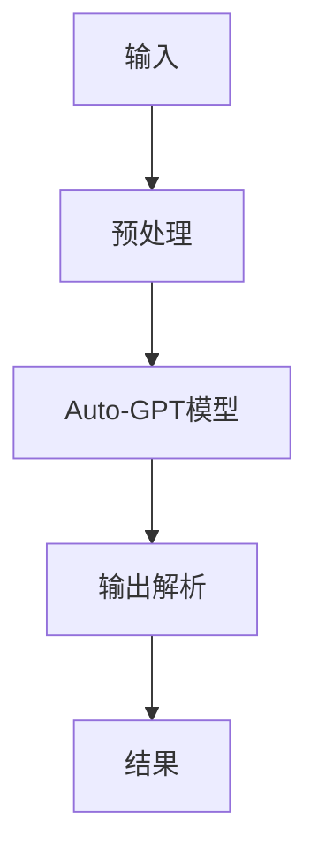

                 

### 《Auto-GPT OutputParser 设计》书籍目录大纲

#### 第一部分：基础概念与原理

### 《Auto-GPT OutputParser 设计》
#### 第一部分：基础概念与原理

##### 第1章：Auto-GPT概述

### 1.1 Auto-GPT的背景与优势

Auto-GPT 是一种基于大型语言模型（如 GPT）的人工智能技术，其核心思想是通过训练，使其能够自主进行复杂任务的处理。Auto-GPT 的优势在于其强大的文本生成和理解能力，可以大幅提高任务处理的效率和准确性。

### 1.2 Auto-GPT的基本原理

Auto-GPT 的基本原理是利用预训练的大型语言模型，通过上下文信息生成文本。其核心在于模型的学习能力和适应性，能够根据不同的任务需求进行自动调整和优化。

### 1.3 Auto-GPT与其他GPT模型的区别

Auto-GPT 与其他 GPT 模型（如 GPT-2、GPT-3）的主要区别在于其任务处理能力和自主性。Auto-GPT 能够自主执行复杂任务，而其他 GPT 模型则主要用于文本生成和理解。

##### 第2章：OutputParser概述

### 2.1 OutputParser的功能与用途

OutputParser 是一种用于解析和提取文本信息的工具，其主要功能是从大规模文本数据中提取有价值的信息。OutputParser 广泛应用于自然语言处理、文本挖掘和数据分析等领域。

### 2.2 OutputParser的基本原理

OutputParser 的基本原理是基于规则和模式匹配。通过定义一系列规则和模式，OutputParser 能够自动识别和提取文本中的特定信息。

### 2.3 OutputParser的优势与限制

OutputParser 的优势在于其高效性和准确性，可以快速地从大量文本数据中提取有价值的信息。但其限制在于规则和模式的定义较为复杂，且对于复杂文本结构的处理能力有限。

#### 第二部分：技术细节

##### 第3章：Auto-GPT OutputParser的架构设计

### 3.1 Auto-GPT OutputParser的架构概述

Auto-GPT OutputParser 的架构设计主要包括输入预处理、Auto-GPT 模型、输出解析三个关键模块。该架构旨在实现文本数据的自动化处理，提高任务处理的效率和准确性。

### 3.2 Mermaid流程图：Auto-GPT OutputParser的工作流程



### 3.3 Auto-GPT OutputParser的核心模块

Auto-GPT OutputParser 的核心模块包括输入预处理模块、Auto-GPT 模型模块和输出解析模块。每个模块都有其独特的功能和重要性，共同构成了一个高效、可靠的文本处理系统。

##### 第4章：核心算法原理

### 4.1 伪代码：Auto-GPT算法实现

```plaintext
function Auto_GPT(input):
    # 预处理输入
    processed_input = Preprocess(input)

    # 初始化GPT模型
    model = Initialize_GPT()

    # 进行预测
    prediction = model.predict(processed_input)

    # 解析输出
    result = Parse_Output(prediction)

    return result
```

### 4.2 伪代码：OutputParser算法实现

```plaintext
function Output_Parser(output):
    # 初始化规则库
    rules = Initialize_Rules()

    # 解析输出
    parsed_output = Parse_Output(output, rules)

    return parsed_output
```

##### 第5章：数学模型与公式解析

### 5.1 数学模型概述

Auto-GPT OutputParser 的数学模型主要包括神经网络模型和规则匹配模型。神经网络模型用于文本生成和理解，规则匹配模型用于输出解析。

### 5.2 公式详细讲解

$$
y = \sum_{i=1}^{n} w_i * x_i + b
$$

### 5.3 公式举例说明

以一个简单的文本分类任务为例，假设输入文本为“我喜欢编程”，输出类别为“技术”。则根据数学模型，可以计算出文本的特征向量，并通过分类器得到输出类别。

##### 第6章：项目实战

### 6.1 项目背景与目标

以一个实际项目为例，介绍 Auto-GPT OutputParser 在文本处理任务中的应用。项目目标是实现一个自动化的文本分类系统，能够根据输入文本自动将其分类到相应的类别中。

### 6.2 开发环境搭建

详细介绍项目开发所需的环境搭建，包括硬件配置、软件安装和依赖库的引入等。

### 6.3 源代码详细实现

展示项目源代码的详细实现，包括输入预处理、Auto-GPT 模型、输出解析等关键模块的代码。

### 6.4 代码解读与分析

对项目源代码进行解读，分析其设计思路和实现细节，以便读者更好地理解 Auto-GPT OutputParser 的应用。

##### 第7章：案例分析

### 7.1 案例一：文本分类

通过一个实际的文本分类案例，展示 Auto-GPT OutputParser 的应用效果，包括模型训练、输入预处理、输出解析等环节。

### 7.2 案例二：问答系统

介绍如何使用 Auto-GPT OutputParser 构建一个问答系统，实现自动回答用户提问的功能。

### 7.3 案例三：命名实体识别

探讨如何使用 Auto-GPT OutputParser 进行命名实体识别，提取文本中的关键信息。

#### 第四部分：总结与展望

##### 第8章：总结与展望

### 8.1 Auto-GPT OutputParser的发展趋势

分析 Auto-GPT OutputParser 在人工智能领域的应用前景，探讨其未来发展方向。

### 8.2 未来研究方向

提出未来研究方向，包括算法优化、应用拓展等，为读者提供进一步研究的思路。

### 8.3 Auto-GPT OutputParser在企业应用中的前景

探讨 Auto-GPT OutputParser 在企业应用中的潜在价值，为企业提供智能化解决方案。

### 附录

#### 附录：资源与工具

### 附录 A：深度学习框架简介

介绍常用的深度学习框架，如 TensorFlow、PyTorch 等，为读者提供选择和使用的参考。

### 附录 B：开源代码与资料

提供相关的开源代码和资料链接，便于读者学习和实践。

# 《Auto-GPT OutputParser 设计》

### 摘要

本文旨在详细探讨 Auto-GPT OutputParser 的设计与实现，旨在为读者提供全面的技术解析和应用指导。Auto-GPT OutputParser 是一种结合了大型语言模型（如 GPT）和文本解析工具（OutputParser）的智能系统，能够高效地进行文本预处理、文本生成和文本解析。本文首先介绍了 Auto-GPT 和 OutputParser 的基础概念与原理，随后深入分析了 Auto-GPT OutputParser 的架构设计、核心算法原理、数学模型与公式解析，并通过实际项目案例展示了其应用效果。最后，本文总结了 Auto-GPT OutputParser 的发展趋势和未来研究方向，探讨了其在企业应用中的前景。通过本文的阅读，读者将能够全面了解 Auto-GPT OutputParser 的设计思路、技术细节和应用价值。

