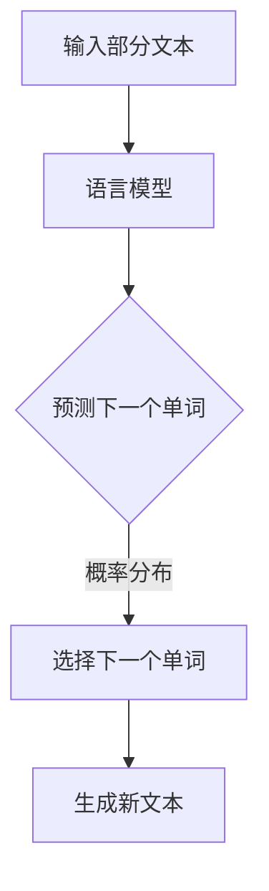
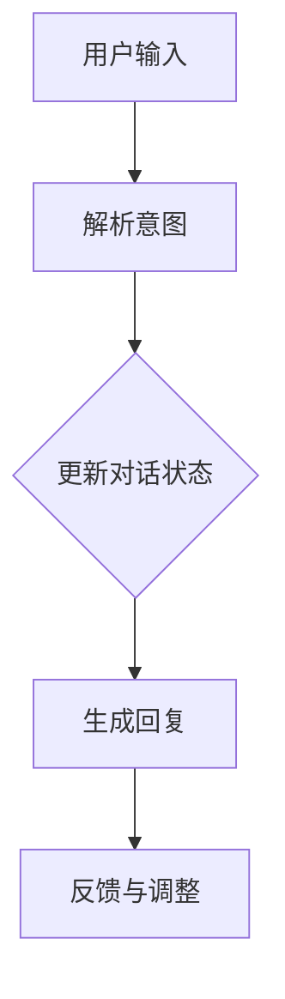
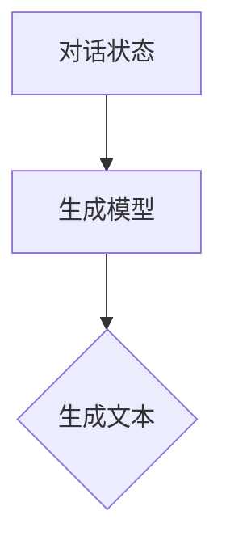
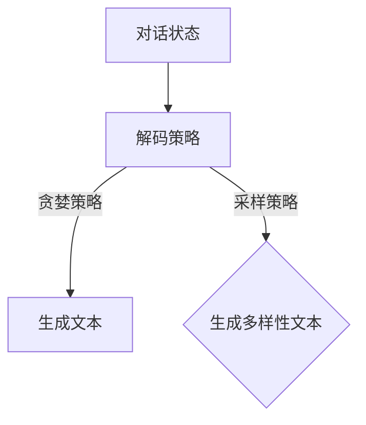

                 


# Completions vs Chat Completions

> 关键词：Completions、Chat Completions、自然语言处理、对话系统、文本生成

> 摘要：本文将深入探讨Completions和Chat Completions的概念、技术原理、应用案例以及未来发展趋势，旨在为读者提供关于这两种自然语言处理技术的全面理解和应用指导。

## 第一部分: Completions与Chat Completions概述

### 第1章: Completions基础

#### 1.1 Completions概念解析

- **定义与基本原理**
  - Completions是指在给定部分文本的情况下，自动生成完整或补充文本的技术。其核心原理是利用语言模型预测下一个单词或短语。
  - Completions技术广泛应用于各种文本生成任务，如自动摘要、自动写作和机器翻译等。

#### 1.2 Chat Completions

- **Chat Completions定义**
  - Chat Completions是Completions技术在对话场景中的具体应用，旨在生成连贯、自然的对话文本。
  - Chat Completions的核心是理解对话上下文，从而生成符合对话逻辑的文本。

- **Chat Completions特点**
  - 能够理解对话上下文。
  - 生成连贯、自然的对话文本。

#### 1.3 Completions与Chat Completions的关系

- **区别与联系**
  - Completions关注文本生成，Chat Completions关注对话生成。
  - Chat Completions是Completions在对话场景中的具体应用，二者在技术原理上有一定联系，但在应用场景上存在明显差异。

### 第2章: Completions技术原理

#### 2.1 语言模型

- **语言模型基础**
  - 语言模型是一种用于描述自然语言概率分布的模型。常见的语言模型类型有N-gram模型、神经网络模型和深度学习模型。
  - 语言模型在Completions技术中起着至关重要的作用，它能够预测下一个单词或短语的概率，从而生成完整的文本。

#### 2.2 预训练与微调

- **预训练**
  - 预训练是指使用大规模语料库训练语言模型的过程。预训练能够提高模型泛化能力，使其在未知数据上表现更佳。
  - 预训练是Completions技术的重要环节，它为模型的后续优化和微调奠定了基础。

- **微调**
  - 微调是指基于预训练模型，针对特定任务进行优化。微调能够使模型更好地适应特定任务，从而提高生成文本的质量。

### 第3章: Chat Completions技术详解

#### 3.1 对话状态跟踪

- **对话状态**
  - 对话状态是指用于描述对话上下文的状态，包括用户意图、对话历史等。
  - 对话状态跟踪是实现Chat Completions的关键，它能够确保生成的文本符合对话逻辑。

#### 3.2 生成模型与解码策略

- **生成模型**
  - 生成模型是一种用于生成文本的模型，常见的生成模型类型有RNN和Transformer等。
  - 生成模型在Chat Completions中负责从给定状态生成对话文本。

- **解码策略**
  - 解码策略是指从给定状态生成文本的方法。常见的解码策略有贪婪策略和采样策略等。
  - 解码策略的选择会影响生成文本的质量和多样性。

### 第4章: Completions与Chat Completions应用案例

#### 4.1 文本生成应用

- **文本生成应用场景**
  - 自动摘要、自动写作和机器翻译等。
- **案例分析**
  - 某知名AI写作平台的实现原理和优缺点分析。

#### 4.2 对话系统应用

- **对话系统应用场景**
  - 聊天机器人、客服机器人、语音助手等。
- **案例分析**
  - 某知名聊天机器人平台的技术架构和性能评估。

### 第5章: Completions与Chat Completions优化与挑战

#### 5.1 优化方向

- **模型优化**
  - 模型压缩、加速、实时性提升等。
- **算法优化**
  - 生成质量提升、多样性增强等。

#### 5.2 挑战与解决方法

- **挑战**
  - 生成的文本质量、数据隐私、安全性等。
- **解决方法**
  - 数据清洗、隐私保护技术、安全验证等。

### 第6章: Completions与Chat Completions未来发展趋势

#### 6.1 技术趋势

- **大模型与大数据**
  - 大模型发展趋势、大数据在模型训练中的应用。
- **多模态融合**
  - 视觉、语音、文本等多模态数据融合。

#### 6.2 应用前景

- **行业应用**
  - 金融、医疗、教育、娱乐等领域的应用案例。
- **社会影响**
  - AI生成内容对人类工作、生活的影响。

### 第7章: 总结与展望

#### 7.1 主要内容回顾

- 对Completions和Chat Completions的定义、原理、技术、应用和挑战的总结。

#### 7.2 未来发展方向

- 提出未来Completions与Chat Completions技术的发展趋势和应用前景。

---

**附录：**

## 附录A: 相关工具与资源

- **开源库与框架**
  - Hugging Face、TensorFlow、PyTorch等。

- **数据集与案例**
  - GLM、GPT、ChatGLM等。

- **参考文献**
  - 相关论文、书籍、技术报告等。

---

**作者：AI天才研究院/AI Genius Institute & 禅与计算机程序设计艺术 /Zen And The Art of Computer Programming**

---

[继续撰写第二部分...] <a name="part2"></a> 

## 第二部分: Completions的深入解析

### 第4章: Completions技术原理

#### 2.1 语言模型

- **语言模型基础**
  - 语言模型是一种用于描述自然语言概率分布的模型。它能够根据前文预测下一个单词或短语的概率。
  - 语言模型的核心任务是学习语言的特征，并利用这些特征生成新的文本。

**Mermaid流程图：**



- **语言模型类型**
  - **N-gram模型**：基于前N个单词的统计模型，简单但效果有限。
  - **神经网络模型**：利用神经网络学习语言特征，具有更强的表示能力。
  - **深度学习模型**：如Transformer、BERT等，通过多层神经网络学习语言结构。

#### 2.2 预训练与微调

- **预训练**
  - 预训练是指在大规模语料库上训练语言模型的过程。预训练能够使模型学会通用语言特征，从而提高模型在未知数据上的性能。
  - 预训练过程中，模型会学习到语言中的语法、语义和上下文关系。

**伪代码：**

```python
def pretrain_model(corpus):
    for sentence in corpus:
        for word in sentence:
            update_model_probabilities(word)
    return trained_model
```

- **微调**
  - 微调是指基于预训练模型，针对特定任务进行优化。微调能够使模型更好地适应特定任务，从而提高生成文本的质量。
  - 微调过程中，模型会利用特定任务的数据进行训练，调整模型参数。

**伪代码：**

```python
def finetune_model(pretrained_model, task_data):
    for sentence in task_data:
        update_model(pretrained_model, sentence)
    return finetuned_model
```

### 第3章: Chat Completions技术详解

#### 3.1 对话状态跟踪

- **对话状态**
  - 对话状态是指用于描述对话上下文的状态，包括用户意图、对话历史等。
  - 对话状态跟踪是实现Chat Completions的关键，它能够确保生成的文本符合对话逻辑。

**Mermaid流程图：**



- **对话状态要素**
  - 用户意图：用户在对话中希望表达的内容。
  - 对话历史：之前的对话内容，用于理解当前对话上下文。
  - 对话状态表示：将对话状态编码为向量，用于输入生成模型。

#### 3.2 生成模型与解码策略

- **生成模型**
  - 生成模型是一种用于生成文本的模型，常见的生成模型类型有RNN、Transformer等。
  - 生成模型在Chat Completions中负责从给定状态生成对话文本。

**Mermaid流程图：**



- **解码策略**
  - 解码策略是指从给定状态生成文本的方法。常见的解码策略有贪婪策略、采样策略等。
  - 解码策略的选择会影响生成文本的质量和多样性。

**Mermaid流程图：**



### 第4章: Completions与Chat Completions应用案例

#### 4.1 文本生成应用

- **文本生成应用场景**
  - 自动摘要：将长文本自动概括为简洁的摘要。
  - 自动写作：生成文章、故事、新闻等内容。
  - 机器翻译：将一种语言翻译成另一种语言。

**案例分析：**

- **自动摘要**
  - 技术原理：利用Completions技术提取文本的关键信息，生成摘要。
  - 实现步骤：
    1. 预处理文本，去除无关信息。
    2. 使用预训练的语言模型生成摘要。
    3. 对生成的摘要进行后处理，确保其准确性和可读性。

- **自动写作**
  - 技术原理：基于给定的主题和结构，使用Chat Completions生成文章。
  - 实现步骤：
    1. 收集相关主题的数据，进行预处理。
    2. 使用预训练的语言模型和对话状态跟踪技术生成文章。
    3. 对生成的文章进行校对和优化。

- **机器翻译**
  - 技术原理：利用Completions技术和大规模语料库训练翻译模型。
  - 实现步骤：
    1. 收集源语言和目标语言的平行语料库。
    2. 使用预训练的语言模型训练翻译模型。
    3. 对输入的源语言文本进行翻译。

#### 4.2 对话系统应用

- **对话系统应用场景**
  - 聊天机器人：提供实时、自然的用户交互。
  - 客服机器人：自动化客户服务，提高效率。
  - 语音助手：语音交互，提供便捷服务。

**案例分析：**

- **聊天机器人**
  - 技术原理：基于Chat Completions技术生成对话文本，理解用户意图。
  - 实现步骤：
    1. 收集用户对话数据，进行预处理。
    2. 使用预训练的语言模型和对话状态跟踪技术生成对话文本。
    3. 对生成的对话文本进行校对和优化。

- **客服机器人**
  - 技术原理：基于Completions技术和对话状态跟踪，自动回答用户问题。
  - 实现步骤：
    1. 收集常见问题和答案，进行预处理。
    2. 使用预训练的语言模型生成回答。
    3. 对生成的回答进行校对和优化。

- **语音助手**
  - 技术原理：结合语音识别和Chat Completions技术，提供语音交互服务。
  - 实现步骤：
    1. 使用语音识别技术将语音转换为文本。
    2. 使用预训练的语言模型和对话状态跟踪技术生成对话文本。
    3. 将生成的对话文本转换为语音，输出给用户。

[继续撰写第三部分...] <a name="part3"></a> 

## 第三部分: Chat Completions的实际应用与优化

### 第5章: Completions与Chat Completions优化与挑战

#### 5.1 优化方向

- **模型优化**
  - **模型压缩**：通过模型剪枝、量化等技术减小模型体积，提高部署效率。
  - **加速**：利用硬件加速技术，如GPU、TPU等，提高模型处理速度。
  - **实时性提升**：优化算法，减少响应时间，实现实时交互。

- **算法优化**
  - **生成质量提升**：改进生成模型，提高生成的文本质量，减少错误和不通顺的情况。
  - **多样性增强**：通过采样策略和对抗训练等方法，提高生成文本的多样性。

#### 5.2 挑战与解决方法

- **挑战**
  - **生成的文本质量**：如何生成更加准确、自然的文本。
  - **数据隐私**：如何保护用户对话数据的安全和隐私。
  - **安全性**：如何防止恶意用户滥用系统。

- **解决方法**
  - **数据清洗**：在训练过程中对数据进行清洗，去除噪声和错误。
  - **隐私保护技术**：采用加密、差分隐私等技术保护用户数据。
  - **安全验证**：引入验证机制，如身份认证、恶意用户检测等，确保系统的安全性。

### 第6章: Completions与Chat Completions未来发展趋势

#### 6.1 技术趋势

- **大模型与大数据**
  - **大模型**：随着计算能力的提升，大模型（如GPT-3、GLM-4等）成为可能，将进一步提升生成文本的质量。
  - **大数据**：更多高质量、多样化的数据将用于模型训练，提高模型的泛化能力。

- **多模态融合**
  - **多模态融合**：结合文本、语音、图像等多种模态数据，实现更加丰富和自然的交互体验。

#### 6.2 应用前景

- **行业应用**
  - **金融**：自动报告生成、风险控制、客户服务。
  - **医疗**：诊断辅助、药物研发、健康咨询。
  - **教育**：智能教学、个性化辅导、教育资源共享。
  - **娱乐**：虚拟助手、游戏剧情生成、内容推荐。

- **社会影响**
  - **AI生成内容**：将对新闻、文学、艺术等领域产生深远影响，提高创作效率和质量。
  - **人类工作**：自动化和智能化将改变许多行业的工作方式，提高生产效率。
  - **生活质量**：智能家居、智能医疗、智能交通等应用将提升人们的生活质量。

### 第7章: 总结与展望

#### 7.1 主要内容回顾

- **Completions与Chat Completions的定义和原理**：介绍了Completions和Chat Completions的基本概念和技术原理。
- **技术详解**：详细解析了语言模型、预训练与微调、对话状态跟踪、生成模型与解码策略等技术细节。
- **应用案例**：分析了文本生成和对话系统在实际应用中的案例。
- **优化与挑战**：探讨了Completions与Chat Completions的优化方向和面临的挑战。
- **未来发展趋势**：展望了Completions与Chat Completions的未来发展趋势和应用前景。

#### 7.2 未来发展方向

- **技术创新**：继续推动大模型和大数据的发展，提高生成文本的质量和多样性。
- **多模态融合**：结合多种模态数据，实现更加自然和丰富的交互体验。
- **应用拓展**：在金融、医疗、教育、娱乐等领域进一步拓展应用场景，提升社会价值。

**附录：**

## 附录A: 相关工具与资源

- **开源库与框架**
  - Hugging Face、TensorFlow、PyTorch等。
- **数据集与案例**
  - GLM、GPT、ChatGLM等。
- **参考文献**
  - 相关论文、书籍、技术报告等。

---

**作者：AI天才研究院/AI Genius Institute & 禅与计算机程序设计艺术 /Zen And The Art of Computer Programming**

---

至此，本文对Completions和Chat Completions进行了全面深入的探讨，从定义、原理、应用案例到优化与未来发展趋势，希望能够为读者提供有益的参考和启示。在未来的发展中，Completions和Chat Completions将继续发挥重要作用，为人类带来更多便利和创新。 

