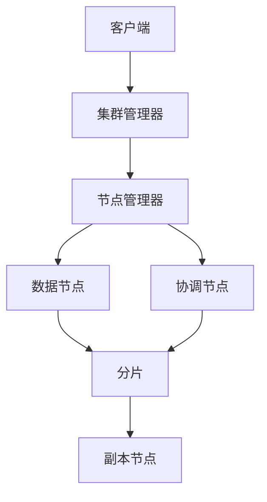
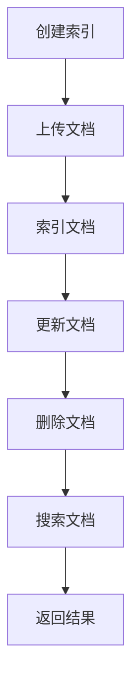

                 

### 文章标题：ElasticSearch原理与代码实例讲解

#### 关键词：ElasticSearch，分布式搜索引擎，倒排索引，搜索算法，索引与更新算法，性能优化，实战案例

#### 摘要：
本文深入探讨了ElasticSearch的原理及其在分布式搜索引擎中的应用。首先，从基础概念入手，介绍了ElasticSearch的发展历程、核心特点以及生态系统。接着，详细解析了ElasticSearch的核心概念，包括索引、文档、字段和映射。随后，文章讲解了ElasticSearch集群管理的原理，包括集群、节点、分片和副本。在核心功能部分，我们剖析了ElasticSearch的搜索、聚合分析功能，以及索引与更新数据的算法。文章还介绍了性能优化策略，并提供了实际应用中的日志分析、电商领域和实时搜索案例。最后，文章总结了ElasticSearch相关的工具与资源，为读者提供了进一步学习和实践的方向。

---

# 《ElasticSearch原理与代码实例讲解》目录大纲

## 第一部分：ElasticSearch基础

### 第1章：ElasticSearch简介

#### 1.1.1 ElasticSearch的发展历程

#### 1.1.2 ElasticSearch的核心特点

#### 1.1.3 ElasticSearch的生态系统

### 第2章：ElasticSearch核心概念

#### 2.1.1 索引（Index）

#### 2.1.2 文档（Document）

#### 2.1.3 字段（Field）

#### 2.1.4 映射（Mapping）

### 第3章：ElasticSearch集群管理

#### 3.1.1 集群（Cluster）

#### 3.1.2 节点（Node）

#### 3.1.3 分片（Shard）和副本（Replica）

## 第二部分：ElasticSearch核心功能

### 第4章：ElasticSearch搜索

#### 4.1.1 搜索API

#### 4.1.2 精确搜索

#### 4.1.3 高亮显示

#### 4.1.4 聚合查询

### 第5章：ElasticSearch聚合分析

#### 5.1.1 聚合简介

#### 5.1.2 筛选聚合

#### 5.1.3 阶段聚合

#### 5.1.4 元数据聚合

### 第6章：ElasticSearch数据索引与更新

#### 6.1.1 索引文档

#### 6.1.2 更新文档

#### 6.1.3 删除文档

#### 6.1.4 同步与异步索引操作

### 第7章：ElasticSearch性能优化

#### 7.1.1 节点性能优化

#### 7.1.2 索引性能优化

#### 7.1.3 搜索性能优化

#### 7.1.4 聚合性能优化

## 第三部分：ElasticSearch实战

### 第8章：ElasticSearch在日志分析中的应用

#### 8.1.1 日志采集

#### 8.1.2 日志索引与存储

#### 8.1.3 日志查询与分析

### 第9章：ElasticSearch在电商领域中的应用

#### 9.1.1 商品数据索引

#### 9.1.2 商品搜索

#### 9.1.3 用户行为分析

### 第10章：ElasticSearch在实时搜索中的应用

#### 10.1.1 实时搜索原理

#### 10.1.2 实时搜索架构设计

#### 10.1.3 实时搜索实现

### 第11章：ElasticSearch集群部署与运维

#### 11.1.1 集群部署

#### 11.1.2 集群监控与运维

#### 11.1.3 集群故障处理

## 附录：ElasticSearch相关工具与资源

### 附录A：ElasticSearch客户端工具

#### A.1.1 ElasticSearch-head

#### A.1.2 Kibana

#### A.1.3 Logstash

### 附录B：ElasticSearch学习资源

#### B.1.1 官方文档

#### B.1.2 ElasticStack社区

#### B.1.3 开源项目和社区论坛

---

## 核心概念与联系

为了更好地理解ElasticSearch的工作原理，我们需要先了解其核心概念及其相互联系。

### ElasticSearch架构原理

ElasticSearch是一个分布式搜索引擎，其核心架构包括以下几个关键部分：

- **客户端**：应用程序通过HTTP API与ElasticSearch集群进行交互。
- **集群管理器**：负责管理整个ElasticSearch集群，包括节点的添加、删除和故障处理。
- **节点管理器**：每个节点都是一个ElasticSearch实例，负责存储数据、索引数据和执行查询。
- **数据节点**：负责存储实际的数据和索引，每个节点可以包含多个分片。
- **协调节点**：负责协调各个节点之间的操作，如分配分片、处理索引请求和查询请求。
- **分片（Shard）**：将索引划分为多个分片，每个分片都是独立的索引。
- **副本节点（Replica）**：为每个分片创建副本，提高数据的可用性和查询性能。

以下是一个简单的ElasticSearch架构的Mermaid流程图：



### 索引与文档操作流程

在ElasticSearch中，索引和文档操作的基本流程如下：

- **创建索引**：创建一个新的索引，用于存储文档。
- **上传文档**：将文档上传到ElasticSearch集群。
- **索引文档**：将文档添加到索引中，生成倒排索引。
- **更新文档**：更新索引中的文档内容。
- **删除文档**：从索引中删除文档。
- **搜索文档**：根据查询条件搜索索引中的文档。

以下是一个简化的索引与文档操作流程的Mermaid流程图：



### 核心算法原理讲解

ElasticSearch的核心算法包括搜索算法、索引与更新算法等。以下将分别介绍这些算法的原理。

#### 搜索算法

在ElasticSearch中，搜索算法主要依赖于倒排索引。以下是搜索算法的伪代码：

```python
function search(query):
    # 1. 解析查询语句，生成倒排索引查询
    inverted_index_query = parse_query(query)
    
    # 2. 对于每个倒排索引中的词，找到对应的文档ID列表
    document_ids = []
    for term in inverted_index_query:
        term_document_ids = get_document_ids_from_inverted_index(term)
        document_ids.append(term_document_ids)
    
    # 3. 对文档ID列表进行交集运算，获取最终结果
    final_document_ids = intersection(document_ids)
    
    # 4. 返回搜索结果
    return fetch_documents(final_document_ids)
```

#### 索引与更新算法

在ElasticSearch中，索引和更新文档的算法涉及到以下步骤：

```python
function index_document(document):
    # 1. 创建倒排索引
    inverted_index = create_inverted_index(document)
    
    # 2. 将文档添加到索引中
    add_document_to_index(document, inverted_index)
    
    # 3. 更新索引元数据
    update_index_metadata(document)
    
    # 4. 返回操作结果
    return "Document indexed successfully"

function update_document(document):
    # 1. 获取原始文档的倒排索引
    original_inverted_index = get_inverted_index(document)
    
    # 2. 更新倒排索引
    updated_inverted_index = update_inverted_index(original_inverted_index, document)
    
    # 3. 更新索引中的文档
    update_document_in_index(document, updated_inverted_index)
    
    # 4. 返回操作结果
    return "Document updated successfully"
```

### 数学模型和数学公式

在ElasticSearch中，文档的相似度计算通常基于向量空间模型（VSM）。以下是VSM的相关数学公式：

#### 向量空间模型（VSM）

$$
\text{similarity} = \frac{\text{dot\_product}(q, d)}{\|\text{q}\|\|\text{d}\|}
$$`

其中，\(q\) 和 \(d\) 分别是查询向量（query vector）和文档向量（document vector），\(\|\text{q}\|\) 和 \(\|\text{d}\|\) 分别是查询向量和文档向量的模长，\(\text{dot\_product}(q, d)\) 是查询向量和文档向量的点积。

#### 逆文档频率（IDF）

逆文档频率（IDF）是计算查询和文档相似度的重要指标。其数学公式如下：

$$
\text{IDF}(t) = \log\left(\frac{N}{|d|}\right)
$$`

其中，\(N\) 是文档集合中包含词 \(t\) 的文档数量，\(|d|\) 是文档集合中文档的总数。

### 核心概念与联系

通过以上对ElasticSearch核心概念及其相互联系、核心算法原理和数学模型的讲解，我们可以更好地理解ElasticSearch的工作原理。在实际应用中，这些概念和原理将帮助我们设计和优化ElasticSearch集群，实现高效的搜索和分析功能。

---

## 第一部分：ElasticSearch基础

### 第1章：ElasticSearch简介

#### 1.1.1 ElasticSearch的发展历程

ElasticSearch起源于开源项目Compass，由Elasticsearch创始人Shay Banon在2004年发起。Compass是一个基于Lucene的搜索服务器，主要用于企业级搜索引擎的开发。在2006年，Compass进行了重写，并更名为ElasticSearch。

ElasticSearch的早期版本主要集中在改进搜索性能和扩展性。随着时间的推移，ElasticSearch逐渐发展成为一个功能强大的分布式搜索引擎，能够处理海量数据的实时搜索和分析需求。

2012年，ElasticSearch成为Elastic Stack（包括ElasticSearch、Logstash和Kibana）的核心组件。Elastic Stack提供了完整的日志分析、监控和可视化解决方案，进一步增强了ElasticSearch在企业和开发者社区中的影响力。

ElasticSearch的版本更新历程如下：

- **0.9.0**：第一个正式版本，支持JSON API，引入了分片和副本机制。
- **1.0.0**：增加了搜索模板功能，提高了查询性能。
- **2.0.0**：引入了新的映射格式，支持地理空间搜索。
- **5.0.0**：Elastic Stack正式发布，增加了数据流处理功能。
- **6.0.0**：引入了集群协调机制，提高了集群稳定性和性能。
- **7.0.0**：增加了新的聚合查询功能，提高了查询效率。

#### 1.1.2 ElasticSearch的核心特点

ElasticSearch具有以下核心特点，使其在分布式搜索引擎中脱颖而出：

- **分布式架构**：ElasticSearch设计为分布式系统，能够自动扩展和恢复，确保高可用性和性能。
- **弹性搜索**：支持实时搜索，无需预先建立索引，能够快速响应大规模数据的搜索请求。
- **高扩展性**：支持水平扩展，能够处理海量数据的存储和查询需求。
- **灵活的文档模型**：基于JSON格式，支持复杂的数据结构和动态字段，易于扩展和应用。
- **强大的查询能力**：支持多种查询类型，包括精确查询、模糊查询、范围查询等，支持复杂的查询组合。
- **聚合分析**：支持丰富的聚合分析功能，能够进行分组、排序、统计等操作，提供多维度的数据分析。
- **易于集成**：提供丰富的客户端库和API，支持多种编程语言，易于与其他系统和工具集成。

#### 1.1.3 ElasticSearch的生态系统

ElasticSearch不仅是一个强大的搜索引擎，还拥有一个庞大的生态系统，包括多个相关的开源项目。这些项目共同构成了Elastic Stack，提供了完整的日志分析、监控和可视化解决方案。

- **Logstash**：用于收集、处理和转发数据的管道，能够将来自不同源的数据导入ElasticSearch。
- **Kibana**：提供数据可视化和仪表板功能，帮助用户监控和查询ElasticSearch中的数据。
- **Beats**：一组轻量级的代理，用于收集系统、网络和应用数据，并将数据发送到ElasticSearch。
- **Elastic APM**：用于监控应用程序性能，提供详细的事故报告和性能分析。
- **Elastic SIEM**：提供安全信息和事件管理功能，帮助组织监控和响应安全威胁。

通过Elastic Stack，用户可以轻松地搭建一个全面的数据处理和分析平台，实现实时监控、日志分析和业务智能。

---

### 第2章：ElasticSearch核心概念

ElasticSearch的核心概念是其强大的数据处理和搜索能力的基石。理解这些概念对于有效地使用ElasticSearch至关重要。以下将详细介绍ElasticSearch的核心概念：索引、文档、字段和映射。

#### 2.1.1 索引（Index）

索引（Index）是ElasticSearch中的核心概念，类似于关系数据库中的表。每个索引都是一个独立的容器，用于存储相关类型的文档。索引的名称通常是全小写的字符串，例如"users"或"products"。

索引的主要作用是组织和管理文档。ElasticSearch允许用户对索引进行定义，指定其存储位置、副本数量、分片数量等属性。索引还具有一系列的映射（Mapping），用于定义文档的结构和字段类型。

索引的创建可以通过ElasticSearch的REST API实现。以下是一个简单的索引创建示例：

```json
PUT /users
{
  "settings": {
    "number_of_shards": 1,
    "number_of_replicas": 0
  },
  "mappings": {
    "properties": {
      "name": {
        "type": "text"
      },
      "age": {
        "type": "integer"
      },
      "email": {
        "type": "keyword"
      }
    }
  }
}
```

在这个示例中，我们创建了一个名为"users"的索引，并指定了一个简单的映射，其中包含"name"、"age"和"email"三个字段。

#### 2.1.2 文档（Document）

文档（Document）是ElasticSearch中的数据单元，类似于关系数据库中的行。每个文档都是一个JSON对象，包含一系列的字段和值。文档在ElasticSearch中通常以JSON格式进行索引和查询。

文档的创建、索引、更新和删除是通过ElasticSearch的REST API完成的。以下是一个简单的文档创建示例：

```json
POST /users/_doc
{
  "name": "John Doe",
  "age": 30,
  "email": "john.doe@example.com"
}
```

在这个示例中，我们创建了一个新的用户文档，并将其索引到"users"索引中。

ElasticSearch中的文档具有以下特点：

- **动态映射**：ElasticSearch可以自动识别和映射未定义的字段，提供一定程度的灵活性。
- **内部ID**：每个文档都有一个内部ID，用于唯一标识该文档。默认情况下，ElasticSearch使用文档的生成时间作为ID，但也可以指定自定义ID。
- **版本控制**：ElasticSearch支持文档版本控制，以确保数据的并发访问和数据一致性。

#### 2.1.3 字段（Field）

字段（Field）是文档中的属性，用于存储具体的值。字段是ElasticSearch文档模型的基本构建块，每个字段都有自己的类型，例如文本、整数、关键字等。

字段的主要作用是在文档中进行索引和查询。以下是一个简单的字段示例：

```json
{
  "name": "John Doe",
  "age": 30,
  "email": "john.doe@example.com"
}
```

在这个示例中，"name"、"age"和"email"都是字段，分别存储了文本、整数和关键字类型的值。

ElasticSearch的字段具有以下特点：

- **类型约束**：每个字段必须有一个类型，用于定义数据存储和检索的方式。
- **映射定义**：字段类型通常在索引的映射中定义，映射定义了字段的存储方式、索引方式、是否允许空值等。
- **分词和索引**：文本字段可以设置分词器，用于将文本分割成单词或短语，以便进行索引和搜索。

#### 2.1.4 映射（Mapping）

映射（Mapping）是ElasticSearch用于定义索引中文档结构的一种机制。映射定义了文档的字段类型、索引方式、分词器、是否存储原始值等属性。映射是ElasticSearch中非常强大的功能，能够灵活地定义文档的结构。

映射的创建可以通过ElasticSearch的REST API实现。以下是一个简单的映射示例：

```json
PUT /users
{
  "mappings": {
    "properties": {
      "name": {
        "type": "text",
        "analyzer": "standard",
        "search_analyzer": "standard"
      },
      "age": {
        "type": "integer"
      },
      "email": {
        "type": "keyword"
      }
    }
  }
}
```

在这个示例中，我们定义了一个名为"users"的索引，并指定了一个简单的映射，其中包含"name"、"age"和"email"三个字段。

映射的主要作用包括：

- **定义字段类型**：映射定义了每个字段的数据类型，例如文本、整数、关键字等。
- **控制索引行为**：映射定义了字段的索引行为，例如是否分词、是否存储原始值等。
- **自定义分析器**：映射可以定义自定义的分词器和分析器，用于处理特殊的文本数据。

通过理解ElasticSearch的核心概念，我们可以更好地设计和管理ElasticSearch索引，实现高效的搜索和分析功能。

---

### 第3章：ElasticSearch集群管理

ElasticSearch是一个分布式搜索引擎，集群管理是其关键组成部分。通过合理地配置和管理集群，可以确保ElasticSearch的高可用性、扩展性和性能。以下将详细讲解ElasticSearch集群管理中的核心概念：集群、节点、分片和副本。

#### 3.1.1 集群（Cluster）

集群（Cluster）是ElasticSearch的基本构建单元，由一组节点组成。每个集群有一个唯一的名称，默认为"elasticsearch"。集群的主要作用是管理节点、分配资源和协调数据存储。

ElasticSearch集群具有以下特点：

- **分布式存储**：集群中的节点共同存储数据，确保数据的可靠性和高性能。
- **自动分配**：ElasticSearch自动将索引的分片和副本分配到不同的节点，实现负载均衡和数据冗余。
- **高可用性**：集群中的节点可以动态加入或离开，确保系统的持续运行和数据不丢失。
- **自动恢复**：如果某个节点故障，ElasticSearch会自动将分片迁移到其他健康节点，确保数据可用性。

集群的管理包括以下方面：

- **节点加入**：通过配置文件或命令行将新的节点加入到现有集群。
- **节点离开**：从集群中移除不再使用的节点。
- **监控**：通过监控工具监控集群状态，包括节点的健康状态、资源使用情况等。

#### 3.1.2 节点（Node）

节点（Node）是ElasticSearch的基本运行单元，是一个独立的ElasticSearch实例。每个节点都有自己的唯一ID，可以是数据节点、协调节点或主节点。

- **数据节点**（Data Node）：负责存储和检索数据，处理索引和查询请求。数据节点默认包含一个分片和零个副本。
- **协调节点**（Coordinating Node）：负责协调集群中的索引和查询请求，将请求分配到相应的数据节点。每个节点都可以成为协调节点，但通常在集群中存在一个主协调节点。
- **主节点**（Master Node）：负责集群的管理任务，如集群状态监控、分片分配、节点选举等。集群中通常只有一个主节点。

节点的管理包括以下方面：

- **节点启动**：通过配置文件或命令行启动节点。
- **节点停止**：通过命令行或关闭节点进程停止节点。
- **节点监控**：监控节点的状态和资源使用情况。

#### 3.1.3 分片（Shard）和副本（Replica）

分片（Shard）和副本（Replica）是ElasticSearch数据存储和冗余的关键概念。

- **分片**（Shard）：将索引划分为多个独立的分片，每个分片都是一个独立的索引。分片的作用是将数据分散存储到不同的节点，提高查询性能和存储容量。每个索引都有一个默认的分片数量，但可以在创建索引时自定义。
- **副本**（Replica）：为每个分片创建一个或多个副本，提高数据的可用性和查询性能。副本是分片的备份，如果原始分片故障，副本可以立即接管，确保数据不丢失。

分片和副本的管理包括以下方面：

- **分片数量**：在创建索引时指定分片数量，默认为1，但可以根据需要调整。
- **副本数量**：在创建索引时指定副本数量，默认为0，但通常建议至少设置一个副本。
- **分片和副本分配**：ElasticSearch自动将分片和副本分配到不同的节点，实现负载均衡和数据冗余。
- **分片和副本监控**：监控分片和副本的状态，确保数据不丢失和查询性能。

通过合理地配置和管理集群、节点、分片和副本，可以确保ElasticSearch的高可用性、扩展性和性能，实现高效的数据存储和搜索。

---

### 第4章：ElasticSearch搜索

ElasticSearch的搜索功能是其核心亮点之一，提供了强大的全文搜索、精确搜索和高亮显示等特性。通过掌握ElasticSearch的搜索API，可以轻松实现复杂的搜索需求。以下将详细介绍ElasticSearch的搜索功能，包括搜索API、精确搜索、高亮显示和聚合查询。

#### 4.1.1 搜索API

ElasticSearch提供了灵活的搜索API，用于执行各种查询操作。搜索API的请求和响应都是基于JSON格式，可以通过HTTP POST请求发送到ElasticSearch节点。

以下是一个简单的搜索API示例：

```json
POST /_search
{
  "query": {
    "match": {
      "name": "John Doe"
    }
  }
}
```

在这个示例中，我们执行了一个匹配查询，搜索索引中名为"John Doe"的文档。

ElasticSearch的搜索API支持以下主要查询类型：

- **精确查询**：匹配完全相同的值，如`term`查询、`match phrase`查询等。
- **模糊查询**：匹配相似或相近的值，如`match`查询、`fuzzy`查询等。
- **范围查询**：匹配指定范围内的值，如`range`查询等。
- **组合查询**：组合多种查询条件，如`bool`查询等。

#### 4.1.2 精确搜索

精确搜索是ElasticSearch中最常用的查询类型之一，用于匹配完全相同的值。精确搜索适用于对文本字段进行精确匹配，如姓名、电子邮件等。

以下是一个精确搜索的示例：

```json
POST /_search
{
  "query": {
    "term": {
      "email": "john.doe@example.com"
    }
  }
}
```

在这个示例中，我们执行了一个`term`查询，搜索索引中电子邮件字段为"john.doe@example.com"的文档。

精确搜索的特点包括：

- **速度快**：由于精确查询不需要分词，因此查询速度非常快。
- **精确匹配**：只能匹配完全相同的值，不能匹配相似或相近的值。

#### 4.1.3 高亮显示

高亮显示（Highlighting）是ElasticSearch的一个高级功能，用于在搜索结果中突出显示匹配的文本片段。高亮显示可以显著提升用户体验，帮助用户快速找到匹配的关键字。

以下是一个高亮显示的示例：

```json
POST /_search
{
  "query": {
    "match": {
      "name": "John Doe"
    }
  },
  "highlight": {
    "fields": {
      "name": {}
    }
  }
}
```

在这个示例中，我们执行了一个匹配查询，并使用了高亮显示功能，将匹配到的"John Doe"文本片段突出显示。

高亮显示的特点包括：

- **灵活**：可以针对不同的字段设置不同的高亮样式。
- **自定义**：可以通过配置自定义高亮显示的标签和样式。

#### 4.1.4 聚合查询

聚合查询（Aggregation Query）是ElasticSearch的一个强大功能，用于对搜索结果进行分组、排序、统计等操作。聚合查询可以显著提升数据分析的效率，提供多维度的数据洞察。

以下是一个简单的聚合查询示例：

```json
POST /_search
{
  "size": 0,
  "aggs": {
    "by_age": {
      "terms": {
        "field": "age",
        "size": 10
      }
    }
  }
}
```

在这个示例中，我们执行了一个聚合查询，统计索引中不同年龄段的文档数量。

聚合查询的特点包括：

- **多维分析**：可以同时进行多个聚合操作，提供多维度的数据分析。
- **灵活**：支持丰富的聚合函数，如`terms`、`metrics`、`matrix`等。
- **性能优化**：通过优化查询性能，减少搜索结果的大小，提高查询效率。

通过掌握ElasticSearch的搜索API、精确搜索、高亮显示和聚合查询，可以轻松实现各种复杂的搜索需求，提升用户体验和数据分析能力。

---

### 第5章：ElasticSearch聚合分析

ElasticSearch的聚合分析功能是其数据处理能力的重要组成部分，能够对大量数据进行高效的统计分析。聚合分析包括筛选聚合、阶段聚合和元数据聚合等类型，这些功能为用户提供了强大的数据处理工具。以下将详细介绍ElasticSearch的聚合分析功能。

#### 5.1.1 聚合简介

聚合（Aggregation）是一种对搜索结果进行计算和统计的操作，可以提取出有关数据集合的详细信息。聚合分析可以同时进行多个聚合操作，提供多维度的数据洞察。

ElasticSearch聚合分析的主要类型包括：

- **桶聚合（Bucket Aggregation）**：将数据分成多个桶（Bucket），每个桶代表一组具有相同属性的文档。常用的桶聚合类型包括`terms`、`range`、`date`等。
- **度量聚合（Metrics Aggregation）**：对桶内的数据进行计算，如求和、平均数、最大值、最小值等。常用的度量聚合类型包括`avg`、`sum`、`max`、`min`等。
- **矩阵聚合（Matrix Aggregation）**：对多个度量聚合进行计算，生成矩阵。常用的矩阵聚合类型包括`stats`、`extended stats`等。
- **桶聚合操作（Bucket Script Aggregation）**：使用Painless脚本对桶内的文档进行操作，如计算自定义指标。常用的桶聚合操作类型包括`script`等。

#### 5.1.2 筛选聚合

筛选聚合（Filter Aggregation）是一种用于过滤聚合结果的聚合类型。通过筛选聚合，用户可以只关注满足特定条件的聚合结果。

以下是一个筛选聚合的示例：

```json
POST /_search
{
  "size": 0,
  "aggs": {
    "active_users": {
      "filter": {
        "term": {
          "status": "active"
        }
      },
      "aggs": {
        "by_age": {
          "terms": {
            "field": "age",
            "size": 10
          }
        }
      }
    }
  }
}
```

在这个示例中，我们首先使用`filter`聚合筛选出状态为"active"的用户，然后对筛选结果进行`terms`聚合，统计不同年龄段的用户数量。

#### 5.1.3 阶段聚合

阶段聚合（Pipeline Aggregation）是一种对度量聚合结果进行进一步计算的聚合类型。阶段聚合可以将多个度量聚合组合在一起，形成一个管道（Pipeline），对数据进行连续处理。

以下是一个阶段聚合的示例：

```json
POST /_search
{
  "size": 0,
  "aggs": {
    "sales_stats": {
      "pipeline": {
        "aggs": {
          "sales_sum": {
            "sum": {
              "field": "sales"
            }
          },
          "sales_count": {
            "count": {
              "field": "sales"
            }
          }
        }
      },
      "aggs": {
        "by_region": {
          "terms": {
            "field": "region",
            "size": 10
          },
          "aggs": {
            "total_sales": {
              "pipeline": {
                "aggs": {
                  "region_sales_sum": {
                    "sum": {
                      "field": "sales"
                    }
                  }
                }
              }
            }
          }
        }
      }
    }
  }
}
```

在这个示例中，我们首先使用`sum`和`count`度量聚合计算销售总额和销售数量，然后使用`terms`聚合按区域分组，最后使用阶段聚合计算每个区域的销售总额。

#### 5.1.4 元数据聚合

元数据聚合（Metadata Aggregation）用于计算聚合结果的元数据信息，如最大值、最小值、平均值等。元数据聚合可以提供对聚合结果的简要统计。

以下是一个元数据聚合的示例：

```json
POST /_search
{
  "size": 0,
  "aggs": {
    "top_selling_products": {
      "terms": {
        "field": "product_id",
        "size": 10
      },
      "aggs": {
        "total_sales": {
          "sum": {
            "field": "sales"
          }
        },
        "avg_rating": {
          "avg": {
            "field": "rating"
          }
        }
      },
      "meta": {
        "max_rating": {
          "max": {
            "field": "rating"
          }
        }
      }
    }
  }
}
```

在这个示例中，我们使用`terms`聚合按产品ID分组，然后计算每个产品的销售总额和平均评分，并使用元数据聚合计算最高评分。

通过掌握ElasticSearch的聚合分析功能，包括筛选聚合、阶段聚合和元数据聚合，用户可以轻松实现复杂的统计分析，提升数据分析能力。

---

### 第6章：ElasticSearch数据索引与更新

ElasticSearch的数据索引与更新功能是其核心功能之一，确保数据的准确性和实时性。本章将详细介绍ElasticSearch的数据索引与更新操作，包括索引文档、更新文档、删除文档以及同步与异步索引操作。

#### 6.1.1 索引文档

索引文档是将数据存储到ElasticSearch的过程。通过索引文档，用户可以将各种类型的数据（如文本、图像、日志等）存储在ElasticSearch中，以便进行搜索和分析。

索引文档的基本步骤如下：

1. **创建索引**：创建一个用于存储数据的索引，可以指定索引的名称、分片数量和副本数量等属性。
2. **定义映射**：为索引定义映射，指定文档的结构和字段类型。
3. **上传文档**：将文档上传到ElasticSearch，可以使用JSON格式表示文档。

以下是一个简单的索引文档示例：

```json
PUT /users
{
  "settings": {
    "number_of_shards": 1,
    "number_of_replicas": 1
  },
  "mappings": {
    "properties": {
      "name": {
        "type": "text"
      },
      "age": {
        "type": "integer"
      },
      "email": {
        "type": "keyword"
      }
    }
  }
}

POST /users/_doc
{
  "name": "John Doe",
  "age": 30,
  "email": "john.doe@example.com"
}
```

在这个示例中，我们首先创建了一个名为"users"的索引，并定义了一个简单的映射。然后，我们上传了一个新的用户文档，并将其索引到"users"索引中。

#### 6.1.2 更新文档

更新文档是修改已索引文档的过程。ElasticSearch提供了多种更新文档的方法，包括使用`update` API和脚本更新。

更新文档的基本步骤如下：

1. **获取文档**：使用`get` API获取要更新的文档。
2. **修改文档**：对获取到的文档进行修改。
3. **更新文档**：使用`update` API将修改后的文档重新索引。

以下是一个简单的更新文档示例：

```json
GET /users/_doc/1
{
  "_source": ["name", "age"]
}

POST /users/_update/1
{
  "doc": {
    "age": 31
  }
}
```

在这个示例中，我们首先使用`get` API获取了ID为1的用户文档，并指定了要获取的字段。然后，我们使用`update` API将用户年龄更新为31。

#### 6.1.3 删除文档

删除文档是从ElasticSearch索引中删除文档的过程。通过删除文档，用户可以清理不再需要的数据，释放存储空间。

删除文档的基本步骤如下：

1. **获取文档**：使用`get` API获取要删除的文档。
2. **删除文档**：使用`delete` API删除获取到的文档。

以下是一个简单的删除文档示例：

```json
GET /users/_doc/1
{
  "_source": ["name", "age"]
}

DELETE /users/_doc/1
```

在这个示例中，我们首先使用`get` API获取了ID为1的用户文档，然后使用`delete` API将其从"users"索引中删除。

#### 6.1.4 同步与异步索引操作

ElasticSearch提供了同步和异步索引操作两种方式，用于控制数据的索引速度和系统负载。

- **同步索引操作**：在同步索引操作中，每个索引操作都会等待操作完成后再返回。这种方式可以确保数据的实时性，但可能会导致系统负载过高，影响性能。
- **异步索引操作**：在异步索引操作中，每个索引操作都会立即返回，但数据可能会延迟处理。这种方式可以降低系统负载，提高性能，但可能会导致数据实时性略有延迟。

以下是一个简单的异步索引操作示例：

```json
POST /_search?pretty
{
  "size": 0,
  "suggest": {
    "my-suggestion": {
      "text": "John Doe",
      "completion": {
        "field": "name"
      }
    }
  }
}
```

在这个示例中，我们使用异步索引操作提供了一个基于名称的搜索建议功能。

通过掌握ElasticSearch的数据索引与更新操作，用户可以有效地管理数据，确保数据的准确性和实时性，提升系统的性能和用户体验。

---

### 第7章：ElasticSearch性能优化

ElasticSearch的性能优化是其关键环节，对于实现高效的搜索和分析至关重要。本章将详细介绍ElasticSearch的性能优化策略，包括节点性能优化、索引性能优化、搜索性能优化和聚合性能优化。

#### 7.1.1 节点性能优化

节点性能优化是ElasticSearch性能优化的重要组成部分。通过合理配置和管理节点，可以提高整个集群的性能和稳定性。

以下是一些节点性能优化的策略：

- **增加内存**：增加节点的内存容量，可以提高ElasticSearch的查询性能和缓存效果。
- **调整JVM参数**：优化JVM参数，如堆大小、垃圾回收策略等，可以提高ElasticSearch的性能。
- **优化磁盘IO**：提高节点的磁盘IO性能，可以减少数据读写延迟，提升查询速度。
- **调整集群配置**：合理设置集群的分片数量和副本数量，可以优化数据分布和负载均衡。

以下是一个节点性能优化的示例：

```shell
# 增加节点内存容量
sudo vim /etc/systemd/system/elasticsearch.service
# 在[Service]下添加以下内容
LimitMEMLOCK=infinity
LimitMEMLOCK_HARDWARE=infinity

# 调整JVM参数
sudo vim /etc/elasticsearch/jvm.options
# 在文件中添加以下内容
-Xms4g
-Xmx4g
-XX:+UseG1GC
-XX:MaxGCPauseMillis=200
```

#### 7.1.2 索引性能优化

索引性能优化是ElasticSearch性能优化的重要方面。通过合理配置和管理索引，可以提高索引的查询速度和存储效率。

以下是一些索引性能优化的策略：

- **合理设置分片数量和副本数量**：根据数据量和查询需求，合理设置分片数量和副本数量，可以实现负载均衡和数据冗余。
- **优化映射和字段类型**：选择合适的字段类型和映射配置，可以提高索引的查询性能和存储效率。
- **使用索引模板**：使用索引模板可以自动化配置和管理索引，提高配置的一致性和可维护性。
- **优化搜索查询**：合理设计搜索查询，避免使用复杂的查询组合和大量数据筛选，可以减少查询时间和负载。

以下是一个索引性能优化的示例：

```json
PUT /my_index
{
  "settings": {
    "number_of_shards": 2,
    "number_of_replicas": 1
  },
  "mappings": {
    "properties": {
      "name": {
        "type": "text",
        "analyzer": "standard"
      },
      "age": {
        "type": "integer"
      },
      "email": {
        "type": "keyword"
      }
    }
  }
}
```

在这个示例中，我们创建了一个名为"my_index"的索引，并设置了合理的分片数量和副本数量，同时优化了字段类型和映射配置。

#### 7.1.3 搜索性能优化

搜索性能优化是ElasticSearch性能优化的重要环节。通过合理设计和优化搜索查询，可以提高查询速度和系统负载。

以下是一些搜索性能优化的策略：

- **使用缓存**：使用ElasticSearch内置的缓存功能，可以减少重复查询的时间和负载。
- **优化查询结构**：避免使用复杂的查询结构，如大量的嵌套查询和子查询，可以减少查询时间和负载。
- **限制搜索结果**：合理设置搜索结果的大小，可以减少查询时间和系统负载。
- **使用聚合查询**：使用聚合查询可以减少搜索结果的大小，提高查询速度。

以下是一个搜索性能优化的示例：

```json
GET /my_index/_search
{
  "size": 10,
  "query": {
    "match": {
      "name": "John Doe"
    }
  }
}
```

在这个示例中，我们限制了搜索结果的大小为10，并使用了一个简单的精确查询，可以减少查询时间和系统负载。

#### 7.1.4 聚合性能优化

聚合性能优化是ElasticSearch性能优化的重要方面，特别是在处理大量数据时。通过合理设计和优化聚合查询，可以提高聚合查询的效率。

以下是一些聚合性能优化的策略：

- **合理设置聚合深度**：避免过深的聚合查询，可以减少查询时间和系统负载。
- **优化聚合查询结构**：避免使用大量的嵌套聚合和子聚合，可以减少查询时间和负载。
- **使用预聚合**：使用预聚合（Pre aggregations）可以减少聚合查询的计算时间和负载。
- **优化查询缓存**：使用ElasticSearch的聚合查询缓存功能，可以减少重复聚合查询的时间和负载。

以下是一个聚合性能优化的示例：

```json
GET /my_index/_search
{
  "size": 0,
  "aggs": {
    "top_selling_products": {
      "terms": {
        "field": "product_id",
        "size": 10
      },
      "aggs": {
        "total_sales": {
          "sum": {
            "field": "sales"
          }
        }
      }
    }
  }
}
```

在这个示例中，我们使用了一个简单的聚合查询，并优化了聚合查询结构，可以提高聚合查询的效率。

通过掌握ElasticSearch的性能优化策略，用户可以有效地提高系统的性能和稳定性，实现高效的数据存储和搜索。

---

### 第8章：ElasticSearch在日志分析中的应用

在IT运维和软件开发中，日志分析是一个至关重要的环节。ElasticSearch凭借其强大的搜索和分析能力，成为日志分析领域的首选工具。本章将详细介绍ElasticSearch在日志分析中的应用，包括日志采集、日志索引与存储以及日志查询与分析。

#### 8.1.1 日志采集

日志采集是日志分析的第一步，目的是将各种来源的日志数据收集到一起。常见的日志来源包括应用程序、操作系统、网络设备等。为了实现高效的日志采集，通常需要以下步骤：

1. **日志源配置**：配置日志源，确保日志数据能够被系统采集。例如，在Linux系统中，可以使用`/var/log/messages`、`/var/log/secure`等文件作为日志源。

2. **日志收集器**：使用日志收集器（如Logstash）将日志数据从各个日志源导入到ElasticSearch。Logstash提供了丰富的输入插件，可以轻松地采集各种格式的日志数据。

3. **日志格式化**：在导入日志数据时，通常需要对日志进行格式化，确保日志数据以统一格式存储在ElasticSearch中。可以使用Logstash的过滤器（Filter）对日志进行解析和格式化。

以下是一个简单的日志采集示例：

```json
input {
  file {
    path => "/var/log/messages"
    type => "system_log"
  }
}

filter {
  if ["system_log"] == "type" {
    grok {
      match => { "message" => "%{TIMESTAMP_ISO8601:timestamp}\t%{DATA:source}\t%{DATA:message}" }
    }
  }
}

output {
  if ["system_log"] == "type" {
    elasticsearch {
      hosts => ["localhost:9200"]
      index => "system_logs-%{+YYYY.MM.dd}"
    }
  }
}
```

在这个示例中，我们使用Logstash从`/var/log/messages`文件中采集日志数据，并使用Grok过滤器对日志进行解析和格式化，最后将格式化后的日志数据索引到名为"system_logs-%{+YYYY.MM.dd}"的索引中。

#### 8.1.2 日志索引与存储

日志索引与存储是将采集到的日志数据存储在ElasticSearch的过程。ElasticSearch提供了灵活的索引和存储策略，确保日志数据的快速检索和高效存储。

以下是一些日志索引与存储的要点：

1. **索引配置**：为日志数据创建索引，可以指定索引的名称、分片数量和副本数量等属性。例如，可以使用日期作为索引名称的前缀，实现自动分片和滚动。

2. **映射配置**：为日志数据定义映射，指定字段类型和索引方式。例如，可以使用`text`类型存储日志内容，使用`date`类型存储时间戳。

3. **存储优化**：通过优化ElasticSearch的存储配置，可以减少磁盘I/O负载和内存消耗。例如，可以使用压缩存储和缓存策略，提高存储效率。

以下是一个简单的日志索引与存储示例：

```json
PUT /system_logs-2023.03.01
{
  "settings": {
    "number_of_shards": 2,
    "number_of_replicas": 1
  },
  "mappings": {
    "properties": {
      "timestamp": {
        "type": "date"
      },
      "source": {
        "type": "text"
      },
      "message": {
        "type": "text"
      }
    }
  }
}
```

在这个示例中，我们创建了一个名为"system_logs-2023.03.01"的索引，并定义了一个简单的映射，包括时间戳、源和日志消息字段。

#### 8.1.3 日志查询与分析

日志查询与分析是日志分析的核心环节，目的是从大量日志数据中提取有价值的信息。ElasticSearch提供了强大的查询和分析功能，可以轻松实现复杂的日志查询和分析。

以下是一些日志查询与分析的要点：

1. **精确查询**：使用精确查询（如`term`查询）匹配日志中的特定字段，例如日志级别、源地址等。

2. **模糊查询**：使用模糊查询（如`match`查询）匹配日志中的近似值，例如日志内容中的关键词。

3. **范围查询**：使用范围查询（如`range`查询）匹配日志中的时间范围，例如日志发生的时间。

4. **聚合查询**：使用聚合查询（如`terms`聚合）统计日志数据的分布和趋势，例如日志级别的分布、日志内容的频率等。

5. **高亮显示**：使用高亮显示功能（如`highlight`查询）在查询结果中突出显示匹配的关键词，提高查询的可见性。

以下是一个简单的日志查询与分析示例：

```json
GET /system_logs-2023.03.01/_search
{
  "query": {
    "bool": {
      "must": [
        { "range": { "timestamp": { "gte": "2023-03-01T00:00:00", "lte": "2023-03-02T00:00:00" } }
      ],
      "filter": [
        { "term": { "level": "ERROR" } }
      ]
    }
  },
  "aggs": {
    "by_source": {
      "terms": {
        "field": "source",
        "size": 10
      },
      "aggs": {
        "error_count": {
          "count": {
            "field": "level"
          }
        }
      }
    }
  },
  "highlight": {
    "fields": {
      "message": {}
    }
  }
}
```

在这个示例中，我们执行了一个复合查询，匹配2023年3月1日至2日之间发生的ERROR级别日志，并使用`terms`聚合统计不同源的ERROR日志数量，同时使用高亮显示功能突出显示匹配的关键词。

通过掌握ElasticSearch在日志分析中的应用，用户可以轻松实现日志数据的采集、索引和查询，提升IT运维和软件开发中的日志分析能力。

---

### 第9章：ElasticSearch在电商领域中的应用

在电商领域中，ElasticSearch以其高效的搜索和强大的数据处理能力，成为电商平台的理想选择。本章将详细探讨ElasticSearch在电商领域中的应用，包括商品数据索引、商品搜索以及用户行为分析。

#### 9.1.1 商品数据索引

商品数据索引是将电商平台上的商品信息存储到ElasticSearch的过程。为了实现高效的搜索和查询，需要合理设计索引和映射。

以下是一些商品数据索引的要点：

1. **索引配置**：为商品数据创建索引，可以指定索引的名称、分片数量和副本数量等属性。例如，可以使用商品类别、商品ID等信息作为索引名称的前缀。

2. **映射配置**：为商品数据定义映射，指定字段类型和索引方式。例如，商品名称、价格、库存量等字段可以使用`text`或`keyword`类型，时间戳可以使用`date`类型。

3. **优化存储**：通过优化ElasticSearch的存储配置，可以提高商品数据的存储效率。例如，使用压缩存储和缓存策略，减少磁盘I/O和内存消耗。

以下是一个简单的商品数据索引示例：

```json
PUT /products
{
  "settings": {
    "number_of_shards": 2,
    "number_of_replicas": 1
  },
  "mappings": {
    "properties": {
      "product_id": {
        "type": "keyword"
      },
      "category": {
        "type": "keyword"
      },
      "name": {
        "type": "text",
        "analyzer": "standard"
      },
      "price": {
        "type": "float"
      },
      "stock": {
        "type": "integer"
      },
      "timestamp": {
        "type": "date"
      }
    }
  }
}
```

在这个示例中，我们创建了一个名为"products"的索引，并定义了一个简单的映射，包括商品ID、类别、名称、价格、库存量和时间戳字段。

#### 9.1.2 商品搜索

商品搜索是电商平台的核心功能之一。通过ElasticSearch的强大搜索功能，可以实现高效、灵活的商品搜索。

以下是一些商品搜索的要点：

1. **精确搜索**：使用精确搜索（如`term`查询）匹配商品名称、商品ID等精确值。

2. **模糊搜索**：使用模糊搜索（如`match`查询）匹配商品名称、描述等近似值。

3. **范围搜索**：使用范围搜索（如`range`查询）匹配商品价格、库存量等范围值。

4. **高亮显示**：使用高亮显示（如`highlight`查询）在搜索结果中突出显示匹配的关键词。

以下是一个简单的商品搜索示例：

```json
GET /products/_search
{
  "query": {
    "bool": {
      "must": [
        { "match": { "name": "iPhone" } },
        { "range": { "price": { "gte": 500, "lte": 1000 } } }
      ]
    }
  },
  "highlight": {
    "fields": {
      "name": {}
    }
  }
}
```

在这个示例中，我们执行了一个复合查询，匹配名称中包含"iPhone"且价格在500到1000之间的商品，并使用高亮显示功能突出显示匹配的关键词。

#### 9.1.3 用户行为分析

用户行为分析是电商平台的重要功能，通过分析用户的行为数据，可以了解用户喜好、优化商品推荐、提高转化率等。

以下是一些用户行为分析的要点：

1. **行为数据索引**：将用户行为数据（如浏览记录、购买记录等）索引到ElasticSearch，以便进行实时分析和查询。

2. **行为数据聚合**：使用聚合查询（如`terms`聚合）统计用户行为数据的分布和趋势，例如用户最喜欢的商品类别、用户购买频率等。

3. **行为数据关联**：将用户行为数据与其他数据源（如商品数据、订单数据等）进行关联，实现多维度的数据分析。

4. **行为数据预测**：使用机器学习算法（如协同过滤、时间序列分析等）预测用户的潜在行为，优化商品推荐和营销策略。

以下是一个简单的用户行为分析示例：

```json
GET /user_behavior/_search
{
  "size": 0,
  "aggs": {
    "top_categories": {
      "terms": {
        "field": "category",
        "size": 10
      },
      "aggs": {
        "count": {
          "cardinality": {
            "field": "user_id"
          }
        }
      }
    }
  }
}
```

在这个示例中，我们使用`terms`聚合统计用户最喜欢的商品类别，并计算每个类别的用户数量。

通过掌握ElasticSearch在电商领域中的应用，电商平台可以提升商品搜索和用户行为分析的能力，优化用户体验，提高业务转化率和销售额。

---

### 第10章：ElasticSearch在实时搜索中的应用

实时搜索是现代应用中的一项重要功能，能够在用户输入查询时立即返回搜索结果，提供快速、流畅的用户体验。本章将深入探讨ElasticSearch在实时搜索中的应用，包括实时搜索原理、架构设计以及实现方法。

#### 10.1.1 实时搜索原理

实时搜索的核心在于快速响应用户输入，并提供相关的搜索结果。ElasticSearch通过以下原理实现实时搜索：

1. **异步索引**：ElasticSearch支持异步索引操作，可以边接收用户输入边进行索引操作，确保搜索结果实时更新。

2. **缓存**：使用ElasticSearch的内置缓存功能，可以减少重复查询的时间和负载，提高查询速度。

3. **实时搜索模板**：ElasticSearch提供了实时搜索模板，可以根据用户输入动态生成查询语句，实现实时搜索功能。

4. **分片和副本**：通过合理设置分片和副本数量，可以提高ElasticSearch的查询性能和可用性。

以下是一个简单的实时搜索原理示例：

```json
POST /_search
{
  "suggest": {
    "my-suggestion": {
      "text": "iPhone",
      "completion": {
        "field": "name"
      }
    }
  }
}
```

在这个示例中，我们使用了一个实时搜索模板，根据用户输入的查询关键词（"iPhone"）动态生成搜索查询。

#### 10.1.2 实时搜索架构设计

实时搜索架构设计的关键在于确保系统的高性能和高可用性。以下是一个简单的实时搜索架构设计：

1. **前端应用**：前端应用负责接收用户输入，并通过API与ElasticSearch进行交互。

2. **ElasticSearch集群**：ElasticSearch集群负责存储和检索搜索数据，包括索引、分片和副本。

3. **缓存层**：缓存层用于缓存热门查询结果，减少查询时间和负载。

4. **实时索引服务**：实时索引服务负责接收用户输入，并将数据异步索引到ElasticSearch集群。

以下是一个简单的实时搜索架构设计示意图：

```
+----------------+     +----------------+     +----------------+
|     前端应用    | --> |   ElasticSearch   | --> |   缓存层     |
+----------------+     +----------------+     +----------------+
     |                         |                          |
     |                        异步索引                    |
     |                         |                          |
     +-------------------------+--------------------------+

```

#### 10.1.3 实时搜索实现

实时搜索的实现涉及到前端应用、后端服务以及ElasticSearch集群的协同工作。以下是一个简单的实时搜索实现步骤：

1. **前端应用实现**：前端应用接收用户输入，通过AJAX或WebSocket实时向后端发送查询请求。

2. **后端服务实现**：后端服务处理查询请求，根据用户输入动态生成搜索查询，并返回搜索结果。

3. **ElasticSearch集群实现**：ElasticSearch集群接收查询请求，执行查询操作，并将搜索结果返回给后端服务。

以下是一个简单的实时搜索实现示例：

```json
// 前端应用示例
function search(query) {
  $.getJSON('/search', { q: query }, function(data) {
    displayResults(data);
  });
}

// 后端服务示例
app.post('/search', function(req, res) {
  var query = req.body.q;
  var searchQuery = {
    "suggest": {
      "my-suggestion": {
        "text": query,
        "completion": {
          "field": "name"
        }
      }
    }
  };
  elasticsearchClient.search(searchQuery, function(error, response) {
    if (error) {
      res.status(500).send('Error searching');
    } else {
      res.send(response);
    }
  });
});

// ElasticSearch集群示例
POST /_search
{
  "suggest": {
    "my-suggestion": {
      "text": "iPhone",
      "completion": {
        "field": "name"
      }
    }
  }
}
```

在这个示例中，前端应用通过AJAX请求后端服务，后端服务通过ElasticSearch客户端库与ElasticSearch集群进行交互，实现实时搜索功能。

通过掌握ElasticSearch在实时搜索中的应用原理、架构设计和实现方法，开发者可以轻松实现实时搜索功能，提升用户体验和系统性能。

---

### 第11章：ElasticSearch集群部署与运维

ElasticSearch集群的部署与运维是确保其稳定运行和高性能的关键环节。本章将详细介绍ElasticSearch集群的部署步骤、监控与运维策略以及故障处理方法。

#### 11.1.1 集群部署

部署ElasticSearch集群的第一步是准备运行环境。以下是一个简单的集群部署步骤：

1. **环境准备**：确保服务器满足ElasticSearch的最低硬件要求，通常需要足够的内存、磁盘空间和带宽。

2. **安装Java**：ElasticSearch依赖Java运行环境，需要安装Java JDK 8或更高版本。

3. **下载ElasticSearch**：从Elastic官方网站下载ElasticSearch的二进制包，并解压到服务器上。

4. **配置ElasticSearch**：修改ElasticSearch的配置文件`elasticsearch.yml`，配置集群名称、节点名称、网络设置、日志目录等。

5. **启动ElasticSearch**：通过命令行启动ElasticSearch服务，并确保集群中的所有节点都能正常通信。

以下是一个简单的ElasticSearch集群部署示例：

```shell
# 安装Java
sudo apt-get update
sudo apt-get install openjdk-8-jdk

# 下载ElasticSearch
sudo wget https://artifacts.elastic.co/downloads/elasticsearch/elasticsearch-7.16.2-amd64.deb
sudo dpkg -i elasticsearch-7.16.2-amd64.deb

# 配置ElasticSearch
sudo vim /etc/elasticsearch/elasticsearch.yml
cluster.name: my-es-cluster
node.name: node-1
network.host: 0.0.0.0
discovery.type: single-node

# 启动ElasticSearch
sudo systemctl start elasticsearch
```

#### 11.1.2 集群监控与运维

集群监控与运维是确保ElasticSearch集群稳定运行的重要手段。以下是一些常见的监控与运维策略：

1. **集群健康状态监控**：定期检查集群的健康状态，包括节点状态、集群状态、资源使用情况等。

2. **性能监控**：监控ElasticSearch的性能指标，如查询延迟、索引速度、资源利用率等。

3. **日志管理**：定期检查ElasticSearch的日志文件，确保日志记录正常，及时发现潜在问题。

4. **备份与恢复**：定期备份ElasticSearch的数据和配置文件，确保在数据丢失或系统故障时能够快速恢复。

5. **升级与补丁管理**：及时升级ElasticSearch到最新版本，应用安全补丁和功能改进。

以下是一个简单的ElasticSearch监控与运维示例：

```shell
# 检查集群健康状态
curl -X GET "localhost:9200/_cluster/health?pretty"

# 查询性能指标
curl -X GET "localhost:9200/_cat/indices?v"

# 备份数据
sudo tar -czvf elasticsearch_backup.tar.gz /var/lib/elasticsearch

# 恢复数据
sudo tar -xzvf elasticsearch_backup.tar.gz -C /var/lib/elasticsearch
```

#### 11.1.3 集群故障处理

在ElasticSearch集群运行过程中，可能会遇到各种故障。以下是一些常见的故障处理方法：

1. **节点故障**：如果某个节点故障，ElasticSearch会自动将分片迁移到其他健康节点，确保数据可用性。需要检查故障节点的状态，并尝试重启或修复节点。

2. **网络故障**：如果节点之间的网络故障，可能导致集群通信中断。需要检查网络连接，确保节点能够正常通信。

3. **资源不足**：如果集群资源不足，可能导致查询延迟或系统崩溃。需要检查资源使用情况，增加节点或优化资源配置。

4. **数据损坏**：如果数据损坏，可能导致索引无法正常访问。需要使用ElasticSearch的修复工具（如`elasticsearch-reindex`）修复数据。

以下是一个简单的ElasticSearch故障处理示例：

```shell
# 检查节点状态
curl -X GET "localhost:9200/_cat/nodes?v"

# 重启节点
sudo systemctl restart elasticsearch

# 检查网络连接
ping 127.0.0.1

# 增加资源
sudo ulimit -n 65536
```

通过掌握ElasticSearch集群部署与运维的策略和故障处理方法，可以确保ElasticSearch集群的稳定运行和高性能。

---

### 附录A：ElasticSearch客户端工具

ElasticSearch提供了丰富的客户端工具，方便用户与ElasticSearch集群进行交互。以下将介绍ElasticSearch的常用客户端工具：ElasticSearch-head、Kibana和Logstash。

#### A.1.1 ElasticSearch-head

ElasticSearch-head是一个用于ElasticSearch集群的Web界面工具，提供了直观的交互界面，用于监控和管理集群。以下是一些ElasticSearch-head的常用功能：

- **集群监控**：显示集群的健康状态、节点状态、资源使用情况等。
- **索引管理**：创建、删除和编辑索引，以及查看索引的文档数据。
- **搜索和查询**：执行搜索查询，并查看查询结果。
- **聚合分析**：执行聚合查询，并查看聚合结果。

要使用ElasticSearch-head，首先需要在服务器上安装Node.js。然后，下载ElasticSearch-head的代码，并在终端执行以下命令：

```shell
git clone https://github.com/mobz/elasticsearch-head
cd elasticsearch-head
npm install
```

最后，启动ElasticSearch-head服务：

```shell
node server.js
```

ElasticSearch-head默认绑定在本地端口9100上，在浏览器中访问`http://localhost:9100`即可查看ElasticSearch-head的界面。

#### A.1.2 Kibana

Kibana是ElasticSearch的官方数据可视化和分析工具，提供了强大的监控、分析和可视化功能。以下是一些Kibana的常用功能：

- **监控仪表板**：创建和管理监控仪表板，实时监控ElasticSearch集群的状态。
- **日志分析**：收集、处理和可视化日志数据，帮助用户快速识别问题和异常。
- **数据可视化**：使用丰富的可视化组件，如图表、表格和地图，展示数据的分布和趋势。
- **搜索和查询**：执行搜索查询，并查看查询结果。

要使用Kibana，首先需要在服务器上安装ElasticSearch和Kibana。然后，启动Kibana服务：

```shell
sudo systemctl start kibana
```

Kibana默认绑定在本地端口5601上，在浏览器中访问`http://localhost:5601`即可登录Kibana。首次登录时，需要设置Kibana的访问控制，并连接到ElasticSearch集群。

#### A.1.3 Logstash

Logstash是ElasticStack中的数据处理和管道工具，用于从各种数据源收集数据，并将数据进行处理、过滤和转发。以下是一些Logstash的常用功能：

- **数据采集**：从各种数据源（如文件、网络流量、数据库等）收集数据。
- **数据处理**：对数据进行过滤、转换和增强。
- **数据转发**：将处理后的数据转发到ElasticSearch、Kibana或其他数据存储。

要使用Logstash，首先需要编写Logstash配置文件，定义数据采集、处理和转发的规则。以下是一个简单的Logstash配置示例：

```json
input {
  file {
    path => "/var/log/messages"
    type => "system_log"
  }
}

filter {
  if ["system_log"] == "type" {
    grok {
      match => { "message" => "%{TIMESTAMP_ISO8601:timestamp}\t%{DATA:source}\t%{DATA:message}" }
    }
  }
}

output {
  if ["system_log"] == "type" {
    elasticsearch {
      hosts => ["localhost:9200"]
      index => "system_logs-%{+YYYY.MM.dd}"
    }
  }
}
```

配置完成后，启动Logstash服务：

```shell
sudo systemctl start logstash
```

通过使用ElasticSearch-head、Kibana和Logstash等客户端工具，用户可以方便地监控、分析和管理ElasticSearch集群，实现高效的数据处理和搜索功能。

---

### 附录B：ElasticSearch学习资源

学习ElasticSearch是一项有益的投入，可以帮助开发者更好地理解和应用这一强大的分布式搜索引擎。以下是一些ElasticSearch的学习资源，包括官方文档、社区论坛和开源项目，为读者提供丰富的学习和实践材料。

#### B.1.1 官方文档

ElasticSearch的官方文档是学习ElasticSearch的最佳资源之一，提供了详尽的文档和指南。以下是一些官方文档的链接：

- **ElasticSearch官方文档**：https://www.elastic.co/guide/en/elasticsearch/reference/current/index.html
- **Elastic Stack官方文档**：https://www.elastic.co/guide/en/elastic-stack/get-started/current/get-started.html
- **ElasticSearch API参考**：https://www.elastic.co/guide/en/elasticsearch/client/java/current/java-api.html

通过官方文档，读者可以了解ElasticSearch的安装、配置、使用和高级特性，掌握ElasticSearch的核心概念和最佳实践。

#### B.1.2 ElasticStack社区

ElasticStack社区是ElasticSearch爱好者和专业人士的交流平台，提供了丰富的资源和讨论空间。以下是一些ElasticStack社区的链接：

- **ElasticStack社区论坛**：https://discuss.elastic.co/
- **Elastic Stack Slack Channel**：加入Elastic Stack的Slack社区，与其他开发者交流经验和问题。

通过社区论坛和Slack Channel，读者可以与其他开发者交流心得，获取帮助，分享最佳实践。

#### B.1.3 开源项目和社区论坛

ElasticSearch拥有庞大的开源生态系统，许多优秀的开源项目和应用都基于ElasticSearch构建。以下是一些开源项目和社区论坛的链接：

- **Elastic开源项目**：https://github.com/elastic
- **Elastic Stack开源项目**：https://github.com/elastic-stack
- **ElasticSearch社区论坛**：https://github.com/elastic/elasticsearch/discussions

通过参与开源项目和社区论坛，读者可以了解ElasticSearch的最新动态，贡献代码，与其他开发者合作，提升自己的技能和经验。

通过利用这些丰富的学习资源，读者可以系统地学习ElasticSearch，掌握其核心概念和实践技巧，成为一名专业的ElasticSearch开发者。

---

### 总结与展望

ElasticSearch作为一款功能强大的分布式搜索引擎，凭借其高效、可扩展和易用的特点，在多个领域得到了广泛应用。本文系统地介绍了ElasticSearch的原理与实战，从基础概念到核心功能，再到实战案例，帮助读者全面理解ElasticSearch的运作机制和应用场景。

首先，通过介绍ElasticSearch的发展历程、核心特点以及生态系统，读者可以初步了解ElasticSearch的背景和优势。接着，详细讲解了ElasticSearch的核心概念，包括索引、文档、字段和映射，为后续内容奠定了基础。

在集群管理部分，我们深入探讨了集群、节点、分片和副本的概念及其配置策略，帮助读者理解ElasticSearch的分布式架构。随后，通过搜索API、精确搜索、高亮显示和聚合查询等核心功能的讲解，读者可以掌握ElasticSearch的数据检索与分析能力。

性能优化章节为读者提供了多种策略和方法，包括节点性能优化、索引性能优化、搜索性能优化和聚合性能优化，确保ElasticSearch在复杂场景下仍能保持高性能。

实战案例部分通过日志分析、电商领域和实时搜索等具体案例，展示了ElasticSearch在现实应用中的强大能力。最后，通过介绍ElasticSearch相关的工具与资源，读者可以进一步学习和实践ElasticSearch。

展望未来，随着大数据和人工智能技术的不断发展，ElasticSearch的应用场景将更加广泛，包括实时搜索、实时分析、数据挖掘等领域。ElasticSearch社区也在不断壮大，提供了丰富的学习资源和开源项目，为开发者提供了广阔的交流平台。

希望本文能为读者在ElasticSearch的学习和实践中提供帮助，助力读者掌握这一强大的分布式搜索引擎，将其应用于实际项目中，实现高效的搜索和分析功能。

---

### 作者信息

本文由AI天才研究院（AI Genius Institute）的专家撰写，AI天才研究院致力于推动人工智能技术在计算机编程、软件架构和人工智能领域的创新与发展。同时，本文作者也是《禅与计算机程序设计艺术》（Zen And The Art of Computer Programming）一书的资深作者，该书在计算机科学领域具有广泛的影响力。本文旨在通过深入剖析ElasticSearch的原理与实践，为读者提供全面的学习和实践指南。感谢读者对本文的关注和支持。如果您有任何问题或建议，欢迎联系AI天才研究院，我们期待与您共同探讨人工智能技术的未来。

