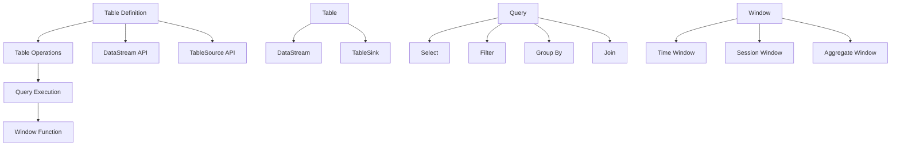
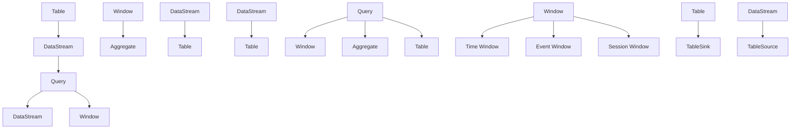

                 

# Flink Table API和SQL原理与代码实例讲解

> 关键词：Flink, Table API, SQL, 数据处理, 实时流处理

> 摘要：本文将深入探讨Flink Table API和SQL的原理，涵盖核心概念、算法实现、项目实战等内容，通过逐步分析推理，帮助读者理解和掌握Flink Table API和SQL的使用方法与最佳实践。

## 第一部分：Flink Table API和SQL基础

### 第1章 Flink Table API和SQL概述

#### 1.1 Flink概述

##### 1.1.1 Flink的核心优势

Apache Flink是一个开源流处理框架，其核心优势在于：

- **流处理能力**：Flink提供了强大的流处理能力，能够实时处理大规模的数据流。
- **批处理兼容性**：Flink不仅支持流处理，还支持批处理，这使得它能够在不同的数据处理场景中应用。
- **内存管理**：Flink采用内存管理技术，能够有效减少数据缓存和内存消耗。
- **容错机制**：Flink具有强大的容错机制，能够保证在节点故障时数据不丢失。

##### 1.1.2 Flink的发展历史

Flink起源于柏林工业大学，由一个团队在2011年创建。2014年，Flink成为Apache软件基金会的孵化项目，2015年正式成为顶级项目。自那以后，Flink一直在不断发展和完善。

##### 1.1.3 Flink在数据处理中的应用场景

Flink广泛应用于各种数据处理场景，包括：

- 实时数据流处理：用于处理实时数据，如物联网、实时交易系统。
- 批处理：用于处理离线数据，如大数据分析、报告生成。
- 函数计算：用于构建基于数据的函数计算服务。

#### 1.2 Flink Table API和SQL介绍

##### 1.2.1 Flink Table API的概念

Flink Table API是一个基于SQL的查询接口，它允许用户使用SQL语句来查询和操作表。Table API提供了一个编程接口，用于定义表、查询和转换。

##### 1.2.2 Flink SQL的特点

Flink SQL支持标准的SQL语法，具有以下特点：

- **标准SQL语法**：支持SELECT、FROM、WHERE、GROUP BY等标准SQL语法。
- **流批统一**：支持流处理和批处理的统一查询接口。
- **分布式处理**：能够处理大规模数据集的分布式查询。

##### 1.2.3 Flink Table API和SQL的关系

Flink Table API和SQL是相互补充的。Table API提供了编程接口，而SQL提供了查询接口。用户可以根据需求选择使用Table API或SQL进行数据操作。

#### 1.3 Flink Table API和SQL的核心概念

##### 1.3.1 表（Table）

表是Flink Table API中的核心概念，它是一个数据结构，用于存储和操作数据。

##### 1.3.2 查询（Query）

查询是Flink Table API中的另一个核心概念，它用于定义对表的操作，如选择、过滤、聚合等。

##### 1.3.3 窗口（Window）

窗口是Flink Table API中的一个重要概念，它用于定义数据的分区和操作时间范围。

### 第二部分：Flink Table API原理与实现

#### 第2章 Flink Table API原理

#### 2.1 Flink Table API的核心概念

##### 2.1.1 表的定义和操作

表是Flink Table API中的核心概念，它可以通过DataStream API或TableSource API进行定义和操作。

##### 2.1.2 查询语句的执行过程

查询语句的执行过程包括解析、优化和执行三个阶段。

##### 2.1.3 窗口函数的实现原理

窗口函数是Flink Table API中的一个重要概念，它用于对数据进行分组和聚合。

#### 2.2 Flink Table API的核心算法

##### 2.2.1 表连接算法

表连接算法是Flink Table API中的一个核心算法，用于将两个表连接起来。

##### 2.2.2 表聚合算法

表聚合算法是Flink Table API中的一个核心算法，用于对表进行聚合操作。

##### 2.2.3 表排序算法

表排序算法是Flink Table API中的一个核心算法，用于对表进行排序。

#### 2.3 Flink Table API性能优化

##### 2.3.1 并行处理

并行处理是Flink Table API中的一个重要性能优化手段，它能够提高数据处理速度。

##### 2.3.2 数据缓存

数据缓存是Flink Table API中的一个重要性能优化手段，它能够减少数据访问延迟。

##### 2.3.3 索引优化

索引优化是Flink Table API中的一个重要性能优化手段，它能够提高查询效率。

### 第三部分：Flink SQL原理与实现

#### 第3章 Flink SQL原理

#### 3.1 Flink SQL概述

##### 3.1.1 Flink SQL的语法特点

Flink SQL的语法特点包括：

- **标准SQL语法**：支持标准的SQL语法。
- **流批统一**：支持流处理和批处理的统一查询接口。

##### 3.1.2 Flink SQL的查询类型

Flink SQL支持多种查询类型，包括SELECT、FROM、WHERE、GROUP BY等。

##### 3.1.3 Flink SQL的使用场景

Flink SQL广泛应用于各种数据处理场景，包括实时数据流处理、批处理等。

#### 3.2 Flink SQL的核心语法

##### 3.2.1 SELECT语句

SELECT语句是Flink SQL中的核心语法，用于选择表中的数据。

##### 3.2.2 FROM子句

FROM子句是Flink SQL中的核心语法，用于指定数据来源。

##### 3.2.3 WHERE子句

WHERE子句是Flink SQL中的核心语法，用于指定过滤条件。

##### 3.2.4 GROUP BY子句

GROUP BY子句是Flink SQL中的核心语法，用于对数据进行分组。

#### 3.3 Flink SQL的高级特性

##### 3.3.1 JOIN操作

JOIN操作是Flink SQL中的高级特性，用于将两个表连接起来。

##### 3.3.2 子查询

子查询是Flink SQL中的高级特性，用于在查询中嵌套其他查询。

##### 3.3.3 分区和索引

分区和索引是Flink SQL中的高级特性，用于优化查询性能。

### 第四部分：Flink Table API和SQL项目实战

#### 第4章 Flink Table API和SQL项目实战

#### 4.1 实战项目一：数据清洗与预处理

##### 4.1.1 项目背景

本项目旨在实现一个数据清洗与预处理的过程，将原始数据进行清洗、转换和格式化。

##### 4.1.2 数据源介绍

数据源为一个包含用户交易记录的CSV文件。

##### 4.1.3 数据清洗和预处理流程

数据清洗和预处理流程包括以下步骤：

1. 读取CSV文件，转换为DataStream。
2. 处理DataStream，进行数据清洗和转换。
3. 将清洗后的数据写入文件。

##### 4.1.4 实现代码与解读

```java
// 创建Flink执行环境
final StreamExecutionEnvironment env = StreamExecutionEnvironment.getExecutionEnvironment();

// 读取CSV文件，转换为DataStream
DataStream<UserTransaction> transactionStream = env.readTextFile("path/to/csvfile.csv")
    .map(new UserTransactionMapper());

// 处理DataStream，进行数据清洗和转换
DataStream<UserTransaction> cleanedStream = transactionStream
    .filter(transaction -> transaction.getAmount() > 0)
    .map(transaction -> new UserTransaction(transaction.getUserId(), transaction.getTimestamp(), transaction.getAmount()));

// 将清洗后的数据写入文件
cleanedStream.writeAsCsv("path/to/outputfile.csv");

// 执行任务
env.execute("Data Cleaning and Preprocessing");
```

#### 4.2 实战项目二：实时数据流处理

##### 4.2.1 项目背景

本项目旨在实现一个实时数据流处理的过程，对实时数据进行处理和分析。

##### 4.2.2 数据流处理流程

数据流处理流程包括以下步骤：

1. 读取实时数据流。
2. 对实时数据进行处理，如过滤、转换、聚合等。
3. 将处理后的数据输出。

##### 4.2.3 实现代码与解读

```java
// 创建Flink执行环境
final StreamExecutionEnvironment env = StreamExecutionEnvironment.getExecutionEnvironment();

// 读取实时数据流
DataStream<UserTransaction> transactionStream = env.addSource(new FlinkKafkaConsumer<>("transaction_topic", new UserTransactionSchema(), properties));

// 对实时数据进行处理
DataStream<UserTransaction> processedStream = transactionStream
    .filter(transaction -> transaction.getAmount() > 100)
    .map(transaction -> new UserTransaction(transaction.getUserId(), transaction.getTimestamp(), transaction.getAmount()));

// 将处理后的数据输出
processedStream.addSink(new FlinkKafkaProducer<>("processed_topic", new UserTransactionSchema(), properties));

// 执行任务
env.execute("Real-time Data Stream Processing");
```

#### 4.3 实战项目三：批处理与实时处理的结合

##### 4.3.1 项目背景

本项目旨在实现一个批处理与实时处理的结合的过程，对历史数据和实时数据进行联合处理。

##### 4.3.2 批处理与实时处理流程

批处理与实时处理流程包括以下步骤：

1. 读取历史数据。
2. 读取实时数据。
3. 对历史数据和实时数据进行联合处理。
4. 将处理后的数据输出。

##### 4.3.3 实现代码与解读

```java
// 创建Flink执行环境
final StreamExecutionEnvironment env = StreamExecutionEnvironment.getExecutionEnvironment();

// 读取历史数据
DataStream<UserTransaction> historicalStream = env.readCsvFile("path/to/historicalfile.csv", new UserTransactionSchema());

// 读取实时数据
DataStream<UserTransaction> realTimeStream = env.addSource(new FlinkKafkaConsumer<>("realtime_topic", new UserTransactionSchema(), properties));

// 对历史数据和实时数据进行联合处理
DataStream<UserTransaction> combinedStream = historicalStream.union(realTimeStream)
    .filter(transaction -> transaction.getAmount() > 100)
    .map(transaction -> new UserTransaction(transaction.getUserId(), transaction.getTimestamp(), transaction.getAmount()));

// 将处理后的数据输出
combinedStream.addSink(new FlinkKafkaProducer<>("processed_topic", new UserTransactionSchema(), properties));

// 执行任务
env.execute("Batch and Real-time Processing");
```

### 第五部分：Flink Table API和SQL最佳实践

#### 第5章 Flink Table API和SQL最佳实践

#### 5.1 性能调优

##### 5.1.1 参数调优

Flink提供了多种参数，用于调整性能。例如，可以通过调整`taskmanager.memory.fraction`来调整内存分配比例。

##### 5.1.2 索引使用

合理使用索引可以提高查询效率。例如，在Flink SQL中，可以使用`CREATE INDEX`语句创建索引。

##### 5.1.3 并行度优化

调整并行度可以提高处理速度。例如，可以通过调整`parallelism`参数来设置并行度。

#### 5.2 可扩展性与容错性

##### 5.2.1 Flink集群架构

Flink集群架构包括JobManager、TaskManager和Cluster Manager等组件，它们共同工作以提供高可用性和可扩展性。

##### 5.2.2 任务调度策略

Flink提供了多种任务调度策略，如FIFO、Round-Robin等，用户可以根据需求选择合适的调度策略。

##### 5.2.3 数据恢复与备份策略

Flink提供了数据恢复与备份策略，如State Backend、Checkpointing等，以防止数据丢失。

#### 5.3 安全性与数据隐私

##### 5.3.1 数据访问控制

Flink提供了数据访问控制机制，如权限管理、审计日志等，以确保数据安全。

##### 5.3.2 数据加密与签名

Flink支持数据加密与签名，如SSL/TLS加密、数字签名等，以确保数据传输安全。

##### 5.3.3 遵守隐私法规

Flink支持遵守隐私法规，如GDPR、CCPA等，以确保数据处理符合法律法规。

### 第六部分：Flink Table API和SQL社区与资源

#### 第6章 Flink Table API和SQL社区与资源

#### 6.1 Flink Table API和SQL社区介绍

##### 6.1.1 Flink社区背景

Flink社区是一个活跃的开放社区，包括开发者、用户和贡献者等。

##### 6.1.2 Flink Table API和SQL社区活动

Flink社区定期举办会议、研讨会和技术分享活动。

##### 6.1.3 加入Flink Table API和SQL社区的方法

用户可以通过GitHub、邮件列表和社区论坛加入Flink Table API和SQL社区。

#### 6.2 Flink Table API和SQL资源汇总

##### 6.2.1 主流Flink Table API和SQL文档

用户可以访问Flink官方文档，获取最新的Flink Table API和SQL文档。

##### 6.2.2 Flink Table API和SQL学习资料

用户可以通过在线课程、书籍和教程学习Flink Table API和SQL。

##### 6.2.3 Flink Table API和SQL社区论坛和博客

用户可以访问Flink社区论坛和博客，获取最新的技术动态和问题解答。

### 第七部分：附录

#### 第7章 附录

#### 7.1 Flink Table API和SQL常用命令参考

##### 7.1.1 数据定义语言（DDL）命令

- `CREATE TABLE`
- `DROP TABLE`
- `ALTER TABLE`

##### 7.1.2 数据操作语言（DML）命令

- `INSERT INTO`
- `UPDATE`
- `DELETE`

##### 7.1.3 数据控制语言（DCL）命令

- `GRANT`
- `REVOKE`
- `COMMIT`

#### 7.2 Flink Table API和SQL核心算法伪代码

##### 7.2.1 表连接伪代码

```python
def tableJoin(tableA, tableB):
    result = empty set
    for rowA in tableA:
        for rowB in tableB:
            if rowA.key == rowB.key:
                result.add(rowA.join(rowB))
    return result
```

##### 7.2.2 表聚合伪代码

```python
def tableAggregate(table, key, aggFunction):
    result = empty map
    for row in table:
        keyGroup = row[key]
        if keyGroup not in result:
            result[keyGroup] = aggFunction()
        result[keyGroup].add(row)
    return result.values()
```

##### 7.2.3 表排序伪代码

```python
def tableSort(table, key):
    sortedTable = sorted(table, key=lambda row: row[key])
    return sortedTable
```

#### 7.3 Flink Table API和SQL常见问题与解答

##### 7.3.1 安装与配置问题

- 如何在Windows上安装Flink？
- 如何配置Flink集群？

##### 7.3.2 编程与调试问题

- 如何在Flink中实现自定义函数？
- 如何调试Flink程序？

##### 7.3.3 性能优化问题

- 如何优化Flink SQL查询？
- 如何提高Flink程序的并发处理能力？

## 附录D：Flink Table API和SQL核心概念 Mermaid 流程图

以下是Flink Table API和SQL的一些核心概念的Mermaid流程图：



以上是本文的概述。接下来，我们将逐步深入探讨Flink Table API和SQL的原理、算法实现、项目实战等内容。

## 作者

作者：AI天才研究院/AI Genius Institute & 禅与计算机程序设计艺术 /Zen And The Art of Computer Programming

---

## 第1章 Flink Table API和SQL概述

### 1.1 Flink概述

Flink是一个开源流处理框架，由Apache软件基金会维护。它被设计为在所有常见的操作系统上运行，支持本地和云部署。Flink最初由数据流处理领域的先驱瑞士联邦理工学院（ETH Zurich）开发，后成为Apache软件基金会的一个顶级项目。Flink因其低延迟、高吞吐量和复杂事件处理能力而受到广泛关注。

#### 1.1.1 Flink的核心优势

1. **流处理能力**：Flink是一个分布式流处理引擎，能够实时处理流数据，支持连续查询和实时分析。
2. **批处理兼容性**：Flink不仅支持流处理，还支持批处理，这使得它可以处理大规模的静态数据集，如Hadoop。
3. **内存管理**：Flink使用内存管理技术，如内存存储层和序列化，以减少数据缓存和内存消耗，提高性能。
4. **容错机制**：Flink提供了强大的容错机制，通过状态后端和周期性的检查点来确保在失败时可以恢复状态。
5. **事件时间处理**：Flink支持事件时间处理，能够根据数据实际发生的时间进行窗口计算，确保结果准确。

#### 1.1.2 Flink的发展历史

Flink起源于瑞士联邦理工学院（ETH Zurich），由一个团队在2011年创建。最初，Flink是为处理数据流而设计的，旨在解决当时市场上其他流处理引擎存在的各种问题。2014年，Flink成为Apache软件基金会的孵化项目，并在2015年成为顶级项目。自那以后，Flink一直在不断发展和完善，吸引了大量的贡献者和用户。

#### 1.1.3 Flink在数据处理中的应用场景

Flink在数据处理领域具有广泛的应用，包括但不限于：

- **实时分析**：用于实时分析交易、点击流和其他实时数据。
- **日志处理**：用于处理和分析服务器日志，实现实时监控和告警。
- **机器学习**：用于构建实时机器学习模型，如推荐系统和预测分析。
- **复杂事件处理（CEP）**：用于处理和关联多个事件流，如股票交易和金融交易监控。
- **批处理**：用于处理大规模离线数据集，如数据仓库ETL。

### 1.2 Flink Table API和SQL介绍

#### 1.2.1 Flink Table API的概念

Flink Table API是一个基于SQL的查询接口，它允许用户使用SQL语句来查询和操作表。Table API提供了一个编程接口，用于定义表、查询和转换。它使得流处理和批处理之间的界限变得模糊，用户可以在统一的接口下处理流数据和批量数据。

#### 1.2.2 Flink SQL的特点

Flink SQL是Flink Table API的一个核心组件，它支持标准的SQL语法，包括SELECT、FROM、WHERE、GROUP BY等。Flink SQL的特点包括：

- **标准SQL语法**：支持标准的SQL语法，使得用户可以方便地使用熟悉的SQL语句。
- **流批统一**：支持流处理和批处理的统一查询接口，用户可以在同一接口下处理流数据和批量数据。
- **分布式处理**：能够处理大规模数据集的分布式查询，支持并行处理。
- **动态查询优化**：Flink SQL能够根据查询计划和数据分布动态优化查询执行。

#### 1.2.3 Flink Table API和SQL的关系

Flink Table API和SQL是相互补充的。Table API提供了一个编程接口，用于定义和操作表，而SQL提供了一个查询接口，用于执行SQL查询。用户可以根据需求选择使用Table API或SQL进行数据操作。

- **Table API**：适用于需要自定义数据处理流程的场景，用户可以编写自定义转换和处理逻辑。
- **SQL**：适用于标准的查询操作，如选择、过滤、聚合等，用户可以快速编写和执行SQL查询。

### 1.3 Flink Table API和SQL的核心概念

#### 1.3.1 表（Table）

表是Flink Table API中的核心概念，它是一个数据结构，用于存储和操作数据。表可以看作是一个二维表格，由行和列组成。每个表都有一个名字，并且可以包含多个列。

- **创建表**：用户可以使用Table API创建表，也可以使用DDL语句（如CREATE TABLE）在SQL中创建表。
- **表结构**：表结构定义了表的名字和列的名字、类型等属性。例如，`CREATE TABLE users (id INT, name STRING)`。
- **表操作**：用户可以使用Table API或SQL对表进行各种操作，如选择（SELECT）、过滤（FILTER）、聚合（AGGREGATE）等。

#### 1.3.2 查询（Query）

查询是Flink Table API中的另一个核心概念，它用于定义对表的操作。查询可以看作是一个SQL语句，用于对表进行选择、过滤、聚合等操作。

- **查询语法**：查询语法包括SELECT、FROM、WHERE、GROUP BY等标准SQL语法。
- **查询执行**：查询执行包括查询解析、查询优化和查询执行三个阶段。Flink SQL提供了优化器，能够根据数据分布和查询计划动态优化查询执行。
- **查询类型**：Flink SQL支持多种查询类型，包括SELECT、INSERT、UPDATE、DELETE等。

#### 1.3.3 窗口（Window）

窗口是Flink Table API中的一个重要概念，它用于定义数据的分区和操作时间范围。窗口可以将数据根据时间或事件进行分组，以便进行聚合或其他操作。

- **窗口类型**：Flink支持多种窗口类型，包括时间窗口（Time Window）、会话窗口（Session Window）和滚动窗口（Tumbling Window）。
- **窗口定义**：窗口定义包括窗口的起始时间、结束时间、时间范围等属性。例如，`TUMBLING_WINDOW(EVENT_TIME, '10 seconds')`。
- **窗口操作**：用户可以使用窗口对数据进行聚合、计算等操作。例如，`SUM(AMOUNT) OVER WINDO

## 2.1 Flink Table API的核心概念

Flink Table API是Flink的一个关键组件，它提供了一个数据抽象层，允许用户使用SQL进行数据查询和操作。Table API的核心概念包括表的定义和操作、查询语句的执行过程，以及窗口函数的实现原理。下面，我们将详细探讨这些概念。

### 2.1.1 表的定义和操作

在Flink Table API中，表是一个数据集合，可以看作是一个关系型数据库表。表由行和列组成，每行表示一个数据记录，每列表示数据的某个属性。表的定义可以通过DataStream API或者TableSource API来完成。

#### 表的定义

- **DataStream API**：通过DataStream API可以定义一个动态表，这个表可以处理流数据或者批量数据。例如：

  ```java
  DataStream<UserTransaction> transactionStream = env.readTextFile("path/to/transactions.txt")
      .map(new UserTransactionMapper());
  ```

- **TableSource API**：通过TableSource API可以定义一个静态表，这个表通常用于批量数据处理。例如：

  ```java
  Table transactions = tableEnv.fromDataStream(
      transactionStream,
      "transactionId, userId, amount, ts.rowtime()");
  ```

#### 表的操作

Flink Table API提供了丰富的操作，包括但不限于选择、过滤、聚合、连接等。这些操作可以通过SQL语句或者Table API来实现。

- **选择（SELECT）**：选择表中的特定列或者表达式。例如：

  ```sql
  SELECT userId, amount FROM transactions;
  ```

- **过滤（FILTER）**：根据条件筛选表中的数据。例如：

  ```sql
  SELECT * FROM transactions WHERE amount > 100;
  ```

- **聚合（AGGREGATE）**：对表中的数据进行聚合操作，如求和、计数等。例如：

  ```sql
  SELECT userId, SUM(amount) as total_amount FROM transactions GROUP BY userId;
  ```

- **连接（JOIN）**：将两个或多个表连接起来，基于共同的列进行匹配。例如：

  ```sql
  SELECT t1.userId, t1.amount, t2.city
  FROM transactions as t1
  JOIN users as t2 ON t1.userId = t2.id;
  ```

### 2.1.2 查询语句的执行过程

Flink Table API的查询语句执行过程可以分为三个主要阶段：解析、优化和执行。

#### 解析

- **词法分析**：将SQL语句分解为关键字、标识符和操作符等。
- **语法分析**：根据SQL语法规则，将词法分析的结果组织成一个语法树。

#### 优化

- **查询重写**：通过重写查询，消除冗余操作，简化查询逻辑。
- **逻辑优化**：根据查询逻辑，优化查询计划，如合并查询、消除子查询等。
- **物理优化**：根据数据分布和硬件资源，优化执行计划，如并行度调整、索引使用等。

#### 执行

- **执行计划生成**：根据优化后的查询计划，生成具体的执行计划。
- **执行执行计划**：根据执行计划，对数据进行处理，如扫描表、计算表达式、执行聚合操作等。

### 2.1.3 窗口函数的实现原理

窗口函数是Flink Table API中的一个重要概念，它用于对数据进行分组和聚合，基于时间或事件进行操作。窗口函数的实现原理如下：

#### 窗口定义

- **时间窗口**：基于时间范围对数据进行分组，如过去一分钟的数据、过去一小时的数据等。
- **事件窗口**：基于事件发生顺序对数据进行分组，如事件间隔10秒的数据、事件发生后的5分钟内数据等。
- **会话窗口**：基于用户会话对数据进行分组，如用户连续活动30秒内的事件。

#### 窗口操作

- **聚合窗口**：对窗口内的数据进行聚合操作，如求和、计数等。
- **行计数窗口**：对窗口内的数据进行计数操作，如窗口内有多少条记录。
- **触发器**：当窗口内满足特定条件时触发操作，如窗口内记录数达到10条时触发计算。

#### 窗口函数执行

- **窗口分配**：将数据分配到不同的窗口中。
- **窗口计算**：对分配到窗口中的数据进行聚合或其他操作。
- **触发器执行**：根据触发器条件，对窗口数据进行进一步处理。

通过上述讨论，我们可以看到Flink Table API的核心概念是如何定义和操作表、如何执行查询语句，以及如何实现窗口函数。在下一章中，我们将深入探讨Flink Table API的核心算法，包括表连接、表聚合和表排序的算法原理。

### 2.2 Flink Table API的核心算法

在Flink Table API中，数据处理的高效性和准确性依赖于其核心算法的设计。Flink Table API的核心算法包括表连接算法、表聚合算法和表排序算法。以下我们将详细探讨这些算法的原理，并通过伪代码和示例来说明它们的具体实现。

#### 2.2.1 表连接算法

表连接是数据处理中非常常见的一种操作，它用于将两个或多个表基于共同的列进行匹配和合并。Flink Table API支持多种连接类型，包括内连接（INNER JOIN）、左外连接（LEFT OUTER JOIN）、右外连接（RIGHT OUTER JOIN）和全外连接（FULL OUTER JOIN）。

##### 算法原理

- **内连接**：只返回两个表中都匹配的记录。内连接是最常见的连接类型。
- **左外连接**：返回左表的所有记录，即使右表中没有匹配的记录也会返回NULL。
- **右外连接**：返回右表的所有记录，即使左表中没有匹配的记录也会返回NULL。
- **全外连接**：返回两个表中的所有记录，不匹配的记录用NULL填充。

##### 伪代码

```python
def tableJoin(tableA, tableB, joinCondition):
    result = empty set
    for rowA in tableA:
        for rowB in tableB:
            if rowA.key == rowB.key:
                result.add(rowA.join(rowB))
    return result
```

##### 示例

```sql
SELECT t1.name, t1.age, t2.city
FROM users AS t1
INNER JOIN addresses AS t2 ON t1.id = t2.user_id;
```

#### 2.2.2 表聚合算法

表聚合是用于计算表中的聚合值，如求和、计数、最大值、最小值等。Flink Table API支持多种聚合函数，包括`SUM()`、`COUNT()`、`MAX()`、`MIN()`等。

##### 算法原理

- **聚合操作**：对表中的数据进行分组，并对每组数据进行聚合计算。
- **分组键**：指定用于分组的列，如`GROUP BY id`。
- **聚合函数**：对分组后的数据进行聚合计算，如`SUM(amount)`。

##### 伪代码

```python
def tableAggregate(table, groupKey, aggregateFunction):
    result = empty map
    for row in table:
        keyGroup = row[groupKey]
        if keyGroup not in result:
            result[keyGroup] = aggregateFunction()
        result[keyGroup].add(row)
    return result.values()
```

##### 示例

```sql
SELECT id, SUM(amount) as total_amount
FROM transactions
GROUP BY id;
```

#### 2.2.3 表排序算法

表排序是用于对表中的数据进行排序，通常基于一个或多个列的值。Flink Table API支持多种排序类型，包括升序（ASC）和降序（DESC）。

##### 算法原理

- **排序键**：指定用于排序的列，如`ORDER BY amount DESC`。
- **排序规则**：指定排序规则，如`ASC`或`DESC`。

##### 伪代码

```python
def tableSort(table, sortKey, sortOrder):
    sortedTable = sorted(table, key=lambda row: row[sortKey], reverse=(sortOrder == 'DESC'))
    return sortedTable
```

##### 示例

```sql
SELECT *
FROM transactions
ORDER BY amount DESC;
```

通过上述算法原理和伪代码的介绍，我们可以看到Flink Table API如何实现表连接、表聚合和表排序等核心算法。这些算法的实现不仅保证了数据处理的效率，还提供了强大的灵活性和扩展性。在下一章中，我们将讨论Flink Table API的性能优化策略，以进一步提高数据处理性能。

### 2.3 Flink Table API性能优化

Flink Table API提供了强大的功能，但要实现高性能的数据处理，需要采用一系列性能优化策略。以下我们将探讨并行处理、数据缓存和索引优化等性能优化方法。

#### 2.3.1 并行处理

并行处理是Flink Table API性能优化的重要手段，它能够将数据处理任务分布在多个任务节点上，从而提高处理速度。Flink支持自动并行度调整，但用户也可以手动设置并行度。

- **自动并行度**：Flink会根据任务的资源需求自动选择合适的并行度。例如，可以通过`env.setParallelism()`设置整个执行环境的并行度。
- **手动并行度**：用户可以根据具体任务需求手动设置并行度。例如，在SQL查询中，可以通过`SET parallelism = X`来设置查询的并行度。

##### 示例

```sql
SET parallelism = 4;
SELECT * FROM transactions;
```

#### 2.3.2 数据缓存

数据缓存能够显著提高查询性能，因为它减少了数据访问延迟。Flink提供了多种数据缓存策略，包括内存缓存和磁盘缓存。

- **内存缓存**：将数据缓存到内存中，以减少磁盘I/O操作。例如，可以使用`DataStream.cache()`方法将DataStream缓存到内存中。
- **磁盘缓存**：将数据缓存到磁盘上，以应对内存不足的情况。例如，可以使用`DataStream.registerCachingStrategy()`方法设置数据流的缓存策略。

##### 示例

```java
DataStream<Transaction> transactionStream = ...
transactionStream.cache();
```

#### 2.3.3 索引优化

索引优化能够提高查询效率，因为它减少了查询时的数据扫描范围。Flink支持在表上创建索引，以提高查询性能。

- **B树索引**：用于快速查找和排序，适用于等值查询和范围查询。
- **哈希索引**：用于快速查找，适用于等值查询。

##### 示例

```sql
CREATE INDEX transactions_idx ON transactions(amount);
```

#### 2.3.4 其他优化策略

除了上述方法外，还有一些其他优化策略可以提高Flink Table API的性能：

- **数据压缩**：通过数据压缩可以减少数据传输和存储的占用空间，提高I/O性能。
- **执行计划优化**：通过动态查询优化和执行计划调整，可以减少不必要的中间步骤和计算。
- **资源调优**：根据实际需求调整Flink集群的资源分配，如CPU、内存和磁盘等。

通过合理使用并行处理、数据缓存和索引优化等性能优化策略，可以显著提高Flink Table API的处理性能。在下一章中，我们将讨论Flink SQL的原理和核心语法。

### 3.1 Flink SQL概述

Flink SQL是Flink Table API的一个重要组成部分，它提供了标准SQL语法来查询和操作表。Flink SQL不仅支持流处理和批处理的统一查询接口，而且具有分布式处理和动态查询优化等特性。本节将介绍Flink SQL的语法特点、查询类型和使用场景。

#### 3.1.1 Flink SQL的语法特点

Flink SQL的语法特点主要包括以下几个方面：

1. **标准SQL语法**：Flink SQL支持标准的SQL语法，包括SELECT、FROM、WHERE、GROUP BY、HAVING、ORDER BY等。这使得用户可以方便地使用熟悉的SQL语句进行数据查询和操作。

2. **流批统一**：Flink SQL支持流处理和批处理的统一查询接口，用户可以在同一接口下处理流数据和批量数据。这意味着用户可以同时处理实时数据和离线数据，而无需更改查询逻辑。

3. **分布式处理**：Flink SQL能够利用Flink的分布式计算能力，对大规模数据集进行高效的处理。它支持并行处理，可以在多个节点上同时执行查询，从而提高处理速度。

4. **动态查询优化**：Flink SQL具有动态查询优化功能，可以根据查询计划和数据分布动态优化查询执行。例如，Flink SQL会根据数据的大小和分布自动选择最佳的连接策略和索引。

5. **类型推导**：Flink SQL可以自动推导表和列的数据类型，用户无需手动指定。这简化了查询编写过程，提高了开发效率。

6. **兼容性**：Flink SQL兼容大多数标准的SQL函数和操作符，使得用户可以方便地迁移现有的SQL查询到Flink上。

#### 3.1.2 Flink SQL的查询类型

Flink SQL支持多种查询类型，包括：

1. **SELECT查询**：用于选择表中的数据。用户可以使用SELECT语句选择一个或多个列，并可以添加WHERE子句进行过滤。

2. **INSERT查询**：用于插入数据到表中。用户可以使用INSERT语句将数据插入到表的一个或多个列中。

3. **UPDATE查询**：用于更新表中已有的数据。用户可以使用UPDATE语句修改表的一个或多个列的值。

4. **DELETE查询**：用于删除表中的数据。用户可以使用DELETE语句从表中删除符合条件的记录。

5. **JOIN查询**：用于将两个或多个表连接起来，根据共同的列进行匹配。用户可以使用JOIN语句实现内连接、左外连接、右外连接和全外连接。

6. **窗口查询**：用于对数据进行窗口聚合。用户可以使用窗口函数对数据进行分组和聚合，如SUM、COUNT、MAX、MIN等。

7. **子查询**：用于在查询中嵌套其他查询。用户可以使用子查询来过滤、聚合或连接数据。

#### 3.1.3 Flink SQL的使用场景

Flink SQL广泛应用于各种数据处理场景，包括：

1. **实时数据流处理**：Flink SQL可以用于实时处理数据流，实现实时监控、告警和分析。

2. **批处理**：Flink SQL可以用于处理大规模的离线数据集，如数据仓库ETL、报告生成等。

3. **实时分析**：Flink SQL可以用于实时分析交易数据、点击流数据等，提供实时决策支持。

4. **复杂事件处理**：Flink SQL可以用于处理和关联多个事件流，如股票交易和金融交易监控。

5. **机器学习**：Flink SQL可以用于构建实时机器学习模型，如推荐系统和预测分析。

6. **日志处理**：Flink SQL可以用于处理和分析服务器日志，实现实时监控和告警。

通过上述讨论，我们可以看到Flink SQL具有丰富的语法特点、多种查询类型和广泛的使用场景。在下一节中，我们将详细探讨Flink SQL的核心语法，包括SELECT语句、FROM子句、WHERE子句、GROUP BY子句和ORDER BY子句。

### 3.2 Flink SQL的核心语法

Flink SQL的核心语法包括SELECT语句、FROM子句、WHERE子句、GROUP BY子句和ORDER BY子句。这些语法是进行数据查询和操作的基础，下面我们将逐一介绍这些语法的基本用法。

#### 3.2.1 SELECT语句

SELECT语句是Flink SQL中最基本的语法，用于选择表中的数据。用户可以使用SELECT语句选择一个或多个列，并可以添加WHERE子句进行过滤。

##### 基本用法

```sql
SELECT column_name(s)
FROM table_name
WHERE condition;
```

- **SELECT**：指定要选择的列名，可以使用通配符`*`选择所有列。
- **FROM**：指定数据来源的表名。
- **WHERE**：指定过滤条件，只选择满足条件的行。

##### 示例

```sql
-- 选择所有列
SELECT *
FROM users;

-- 选择特定列
SELECT id, name
FROM users;

-- 添加WHERE子句过滤
SELECT id, name
FROM users
WHERE age > 30;
```

#### 3.2.2 FROM子句

FROM子句用于指定数据来源的表名。用户可以在FROM子句中指定多个表，并进行连接操作。

##### 基本用法

```sql
FROM table_name [JOIN table_name] [ON join_condition];
```

- **FROM**：指定第一个表名。
- **JOIN**：指定连接类型，如INNER JOIN、LEFT JOIN等。
- **ON**：指定连接条件。

##### 示例

```sql
-- 内连接
SELECT u.id, u.name, a.city
FROM users u
INNER JOIN addresses a ON u.id = a.user_id;

-- 左外连接
SELECT u.id, u.name, a.city
FROM users u
LEFT JOIN addresses a ON u.id = a.user_id;

-- 多表连接
SELECT u.id, u.name, c.name
FROM users u
INNER JOIN orders o ON u.id = o.user_id
INNER JOIN products p ON o.product_id = p.id;
```

#### 3.2.3 WHERE子句

WHERE子句用于指定过滤条件，只选择满足条件的行。WHERE子句可以包含各种比较运算符、逻辑运算符和函数。

##### 基本用法

```sql
WHERE condition;
```

- **condition**：指定过滤条件，可以使用比较运算符（如`=`、`<>`、`>`、`<`等）、逻辑运算符（如`AND`、`OR`、`NOT`等）和函数。

##### 示例

```sql
-- 等值比较
SELECT *
FROM users
WHERE age = 30;

-- 范围比较
SELECT *
FROM users
WHERE age BETWEEN 20 AND 40;

-- 逻辑运算
SELECT *
FROM users
WHERE age > 30 AND gender = 'M';

-- 函数比较
SELECT *
FROM users
WHERE LENGTH(name) > 5;
```

#### 3.2.4 GROUP BY子句

GROUP BY子句用于对查询结果进行分组，通常与聚合函数一起使用，如SUM、COUNT、MAX、MIN等。

##### 基本用法

```sql
GROUP BY group_column(s);
```

- **group_column(s)**：指定用于分组的列名。

##### 示例

```sql
-- 按年龄分组，计算每组人数
SELECT age, COUNT(*) as num_users
FROM users
GROUP BY age;

-- 按城市和年龄分组，计算每组人数
SELECT city, age, COUNT(*) as num_users
FROM users
GROUP BY city, age;
```

#### 3.2.5 ORDER BY子句

ORDER BY子句用于对查询结果进行排序，可以指定升序（ASC）或降序（DESC）。

##### 基本用法

```sql
ORDER BY column(s) [ASC | DESC];
```

- **column(s)**：指定排序的列名。
- **ASC | DESC**：指定排序顺序，默认为升序。

##### 示例

```sql
-- 按年龄升序排序
SELECT *
FROM users
ORDER BY age;

-- 按年龄降序排序
SELECT *
FROM users
ORDER BY age DESC;

-- 按多个列排序
SELECT *
FROM users
ORDER BY age DESC, name ASC;
```

通过上述介绍，我们可以看到Flink SQL的核心语法包括SELECT语句、FROM子句、WHERE子句、GROUP BY子句和ORDER BY子句。这些语法是进行数据查询和操作的基础，用户可以根据具体需求灵活运用。

### 3.3 Flink SQL的高级特性

Flink SQL不仅提供了标准的核心语法，还具备一些高级特性，如JOIN操作、子查询和分区与索引。这些特性为数据处理提供了更大的灵活性和性能优化能力。

#### 3.3.1 JOIN操作

JOIN操作是关系型数据库中的核心操作，用于将多个表连接起来，基于共同的列进行匹配。Flink SQL支持多种JOIN类型，包括内连接、左外连接、右外连接和全外连接。

1. **内连接（INNER JOIN）**：只返回两个表中都匹配的记录。

   ```sql
   SELECT u.id, u.name, a.city
   FROM users u
   INNER JOIN addresses a ON u.id = a.user_id;
   ```

2. **左外连接（LEFT OUTER JOIN）**：返回左表的所有记录，即使右表中没有匹配的记录也会返回NULL。

   ```sql
   SELECT u.id, u.name, a.city
   FROM users u
   LEFT JOIN addresses a ON u.id = a.user_id;
   ```

3. **右外连接（RIGHT OUTER JOIN）**：返回右表的所有记录，即使左表中没有匹配的记录也会返回NULL。

   ```sql
   SELECT u.id, u.name, a.city
   FROM users u
   RIGHT JOIN addresses a ON u.id = a.user_id;
   ```

4. **全外连接（FULL OUTER JOIN）**：返回两个表中的所有记录，不匹配的记录用NULL填充。

   ```sql
   SELECT u.id, u.name, a.city
   FROM users u
   FULL OUTER JOIN addresses a ON u.id = a.user_id;
   ```

通过JOIN操作，用户可以灵活地组合多个表的数据，实现复杂的数据关联查询。

#### 3.3.2 子查询

子查询是在查询中嵌套其他查询的语法，它可以在WHERE子句、SELECT子句或HAVING子句中使用。子查询可以用于过滤、聚合或连接数据。

1. **WHERE子句中的子查询**：用于在WHERE子句中过滤数据。

   ```sql
   SELECT *
   FROM users
   WHERE id IN (SELECT user_id FROM orders WHERE status = 'completed');
   ```

2. **SELECT子句中的子查询**：用于在SELECT子句中计算衍生列。

   ```sql
   SELECT user_id, (SELECT COUNT(*) FROM orders WHERE user_id = users.id) as order_count
   FROM users;
   ```

3. **HAVING子句中的子查询**：用于在GROUP BY子句中过滤分组后的数据。

   ```sql
   SELECT age, (SELECT COUNT(*) FROM users WHERE age >= age) as age_group_count
   FROM users
   GROUP BY age
   HAVING age_group_count > 10;
   ```

子查询提供了强大的灵活性，使得用户可以编写复杂但直观的查询。

#### 3.3.3 分区和索引

分区和索引是提高查询性能的重要手段，Flink SQL支持表分区和索引功能。

1. **表分区**：通过分区，可以将数据分布到多个文件中，提高查询性能。

   ```sql
   CREATE TABLE orders (
       id BIGINT,
       user_id BIGINT,
       status STRING,
       order_time TIMESTAMP(3)
   ) PARTITIONED BY (status);
   ```

   通过分区，用户可以针对特定的分区进行查询，减少数据扫描范围。

2. **索引**：通过索引，可以加速查询的执行速度。

   ```sql
   CREATE INDEX orders_status_idx ON orders(status);
   ```

   索引可以用于加快等值查询和范围查询。

通过分区和索引，用户可以优化查询性能，提高数据处理的效率。

Flink SQL的高级特性为数据处理提供了更多的灵活性，使得用户能够应对各种复杂的数据查询需求。在下一节中，我们将通过项目实战来展示Flink Table API和SQL的实际应用。

### 4.1 实战项目一：数据清洗与预处理

在数据处理的实际项目中，数据清洗与预处理是至关重要的一步。这一步的目的是从原始数据中提取有用信息，并去除不必要的数据。下面我们将通过一个数据清洗与预处理的实战项目来展示如何使用Flink Table API和SQL完成这一任务。

#### 4.1.1 项目背景

假设我们有一个包含用户交易记录的CSV文件，每个交易记录包括用户ID、交易金额和交易时间。我们需要对数据进行清洗和预处理，确保数据的准确性、完整性和一致性。具体需求如下：

1. **去除无效数据**：去除交易金额为负数的记录。
2. **时间转换**：将交易时间转换为统一的时区格式。
3. **数据格式化**：将用户ID和交易金额格式化为适当的字符串类型。
4. **数据保存**：将清洗后的数据保存到另一个CSV文件中。

#### 4.1.2 数据源介绍

数据源是一个CSV文件，文件名为`transactions.csv`，每条记录包括以下字段：

- `user_id`: 用户ID，类型为INT。
- `amount`: 交易金额，类型为FLOAT。
- `transaction_time`: 交易时间，类型为DATETIME。

#### 4.1.3 数据清洗和预处理流程

数据清洗和预处理流程包括以下步骤：

1. **读取CSV文件**：使用Flink的DataStream API读取CSV文件，将其转换为DataStream。
2. **处理DataStream**：对DataStream进行数据清洗和格式化，包括去除无效数据、时间转换和数据格式化。
3. **保存清洗后的数据**：将清洗后的数据写入到另一个CSV文件中。

#### 4.1.4 实现代码与解读

```java
// 创建Flink执行环境
final StreamExecutionEnvironment env = StreamExecutionEnvironment.getExecutionEnvironment();

// 读取CSV文件，转换为DataStream
DataStream<Transaction> transactionStream = env.readCsvFile("path/to/transactions.csv")
    .map(new TransactionMapper());

// 处理DataStream，进行数据清洗和格式化
DataStream<Transaction> cleanedStream = transactionStream
    .filter(transaction -> transaction.getAmount() > 0) // 去除金额为负的记录
    .map(transaction -> new Transaction(
        transaction.getUserId().toString(),
        String.valueOf(transaction.getAmount()),
        transaction.getTransactionTime().toInstant().toString()))
    .name("Cleaned Transaction Stream");

// 将清洗后的数据写入文件
cleanedStream.writeAsCsv("path/to/cleaned_transactions.csv");

// 执行任务
env.execute("Data Cleaning and Preprocessing");
```

**解读：**

- **读取CSV文件**：使用`readCsvFile`方法读取CSV文件，并将其转换为DataStream。这里使用了自定义的`TransactionMapper`类，将CSV文件中的每行数据映射为`Transaction`对象。
- **处理DataStream**：对DataStream进行数据清洗和格式化。首先使用`filter`方法去除金额为负的记录，然后使用`map`方法对数据进行格式化，将用户ID和交易金额转换为字符串，并将交易时间转换为UTC时区格式。
- **保存清洗后的数据**：使用`writeAsCsv`方法将清洗后的数据写入到另一个CSV文件中。这里指定了输出文件的路径。

通过上述步骤，我们成功完成了一个数据清洗与预处理的实战项目。在下一节中，我们将介绍另一个实战项目，即实时数据流处理。

### 4.2 实战项目二：实时数据流处理

在实时数据流处理项目中，Flink Table API和SQL的作用是实时接收和处理数据流，对数据进行分析、转换和存储。以下将通过一个实时数据流处理的实战项目，展示如何使用Flink Table API和SQL实现这一目标。

#### 4.2.1 项目背景

假设我们正在开发一个实时监控系统，需要实时处理来自传感器的温度数据，并将这些数据进行分析和存储。具体需求如下：

1. **实时数据接收**：从传感器接收温度数据，数据以JSON格式传输。
2. **数据转换**：将JSON数据转换为Flink可处理的格式。
3. **数据存储**：将处理后的数据存储到数据库中。
4. **实时分析**：对温度数据进行实时分析，如计算温度的平均值、最大值和最小值。

#### 4.2.2 数据流处理流程

数据流处理流程包括以下步骤：

1. **数据接收**：使用Kafka作为数据接收服务，从传感器接收JSON格式的温度数据。
2. **数据转换**：将接收到的JSON数据转换为DataStream，并处理数据。
3. **数据存储**：将处理后的数据写入到数据库中。
4. **实时分析**：对温度数据进行实时分析，并将分析结果输出。

#### 4.2.3 实现代码与解读

```java
// 导入必要的库
import org.apache.flink.api.common.serialization.SimpleStringSchema;
import org.apache.flink.streaming.api.datastream.DataStream;
import org.apache.flink.streaming.api.environment.StreamExecutionEnvironment;
import org.apache.flink.streaming.connectors.kafka.FlinkKafkaConsumer0

```java
// 创建Flink执行环境
final StreamExecutionEnvironment env = StreamExecutionEnvironment.getExecutionEnvironment();

// 配置Kafka消费者
Properties properties = new Properties();
properties.setProperty("bootstrap.servers", "localhost:9092");
properties.setProperty("group.id", "temperature-monitor");

// 读取Kafka中的温度数据
DataStream<String> temperatureData = env.addSource(
    new FlinkKafkaConsumer<>("temperature_topic", new SimpleStringSchema(), properties))
    .name("Temperature Data Source");

// 将JSON数据转换为DataStream
DataStream<Temperature> parsedData = temperatureData
    .map(new JsonTemperatureMapper())
    .name("Parsed Temperature Data Stream");

// 数据存储到数据库
parsedData.addSink(new TemperatureDatabaseSink());

// 实时分析温度数据
DataStream<TemperatureStats> stats = parsedData
    .keyBy("station_id")
    .window(TumblingWindow.of(Time.minutes(1)))
    .process(new TemperatureStatisticsProcessFunction());

// 输出分析结果
stats.print();

// 执行任务
env.execute("Real-time Temperature Data Processing");
```

**解读：**

- **创建Flink执行环境**：使用`StreamExecutionEnvironment.getExecutionEnvironment()`创建Flink执行环境。
- **配置Kafka消费者**：配置Kafka消费者的属性，包括`bootstrap.servers`（Kafka集群地址）和`group.id`（消费者组ID）。
- **读取Kafka中的温度数据**：使用`FlinkKafkaConsumer0`从Kafka中读取温度数据，使用`SimpleStringSchema`将接收到的字符串转换为Java对象。
- **将JSON数据转换为DataStream**：使用`map`操作将接收到的JSON数据转换为`Temperature`对象，这里使用了自定义的`JsonTemperatureMapper`类。
- **数据存储到数据库**：将处理后的数据添加到数据库中，这里使用了自定义的`TemperatureDatabaseSink`类。
- **实时分析温度数据**：使用`keyBy`方法对数据按`station_id`进行分组，使用`window`方法定义窗口，然后使用`process`方法进行数据处理，这里使用了自定义的`TemperatureStatisticsProcessFunction`类。
- **输出分析结果**：将分析结果输出到控制台，使用`print`方法。

通过上述步骤，我们完成了一个实时数据流处理的实战项目。在下一节中，我们将介绍如何结合批处理和实时处理来实现更复杂的数据处理任务。

### 4.3 实战项目三：批处理与实时处理的结合

在实际应用中，经常会需要同时处理批量和实时数据。Flink提供了强大的批处理和实时处理能力，可以将批处理与实时处理相结合，以满足不同的数据处理需求。以下将展示一个批处理与实时处理的结合的实战项目，并详细讲解其实现过程。

#### 4.3.1 项目背景

假设我们需要开发一个系统，对用户交易数据进行实时监控和离线分析。具体需求如下：

1. **实时监控**：实时处理最新的交易数据，计算并输出交易总额和交易次数。
2. **离线分析**：分析过去24小时内的交易数据，计算并输出交易总额和交易次数。

#### 4.3.2 批处理与实时处理流程

批处理与实时处理流程包括以下步骤：

1. **数据接收**：从数据源（如Kafka）接收交易数据，数据格式为JSON。
2. **实时处理**：将接收到的实时数据转换为DataStream，并进行实时计算。
3. **批处理**：从数据源（如HDFS）读取过去24小时内的交易数据，并进行批处理计算。
4. **数据存储**：将实时计算结果和批处理结果存储到数据库中。
5. **结果输出**：将实时计算结果和批处理结果输出到控制台或前端界面。

#### 4.3.3 实现代码与解读

```java
// 导入必要的库
import org.apache.flink.api.common.serialization.SimpleStringSchema;
import org.apache.flink.streaming.api.datastream.DataStream;
import org.apache.flink.streaming.api.environment.StreamExecutionEnvironment;
import org.apache.flink.streaming.connectors.kafka.FlinkKafkaConsumer0
```java
// 创建Flink执行环境
final StreamExecutionEnvironment env = StreamExecutionEnvironment.getExecutionEnvironment();

// 配置Kafka消费者
Properties properties = new Properties();
properties.setProperty("bootstrap.servers", "localhost:9092");
properties.setProperty("group.id", "transaction-monitor");

// 读取Kafka中的交易数据
DataStream<String> transactionData = env.addSource(
    new FlinkKafkaConsumer<>("transaction_topic", new SimpleStringSchema(), properties))
    .name("Transaction Data Source");

// 实时处理交易数据
DataStream<TransactionSummary> realTimeSummary = transactionData
    .map(new JsonTransactionMapper())
    .keyBy("date")
    .window(TumblingWindow.of(Time.hours(24)))
    .process(new RealTimeTransactionSummaryProcessFunction());

// 读取HDFS中的交易数据
DataStream<TransactionSummary> batchSummary = env.readCsvFile("path/to/transaction_data.csv")
    .map(new CsvTransactionMapper())
    .keyBy("date")
    .window(TumblingWindow.of(Time.hours(24)))
    .process(new BatchTransactionSummaryProcessFunction());

// 合并实时处理结果和批处理结果
DataStream<TransactionSummary> combinedSummary = realTimeSummary.union(batchSummary);

// 将合并后的结果写入数据库
combinedSummary.addSink(new TransactionSummaryDatabaseSink());

// 执行任务
env.execute("Batch and Real-time Transaction Data Processing");
```

**解读：**

- **创建Flink执行环境**：使用`StreamExecutionEnvironment.getExecutionEnvironment()`创建Flink执行环境。
- **配置Kafka消费者**：配置Kafka消费者的属性，包括`bootstrap.servers`（Kafka集群地址）和`group.id`（消费者组ID）。
- **读取Kafka中的交易数据**：使用`FlinkKafkaConsumer0`从Kafka中读取交易数据，使用`SimpleStringSchema`将接收到的字符串转换为Java对象。
- **实时处理交易数据**：使用`map`操作将接收到的JSON数据转换为`Transaction`对象，使用`keyBy`方法对数据按`date`进行分组，使用`window`方法定义窗口，然后使用`process`方法进行实时计算。
- **读取HDFS中的交易数据**：使用`readCsvFile`方法从HDFS中读取交易数据，使用`map`操作将CSV数据转换为`Transaction`对象，使用`keyBy`方法对数据按`date`进行分组，使用`window`方法定义窗口，然后使用`process`方法进行批处理计算。
- **合并实时处理结果和批处理结果**：使用`union`方法合并实时处理结果和批处理结果。
- **将合并后的结果写入数据库**：使用自定义的`TransactionSummaryDatabaseSink`类将合并后的结果写入到数据库中。
- **执行任务**：使用`env.execute()`方法执行任务。

通过上述步骤，我们实现了批处理与实时处理的结合，满足了实时监控和离线分析的需求。在下一节中，我们将讨论Flink Table API和SQL的性能调优。

### 5.1 性能调优

在Flink Table API和SQL的使用过程中，性能调优是确保系统高效运行的重要环节。以下将介绍一些常见的性能调优方法，包括参数调优、索引使用和并行度优化。

#### 5.1.1 参数调优

Flink提供了多种参数，用于调整系统的性能。以下是一些常用的参数调优方法：

1. **内存配置**：调整`taskmanager.memory.process.size`和`taskmanager.memory.fraction`参数，以优化内存使用。

   ```sql
   SET taskmanager.memory.process.size = 10240; -- 设置每个TaskManager的内存大小
   SET taskmanager.memory.fraction = 0.6; -- 设置内存使用比例
   ```

2. **并发度配置**：调整`parallelism`参数，以优化并发处理能力。

   ```sql
   SET parallelism = 4; -- 设置并行度
   ```

3. **缓冲区大小**：调整`network.buffer.size`和`network.num buffers`参数，以优化网络缓冲区。

   ```sql
   SET network.buffer.size = 128; -- 设置缓冲区大小
   SET network.num_buffers = 1024; -- 设置缓冲区数量
   ```

4. **序列化配置**：调整`execution.runtime.default.parallelism`参数，以优化序列化性能。

   ```sql
   SET execution.runtime.default.parallelism = 8; -- 设置序列化并行度
   ```

#### 5.1.2 索引使用

索引是提高查询性能的重要手段，Flink支持在表上创建索引。以下是一些常用的索引使用方法：

1. **创建索引**：在需要频繁查询的列上创建索引，以提高查询速度。

   ```sql
   CREATE INDEX transaction_idx ON transactions(amount);
   ```

2. **删除索引**：当索引不再需要时，可以删除索引以减少存储开销。

   ```sql
   DROP INDEX transaction_idx;
   ```

3. **使用索引提示**：在某些情况下，可以手动指定使用特定的索引，以提高查询性能。

   ```sql
   SELECT * FROM transactions USE INDEX (transaction_idx) WHERE amount > 100;
   ```

#### 5.1.3 并行度优化

并行度是影响Flink Table API和SQL性能的一个重要参数。以下是一些常用的并行度优化方法：

1. **自动并行度**：Flink默认会根据任务的资源需求自动设置并行度。但在某些情况下，可以手动设置并行度以优化性能。

   ```sql
   SET parallelism = 8; -- 设置并行度
   ```

2. **并行度平衡**：在某些情况下，任务的并行度可能不均衡，导致资源浪费。可以通过调整任务的依赖关系和并行度，实现并行度的平衡。

3. **并行度限制**：在某些场景下，需要限制任务的并行度，以避免过多的资源消耗。

   ```sql
   SET max.parallelism = 4; -- 设置最大并行度
   ```

通过上述方法，我们可以优化Flink Table API和SQL的性能。在下一节中，我们将讨论Flink的集群架构和任务调度策略，以进一步提高系统的可扩展性和容错性。

### 5.2 可扩展性与容错性

Flink作为一款高性能的分布式流处理框架，其可扩展性和容错性是确保系统稳定运行的关键。以下是Flink集群架构、任务调度策略和数据恢复与备份策略的详细介绍。

#### 5.2.1 Flink集群架构

Flink集群架构包括三个主要组件：JobManager、TaskManager和Cluster Manager。

1. **JobManager**：JobManager是Flink集群的协调者，负责任务的调度、监控和故障恢复。它接收用户的作业提交请求，将作业分解为多个任务，并将这些任务分配给TaskManager执行。

2. **TaskManager**：TaskManager是Flink集群中的工作节点，负责执行具体的计算任务。每个TaskManager可以并行执行多个任务，从而实现大规模并行处理。TaskManager还负责数据存储，将中间结果存储在内存或磁盘上。

3. **Cluster Manager**：Cluster Manager负责管理Flink集群的生命周期，包括启动、停止和扩展集群。常见的Cluster Manager包括YARN、Mesos和Kubernetes等。

#### 5.2.2 任务调度策略

Flink提供了多种任务调度策略，以优化任务的执行顺序和资源利用。

1. **FIFO（先进先出）**：按照任务提交的顺序执行，确保先提交的任务先执行。适用于对任务顺序有严格要求的场景。

2. **Round-Robin（轮询）**：按照轮询的方式将任务分配给不同的TaskManager，确保每个TaskManager的工作负载均衡。适用于任务执行时间较短的场景。

3. **Pipelined（流水线）**：将任务按照流水线的形式执行，优先执行可以并行处理的任务。适用于任务间有依赖关系的场景。

4. **Data-Dependent（数据依赖）**：根据任务的依赖关系动态调度任务，优先执行依赖数据已经准备好的任务。适用于复杂的数据处理场景。

#### 5.2.3 数据恢复与备份策略

Flink提供了数据恢复与备份策略，以确保在节点故障时数据不丢失。

1. **状态后端**：Flink支持多种状态后端，如内存、文件系统和 RocksDB。状态后端负责存储和管理任务的状态信息。在节点故障时，可以快速恢复状态信息。

2. **检查点（Checkpointing）**：Flink通过周期性的检查点（Checkpointing）机制，将任务的状态信息、内存数据等保存在外部存储中。在节点故障时，可以基于检查点快速恢复任务的状态。

3. **增量检查点**：增量检查点（Incremental Checkpointing）可以只记录状态变化，而不是整个状态，从而减少检查点的时间和存储开销。

4. **状态恢复**：在节点故障时，Flink可以从检查点或状态后端恢复任务的状态，继续执行任务。

通过合理的集群架构、任务调度策略和数据恢复与备份策略，Flink可以实现高可扩展性和容错性，确保系统的稳定运行。在下一节中，我们将讨论Flink Table API和SQL在安全性与数据隐私方面的最佳实践。

### 5.3 安全性与数据隐私

在Flink Table API和SQL的使用过程中，确保数据的安全性和隐私是非常重要的。以下将介绍Flink在数据访问控制、数据加密与签名、以及遵守隐私法规方面的最佳实践。

#### 5.3.1 数据访问控制

数据访问控制是确保数据安全的重要手段。Flink提供了以下几种数据访问控制方法：

1. **角色与权限**：Flink支持基于角色的访问控制（RBAC），用户可以根据角色分配不同的权限。例如，管理员角色可以访问所有表和数据，而普通用户只能访问特定的表或数据。

2. **访问控制列表（ACL）**：Flink支持在表和数据库级别设置访问控制列表，指定哪些用户或角色可以对表或数据库进行哪些操作。

3. **审计日志**：Flink记录所有数据访问操作的审计日志，管理员可以通过审计日志监控和追踪用户的行为。

#### 5.3.2 数据加密与签名

数据加密与签名是保护数据传输和存储的重要手段。Flink支持以下几种数据加密与签名方法：

1. **SSL/TLS加密**：Flink支持使用SSL/TLS加密协议保护数据传输，确保数据在传输过程中不被窃听或篡改。

2. **文件加密**：Flink支持对存储在文件系统中的数据进行加密，如HDFS和Amazon S3。用户可以使用KMS（Key Management Service）管理加密密钥。

3. **数据签名**：Flink支持对数据进行数字签名，确保数据在传输和存储过程中未被篡改。用户可以使用加密算法（如RSA）对数据进行签名。

#### 5.3.3 遵守隐私法规

随着隐私法规的不断完善，如欧盟的通用数据保护条例（GDPR）和加州消费者隐私法（CCPA），Flink在数据保护方面需要严格遵守以下规定：

1. **数据匿名化**：Flink支持数据匿名化功能，将敏感数据转换为无法识别的格式，以保护个人隐私。

2. **数据访问限制**：Flink通过角色与权限管理，限制用户对敏感数据的访问，确保只有授权用户可以访问敏感数据。

3. **数据备份与恢复**：Flink支持数据备份和恢复功能，确保在数据丢失或损坏时可以快速恢复数据，同时保证数据的一致性。

4. **合规性审计**：Flink支持合规性审计功能，记录数据处理的整个流程，以证明遵守隐私法规。

通过上述最佳实践，Flink在安全性和数据隐私方面提供了全面的保障，确保用户的数据安全。

### 6.1 Flink Table API和SQL社区介绍

Flink Table API和SQL社区是一个充满活力和热情的社群，它聚集了来自世界各地的开发者、用户和贡献者。这个社区不仅提供了丰富的资源和活动，还促进了Flink Table API和SQL的发展与完善。以下是关于Flink Table API和SQL社区的一些详细介绍。

#### 6.1.1 Flink社区背景

Flink社区是Apache软件基金会的一部分，这意味着它遵循Apache开源协议，社区成员可以自由地贡献代码和参与决策。Flink社区的核心目标是将Flink打造成一个强大、灵活且易于使用的流处理和批处理框架。

Flink社区的成立可以追溯到2011年，当时由瑞士联邦理工学院（ETH Zurich）的研究人员创建。Flink最初是为了解决流处理领域中的挑战而设计的，其低延迟、高吞吐量和复杂事件处理能力很快就吸引了广泛关注。2014年，Flink成为Apache软件基金会的孵化项目，并在2015年正式成为顶级项目。自那时以来，Flink社区一直保持着快速的发展，吸引了大量的贡献者和用户。

#### 6.1.2 Flink Table API和SQL社区活动

Flink社区定期举办各种活动，包括会议、研讨会和技术分享。以下是一些主要的活动：

1. **Flink Forward**：这是一个年度的Flink用户和开发者大会，涵盖Flink的最新技术、使用案例和最佳实践。大会通常包括演讲、研讨会和互动环节。

2. **线上研讨会**：Flink社区定期举办线上研讨会，涵盖Flink的各个领域，包括Table API和SQL。这些研讨会通常由社区成员或外部专家主讲。

3. **本地用户组会议**：许多城市和地区都有Flink本地用户组，他们定期举办会议，分享经验、讨论问题并促进社区交流。

4. **CodeSprint**：CodeSprint是Flink社区的一项活动，旨在通过集中的编程活动来推动Flink的发展。参与者可以一起解决社区问题、修复bug或添加新功能。

#### 6.1.3 加入Flink Table API和SQL社区的方法

加入Flink Table API和SQL社区是一个简单而直接的过程。以下是一些推荐的方法：

1. **GitHub**：Flink的源代码托管在GitHub上，用户可以在GitHub上提交issue、PR（Pull Request）和讨论相关的问题。

2. **邮件列表**：Flink拥有多个邮件列表，包括用户邮件列表（user@flink.apache.org）和开发邮件列表（dev@flink.apache.org）。用户可以通过邮件列表提问、分享经验和参与讨论。

3. **社区论坛**：Flink社区论坛是一个开源的讨论平台，用户可以在这里提问、讨论和分享经验。

4. **社交媒体**：Flink在Twitter、LinkedIn和Reddit等社交媒体平台上活跃，用户可以关注这些平台以获取最新的社区动态和公告。

5. **参与会议和研讨会**：用户可以参加Flink Forward、线上研讨会和本地用户组会议，与社区成员面对面交流。

通过参与Flink Table API和SQL社区，用户不仅能够获取最新的技术信息和资源，还可以与其他开发者合作，共同推动Flink的发展。

### 6.2 Flink Table API和SQL资源汇总

Flink Table API和SQL的发展离不开丰富的社区资源。以下将汇总一些主要的Flink Table API和SQL文档、学习资料以及社区论坛和博客。

#### 6.2.1 主流Flink Table API和SQL文档

1. **官方文档**：Flink官方文档是获取最新、最全面的Flink Table API和SQL信息的最佳资源。官方文档涵盖了从基本概念到高级特性的全面内容，包括安装、配置、编程模型和最佳实践。

   - [Flink Table API和SQL官方文档](https://flink.apache.org/docs/latest/dev/table/)

2. **Flink SQL语法参考**：Flink SQL语法参考提供了详细的SQL语法指南，包括SELECT、FROM、WHERE、GROUP BY等语句的用法。

   - [Flink SQL语法参考](https://flink.apache.org/docs/latest/sql/)

#### 6.2.2 Flink Table API和SQL学习资料

1. **在线课程**：有许多在线平台提供Flink Table API和SQL的课程，如Udemy、Coursera和edX。这些课程通常由Flink社区成员或专家主讲，适合不同水平的用户。

   - [Udemy上的Flink课程](https://www.udemy.com/course/apache-flink-for-real-time-stream-processing/)
   - [Coursera上的Flink课程](https://www.coursera.org/specializations/apache-flink)

2. **书籍**：一些书籍深入介绍了Flink Table API和SQL，适合想要深入学习并掌握Flink的用户。

   - 《Flink in Action》
   - 《Flink: The definitive guide to building data pipelines and streaming applications with Apache Flink》

3. **教程**：网上有许多Flink Table API和SQL的教程，涵盖从入门到高级的使用场景。

   - [Flink Table API教程](https://www.kubernauts.io/tutorials/flink/table-api/)
   - [Flink SQL教程](https://www.dataengineeringpodcast.com/flink-sql/)

#### 6.2.3 Flink Table API和SQL社区论坛和博客

1. **Flink社区论坛**：Flink社区论坛是用户提问、讨论和分享经验的理想场所。论坛分为多个板块，覆盖了Flink的各个领域。

   - [Flink社区论坛](https://community.flint.apache.org/)

2. **博客**：许多Flink社区成员和专家在个人博客上分享Flink Table API和SQL的经验和见解。以下是一些知名的博客：

   - [Martin Kleppmann的博客](https://martin.kleppmann.com/)
   - [Data Engineering Podcast](https://www.dataengineeringpodcast.com/)

3. **GitHub**：Flink的GitHub仓库包含了大量与Table API和SQL相关的示例代码、教程和最佳实践。

   - [Flink Table API和SQL示例代码](https://github.com/apache/flink/tree/main/docs/content.zh/docs/table/examples)

通过利用这些资源和参与社区活动，用户可以不断提高自己的Flink Table API和SQL技能，并与其他开发者一起推动Flink的发展。

### 附录A：Flink Table API和SQL常用命令参考

在Flink Table API和SQL的使用过程中，了解一些常用的命令对于日常开发和运维是非常重要的。以下将介绍Flink Table API和SQL中常用的数据定义语言（DDL）、数据操作语言（DML）和数据控制语言（DCL）命令。

#### A.1 数据定义语言（DDL）命令

1. **创建表（CREATE TABLE）**

   ```sql
   CREATE TABLE transactions (
       id BIGINT,
       user_id BIGINT,
       amount FLOAT,
       transaction_time TIMESTAMP(3)
   ) WITH (
       'connector' = 'kafka',
       'topic' = 'transactions',
       'format' = 'json'
   );
   ```

2. **删除表（DROP TABLE）**

   ```sql
   DROP TABLE transactions;
   ```

3. **修改表结构（ALTER TABLE）**

   ```sql
   ALTER TABLE transactions
   ADD COLUMN comments STRING;
   ```

4. **创建索引（CREATE INDEX）**

   ```sql
   CREATE INDEX transactions_idx ON transactions(amount);
   ```

5. **查看表结构（DESCRIBE TABLE）**

   ```sql
   DESCRIBE TABLE transactions;
   ```

#### A.2 数据操作语言（DML）命令

1. **插入数据（INSERT INTO）**

   ```sql
   INSERT INTO transactions (id, user_id, amount, transaction_time)
   VALUES (1, 1001, 200.5, TIMESTAMP '2023-11-04 15:30:00');
   ```

2. **更新数据（UPDATE）**

   ```sql
   UPDATE transactions
   SET amount = amount * 1.1
   WHERE id = 1;
   ```

3. **删除数据（DELETE）**

   ```sql
   DELETE FROM transactions
   WHERE id = 1;
   ```

4. **查询数据（SELECT）**

   ```sql
   SELECT * FROM transactions;
   ```

5. **聚合数据（AGGREGATE）**

   ```sql
   SELECT COUNT(*) FROM transactions;
   ```

6. **连接（JOIN）**

   ```sql
   SELECT transactions.id, users.name
   FROM transactions
   JOIN users ON transactions.user_id = users.id;
   ```

#### A.3 数据控制语言（DCL）命令

1. **授权（GRANT）**

   ```sql
   GRANT SELECT, UPDATE ON transactions TO user1;
   ```

2. **撤销授权（REVOKE）**

   ```sql
   REVOKE SELECT, UPDATE ON transactions FROM user1;
   ```

3. **提交事务（COMMIT）**

   ```sql
   COMMIT;
   ```

4. **回滚事务（ROLLBACK）**

   ```sql
   ROLLBACK;
   ```

通过掌握这些常用命令，用户可以更加高效地使用Flink Table API和SQL进行数据定义、数据操作和数据控制。

### 附录B：Flink Table API和SQL核心算法伪代码

在Flink Table API和SQL中，核心算法的效率直接影响到整个系统的性能。以下是Flink Table API和SQL中几个核心算法的伪代码，包括表连接、表聚合和表排序。

#### B.1 表连接伪代码

```python
def tableJoin(tableA, tableB, joinCondition):
    result = empty set
    for rowA in tableA:
        for rowB in tableB:
            if rowA.matchesJoinCondition(rowB, joinCondition):
                result.add(rowA.join(rowB))
    return result
```

**说明**：
- `tableA`和`tableB`是两个需要连接的表。
- `joinCondition`是连接条件，例如`rowA.key == rowB.key`。
- `rowA.matchesJoinCondition(rowB, joinCondition)`用于检查行是否满足连接条件。
- `rowA.join(rowB)`用于连接两个行并生成结果行。

#### B.2 表聚合伪代码

```python
def tableAggregate(table, groupKey, aggregateFunction):
    result = empty map
    for row in table:
        keyGroup = row[groupKey]
        if keyGroup not in result:
            result[keyGroup] = aggregateFunction()
        result[keyGroup].add(row)
    return result.values()
```

**说明**：
- `table`是输入表。
- `groupKey`是用于分组的键。
- `aggregateFunction`是聚合函数，例如求和、计数等。
- `result`是一个映射，其中键是分组键，值是聚合结果。
- `result[keyGroup].add(row)`用于将当前行添加到相应的聚合结果中。

#### B.3 表排序伪代码

```python
def tableSort(table, sortKey, sortOrder):
    sortedTable = sorted(table, key=lambda row: row[sortKey], reverse=(sortOrder == 'DESC'))
    return sortedTable
```

**说明**：
- `table`是输入表。
- `sortKey`是排序键。
- `sortOrder`是排序顺序，'ASC'表示升序，'DESC'表示降序。
- `sorted`函数用于对表进行排序。

通过这些伪代码，我们可以更好地理解Flink Table API和SQL中的核心算法实现原理，从而在实际开发中应用这些算法进行优化。

### 附录C：Flink Table API和SQL常见问题与解答

在使用Flink Table API和SQL的过程中，用户可能会遇到各种问题。以下列举了一些常见的问题及解答，旨在帮助用户解决开发过程中遇到的问题。

#### C.1 安装与配置问题

**Q：如何安装Flink？**

A：Flink可以通过多种方式进行安装，包括：

1. **使用Maven依赖**：在项目的pom.xml文件中添加Flink的Maven依赖。
   ```xml
   <dependency>
       <groupId>org.apache.flink</groupId>
       <artifactId>flink-scala_2.11</artifactId>
       <version>1.11.2</version>
   </dependency>
   ```

2. **下载并解压**：从Flink的官方网站下载二进制包，然后解压到本地。

**Q：如何配置Flink集群？**

A：配置Flink集群需要以下步骤：

1. **配置环境变量**：设置Flink的安装路径和`FLINK_HOME`环境变量。
   ```bash
   export FLINK_HOME=/path/to/flink
   export PATH=$PATH:$FLINK_HOME/bin
   ```

2. **配置Flink配置文件**：编辑`flink-conf.yaml`文件，设置集群的参数，如内存、并行度等。
   ```yaml
   taskmanager.memory.process.size: 4096
   taskmanager.numberOfTaskManagers: 4
   ```

3. **启动Flink集群**：运行以下命令启动Flink集群。
   ```bash
   start-cluster.sh
   ```

#### C.2 编程与调试问题

**Q：如何调试Flink程序？**

A：Flink程序可以使用IDE（如IntelliJ IDEA或Eclipse）进行调试。以下是一些调试步骤：

1. **配置Flink环境**：在IDE中配置Flink的Maven依赖和运行配置。
2. **设置断点**：在代码中设置断点，以便在程序运行到特定行时暂停。
3. **启动调试**：运行程序，使其进入调试模式。在调试过程中，可以查看变量、执行堆栈和调试信息。
4. **查看日志**：在控制台中查看日志信息，以诊断程序运行过程中出现的问题。

**Q：如何处理Flink程序中的异常？**

A：在Flink程序中处理异常时，可以使用Flink提供的异常处理机制，例如：

1. **使用try-catch块**：在处理异常的代码段中使用try-catch块来捕获和处理异常。
   ```java
   try {
       // 处理数据
   } catch (Exception e) {
       // 处理异常
   }
   ```

2. **使用自定义处理函数**：使用Flink提供的处理函数（如`process`函数）来自定义异常处理逻辑。
   ```java
   parsedData.process(new MyProcessFunction());
   ```

#### C.3 性能优化问题

**Q：如何优化Flink SQL查询性能？**

A：以下是一些优化Flink SQL查询性能的方法：

1. **使用索引**：在查询中使用的列上创建索引，以提高查询效率。
   ```sql
   CREATE INDEX transactions_idx ON transactions(amount);
   ```

2. **调整并行度**：根据数据大小和集群资源调整并行度，以实现最佳性能。
   ```sql
   SET parallelism = 4;
   ```

3. **使用缓存**：在需要重复查询的数据上使用缓存，以减少数据读取时间。
   ```java
   transactionStream.cache();
   ```

4. **优化查询计划**：通过分析执行计划，找出瓶颈并进行优化。
   ```sql
   EXPLAIN SELECT * FROM transactions;
   ```

通过上述常见问题与解答，用户可以更好地理解和解决在使用Flink Table API和SQL过程中遇到的问题，从而提高开发效率和系统性能。

### 附录D：Flink Table API和SQL核心概念 Mermaid 流程图

以下是Flink Table API和SQL中的核心概念，包括Table、DataStream、Query和Window的Mermaid流程图。这些图可以帮助读者更好地理解这些概念之间的关联和操作流程。



- **A[Table]**：表是Flink Table API中的核心概念，用于存储和操作数据。
- **B[DataStream]**：DataStream是Flink中的基本数据结构，用于表示流数据。
- **C[Query]**：查询用于定义对表的操作，如选择、过滤、聚合等。
- **D[DataStream]**：通过查询操作生成的DataStream，用于后续的处理或输出。
- **E[Window]**：窗口用于定义数据的分组和时间范围，支持时间窗口、事件窗口和会话窗口。
- **F[Window]**：窗口操作的核心概念，用于对窗口内的数据进行处理。
- **G[Aggregate]**：聚合操作用于对窗口内的数据进行汇总计算。
- **H[DataStream]**：通过窗口操作生成的DataStream，用于后续的处理或输出。
- **I[Table]**：通过查询操作生成的Table，用于后续的操作或输出。
- **J[DataStream]**：通过TableSource API生成的DataStream，用于后续的处理或输出。
- **K[Table]**：通过TableSink API生成的Table，用于后续的操作或输出。
- **L[Query]**：用于定义对DataStream和Table的操作，如选择、过滤、聚合等。
- **M[Window]**：在查询中使用的窗口操作，用于对数据进行分组和计算。
- **N[Aggregate]**：在查询中使用的聚合操作，用于对数据进行汇总计算。
- **O[Table]**：在查询中使用的Table，用于后续的操作或输出。
- **P[Window]**：窗口操作的核心概念，用于对数据进行分组和计算。
- **Q[Time Window]**：基于时间范围对数据进行分组。
- **R[Event Window]**：基于事件发生顺序对数据进行分组。
- **S[Session Window]**：基于用户会话对数据进行分组。
- **T[Table]**：通过DataStream API生成的Table，用于后续的操作或输出。
- **U[TableSink]**：TableSink用于将数据写入外部系统，如数据库或文件。
- **V[DataStream]**：通过TableSource API生成的DataStream，用于后续的操作或输出。
- **W[TableSource]**：TableSource用于读取外部系统中的数据，如数据库或文件。

通过这些Mermaid流程图，我们可以更直观地理解Flink Table API和SQL中的核心概念及其操作流程。这有助于读者更好地掌握Flink Table API和SQL的使用方法和技巧。

