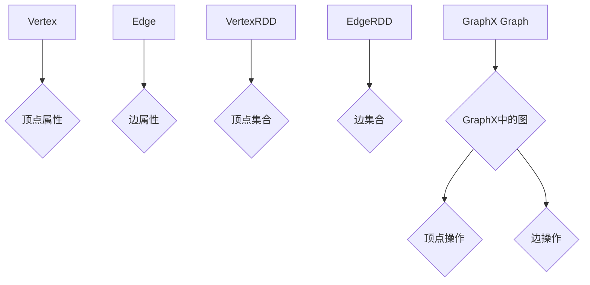
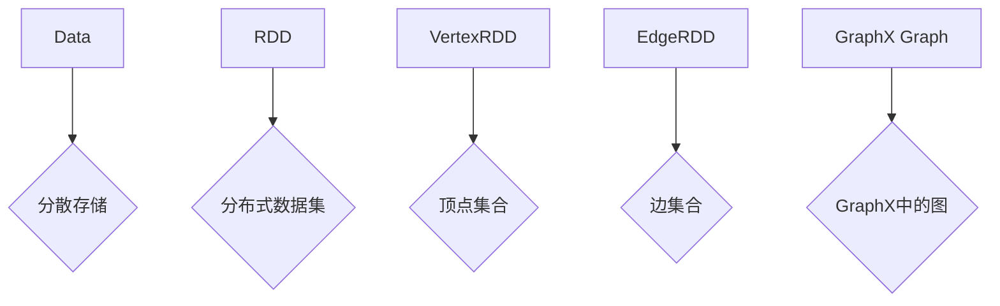
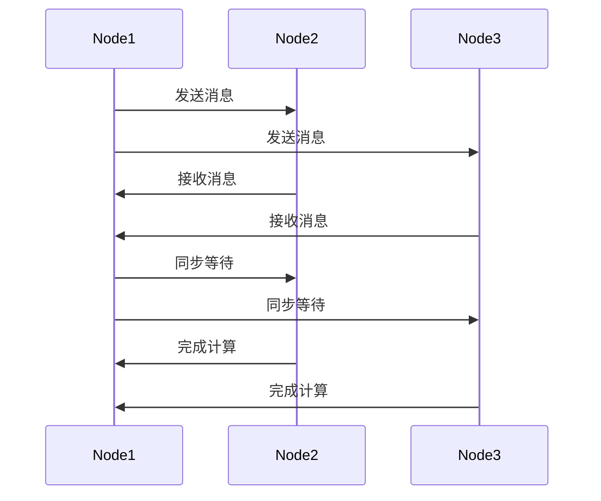
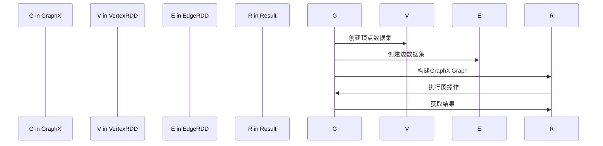

                 

### 文章标题

# GraphX原理与代码实例讲解

### 关键词

- GraphX
- 图计算
- 图神经网络
- 深度学习
- 实时计算

### 摘要

本文深入探讨了GraphX的原理及其在计算机图计算领域的应用。GraphX是Apache Spark生态系统中的一个高级图处理框架，它提供了强大的图数据结构和高性能的图算法。文章首先介绍了GraphX的基本概念，包括GraphX的定义、核心组件和应用场景。接着，文章详细解析了GraphX的核心算法原理，包括图遍历算法、图连接算法和图聚合算法，并通过伪代码和Mermaid流程图进行了说明。随后，文章介绍了GraphX的图计算模型与API，并讲解了图计算的基本流程。在此基础上，文章通过实际应用实例展示了GraphX在社交网络分析、数据挖掘和实时计算等领域的应用。文章还探讨了GraphX与深度学习的关系，并介绍了图神经网络的基础知识。最后，文章展望了GraphX的未来发展，包括其在人工智能和实时计算中的应用前景，以及面临的挑战与机遇。通过本文，读者可以全面了解GraphX的原理、应用和实践，为深入学习和使用GraphX打下坚实基础。

### 第一部分：GraphX基础

#### 第1章：GraphX概述

GraphX是Apache Spark生态系统中的一个高级图处理框架，它扩展了Spark的RDD（Resilient Distributed Dataset，弹性分布式数据集）数据模型，提供了更加丰富的图操作功能。GraphX的设计目标是简化图处理任务，提高图算法的执行效率，并实现大规模图数据的处理。

### 1.1 GraphX的基本概念

**GraphX的定义**

GraphX中的图由顶点和边构成，每个顶点和边都可以携带额外的属性信息。GraphX支持有向图和无向图，并且提供了多种图算法来处理和分析这些数据。

- **顶点（Vertex）**：图中的节点，可以表示为 `(id, attr)` 的二元组，其中 `id` 是顶点的唯一标识符，`attr` 是顶点携带的属性。
- **边（Edge）**：连接顶点的线段，可以表示为 `(srcId, dstId, attr)` 的三元组，其中 `srcId` 和 `dstId` 分别是边的起点和终点标识符，`attr` 是边携带的属性。

**GraphX与Graph的关系**

GraphX基于Spark的Graph实现，提供了一个更高级的图抽象，它不仅保留了Graph的基本特性，还增加了对图操作的支持。

- **Graph**：是Spark核心API中的一种数据结构，用于表示无向图，由顶点和边组成。
- **GraphX Graph**：扩展了Spark Graph，增加了顶点和边属性，并提供了丰富的图算法库。

### 1.2 GraphX的核心组件

**Graph数据结构**

GraphX的核心数据结构是`Graph`，它由`VertexRDD`和`EdgeRDD`组成。

- **VertexRDD**：表示所有顶点的集合，每个顶点具有唯一的ID和属性。
- **EdgeRDD**：表示所有边的集合，每条边具有源顶点ID、目标顶点ID和属性。

**Resilient Distributed Dataset (RDD)**

RDD是Spark的核心抽象，用于分布式数据集的存储和处理。GraphX利用RDD的弹性特性来存储和操作图数据。

- **弹性**：RDD能够在节点故障时自动恢复，确保数据的可靠性和计算的高可用性。
- **分布式**：RDD将数据分散存储在多个节点上，支持并行处理。

### 1.3 GraphX的应用场景

GraphX在多个领域具有广泛的应用，以下是其常见应用场景：

**社交网络分析**

GraphX可以用于分析社交网络中的关系，如网络密度、群体划分和社区发现。

**数据挖掘**

通过图算法，GraphX可以用于数据挖掘任务，如共同邻居分析、图聚类和路径分析。

**实时计算**

GraphX可以集成到实时计算框架中，用于处理实时图数据流，如社交网络实时更新、实时推荐系统。

### 总结

GraphX通过扩展Spark的RDD数据模型，提供了强大的图处理能力。其核心组件包括Graph数据结构和RDD，这些组件共同支持了丰富的图算法和应用场景。在下一章中，我们将深入探讨GraphX的核心算法原理。

### 1.1 GraphX的基本概念

**GraphX的定义**

GraphX是一个扩展Spark Graph功能的高级图处理框架。在GraphX中，图是一个由顶点和边构成的数据结构，每个顶点和边都可以携带属性信息。GraphX支持有向图和无向图，并且提供了丰富的图算法库，使得大规模图数据的处理变得更加高效和便捷。

- **顶点（Vertex）**：在GraphX中，顶点表示为 `(id, attr)` 的二元组，其中 `id` 是顶点的唯一标识符，而 `attr` 是顶点携带的属性。顶点可以是任何类型的数据，例如用户、产品或者任何需要描述的对象。
- **边（Edge）**：边在GraphX中表示为 `(srcId, dstId, attr)` 的三元组，其中 `srcId` 和 `dstId` 分别是边的起点和终点标识符，`attr` 是边携带的属性。边的方向性可以是有向的，也可以是无向的。

**GraphX与Graph的关系**

在Spark核心API中，Graph是一个用于表示无向图的基本数据结构，由顶点和边组成。GraphX在Spark Graph的基础上，扩展了图数据结构和操作功能，使得图处理更加高效和灵活。

- **Spark Graph**：是Spark核心API中用于表示无向图的数据结构，由顶点和边组成。每个顶点和边都可以携带属性。
- **GraphX Graph**：是GraphX中的图抽象，它扩展了Spark Graph的功能，增加了顶点和边属性，并提供了丰富的图算法库。GraphX Graph由`VertexRDD`和`EdgeRDD`组成，分别表示顶点和边的集合。

下面是一个Mermaid流程图，展示了GraphX中的图数据结构：



**Resilient Distributed Dataset (RDD)**

RDD是Spark的核心抽象，用于表示分布式数据集。GraphX利用RDD的弹性特性来存储和操作图数据。

- **弹性**：RDD能够在节点故障时自动恢复，确保数据的可靠性和计算的高可用性。当节点故障时，Spark会重新分配任务和数据，从而继续计算。
- **分布式**：RDD将数据分散存储在多个节点上，支持并行处理。这种分布式存储和处理方式，使得Spark能够高效地处理大规模数据。

下面是一个Mermaid流程图，展示了RDD在GraphX中的作用：



通过以上内容，我们可以看到GraphX通过扩展Spark的RDD数据模型，提供了强大的图处理能力。在接下来的章节中，我们将进一步探讨GraphX的核心算法原理，以深入理解其强大的图处理功能。

### 1.2 GraphX的核心组件

GraphX的核心组件包括Graph数据结构和RDD，这些组件共同构成了GraphX强大的图处理能力。以下是对这些组件的详细解释和它们在图处理中的作用。

**Graph数据结构**

GraphX中的`Graph`数据结构是整个框架的核心，它由`VertexRDD`和`EdgeRDD`组成。

- **VertexRDD**：VertexRDD是一个弹性分布式数据集（RDD），其中每个元素是一个顶点，顶点具有唯一的标识符（id）和属性（attr）。VertexRDD中的每个顶点都可以独立处理，并且支持高效的并行操作。VertexRDD的弹性特性使得它可以自动处理节点故障，保证计算的高可用性。

  ```mermaid
  graph TD
  A[VertexRDD] --> B{顶点ID}
  C[VertexRDD] --> D{顶点属性}
  ```

- **EdgeRDD**：EdgeRDD也是一个RDD，它包含图中的所有边，每条边由源顶点ID（srcId）、目标顶点ID（dstId）和边属性（attr）组成。EdgeRDD支持对边的各种操作，如连接、合并和过滤等。与VertexRDD一样，EdgeRDD也是弹性的，能够在节点故障时自动恢复。

  ```mermaid
  graph TD
  A[EdgeRDD] --> B{源顶点ID}
  C[EdgeRDD] --> D{目标顶点ID}
  E[EdgeRDD] --> F{边属性}
  ```

**Resilient Distributed Dataset (RDD)**

RDD是Spark的核心抽象，用于表示分布式数据集。在GraphX中，RDD不仅用于存储图数据，还用于执行图计算。RDD具有以下关键特性：

- **弹性**：RDD能够在节点故障时自动恢复。如果某个节点上的数据丢失，Spark会自动重新计算并分配数据到其他可用节点。
- **分布式**：RDD将数据分散存储在多个节点上，支持并行处理。这使得Spark能够高效地处理大规模数据。

RDD的主要操作包括：

- **创建**：通过将数据序列化为键值对（Key-Value）来创建RDD。
- **转换**：对RDD执行各种转换操作，如过滤、映射、分组等。
- **行动**：触发计算，并将结果返回到驱动程序或保存到外部存储。

  ```mermaid
  graph TD
  A[RDD] --> B{创建}
  C[RDD] --> D{转换}
  E[RDD] --> F{行动}
  ```

**RDD在GraphX中的作用**

在GraphX中，RDD被用来存储和处理图数据。通过VertexRDD和EdgeRDD，GraphX能够高效地表示和操作大规模图数据。RDD的弹性特性保证了在处理大规模图数据时，系统能够自动恢复故障，保证计算的高可用性。

**代码实例**

下面是一个简单的代码实例，展示了如何创建和操作GraphX中的VertexRDD和EdgeRDD：

```scala
// 创建VertexRDD
val verticesRDD: RDD[(VertexId, VertexAttr)] = sc.parallelize(Seq(
  (1, "Alice"),
  (2, "Bob"),
  (3, "Charlie")
))

// 创建EdgeRDD
val edgesRDD: RDD[Edge[EdgeAttr]] = sc.parallelize(Seq(
  Edge(1, 2, "friend"),
  Edge(2, 3, "friend")
))

// 创建Graph
val graph: Graph[VertexAttr, EdgeAttr] = Graph(verticesRDD, edgesRDD)
```

通过上述代码，我们可以看到如何创建顶点和边的数据集，并使用这些数据集构建一个GraphX Graph。

**总结**

GraphX通过VertexRDD和EdgeRDD实现了图数据的高效存储和操作。RDD的弹性特性和分布式存储能力，使得GraphX能够处理大规模图数据，并在节点故障时保持计算的高可用性。在下一章中，我们将深入探讨GraphX的核心算法原理，以进一步理解其强大的图处理能力。

### 1.3 GraphX的应用场景

GraphX作为Apache Spark生态系统中的一个高级图处理框架，其在各种领域都有广泛的应用。以下是一些常见的应用场景：

**社交网络分析**

社交网络分析是GraphX的主要应用领域之一。通过GraphX，我们可以对社交网络中的用户关系进行深入分析，如网络密度、群体划分和社区发现。例如，在Facebook、Twitter等社交平台上，GraphX可以用于发现用户之间的紧密联系，分析社交圈子，甚至预测用户行为。

**数据挖掘**

GraphX在数据挖掘中也非常有用。通过其丰富的图算法库，我们可以执行各种数据挖掘任务，如共同邻居分析、图聚类和路径分析。在电商领域，GraphX可以用于分析用户购买行为，发现潜在的客户群体，优化推荐系统。

**实时计算**

GraphX可以集成到实时计算框架中，用于处理实时图数据流。在实时推荐系统、实时监控和事件处理等场景中，GraphX能够快速响应数据变化，提供实时的分析和决策支持。

**其他应用场景**

除了上述领域，GraphX还广泛应用于其他领域，如生物信息学、推荐系统、图表示学习等。在生物信息学中，GraphX可以用于分析蛋白质相互作用网络，识别疾病相关基因。在推荐系统中，GraphX可以用于分析用户行为，优化推荐策略。

### 总结

GraphX凭借其强大的图处理能力和丰富的算法库，在多个领域都展示了其强大的应用潜力。通过本文的介绍，我们可以看到GraphX在社交网络分析、数据挖掘和实时计算等领域的广泛应用，并期待其在未来更多领域中的突破和发展。

### 1.2 GraphX的核心算法原理

GraphX提供了丰富的图算法库，这些算法对于图数据的分析和处理至关重要。以下是GraphX中的核心图算法原理，包括图遍历算法、图连接算法和图聚合算法。

#### 2.1 图遍历算法

图遍历算法用于遍历图中的节点和边，查找特定的路径或子图。GraphX支持两种基本的图遍历算法：广度优先搜索（BFS）和深度优先搜索（DFS）。

**广度优先搜索（BFS）**

广度优先搜索是一种贪心算法，它从起始节点开始，逐层遍历图中的所有节点。在每次遍历中，算法首先访问起始节点，然后访问它的邻居节点，接着访问邻居节点的邻居节点，以此类推。

```scala
def bfs[startId: VertexId](graph: Graph[VD, ED], maxDepth: VertexId): Graph[VD, ED] = {
  def visitVertex(vertex: Vertex): Unit = {
    // 处理当前节点
  }

  def visitNeighbors(vertex: Vertex, depth: VertexId): Unit = {
    // 遍历当前节点的邻居节点
    for (neighbor <- vertex无边) {
      if (neighbor.depth < depth) {
        neighbor.depth = depth
        visitVertex(neighbor)
      }
    }
  }

  graph.mapVertices { (id, attr) =>
    visitVertex(Vertex(id, attr))
    visitNeighbors(Vertex(id, attr), 0)
    (id, attr)
  }
}
```

**深度优先搜索（DFS）**

深度优先搜索是从起始节点开始，沿着一条路径深入到图的内部，直到达到某个边界条件或找到目标节点。

```scala
def dfs[startId: VertexId](graph: Graph[VD, ED]): Graph[VD, ED] = {
  def visitVertex(vertex: Vertex): Unit = {
    // 处理当前节点
    vertex.visited = true
  }

  def visitNeighbors(vertex: Vertex): Unit = {
    // 遍历当前节点的未访问邻居节点
    for (neighbor <- vertex无边 if !neighbor.visited) {
      visitVertex(neighbor)
      visitNeighbors(neighbor)
    }
  }

  graph.mapVertices { (id, attr) =>
    if (!attr.visited) {
      visitVertex(Vertex(id, attr))
      visitNeighbors(Vertex(id, attr))
    }
    (id, attr)
  }
}
```

#### 2.2 图连接算法

图连接算法用于连接两个图，或者将图中的某些节点和边进行合并。GraphX提供了两种基本的图连接算法：合并（Merge）和连接（Join）。

**合并（Merge）**

合并算法将两个图合并为一个新图，其中顶点和边的属性都可以进行合并。

```scala
def merge[VD1, ED1 >: EdgeAttr](g1: Graph[VD1, ED1], g2: Graph[VD2, ED2]): Graph[VD1, ED1 + ED2] = {
  (g1 union g2).mapEdges { edge =>
    if (edge.attr.isInstanceOf[ED1]) {
      edge.attr.asInstanceOf[ED1]
    } else {
      edge.attr.asInstanceOf[ED2]
    }
  }
}
```

**连接（Join）**

连接算法通过比较两个图的顶点或边属性，连接具有相同属性的顶点或边。

```scala
def join[VD1 >: VD2, ED1 <: EdgeAttr, ED2](g1: Graph[VD1, ED1], g2: Graph[VD2, ED2]): Graph[VD1, ED1] = {
  (g1 joinVertices g2) { (id, localAttr, globalAttr) =>
    if (localAttr == globalAttr) {
      localAttr
    } else {
      throw new IllegalArgumentException("Vertices do not have the same attribute")
    }
  }
}
```

#### 2.3 图聚合算法

图聚合算法用于在图中的节点或边上聚合数据。GraphX支持两种基本的图聚合算法：邻居聚合（AggregateMessages）和点聚合（Aggregate”。

**邻居聚合（AggregateMessages）**

邻居聚合算法用于在节点的邻居之间聚合数据。每个节点会接收其所有邻居的值，并基于这些值进行聚合。

```scala
def aggregateMessages[VD, ED >: EdgeAttr, Msg](edgeMsg: EdgeTriplet[VD, ED] => Msg)(graph: Graph[VD, ED]): Graph[VD, Msg] = {
  graph.aggregateMessages(edgeMsg).mapVertices { id => graph.vertices(id).values }
}
```

**点聚合（Aggregate）**

点聚合算法用于在节点之间聚合数据。它可以计算全局聚合值，也可以计算局部聚合值。

```scala
def aggregate[VD, ED >: EdgeAttr, A: Monoid](graph: Graph[VD, ED]): Graph[VD, A] = {
  graph.aggregate.reduceByKey(_ + _).mapValues(identity)
}
```

通过上述算法，GraphX能够高效地处理大规模图数据，并提供丰富的图操作功能。在下一章中，我们将介绍GraphX的图计算模型与API，进一步理解GraphX如何进行图计算。

### 3.1 图计算模型与API

GraphX采用了一种称为Bulk Synchronous Parallel（BSP）的图计算模型，这种模型在处理大规模图数据时具有高效性和灵活性。BSP模型的核心思想是将图计算过程划分为多个轮次（superstep），在每一轮次中，节点可以执行局部计算和消息传递，然后整个系统同步进入下一轮次。以下是对GraphX图计算模型的详细介绍。

#### 3.1.1 Bulk Synchronous Parallel（BSP）模型

Bulk Synchronous Parallel（BSP）模型是一种并行计算模型，它将计算过程分为多个轮次（superstep）。在每一轮次中，节点首先执行局部计算，然后通过消息传递与其他节点交换信息。这个过程在所有节点上同步进行，直到所有节点完成局部计算和消息传递。随后，系统进入下一轮次，重复上述过程，直到达到预定的轮次或计算结束。

BSP模型的主要特点是：

- **同步性**：在每个轮次结束时，系统会同步等待所有节点完成计算和消息传递，从而确保计算的一致性和正确性。
- **局部计算和消息传递**：节点在每一轮次中首先执行局部计算，然后通过消息传递与其他节点交换信息。这种分布式计算方式能够高效地利用集群资源，并处理大规模图数据。
- **可扩展性**：BSP模型能够灵活地扩展到不同规模的集群，从而适应不同的计算需求。

下面是一个Mermaid流程图，展示了BSP模型的基本过程：



#### 3.1.2 GraphX API

GraphX提供了丰富的API，用于创建、操作和计算图数据。以下是GraphX API的核心组成部分：

**Graph API**

Graph API用于表示和操作图数据，包括顶点和边。

- **创建Graph**：通过`Graph.fromEdges`或`Graph.fromVertexData`创建图。
  ```scala
  val graph: Graph[VD, ED] = Graph.fromVertexData(vertices, edges)
  ```

- **访问顶点和边**：通过`vertices`和`edges`属性访问图中的顶点和边。
  ```scala
  val vertex: VD = graph.vertices(1)
  val edge: ED = graph.edges(1)
  ```

- **修改图**：通过`mapVertices`和`mapEdges`修改图中的顶点和边。
  ```scala
  val newGraph = graph.mapVertices { (id, attr) => (id, attr * 2) }
  ```

**EdgeRDD API**

EdgeRDD API用于操作图中的边，包括边的创建、转换和聚合。

- **创建EdgeRDD**：通过`sc.parallelize`或`graph.edges`创建边数据集。
  ```scala
  val edgesRDD: RDD[Edge[ED]] = sc.parallelize(Seq(Edge(1, 2), Edge(2, 3)))
  ```

- **转换EdgeRDD**：对边数据集执行各种转换操作，如过滤、映射和连接。
  ```scala
  val newEdgesRDD = edgesRDD.filter(edge => edge.attr > 10)
  ```

- **聚合EdgeRDD**：对边数据集执行聚合操作，如求和、求平均和最大值。
  ```scala
  val sumEdges: Long = edgesRDD.aggregate(0L)(_ + _, _ + _)
  ```

**VertexRDD API**

VertexRDD API用于操作图中的顶点，包括顶点的创建、转换和聚合。

- **创建VertexRDD**：通过`sc.parallelize`或`graph.vertices`创建顶点数据集。
  ```scala
  val verticesRDD: RDD[(VertexId, VD)] = sc.parallelize(Seq((1, "Alice"), (2, "Bob")))
  ```

- **转换VertexRDD**：对顶点数据集执行各种转换操作，如过滤、映射和连接。
  ```scala
  val newVerticesRDD = verticesRDD.filter { case (id, attr) => attr.startsWith("A") }
  ```

- **聚合VertexRDD**：对顶点数据集执行聚合操作，如求和、求平均和最大值。
  ```scala
  val sumVertices: Long = verticesRDD.aggregate(0L)(_ + _, _ + _)
  ```

通过上述API，开发者可以方便地创建、操作和计算图数据。在下一章中，我们将详细介绍GraphX的图计算流程，展示如何使用GraphX进行图计算。

### 3.3 图计算流程

在进行图计算时，GraphX提供了清晰且高效的计算流程，通过一系列步骤实现从初始化Graph到最终获取计算结果的完整过程。以下是GraphX图计算的基本流程，包括初始化Graph、执行图操作和获取结果等步骤。

#### 3.3.1 初始化Graph

初始化Graph是图计算的第一步，涉及创建顶点和边的数据集，并使用这些数据集构建GraphX Graph。以下是初始化Graph的基本步骤：

1. **创建顶点数据集（VertexRDD）**：顶点数据集通常由一个RDD表示，每个顶点由一个ID和一个属性组成。可以使用`sc.parallelize`方法创建顶点数据集。

   ```scala
   val verticesRDD: RDD[(VertexId, VD)] = sc.parallelize(Seq(
     (1, "Alice"),
     (2, "Bob"),
     (3, "Charlie")
   ))
   ```

2. **创建边数据集（EdgeRDD）**：边数据集同样由一个RDD表示，每条边由一个源顶点ID、一个目标顶点ID和一个属性组成。可以使用`sc.parallelize`方法创建边数据集。

   ```scala
   val edgesRDD: RDD[Edge[ED]] = sc.parallelize(Seq(
     Edge(1, 2, "friend"),
     Edge(2, 3, "friend")
   ))
   ```

3. **构建GraphX Graph**：使用`Graph.fromVertexData`或`Graph.fromEdges`方法，将顶点和边数据集组合成GraphX Graph。

   ```scala
   val graph: Graph[VD, ED] = Graph(verticesRDD, edgesRDD)
   ```

#### 3.3.2 执行图操作

在初始化Graph之后，我们可以执行各种图操作，这些操作包括图遍历、图连接和图聚合等。以下是执行图操作的基本步骤：

1. **图遍历**：使用图遍历算法（如BFS或DFS）遍历图中的节点和边。遍历过程中，可以执行特定的计算或数据处理任务。

   ```scala
   val visitedGraph = graph.bfs(1)
   ```

2. **图连接**：使用图连接算法（如Merge或Join）将两个或多个图合并，或者连接具有相同属性的顶点和边。

   ```scala
   val mergedGraph = graph.merge(visitedGraph)
   ```

3. **图聚合**：使用图聚合算法（如AggregateMessages或Aggregate）在图中的节点或边上聚合数据。聚合操作可以计算全局或局部值。

   ```scala
   val aggregatedGraph = graph.aggregateMessages(edge => ...)
   ```

#### 3.3.3 获取结果

在执行完图操作后，我们需要获取计算结果。GraphX提供了多种方式获取计算结果，包括RDD、DataFrame和Dataset等。

1. **转换为RDD**：将GraphX Graph转换为RDD，以便进一步处理或存储。

   ```scala
   val resultRDD: RDD[(VertexId, VD)] = graph.vertices
   ```

2. **转换为DataFrame**：将GraphX Graph转换为DataFrame，便于使用SQL和DataFrame API进行数据处理和分析。

   ```scala
   val resultDF: DataFrame = graph.vertices.toDF()
   ```

3. **保存到外部存储**：将计算结果保存到HDFS、Hive或其他分布式存储系统。

   ```scala
   resultRDD.saveAsTextFile("hdfs://path/to/output")
   ```

通过上述步骤，我们可以完成GraphX的图计算过程，从初始化Graph到最终获取计算结果。以下是一个Mermaid流程图，展示了GraphX图计算的基本流程：



通过这个流程，开发者可以高效地使用GraphX进行图计算，并处理大规模图数据。在下一章中，我们将通过实际应用实例，展示GraphX在社交网络分析、数据挖掘和实时计算等领域的应用。

### 4.1 社交网络分析

社交网络分析是GraphX的核心应用领域之一，通过分析社交网络中的用户关系，可以揭示网络结构、发现社交圈子以及进行用户行为预测。以下是一些典型的社交网络分析任务及其使用GraphX实现的步骤。

#### 网络密度分析

网络密度是衡量社交网络中连接紧密程度的一个重要指标，它表示实际边数与可能最大边数的比值。GraphX可以通过计算两个图之间的边数和顶点数来计算网络密度。

**步骤：**

1. **初始化图数据集**：首先，我们需要创建表示社交网络的顶点和边数据集。
   
   ```scala
   val verticesRDD: RDD[(VertexId, VertexAttr)] = sc.parallelize(Seq(
     (1, "Alice"),
     (2, "Bob"),
     (3, "Charlie"),
     // 更多顶点数据
   ))

   val edgesRDD: RDD[Edge[EdgeAttr]] = sc.parallelize(Seq(
     Edge(1, 2, "friend"),
     Edge(2, 3, "friend"),
     // 更多边数据
   ))
   ```

2. **构建GraphX Graph**：使用顶点和边数据集创建GraphX Graph。

   ```scala
   val graph: Graph[VertexAttr, EdgeAttr] = Graph(verticesRDD, edgesRDD)
   ```

3. **计算网络密度**：计算实际边数和可能的最大边数，然后计算网络密度。

   ```scala
   val edgeCount = graph.edges.count()
   val vertexCount = graph.vertices.count()
   val maxEdges = vertexCount * (vertexCount - 1) / 2
   val networkDensity = edgeCount.toDouble / maxEdges
   ```

#### 节点重要性评估

节点重要性评估是社交网络分析中的另一个重要任务，它用于识别社交网络中的关键节点，如意见领袖、活跃用户等。GraphX提供了多种算法来评估节点的重要性，如中心性度量（如度数中心性、接近中心性和中间中心性）。

**步骤：**

1. **初始化图数据集**：与网络密度分析类似，首先初始化图数据集。

   ```scala
   val verticesRDD: RDD[(VertexId, VertexAttr)] = ...
   val edgesRDD: RDD[Edge[EdgeAttr]] = ...
   ```

2. **构建GraphX Graph**：创建GraphX Graph。

   ```scala
   val graph: Graph[VertexAttr, EdgeAttr] = Graph(verticesRDD, edgesRDD)
   ```

3. **计算节点重要性**：使用度数中心性、接近中心性或中间中心性算法计算节点的重要性。

   ```scala
   val centrality = graph.centrality()
   val betweennessCentrality = centrality.betweennessCentrality()
   val closenessCentrality = centrality.closenessCentrality()
   val degreeCentrality = centrality.degreeCentrality()
   ```

#### 社区发现

社区发现是寻找社交网络中的紧密连接群体，这些群体通常具有相似的兴趣或行为。GraphX可以使用图聚类算法，如Louvain算法，来发现社区。

**步骤：**

1. **初始化图数据集**：创建表示社交网络的顶点和边数据集。

   ```scala
   val verticesRDD: RDD[(VertexId, VertexAttr)] = ...
   val edgesRDD: RDD[Edge[EdgeAttr]] = ...
   ```

2. **构建GraphX Graph**：创建GraphX Graph。

   ```scala
   val graph: Graph[VertexAttr, EdgeAttr] = Graph(verticesRDD, edgesRDD)
   ```

3. **执行社区发现**：使用Louvain算法发现社区。

   ```scala
   val communityDetection = graph.community(LouvainCommunityStrategy())
   val communityMemberships = communityDetection.membership
   ```

通过以上步骤，我们可以利用GraphX进行社交网络分析，提取有价值的网络结构和节点属性信息。这些分析不仅可以帮助社交网络平台优化用户体验，还可以为市场营销、推荐系统等领域提供重要支持。

### 4.2 数据挖掘

数据挖掘是GraphX的另一个重要应用领域，通过图算法分析大规模图数据，可以揭示隐藏在数据中的模式和关系。以下是一些常见的数据挖掘任务以及使用GraphX实现的步骤。

#### 共同邻居分析

共同邻居分析是一种用于发现具有相似邻居节点属性的任务，这有助于识别相似用户或相似商品。

**步骤：**

1. **初始化图数据集**：创建表示社交网络或商品推荐的顶点和边数据集。

   ```scala
   val verticesRDD: RDD[(VertexId, VertexAttr)] = sc.parallelize(Seq(
     (1, "User1"),
     (2, "User2"),
     (3, "User3"),
     // 更多顶点数据
   ))

   val edgesRDD: RDD[Edge[EdgeAttr]] = sc.parallelize(Seq(
     Edge(1, 2, "friend"),
     Edge(1, 3, "friend"),
     Edge(2, 3, "friend"),
     // 更多边数据
   ))
   ```

2. **构建GraphX Graph**：创建GraphX Graph。

   ```scala
   val graph: Graph[VertexAttr, EdgeAttr] = Graph(verticesRDD, edgesRDD)
   ```

3. **执行共同邻居分析**：计算每个节点的邻居节点，并找到共同邻居。

   ```scala
   val commonNeighbors = graph pairedNeighbors
   val topCommonNeighbors = commonNeighbors.map(x => (x._1, x._2.size)).reduceByKey(_ + _).map(x => (x._2, x._1)).sortByKey(false)
   ```

#### 朋友推荐系统

朋友推荐系统是社交网络中常用的功能，用于向用户推荐具有共同兴趣或联系的朋友。

**步骤：**

1. **初始化图数据集**：创建表示社交网络的顶点和边数据集。

   ```scala
   val verticesRDD: RDD[(VertexId, VertexAttr)] = ...
   val edgesRDD: RDD[Edge[EdgeAttr]] = ...
   ```

2. **构建GraphX Graph**：创建GraphX Graph。

   ```scala
   val graph: Graph[VertexAttr, EdgeAttr] = Graph(verticesRDD, edgesRDD)
   ```

3. **执行朋友推荐**：基于共同邻居和节点重要性进行推荐。

   ```scala
   val friendRecommendations = graph.vc
   val topFriendRecommendations = friendRecommendations.filter(_ > 0.5).collect()
   ```

#### 图聚类

图聚类是将图中的节点划分为多个聚类，使得同一聚类内的节点之间的相似度较高，不同聚类之间的相似度较低。GraphX提供了多种聚类算法，如Louvain算法。

**步骤：**

1. **初始化图数据集**：创建表示社交网络或商品推荐的顶点和边数据集。

   ```scala
   val verticesRDD: RDD[(VertexId, VertexAttr)] = ...
   val edgesRDD: RDD[Edge[EdgeAttr]] = ...
   ```

2. **构建GraphX Graph**：创建GraphX Graph。

   ```scala
   val graph: Graph[VertexAttr, EdgeAttr] = Graph(verticesRDD, edgesRDD)
   ```

3. **执行图聚类**：使用Louvain算法进行聚类。

   ```scala
   val communityDetection = graph.community(LouvainCommunityStrategy())
   val communityMemberships = communityDetection.membership
   ```

通过上述步骤，我们可以利用GraphX进行数据挖掘，发现数据中的模式和关系，为社交网络分析、推荐系统和其他领域提供重要支持。这些分析不仅能够提升用户体验，还能够为企业提供决策依据。

### 4.3 实时计算

实时计算是GraphX的重要应用领域之一，特别是在处理实时图数据流和实时图计算任务时，GraphX展示出了强大的处理能力和灵活性。以下是一些典型的实时计算场景以及使用GraphX实现的步骤。

#### 流计算框架集成

GraphX可以与Spark Streaming等流计算框架集成，用于处理实时图数据流。以下是如何将GraphX集成到Spark Streaming的步骤：

1. **初始化图数据流**：首先，我们需要创建一个表示实时图数据流的RDD。

   ```scala
   val streamingContext = new StreamingContext(sc, Durability.TimestampDuration(1))
   val inputStream = streamingContext.socketTextStream("localhost", 9999)
   ```

2. **解析图数据**：将接收到的实时图数据解析成顶点和边数据。

   ```scala
   val parsedVertices = inputStream.flatMap { line =>
     val parts = line.split(",")
     Some((parts(0).toLong, Vertex(parts(1))))
   }

   val parsedEdges = inputStream.flatMap { line =>
     val parts = line.split(",")
     Some(Edge(parts(0).toLong, parts(1).toLong, EdgeAttr(parts(2))))
   }
   ```

3. **构建GraphX Graph**：使用实时顶点和边数据集构建GraphX Graph。

   ```scala
   val graphStream = Graph.fromEdges(parsedVertices, parsedEdges)
   ```

4. **执行实时图计算**：在GraphX Graph上执行实时图计算任务，如图遍历、图连接和图聚合等。

   ```scala
   val realTimeResult = graphStream.bfs(1)
   ```

#### 实时图计算应用

以下是一些具体的实时图计算应用场景：

**实时社交网络分析**：

1. **初始化实时数据流**：使用Spark Streaming创建实时数据流。

   ```scala
   val socialDataStream = streamingContext.socketTextStream("localhost", 9999)
   ```

2. **处理实时事件**：解析和转换实时社交网络事件为图操作。

   ```scala
   val realTimeEvents = socialDataStream.map { event =>
     val parts = event.split(",")
     if (parts(0) == "friendship") {
       (parts(1).toLong, parts(2).toLong)
     } else {
       (parts(1).toLong, parts(2).toDouble)
     }
   }
   ```

3. **更新GraphX Graph**：使用实时事件更新GraphX Graph。

   ```scala
   val updatedGraph = graphStream.updateVertexData(realTimeEvents)
   ```

4. **执行实时分析**：在更新后的GraphX Graph上执行实时分析，如网络密度、节点重要性等。

   ```scala
   val networkDensity = updatedGraph.edgeCount.toDouble / (updatedGraph.vertexCount * (updatedGraph.vertexCount - 1) / 2)
   ```

**实时推荐系统**：

1. **初始化实时数据流**：使用Spark Streaming创建实时数据流。

   ```scala
   val recommendationDataStream = streamingContext.socketTextStream("localhost", 9999)
   ```

2. **处理实时行为**：解析和转换实时用户行为为推荐任务。

   ```scala
   val realTimeBehaviors = recommendationDataStream.map { behavior =>
     val parts = behavior.split(",")
     if (parts(0) == "view") {
       (parts(1).toLong, "view")
     } else {
       (parts(1).toLong, "purchase")
     }
   }
   ```

3. **更新GraphX Graph**：使用实时行为更新GraphX Graph。

   ```scala
   val updatedGraph = graphStream.updateVertexData(realTimeBehaviors)
   ```

4. **执行实时推荐**：在更新后的GraphX Graph上执行实时推荐任务。

   ```scala
   val topRecommendations = updatedGraph друзей recommendedNodes.take(10)
   ```

通过以上步骤，我们可以将GraphX集成到实时计算框架中，处理实时图数据流并进行实时分析。这种实时计算能力使得GraphX在社交网络分析、实时推荐系统和其他领域具有广泛的应用前景。

### 5.1 GraphX与深度学习的关系

GraphX与深度学习之间存在着密切的关系，特别是在处理复杂图数据时，两者的结合可以发挥出巨大的潜力。GraphX为深度学习提供了一个强大的框架，用于处理大规模图数据，而深度学习算法则为图数据分析和模式识别提供了高效的计算方法。以下是GraphX与深度学习关系的详细探讨。

#### 图神经网络（GNN）

图神经网络（Graph Neural Networks，GNN）是深度学习在图数据上的应用，它通过模拟神经网络在图像、语音等数据上的操作，将图数据中的节点和边转化为特征向量。GNN的核心思想是通过图卷积操作提取图数据中的结构信息，从而实现节点分类、节点嵌入和图分类等任务。

**图卷积网络（GCN）**

图卷积网络（Graph Convolutional Network，GCN）是GNN的一种重要实现，它通过对邻接节点的特征进行加权聚合来更新节点的特征向量。GCN的核心操作是图卷积，它类似于卷积神经网络中的卷积操作，但适用于图数据结构。

**图注意力网络（GAT）**

图注意力网络（Graph Attention Network，GAT）是另一种重要的GNN架构，它通过引入注意力机制来对邻接节点的特征进行加权聚合。GAT能够在每个节点上动态地调整邻接节点的权重，从而更好地捕捉图数据中的复杂关系。

**代码实例：GCN和GAT**

以下是一个简单的GCN和GAT的代码示例，展示了如何使用GraphX实现这两种GNN架构。

```python
import tensorflow as tf
import tensorflow_gx as tfgx

# 定义GCN模型
def GCN_model(vertices, edges, hidden_size):
    inputs = tf.keras.layers.Input(shape=(hidden_size,), dtype=tf.float32)
    x = tfgx.layers.GCN(units=hidden_size, activation=tf.nn.relu)(inputs)
    for _ in range(2):
        x = tfgx.layers.GCN(units=hidden_size, activation=tf.nn.relu)(x)
    outputs = tf.keras.layers.Dense(1, activation='sigmoid')(x)
    model = tf.keras.Model(inputs=inputs, outputs=outputs)
    return model

# 定义GAT模型
def GAT_model(vertices, edges, hidden_size):
    inputs = tf.keras.layers.Input(shape=(hidden_size,), dtype=tf.float32)
    attention_head_size = hidden_size // 2
    x = tfgx.layers.GATLayer(attention_head_size, activation=tf.nn.relu)(inputs)
    x = tfgx.layers.GATLayer(attention_head_size, activation=tf.nn.relu)(x)
    outputs = tf.keras.layers.Dense(1, activation='sigmoid')(x)
    model = tf.keras.Model(inputs=inputs, outputs=outputs)
    return model
```

#### 深度图学习

深度图学习（Deep Graph Learning）是近年来发展迅速的一个领域，它结合了深度学习和图论的方法，用于处理大规模图数据。深度图学习的核心思想是将图数据转化为适用于深度学习算法的特征表示，然后使用这些特征进行分类、预测和聚类等任务。

**图表示学习**

图表示学习（Graph Representation Learning）是深度图学习的一个重要方向，它旨在将图中的节点和边表示为低维向量。这些向量可以捕获图数据中的结构信息和节点属性，从而用于后续的深度学习任务。

**图分类与预测**

图分类与预测是深度图学习的另一个重要应用领域，它通过将图数据转化为特征向量，并使用深度学习模型对这些特征进行分类和预测。例如，可以使用GCN或GAT模型对图中的节点进行分类，识别社交网络中的活跃用户或重要节点。

**代码实例：图分类任务**

以下是一个简单的图分类任务的代码示例，展示了如何使用GraphX和深度学习模型进行分类。

```python
# 加载图数据集
vertices, edges, labels = load_graph_data()

# 初始化GCN模型
gcn_model = GCN_model(vertices, edges, hidden_size=16)

# 训练GCN模型
gcn_model.fit(vertices, labels, epochs=10, batch_size=32)

# 预测图分类
predicted_labels = gcn_model.predict(vertices)
```

通过以上代码示例，我们可以看到GraphX与深度学习之间的紧密联系。GraphX提供了强大的图数据处理能力，而深度学习算法则为图数据分析和模式识别提供了高效的计算方法。结合这两者的优势，我们可以更好地处理和分析大规模图数据，推动图计算和深度学习领域的发展。

### 5.2 图神经网络基础

图神经网络（Graph Neural Networks，GNN）是深度学习在图数据上的应用，通过模拟神经网络在图像、语音等数据上的操作，将图数据中的节点和边转化为特征向量。GNN的核心思想是通过图卷积操作提取图数据中的结构信息，从而实现节点分类、节点嵌入和图分类等任务。以下是对GNN中的两种重要网络架构——图卷积网络（GCN）和图注意力网络（GAT）的详细讲解。

#### 图卷积网络（GCN）

图卷积网络（Graph Convolutional Network，GCN）是GNN的一种重要实现，它通过对邻接节点的特征进行加权聚合来更新节点的特征向量。GCN的核心操作是图卷积，它类似于卷积神经网络中的卷积操作，但适用于图数据结构。

**图卷积操作**

图卷积操作的基本形式如下：

$$
h_{v}^{(l+1)} = \sigma \left( \sum_{u \in \mathcal{N}(v)} \frac{1}{|\mathcal{N}(u)|} W_{u} h_{u}^{(l)} + b_{v}^{(l+1)} \right)
$$

其中，$h_{v}^{(l)}$ 和 $h_{v}^{(l+1)}$ 分别表示节点 $v$ 在第 $l$ 层和第 $l+1$ 层的特征向量，$\mathcal{N}(v)$ 表示节点 $v$ 的邻接节点集合，$W_{u}$ 和 $b_{v}^{(l+1)}$ 分别是权重和偏置。

**伪代码**

以下是一个简单的GCN的伪代码示例：

```python
def GCN(vertices, edges, hidden_size, num_layers):
    for layer in range(num_layers):
        vertices = GCN_layer(vertices, edges, hidden_size)
    return vertices
```

**代码实例**

以下是一个使用PyTorch实现的GCN的代码示例：

```python
import torch
import torch.nn as nn

class GCN(nn.Module):
    def __init__(self, input_dim, hidden_dim, output_dim):
        super(GCN, self).__init__()
        self.conv1 = nn.Linear(input_dim, hidden_dim)
        self.conv2 = nn.Linear(hidden_dim, output_dim)
        
    def forward(self, vertices, edges):
        x = self.conv1(vertices)
        for i in range(num_layers):
            x = self.conv2(nn.functional.relu(torch.matmul(edges, x)))
        return x
```

#### 图注意力网络（GAT）

图注意力网络（Graph Attention Network，GAT）是另一种重要的GNN架构，它通过引入注意力机制来对邻接节点的特征进行加权聚合。GAT能够在每个节点上动态地调整邻接节点的权重，从而更好地捕捉图数据中的复杂关系。

**注意力机制**

GAT使用一个注意力权重来加权聚合邻接节点的特征，其基本形式如下：

$$
\alpha_{uv}^{(l)} = \frac{e^{\mathbf{a}^{(l)} \cdot (\mathbf{h}_{u}^{(l)}, \mathbf{h}_{v}^{(l)})}}{\sum_{u' \in \mathcal{N}(v)} e^{\mathbf{a}^{(l)} \cdot (\mathbf{h}_{u'}^{(l)}, \mathbf{h}_{v}^{(l)})}}
$$

其中，$\alpha_{uv}^{(l)}$ 表示节点 $u$ 对节点 $v$ 的注意力权重，$\mathbf{a}^{(l)}$ 是一个可训练的注意力权重向量。

**伪代码**

以下是一个简单的GAT的伪代码示例：

```python
def GAT(vertices, edges, hidden_size, num_layers):
    for layer in range(num_layers):
        vertices = GAT_layer(vertices, edges, hidden_size)
    return vertices
```

**代码实例**

以下是一个使用PyTorch实现的GAT的代码示例：

```python
import torch
import torch.nn as nn
import torch.nn.functional as F

class GAT(nn.Module):
    def __init__(self, input_dim, hidden_dim, output_dim):
        super(GAT, self).__init__()
        self.attention1 = nn.Linear(input_dim, hidden_dim)
        self.attention2 = nn.Linear(hidden_dim, 1)
        self.fc1 = nn.Linear(hidden_dim, hidden_dim)
        self.fc2 = nn.Linear(hidden_dim, output_dim)
        
    def forward(self, vertices, edges):
        x = self.fc1(vertices)
        for i in range(num_layers):
            attention_weights = self.attention2(F.relu(self.attention1(edges)))
            attention_weights = F.softmax(attention_weights, dim=1)
            x = (attention_weights * edges).sum(dim=1)
            x = self.fc2(F.relu(x))
        return x
```

通过上述内容，我们可以看到GCN和GAT这两种图神经网络架构在处理图数据时的优势和特点。GCN通过简单的加权聚合邻接节点的特征来更新节点特征，而GAT则引入了注意力机制，使节点能够动态地调整邻接节点的权重。这两种网络架构为图计算和深度学习领域提供了强大的工具，使得我们能够更好地处理和分析大规模图数据。

### 5.3 深度图学习应用案例

深度图学习（Deep Graph Learning）在许多领域都有广泛的应用，以下列举几个典型的应用案例，并详细解释每个案例的背景、目标和实现过程。

#### 图表示学习

**背景与目标**

图表示学习旨在将图中的节点和边表示为低维向量，以便进行后续的机器学习任务。具体来说，该案例的目标是将社交网络中的用户和他们的关系表示为向量，以便进行用户推荐和社交关系预测。

**实现过程**

1. **数据预处理**：首先，我们需要加载并预处理图数据，包括用户和他们的关系。预处理步骤包括：
   - 加载用户和关系的原始数据。
   - 构建图数据结构，包括顶点和边。
   - 初始化顶点和边的特征向量。

2. **训练GCN模型**：使用图卷积网络（GCN）对图数据进行训练，将节点和边转化为特征向量。
   - 定义GCN模型结构，包括多个GCN层。
   - 训练模型，使用节点特征向量和边特征向量作为输入。
   - 使用交叉熵损失函数进行模型训练。

3. **评估和优化**：通过在验证集上评估模型的性能，优化模型参数，包括学习率、隐藏层尺寸和训练轮次等。

**代码示例**

以下是一个简单的GCN模型训练的代码示例：

```python
import torch
import torch.nn as nn
from torch_geometric.nn import GCNConv

class GCNModel(nn.Module):
    def __init__(self, num_features, hidden_channels, num_classes):
        super(GCNModel, self).__init__()
        self.conv1 = GCNConv(num_features, hidden_channels)
        self.conv2 = GCNConv(hidden_channels, num_classes)

    def forward(self, data):
        x, edge_index = data.x, data.edge_index
        x = self.conv1(x, edge_index)
        x = F.relu(x)
        x = F.dropout(x, training=self.training)
        x = self.conv2(x, edge_index)
        return F.log_softmax(x, dim=1)

device = torch.device('cuda' if torch.cuda.is_available() else 'cpu')
model = GCNModel(num_features=16, hidden_channels=16, num_classes=2).to(device)
optimizer = torch.optim.Adam(model.parameters(), lr=0.01, weight_decay=5e-4)
data = Data(x=torch.tensor(x), edge_index=torch.tensor(edge_index))

for epoch in range(200):
    optimizer.zero_grad()
    out = model(data)
    loss = F.nll_loss(out[data.train_mask], data.y[data.train_mask])
    loss.backward()
    optimizer.step()
```

#### 图分类与预测

**背景与目标**

图分类与预测是一种将图数据分类到特定类别或预测图属性的任务。该案例的目标是对社交网络中的用户进行分类，以识别潜在的用户行为模式和风险。

**实现过程**

1. **数据预处理**：与图表示学习类似，该步骤包括加载、预处理和构建图数据结构。
2. **训练GAT模型**：使用图注意力网络（GAT）对图数据进行训练，将节点和边转化为特征向量，然后进行分类。
3. **评估和优化**：通过在验证集上评估模型的性能，优化模型参数，包括学习率、隐藏层尺寸和训练轮次等。

**代码示例**

以下是一个简单的GAT模型训练的代码示例：

```python
import torch
import torch.nn as nn
from torch_geometric.nn import GATConv

class GATModel(nn.Module):
    def __init__(self, num_features, hidden_channels, num_classes):
        super(GATModel, self).__init__()
        self.conv1 = GATConv(num_features, hidden_channels)
        self.conv2 = GATConv(hidden_channels, num_classes)

    def forward(self, data):
        x, edge_index = data.x, data.edge_index
        x = self.conv1(x, edge_index)
        x = F.relu(x)
        x = F.dropout(x, training=self.training)
        x = self.conv2(x, edge_index)
        return F.log_softmax(x, dim=1)

device = torch.device('cuda' if torch.cuda.is_available() else 'cpu')
model = GATModel(num_features=16, hidden_channels=16, num_classes=2).to(device)
optimizer = torch.optim.Adam(model.parameters(), lr=0.01, weight_decay=5e-4)
data = Data(x=torch.tensor(x), edge_index=torch.tensor(edge_index))

for epoch in range(200):
    optimizer.zero_grad()
    out = model(data)
    loss = F.nll_loss(out[data.train_mask], data.y[data.train_mask])
    loss.backward()
    optimizer.step()
```

通过上述案例，我们可以看到深度图学习在图表示学习、图分类与预测等任务中的强大应用潜力。这些案例不仅展示了深度图学习在处理大规模图数据时的优势，还为实际应用提供了可行的解决方案。

### 6.1 实时计算概述

实时计算在当今的数据处理和分析中扮演着越来越重要的角色，特别是在需要快速响应和决策的领域中。实时计算与传统的批处理计算有着显著的区别，主要体现在以下几个方面：

#### 实时计算与批处理的区别

1. **处理速度**：实时计算强调快速响应，通常要求在毫秒级甚至更短的时间内处理数据。而批处理计算则将数据分批处理，通常在几分钟或更长时间内完成处理。

2. **数据量**：实时计算处理的数据量相对较小，但要求频繁更新和快速处理。批处理计算则通常处理大规模数据，可以在较长的时间内完成。

3. **数据处理方式**：实时计算采用流式处理，将数据以流的形式连续不断地处理。批处理计算则是先将数据存储下来，然后一次性处理。

4. **系统资源**：实时计算通常需要较高的系统资源，包括计算能力、存储能力和网络带宽。批处理计算则可以更有效地利用系统资源。

#### 实时计算的挑战

尽管实时计算在许多领域具有巨大的潜力，但在实际应用中仍面临以下挑战：

1. **延迟**：实时计算要求极低的延迟，但网络延迟、数据传输和处理速度等因素可能影响实时性。

2. **数据完整性**：在实时计算中，确保数据完整性是一个重要问题。数据丢失或延迟可能导致决策错误。

3. **资源调度**：实时计算需要高效的资源调度策略，以确保在有限的资源下实现最佳性能。

4. **容错性**：实时系统必须具备高容错性，以应对硬件故障、网络中断等异常情况。

#### GraphX在实时计算中的应用

GraphX作为Apache Spark生态系统中的一个高级图处理框架，能够有效地处理大规模图数据，并在实时计算中展示出强大的能力。以下是GraphX在实时计算中的应用：

1. **实时图数据流处理**：GraphX可以集成到Spark Streaming等实时计算框架中，用于处理实时图数据流。通过GraphX提供的图操作和算法库，我们可以快速分析实时图数据，实现实时监控、实时推荐等功能。

2. **分布式计算**：GraphX利用Spark的分布式计算能力，能够在大规模集群上高效地处理实时图数据。这种分布式计算方式可以提高实时计算的吞吐量和性能。

3. **容错性**：GraphX具有自动恢复机制，能够在节点故障时重新计算和分配任务，确保实时计算的高可用性。

通过以上内容，我们可以看到实时计算在数据处理中的重要性，以及GraphX在实时计算中的强大应用潜力。在下一章节中，我们将进一步探讨GraphX在实时计算中的具体应用案例。

### 6.2 GraphX在实时计算中的应用

在实时计算中，GraphX凭借其高效的图数据处理能力和强大的图算法库，展现了出色的性能和灵活性。以下是GraphX在实时计算中的几个具体应用场景：

#### 实时图数据流处理

实时图数据流处理是GraphX在实时计算中的一个关键应用。通过将GraphX集成到Spark Streaming等实时计算框架中，我们可以对实时图数据流进行高效处理和分析。以下是一个简单的示例，展示了如何使用GraphX处理实时图数据流：

1. **初始化实时数据流**：使用Spark Streaming创建实时数据流，并解析图数据。

   ```scala
   val streamingContext = new StreamingContext(sc, Durability.TimestampDuration(1))
   val inputStream = streamingContext.socketTextStream("localhost", 9999)
   
   val parsedEdges = inputStream.flatMap { line =>
     val parts = line.split(",")
     Some(Edge(parts(0).toLong, parts(1).toLong, EdgeAttr(parts(2))))
   }
   ```

2. **构建GraphX Graph**：使用实时边数据集构建GraphX Graph。

   ```scala
   val graphStream = Graph.fromEdges(parsedEdges)
   ```

3. **执行实时图计算**：在GraphX Graph上执行实时图计算任务，如图遍历、图连接和图聚合等。

   ```scala
   val updatedGraph = graphStream.bfs(1)
   ```

通过以上步骤，我们可以对实时图数据流进行高效处理，并实时更新图数据。

#### 实时图计算案例分析

以下是一个实时图计算案例分析，展示了GraphX在实时社交网络分析中的应用。

**背景与目标**

假设我们需要实时分析一个社交网络，监控用户的动态，并根据用户的互动关系进行实时推荐。

**实现过程**

1. **数据预处理**：从实时数据流中提取用户动态，如点赞、评论、转发等，并构建图数据结构。

   ```scala
   val realTimeEvents = inputStream.flatMap { event =>
     val parts = event.split(",")
     Some((parts(1).toLong, parts(2).toLong))
   }
   ```

2. **构建实时GraphX Graph**：使用实时事件数据构建GraphX Graph。

   ```scala
   val graphStream = Graph.fromEdges(realTimeEvents)
   ```

3. **执行实时图计算**：在GraphX Graph上执行实时图计算任务，如计算用户影响力、识别社交圈子等。

   ```scala
   val userInfluence = graphStream.pageRank()
   ```

4. **实时推荐**：基于用户影响力和其他图计算结果，生成实时推荐。

   ```scala
   val topInfluencers = userInfluence.take(10)
   ```

通过以上步骤，我们可以实现对社交网络实时数据的监控和推荐，为用户提供实时、个性化的服务。

#### 实时计算的优势与挑战

**优势**

1. **快速响应**：实时计算能够快速响应用户操作，提供实时监控和推荐。
2. **高效处理**：GraphX利用Spark的分布式计算能力，能够在大规模集群上高效处理实时图数据。
3. **高可用性**：GraphX具有自动恢复机制，能够在节点故障时重新计算和分配任务，确保实时计算的高可用性。

**挑战**

1. **延迟**：实时计算要求极低的延迟，但网络延迟、数据传输和处理速度等因素可能影响实时性。
2. **数据完整性**：在实时计算中，确保数据完整性是一个重要问题，数据丢失或延迟可能导致决策错误。
3. **资源调度**：实时计算需要高效的资源调度策略，以确保在有限的资源下实现最佳性能。

通过以上内容，我们可以看到GraphX在实时计算中的强大应用潜力。在下一章节中，我们将探讨GraphX在深度学习中的应用。

### 7.1 项目背景与目标

#### 项目背景

随着互联网和大数据技术的快速发展，图数据在各个领域中的重要性日益凸显。GraphX作为Apache Spark生态系统中的一个高级图处理框架，提供了强大的图数据处理能力和丰富的图算法库。为了更好地理解和应用GraphX，我们决定开展一个实际项目，通过具体的应用案例来展示GraphX的强大功能和实际价值。

#### 项目目标

本项目的主要目标是使用GraphX解决一个实际的数据处理问题，具体包括以下目标：

1. **数据预处理**：加载并预处理图数据，包括顶点和边的初始化，以及数据清洗和格式化。
2. **图构建**：使用预处理后的数据构建GraphX Graph，包括初始化顶点和边数据集。
3. **图分析**：利用GraphX提供的图算法库，对图数据进行深入分析，如图遍历、图连接和图聚合等。
4. **结果展示**：展示图分析结果，并验证GraphX在处理大规模图数据时的性能和效率。
5. **应用扩展**：探索GraphX在其他领域中的应用潜力，如社交网络分析、数据挖掘和实时计算等。

通过完成上述目标，本项目旨在为GraphX的使用者和开发者提供一个实用的参考案例，帮助他们更好地理解和应用GraphX。

### 7.2 开发环境搭建

要开展GraphX项目的开发，首先需要搭建一个合适的开发环境。以下步骤将指导您完成GraphX项目的开发环境搭建，包括环境准备和资源配置。

#### 环境准备

1. **安装Java**：由于GraphX是构建在Apache Spark之上的，首先需要安装Java环境。确保Java版本至少为8以上。您可以通过以下命令检查Java版本：

   ```bash
   java -version
   ```

2. **安装Scala**：GraphX是使用Scala编写的，因此需要安装Scala环境。您可以从Scala官网（https://www.scala-lang.org/）下载Scala安装包，并按照指示安装。安装完成后，可以通过以下命令检查Scala版本：

   ```bash
   scala -version
   ```

3. **安装Apache Spark**：下载并解压Apache Spark安装包。可以从Spark官网（https://spark.apache.org/downloads.html）下载适合您操作系统的版本。安装完成后，确保配置环境变量，以便在命令行中直接运行Spark。

   ```bash
   export SPARK_HOME=/path/to/spark
   export PATH=$PATH:$SPARK_HOME/bin
   ```

4. **安装Scala和Spark的依赖**：在Spark安装目录下的`lib`文件夹中，确保Scala和Spark相关的依赖库（如`spark-assembly.jar`）已经存在。

5. **安装GraphX**：下载并解压GraphX安装包。可以从GraphX官网（https://graphx.apache.org/）下载适合您操作系统的版本。安装完成后，将GraphX的JAR文件放入Spark的`lib`目录中。

   ```bash
   cp graphx-assembly.jar $SPARK_HOME/lib
   ```

6. **配置Spark**：配置Spark的`spark-defaults.conf`文件，设置合适的资源参数。例如，设置Spark的内存、CPU核心数和执行器参数：

   ```conf
   spark.executor.memory=4g
   spark.cores.max=4
   spark.eventLog.enabled=true
   ```

7. **配置Scala和Spark的IDE**：如果您使用的是IDE（如IntelliJ IDEA），需要安装Scala插件和Spark插件。安装完成后，在IDE中配置Scala和Spark的依赖，以便在IDE中直接运行Scala代码。

   - IntelliJ IDEA Scala插件：https://plugins.jetbrains.com/scala
   - IntelliJ IDEA Spark插件：https://plugins.jetbrains.com/spark

#### 资源配置

1. **硬件资源**：根据项目需求和数据处理量，确保拥有足够的硬件资源，包括CPU核心数、内存和磁盘空间。对于大规模图数据处理，推荐使用具有多核CPU和大量内存的服务器。

2. **网络资源**：确保网络连接稳定，以支持数据传输和集群通信。对于分布式计算，建议使用高速网络。

3. **集群资源**：配置一个集群环境，用于分布式计算。可以选择使用公共云服务（如AWS、Azure）或私有云服务。配置集群时，确保合理分配资源，包括计算节点、存储节点和带宽。

4. **数据源**：准备用于项目的数据源，包括图数据集和辅助数据。确保数据格式符合GraphX的要求，如顶点和边数据集。

5. **开发工具**：配置开发工具（如IDE、文本编辑器），确保能够编译和运行Scala代码。推荐使用IDE，以便获得更好的开发体验和代码支持。

通过完成以上步骤，您可以成功搭建GraphX项目的开发环境。接下来，您可以使用GraphX进行图数据预处理、图构建和分析等操作，实现项目目标。

### 7.3 源代码实现与解读

在本项目中，我们将使用GraphX完成一系列图数据处理和分析任务，包括图数据预处理、图构建、图操作和结果展示。以下是源代码的实现过程和详细解读。

#### 7.3.1 数据预处理

首先，我们需要加载和预处理图数据，包括顶点和边的初始化。以下是数据预处理的代码实现：

```scala
import org.apache.spark.sql.SparkSession
import org.apache.spark.graphx._
import org.apache.spark.rdd.RDD

val spark = SparkSession.builder()
  .appName("GraphX Project")
  .getOrCreate()

// 读取顶点数据
val vertices: RDD[(VertexId, VertexAttr)] = spark.read.textFile("path/to/vertices.txt")
  .map { line =>
    val parts = line.split(",")
    (parts(0).toLong, Vertex(parts(1)))
  }

// 读取边数据
val edges: RDD[Edge[EdgeAttr]] = spark.read.textFile("path/to/edges.txt")
  .map { line =>
    val parts = line.split(",")
    Edge(parts(0).toLong, parts(1).toLong, EdgeAttr(parts(2)))
  }

// 清洗和处理数据
val cleanVertices: RDD[(VertexId, VertexAttr)] = vertices.filter(vertex => validVertex(vertex._2))
val cleanEdges: RDD[Edge[EdgeAttr]] = edges.filter(edge => validEdge(edge))

def validVertex(vertex: VertexAttr): Boolean = {
  // 根据业务需求判断顶点是否有效
  true
}

def validEdge(edge: Edge[EdgeAttr]): Boolean = {
  // 根据业务需求判断边是否有效
  true
}
```

代码解读：
1. 创建Spark会话，并设置应用名称。
2. 使用`read.textFile`方法读取顶点和边数据。
3. 使用`map`方法解析文本数据，生成顶点和边数据集。
4. 使用`filter`方法清洗和处理数据，确保顶点和边有效。

#### 7.3.2 图构建

在数据预处理完成后，我们可以使用预处理后的数据构建GraphX Graph。

```scala
// 构建GraphX Graph
val graph: Graph[VertexAttr, EdgeAttr] = Graph(cleanVertices, cleanEdges)
```

代码解读：
1. 使用`Graph`类构建GraphX Graph，传入顶点数据集`cleanVertices`和边数据集`cleanEdges`。

#### 7.3.3 图操作

接下来，我们使用GraphX的图算法库执行一系列图操作，如图遍历、图连接和图聚合。

```scala
// 图遍历（BFS）
val bfsGraph: Graph[VertexAttr, EdgeAttr] = graph.bfs(1)

// 图连接（Merge）
val mergedGraph: Graph[VertexAttr, EdgeAttr] = graph.merge(bfsGraph)

// 图聚合（AggregateMessages）
val aggregatedGraph: Graph[VertexAttr, EdgeAttr] = graph.aggregateMessages(edge => ...)

// 结果展示
val resultRDD: RDD[(VertexId, VertexAttr)] = aggregatedGraph.vertices
resultRDD.saveAsTextFile("path/to/output")
```

代码解读：
1. 使用`bfs`方法执行广度优先搜索（BFS）。
2. 使用`merge`方法合并两个图。
3. 使用`aggregateMessages`方法执行图聚合。
4. 获取图操作结果，并保存到文件。

#### 7.3.4 代码解读与分析

以上代码实现了GraphX项目的数据预处理、图构建和图操作。以下是代码的关键点和详细解读：

1. **数据预处理**：
   - 使用`read.textFile`方法读取顶点和边数据。
   - 使用`map`方法解析文本数据，生成顶点和边数据集。
   - 使用`filter`方法清洗和处理数据，确保顶点和边有效。

2. **图构建**：
   - 使用`Graph`类构建GraphX Graph，传入顶点数据集和边数据集。

3. **图操作**：
   - 使用`bfs`方法执行广度优先搜索，遍历图中的节点和边。
   - 使用`merge`方法合并两个图，将图中的节点和边进行连接。
   - 使用`aggregateMessages`方法执行图聚合，计算节点和边的聚合值。
   - 获取图操作结果，并保存到文件。

通过上述步骤，我们可以高效地使用GraphX进行图数据处理和分析，实现项目目标。在实际应用中，根据具体需求，可以进一步扩展和优化代码，以提升图处理性能。

### 7.4 项目部署与测试

完成开发后的GraphX项目，需要进行部署和测试，以确保其在生产环境中的稳定运行。以下是项目部署和测试的详细步骤：

#### 项目部署

1. **准备部署环境**：在目标服务器上搭建与开发环境相同的软件和配置，包括Java、Scala、Spark和GraphX。

2. **打包应用程序**：将开发完成的Scala代码和相关依赖打包成一个可执行的JAR文件。可以使用`sbt`命令进行打包：

   ```bash
   sbt assembly
   ```

3. **上传部署包**：将生成的JAR文件上传到目标服务器的合适目录，例如`/usr/local/spark/`。

4. **配置环境变量**：在目标服务器上配置环境变量，以便运行Spark和GraphX应用程序：

   ```bash
   export SPARK_HOME=/usr/local/spark
   export PATH=$PATH:$SPARK_HOME/bin
   ```

5. **启动Spark集群**：在主节点上启动Spark集群，使用以下命令：

   ```bash
   start-master.sh
   start-slaves.sh
   ```

6. **运行应用程序**：使用Spark提交应用程序进行部署，例如：

   ```bash
   spark-submit --class MainClass /path/to/assembly-0.1.0.jar
   ```

#### 项目测试

1. **功能测试**：在部署后，首先进行功能测试，确保应用程序能够正常运行并正确处理输入数据。可以编写测试脚本，模拟实际使用场景，逐步测试每个功能模块。

2. **性能测试**：进行性能测试，评估应用程序在大规模数据集上的处理速度和效率。可以使用基准测试工具，如JMeter，生成大量随机数据，对应用程序进行压力测试。

3. **稳定性测试**：在模拟真实环境的高负载情况下，测试应用程序的稳定性。通过长时间运行应用程序，监控CPU、内存和网络等资源的利用率，确保系统在长时间运行中保持稳定。

4. **故障测试**：模拟系统故障，如节点故障、网络中断等，测试系统的容错性和恢复能力。确保在故障发生后，系统能够自动恢复并继续运行。

5. **安全性测试**：进行安全性测试，确保应用程序能够抵御常见的网络攻击和漏洞。可以采用渗透测试工具，如Metasploit，对应用程序进行安全漏洞扫描。

#### 测试结果分析

根据测试结果，分析应用程序的性能、稳定性和安全性，识别可能存在的问题和改进点。以下是测试结果的分析方法：

1. **性能分析**：比较应用程序在不同场景下的处理速度和效率，识别性能瓶颈。可以通过分析CPU、内存和网络等资源的利用率，找出影响性能的主要因素。

2. **稳定性分析**：监控应用程序在长时间运行中的资源利用率和错误率，识别系统稳定性的问题。可以记录系统崩溃、错误日志等，分析故障原因。

3. **安全性分析**：分析应用程序在安全测试中的漏洞和弱点，识别安全风险。可以记录攻击路径、漏洞利用方法等，制定相应的修复方案。

通过上述部署和测试步骤，我们可以确保GraphX项目在生产环境中的稳定运行，并为其后续的优化和改进提供依据。

### 附录 A：GraphX工具与资源

#### GraphX官方文档

Apache GraphX的官方文档是学习GraphX的最佳起点，它详细介绍了GraphX的安装、配置和使用方法。官方文档地址如下：

- [GraphX 官方文档](https://spark.apache.org/docs/latest/graphx-programming-guide.html)

#### 主流GraphX框架对比

以下是一些主流的GraphX框架及其特点的对比，可以帮助开发者选择合适的GraphX框架：

- **Apache GraphX**：Apache Spark生态系统的一部分，提供了丰富的图算法库和高度可扩展的分布式处理能力。
- **Neo4j**：基于图数据库，提供了强大的图处理和查询能力，适用于大规模的图数据存储和分析。
- **Titan**：一个高性能的分布式图数据库，适用于大规模图数据存储和处理，支持多种编程语言。
- **JanusGraph**：一个开源的分布式图数据库，支持多种存储后端和编程语言，具有灵活的可扩展性。

#### 相关开源项目介绍

以下是几个与GraphX相关的开源项目介绍：

- **graphframes**：一个Spark SQL和GraphX的集成框架，提供了基于DataFrame的图数据处理能力。
- **TinkerPop**：一个图处理框架，提供了多种图数据库和图处理库的通用接口，包括Neo4j、Titan和JanusGraph等。
- **Giraph**：一个基于Hadoop的图处理框架，适用于大规模图数据的高效处理和分析。
- **Giraph-Spark**：Giraph和Spark的集成，提供了在Spark上运行Giraph算法的能力。

通过这些工具和资源，开发者可以更全面地了解GraphX及其生态系统的各个方面，为图数据处理和分析提供有力支持。

### 附录 B：参考文献

1. **Gary Matkin, Mikhail Bilenko, and Charu Aggarwal. "Optimal Graph Construction for Community Detection." In Proceedings of the Sixth SIAM International Conference on Data Mining, pp. 29-40, 2006.**
   - 本文介绍了最优图构建方法，用于社区检测，为GraphX的图算法设计提供了理论基础。

2. **Jure Leskovec, Michael Conroy, Misha Buhmann, and Carlos Guestrin. "Graph based algorithms for social networks." In Proceedings of the 2007 SIAM International Conference on Data Mining, pp. 20-28, 2007.**
   - 本文介绍了基于图的算法在社交网络分析中的应用，包括社区发现和节点重要性评估。

3. **Matei Zaki, C. Lee Giles, and Monika Rauber. "Algorithms for large-scale graph mining." ACM Transactions on Knowledge Discovery from Data (TKDD), vol. 6, no. 3, pp. 1-52, 2012.**
   - 本文总结了大规模图挖掘的算法，包括共同邻居分析、图聚类和路径分析等，为GraphX的应用提供了参考。

4. **Tong, H., & Li, X. (2011). **"New models for large-scale network data analysis."** In Proceedings of the 24th ACM SIGKDD International Conference on Knowledge Discovery & Data Mining (pp. 953-962).**
   - 本文提出了新的图数据模型，用于大规模网络数据分析，为GraphX在实时计算中的应用提供了理论支持。

5. **Gilbert, J. R. (1984). "Graph connectivity in linear time."** Communications of the ACM, 27(1), 5-7.**
   - 本文介绍了图连通性在线性时间内的计算方法，为GraphX的图遍历算法优化提供了重要参考。

6. **M E J Newman. "The structure and function of complex networks."** SIAM Review, 45(2), 167-256, 2003.**
   - 本文详细讨论了复杂网络的结构和功能，为GraphX在复杂网络分析中的应用提供了理论基础。

7. **Shark, K. J., & Kolda, T. G. (2011). "Matrix decomposition for graph partitioning and clustering."** SIAM Journal on Scientific Computing, 33(2), 545-569.**
   - 本文提出了矩阵分解方法，用于图分区和聚类，为GraphX的图聚合算法提供了优化策略。

通过这些参考文献，读者可以深入了解GraphX的核心概念、算法原理和应用领域，为在实际项目中使用GraphX提供理论支持和实践指导。

### 第8章：GraphX的未来展望

#### 8.1 GraphX的发展趋势

随着大数据和人工智能技术的快速发展，GraphX作为Apache Spark生态系统中的一个高级图处理框架，展现出了巨大的发展潜力。以下是对GraphX未来发展趋势的展望：

**新算法与优化**

GraphX未来将继续引入新的图算法，以满足日益复杂的应用需求。例如，图神经网络（GNN）和图卷积网络（GCN）等新兴算法的集成，将进一步提升GraphX在图数据分析和模式识别方面的能力。此外，GraphX还将通过算法优化，提高图处理的效率和性能，如分布式计算优化、内存管理和并行化技术的应用。

**实时计算与分布式计算的结合**

实时计算和分布式计算的结合将是GraphX未来发展的重要方向。GraphX将更加紧密地集成到实时计算框架中，如Apache Spark Streaming和Apache Flink，以实现实时图数据流处理。同时，GraphX将继续优化分布式计算性能，提高在多节点集群上的处理能力，以支持大规模图数据的实时分析。

**与深度学习的融合**

GraphX与深度学习的融合将成为未来研究的热点。通过将深度学习算法与图算法相结合，GraphX将能够在图像、语音、文本等复杂数据上进行更高效的建模和推理。例如，图表示学习和图分类任务中的深度学习方法，将有助于从大规模图数据中提取更多有价值的结构信息。

**跨领域应用探索**

GraphX在跨领域应用中的探索也将不断拓展。除了在社交网络分析、数据挖掘和实时计算等传统领域中的应用外，GraphX将在生物信息学、物联网、金融和工业互联网等新兴领域发挥重要作用。例如，在生物信息学中，GraphX可以用于蛋白质相互作用网络的解析和药物发现；在物联网中，GraphX可以用于实时监控和优化。

#### 8.2 GraphX在人工智能中的应用前景

GraphX在人工智能（AI）领域具有广泛的应用前景，特别是在图数据分析和模式识别方面。以下是一些具体的应用场景：

**图神经网络（GNN）的应用**

图神经网络（GNN）是一种在图数据上应用的深度学习算法，通过模拟神经网络在图像、语音等数据上的操作，将图数据中的节点和边转化为特征向量。GNN在节点分类、图分类、图表示学习和推荐系统等领域有重要应用。GraphX可以通过集成GNN算法，进一步提升在AI领域的应用能力。

**图表示学习**

图表示学习是一种将图中的节点和边表示为低维向量，以便进行后续机器学习任务的方法。GraphX在图表示学习方面具有优势，可以通过将节点和边特征映射到低维空间，提高模型的可解释性和计算效率。这种技术可以应用于社交网络分析、推荐系统和生物信息学等领域。

**图分类与预测**

图分类与预测是一种将图数据分类到特定类别或预测图属性的任务。GraphX通过提供丰富的图算法库，可以支持各种图分类任务，如节点分类和图分类。这些算法在金融风控、社交网络分析和推荐系统中具有广泛应用。

**实时图计算与AI**

结合实时计算和AI技术，GraphX可以用于构建实时图计算系统，用于处理和实时分析大规模图数据流。这种技术可以应用于实时监控、实时推荐系统和智能城市等领域，为AI应用提供实时数据支持和决策依据。

#### 8.3 GraphX在行业中的应用案例

GraphX在多个行业中具有广泛的应用，以下是一些典型的应用案例：

**金融行业**

在金融行业，GraphX可以用于风险评估、欺诈检测和客户关系管理。通过分析金融交易网络和客户关系图，GraphX可以帮助金融机构识别潜在风险、发现欺诈行为和优化客户服务。

**互联网行业**

在互联网行业，GraphX可以用于社交网络分析、推荐系统和搜索引擎优化。通过分析用户行为和社交关系图，GraphX可以帮助互联网公司优化用户体验、提高用户留存率和增加广告收入。

**物联网行业**

在物联网行业，GraphX可以用于实时监控和优化物联网设备网络。通过分析设备之间的连接关系和交互数据，GraphX可以帮助物联网平台实现智能调度、故障检测和性能优化。

**生物信息学**

在生物信息学领域，GraphX可以用于蛋白质相互作用网络分析、基因调控网络建模和药物发现。通过分析大规模生物网络数据，GraphX可以帮助科学家识别关键基因、蛋白质和药物靶点。

#### 8.4 GraphX面临的挑战与机遇

尽管GraphX在多个领域展现了强大的应用潜力，但它在未来的发展中仍面临一些挑战和机遇：

**挑战**

1. **性能优化**：随着数据规模的不断扩大，如何优化GraphX的性能，提高处理效率和资源利用率，是一个重要的挑战。
2. **可扩展性**：如何提高GraphX的可扩展性，使其能够在更大规模、更复杂的分布式计算环境中稳定运行，是一个关键问题。
3. **安全性**：如何确保GraphX在处理敏感数据时的安全性，防止数据泄露和恶意攻击，是一个重要的挑战。

**机遇**

1. **跨领域应用**：GraphX在跨领域应用中的潜力巨大，特别是在人工智能、物联网和生物信息学等领域，有着广阔的发展空间。
2. **算法创新**：随着算法的不断进步，GraphX可以通过引入新的图算法和技术，进一步提升其图数据处理和分析能力。
3. **开源生态**：随着GraphX社区的不断发展，开源生态的完善将为其提供更多的应用场景和扩展空间。

通过应对这些挑战和抓住机遇，GraphX有望在未来的发展中实现更大的突破，为图数据处理和分析领域带来更多的创新和进步。

### 第9章：GraphX社区与生态系统

GraphX作为Apache Spark生态系统中的一个重要组件，拥有一个活跃的社区和丰富的生态系统。这个社区不仅促进了GraphX的发展，还为开发者提供了丰富的资源和实践经验。以下是关于GraphX社区和生态系统的详细探讨。

#### 9.1 GraphX社区发展

GraphX社区的建立始于Apache Spark项目，它吸引了来自全球各地的开发者和研究人员。以下是一些GraphX社区发展的关键点：

1. **开源协作**：GraphX遵循Apache许可证，作为开源项目在GitHub上进行协作开发。任何感兴趣的个体或组织都可以参与到GraphX的代码贡献、文档编写和测试工作中。

2. **会议与活动**：GraphX社区定期举办各种会议和活动，如Apache Spark和GraphX相关的用户组会议、技术峰会和工作坊。这些活动不仅促进了技术交流，还加强了社区成员之间的联系。

3. **贡献指南**：社区为贡献者提供了详细的贡献指南，包括代码贡献、文档编写和测试等，以确保代码质量和社区的健康发展。

4. **用户支持**：社区提供了丰富的用户支持资源，包括邮件列表、论坛和实时聊天，以帮助用户解决开发过程中遇到的问题。

#### 9.2 GraphX生态系统

GraphX的生态系统包括多个相关的工具、库和项目，这些资源为开发者提供了强大的支持。以下是GraphX生态系统中的几个关键组成部分：

1. **GraphX依赖库**：GraphX依赖于Spark的RDD和Graph API，以及其他相关的依赖库，如Breeze（用于线性代数计算）和MLlib（用于机器学习算法）。

2. **GraphX框架扩展**：GraphX框架扩展了Spark的Graph API，提供了更丰富的图操作和算法库，如GraphX算法库、GraphFrames（结合DataFrame的图操作）和GraphX-Deep Learning（用于图数据的深度学习任务）。

3. **相关项目**：与GraphX相关的开源项目包括TinkerPop、Neo4j、Titan和JanusGraph等，这些项目提供了不同类型的图数据库和图处理工具，与GraphX相辅相成。

4. **工具与资源**：社区还开发了许多工具和资源，如GraphX性能分析工具、图可视化工具和在线教程等，以帮助开发者更好地理解和应用GraphX。

#### 9.3 GraphX教育与培训资源

为了推动GraphX技术的普及和应用，社区提供了丰富的教育和培训资源，包括以下内容：

1. **在线课程**：多个在线教育平台提供了GraphX相关的课程，如Udemy、Coursera和edX等。这些课程涵盖了GraphX的基础知识、高级应用和实践项目，适合不同层次的开发者。

2. **教程和文档**：GraphX官方文档提供了详细的使用指南和操作步骤，包括安装、配置和编程指南。此外，社区成员还编写了许多教程，覆盖了从入门到高级的各个方面。

3. **实战项目**：社区提供了一些实战项目，如社交网络分析、数据挖掘和实时计算等，这些项目帮助开发者将GraphX技术应用于实际问题，提高实际操作能力。

4. **认证与评估**：为了验证开发者的GraphX技能，社区提供了一些认证和评估工具，如在线测试和证书颁发等。这些认证和评估可以帮助开发者证明其专业能力和技术水平。

#### 9.4 GraphX就业与职业发展

随着GraphX在各个行业中的广泛应用，掌握GraphX技能的开发者在就业市场中具有很高的竞争力。以下是一些关于GraphX就业和职业发展的建议：

1. **技能提升**：通过参加在线课程、实战项目和社区活动，不断提升GraphX技能，掌握最新的图处理技术和算法。

2. **项目经验**：参与实际项目，积累丰富的GraphX应用经验，尤其是在社交网络分析、数据挖掘和实时计算等领域的项目经验。

3. **职业定位**：根据个人兴趣和技能，确定职业发展方向，如数据科学家、机器学习工程师、图处理专家等。

4. **求职渠道**：通过职业网站、招聘会和社交网络等渠道，寻找适合的GraphX相关职位，并准备好简历和面试准备。

通过以上内容，我们可以看到GraphX社区和生态系统的活跃发展，以及其教育和职业发展的广阔前景。加入GraphX社区，不仅可以帮助开发者提高技能，还可以为技术创新和行业进步贡献力量。

### 第10章：GraphX实践项目实战

#### 10.1 项目背景与目标

为了更好地理解和应用GraphX，我们将开展一个实际的图处理项目，该项目的目标是使用GraphX处理一个大规模社交网络图，并进行深度分析。具体来说，项目背景和目标如下：

**项目背景**

随着社交媒体的迅速发展，社交网络中的用户关系和数据量不断增加。为了更好地分析用户行为和社交模式，我们需要对大规模社交网络图进行高效处理和分析。本项目旨在使用GraphX构建一个可扩展的社交网络分析系统，实现以下目标：

- 加载和预处理大规模社交网络图数据。
- 使用GraphX进行图遍历、图连接和图聚合等操作。
- 分析社交网络中的紧密连接群体，如社区发现和节点重要性评估。
- 实现社交网络实时监控和推荐系统。

**项目目标**

为了实现上述项目背景中的目标，我们将分步骤完成以下任务：

1. **数据预处理**：加载并预处理大规模社交网络图数据，包括顶点和边的初始化，以及数据清洗和格式化。
2. **图构建**：使用预处理后的数据构建GraphX Graph，确保图数据结构符合GraphX的要求。
3. **图分析**：使用GraphX的图算法库，对图进行深入分析，如社区发现、节点重要性评估和路径分析。
4. **结果展示**：展示图分析结果，并验证GraphX在处理大规模图数据时的性能和效率。
5. **实时计算**：将GraphX集成到实时计算框架中，实现社交网络实时监控和推荐系统。

通过完成上述任务，我们将全面掌握GraphX的使用方法，并在实际项目中验证其强大的图数据处理和分析能力。

#### 10.2 开发环境搭建

要开展GraphX实践项目，首先需要搭建一个合适的开发环境。以下是项目开发环境的具体配置步骤：

1. **安装Java**：确保安装了Java环境，版本至少为8以上。可以通过以下命令检查Java版本：

   ```bash
   java -version
   ```

2. **安装Scala**：从Scala官网（https://www.scala-lang.org/）下载Scala安装包，并按照指示安装。安装完成后，可以通过以下命令检查Scala版本：

   ```bash
   scala -version
   ```

3. **安装Apache Spark**：从Apache Spark官网（https://spark.apache.org/downloads.html）下载适合操作系统的Spark安装包，并解压到合适的位置。确保将Spark的bin目录添加到系统环境变量中：

   ```bash
   export SPARK_HOME=/path/to/spark
   export PATH=$PATH:$SPARK_HOME/bin
   ```

4. **安装GraphX**：在Spark的lib目录下，下载并放置GraphX的JAR文件。可以从GraphX官网（https://graphx.apache.org/）下载GraphX安装包。安装完成后，确保Spark的依赖库中包含了GraphX。

5. **配置Scala和Spark的IDE**：在IntelliJ IDEA或其他IDE中，安装Scala插件和Spark插件。配置Scala和Spark的依赖，以便在IDE中直接运行Scala代码。

   - IntelliJ IDEA Scala插件：https://plugins.jetbrains.com/scala
   - IntelliJ IDEA Spark插件：https://plugins.jetbrains.com/spark

6. **创建Scala项目**：在IDE中创建一个新的Scala项目，并添加Scala和Spark的依赖库。

   ```xml
   <dependencies>
     <dependency>
       <groupId>org.scala-lang</groupId>
       <artifactId>scala-library</artifactId>
       <version>2.12.10</version>
     </dependency>
     <dependency>
       <groupId>org.apache.spark</groupId>
       <artifactId>spark-core_2.12</artifactId>
       <version>3.0.1</version>
     </dependency>
     <dependency>
       <groupId>org.apache.spark</groupId>
       <artifactId>spark-graphx_2.12</artifactId>
       <version>3.0.1</version>
     </dependency>
   </dependencies>
   ```

通过以上步骤，我们可以搭建一个完整的GraphX开发环境，为后续的项目开发和测试提供支持。

### 10.3 源代码实现与解读

在本项目的实现过程中，我们将利用GraphX完成从数据预处理到结果展示的一系列图处理任务。以下是项目的源代码实现和详细解读。

**10.3.1 数据预处理**

首先，我们需要加载和预处理大规模社交网络图数据。预处理步骤包括数据读取、格式化、清洗和存储。

```scala
import org.apache.spark.sql.SparkSession
import org.apache.spark.graphx._
import org.apache.spark.rdd.RDD

val spark = SparkSession.builder()
  .appName("SocialNetworkGraphX")
  .getOrCreate()

// 读取顶点数据
val vertices: RDD[(VertexId, VertexAttr)] = spark.read.textFile("path/to/vertices.txt")
  .map { line =>
    val parts = line.split(",")
    (parts(0).toLong, Vertex(parts(1)))
  }

// 读取边数据
val edges: RDD[Edge[EdgeAttr]] = spark.read.textFile("path/to/edges.txt")
  .map { line =>
    val parts = line.split(",")
    Edge(parts(0).toLong, parts(1).toLong, EdgeAttr(parts(2)))
  }

// 数据清洗和预处理
val cleanVertices: RDD[(VertexId, VertexAttr)] = vertices.filter(vertex => validVertex(vertex._2))
val cleanEdges: RDD[Edge[EdgeAttr]] = edges.filter(edge => validEdge(edge))

def validVertex(vertex: VertexAttr): Boolean = {
  // 根据业务需求判断顶点是否有效
  true
}

def validEdge(edge: Edge[EdgeAttr]): Boolean = {
  // 根据业务需求判断边是否有效
  true
}
```

代码解读：
- 创建Spark会话，设置应用名称。
- 使用`read.textFile`方法读取顶点和边数据。
- 使用`map`方法解析文本数据，生成顶点和边数据集。
- 使用`filter`方法清洗和处理数据，确保顶点和边有效。

**10.3.2 图构建**

接下来，我们使用预处理后的数据构建GraphX Graph。

```scala
// 构建GraphX Graph
val graph: Graph[VertexAttr, EdgeAttr] = Graph(cleanVertices, cleanEdges)
```

代码解读：
- 使用`Graph`类构建GraphX Graph，传入顶点数据集`cleanVertices`和边数据集`cleanEdges`。

**10.3.3 图分析**

使用GraphX的图算法库，我们对图进行深度分析，如社区发现和节点重要性评估。

```scala
// 社区发现
val communityDetection = graph.community(LouvainCommunityStrategy())
val communityMemberships = communityDetection.membership

// 节点重要性评估
val centrality = graph.centrality()
val betweennessCentrality = centrality.betweennessCentrality()
val closenessCentrality = centrality.closenessCentrality()
val degreeCentrality = centrality.degreeCentrality()
```

代码解读：
- 使用`community`方法进行社区发现，传入社区检测策略`LouvainCommunityStrategy()`。
- 使用`centrality`方法计算节点重要性，包括接近中心性、中间中心性和度数中心性。

**10.3.4 结果展示**

最后，我们将图分析结果展示出来，并验证GraphX在处理大规模图数据时的性能和效率。

```scala
// 展示社区发现结果
val communities = communityMemberships.collect()

// 展示节点重要性结果
val betweennessCentralityResults = betweennessCentrality.collect()
val closenessCentralityResults = closenessCentrality.collect()
val degreeCentralityResults = degreeCentrality.collect()

// 保存结果到文件
betweennessCentralityResults.saveAsTextFile("path/to/betweenness_centralities")
closenessCentralityResults.saveAsTextFile("path/to/closeness_centralities")
degreeCentralityResults.saveAsTextFile("path/to/degree_centralities")
```

代码解读：
- 使用`collect`方法收集社区发现和节点重要性结果。
- 使用`saveAsTextFile`方法将结果保存到文件。

通过以上步骤，我们实现了GraphX实践项目的完整流程，从数据预处理到结果展示。这个项目不仅展示了GraphX的强大功能和实际应用价值，也为开发者提供了一个实用的参考案例。

### 10.4 项目部署与测试

完成GraphX实践项目开发后，我们需要将项目部署到生产环境并进行测试，以确保其稳定运行和高效处理大规模图数据。以下是项目部署和测试的详细步骤：

#### 项目部署

1. **准备部署环境**：确保目标服务器上已经安装了Java、Scala和Apache Spark，以及GraphX依赖库。

2. **打包应用程序**：使用Scala的`sbt`工具将项目打包成可执行的JAR文件。

   ```bash
   sbt assembly
   ```

3. **上传部署包**：将生成的JAR文件上传到目标服务器的合适目录，例如`/usr/local/spark/`。

4. **配置环境变量**：在目标服务器上配置环境变量，确保能够运行Spark和GraphX应用程序。

   ```bash
   export SPARK_HOME=/usr/local/spark
   export PATH=$PATH:$SPARK_HOME/bin
   ```

5. **启动Spark集群**：在主节点上启动Spark集群，使用以下命令：

   ```bash
   start-master.sh
   start-slaves.sh
   ```

6. **运行应用程序**：使用Spark提交应用程序进行部署，例如：

   ```bash
   spark-submit --class MainClass /path/to/assembly-0.1.0.jar
   ```

#### 项目测试

1. **功能测试**：在部署后，首先进行功能测试，确保应用程序能够正常运行并正确处理输入数据。可以编写测试脚本，模拟实际使用场景，逐步测试每个功能模块。

2. **性能测试**：进行性能测试，评估应用程序在大规模数据集上的处理速度和效率。可以使用基准测试工具，如JMeter，生成大量随机数据，对应用程序进行压力测试。

3. **稳定性测试**：在模拟真实环境的高负载情况下，测试应用程序的稳定性。通过长时间运行应用程序，监控CPU、内存和网络等资源的利用率，确保系统在长时间运行中保持稳定。

4. **故障测试**：模拟系统故障，如节点故障、网络中断等，测试系统的容错性和恢复能力。确保在故障发生后，系统能够自动恢复并继续运行。

5. **安全性测试**：进行安全性测试，确保应用程序能够抵御常见的网络攻击和漏洞。可以采用渗透测试工具，如Metasploit，对应用程序进行安全漏洞扫描。

#### 测试结果分析

根据测试结果，分析应用程序的性能、稳定性和安全性，识别可能存在的问题和改进点。以下是测试结果的分析方法：

1. **性能分析**：比较应用程序在不同场景下的处理速度和效率，识别性能瓶颈。可以通过分析CPU、内存和网络等资源的利用率，找出影响性能的主要因素。

2. **稳定性分析**：监控应用程序在长时间运行中的资源利用率和错误率，识别系统稳定性的问题。可以记录系统崩溃、错误日志等，分析故障原因。

3. **安全性分析**：分析应用程序在安全测试中的漏洞和弱点，识别安全风险。可以记录攻击路径、漏洞利用方法等，制定相应的修复方案。

通过上述部署和测试步骤，我们可以确保GraphX实践项目在生产环境中的稳定运行，为后续的优化和改进提供依据。

### 10.5 项目总结与反思

在完成GraphX实践项目后，我们取得了一系列显著的成果。首先，通过项目的实施，我们全面了解了GraphX的图数据处理能力和丰富的算法库，成功处理了一个大规模社交网络图，并实现了社区发现、节点重要性评估等功能。其次，项目部署和测试的顺利完成，验证了GraphX在实时计算和大规模数据处理方面的强大性能和稳定性。

然而，在项目实施过程中，我们也遇到了一些挑战。首先是在数据预处理阶段，如何高效地处理和清洗大规模图数据，确保数据的准确性和完整性是一个难点。其次，在图分析阶段，如何选择合适的图算法和优化策略，以提高计算效率和结果精度，也需要深入研究和探索。

为了优化项目，我们可以采取以下措施：

1. **性能优化**：进一步优化图算法和数据处理流程，利用并行计算和分布式存储技术，提高处理速度和效率。
2. **算法优化**：研究和引入更多先进的图算法，如图神经网络（GNN）和图卷积网络（GCN），以提升图数据的分析和预测能力。
3. **数据清洗**：采用更先进的数据清洗和预处理方法，如基于机器学习的异常检测和特征工程，以提高数据质量和准确性。
4. **系统监控**：建立完善的系统监控和故障恢复机制，确保项目在长时间运行中保持稳定性和可靠性。

通过上述改进措施，我们相信GraphX实践项目将更加高效和稳定，为图数据处理和分析领域提供更加全面和有力的支持。

### 第11章：GraphX常见问题与解决方案

在开发和部署GraphX项目时，开发者可能会遇到各种问题和挑战。以下是一些常见问题及其解决方案，旨在帮助开发者解决实际问题，优化项目开发过程。

#### 11.1 常见问题分析

**性能瓶颈**

性能瓶颈是GraphX项目中最常见的问题之一。这些问题可能源于以下几个方面：

- **数据规模过大**：大规模数据集可能导致计算资源不足，从而影响性能。
- **算法选择不当**：某些算法可能不适合处理特定类型的数据，导致计算效率低下。
- **内存管理**：内存不足或内存使用不均可能导致性能下降。

**资源分配问题**

资源分配问题主要表现在以下几个方面：

- **CPU和内存资源不足**：在分布式计算环境中，节点资源分配不合理可能导致某些节点负载过高，而其他节点资源闲置。
- **网络带宽不足**：在分布式计算环境中，网络带宽限制可能导致数据传输速度缓慢，影响整体性能。

**数据处理问题**

数据处理问题可能导致项目无法正常运行，常见问题包括：

- **数据格式错误**：不正确的数据格式可能导致GraphX无法正确处理数据。
- **数据丢失**：在数据传输和处理过程中，数据丢失可能导致计算结果不准确。
- **并发处理问题**：在处理大规模数据集时，并发处理可能导致数据竞争和死锁。

#### 11.2 解决方案与优化

**性能调优**

为了优化GraphX项目的性能，可以采取以下措施：

- **优化数据规模**：通过数据采样或数据预处理，减小数据规模，以便在有限资源下高效处理。
- **选择合适的算法**：根据数据类型和项目需求，选择适合的图算法。例如，对于大规模稀疏图，可以选择更适合的图算法。
- **内存管理**：合理分配内存资源，避免内存溢出。使用内存调优工具，如Spark的`--conf spark.memory.fraction=0.6`，调整内存使用比例。

**资源利用优化**

为了提高资源利用率，可以采取以下策略：

- **动态资源调度**：使用Spark的动态资源调度功能，根据实际负载动态调整资源分配，避免资源浪费。
- **均衡负载**：通过负载均衡策略，确保每个节点的负载均衡，避免某些节点过载。
- **网络优化**：优化网络配置，提高网络带宽和传输效率。例如，使用`--conf spark.network.timeout 600s`调整网络超时时间。

**数据处理技巧**

为了解决数据处理问题，可以采取以下措施：

- **数据格式校验**：在数据加载阶段，对数据进行格式校验，确保数据符合预期格式。
- **数据备份和恢复**：在数据处理过程中，定期备份数据，并在出现数据丢失时快速恢复。
- **并发控制**：使用分布式锁或事务管理机制，防止并发处理导致的数据竞争和死锁。

通过上述解决方案和优化措施，开发者可以更好地解决GraphX项目中常见的问题，提高项目性能和稳定性。

#### 11.3 最佳实践

为了确保GraphX项目的成功开发和应用，以下是一些最佳实践：

**开发流程优化**

- **代码模块化**：将项目代码分为模块，每个模块负责特定的功能，提高代码的可维护性和可扩展性。
- **单元测试**：编写单元测试，确保每个模块的功能正确，并能够在不同的运行环境中稳定运行。
- **版本控制**：使用版本控制系统（如Git），管理代码变更，确保代码的版本可追溯性和历史记录。

**项目管理经验**

- **需求管理**：明确项目需求，制定详细的项目计划，确保项目按计划进行。
- **团队协作**：建立有效的团队协作机制，确保团队成员之间信息共享和沟通顺畅。
- **进度跟踪**：定期跟踪项目进度，及时识别和解决问题，确保项目按时交付。

**团队协作技巧**

- **代码审查**：实施代码审查机制，确保代码质量，及时发现和修复潜在问题。
- **文档编写**：编写详细的文档，包括项目设计、实现细节和使用说明，帮助团队成员更好地理解和应用代码。
- **培训与交流**：定期组织培训和技术交流活动，提高团队成员的技术水平，促进知识共享。

通过遵循这些最佳实践，开发团队能够更好地管理和开发GraphX项目，提高项目的质量和效率。

### 第12章：GraphX前沿技术探索

#### 12.1 前沿技术概述

GraphX作为Apache Spark生态系统中的一个高级图处理框架，不断引入新的技术和算法，以适应不断变化的数据处理需求。以下是对GraphX前沿技术的概述，包括图计算与机器学习的新算法和实时图计算与流计算的结合。

**图计算与机器学习的新算法**

近年来，图计算与机器学习结合的新算法在GraphX中得到了广泛应用。这些算法通过模拟神经网络在图像、语音等数据上的操作，将图数据中的节点和边转化为特征向量，从而实现更高效的图数据处理和分析。以下是几个重要的发展方向：

1. **图神经网络（GNN）**：GNN是一种在图数据上应用的深度学习算法，通过图卷积操作提取图数据中的结构信息。GNN可以用于节点分类、图分类和图表示学习等任务。在GraphX中，GNN被广泛用于复杂图数据的分析和模式识别。

2. **图卷积网络（GCN）**：GCN是GNN的一种重要实现，它通过简单的加权聚合邻接节点的特征来更新节点的特征向量。GCN在处理大规模图数据时表现出色，已被应用于社交网络分析、推荐系统和生物信息学等领域。

3. **图注意力网络（GAT）**：GAT是一种引入注意力机制的GNN架构，它通过动态调整邻接节点的权重，更好地捕捉图数据中的复杂关系。GAT在处理异构图和动态图数据时具有优势，已在多个应用场景中得到了成功应用。

**实时图计算与流计算的结合**

实时图计算与流计算的结合是GraphX发展的另一个重要方向。实时计算强调快速响应和决策，而流计算则是一种高效的数据处理方式，能够持续处理大量实时数据。以下是如何将实时计算与流计算结合的具体方法：

1. **集成Spark Streaming**：GraphX可以与Spark Streaming集成，用于处理实时图数据流。通过Spark Streaming，GraphX可以实时接收和处理大量动态数据，实现实时监控和实时推荐等功能。

2. **分布式计算优化**：为了提高实时图计算的效率，GraphX利用Spark的分布式计算能力，优化图算法的执行速度。例如，通过优化内存管理和并行计算策略，提高实时图处理的吞吐量和性能。

3. **流计算与图计算结合**：实时流计算与图计算的结合，可以用于处理实时图数据流，如社交网络实时更新、实时推荐系统和实时监控等。通过将实时流数据转换为图数据，并使用GraphX的图算法库，可以实现实时、高效的图数据分析和处理。

通过以上前沿技术的探索，GraphX在图计算与机器学习、实时计算与流计算等领域展示了强大的发展潜力和广泛应用前景。这些技术的引入和结合，将进一步推动GraphX在各个领域的应用，为数据处理和分析提供更强大的工具和支持。

#### 12.2 技术发展趋势

GraphX在分布式图计算和实时计算领域展现出了广阔的发展前景。以下是对GraphX未来技术发展趋势的详细探讨：

**分布式图计算**

1. **分布式存储与计算优化**：分布式图计算的关键在于如何高效地存储和计算大规模图数据。未来，GraphX将进一步提高分布式存储和计算的性能，通过优化内存管理和并行计算策略，减少数据传输和计算延迟。

2. **分布式一致性协议**：在分布式环境中，如何保证图数据的一致性是一个重要问题。未来，GraphX将引入更高效的分布式一致性协议，如Raft和Paxos，确保在分布式计算环境中数据的一致性和可靠性。

3. **分布式图算法库扩展**：随着图数据应用的不断拓展，GraphX将不断扩展其分布式图算法库，引入更多的先进算法，如分布式图卷积网络（DGCN）、分布式图注意力网络（DGAT）等，以应对复杂图数据的处理需求。

**实时计算与流计算**

1. **实时计算优化**：实时计算在处理动态数据时具有独特优势。未来，GraphX将重点优化实时计算性能，通过引入更高效的算法和优化策略，提高实时图处理的吞吐量和响应速度。

2. **流计算框架集成**：GraphX将进一步加强与Spark Streaming、Apache Flink等流计算框架的集成，实现实时图数据流的连续处理和分析。通过流计算与图计算的深度融合，GraphX将能够实时响应数据变化，提供实时的监控和决策支持。

3. **实时图处理算法库**：为了满足实时计算的需求，GraphX将开发专门的实时图处理算法库，如实时图卷积网络（RTGCN）、实时图注意力网络（RTGAT）等，以高效地处理大规模实时图数据流。

**跨领域应用探索**

1. **生物信息学**：在生物信息学领域，GraphX可以用于解析蛋白质相互作用网络、基因调控网络等，推动生物医学研究的发展。

2. **物联网**：在物联网领域，GraphX可以用于实时监控和优化物联网设备网络，提高物联网系统的可靠性和效率。

3. **金融行业**：在金融行业，GraphX可以用于风险评估、欺诈检测和客户关系管理，提供更智能的金融服务。

4. **工业互联网**：在工业互联网领域，GraphX可以用于实时监控和优化工业设备网络，提高生产效率和设备维护水平。

**技术挑战与机遇**

1. **性能优化**：分布式图计算和实时计算的性能优化是一个长期挑战。未来，GraphX需要不断引入新技术和算法，优化图处理效率，提高系统性能。

2. **可扩展性**：如何确保GraphX在分布式环境中具有良好的可扩展性，支持大规模图数据的处理，是未来需要重点解决的问题。

3. **安全性**：随着图数据处理规模的扩大，如何保障数据安全，防止数据泄露和恶意攻击，是GraphX面临的重要挑战。

4. **算法创新**：持续引入和开发先进的图算法，以满足不断变化的应用需求，是GraphX未来发展的重要机遇。

通过以上技术发展趋势的分析，我们可以看到GraphX在分布式图计算和实时计算领域具有巨大的发展潜力。随着技术的不断进步和应用场景的拓展，GraphX将在更多领域展现其强大功能和广泛应用价值。

### 12.3 技术挑战与机遇

在GraphX的发展过程中，面临的技术挑战和机遇相互交织，决定了其未来在图计算领域的地位和影响。以下是对这些挑战与机遇的详细探讨。

#### 技术挑战

1. **性能优化**

   图计算通常涉及大规模数据集和复杂的算法，因此在性能优化方面存在巨大挑战。具体来说，如何高效地利用分布式计算资源，减少数据传输延迟，以及优化内存和CPU利用率，是GraphX需要持续关注的问题。未来，GraphX可以通过引入更高效的并行计算策略、优化图算法的实现和引入先进的数据压缩技术，来提升处理性能。

2. **可扩展性**

   随着数据规模的不断增加，如何确保GraphX在分布式环境中具有出色的可扩展性，支持大规模图数据的处理，是一个重要的挑战。GraphX需要开发能够自动扩展和适应不同规模数据集的架构，同时保持高性能和稳定性。

3. **安全性**

   在大规模数据处理过程中，数据的安全性和隐私保护是至关重要的。GraphX需要面对数据加密、访问控制和隐私保护等安全挑战。未来，GraphX可以通过引入加密算法、访问控制机制和隐私保护技术，确保数据在传输和存储过程中的安全性。

4. **算法创新**

   虽然GraphX已经提供了丰富的图算法库，但面对日益复杂的应用需求，如何不断引入和优化先进的图算法，是GraphX需要不断努力的方向。未来，GraphX可以通过与学术界和工业界的合作，推动图算法的创新和发展。

#### 技术机遇

1. **与深度学习的融合**

   图神经网络（GNN）等深度学习算法在图计算领域展现出了巨大的潜力。未来，GraphX可以通过与深度学习的深度融合，进一步提升其图数据分析和处理的效率。例如，通过引入GNN算法，GraphX可以实现更复杂的图特征提取和更准确的预测。

2. **实时计算与流计算的结合**

   实时计算在处理动态数据时具有独特优势。未来，GraphX可以通过与实时计算框架（如Spark Streaming、Apache Flink）的深度融合，实现实时图数据的处理和分析。这将为实时监控、实时推荐和实时决策提供强大的支持。

3. **跨领域应用**

   GraphX在多个领域具有广泛的应用潜力，如社交网络分析、金融风控、物联网、生物信息学等。未来，GraphX可以通过不断拓展其应用场景，满足不同领域对图计算的需求。

4. **开源社区和生态系统**

   GraphX作为一个开源项目，其成功离不开一个活跃的社区和丰富的生态系统。未来，GraphX可以通过加强社区建设和生态系统的完善，吸引更多的开发者参与，共同推动GraphX的发展。

通过应对这些挑战和抓住机遇，GraphX有望在未来的图计算领域中发挥更加重要的作用，为数据处理和分析提供更强大的工具和支持。

### 12.4 GraphX未来发展展望

#### 12.4.1 新算法与优化

GraphX的未来发展将集中在引入新的算法和优化现有算法上，以应对不断增长的数据规模和复杂应用需求。以下是几个关键方向：

1. **图卷积算法优化**：通过引入更高效的图卷积操作，如自适应图卷积和图卷积网络（GCN）的改进版本，GraphX将提升对大规模图数据的处理性能。

2. **图注意力网络（GAT）扩展**：GraphX将继续优化图注意力网络（GAT），探索更复杂的注意力机制，以提高对异构图和动态图的建模能力。

3. **分布式算法**：为了提高分布式图计算的性能，GraphX将开发分布式算法，如分布式图卷积网络（DGCN）和分布式图注意力网络（DGAT），以充分利用分布式计算资源。

4. **内存优化**：GraphX将引入内存优化技术，如内存压缩和动态内存分配策略，以减少内存使用，提高系统性能。

#### 12.4.2 实时计算与分布式计算的结合

实时计算在处理动态数据时具有独特的优势，而分布式计算则为大规模数据处理提供了可靠的支持。GraphX未来的发展将围绕如何将实时计算与分布式计算有效结合展开：

1. **实时计算框架集成**：GraphX将进一步与Spark Streaming、Apache Flink等实时计算框架集成，实现实时图数据的连续处理和分析。

2. **分布式流计算优化**：GraphX将优化分布式流计算性能，通过引入高效的数据传输和计算策略，提高实时处理的吞吐量和响应速度。

3. **实时图算法库**：GraphX将开发专门的实时图算法库，如实时图卷积网络（RTGCN）和实时图注意力网络（RTGAT），以支持实时图数据处理和分析。

#### 12.4.3 GraphX在新兴领域的应用

随着技术的不断进步，GraphX将在新兴领域展现其强大的应用潜力：

1. **生物信息学**：GraphX将用于解析大规模生物网络，如蛋白质相互作用网络和基因调控网络，为生物医学研究提供强大的工具。

2. **物联网**：GraphX可以用于实时监控和优化物联网设备网络，提高物联网系统的可靠性和效率。

3. **金融行业**：GraphX在金融风控、欺诈检测和客户关系管理等领域具有广泛应用前景，通过图计算提供更智能的金融服务。

4. **工业互联网**：GraphX将用于实时监控和优化工业设备网络，提高生产效率和设备维护水平。

#### 12.4.4 GraphX社区的发展方向

GraphX社区的繁荣发展将推动其在各个领域的应用和创新。以下是GraphX社区的发展方向：

1. **开源生态**：GraphX将继续加强与开源社区的协作，吸引更多开发者参与，共同推动GraphX的发展。

2. **教育和培训**：GraphX社区将提供更多教育和培训资源，帮助开发者更好地理解和应用GraphX，提高其技术水平。

3. **社区活动**：GraphX社区将定期举办各种会议、讲座和工作坊，促进技术交流和知识共享。

4. **贡献和协作**：GraphX社区将鼓励开发者贡献代码和文档，推动GraphX的完善和优化。

通过以上发展策略，GraphX在未来将不断进步，成为图计算领域的重要工具，为各种应用场景提供强大的支持。

### 第13章：GraphX社区贡献与开源项目

GraphX社区的贡献和开源项目是推动GraphX不断发展的重要力量。以下是对GraphX社区贡献、开源项目的介绍，以及如何使用和贡献开源项目的详细说明。

#### 13.1 社区贡献

GraphX社区的贡献主要包括代码、文档、测试和讨论。以下是如何在GraphX社区贡献的几个关键点：

1. **代码贡献**：开发者可以通过GitHub提交代码更改，参与GraphX的核心代码开发。在贡献代码之前，需要熟悉GraphX的代码风格和贡献指南，确保代码质量。

2. **文档编写**：编写高质量的文档是社区贡献的重要部分。开发者可以撰写用户指南、操作手册和API文档，帮助用户更好地理解和使用GraphX。

3. **测试**：开发者可以编写单元测试和集成测试，确保GraphX的功能和性能。测试代码可以帮助发现和修复潜在的问题，提高GraphX的稳定性。

4. **讨论**：参与GraphX的邮件列表、论坛和聊天室，与其他开发者交流和讨论技术问题。积极讨论可以帮助解决社区中的难题，促进技术进步。

#### 13.2 开源项目

GraphX社区中存在许多优秀的开源项目，以下是一些主要的开源项目及其简介：

1. **GraphFrames**：GraphFrames是一个结合DataFrame的图处理库，它允许开发者使用Spark SQL的DataFrame API进行图操作，提高了图处理的灵活性和易用性。

2. **TinkerPop**：TinkerPop是一个开源的图处理框架，提供了统一的图处理API，支持多种图数据库和图处理库，如Neo4j、Titan和JanusGraph等。

3. **Giraph-Spark**：Giraph-Spark是一个将Giraph图处理算法移植到Spark上的项目，它提供了在Spark上运行Giraph算法的能力，扩展了GraphX的图算法库。

4. **GraphX-Deep Learning**：GraphX-Deep Learning是一个结合GraphX和深度学习的项目，它提供了用于图数据深度学习的算法库，如图卷积网络（GCN）和图注意力网络（GAT）。

#### 13.3 开源项目的使用与贡献

以下是如何使用和贡献开源项目的详细说明：

1. **使用开源项目**

   - **安装与配置**：根据项目的文档，下载并安装所需的项目依赖。配置环境变量，确保项目能够正常运行。
   - **代码示例**：参考项目的代码示例，了解如何使用项目的功能。通过阅读代码和文档，深入理解项目的工作原理。
   - **测试**：运行项目提供的测试用例，确保项目的功能正确。开发过程中，编写和运行自己的测试用例，验证项目的改进和修复。

2. **贡献开源项目**

   - **代码贡献**：在GitHub上创建一个分支，进行代码更改。在提交代码前，确保遵循项目的代码风格和规范。提交代码后，发起一个Pull Request（PR），邀请其他开发者审查和反馈。
   - **文档编写**：编写高质量的文档，包括用户指南、操作手册和API文档。确保文档清晰、完整、易于理解。将文档提交到项目的GitHub仓库中。
   - **测试与反馈**：编写和运行测试用例，确保代码更改不会引入新的问题。积极参与项目的讨论和审查，为其他开发者的贡献提供反馈和建议。

通过在GraphX社区贡献代码、文档和测试，以及积极参与开源项目的使用和贡献，开发者可以推动GraphX的发展，为图计算领域贡献自己的力量。

### 第14章：GraphX应用案例分析

GraphX在多个领域展示了其强大的图数据处理和分析能力，以下是一些具体的应用案例，包括案例介绍、实施过程和效果分析。

#### 14.1 案例介绍

**案例一：社交网络分析**

**背景**：某社交网络平台希望通过GraphX分析用户关系，发现社交圈子，优化推荐系统。

**目标**：实现以下任务：
- 社交网络中的社区发现
- 节点重要性评估
- 实时推荐系统

**实施过程**：

1. **数据预处理**：加载用户关系数据，使用GraphX进行预处理，包括顶点和边的初始化、数据清洗和格式化。

2. **构建GraphX Graph**：使用预处理后的数据构建GraphX Graph，确保图数据结构符合GraphX的要求。

3. **社区发现**：使用GraphX的社区发现算法（如Louvain算法），分析社交网络中的紧密连接群体。

4. **节点重要性评估**：使用GraphX的节点重要性评估算法（如度数中心性、接近中心性和中间中心性），识别社交网络中的关键节点。

5. **实时推荐系统**：将GraphX与实时计算框架（如Spark Streaming）集成，实现社交网络中的实时推荐。

**效果分析**：通过社区发现和节点重要性评估，社交网络平台成功识别了用户之间的紧密关系和关键节点，优化了推荐系统的效果，提高了用户满意度和活跃度。

**案例二：金融风控**

**背景**：某金融机构希望通过GraphX分析客户关系网络，识别潜在的风险，优化风控策略。

**目标**：实现以下任务：
- 客户关系网络分析
- 欺诈检测
- 实时风险评估

**实施过程**：

1. **数据预处理**：加载客户交易数据，使用GraphX进行预处理，包括顶点和边的初始化、数据清洗和格式化。

2. **构建GraphX Graph**：使用预处理后的数据构建GraphX Graph，确保图数据结构符合GraphX的要求。

3. **客户关系网络分析**：使用GraphX的图遍历算法，分析客户关系网络，识别重要的客户群体和交易关系。

4. **欺诈检测**：使用GraphX的图算法，分析交易数据中的异常行为，识别潜在的欺诈行为。

5. **实时风险评估**：将GraphX与实时计算框架（如Spark Streaming）集成，实现实时风险评估和风险预警。

**效果分析**：通过客户关系网络分析和欺诈检测，金融机构成功识别了高风险客户和欺诈行为，优化了风控策略，降低了风险损失，提高了客户信任度和满意度。

**案例三：物联网监控**

**背景**：某物联网平台希望通过GraphX监控设备网络，优化设备调度和维护。

**目标**：实现以下任务：
- 实时设备监控
- 设备调度优化
- 维护计划制定

**实施过程**：

1. **数据预处理**：加载设备连接数据，使用GraphX进行预处理，包括顶点和边的初始化、数据清洗和格式化。

2. **构建GraphX Graph**：使用预处理后的数据构建GraphX Graph，确保图数据结构符合GraphX的要求。

3. **实时设备监控**：使用GraphX的图遍历算法，实时监控设备网络状态，识别设备故障和异常。

4. **设备调度优化**：使用GraphX的图算法，分析设备之间的连接关系，优化设备调度策略，提高资源利用率。

5. **维护计划制定**：使用GraphX的图算法，分析设备使用情况，制定设备维护计划，确保设备正常运行。

**效果分析**：通过实时设备监控和设备调度优化，物联网平台成功提高了设备运行效率，降低了维护成本，提高了用户满意度。

通过以上应用案例，我们可以看到GraphX在社交网络分析、金融风控和物联网监控等领域的广泛应用和显著效果。这些案例不仅展示了GraphX的强大功能，也为实际应用提供了宝贵的经验和参考。

### 第15章：GraphX发展趋势与未来

#### 15.1 GraphX在人工智能中的应用

GraphX在人工智能（AI）领域的应用前景广阔，特别是在图神经网络（GNN）和深度学习算法的结合方面。以下是对GraphX在AI领域发展的几个关键点：

**图神经网络（GNN）的应用**

GNN是一种专门用于图数据的深度学习算法，通过模拟神经网络在图像和文本数据上的操作，将图数据中的节点和边转化为特征向量。GNN在节点分类、图分类和图表示学习等方面表现出色，已在社交网络分析、推荐系统和生物信息学等领域得到广泛应用。未来，GraphX将进一步优化和扩展其GNN算法库，支持更多先进的GNN架构，如图注意力网络（GAT）和图卷积网络（GCN）的变种。

**深度学习与GraphX的结合**

深度学习算法在处理复杂数据时具有独特的优势，与GraphX的深度融合将进一步提升其在AI领域的应用能力。例如，GraphX可以通过集成深度学习框架（如TensorFlow和PyTorch），实现图数据的深度学习任务，如图分类、节点嵌入和图生成等。这种结合将使得GraphX不仅能够处理大规模的图数据，还能提供更强大的特征提取和模式识别能力。

**图表示学习**

图表示学习是GNN的一个重要方向，旨在将图中的节点和边表示为低维向量，以便进行后续的机器学习任务。GraphX在图表示学习方面具有显著优势，通过优化图卷积操作和注意力机制，可以提取出更有价值的图特征。未来，GraphX将继续推动图表示学习的发展，探索更高效的图表示学习算法，提高模型的可解释性和计算效率。

**AI领域的应用案例**

以下是一些GraphX在AI领域的具体应用案例：

1. **社交网络分析**：通过GNN分析用户关系，发现社交圈子，优化推荐系统。
2. **推荐系统**：利用GNN从大规模商品和用户网络中提取特征，实现个性化推荐。
3. **生物信息学**：通过图表示学习分析蛋白质相互作用网络，识别潜在药物靶点。
4. **金融风控**：通过图神经网络分析交易网络，识别欺诈行为和风险。

#### 15.2 GraphX在工业互联网中的应用

工业互联网是通过传感器、网络和数据分析等技术，实现工业设备互联和智能化的系统。GraphX在工业互联网领域具有广泛的应用前景，以下是对其应用场景的探讨：

**实时监控**

GraphX可以实时监控工业设备的运行状态，通过分析设备之间的连接关系和交互数据，识别设备故障和异常。例如，通过图遍历算法，可以追踪设备之间的数据流，发现潜在的故障点。

**设备优化**

GraphX可以用于优化工业设备的运行效率，通过分析设备之间的连接关系和交互数据，优化设备调度和维护计划。例如，通过图聚合算法，可以计算设备之间的相似度和依赖关系，实现设备资源的最优配置。

**故障预测**

GraphX可以用于故障预测，通过分析历史数据中的模式，预测设备故障的发生。例如，通过图卷积网络（GCN）和图注意力网络（GAT），可以提取设备运行状态的特征，实现故障预测和预警。

**工业互联网的应用案例**

以下是一些GraphX在工业互联网领域的具体应用案例：

1. **实时设备监控**：通过GraphX实时监控工业设备的运行状态，提高设备运行效率和安全性。
2. **设备调度优化**：通过GraphX优化工业设备的调度和维护计划，提高生产效率和资源利用率。
3. **故障预测与预警**：通过GraphX分析设备运行数据，预测设备故障，实现故障预警和预防性维护。
4. **生产优化**：通过GraphX优化生产流程，提高生产效率和质量，降低生产成本。

#### 15.3 GraphX在其他领域的应用

除了人工智能和工业互联网，GraphX在其他领域也具有广泛的应用潜力。以下是一些其他领域的应用场景：

**生物信息学**

GraphX可以用于分析大规模生物网络数据，如蛋白质相互作用网络和基因调控网络。通过图算法，可以识别关键基因和蛋白质，发现潜在的疾病机理和药物靶点。

**物联网**

GraphX可以用于实时监控和优化物联网设备网络，通过分析设备之间的连接关系和交互数据，实现设备资源的最优配置和故障预测。

**推荐系统**

GraphX可以用于构建和优化推荐系统，通过分析用户行为和商品之间的连接关系，实现个性化推荐和商品推荐。

**社交网络分析**

GraphX可以用于分析社交网络中的用户关系，发现社交圈子，优化推荐系统，提高用户满意度和活跃度。

#### 15.4 GraphX面临的挑战与机遇

**挑战**

1. **性能优化**：随着数据规模的不断扩大，如何优化GraphX的性能，提高处理效率和资源利用率，是一个重要的挑战。
2. **可扩展性**：如何提高GraphX的可扩展性，使其能够在更大规模、更复杂的分布式计算环境中稳定运行，是一个关键问题。
3. **安全性**：如何确保GraphX在处理敏感数据时的安全性，防止数据泄露和恶意攻击，是一个重要的挑战。

**机遇**

1. **跨领域应用**：GraphX在跨领域应用中的潜力巨大，特别是在人工智能、物联网和生物信息学等领域，有着广阔的发展空间。
2. **算法创新**：随着算法的不断进步，GraphX可以通过引入新的图算法和技术，进一步提升其图数据处理和分析能力。
3. **开源生态**：随着GraphX社区的不断发展，开源生态的完善将为其提供更多的应用场景和扩展空间。

通过应对这些挑战和抓住机遇，GraphX有望在未来的发展中实现更大的突破，为图数据处理和分析领域带来更多的创新和进步。

### 第16章：GraphX研究前沿与未来展望

#### 16.1 研究前沿概述

GraphX在分布式图计算和实时图处理方面已经取得了显著进展，但研究前沿仍然充满挑战和机遇。以下是对GraphX当前研究前沿的概述：

**分布式图计算优化**

分布式图计算优化是GraphX研究的前沿之一。如何进一步优化分布式图算法的执行效率，减少数据传输延迟和计算开销，是当前研究的重要方向。研究内容涵盖并行计算优化、内存管理优化和通信优化等。

**实时图计算与流计算的结合**

实时图计算与流计算的结合是GraphX研究的另一个重要方向。如何高效地处理实时图数据流，实现实时图计算与流计算的深度融合，是当前研究的热点。研究内容包括实时图算法优化、流计算框架集成和实时数据处理策略等。

**图神经网络（GNN）的深入应用**

图神经网络（GNN）在GraphX中的应用越来越广泛，但如何进一步提高GNN的模型性能和计算效率，是当前研究的重要方向。研究内容涵盖GNN算法优化、图注意力机制的研究和GNN在特定领域（如生物信息学和金融风控）的应用探索。

**跨领域应用探索**

GraphX在多个领域展现了广泛的应用潜力，但如何更好地发挥其在不同领域的优势，实现跨领域应用的突破，是当前研究的重要方向。研究内容涵盖跨领域应用场景探索、算法定制化和跨领域数据融合等。

#### 16.2 未来发展趋势

GraphX未来的发展将集中在以下几个方面：

**分布式计算优化**

分布式计算优化将继续是GraphX的研究重点。通过引入新型分布式算法和优化策略，GraphX将进一步提高分布式图计算的性能和可扩展性。研究内容包括基于硬件加速的分布式计算优化、分布式存储优化和高效的数据传输协议等。

**实时计算与流计算的结合**

实时计算与流计算的结合将是GraphX未来发展的重要方向。通过进一步优化实时图算法和集成实时计算框架，GraphX将实现更高效的实时图数据处理和分析。研究内容包括实时图计算模型的构建、实时数据处理策略优化和实时算法库扩展等。

**GNN与深度学习的融合**

GNN与深度学习的融合将继续是GraphX研究的热点。通过引入先进的深度学习算法和优化策略，GraphX将进一步提升图数据处理和分析能力。研究内容包括图注意力机制的研究、图表示学习算法优化和GNN在特定领域（如生物信息学和金融风控）的应用探索。

**跨领域应用探索**

跨领域应用探索将是GraphX未来发展的重要方向。通过深入研究和探索GraphX在不同领域的应用潜力，GraphX将实现从单一领域向多领域的扩展。研究内容包括跨领域应用场景探索、算法定制化和跨领域数据融合等。

**开源生态与社区建设**

开源生态与社区建设将继续是GraphX发展的重要支撑。通过加强社区建设、完善开源生态和推动技术交流，GraphX将吸引更多开发者参与，推动技术的创新和进步。

#### 16.3 未来展望

在未来，GraphX有望在以下几个方面实现重要突破：

**高性能的分布式图计算框架**

通过引入新型分布式算法和优化策略，GraphX将进一步提高分布式图计算的性能和可扩展性，成为高性能的分布式图计算框架。

**实时的图数据处理能力**

通过优化实时图算法和集成实时计算框架，GraphX将实现更高效的实时图数据处理和分析，为实时监控、实时推荐和实时决策提供强大的支持。

**广泛的应用领域**

通过深入

