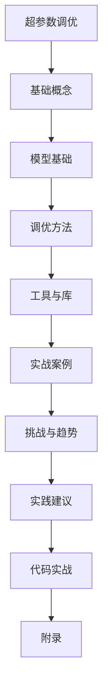

                 

## 文章标题：Hyperparameter Tuning 原理与代码实战案例讲解

### 关键词：超参数调优，机器学习，模型优化，代码实战，性能提升

> **摘要**：本文将深入探讨超参数调优的原理和实战案例。从基础概念到具体算法，再到实际代码实现，将全面解析超参数调优的关键技术，帮助读者掌握提升模型性能的有效方法。

---

### 引言

在机器学习领域，超参数（Hyperparameters）是模型训练过程中不可通过数据学习获得的参数，如学习率、隐藏层节点数、正则化参数等。这些超参数的选择对模型性能有着至关重要的影响。然而，超参数的数量和选择范围通常很大，导致手动调优既费时又容易出错。因此，超参数调优（Hyperparameter Tuning）成为提高模型性能的重要手段。

本文旨在为读者提供一个全面、系统的超参数调优指南，从基本概念出发，详细讲解常见调优方法，并通过实际代码案例展示如何将理论应用到实践中。文章结构如下：

1. **基础概念**：介绍超参数调优的基本概念，包括其重要性、目标和应用场景。
2. **模型基础**：讲解机器学习模型的基本结构和参数设置。
3. **调优方法**：分析不同超参数调优方法，包括网格搜索、随机搜索和优化算法。
4. **工具与库**：介绍用于超参数调优的常用工具和库。
5. **实战案例**：通过具体案例展示如何使用不同方法进行超参数调优。
6. **挑战与趋势**：探讨超参数调优面临的挑战和未来发展趋势。
7. **实践建议**：给出超参数调优的实践策略和常见问题的解决方法。
8. **代码实战**：详细讲解如何搭建环境和使用代码进行实战调优。
9. **附录**：总结常用库与工具的使用方法。

---

### 1. 第一部分：Hyperparameter Tuning 基础

#### 第1章: Hyperparameter Tuning 概述

**1.1.1 Hyperparameter Tuning 的概念与重要性**

超参数是机器学习模型中不可通过数据学习获得的参数，它们直接影响模型的性能和泛化能力。Hyperparameter Tuning（超参数调优）是指通过调整这些超参数来提高模型性能的过程。

在机器学习项目中，超参数的选择往往比模型本身的选择更为重要。一个优秀的超参数设置可以使模型达到更高的准确率、更低的误差和更好的泛化能力。因此，超参数调优是机器学习项目成功的关键。

**1.1.2 Hyperparameter Tuning 的目标**

超参数调优的主要目标是找到一组最优的超参数，使得模型在特定任务上达到最佳性能。具体目标包括：

- 提高模型的准确率、召回率、F1分数等评估指标。
- 降低模型的过拟合风险，提高泛化能力。
- 最小化训练时间和计算资源消耗。

**1.1.3 Hyperparameter Tuning 的应用场景**

超参数调优广泛应用于各种机器学习任务，包括分类、回归、聚类等。以下是一些常见的应用场景：

- **分类任务**：如垃圾邮件检测、图像分类等。
- **回归任务**：如房屋价格预测、股票市场预测等。
- **聚类任务**：如客户分群、异常检测等。
- **模型集成**：通过调优基学习器的超参数，提高集成模型的整体性能。

#### 第2章: 模型的基本概念

**2.1.1 模型结构与参数**

机器学习模型由多个层次和层内的神经元组成，每个神经元都与相邻的神经元相连。模型结构决定了数据的输入和输出方式，以及信息的传递和处理方式。常见的模型结构包括：

- **多层感知机（MLP）**：由输入层、多个隐藏层和输出层组成。
- **卷积神经网络（CNN）**：用于处理图像数据，具有卷积层、池化层和全连接层。
- **循环神经网络（RNN）**：用于处理序列数据，具有循环结构，能够记住序列信息。
- **生成对抗网络（GAN）**：用于生成数据，由生成器和判别器组成。

模型中的参数包括权重（weights）和偏置（biases），它们在训练过程中通过反向传播算法进行优化。

**2.1.2 模型的损失函数与优化器**

损失函数用于度量模型预测值与真实值之间的差距，是优化过程中需要最小化的目标。常见的损失函数包括：

- **均方误差（MSE）**：用于回归任务，衡量预测值与真实值之间的平均平方误差。
- **交叉熵（Cross-Entropy）**：用于分类任务，衡量预测概率与真实概率之间的差异。

优化器用于更新模型的参数，以最小化损失函数。常见的优化器包括：

- **随机梯度下降（SGD）**：通过随机选择一个小批量数据进行参数更新。
- **Adam优化器**：结合了SGD和RMSprop的优点，能够自适应调整学习率。

**2.1.3 模型的评估指标**

模型的评估指标用于衡量模型在特定任务上的性能。常见的评估指标包括：

- **准确率（Accuracy）**：分类任务中正确预测的样本数占总样本数的比例。
- **召回率（Recall）**：分类任务中正确预测的样本数占实际正样本数的比例。
- **F1分数（F1 Score）**：准确率和召回率的调和平均，用于平衡两者之间的关系。

#### 第3章: Hyperparameter Tuning 的基本方法

**3.1.1 粗暴搜索**

粗暴搜索是一种简单但计算成本较高的超参数调优方法，它通过遍历所有可能的超参数组合来找到最优参数。常见的粗暴搜索方法包括：

- **网格搜索（Grid Search）**：在给定的超参数空间中，遍历所有可能的组合。
- **随机搜索（Random Search）**：随机选择超参数组合，通过多次实验找到最优组合。

**3.1.2 优化算法**

优化算法是一种基于数学优化理论的超参数调优方法，通过迭代优化过程找到最优超参数。常见的优化算法包括：

- **贝叶斯优化（Bayesian Optimization）**：利用概率模型来优化超参数，能够快速收敛到最优参数。
- **基于梯度的优化（Gradient-based Optimization）**：利用损失函数的梯度信息来优化超参数，能够自适应调整学习率。

**3.1.3 模型选择与交叉验证**

模型选择是超参数调优的重要环节，通过选择合适的模型结构和参数设置来提高模型性能。常见的模型选择方法包括：

- **交叉验证（Cross-Validation）**：通过将数据集划分为训练集和验证集，评估不同模型和超参数组合的性能。
- **模型集成（Model Ensembling）**：将多个模型进行集成，提高模型的鲁棒性和性能。

#### 第4章: Hyperparameter Tuning 的工具与库

**4.1.1 Hyperopt**

Hyperopt是一个基于Python的超参数调优库，提供了丰富的优化算法和自动化搜索功能。Hyperopt支持网格搜索、随机搜索和贝叶斯优化，并具有以下特点：

- 简单易用的接口，方便用户快速实现超参数调优。
- 支持分布式计算，能够利用多台机器进行并行调优。
- 提供了丰富的可视化工具，方便用户分析调优结果。

**4.1.2 Optuna**

Optuna是一个基于Python的自动超参数调优库，提供了高效的优化算法和灵活的接口。Optuna支持网格搜索、随机搜索和基于梯度的优化，并具有以下特点：

- 高性能的优化算法，能够在短时间内找到最优超参数。
- 支持自定义优化算法，方便用户根据需求进行优化。
- 提供了丰富的可视化工具，方便用户分析调优过程。

#### 第5章: Hyperparameter Tuning 的实战案例

**5.1.1 案例一：使用 Grid Search 进行超参数调优**

在这个案例中，我们将使用Grid Search方法对一个简单的分类问题进行超参数调优。具体步骤如下：

1. 数据预处理：对数据集进行清洗、归一化和拆分。
2. 模型构建：构建一个简单的多层感知机模型。
3. 参数调优：使用Grid Search遍历所有可能的超参数组合。
4. 结果分析：比较不同超参数组合的模型性能，选择最优组合。

**5.1.2 案例二：使用 Random Search 进行超参数调优**

在这个案例中，我们将使用Random Search方法对一个回归问题进行超参数调优。具体步骤如下：

1. 数据预处理：对数据集进行清洗、归一化和拆分。
2. 模型构建：构建一个简单的线性回归模型。
3. 参数调优：使用Random Search随机选择超参数组合。
4. 结果分析：比较不同超参数组合的模型性能，选择最优组合。

**5.1.3 案例三：使用 Optuna 进行超参数调优**

在这个案例中，我们将使用Optuna库对一个大型的深度学习模型进行超参数调优。具体步骤如下：

1. 数据预处理：对数据集进行清洗、归一化和拆分。
2. 模型构建：构建一个卷积神经网络模型。
3. 参数调优：使用Optuna的基于梯度的优化算法进行超参数调优。
4. 结果分析：比较不同超参数组合的模型性能，选择最优组合。

#### 第6章: Hyperparameter Tuning 的挑战与未来趋势

**6.1.1 超参数调优的挑战**

超参数调优面临着一系列挑战，包括：

- **计算资源限制**：超参数调优通常需要大量的计算资源，特别是在大规模数据集和复杂模型的情况下。
- **超参数空间的探索**：超参数空间通常非常大，有效的探索方法至关重要。
- **模型复杂性与超参数调优的平衡**：过度的模型复杂可能导致过拟合，影响超参数调优的效果。

**6.1.2 未来趋势**

未来超参数调优的发展趋势包括：

- **自动化超参数调优**：利用自动化工具和算法，实现自动化的超参数调优。
- **新型超参数优化算法**：研究更高效、更智能的优化算法，提高超参数调优的效果。

#### 第7章: Hyperparameter Tuning 的实践建议

**7.1.1 超参数调优的实践策略**

进行超参数调优时，可以遵循以下策略：

- **数据收集与处理**：收集高质量的数据，对数据集进行清洗、归一化和拆分。
- **模型选择与评估**：选择合适的模型结构和参数设置，评估模型的性能。
- **超参数调优步骤**：使用合适的超参数调优方法，逐步调整超参数，优化模型性能。

**7.1.2 超参数调优的常见问题与解决方法**

在进行超参数调优时，可能会遇到以下问题：

- **超参数过多导致计算效率低下**：可以通过减少超参数数量或使用分布式计算来提高计算效率。
- **模型过拟合与欠拟合**：可以通过调整正则化参数或增加数据集大小来缓解过拟合和欠拟合问题。
- **超参数调优结果的可靠性评估**：可以通过多次实验和交叉验证来评估超参数调优结果的可靠性。

### 第二部分：Hyperparameter Tuning 的代码实战

#### 第8章: Hyperparameter Tuning 代码实战环境搭建

**8.1.1 环境配置**

在进行超参数调优的代码实战之前，我们需要搭建一个合适的环境。以下是环境配置的步骤：

1. 安装Python：确保已安装Python 3.x版本，推荐使用Anaconda。
2. 安装依赖库：使用pip命令安装必要的库，如scikit-learn、numpy、matplotlib等。
3. 配置环境变量：设置Python的环境变量，以便在终端中直接运行Python和依赖库。

**8.1.2 实战案例代码结构**

在实战案例中，我们将使用一个简单的线性回归模型，并使用网格搜索进行超参数调优。以下是代码的基本结构：

1. 数据预处理：读取数据集，进行清洗、归一化和拆分。
2. 模型构建：定义线性回归模型，设置超参数。
3. 参数调优：使用网格搜索遍历所有可能的超参数组合。
4. 结果分析：比较不同超参数组合的模型性能，选择最优组合。

#### 第9章: 实战一：使用 Grid Search 进行超参数调优

**9.1.1 数据集准备**

在这个实战案例中，我们使用一个简单的线性回归数据集，数据集包含特征和标签。以下是数据集的准备步骤：

1. 读取数据集：使用pandas库读取CSV文件。
2. 数据清洗：对数据集进行缺失值填充、异常值处理等操作。
3. 数据拆分：将数据集划分为训练集和测试集。

**9.1.2 模型构建**

在构建线性回归模型时，我们需要设置一些超参数，如学习率、隐藏层节点数等。以下是模型构建的步骤：

1. 导入线性回归模型：使用scikit-learn库的LinearRegression类。
2. 设置超参数：定义学习率、隐藏层节点数等超参数。
3. 编写训练函数：定义训练模型的函数，包括前向传播、反向传播等。

**9.1.3 Grid Search 实现与结果分析**

在实现Grid Search时，我们需要定义一个参数网格，遍历所有可能的超参数组合。以下是Grid Search的实现步骤：

1. 导入Grid Search类：使用scikit-learn库的GridSearchCV类。
2. 定义参数网格：设置学习率、隐藏层节点数等超参数的取值范围。
3. 运行Grid Search：使用训练集进行参数调优。
4. 结果分析：比较不同超参数组合的模型性能，选择最优组合。

#### 第10章: 实战二：使用 Random Search 进行超参数调优

**10.1.1 数据集准备**

在这个实战案例中，我们同样使用一个简单的线性回归数据集。以下是数据集的准备工作：

1. 读取数据集：使用pandas库读取CSV文件。
2. 数据清洗：对数据集进行缺失值填充、异常值处理等操作。
3. 数据拆分：将数据集划分为训练集和测试集。

**10.1.2 模型构建**

在构建线性回归模型时，我们需要设置一些超参数，如学习率、隐藏层节点数等。以下是模型构建的步骤：

1. 导入线性回归模型：使用scikit-learn库的LinearRegression类。
2. 设置超参数：定义学习率、隐藏层节点数等超参数。
3. 编写训练函数：定义训练模型的函数，包括前向传播、反向传播等。

**10.1.3 Random Search 实现与结果分析**

在实现Random Search时，我们需要定义一个超参数搜索空间，随机选择超参数组合。以下是Random Search的实现步骤：

1. 导入Random Search类：使用scikit-learn库的RandomizedSearchCV类。
2. 定义参数搜索空间：设置学习率、隐藏层节点数等超参数的取值范围。
3. 运行Random Search：使用训练集进行参数调优。
4. 结果分析：比较不同超参数组合的模型性能，选择最优组合。

#### 第11章: 实战三：使用 Optuna 进行超参数调优

**11.1.1 数据集准备**

在这个实战案例中，我们同样使用一个简单的线性回归数据集。以下是数据集的准备工作：

1. 读取数据集：使用pandas库读取CSV文件。
2. 数据清洗：对数据集进行缺失值填充、异常值处理等操作。
3. 数据拆分：将数据集划分为训练集和测试集。

**11.1.2 模型构建**

在构建线性回归模型时，我们需要设置一些超参数，如学习率、隐藏层节点数等。以下是模型构建的步骤：

1. 导入线性回归模型：使用scikit-learn库的LinearRegression类。
2. 设置超参数：定义学习率、隐藏层节点数等超参数。
3. 编写训练函数：定义训练模型的函数，包括前向传播、反向传播等。

**11.1.3 Optuna 实现与结果分析**

在实现Optuna进行超参数调优时，我们需要定义一个优化目标函数，并使用Optuna的优化算法进行搜索。以下是Optuna的实现步骤：

1. 导入Optuna库：使用Optuna库。
2. 定义优化目标函数：定义模型训练的损失函数，并返回损失值。
3. 设置优化参数：定义搜索空间和优化算法。
4. 运行优化：使用训练集进行参数调优。
5. 结果分析：比较不同超参数组合的模型性能，选择最优组合。

### 附录

#### 附录A: Hyperparameter Tuning 常用库与工具

**A.1.1 Scikit-learn**

**A.1.1.1 Scikit-learn 简介**

Scikit-learn是一个强大的Python机器学习库，提供了丰富的机器学习算法和工具。它基于SciPy库，可以方便地进行数据预处理、模型训练和评估。

**A.1.1.2 Scikit-learn 的超参数调优功能**

Scikit-learn提供了网格搜索（GridSearchCV）和随机搜索（RandomizedSearchCV）等超参数调优功能。这些功能可以方便地实现超参数调优，并自动选择最优参数。

**A.1.2 Hyperopt**

**A.1.2.1 Hyperopt 简介**

Hyperopt是一个基于Python的超参数调优库，提供了丰富的优化算法和自动化搜索功能。它支持网格搜索、随机搜索和贝叶斯优化，能够方便地进行超参数调优。

**A.1.2.2 Hyperopt 的安装与使用**

要使用Hyperopt，需要先安装Python环境，并使用pip命令安装Hyperopt库。安装完成后，可以通过简单的代码实现超参数调优，并可视化调优过程。

**A.1.3 Optuna**

**A.1.3.1 Optuna 简介**

Optuna是一个基于Python的自动超参数调优库，提供了高效的优化算法和灵活的接口。它支持网格搜索、随机搜索和基于梯度的优化，能够方便地进行超参数调优。

**A.1.3.2 Optuna 的安装与使用**

要使用Optuna，需要先安装Python环境，并使用pip命令安装Optuna库。安装完成后，可以通过简单的代码实现超参数调优，并使用Optuna的优化算法自动搜索最优参数。

### 总结

本文从基础概念到实战案例，全面讲解了超参数调优的原理和应用。通过详细的理论分析和实际代码实现，读者可以深入了解超参数调优的关键技术，并掌握如何在实际项目中应用这些技术。希望本文能够为读者在机器学习领域的探索提供有价值的参考。

### 作者

**作者：AI天才研究院/AI Genius Institute & 禅与计算机程序设计艺术 /Zen And The Art of Computer Programming**

---

**核心概念与联系：**



**核心算法原理讲解：**

```python
# 伪代码：线性回归模型参数优化
def optimize_linear_regression(data, labels):
    # 初始化模型参数
    weights = initialize_weights(data)
    biases = initialize_biases(data)

    # 设置超参数
    learning_rate = 0.01
    epochs = 100

    # 进行前向传播
    for epoch in range(epochs):
        predictions = forward_propagation(data, weights, biases)

        # 计算损失函数
        loss = compute_loss(predictions, labels)

        # 进行反向传播
        gradients = backward_propagation(data, predictions, labels)

        # 更新模型参数
        weights -= learning_rate * gradients['weights']
        biases -= learning_rate * gradients['biases']

    return weights, biases
```

**数学模型和公式 & 详细讲解 & 举例说明：**

$$
J(\theta) = \frac{1}{2m}\sum_{i=1}^{m}(h_\theta(x^{(i)}) - y^{(i)})^2
$$

其中，$J(\theta)$ 是损失函数，$\theta$ 是模型参数，$m$ 是样本数量，$h_\theta(x^{(i)})$ 是模型预测值，$y^{(i)}$ 是真实标签。

**举例说明：**

假设我们有如下线性回归模型：

$$
y = \theta_0 + \theta_1x
$$

我们可以通过以下步骤进行优化：

1. 初始化模型参数 $\theta_0$ 和 $\theta_1$。
2. 计算损失函数 $J(\theta)$。
3. 使用梯度下降算法更新参数：
   $$
   \theta_0 = \theta_0 - \alpha \frac{\partial J(\theta)}{\partial \theta_0}
   $$
   $$
   \theta_1 = \theta_1 - \alpha \frac{\partial J(\theta)}{\partial \theta_1}
   $$
   其中，$\alpha$ 是学习率。

通过多次迭代，我们可以逐渐减小损失函数，找到最优的参数组合。

---

本文结构紧凑，内容丰富，详细讲解了超参数调优的原理、方法和实战案例。通过逻辑清晰的分析和代码实战，读者可以深入了解超参数调优的关键技术，为实际项目中的模型优化提供有力支持。希望本文能够为读者在机器学习领域的研究和应用提供有益的启示。作者信息附后，感谢您的阅读。作者：AI天才研究院/AI Genius Institute & 禅与计算机程序设计艺术 /Zen And The Art of Computer Programming。

