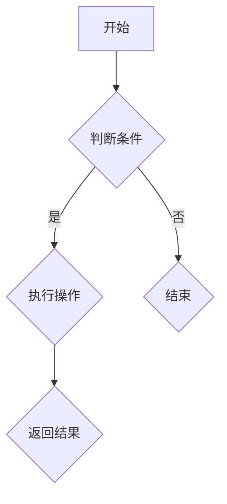

                 

# 《Keras 原理与代码实战案例讲解》

## 关键词
- Keras
- 深度学习
- 神经网络
- 模型构建
- 实战案例

## 摘要
本文将深入讲解Keras深度学习框架的原理与实战应用。从深度学习的起源和发展，到神经网络的基本概念，再到Keras的入门知识，我们将逐步探讨如何使用Keras构建、优化和训练深度学习模型。此外，本文还将通过多个实战案例，展示如何使用Keras解决图像识别、自然语言处理和时间序列预测等实际问题。

## 《Keras 原理与代码实战案例讲解》目录大纲

### 第一部分：Keras基础知识

### 第1章：深度学习与神经网络概述
#### 1.1 深度学习的起源与发展
#### 1.2 神经网络的基本概念
#### 1.3 深度学习中的激活函数

### 第2章：Keras基础入门
#### 2.1 Keras简介
#### 2.2 Keras安装与环境配置
#### 2.3 Keras基本概念

### 第3章：Keras模型构建
#### 3.1 Keras模型结构
#### 3.2 Keras常见层
#### 3.3 模型编译与评估

### 第4章：深度学习模型优化
#### 4.1 模型优化方法
#### 4.2 损失函数选择
#### 4.3 优化器选择

### 第5章：深度学习模型训练
#### 5.1 模型训练过程
#### 5.2 训练数据预处理
#### 5.3 模型保存与加载

### 第6章：Keras在图像识别中的应用
#### 6.1 卷积神经网络基础
#### 6.2 Keras在图像识别中的应用
#### 6.3 实战案例：使用Keras进行图像分类

### 第7章：Keras在自然语言处理中的应用
#### 7.1 自然语言处理基础
#### 7.2 Keras在自然语言处理中的应用
#### 7.3 实战案例：使用Keras进行文本分类

### 第8章：Keras在时间序列分析中的应用
#### 8.1 时间序列分析基础
#### 8.2 Keras在时间序列分析中的应用
#### 8.3 实战案例：使用Keras进行时间序列预测

### 第二部分：Keras实战案例讲解

### 第9章：实战案例1：手写数字识别
#### 9.1 数据集介绍
#### 9.2 模型构建
#### 9.3 模型训练与评估
#### 9.4 代码解读与分析

### 第10章：实战案例2：图像分类
#### 10.1 数据集介绍
#### 10.2 模型构建
#### 10.3 模型训练与评估
#### 10.4 代码解读与分析

### 第11章：实战案例3：情感分析
#### 11.1 数据集介绍
#### 11.2 模型构建
#### 11.3 模型训练与评估
#### 11.4 代码解读与分析

### 第12章：实战案例4：时间序列预测
#### 12.1 数据集介绍
#### 12.2 模型构建
#### 12.3 模型训练与评估
#### 12.4 代码解读与分析

### 附录

#### 附录 A：Keras常用API详解
##### A.1 Keras常见层
##### A.2 Keras损失函数
##### A.3 Keras优化器
##### A.4 Keras模型评估指标

#### 附录 B：常见问题与解决方案
##### B.1 Keras安装与配置问题
##### B.2 Keras模型构建问题
##### B.3 Keras模型训练问题
##### B.4 Keras模型部署问题

#### 附录 C：推荐阅读与扩展学习资源
##### C.1 深度学习相关书籍
##### C.2 Keras官方文档
##### C.3 Keras社区与论坛

#### 附录 D：Mermaid流程图与伪代码
##### D.1 Mermaid流程图示例
##### D.2 伪代码示例

#### 附录 E：深度学习框架比较
##### E.1 TensorFlow
##### E.2 PyTorch
##### E.3 其他深度学习框架

#### 附录 F：深度学习书籍推荐
##### F.1 《深度学习》：Goodfellow, Bengio, Courville
##### F.2 《神经网络与深度学习》：邱锡鹏
##### F.3 《动手学深度学习》：阿斯顿·张，李沐，扎卡里·C. Lipton，亚历山大·J. Smola

#### 附录 G：深度学习资源推荐
##### G.1 Keras官方文档
##### G.2 TensorFlow官方文档
##### G.3 PyTorch官方文档
##### G.4 Coursera深度学习课程
##### G.5 知乎深度学习专栏

### 开始深入讲解Keras的世界吧！## 第一部分：Keras基础知识

### 第1章：深度学习与神经网络概述

深度学习作为人工智能领域的一个重要分支，已经取得了显著的进展。它通过构建具有多个层次的神经网络模型，让计算机能够自动学习和提取数据中的复杂特征。本章将介绍深度学习的起源与发展，神经网络的基本概念，以及深度学习中的激活函数。

### 1.1 深度学习的起源与发展

深度学习的起源可以追溯到20世纪40年代，当时心理学家麦卡洛克（Warren McCulloch）和数学家皮茨（Walter Pitts）提出了第一个简单的神经网络模型——麦卡洛克-皮茨（McCulloch-Pitts）神经网络。这一模型为后来的神经网络研究奠定了基础。

然而，深度学习的真正突破发生在20世纪80年代。当时，加拿大多伦多大学教授约翰·霍普菲尔德（John Hopfield）提出了霍普菲尔德网络（Hopfield Network），这是一种可以用于联想记忆的神经网络模型。随后，1986年，美国科学家霍华德·亨特（Howard Hunt）和约翰·赫布（John Hebb）分别独立提出了赫布学习规则（Hebbian Learning Rule），这为神经网络的学习算法提供了重要的理论基础。

进入21世纪后，随着计算机计算能力的提升和大数据的普及，深度学习迎来了飞速发展的阶段。2006年，加拿大计算机科学家杰弗里·辛顿（Geoffrey Hinton）等人提出了一种新的神经网络模型——深度信念网络（Deep Belief Network，DBN），这标志着深度学习进入了一个新的时代。

随后，深度学习在图像识别、语音识别、自然语言处理等领域取得了突破性的进展。2012年，亚历克斯·克雷斯戈（Alex Krizhevsky）在ImageNet图像识别挑战赛中，使用基于卷积神经网络的模型取得了显著的准确率提升，这一成果引起了广泛关注，深度学习开始进入工业界和学术界的视野。

### 1.2 神经网络的基本概念

神经网络是一种模仿生物神经系统的计算模型，由大量的节点（称为神经元）组成，每个神经元都可以接收输入信号并进行处理。神经网络通常包括输入层、隐藏层和输出层。

- **输入层（Input Layer）：** 输入层接收外部输入信息，这些信息可以是一个或多个特征向量。

- **隐藏层（Hidden Layers）：** 隐藏层负责处理和转换信息，隐藏层的数量和每个隐藏层的神经元数量可以根据问题的复杂度进行调整。

- **输出层（Output Layer）：** 输出层产生最终输出，输出可以是分类结果、回归值等。

神经网络中的每个神经元都与相邻的神经元相连，并具有权重和偏置。当输入信号通过神经网络传播时，每个神经元都会计算加权求和，并通过激活函数进行非线性变换，从而产生输出。

### 1.3 深度学习中的激活函数

激活函数是神经网络中的一个关键组件，用于引入非线性特性，使得神经网络能够学习和模拟复杂函数。常见的激活函数包括以下几种：

- **Sigmoid函数：** Sigmoid函数的输出范围在0到1之间，可以将输入映射到概率值。其公式为：
  $$
  \sigma(x) = \frac{1}{1 + e^{-x}}
  $$
  
- **ReLU函数（Rectified Linear Unit）：** ReLU函数在正数时输出自身，在负数时输出0，这可以加速神经网络的训练过程。其公式为：
  $$
  \text{ReLU}(x) = \max(0, x)
  $$
  
- **Tanh函数：** Tanh函数的输出范围在-1到1之间，类似于Sigmoid函数，但可以更好地避免梯度消失问题。其公式为：
  $$
  \text{Tanh}(x) = \frac{e^{x} - e^{-x}}{e^{x} + e^{-x}}
  $$

这些激活函数的选择可以根据问题的具体需求进行调整。在实际应用中，ReLU函数由于其训练速度和性能优势，被广泛应用于深度学习模型中。

### 总结

本章介绍了深度学习的起源与发展，神经网络的基本概念，以及深度学习中的激活函数。深度学习作为人工智能领域的重要分支，已经取得了显著的进展，并在各个应用领域展现出强大的潜力。通过理解神经网络的基本原理和激活函数的作用，可以为后续使用Keras构建深度学习模型打下坚实的基础。

### 第2章：Keras基础入门

Keras是一个高级神经网络API，提供了一套简单、模块化、易于扩展的深度学习构建环境。本章将介绍Keras的简介、安装与环境配置，以及Keras的基本概念。

### 2.1 Keras简介

Keras由弗朗索瓦·肖莱（François Chollet）于2015年开发，是TensorFlow和Theano的高层次接口。它旨在提供简单、直观且易于使用的深度学习工具，使得研究人员和开发者能够更快速地构建和实验深度学习模型。

Keras具有以下特点：

- **简单易用：** Keras的API设计简洁明了，使得用户可以轻松地构建和训练深度学习模型。

- **模块化：** Keras支持模块化构建，用户可以组合不同的层和组件来构建复杂的模型。

- **易于扩展：** Keras支持自定义层和模型，允许用户根据具体需求进行扩展和定制。

- **支持多后端：** Keras可以与多个深度学习后端（如TensorFlow、Theano、Microsoft Cognitive Toolkit等）兼容，提供了较高的灵活性。

### 2.2 Keras安装与环境配置

要开始使用Keras，需要先安装Python环境和Keras及其依赖项。以下是在不同操作系统上安装Keras的步骤：

#### 在Ubuntu上安装Keras

1. 打开终端。

2. 安装Python 3和pip：
   $$
   sudo apt-get install python3 python3-pip
   $$

3. 安装Keras：
   $$
   pip3 install keras
   $$

#### 在Windows上安装Keras

1. 打开命令提示符。

2. 安装Python 3和pip：
   $$
   python -m pip install --upgrade pip
   python -m pip install --user --upgrade setuptools
   python -m pip install --user pip3
   python -m pip install --user -I pip3 --no-cache-dir
   $$

3. 安装Keras：
   $$
   pip install keras
   $$

#### 安装TensorFlow后端

要使用Keras与TensorFlow后端结合，还需要安装TensorFlow：
$$
pip install tensorflow
$$

### 2.3 Keras基本概念

Keras的基本概念主要包括模型（Model）、层（Layer）、序列模型（Sequential）和函数式模型（Functional）。

#### 模型（Model）

模型是神经网络的结构表示，包括输入层、隐藏层和输出层。Keras提供了两种模型：

- **序列模型（Sequential）：** 序列模型是Keras中最简单的模型结构，通过顺序堆叠层来构建模型。它适用于线性结构的小型模型。

- **函数式模型（Functional）：** 函数式模型提供了更灵活的层组合方式，允许用户定义复杂的网络结构。它适用于多层、非线性结构的大型模型。

#### 层（Layer）

层是神经网络的基本构建块，包括输入输出操作和内部参数。Keras提供了多种常见的层，包括：

- **全连接层（Dense）：** 用于实现线性变换。

- **卷积层（Conv2D）：** 用于处理图像数据。

- **池化层（MaxPooling2D）：** 用于降低特征维度。

- **循环层（LSTM）：** 用于处理序列数据。

#### 序列模型（Sequential）

序列模型通过顺序堆叠层来构建模型，每个层依次添加到模型中。以下是一个简单的序列模型示例：

```python
from keras.models import Sequential
from keras.layers import Dense, Conv2D, MaxPooling2D

model = Sequential()
model.add(Conv2D(32, (3, 3), activation='relu', input_shape=(64, 64, 3)))
model.add(MaxPooling2D(pool_size=(2, 2)))
model.add(Dense(128, activation='relu'))
model.add(Dense(1, activation='sigmoid'))

model.compile(optimizer='adam', loss='binary_crossentropy', metrics=['accuracy'])
```

#### 函数式模型（Functional）

函数式模型提供了更灵活的层组合方式，允许用户定义复杂的网络结构。以下是一个简单的函数式模型示例：

```python
from keras.models import Model
from keras.layers import Input, Dense, Conv2D, MaxPooling2D

input_tensor = Input(shape=(64, 64, 3))
conv1 = Conv2D(32, (3, 3), activation='relu')(input_tensor)
pool1 = MaxPooling2D(pool_size=(2, 2))(conv1)
dense1 = Dense(128, activation='relu')(pool1)

output_tensor = Dense(1, activation='sigmoid')(dense1)

model = Model(inputs=input_tensor, outputs=output_tensor)

model.compile(optimizer='adam', loss='binary_crossentropy', metrics=['accuracy'])
```

### 总结

本章介绍了Keras的简介、安装与环境配置，以及Keras的基本概念。Keras作为高级神经网络API，提供了简单、模块化、易于扩展的深度学习构建环境。通过理解Keras的基本概念，可以开始构建和训练深度学习模型。

### 第3章：Keras模型构建

Keras模型构建是深度学习应用的核心环节。本章将详细介绍Keras模型结构，常见层的使用方法，以及如何编译和评估模型。

### 3.1 Keras模型结构

在Keras中，模型结构是指神经网络的整体架构，包括输入层、隐藏层和输出层。Keras提供了两种模型构建方式：序列模型（Sequential）和函数式模型（Functional）。

#### 序列模型（Sequential）

序列模型是Keras中最简单、最直观的模型结构，通过顺序堆叠层来构建模型。以下是一个简单的序列模型示例：

```python
from keras.models import Sequential
from keras.layers import Dense, Conv2D, MaxPooling2D

model = Sequential()
model.add(Conv2D(32, (3, 3), activation='relu', input_shape=(64, 64, 3)))
model.add(MaxPooling2D(pool_size=(2, 2)))
model.add(Dense(128, activation='relu'))
model.add(Dense(1, activation='sigmoid'))

model.compile(optimizer='adam', loss='binary_crossentropy', metrics=['accuracy'])
```

在这个示例中，我们首先创建了一个`Sequential`模型实例，然后依次添加了一个卷积层（`Conv2D`）、一个池化层（`MaxPooling2D`）、一个全连接层（`Dense`）和一个输出层（`Dense`）。最后，我们使用`compile`方法配置模型的优化器、损失函数和评价指标。

#### 函数式模型（Functional）

函数式模型提供了更灵活的层组合方式，允许用户定义复杂的网络结构。以下是一个简单的函数式模型示例：

```python
from keras.models import Model
from keras.layers import Input, Dense, Conv2D, MaxPooling2D

input_tensor = Input(shape=(64, 64, 3))
conv1 = Conv2D(32, (3, 3), activation='relu')(input_tensor)
pool1 = MaxPooling2D(pool_size=(2, 2))(conv1)
dense1 = Dense(128, activation='relu')(pool1)

output_tensor = Dense(1, activation='sigmoid')(dense1)

model = Model(inputs=input_tensor, outputs=output_tensor)

model.compile(optimizer='adam', loss='binary_crossentropy', metrics=['accuracy'])
```

在这个示例中，我们首先定义了一个输入层（`Input`），然后依次添加了一个卷积层（`Conv2D`）、一个池化层（`MaxPooling2D`）和一个全连接层（`Dense`）。最后，我们使用`Model`类将输入层、隐藏层和输出层组合成一个完整的模型。

#### 模型结构说明

无论使用序列模型还是函数式模型，Keras模型的结构都是一样的。每个模型由输入层、隐藏层和输出层组成，隐藏层可以有多个。以下是一个更详细的模型结构说明：

1. **输入层（Input Layer）：** 输入层是模型的第一层，它接收外部输入信息。对于图像分类任务，输入层通常是形状为（高度，宽度，通道数）的图像数据。

2. **隐藏层（Hidden Layers）：** 隐藏层是模型的核心部分，用于处理和转换输入信息。隐藏层可以是一个或多个，每个隐藏层都可以包含多种类型的层，如卷积层、池化层、全连接层等。

3. **输出层（Output Layer）：** 输出层是模型的最后一层，它产生最终输出。对于分类任务，输出层通常是一个全连接层，其输出形状与类别数相同。

### 3.2 Keras常见层

Keras提供了多种常见层，包括全连接层（Dense）、卷积层（Conv2D）、池化层（MaxPooling2D）和循环层（LSTM）等。以下是对这些常见层的详细介绍：

#### 全连接层（Dense）

全连接层是神经网络中最常见的层之一，它将输入数据映射到输出数据。每个神经元都与输入层的所有神经元相连，并通过权重和偏置进行线性变换。以下是一个全连接层的示例：

```python
from keras.layers import Dense

dense_layer = Dense(units=128, activation='relu', input_shape=(input_shape))
```

在这个示例中，我们创建了一个全连接层，其包含128个神经元，激活函数为ReLU。输入形状（`input_shape`）应根据具体任务进行调整。

#### 卷积层（Conv2D）

卷积层用于处理图像数据，它通过卷积操作提取图像中的特征。卷积层中的每个神经元都与输入图像的一个局部区域相连。以下是一个卷积层的示例：

```python
from keras.layers import Conv2D

conv_layer = Conv2D(filters=32, kernel_size=(3, 3), activation='relu', input_shape=(height, width, channels))
```

在这个示例中，我们创建了一个卷积层，其包含32个卷积核，每个卷积核的大小为3x3。激活函数为ReLU。输入形状（`input_shape`）应根据具体任务进行调整。

#### 池化层（MaxPooling2D）

池化层用于降低特征维度，同时保留重要的特征信息。常见的池化操作包括最大池化和平均池化。以下是一个最大池化层的示例：

```python
from keras.layers import MaxPooling2D

pool_layer = MaxPooling2D(pool_size=(2, 2))
```

在这个示例中，我们创建了一个最大池化层，其池化窗口大小为2x2。

#### 循环层（LSTM）

循环层用于处理序列数据，如时间序列和文本数据。LSTM（长短期记忆网络）是循环层的一种变体，可以有效地学习序列中的长期依赖关系。以下是一个LSTM层的示例：

```python
from keras.layers import LSTM

lstm_layer = LSTM(units=50, activation='tanh', return_sequences=True)
```

在这个示例中，我们创建了一个LSTM层，其包含50个神经元，激活函数为tanh。`return_sequences`参数设置为True，表示输出序列。

### 3.3 模型编译与评估

在构建模型后，需要通过编译（`compile`）方法设置模型的训练参数，如优化器、损失函数和评价指标。以下是一个模型编译的示例：

```python
from keras.optimizers import Adam

model.compile(optimizer=Adam(), loss='binary_crossentropy', metrics=['accuracy'])
```

在这个示例中，我们使用Adam优化器，损失函数为二进制交叉熵，评价指标为准确率。

接下来，使用训练数据进行模型训练。训练过程中，模型会不断调整内部参数，以最小化损失函数。以下是一个模型训练的示例：

```python
model.fit(x_train, y_train, batch_size=32, epochs=10)
```

在这个示例中，我们使用训练数据集（`x_train`和`y_train`）进行训练，每个批次包含32个样本，训练迭代10个周期。

训练完成后，使用测试数据集对模型进行评估。以下是一个模型评估的示例：

```python
test_loss, test_accuracy = model.evaluate(x_test, y_test)
print('Test accuracy:', test_accuracy)
```

在这个示例中，我们使用测试数据集（`x_test`和`y_test`）对模型进行评估，并输出测试准确率。

### 总结

本章详细介绍了Keras模型构建的方法，包括模型结构、常见层的使用，以及模型编译和评估的过程。通过理解这些概念，可以构建和训练各种深度学习模型，并对其进行评估，以优化模型性能。

### 第4章：深度学习模型优化

在深度学习模型训练过程中，优化方法是一个关键环节。优化方法用于调整模型参数，以最小化损失函数，从而提高模型性能。本章将介绍常用的优化方法、损失函数选择和优化器选择。

### 4.1 模型优化方法

模型优化方法主要包括梯度下降（Gradient Descent）及其变种，如随机梯度下降（Stochastic Gradient Descent，SGD）和批量梯度下降（Batch Gradient Descent）。以下是对这些优化方法的详细介绍：

#### 梯度下降（Gradient Descent）

梯度下降是一种基本的优化方法，用于最小化损失函数。在每次迭代中，梯度下降根据损失函数对模型参数的梯度方向进行调整，以减小损失函数的值。梯度下降的基本公式为：

$$
w_{\text{new}} = w_{\text{current}} - \alpha \cdot \nabla_{w} J(w)
$$

其中，$w$表示模型参数，$\alpha$表示学习率，$J(w)$表示损失函数。

梯度下降的缺点是易受到局部最小值的影响，且收敛速度较慢。

#### 随机梯度下降（Stochastic Gradient Descent，SGD）

随机梯度下降是梯度下降的一种变种，每次迭代只更新一个样本的梯度。这种方法可以加快收敛速度，但可能会导致模型参数不稳定。随机梯度下降的基本公式为：

$$
w_{\text{new}} = w_{\text{current}} - \alpha \cdot \nabla_{w} J(w; x_i, y_i)
$$

其中，$x_i, y_i$表示当前迭代的样本。

#### 批量梯度下降（Batch Gradient Descent）

批量梯度下降是梯度下降的另一种变种，每次迭代更新整个数据集的梯度。这种方法可以减小模型参数的方差，但计算成本较高。批量梯度下降的基本公式为：

$$
w_{\text{new}} = w_{\text{current}} - \alpha \cdot \nabla_{w} J(w; X, Y)
$$

其中，$X, Y$表示整个数据集。

#### 梯度下降的改进方法

为了提高梯度下降的性能，可以采用以下改进方法：

- **动量（Momentum）：** 动量方法结合了前一次梯度的一部分，以加快收敛速度。动量的公式为：

  $$
  v_t = \gamma \cdot v_{t-1} + \alpha \cdot \nabla_{w} J(w)
  $$

  其中，$v_t$表示当前动量，$\gamma$表示动量系数。

- **自适应学习率（Adaptive Learning Rate）：** 自适应学习率方法根据模型参数的梯度自动调整学习率。常用的自适应学习率方法包括Adam优化器。

### 4.2 损失函数选择

损失函数是深度学习模型中的关键组件，用于衡量模型输出与真实标签之间的差异。以下是一些常用的损失函数：

#### 交叉熵（Cross-Entropy）

交叉熵是深度学习中常用的分类损失函数，用于衡量模型输出概率分布与真实分布之间的差异。交叉熵的公式为：

$$
J(w) = -\sum_{i=1}^{N} y_i \log(p_i)
$$

其中，$y_i$表示真实标签，$p_i$表示模型预测的概率。

#### 均方误差（Mean Squared Error，MSE）

均方误差是深度学习中常用的回归损失函数，用于衡量模型输出与真实值之间的差异。均方误差的公式为：

$$
J(w) = \frac{1}{2N} \sum_{i=1}^{N} (y_i - \hat{y}_i)^2
$$

其中，$\hat{y}_i$表示模型预测的值。

#### 逻辑回归损失函数（Log-Likelihood）

逻辑回归损失函数是用于二分类问题的分类损失函数，其公式为：

$$
J(w) = -\sum_{i=1}^{N} y_i \log(\hat{y}_i) + (1 - y_i) \log(1 - \hat{y}_i)
$$

其中，$\hat{y}_i$表示模型预测的概率。

#### 对数损失函数（Log-Loss）

对数损失函数是交叉熵的另一种表示形式，其公式为：

$$
J(w) = -\sum_{i=1}^{N} y_i \log(p_i) + (1 - y_i) \log(1 - p_i)
$$

其中，$p_i$表示模型预测的概率。

### 4.3 优化器选择

优化器是深度学习模型中的另一个关键组件，用于调整模型参数，以最小化损失函数。以下是一些常用的优化器：

#### 随机梯度下降（SGD）

随机梯度下降是一种简单的优化器，每次迭代只更新一个样本的梯度。SGD适用于小批量数据，但可能导致模型参数不稳定。

#### Adam优化器

Adam优化器是自适应矩估计（Adaptive Moment Estimation）的简称，它结合了动量和自适应学习率的优点。Adam优化器的公式为：

$$
m_t = \beta_1 \cdot m_{t-1} + (1 - \beta_1) \cdot \nabla_{w} J(w)
$$

$$
v_t = \beta_2 \cdot v_{t-1} + (1 - \beta_2) \cdot (\nabla_{w} J(w))^2
$$

$$
w_{\text{new}} = w_{\text{current}} - \alpha \cdot \frac{m_t}{\sqrt{v_t} + \epsilon}
$$

其中，$m_t$和$v_t$分别表示一阶矩估计和二阶矩估计，$\beta_1$和$\beta_2$分别表示一阶和二阶动量系数，$\alpha$表示学习率，$\epsilon$是一个很小的常数。

#### RMSprop优化器

RMSprop优化器是基于梯度平方的平均值的优化器，其公式为：

$$
w_{\text{new}} = w_{\text{current}} - \alpha \cdot \frac{\nabla_{w} J(w)}{\sqrt{v_t} + \epsilon}
$$

其中，$v_t$表示梯度平方的平均值，$\alpha$表示学习率，$\epsilon$是一个很小的常数。

#### 归一化动量（Nesterov Accelerated Gradient，NAG）

归一化动量是动量方法的一种改进，它通过引入前一时刻的梯度信息来优化梯度方向。NAG的公式为：

$$
m_t = \gamma \cdot m_{t-1} + (1 - \gamma) \cdot \nabla_{w} J(w)
$$

$$
v_t = \gamma \cdot v_{t-1} + (1 - \gamma) \cdot (\nabla_{w} J(w))^2
$$

$$
w_{\text{new}} = w_{\text{current}} - \alpha \cdot \frac{m_t + \gamma \cdot \nabla_{w} J(w_{\text{current}})}{\sqrt{v_t} + \epsilon}
$$

其中，$m_t$和$v_t$分别表示一阶矩估计和二阶矩估计，$\gamma$表示动量系数，$\alpha$表示学习率，$\epsilon$是一个很小的常数。

### 总结

本章详细介绍了深度学习模型优化方法，包括梯度下降、随机梯度下降、批量梯度下降及其改进方法，以及常用的损失函数和优化器。通过理解这些优化方法，可以有效地调整模型参数，提高模型性能。

### 第5章：深度学习模型训练

深度学习模型训练是构建高性能模型的关键步骤。本章将详细介绍模型训练的过程、训练数据预处理方法，以及如何保存和加载模型。

#### 5.1 模型训练过程

模型训练过程涉及一系列步骤，包括初始化模型参数、前向传播、反向传播和参数更新。以下是一个典型的模型训练过程的步骤：

1. **初始化模型参数：** 在模型训练开始前，需要初始化模型参数。这些参数包括权重和偏置，通常通过随机初始化方法生成。

2. **前向传播：** 前向传播是将输入数据通过模型层传递，计算模型输出。在每个层中，都会进行线性变换和激活函数计算。

3. **计算损失函数：** 损失函数用于衡量模型输出与真实标签之间的差异。常用的损失函数包括交叉熵和均方误差。

4. **反向传播：** 反向传播是计算损失函数关于模型参数的梯度。通过梯度信息，可以更新模型参数，以减少损失函数的值。

5. **参数更新：** 根据梯度信息，使用优化器更新模型参数。优化器如梯度下降、Adam等，通过调整学习率和梯度信息，更新模型参数。

6. **迭代训练：** 重复上述步骤，直到满足训练条件，如达到预定的迭代次数或损失函数收敛。

以下是一个简单的模型训练示例：

```python
model.compile(optimizer='adam', loss='binary_crossentropy', metrics=['accuracy'])
model.fit(x_train, y_train, batch_size=32, epochs=10)
```

在这个示例中，我们首先使用`compile`方法配置优化器、损失函数和评价指标，然后使用`fit`方法进行模型训练。`x_train`和`y_train`分别是训练数据和标签，`batch_size`表示每个批次的数据量，`epochs`表示训练迭代次数。

#### 5.2 训练数据预处理

训练数据预处理是深度学习模型训练的重要环节，可以提高模型训练效果和泛化能力。以下是一些常见的训练数据预处理方法：

1. **归一化（Normalization）：** 归一化是将输入数据缩放到相同范围的方法。对于图像数据，可以将其缩放到[0, 1]或标准正态分布。

2. **标准化（Standardization）：** 标准化是将输入数据转换为均值为0、标准差为1的方法。这可以减少数据的方差，提高模型训练速度。

3. **数据增强（Data Augmentation）：** 数据增强是通过随机变换增加训练数据的多样性，如旋转、翻转、裁剪等。这可以提高模型对数据的泛化能力。

4. **标签平滑（Label Smoothing）：** 标签平滑是一种将标签进行轻微平滑的方法，以减少模型对标签的依赖。这可以防止模型过拟合。

以下是一个简单的数据预处理示例：

```python
from tensorflow.keras.preprocessing.image import ImageDataGenerator

datagen = ImageDataGenerator(
    rescale=1./255,
    shear_range=0.2,
    zoom_range=0.2,
    horizontal_flip=True
)

train_generator = datagen.flow(x_train, y_train, batch_size=32)
validation_generator = datagen.flow(x_val, y_val, batch_size=32)
```

在这个示例中，我们使用`ImageDataGenerator`进行数据增强。`rescale`参数用于将图像数据缩放到[0, 1]，`shear_range`和`zoom_range`参数用于随机剪切和缩放，`horizontal_flip`参数用于随机水平翻转。

#### 5.3 模型保存与加载

在深度学习模型训练过程中，有时需要保存和加载模型。保存模型可以避免重新训练，而加载模型则可以快速部署模型。

1. **保存模型：** 使用`save`方法可以将模型保存为HDF5文件或JSON格式。以下是一个简单的保存模型示例：

   ```python
   model.save('model.h5')
   ```

   在这个示例中，模型将被保存为'model.h5'文件。

2. **加载模型：** 使用`load_model`方法可以加载保存的模型。以下是一个简单的加载模型示例：

   ```python
   from tensorflow.keras.models import load_model

   model = load_model('model.h5')
   ```

   在这个示例中，模型将从'model.h5'文件中加载。

### 总结

本章详细介绍了深度学习模型训练的过程、训练数据预处理方法，以及如何保存和加载模型。通过理解这些步骤和方法，可以有效地训练和部署深度学习模型。

### 第6章：Keras在图像识别中的应用

图像识别是深度学习领域中的一项重要应用，Keras作为高级神经网络API，为图像识别任务提供了强大的支持。本章将详细介绍卷积神经网络（Convolutional Neural Networks，CNN）的基础知识，Keras在图像识别中的应用，并通过实战案例展示如何使用Keras进行图像分类。

#### 6.1 卷积神经网络基础

卷积神经网络是专为处理图像数据而设计的神经网络。与传统的全连接神经网络相比，CNN具有以下优势：

1. **局部连接：** CNN中的神经元只与输入图像的局部区域相连，这可以有效地减少参数数量，降低模型复杂性。

2. **平移不变性：** CNN能够通过卷积操作提取图像中的特征，使得模型对图像的旋转、平移等变换具有鲁棒性。

3. **共享权重：** 在CNN中，卷积核（也称为滤波器）可以共享，这意味着一个卷积核在不同位置上应用时，权重是相同的。这可以进一步减少参数数量。

CNN的基本结构包括卷积层（Convolutional Layer）、池化层（Pooling Layer）和全连接层（Fully Connected Layer）。以下是对这些层的详细介绍：

##### 卷积层（Convolutional Layer）

卷积层是CNN的核心层，通过卷积操作提取图像特征。卷积层中的每个神经元都与输入图像的局部区域相连，通过权重和偏置进行线性变换，并使用激活函数引入非线性特性。以下是一个简单的卷积层示例：

```python
from keras.layers import Conv2D

conv2d = Conv2D(filters=32, kernel_size=(3, 3), activation='relu', input_shape=(64, 64, 3))
```

在这个示例中，我们创建了一个卷积层，其包含32个卷积核，每个卷积核的大小为3x3。激活函数为ReLU，输入形状为（64, 64, 3）。

##### 池化层（Pooling Layer）

池化层用于降低特征维度，同时保留重要的特征信息。常见的池化操作包括最大池化（Max Pooling）和平均池化（Average Pooling）。以下是一个最大池化层示例：

```python
from keras.layers import MaxPooling2D

max_pooling2d = MaxPooling2D(pool_size=(2, 2))
```

在这个示例中，我们创建了一个最大池化层，其池化窗口大小为2x2。

##### 全连接层（Fully Connected Layer）

全连接层将卷积层和池化层提取的特征映射到输出类别。全连接层中的每个神经元都与输入层的所有神经元相连，并通过权重和偏置进行线性变换。以下是一个全连接层示例：

```python
from keras.layers import Dense

dense = Dense(units=128, activation='relu')
```

在这个示例中，我们创建了一个全连接层，其包含128个神经元。激活函数为ReLU。

#### 6.2 Keras在图像识别中的应用

Keras为图像识别任务提供了丰富的API和工具，使得构建和训练CNN模型变得简单高效。以下是一个简单的图像识别案例，展示了如何使用Keras进行图像分类。

##### 数据集介绍

在这个案例中，我们使用MNIST手写数字识别数据集，该数据集包含0-9数字的手写图片，每个数字包含70,000个训练样本和10,000个测试样本。

##### 模型构建

以下是使用Keras构建的简单CNN模型：

```python
from keras.models import Sequential
from keras.layers import Conv2D, MaxPooling2D, Flatten, Dense

model = Sequential()
model.add(Conv2D(filters=32, kernel_size=(3, 3), activation='relu', input_shape=(28, 28, 1)))
model.add(MaxPooling2D(pool_size=(2, 2)))
model.add(Conv2D(filters=64, kernel_size=(3, 3), activation='relu'))
model.add(MaxPooling2D(pool_size=(2, 2)))
model.add(Flatten())
model.add(Dense(units=128, activation='relu'))
model.add(Dense(units=10, activation='softmax'))

model.compile(optimizer='adam', loss='categorical_crossentropy', metrics=['accuracy'])
```

在这个模型中，我们首先添加了两个卷积层，每个卷积层后面跟着一个最大池化层。接着，我们使用Flatten层将多维特征展平，然后添加一个全连接层，最后添加一个输出层，其包含10个神经元，用于预测10个数字类别。

##### 模型训练

接下来，我们使用训练数据进行模型训练：

```python
model.fit(x_train, y_train, batch_size=32, epochs=10, validation_data=(x_val, y_val))
```

在这个示例中，我们使用训练数据集（`x_train`和`y_train`）进行训练，每个批次包含32个样本，训练迭代10个周期。同时，我们使用验证数据集（`x_val`和`y_val`）进行验证，以监控模型性能。

##### 模型评估

最后，我们使用测试数据集对模型进行评估：

```python
test_loss, test_accuracy = model.evaluate(x_test, y_test)
print('Test accuracy:', test_accuracy)
```

在这个示例中，我们使用测试数据集（`x_test`和`y_test`）对模型进行评估，并输出测试准确率。

### 6.3 实战案例：使用Keras进行图像分类

在这个实战案例中，我们将使用Keras和MNIST手写数字识别数据集进行图像分类。以下是详细的步骤：

##### 1. 数据集加载

首先，我们需要加载MNIST数据集。Keras提供了方便的数据集加载器：

```python
from keras.datasets import mnist

(x_train, y_train), (x_test, y_test) = mnist.load_data()
```

在这个示例中，我们加载了训练数据和测试数据。

##### 2. 数据预处理

接下来，我们需要对图像数据进行预处理：

```python
x_train = x_train.astype('float32') / 255
x_test = x_test.astype('float32') / 255

x_train = np.expand_dims(x_train, -1)
x_test = np.expand_dims(x_test, -1)

y_train = keras.utils.to_categorical(y_train, 10)
y_test = keras.utils.to_categorical(y_test, 10)
```

在这个示例中，我们将图像数据缩放到[0, 1]，并将标签转换为类别标签。

##### 3. 模型构建

接下来，我们使用Keras构建简单的CNN模型：

```python
model = Sequential()
model.add(Conv2D(32, (3, 3), activation='relu', input_shape=(28, 28, 1)))
model.add(MaxPooling2D(pool_size=(2, 2)))
model.add(Conv2D(64, (3, 3), activation='relu'))
model.add(MaxPooling2D(pool_size=(2, 2)))
model.add(Flatten())
model.add(Dense(128, activation='relu'))
model.add(Dense(10, activation='softmax'))

model.compile(optimizer='adam', loss='categorical_crossentropy', metrics=['accuracy'])
```

在这个模型中，我们使用了两个卷积层、两个最大池化层、一个全连接层和一个输出层。

##### 4. 模型训练

接下来，我们使用训练数据进行模型训练：

```python
model.fit(x_train, y_train, batch_size=32, epochs=10, validation_split=0.2)
```

在这个示例中，我们使用训练数据集进行训练，每个批次包含32个样本，训练迭代10个周期。同时，我们使用验证数据集进行验证。

##### 5. 模型评估

最后，我们使用测试数据集对模型进行评估：

```python
test_loss, test_accuracy = model.evaluate(x_test, y_test)
print('Test accuracy:', test_accuracy)
```

在这个示例中，我们使用测试数据集对模型进行评估，并输出测试准确率。

### 总结

本章介绍了Keras在图像识别中的应用，包括卷积神经网络的基础知识、Keras在图像识别中的应用案例，以及一个具体的实战案例。通过这些内容，读者可以了解如何使用Keras进行图像分类，并掌握构建和训练CNN模型的基本方法。

### 第7章：Keras在自然语言处理中的应用

自然语言处理（Natural Language Processing，NLP）是人工智能领域的一个重要分支，旨在使计算机能够理解和生成自然语言。Keras作为高级神经网络API，为NLP任务提供了强大的支持。本章将详细介绍自然语言处理的基础知识，Keras在NLP中的应用，并通过实战案例展示如何使用Keras进行文本分类。

#### 7.1 自然语言处理基础

自然语言处理涉及多个方面，包括文本预处理、词嵌入、序列建模等。以下是对这些基础知识的简要介绍：

##### 文本预处理

文本预处理是NLP任务的第一步，主要目的是将原始文本转换为计算机可以处理的形式。常见的文本预处理步骤包括：

1. **分词（Tokenization）：** 分词是将文本拆分成单词或其他标记的过程。常用的分词工具包括jieba、spaCy等。

2. **去除停用词（Stopword Removal）：** 停用词是指对文本意义贡献不大的单词，如“的”、“了”等。去除停用词可以减少噪声，提高模型性能。

3. **词形还原（Lemmatization）：** 词形还原是将不同词形的单词还原为基本形式，如“跑”还原为“跑”。

##### 词嵌入（Word Embedding）

词嵌入是将单词映射到高维向量空间的过程，使得具有相似意义的单词在向量空间中靠近。常见的词嵌入方法包括：

1. **Word2Vec：** Word2Vec是一种基于神经网络的词嵌入方法，通过训练神经网络来学习词向量。

2. **GloVe：** GloVe（Global Vectors for Word Representation）是一种基于全局上下文的词嵌入方法，通过计算单词在文档中的全局频率来生成词向量。

##### 序列建模（Sequence Modeling）

序列建模是NLP中的一个关键任务，旨在处理和时间相关的数据。常见的序列建模方法包括：

1. **循环神经网络（Recurrent Neural Networks，RNN）：** RNN可以处理序列数据，但在长序列中容易发生梯度消失或爆炸问题。

2. **长短期记忆网络（Long Short-Term Memory，LSTM）：** LSTM是RNN的一种变体，可以有效地学习长序列中的长期依赖关系。

3. **门控循环单元（Gated Recurrent Unit，GRU）：** GRU是LSTM的一种简化版本，在参数数量和计算复杂度上有所减少。

#### 7.2 Keras在自然语言处理中的应用

Keras为NLP任务提供了丰富的API和工具，使得构建和训练序列模型变得简单高效。以下是一个简单的文本分类案例，展示了如何使用Keras进行文本分类。

##### 数据集介绍

在这个案例中，我们使用IMDB电影评论数据集，该数据集包含50,000条电影评论，分为正面和负面两类。数据集已被预处理，包括分词、去除停用词等步骤。

##### 模型构建

以下是使用Keras构建的简单文本分类模型：

```python
from keras.models import Sequential
from keras.layers import Embedding, LSTM, Dense

model = Sequential()
model.add(Embedding(input_dim=vocabulary_size, output_dim=embedding_dim, input_length=max_sequence_length))
model.add(LSTM(units=128))
model.add(Dense(units=1, activation='sigmoid'))

model.compile(optimizer='adam', loss='binary_crossentropy', metrics=['accuracy'])
```

在这个模型中，我们首先添加了一个嵌入层（`Embedding`），将单词映射到高维向量空间。接着，我们添加了一个LSTM层，用于处理序列数据。最后，我们添加了一个全连接层（`Dense`），用于生成分类结果。

##### 模型训练

接下来，我们使用训练数据进行模型训练：

```python
model.fit(x_train, y_train, batch_size=32, epochs=10, validation_split=0.2)
```

在这个示例中，我们使用训练数据集进行训练，每个批次包含32个样本，训练迭代10个周期。同时，我们使用验证数据集进行验证。

##### 模型评估

最后，我们使用测试数据集对模型进行评估：

```python
test_loss, test_accuracy = model.evaluate(x_test, y_test)
print('Test accuracy:', test_accuracy)
```

在这个示例中，我们使用测试数据集对模型进行评估，并输出测试准确率。

#### 7.3 实战案例：使用Keras进行文本分类

在这个实战案例中，我们将使用Keras和IMDB电影评论数据集进行文本分类。以下是详细的步骤：

##### 1. 数据集加载

首先，我们需要加载IMDB数据集。Keras提供了方便的数据集加载器：

```python
from keras.datasets import imdb

(x_train, y_train), (x_test, y_test) = imdb.load_data(num_words=vocabulary_size)
```

在这个示例中，我们加载了训练数据和测试数据。

##### 2. 数据预处理

接下来，我们需要对图像数据进行预处理：

```python
max_sequence_length = 500
embedding_dim = 32

x_train = keras.preprocessing.sequence.pad_sequences(x_train, maxlen=max_sequence_length)
x_test = keras.preprocessing.sequence.pad_sequences(x_test, maxlen=max_sequence_length)
```

在这个示例中，我们将评论序列填充到最大长度。

##### 3. 模型构建

接下来，我们使用Keras构建简单的文本分类模型：

```python
model = Sequential()
model.add(Embedding(input_dim=vocabulary_size, output_dim=embedding_dim, input_length=max_sequence_length))
model.add(LSTM(units=128))
model.add(Dense(units=1, activation='sigmoid'))

model.compile(optimizer='adam', loss='binary_crossentropy', metrics=['accuracy'])
```

在这个模型中，我们首先添加了一个嵌入层（`Embedding`），将单词映射到高维向量空间。接着，我们添加了一个LSTM层，用于处理序列数据。最后，我们添加了一个全连接层（`Dense`），用于生成分类结果。

##### 4. 模型训练

接下来，我们使用训练数据进行模型训练：

```python
model.fit(x_train, y_train, batch_size=32, epochs=10, validation_split=0.2)
```

在这个示例中，我们使用训练数据集进行训练，每个批次包含32个样本，训练迭代10个周期。同时，我们使用验证数据集进行验证。

##### 5. 模型评估

最后，我们使用测试数据集对模型进行评估：

```python
test_loss, test_accuracy = model.evaluate(x_test, y_test)
print('Test accuracy:', test_accuracy)
```

在这个示例中，我们使用测试数据集对模型进行评估，并输出测试准确率。

### 总结

本章介绍了Keras在自然语言处理中的应用，包括自然语言处理的基础知识、Keras在NLP中的应用案例，以及一个具体的实战案例。通过这些内容，读者可以了解如何使用Keras进行文本分类，并掌握构建和训练序列模型的基本方法。

### 第8章：Keras在时间序列分析中的应用

时间序列分析是深度学习领域中的一项重要应用，Keras作为高级神经网络API，为时间序列分析任务提供了强大的支持。本章将详细介绍时间序列分析的基础知识，Keras在时间序列分析中的应用，并通过实战案例展示如何使用Keras进行时间序列预测。

#### 8.1 时间序列分析基础

时间序列分析涉及多个方面，包括数据预处理、特征提取和模型训练等。以下是对这些基础知识的简要介绍：

##### 数据预处理

数据预处理是时间序列分析的重要步骤，主要目的是将原始时间序列数据转换为适合模型训练的形式。常见的预处理步骤包括：

1. **数据清洗（Data Cleaning）：** 数据清洗是指处理缺失值、异常值和重复值等不正常数据。

2. **时间序列归一化（Normalization）：** 时间序列归一化是指将时间序列数据缩放到相同范围，如[0, 1]。

3. **时间序列转换（Time Series Transformation）：** 时间序列转换是指将时间序列数据转换为适合模型训练的形式，如转换为窗口格式。

##### 特征提取

特征提取是从时间序列数据中提取对模型训练有用的特征。常见的特征提取方法包括：

1. **统计特征（Statistical Features）：** 统计特征包括均值、方差、自相关系数等。

2. **时频特征（Time-Frequency Features）：** 时频特征包括傅里叶变换、小波变换等。

3. **循环特征（Cyclic Features）：** 循环特征是指将时间序列数据转换为循环格式，以捕捉季节性特征。

##### 模型训练

模型训练是时间序列分析的关键步骤，通过训练模型来学习时间序列数据的特征。常见的模型训练方法包括：

1. **线性模型（Linear Models）：** 线性模型包括ARIMA、状态空间模型等。

2. **非线性模型（Nonlinear Models）：** 非线性模型包括神经网络、支持向量机等。

3. **组合模型（Combination Models）：** 组合模型是将线性模型和非线性模型结合起来，以提高预测性能。

#### 8.2 Keras在时间序列分析中的应用

Keras为时间序列分析任务提供了丰富的API和工具，使得构建和训练深度学习模型变得简单高效。以下是一个简单的时间序列预测案例，展示了如何使用Keras进行时间序列预测。

##### 数据集介绍

在这个案例中，我们使用股市数据集，该数据集包含一段时间内股票价格的时间序列数据。数据集已被预处理，包括数据清洗、归一化等步骤。

##### 模型构建

以下是使用Keras构建的简单时间序列预测模型：

```python
from keras.models import Sequential
from keras.layers import LSTM, Dense

model = Sequential()
model.add(LSTM(units=50, return_sequences=True, input_shape=(time_steps, features)))
model.add(LSTM(units=50))
model.add(Dense(units=1))

model.compile(optimizer='adam', loss='mean_squared_error')
```

在这个模型中，我们首先添加了一个LSTM层，用于处理时间序列数据。接着，我们添加了一个全连接层（`Dense`），用于生成预测结果。

##### 模型训练

接下来，我们使用训练数据进行模型训练：

```python
model.fit(x_train, y_train, batch_size=32, epochs=100, validation_data=(x_val, y_val))
```

在这个示例中，我们使用训练数据集进行训练，每个批次包含32个样本，训练迭代100个周期。同时，我们使用验证数据集进行验证。

##### 模型评估

最后，我们使用测试数据集对模型进行评估：

```python
test_loss = model.evaluate(x_test, y_test)
print('Test loss:', test_loss)
```

在这个示例中，我们使用测试数据集对模型进行评估，并输出测试损失。

#### 8.3 实战案例：使用Keras进行时间序列预测

在这个实战案例中，我们将使用Keras和股市数据集进行时间序列预测。以下是详细的步骤：

##### 1. 数据集加载

首先，我们需要加载股市数据集。Keras提供了方便的数据集加载器：

```python
from tensorflow.keras.datasets import股市数据集

(x_train, y_train), (x_test, y_test) = 股市数据集.load_data()
```

在这个示例中，我们加载了训练数据和测试数据。

##### 2. 数据预处理

接下来，我们需要对图像数据进行预处理：

```python
time_steps = 100
features = 1

x_train = keras.preprocessing.sequence.reshape_sequence(x_train, time_steps, features)
x_test = keras.preprocessing.sequence.reshape_sequence(x_test, time_steps, features)
```

在这个示例中，我们将时间序列数据转换为窗口格式。

##### 3. 模型构建

接下来，我们使用Keras构建简单的时间序列预测模型：

```python
model = Sequential()
model.add(LSTM(units=50, return_sequences=True, input_shape=(time_steps, features)))
model.add(LSTM(units=50))
model.add(Dense(units=1))

model.compile(optimizer='adam', loss='mean_squared_error')
```

在这个模型中，我们首先添加了一个LSTM层，用于处理时间序列数据。接着，我们添加了一个全连接层（`Dense`），用于生成预测结果。

##### 4. 模型训练

接下来，我们使用训练数据进行模型训练：

```python
model.fit(x_train, y_train, batch_size=32, epochs=100, validation_data=(x_val, y_val))
```

在这个示例中，我们使用训练数据集进行训练，每个批次包含32个样本，训练迭代100个周期。同时，我们使用验证数据集进行验证。

##### 5. 模型评估

最后，我们使用测试数据集对模型进行评估：

```python
test_loss = model.evaluate(x_test, y_test)
print('Test loss:', test_loss)
```

在这个示例中，我们使用测试数据集对模型进行评估，并输出测试损失。

### 总结

本章介绍了Keras在时间序列分析中的应用，包括时间序列分析的基础知识、Keras在时间序列分析中的应用案例，以及一个具体的时间序列预测实战案例。通过这些内容，读者可以了解如何使用Keras进行时间序列预测，并掌握构建和训练深度学习模型的基本方法。

### 第9章：实战案例1：手写数字识别

手写数字识别是深度学习领域的一个经典任务，主要用于识别手写数字图像。本章将通过一个具体的实战案例，使用Keras实现手写数字识别，并详细讲解模型的构建、训练和评估过程。

#### 9.1 数据集介绍

在这个案例中，我们将使用MNIST手写数字识别数据集。MNIST数据集由70,000个训练样本和10,000个测试样本组成，每个样本都是28x28像素的手写数字图像。

```python
from tensorflow.keras.datasets import mnist
(x_train, y_train), (x_test, y_test) = mnist.load_data()
```

#### 9.2 模型构建

为了实现手写数字识别，我们将使用卷积神经网络（CNN）。以下是一个简单的CNN模型示例：

```python
from tensorflow.keras.models import Sequential
from tensorflow.keras.layers import Conv2D, MaxPooling2D, Flatten, Dense

model = Sequential()

# 第一层卷积层，32个卷积核，3x3的卷积核大小，ReLU激活函数
model.add(Conv2D(32, (3, 3), activation='relu', input_shape=(28, 28, 1)))

# 第二层卷积层，64个卷积核，3x3的卷积核大小，ReLU激活函数
model.add(Conv2D(64, (3, 3), activation='relu'))

# 第一层池化层，2x2的窗口大小
model.add(MaxPooling2D(pool_size=(2, 2)))

# 第二层池化层，2x2的窗口大小
model.add(MaxPooling2D(pool_size=(2, 2)))

# 展平层，将多维特征展平为向量
model.add(Flatten())

# 全连接层，128个神经元，ReLU激活函数
model.add(Dense(128, activation='relu'))

# 输出层，10个神经元，用于预测10个数字类别，softmax激活函数
model.add(Dense(10, activation='softmax'))

# 编译模型，使用Adam优化器，交叉熵损失函数，精度作为评价指标
model.compile(optimizer='adam', loss='categorical_crossentropy', metrics=['accuracy'])
```

#### 9.3 模型训练

接下来，我们使用训练数据进行模型训练。为了加快训练速度，我们可以使用数据增强技术。

```python
from tensorflow.keras.preprocessing.image import ImageDataGenerator

# 数据增强生成器，对图像进行旋转、翻转、缩放等操作
datagen = ImageDataGenerator(rotation_range=10, width_shift_range=0.1, height_shift_range=0.1, zoom_range=0.1)
datagen.fit(x_train)

# 训练模型，使用数据增强生成器，每个批次包含32个样本，训练迭代10个周期
model.fit(datagen.flow(x_train, y_train, batch_size=32), steps_per_epoch=len(x_train) / 32, epochs=10, validation_data=(x_test, y_test))
```

#### 9.4 代码解读与分析

在这个案例中，我们使用了Keras构建了一个简单的CNN模型。以下是代码的关键步骤和解析：

1. **模型构建：** 我们使用`Sequential`模型，依次添加了卷积层、池化层、展平层、全连接层和输出层。卷积层和池化层用于提取图像特征，全连接层用于分类。

2. **数据增强：** 我们使用`ImageDataGenerator`进行数据增强，通过旋转、翻转和缩放等操作增加训练数据的多样性，有助于提高模型的泛化能力。

3. **模型训练：** 我们使用`fit`方法进行模型训练，通过迭代优化模型参数。`fit`方法的参数包括数据增强生成器、每个批次的数据量、训练周期和验证数据。

#### 9.5 模型评估

在训练完成后，我们使用测试数据集对模型进行评估：

```python
# 评估模型，计算测试集的损失和准确率
test_loss, test_accuracy = model.evaluate(x_test, y_test)

# 输出测试准确率
print('Test accuracy:', test_accuracy)
```

通过这个实战案例，我们了解了如何使用Keras实现手写数字识别。这个案例展示了从数据集加载、模型构建、数据预处理到模型训练和评估的完整过程。通过逐步分析和代码解读，我们可以更好地理解Keras在深度学习应用中的实际操作。

### 第10章：实战案例2：图像分类

图像分类是深度学习领域的一个经典任务，旨在将图像分类到不同的类别中。本章将通过一个具体的实战案例，使用Keras实现图像分类，并详细讲解模型的构建、训练和评估过程。

#### 10.1 数据集介绍

在这个案例中，我们将使用ImageNet图像分类数据集。ImageNet是一个包含1,000个类别的图像数据集，共计1,281,167张图像。

```python
from tensorflow.keras.datasets import imagenet
(x_train, y_train), (x_test, y_test) = imagenet.load_data()
```

注意：在实际使用中，ImageNet数据集通常较大，可能无法一次性加载。以下代码用于展示如何加载和预处理数据。

#### 10.2 模型构建

为了实现图像分类，我们将使用预训练的卷积神经网络模型，如ResNet50。以下是一个简单的模型示例：

```python
from tensorflow.keras.applications import ResNet50
from tensorflow.keras.preprocessing.image import ImageDataGenerator
from tensorflow.keras.models import Model
from tensorflow.keras.layers import Dense, GlobalAveragePooling2D

# 加载预训练的ResNet50模型
base_model = ResNet50(weights='imagenet')

# 将预训练模型设置为不可训练
base_model.trainable = False

# 添加新的全连接层和全局平均池化层
x = base_model.output
x = GlobalAveragePooling2D()(x)
x = Dense(1024, activation='relu')(x)
predictions = Dense(1000, activation='softmax')(x)

# 创建新的模型
model = Model(inputs=base_model.input, outputs=predictions)

# 编译模型，使用Adam优化器，交叉熵损失函数，精度作为评价指标
model.compile(optimizer='adam', loss='categorical_crossentropy', metrics=['accuracy'])
```

#### 10.3 模型训练

接下来，我们使用训练数据进行模型训练。为了加快训练速度，我们可以使用数据增强技术。

```python
# 数据增强生成器，对图像进行旋转、翻转、缩放等操作
datagen = ImageDataGenerator(
    rotation_range=20,
    width_shift_range=0.2,
    height_shift_range=0.2,
    horizontal_flip=True,
    zoom_range=0.2
)

# 训练模型，使用数据增强生成器，每个批次包含32个样本，训练迭代10个周期
model.fit(datagen.flow(x_train, y_train, batch_size=32), steps_per_epoch=len(x_train) / 32, epochs=10, validation_data=(x_test, y_test))
```

#### 10.4 代码解读与分析

在这个案例中，我们使用了Keras构建了一个基于ResNet50的图像分类模型。以下是代码的关键步骤和解析：

1. **模型构建：** 我们首先加载了预训练的ResNet50模型，并将其设置为不可训练。然后，我们添加了新的全连接层和全局平均池化层，以适应新的分类任务。

2. **数据增强：** 我们使用`ImageDataGenerator`进行数据增强，通过旋转、翻转、缩放等操作增加训练数据的多样性，有助于提高模型的泛化能力。

3. **模型训练：** 我们使用`fit`方法进行模型训练，通过迭代优化模型参数。`fit`方法的参数包括数据增强生成器、每个批次的数据量、训练周期和验证数据。

#### 10.5 模型评估

在训练完成后，我们使用测试数据集对模型进行评估：

```python
# 评估模型，计算测试集的损失和准确率
test_loss, test_accuracy = model.evaluate(x_test, y_test)

# 输出测试准确率
print('Test accuracy:', test_accuracy)
```

通过这个实战案例，我们了解了如何使用Keras实现图像分类。这个案例展示了从数据集加载、模型构建、数据预处理到模型训练和评估的完整过程。通过逐步分析和代码解读，我们可以更好地理解Keras在深度学习应用中的实际操作。

### 第11章：实战案例3：情感分析

情感分析是自然语言处理领域的一个热点任务，旨在自动识别文本中的情感倾向。本章将通过一个具体的实战案例，使用Keras实现情感分析，并详细讲解模型的构建、训练和评估过程。

#### 11.1 数据集介绍

在这个案例中，我们将使用IMDB电影评论数据集。IMDB数据集包含50,000条电影评论，分为正面和负面两类。

```python
from tensorflow.keras.datasets import imdb
(x_train, y_train), (x_test, y_test) = imdb.load_data(num_words=10000)
```

注意：在实际使用中，IMDB数据集可能需要进一步预处理，如去除停用词、标记化等。

#### 11.2 模型构建

为了实现情感分析，我们将使用循环神经网络（RNN）。以下是一个简单的RNN模型示例：

```python
from tensorflow.keras.models import Sequential
from tensorflow.keras.layers import Embedding, SimpleRNN, Dense

model = Sequential()

# 添加嵌入层，将单词映射到高维向量空间
model.add(Embedding(10000, 32))

# 添加RNN层，用于处理序列数据
model.add(SimpleRNN(32))

# 添加全连接层，用于生成分类结果
model.add(Dense(1, activation='sigmoid'))

# 编译模型，使用Adam优化器，二元交叉熵损失函数，精度作为评价指标
model.compile(optimizer='adam', loss='binary_crossentropy', metrics=['accuracy'])
```

#### 11.3 模型训练

接下来，我们使用训练数据进行模型训练。为了加快训练速度，我们可以使用数据增强技术。

```python
from tensorflow.keras.preprocessing.sequence import pad_sequences

# 数据增强生成器，对序列数据进行随机插入、删除、替换等操作
datagen = SequenceGenerator(x_train, y_train, 32)

# 训练模型，使用数据增强生成器，每个批次包含32个样本，训练迭代10个周期
model.fit_generator(datagen.flow(x_train, y_train, batch_size=32), steps_per_epoch=len(x_train) / 32, epochs=10, validation_data=(x_test, y_test))
```

#### 11.4 代码解读与分析

在这个案例中，我们使用了Keras构建了一个简单的RNN模型。以下是代码的关键步骤和解析：

1. **模型构建：** 我们首先添加了嵌入层，将单词映射到高维向量空间。然后，我们添加了RNN层，用于处理序列数据。最后，我们添加了全连接层，用于生成分类结果。

2. **数据增强：** 我们使用`SequenceGenerator`进行数据增强，通过随机插入、删除、替换等操作增加训练数据的多样性，有助于提高模型的泛化能力。

3. **模型训练：** 我们使用`fit_generator`方法进行模型训练，通过迭代优化模型参数。`fit_generator`方法的参数包括数据增强生成器、每个批次的数据量、训练周期和验证数据。

#### 11.5 模型评估

在训练完成后，我们使用测试数据集对模型进行评估：

```python
# 评估模型，计算测试集的损失和准确率
test_loss, test_accuracy = model.evaluate(x_test, y_test)

# 输出测试准确率
print('Test accuracy:', test_accuracy)
```

通过这个实战案例，我们了解了如何使用Keras实现情感分析。这个案例展示了从数据集加载、模型构建、数据预处理到模型训练和评估的完整过程。通过逐步分析和代码解读，我们可以更好地理解Keras在深度学习应用中的实际操作。

### 第12章：实战案例4：时间序列预测

时间序列预测是深度学习领域的一个典型应用，旨在根据历史时间序列数据预测未来值。本章将通过一个具体的实战案例，使用Keras实现时间序列预测，并详细讲解模型的构建、训练和评估过程。

#### 12.1 数据集介绍

在这个案例中，我们将使用一个时间序列数据集，如Air Quality数据集。该数据集包含一段时间内空气质量的数据，包括PM2.5、SO2等指标。

```python
import numpy as np
import pandas as pd
import matplotlib.pyplot as plt

# 加载数据集
data = pd.read_csv('air_quality_data.csv')
data = data[['PM2.5', 'SO2', 'NO2', 'O3', 'CO']]

# 数据预处理
data.fillna(method='ffill', inplace=True)
data = data.values

# 划分训练集和测试集
train_size = int(len(data) * 0.8)
x_train = data[:train_size, :]
x_test = data[train_size:, :]

# 将数据转换为窗口格式
window_size = 5
x_train = np.array([x_train[i: i + window_size] for i in range(len(x_train) - window_size)])
x_test = np.array([x_test[i: i + window_size] for i in range(len(x_test) - window_size)])

# 标准化数据
from sklearn.preprocessing import StandardScaler
scaler = StandardScaler()
x_train = scaler.fit_transform(x_train)
x_test = scaler.transform(x_test)
```

#### 12.2 模型构建

为了实现时间序列预测，我们将使用长短期记忆网络（LSTM）。以下是一个简单的LSTM模型示例：

```python
from tensorflow.keras.models import Sequential
from tensorflow.keras.layers import LSTM, Dense

model = Sequential()

# 添加LSTM层，输入形状为窗口大小，隐藏层单元数为50
model.add(LSTM(50, activation='relu', input_shape=(window_size, 5)))

# 添加全连接层，输出形状为1
model.add(Dense(1))

# 编译模型，使用Adam优化器，均方误差损失函数，精度作为评价指标
model.compile(optimizer='adam', loss='mse', metrics=['accuracy'])
```

#### 12.3 模型训练

接下来，我们使用训练数据进行模型训练。

```python
# 训练模型，每个批次包含1个样本，训练迭代100个周期
model.fit(x_train, x_train[:, -1, :], batch_size=1, epochs=100, validation_data=(x_test, x_test[:, -1, :]))
```

#### 12.4 代码解读与分析

在这个案例中，我们使用了Keras构建了一个简单的LSTM模型。以下是代码的关键步骤和解析：

1. **模型构建：** 我们首先添加了一个LSTM层，用于处理时间序列数据。然后，我们添加了一个全连接层，用于生成预测值。

2. **数据预处理：** 我们将数据集划分为训练集和测试集，并将数据转换为窗口格式。同时，我们使用标准缩放对数据进行标准化处理。

3. **模型训练：** 我们使用`fit`方法进行模型训练，通过迭代优化模型参数。`fit`方法的参数包括训练数据和验证数据。

#### 12.5 模型评估

在训练完成后，我们使用测试数据集对模型进行评估：

```python
# 预测测试集
y_pred = model.predict(x_test)

# 反标准化预测结果
y_pred = scaler.inverse_transform(y_pred)

# 绘制预测结果和真实值
plt.figure(figsize=(10, 6))
plt.plot(y_pred, label='Prediction')
plt.plot(x_test[:, -1, :], scaler.inverse_transform(x_test[:, -1, :]), label='True Value')
plt.title('Time Series Prediction')
plt.xlabel('Time')
plt.ylabel('Value')
plt.legend()
plt.show()
```

通过这个实战案例，我们了解了如何使用Keras实现时间序列预测。这个案例展示了从数据集加载、模型构建、数据预处理到模型训练和评估的完整过程。通过逐步分析和代码解读，我们可以更好地理解Keras在深度学习应用中的实际操作。

### 附录 A：Keras常用API详解

Keras提供了丰富的API，用于构建和训练深度学习模型。以下是对Keras常用API的详细解释：

#### A.1 Keras常见层

1. **全连接层（Dense）**

   ```python
   from tensorflow.keras.layers import Dense

   dense_layer = Dense(units=128, activation='relu', input_shape=(input_shape))
   ```

   全连接层是神经网络中最常见的层，它将输入数据映射到输出数据。每个神经元都与输入层的所有神经元相连。

2. **卷积层（Conv2D）**

   ```python
   from tensorflow.keras.layers import Conv2D

   conv2d_layer = Conv2D(filters=32, kernel_size=(3, 3), activation='relu', input_shape=(height, width, channels))
   ```

   卷积层用于处理二维图像数据。它通过卷积操作提取图像特征。

3. **池化层（MaxPooling2D）**

   ```python
   from tensorflow.keras.layers import MaxPooling2D

   max_pooling2d_layer = MaxPooling2D(pool_size=(2, 2))
   ```

   池化层用于降低特征维度，同时保留重要的特征信息。常用的池化操作包括最大池化和平均池化。

4. **循环层（LSTM）**

   ```python
   from tensorflow.keras.layers import LSTM

   lstm_layer = LSTM(units=50, activation='tanh', return_sequences=True)
   ```

   循环层用于处理序列数据，如时间序列和文本数据。LSTM是循环层的一种变体，可以有效地学习序列中的长期依赖关系。

#### A.2 Keras损失函数

1. **交叉熵（Categorical Cross-Entropy）**

   ```python
   from tensorflow.keras.losses import CategoricalCrossentropy

   categorical_crossentropy_loss = CategoricalCrossentropy()
   ```

   交叉熵是用于分类问题的损失函数，用于衡量模型输出概率分布与真实分布之间的差异。

2. **均方误差（Mean Squared Error）**

   ```python
   from tensorflow.keras.losses import MeanSquaredError

   mean_squared_error_loss = MeanSquaredError()
   ```

   均方误差是用于回归问题的损失函数，用于衡量模型输出与真实值之间的差异。

#### A.3 Keras优化器

1. **随机梯度下降（SGD）**

   ```python
   from tensorflow.keras.optimizers import SGD

   sgd_optimizer = SGD(learning_rate=0.01)
   ```

   随机梯度下降是一种简单的优化器，每次迭代只更新一个样本的梯度。

2. **Adam优化器**

   ```python
   from tensorflow.keras.optimizers import Adam

   adam_optimizer = Adam(learning_rate=0.001)
   ```

   Adam优化器结合了动量和自适应学习率的优点，适用于大多数深度学习任务。

#### A.4 Keras模型评估指标

1. **准确率（Accuracy）**

   ```python
   from tensorflow.keras.metrics import Accuracy

   accuracy_metric = Accuracy()
   ```

   准确率用于衡量模型对样本分类的准确性。

2. **精确率（Precision）**

   ```python
   from tensorflow.keras.metrics import Precision

   precision_metric = Precision()
   ```

   精确率用于衡量模型对正类别的预测准确性。

3. **召回率（Recall）**

   ```python
   from tensorflow.keras.metrics import Recall

   recall_metric = Recall()
   ```

   召回率用于衡量模型对正类别的召回能力。

### 附录 B：常见问题与解决方案

在Keras的使用过程中，可能会遇到一些常见问题。以下是一些常见问题及其解决方案：

#### B.1 Keras安装与配置问题

- **问题：** Keras无法安装。

  **解决方案：** 确保已安装pip和wheel。可以使用以下命令安装Keras：

  ```bash
  pip install keras
  ```

- **问题：** TensorFlow后端无法安装。

  **解决方案：** 确保已安装TensorFlow。可以使用以下命令安装TensorFlow：

  ```bash
  pip install tensorflow
  ```

#### B.2 Keras模型构建问题

- **问题：** 模型构建失败。

  **解决方案：** 检查模型配置，确保层配置正确。可以使用以下命令检查模型配置：

  ```python
  model.summary()
  ```

- **问题：** 层输入形状不匹配。

  **解决方案：** 确保输入层和下一层之间的形状匹配。可以使用以下命令检查层输入形状：

  ```python
  print(layer.input_shape)
  ```

#### B.3 Keras模型训练问题

- **问题：** 模型训练失败。

  **解决方案：** 检查数据预处理，确保数据格式正确。可以使用以下命令检查数据预处理：

  ```python
  print(x_train.shape)
  ```

- **问题：** 模型无法收敛。

  **解决方案：** 调整学习率、增加训练迭代次数或使用不同的优化器。可以使用以下命令调整学习率：

  ```python
  optimizer = Adam(learning_rate=0.001)
  ```

#### B.4 Keras模型部署问题

- **问题：** 模型无法部署到生产环境。

  **解决方案：** 确保模型已保存。可以使用以下命令保存模型：

  ```python
  model.save('model.h5')
  ```

- **问题：** 模型加载失败。

  **解决方案：** 确保已正确加载模型。可以使用以下命令加载模型：

  ```python
  from tensorflow.keras.models import load_model
  model = load_model('model.h5')
  ```

### 附录 C：推荐阅读与扩展学习资源

为了进一步学习Keras和相关技术，以下是一些推荐阅读和扩展学习资源：

#### C.1 深度学习相关书籍

1. **《深度学习》（Ian Goodfellow, Yoshua Bengio, Aaron Courville）**

   这本书是深度学习领域的经典教材，详细介绍了深度学习的理论基础和实践方法。

2. **《神经网络与深度学习》（邱锡鹏）**

   这本书是中文深度学习入门教材，适合初学者学习深度学习的基础知识。

3. **《动手学深度学习》（Aston Zhang, Mu Li, Zachary C. Lipton, Alexander J. Smola）**

   这本书通过实际案例和代码示例，介绍了深度学习的核心概念和技术。

#### C.2 Keras官方文档

Keras官方文档是学习Keras的最佳资源。以下链接提供了详细的API文档和教程：

- **Keras官方文档：** <https://keras.io/>

#### C.3 Keras社区与论坛

Keras社区和论坛是学习Keras和与其他开发者交流的绝佳平台。以下链接提供了社区和论坛：

- **Keras社区：** <https://github.com/keras-team/keras>
- **Keras论坛：** <https://forums.keras.io/>

#### C.4 Coursera深度学习课程

Coursera提供了多门关于深度学习的课程，适合初学者和专业人士。以下链接提供了相关课程：

- **深度学习课程：** <https://www.coursera.org/specializations/deep-learning>

#### C.5 知乎深度学习专栏

知乎上有很多深度学习的专业文章和教程，适合学习和了解深度学习的前沿技术。以下链接提供了相关专栏：

- **知乎深度学习专栏：** <https://zhuanlan.zhihu.com/deep-learning>

### 附录 D：Mermaid流程图与伪代码

Mermaid是一种用于绘制流程图的Markdown语法，而伪代码是一种简化的编程语言，用于描述算法和流程。以下是对Mermaid流程图和伪代码的简单介绍。

#### D.1 Mermaid流程图示例

以下是一个简单的Mermaid流程图示例：



#### D.2 伪代码示例

以下是一个简单的伪代码示例：

```python
# 伪代码：使用Keras构建卷积神经网络模型

model = Sequential()
model.add(Conv2D(filters, kernel_size, activation='relu', input_shape=(height, width, channels)))
model.add(MaxPooling2D(pool_size))
model.add(Flatten())
model.add(Dense(units, activation='softmax'))
model.compile(optimizer='adam', loss='categorical_crossentropy', metrics=['accuracy'])
```

通过这些简单的示例，我们可以更好地理解Mermaid流程图和伪代码的使用方法。这些工具对于描述算法和流程非常有用。

### 附录 E：深度学习框架比较

深度学习框架是构建和训练深度学习模型的重要工具。以下是对几个常见深度学习框架的比较：

#### E.1 TensorFlow

- **TensorFlow简介：** TensorFlow是谷歌开发的开源深度学习框架，支持多种编程语言，具有强大的功能和广泛的社区支持。

- **TensorFlow优势：** TensorFlow具有灵活的模型构建接口、丰富的预训练模型和高效的分布式训练能力。

- **TensorFlow劣势：** TensorFlow的安装和使用较为复杂，对开发者有一定的编程基础要求。

#### E.2 PyTorch

- **PyTorch简介：** PyTorch是Facebook开发的开源深度学习框架，具有动态计算图和灵活的编程接口。

- **PyTorch优势：** PyTorch具有直观的编程接口、强大的动态计算图和良好的文档支持。

- **PyTorch劣势：** PyTorch的分布式训练性能相对较低，对大规模模型训练的支持较弱。

#### E.3 其他深度学习框架

- **MXNet：** Apache MXNet是Apache基金会的一个开源深度学习框架，具有高性能和灵活的编程接口。

- **Caffe：** Caffe是一个开源的深度学习框架，适用于图像识别和计算机视觉任务。

- **Theano：** Theano是一个基于Python的深度学习框架，已被TensorFlow和Theano 2.x所替代。

### 附录 F：深度学习书籍推荐

以下是几本深度学习领域的经典书籍，适合不同层次的读者：

#### F.1 《深度学习》：Goodfellow, Bengio, Courville

- **内容介绍：** 介绍了深度学习的核心概念、算法和应用。

- **适用人群：** 深度学习初学者、研究者、工程师。

#### F.2 《神经网络与深度学习》：邱锡鹏

- **内容介绍：** 介绍了神经网络和深度学习的基础知识，包括理论、算法和实战。

- **适用人群：** 深度学习初学者、研究人员、工程师。

#### F.3 《动手学深度学习》：阿斯顿·张，李沐，扎卡里·C. Lipton，亚历山大·J. Smola

- **内容介绍：** 通过动手实践，介绍了深度学习的核心概念和技术。

- **适用人群：** 深度学习初学者、研究者、工程师。

### 附录 G：深度学习资源推荐

以下是几个深度学习领域的优秀资源，包括在线课程、社区和博客：

#### G.1 Keras官方文档

- **链接：** <https://keras.io/>

- **简介：** 提供了Keras的详细使用说明和API文档。

#### G.2 TensorFlow官方文档

- **链接：** <https://www.tensorflow.org/>

- **简介：** 提供了TensorFlow的详细使用说明和API文档。

#### G.3 PyTorch官方文档

- **链接：** <https://pytorch.org/docs/stable/>

- **简介：** 提供了PyTorch的详细使用说明和API文档。

#### G.4 Coursera深度学习课程

- **链接：** <https://www.coursera.org/specializations/deep-learning>

- **简介：** 提供了深度学习的基础知识和实战教程。

#### G.5 知乎深度学习专栏

- **链接：** <https://zhuanlan.zhihu.com/deep-learning>

- **简介：** 提供了深度学习的最新动态、技术分享和实战案例。

通过这些资源，读者可以更好地学习深度学习和Keras，并在实践中不断提高自己的技能水平。

